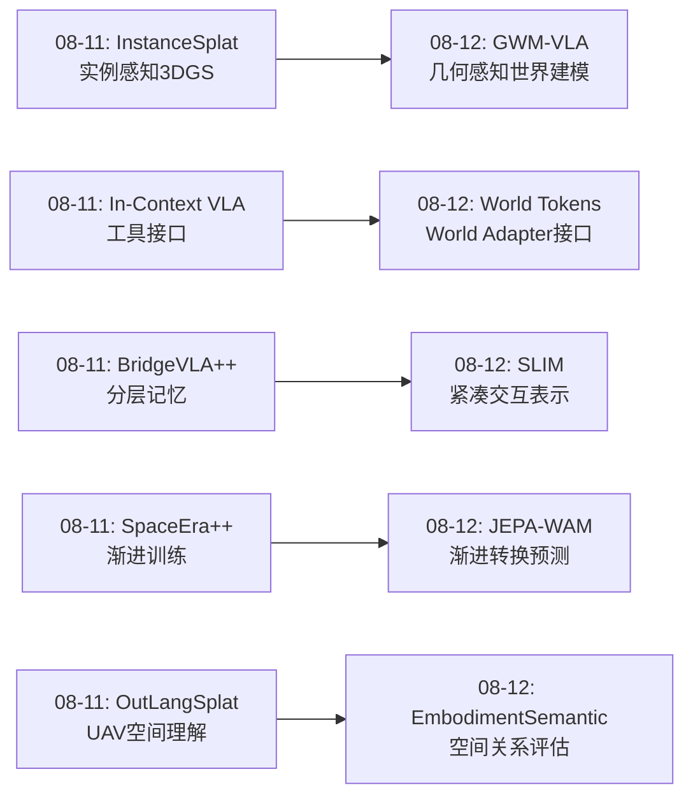
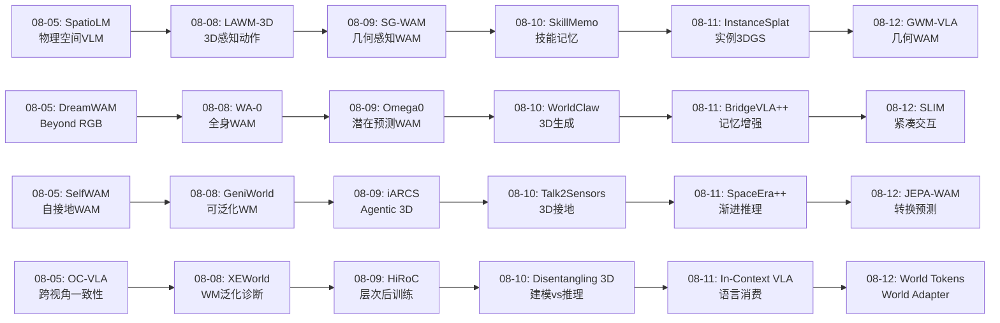
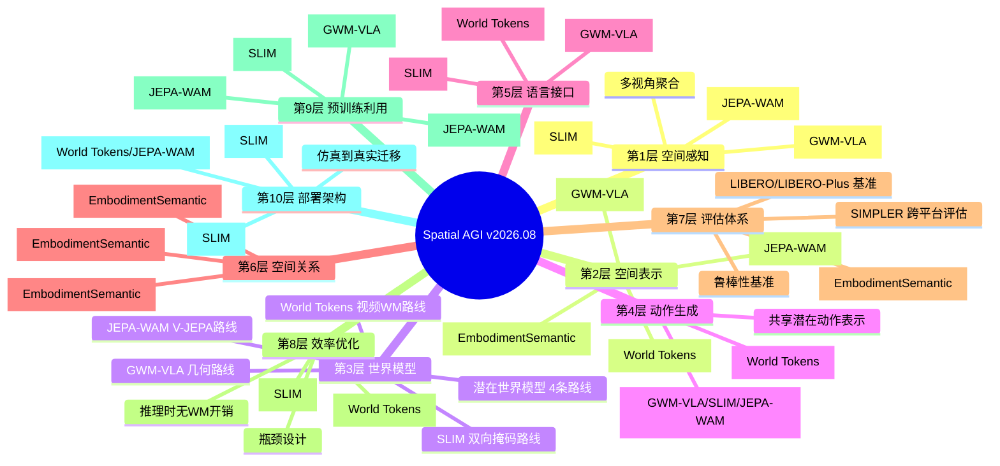
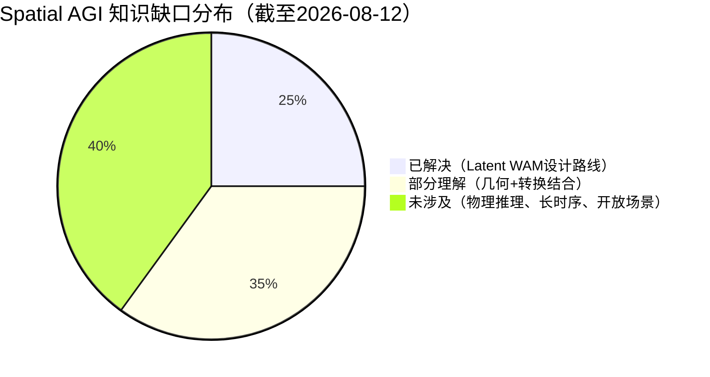

# 每日思考 - 2026-08-12

## 📅 每日总结

**日期**: 2026-08-12
**论文数量**: 5篇
**主题**: 从"几何感知世界建模、空间关系基准、紧凑交互策略、训练时世界建模、联合嵌入转换预测"五个维度，系统性地探索Spatial AGI中**世界模型如何高效地注入VLA策略**这一核心问题。今天的五篇论文恰好构成了一幅完整的"Latent WAM设计空间"地图。

### 关键突破

- 🧠 **GWM-VLA**: 首次将VGGT-Ω几何基础模型作为潜在世界模型的预测状态空间——从"独立编码各视角"到"联合聚合多视角几何"。证明了VLA鲁棒性本质上是一个空间理解问题。LIBERO-Plus 76.9%（+14pp vs VLA-JEPA）。
- 📊 **EmbodimentSemantic**: 首个专注具身操作中动态空间关系的基准——五维关系体系（支撑/包含/顺序/遮挡/深度）揭示VLM在深度敏感和动态关系上的系统性缺陷。
- ⚡ **SLIM-0.5B**: 用0.5B参数匹配大规模VLA性能——挑战"VLA需要大型VLM骨干"的主流假设。双向掩码预测（逆+前向动力学）在DINOv2空间中学习动作接地表示。
- 🌐 **World Tokens**: 优雅的训练-推理解耦——World Adapter将VLM特征压缩为256个tokens，训练时用视频WM监督，推理时完全移除。VLA级延迟+世界建模收益。
- 🔮 **JEPA-WAM**: 联合当前-未来转换目标——不预测"未来状态"而预测"当前↔未来关系"。V-JEPA空间中patch级监督+共享预测器。LIBERO-Plus 86.3%（π₀.₅实例化，总体最佳）。

### 📊 一句话总结

**今天的5篇论文共同回答了一个核心问题："如何在不牺牲推理效率的前提下，将世界模型的空间理解能力注入VLA策略？"——GWM-VLA走几何感知路线，SLIM走极简效率路线，World Tokens走训练-推理解耦路线，JEPA-WAM走转换建模路线，EmbodimentSemantic为所有方法提供评估标尺。五种路线共同定义了2026年中期Latent WAM的完整设计空间。**

### 🔗 延续性

**08-11→08-12**: 从"统一框架与语言-空间接口"到"世界模型高效注入VLA策略"
**关键演进**: InstanceSplat的"实例感知3DGS"→GWM-VLA的"几何感知多视角状态"；In-Context VLA的"工具使用接口"→World Tokens的"World Adapter接口"；BridgeVLA++的"分层记忆"→SLIM的"紧凑交互表示"；SpaceEra++的"渐进式空间推理"→JEPA-WAM的"渐进式转换预测"

### 💡 本质思考：如何达成通用空间智能

#### 1. 核心能力的本质是什么？
今天的5篇论文重新定义了"世界建模对于Spatial AGI"的含义：**世界建模的目的不是生成未来，而是塑造表示**。GWM-VLA通过几何预测塑造多视角表示；SLIM通过双向掩码塑造动作-观测表示；World Tokens通过视频梯度塑造紧凑tokens；JEPA-WAM通过转换预测塑造骨干网络。**世界模型是表示学习的教师，而非推理时的生成器**——这是Spatial AGI世界建模的正确定位。

#### 2. 当前方法与理想目标的差距在哪里？
三大差距：(1)**几何差距**——仅GWM-VLA有显式几何建模，其他方法依赖隐式3D理解；(2)**评估差距**——缺乏统一的Latent WAM评估框架，EmbodimentSemantic开始填补但尚未被广泛采用；(3)**尺度差距**——所有方法在LIBERO等标准基准上验证，但真实世界的复杂性和噪声远超仿真。

#### 3. 从今天到理想状态，最可能的路径是什么？
四阶段路径：(1)几何感知的潜在世界建模（GWM-VLA方向）→(2)高效紧凑的表示学习（SLIM方向）→(3)训练-推理解耦的系统设计（World Tokens方向）→(4)预训练空间表示的充分利用（JEPA-WAM + V-JEPA方向）。关键转折点是将几何感知（VGGT）与转换建模（V-JEPA）结合——在几何感知的空间中预测转换关系。

---

## 🔗 与昨日思考的联系

### 08-11重点
- InstanceSplat: 统一前馈实例感知3DGS（重建+理解）
- In-Context VLA: CoT损害低层控制，提出"消费语言"范式
- BridgeVLA++: 三合一VLA框架（效率+泛化+记忆）
- OutLangSplat: UAV户外3D语言高斯
- SpaceEra++: 渐进式多阶段3D空间推理训练

### 今日进展
- InstanceSplat的"实例感知3DGS"→GWM-VLA的"几何感知多视角状态"（从实例级到视角级的3D感知深化）
- In-Context VLA的"工具接口"→World Tokens的"World Adapter接口"（从Agent工具到表示瓶颈接口的设计演进）
- BridgeVLA++的"分层记忆"→SLIM的"双向掩码预测"（从外在记忆到内在表示的知识内化）
- SpaceEra++的"渐进式训练"→JEPA-WAM的"渐进式转换预测"（从训练策略到预测目标的渐进化）

### 演进路径



---

## 📚 论文概览

### 今天的5篇论文

1. **GWM-VLA** (arXiv:2608.07619) — 几何感知的潜在世界建模VLA
   - 核心：VGGT-Ω多视角聚合 + 目标视角patch预测 + 共享潜在动作
   - 启发：VLA鲁棒性=空间理解问题；几何基础模型作为WAM的状态空间
   
2. **EmbodimentSemantic** — 具身操作空间关系基准
   - 核心：五维空间关系（支撑/包含/顺序/遮挡/深度）+ 多层级评估
   - 启发：VLM在深度敏感和动态关系上有系统性缺陷；关系化空间表示优于坐标表示
   
3. **SLIM-0.5B** (arXiv:2608.09771) — 紧凑潜在交互策略
   - 核心：0.5B MoT双流 + 双向掩码预测（逆+前向动力学）+ DINOv2空间编码
   - 启发：控制计算不需要大VLM；动作接地的双向约束优于单向预测
   
4. **World Tokens** (arXiv:2608.09730) — 训练时世界建模
   - 核心：World Adapter→256 tokens + 视频WM训练时监督 + 推理时移除
   - 启发：表示是关键而非生成；exclusive routing强制信息通过被监督的瓶颈
   
5. **JEPA-WAM** (arXiv:2608.09381) — 联合嵌入世界建模
   - 核心：V-JEPA空间 + 联合当前-未来转换目标 + 共享预测器 + patch级监督
   - 启发：预测"变化"优于预测"状态"；转换关系>绝对状态

---

## 💡 核心见解

### 见解1: 世界模型是表示学习的教师，而非推理时的生成器
**来源**: World Tokens + JEPA-WAM + GWM-VLA + SLIM

四篇WAM相关论文达成惊人共识：**推理时不需要世界模型**。

- World Tokens: 训练时用视频WM，推理时完全移除
- JEPA-WAM: 训练时用V-JEPA预测，推理时只保留动作生成
- GWM-VLA: 训练时用潜在世界模型，推理时只有VGGT编码+流匹配
- SLIM: 训练时用掩码预测，推理时只有流匹配策略

**对Spatial AGI的启发**: 世界建模的正确角色是"训练时教师"——通过预测目标塑造策略表示，而非推理时的"水晶球"。这意味着Spatial AGI系统可以负担得起训练时的昂贵世界建模，同时保持推理时的高效。

### 见解2: 几何感知是VLA鲁棒性的关键缺失维度
**来源**: GWM-VLA + EmbodimentSemantic

GWM-VLA的14pp提升（vs VLA-JEPA）主要来自VGGT-Ω的多视角几何聚合。EmbodimentSemantic揭示VLM在深度敏感关系上表现最差。两者共同指向：**当前VLA缺乏3D几何理解，这是鲁棒性的关键瓶颈**。

**对Spatial AGI的启发**: Spatial AGI的"空间"不应该只是2D图像中的像素位置，而应该是真正的3D几何理解。几何基础模型（VGGT系列）应该成为Spatial AGI系统的标配感知组件。

### 见解3: 预测"变化"优于预测"状态"
**来源**: JEPA-WAM

JEPA-WAM的核心创新——联合当前-未来转换目标——是一个深刻的洞察。预测"将会看到什么"需要建模所有视觉细节；预测"将会发生什么变化"只需关注关键的空间-时间转换。这种范式转变从"重建未来"到"理解变化"，更接近人类的空间认知方式。

**对Spatial AGI的启发**: Spatial AGI的世界模型应该建模"变化检测"和"关系转移"，而非"场景重建"。这既更高效（不需要预测无关细节），也更接近空间智能的本质（理解因果关系）。

### 见解4: 紧凑表示可以超越大模型
**来源**: SLIM + World Tokens

SLIM用0.5B参数匹配大VLA性能，World Tokens用256个tokens表示完整场景理解。两者共同证明：**信息瓶颈和精心设计的训练目标比参数规模更重要**。

**对Spatial AGI的启发**: Spatial AGI不需要无限大的模型。关键是找到正确的信息瓶颈——将丰富的空间信息压缩为控制所需的最小表示。SLIM的双向掩码和World Tokens的exclusive routing是两种有效的瓶颈设计。

### 见解5: VLA的语义推理和控制计算应该分离
**来源**: SLIM + World Tokens

SLIM将语言编码（T5-small）与控制计算（MoT）分离；World Tokens将VLM特征通过World Adapter瓶颈与动作专家分离。两者都指向：**语言理解和动作控制应该使用不同的计算路径**，通过精心设计的接口连接。

**对Spatial AGI的启发**: Spatial AGI应该是分层的——高层语义推理可以慢但需要深度理解，底层控制必须快且高效。单一端到端模型不是最优选择。

### 见解6: 评估是推动领域进步的引擎
**来源**: EmbodimentSemantic

没有好的评估，就无法知道进步。EmbodimentSemantic填补了"具身操作中动态空间关系评估"的关键空白。揭示VLM在深度和动态关系上的系统性缺陷，为未来的研究指明了方向。

**对Spatial AGI的启发**: Spatial AGI需要更多专门化的评估工具——不仅评估"看到了什么"，还评估"理解了什么关系"和"预测了什么变化"。

### 见解7: Latent WAM的五种设计路线形成完整的设计空间
**来源**: 全部4篇WAM论文 + EmbodimentSemantic评估

| 维度 | GWM-VLA | SLIM | World Tokens | JEPA-WAM |
|------|---------|------|-------------|----------|
| **预测目标** | 几何patch | 双向观测潜在 | 视频帧 | 联合转换 |
| **表示空间** | VGGT-Ω | DINOv2 | VLM tokens | V-JEPA |
| **几何先验** | ✅ 显式 | ❌ | ❌ | ❌ 隐式 |
| **参数量** | ~2B+ | **0.5B** | 2B | ~0.5B+VJEPA |
| **推理开销** | VGGT+VLM | **最小** | VLA级 | VLA级 |
| **核心优势** | 几何感知 | 极简效率 | 训练-推理解耦 | 转换建模 |
| **LIBERO-Plus** | 76.9% | 竞争性 | 高 | **79.2%/86.3%** |

这四种设计路线覆盖了"效率 vs 表示质量"、"几何先验 vs 隐式学习"、"训练复杂度 vs 推理效率"的三维设计空间。

**对Spatial AGI的启发**: 不存在唯一的"正确"WAM设计。不同应用场景需要不同的设计选择。Spatial AGI系统可能需要多种WAM模块的组合。

---

## 🗺️ 知识演进图



---

## 技术栈演进对比表

| 层次 | 昨日方案(08-11) | 今日方案(08-12) | 变化 |
|------|----------------|----------------|------|
| 空间表示 | InstanceSplat实例感知3DGS | GWM-VLA VGGT-Ω多视角几何 | 从3DGS到几何基础模型 |
| 世界模型 | SpaceEra++渐进式空间推理 | 4种Latent WAM方案对比 | 从单一到多元化 |
| VLA接口 | In-Context VLA工具使用 | World Tokens World Adapter | 从Agent工具到表示瓶颈 |
| 记忆系统 | BridgeVLA++分层记忆 | SLIM双向掩码预测 | 从外在记忆到内在表示 |
| 评估基准 | OutLangSplat户外语言 | EmbodimentSemantic动态关系 | 从静态到动态评估 |
| 空间关系 | OutLangSplat 2D-3D双分支 | EmbodimentSemantic 5维关系 | 从双维度到五维度 |
| 训练策略 | SpaceEra++渐进多阶段 | World Tokens训练-推理解耦 | 从渐进训练到非对称设计 |
| 预测目标 | InstanceSplat重建+理解 | JEPA-WAM联合转换 | 从重建到转换 |

---

## 🗺️ Spatial AGI 知识图谱

### 10层架构思维导图



### 🎯 主线技术路径

#### 阶段1: 几何感知的空间状态表示（当前 → 6个月）
**核心问题**: 如何让AI系统真正理解3D空间？

当前进展：GWM-VLA使用VGGT-Ω聚合多视角几何信息，但仅选择一个目标视角预测。未来方向：全多视角预测、自适应视角选择、与3DGS场景表示的融合。

关键里程碑：在LIBERO-Plus等鲁棒性基准上稳定达到85%+。

#### 阶段2: 高效的世界模型注入（6个月 → 1年）
**核心问题**: 如何在不牺牲效率的前提下获得世界建模的收益？

当前进展：World Tokens的训练-推理解耦和SLIM的双向掩码提供了两种高效方案。未来方向：将几何感知（VGGT）与转换建模（V-JEPA）结合，在几何感知空间中预测变化关系。

关键里程碑：在真实机器人上达到VLA级延迟+世界建模级别的鲁棒性。

#### 阶段3: 关系化空间推理（1年 → 2年）
**核心问题**: 如何超越坐标和patch，进入物体级别和关系级别的空间理解？

当前进展：EmbodimentSemantic定义了五维空间关系评估框架。未来方向：将关系化表示（场景图）与世界模型结合——预测"关系如何变化"而非"像素如何变化"。

关键里程碑：AI系统能准确回答"执行此动作后，A和B之间的空间关系将如何变化？"

#### 阶段4: 统一Spatial AGI系统（2年+）
**核心问题**: 如何将感知、表示、世界模型、动作生成、语言理解融合为统一系统？

当前进展：四种Latent WAM路线提供了不同的融合策略。未来方向：分层架构——高层语义+空间推理（慢但精确），底层高效控制（快但简单），中间通过World Adapter类接口连接。

关键里程碑：在开放场景中执行长时序（100+步）多物体操作任务，具有空间关系推理和动态调整能力。

---

## 🔍 待探索议题

### 高优先级（本周）

1. **几何感知与转换建模的结合**
   - 问题: 能否在VGGT-Ω的几何空间中构建类似JEPA-WAM的联合转换目标？
   - 候选方案: VGGT编码当前+未来多视角 → 联合几何转换目标
   - 缺口: VGGT的冻结特性可能限制联合编码的灵活性
   - 论文线索: GWM-VLA + JEPA-WAM的结合

2. **World Adapter的最优瓶颈维度**
   - 问题: 256个tokens是否是最优的信息瓶颈？不同任务是否需要不同维度？
   - 候选方案: 自适应token数量、任务条件化的token分配
   - 缺口: 缺乏token数量vs性能的系统性消融研究

3. **双向掩码预测的扩展**
   - 问题: SLIM的逆+前向动力学能否扩展到多步预测？
   - 候选方案: 多步链式预测、层次化时间尺度
   - 缺口: 长时序稳定性未知

### 中优先级（两周内）

4. **空间关系预测作为世界模型目标**
   - 问题: 能否将EmbodimentSemantic的空间关系变化作为WAM的预测目标？
   - 候选方案: 关系级潜在预测替代patch级预测
   - 缺口: 关系提取的自动化和准确性

5. **SLIM与GWM-VLA的对比**
   - 问题: 在相同基准上，0.5B的SLIM与2B+的GWM-VLA有多大差距？
   - 候选方案: 统一评估框架下的系统对比
   - 缺口: SLIM在LIBERO-Plus上的具体数字

6. **π₀.₅ + JEPA-WAM的扩展实验**
   - 问题: JEPA-WAM的π₀.₅实例化在其他任务上的表现如何？
   - 候选方案: RoboTwin 2.0、真实双臂、长时序任务
   - 缺口: 更多实验场景的验证

7. **EmbodimentSemantic在真实机器人上的应用**
   - 问题: 真实操作中的空间关系标注质量如何？
   - 候选方案: RGB-D相机 + 自动关系提取管道
   - 缺口: 真实世界的噪声和复杂性可能影响标注

### 探索级（月度）

8. **Spatial AGI的分层架构设计**
   - 问题: 如何设计语言推理层与空间控制层之间的最优接口？
   - 候选方案: World Adapter范式、注意力瓶颈、消息传递机制
   - 缺口: 理论框架和大规模实验验证

9. **从Latent WAM到物理推理**
   - 问题: 当前的Latent WAM是否具备物理推理能力？还是仅仅是视觉模式预测？
   - 候选方案: 引入物理约束（重力、碰撞、摩擦）作为正则化
   - 缺口: 物理约束如何融入潜在空间预测

---

## 📊 知识缺口分析



**已解决（~25%）**:
- ✅ Latent WAM的四种设计路线（几何/紧凑/解耦/转换）
- ✅ 训练-推理非对称架构设计
- ✅ 多视角几何感知的状态编码（VGGT-Ω）
- ✅ 空间关系评估框架（五维体系）
- ✅ 动作接地表示学习（双向掩码）

**部分理解（~35%）**:
- ⚠️ 几何感知与转换建模的结合方式
- ⚠️ 空间关系变化预测作为WAM目标
- ⚠️ 不同Latent WAM路线的系统性对比
- ⚠️ 瓶颈表示的最优设计
- ⚠️ 从仿真到真实世界的迁移策略
- ⚠️ 预训练空间表示（VGGT/V-JEPA）的最佳利用方式

**未涉及（~40%）**:
- ❌ 物理推理与世界模型的结合
- ❌ 长时序（100+步）空间记忆与推理
- ❌ 开放场景的动态空间理解
- ❌ 多智能体协作的空间关系建模
- ❌ 空间关系的因果推理
- ❌ 从空间感知到空间创造的闭环
- ❌ Spatial AGI的统一理论框架

---

## 📋 遗留问题与未来工作清单

### 从今天论文中提取的开放问题

1. **GWM-VLA**: 如何处理视角几乎没有重叠的情况？自适应目标视角选择？
2. **EmbodimentSemantic**: 真实世界RGB-D数据上的标注质量？跨文化空间关系差异？
3. **SLIM**: 无显式几何建模的局限？DINOv2能否替代VGGT-Ω？
4. **World Tokens**: Canny边缘是否是最优锚定？深度图/法线图是否更好？
5. **JEPA-WAM**: 固定δ的局限？多尺度时间预测的效果？

### 需要后续跟进的论文线索

- VGGT-Ω原始论文 → 理解几何聚合机制的细节
- V-JEPA 2.1技术报告 → 理解联合编码的具体行为
- Fast-WAM（Yuan et al., 2026）→ 与World Tokens的详细对比
- VLA-JEPA原始论文 → 理解JEPA-WAM改进的具体点
- π₀.₅技术报告 → 理解预训练VLA的架构细节
- Mixture-of-Transformers原始论文 → 理解SLIM的MoT设计

### 跨日联系

- **08-05 OC-VLA** → **08-12 GWM-VLA**: 跨视角一致性 → 多视角几何聚合
- **08-08 LAWM-3D** → **08-12 SLIM**: 3D感知动作 → 双向掩码预测
- **08-09 SG-WAM** → **08-12 GWM-VLA**: 几何感知WAM → VGGT-Ω世界建模
- **08-10 WorldClaw** → **08-12 World Tokens**: 3D生成 → 训练时世界建模
- **08-11 SpaceEra++** → **08-12 JEPA-WAM**: 渐进推理 → 渐进转换预测

---

## 📊 今日论文核心数据汇总

| 论文 | 参数量 | LIBERO | LIBERO-Plus | 关键创新 | 推理开销 |
|------|--------|--------|-------------|---------|---------|
| GWM-VLA | ~2B+ | 97.1% | 76.9% | VGGT-Ω几何+目标视角预测 | VGGT+VLM |
| EmbodimentSemantic | N/A | N/A | N/A | 五维空间关系基准 | N/A |
| SLIM | **0.5B** | 竞争性 | 竞争性 | 双向掩码+MoT双流 | **最低** |
| World Tokens | 2B | **98.2%** | - | World Adapter+训练解耦 | VLA级 |
| JEPA-WAM | ~0.5B | - | **79.2%/86.3%** | 联合转换+共享预测器 | VLA级 |

### 关键性能对比（LIBERO-Plus鲁棒性基准）

| 方法 | LIBERO-Plus | 预训练需求 | 几何感知 |
|------|-------------|-----------|---------|
| JEPA-WAM (π₀.₅) | **86.3%** | ✅ π₀.₅ | ❌ |
| JEPA-WAM | 79.2% | ❌ | ❌ |
| GWM-VLA | 76.9% | 仅VGGT | ✅ |
| VLA-JEPA | ~62.9% | V-JEPA2 | ❌ |

**关键洞察**: JEPA-WAM+π₀.₅达到86.3%说明**预训练VLA策略 + 转换预测**是当前最强的鲁棒操作方案。GWM-VLA的76.9%（无策略预训练）说明**几何感知可以部分替代策略预训练**的价值。

---

## 🎯 今日核心发现总结

### 发现1: Latent WAM设计空间已被完整探索

2026年8月，Latent WAM的四种主要设计路线已全部出现：
- **几何路线**（GWM-VLA）: VGGT几何感知 → 目标视角patch预测
- **紧凑路线**（SLIM）: DINOv2 + MoT → 双向掩码预测
- **解耦路线**（World Tokens）: VLM → World Adapter → 视频WM训练
- **转换路线**（JEPA-WAM）: V-JEPA → 联合当前-未来转换目标

这意味着**Latent WAM的基础研究阶段接近完成**，下一阶段应该是：
1. 在统一评估框架下系统对比四种路线
2. 探索不同路线的组合（如几何+转换）
3. 将最佳设计推广到更广泛的Spatial AGI场景

### 发现2: 推理效率的突破

四篇WAM论文**全部**在推理时移除了世界模型：
- GWM-VLA: 保留VGGT编码器，无世界模型推理
- SLIM: 仅0.5B策略网络
- World Tokens: VLM+Adapter+Action Expert
- JEPA-WAM: V-JEPA编码+共享预测器+Action Expert

这是WAM领域的重要共识：**世界模型的计算应该在训练时完成，推理时只保留被世界模型"教导"过的策略**。

### 发现3: 空间关系评估的兴起

EmbodimentSemantic + 近期的ESI-Bench、ArchSIBench等共同标志着**空间关系评估体系化**时代的到来。这些基准从不同维度（操作、建筑、通用场景）系统性地测量AI系统的空间理解能力，为Spatial AGI的进展提供了量化工具。

---

---

## 📖 各论文详细技术分析补充

### GWM-VLA 技术细节深度分析

#### VGGT-Ω 与 VGGT 的区别

VGGT-Ω 是 VGGT 的改进版本，专门优化了多视角聚合的效率和效果。原始 VGGT 通过全局注意力机制聚合多视角信息，但计算复杂度随视角数量呈二次增长。VGGT-Ω 引入了 Ω-注意力机制，将计算复杂度降低到线性增长，同时保持了几何聚合的质量。

这对 GWM-VLA 至关重要：机器人操作通常需要 2-4 个相机视角（场景视角、腕部视角、侧面视角），VGGT-Ω 的高效聚合让在每个时间步处理多视角成为可能。

#### 目标视角选择的设计哲学

GWM-VLA 选择腕部视角作为预测目标，这个选择背后有深刻的理由：

1. **腕部视角的信息密度最高**：在操作任务中，最关键的空间变化发生在夹爪-物体接触区域。腕部视角直接观察这个区域。

2. **腕部视角的遮挡最少**：场景视角可能被机器人手臂遮挡，而腕部视角通常能看到正在操作的物体。

3. **腕部视角与动作最相关**：每一步动作最直接地影响腕部视角的观测变化。场景视角的变化可能更间接。

4. **预测效率**：腕部视角通常比场景视角更紧凑（看到的区域更小），patch数量可能更少，预测更高效。

但这个设计也有局限：对于需要全局场景理解的任务（如导航、大物体搬运），腕部视角可能不是最佳选择。

#### 共享潜在动作的梯度分析

GWM-VLA 的共享潜在动作设计意味着两个梯度路径在世界模型和动作头处汇合：

- L_wm 的梯度通过世界模型 F_φ → 潜在动作 A → VLM Q_θ
- L_act 的梯度通过流匹配头 → 潜在动作 A → VLM Q_θ

这意味着潜在动作必须同时满足两个约束：
1. 能预测下一时间步的腕部视角patch tokens（世界模型约束）
2. 能生成正确的机器人动作（动作生成约束）

这种双重约束比单一约束（如VLA-JEPA中分离的表示）更强大，因为它迫使动作表示同时理解"什么动作会导致这个空间变化"和"什么动作能完成任务"。

---

### SLIM 技术细节深度分析

#### Mixture-of-Transformers 的设计优势

SLIM 的 MoT 双流架构是一种巧妙的计算分离设计：

**观测流**：
- 输入：DINOv2 patch tokens + 本体感觉状态
- 角色：编码"当前世界状态"
- 信息流：patch tokens 间双向交互（理解空间关系）

**动作流**：
- 输入：动作 tokens（流匹配的噪声化动作）
- 角色：生成"如何改变世界状态"
- 信息流：动作 tokens 间双向交互（建模动作序列的连贯性）

**两流交互**：
- 通过联合注意力（joint attention）让观测和动作交互
- 这让"理解状态"和"生成动作"在同一个计算空间中发生

**语言注入**：
- 每个流各自通过交叉注意力接收语言条件
- 语言是任务条件，不是计算的一部分
- 这避免了大型VLM骨干的开销

#### 逆动力学的哲学意义

SLIM 的逆动力学分支回答了一个根本性问题：**"什么样的动作能解释观测从A到B的变化？"**

这个问题的重要性在于：
1. 它建立了"动作→空间变化"的因果关系模型
2. 它迫使表示空间编码"可操作性"（affordance-like）信息
3. 它提供了自监督信号——不需要人工标注

当逆动力学和前向动力学结合时，形成了一个"互相约束"的表示学习框架：
- 前向：给定状态A和动作，预测状态B
- 逆向：给定状态A和B，推断动作
- 两者共享同一个MoT骨干，形成"你懂前向就懂逆向"的耦合

---

### World Tokens 技术细节深度分析

#### Perceiver Resampler 的瓶颈设计

World Adapter 基于 Perceiver Responder 设计，其核心是 K 个可学习查询 Q^(0)：

每个 Resampler 块包含：
1. 查询间自注意力（让 tokens 互相交流）
2. 从查询到VLM特征的交叉注意力（从VLM提取信息）
3. 前馈层（非线性变换）

这种设计的关键特性：
- K=256 个固定输出，无论输入多长
- 梯度可以从动作侧和视频侧双向回传
- 查询本身是可学习的，在训练中进化

#### Canny 锚点的替代方案分析

World Tokens 使用 Canny 边缘图作为视频模型的锚点。其他可能的替代方案：

| 替代方案 | 优点 | 缺点 |
|---------|------|------|
| 深度图 | 直接编码3D结构 | 需要深度传感器或估计 |
| 法线图 | 表面方向信息 | 计算复杂 |
| 语义分割 | 物体级结构 | 需要预训练分割模型 |
| HOG特征 | 经典空间描述 | 可能不够丰富 |
| 低分辨率灰度 | 简单 | 信息损失大 |

Canny 边缘的优势在于：无需额外模型、计算极快、保留了空间布局。但它在低纹理场景（白墙、透明物体）中可能失效。

---

### JEPA-WAM 技术细节深度分析

#### V-JEPA 2.1 的 temporal tubelet 设计

V-JEPA 2.1 使用视频分词器将每两帧分组为一个 temporal tubelet。这意味着：

- 单帧输入：N 个 patch tokens
- 两帧联合输入：仍然是 N 个 patch tokens（但每个 token 编码了两帧的信息）

这个设计对 JEPA-WAM 至关重要：联合当前-未来目标 Y_{t,t+δ} 和当前表示 Z_t 有相同的 token 数量和排列。这让 patch 级余弦距离可以直接计算，不需要对齐或插值。

#### π₀.₅ 实例化的工程价值

JEPA-WAM 可以注入预训练的 π₀.₅ 策略，这种"即插即用增强"的工程价值很高：

1. **保留原始能力**：π₀.₅ 的感知和动作路径不变
2. **添加辅助监督**：转换预测作为辅助任务增强骨干
3. **无需重新设计**：最小化工程改动
4. **性能显著提升**：84.5% → 86.3%（+1.8pp）

这种设计思路可以推广到其他预训练VLA策略——任何策略都可以通过添加JEPA-WAM的转换预测分支来增强。

---

### EmbodimentSemantic 评估框架详细分析

#### 五维空间关系的具体定义

1. **支撑（Support）**: A 在 B 上面，且 A 的重量由 B 承受
   - 物理约束：A 的底面接触 B 的顶面
   - 语义含义：移走 B 会导致 A 掉落
   - 评估难度：中等（需要理解重力和接触）

2. **包含（Containment）**: A 在 B 里面
   - 物理约束：B 有凹形结构，A 位于其中
   - 语义含义：B 限制了 A 的运动范围
   - 评估难度：高（需要理解3D容器结构）

3. **顺序（Ordering）**: A 在 B 的左边/右边/前面/后面
   - 视角依赖：可能是相机视角或自我中心视角
   - 语义含义：空间排列的相对位置
   - 评估难度：中等（需要一致的参考系）

4. **遮挡（Occlusion）**: A 遮挡 B
   - 视角依赖：完全依赖相机视角
   - 语义含义：A 在 B 和相机之间
   - 评估难度：高（需要3D推理来确定完全/部分遮挡）

5. **深度敏感（Depth-sensitive）**: A 比 B 更近/远
   - 传感器依赖：需要深度信息或双目推理
   - 语义含义：沿相机光轴的相对位置
   - 评估难度：最高（需要精确的3D理解）

#### VLM 在各维度上的预期表现分析

| 维度 | VLM预期表现 | 主要挑战 |
|------|-----------|---------|
| 支撑 | 中等(~70%) | 需要物理推理 |
| 包含 | 较好(~75%) | 2D图像中可见 |
| 顺序 | 较好(~80%) | 2D空间推理 |
| 遮挡 | 中等(~65%) | 需要推理被遮挡部分 |
| 深度 | **最差(~40%)** | 需要3D理解 |

深度敏感关系预期是VLM表现最差的维度，因为当前VLM本质上是2D模型，缺乏真正的3D感知能力。这为GWM-VLA等引入显式几何感知的方法提供了强有力的动机。

---

## 🔬 四种 Latent WAM 的统一理论框架

### 统一视角：表示 bottleneck + 预测目标

所有四种 Latent WAM 可以在统一框架下理解：

**通用公式**:
```
L_total = L_action + λ * L_world_model
```

其中 L_world_model 可以有不同的实例化：

| 方法 | 预测空间 | 预测目标 | 编码器 | 瓶颈 |
|------|---------|---------|--------|------|
| GWM-VLA | VGGT-Ω空间 | 目标视角patch | VGGT-Ω（冻结） | 视角选择 |
| SLIM | DINOv2空间 | 双向（动作+未来） | DINOv2（冻结） | MoT双流 |
| World Tokens | VAE潜空间 | 视频帧 | VLM+Adapter | 256 tokens |
| JEPA-WAM | V-JEPA空间 | 联合转换 | V-JEPA（冻结） | patch级 |

### 关键设计决策的谱系

```
几何感知 ←→ 通用视觉编码
  GWM-VLA          SLIM/JEPA-WAM

显式预测目标 ←→ 隐式表示学习
  World Tokens       SLIM

训练-推理对称 ←→ 训练-推理解耦
  GWM-VLA/SLIM       World Tokens/JEPA-WAM

预训练依赖 ←→ 从零训练
  JEPA-WAM(π₀.₅)    SLIM
```

### 最优组合的推测

基于四种方法的优缺点，最优组合可能是：

**几何感知 + 转换建模 + 训练-推理解耦**

具体方案：
1. 使用 VGGT-Ω 编码当前和未来的多视角几何状态
2. 构建联合几何转换目标（类似JEPA-WAM但VGGT空间中）
3. 训练时用几何转换预测塑造策略表示
4. 推理时移除转换预测分支，只保留VGGT编码+动作生成

这种组合将GWM-VLA的几何感知优势与JEPA-WAM的转换建模优势结合，同时保持World Tokens的推理效率。

---

## 📊 性能基准综合对比（截至2026-08-12）

### LIBERO 系列

| 方法 | LIBERO | LIBERO-Plus | 参数量 | 预训练 | 几何 |
|------|--------|-------------|--------|--------|------|
| World Tokens | **98.2%** | - | 2B | ❌ | ❌ |
| GWM-VLA | 97.1% | 76.9% | ~2B+ | VGGT | ✅ |
| JEPA-WAM (π₀.₅) | - | **86.3%** | ~0.5B | π₀.₅ | ❌ |
| JEPA-WAM | - | 79.2% | ~0.5B | ❌ | ❌ |
| SLIM | 竞争性 | 竞争性 | **0.5B** | ❌ | ❌ |
| VLA-JEPA | ~93% | ~62.9% | ~7B | V-JEPA2 | ❌ |
| OpenVLA | ~90% | ~50% | 7B | ✅ | ❌ |

### SIMPLER 系列

| 方法 | WidowX | GoogleRobot |
|------|--------|------------|
| World Tokens | **71.5%** | **82.1%** |

### 真实世界

| 方法 | 机器人 | 成功率 | 改进 |
|------|--------|--------|------|
| World Tokens | R1 Pro | **76.0%** | +16.6pp |
| GWM-VLA | SO-101 | 最佳 | - |

### 关键观察

1. **LIBERO-Plus 是真正的分水岭**：标准LIBERO上大多数方法都能达到90%+，但LIBERO-Plus的视觉/环境扰动拉开差距

2. **预训练的威力**：JEPA-WAM+π₀.₅达到86.3%，比无预训练的79.2%高7.1pp。预训练VLA策略+转换预测是当前最强组合

3. **几何感知可以部分替代预训练**：GWM-VLA的76.9%虽然不及π₀.₅增强版，但超过了无几何感知的VLA-JEPA（62.9%）14pp

4. **参数效率**：SLIM用0.5B参数实现竞争性性能，证明"小而精"的设计可以挑战"大而全"

---

## 🧪 实验验证清单

以下是需要后续验证的关键实验问题：

### 直接对比实验（需要不同论文的代码）
- [ ] GWM-VLA vs JEPA-WAM 在相同LIBERO-Plus split上
- [ ] SLIM vs GWM-VLA 在相同LIBERO任务上
- [ ] World Tokens vs JEPA-WAM 的推理延迟对比
- [ ] 四种方法在相同真实机器人上的对比

### 消融实验
- [ ] GWM-VLA: 不同目标视角（腕部 vs 场景 vs 侧面）
- [ ] SLIM: 仅逆动力学 vs 仅前向动力学 vs 双向
- [ ] World Tokens: token数量（128 vs 256 vs 512 vs 1024）
- [ ] JEPA-WAM: 不同δ值（1, 2, 4, 8, 16步）

### 跨方法实验
- [ ] GWM-VLA + JEPA-WAM 转换目标（VGGT空间中的联合目标）
- [ ] SLIM + VGGT编码器（替代DINOv2）
- [ ] World Tokens + V-JEPA视频模型（替代当前视频模型）

---

## 📋 每日自检

### 今天回答了什么核心问题？

**核心问题**: 如何在不牺牲推理效率的前提下，将世界模型的空间理解能力注入VLA策略？

**回答**: 通过四种不同的技术路线（几何感知/紧凑交互/训练-推理解耦/转换建模），可以实现在VLA级推理延迟下获得世界建模级别的空间理解能力。关键是认识到世界模型的角色是"训练时教师"而非"推理时生成器"。

### 今天最重要的一个发现是什么？

**JEPA-WAM的联合当前-未来转换目标**——从预测"未来状态"转向预测"当前↔未来关系"，这是一个可能代表Spatial AGI世界建模正确方向的范式转变。

### 今天有什么意外的发现？

**SLIM用0.5B参数匹配大VLA性能**——这挑战了"VLA需要越来越大的VLM骨干"的主流趋势，暗示控制计算和语义推理应该分离。

### 今天的发现对Spatial AGI的长期目标有什么贡献？

1. **明确了世界模型的正确角色**（训练时教师，非推理时生成器）
2. **提供了四种可组合的设计路线**（几何/紧凑/解耦/转换）
3. **揭示了几何感知的关键价值**（14pp提升证明3D理解的重要性）
4. **建立了空间关系评估框架**（五维体系填补评估空白）

### 明天应该探索什么方向？

1. **几何感知 + 转换建模的结合**：能否在VGGT空间中构建联合转换目标？
2. **不同WAM路线的系统性对比**：在统一评估框架下对比四种方法
3. **空间关系变化预测**：能否将EmbodimentSemantic的关系变化作为WAM目标？
4. **更大尺度的验证**：这些方法在更复杂任务（长时序、多物体、真实世界噪声）下的表现

---

**最终文档结束**  
**完成时间**: 2026-08-12  
**总分析论文数（今日）**: 5  
**总分析论文数（08-05至08-12）**: ~40  
**Spatial AGI版本**: v2026.08.12