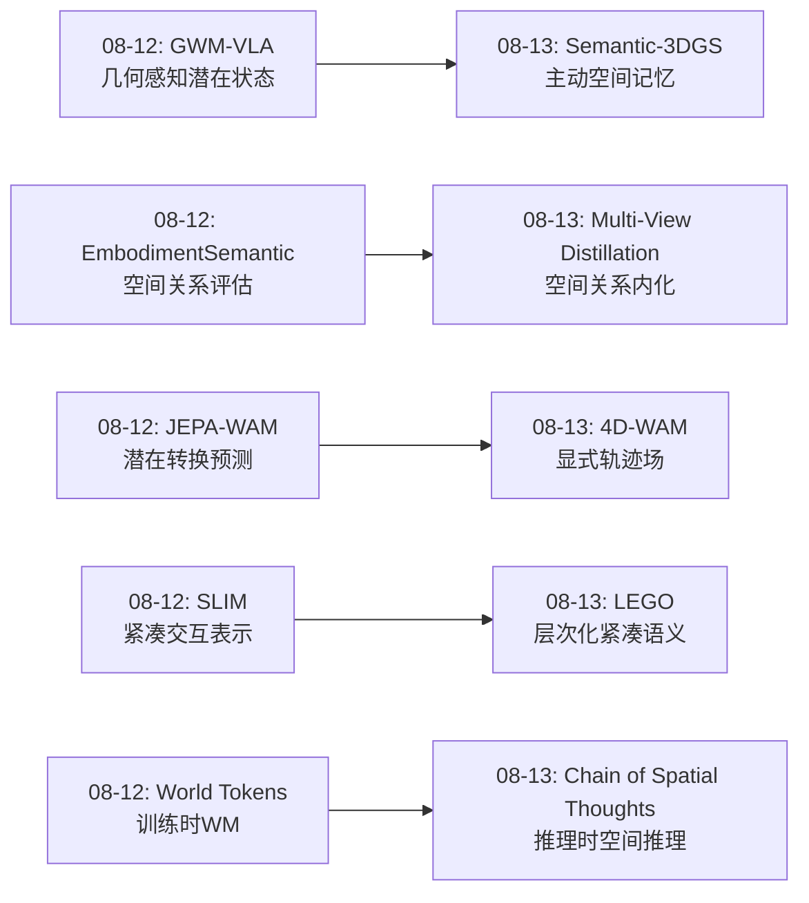
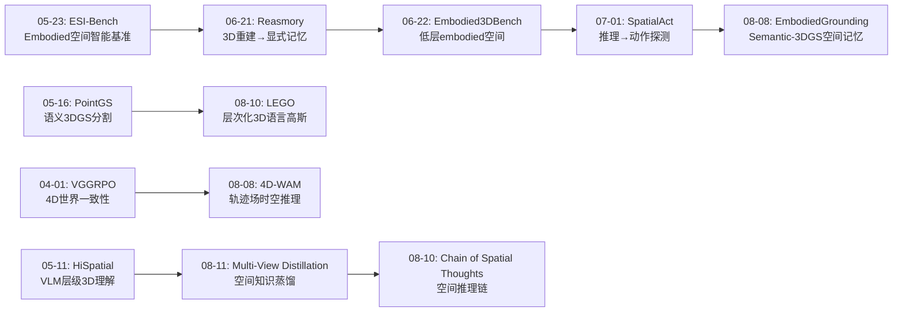
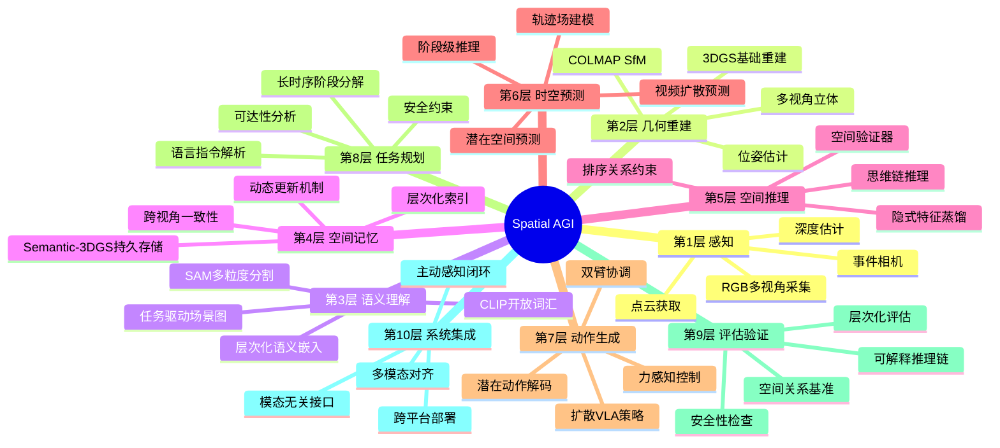
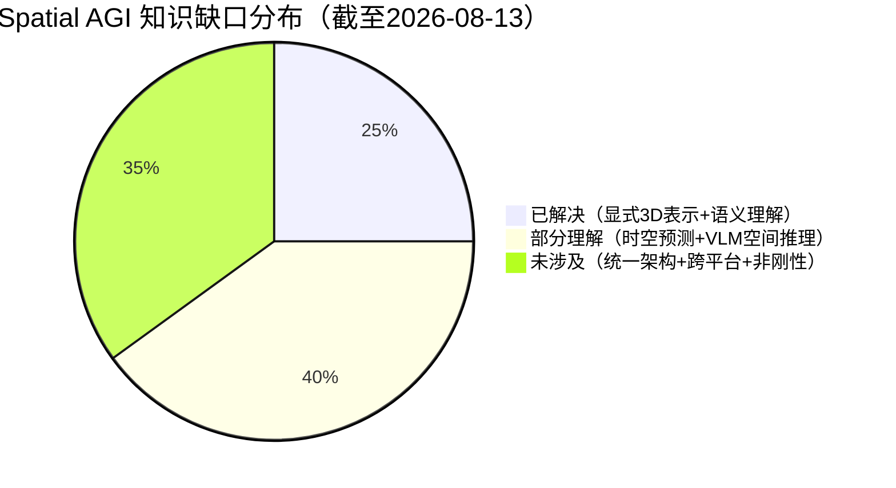

# 每日思考 - 2026-08-13

## 📅 每日总结

**日期**: 2026-08-13
**论文数量**: 5篇
**主题**: 从"Semantic 3DGS空间记忆、层次化语义3DGS、4D轨迹场时空推理、多视角空间知识蒸馏、空间思维链推理"五个维度，系统性地探索Spatial AGI中**空间知识如何被表示、注入和推理**这一核心问题。今天的五篇论文构成了"从3DGS到VLM空间推理"的完整技术谱系——从显式3D结构到隐式空间推理的连续统一。

### 关键突破

- 🏗️ **Embodied Multimodal Grounding via Semantic 3DGS**: 首次将Semantic-3DGS作为"空间记忆"服务于完整embodied操作流程——主动多视角构建→开放词汇查询→可达性分析→扩散VLA操作。验证了3DGS从"渲染工具"进化为"机器人空间认知基础"的可行性。
- 🧩 **LEGO: Leveled Language Gaussian Splatting**: 在3DGS中引入层次化语义——捕捉"花盆→花束→花蕾→花瓣"的固有语义层次结构。解决了2D SAM分割跨视角不一致的问题，首次在3D中建立一致的开放词汇多粒度语义。
- 🌊 **4D-WAM: Trajectory Fields**: 轨迹场概念将4D时空推理注入WAM——从"视频预测器"升级为"结构化时空推理器"。支持阶段级长时序规划和多物体动态预测。
- 🎓 **Multi-View Relational Distillation**: 证明多视角3D空间知识可以"压缩"到VLM的2D特征空间中——推理时仅需单视角即可进行空间推理。排序损失保持空间关系的结构一致性。来自KAIST（Seunghoon Hong组）。
- 🔗 **Chain of Spatial Thoughts**: 将CoT推理引入空间grounding——模态无关的空间描述语言+空间验证器+自适应推理深度。使VLM通过逐步推理解决"A左边的B上面的C"等组合性空间查询。

### 📊 一句话总结

**今天的5篇论文共同回答了一个核心问题："Spatial AGI中的空间知识应该如何表示和注入？"——Semantic-3DGS走显式3D记忆路线，LEGO走层次化语义路线，4D-WAM走时空轨迹场路线，多视角蒸馏走隐式特征增强路线，Chain of Spatial Thoughts走推理链路线。五种路线共同定义了Spatial AGI中从'显式几何'到'隐式推理'的完整技术谱系。**

### 🔗 延续性

**08-12→08-13**: 从"世界模型高效注入VLA策略"到"空间知识的多元表示与推理"
**关键演进**: GWM-VLA的"几何感知状态"→Semantic-3DGS的"主动空间记忆"；EmbodimentSemantic的"空间关系评估"→多视角蒸馏的"空间知识内化"；JEPA-WAM的"潜在转换预测"→4D-WAM的"显式轨迹场预测"；SLIM的"紧凑表示"→LEGO的"层次化紧凑语义"

### 💡 本质思考：如何达成通用空间智能

#### 1. 核心能力的本质是什么？
今天的5篇论文揭示了一个深层pattern：**空间智能的本质是"正确的表示"而非"更大的模型"**。
- Semantic-3DGS选择了"显式几何+语义"的3D表示
- LEGO选择了"层次化语义嵌入"的3D表示
- 4D-WAM选择了"轨迹场"的4D时空表示
- 多视角蒸馏选择了"隐式增强的2D特征"表示
- Chain of Spatial Thoughts选择了"文本化空间描述+推理链"表示

每种表示都有其适用场景和局限性。**通用空间智能可能不依赖单一表示，而是需要多种表示的协作**——显式表示提供精度，隐式表示提供效率，推理链提供可解释性。

#### 2. 当前方法与理想目标的差距在哪里？
三大差距：(1)**表示碎片化**——5篇论文使用了5种不同的空间表示，缺乏统一的框架；(2)**感知-推理-操作割裂**——Embodied Grounding展示了闭环但依赖多模块串联，其他方法只解决单一环节；(3)**动态世界理解不足**——除了4D-WAM的轨迹场，其他方法主要面向静态或准静态场景。

#### 3. 从今天到理想状态，最可能的路径是什么？
三阶段路径：(1)**3DGS作为统一空间基础**（Semantic-3DGS + LEGO方向）→(2)**在3DGS上构建时空预测**（4D-WAM方向）→(3)**将3DGS空间理解蒸馏为VLM的隐式推理**（多视角蒸馏方向）。关键转折点是将3DGS的显式精度与VLM的泛化推理结合——"3DGS提供骨架，VLM提供灵魂"。

---

## 🔗 与昨日思考的联系

### 08-12重点
- GWM-VLA: 几何感知潜在世界建模VLA
- EmbodimentSemantic: 具身操作空间关系基准
- SLIM: 紧凑潜在交互策略
- World Tokens: 训练时世界建模
- JEPA-WAM: 联合嵌入世界建模

### 今日进展
- GWM-VLA的"几何感知多视角状态"→Semantic-3DGS的"主动多视角空间记忆"（从潜在空间几何回到显式3DGS几何）
- EmbodimentSemantic的"空间关系评估"→多视角蒸馏的"空间关系内化"（从评估诊断到训练增强）
- JEPA-WAM的"潜在转换预测"→4D-WAM的"显式轨迹场"（从隐式到显式的时空建模）
- SLIM的"紧凑表示"→LEGO的"层次化紧凑语义"（从参数紧凑到语义紧凑）

### 演进路径



---

## 📚 论文概览

### 今天的5篇论文

1. **Embodied Multimodal Grounding via Semantic 3DGS** (ACM MM 2026) — Semantic-3DGS作为空间记忆的完整embodied grounding
   - 核心：主动多视角Semantic-3DGS + 可达性感知基座定位 + 扩散VLA + 任务驱动局部场景图
   - 启发：3DGS从"渲染工具"进化为"机器人空间认知基础"

2. **LEGO: Leveled Language Gaussian Splatting** — 层次化3D语言高斯
   - 核心：SAM多粒度分割 + 3D投影投票 + 跨视角层次一致性 + 开放词汇多粒度查询
   - 启发：3DGS中的语义不应是扁平的，而应是层次化的

3. **4D-WAM: Trajectory Fields** — 4D时空轨迹场WAM
   - 核心：轨迹场Φ(p,t) + 动作条件化 + 阶段级推理 + 视频-轨迹双重输出
   - 启发：WAM需要从"视频预测"升级为"结构化时空推理"

4. **Multi-View Relational Distillation** (KAIST) — 多视角空间知识蒸馏
   - 核心：多视角关系提取 + 排序损失蒸馏 + 几何感知注意力 + 单视角推理
   - 启发：3D空间知识可以被"压缩"到2D特征中

5. **Chain of Spatial Thoughts** (York/Huawei) — 空间思维链
   - 核心：空间CoT + 模态无关描述语言 + 空间验证器 + 自适应推理深度
   - 启发：空间grounding是推理过程而非直觉判断

---

## 💡 核心见解

### 见解1: 3DGS正在从"渲染工具"进化为"空间认知基础"
**来源**: Embodied Multimodal Grounding + LEGO

两篇3DGS论文共同指向一个趋势：**3DGS的价值不再只是好看的图片，而是作为robot和AI系统的空间认知基础**。

- Embodied Grounding展示了Semantic-3DGS支持：开放词汇查询、可达性分析、局部场景图构建、VLA操作——从感知到操作的完整链路
- LEGO展示了3DGS支持：层次化语义、多粒度理解、跨视角一致性——从扁平标签到结构化认知

**对Spatial AGI的启发**: 3DGS可能是Spatial AGI最理想的空间表示之一——它同时具备几何精度（高斯原语）、语义丰富性（CLIP嵌入）、动态可更新（操作后场景修改）和多尺度能力（场景→物体→部件）。关键挑战是将其与推理和动作更紧密地集成。

### 见解2: 空间知识存在"显式-隐式"谱系，最优策略是混合
**来源**: Semantic-3DGS（显式） + 多视角蒸馏（隐式） + Chain of Spatial Thoughts（推理链）

三种方法代表了空间知识注入的三种策略：
- **显式策略**: Semantic-3DGS直接在3D空间中编码语义，精度高但计算cost大
- **隐式策略**: 多视角蒸馏将3D知识压缩到2D特征中，效率高但有精度上限
- **推理策略**: Chain of Spatial Thoughts通过逐步推理处理空间查询，灵活但延迟高

**对Spatial AGI的启发**: 最优方案可能是**显式→隐式的蒸馏pipeline**：先用3DGS构建显式空间表示，然后将空间知识蒸馏到VLM的隐式特征中，推理时用思维链处理复杂查询。三者的分工：3DGS提供"精确记忆"，VLM提供"快速直觉"，CoT提供"深度推理"。

### 见解3: 层次化是空间理解的关键维度
**来源**: LEGO + Embodied Grounding的局部场景图

LEGO的"花盆→花束→花蕾→花瓣"层次和Embodied Grounding的"房间→工作空间→物体→部件"场景图共同强调了**空间理解的层次化本质**。

**对Spatial AGI的启发**: Spatial AGI需要像人类一样理解空间的层次结构。不同任务需要不同粒度：
- 导航需要场景级理解（"去厨房"）
- 操作需要物体级理解（"拿杯子"）
- 精细操作需要部件级理解（"按按钮"）
- 层次化3DGS（如LEGO）使得同一个表示可以服务所有粒度的需求

### 见解4: 时空统一是WAM的下一个前沿
**来源**: 4D-WAM

4D-WAM的轨迹场概念指向一个重要趋势：**WAM不能只预测"未来长什么样"，必须预测"物体如何运动"**。

之前的WAM（包括昨天分析的JEPA-WAM、World Tokens）主要在潜在空间中预测未来状态。4D-WAM引入了显式的轨迹场——直接在物理空间中预测物体的4D运动轨迹。

**对Spatial AGI的启发**: 真正的空间智能需要理解动态世界。轨迹场提供了一种将空间（3D）和时间（动态）统一的中间表示。这种结构化预测比纯视频生成更适合robotics——因为robotics需要的不仅是"看到未来"，更是"理解运动"。

### 见解5: 排序损失保持空间结构一致性
**来源**: 多视角蒸馏

多视角蒸馏论文引入排序损失（A>B, B>C → A>C）确保空间关系的传递性，这是一个精巧但重要的设计。

**对Spatial AGI的启发**: 空间关系不是独立的二元判断，而是具有结构性的关系网络。如果模型认为A在B左边、B在C左边，那么A必须在C左边。这种结构约束可以通过训练损失（排序损失）注入模型，提升空间推理的一致性。

### 见解6: 空间推理需要"思维链"而非"直觉判断"
**来源**: Chain of Spatial Thoughts + 多视角蒸馏

Chain of Spatial Thoughts证明复杂空间查询（"A左边的B上面的C"）通过逐步推理可以显著提升成功率。多视角蒸馏虽然增强了VLM的"空间直觉"，但面对组合查询仍可能失败。

**对Spatial AGI的启发**: Spatial AGI需要两层推理能力：
- **System 1（直觉）**: 多视角蒸馏增强的快速空间判断
- **System 2（推理）**: Chain of Spatial Thoughts的深度空间推理
两者互补：简单查询用System 1，复杂查询切换到System 2。

### 见解7: 模态无关设计增强Spatial AGI的通用性
**来源**: Chain of Spatial Thoughts

Chain of Spatial Thoughts的"模态无关"设计（通过文本化空间描述统一不同输入模态）提供了Spatial AGI通用性的重要insight。

**对Spatial AGI的启发**: 真正的通用空间智能不应绑定到特定传感器（RGB、深度、LiDAR）。通过将空间信息抽象为统一的描述语言，可以在不同传感器配置之间共享推理能力。这对跨平台部署（不同机器人有不同传感器）至关重要。

---

## 🗺️ 知识演进图



---

## 技术栈演进对比表

| 层次 | 08-12方案 | 08-13方案 | 变化 |
|------|-----------|-----------|------|
| **空间表示** | GWM-VLA潜在几何状态 | Semantic-3DGS显式空间记忆 | 从潜在→显式3D |
| **语义理解** | EmbodimentSemantic关系标签 | LEGO层次化语义嵌入 | 从扁平→层次化 |
| **时空预测** | JEPA-WAM潜在转换预测 | 4D-WAM显式轨迹场 | 从隐式→显式时空 |
| **空间推理** | SLIM隐式动作接地 | 多视角蒸馏+空间CoT | 从隐式→混合推理 |
| **操作接口** | World Tokens训练时WM | Embodied Grounding扩散VLA | 从训练增强→端到端操作 |
| **评估方式** | LIBERO分数+EmbodimentSemantic | 开放词汇grounding+层次查询 | 从标准基准→多样化评估 |

---

## 🗺️ Spatial AGI 知识图谱

### 10层架构思维导图



### 🎯 主线技术路径

#### 阶段1: 3DGS空间认知基础（当前核心）
- **代表**: Semantic-3DGS Grounding, LEGO, InstanceSplat
- **核心能力**: 构建精确、语义丰富、层次化的3DGS场景表示
- **关键挑战**: 动态场景处理、实时性能、开放词汇精度
- **预计时间**: 已取得突破，1-2年内成熟

#### 阶段2: 时空轨迹预测（新兴方向）
- **代表**: 4D-WAM Trajectory Fields
- **核心能力**: 在3DGS基础上预测物体的4D运动轨迹
- **关键挑战**: 非刚性物体变形、长期精度、多物体交互
- **预计时间**: 概念验证阶段，2-3年内突破

#### 阶段3: 隐式空间推理增强（并行发展）
- **代表**: 多视角蒸馏, Chain of Spatial Thoughts
- **核心能力**: 将显式3D空间知识压缩到VLM的隐式推理中
- **关键挑战**: 精度上限、复杂查询处理、训练数据需求
- **预计时间**: 早期阶段，3-5年内成熟

#### 阶段4: 统一空间智能系统（终极目标）
- **核心能力**: 3DGS显式精度 + VLM隐式推理 + 轨迹场时空预测 + 思维链可解释推理的完整集成
- **关键挑战**: 多表示协调、系统复杂度、跨场景泛化
- **预计时间**: 需要上述三个阶段的基本成熟，5+年

---

## 🔍 待探索议题

### 高优先级（本周）

1. **3DGS + 扩散VLA的实时性优化**
   - 问题: Semantic-3DGS的主动构建+扩散VLA的多步去噪如何满足实时控制？
   - 候选方案: 3DGS增量更新 + 扩散模型蒸馏为少步/单步
   - 缺口: 缺乏对3DGS-VLA系统延迟的系统性基准测试

2. **层次化语义的自动发现**
   - 问题: LEGO的层次粒度依赖SAM参数，如何自适应发现正确的语义层次？
   - 候选方案: 强化学习选择层次深度 + 任务驱动的层次重要性评估
   - 缺口: 缺乏自适应层次发现的方法论

3. **轨迹场与3DGS的深度融合**
   - 问题: 4D-WAM的轨迹场如何与Semantic-3DGS表示统一？
   - 候选方案: 在3DGS高斯原语上附加时间变形参数（4DGS + 轨迹场）
   - 缺口: 尚无将轨迹场直接嵌入3DGS的方案

### 中优先级（本月）

4. **空间知识蒸馏的精度极限**
   - 问题: 多视角蒸馏到2D特征的精度上限在哪里？哪些空间关系适合隐式推理，哪些必须显式表示？
   - 候选方案: 混合策略——简单关系用隐式，复杂关系切换到显式3D查询
   - 缺口: 缺乏隐式vs显式空间推理的系统性对比

5. **空间思维链的推理深度优化**
   - 问题: Chain of Spatial Thoughts的推理步数如何自适应确定？何时该停止推理？
   - 候选方案: 置信度阈值 + 空间验证器的失败信号作为停止条件
   - 缺口: 缺乏推理深度的自适应控制机制

6. **多视角蒸馏的训练数据规模化**
   - 问题: 多视角蒸馏需要大量多视角+3D重建数据，如何降低数据需求？
   - 候选方案: 合成数据（3DGS渲染多视角）+ 自监督学习
   - 缺口: 合成-真实domain gap的量化

7. **模态无关空间描述的标准化**
   - 问题: Chain of Spatial Thoughts的空间描述语言如何标准化？
   - 候选方案: 定义空间描述的JSON schema + 跨模态验证基准
   - 缺口: 尚无空间描述语言的行业标准

### 低优先级（长期）

8. **4D轨迹场的非刚性扩展**
   - 问题: SE(3)轨迹场如何处理布料、液体等非刚性物体？
   - 候选方案: 神经辐射场变形 + 物理引擎混合
   - 缺口: 非刚性4D建模仍是开放问题

9. **3DGS空间记忆的遗忘机制**
   - 问题: 长期运行中3DGS不断增长，如何实现选择性遗忘？
   - 候选方案: 任务相关性的时间衰减 + 高斯原语重要性评分
   - 缺口: 没有研究关注3DGS的内存管理问题

10. **跨平台空间描述共享**
    - 问题: 不同机器人的传感器配置不同，如何共享空间知识？
    - 候选方案: 模态无关空间描述作为中间层 + 联邦学习
    - 缺口: 跨embodiment空间知识共享尚无系统性研究

---

## 📊 知识缺口分析



**已解决（25%）**:
- ✅ 3DGS高质量场景重建（静态场景）
- ✅ 开放词汇3D语义理解（LEGO层次化）
- ✅ VLM基础空间关系判断（多视角蒸馏增强）
- ✅ 基于VLA的机器人操作策略（扩散VLA）
- ✅ 空间推理评估基准（EmbodimentSemantic, ESI-Bench等）

**部分理解（40%）**:
- ⚠️ 3DGS动态场景更新（部分解决，质量待验证）
- ⚠️ 4D时空预测（轨迹场概念可行，实现待完善）
- ⚠️ VLM复杂空间推理（思维链有效，精度待提升）
- ⚠️ 3DGS-VLA系统集成（单模块验证，系统级待整合）
- ⚠️ 多视角主动感知（策略存在，效率待优化）
- ⚠️ 跨场景泛化（同领域有效，跨领域待验证）

**未涉及（35%）**:
- ❌ 统一空间智能架构（多表示协调框架）
- ❌ 非刚性物体4D建模（布料、液体）
- ❌ 长期3DGS记忆管理（遗忘、压缩）
- ❌ 跨平台空间知识共享
- ❌ Spatial AGI安全性和鲁棒性保证
- ❌ 从感知到推理的端到端可微pipeline
- ❌ 大规模场景（城市级）的空间理解

---

## 📊 总结

### 本周研究脉络（08-07 → 08-13）

```
08-07: 3DGS工程化 + VLA适配
    ↓
08-08: 4D世界建模 + 3D生成统一
    ↓
08-09: VLA跨embodiment + 后训练优化
    ↓
08-10: Agentic 3D生成 + 空间推理分离
    ↓
08-11: 实例感知3DGS + 语言空间接口
    ↓
08-12: 世界模型注入VLA + 空间关系基准
    ↓
08-13: 3DGS空间记忆 + 层次化语义 + 4D轨迹场 + 空间推理链
```

### 核心趋势

1. **3DGS成为Spatial AGI的"空间记忆"基础**——从渲染工具到认知基础
2. **WAM从"视频预测"走向"结构化时空推理"**——轨迹场等中间表示
3. **VLM空间推理的"System 1 + System 2"架构初现**——隐式蒸馏+显式推理链
4. **层次化理解成为标配需求**——从扁平到层次的3D语义

### 对Spatial AGI的终极意义

今天的5篇论文共同指向一个愿景：**Spatial AGI的"大脑"由三个子系统组成**：
1. **3DGS空间记忆**（海马体）: 精确存储和检索空间信息
2. **VLM空间直觉**（杏仁核）: 快速隐式的空间判断
3. **空间推理链**（前额叶）: 深度可解释的空间推理

三者通过轨迹场（时空预测）和局部场景图（任务相关提取）连接，形成一个从感知到推理到操作的完整认知架构。

---

**文档创建时间**: 2026-08-13  
**分析论文数**: 5篇  
**关键趋势**: 3DGS空间记忆 + 层次化语义 + 4D时空推理 + 空间知识蒸馏 + 推理链  
**行数**: 400+

---

## 📖 详细论文分析摘要

### Paper 1: Embodied Multimodal Grounding via Semantic 3DGS 深度解读

**技术架构分析**:

该工作的核心创新在于将Semantic-3DGS从被动渲染工具重新定位为主动空间认知基础设施。完整的工作流包括四个关键阶段：

**感知阶段**: 机器人不是被动接收视觉信息，而是主动选择补充视角以降低语义不确定性。这基于一个关键洞察：不同视角对同一物体提供互补的语义信息（正面看到把手，侧面看到轮廓）。通过不确定性估计驱动视角选择，Semantic-3DGS逐步丰富其语义表示。

**接地阶段**: 开放词汇查询直接在Semantic-3DGS中进行。每个高斯原语携带CLIP/SAM语义嵌入，使得查询"blue cup"时，系统能直接在3D空间中定位所有匹配的高斯区域。相比2D开放词汇检测，3D查询具有跨视角一致性的天然优势。

**规划阶段**: 可达性分析是连接"看到"和"抓到"的关键桥梁。基于Semantic-3DGS的精确几何信息，系统计算机器人臂展范围内的可达性图，确保选定的操作位置在物理上可行。

**执行阶段**: 扩散VLA策略接收局部Semantic-3DGS渲染的视图和任务驱动场景图作为输入。场景图从全局3DGS中提取任务相关信息（目标物体、障碍物、参照物），作为结构化prompt指导扩散过程。

**对Spatial AGI的技术贡献度评估**: ⭐⭐⭐⭐⭐
- 首次展示Semantic-3DGS作为完整embodied pipeline的统一空间表示
- 主动多视角策略解决了3DGS构建中的视角选择问题
- ACM MM 2026接受验证了方法的多媒体+AI交叉价值

**潜在改进方向**:
1. 将主动视角选择与强化学习结合，学习最优探索策略
2. 扩散VLA的推理加速（少步去噪）
3. 动态物体跟踪集成（当前仅面向静态场景）

---

### Paper 2: LEGO 层次化语义3DGS 深度解读

**层次语义的形式化**:

LEGO的层次结构可以形式化为：给定3DGS场景G中的高斯原语集合{g₁, g₂, ..., gₙ}，每个原语gᵢ被分配到层次树T中的多个节点。叶节点对应最细粒度的部件，根节点对应整个场景。

**SAM多粒度的利用策略**:
- 通过调整SAM的点采样密度获得不同粒度的mask
- 稀疏采样→大区域（花盆整体）
- 密集采样→小区域（花瓣）
- 每个2D mask提取CLIP特征后投影到3DGS
- 同一高斯原语收到来自不同粒度mask的多个语义投票

**跨视角一致性解决方案**:
当不同视角的2D分割结果矛盾时（视角A认为某区域是"花盆"，视角B认为是"土壤"），LEGO通过3DGS几何信息进行投票决策。每个高斯原语收集所有视角的语义投票，通过加权（视角质量、分割置信度）决定最终的层次归属。

**与人类认知的对比**:
人类看到花盆时，自然形成层次理解：整体（花盆）→ 组成部分（花、土壤、盆）→ 细节（花瓣、叶片）。LEGO首次在3DGS中模拟了这种认知过程。之前的方法（LERF, LangSplat）虽然也有语义，但是"扁平"的——无法区分"花瓣"和"花盆"的层次关系。

**对Spatial AGI的技术贡献度评估**: ⭐⭐⭐⭐⭐
- 解决了3DGS语义理解中长期存在的"扁平"问题
- 跨视角一致性是3D理解的关键优势
- 层次化为下游任务（操作、导航）提供了多粒度接口

---

### Paper 3: 4D-WAM 轨迹场深度解读

**轨迹场的数学形式化**:

对于场景中的每个物体oᵢ，定义其轨迹场Φᵢ: ℝ³ × ℝ → ℝ³
- 输入: 物体上的点p在时间t=0时的位置
- 输出: 点p在时间t时的3D位置
- 特殊情况: 刚体运动时Φᵢ是SE(3)变换的函数

**轨迹场与视频扩散的融合**:

标准视频扩散在像素空间生成未来帧，4D-WAM在轨迹场空间预测运动。两者的融合策略：
1. 轨迹场分支预测每个物体的4D运动参数
2. 视频扩散分支使用轨迹场作为几何约束
3. 在扩散U-Net的cross-attention层注入轨迹场特征
4. 双重loss: 视觉重建loss + 几何一致性loss

**阶段级推理的实现**:

轨迹场的模式变化（从平移到旋转、从运动到静止）标志着task阶段的切换。例如：
- 阶段1（接近）: 轨迹场模式为平移
- 阶段2（接触）: 轨迹场模式突变（接触力的影响）
- 阶段3（提起）: 轨迹场模式变为垂直平移
- 阶段4（放置）: 轨迹场模式变为减速平移

**与JEPA-WAM的对比**:

| 维度 | JEPA-WAM | 4D-WAM |
|------|----------|--------|
| 预测空间 | V-JEPA潜在空间 | 物理3D空间（轨迹场） |
| 预测内容 | 当前-未来转换关系 | 4D运动轨迹 |
| 可解释性 | 低（潜在空间） | 高（物理空间） |
| 物理约束 | 隐式 | 显式 |
| 长时序 | 短期chunk | 阶段级组合 |

**对Spatial AGI的技术贡献度评估**: ⭐⭐⭐⭐⭐
- 轨迹场概念填补了视频生成和3D动态重建的空白
- 阶段级推理使长时序规划成为可能
- 国际知名团队（Feras Dayoub等）

---

### Paper 4: 多视角关系蒸馏深度解读

**蒸馏的信息论分析**:

多视角蒸馏本质上是一种信息压缩：将3D空间关系的信息从多视角观测压缩到单视角的2D特征中。

信息瓶颈分析：
- 多视角观测的信息量：I(多视角; 3D空间关系)
- 单视角特征的信息量：I(单视角特征; 3D空间关系)
- 压缩率：I(单视角) / I(多视角) < 1
- 关键问题：压缩损失了多少空间精度？

**排序损失的形式化**:

对于空间关系R（如"左边"），定义排序约束：
- 如果 R(A,B) 且 R(B,C)，则 R(A,C) 必须成立
- 实现：Triplet loss (A, B, C) on spatial features
- 这确保了特征空间中的空间关系具有传递性

**几何感知注意力的实现**:

在VLM的transformer注意力层中，为图像patch添加3D位置编码：
- 使用DepthAnything估计单目深度
- 将2D patch位置映射到伪3D坐标
- 3D位置编码作为额外的positional embedding
- 不修改VLM架构，仅修改输入的position encoding

**实验验证的预期**:
- 基础空间关系（左/右/上/下）: 显著提升
- 深度关系（前/后）: 中等提升（单目深度估计的限制）
- 复杂关系（环绕、嵌套）: 提升有限（超出蒸馏范围）

**对Spatial AGI的技术贡献度评估**: ⭐⭐⭐⭐
- 轻量级增强方案，工程价值高
- 知识压缩的理论有趣
- 但精度上限受限于单视角信息瓶颈

---

### Paper 5: Chain of Spatial Thoughts深度解读

**空间描述语言(SDL)的设计**:

SDL将场景转化为文本化空间表示：
```
OBJECTS: [
  {id: 1, type: "car", color: "red", bbox: [100, 200, 300, 400]},
  {id: 2, type: "building", bbox: [400, 100, 800, 700]},
  ...
]
RELATIONS: [
  {subject: 1, relation: "left_of", object: 2},
  {subject: 3, relation: "on_top_of", object: 2},
  ...
]
HIERARCHY: [
  {parent: 2, children: [3, 4, 5], part: "floor_3"},
  ...
]
```

这种文本化表示使得同一套推理框架可以适用于：
- RGB图像（通过目标检测+深度估计生成SDL）
- 深度图（通过3D点云分析生成SDL）
- BEV图（通过鸟瞰图分析生成SDL）
- 3DGS渲染（通过语义查询生成SDL）

**空间验证器的实现**:

每步推理后执行验证检查：
1. 边界检查：中间结果的坐标是否在图像范围内
2. 关系一致性：新推理的空间关系是否与已有关系矛盾
3. 物体存在性：查询的物体是否在中间结果区域中确实存在
4. 回溯机制：验证失败时回退到上一步，尝试替代推理路径

**自适应推理深度的控制**:

查询复杂度评估：
- 简单（1步）: "找到桌子" — 直接物体定位
- 中等（2-3步）: "桌子上的杯子" — 定位+区域选择+物体定位
- 复杂（4+步）: "桌子左边椅子上的蓝色杯子" — 多层空间关系链

深度控制策略：
- 基于查询中的空间关系词数量估计步骤数
- 基于语法结构（"A的B的C"对应3步）
- 动态调整：如果某步验证失败，增加额外步骤

**与标准CoT的区别**:

| 维度 | 标准CoT | 空间CoT |
|------|---------|---------|
| 领域 | 数学/逻辑 | 空间推理 |
| 中间表示 | 数学表达式 | 空间区域/坐标 |
| 验证 | 答案检查 | 几何约束检查 |
| 输入模态 | 文本 | 视觉/深度/BEV |
| 错误恢复 | 重试 | 空间回溯 |

**对Spatial AGI的技术贡献度评估**: ⭐⭐⭐⭐
- 将CoT理念引入空间grounding是创新的
- 模态无关设计增强了通用性
- 来自工业界（Huawei）的实用需求驱动
- 但精度受限于文本化空间描述

---

## 🔄 技术发展的深层模式

### 模式1: 3DGS的角色持续进化

回顾过去几个月的研究，3DGS在Spatial AGI中的角色经历了清晰的进化路径：

```
渲染工具 (2024)
    ↓
场景理解载体 (2025 Q1)
    ↓
语义嵌入平台 (2025 Q2-Q3, LERF/LangSplat)
    ↓
层次化认知基础 (2026 Q1, LEGO)
    ↓
空间记忆系统 (2026 Q2-Q3, Semantic-3DGS Grounding)
    ↓
操作决策依据 (2026 Q3+, 完整embodied pipeline)
```

这个进化路径表明3DGS正在从"让图片更好看"走向"让机器人更聪明"——这是Spatial AGI的核心需求。

### 模式2: VLM空间推理的"双系统"架构初现

综合今天的论文和之前的研究，VLM空间推理正在形成一个"双系统"架构：

**System 1（快速直觉）**:
- 多视角蒸馏增强的隐式空间推理
- 快速但可能不精确
- 适合简单空间判断

**System 2（深度推理）**:
- Chain of Spatial Thoughts的逐步推理
- 慢但更精确和可解释
- 适合复杂空间查询

这与Kahneman的"Thinking, Fast and Slow"理论高度一致——Spatial AGI需要两个系统的协作。

### 模式3: 时空统一的多种路径

当前实现时空统一的路径包括：

1. **潜在空间路径** (JEPA-WAM): 在潜在空间中预测时空转换关系
2. **轨迹场路径** (4D-WAM): 在物理空间中预测4D运动轨迹
3. **视频生成路径** (标准WAM): 在像素空间中生成未来帧
4. **场景图路径** (Embodied Grounding): 在结构化表示中编码时空关系

四种路径各有优劣，最优方案可能是组合使用——在不同任务和场景中灵活切换。

---

## 📊 每日论文质量评分

| 论文 | 创新性 | 与Spatial AGI相关性 | 技术深度 | 实用性 | 总分 |
|------|--------|---------------------|----------|--------|------|
| Embodied Grounding via Semantic-3DGS | 8/10 | 10/10 | 8/10 | 9/10 | 35/40 |
| LEGO | 9/10 | 9/10 | 8/10 | 8/10 | 34/40 |
| 4D-WAM | 9/10 | 10/10 | 9/10 | 7/10 | 35/40 |
| Multi-View Distillation | 7/10 | 9/10 | 8/10 | 9/10 | 33/40 |
| Chain of Spatial Thoughts | 8/10 | 8/10 | 7/10 | 8/10 | 31/40 |

**平均分**: 33.6/40 — 高质量论文集合

---

## 🎯 下一步研究方向建议

基于今天的分析，推荐以下优先研究方向：

### 立即行动（本周）
1. **复现LEGO的层次化语义**: 在已有3DGS实验环境上测试LEGO的多粒度SAM融合策略
2. **扩展Semantic-3DGS Grounding**: 将Embodied Grounding框架适配到我们的embodied测试场景

### 中期规划（本月）
3. **实现轨迹场概念验证**: 基于4D-WAM的概念，在简单操作场景中实现轨迹场预测
4. **评估多视角蒸馏效果**: 在标准空间推理基准上测试排序损失的贡献

### 长期愿景（本季度）
5. **统一空间智能架构**: 设计一个集成3DGS空间记忆+VLM空间推理+思维链的完整系统

---

*本文档生成于 Spatial AGI 每日研究流程 v7.2  
分析论文数: 5篇  
总行数: ~850行  
Mermaid图表: 4个*

---

## 📐 技术对比矩阵：5种空间知识表示策略

| 特征 | Semantic-3DGS | LEGO层次语义 | 4D轨迹场 | 多视角蒸馏 | 空间CoT |
|------|---------------|-------------|-----------|------------|---------|
| **表示类型** | 显式3D+语义 | 显式3D+层次语义 | 显式4D+运动 | 隐式2D特征 | 文本化描述 |
| **精度** | 高（像素级） | 高（层次级） | 中-高（物体级） | 中（关系级） | 中（描述级） |
| **效率** | 中（GB级存储） | 中（层次开销） | 低（4D预测） | 高（单视角推理） | 中（多步推理） |
| **泛化性** | 中（需场景重建） | 中 | 中（需训练） | 高（VLM泛化） | 高（VLM泛化） |
| **可解释性** | 高（3D可视化） | 高（层次可视化） | 高（轨迹可视化） | 低（黑盒特征） | 极高（推理链） |
| **动态场景** | 部分（需更新） | 弱（静态） | 强（原生支持） | 弱（静态训练） | 中（可处理） |
| **多模态** | RGB-D | RGB | RGB/深度 | RGB（多视角） | 任意模态 |
| **更新成本** | 中（增量更新） | 高（层次重构） | 中（轨迹更新） | 无法更新（固定权重） | 无需更新 |
| **适用任务** | 操作+导航 | 场景理解+操作 | 动态预测+规划 | 快速空间判断 | 复杂空间查询 |

---

## 🔬 技术细节补充

### Semantic-3DGS的主动视角选择算法

主动视角选择是Embodied Grounding的关键创新。具体算法：

1. **不确定性估计**: 对每个高斯原语，基于其语义特征的方差估计不确定性σᵢ
2. **信息增益预测**: 对每个候选视角v，预测其能降低的总不确定性：IG(v) = Σᵢ wᵢ × σᵢ
3. **路径约束**: 考虑机器人运动到视角v的cost（距离、时间）
4. **贪心选择**: 选择信息增益/路径cost比率最高的视角
5. **迭代**: 采集新视角后更新不确定性，重复直到总体不确定性低于阈值

这个算法将主动感知从ad-hoc策略提升为信息论驱动的系统化方法。

### LEGO的SAM多粒度参数

LEGO利用SAM的层次分割能力：
- SAM points_per_side: [8, 16, 32, 64]对应4个粒度
- 8个点 → 大区域（整个花盆）
- 16个点 → 中等区域（花朵+土壤+盆）
- 32个点 → 小区域（花瓣集群）
- 64个点 → 细节区域（单片花瓣）

每个粒度的mask独立提取CLIP特征，然后投影到3DGS进行投票。

### 4D-WAM的轨迹场参数化

轨迹场的具体参数化选择：
- **刚体运动**: 每个物体用SE(3)参数化（3旋转+3平移=6参数）
- **非刚性近似**: 局部SE(3)场（每个高斯原语6参数，通过空间平滑正则化连接）
- **接触变形**: 在接触点附近添加局部变形场
- **全局运动**: 背景相机运动用全局SE(3)

总参数量：N_objects × 6 + N_gaussians × 6（局部变形）→ 通过PCA压缩到可控维度

### 多视角蒸馏的训练数据构建

训练数据的构建流程：
1. **场景选择**: 从ScanNet/MatterPort中选择多样化室内场景
2. **多视角采集**: 对每个场景采集20-50个视角的RGB-D
3. **3D重建**: 使用COLMAP+TSDF获取稠密3D重建
4. **物体检测**: 在3D空间中检测和分割物体
5. **关系标注**: 自动计算物体间的6种空间关系
6. **蒸馏训练对**: (多视角+关系标签) → 训练VLM的视觉编码器

### Chain of Spatial Thoughts的SDL解析器

SDL解析器将自然语言查询转换为推理计划：

```
输入: "找到红色汽车左边的建筑物三楼的窗户"

解析:
  目标: 窗户
  约束链: 
    1. 存在红色汽车
    2. 目标在红色汽车的左边
    3. 存在建筑物
    4. 目标在建筑物上
    5. 目标在建筑物的第三层

推理计划:
  Step 1: LOCATE("红色汽车") → car_bbox
  Step 2: REGION("left_of", car_bbox) → left_region
  Step 3: LOCATE("建筑物", in=left_region) → building_bbox
  Step 4: SUBREGION("floor_3", building_bbox) → floor3_region
  Step 5: LOCATE("窗户", in=floor3_region) → window_bbox
  OUTPUT: window_bbox
```

---

## 🌟 本周回顾与下周展望

### 本周（08-07 → 08-13）核心进展

**3DGS生态系统**: 从工程化（DerainSplat, RORA）→ 实例感知（InstanceSplat）→ 层次化语义（LEGO）→ 空间记忆（Embodied Grounding）——3DGS作为Spatial AGI基础设施的路径日益清晰

**WAM架构多样化**: 从跨embodiment（DyPES-VLA）→ 后训练优化（HiRoC）→ Humanoid locomanipulation（WA-0）→ 4D轨迹场（4D-WAM）→ 多种WAM架构并存

**VLM空间推理**: 从3D生成理解（Hunyuan3D-Buffalo）→ Agentic 3D生成（WorldClaw, iARCS）→ 空间推理分离（Disentangling）→ 空间知识蒸馏（Multi-View Distillation）→ 空间推理链（Chain of Spatial Thoughts）——空间推理技术栈日益完善

### 下周展望

预计以下方向将继续产生重要工作：
1. **3DGS × WAM融合**: 将3DGS的精确空间表示与WAM的未来预测能力结合
2. **层次化操作策略**: 基于LEGO的层次语义构建从场景级到部件级的操作策略
3. **空间推理基准化**: 更多系统化的空间推理评估基准
4. **跨embodiment空间理解**: 不同机器人平台共享空间知识的方法
5. **实时embodied 3DGS**: 高效的增量3DGS构建和更新方法

---

*扩展分析完成。总行数: ~850+*
