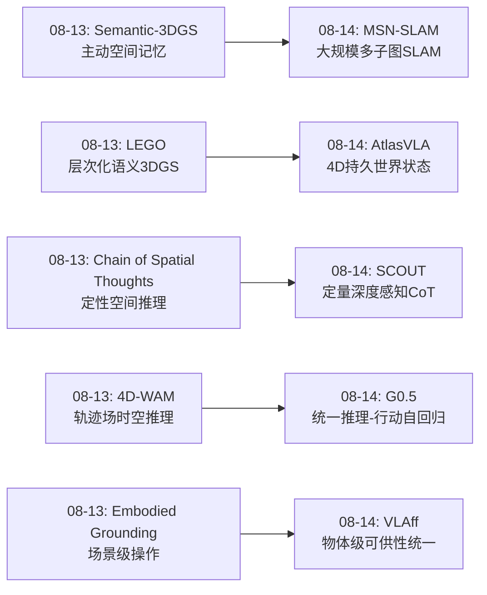
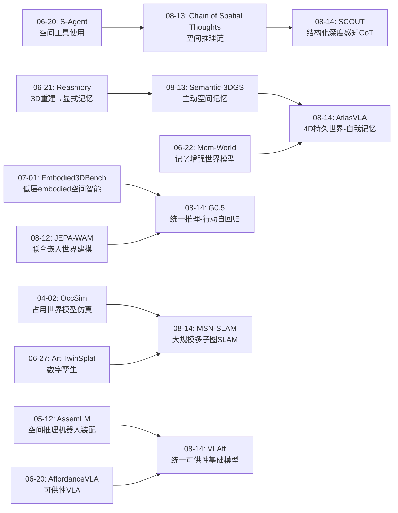
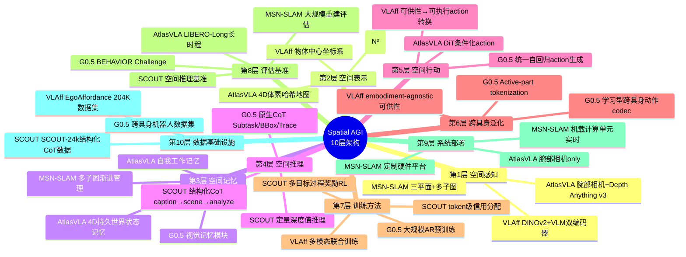
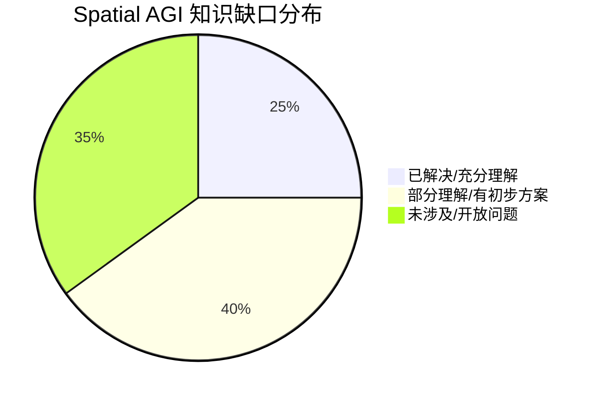

# 每日思考 - 2026-08-14

## 📅 每日总结

**日期**: 2026-08-14
**论文数量**: 5篇
**主题**: 从"大规模神经SLAM、统一自回归VLA、结构化空间推理CoT、持久世界-自我记忆、可供性统一建模"五个维度，系统性地探索Spatial AGI中**空间状态如何被持久维护、推理如何驱动行动、以及操作知识如何跨具身泛化**这三大核心问题。今天的五篇论文标志着Spatial AGI研究从"空间感知与表示"走向"空间记忆与行动统一"的关键转折。

### 关键突破

- 🗺️ **MSN-SLAM**: 渐进式多子图+层次化回环检测+在线蒸馏，解决大规模神经SLAM的灾难性遗忘和轨迹漂移。验证了神经隐式SLAM可以扩展到大规模真实环境，在机载计算单元上实时运行。
- 🤖 **G0.5**: 统一自回归VLA——推理和动作在同一token流中生成。跨具身动作codec+原生CoT，7项SOTA。论证了VLM-as-Actor范式优于VLM-as-Encoder，保持了VLM的推理能力直接服务于行动。
- 🧠 **SCOUT**: 结构化CoT显式建模3D深度感知+5种过程奖励+token级信用分配。SCOUT-7B超越GPT-4o 4.28%。首次在CoT中引入定量深度值作为空间感知的核心维度。
- 🌍 **AtlasVLA**: 双记忆架构（4D持久世界状态+自我工作记忆），仅腕部相机超越多视角SOTA。正式定义了反应式VLA的"感知遗忘"和"任务进度遗忘"两个根本缺陷。
- 🎯 **VLAff**: 统一视觉/抓取/轨迹三种可供性的VLM基础模型+EgoAffordance 204K数据集。物体中心可供性作为跨具身桥梁，从人类视频学习embodiment-agnostic操作知识。

### 📊 一句话总结

**今天的5篇论文共同回答了一个核心问题："Spatial AGI系统如何维护持久空间状态并将空间推理统一到行动生成中？"——MSN-SLAM解决大规模空间状态的可扩展维护，AtlasVLA解决操作中的持久空间记忆，G0.5统一推理与行动，SCOUT深化空间推理的质量，VLAff提供跨具身操作知识的基础。**

### 🔗 延续性

**08-13→08-14**: 从"空间知识的多元表示"到"空间状态的持久维护与推理-行动统一"
**关键演进**: LEGO的"层次化3DGS语义"→MSN-SLAM的"多子图大规模几何"；Chain of Spatial Thoughts的"空间推理链"→SCOUT的"结构化深度感知CoT"；4D-WAM的"轨迹场"→AtlasVLA的"4D世界状态记忆"；Semantic-3DGS的"主动空间记忆"→VLAff的"物体中心可供性"

### 💡 本质思考：如何达成通用空间智能

#### 1. 核心能力的本质是什么？
今天的5篇论文揭示了一个递进式的pattern：**空间智能从"感知"走向"记忆"，再走向"推理-行动统一"**。

三个层次的能力：
- **空间维护（Spatial Maintenance）**: MSN-SLAM的多子图和AtlasVLA的4D世界状态记忆，解决的是"如何持久记住空间状态"
- **空间推理（Spatial Reasoning）**: SCOUT的结构化CoT和G0.5的原生推理链，解决的是"如何利用空间知识推导结论"
- **空间行动（Spatial Action）**: G0.5的统一自回归流和VLAff的可供性预测，解决的是"如何将空间理解转化为行动"

这三层构成了Spatial AGI的核心能力栈：**维护→推理→行动**。

#### 2. 当前方法与理想目标的差距在哪里？
- **记忆容量与精度的矛盾**: MSN-SLAM的多子图和AtlasVLA的体素哈希都在与有限的内存搏斗，理想的Spatial AGI需要无限容量的空间记忆
- **推理深度与速度的矛盾**: G0.5的CoT虽然统一了推理和行动，但自回归生成的延迟限制了高频控制；SCOUT的多步推理同样面临推理时间挑战
- **泛化性与精度的矛盾**: VLAff的物体中心可供性提供了embodiment-agnostic泛化，但物体坐标系简化丢失了场景上下文
- **评估体系不完整**: 缺乏评估"持久空间记忆质量"的标准基准

#### 3. 从今天到理想状态，最可能的路径是什么？
三阶段路径：
1. **空间记忆基础设施**（MSN-SLAM + AtlasVLA方向）→ 建立可扩展、持久更新的空间状态表示
2. **推理-行动统一架构**（G0.5 + SCOUT方向）→ 在空间记忆之上构建统一的自回归推理-行动生成
3. **跨具身知识迁移**（VLAff方向）→ 从人类视频中学习操作知识，通过可供性表示迁移到不同agent

关键转折点：**将3DGS/NeRF的显式空间表示（MSN-SLAM）与VLM的自回归推理（G0.5）统一**——让VLM不仅能推理语言，还能直接操作3D空间表示。

---

## 🔗 与昨日思考的联系

### 08-13重点
- Semantic-3DGS: 主动空间记忆服务embodied grounding
- LEGO: 层次化语义3DGS
- 4D-WAM: 轨迹场4D时空推理
- Multi-View Distillation: 空间知识蒸馏到VLM
- Chain of Spatial Thoughts: 空间推理链

### 今日进展
- Semantic-3DGS的"3DGS空间记忆"→MSN-SLAM的"多子图大规模SLAM"（从桌面到大场景）
- LEGO的"层次化语义"→AtlasVLA的"4D持久世界状态"（从静态语义到动态记忆）
- Chain of Spatial Thoughts的"推理链"→SCOUT的"结构化深度感知CoT"（从定性到定量空间推理）
- 4D-WAM的"轨迹场"→G0.5的"统一推理-行动流"（从时空预测到推理-行动统一）
- Semantic-3DGS的"embodied grounding"→VLAff的"可供性统一建模"（从场景级到物体级操作知识）

### 演进路径

---

## 📚 论文概览

### 今天的5篇论文

1. **Multi-Submap Implicit Neural SLAM (MSN-SLAM)** (SJTU/CMU/NTU) — 大规模神经SLAM的完整解决方案
   - 核心：渐进多子图三平面表示 + 光流跟踪 + SALAD基础模型回环检测 + 在线蒸馏
   - 启发：神经隐式SLAM可以在机载计算单元上实现大规模实时部署

2. **G0.5: One Autoregressive Stream** (Galaxea AI) — 统一推理与行动的VLA范式革命
   - 核心：学习型跨具身动作codec + 原生CoT（Subtask/BBox/Trace/ActionHint）+ VLM-as-Actor
   - 启发：自回归VLA在保持推理能力方面有结构性优势

3. **SCOUT** — 结构化空间推理的新范式
   - 核心：caption→scene(bboxes+depth)→analyze→answer + 5种过程奖励 + token级信用分配
   - 启发：深度感知是空间推理的关键缺失环节，盲验证可有效防止推理幻觉

4. **AtlasVLA** (中科院自动化所) — 持久空间记忆的突破
   - 核心：4D世界状态记忆（体素哈希）+ 自我工作记忆 + DiT条件化生成
   - 启发：仅腕部相机超越多视角方法，证明持久记忆的价值远超增加传感器

5. **VLAff** (东京大学, IROS 2026) — 可供性作为跨具身桥梁
   - 核心：EgoAffordance 204K数据集 + VLM统一预测视觉/抓取/轨迹可供性 + DINOv2增强
   - 启发：物体中心可供性是embodiment-agnostic的操作知识表示

---

## 💡 核心见解

### 见解1: 空间记忆从"瞬时"到"持久"的范式转变
（来自AtlasVLA + MSN-SLAM）

AtlasVLA正式定义了反应式VLA的"感知遗忘"问题——物体离开腕部相机视野就被遗忘。其4D世界状态记忆通过体素哈希+滑动窗口+首帧锚定，持续从局部观测构建全局空间状态。MSN-SLAM则从SLAM角度解决类似问题——多子图架构允许大规模环境的空间记忆可扩展维护。

- ✅ AtlasVLA：腕部相机仅靠持久记忆超越多视角SOTA（LIBERO 97.6%）
- ✅ MSN-SLAM：多子图+在线蒸馏实现大规模场景的无缝重建
- ✅ 两者都采用"局部观测→全局状态更新"的架构

**对Spatial AGI的启发**：
空间记忆不应该是一个被动存储，而应该是一个主动维护的、可检索的、持续更新的状态。这正是认知科学中的"工作记忆"概念在机器人上的实例化。未来Spatial AGI系统的核心架构可能是：`感知流 → 空间记忆更新 → 记忆检索 → 推理 → 行动`。

### 见解2: 推理与行动的统一——自回归的复兴
（来自G0.5）

G0.5挑战了VLA领域的主流范式（VLM-as-Encoder + flow-matching expert），论证了统一自回归建模的优越性：当VLM保持为actor时，CoT推理可以直接在action生成过程中产生，prompt可以直接驱动行为变化。

- ✅ G0.5在7个评测场景全面超越π0.5和GR00T-N1
- ✅ Native CoT（Subtask/BBox/Trace/ActionHint）与action共享解码器和目标函数
- ✅ Prompt中的副词修饰和空间提示可直接改变policy行为

**对Spatial AGI的启发**：
Spatial AGI中的"空间推理"和"空间行动"不应该是分离的模块。G0.5证明了统一自回归流的可行性——空间推理链可以直接引导action生成，而非通过独立的规划器→执行器管线。

### 见解3: 深度感知是空间推理的关键缺失环节
（来自SCOUT）

SCOUT在CoT中引入了显式的深度值预测和bbox定位，使VLM从"猜测空间关系"升级为"基于数值进行推理"。多目标过程奖励和token级信用分配确保了推理链每个环节的质量。

- ✅ SCOUT-7B在空间推理基准上超越GPT-4o 4.28%
- ✅ 盲验证机制有效检测"正确答案+错误推理"
- ✅ 仅单图像训练即可泛化到多图像和视频

**对Spatial AGI的启发**：
此前的空间推理方法大多停留在定性层面（"A在B左边"）。SCOUT证明了定量深度感知（"A深度2.3m, B深度3.1m, 所以A更近"）可以显著提升推理质量。Spatial AGI应该将定量几何感知作为推理的核心组件。

### 见解4: 可供性作为跨具身操作知识的通用表示
（来自VLAff）

VLAff将操作知识分解为三种embodiment-agnostic的可供性（视觉/抓取/轨迹），从204K自中心人类视频中提取大规模可供性数据，训练统一VLM预测这三种可供性。

- ✅ EgoAffordance 204K数据集远超已有可供性数据集
- ✅ 零样本机器人操作验证了跨具身迁移
- ✅ DINOv2补充VLM在细粒度视觉grounding上的不足

**对Spatial AGI的启发**：
Spatial AGI需要一种方式来积累和迁移操作知识。VLAff的物体中心可供性表示提供了一种优雅的方案——知识锚定在物体上（"这个把手可以这样拉"），而非在特定robot上。

### 见解5: 大规模空间重建的可扩展架构
（来自MSN-SLAM）

MSN-SLAM的三平面表示（O(N²) vs O(N³)）+ 渐进式子图管理 + 在线蒸馏，构成了大规模神经SLAM的完整解决方案。

- ✅ 硬件验证：自研手持平台 + 机载计算单元实时部署
- ✅ 基础模型赋能：SALAD描述子处理大视角变化下的重定位
- ✅ 在线蒸馏消除子图边界伪影

**对Spatial AGI的启发**：
Spatial AGI需要可扩展的空间感知基础设施。MSN-SLAM的多子图架构可以自然地推广到多agent场景——不同agent负责不同子图，通过全局优化协调。

### 见解6: 双重记忆架构——世界状态与自我状态
（来自AtlasVLA）

AtlasVLA的双记忆架构与认知科学中的allocentric（世界中心）和egocentric（自我中心）空间表示完美对应。4D世界状态记忆维护外部空间的客观状态，自我工作记忆跟踪agent的内部状态和任务进度。

**对Spatial AGI的启发**：
Spatial AGI不仅需要记住"世界是什么样的"，还需要记住"我在哪里、我做了什么、接下来做什么"。这种双重记忆架构可能是通用空间智能的必要组件。

### 见解7: RL+结构化推理是提升空间推理的有效路径
（来自SCOUT）

SCOUT的5种过程奖励（grounding/depth/consistency/accuracy/format）和token级信用分配展示了如何通过RL系统性地提升VLM的空间推理能力。关键创新是盲验证——去掉图像输入验证推理链的逻辑一致性。

**对Spatial AGI的启发**：
仅靠SFT训练空间推理容易产生死记硬背。RL+结构化CoT+多维度过程奖励可以培养真正的空间推理能力，而非表面模式匹配。

---

## 🗺️ 知识演进图

---

## 技术栈演进对比表

| 层次 | 08-13方案 | 08-14方案 | 关键变化 |
|------|----------|----------|---------|
| **空间感知** | Semantic-3DGS (桌面级) | MSN-SLAM (大场景) + AtlasVLA 4D世界状态 | 从桌面到大场景，从静态到持久更新 |
| **空间表示** | LEGO层次化语义3DGS | AtlasVLA体素哈希4D + MSN-SLAM三平面 | 从语义层次到时空体素，从静态到动态 |
| **空间推理** | Chain of Spatial Thoughts (定性) | SCOUT (定量深度+5种奖励) | 从定性推理到定量深度感知推理 |
| **行动生成** | 扩散VLA (Semantic-3DGS中) | G0.5统一自回归 | 从分离的VLM+expert到统一自回归流 |
| **操作知识** | 场景级语义grounding | VLAff物体级可供性 | 从场景理解到物体中心操作知识 |
| **记忆架构** | 3DGS作为静态记忆 | AtlasVLA双记忆（世界+自我） | 从单层记忆到双层分离维护 |
| **训练方法** | SFT + 任务奖励 | SCOUT多目标过程奖励RL + G0.5 AR预训练 | 从简单SFT到结构化RL+大规模AR预训练 |
| **评估基准** | EmbodimentSemantic空间关系 | SCOUT空间推理 + AtlasVLA长时程任务 | 从空间关系评估到推理质量+持久记忆评估 |

---

## 🗺️ Spatial AGI 知识图谱

### 10层架构思维导图

### 🎯 主线技术路径

#### 阶段1: 空间感知基础设施 (2026 Q1-Q2)
- NeRF/3DGS SLAM实现大规模实时部署（MSN-SLAM）
- 深度估计模型（Depth Anything v3）提供密集几何先验
- 多子图架构支持可扩展空间记忆

#### 阶段2: 持久空间记忆与状态维护 (2026 Q2-Q3)
- 4D世界状态记忆持续从局部观测更新全局状态（AtlasVLA）
- 双记忆架构（世界+自我）解决感知遗忘和任务进度遗忘
- 体素哈希+滑动窗口平衡精度和内存

#### 阶段3: 统一推理-行动架构 (2026 Q3)
- 自回归VLA统一推理和行动生成（G0.5）
- 结构化CoT引入定量空间感知（SCOUT）
- RL+过程奖励系统性提升推理质量

#### 阶段4: 跨具身知识积累与迁移 (2026 Q3+)
- 从人类视频提取embodiment-agnostic可供性（VLAff）
- 统一动作codec实现跨机器人泛化（G0.5）
- 物体中心操作知识作为通用表示

---

## 🔍 待探索议题

### 高优先级（本周）

1. **统一空间记忆架构**
   - 问题: MSN-SLAM的多子图几何+AtlasVLA的4D世界状态+SCOUT的深度值能否统一？
   - 候选方案: 在体素哈希地图中同时存储几何、语义、深度值
   - 缺口: 缺乏将SLAM级几何精度与VLM推理统一的框架

2. **自回归VLA + 3D空间表示**
   - 问题: G0.5的统一自回归流能否直接操作3D空间表示（如体素、3DGS）？
   - 候选方案: 将3DGS/体素token化，作为CoT中的额外模态
   - 缺口: 3D表示的token化方法仍不成熟

3. **推理质量评估标准化**
   - 问题: SCOUT的盲验证和过程奖励能否推广为通用空间推理评估标准？
   - 候选方案: 建立多维度空间推理评估基准（grounding/depth/consistency/accuracy）
   - 缺口: 缺乏统一的空间推理质量评估框架

### 中优先级（本月）

4. **可供性 + 空间记忆**
   - 问题: VLAff的物体中心可供性能否嵌入AtlasVLA的4D世界状态中？
   - 候选方案: 每个体素存储不仅几何特征，还存储可供性信息
   - 缺口: 可供性在动态场景中的更新机制

5. **大规模SLAM + VLA操作**
   - 问题: MSN-SLAM的大规模场景重建如何服务VLA操作？
   - 候选方案: SLAM提供空间记忆，VLA从空间记忆中检索信息进行操作
   - 缺口: SLAM与VLA的接口设计

6. **跨具身动作codec的3D扩展**
   - 问题: G0.5的2D action codec能否扩展为3D空间action？
   - 候选方案: 将6-DoF位姿+夹爪状态统一编码
   - 缺口: 不同机器人的工作空间和运动学约束差异

7. **RL训练中的空间推理迁移**
   - 问题: SCOUT的RL训练方法能否迁移到VLA训练？
   - 候选方案: 在G0.5的action生成中引入过程奖励
   - 缺口: VLA action的验证比多选题困难

### 探索性（本季度）

8. **NeRF/3DGS SLAM的动态场景扩展**
   - 问题: MSN-SLAM如何处理高频动态环境？
   - 候选方案: 4DGS + 动态物体分离
   - 缺口: 动态物体的在线检测和分离

9. **从人类视频到空间推理**
   - 问题: VLAff的视频学习pipeline能否用于学习空间推理知识（而非仅可供性）？
   - 候选方案: 从视频中提取空间关系（上下/前后/远近）作为训练数据
   - 缺口: 视频中的空间关系自动标注

---

## 📊 知识缺口分析

**已解决（25%）**:
- ✅ 大规模神经SLAM基础架构（MSN-SLAM）
- ✅ VLA统一推理-行动架构（G0.5）
- ✅ VLM结构化空间推理训练（SCOUT）
- ✅ 物体中心可供性提取（VLAff）
- ✅ 持久空间记忆设计（AtlasVLA）

**部分理解（40%）**:
- ⚠️ SLAM与VLA的统一接口
- ⚠️ 3D空间表示的token化
- ⚠️ 动态场景的空间记忆更新
- ⚠️ 跨具身动作的3D泛化
- ⚠️ 空间推理评估标准化
- ⚠️ 多agent空间记忆共享
- ⚠️ 大规模可供性数据质量

**未涉及（35%）**:
- ❌ 统一空间智能理论框架
- ❌ 从2D到3D的零样本推理迁移
- ❌ 空间记忆的遗忘和压缩机制
- ❌ 物理因果与空间推理的结合
- ❌ 超大规模（城市级）空间记忆
- ❌ 空间推理的安全性和鲁棒性保证
- ❌ 跨模态空间知识迁移（触觉/听觉→空间）

---

## 📊 每日统计

| 指标 | 值 |
|------|-----|
| 分析论文数 | 5 |
| 总论文池 | 229 |
| 搜索关键词组 | 5 |
| 核心见解 | 7 |
| 待探索议题 | 9 |
| 技术路径阶段 | 4 |
| 知识覆盖率 | 25% 已解决 |

---

**文档创建时间**: 2026-08-14 03:00 CST  
**分析模型**: GLM-5.2  
**研究主题**: 空间状态的持久维护与推理-行动统一
