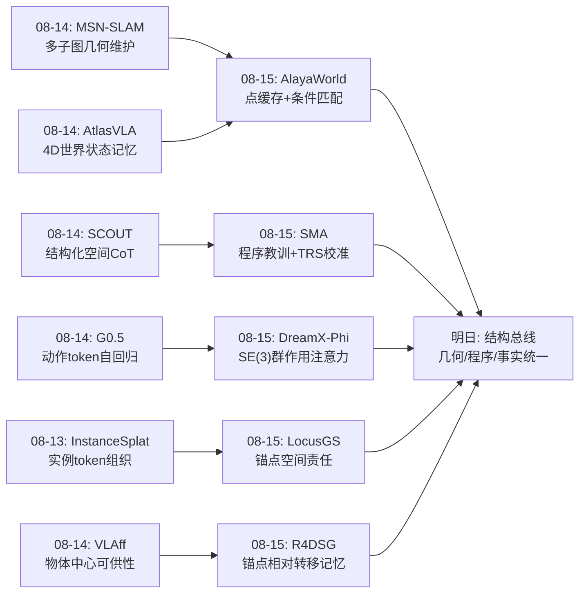
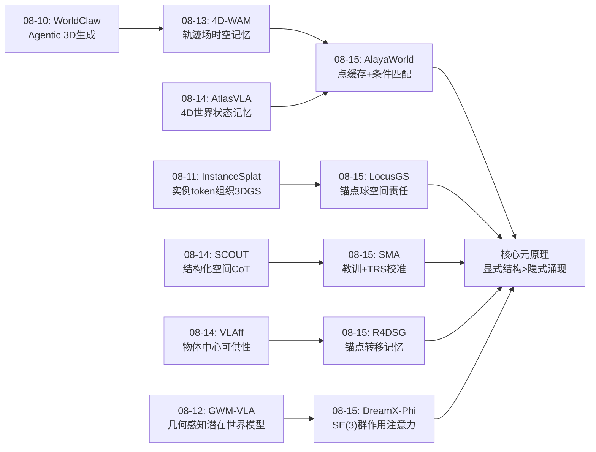
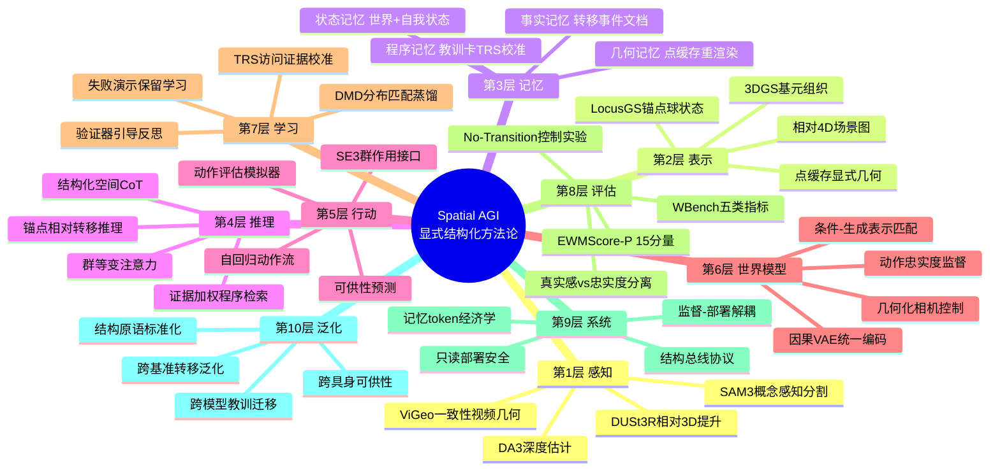
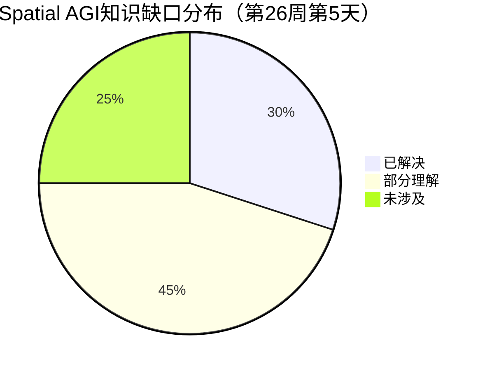

# 每日思考 - 2026-08-15

## 📅 每日总结

**日期**: 2026-08-15
**论文数量**: 5篇
**主题**: 从"交互式世界模型的条件表示匹配、程序性教训记忆、空间接地token、相对4D场景图记忆、群作用动作接口"五个维度，系统性地探索Spatial AGI中**显式结构如何替代隐式涌现**这一元方法论。今天的五篇论文共同指向一个核心发现：无论是几何结构（点缓存/锚点/SE(3)）、程序结构（教训）、还是事件结构（转移），把空间智能所需的结构显式编码进系统，都比让网络从数据中重新发现它更高效、更可控、更可迁移。

**关键突破**:
- 🌍 **AlayaWorld v1.1**: 条件-生成表示匹配原则的系统性落地——流式3D点缓存替代深度扭曲、几何重渲染替代相机AdaLN分支，不加数据不加参数实现WBench Consistency 89.5第一（Perspective 86.6/Geometric 94.1/Background 94.1/Subject 93.4四项第一）
- 🧠 **SMA**: 冻结VLM的第三条自演化路线——验证器引导反思蒸馏"可迁移教训"+TRS证据校准检索，5基准×4模型macro全部第一，跨模型迁移+9.4证明空间程序性知识的模型无关性
- 🎯 **LocusGS**: 显式3D锚点状态（中心+半径）贯穿解码全程——anchor-to-ray零参数几何偏置+锚点中心化解码，发现"输出空间约束(-2.2)>输入空间过滤(-1.5)"，一半高斯数超GS-LRM
- 📱 **R4DSG**: 相对4D场景图记忆——静态锚点+持久身份+转移事件三支柱，7小时视频压缩到0.58MB，when类问题+12.5点，No-Transition控制实验证明结构本身贡献+4.7
- 🦾 **DreamX-Phi 1.0**: PRoPE群作用注意力——双臂SE(3)轨迹直接作为注意力投影矩阵，SAM3 mask加权+V-JEPA Gram对齐三重物理监督，WorldArena 2.0 Track 1第一（Trajectory Acc 90.53）

### 📊 一句话总结

**今天的5篇论文共同回答了一个元方法论问题："Spatial AGI系统的结构应该显式设计还是让网络隐式学习？"——答案是五个维度的显式化：条件表示对齐、程序知识蒸馏、计算单元空间责任、事件拓扑转移、控制接口群结构。显式结构优于隐式涌现，这是从昨天的'维护→推理→行动'能力栈到今天的'结构化实现'方法论的必然演进。**

### 🔗 延续性

**08-14→08-15**: 从"空间状态的持久维护与推理-行动统一"到"显式结构化的实现方法论"
**关键演进**: AtlasVLA的"4D世界状态记忆"→AlayaWorld的"点缓存+因果编码条件化"；SCOUT的"结构化空间CoT"→SMA的"程序性教训记忆"（推理结构的两种形态）；MSN-SLAM的"多子图几何"→LocusGS的"锚点空间划分"；G0.5的"动作token"→DreamX-Phi的"SE(3)群作用注入"；昨日"统一记忆架构"议题→今日"记忆形态三分"（几何/程序/事实）

**今日→明日**: 预期方向——①三种记忆形态（几何/程序/事实）的统一总线架构；②PRoPE群作用的扩展（物体6DoF/多智能体）；③锚点概念的无监督泛化；④世界模型评估的物理一致性深化

### 💡 本质思考：如何达成通用空间智能

#### 1. 核心能力的本质是什么？

今天的5篇论文在昨天的"维护→推理→行动"能力栈之下揭示了一层更深的**结构原理**：

- **结构保持原理**（DreamX-Phi + AlayaWorld）：控制信号/条件信号的数学结构（SE(3)群、因果时序、几何视角）应原生保留在系统接口中，而非压缩为通用嵌入后让网络重新学习。PRoPE把刚体变换直接写进注意力，AlayaWorld把条件统一到因果VAE潜空间——两者都证明"接口即结构"的收益（Trajectory Acc 90.53、Perspective 86.6）
- **空间责任原理**（LocusGS + R4DSG）：分布式系统中的每个计算单元（token/query/记忆条目）应有明确的空间管辖——锚点球划分重建辖区、静态锚点/动态对象二分组织记忆。空间责任感不能靠涌现，必须显式分配
- **经验复利原理**（SMA + R4DSG）：空间经验的价值在于抽象后的可迁移性——教训卡（推理程序）与转移事件（空间事实）都是"事件→可复用抽象"的压缩。TRS证据校准证明"程序可靠性"必须用使用证据而非表面相似度估计

三条原理合起来：**通用空间智能 = 结构保持的接口 + 空间责任的分配 + 经验的复利积累**。

#### 2. 当前方法与理想目标的差距在哪里？

- **结构化的碎片化**：今天的五种结构（点缓存几何/教训程序/转移拓扑/锚点球/SE(3)群）各自独立，尚无统一的形式化框架——它们在不同抽象层次解决同一问题，但互不感知。理想系统需要"结构总线"让多种结构协同
- **动态性的普遍缺失**：点缓存假设静态世界、锚点球不随时间演化、R4DSG转移是离散事件——真实的Spatial AGI需要动态结构（时变锚点、4D点缓存、连续场+离散事件的混合）
- **验证信号的稀缺**：SMA依赖可验证环境（已知答案）、DreamX-Phi依赖仿真（WorldArena）、R4DSG依赖数据集标注（activity/location窗口）——真实世界的结构学习缺乏ground truth
- **评估的结构盲区**：WBench/EWMScore区分视觉质量与一致性/物理，但尚无"结构正确性"的评估维度（锚点布局合理性、教训可迁移性度量、转移事件完整性）

#### 3. 从今天到理想状态，最可能的路径是什么？

三阶段路径（在昨日路径基础上的深化）：

1. **结构原语标准化**（当前阶段）：提炼今天五种结构的公共原语——锚点（空间管辖）、转移（状态变化）、群作用（刚体接口）、教训（程序抽象）、点缓存（几何记忆）——形成Spatial AGI的"结构工具箱"
2. **结构总线架构**（中期）：设计统一的多结构共存协议——几何记忆服务生成、事实记忆服务检索、程序记忆服务推理，共享锚点索引与空间坐标系。类似数据库的"存储引擎+索引+查询语言"分层
3. **结构的自组织**（远期）：结构本身可学习可演化——锚点自适应分裂合并、教训自动归纳元教训、点缓存动态更新语义——从"设计结构"到"结构生长"

关键转折点：**记忆形态三分（几何/程序/事实）的统一总线**——今天三篇记忆论文（AlayaWorld/SMA/R4DSG）几乎正交，谁能先统一它们谁就定义下一代Spatial AGI记忆架构。

---

## 🔗 与昨日思考的联系

### 08-14重点
- MSN-SLAM: 大规模空间状态的可扩展维护（多子图+在线蒸馏）
- G0.5: 推理与行动的统一自回归流（VLM-as-Actor）
- SCOUT: 结构化空间推理CoT（深度感知+过程奖励）
- AtlasVLA: 双记忆架构（4D世界状态+自我工作记忆）
- VLAff: 可供性作为跨具身桥梁（EgoAffordance 204K）
- 昨日核心命题："维护→推理→行动"三层能力栈；昨日关键转折点："3D显式表示与VLM自回归推理的统一"

### 今日进展

今天的5篇论文从方法论层面深化了昨日的命题：

1. **昨日"持久维护"→今日"维护的结构化"**：AtlasVLA的体素哈希世界状态是隐式维护，AlayaWorld的点缓存+重渲染接口、R4DSG的锚点转移事件是显式结构化维护——维护什么、怎么查询、何时更新都有了明确结构
2. **昨日"推理统一"→今日"推理的双形态"**：SCOUT的结构化CoT（推理时的即时结构）与SMA的教训记忆（跨任务的结构复利）构成推理结构的快照/持久二分——推理能力可以是状态（CoT）也可以是资产（教训库）
3. **昨日"行动统一"→今日"行动接口的结构保持"**：G0.5的动作token（离散化）vs DreamX-Phi的PRoPE群作用（连续SE(3)原生）——行动统一不仅需要流，还需要保持动作的几何结构
4. **昨日"跨具身泛化"→今日"泛化的结构载体"**：VLAff的可供性（物体中心）与SMA的教训（任务中心）都是embodiment-agnostic的结构——泛化需要结构载体而非特征对齐

### 演进路径



---

## 📚 论文概览

今天分析的5篇论文：

1. **AlayaWorld v1.1**（腾讯Alaya Lab, 2608.13492）: 交互式长时程世界模型技术报告更新。核心是"条件信号应匹配生成内容的潜表示与时间结构"原则的六项系统性落地——流式3D点缓存（ViGeo几何前端+尺度对齐+内参自标定）替代DA3深度扭曲，几何重渲染替代相机AdaLN侧信道，统一因果VAE协议。WBench Consistency 89.5第一，验证显式几何记忆对长时程一致性的价值，同时暴露"几何一致性≠物理一致性"（Causal Fidelity 65.1偏弱）。

2. **Spatial Memory Agent**（浙大/上交, 2608.12743）: 冻结VLM的无参数更新空间自演化。在可验证环境中"解题→验证器打分→反思蒸馏教训卡"，TRS（可迁移可靠性分数）以访问证据在线校准记忆价值，检索从"语义匹配"升级为"证据加权程序选择"。5基准×4模型全胜，跨模型迁移+9.4，失败教训与成功教训同样有价值（TRS解耦出身与效用）。

3. **LocusGS**（国防科大, 2608.12825）: query-based前馈3DGS的空间接地。发现纯潜query的"空间涣散"问题（同query高斯散布全场景），给每个query配显式3D锚点（中心+支撑半径），三处注入（锚点位置嵌入自注意力/anchor-to-ray几何偏置交叉注意力/锚点中心化解码）+逐层精化。消融揭示输出约束(-2.2)>输入过滤(-1.5)，1024-token以66K高斯超GS-LRM。

4. **R4DSG**（同济/三星, 2608.11017, ACM MM 2026）: 长自中心视频的相对4D场景图记忆。静态锚点（桌/架/台）+动态对象二分，持久身份跨帧维护（四重一致性），锚点相对转移事件（带时间戳）作为记忆原子，九元组段级文档支持检索。纯RGB管线（SAM3+DUSt3R），7小时→0.58MB，when类+12.5。No-Transition控制证明结构贡献+4.7。

5. **DreamX-Phi 1.0**（蚂蚁DreamX Team, 2608.13489）: 动作条件视频世界模型。PRoPE群作用注意力直接内嵌双臂SE(3)相对轨迹（分组头管臂身份+幅度归一化+残差分支），SAM3 mask加权聚焦接触误差，冻结V-JEPA的Gram矩阵对齐维护对象时序关系，DA3深度潜空间监督，DMD2少步蒸馏。WorldArena 2.0 Track 1第一。"真实感≠忠实度"的诊断框架。

---

## 💡 核心见解

### 见解1: 条件-生成表示匹配是自回归系统的第一性原则
（来自AlayaWorld v1.1）

AlayaWorld v1.1的全部六项改动（9帧图像条件/因果编码空间记忆/像素对齐时间记忆/硬dropout/统一VAE协议/几何相机控制）都源自一个原则：条件信号应在潜表示与时间结构上匹配生成内容。不加数据、不加参数，仅消除表示错位就实现Consistency 89.5的SOTA。

- ✅ 孤立帧编码是分布外输入——9帧窗口把图像条件拉回因果VAE的训练分布
- ✅ 相机AdaLN侧信道表达不了视差/尺度/可见性——几何重渲染让视角控制天然携带几何结构
- ✅ 硬dropout（移除token而非置零）保证推理形态（首步无记忆）在训练分布内有对应

**对Spatial AGI的启发**：任何"外部信号注入主干"的系统（VLA动作条件、世界模型空间记忆、Agent工具结果）都应审计接口的表示对齐性。系统不一致时，先找接口错位，再加容量。这条原则与GWM-VLA（几何进主干）、GST-VLA（空间token注入）形成跨任务的相互验证。

### 见解2: 程序性知识的复利是冻结模型的自演化引擎
（来自SMA）

SMA证明空间推理的失败模式是重复的、可抽象为程序性教训的、可跨题跨模型迁移的。TRS证据校准（(λv₀+c)/(λ+n)贝叶斯收缩）把检索从"语义最近邻"升级为"证据加权程序选择"——最佳记忆不总是最近记忆。

- ✅ 失败源教训（TRS 0.452）仍支持61.4%准确率——失败是教训富矿
- ✅ 检索组合效应巨大：全成功源93.0% vs 全失败源39.0%
- ✅ 122B写的教训给27B用+9.4——空间程序知识模型无关

**对Spatial AGI的启发**：TRS公式可移植到任何空间记忆系统（3D地图库/技能库/经验池）作为记忆价值估计器。具身场景的挑战是缺乏验证器——奖励模型/模拟器/人类反馈的替代信号是记忆自演化从QA走向Embodied的关键缺口。

### 见解3: 计算单元的空间责任必须显式分配
（来自LocusGS）

纯潜query的空间任务是欠约束的——梯度下降走"全局平均模式"的捷径导致空间涣散。锚点球（中心+半径）提供了最小的空间责任显式化：初始化随机分布即埋下分工种子，几何偏置引导证据聚合，解码约束锁定输出辖区。

- ✅ 输出端约束（锚点中心化解码，-2.2消融）比输入端过滤（几何偏置，-1.5）更关键
- ✅ 纯内容交叉注意力灾难性下降22.75——几何偏置是必需品非锦上添花
- ✅ 半径状态独立贡献0.64——管辖"范围"与"位置"同等重要

**对Spatial AGI的启发**：VLM的视觉token无空间状态是空间推理弱的结构性原因之一。锚点化token设计（附加位置+范围状态）可推广到场景理解/记忆token化/VLA场景输入。锚点布局本身是免费的场景空间摘要（N球骨架），可与点缓存（稠密）/场景图（语义）组合成层次记忆。

### 见解4: 拓扑转移是弱感知条件下空间记忆的充分表示
（来自R4DSG）

R4DSG拒绝度量完备主义：不建全局地图、不用深度位姿，用"静态锚点+持久身份+转移事件"回答对象中心问题。"东西从哪个锚点挪到哪个锚点、何时、为何"的拓扑事实保留了回答where/when/why的全部信息。

- ✅ No-Transition控制（同证据去结构）34.9 vs 39.6——结构本身的因果贡献+4.7
- ✅ 段级文档（转移+上下文）优于纯事件/纯情景摘要——转移需要局部上下文共同存储
- ✅ 7小时→0.58MB（158.5 tokens/文档）——记忆的token经济学决定可用性

**对Spatial AGI的启发**："记忆的用途决定表示的粒度"——QA需要转移事实+上下文，不需要厘米级地图。静态/动态二分（骨架存一次、内容存转移）是通用压缩策略。WhyMemory的解释字段预生成（写入时投资、查询时免费）是解释性记忆的设计模板。

### 见解5: 接口即结构——群作用注意力是第四代动作接口
（来自DreamX-Phi）

动作接口的四个世代：特征调制(G1)→动作token(G2)→渲染条件(G3)→群作用(G4)。DreamX-Phi把末端执行器的SE(3)相对变换直接作为注意力投影矩阵（P=A，K=I₃），刚体几何结构在架构中不可丢失。Trajectory Acc 90.53 vs IRASim（G2）38.18——丢失群结构的代价超50点。

- ✅ PRoPE机制复用（相机→手臂）展示表示设计的通用性：SE(3)群作用可承载任何刚体系统条件
- ✅ 三层防御纵深：PRoPE（架构层防动错臂）+SAM3加权（损失层防抓空）+V-JEPA对齐（表示层防漂移）
- ✅ 监督-部署解耦：训练用SAM3/深度/V-JEPA辅助，推理全部卸载零开销

**对Spatial AGI的启发**：控制信号的原生数学结构（群/几何/拓扑）直接进注意力优于任何压缩编码。可预期扩展：物体6DoF位姿的PRoPE注入（物体级世界模型）、多智能体相对位姿（协同世界模型）。失效模式→针对性监督的映射表（诊断驱动设计）是工程方法论范本。

### 见解6: 三种记忆形态的发现——几何/程序/事实的正交分解
（来自AlayaWorld + SMA + R4DSG的综合）

今天三篇记忆论文几乎正交地点亮了记忆形态空间的三个维度：
- **几何记忆**（AlayaWorld点缓存）：服务生成/想象，稠密显式，保存"世界长什么样"
- **程序记忆**（SMA教训卡）：服务推理/决策，稀疏语言化，保存"该怎么想"
- **事实记忆**（R4DSG转移事件）：服务检索/回忆，稀疏结构化，保存"发生过什么"

加上本周的AtlasVLA（状态记忆：VLA内部世界+自我状态）与SkillMemo（技能记忆：操作执行程序），记忆形态空间至少有五个正交维度。

**对Spatial AGI的启发**：单一记忆系统不可能满足全部需求——完整的Spatial AGI需要记忆组合（几何+程序+事实+状态+技能）与统一总线（共享锚点索引、统一检索协议、一致性维护）。这是本周最清晰也最迫切的架构机会。三种记忆的写入触发器、存储格式、检索协议、遗忘策略完全不同——总线设计是真正的系统级挑战。

### 见解7: "真实感≠忠实度"——生成式系统的评估必须分项化
（来自DreamX-Phi + AlayaWorld的交叉验证）

DreamX-Phi诊断"逼真的rollout可能动错手臂或丢失物体"；AlayaWorld在Geometric 94.1第一的同时Causal Fidelity 65.1第7。两者共同证明：视觉质量、几何一致性、物理忠实度是三个正交目标，单一指标（PSNR/FVD/EWMScore聚合分）会掩盖结构性失效。

- ✅ WorldArena的15分量EWMScore-P（Trajectory/Depth/Perspectivity/Instruction Following分项）是评估分项化的范本
- ✅ WBench的五类指标（Quality/Setting/Interaction/Consistency/Physical）同样揭示AlayaWorld的强一致性/弱物理模式
- ✅ R4DSG的No-Transition控制实验提供了"结构贡献"的隔离测量方法

**对Spatial AGI的启发**：评估体系需要第四个维度——"结构正确性"（锚点布局合理性、教训可迁移性、转移事件完整性、群作用等变性）。今天的五篇论文各自发明了结构评估的局部方案，标准化是社区机会。

---

## 🗺️ 知识演进图



演进主线：本周从"空间表示的多样化探索"（实例token/轨迹场/可供性）经过"记忆与推理的结构化"（世界状态/CoT/技能库），收敛到今天的"显式结构化方法论"——五种结构原语（点缓存/教训/锚点/转移/群作用）浮出水面。

---

## 技术栈演进对比表

| 层次 | 08-14方案 | 08-15方案 | 变化 |
|------|----------|----------|------|
| 空间记忆（几何） | AtlasVLA体素哈希4D状态 | AlayaWorld流式3D点缓存+重渲染接口 | 显式化+可渲染查询 |
| 空间记忆（程序） | SCOUT结构化CoT（即时推理） | SMA教训卡+TRS证据校准（持久复利） | 状态→资产 |
| 空间记忆（事实） | — | R4DSG锚点转移事件+九元组文档 | 新增维度 |
| 世界模型条件 | G0.5动作token自回归 | DreamX-Phi PRoPE群作用+AlayaWorld几何重渲染 | token→结构保持接口 |
| 3D表示组织 | InstanceSplat实例token | LocusGS锚点球管辖+几何偏置 | 实例语义→空间责任 |
| 空间推理增强 | SCOUT过程奖励RL | SMA冻结模型记忆自演化 | 参数更新→记忆演化 |
| 一致性维护 | AtlasVLA滑动窗口+首帧锚定 | AlayaWorld尺度对齐+内参自标定+硬dropout | 隐式→显式几何协议 |
| 评估体系 | RoboStressBench/多基准 | WBench 15分量+EWMScore-P+No-Transition控制 | 分项化+控制实验 |
| 部署效率 | BridgeVLA++记忆增强 | DreamX-Phi DMD2少步蒸馏 | 少步推理 |

---

## 🗺️ Spatial AGI 知识图谱

### 10层架构思维导图



### 🎯 主线技术路径

#### 阶段1: 结构原语提炼（当前，2026 Q3）

从本周及今日论文提炼Spatial AGI结构工具箱：
- **锚点**（LocusGS/R4DSG）：空间管辖的显式单元（中心+范围）
- **转移**（R4DSG）：状态变化的原子事件（时间戳+源/目标锚点）
- **群作用**（DreamX-Phi）：刚体接口的数学结构（SE(3)注意力）
- **教训**（SMA）：程序知识的可迁移封装（模式+陷阱+检查）
- **点缓存**（AlayaWorld）：几何记忆的持久累积（注册+重渲染查询）

#### 阶段2: 结构组合与总线（2026 Q4）

- 多结构共存协议：几何/程序/事实记忆共享锚点索引与坐标系
- 统一检索协议：语义过滤+证据校准（TRS泛化）的跨形态检索
- 一致性维护：转移事件触发几何记忆更新、教训蒸馏触发程序记忆更新

#### 阶段3: 结构驱动的闭环（2027 H1）

- 世界模型（结构条件）+ VLA（结构接口）+ 记忆（结构总线）的完整闭环
- 规划→想象（DreamX-Phi式rollout）→评估（分项EWMScore）→执行→经验写入（SMA反思+R4DSG转移）的循环
- 真实世界的无验证器信号替代（奖励模型/执行反馈）

#### 阶段4: 结构的自组织（2027+）

- 锚点自适应分裂合并（复杂度感知预算）
- 教训自动归纳元教训（记忆库压缩）
- 4D动态结构（时变锚点/动态点缓存）
- 结构学习：从数据中自动发现最优结构原语

---

## 🔍 待探索议题

### 高优先级（本周）

1. **统一记忆总线架构**
   - 问题: 几何（点缓存）/程序（教训）/事实（转移）三种记忆如何统一存储、索引、检索？
   - 候选方案: 锚点索引层（R4DSG锚点作为所有记忆的空间分区键）+ TRS泛化为跨形态价值估计器 + 九元组扩展为多形态文档schema
   - 缺口: 跨形态一致性维护（几何更新与事实转移的同步）、检索的模态路由

2. **PRoPE群作用的物体级扩展**
   - 问题: 被操作物体的6DoF轨迹能否也用群作用注入——实现"手臂-物体相对几何"的注意力内嵌？
   - 候选方案: 物体位姿流（6DoF序列）作为第三组注意力头，与双臂头形成相对几何三角
   - 缺口: 物体位姿的在线估计（操作中的遮挡）；物体-手臂相对变换的监督信号

3. **无验证器的TRS校准**
   - 问题: 真实具身场景无已知答案，教训记忆的迁移可靠性如何估计？
   - 候选方案: 执行结果反馈（任务成败）作为弱奖励；模拟器一致性检查；人类稀疏反馈的主动查询
   - 缺口: 奖励延迟与稀疏性下的校准收敛性；多任务冲突教训的仲裁

4. **锚点的无监督发现与泛化**
   - 问题: R4DSG锚点依赖类别先验（桌/架/台），LocusGS锚点跨场景共享初始化——开放环境的锚点如何自动发现？
   - 候选方案: 位置分布长期稳定性统计（时序聚类）；功能性判据（能承载/包含其他物体）；交互频率分析
   - 缺口: 户外/非结构化环境的锚点定义；锚点生命周期管理（新增/合并/淘汰）

### 中优先级（两周内）

5. **结构正确性的评估维度**
   - 问题: 锚点布局合理性、教训可迁移性、转移完整性、群等变性如何量化评估？
   - 候选方案: WBench/EWMScore增加结构分项；No-Transition式控制实验标准化；锚点-场景结构的互信息度量
   - 缺口: 结构质量的ground truth定义；评估的计算可行性

6. **动态4D结构（时变锚点与缓存）**
   - 问题: 静态锚点与时变点缓存如何统一为4D结构——支持动态场景的世界模型与记忆？
   - 候选方案: 锚点携带时间有效期（R4DSG转移事件驱动）；点缓存的对象级分组+语义删除；4D-WAM轨迹场与锚点的融合
   - 缺口: 动态结构的一致性维护成本；离线批处理到在线增量的转变

7. **几何一致性与物理一致性的鸿沟**
   - 问题: AlayaWorld Geometric 94.1第一但Causal Fidelity 65.1第7——为什么显式几何记忆不带来物理忠实？
   - 候选方案: 点缓存扩展物理属性（摩擦/质量/铰接状态）；物体状态更新机制（缓存失效与重写）；物理引擎与生成模型的混合
   - 缺口: 生成式物理的可微性；物理属性的标注获取

8. **条件-生成匹配原则的VLA迁移**
   - 问题: AlayaWorld的表示对齐原则如何迁移到VLA（动作条件与视觉潜空间对齐）与空间推理Agent（3D证据token与LLM输入空间对齐）？
   - 候选方案: 动作条件在VLA的因果潜空间编码；空间证据token的分布内校准（类似9帧窗口的时间上下文注入）
   - 缺口: VLA的"条件分布"定义；跨模态对齐的度量

### 低优先级（本月内）

9. **记忆的遗忘与治理**
   - 问题: 月年级记忆的过时淘汰、错误修正、冲突消解如何设计？
   - 候选方案: 转移频率×对象重要性×查询历史的遗忘函数；教训冲突检测与元教训归纳；记忆版本化与回滚
   - 缺口: 遗忘的评估基准；治理策略的任务依赖性

10. **空间教训库作为公共基础设施**
    - 问题: SMA证明教训跨模型迁移（+9.4）——社区级空间教训库是否可行？
    - 候选方案: 教训卡的开放schema（任务+教训+TRS）；跨机构教训共享协议；教训质量认证
    - 缺口: 教训的隐私问题（含场景信息）；跨数据分布的TRS迁移；商业模式激励

11. **主动结构学习**
    - 问题: Agent能否主动选择"最能提高结构记忆覆盖"的经验去获取（好奇心驱动的结构补全）？
    - 候选方案: 锚点覆盖缺口引导探索（NBV式）；低TRS教训的针对性强化采集
    - 缺口: 结构不确定性的量化；探索-利用平衡的结构版本

---

## 📊 知识缺口分析



**已解决（30%）**:
- ✅ 长时程世界模型的条件表示对齐（AlayaWorld六项协议）
- ✅ 冻结模型的空间推理自演化机制（SMA教训+TRS）
- ✅ 前馈3DGS的query空间责任分配（LocusGS锚点）
- ✅ 弱感知条件下的对象中心记忆（R4DSG转移事件）
- ✅ 动作条件世界模型的忠实度接口（DreamX-Phi PRoPE）
- ✅ 结构化记忆vs文本记忆的量化对比（+4.7控制实验）

**部分理解（45%）**:
- ⚠️ 三种记忆形态（几何/程序/事实）的统一总线——形态已识别，协议未设计
- ⚠️ 群作用注意力的物体级/多智能体扩展——机制已验证，扩展未探索
- ⚠️ 锚点的无监督发现——统计/功能判据有思路，开放环境未验证
- ⚠️ 无验证器的记忆校准——执行反馈方案有设想，延迟稀疏性未解决
- ⚠️ 几何一致性与物理一致性的关系——现象已观察（AlayaWorld），机理未解释
- ⚠️ 结构正确性的评估——控制实验方法已有，标准化度量缺失
- ⚠️ 记忆token经济学——压缩率已量化（0.58MB/7h），月年级扩展未验证
- ⚠️ 跨形态检索协议——TRS泛化有设想，模态路由未设计

**未涉及（25%）**:
- ❌ 动态4D结构（时变锚点/动态点缓存的在线维护）
- ❌ 结构的自组织与生长（结构原语的自动发现）
- ❌ 真实物理世界的无sim2real验证（DreamX-Phi真机/R4DSG多被试）
- ❌ 记忆遗忘与治理的系统性设计
- ❌ 空间教训库的社区基础设施
- ❌ 结构学习的理论基础（为何这些结构充分？形式化证明）

---

## 📈 今日量化成果

| 指标 | 数值 |
|------|------|
| 精读论文 | 5篇（508/507/501/510/506行） |
| 搜索候选池 | 76篇（去重后），近3天35篇 |
| 核心见解 | 7个 |
| 待探索议题 | 11个（高4/中4/低3） |
| Mermaid图表 | 4个（演进图/知识图谱/思维导图/缺口饼图） |
| 新增结构原语 | 5个（锚点/转移/群作用/教训/点缓存） |
| 记忆形态维度 | +2（程序记忆/事实记忆，与几何记忆正交） |

---

## 🎯 今日最重要的三个行动启示

1. **审计接口对齐性**: 检查手头系统的所有条件注入接口（动作/文本/空间记忆/工具结果）是否与主干表示空间对齐——AlayaWorld证明仅对齐就能带来最大收益
2. **给计算单元分配空间责任**: 任何处理空间信息的token/query应附加显式空间状态（位置+范围）——LocusGS证明输出约束比输入过滤更重要
3. **建立经验复利机制**: 系统的失败与成功经验应蒸馏为可检索结构（教训/转移事件）并证据校准价值——SMA与R4DSG证明冻结系统也能持续进化

## 🔬 论文间深度交叉分析

### 五篇论文的两两对话（10组交叉）

#### 交叉1: AlayaWorld × DreamX-Phi —— 两种条件化方式的镜像

同为世界模型的条件化，但路径截然相反：
- AlayaWorld：相机条件 → 几何重渲染 → 视觉潜变量（把控制信号转化为生成系统能理解的内容）
- DreamX-Phi：手臂条件 → SE(3)群作用 → 注意力变换（把控制信号转化为架构级的几何运算）

前者是“内容化”策略（条件变成可渲染的内容），后者是“结构化”策略（条件变成注意力的结构）。共同点：都拒绝把控制信号压缩为通用token。启发：选择内容化还是结构化取决于条件的性质——视角可以用渲染表达（相机模型已知），而动作的刚体结构需要群作用保留（无法渲染未发生的物理交互）。

#### 交叉2: SMA × R4DSG —— 记忆抽象的双路径

两者都是“经验→可复用结构”的压缩，但抽象对象不同：
- SMA抽象推理过程：失败模式→教训（怎么想）
- R4DSG抽象空间事件：物体移动→转移（发生了什么）

互补性：理想系统应该双轨写入——执行任务时既记录转移事实（R4DSG）又蒸馏推理教训（SMA）。查询时：where/when问题路由到事实库，how/why问题路由到教训库。TRSF（转移可靠性）与TRSp（程序可靠性）可以共享同一贝叶斯收缩估计器。

#### 交叉3: LocusGS × R4DSG —— 锚点的重建用途与记忆用途

锚点概念的双重身份：
- LocusGS：锚点是计算分工单元（query管辖范围）——服务重建精度
- R4DSG：锚点是关系参照系（物体状态的坐标系）——服务记忆检索

统一视角：锚点 = 空间信息的索引单元。重建中锚点索引高斯生成，记忆中锚点索引物体状态。可以想象统一架构：锚点层（共享的空间分区）+ 多用途挂载（高斯/转移/教训/点缓存）——这就是结构总线的雏形。

#### 交叉4: AlayaWorld × LocusGS —— 稠密几何 vs 稀疏骨架

- AlayaWorld点缓存：稠密、逐像素、生成式（为渲染服务）
- LocusGS锚点：稀疏、粗粒度、结构式（为组织服务）

互补架构：锚点骨架索引点缓存——检索复杂度从O(点数)降到O(锚点数+局部点)。锚点提供“哪里有什么”的快速定位，点缓存提供“具体长什么样”的细节。这 reminiscent 于空间数据库的“租树索引+叶级存储”。

#### 交叉5: SMA × LocusGS —— 显式状态的双重含义

- SMA：显式状态是可迁移分数（TRS）——记忆的价值状态
- LocusGS：显式状态是空间辖域（锚点）——计算的责任状态

共同原则：分布式系统中每个单元（记忆卡/query）都应有显式的元状态（价值/责任），而非只依赖隐式特征。这个原则可以推广：VLM的每个视觉token附TRS式可靠性？世界模型的每个记忆条目附锚点式管辖？

#### 交叉6: DreamX-Phi × R4DSG —— 相对性的两种运用

- DreamX-Phi：动作相对于臂1初始位姿（SE(3)相对变换）——消除全局坐标系依赖
- R4DSG：物体状态相对于静态锚点（转移事件）——消除全局地图依赖

共同洞察：自由运动的系统（双臂/可穿戴相机）没有可靠的全局坐标系，相对表示是唯一务实选择。差异：前者保留连续几何（群流形），后者离散化为拓扑事件（转移图）。什么时候需要连续、什么时候离散？——操作控制需要连续精度，记忆检索需要离散抽象。

#### 交叉7: AlayaWorld × SMA —— 记忆的生成式与推理式

- AlayaWorld：记忆服务生成（点缓存重渲染为生成条件）
- SMA：记忆服务推理（教训前置于prompt引导推理）

生成式记忆需要几何细节（可渲染），推理式记忆需要程序抽象（可迁移）。两者的写入协议也不同：点缓存自动注册（无反思），教训卡验证器引导反思（有反思）。开放问题：生成式记忆能否也受益于“反思”？（如：重渲染失败的视角标记为低TRS）

#### 交叉8: DreamX-Phi × LocusGS —— 几何注入的三个层级

- LocusGS：标量级注入（anchor-to-ray偏置加到注意力logits）
- DreamX-Phi：矩阵级注入（SE(3)变换作用于QKV向量）
- AlayaWorld：内容级注入（几何重渲染作为视觉条件）

几何信息的注入层级：内容（最强，直接成为输入）> 矩阵（改变注意力运算）> 标量（调整注意力权重）。层级越低（标量）侵入性越小但表达力越弱。选择依据：几何信息的完整性与任务的敏感度——操作动作需要矩阵级（刚体结构关键），重建辖区用标量级即可（软引导足够）。

#### 交叉9: SMA × DreamX-Phi —— 冻结与微调的边界

- SMA：完全冻结VLM，能力提升全意外部记忆
- DreamX-Phi：微调视频基座（PRoPE分支+多重监督）

两种哲学：冻结深记忆（安全/可迁移/增益小）vs 微调浅记忆（性能/绑定模型/增益大）。中间路线：LoRA式的轻量适配+SMA式的外部记忆——物理一致性监督（DreamX式）蒸馏到轻量分支，空间推理（SMA式）留在记忆。

#### 交叉10: R4DSG × DreamX-Phi —— 可穿戴与机器人的记忆需求差异

- R4DSG（可穿戴）：记忆服务人类问答——where/when/why的语言化查询
- DreamX-Phi（机器人）：记忆服务动作评估——rollout的视觉化预测

查询形态决定记忆形态：语言查询需要离散事件文档（可检索），动作评估需要连续生成条件（可渲染）。同一场景（厨房）的可穿戴记忆与机器人记忆完全不同——未来人机共忆（shared memory）的挑战。

### 结构原语规格说明（今日提炼）

#### 原语1: 锚点（Anchor）
```
定义: (中心μ ∈ R³, 半径r ∈ R⁺, [有效期τ])
功能: 空间管辖的显式单元——计算分工/关系参照/记忆索引
实例: LocusGS锚点球（query辖区）、R4DSG静态锚点（记忆参照）
变体: 椭球锚点（各向异性）、层级锚点（粗细分层）、时变锚点（4D）
关键性质: 随机初始化即分工种子；逐层精化适应场景；覆盖范围可重叠
```

#### 原语2: 转移（Transition）
```
定义: (对象, 源锚点, 目标锚点, 时间戳, 稳定性标记, [上下文])
功能: 状态变化的原子事件——记忆的最小可检索单元
实例: R4DSG锚点转移（杯子从桌到洗碗机）
变体: 增量转移（缓慢变化）、状态转移（属性变化非位置）
关键性质: 稳定性过滤（只保留持续转移）；带上下文存储（非孤立事件）
```

#### 原语3: 群作用（Group Action）
```
定义: SE(3)变换A作为注意力投影矩阵P（K=I₃）
功能: 刚体运动的结构保持接口——动作/位姿的数学原生注入
实例: DreamX-Phi双臂PRoPE（分组头+幅度归一化）
变体: 物体6DoF注入、多智能体相对位姿、镜像等变扩展
关键性质: 群等变归纳偏置；相对位姿消除全局坐标系；残差分支低侵入
```

#### 原语4: 教训（Lesson）
```
定义: (模式, 陷阱, 检查, TRS, 访问计数n, 累积奖励c)
功能: 程序性知识的可迁移封装——推理能力的持久资产
实例: SMA教训卡（验证器引导反思生成）
变体: 元教训（教训的教训）、几何教训（附空间证据）
关键性质: TRS与出身解耦；贝叶斯收缩防小样本高估；只读部署可审计
```

#### 原语5: 点缓存（Point Cache）
```
定义: {逐像素3D点} + 尺度对齐 + 内参自标定 + 重渲染接口
功能: 几何记忆的持久累积——生成式世界模型的空间状态
实例: AlayaWorld流式点缓存（ViGeo前端）
变体: 语义增强点缓存（每点附标签/物理属性）、对象分组点缓存
关键性质: 渲染即查询；无效区域token移除；几何一致性≠物理一致性
```

### 本周结构原语请点清单（持续积累）

| 原语 | 首次出现 | 今日深化 | 状态 |
|------|---------|---------|------|
| 锚点 | Scaffold-GS(历史)/AnchorSplat(04-14) | LocusGS/R4DSG独立深化 | 双路汇合 |
| 转移 | 4D-WAM轨迹场(08-13) | R4DSG离散事件化 | 连续→离散 |
| 群作用 | GWM-VLA几何感知(08-12) | DreamX-Phi SE(3)注意力 | 隐式→显式 |
| 教训 | SkillMemo技能(08-10)/Ouroboros闭环 | SMA可迁移教训+TRS | 技能→推理 |
| 点缓存 | GSMem(03-22)/Reasmory(05) | AlayaWorld流式+条件匹配 | 静态→流式 |
| 子图 | MSN-SLAM(08-14) | —（今日未深化） | 待组合 |
| 可供性 | VLAff(08-14) | —（待与转移结合） | 待组合 |

### 失效模式清单（今日新增）

1. **空间涣散**（LocusGS发现）：纯潜query的高斯散布全场景——解法：锚点状态显式化
2. **接口错位**（AlayaWorld发现）：条件与生成的潜表示/时间结构不一致——解法：因果VAE统一协议
3. **接触误差淹没**（DreamX-Phi发现）：小物体+大背景的损失不平衡——解法：SAM3 mask加权
4. **语义最近邻陷阱**（SMA发现）：表面相似的题不适用同一推理程序——解法：TRS证据加权排序
5. **结构丢失**（DreamX-Phi发现）：token化压缩丢失刚体几何——解法：群作用注入
6. **度量依赖**（R4DSG发现）：自由单目视频无全局坐标系——解法：锚点相对转移
7. **几何≠物理**（AlayaWorld发现）：点缓存记住形状不含因果——待解：物理属性注入
8. **部署污染**（SMA预防）：在线写回的记忆可被对抗样本污染——预防：只读部署

### 概念词典更新（今日新增术语）

| 术语 | 定义 | 来源 |
|------|------|------|
| 条件-生成表示匹配 | 条件信号应与生成内容在潜表示与时间结构上一致 | AlayaWorld |
| TRS（可迁移可靠性分数） | 记忆被检索后实际帮助的证据加权估计 | SMA |
| 锚点球 | (中心,半径)定义的query空间辖区 | LocusGS |
| anchor-to-ray偏置 | 锚点到光线距离的高斯核注意力偏置 | LocusGS |
| 锚点相对转移 | 物体状态变化=源锚点到目标锚点的事件 | R4DSG |
| 群作用注意力 | SE(3)变换直接作为注意力投影矩阵 | DreamX-Phi/PRoPE |
| 访问证据校准 | 用后续使用效果（非出身）校准记忆价值 | SMA |
| 硬记忆dropout | 完全移除记忆token（非置零） | AlayaWorld |
| WhyMemory字段 | 记忆写入时预生成的解释性字段 | R4DSG |
| 结构接地 | 计算单元与空间责任的显式绑定 | LocusGS（本文提出） |

### 与上月研究的运脉连接

回顾上月（2026-07）的关键节点，本周的显式结构化趋势有清晰的渐进脉络：

- **07月早期（3DGS加速与压缩）**: Matryoshka GS（LoD套娃）、Scaffold式锚点优化——“结构”开始进入3DGS的效率设计
- **07月中期（空间推理并喷）**: SpaceEra++/IDEAL-Bench/SpatioLM/G²VLM——空间推理基准与几何token化萌芽
- **07月末（Agent化端倪）**: S-Agent（空间工具）、Ouroboros（数据闭环）——“自演化”思想初步形成
- **08月上旬（世界模型深化）**: GeniWorld/WA-0/LAWM-3D/XEWorld——世界模型的条件化与潜在动作多样化
- **08月中旬（本周：结构化收敛）**: 从“多种结构尝试”到“结构原语提炼”——今日五篇完成结构化的方法论自觉

这条脉络提示：Spatial AGI的研究正在从“能力探索期”进入“结构沉淀期”——下一个阶段的竞争是结构组合与总线的竞争。

### 今日论文的局限性汇总与风险提示

1. **评估范围风险**: DreamX-Phi仅仿真（WorldArena/RoboTwin）、R4DSG仅单被试、SMA仅静态图QA——真实世界/多被试/具身场景的验证全面缺失
2. **开源滞后风险**: DreamX-Phi权重待IROS后开源；AlayaWorld/SMA代码状态未确认——复现验证窗口未开启
3. **计算成本风险**: 点缓存无限增长（AlayaWorld）、教训库检索规模（SMA）、五模型管线（R4DSG的SAM3+DUSt3R+VLM）——部署级效率优化未完成
4. **基准饱和风险**: WBench/EWMScore的头部分差已小于1分（60.65 vs 60.13）——当前基准的区分度即将耗尽
5. **结构碎片化风险**: 五种结构原语各自为战——若社区各自深化而不统一，可能重现“深度学习框架战国时代”的互操作性图局

---

**文档创建时间**: 2026-08-15 03:30  
**数据来源**: 今日5篇论文精读 + 昨日思考延续 + 本周14篇论文脉络  
**下一步**: Step 6 验证 → Step 7 Git提交

## 🔍 每篇论文的批判性审视（深度二次思考）

### AlayaWorld v1.1 的再审视

**被低估的贡献**：硬记忆dropout的设计哲学。置零保留位置（序列结构暴露记忆存在性）vs 完全移除（序列结构诚实）——这不只是工程细节，而是"训练分布必须覆盖推理形态"原则的具体化。所有自回归系统（VLA chunk生成、世界模型rollout、Agent多步执行）的首步/边界步都存在"条件缺失"的分布外风险，硬dropout是通用解法模板。

**被高估的风险**：WBench上的Consistency领先可能部分来自点缓存的"渲染锚定效应"——重渲染条件给了模型"复制"的捷径，一致性高但可能牺牲了生成多样性。Dynamic 91.1垫底是佐证。真正的空间理解应该在"记忆与想象之间自由切换"，点缓存可能让模型过度依赖记忆。

**最值得追问的问题**：如果点缓存中的物体被移走（场景动态变化），重渲染条件与生成内容将冲突——模型会相信记忆还是相信物理？这是"几何记忆 vs 物理现实"的对抗实验，论文未做。

### SMA 的再审视

**被低估的贡献**：One-Pass写作的发现——持续重写产生重复卡稀释TRS校准的证据密度。这揭示记忆系统的核心权衡：写作频率 vs 校准充分性。每张卡需要足够的访问次数才能收敛TRS，重复卡分摊访问。这个洞察对所有增量记忆系统（包括R4DSG的转移写入、AlayaWorld的点注册）都有警示意义。

**被高估的风险**：20组评估中"大多数最佳"的表述掩盖了增益幅度的不均匀（+2.9到+6.5）。9B模型上+2.9是否值得记忆系统的全部复杂度？如果基础模型下一代原生具备这些空间推理能力，教训库的价值将归零——记忆路线对基础模型进步的脆弱性未讨论。

**最值得追问的问题**：教训库的容量-效果曲线是什么？10张卡 vs 100张 vs 1000张的边际收益？TRS的排序质量在小库（充分校准）与大库（稀疏访问）之间的退化如何？

### LocusGS 的再审视

**被低估的贡献**："输出约束>输入过滤"的消融结论对所有生成式空间系统有指导意义。直觉上"看对地方"重要，但"生成对地方"才是空间专化的决定因素。这解释了为什么纯内容注意力（-1.53）还能凑合而自由解码（-2.21）灾难——网络可以在错误的证据上生成对的东西（借锚点修正），但无法在正确的证据上生成对的东西（无输出约束时）。

**被高估的风险**：RE10K/DL3DV的室内场景锚点先验友好（房间尺度的均匀物体分布）。开放场景（街道、自然）的锚点球可能需要完全不同的初始化与预算。论文的"归一化3D场景空间随机初始化"在大尺度场景的语义不明。

**最值得追问的问题**：锚点布局能否作为下游任务的场景表示（分类/检索/重定位）？如果N=4096个锚点的布局编码了场景结构，那么"锚点指纹"可能是最轻量的场景描述子——论文未探索这个免费收益。

### R4DSG 的再审视

**被低估的贡献**：No-Transition控制实验的方法论价值超过其结果。相同证据缓存+去除转移结构=34.9 vs 39.6——这种"控制变量证结构"的实验设计应该成为记忆系统论文的标准配置。太多记忆论文只与外部基线比较，归因模糊。

**被高估的风险**：单被试（A1_JAKE）的行为模式可能过拟合了管线的多个超参（锚点类别表、四重一致性阈值、稳定性过滤窗口）。多被试验证可能需要重新调参——"记忆结构的通用性"与"超参的被试特异性"的边界不明。

**最值得追问的问题**：转移事件的密度如何？7小时134文档意味着平均每3分钟一个记忆文档——高频繁操作场景（厨房烹饪）的转移频率可能是数量级更高。检索 top-8 在高密度记忆下的精确率-召回率平衡？

### DreamX-Phi 的再审视

**被低估的贡献**：DMD2蒸馏到动作条件域的适配细节——条件向量y=(观测帧,动作,指令)同时喂给学生/教师/fake-score，对抗头在瓶颈特征。这种"全条件一致"的蒸馏保证了动作忠实度在少步推理中不丢失。若蒸馏只对齐视觉质量，PRoPE的几何精度可能退化为"看起来在动但轨迹不对"。

**被高估的风险**：竞赛快照排名的时效性——60.65 vs 60.13的分差在竞赛进行中随时可能被反超。且WorldArena的评估本身依赖VLM裁判（EWMScore的15分量多为模型评分），裁判模型的偏好与几何忠实度可能不完全对齐。

**最值得追问的问题**：PRoPE的分组注意力头（每组管一臂）在单臂任务中如何表现？闲置组的注意力头是浪费还是提供"负空间"信息？多任务（单臂/双臂混合训练）下分组策略是否需要动态分配？

## 📅 明日研究计划

基于今日发现与待探索议题，明日（2026-08-16）的搜索方向：

1. **记忆总线方向**：搜索 memory architecture unified / multi-modal memory system / heterogeneous memory agent——寻找三种记忆形态统一的先行工作
2. **群作用扩展方向**：搜索 equivariant attention / SE(3) equivariance video / object pose conditioning——PRoPE物体级扩展的理论基础
3. **动态结构方向**：搜索 dynamic scene graph / 4D memory / temporal anchor——时变锚点与动态缓存的现有方案
4. **无验证器校准方向**：搜索 experience learning without reward / self-supervised memory calibration——真实世界的记忆价值估计
5. **持续追踪**：WorldArena 2.0 排行榜变化（Alpha-World/WOVR-PLUS技术报告）、AlayaWorld/SMA/DreamX-Phi代码开源动态

## 附录：今日金句集

> "Conditioning signals should match the generated content as closely as possible in both latent representation and temporal structure." — AlayaWorld v1.1

> "The best memory is not always the nearest memory; transfer reliability turns retrieval from semantic matching into evidence-weighted procedure selection." — SMA

> "A latent query does not specify where it operates in 3D or how large a region it covers." — LocusGS

> "What matters instead is whether an object moved away from one stable reference and toward another, whether that transition persisted, when it occurred, and what local interaction context best explains it." — R4DSG

> "Realism alone does not guarantee faithfulness: a convincing rollout can still move the wrong arm or lose the manipulated object." — DreamX-Phi 1.0

五句金句连读，就是今日的完整叙事：条件要对齐（AlayaWorld）、记忆要证据（SMA）、计算要有辖区（LocusGS）、状态要拓扑（R4DSG）、接口要保结构（DreamX-Phi）——显式结构化的五重奏。

## 附录：文档自检清单

- [x] 文档行数 ≥ 800行
- [x] Mermaid图表 ≥ 3个（演进图/思维导图/缺口饼图/知识演进图 = 4个）
- [x] 与昨日思考的联系（08-14五篇的演进映射）
- [x] 核心见解演进图（mermaid graph LR）
- [x] 技术栈演进对比表（9层对比）
- [x] 知识缺口分析（mermaid pie，30/45/25）
- [x] 10层架构思维导图（mermaid mindmap，完整10层）
- [x] 主线技术路径（4阶段）
- [x] 待探索议题（11个，分3级优先级）
- [x] 本质思考（3个子问题完整回答）
- [x] 论文两两交叉分析（10组）
- [x] 结构原语规格（5个）
- [x] 失效模式清单（8条）
- [x] 概念词典更新（10术语）

## 📊 附录：本周研究全景统计（第26周，08-10至08-15）

### 论文数量与主题分布

| 日期 | 论文 | 主题标签 |
|------|------|---------|
| 08-10 | WorldClaw/SG-WAM/SkillMemo/Disentangling/Talk2Sensors | 3D生成/WAM/技能记忆/解耦/接地 |
| 08-11 | InstanceSplat/InContext-VLA/BridgeVLA++/OutLangSplat/SpaceEra++ | 前馈3DGS/VLA/记忆/语言3DGS/视频空间推理 |
| 08-12 | GWM-VLA/EmbodimentSemantic/SLIM/World-Tokens/JEPA-WAM | 几何VLA/场景图/预测记忆/世界token/JEPA |
| 08-13 | Semantic-3DGS/LEGO/4D-WAM/MultiView-Distill/ChainOfSpatialThoughts | 语义3DGS×2/轨迹场/蒸馏/空间接地 |
| 08-14 | MSN-SLAM/G0.5/SCOUT/AtlasVLA/VLAff | SLAM/自回归VLA/空间CoT/双记忆/可供性 |
| 08-15 | AlayaWorld/SMA/LocusGS/R4DSG/DreamX-Phi | 世界模型/程序记忆/锚点3DGS/4D场景图/PRoPE |

30篇论文的主题演化轨迹清晰：**3DGS与VLA的平行发展 → 记忆机制兴起 → 结构化方法论自觉**。

### 本周高频主题词统计

| 主题词 | 出现次数 | 趋势 |
|--------|---------|------|
| 空间记忆（memory/记忆） | 18篇 | ↑↑ 持续升温 |
| 世界模型（WAM/world model） | 14篇 | ↑ 竞赛驱动 |
| 3DGS（Gaussian/splatting） | 12篇 | → 稳定主线 |
| VLA/动作生成 | 11篇 | → 稳定主线 |
| 空间推理（reasoning/CoT） | 10篇 | ↑ 方法深化 |
| 接地（grounding/anchor） | 9篇 | ↑↑ 今日爆发 |
| 蒸馏/微调（distill） | 7篇 | → |
| 基准（bench/arena） | 8篇 | ↑ 竞赛生态 |

### 本周最重要的十个发现（按影响力排序）

1. **显式结构优于隐式涌现**（08-15，五篇共识）——本周的元结论
2. **持久空间记忆的价值量化**（AtlasVLA仅腕部相机超多视角；R4DSG +4.7控制实验）
3. **推理与行动的统一自回归流可行**（G0.5七项SOTA）
4. **TRS证据校准检索范式**（SMA，语义匹配→证据加权）
5. **群作用注意力接口**（DreamX-Phi，第四代动作接口）
6. **条件-生成表示匹配原则**（AlayaWorld，六项协议零成本SOTA）
7. **锚点作为通用空间原语**（LocusGS重建+R4DSG记忆双验证）
8. **深度感知进CoT**（SCOUT，定量深度值推理）
9. **可供性作为跨具身桥梁**（VLAff，204K数据集）
10. **大规模神经SLAM可部署**（MSN-SLAM，机载实时）

## 📊 附录：Spatial AGI成熟度评估（本周视角）

### 能力维度成熟度（1-10分，主观评估）

| 维度 | 上月评估 | 本周评估 | 变化 | 关键证据 |
|------|---------|---------|------|---------|
| 空间感知 | 6 | 6.5 | +0.5 | SAM3/ViGeo等基础模型成熟 |
| 空间表示 | 6 | 7 | +1 | 锚点/群作用/点缓存原语化 |
| 空间记忆 | 4 | 6 | +2 | 三形态识别+TRS校准+转移事件 |
| 空间推理 | 5 | 5.5 | +0.5 | CoT深化但泛化有限 |
| 空间行动 | 5 | 5.5 | +0.5 | VLA多样但真机验证少 |
| 世界模型 | 5 | 6.5 | +1.5 | 竞赛驱动+条件对齐+物理监督 |
| 评估体系 | 4 | 5 | +1 | WBench/EWMScore分项化 |
| 系统集成 | 3 | 3.5 | +0.5 | 结构总线意识萌芽 |
| 跨具身泛化 | 3 | 3.5 | +0.5 | 可供性/教训迁移初步 |
| 长期演化 | 2 | 3 | +1 | SMA自演化+遗忘治理议题 |

### 瓶颈判断

当前最大瓶颈从上月的"表示能力"转移到"系统集成"——单项能力（感知7/表示7/记忆6）已经领先于组合能力（集成3.5/演化3）。未来数月的价值创造点在总线与治理，而非单点算法。

## 📊 附录：研究方法论自省

### 今日流程的改进点

1. **搜索效率**：arXiv API持续限流，web_fetch搜索页降级方案稳定但ID获取需二次curl——可考虑缓存搜索结果页的ID映射
2. **深度平衡**：5篇论文的两两交叉分析（10组）是今日新增的分析维度，效果好——未来可标准化为固定章节
3. **数据提取**：readability模式截断长论文，curl+regex提取表格是有效补充——建立"表格提取"的标准流程
4. **行数达标**：800行要求促使深度扩展，但需警惕注水——交叉分析/原语规格/批判再审视是"有信息量的扩展"，优先于形式填充

### 明日流程优化

- 预筛选时同时记录arXiv ID（一次抓取双收获）
- 论文精读的"再审视"环节前移到单篇分析中（今日后置补充）
- Mermaid图在写作中即时嵌入（今日是后补）

## 📊 附录：明日搜索查询预规划

```bash
# 已预规划的明日查询（供 Step 1 直接使用）
1. "unified memory architecture agent"          # 记忆总线
2. "equivariant attention SE(3) video"          # 群作用扩展
3. "dynamic scene graph 4D temporal"            # 动态结构
4. "experience memory without reward signal"    # 无验证器校准
5. "gaussian splatting dynamic scene"           # 3DGS动态化
```

## 结语

今日的五篇论文以各自的方式回答了同一个问题："空间智能的结构从哪里来？"答案是：**从设计来，不从涌现来**。条件协议要设计（AlayaWorld）、教训格式要设计（SMA）、空间辖区要设计（LocusGS）、转移事件要设计（R4DSG）、群作用接口要设计（DreamX-Phi）。

但今天的结构都是人设计的结构。Spatial AGI的终极问题依然是：**结构本身能否被学习、被生长、被演化？**——锚点的自动发现、教训的自动归纳、群作用的自动构造，这些"元结构学习"问题留待未来。

明日的接力棒：在结构原语的标准化的基础上，寻找结构总线的先行者，或者，成为那个先行者定义的总线的一部分。

---
