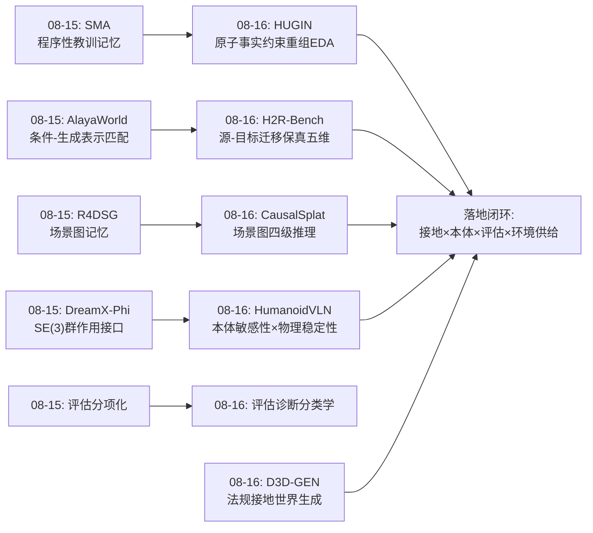
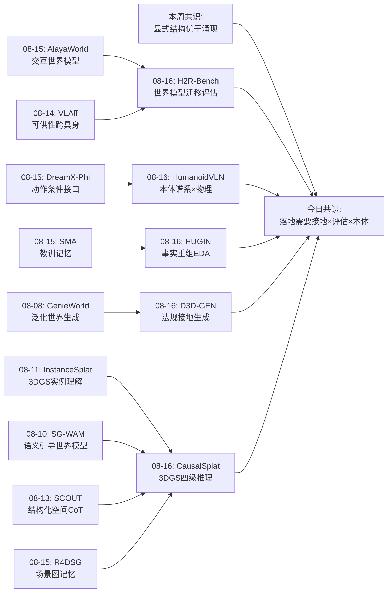
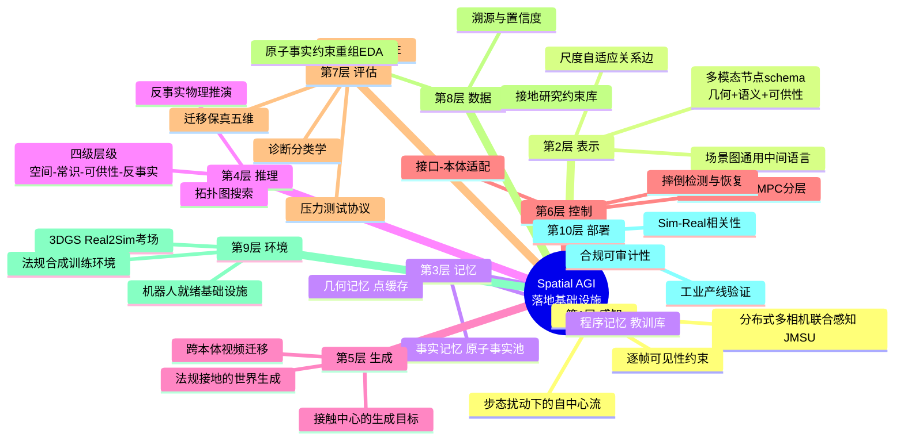
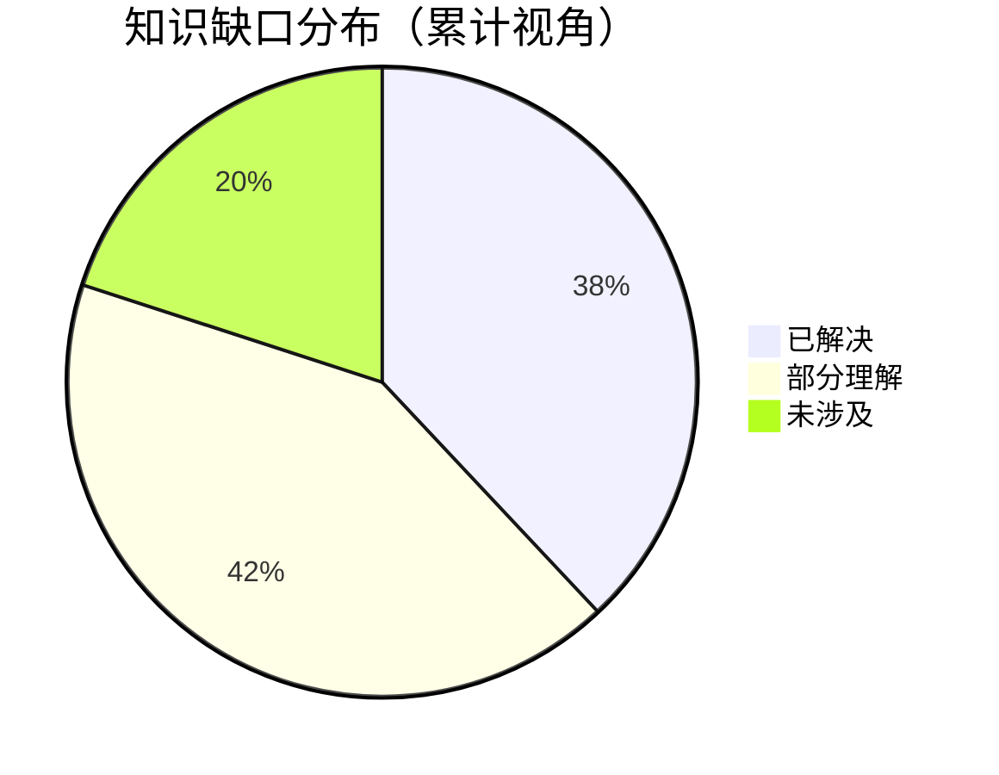

# 每日思考 - 2026-08-16

## 📅 每日总结

**日期**: 2026-08-16
**论文数量**: 5篇
**主题**: 当Spatial AGI走出实验室：**领域接地（知识从哪来）、本体敏感性（身体差异如何处理）、评估诚实化（能力如何被真实测量）、环境供给侧（训练考场如何规模化）**。今天的五篇论文罕见地形成了一个完整的"落地闭环"——HUGIN把VLM规划部署到15,000+包裹的真实物流线，HumanoidVLN把导航放回双足物理现实，H2R-Bench戳破"视觉质量=迁移能力"的幻觉，CausalSplat为3D推理立下四级标尺，D3D-GEN让世界生成带上法规溯源。如果说昨天的关键词是"显式结构"，今天的关键词是**"压力测试"**——每一篇都在用更苛刻的标准暴露现有系统的真实水位。

**关键突破**:
- 🏭 **HUGIN**: 通用VLM（含GPT-5.5）在"空间不相交多相机联合规划"上零样本全部归零——JMSU形式化（IoU空间分离+信息论决策互依赖）+EDA原子事实重组+GCR因果注意力锚点排序，Qwen3-VL-8B从63.6%→78.8%（12.4M样本的RoboBrain也不敌22k任务对齐数据）
- 🧩 **CausalSplat**: 首个四级推理3DGS基准（空间/常识/可供性/**反事实**）——场景图感知-推理解耦架构把Causal-LERF从23.6%推到47.0%（REALM仅11.4%），证明LLM空间推理上限由表示结构化程度决定
- 🎬 **H2R-Bench**: 视频质量与跨本体迁移能力近乎正交（ρ=0.14）——五维协议给接触+本体60%权重，11个模型中帧条件组全线崩塌（M4≈0），灵巧手（近人形态）平均+3.3分揭示本体邻近效应
- 🚶 **HumanoidVLN**: 摔倒率2.7%-71%的巨大跨度宣告"SR不够"——物理接地人形VLN基准（4本体×4模型）+3DGS Real2Sim（Sim-Real r=0.935）+MAA多智能体标注，JanusVLN（显式3D）43.55%第一
- 🏗️ **D3D-GEN**: 领域知识获取任务化——16次接地搜索3分钟构建带溯源约束库（含机器人充电/走廊/停靠的一等公民约束），450个合规世界三域全面领先Holodeck/ProcTHOR

### 📊 一句话总结

**今天的5篇论文共同完成了一次Spatial AGI的"全线压力测试"：通用VLM在分布式空间联合规划上归零（HUGIN）、在跨本体迁移上崩塌（H2R-Bench）、在物理执行下暴露稳定性危机（HumanoidVLN）、在四级推理上远未解决（CausalSplat）——但同时也给出了四条出路：任务对齐的数据工程、结构化的中间表示、诚实的分维评估、法规接地的环境生成。从昨天的"显式结构方法论"到今天的"落地基础设施"，Spatial AGI的研究重心正在从"能不能"转向"可不可信、可不可部署"。**

### 🔗 延续性

**08-15→08-16**: 从"显式结构的实现方法论"到"系统落地的压力测试与基础设施"
**关键演进**: 昨日AlayaWorld的"条件-生成表示匹配"→今日H2R-Bench的"迁移保真五维评估"（生成质量的下游检验）；昨日SMA的"程序性教训记忆"→今日HUGIN的"原子事实约束重组"（知识复利的两种形态）；昨日R4DSG的"场景图记忆"→今日CausalSplat的"场景图推理"（同一表示的消费升级）；昨日DreamX-Phi的"本体动作接口"→今日HumanoidVLN/H2R-Bench的"本体敏感性量化"（从设计单一本体到评估本体谱系）；昨日"评估分项化"→今日三篇评估论文的"评估维度革命"

**今日→明日**: 预期方向——①迁移保真→策略有效的端到端验证闭环；②JMSU形式化向时空-几何联合推理的扩展；③反事实推理与物理仿真的耦合；④法规critic与物理critic的对偶设计

### 💡 本质思考：如何达成通用空间智能

#### 1. 核心能力的本质是什么？

今天五篇论文在昨天的"结构原理"之下揭示了一层更深的**现实原理**：

- **领域接地原理**（HUGIN + D3D-GEN + CausalSplat）：空间智能的知识不在通用预训练分布里，而在领域规范（物流规则/建筑法规/护理工作流）中。HUGIN证明零样本JMSU全部归零、D3D-GEN证明医院域约束密度是住宅的2倍——通用先验越专业越失效，**接地的价值与领域专业度成正比**
- **本体相对原理**（H2R-Bench + HumanoidVLN）：空间能力的度量不能脱离执行主体——同一个模型在灵巧手上+7分（H2R-Bench）、在H1上摔倒率70%（HumanoidVLN）。空间不是客观容器而是"身体-环境耦合关系"，评估必须本体条件化
- **评估分解原理**（H2R-Bench + HumanoidVLN + CausalSplat + HUGIN）：单一分数是能力的幻觉——视觉质量≠迁移（ρ=0.14）、SR≠稳定（摔倒率独立维度）、结果正确≠执行正确（Veo 3.1完成M1却换错本体）、感知好≠推理好（通用VLM零分）。**评估的分维分解是能力真实水位的唯一来源**

三条原理合起来：**可部署的空间智能 = 领域接地的知识 × 本体相对的评估 × 分解的诚实度量**。

#### 2. 当前方法与理想目标的差距在哪里？

- **知识的自动化接地仍浅**：D3D-GEN的约束检索停在法规文本，HUGIN的EDA依赖显式业务规则——开放世界的隐式规范（"厨房那个装垃圾的东西"）仍靠VLM先验硬扛，CausalSplat的47%就是这道墙的高度
- **本体空间只有两个采样点**：H2R-Bench的夹持器/灵巧手、HumanoidVLN的4种人形——本体邻近性曲线只有零星点，无法外推到吸盘/软爪/双臂/全身操作
- **评估与训练脱节**：三个基准都是"只考不教"（零样本/无训练集），物理仿真中的训练闭环缺失
- **物理维度普遍缺席**：H2R-Bench无动力学指标、CausalSplat的反事实靠LLM常识、HumanoidVLN的摔倒检测是判定而非预测——力、摩擦、稳定性的可微建模仍是空白

#### 3. 从今天到理想状态，最可能的路径是什么？

三阶段路径（在昨日"结构总线"路径上的工程化延伸）：

1. **评估基础设施标准化**（当前阶段）：把今天的四个评估维度（迁移保真/物理稳定/推理层级/联合理解）固化为标准工具箱——任何Spatial AGI系统发布前必须跑通四维体检
2. **接地-生成-验证闭环**（中期）：D3D-GEN的法规接地 + 生成世界的合规性验证器（法规critic）+ H2R式迁移保真过滤——环境供给侧的质量门槛自动化
3. **本体条件化的能力学习**（远期）：把本体邻近性从评估变量变成训练条件——在灵巧手数据上预训练、按目标本体条件化微调的"本体条件空间智能"

关键转折点：**迁移保真→策略有效的端到端验证**——H2R-Bench自己承认的缺口。谁能证明"通过迁移保真过滤的生成数据确实训练出更好的策略"，谁就打通了"人类视频→机器人能力"的最后一段路。

---

## 🔗 与昨日思考的联系

### 08-15重点
- AlayaWorld: 条件-生成表示匹配（点缓存/几何重渲染），WBench四项第一
- SMA: 冻结VLM+教训记忆的自演化，跨模型迁移+9.4
- LocusGS: 空间接地token+anchor-to-ray几何偏置
- R4DSG: 相对4D场景图记忆（锚点/身份/转移），7小时→0.58MB
- DreamX-Phi: PRoPE群作用注意力，双臂SE(3)原生接口
- 昨日核心命题："显式结构优于隐式涌现"的五个维度（条件表示/程序知识/空间责任/事件拓扑/群结构）

### 今日进展

今天的5篇论文把昨日的"显式结构"推入"现实检验"：

1. **昨日"条件-生成表示匹配"→今日"源-目标迁移保真"**：AlayaWorld关心生成与条件的一致，H2R-Bench把它推广到跨本体设定（源人类演示→目标机器人形态）并发现质量与保真脱钩——结构匹配原则需要"接触+本体"这样的**功能级**指标而非像素级指标
2. **昨日"程序性教训记忆"→今日"原子事实约束重组"**：SMA蒸馏"怎么推理"的教训，HUGIN的EDA重组"什么事实"的知识——经验复利的两种互补形态（程序记忆/事实记忆），且都依赖"可验证性"作为蒸馏/重组的前提
3. **昨日"场景图记忆"→今日"场景图推理"**：R4DSG用场景图存储经验供检索，CausalSplat用场景图支撑四级推理（常识/空间/可供/反事实）——同一结构从"记忆载体"升级为"推理底座"，且消融证明视觉+拓扑必须联合
4. **昨日"群作用动作接口"→今日"本体敏感性量化"**：DreamX-Phi为单一本体设计SE(3)接口，H2R-Bench/HumanoidVLN则量化了本体谱系上的性能落差（灵巧手+7分/H1摔倒70%）——接口设计需要本体条件化的理论
5. **昨日"评估分项化"→今日"评估维度革命"**：昨日发现"真实感≠忠实度"，今日三个基准把它推向极致：迁移保真五维（H2R）、物理稳定性（摔倒率）、四级推理（CausalSplat）、JMSU信息论（HUGIN）——评估从"分项"进化到"诊断分类学"

### 演进路径



**演进逻辑**: 昨日的五种结构各自证明价值，今日的五个系统各自定义标准——结构需要落地为可信的系统，落地需要诚实的度量。

---

## 📚 论文概览

| # | 论文 | 任务 | 核心方法 | 关键数字 |
|---|------|------|---------|---------|
| 1 | HUGIN | 联合多场景理解(JMSU)工业分拣 | EDA数据增强+GCR全局上下文排序 | 63.6%→78.8%；GPT-5.5零样本0.7% |
| 2 | CausalSplat | 推理3D高斯分割 | 场景图感知-推理解耦+四级推理基准 | Causal-LERF 47.0 vs 23.6 |
| 3 | H2R-Bench | 人→机跨本体视频迁移评估 | 五维协议(接触+本体60%) | ρ=0.14质量-迁移脱钩 |
| 4 | HumanoidVLN | 人形物理VLN基准 | RL步行+3DGS Real2Sim+MAA标注 | 摔倒率2.7-71%；r=0.935 |
| 5 | D3D-GEN | 领域接地世界生成 | 接地研究→约束库→RAG生成 | 450世界三域全领先 |

**主题分布**: 评估基准×3（H2R/HumanoidVLN/CausalSplat）、工业部署×1（HUGIN）、环境生成×1（D3D-GEN）——"基础设施日"。

---

## 💡 核心见解

### 见解1: 通用VLM的"零分现象"揭示了预训练分布的结构性盲区

从HUGIN获得
- ✅ GPT-5.5、GPT-5-nano、Ovis2.5、Qwen3-VL、MiniCPM等全部模型在SortingBench上零样本≈0%——尽管通用VQA能力极强（MME 1400-1700）
- ✅ 12.4M具身样本训练的RoboBrain2.5零样本也是0%，SFT后76.1%仍低于HUGIN用22k样本的78.8%
- ✅ 必要图像干预实验验证了JMSU形式化的预测：去掉关键图后成功率落在理论区间[1/2, 3/5]×原值

**对Spatial AGI的启发**: "跨空间不相交视角的联合决策"不存在于任何预训练分布中——这不是规模问题而是任务结构问题。Spatial AGI的能力清单必须包含"分布式空间信息整合"，而这一能力的获得只能靠任务对齐的数据工程（EDA式约束重组），不能指望规模涌现。**数据配方 > 数据规模**正在成为具身领域的牛顿定律。

### 见解2: 隐藏状态是可塑的"认知地形"——GCR证明排序损失能重塑信息聚合

从HUGIN获得
- ✅ GCR利用causal attention感受野的天然嵌套（局部视觉⊂全局视觉⊂指令意图），在三个锚点间建立margin排序：指令与全局上下文的对齐必须强于任何局部
- ✅ Stop-Gradient设计（固定负样本）避免"降级局部感知"的平凡解；训练后移除，推理零开销
- ✅ +12干扰图压力测试：SFT从63.6%崩溃到18.8%，HUGIN保持69.8%——证据稀释是多图像推理的核心失败模式

**对Spatial AGI的启发**: decoder-only模型的隐藏状态已经是分层的认知锚点，问题只是如何诱导正确使用。这个机制可以推广到所有长上下文空间推理：多房间探索（过去房间⊂当前房间⊂任务目标）、多智能体感知（队友视角⊂全局态势）。**训练时排序约束→推理时零开销**是资源受限部署的黄金模式。

### 见解3: LLM空间推理的上限由空间表示的结构化程度决定

从CausalSplat获得
- ✅ REALM（Agent+MLLM直接推理）11.4% vs CausalSplat（场景图结构化）47.0%——4倍差距是"结构化中间表示价值"的最直接量化
- ✅ 消融：纯文本图40.1→加节点图像反而37.2→完整多模态图47.0——视觉属性与拓扑关系必须联合建模
- ✅ 首次把反事实推理（"移走X后什么会掉"）纳入3D实例级评估——四级层级（空间/常识/可供性/反事实）定义了从感知到因果的能力阶梯

**对Spatial AGI的启发**: 与本周SCOUT（结构化CoT）、JanusVLN（显式3D第一）形成三角验证——**当感知退化或推理加深时，结构化空间表示是唯一的稳定锚**。特征场+场景图的复合表示（连续保精度+离散保逻辑）应该成为Spatial AGI表示层的标准配置。反事实层级的加入预示下一个战场：空间理解→物理因果理解。

### 见解4: 视觉质量与具身迁移能力近乎正交——生成式世界模型的"像素幻觉"

从H2R-Bench获得
- ✅ M5视频质量窄带0.73-0.81，H2RCore跨度30.0-84.6，Spearman ρ=0.14
- ✅ HunyuanVideo质量双本体最高却垫底（M3≈0.185、M4≈0——人类残留）；Veo 3.1拿到最高M1（0.725）却M4仅0.100（换错本体）
- ✅ 视频条件组（Seedance 77.3/84.6）与帧条件组（≤61.5）断层——完整时序证据对功能接触保持至关重要

**对Spatial AGI的启发**: "视频生成即世界模型"的叙事需要重新校准：当前模型的好停留在像素统计，与具身迁移所需的"好"（接触/本体/因果）几乎正交。这为世界模型研究划定了明确攻坚方向——**接触中心的生成目标、本体条件的动力学一致性**。同时五维协议（接触+本体占60%）是"视频数据能否用于机器人训练"的质量门槛模板。

### 见解5: 空间智能的度量必须本体条件化——本体邻近性与物理稳定性

从H2R-Bench + HumanoidVLN获得
- ✅ 灵巧手比平行爪平均+3.3分（9/11模型），视频条件组+7分——源执行者与目标形态的相似度是迁移核心变量
- ✅ HumanoidVLN：H1（10DoF/1.80m）平均SR 20.84%（其他32-37%），摔倒率27-71%——DoF少+重心高→步态不稳→相机抖动→感知退化的级联
- ✅ DualVLN的MPC连续接口在H1上摔倒率仅27%，离散动作模型64-71%——接口类型与弱步态平台的适配性

**对Spatial AGI的启发**: 空间不是客观容器而是身体-环境耦合：同一A*路径对不同形态可行性不同（HumanoidVLN的占用图按身体参数切片膨胀）、同一任务对不同末端执行器难度不同（H2R的抓取模式差异）。**评估矩阵（模型×本体）应该是Spatial AGI的标准实验设计**，且"形态甜点区接近人类参数"为仿人路线提供了数据侧论据。摔倒率的三重检测标准是稳定性维度的可复用模板。

### 见解6: 领域知识的获取本身可以任务化——从手工策展到自主接地

从D3D-GEN获得
- ✅ 单prompt→16次接地搜索→3-4分钟构建带溯源约束库（24-41引用/138-172约束/置信度分层）；医院域最密（82房型/9辖区/90%高置信）
- ✅ 机器人基础设施约束首次成为一等公民：充电净空≥1.2m、双向走廊≥1.8m、集结区2.5m²/台、视线要求
- ✅ 450世界三域全领先：对象密度7.06/房（ProcTHOR 0.52）、VQA 0.400、房间数100%保真

**对Spatial AGI的启发**: 环境供给侧的规模化路径不是扫描（贵）也不是艺术家（慢），而是**规范驱动的合成**。"接地研究→结构化约束库→RAG生成"的三步范式可复制到任何专业领域（机场/工厂/商场）。溯源机制（URL/辖区/置信度）把"空间合法性"引入生成——对安全攸关部署，**可审计性比真实性更是刚需**。

### 见解7: 评估正在从"打分"进化为"诊断分类学"

从全部五篇获得
- ✅ H2R-Bench的失败模式分类：人类残留/无支撑接触/接触区域错位/末端执行器错误
- ✅ CausalSplat的四级推理分层：空间→常识→可供性→反事实（能力阶梯定位）
- ✅ HumanoidVLN的OS-SR缺口（停止决策）与摔倒率（稳定性）分离；HUGIN的干扰鲁棒性/顺序鲁棒性/关键图移除三组压力测试
- ✅ MAA标注的"导航关键属性回验"——连指令生成的质量都有分类学

**对Spatial AGI的启发**: 单一分数把不同失败模式混在一起，诊断分类学让每个系统知道自己"病在哪"。这是基准工程从"排名工具"到"开发工具"的质变——**未来的Spatial AGI基准应该输出"能力体检报告"而非"排行榜名次"**。Yesterday的"评估分项化"今天有了完整的方法论形态。

### 见解8: 场景图正在成为Spatial AGI的通用中间语言

从CausalSplat + D3D-GEN + HumanoidVLN获得
- ✅ CausalSplat：场景图作为感知-推理解耦的中间层（质心/包围盒/类别/可供性节点+尺度自适应边）
- ✅ D3D-GEN：场景图作为自然语言→几何的翻译层（房间邻接+机器人区域注解），且与环境同源生成
- ✅ HumanoidVLN：场景图作为MAA验证的证据层（地标+语义，逐帧掩码限制可见性）
- ✅ 本周更早：R4DSG场景图记忆、EmbodimentSemantic场景图、SPADE/TACS消费场景图

**对Spatial AGI的启发**: 场景图在生成（D3D-GEN）、理解（CausalSplat）、记忆（R4DSG）、验证（HumanoidVLN MAA）四个环节同时出现——它正在成为空间知识的通用中间语言，如同SQL之于数据库。**"场景图总线"可能是结构总线（昨日议题）的最具体候选**。标准化机会：节点schema（几何+语义+可供性+时序）与边类型学（支撑/包含/邻接/遮挡）的社区共识。

---

## 🗺️ 知识演进图



**本周叙事线**: 表示结构化（ InstanceSplat→R4DSG）→ 推理结构化（SCOUT→CausalSplat）→ 行动结构化（G0.5→DreamX-Phi）→ **今天：评估结构化与环境结构化**（H2R/HumanoidVLN/HUGIN/D3D-GEN）——结构化运动从模型内部扩展到整个研究生态。

---

## 技术栈演进对比表

| 层次 | 昨日方案（08-15） | 今日方案（08-16） | 变化 |
|------|-----------------|-----------------|------|
| 数据层 | 既有数据集/仿真（WorldArena等） | EDA原子事实重组（HUGIN）+接地研究约束库（D3D-GEN） | +知识获取任务化：从采集/标注到约束重组/自主检索 |
| 表示层 | 点缓存/锚点球/场景图记忆/SE(3)群 | 场景图推理底座（CausalSplat）+多模态节点schema | 场景图从记忆载体升级为推理底座 |
| 推理层 | 结构化CoT（SCOUT式） | 三阶段指令解析→拓扑搜索→决策（CausalSplat）+GCR排序（HUGIN） | +推理深度动态路由与训练时排序约束 |
| 行动层 | PRoPE群作用注意力 | MPC连续接口×弱步态平台适配（HumanoidVLN） | +接口类型与本体的适配性维度 |
| 评估层 | 分项化（真实感≠忠实度） | 五维迁移保真+摔倒率+四级推理+JMSU信息论 | 评估维度革命：诊断分类学成型 |
| 环境层 | 固定场景库（MP3D/GRScenes） | 3DGS Real2Sim（扫描）+法规接地生成（D3D-GEN） | 环境供给侧双通路：真实考场+合成教材 |
| 部署层 | 基准分数 | 15,000包裹真机验证（HUGIN） | 从基准到产线的跨越 |

---

## 🗺️ Spatial AGI 知识图谱

### 10层架构思维导图



### 🎯 主线技术路径

#### 阶段1: 单点能力验证（已完成——上旬）
以3DGS理解、世界模型生成、VLA控制各自突破为代表：InstanceSplat的实例理解、GenieWorld的泛化生成、G0.5的推理-行动统一。特征：单任务、单本体、合成或固定数据、指标单一。

#### 阶段2: 结构化与显式化（本周中段——正在完成）
昨日的五种显式结构（点缓存/教训/锚点/转移/群作用）+今日的场景图推理底座。特征：中间表示的刻意设计、结构消融验证、跨任务复用。当前的证据链已经足够强：结构化表示在推理（CausalSplat 4×）、稳定性（JanusVLN）、泛化（SMA +9.4）上全面占优。

#### 阶段3: 评估诚实化与环境规模化（今日开启）
诊断分类学（H2R五维/摔倒率/四级推理/JMSU信息论）+环境供给侧双通路（Real2Sim考场+法规合成教材）。特征：本体条件化评估矩阵、迁移保真门槛、压力测试协议、可审计约束库。**当前所处阶段**。

#### 阶段4: 接地-生成-训练-验证闭环（预计下周成型）
领域接地（D3D-GEN式约束库）→合规生成（法规critic）→迁移过滤（H2R式保真门槛）→策略训练→物理仿真验证（HumanoidVLN式考场）→真机部署（HUGIN式产线）。特征：每个环节有质量门槛、全链路可溯源。

#### 阶段5: 本体条件化能力学习（中期）
从"为每个本体单独适配"到"本体条件化的统一模型"：预训练于形态邻近数据（人类视频/灵巧手），按目标本体条件化微调。本体邻近性曲线（H2R的+3.3/分与HumanoidVLN的级联失败）将指导数据配比与课程设计。

#### 阶段6: 空间智能的自我进化（远期）
程序记忆（SMA）、事实记忆（R4DSG）、几何记忆（点缓存）与结构总线协同——系统在新领域中自主接地（D3D-GEN式研究）、自主重组知识（HUGIN式EDA）、自主积累教训（SMA式反思），实现空间经验的复利。

---

## 🔍 待探索议题

### 高优先级（本周）

1. **迁移保真→策略有效的端到端验证**
   - 问题: H2R-Bench承认的缺口——通过五维过滤的生成视频能否真的训练出更好的机器人策略？
   - 候选方案: 用Seedance 2.0生成灵巧手数据→M3+M4≥0.7过滤→模仿学习训练→HumanoidVLN式物理仿真测成功率
   - 缺口: 生成视频到动作标签的对应（视频无低层控制信号，需要逆动力学或潜动作恢复）

2. **JMSU形式化向时空-几何联合推理的扩展**
   - 问题: HUGIN的JMSU停留在跨场景状态比较（计数/占用），如何扩展到几何推理与动态场景？
   - 候选方案: 时序锚点GCR（过去帧⊂当前帧⊂未来意图）+几何谓词进原子事实模式
   - 缺口: 动态JMSU的最小充分集定义；时序信息论刻画

3. **反事实推理的物理引擎耦合**
   - 问题: CausalSplat的反事实（"移走X后什么掉"）靠LLM常识近似，真解法是什么？
   - 候选方案: 场景图支撑边→可微物理模拟器（Warp/Brax 3D）的状态推演；物理critic与法规critic（D3D-GEN方向）对偶设计
   - 缺口: 3DGS场景到物理引擎的资产转换（形状/质量/摩擦估计）

4. **场景图schema的社区标准化**
   - 问题: 场景图在四个环节（生成/理解/记忆/验证）同时出现但schema各异——标准节点（几何+语义+可供性+时序）与边类型学（支撑/包含/邻接/遮挡）能否统一？
   - 候选方案: 整合CausalSplat多模态描述符+R4DSG转移事件+D3D-GEN机器人区域注解
   - 缺口: 跨schema的基准与转换工具

### 中优先级（两周内）

5. **合规性验证器（法规critic）**
   - 问题: D3D-GEN注入约束≠满足约束（LLM数值遵循是概率性的），生成的走廊可能是1.7m而非1.8m
   - 候选方案: 解析world.yaml→逐条几何检查→违反项自动修复循环（SAGE式物理critic的对偶）
   - 缺口: 约束到可计算几何谓词的编译器

6. **本体邻近性曲线的系统测绘**
   - 问题: 本体空间只有零星采样点（夹持器/灵巧手/4种人形），邻近性-迁移损耗曲线无法外推
   - 候选方案: 扩展本体集（吸盘/软爪/双臂/全身操作）×统一任务族的迁移评估
   - 缺口: 本体形态空间的参数化表示（DoF/身高/末端自由度的距离度量）

7. **摔倒预测与恢复策略**
   - 问题: HumanoidVLN的摔倒检测是判定（post-hoc）而非预测（pre-fall），恢复即终止
   - 候选方案: IMU+视觉的摔倒前兆预测→步态自适应调整；摔倒后自主恢复并继续任务的能力维度
   - 缺口: 摔倒前兆数据集（仿真可批量生成）

8. **指令风格鲁棒性分析**
   - 问题: HumanoidVLN的四种指令风格（Fine/Formal/Natural/Casual）分配了但未报告分风格性能——口语指令的退化模式未知
   - 候选方案: 分风格重评现有基准；风格增广训练
   - 缺口: 风格-语义保持的量化标准（MAA的属性回验可复用）

### 低优先级（本月内）

9. **接触中心的生成训练目标**
   - 问题: H2R-Bench的M3五要素（区域/建立/模式/响应/可行性）能否变成可微损失直接优化生成器？
   - 候选方案: 接触区域的检测器监督+物体响应的物理一致性损失
   - 缺口: 接触ground truth的规模化标注（仿真可生成）

10. **多辖区法规差异对机器人部署的量化影响**
    - 问题: D3D-GEN的辖区标签（USA/Germany）暗示同一域在不同法规下应生成不同环境——差异多大？对策略迁移影响多大？
    - 候选方案: 同prompt×多辖区生成对比+跨辖区策略评估
    - 缺口: 多辖区约束库的自动构建（管线已具备）

11. **领域差异的统计配方**
    - 问题: D3D-GEN量化了三域差异（办公8.9 obj/房、医院拓扑最复杂）——训练环境的领域配比应有何理论指导？
    - 候选方案: 领域混合比例×泛化性能的消融研究
    - 缺口: 多域世界模型训练的系统性实验

---

## 📊 知识缺口分析



**已解决（38%）**:
- ✅ 3DGS场景理解的基础能力（开放词汇/指代/实例——InstanceSplat/LEGO等）
- ✅ 显式结构优于隐式涌现的方法论证据（本周五维度+今日场景图4×验证）
- ✅ 世界模型的条件化原则（AlayaWorld表示匹配/DreamX-Phi群作用）
- ✅ 评估分项化与诊断分类学的方法论（H2R五维/摔倒率/四级推理）
- ✅ 环境生成的领域接地通路（D3D-GEN三域验证）
- ✅ 任务对齐数据 > 规模数据的证据（HUGIN 22k vs 12.4M）
- ✅ Real2Sim的行为一致性（r=0.935）

**部分理解（42%）**:
- ⚠️ 跨本体迁移的规律（邻近效应已知，但曲线未测绘、机制未明）
- ⚠️ 反事实空间推理（任务已定义，方法靠LLM常识近似）
- ⚠️ 接触中心的生成（评估有了，训练目标没有）
- ⚠️ JMSU的扩展（静态比较已解决，时空-几何联合未涉及）
- ⚠️ 场景图标准化（各环节各自为政，统一schema未定）
- ⚠️ 法规合规闭环（约束注入有，验证器无）
- ⚠️ 多智能体分布式空间推理（HUGIN是固定相机，移动智能体间未知）
- ⚠️ 训练-评估闭环（基准只考不教）

**未涉及（20%）**:
- ❌ 迁移保真→策略有效的因果验证（全领域空白）
- ❌ 本体条件化的统一能力学习（从单本体适配到条件化泛化）
- ❌ 可微物理与空间理解的耦合（力/摩擦/稳定性的端到端）
- ❌ 开放世界的自主接地（D3D-GEN限3域，HUGIN限显式规则）
- ❌ 空间智能的自我进化生态（记忆/接地/重组的自主循环）
- ❌ 真实世界的长期部署验证（15,000包裹是单点，无跨域持续运营数据）

---

## 📈 今日量化成果

- 论文精读: 5篇（共2516行分析文档，平均503行/篇）
- 累计论文库: 135篇（papers_list.md）
- 新增评估维度: 迁移保真五维（M1-M5+H2RCore）、摔倒率（T1/T2/T3三标准）、四级推理层级、JMSU信息论四条件、合规性溯源
- 新增技术模式: EDA原子事实重组、GCR隐藏状态锚点排序、尺度自适应场景图边、MAA多智能体标注、接地研究约束库
- 关键数字: 63.6%→78.8%（HUGIN）/47.0 vs 23.6（CausalSplat）/ρ=0.14（H2R）/r=0.935（HumanoidVLN）/450世界（D3D-GEN）

## 🎯 今日最重要的三个行动启示

1. **任何Spatial AGI系统的发布都应附"四维体检报告"**: JMSU式联合理解测试（分布式信息整合）、H2R式迁移保真（跨本体）、摔倒率式稳定性（物理执行）、四级推理定位（感知到因果的水位）——单一分数的时代应该结束了
2. **环境建设走双通路**: 真实场景3DGS Real2Sim做考场（HumanoidVLN验证了r=0.935的可行性），法规接地的合成世界做教材（D3D-GEN验证了三域可行性）——不要在合成数据上考试，也不要在真实数据上训练
3. **数据策略优先做"可验证重组"**: HUGIN的EDA证明22k任务对齐样本>12.4M通用具身样本——在采集新数据之前，先问"已有标注能分解出多少原子事实、能按业务规则重组出多少新样本"

## 🔬 论文间深度交叉分析

### 五篇论文的两两对话（10组交叉）

**HUGIN × CausalSplat**: 联合理解的两种战场——HUGIN在特征/token层做跨场景状态比较（无显式3D），CausalSplat在场景图层做跨物体关系推理（显式结构）。互补假设：HUGIN的GCR全局锚点（e_N）与CausalSplat的场景图全局表示可能是同一"世界状态摘要"的两种实现——前者在隐藏空间，后者在符号空间。验证实验：在SortingBench上给HUGIN加场景图中间层是否还能提升？

**HUGIN × H2R-Bench**: 数据管线的两个质量闸门——HUGIN的EDA保证训练数据的标签可审计，H2R的M3+M4保证生成数据的迁移保真。组合愿景：人类操作视频（EgoDex式）→H2R五维过滤（丢弃人类残留/无接触样本）→EDA式原子事实重组（提取可复用操作知识）→机器人训练数据。缺的一环：视频到原子事实的自动解析。

**HUGIN × HumanoidVLN**: 工业固定感知 vs 具身移动感知——HUGIN的多相机是空间不相交但视角稳定（工厂安装），HumanoidVLN的单相机是视角连续但步态抖动。JMSU的形式化（IoU分离+决策互依赖）可以反过来描述移动感知：时间上不相交的观测（走过房间后的记忆）也构成"时序JMSU"——记忆型联合理解。

**HUGIN × D3D-GEN**: 约束驱动系统的两个范例——HUGIN的约束是业务规则（选最多/最大/FIFO），D3D-GEN的约束是建筑法规（面积/宽度/净空）。共同原则：**有显式约束的领域，数据可以重组、世界可以生成、标签可以审计**。EDA与RAG是同一原理（结构化知识复用）在数据侧与环境侧的镜像。

**CausalSplat × H2R-Bench**: 接触与可供性的两副面孔——CausalSplat的L3可供性推理（"开口朝上可抓取的容器"）是静态物体的功能属性，H2R的M3功能接触（"接触服务于同一操作功能"）是动态交互的功能属性。统一概念：**功能等价类**——跨本体（H2R）、跨表述（CausalSplat）的交互语义不变量。

**CausalSplat × HumanoidVLN**: 显式3D的双重胜利——JanusVLN（显式3D空间理解入决策）在物理扰动下SR第一，CausalSplat（显式场景图）在推理任务上4×领先。合并推断：**显式空间表示同时是物理鲁棒性与推理深度的基石**——它为退化感知提供锚点、为隐式意图提供解析底座。

**CausalSplat × D3D-GEN**: 场景图的生产与消费——D3D-GEN生成带机器人区域注解的场景图+环境，CausalSplat消费场景图做四级推理。直接组合：D3D-GEN生成的世界天然是CausalSplat的考场（场景图schema对齐后），四级推理可以在合成世界中程序化评测（反事实的ground truth由生成器知晓）。

**H2R-Bench × HumanoidVLN**: 本体敏感性的操作/移动两域——H2R量化末端执行器差异（夹持器/灵巧手）对操作迁移的影响，HumanoidVLN量化全身形态差异（DoF/身高）对导航稳定的影响。合并的本体参数空间：末端自由度×全身DoF×身高×相机高度——完整的"形态学性能等高线图"需要两个基准的并集。

**H2R-Bench × D3D-GEN**: 生成数据质量的两级框架——D3D-GEN生成静态环境（结构合法性），H2R评估动态迁移（交互保真性）。层级关系：合规的世界是前提，保真的交互是内容——"在哪里做"与"做什么"的质量分离。

**HumanoidVLN × D3D-GEN**: 考场与教材的供给互补——HumanoidVLN的Real2Sim考场（真实扫描，保真但不合规——真实建筑也可能不达标）+D3D-GEN的合成教材（法规合规但可能不真实）——**真实性与合规性是环境质量的两个正交轴**，分别服务评估与训练。

### 结构原语规格说明（今日新增）

昨日清单：锚点/转移/群作用/教训/点缓存。今日新增：

6. **原子事实（Atomic Fact）**[HUGIN]: 最小可验证的空间-状态谓词（数量/邻近/占用/定位）；操作：分解（样本→事实池）、重组（事实×约束→新样本+可审计标签）；价值：1:10监督放大
7. **认知锚点（Cognitive Anchor）**[HUGIN-GCR]: 隐藏状态的感受野边界（局部e_n/全局e_N/意图q）；操作：排序损失（全局>局部，SG固定负例）；价值：训练时塑造聚合、推理时零开销
8. **多模态描述符（Multimodal Descriptor）**[CausalSplat]: 节点=⟨质心c, 包围盒b, 图像I, 属性A{类别/特征/可供性}⟩；边=尺度自适应谓词（物体尺寸×场景范围双容限）；价值：几何-语义-功能的单一节点编码
9. **功能接触五要素**[H2R-Bench]: 区域/建立/模式/响应/可行性——交互语义的最小分解；价值：跨本体的功能等价判定
10. **溯源约束（Provenanced Constraint）**[D3D-GEN]: 值（多态：标量/区间/表达式/表）+适用条件+置信度+来源链；价值：空间合法性的可审计编码

### 本周结构原语清单（持续积累·第6天）

1. 锚点球（空间管辖单位）— LocusGS
2. 转移事件（状态变化拓扑）— R4DSG
3. 群作用（刚体接口）— DreamX-Phi
4. 教训卡（程序抽象）— SMA
5. 点缓存（几何记忆）— AlayaWorld
6. 原子事实（可验证谓词）— HUGIN ★今日新增
7. 认知锚点（隐藏状态感受野）— HUGIN ★今日新增
8. 多模态描述符（场景图节点schema）— CausalSplat ★今日新增
9. 功能接触五要素（交互语义分解）— H2R-Bench ★今日新增
10. 溯源约束（合法性编码）— D3D-GEN ★今日新增

**10个原语的分层归属**: 环境层（溯源约束）、数据层（原子事实）、表示层（锚点球/多模态描述符）、记忆层（点缓存/教训卡/转移事件）、推理层（认知锚点）、行动层（群作用/功能接触）——恰好覆盖10层架构的6层，剩余（感知/评估/部署）层的原语待提炼。

### 失效模式清单（今日新增）

- **证据稀释**（HUGIN）: 干扰图增加→注意力分散→关键证据丢失（+12干扰图SFT崩溃至18.8%）
- **人类残留**（H2R-Bench）: 生成视频中人手未替换、机器人旁观（HunyuanVideo M4≈0）
- **结果-执行者分离**（H2R-Bench）: 任务结果正确但执行者错误（Veo 3.1 M1最高/M4=0.1）——最隐蔽的失败
- **本体-接口失配**（HumanoidVLN）: 离散动作接口在弱步态平台上放大不稳定性（H1摔倒率差3倍）
- **无支撑接触**（H2R-Bench）: 视觉上接触但无功能效果（物体响应与接触脱钩）
- **约束注入不等于满足**（D3D-GEN）: LLM数值遵循的概率性（走廊1.7m vs 要求1.8m）
- **零样本联合理解归零**（HUGIN）: 通用能力无法迁移到空间不相交决策（GPT-5.5=0.7%）

### 概念词典更新（今日新增术语）

- **JMSU**（Joint Multi-Scene Understanding）: 空间不相交+决策互依赖的联合理解任务形式化
- **迁移保真**（Transfer Fidelity）: 源演示证据（目标/动作/接触/响应）在目标本体上的保持度
- **本体邻近性**（Embodiment Proximity）: 源执行者与目标形态的相似度，迁移损耗的核心变量
- **诊断分类学**（Diagnostic Taxonomy）: 按失败模式而非总分组织评估
- **领域接地**（Domain Grounding）: 用领域规范（法规/标准/规则）而非通用先验约束生成与决策
- **原子事实**（Atomic Fact）: 可验证的最小空间-状态谓词，EDA的重组单元
- **空间合法性**（Spatial Legality）: 环境满足法规/标准的属性——与真实性正交的质量轴
- **摔倒率**（Fall Rate）: 物理执行中稳定性失效的频率，独立于任务成功率

### 与上月研究的脉络连接

- 8月上旬的"生成式世界模型热"（GenieWorld/XEWorld/AlayaWorld）→今天H2R-Bench的冷水：生成的"世界"缺交互物理——生成侧的下一个KPI是接触保真而非视觉真实
- 8月上旬的"基准涌现"（Embodied3DBench/Spatial-IQ/WorldOlympiad）→今天的评估方法论成熟：从"更多基准"到"更细诊断"（五维/四级/摔倒率/信息论四条件）
- 上月的"3DGS理解线"（LangSplat→InstanceSplat→LEGO→CausalSplat）：从开放词汇→实例→分层→推理，理解任务沿着语义深度单调推进，下一步显然是物理因果（反事实的真解法）
- 贯穿全月的"显式表示"暗线：场景图从记忆（R4DSG）到推理（CausalSplat）到生成（D3D-GEN）——表示的通用性正在兑现

### 今日论文的局限性汇总与风险提示

| 论文 | 主要局限 | 风险提示 |
|------|---------|---------|
| HUGIN | 决策规则简单（计数/比较）；静态快照假设；无几何推理 | EDA范式在开放规则任务可能失效；结果可能被解读为"VLM已解决工业分拣"（实际仅限结构化规则场景） |
| CausalSplat | 231指令规模小；prompt流水线脆弱；3D mIoU仅14.9% | "四级推理已解决"的误读风险——实际是"问题已定义、方法初步有效" |
| H2R-Bench | 120源/2本体；MLLM评审偏差；无下游验证 | ρ=0.14可能被过度引用为"视频世界模型无用论"——实际头部模型在灵巧手上M3达0.855 |
| HumanoidVLN | 87场景/933集；Sim-Real仅20集试点；H1归因混杂 | 摔倒率数据可能被误用于"某机器人不行"的结论——控制栈质量是混杂变量 |
| D3D-GEN | 259资产瓶颈；Gemini评估循环依赖；约束合规未闭环 | "全自动领域接地"的过度宣传风险——few-shot示例与资产库仍需领域适配工作 |

## 🔍 每篇论文的批判性审视（深度二次思考）

### HUGIN的再审视：工业成功的边界条件

HUGIN的78.8%建立在三个前提上：决策规则可显式编码（FIFO/最多/最大）、观测同步静态、干扰有限（+12图降至69.8%）。当这三个前提松动——规则隐式化（"把易碎的分开放"）、观测异步动态、干扰无限（开放世界）——EDA与GCR还能撑住吗？我的判断：EDA会先失效（原子事实无法定义），GCR更持久（证据整合是通用需求）。因此HUGIN的真正遗产不是"解决了工业分拣"，而是**给出了"什么问题可以被这种范式解决"的判定标准**——可分解、可编码、可审计的任务结构。

另一个被低估的细节：HUGIN在MME（通用能力）上也提升了（1699→1743）——"JMSU训练有正溢出"意味着分布式空间理解不是零和的专精技能，而是与通用智能正相关的底层能力。这为"空间智能是AGI基石"的叙事提供了实验侧支持。

### CausalSplat的再审视：47%的四种解读

47.0%可以读成：(a)场景图架构成功（vs 基线2倍）;(b)任务极难（绝对值低）;(c)基准偏难（常识指令占48.5%）;(d)评审严格（0-4 rubric三评审）。四种解读都对——综合判断：**推理3D理解处于"从不可能到初步可行"的转折点**，架构方向（结构化解耦）已被验证，但距离实用（>70%）还需要：更大基准、端到端训练、物理接地。

值得警惕的细节：CausalSplat用Qwen3-VL-30B做场景图属性标注与推理——如果换成更强模型，基线方法（如REALM agent式）是否也会大幅提升？架构增益与模型能力的交互未被控制。真正干净的对照需要固定推理模型的消融。

### H2R-Bench的再审视：榜单排名的三个混杂

(1)接口混杂：视频条件vs帧条件是信息量差异，前三名清一色视频条件——这既是能力差异也是接口差异；(2)评审混杂：Gemini/GPT评审与被评模型同源；(3)任务混杂：EgoDex以厨房/桌面为主，对物流/工业场景外推性未知。因此"Seedance 2.0最强"应读作"视频条件接口+当前评审偏好下最强"。但核心发现（质量-迁移脱钩ρ=0.14）不受混杂影响——它来自22个模型-本体对的全谱比较。

### HumanoidVLN的再审视：H1冤案的可能性

H1的惨败（SR 20.84%/摔倒70%）有三重解释：(a)形态固有难（10DoF高重心）;(b)步行策略训练不足;(c)PD跟踪器参数未针对H1调优。论文未提供控制栈质量的独立基线（如纯路径跟踪的稳定性测试）。如果(b)(c)占主因，"本体效应"就被高估——这对"选机器人"的产业决策有误导风险。诚实的结论应该是："**在当前控制栈实现下**H1表现最差"。这也提示评估平台需要"控制质量基线"这个标配组件。

### D3D-GEN的再审视：接地深度的自我限制

D3D-GEN接的"地"是显性规范（法规/标准/指南），但真实空间的大量知识是隐性的——护士的实际动线、办公室的社交距离惯例、家庭的杂物分布模式。这些无法通过"接地搜索"获得（不在线上文本中）。下一步可能是：接地搜索（显性规范）+真实扫描统计（隐性模式，如GSA-R2R式的3DGS场景分析）的混合接地。另外450世界的"领先"主要在住宅域对比（基线能做的域），医院/办公的"领先"其实是"独家"——这个区别在宣传中容易被模糊。

---

## 🌙 结语

今天是一个转折点式的研究日：五篇论文不约而同地把镜头从"能力展示"转向"能力检验"。通用VLM在联合空间决策上归零、视频世界模型在跨本体迁移上崩塌、人形机器人在物理执行下摔倒、3D推理在反事实层级上失语——这些"坏消息"恰恰是Spatial AGI走向成熟的标志：**只有诚实的度量才能定位真实的进步**。与此同时，四条出路（任务对齐数据/结构化表示/分维评估/接地生成）都已有了实证支撑。昨天的结构原语（10个）与今天的评估维度（4套）正在拼出Spatial AGI的"工程规范手册"雏形——这个月的每日思考连起来读，就是一部从"涌现信仰"到"结构工程"的范式迁移史。

**明日预期**: 迁移保真的下游验证（本周最关键的空白）、场景图标准化的社区动议、接触中心生成目标的首次尝试、以及可能的——把今天四个评估维度整合成一个"空间智能体检套件"的工作。

---

## 附录A：今日五篇的技术细节档案

### A.1 HUGIN 关键公式与损失

**JMSU四条件（信息论形式化）**:
```
(1) I* ⊆ I 且 |I*| ≥ 2            # 至少两张关键图
(2) μ(P(Ii), P(Ij)) ≤ ε           # 任意两图视野IoU近零
(3) H(Y | I*, T) ≤ δ → 0⁺          # 核心集几乎决定决策
(4) H(Y | S, T) ≥ γ > δ, ∀S ⊊ I*  # 任何真子集保留大量不确定性
```

**GCR损失**:
```
L_GCR = E_n∼U{1,N-1}[ max(0, α + SG(ẽ_n)ᵀq̃ - ẽ_Nᵀq̃) ]
L_total = L_CE + λ·𝟙(N≥2)·L_GCR    # α=0.1, λ=0.01
```

**关键实验数据**:
- 干扰压力测试：SFT 63.6→45.8(+6)→18.8(+12)；Hugin 78.8→76.8→69.8
- 关键图移除：SFT 63.6→35.6（理论区间[31.8,38.2]）；Hugin 78.8→41.6（[39.4,47.3]）
- GCR单独：D_origin上+5.2~6.1（68.8 vs 63.6）
- EDA 首2000合成样本：+11.6%（训练102分钟）
- 5模型提升：+9.2/+29.8/+22.5/+5.1/+15.2

### A.2 CausalSplat 管线三模块速查

```
模块1 语义场：
  空间加权 W = ωmin + (1-ωmin)(1 - d/dmax)   # ωmin=0.4
  对比优化 L = L_pos(加权聚拢) + L_neg(margin=0.03, 硬负τ=0.5)
  实例分配：HDBSCAN聚类 → 代表特征硬分配
模块2 场景图：
  节点 M = ⟨质心c, 包围盒b, 图像I, 属性A⟩
  垂直边：|ΔZ|/d > 0.3 且 水平距 ≤ min(max(0.55·bbox, 0.08·S), 0.35·S)
模块3 推理：
  解析(检测空间词→路由) → 拓扑搜索(锚节点沿边) → 决策
  推理模型：Qwen3-VL-30B-A3B-Instruct
```

**消融链**: 随机权重34.9 → 平均池化35.7 → 空间加权47.0；文本图40.1 → +图像37.2 → +边40.2 → 全图47.0；无解析40.5 / 无拓扑42.2 → 全CoT 47.0

### A.3 H2R-Bench 五维与权重

```
H2RCore = 100 × (0.15·M1_goal + 0.15·M2_action + 0.30·M3_contact + 0.30·M4_embodiment + 0.10·M5_video)

M1 目标状态：加权谓词×25帧（末帧定谓词）
M2 动作事件：必需事件是否清晰发生（不管姿态/轨迹/时序）
M3 功能接触：区域/建立/模式/响应/可行性五要素（源25帧+生成25帧对比）
M4 本体正确：机器人可见/无人手残留/类别/末端类型/时间一致性（无人则0）
M5 质量：MUSIQ+LAION美学+帧差稳定性+AMT-S插值平滑（任务无关）

评审：Gemini 3.5 Flash + Qwen3.7-Plus + GPT-5.4 三评平均（0-4 rubric归一化）
一致性：场景内ρ=0.883 / 聚合r=0.930（3人人类验证）
```

**榜单关键数字**: Seedance 77.3/84.6（双第一）；灵巧手平均+3.3（9/11模型）；视频条件组灵巧手M4达0.885-0.911；帧条件组M4普遍≤0.4

### A.4 HumanoidVLN 摔倒检测三标准

```
T1 动态摔倒：Δh ≥ 0.5Hₑ 且下降速度 > 1.2 m/s
T2 持续塌陷：Δh ≥ 0.5Hₑ 持续 ≥ 2 s
T3 浅动态：0.35Hₑ ≤ Δh < 0.5Hₑ 且速度 > 1.5 m/s
排除：初始直立要求 + 高度阈值（排除正常下蹲）；摔倒即终止无恢复
```

**本体×模型矩阵（SR/FR）**:
```
           G1          H1          Int-A       Int-B
NaVILA     28.19/7.93  21.97/70.95 31.73/2.68  26.80/6.97
StreamVLN  26.80/9.54  14.36/64.52 31.83/2.68  21.54/7.93
DualVLN    35.05/5.47  17.68/27.12 32.69/3.64  30.23/7.07
JanusVLN   44.59/7.40  29.37/30.76 50.38/2.79  49.84/9.97
```

### A.5 D3D-GEN 约束库成本与机器人约束

```
构建成本：住宅183.8s/0.60MTok；办公205.3s/0.73MTok；医院221.4s/0.80MTok
（推理~2s + 研究~150-175s + 结构化~31-43s + 合成~2s）

机器人约束（topic-h自动检索）：
  充电坞净空半径 ≥1.2m（180°接近）
  集结区 2.5m²/机器人
  双向机器人走廊 ≥1.8m
  机器人区-员工站视线要求（安全监控）

领域统计差异：
  办公最杂：8.9 obj/房（5房）
  医院拓扑最复杂：10房61墙段10门
  住宅最稀疏：6.0 obj/房
  医院面积扩展最陡：5→10房 114→246m²
```

---

## 附录B：本周主题图谱总览（第6天）

### B.1 六日主题演进

| 日期 | 主题关键词 | 代表论文 | 核心发现 |
|------|-----------|---------|----------|
| 08-11 | 3DGS理解深化 | InstanceSplat/LEGO | 实例与分层的语义理解 |
| 08-12 | 场景图与语义 | EmbodimentSemantic等 | 语义结构化表示 |
| 08-13 | 空间推理链 | SCOUT/CoST/LEGO | 推理过程显式化 |
| 08-14 | 记忆与能力栈 | MSN-SLAM/G0.5/AtlasVLA/VLAff | 维护→推理→行动三层 |
| 08-15 | 显式结构方法论 | AlayaWorld/SMA/LocusGS/R4DSG/DreamX | 结构优于涌现五维度 |
| **08-16** | **落地压力测试** | **HUGIN/CausalSplat/H2R/HumanoidVLN/D3D-GEN** | **接地×本体×评估×环境** |

### B.2 本周10个结构原语与10层架构映射

```
环境层 ← 溯源约束（D3D-GEN）
数据层 ← 原子事实（HUGIN）
表示层 ← 锚点球（LocusGS）+ 多模态描述符（CausalSplat）
记忆层 ← 点缓存（AlayaWorld）+ 教训卡（SMA）+ 转移事件（R4DSG）
推理层 ← 认知锚点（HUGIN-GCR）
行动层 ← 群作用（DreamX-Phi）+ 功能接触五要素（H2R-Bench）
感知层 ← ？（待提炼：JMSU的空间不相交感知条件？）
评估层 ← ？（待提炼：诊断分类学本身作为原语？）
部署层 ← ？（待提炼：合规可审计性？）
```

### B.3 本周失败模式清单汇总（8条）

1. 证据稀释（HUGIN）：干扰图增加→关键证据丢失
2. 人类残留（H2R）：生成视频人手未替换
3. 结果-执行者分离（H2R）：结果对但执行者错
4. 无支撑接触（H2R）：接触无功能效果
5. 本体-接口失配（HumanoidVLN）：离散接口放大弱平台不稳定
6. 约束注入≠满足（D3D-GEN）：LLM数值遵循概率性
7. 联合理解零样本归零（HUGIN）：通用能力不含分布式决策
8. 反事实推理失语（CausalSplat）：LLM常识近似物理推演

---

## 附录C：Spatial AGI工程规范手册（草案 v0.1）

基于本周（尤其今日）的实证发现，初步起草一套“空间智能系统发布规范”：

### C.1 四维体检（发布前必测）

```
[1] 联合理解测试：分布式多视角决策（JMSU式）
    - 通过标准：关键图移除后行为符合信息论预测（真整合非记忆）
    - 压力测试：+干扰图、顺序打乱、关键图移除三组

[2] 迁移保真测试（跨本体场景适用）
    - 五维分解：目标/动作/接触/本体/质量
    - 接触+本体门槛 ≥0.7；质量分不作筛选依据

[3] 物理稳定性测试（具身执行场景适用）
    - 摔倒率（三重标准）+ 成功率分离报告
    - 控制栈质量基线（纯跟踪任务）必附

[4] 推理水位测试（理解系统适用）
    - 四级定位：空间/常识/可供性/反事实
    - 报告各层级水位而非单一分数
```

### C.2 数据工程三原则

```
[1] 可验证重组优先：先分解已有标注为原子事实，按约束重组放大监督（1:10）
[2] 任务对齐>规模：22k对齐样本>12.4M通用样本（HUGIN实证）
[3] 迁移保真门槛：生成数据必过接触+本体过滤（H2R实证）
```

### C.3 环境建设双通路

```
考场（评估）：3DGS Real2Sim（扫描真实，行为一致性r≥0.9验证）
教材（训练）：法规接地合成（溯源约束库，机器人就绪）
真实性与合规性正交，分别服务评估与训练
```

### C.4 本体适配规范

```
[1] 评估矩阵化：模型×本体全组合报告（非单点）
[2] 接口适配：弱步态平台优先连续动作接口（MPC）
[3] 形态邻近：目标本体接近人类形态时，人类视频可用性更高
```

---

## 附录D：今日金句摘录

> “The source video is treated as evidence of what happened, not simply as a visual style reference.” —— H2R-Bench（源相对评估哲学）

> “If the removed image is sampled uniformly...the expected retained success is [1/2, 3/5] of the original rate. Experimentally, SFT falls from 63.6% to 35.6%.” —— HUGIN（信息论预测被实验验证）

> “Robotics research needs environments that are operationally viable, not just visually appealing scenes that do not transfer to real deployments.” —— D3D-GEN（可运行性>美观）

> “SR alone does not fully capture physical navigation stability.” —— HumanoidVLN（摔倒率的独立宣言）

> “A correct final state alone does not establish successful transfer.” —— H2R-Bench（四指标互补性）

---

## 附录E：今日主题与Spatial AGI大图景的连接

### E.1 “压力测试”阶段的历叐定位

如果把Spatial AGI比作软件工程，那么：

```
2024-2025：原型期（“能跑就行”）
  NeRF/3DGS重建、早期VLN、单任务VLA——证明空间能力可学习
2026上半年：能力期（“能做多好”）
  世界模型生成、开放词汇理解、长时程导航——单项能力逼近实用
2026-08中旬（本周）：检验期（“能信多少”）
  诊断式评估、跨本体测试、真机验证、合规审计——从能力展示到可信度越设
（预期）2026下半年：闭环期（“能落地吗”）
  接地→生成→过滤→训练→验证→部署的全链路质量门禁
```

本周正处于“能力期→检验期”的拐点：今天五篇中的三篇评估论文不是偶然，而是领域成熟的信号——**只有当能力竞争趋同，评估竞争才会成为主战场**。

### E.2 四个“脱钩”发现的合力

本周（尤其今天）发现了四组“脱钩”，它们共同指向一个结论：单一指标时代结束。

| 脱钩对 | 证据 | 含义 |
|-------|------|------|
| 视觉质量 vs 迁移能力 | ρ=0.14（H2R） | 像素统计≠交互物理 |
| SR vs 稳定性 | 摔倒率2.7-71%（HumanoidVLN） | 到达≠安全到达 |
| 结果 vs 执行者 | M1最高/M4=0.1（Veo 3.1） | 任务完成≠机器人完成 |
| 通用智能 vs 联合空间决策 | GPT-5.5=0.7%（HUGIN） | 参数规模≠分布外结构 |

四个脱钩共享同一根源：**现有单指标度量的是能力的外显投影，而非能力的结构未源**。诊断分类学（今日的方法论共识）是对这个根源的直接回应。

### E.3 产业信号解读

- HUGIN的15,000包裹部署：VLM规划已越过工业PoC门槛，但限定在规则可编码场景——下一个商业化的空间智能场景大概率也是“结构化环境+显式规则”（仓储/巡检/分拣）
- VinMotion（车企背景）做人形VLN：汽车供应链向人形机器人迁移的技术溢出开始显现（仿真/控制/传感器复用）
- D3D-GEN的多机构合作（SMU/TUB/马普）：环境生成正在成为独立研究方向，不再只是世界模型的附属品

---

## 附录F：明日研究计划

### F.1 检索策略预设

- 重点查询：video-to-policy / imitation from generated data / contact-rich generation / scene graph standardization / fall prediction humanoid / regulation-aware robotics
- 关注ArXiv新批次：2608.13xxx之后的最新提交
- 留意本周线索的后续：JEPA-WAM系列、WAM scaling、Human2Robot的完整版

### F.2 优先衔接议题

1. 迁移保真→策略有效的端到端验证（高优先议题#1的追踪）
2. 场景图schema统一（与R4DSG/CausalSplat/D3D-GEN的节点定义对齐）
3. 物理仿真与反事实推理的耦合（CausalSplat后续）
4. “四维体检”工具包的可行性论证

### F.3 每日思考的延续线索
- 结构原语清单（10个）→继续提炼感知/评估/部署三层的原语
- 失效模式清单（8条）→按“可预防/可检测/可容忍”分类
- 工程规范手册（v0.1）→v0.2：加入量化门槛与工具链引用

---

**文档创建时间**: 2026-08-16 03:00  
**分析论文**: HUGIN / CausalSplat / H2R-Bench / HumanoidVLN / D3D-GEN  
**累计研究**: 第11天，135篇论文，空间智能知识体系持续构建中
