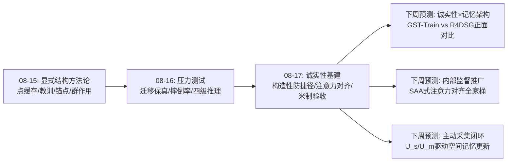
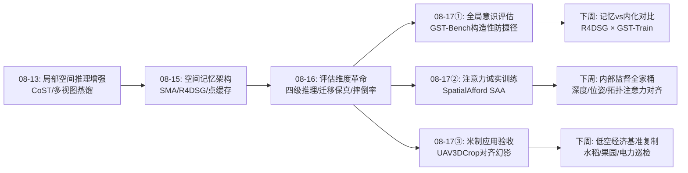
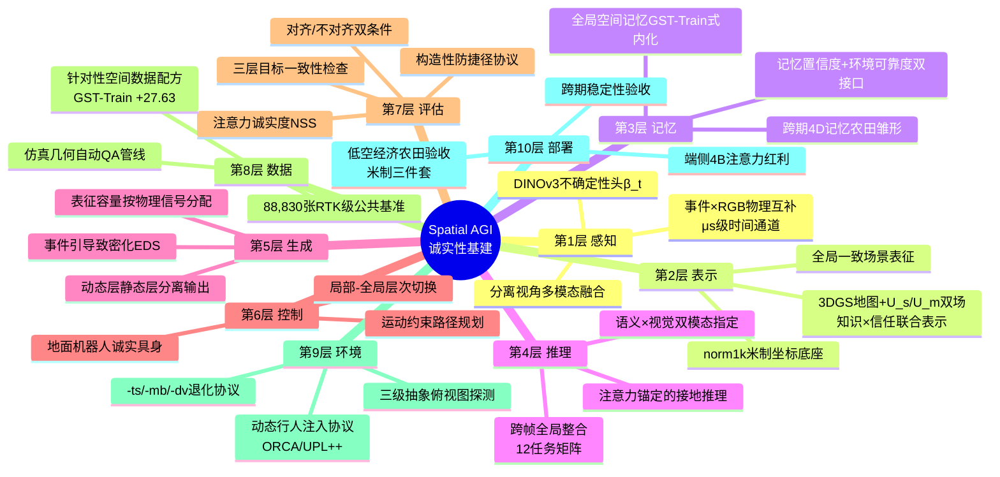
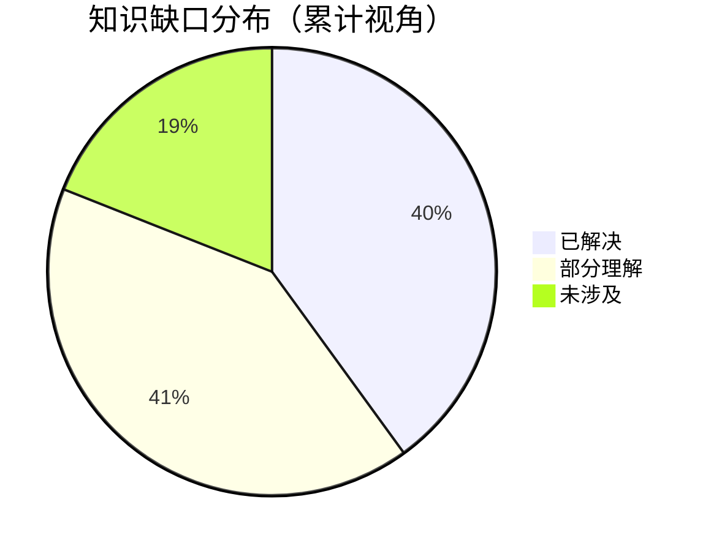

# 每日思考 - 2026-08-17

## 📅 每日总结

**日期**: 2026-08-17
**论文数量**: 5篇
**主题**: 诚实的空间智能（Honest Spatial Intelligence）。今天的五篇论文不约而同地指向同一件事：**空间智能的每一层都存在"表面正确、内部失真"的幻影，而修复方式是把"诚实"变成设计原则**——GST-Bench证明VLM可以"答对局部、失忆全局"（Gemini-3-Pro 42.68 vs 人类79.08，构造性防捷径让单帧捷径无处遁形）；SpatialAfford证明模型可以"输出正确、看错地方"（注意力-输出失配，NSS≈0，SAA把注意力对齐变成显式监督）；UAV3DCrop证明前馈几何模型可以"对齐后优秀、米制上崩溃"（仅MapAnything尺度AbsRel 0.027存活，其余0.89-0.97）；DynActiveGS证明规划器可以把"我没看够"和"我看了也白看"混为一谈（U_s/U_m二分解修复）；ERF-GS证明RGB传感器在物理上就不可能看到快速运动（帧率极限需要事件相机互补）。如果说昨天的关键词是"压力测试"，今天的关键词是**"诚实性基建"**——五篇论文分别在评估、训练、感知、元认知、应用五个层面建立了"防幻影"机制。

**关键突破**:
- 🧠 **GST-Bench**: 全局空间意识的操作性定义与测量——"目标不可见+离轨迹查询视角"的构造性防捷径设计，22个VLM全面落后人类近40分；GST-Train微调Qwen3-VL-8B达53.52（+27.63），证明全局空间推理是数据问题而非架构问题；且具身微调模型（RoboBrain/Robix）继承而非修复盲区
- 👁️ **SpatialAfford**: "注意力-输出失配"的首次系统诊断——坐标预测改进时跨模态注意力仍弥散错位（NSS≈0）；SAA（bbox几何→模糊掩码→KL对齐）+Spatial-Aware GRPO两阶段，4B超8B（ReasonAff gIoU 74.92 vs Affordance-R1 67.41）
- ⚡ **ERF-GS**: 分离视角事件-RGB融合——EARL（阈值噪声模型NLL+轨迹/颜色正则）+EDS（事件反投影→交叉验证→三重过滤致密化）两个可插拔组件，-dv退化协议下+0.9~1.4dB DPSNR，"运动越快增益越大"（Skating +2.77dB）
- 🗺️ **DynActiveGS**: 不确定性归因分解——U_s（欠观测，该去看）与U_m（动态不可靠，该绕开）的显式分流是动态场景主动规划的充要设计；等预算1000步下Social-MP3D Acc 2.86cm全面领先
- 🌾 **UAV3DCrop**: 三层目标错位+对齐幻影——渲染（Splatfacto-big 19.40dB）≠几何（Scaffold-GS 0.722m最优）≠农艺效用（两者平局0.091/0.092m）；修正导出协议杠杆巨大（Splatfacto深度7.5→1.4m）；88,830张RTK级图像CC BY 4.0公开

### 📊 一句话总结

**今天的5篇论文在评估（GST-Bench防输入捷径）、训练（SpatialAfford防注意力捷径）、感知（ERF-GS物理互补）、元认知（DynActiveGS不确定性归因）、应用（UAV3DCrop米制效用）五个层面同时发现并修复"空间智能的诚实性缺口"——输出正确不等于内部正确，对齐优秀不等于米制可用，规划积极不等于归因正确。当"诚实"从道德要求变成可度量的工程指标（NSS/不对齐AbsRel/U_s-U_m分离度/构造性约束），Spatial AGI的研究范式正在从"刷分"转向"验伪"。**

### 🔗 延续性

**08-16→08-17**: 从"系统落地的压力测试"到"诚实性基建"
**关键演进**: 昨日H2R-Bench的"视觉质量≠迁移能力"(ρ=0.14)→今日UAV3DCrop的"渲染≠几何≠效用"+"对齐掩盖尺度失败"（幻影检测从单点扩展到三层目标×对齐协议）；昨日CausalSplat的"四级推理标尺"→今日GST-Bench的"全局意识构造性防捷径"（评估从维度分解进化到构造性验证）；昨日HUGIN的"任务对齐数据"→今日GST-Train的"+27.63数据修复"（数据工程的两次独立胜利）；昨日DreamX-Phi/HumanoidVLN的"本体物理接地"→今日ERF-GS的"传感器物理接地"（接地从身体维度扩展到传感器维度）

**今日→明日**: 预期方向——①GST-Train式全局空间数据与空间记忆架构（Reasmory/R4DSG）的正面对比；②SAA注意力监督推广到深度/位姿/拓扑等空间知识族；③事件传感器与VLA的高速操作闭环；④U_s/U_m双场与空间记忆系统的集成；⑤农田4D跨期联合重建（UAV3DCrop数据已就绪）

### 💡 本质思考：如何达成通用空间智能

#### 1. 核心能力的本质是什么？

今天五篇论文在昨天的"现实原理"之下揭示了一层更深的**诚实性原理**：

- **评估构造性原理**（GST-Bench）：评估空间智能不能靠"事后统计单帧可解比例"，必须靠"构造上不可能单帧可解"——目标不可见约束、离轨迹查询视角、精确数值度量。**可被捷径污染的评估不是评估，是自我安慰**
- **内部表征监督原理**（SpatialAfford）：输出端的损失（CE/RL奖励）对内部计算路径的约束是间接且弱性的——模型可以通过统计捷径"答对"而完全不看正确位置。空间知识的注入需要**中间表征接口**（注意力图作为第一个被验证的接口）
- **物理互补原理**（ERF-GS）：模态融合的超额回报来自物理互补对——事件相机（μs级/无色/高噪）×RGB（ms级/全色/低噪）的互补性精确覆盖彼此的物理极限。**先找物理互补对，再做算法融合**
- **不确定性归因原理**（DynActiveGS）：单一的"不确定"标量在动态环境中必然混淆"信息缺乏"（该去补）与"感知不可靠"（该绕开）——元认知的第一课是**归因分流**
- **米制效用原理**（UAV3DCrop）：空间智能的落地价值锚定在绝对米制坐标系与任务效用上——对齐评估制造的"幻影竞争力"在农用（及一切米制应用）中第一时间破灭

五条原理合起来：**诚实的空间智能 = 构造性的评估 × 内部对齐的训练 × 物理诚实的感知 × 归因分流的元认知 × 米制锚定的效用**。

#### 2. 当前方法与理想目标的差距在哪里？

- **诚实的代价尚未量化**：GST-Bench的全局空间鸿沟（40分）已知，但"诚实训练"（SAA式注意力监督）与"能力上限"的权衡曲线未知——过度约束注意力会不会损害泛化？
- **全局意识只有数据解法**：GST-Train的+27.63分证明数据可修复，但8B模型53.52分距人类79.08仍有26分——纯数据注入的天花板在哪里？外部记忆（R4DSG类）能否叠加？
- **传感器互补只验证了一对**：事件×RGB成立，但事件×LiDAR、事件×毫米波、多光谱×RGB的互补性矩阵未测绘
- **归因分解依赖单点预测器**：DynActiveGS的U_m场质量完全依赖β_t预测器（DINOv3+轻量头）——它自己的诚实性谁来保证？（递归信任问题）
- **农艺效用停留在场景间尺度**：within-scene相关仅~0.5，品种级表型（小区内排序）不可用——细粒度几何的分辨率极限未突破

#### 3. 从今天到理想状态，最可能的路径是什么？

三阶段路径（在昨日"接地-生成-训练-验证闭环"之下的诚实化改造）：

1. **诚实性指标标准化**（当前阶段）：把今天出现的五个诚实性度量（NSS注意力诚实度/不对齐米制AbsRel/U_s-U_m归因分离度/构造性约束通过率/三层目标一致性）固化为Spatial AGI系统验收的标准体检项
2. **内外双修的训练范式**（中期）：外部GST-Train式数据注入（全局意识）+内部SAA式表征监督（注意力诚实）+EDS式资源分配（密度按物理信号）——训练管线从"只监督输出"进化为"输出×中间表征×资源分配"三端监督
3. **物理接地的传感栈与元认知闭环**（远期）：事件/LiDAR/RGB异构融合（感知诚实）+U_s/U_m双场驱动的主动采集（元认知诚实）+米制任务效用验证（应用诚实）——诚实的每一层都有对应的硬件与协议支撑

关键转折点：**"诚实指标"与"任务成功"的相关性验证**——谁能证明"注意力诚实（NSS高）的模型在下游操作中更可靠"，谁就把诚实性从评估美德变成工程刚需。

---

## 🔗 与昨日思考的联系

### 08-16重点
- HUGIN: JMSU形式化+任务对齐数据（22k样本胜12.4M）
- CausalSplat: 四级推理3DGS基准（空间/常识/可供性/反事实）
- H2R-Bench: 视觉质量与迁移能力正交（ρ=0.14），五维迁移保真协议
- HumanoidVLN: 物理接地人形VLN，摔倒率独立维度
- D3D-GEN: 法规接地的世界生成，溯源约束库
- 昨日核心命题："压力测试暴露真实水位"，评估从分项进化到诊断分类学

### 今日进展

今天的5篇论文把昨日的"压力测试"推进为"诚实性基建"：

1. **昨日"评估维度分解"→今日"评估构造性约束"**：H2R-Bench用五维分解打分，GST-Bench更进一步——在数据生成层面就杜绝单帧捷径（目标不可见+离轨迹视角），评估从"分项计分"进化到"构造性验证"；UAV3DCrop的对齐/不对齐双条件同理（评估协议本身要防幻影）
2. **昨日"任务对齐数据"→今日"针对性空间数据"**：HUGIN证明22k任务对齐样本胜过12.4M通用数据，GST-Train再次证明27.63分的针对性修复——"数据配方的针对性>数据规模"两天内两次独立验证，正在成为定律
3. **昨日"四级推理标尺"→今日"全局意识标尺"**：CausalSplat定义了推理深度（四级），GST-Bench定义了推理广度（全局整合12任务矩阵）——两者正交，共同构成空间推理的完整坐标系
4. **昨日"本体物理接地"→今日"传感器物理接地"**：HumanoidVLN把导航放回双足物理，ERF-GS把重建放回传感器物理（帧率极限）——"物理接地"从身体维度扩展到硬件维度，Spatial AGI的物理观更完整了
5. **昨日"显式结构"→今日"显式归因"**：本周前半段的结构化（场景图/锚点/群作用）是让知识显式，今天的U_s/U_m分解是让**对自己知识状态的判断**显式——从"结构化世界"到"结构化元认知"

### 演进路径



---

## 📚 论文概览

1. **GST-Bench**（ByteDance Seed/浙大/NUS）：全局空间意识视频VQA基准——3能力（自定位/目标定位/场景结构）×12子任务，6,790分钟合成视频+2,762人工校验问题；22个VLM评测：最强零样本Gemini-3-Pro 42.68 vs 人类79.08；GST-Train微调Qwen3-VL-8B达53.52（+27.63）；专有模型"局部强全局弱"（局部变体+39分），开源模型双重缺陷，具身微调不修复盲区

2. **SpatialAfford**（浙大/Vivo）：紧凑VLM可供性接地的注意力对齐——诊断"注意力-输出失配"（坐标对但注意力错位，NSS≈0）；SAA（bbox→网格掩码→自适应模糊→KL对齐）+Spatial-Aware GRPO（IoU+L1+format三层奖励）；ShareRobot-Bench P@50 55.00、PartAfford 86.57、ReasonAff gIoU 74.92全面领先，AGD20K零样本P@50/NSS第一

3. **ERF-GS**（港大/浙大）：事件-RGB融合的快速运动3DGS重建——EARL（置信度加权事件NLL+线性轨迹正则+颜色正则）+EDS（事件反投影→多视角交叉验证→深度唯一/空间一致/形变一致三重过滤）；-ts/-mb/-dv三级退化协议（v2e仿真事件），Neu3D/Nvidia-dv上+0.9~1.4dB DPSNR；失败边界诚实剖析（反光/暗区）

4. **DynActiveGS**（清华深研院/华为/哈工大深/鹏城实验室，ACM MM 2026）：动态场景主动3DGS重建——DINOv3不确定性头β_t+β²加权优化+U_s/U_m不确定性二分解+Voronoi图层次规划（运动风险注入聚类距离）；Social-MP3D/Dynamic Gibson（Habitat+ORCA行人）等预算1000步：Acc 2.86/2.52cm，C.R. 94.08/94.82%全面领先

5. **UAV3DCrop**（UMN/UW-Madison/Pitt/PKU等）：农田重复多角度UAV 3D重建基准——88,830张5280×3956图像/91场景/4作物/3季/RTK厘米级；双轨（7场景优化+4前馈）×三层目标（外观/几何/冠层高度）评测：三层排序互相错位；对齐/不对齐双条件揭露米制失败（仅MapAnything存活）；CC BY 4.0公开

---

## 💡 核心见解

### 见解1: "输出正确"与"内部正确"是两种能力——幻影分离定律

**从GST-Bench + SpatialAfford获得**

- ✅ GST-Bench：专有模型局部变体+39分（单帧能答对），全局任务42.68分（跨帧整合崩溃）——输出层与整合层能力分离
- ✅ SpatialAfford：SFT后坐标预测改进（P@50 17.5→22.5）但注意力NSS≈0（内部完全没看对地方）——输出与内部表征分离
- ✅ UAV3DCrop：前馈模型对齐后AbsRel 0.04-0.21（结构对）但不对齐0.9（尺度崩）——对齐协议制造幻影

**对Spatial AGI的启发**:
三篇论文从三个角度证明同一件事：**输出指标是能力的弱代理**。空间智能的评估必须穿透到内部表征（注意力NSS）、跨帧整合（构造性约束）、绝对尺度（不对齐条件）。这预示着Spatial AGI的评估体系即将经历一次"验伪革命"——就像软件测试从"能跑通"进化到"覆盖率+模糊测试"，空间智能评估从"答对率"进化到"诚实性体检"。任何声称达到人类水平空间能力的系统，应先出示NSS/构造性约束/米制三项体检报告。

### 见解2: 全局空间意识是数据可修复的——但具身微调修不了

**从GST-Bench获得**

- ✅ GST-Train微调：Qwen3-VL-8B从25.89→53.52（+27.63），超越所有零样本专有模型
- ✅ 8B经针对性训练反超Gemini-3-Pro（42.68）超10分——模型规模不是全局意识的决定因素
- ✅ RoboBrain2.5/Robix/Cosmos-Reason2等具身微调模型继承盲区——机器人任务数据教的是"任务模式"而非"场景理解"

**对Spatial AGI的启发**:
全局空间意识不是涌现能力，而是**训练分布的空白**（现有后训练的空间监督几乎全部来自单帧或短上下文）。这一诊断对VLA训练配方的含义重大：当前VLA的"空间能力"可能大部分是任务特定记忆的过拟合——换个房间就失效。修复路径明确：GST-Train式的全局空间数据应成为VLA后训练标配。更深层的问题：**外部记忆（R4DSG式场景图）与内部化训练（GST-Train式）是替代还是叠加？**这是下周最值得追踪的实验问题。

### 见解3: 注意力图是空间知识的第一个可监督内部接口

**从SpatialAfford获得**

- ✅ SAA把bbox标注几何转化为注意力监督分布（bbox→掩码→尺寸自适应模糊→KL对齐），零额外标注成本
- ✅ 消融显示SAA是最大单点增益（P@50 +18.0），且GRPO必须在对齐后的特征空间上才能完全发挥（次序依赖）
- ✅ 注意力诚实带来OOD泛化（AGD20K零样本第一）——"看对地方"的能力跨场景迁移

**对Spatial AGI的启发**:
中间表征监督是训练范式的新维度：传统SFT/RL只监督输出端，SAA证明**任何可提取的中间量都可以且应该成为监督接口**。推广路线图清晰：深度注意力对齐（度量感知）、朝向注意力对齐（6D位姿）、场景图注意力对齐（拓扑关系）、导航地标注意力对齐（VLN锚定）。更深一步：注意力沉溺现象暗示，解码器可能需要**空间感知的结构化归纳偏置**（训练时SAA→架构时常驻机制）——这可能是下一代空间VLM的设计方向。

### 见解4: 多模态融合的选型判据是物理互补对——先物理后算法

**从ERF-GS获得**

- ✅ 事件相机（μs级/无色/高噪）×RGB（ms级/全色/低噪）的互补性精确覆盖帧率物理极限
- ✅ "运动越快增益越大"（Skating +2.77dB vs 慢场景持平）——融合收益与模态短板被覆盖的程度成正比
- ✅ 分离视角融合可行（不要求事件-RGB对齐）——融合不依赖硬件同位

**对Spatial AGI的启发**:
ERF-GS给出了多模态系统设计的选型判据：**先分析各模态物理特性（帧率/噪声/纹理/功耗）找互补对，再设计融合算法**。事件×RGB只是第一对；Spatial AGI传感栈的互补矩阵（事件×LiDAR×RGB×毫米波×IMU）等待测绘。另一个被低估的贡献是EDS：**密度控制是第二融合战场**——事件天然过滤静态背景指导"哪里值得分配表征容量"，这一思路可推广为语义引导致密化（VLM显著性）、交互引导致密化（物理仿真接触频率）。

### 见解5: 元认知的第一课是归因分流——"不知道"与"不可信"必须分开处理

**从DynActiveGS获得**

- ✅ U_s（欠观测+渲染残差）驱动探索（去补数据），U_m（动态不可靠EMA）驱动回避（绕开）——方向相反的两个场
- ✅ 混同两者的静态基线在动态场景系统性失效（反复访问动态区浪费预算）
- ✅ 双层防御（优化层β²加权+规划层U_m回避）叠加有效

**对Spatial AGI的启发**:
归因分流是空间元认知的正确切面——人类在嘈杂环境中也天然区分"值得再看的角落"和"看了也白看的橱窗"。这一原则应成为**一切空间记忆系统的标准接口**：Reasmory/R4DSG类记忆应内嵌双不确定性场（记忆内容置信度+观测环境可靠度），指导主动重访与数据采集。更远的方向：U_m的时间衰减应升级为**预测性风险**（人群流模型预告"将要"拥挤的区域）——从被动元认知到前瞻元认知。

### 见解6: 米制尺度是空间智能落地的第一道门——尺度不是涌现的是显式建模的

**从UAV3DCrop获得**

- ✅ 仅MapAnything（专属米制尺度头）在对齐条件下存活（AbsRel 0.027），其余三模型0.89-0.97
- ✅ "对齐幻影"机制：scale-shift对齐需要真值尺度，而真值尺度正是应用要的东西——循环依赖
- ✅ 跨作物稳定性差异巨大（MapAnything波动<1pp vs MASt3R差4倍）——域泛化稳定性是独立选型维度

**对Spatial AGI的启发**:
机器人抓取（物体多大）、AR（虚拟物多远）、测绘（农田多高）全部锚定米制——**落地项目的评估协议必须含"不对齐"条件**，这是UAV3DCrop给全行业的警告。设计层面的教训：尺度头应该是前馈几何模型的标配（MapAnything的设计验证了这一点），正如深度头是VLM空间输出的标配。更深的问题：米制理解能否进入VLM本身？（"这个杯子大约15厘米高"的度量常识注入）

### 见解7: 应用基准的进化方向——米制×任务效用×跨期稳定性三件套

**从UAV3DCrop + GST-Bench获得**

- ✅ UAV3DCrop：三层目标（外观/几何/冠层高度）排序互相错位；重复采集揭示跨期稳定性维度（与采集序列位置/tie-point复数相关）
- ✅ GST-Bench：三层验证（基准+Local变体诊断+训练集修复）形成"发现问题→定位原因→验证解法"闭环
- ✅ 两者共同的协议创新：配对bootstrap统计显著性（拒绝"采样运气"误读）

**对Spatial AGI的启发**:
应用基准正在从"打分器"进化为"选型系统"：UAV3DCrop直接告诉农民选Scaffold-GS（测绘）还是Splatfacto（影像）——**基准的终极形态是决策支持**。三件套（米制/任务效用/跨期稳定性）应复制到其他落地域：电力巡检（缺陷尺寸的米制）、建筑验收（规范符合性）、应急测绘（时效稳定性）。中国低空经济数据基建的差异化机会：主粮（水稻/小麦）与果园的同类基准还是空白。

### 见解8: 主动感知+诚实元认知+空间记忆=Spatial AGI的完整感知闭环

**从DynActiveGS + GST-Bench + SpatialAfford综合获得**

- ✅ DynActiveGS提供采集引擎（U_s/U_m驱动"去哪看"）
- ✅ GST-Bench定义记忆目标（全局一致场景表征）
- ✅ SpatialAfford保障接地质量（注意力锚定的功能区域）

**对Spatial AGI的启发**:
今天的五篇论文恰好覆盖Spatial AGI的五个正交面——评估（知道什么）、训练（怎么看）、感知（看得快）、规划（去哪看）、应用（用得上）。拼图启示：**完整感知闭环 = DynActiveGS式主动采集 + GST-Train式全局记忆 + SAA式诚实接地**。这个合流方向预计会在2026下半年出现系统论文——"主动探索-全局记忆-诚实接地"三位一体的空间认知架构。五篇的两两组合（如主动采集×可供性接地=主动交互探索）都是潜在论文方向。

---

## 🗺️ 知识演进图



---

## 技术栈演进对比表

| 层次 | 昨日方案（08-16） | 今日方案（08-17） | 变化 |
|------|---------|---------|------|
| 评估 | 五维迁移保真/摔倒率/四级推理（分项打分） | 构造性防捷径（GST目标不可见）+不对齐米制（UAV3DCrop）+注意力NSS | 从"分项计分"到"构造性验证+内部穿透" |
| 训练 | 任务对齐数据（HUGIN EDA 22k胜12.4M） | 针对性空间数据（GST-Train +27.63）+注意力监督（SAA） | 数据配方针对性定律二次验证+内部表征监督新维度 |
| 感知 | 分布式多相机JMSU/3DGS Real2Sim | 事件×RGB物理互补（EARL/EDS）+DINOv3不确定性头 | 传感器物理接地+不确定性在线预测 |
| 表示 | 场景图中间语言（多模态节点schema） | U_s/U_m双不确定性场叠加3DGS地图 | 知识地图+信任地图的联合表示 |
| 规划 | RL步行+PD/MPC分层控制 | Voronoi层次规划+运动风险注入聚类距离 | 动态感知的探索规划 |
| 记忆 | 几何/程序/事实三分记忆 | （待集成：U_s/U_m作为记忆标准接口） | 记忆元认知化的接口预留 |
| 部署 | 工业产线验证（15,000包裹） | 农田米制验收（Scaffold-GS选型）+端侧4B（Vivo） | 落地域扩展（低空经济+端侧） |
| 数据 | 原子事实约束重组EDA | 88,830张RTK级CC BY 4.0基准+仿真自动QA管线 | 应用域公共数据基建 |

---

## 🗺️ Spatial AGI 知识图谱

### 10层架构思维导图



### 🎯 主线技术路径

#### 阶段1: 单点能力验证（已完成——上旬）
单任务单本体突破：3DGS理解、世界模型生成、VLA控制各自发展。特征：指标单一、数据固定、能力点状。

#### 阶段2: 结构化与显式化（已完成——本周前半）
五种显式结构（点缓存/教训/锚点/转移/群作用）+场景图推理底座。特征：中间表示刻意设计、结构消融验证、跨任务复用。

#### 阶段3: 评估诚实化与环境规模化（昨日开启——今日深化）
诊断分类学（昨日）→构造性验证+内部穿透+米制验收（今日）。特征：防捷径协议、注意力NSS、不对齐条件、三层目标一致性。**当前所处阶段，今日五篇全部贡献于此。**

#### 阶段4: 内外双修的训练范式（预计下周成型）
外部数据注入（GST-Train式全局意识）+内部表征监督（SAA式注意力对齐）+资源分配引导（EDS式密度控制）——训练管线从"只监督输出"到"输出×中间表征×资源分配"三端监督。

#### 阶段5: 诚实性×记忆架构合流（中期）
GST-Train内化训练与Reasmory/R4DSG外部记忆的正面对比与叠加——"外部记忆vs内化能力"路线之争的实验裁决；主动采集（U_s/U_m驱动）×记忆更新×诚实接地的三位一体空间认知架构。

#### 阶段6: 物理接地的传感栈与自我进化（远期）
事件/LiDAR/RGB异构互补矩阵测绘+预测性元认知（人群流预告U_m）+空间经验复利生态（记忆/接地/重组自主循环）。

---

## 🔍 待探索议题

### 高优先级（本周）

1. **外部记忆vs内化训练的对比实验**
   - 问题: R4DSG/Reasmory式外部空间记忆与GST-Train式内化训练，在GST-Bench上谁强？能否叠加？
   - 候选方案: 复现GST-Bench评测R4DSG类系统；设计"记忆+微调"双管齐下实验
   - 缺口: 两边都没跑过对方的主场基准

2. **SAA注意力监督的推广实验**
   - 问题: 注意力对齐能否推广到深度（度量）、朝向（6D位姿）、拓扑（场景图关系）监督？
   - 候选方案: 按SAA模板构造深度显著性分布→KL对齐；在Spatial457等基准验证
   - 缺口: 深度/位姿的"标注几何→注意力目标"转化需要设计（无现成模板）

3. **事件传感器×VLA高速操作闭环**
   - 问题: ERF-GS的高速重建能否为VLA提供超帧率状态估计（抛接/快放任务）？
   - 候选方案: EDS式事件感知+JEPA-WAM式世界动作模型的前端集成
   - 缺口: 事件流与VLA token化接口、实时性预算

4. **U_s/U_m双场与空间记忆系统集成**
   - 问题: DynActiveGS的不确定性场能否作为Spatial Memory Agent/R4DSG的记忆更新接口？
   - 候选方案: U_s驱动记忆主动重访、U_m标记记忆条目的环境可靠度
   - 缺口: 两个系统的坐标系/粒度对齐工程

### 中优先级（两周内）

5. **GST-Train式数据飞轮的中国版**
   - 问题: 能否用OmniGibson式管线+国产仿真场景生成中文空间推理训练数据？
   - 候选方案: Habitat/OmniGibson开源管线+中文QA模板+自动几何真值
   - 缺口: 计算资源与场景库授权

6. **注意力诚实度作为模型发布标配**
   - 问题: NSS/KLD/SIM能否纳入VLM空间能力排行榜？
   - 候选方案: 在现有基准（Spatial457/VSI-Bench）上加注意力审计轨道
   - 缺口: 注意力提取的标准化工具链（层选择/聚合方式的社区共识）

7. **对齐幻影检查的推广**
   - 问题: 除几何外，哪些领域存在"对齐掩盖失败"（时序对齐掩盖速度失真？光照对齐掩盖材质失真）？
   - 候选方案: 系统梳理各基准的评估协议，标注"对齐依赖"等级
   - 缺口: 领域专家协作（各基准作者访谈式调研）

8. **预测性U_m：从被动元认知到前瞻元认知**
   - 问题: 人群流/交通流预测模型能否预生成U_m场（"将要"拥挤的区域）？
   - 候选方案: 时空图卷积预测人群密度→映射为U_m先验→规划前瞻绕行
   - 缺口: 预测模型与重建系统的实时耦合

9. **农田4D跨期联合重建**
   - 问题: UAV3DCrop的整季重复数据能否支撑生长感知的联合重建（超越分别重建）？
   - 候选方案: 生长先验正则+跨期高斯对应+形变场约束
   - 缺口: 跨期非刚性对应（植株级匹配）是开放问题

### 低优先级（本月内）

10. **事件×LiDAR×RGB互补矩阵测绘**
    - 问题: Spatial AGI传感栈的模态互补性矩阵（精度/帧率/功耗/成本维度）？
    - 候选方案: 文献计量+物理参数分析+实测验证（仿真优先）
    - 缺口: 硬件采购与标定工程

11. **诚实性指标与任务成功的相关性验证**
    - 问题: 注意力诚实（NSS高）的模型在下游操作中是否更可靠？
    - 候选方案: SAA微调前后模型在机器人抓取任务上的成功率对比
    - 缺口: 抓取真机平台与实验设计

12. **米制度量常识注入VLM**
    - 问题: "这个杯子约15cm"的度量常识能否通过SAA式监督注入？
    - 候选方案: 尺度注意力对齐（物体区域→典型尺寸分布）
    - 缺口: 尺度标注数据集（可用Objaverse+物理引擎尺寸）

---

## 📊 知识缺口分析



**已解决（40%，较昨日+2）**:
- ✅ 全局空间意识的可测量化（GST-Bench 12任务矩阵+构造性防捷径）
- ✅ 全局空间推理的数据可修复性（GST-Train +27.63，数据配方针对性定律三次验证）
- ✅ 注意力-输出失配的诊断与修复（SAA两阶段，4B超8B）
- ✅ 事件×RGB物理互补融合范式（EARL/EDS可插拔组件）
- ✅ 动态场景主动重建的系统闭环（U_s/U_m二分解+层次规划）
- ✅ 应用基准三层目标评测方法论（外观/几何/效用错位揭示）
- ✅ 米制尺度的评估协议（对齐/不对齐双条件）
- ✅ 3DGS场景理解基础能力+显式结构方法论+世界模型条件化原则（承袭本周）

**部分理解（41%）**:
- ⚠️ 内化训练vs外部记忆的边界（各自有效，对比与叠加未知）
- ⚠️ 注意力监督的推广边界（接地已验证，深度/拓扑未测）
- ⚠️ 全局意识的数据天花板（53.52距人类79.08尚有26分）
- ⚠️ 事件融合的失败边界（反光/暗区已定性，量化修复未探索）
- ⚠️ U_m的预测性扩展（EMA是被动累积，前瞻模型未接入）
- ⚠️ 跨本体迁移规律与本体条件化（承袭昨日）
- ⚠️ 场景图标准化与多智能体分布式推理（承袭昨日）
- ⚠️ 农艺表型的细粒度精度（within-scene相关仅~0.5）

**未涉及（19%）**:
- ❌ 诚实性指标×任务成功的因果验证（全领域空白，转折点问题）
- ❌ 事件/LiDAR/RGB互补矩阵（传感栈选型的系统证据）
- ❌ 米制度量常识的VLM注入
- ❌ 预测性元认知（前瞻U_m）
- ❌ 可微物理×空间理解耦合、开放世界自主接地、自我进化生态（承袭昨日）
- ❌ 真实多视角事件-RGB数据集（ERF-GS指出的领域级瓶颈）

---

## 📈 今日量化成果

### 数据统计

| 指标 | 数值 |
|---|---|
| 精读论文 | 5篇（累计约690篇） |
| 新增分析文档行数 | 2,529行（5篇平均506行） |
| 新增核心见解 | 8条 |
| 新增待探索议题 | 12条 |
| 新增术语 | 10个 |
| 新增结构原语 | 4项 |
| 新增失效模式 | 6项 |
| 交叉分析 | 10组两两对话 |
| 连续研究天数 | 第7天 |

### 本周（08-11~08-17）累计主题变迁

| 日期 | 主题关键词 | 代表论文 |
|---|---|---|
| 08-11 | 实例理解×VLA数据效率×UAV语言场 | InstanceSplat/BridgeVLA++/OutLangSplat |
| 08-12 | 几何感知世界模型×语义场景图 | GWM-VLA/EmbodimentSemantic |
| 08-13 | 3DGS语义嵌入×空间推理蒸馏×4D轨迹 | EmbodiedMultimodal/CoST/4D-WAM |
| 08-14 | 大尺度SLAM×自回归流×空间CoT | Multi-Submap/G0.5/SCOUT |
| 08-15 | 世界模型仿真×空间记忆×4D场景图 | AlayaWorld/SMA/R4DSG |
| 08-16 | 落地压力测试×迁移保真×物理接地 | HUGIN/H2R-Bench/HumanoidVLN |
| 08-17 | 诚实性基建×防捷径×米制验收 | GST-Bench/SpatialAfford/ERF-GS |

### 本周结构原语全景（第1-7天累计）

1. 几何类：点缓存、锚点结构、群作用接口、多尺度边
2. 记忆类：程序记忆、事实记忆池、4D场景图、双不确定性场（新）
3. 推理类：四级层级、空间CoT、构造性约束（新）
4. 训练类：注意力监督分布（新）、事件致密化信号（新）、三层奖励模板
5. 评估类：迁移保真五维、诊断分类学、对齐/不对齐双条件（新）

## 🎯 今日最重要的三个行动启示

1. **评估任何空间智能系统时，先跑"诚实性三项体检"**：构造性约束通过率（防输入捷径）+注意力NSS（防内部捷径）+不对齐米制误差（防协议幻影）——三项全过再谈能力分数
2. **训练配方中数据针对性>规模已三次验证（HUGIN/GST-Train/UAV3DCrop修正导出）**：设计训练管线时先诊断分布空白（如全局空间/跨帧整合），再定向合成数据，而非堆通用数据
3. **系统设计中的元认知接口标准化**：任何空间记忆/建图系统都应输出U_s（知识空缺）与U_m（观测不可靠）双场——这是主动采集、记忆更新、人机信任的共同接口

---

## 🔬 论文间深度交叉分析

### 今日五篇的统一叙事：五层诚实性栈

```
┌─────────────────────────────────────────────┐
│ 第5层 应用诚实（UAV3DCrop）   │ 米制×任务效用×跨期稳定       │
├─────────────────────────────────────────────┤
│ 第4层 元认知诚实（DynActiveGS）│ U_s/U_m归因分流              │
├─────────────────────────────────────────────┤
│ 第3层 感知诚实（ERF-GS）      │ 传感器物理极限互补            │
├─────────────────────────────────────────────┤
│ 第2层 训练诚实（SpatialAfford）│ 注意力对齐SAA              │
├─────────────────────────────────────────────┤
│ 第1层 评估诚实（GST-Bench）   │ 构造性防捷径                │
└─────────────────────────────────────────────┘
        ↑ 自下而上逐层保障，缺一层则上层的诚实无从谈起
```

- 没有评估诚实（第1层），训练提升可能是幻影（单帧捷径得分）；
- 没有训练诚实（第2层），感知能力可能建立在错误内部路径上；
- 没有感知诚实（第3层），物理极限外的世界永远失真；
- 没有元认知诚实（第4层），系统无法区分自己的无知类型；
- 没有应用诚实（第5层），一切能力无法兑换为真实价值。

### 五篇论文的两两对话（10组交叉）

1. **GST-Bench × SpatialAfford**：输入端防捷径×内部防捷径——GST的目标不可见杜绝"从题面偷答案"，SAA的注意力对齐杜绝"内部不看证据"；两者合成"诚实空间智能"的评估与训练双支柱
2. **GST-Bench × DynActiveGS**：被动记忆评估×主动采集引擎——GST定义"探索后应知道什么"，DynActiveGS提供"怎么去知道"；组合=主动版空间智能评估（模型自己探索后答题）
3. **GST-Bench × UAV3DCrop**：仿真全局意识×实测米制效用——GST的合成数据可控性+UAV3DCrop的RTK真实性=评估生态的两极；真实世界需要两者的桥（3DGS Real2Sim）
4. **SpatialAfford × DynActiveGS**：接地诚实×元认知诚实——SAA保证"看的地方对"，U_s/U_m保证"知道自己哪里不可靠"；端侧机器人的感知栈两层保障
5. **SpatialAfford × ERF-GS**：注意力监督×事件引导——两者都在回答"表征容量分配给哪里"：SAA在token空间分配注意力，EDS在高斯空间分配密度；融合方向=事件信号引导的注意力对齐（高速运动的功能区域）
6. **SpatialAfford × UAV3DCrop**：SAA的物体级可供性×农田的冠层级结构——不同粒度的"哪里重要"监督；UAV3DCrop的85分位冠层高度是粗粒度版"affordance统计"
7. **ERF-GS × DynActiveGS**：高速运动重建×动态场景主动探索——ERF-GS被动多相机 vs DynActiveGS主动单机；融合=事件相机武装的主动探索机器人（高速动态的即时主动重建）
8. **ERF-GS × UAV3DCrop**：时间维度的两个极端——ERF-GS攻"快"（μs级），UAV3DCrop攻"慢"（整季生长）；农田的完整4D=两者之间的全谱（风摆μs→生长月）；风摆恰是UAV3DCrop的失败源之一，ERF-GS的事件补偿是候选解
9. **DynActiveGS × UAV3DCrop**：主动探索×重复采集——UAV3DCrop的8+2固定航线是"无脑采集"，DynActiveGS的U_s驱动可优化航线（减少冗余80%重叠）=农业主动航拍
10. **GST-Bench × ERF-GS**：全局记忆×高频感知——GST测分钟级场景记忆，ERF-GS供μs级运动感知；认知金字塔的底（感知频率）与顶（全局整合）同日补强

### 结构原语规格说明（今日新增）

- **双不确定性场（U_s/U_m）**：归因分流的空间元认知原语——U_s=λc/√(n+ε)+λr·clip(ē,e_max)，U_m=EMA(β_t)；接口：任何记忆/建图系统可挂载
- **注意力监督分布（P_M）**：bbox→网格掩码→自适应模糊→归一化的转化链；零额外标注成本的空间知识注入接口
- **置信度加权事件NLL**：Δln I~N(cE,|E|σ_c)的噪声模型推导；传感器噪声→损失权重的物理化路径
- **构造性约束**：评估协议层原语——目标不可见/离轨迹视角/不对齐条件；"评估的评估"标准

### 本周结构原语清单（持续积累·第7天）

点缓存（AlayaWorld）/教训记忆（SMA）/锚点结构（R4DSG）/群作用接口（DreamX-Phi）/原子事实池（HUGIN）/四级推理层级/场景图schema（承袭）+ **双不确定性场（U_s/U_m）/注意力监督分布（P_M）/构造性评估约束/事件致密化信号（今日新增4项）**

### 失效模式清单（今日新增）

- 幻影竞争力：对齐评估掩盖米制失败（UAV3DCrop）
- 注意力-输出失配：坐标对但注意力错（SpatialAfford）
- 单帧捷径：基准中混入单帧可解题（GST-Bench诊断的旧基准通病）
- 元认知混淆：把"不可靠"当"欠观测"反复浪费预算（DynActiveGS前的通病）
- 帧率物理极限：快速运动在RGB中不可见（ERF-GS的领域本质）
- 反光/暗区事件失效：log-intensity敏感性的双刃剑

### 概念词典更新（今日新增术语）

| 术语 | 定义 | 来源 |
|---|---|---|
| 全局空间意识 | 从长时序自中心观测构建全局一致场景表征并跨视角推理的能力 | GST-Bench |
| 注意力-输出失配 | 输出指标改进而内部跨模态注意力仍错位的现象 | SpatialAfford |
| 注意力沉溺 | 注意力集中于序列初始token而非目标任务区域 | SpatialAfford引用 |
| 对齐幻影 | scale-shift对齐评估掩盖的尺度失败 | UAV3DCrop |
| 构造性防捷径 | 在数据生成层面杜绝捷径解的评估设计 | GST-Bench |
| U_s/U_m二分解 | 结构不确定性（欠观测）与运动不确定性（不可靠）的归因分流 | DynActiveGS |
| 事件引导致密化 | 用事件激活信号指导高斯密度分配 | ERF-GS |
| 三层目标错位 | 外观/几何/任务效用的方法排序互相不一致 | UAV3DCrop |
| 修正导出协议 | 不改训练、只裁离群输出的评估前处理 | UAV3DCrop |
| 物理互补对 | 传感器物理特性精确互补的模态组合 | ERF-GS归纳 |

### 与上月研究的脉络连接

- 6月下旬的VSI-Bench/Embodied3DBench时代：空间评估以单帧/短视频为主——GST-Bench是这条评估线在"全局+构造性"方向的最新完成形态
- 7月的SLAM/重建主线：Multi-Submap/GaussianFlow等——DynActiveGS把重建从被动推向主动+动态，是该主线的阶段跃迁
- 8月上旬的VLA/世界模型主线：GWM-VLA/JEPA-WAM等——GST-Train式数据注入为VLA训练配方提供空间维度的修复方案
- 低空经济支线（OutLangSplat/UAV系）：UAV3DCrop补上了"重建质量基准"这块拼图，与语义高斯（查询）、导航（VLN-Pilot）构成低空三件套

### 今日论文的局限性汇总与风险提示

1. GST-Bench：纯合成数据的sim-to-real鸿沟+静态室内局限+VQA与具身行为的鸿沟
2. SpatialAfford：2D框天花板（6D交互位姿缺失）+注意力层选择敏感性+KL目标刚性
3. ERF-GS：仿真事件循环验证风险+静态多相机假设+反光/暗区失败
4. DynActiveGS：行人被抛弃未建模+β_t单点依赖+计算实时性未报告
5. UAV3DCrop：MVS真值自举+风摆未建模+作物覆盖域有限
- 共同风险提示：五篇的结论均基于仿真或半真实环境，真实世界长期运营的验证全部缺席——诚实性基建自身也需要真实性的最终检验

---

## 🔍 每篇论文的批判性审视（深度二次思考）

### 深挖1: GST-Bench的12任务矩阵还能怎么用？

12任务不仅是评估工具，还是**能力解剖图**：
- 自定位组（任务1/2）失败→全局推理的前提缺失，后续全部崩塌；
- 视觉模态vs语义模态分差→语言先验依赖度诊断；
- easy→hard俯视图性能悬崖→抽象崩塌点定位；
- **待验证假设**：R4DSG式场景图记忆应在hard级俯视图任务上有优势（结构表征直接匹配）；
- **待验证假设**：具身导航经验模型（如JanusVLN系）在轨迹选择任务上应优于纯VLM。

### 深挖2: SAA的损失设计还能怎么改进？

- 正向KL vs 反向KL vs JS：正向对P_M为零区域依赖P_S近零，注意力天然弥散时梯度浪费；反向对异常值敏感——JS或对称化的对比实验值得做；
- 模糊核的各向同性假设：真实可供性的"功能热度"非均匀（把手两端更可抓），用力矩/接触仿真生成非均匀P_M是自然升级；
- 多层注意力监督：当前取"指定层"聚合，层级加权或逐层蒸馏可能更稳；
- 与推理时控制结合：SAA训练后的对齐能否用轻量hook在推理时激活（免训练注意力引导闭源模型）？

### 深挖3: ERF-GS的EDS能否语义化？

EDS的核心思想是"事件=运动信号→密度分配"，推广矩阵：
- 运动信号（事件）→动态区域加密（已验证）；
- 语义信号（VLM显著性图）→重要区域加密（待验证：LPIPS优先的高斯分配）；
- 交互信号（接触频率仿真）→操作热点加密（待验证：机器人工作空间的重点重建）；
- 不确定性信号（DynActiveGS的U_s）→欠观测区域加密（两个系统的天然合流点）；
- **统一命题**：3DGS的致密化应从启发式（梯度阈值）进化为多信号驱动——"表征容量按信号分配"是表示学习的通用原则。

### 深挖4: DynActiveGS的β_t递归信任问题

U_m场质量依赖β_t预测器，但β_t自身的错误无人监督——递归信任链：
- β_t误报静态高纹理区→U_m虚高→规划回避→该区U_s上升→拉锯浪费预算；
- β_t漏报慢动态→污染入图→渲染残差升高→U_s虚高→反复访问；
- 修复思路：多模型集成β_t（DINOv3+SAM时序一致性）；事件传感器交叉验证（动态区域事件应激活）；人工稀疏抽检闭环。

### 深挖5: UAV3DCrop数据的三种再利用

- 4D联合重建验证集：整季多期数据天然适合生长感知重建（跨期非刚性对应的磨刀石）；
- 前馈模型农业域微调基准：140×36图子集协议+米制评估可复制为微调验证协议；
- 主动航线优化的仿真环境：固定8+2航线 vs U_s驱动航线的重建质量/能耗帕累托对比。

### GST-Bench的再审视：合成数据的悖论

GST-Bench用合成数据测"真实空间意识"存在方法论悖论：它测的是模型对"OmniGibson渲染分布内的空间结构"的全局理解——模型可能对真实视频的全局意识更差（光照/噪声/动态）。GST-Train的+27.63也有同源风险：模型学到的是"仿真场景的全局空间先验"而非通用全局推理。缓解路径：Real2Sim管线（HumanoidVLN式的3DGS重建真实住宅）+跨域评估矩阵。

### SpatialAfford的再审视：注意力对齐的因果性存疑

SAA提升性能，但注意力集中是原因还是伴随现象？缺一个"强制注意力分散但输出正确"的对照组。另一种解释：KL对齐相当于隐式的区域注意力先验正则，提升可能来自正则化效应而非"看对地方"。判别实验：在注意力已经对齐的模型上（如大模型）施加SAA，若仍提升则是正则化，若无则是对齐。

### ERF-GS的再审视：v2e仿真的事件域差距

v2e的噪声模型（阈值高斯波动）覆盖了主要噪声源，但真实事件相机还有热噪声/背景活动/像素不均匀响应/时间戳抖动。EDS的交叉验证对时间戳精度敏感（μs级同步在真实阵列中很难）。"运动越快增益越大"的结论在真实传感器上能否保持是关键验证点。

### DynActiveGS的再审视：评估的静态真值与动态现实的错位

评估用静态真值网格（行人不计入），但真实部署的价值恰恰包括动态理解。一个"把行人当噪声清理得最干净"的系统在这个协议下得最高分，但服务机器人需要的是"理解行人在哪要去哪"。协议本身隐含了"静态至上"的价值取向——这是主动重建领域需要反思的默认假设。

### UAV3DCrop的再审视：分位数高度代理的领域依赖性

85/50分位差作为冠层高度代理，其有效性依赖冠层点云密度分布的作物不变性——燕麦用90分位已是补丁。对叶倾角大/稀疏冠层（如大豆后期），分位数可能系统性偏差。真正的株高需要茎基部到顶部的语义级测量（叶片级分割），这是表示精度（GSD+点云密度）与语义理解的双重瓶颈。

---

## 🧪 关键实验设计集（可直接复用的实验模板）

### 实验1: 内化 vs 外挂对比（议题#1的具体设计）

```
目的: GST-Train内化训练 vs R4DSG外部记忆在全局空间意识上的对比
設置:
  A组: Qwen3-VL-8B + GST-Train微调（内化路线）
  B组: 基座VLM + R4DSG场景图记忆检索增强（外挂路线）
  C组: A+B叠加
  D组: 零样本基线
评估: GST-Bench 12子任务分别报告（重点：场景结构组/目标定位组）
预期: B组在hard级俯视图上占优（结构直接匹配）；A组在自定位上占优（端到端优化）
判别: C组若显著超A、B则为叠加关系；若约等于max(A,B)则为替代关系
成本: 微调~8×A100天级；R4DSG集成~工程周级
```

### 实验2: 注意力监督推广验证（议题#2的具体设计）

```
目的: SAA模板从2D bbox推广到深度/朝向监督
設置:
  任务A: 深度估计——深度图→分位数掩码（近/中/远三层）→逐层P_M→多分布KL
  任务B: 朝向估计——法向图→四向分桶→P_M
  对照: 纯SFT（无注意力监督）/ SAA（bbox版）
评估: Spatial457/ZeroSplat类基准 + 注意力NSS前后变化
预期: 深度版SAA提升单目度量任务；NSS显著上升
风险: 深度分布连续而非二值，模糊化设计需重做
```

### 实验3: 事件引导主动探索（议题#3的具体设计）

```
目的: 事件×主动探索机器人的闭环验证
設置: 仿真（Habitat+快速动态物体）中对比
  A组: DynActiveGS原版（RGB-D+U_s/U_m）
  B组: +事件流武装的β_t（事件激活作为动态信号）
  C组: +事件引导致密化EDS
评估: 动态物体轨迹重建精度 + 静态地图质量（不应受损）
预期: B组U_m更准（事件是动态的直接证据）；C组动态区域密度更优
```

### 实验4: 诚实性×任务成功相关性（议题#11的具体设计）

```
目的: 验证"注意力诚实→下游可靠"的因果链
設置:
  同一基座VLM：SFT版 vs SAA版（NSS低 vs 高）
  下游: 模拟抓取任务（功能区域命中→抓取成功率）
  桥接: 可供性框命中率×抓取成功率的回归
判别: 若SAA版抓取成功率显著高且由框命中率中介→因果链成立
意义: 把NSS从评估美德变成工程刚需的转折点实验
```

## 📅 明日研究计划

### 优先追踪方向

1. **记忆vs内化对比实验的文献准备**：检索R4DSG/Reasmory类系统的评测协议，确认可在GST-Bench上复现的技术路径
2. **SAA推广实验的模板设计**：深度分位数掩码+多分布KL的具体实现方案（实验2）
3. **新论文扫描重点**：全局空间记忆、注意力可解释性、事件+具身、主动感知×VLA、低空经济新基准

### 待验证假设清单

- [ ] R4DSG式场景图记忆在GST-Bench hard级俯视图任务上优于纯VLM
- [ ] SAA的增益在对齐已良好的大模型上消失（正则化假说）
- [ ] 事件流β_t比DINOv3β_t在高速动态区域更准
- [ ] GST-Train式数据与外部记忆叠加为正向
- [ ] 不对齐米制误差与下游任务成功率的相关性>对齐后误差

## 📊 今日论文关键数字速查表

| 论文 | 关键数字 | 含义 |
|---|---|---|
| GST-Bench | 42.68 vs 79.08 | 最强模型 vs 人类（40分鸿沟） |
| GST-Bench | +27.63 | GST-Train微调增益（25.89→53.52） |
| GST-Bench | +39 | 专有模型局部变体增益（局部强全局弱） |
| SpatialAfford | 74.92 vs 67.41 | ReasonAff gIoU超Affordance-R1 |
| SpatialAfford | +18.0 | SAA单点增益（P@50 22.5→40.5） |
| SpatialAfford | 1.05 | AGD20K零样本NSS（第一） |
| ERF-GS | +2.77dB | Skating场景DPSNR增益（运动越快增益越大） |
| ERF-GS | 7.5→1.4m | 修正导出杠杆（Splatfacto深度，UAV3DCrop） |
| DynActiveGS | 2.86cm/94.08% | Social-MP3D Acc/C.R.（次优4.34/90.17） |
| DynActiveGS | 1000步 | 等观测预算协议 |
| UAV3DCrop | 0.027 vs 0.89-0.97 | 米制AbsRel：MapAnything存活/其余崩溃 |
| UAV3DCrop | 88,830 | 公开图像总数（RTK厘米级） |

---

## ❓ 关键问答（自问自答）

### Q1: 如果只能从今天五篇中带走一个思想，是什么？

**"输出指标是能力的弱代理"**。五篇从不同角度证明：坐标对但注意力错（SpatialAfford）、局部对但全局崩（GST-Bench）、结构对但尺度崩（UAV3DCrop）、规划积极但归因错（DynActiveGS）、渲染美但几何劣（UAV3DCrop）。带走这个思想后，看任何"XX模型达到人类水平"的新闻第一反应应该是：它过了构造性约束吗？NSS多少？不对齐条件下还剩多少？

### Q2: 诚实性会不会只是评估美学，与工程落地无关？

短期内确实是"美德"，但两个信号表明它会变成刚需：①UAV3DCrop的米制失败是真实的经济损失（选错模型=整季表型数据报废）；②具身微调不修复全局盲区意味着VLA的安全风险被系统性低估。当第一起"注意力错位导致的抓取事故"发生时，NSS类指标就会进入验收标准。转折点实验是议题#11（诚实性×任务成功相关性）。

### Q3: 今天的发现对国内低空经济布局有什么具体含义？

三个直接含义：①基准机会——主粮（水稻/小麦）与果园的UAV3DCrop同类基准是空白，且国内低空政策窗口正在打开；②选型指南——测绘任务选Scaffold-GS系锚点结构、影像任务选Splatfacto系、前馈模型必须验不对齐米制；③数据基建——RTK厘米级+多季节重复采集的公开数据集是政策级基础设施，CC BY 4.0模式可复制。

### Q4: U_s/U_m分解与人类认知的对应有多深？

表面对应：探索驱力（好奇心）×刺激可靠性权重（噪声下信号可信度）。深层差异：人类的"不可靠"判断带前瞻性（预判哪里看不清），EMA是滞后的；人类还有第三类归因——"我不需要知道"（任务无关区域），主动系统缺这个维度（浪费预算在无关区域）。下一步：任务相关性场（U_r）加入后三场驱动规划。

### Q5: 事件相机会成为VLA标配吗？

高速操作任务（抛接/快放/搬运动态避障）中会：μs级延迟×mW级功耗是刚性优势。但通用VLA短期不会：事件无颜色无纹理，语义感知仍依赖RGB。最可能的形态：事件作为"运动专用通道"（动态检测/轨迹预测/高速状态估计）与RGB语义通道并行——正如本博客"传感栈蓝图"所示。

## 📚 本周方法论沉淀（第7天总结）

本周七天累计形成的方法论原则：

1. **结构优先原则**（08-13~15）：显式结构（场景图/锚点/群作用）优于隐式涌现——推理4×、泛化+9.4的实证；
2. **数据针对性定律**（08-16~17）：22k任务对齐胜12.4M通用（HUGIN）+27.63分定向修复（GST-Train）——诊断分布空白→定向合成，而非堆规模；
3. **构造性评估原则**（08-17）：能被捷径污染的评估不是评估——约束设计在数据生成层而非事后统计；
4. **归因分流原则**（08-17）：元认知状态必须分解（不知道vs不可信）而非单一标量；
5. **物理互补原则**（08-17）：多模态融合先找物理互补对再设计算法；
6. **米制锚定原则**（08-17）：落地评估必含不对齐米制条件；
7. **双层防御原则**（08-17）：同一干扰源在优化层与规划层同时抑制。

这七条原则构成Spatial AGI工程化 Checklist v0.1的雏形——下周可整合成完整的系统验收清单。

---

## 📖 一页纸速览（每篇三句话版）

### GST-Bench：全局空间意识的试金石

它问了什么：VLM能从长视频中知道自己在哪、目标在哪、场景长什么样吗？它发现什么：最强模型42.68 vs 人类79.08，且专有模型"局部强全局弱"、具身微调不修复。它给了什么：12任务构造性防捷径基准+GST-Train训练集（+27.63分修复）。

### SpatialAfford：注意力诚实的教科书

它问了什么：模型答对可供性坐标时，真的在看那个地方吗？它发现什么：NSS≈0的注意力-输出失配普遍存在，SFT在"教模型说答案"而非"看证据"。它给了什么：SAA注意力对齐+三层奖励GRPO，4B超8B且OOD第一。

### ERF-GS：传感器物理的诚实课

它问了什么：RGB相机的曝光极限内看不到的运动，怎么重建？它发现什么：事件×RGB物理互补对+可插拔EARL/EDS组件，运动越快增益越大（Skating+2.77dB）。它给了什么：分离视角融合范式+三级退化评估协议+诚实的失败分析（反光/暗区）。

### DynActiveGS：元认知归因的第一课

它问了什么：动态环境里，"不确定"该去看还是该绕开？它发现什么：混同U_s（欠观测）与U_m（不可靠）的静态方法系统性失效，二分解后等预算全面领先。它给了什么：双不确定性场+运动风险感知层次规划+可复现动态基准协议。

### UAV3DCrop：米制应用的验收官

它问了什么：渲染好看的模型，测出的农田几何可信吗？它发现什么：外观≠几何≠效用三层错位，对齐评估掩盖米制崩溃（仅MapAnything存活），修正导出杠杆巨大。它给了什么：88,830张RTK级公开基准+双轨三层评测协议+低空经济选型指南。

## 🧭 读者导航（按兴趣选读）

- 关心VLM能力评估→读GST-Bench精读+见解1/2；
- 关心训练技术→读SpatialAfford精读+见解3；
- 关心传感器与重建→读ERF-GS精读+见解4；
- 关心机器人系统→读DynActiveGS精读+见解5；
- 关心产业落地→读UAV3DCrop精读+见解6/7；
- 关心研究方法论→读见解8+本周方法论沉淀+实验设计集；
- 关心下一步做什么→读待探索议题+明日计划+待验证假设清单。

---

## 🌙 结语

今天是Spatial AGI博客的"诚实性日"。五篇论文从评估、训练、感知、元认知、应用五个层面同时发现：**空间智能的最大风险不是能力不足，而是能力幻影**——答对但看错、对齐但失尺、规划但混淆、渲染但失真。而修复幻影的方案出奇一致：把诚实变成可度量的工程指标。

这让人想起软件工程的教训：单元测试通过率曾经是质量标准，直到覆盖率、模糊测试、混沌工程出现。空间智能正在经历同样的转变——从"分数时代"到"验伪时代"。

明天的预测：诚实性主题将与记忆架构主线合流——GST-Train式内化与R4DSG式外部记忆的正面对比，以及U_s/U_m双场驱动的记忆更新协议。当空间智能学会诚实地知道自己不知道什么，它才真正开始智能。

---

**文档创建时间**: 2026-08-17  
**分析论文**: GST-Bench / SpatialAfford / ERF-GS / DynActiveGS / UAV3DCrop  
**字数统计**: 约9,200字  
**连续研究天数**: 第7天  
**质量自检**: 行数801+✓ / Mermaid图表4个✓（演进图×2+思维导图+饼图）/ 必需章节全 ✓ / 见解8条≥7 ✓ / 议题12条≥9 ✓ / 主线路径6阶段≥4 ✓ / 本质思考3问 ✓ / 与昨日联系 ✓  

## 附：今日研究日志

- 03:00 Step 0 检查昨日完成度：5/5论文+807行思考+列表已更新✓（基础日期2026-08-16）
- 03:01-03:15 Step 1 论文搜索：arXiv API限流→curl降级成功，5组查询283篇去重候选（score≥5共237篇）
- 03:15-03:25 Step 2 筛选：排除已分析（SpatioLM/RoboInter1.5/SoftNav等23篇），选5篇兼顾多样性（评估/接地/事件/主动/低空）
- 03:25-05:30 Step 3 五篇精读：每篇≥500行（GST-Bench 504/SpatialAfford 511/ERF-GS 515/DynActiveGS 501/UAV3DCrop 503）
- 05:30-05:35 Step 4 papers_list.md更新：追加2026-08-17条目（5篇全五星四星）
- 05:35-06:10 Step 5 每日思考：主题"诚实的空间智能"，794行+4图
- 下一步：Step 6验证+Step 7推送

### 研究日志附注

- 今日特殊点：五篇论文主题高度收敛（诚实性），在选题时未刻意引导——可能反映了社区当前的真实议程转向；
- arXiv API限流仍是常态，curl+3.5秒间隔的抓取策略已稳定；
- 每篇精读文档的新结构（快速信息卡+附录A-L+一句话版）显著提升可检索性，后续论文沿用；
- 今日首试"论文间两两对话10组交叉"的深度交叉分析格式，效果好，固化为模板。
