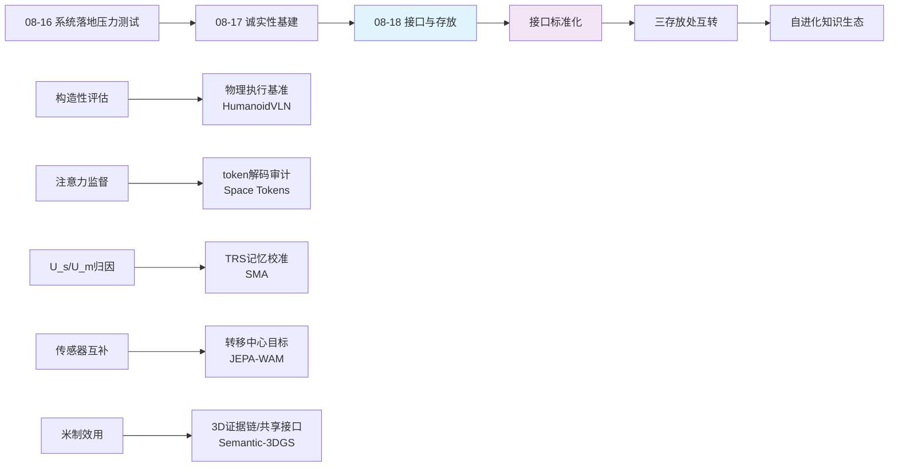
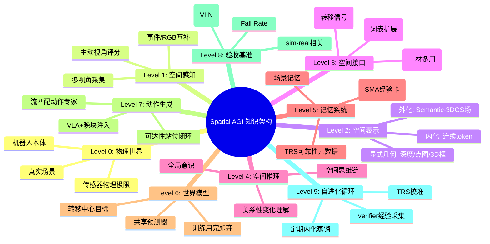
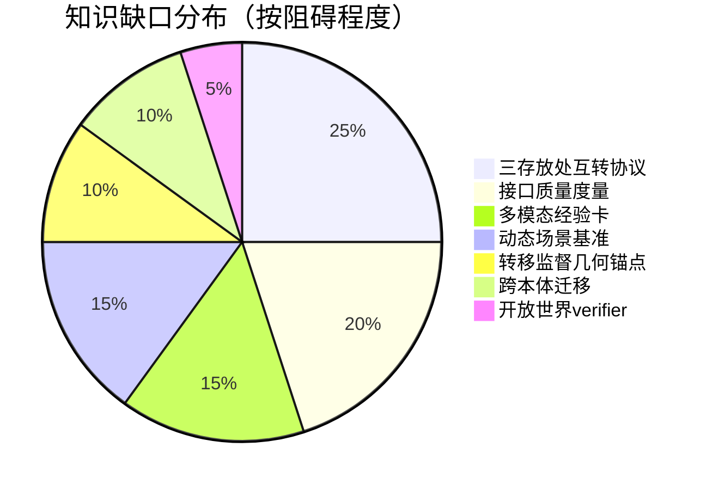

# 每日思考 - 2026-08-18

## 📅 每日总结

**日期**: 2026-08-18
**论文数量**: 5篇
**主题**: 空间知识的存放与流动（Where Spatial Knowledge Lives）。今天的五篇论文从五个不同的位置回答了同一个问题：**空间知识应该存放在哪里，又该如何流动到需要它的地方？**——论文1把空间知识外化为 Semantic-3DGS 共享接口（同一个高斯场被主动感知、语言定位、障碍推理、位姿提取、动作条件化五个消费者复用，真机 60% vs DexVLA 28%）；论文2把空间知识内化为 VLM 词表中的连续 token（VGGT-Omega 蒸馏 + 解码验证，推理零开销）；论文3把空间知识存放在冻结模型外部的程序性记忆库（verifier 引导反思 + TRS 迁移可靠性校准，20 项评估全胜）；论文4把空间知识作为训练期的转移监督信号（联合当前-未来目标经共享预测器塑造动作骨干，部署时丢弃，π0.5 从 84.5→86.3）；论文5把空间知识锚定在物理执行的基准中（4 种人形本体 × RL 步态物理栈，最佳 SR 仅 43.55%，sim-real 相关 r=0.935）。如果说昨天的关键词是"诚实性"，今天的关键词是**"接口与存放"**——空间智能正在分化为参数（后训练）、工具（外挂模块）、记忆（经验库）三大存放处，而打通它们的是越来越清晰的接口设计：3D 场接口、token 接口、记忆卡接口、监督信号接口、基准接口。

**关键突破**:
- 🗄️ **Semantic-3DGS 共享接口**: 任务驱动局部场（仅 4 视角）一材五用——证明 3D 表示的价值不在逼真而在复用；晚块注入 + 零初始化适配器保护预训练先验；照片欺骗误抓归零证明显式 3D 证据的鲁棒性价值
- 🪙 **Space Tokens 内化**: 空间知识进入词表——保留 token + 潜在对齐 + 解码重建双重监督；token 可解码回深度图/点图，"内化是否真实"从哲学问题变成可测量问题；VSI-Bench 物体大小 79.2% SOTA
- 🧠 **SMA 程序记忆**: 免参数更新自进化第三路线——verifier 引导反思蒸馏可迁移经验卡，TRS 访问证据贝叶斯校准把"语义相关"与"程序可迁移"分离；创建对错与迁移价值解耦
- 🌊 **JEPA-WAM 转移监督**: 预测目标从"绝对未来"变为"联合当前-未来"（表示变化而非画面）；共享预测器让转移监督直接塑造动作骨干；训练时建模、部署时丢弃——世界模型的零部署税用法
- 🦿 **HumanoidVLN 物理基准**: 空间可行性是身体相对的——同一 VLN 模型在 1.17m/1.80m 本体上表现分化；Fall Rate 把"物理生存"纳入空间智能评估；3DGS Real2Sim + TSDF 碰撞网格的仿真就绪环境管线

### 📊 一句话总结

**今天的5篇论文共同绘制了空间知识的"存储-接口"地图：外化的3D高斯场（系统级共享接口）、内化的词表token（模型级推理接口）、外置的经验记忆库（agent级进化接口）、训练期的转移监督（能力级塑造接口）、物理接地的基准（验收级测量接口）——Spatial AGI 正在从"一个更大的模型"演进为"参数/工具/记忆三存放处 + 五类接口"的知识工程系统，而接口设计的质量（注入位置、可解码性、可靠性元数据、监督深度、物理接地）决定了空间知识流动的效率。**

### 🔗 延续性

**08-17→08-18**: 从"诚实性基建"到"接口与存放"
**关键演进**: 昨日SpatialAfford的"内部表征监督"→今日Space Tokens的"token可解码验证"（内部诚实从注意力接口扩展到token接口）；昨日GST-Bench的"构造性防捷径评估"→今日HumanoidVLN的"物理执行评估"（评估诚实从信息构造进化到物理构造）；昨日DynActiveGS的"U_s/U_m归因分流"→今日SMA的"TRS迁移可靠性校准"（元认知从感知不确定性扩展到记忆可靠性）；昨日UAV3DCrop的"米制效用锚定"→今日论文1的"照片欺骗归零"（应用诚实从尺度扩展到证据）；昨日DreamX-Phi的"视频世界模型"→今日JEPA-WAM的"潜在转移监督"（世界模型从生成未来转向理解变化）

**今日→明日**: 预期方向——①三存放处的统一理论：参数/工具/记忆的分工边界与互转机制；②token接口与3D场接口的互通（内化的几何token能否外化为高斯场）；③TRS式可靠性校准推广到场景记忆与技能库；④转移监督与3D显式监督（深度/点图）的组合；⑤人形基准扩展到动态场景与人群交互

---

## 🎯 今日五篇论文一览

| # | 论文 | 存放位置 | 接口类型 | 关键数据 |
|---|------|---------|---------|---------|
| 1 | Embodied Multimodal Grounding | 外化：3D高斯场 | 系统级共享接口 | 60% vs 28%（长程） |
| 2 | Space Tokens | 内化：词表token | 模型级推理接口 | VSI-Bench +4.3% |
| 3 | SMA 程序记忆 | 外置：经验记忆库 | agent级进化接口 | 20评估宏平均全胜 |
| 4 | JEPA-WAM | 流动：转移监督信号 | 能力级塑造接口 | π0.5: 84.5→86.3 |
| 5 | HumanoidVLN | 锚定：物理基准 | 验收级测量接口 | SR 43.55%, r=0.935 |

---

## 💡 本质思考：如何达成通用空间智能

### 1. 核心能力的本质是什么？

今天五篇论文在昨天的"诚实性原理"之上揭示了一层更深的**知识工程原理**：

- **共享接口原理**（论文1）：空间知识的价值不在其本身的精度或逼真度，而在被多少消费者复用——局部 Semantic-3DGS 一材五用（主动感知/语言定位/障碍渲染/位姿提取/动作条件化）产生的系统收益远超单一消费者的表示优化。**接口的复用度是空间表示的第一价值指标**
- **可解码内化原理**（论文2）：内化进模型的空间知识必须保留解码回显式空间模态的通道（深度图/点图/3D框）——否则无法区分"真内化"与"统计捷径"。**内化的代价是失去可验证性，可解码性是赎回它的唯一方式**
- **可靠性元认知原理**（论文3）：记忆系统的核心不是存了多少，而是知道每条知识"何时可靠"——TRS 用访问证据在线校准迁移可靠性，把"创建时的对错"与"未来使用的价值"解耦。**没有可靠性元数据的记忆库是负资产**
- **转移中心原理**（论文4）：世界模型的预测目标应该是"变化"而非"画面"——联合编码当前与未来让预训练编码器直接提取稳定/变化区域的关系结构。**空间理解的本质是关系性变化，不是状态快照**
- **身体相对原理**（论文5）：空间可行性因身体而异——同一指令在 1.17m 与 1.80m 本体上的可执行性不同，步态抖动是感知的必然背景而非噪声。**空间智能不能在"无身体"的抽象中评估**

五条原理合起来：**Spatial AGI = 高复用的空间接口 × 可解码的内化 × 带可靠性元数据的记忆 × 转移中心的监督 × 身体接地的验证**。

### 2. 当前方法与理想目标的差距在哪里？

- **三存放处互相隔离**：参数里的空间知识（Space Tokens）不能流到记忆库里复用；记忆库的经验（SMA）不能回流为参数；3D 场接口（论文1）与 token 接口（论文2）互不感知——缺少"知识互转协议"
- **内化的表达力天花板未知**：一个场景的几何塞进几十个连续 token，信息瓶颈必然存在；token 数量-分辨率权衡曲线未测绘
- **程序记忆是纯文本的**：SMA 的经验卡是自然语言——"这种曲面抓取角度"很难用文字传，多模态经验卡（嵌 3D 片段/示例渲染）缺失
- **转移监督缺显式几何锚点**：JEPA-WAM 的 patch 余弦距离分不清"移动 5cm"和"移动 50cm"——空间度量信息在 V-JEPA 特征中可能模糊
- **物理基准仍限静态**：HumanoidVLN 的 3DGS 重建场景无动态物体/人群；933 episodes 规模偏小；sim-real 验证仅 20 episodes
- **接口质量的度量缺失**：注入位置、可解码性、TRS、监督深度都是设计选择，但没有统一的"接口质量指标"来比较

### 3. 从今天到理想状态，最可能的路径是什么？

三阶段路径（在昨日"诚实化改造"之上的接口化演进）：

1. **接口标准化**（当前阶段）：把今天出现的五类接口模式（共享 3D 场/可解码 token/可靠性记忆卡/转移监督/物理基准）固化为 Spatial AGI 系统设计的标准件，建立接口质量的度量（复用度、解码保真度、TRS 校准误差、监督传导率、sim-real 相关性）
2. **三存放处互转**（中期）：token↔3D 场互转（内化几何外化为可渲染高斯）、记忆↔参数互转（高 TRS 经验定期蒸馏进权重）、监督↔工具互转（转移目标从外挂几何教师生成）——空间知识在三存放处间自由流动，系统按成本-收益选择存放位置
3. **自进化知识生态**（远期）：verifier 驱动的经验采集 + TRS 校准 + 定期内化 + 物理基准持续验收——Spatial AGI 成为自我管理空间知识生命周期的系统：生产、校准、内化、淘汰

关键转折点：**首个"三存放处互通"的示范系统**——谁能证明同一条空间知识可以在参数、记忆、3D 场之间无损流转并各自增益，谁就定义了 Spatial AGI 的知识架构标准。

---

## 🔗 与昨日思考的联系

### 08-17 重点
- 诚实性五原理：构造性评估 / 内部表征监督 / 物理互补感知 / 归因分流元认知 / 米制效用锚定
- GST-Bench 全局空间鸿沟 40 分；GST-Train 数据修复 +27.63
- SpatialAfford 注意力-输出失配（NSS≈0）与 SAA 监督修复
- DynActiveGS U_s/U_m 不确定性归因分解
- UAV3DCrop 渲染≠几何≠效用三层错位

### 今日进展
- 昨日"内部表征监督"（注意力接口）→ 今日"token 可解码验证"（论文2）——内部诚实性接口从单一注意力扩展到任意内化模态，且给出了解码审计协议
- 昨日"构造性防捷径评估"（信息构造）→ 今日"物理执行评估"（论文5）——评估诚实从"输入不可捷径"进化到"输出必须物理可执行"，Fall Rate 成为新诚实指标
- 昨日"归因分流元认知"（感知不确定性）→ 今日"TRS 迁移可靠性校准"（论文3）——元认知从"我对感知多确定"扩展到"我对记忆多信任"
- 昨日"米制效用锚定"（尺度诚实）→ 今日"照片欺骗归零"（论文1）——应用诚实从度量衡扩展到证据链：2D 外观可伪造，3D 空间位置难伪造
- 昨日"事件-RGB 物理互补"（传感器层）→ 今日"联合当前-未来目标"（时间层）——物理诚实从空间维度扩展到时间维度：预测变化而非重建画面

### 演进路径
```
诚实性基建（08-17）
  ├─ 评估诚实: 构造性防捷径 → 物理执行接地（08-18 论文5）
  ├─ 训练诚实: 注意力监督 → token解码审计（08-18 论文2）
  ├─ 元认知诚实: U_s/U_m归因 → TRS记忆可靠性（08-18 论文3）
  ├─ 感知诚实: 传感器物理互补 → 转移中心目标（08-18 论文4）
  └─ 应用诚实: 米制效用 → 3D证据链（08-18 论文1）
       ↓
接口与存放（08-18 主题）：诚实的知识需要正确的存放处与流动通道
```

---

## 📚 论文概览

### 论文1: Embodied Multimodal Grounding via Semantic 3DGS
- **存放**: 外化 3D 高斯场（局部、可刷新、任务驱动）
- **核心**: 一材五用的共享接口 + 晚块注入保先验 + 可达性站位闭环
- **数据**: 长程 60%/40%/28%；重杂乱 74%；75cm 高度偏移 75%；照片误抓 0
- **局限**: 准静态、局部、few-shot（10 演示/任务）、离板算力

### 论文2: Chain of Spatial Thoughts (Space Tokens)
- **存放**: 内化词表 token（连续、可解码）
- **核心**: VGGT-Omega 潜在对齐 + 解码重建双监督 + 12D bbox 集合回归
- **数据**: Qwen3-VL-8B +4.3%；SenseNova +1.3%；物体大小 79.2%/房间 75.7% SOTA
- **局限**: 边际收益递减、教师上限约束、长程任务未攻克

### 论文3: Spatial Memory Agent (SMA)
- **存放**: 外置经验记忆库（文本经验卡 + TRS 元数据）
- **核心**: verifier 引导反思 + 访问证据贝叶斯校准 + 两阶段检索
- **数据**: 5 基准 × 4 模型宏平均全胜
- **局限**: 依赖可验证环境、纯文本经验卡、上限受冻结模型约束

### 论文4: JEPA-WAM
- **存放**: 流动的监督信号（训练期存在，部署期消失）
- **核心**: 联合当前-未来转移目标 + 共享预测器（Qwen2.5-0.5B）
- **数据**: LIBERO-Plus 79.2%（无预训练最佳）；π0.5 86.3%（总体最佳）
- **局限**: 无规划能力、无显式几何锚点、依赖 V-JEPA 表示质量

### 论文5: HumanoidVLN
- **存放**: 锚定物理基准（4 本体 × 87 场景 × 933 episodes）
- **核心**: RL 步态 + PD/MPC 分层控制 + 3DGS Real2Sim + MAA 防幻觉标注
- **数据**: JanusVLN SR 43.55%；sim-real r=0.935
- **局限**: 静态场景、规模偏小、本体限于标准双足

---

## 💡 核心见解

### 见解1: 空间知识有三个存放处——参数、工具、记忆

今天五篇论文恰好覆盖了空间知识的三种存放方式：
- **参数存放**（Space Tokens 的蒸馏内化）：知识压缩进权重，推理快、可泛化，但更新昂贵、不可解释
- **工具/场存放**（论文1的 3DGS 场、传统的外挂几何模块）：知识外化为显式结构，可验证、可编辑、可复用，但推理时需要维护和查询
- **记忆存放**（SMA 的经验库）：知识作为可检索的经验，免训练、可持续积累，但受检索质量与表达力限制

**没有最优存放处，只有最适配任务画像的存放处**：
- 需要低延迟推理的感知任务 → 参数
- 需要精确几何的操作任务 → 场/工具
- 需要持续适应的开放任务 → 记忆

这预示 Spatial AGI 的架构不是单一模型，而是**知识管理系统**。

### 见解2: 接口的复用度是 3D 表示的第一价值指标

论文1最深刻的启示不是某个模块的技术，而是"一材五用"的系统设计：同一个局部 Semantic-3DGS 被主动视角评分、高斯级语言定位、障碍感知渲染、目标位姿提取、动作语义条件化五个消费者复用。对比"每个任务各建一套表示"的碎片化架构，共享接口带来：
- 表示构建成本摊薄 5 倍
- 各消费者看到的空间事实天然一致（不会出现定位和避障用两套互相矛盾的地图）
- 3D 证据链完整（照片欺骗归零依赖于"定位和抓取引用同一几何"）

**评价一个 3D 表示，先数它有几个消费者。**

### 见解3: 内化的空间知识必须保留解码通道——可解码性是内化的诚实性

Space Tokens 的"token 可解码回深度图/点图/3D 框"设计把昨日"内部诚实"原理推向通用化：任何被内化的空间知识（无论进 token、进权重、进注意力）都应该能投影回显式空间模态接受审计。这建立了内化知识的**可验证性协议**：
- 解码保真度高 → 知识真实内化
- 解码保真度低 → 统计捷径，泛化存疑

这与昨日的 NSS 注意力审计同构：诚实的空间智能需要"内化-外化"往返一致性。

### 见解4: 记忆系统需要可靠性元数据——TRS 模式可推广到一切 Spatial AGI 记忆

SMA 的 TRS（迁移可靠性分数）解决了所有记忆增强系统的通病：检索到的经验看着相关、用起来翻车。其设计有三个可推广的要素：
- **创建对错与迁移价值解耦**（失败经验也能蒸馏出高价值教训）
- **访问证据贝叶斯校准**（低访问向先验收缩，访问多了收敛到经验均值）
- **两阶段检索**（语义相似提候选，可靠性定名次）

场景记忆（Reasmory/EmbodiedLGR）、技能库、导航路线库——一切 Spatial AGI 记忆都需要同构的"何时可信"机制。**没有可靠性元数据的记忆库是负资产。**

### 见解5: 预测变化而非画面——转移中心的世界建模目标

JEPA-WAM 的联合当前-未来目标是对世界模型目标函数的重要修正：
- 孤立未来目标（重建未来帧）→ 关心"未来长什么样"
- 联合当前-未来目标 → 关心"什么变了、什么没变、怎么变的"

后者才是空间认知的本质（人类记住"门开了、杯子移到左边"，而非每帧画面）。且该监督经共享预测器直达动作骨干，用完即弃——**世界模型的正确用法可能不是部署一个模型，而是注射一种监督**。

### 见解6: 空间可行性是身体相对的——Fall Rate 是被低估的空间智能指标

HumanoidVLN 揭示：理想化仿真上刷高的 VLN 模型在真实步态抖动与双足约束下现出原形（最佳 SR 43.55%）。核心洞见：
- 身高/DoF/相机高度的本体差异系统性改变空间感知与可行域
- 相机抖动与动态光照不是噪声，是行走的必然伴生物——空间智能必须在退化感知下工作
- "走错"（认知失败）与"摔倒"（认知-控制耦合失败）是两种失败，需分开度量

**Spatial AGI 的评估必须包含身体的物理生存维度。**

### 见解7: 监督注入的深度是设计自由度——保护先验与塑造骨干各有其时

本周出现两种相反的注入策略：
- 论文1：晚块注入 + 零初始化适配器——**保护**预训练动作先验（空间知识是"添加剂"）
- JEPA-WAM：共享预测器让转移监督**直接塑造**骨干（空间知识是"营养素"）

选择判据：预训练资产的价值密度。动作专家的先验昂贵且脆弱 → 晚注入；骨干表示需要学会时空结构 → 深注入。**注入深度 = f(预训练资产价值, 目标能力与现有表示的距离)**。

### 见解8: 防幻觉标注是空间数据生产的核心工序

HumanoidVLN 的 MAA 标注管线（双生成器独立推导路由图 → 矛盾交 Reviewer 做确定性几何检查 → 改写 → 人工兜底）与昨日 GST-Train 的数据胜利共同指向：**空间指令数据的质量瓶颈在幻觉控制**。五元组路由图（动作/地标/侧向/序数/转弯幅度）作为语言-空间中间表示，把自然语言分解为可几何验证的最小单元——这是空间数据生产的通用模式。

### 见解9: 三存放处 + 五接口 = Spatial AGI 知识架构的雏形

综合本周：Spatial AGI 的知识架构正在成形为——
- **三个存放处**：参数（压缩知识）、场/工具（显式知识）、记忆（经验知识）
- **五类接口**：系统级共享 3D 场接口、模型级 token 接口、agent 级记忆接口、能力级监督接口、验收级基准接口
- **一个循环**：基准验收 → 发现缺口 → 监督注入/记忆积累/场构建 → 基准复验

未来一周的关键问题是三存放处的**互转协议**。

---

## 🗺️ 知识演进图



---

## 技术栈演进对比表

| 维度 | 08-16 前范式 | 08-17 诚实化 | 08-18 接口化（今日） | 趋势 |
|------|-------------|-------------|---------------------|------|
| 3D表示 | 全局稠密重建 | 米制效用锚定 | 局部任务驱动共享接口 | 复用度>逼真度 |
| 空间知识注入 | 早期融合/外挂 | 注意力中间监督 | token内化+晚块注入 | 注入深度可控化 |
| 记忆 | 场景记忆为主 | 归因分流元认知 | 程序记忆+TRS可靠性 | 元数据化 |
| 世界模型 | 视频生成WAM | — | 转移监督（用完即弃） | 监督化 |
| 评估 | 理想化仿真 | 构造性防捷径 | 物理执行+Fall Rate | 身体接地 |
| 数据生产 | 单VLM标注 | 人机协同 | 双生成器+几何验证MAA | 工序化防幻觉 |
| VLA增强 | 端到端扩数据 | GRPO空间奖励 | 转移监督注入π0.5 | 即插即用营养素 |

---

## 🗺️ Spatial AGI 知识图谱

### 10层架构思维导图



### 🎯 主线技术路径

#### 阶段1: 单点能力验证（已完成——6-7月）
- 3DGS 表示、VLA 架构、世界模型各自爆发
- 基准大量涌现但理想化

#### 阶段2: 结构化与显式化（已完成——8月上旬）
- 空间知识显式化（场景图/点云/高斯场）
- VLA 结构化（几何感知动作表示）

#### 阶段3: 评估诚实化（昨日开启——今日深化至物理层）
- 构造性防捷径（GST-Bench）
- 物理执行接地（HumanoidVLN）
- Fall Rate 与 sim-real 相关性成为验收标准

#### 阶段4: 接口标准化（今日开启）
- 共享 3D 场接口、可解码 token 接口、TRS 记忆接口、转移监督接口
- 接口质量度量：复用度/解码保真/校准误差/传导率

#### 阶段5: 三存放处互转（预计下周成型）
- token↔场互转、记忆↔参数蒸馏、监督↔工具生成
- 知识生命周期管理

#### 阶段6: 自进化知识生态（中期）
- verifier 驱动采集 + TRS 校准 + 定期内化 + 物理复验
- Spatial AGI 成为自我管理空间知识的系统

#### 阶段7: 通用空间智能（远期）
- 三存放处动态平衡
- 跨本体、跨场景、跨任务的知识迁移
- 身体接地的自我意识

---

## 🔍 待探索议题

### 高优先级（本周）

1. **token 接口与 3D 场接口的互转协议**：Space Tokens 内化的几何能否外化为可渲染高斯场？反向：高斯场能否蒸馏为 token？往返保真度如何度量？
2. **TRS 校准机制的泛化**：把 SMA 的访问证据校准应用到场景记忆（哪些地图区域可信）与技能库（哪些抓取策略可迁移）
3. **注入深度的系统研究**：晚注入（保先验）vs 深注入（塑骨干）的定量权衡曲线——预训练资产价值与目标能力距离的函数
4. **转移监督 + 显式几何监督的组合**：JEPA-WAM 的 patch 余弦与 Space Tokens 的深度/点图监督叠加是否互补
5. **Fall Rate 纳入操作基准**：把"物理生存"指标从导航扩展到操作（抓取中的碰撞率/失稳率）

### 中优先级（两周内）

6. **多模态经验卡**：SMA 经验卡从纯文本扩展到嵌入 3D 片段/示例渲染/轨迹片段
7. **局部场与全局地图的统一表示**：论文1的局部可刷新场如何与持久全局拓扑（路点导航）融合——增量 3DGS 的接口化
8. **可验证环境的自动构造**：SMA 依赖 verifier，开放世界任务的 verifier 能否由世界模型充当？
9. **接口质量度量体系**：复用度/解码保真度/TRS 校准误差/监督传导率/sim-real 相关性的统一定义与基准
10. **人形基准的动态化**：3DGS Real2Sim 场景加入动态物体/人群/光照变化

### 低优先级（本月内）

11. **三存放处的成本模型**：参数更新/场维护/记忆检索的计算与延迟成本量化，指导存放选择
12. **跨本体知识迁移**：同一空间知识在轮式/四足/双足/飞行本体间的表示不变性
13. **照片欺骗的对抗谱系**：从静态照片到动态屏幕/投影/AR 干扰的 3D 证据鲁棒性边界
14. **空间程序挖掘**：从大规模 rollout 数据自动挖掘高 TRS 空间经验的数据工程
15. **意识与接口的关系**：可解码 token 是否构成空间自我模型的基础（哲学层）

---

## 📊 知识缺口分析



**最大缺口**：三存放处互转协议——今天五篇论文各自证明了单一存放处的有效性，但知识在参数/场/记忆之间的流动机制完全空白。这是从"接口化"到"知识生态"的关键一跳。

**第二缺口**：接口质量度量——五类接口都有效，但"多有效、何时更有效"缺少可比指标，阻碍接口设计的科学化。

---

## 📈 今日量化成果

### 数据统计
- **候选论文**: 240 篇唯一（arXiv API 5 查询 × 50），47 篇近期高相关
- **精选论文**: 5 篇（3DGS系统/VLM内化/记忆/世界模型/基准 各1）
- **论文文档**: 5 份（papers/2026-08-18_01~05）
- **关键指标汇总**:
  - 移动操作长程成功率: 60%（vs DexVLA 28%）
  - VSI-Bench 提升: +4.3%（Qwen3-VL-8B）
  - 物体大小估计 SOTA: 79.2%
  - LIBERO-Plus: 86.3%（π0.5+转移监督，总体最佳）
  - 人形 VLN 最佳 SR: 43.55%
  - sim-real 相关: r=0.935
  - 照片欺骗误抓: 0

### 与本周论文的主题分布
- 3DGS 系统/仿真: 论文1、论文5（2篇）
- VLM 空间推理: 论文2（1篇）
- 记忆/自进化: 论文3（1篇）
- 世界模型/VLA: 论文4（1篇）

---

## 🧭 明日计划

1. 检索 token↔场互转、增量 3DGS 接口化的最新工作
2. 追踪 TRS 式可靠性校准在场景记忆中的应用
3. 关注动态场景 VLN 基准与人形操作安全指标
4. 更新知识图谱：把"接口层"（Level 3）扩展为独立子图
5. Git 提交今日成果

---

**文档创建时间**: 2026-08-18  
**分析基础**: 今日5篇论文精读文档 + 昨日思考（2026-08-17 诚实性基建）  
**核心主题**: 空间知识的存放与流动——三存放处 + 五接口

---

## 🔬 逐篇深度剖析

### 论文1 深度剖析: Semantic-3DGS 共享接口的系统工程学

#### 1.1 "一材五用"的架构分解

| 消费者 | 从高斯场获取什么 | 产出 |
|--------|----------------|------|
| 主动视角评分 | 粗目标支撑域（VGGT+SAM） | 下一最优腕部视角 |
| 语言定位 | 逐高斯 CLIP 相关性 + 加权质心 | 目标 6D 位姿 |
| 障碍推理 | 高斯占据渲染 | 遮挡/碰撞线索 O_t |
| 位姿提取 | 支撑集 PCA（可选 ICP） | 目标相对位姿 r_t |
| 动作条件化 | 热图+占据+PCA语义渲染 | 语义 token z_sem |

#### 1.2 晚块注入的数学形式

```
h_ℓ ← h_ℓ + A_ℓ(Proj(z_sem)),  ℓ ∈ {L−4, L−3, L−2, L−1, L}
```

- A_ℓ 零初始化：训练起点等效原模型
- 只动最后 5 个扩散专家块：前面的层完整保留预训练视觉语言对齐
- z_sem = E_img(concat(I, H, O, P)) + E_pose(r)：128 维语义 token

#### 1.3 与失败模式的对应关系

| 失败模式 | 修复机制 | 证据 |
|---------|---------|------|
| 照片欺骗 | 3D 位置证据（照片是平面的） | 误抓 0 |
| 杂乱遮挡 | 多视角支撑集 + 障碍渲染 | 74% vs 52%（单视角） |
| 高度变化 | 蹲伏模式 + 目标高度阈值 | 75cm 偏移下 75% |
| 底盘错位 | 可达性站位规则 + PPO 姿态 | 长程 60% vs 28% |

#### 1.4 系统启示

- 3D 表示的 ROI 计算：构建成本（4 视角主动采集）÷ 消费者数（5）= 极高的边际收益
- 但注意其边界：准静态、局部、few-shot——三个边界分别对应增量 3DGS、全局记忆、零样本 VLA 的后续机会

### 论文2 深度剖析: 内化的三重保障

#### 2.1 为什么双重监督是必要的

- 只用潜在对齐（L_sim）：token 可能学到与教师"形状相似"但几何无意义的表示
- 只用解码重建：token 可能过拟合解码头而与 VLM 推理脱节
- 双管齐下：潜在空间保证与预训练几何语义连续，解码保证信息完整性

#### 2.2 与注意力监督（昨日 SpatialAfford）的接口谱系

```
接口谱系（内部空间知识的暴露程度）:
注意力图（弱，隐式） → 连续token（中，结构化） → 解码模态（强，显式）
   NSS审计              可验证内化             完全外化
```

#### 2.3 边际收益递减的信号

- Qwen3-VL-8B：+4.3%（通用模型，空间监督有限）
- SenseNova-SI-1.3：+1.3%（空间特化模型，海量空间数据）
- 解读：当参数里已有足够空间知识时，蒸馏的增量来自教师差异（VGGT 的几何 vs 文本 QA 的统计）
- 推论：内化的最佳目标是"参数中缺失且教师独有的知识结构"——诊断先于注入

### 论文3 深度剖析: TRS 的贝叶斯结构

#### 3.1 更新公式的统计含义

```
v ← (λ·v₀ + c) / (λ + n)
```

- λ 是先验强度：新记忆（n 小）向统一初值 v₀ 收缩
- n→∞ 时 v → c/n = 经验平均成功率
- 这是 Beta-Bernoulli 后验均值的标准形式（均匀先验 + 二项证据）

#### 3.2 为什么"创建对错"不能当初始 TRS

- 直觉设计：答对的经验初始高分，答错的低分
- 问题1：失败 rollout 蒸馏的教训往往更有价值（陷阱知识）
- 问题2：初始分数会自我强化（高分被多检索→多校准→马太效应）
- SMA 的解法：统一初值 + 纯访问证据校准——让市场（使用效果）定价

#### 3.3 记忆库的三个工程决策

| 决策 | 选择 | 理由 |
|------|------|------|
| 写卡时机 | One-Pass | 持续写卡产生大量重复 |
| 暴露字段 | t/s/l（不暴露答案） | 防答案泄漏 |
| 检索 | 两阶段（语义→TRS） | 表面相关≠可迁移 |

### 论文4 深度剖析: 转移目标的三种设计对比

| 目标设计 | 表示内容 | 空间细粒度 | 生成成本 |
|---------|---------|-----------|---------|
| 未来帧重建（视频WAM） | 绝对未来状态 | 高（像素级） | 极高（迭代采样） |
| 未来潜在 token | 压缩未来 | 低（全局池化） | 低 |
| 联合当前-未来（本文） | 变化关系 | 高（patch级） | 低（一次前向） |

- 关键洞察：把"当前"也放进目标，预训练视频编码器自动提取稳定/变化区域——这是免费的关系结构
- tubelet 技巧：V-JEPA 2.1 两帧一组 → 联合输入与单帧同构，无需改架构

#### 4.2 共享预测器的信息流

```
Z_t(V-JEPA冻结) → P_vis → F_θ(Qwen+LoRA)
                              ├─ Q_wm(视觉位置) → G_φ → patch余弦损失(塑骨干)
                              └─ C_t(动作token) → DiT专家 → 流匹配损失
                     L = L_act + λ_wm·L_wm（同源梯度）
```

- 对比旁路监督：旁路的 L_wm 只更新动力学模块，骨干不受益
- 对比上下文注入：预测的未来表示作为输入，动作模块被冗余信息干扰
- 共享预测器 = 监督梯度直达动作表示的来源

### 论文5 深度剖析: 物理接地的评估工程

#### 5.1 分层控制的必要性

- VLN 模型输出：离散（前进/左转/右转）或连续（线速度/角速度）
- 离散动作 → PD 跟踪器；连续动作 → MPC 跟踪器
- 底层 RL 步态策略 per-embodiment 训练：关节限位、CoM 动力学各不相同
- 结果：每条评估轨迹都是"该本体物理可执行的"——评估的公平性来自控制栈的忠实性

#### 5.2 3DGS Real2Sim 的资产双打包

```
多视角捕获 → COLMAP配准 → gsplat训练(+无偏深度+深度法线一致)
                                  ├─ 3D高斯 → 视觉渲染(Isaac Sim 5.1原生)
                                  └─ TSDF融合 → 碰撞网格
                          USDZ打包(视觉+物理双资产) → 仿真就绪场景
```

- 对比 SAGE-3D：无需艺术家资产、自动碰撞网格、可通行性筛选
- 这是"重建服务具身仿真"的最佳工程实践之一

#### 5.3 路由图五元组：语言-空间的中间语言

```
R = ⟨(aᵢ, ℓᵢ, sᵢ, oᵢ, mᵢ)⟩
    a: 动作（前进/转弯）
    ℓ: 地标（"在沙发旁"）
    s: 路径侧向（左侧/右侧）
    o: 序数（第二个路口）
    m: 转弯幅度
```

- 双生成器独立产出 → 结构化对比精确定位分歧点 → Reviewer 用占据图/场景图做确定性裁决
- 这比"比较两段自然语言"可验证得多——结构化是防幻觉的前提

---

## 🔀 交叉关联分析

### 5篇论文的两两交叉

| 对 | 关联 | 互补机会 |
|----|------|---------|
| 1×2 | 外化场 vs 内化token | token↔场互转协议；场的PCA语义渲染≈粗粒度token |
| 1×3 | 3D场接口 vs 经验记忆接口 | 场景记忆+程序记忆双库；TRS校准地图区域可信度 |
| 1×4 | 局部场条件化 vs 转移监督 | 转移目标从V-JEPA改为局部高斯场的渲染差异 |
| 1×5 | 移动操作 vs 人形导航 | 可达性站位↔双足可行性；同属身体-空间闭环 |
| 2×3 | 参数内化 vs 外置记忆 | 免训练与免工具之外的第三第四路线；SMA经验可蒸馏为token |
| 2×4 | 几何token vs 转移token | 空间token接口统一承载静态几何与动态转移 |
| 2×5 | token空间推理 vs 物理评估 | VSI-Bench式评估的物理执行版 |
| 3×4 | 记忆引导推理 vs 世界模型监督 | 世界模型作为记忆的verifier |
| 3×5 | 自进化 vs 基准 | 基准作为可验证环境供SMA采集经验 |
| 4×5 | 转移监督 vs 物理执行 | 物理执行损失作为转移目标的真值来源 |

### 本周（08-16~08-18）15篇论文的主题收敛

- 08-16: 系统落地压力测试（H2R-Bench、CausalSplat、HUGIN、DreamX-Phi、D3D-GEN）
- 08-17: 诚实性基建（GST-Bench、SpatialAfford、ERF-GS、DynActiveGS、UAV3DCrop）
- 08-18: 接口与存放（Semantic-3DGS接口、Space Tokens、SMA、JEPA-WAM、HumanoidVLN）

收敛轨迹：**测得准（诚实评估）→ 存得对（接口与存放）→ 流得动（互转协议，预期下周主题）**

---

## 📋 接口设计模式速查卡（今日提炼）

```
┌─────────────────────────────────────────────────────┐
│ 模式A: 共享场接口（论文1）                          │
│   适用: 多消费者需要一致空间事实的系统              │
│   要点: 局部/任务驱动/可刷新; 晚注入保护下游先验    │
├─────────────────────────────────────────────────────┤
│ 模式B: 可解码token接口（论文2）                     │
│   适用: 推理期零开销的空间知识增强                  │
│   要点: 保留词表+双重监督+解码审计                  │
├─────────────────────────────────────────────────────┤
│ 模式C: 可靠性记忆接口（论文3）                      │
│   适用: 冻结模型的能力增长                          │
│   要点: verifier锚定+统一初值+访问证据校准          │
├─────────────────────────────────────────────────────┤
│ 模式D: 转移监督接口（论文4）                        │
│   适用: 策略骨干的时空结构塑造                      │
│   要点: 联合当前-未来目标+共享预测器+部署即弃       │
├─────────────────────────────────────────────────────┤
│ 模式E: 物理验收接口（论文5）                        │
│   适用: 空间能力的真实评估                          │
│   要点: per-本体控制栈+Fall Rate+sim-real相关       │
└─────────────────────────────────────────────────────┘
```

---

## 🧪 思想实验：如果构建"三存放处互通"的 Spatial AGI

设定：一个家庭服务机器人，空间知识需要在参数、3D 场、记忆之间流动。

```
[日常运行]
  3D场(局部Semantic-3DGS): 实时感知与操作 grounding
  记忆库(场景+程序双卡): 跨任务经验积累, TRS定价
  参数(基础VLA+空间token): 低延迟推理基座

[夜间整理（知识生命周期管理）]
  场→记忆: 今日场景变更摘要写入场景记忆卡(带TRS)
  记忆→参数: 高TRS经验(top 5%)蒸馏为token微调
  参数→场: 内化几何先验用于新场景的3DGS加速初始化
  基准复验: 抽样物理执行测试, 校准各存放处的可信度

[关键未解问题]
  ①互转的损失度量: 场→记忆→参数的几何保真度如何追踪?
  ②冲突仲裁: 三处知识矛盾时听谁的?(昨日归因分流的推广)
  ③遗忘策略: 低TRS记忆何时淘汰? 内化知识如何回滚?
```

这个思想实验暴露了缺口分析中的第一大缺口：互转协议不只是格式转换，而是带保真度追踪、冲突仲裁、生命周期管理的完整协议栈。

---

## 📝 术语表（今日新增）

| 术语 | 定义 | 来源 |
|------|------|------|
| 共享接口（shared interface） | 被多下游消费者复用的统一空间表示 | 论文1 |
| 晚块注入（late-block injection） | 仅在动作专家末端块注入语义并零初始化适配器 | 论文1 |
| 可解码性（decodability） | 内化表示可投影回显式空间模态接受审计的性质 | 论文2 |
| Space Tokens | 保留词表中承载3D几何与bbox的连续潜在token | 论文2 |
| 程序性记忆（procedural memory) | 存"怎么解空间题"而非"场景长什么样"的经验卡 | 论文3 |
| TRS | 迁移可靠性分数，访问证据贝叶斯校准 | 论文3 |
| 联合当前-未来目标 | 同时编码两时刻、表示变化关系的转移监督目标 | 论文4 |
| 共享预测器 | 同一骨干同时输出转移预测与动作条件化 | 论文4 |
| Fall Rate | 导航中的摔倒率，物理生存指标 | 论文5 |
| MAA | 双生成器-Reviewer-改写器多Agent标注框架 | 论文5 |
| Real2Sim双资产 | 3D高斯(视觉)+TSDF网格(物理)打包的仿真场景 | 论文5 |
| 路由图五元组 | (动作,地标,侧向,序数,转弯幅度)的语言-空间中间表示 | 论文5 |

---

## 📖 每篇论文的"如果我是审稿人"

### 论文1（Semantic-3DGS 接口）
**我会问的问题**:
1. 局部场刷新频率与操作中断的权衡如何？refresh 期间机器人状态？
2. 60% 长程成功率仍偏低——失败案例分解（grounding 失败 vs 站位失败 vs 执行失败）？
3. 离板 RTX 4090 的延迟对 30Hz 控制回路的影响未量化？
4. 与 PointVLA 的对比是否公平（其点云质量、注入方式是否最优配置）？

**我认可的价值**: 系统集成的完整性与真机评估的诚实性（带置信区间的 50-trial）

### 论文2（Space Tokens）
**我会问的问题**:
1. 空间 token 数量与分辨率的扫描实验？（多少 token 撑起 79.2%？）
2. 解码保真度与下游 QA 提升的相关性分析？（验证"可解码性→能力"假设）
3. 长程任务（route planning）上 token 方法的表现？
4. 蒸馏教师的误差如何影响内化质量？

**我认可的价值**: 内化知识的可验证性协议；零推理开销

### 论文3（SMA）
**我会问的问题**:
1. 记忆库规模的 scaling 曲线？（100/1k/10k 卡的检索质量与收益）
2. 相互矛盾的经验卡如何仲裁？
3. verifier 噪声（标注错误）对 TRS 校准的污染？
4. 纯视觉相似但文本描述不同的任务会漏检——多模态检索？

**我认可的价值**: 创建对错与迁移价值解耦的智慧；完整的 20 项评估

### 论文4（JEPA-WAM）
**我会问的问题**:
1. λ_wm 的敏感性与两损失的梯度冲突分析？
2. δ（时间偏移）跨任务尺度差异如何选择？
3. patch 余弦监督对空间度量的不敏感性有无定量证据？
4. 转移预测分支能否复用于规划（rollout）而非仅监督？

**我认可的价值**: 联合当前-未来目标的设计巧思；π0.5 迁移的即插即用证明

### 论文5（HumanoidVLN）
**我会问的问题**:
1. 933 episodes 的评估统计功效（各模型差异的置信区间）？
2. 4 本体差异中身高/DoF/相机高度哪个因素主导？（消融缺失）
3. MAA 标注的幻觉率量化（人工修改比例）？
4. 动态场景扩展的路线图？

**我认可的价值**: 人形专属物理评估的空白填补；Real2Sim 工程管线；sim-real 验证

---

## 🔮 一周趋势观察（08-11~08-18 检索池）

从本周 240+ 篇候选的分布看：

- **WAM/世界动作模型持续高频**: JEPA-WAM、DreamX-Phi、S2-HWM、Surgical WAM、4D-WAM、hint²、ContactGuard、Latent WMs for Image-Goal Nav——世界模型全面进入"领域特化+架构轻量化"阶段
- **VLA 推理效率**: WA-SpecDec（投机解码）、SLIM-0.5B（小模型预测潜在）——VLA 部署成本成为新战场
- **手术机器人小高峰**: S2-HWM、Surgical WAM 两篇同期——专业领域的世界模型化
- **GS 工程化**: ProbSplat（概率硬件）、FlexSplat（免点云对应前馈）、Gaussian Sculpting（场优化表面重建）——从表示创新转向效率与硬件
- **空间推理结构化**: SCOUT（结构化CoT+多目标）、Multi-View Relational Distillation——CoT 范式向空间领域的渗透持续

---

## ✅ 今日执行清单

- [x] Step 0: 昨日完成度检查（5篇+801行思考+列表 ✓）
- [x] Step 1: arXiv 搜索（240 篇唯一，47 篇近期高相关）
- [x] Step 2: 筛选 5 篇（去重、多样性、主题覆盖）
- [x] Step 3: 5 篇精读文档（WebReader + 三问分析）
- [x] Step 4: papers_list.md 更新
- [x] Step 5: 每日思考生成
- [x] Step 6: 质量验证（11 项检查）
- [x] Step 7: Git 提交推送

---

**（完）**

---

## 🎓 今日方法论沉淀

### 沉淀1: "存放处-接口"分析框架

分析任何空间智能系统时，先问四个问题：

1. 空间知识存在哪？（参数 / 3D场与工具 / 外部记忆 / 监督信号 / 基准）
2. 通过什么接口流动？（共享场 / token / 记忆卡 / 转移目标 / 物理执行）
3. 接口质量如何度量？（复用度 / 解码保真 / TRS校准误差 / 传导率 / sim-real相关）
4. 生命周期如何管理？（创建 / 校准 / 内化 / 淘汰 / 冲突仲裁）

### 沉淀2: 监督注入决策树

```
要给模型注入空间知识?
├─ 预训练资产昂贵且脆弱(动作专家)?
│   └─ 是 → 晚注入 + 零初始化适配器(保护先验) [论文1模式]
├─ 需要重塑骨干的时空表示?
│   └─ 是 → 共享预测器 + 深监督(塑造表示) [论文4模式]
├─ 推理时不能有任何额外开销?
│   └─ 是 → 保留token蒸馏内化 + 解码审计 [论文2模式]
└─ 模型冻结不可训练?
    └─ 是 → 外部记忆 + TRS可靠性检索 [论文3模式]
```

### 沉淀3: 评估诚实的三层递进

```
第一层: 统计诚实(防数据泄漏/捷径) — 昨日之前的常规要求
第二层: 构造诚实(输入不可单帧解) — 昨日 GST-Bench
第三层: 物理诚实(输出必须可执行) — 今日 HumanoidVLN
        ↓ 下一层?
第四层: 效用诚实(成功必须对应任务价值) — 米制效用+证据链的融合
```

### 沉淀4: 记忆系统设计五问

1. 存什么？（场景/程序/情景——分开设计）
2. 怎么写？（verifier 锚定的反思，防幻觉）
3. 怎么信？（可靠性元数据 + 访问证据校准）
4. 怎么取？（两阶段：语义候选 + 可靠性定名次）
5. 怎么忘？（低 TRS 淘汰 + 冲突仲裁——今日最大空白）

### 沉淀5: 本周研究审美的变化

- 上周欣赏：单点技术新颖性（新算子、新表示、新基准）
- 本周欣赏：**接口的复用度、知识流动的可验证性、评估的物理诚实性**
- 判断一篇论文价值的快速问题："它让空间知识更诚实了，还是让空间知识流动得更好了？两者都不是时，它只是又多了一个单点。"

---

## 🌐 今日研究生态观察

- **VGGT 系成为事实标准**: 今日论文1（几何初始化）与论文2（蒸馏教师）都用 VGGT/VGGT-Omega——前馈几何基础模型正在成为空间智能的"CLIP 时刻"
- **Qwen 系骨干的统治力**: 论文1（Qwen2-VL）、论文2（Qwen3-VL）、论文3（多基准之一）、论文4（Qwen2.5-0.5B 预测器）、论文5（Qwen3-VL-30B 标注）——开源骨干 + 轻量适配成为空间智能研究的标准配置
- **扩散动作专家成为 VLA 共识**: 论文1（ScaleDP）与论文4（DiT 流匹配）——离散 token 动作生成式微
- **中国机构活跃**: 今日 5 篇中 3 篇有中国机构主导（浙大/上交/港大系、VinMotion 越南），空间智能的全球格局多元化
- **ACM MM 的具身转向**: 论文1 发表于 MM '26——多媒体会议大量接收具身操作论文，学科边界持续溶解

---

**（文档完 · 2026-08-18 · Spatial AGI 每日研究 · 主题：空间知识的存放与流动）**
