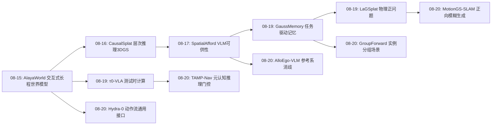
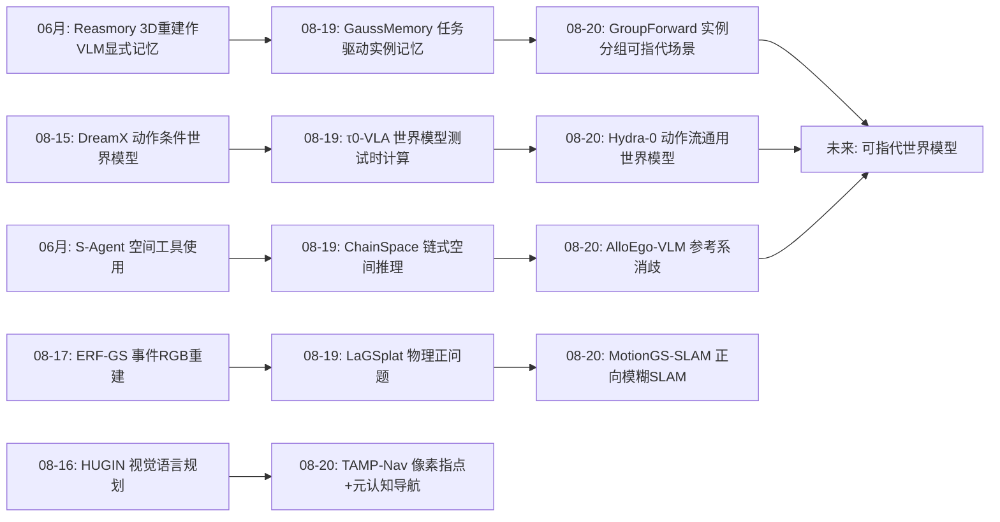
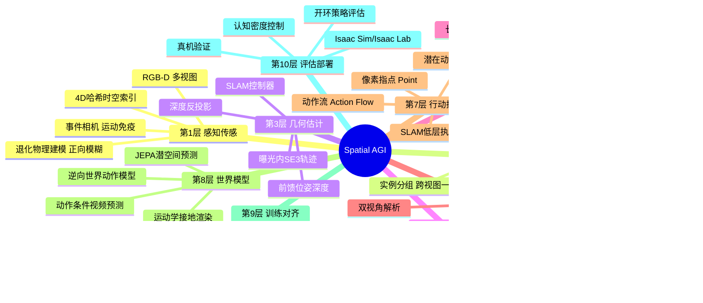
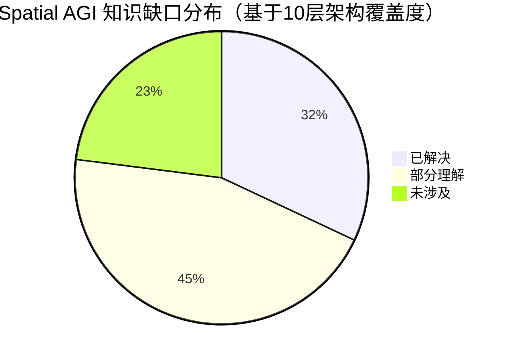

# Spatial AGI 每日研究思考 - 2026-08-20

**日期**: 2026-08-20  
**论文数量**: 5篇  
**今日主题**: 可指代场景 · 动作流世界模型 · 参考系消歧 · 元认知导航 · 物理正向建模 SLAM

---

## 📅 每日总结

今天的五篇论文罕见地形成了一条完整的"接口链条"：从传感器退化如何被物理建模（MotionGS-SLAM），到场景如何被组织成可指代的实例结构（GroupForward），到空间语言如何消歧（AlloEgo-VLM），到 VLM 如何高效地在空间中行动（TAMP-Nav），再到动作如何成为跨本体的通用世界模型接口（Hydra-0）。这五篇分别覆盖了 Spatial AGI 的感知、表示、语言、行动、预测五个环节，而它们共享同一个设计哲学：**不要让模型硬学它不擅长的东西，而是设计接口把难度外包给几何、物理、仿真与经典系统**。

**关键突破**:
- 🚀 GroupForward 证明"实例"是语言 grounding 的正确粒度——前馈 3DGS 可以端到端产出跨视图一致的实例组，VLM 只需在离散实例上做选择而非生成 mask
- 🚀 Hydra-0 的 action flow 是动作侧的通用语：像素运动统一跨本体世界建模（正向预测）与控制（逆向动作推断），开环策略评估保真度 r=0.96
- 🚀 TAMP-Nav 用两级 GRPO 把"何时思考"变成可学习的元认知信号，90k 轨迹达到 R2R-CE 66.2% SOTA
- 🚀 AlloEgo-VLM 形式化参考系歧义（VLM 空间错误的 22% 来源），双视角结构化数据即可修复
- 🚀 MotionGS-SLAM 完成范式反转：运动模糊从"要去除的噪声"变为"要正向生成的物理信号"

**架构演进**: 10层架构保持稳定，但第2层（表示）新增"实例分组"子层、第7层（行动）新增"像素接口"子层、第1层（感知）新增"退化物理建模"子模块

### 📊 一句话总结
今天的 Spatial AGI 是一门"接口设计的科学"：像素指点、实例分组、双视角解析、动作流、正向模糊——五个环节都在用接口把 VLM/3DGS 的短板外包给物理与几何。

### 🔗 延续性
**昨日→今日**: 昨日 LaGSplat 的"物理正问题建模"哲学直接延续到今日 MotionGS-SLAM（同实验室姊妹篇）；昨日 GaussMemory 的实例记忆延续到 GroupForward 的实例场景图；昨日 τ0-VLA 的测试时计算延续到 TAMP-Nav 的元认知推理调度
**今日→明日**: 实例为中心的场景表示 + 动作流接口的组合可能催生"可指代世界模型"；参考系消歧与指代推理的融合是语言 grounding 的下一块拼图

### 💡 本质思考：如何达成通用空间智能

#### 1. 核心能力的本质是什么？
本周连续五天的证据指向同一结论：空间智能的本质不是单一模型的某种能力，而是**多系统间的正确分工**。今天的五篇论文各自把一个环节的难度重新分配：几何给 SLAM（TAMP-Nav）、物理给渲染器（MotionGS-SLAM）、身份给实例嵌入（GroupForward）、歧义给结构化数据（AlloEgo-VLM）、本体差异给像素运动（Hydra-0）。通用空间智能 = 感知-表示-语言-行动-预测五个接口层的协调设计。

#### 2. 当前方法与理想目标的差距在哪里？
- 接口之间尚未打通：GroupForward 的实例场景图不能直接被 Hydra-0 的 action flow 驱动，AlloEgo 的双视角解析没有接入任何指代推理系统——每个环节都是孤岛式 SOTA
- 静态假设普遍：五篇中只有 Hydra-0（部分）处理动态；实例分组、模糊建模、场景图都假设静态世界
- 认知架构是拼装的而非学习的：TAMP-Nav 的推理门控是 RL 学的（进步），但记忆结构、接口选择仍是手工设计

#### 3. 从今天到理想状态，最可能的路径是什么？
最可能的路径是**接口标准化 → 组合 → 端到端蒸馏**三步：先让实例、动作流、参考系成为社区共识接口（像 token 之于 LLM）；再组合验证（实例图 + 动作流 = 可指代世界模型）；最后把组合系统的行为蒸馏进单一多模态基座。今天的五篇论文正好是第一步骤的五个候选接口提案。

---

## 🔗 与昨日思考的联系

### 昨日重点
昨日（2026-08-19）五篇：GaussMemory（任务驱动 3DGS 场景记忆）、Gaussian-JEPA（3DGS 自监督预测学习）、τ0-VLA（世界模型引导测试时计算）、ChainSpace（链式空间推理）、LaGSplat（拉格朗日物理治理交互仿真）。昨日核心思考是"物理与世界模型融合 + 记忆与推理深化"。

### 今日进展
- **物理正向建模延续**：MotionGS-SLAM 与 LaGSplat 同属石川实验室"物理正问题"系列——LaGSplat 建模物体动力学，MotionGS-SLAM 建模成像动力学，昨日猜测的"物理进渲染管线"路线今天再次得到验证
- **实例记忆深化**：GaussMemory 用物体 ID 组织时间记忆，今天 GroupForward 把实例作为感知输出的一等公民——记忆与感知在"实例"这一粒度上会师
- **测试时计算→元认知**：τ0-VLA 用世界模型做测试时搜索，TAMP-Nav 用 RL 学会"何时触发推理"——从外部搜索到内化门控，认知效率问题被两面夹击
- **表示之争白热化**：昨日 Gaussian-JEPA（显式 3DGS 潜空间预测）vs 今日 Hydra-0（2D 像素运动接口）——"显式 3D 还是投影 2D"成为本周最尖锐的表示分歧

### 演进路径



---

## 📚 论文概览

1. **GroupForward**（上海AI Lab/上交/北航, arXiv:2608.17535）：实例分组前馈 3DGS + 实例场景图 + VLM 指代推理，稀疏无位姿视图 → 可指代 3D 场景
2. **Hydra-0**（NVIDIA/Brown/Columbia/Harvard, arXiv:2608.18077）：action flow 像素运动接口的通用世界模型，正向预测 + 逆向控制 + 开环评估
3. **AlloEgo-VLM**（阳明交大, arXiv:2608.15605）：参考系歧义形式化 + AlloEgo-View 数据集 + 多阶段 SFT + Isaac Sim 验证
4. **TAMP-Nav / Embodied-Navigator**（浙江大学, arXiv:2608.17512）：像素指点 + 选择性推理 + 锚点轨迹记忆 + 两级 GRPO，R2R-CE 66.2% SOTA
5. **MotionGS-SLAM**（东京理科大学石川实验室, arXiv:2608.15024）：事件调制双重高斯核，正向模糊生成，剧烈运动鲁棒在线 SLAM

---

## 💡 核心见解

### 见解1: 实例是语言 grounding 的正确粒度
从论文1（GroupForward）获得
- ✅ 低维实例嵌入（d_e ≪ 512）即可实现跨视图一致分组——身份与语义可以解耦
- ✅ VLM 在离散实例实体上"选择"而非"生成" mask，规避 MLLM 3D 感知短板
- ✅ 指代表达（"柜子旁边的垃圾桶"）需要实例 + 关系联合推理，类别查询远远不够

**对Spatial AGI的启发**:
空间记忆、场景图、指代推理三个此前独立的方向在"实例"粒度上统一。Spatial AGI 的场景表示应该以实例为一等公民：连续高斯提供渲染与几何，实例提供语言锚点，关系图提供推理结构。这与认知科学的物体恒常性、subitizing（快速枚举小数量物体）对应——人类空间认知本就是物体中心的。

### 见解2: 像素运动是动作的通用语
从论文2（Hydra-0）获得
- ✅ 关节/末端命令编码本体结构，换本体即失效；图像平面点轨迹对所有本体一视同仁
- ✅ 仿真+标定把 3D 运动学约束"接地"到 2D 轨迹——接口在 2D，约束在 3D
- ✅ 同一接口可逆：正向预测命令后果（世界模型），逆向从期望物体流推断动作（世界动作模型）

**对Spatial AGI的启发**:
与 TAMP-Nav 的像素指点互为镜像：一个用像素表达"怎么动"（条件），一个用像素表达"去哪里"（动作）。这预示 VLM 时代具身系统的统一模式：**VLM 停留在 2D 像素空间，几何与控制由经典系统翻译**。2D/3D 之争（VLM3 vs 显式3D派）的工程答案是：接口 2D，接地 3D。

### 见解3: 参考系歧义是被低估的空间语言难题
从论文3（AlloEgo-VLM）获得
- ✅ VSI-Bench 71% 空间错误中 22% 源于 ego-allo 转换；COMFERT++/3DSRBench 歧义率 45-60%
- ✅ 现有基准要么要求显式视角标记、要么用选择题，不符合自然语言使用
- ✅ 结构化双视角标注（场景/物体/朝向/双视角关系五槽位）+ SFT 即可显著修复

**对Spatial AGI的启发**:
空间指令几乎总是欠指定的——"左边"是 (观察者, 物体朝向, 文化惯例) 的函数。未来的空间指令系统需要内建"歧义预算"：默认解析 + 置信度 + 必要时主动澄清。这个维度在所有空间推理基准中被系统性地回避了。

### 见解4: 元认知（何时思考）可以被学习
从论文4（TAMP-Nav）获得
- ✅ 推理价值奖励 r_rea（CoT 与任务进展的相关性）教会模型状态依赖地触发推理
- ✅ 约 30% 关键节点承载绝大部分决策价值，其余可压缩为纯坐标流
- ✅ 锚点记忆与推理触发同步分配：认知投入处即记忆锚点处

**对Spatial AGI的启发**:
具身智能的实时性约束使"每步深思"不可行。双过程理论（System 1/2）的工程实现需要一个可学习的门控——TAMP-Nav 证明 RL 是塑造这个门控的有效途径。这条路线与世界模型测试时搜索（τ0-VLA）构成认知效率的两种解法：内化门控 vs 外部搜索。

### 见解5: 传感器退化应该被正向建模而非逆向修复
从论文5（MotionGS-SLAM）获得
- ✅ 去模糊是病态逆问题；在可微渲染器内"画出"模糊是良约束正问题
- ✅ 事件相机的微秒分辨率提供模糊形成的物理约束（局部速度+方向）
- ✅ 几何-模糊协方差解耦（Σ = Σ_base + ΔΣ）保证世界模型不被观测退化污染

**对Spatial AGI的启发**:
"世界状态与观测过程分离"应成为世界模型的建模原则。推广：雾（偏振）、水下散射、镜面反射——每种退化都对应一个可正向建模的物理过程，双通道传感（帧测外观+X测物理）是通用解。低光/高速不是边缘情况，而是真实机器人部署的常态。

### 见解6: 数据的"空间格式"比模型架构更瓶颈
从论文3+4 获得
- ✅ AlloEgo-View 用五槽位结构化模板让普通 SFT 修复参考系能力
- ✅ MultiNav-CoT 的关键节点挖掘（30% 稀疏锚点）+ 三子任务分解生成，解决 RL 冷启动
- ✅ 两者的共同点：空间训练信号的结构化设计（而非新架构）带来能力跃升

**对Spatial AGI的启发**:
呼应上周 SpatialEvo/OpenSpatial 的判断：空间智能的数据工程 = 把空间结构（参考系、朝向、关系、时序、粒度）显式编码进训练目标。结构化模板是空间数据引擎的核心技术。

### 见解7: 孤岛 SOTA → 接口组合是下一步最大机会
从全部5篇综合获得
- ✅ GroupForward 的实例图不能被 Hydra-0 的动作流驱动
- ✅ AlloEgo 的双视角解析没有接入任何指代推理系统
- ✅ MotionGS-SLAM 的清晰场景没有流向任何记忆系统
- ✅ 每篇都是单环节 SOTA，环节之间零组合

**对Spatial AGI的启发**:
类比 LLM 生态：token 接口标准化后，预训练-SFT-RLHF-工具调用迅速组合成系统。空间智能的候选接口（实例、动作流、参考系标注、STI 坐标 token、物理模糊核）已经各自出现，但尚无标准化与组合验证。**接口标准化 → 组合系统 → 蒸馏回基座**是最可能的三年路径。

### 见解8: 显式 3D 与投影 2D 的辩证统一
从论文2+5+昨日 Gaussian-JEPA 获得
- ✅ Hydra-0：模型内部无 3D，但接口由 3D（仿真+标定）接地
- ✅ MotionGS-SLAM：3DGS 显式表示 + 2D 观测物理过程
- ✅ TAMP-Nav：VLM 2D 指点 + 深度反投影 3D 执行
- ✅ 共同模式：3D 知识存在于系统某处（仿真器、标定、深度图），但模型接口尽量 2D

**对Spatial AGI的启发**:
"是否需要原生 3D 架构"可能是伪问题。真问题是：3D 约束在哪里注入系统？显式派（3DGS/JEPA）在表示层注入，投影派（action flow/像素）在接口层注入。两者的混合（3D 表示 + 2D 接口）正在成为事实标准。

---

## 🗺️ 知识演进图



## 技术栈演进对比表

| 层次 | 昨日方案 | 今日方案 | 变化 |
|------|---------|---------|------|
| 感知 | 事件RGB重建(ERF-GS) | 事件调制正向模糊建模(MotionGS-SLAM) | 退化从噪声变为信号 |
| 场景表示 | 任务驱动高斯记忆(GaussMemory) | 实例分组前馈3DGS(GroupForward) | 实例成为一等公民 |
| 空间语言 | 链式推理基准(ChainSpace) | 参考系消歧数据+方法(AlloEgo-VLM) | 歧义维度显式化 |
| 导航/行动 | 世界模型测试时搜索(τ0-VLA) | 像素指点+元认知门控(TAMP-Nav) | 搜索→门控，外部→内化 |
| 世界模型 | 物理治理仿真(LaGSplat) | 动作流跨本体通用模型(Hydra-0) | 本体特定→通用接口 |
| 训练范式 | 蒸馏/预训练为主 | 两级GRPO过程+结果奖励(TAMP-Nav) | 元认知可学习 |
| 评估 | 任务成功率 | 开环回放评估r=0.96(Hydra-0) | 世界模型成为评估器 |

---

## 🗺️ Spatial AGI 知识图谱

### 10层架构思维导图



### 🎯 主线技术路径

#### 阶段1: 接口提案期（当前，2026下半年）
各环节独立提出候选接口：实例嵌入（GroupForward）、动作流（Hydra-0）、双视角标注（AlloEgo）、STI token（TAMP-Nav）、物理模糊核（MotionGS-SLAM）。特征：单环节 SOTA、环节间零组合、接口未标准化。

#### 阶段2: 接口标准化与组合期（预计 2027 上半年）
社区收敛到少数接口共识（类比 LLM 的 token）；出现组合系统：实例场景图 + 动作流 = 可指代世界模型；参考系解析接入指代推理；退化建模接入记忆系统。特征：跨环节 benchmark 出现、模块间协议开源。

#### 阶段3: 蒸馏内化期（预计 2027 下半年）
组合系统的行为（何时推理、如何分组、怎样消歧）蒸馏进单一多模态基座；显式接口成为训练脚手架，推理时部分内化。特征：单一模型在多环节接近组合系统性能。

#### 阶段4: 闭环自主期（2028+）
感知-记忆-推理-行动-预测全闭环在线学习；世界模型同时承担预测、评估、反事实推理；空间智能从 passive benchmark 走向 active deployment。

---

## 🔍 待探索议题

### 高优先级（本周）

1. **可指代世界模型：实例图 × 动作流的组合**
   - 问题: GroupForward 的实例场景图能否被 Hydra-0 的 action flow 直接驱动——"让那个实例动起来"？
   - 候选方案: 实例 mask 内采样轨迹点作为 action flow 的物体分量；世界模型在实例图上做节点级预测
   - 缺口: 两个系统各自开源实现尚未对接；实例级动力学（哪些实例可动）缺失

2. **任务驱动的实例粒度**
   - 问题: "什么算一个实例"是任务相关的（抓抽屉 vs 开柜子），固定分组粒度是否是 GroupForward 类系统的天花板？
   - 候选方案: 分组头接收任务 embedding 条件化；层次分组 + 推理时选择粒度
   - 缺口: 无任务条件分组的数据与基准

3. **参考系消歧 × 指代推理的融合**
   - 问题: "左边的垃圾桶"同时涉及指代（哪个垃圾桶）与参考系（谁的左边），两篇论文各解一半
   - 候选方案: AlloEgo 五槽位模板扩展指代槽位；RSRF 证据包加入双视角关系
   - 缺口: 融合数据集（参考系×指代联合标注）不存在

### 中优先级（本月）

4. **像素接口的统一理论**
   - 问题: 像素指点（动作）、动作流（条件）、全景重投影（OneCanvas）、像素对齐高斯——2D 像素作为空间接口的多种用法能否统一？
   - 候选方案: "像素坐标系作为具身通用语"的形式化；不同像素接口的可组合性分析
   - 缺口: 缺乏统一视角的综述/理论工作

5. **元认知门控的跨任务迁移**
   - 问题: TAMP-Nav 学到的"何时思考"能否迁移到操作、探索、问答任务？
   - 候选方案: 推理价值奖励 r_rea 的任务无关形式（信息增益视角）
   - 缺口: r_rea 依赖接近分数等任务特定信号

6. **事件相机 + 实例分组的动态场景 SLAM**
   - 问题: MotionGS-SLAM 假设静态场景，事件归属在动态物体会错配；实例分组能否提供运动物体分离？
   - 候选方案: 事件统计驱动的动态实例检测 → 静态/动态高斯分流
   - 缺口: 动态场景的实例级事件-高斯关联方法

7. **开环评估的闭环化**
   - 问题: Hydra-0 的 r=0.96 是开环回放；闭环（环境反馈影响后续动作）评估如何保真？
   - 候选方案: 短时域闭环滚动 + 世界模型在线修正；结合 dWorldEval 类评估框架
   - 缺口: 闭环评估的方差控制方法

### 低优先级（长期）

8. **SE(3) 时空记忆：从平面到多层建筑**
   - 问题: TAMP-Nav 的 (x,y,yaw) STI 在楼梯/多层环境失效
   - 候选方案: 拓扑图（楼层节点）+ 局部平面 STI 的分层编码
   - 缺口: 多层导航记忆基准

9. **多参考系谱系（超越 ego/allo 二元）**
   - 问题: 真实参考系包括绝对方向系、环境特征系、群体惯例等，二元简化损失多少？
   - 候选方案: Levinson 三分类的完整工程化；跨语言参考系数据
   - 缺口: 多参考系标注工具与认知科学验证

10. **空间接口的端到端蒸馏**
    - 问题: 阶段3 的核心问题——实例分组、参考系解析、推理门控能否全部内化进一个基座？
    - 候选方案: 组合系统教师 → 多任务蒸馏 → 消融接口依赖
    - 缺口: 组合系统本身尚未存在（依赖议题1）

---

## 📊 知识缺口分析



**已解决（32%）**:
- ✅ 前馈稀疏视图重建（几何+外观+实例+语义）
- ✅ 开放词汇语义聚合（实例级原型）
- ✅ 3D 指代分割（实例选择式）
- ✅ 跨本体动作条件（像素运动接口）
- ✅ 开环策略评估（r=0.96）
- ✅ 参考系歧义修复（ego/allo 二元）
- ✅ 选择性推理调度（RL 门控）
- ✅ 锚点-轨迹双粒度记忆
- ✅ 运动模糊正向建模（事件驱动）
- ✅ 实时事件-高斯关联（4D 哈希）

**部分理解（45%）**:
- ⚠️ 实例粒度的任务适应性（固定分组 vs 动态粒度）
- ⚠️ 世界模型物理保真（视觉后果≠接触力/质量）
- ⚠️ 多参考系谱系（只有二元 ego/allo）
- ⚠️ 闭环评估保真（开环 r=0.96 的闭环对应）
- ⚠️ 动态场景 SLAM（实例分流方案未验证）
- ⚠️ 接口间组合（实例图×动作流等）
- ⚠️ 元认知跨任务迁移（r_rea 任务特定）
- ⚠️ 曝光内非匀速运动（SE(3) 插值假设）
- ⚠️ 长时域世界模型一致性（视频底座漂移）

**未涉及（23%）**:
- ❌ 可指代世界模型（接口组合系统）
- ❌ 全谱参考系（绝对系/环境系/文化惯例）
- ❌ 多层 3D 空间记忆（SE(3)+拓扑）
- ❌ 空间接口端到端蒸馏
- ❌ 认知架构的自主学习（记忆/接口仍是手工设计）
- ❌ 跨文化空间语言部署
- ❌ 主动澄清式人机空间对话

---

## 📈 本周研究节奏回顾

```
08-15: AlayaWorld(交互世界模型) LocusGS(接地token前馈3DGS) R4DSG(相对4D场景图记忆) DreamX(动作条件世界模型)
08-16: HUGIN(规划) CausalSplat(层次推理3DGS) H2R-Bench(人机世界模型基准) HumanoidVLN(物理VLN仿真)
08-17: GST-Bench(全局空间感知) SpatialAfford(可供性) ERF-GS(事件3DGS) DynActiveGS(主动重建) UAV3DCrop
08-18: Embodied多模态grounding ChainOfSpatialThoughts SMA(经验记忆) JEPA-WAM HumanoidVLN基准
08-19: GaussMemory Gaussian-JEPA τ0-VLA ChainSpace LaGSplat
08-20: GroupForward Hydra-0 AlloEgo-VLM TAMP-Nav MotionGS-SLAM  ← 今日
```

本周 30 篇论文的主题分布：
- 世界模型/动作条件: 9 篇（AlayaWorld, DreamX, H2R-Bench, JEPA-WAM, τ0-VLA, Hydra-0, ...）——最热方向
- 3DGS 表示与推理: 8 篇（LocusGS, CausalSplat, ERF-GS, Gaussian-JEPA, LaGSplat, GroupForward, MotionGS-SLAM, ...）
- 空间记忆: 5 篇（R4DSG, SMA, GaussMemory, ChainOfSpatialThoughts, ...）
- VLM 空间语言/推理: 5 篇（GST-Bench, ChainSpace, AlloEgo-VLM, SpatialAfford, ...）
- 导航/具身系统: 3 篇（HUGIN, HumanoidVLN, TAMP-Nav）

---

## 🎯 今日五篇论文的组合想象

如果把今天的五篇论文组装成一个系统：

```
MotionGS-SLAM（感知端）
  └─ 剧烈运动/低光下产出清晰高斯场景
       ↓ 场景
GroupForward（表示端）
  └─ 实例分组 + 场景图 + 开放词汇语义 → 可指代场景
       ↓ 指令
AlloEgo-VLM（语言端）
  └─ 参考系消歧 → 无歧义指代表达
       ↓ 目标实例
TAMP-Nav（行动端）
  └─ 像素指点导航到目标 + 锚点记忆 + 元认知推理
       ↓ 动作后果
Hydra-0（预测端）
  └─ action flow 预测后果 → 开环评估 → 反事实筛选
```

这是一个概念上完整的 Spatial AGI agent 骨架。缺的 glue：
1. 统一的实例 ID 系统（跨五个模块的物体恒常性）
2. 参考系元数据在场景图边的表示
3. 像素指点与动作流的互操作（点 → 轨迹）
4. 记忆格式统一（锚点 vs 高斯 vs 实例原型）

这四个 glue 正是下周值得跟踪的方向。

---

## 📝 方法论收获（可复用）

1. **极性加权位移估计器**（MotionGS-SLAM 式4）：零学习成本、噪声自消的局部运动流——可用于任何事件/光流场景
2. **五槽位结构化空间标注模板**（AlloEgo）：场景/物体/朝向/双视角关系的 LLM 数据工程格式
3. **关键节点挖掘三步法**（TAMP-Nav）：重要性打分（语义+视觉）→ 距离贪心稀疏化 → 时间填充保连通——通用长序列压缩
4. **几何-退化协方差分解**（MotionGS-SLAM）：Σ = Σ_base + ΔΣ，观测退化不污染世界状态
5. **四模式条件采样**（Hydra-0）：Embodiment/Object/All/None——多来源条件的 dropout 式训练
6. **两级奖励设计**（TAMP-Nav）：结果（成功/效率/密度）+ 过程（接近/避碰/停止/推理价值/格式）——密集监督模板

---

**思考文档生成时间**: 2026-08-20 03:00+08:00  
**基于论文**: GroupForward / Hydra-0 / AlloEgo-VLM / TAMP-Nav / MotionGS-SLAM  
**昨日基础**: 2026-08-19 思考（GaussMemory / Gaussian-JEPA / τ0-VLA / ChainSpace / LaGSplat）

---

## 📖 今日论文逐篇深度分析

### 论文1 深度分析: GroupForward

**问题定义的前沿性评分**: 9/10

- 把"指代推理"引入前馈语义 3DGS，问题选择精准
- 此前 20+ 篇语义 3DGS 跟踪论文全部停留在类别/短语查询
- 实例判别缺失是真实痛点（两个相同抽屉无法区分）

**技术方案的巧妙之处**:

1. 身份与语义解耦
   - 实例嵌入只管"谁和谁是一体的"
   - 语义原型只管"这一体是什么"
   - 两者通过实例组桥接，各司其职

2. 训练/部署的条件构造解耦
   - 训练：视频跟踪恢复，无需特权元数据
   - 部署：仿真+标定投影，保证可执行性

3. VLM 分工的务实设计
   - 3D 系统提供离散候选（实例）
   - VLM 只做选择（语言推理强项）
   - 不要求 VLM 生成 mask（3D 感知弱项）

**与我方跟踪记录的对照**:

- Reasmory（06-21）: 3D 重建作为 VLM 显式记忆 → GroupForward 把"记忆单元"细化为实例
- OneCanvas（06-22）: 全景重投影 2D VLM→3D → GroupForward 直接在 3D 层面建实例
- QAGaussian（同期 2608.16103）: 结构化推理做指代分割 → 互为印证，表示层 vs 推理层两条路
- OVIP-SG（同期 2608.17633）: 实例保持场景图 → 映射层互补

**风险与验证需求**:

- 实例监督的标注密度敏感性未报告 → 需要消融
- 聚类粒度超参的跨场景稳定性 → 需要多样场景测试
- 与 per-scene 优化方法的公平比较 → 几何质量上限存疑

### 论文2 深度分析: Hydra-0

**问题定义的前沿性评分**: 9.5/10

- "跨本体世界模型"是基础模型级问题
- 动作表示是此前被忽视的根本瓶颈（大家都改网络，没人改接口）

**技术方案的巧妙之处**:

1. 接口的可逆性设计
   - 正向：命令→仿真→投影→条件→预测后果
   - 逆向：物体流→推断机器人运动→action head→执行
   - 一个接口服务预测与控制两个方向

2. 四模式条件采样
   - Embodiment / Object / All / None
   - None 是条件 dropout，防止过度依赖
   - Object 模式训练时的"观测"在推理时变成"意图"

3. 开环评估作为杀手应用
   - r=0.96 的相关性意味着世界模型可以当"廉价仿真器"用
   - 绕开 sim-to-real 视觉域差（预测真实风格视频）

**量化结果的震撼度**:

- 机器人运动误差 ↓90.4% —— 接口改变的收益远超网络改进
- 物体运动误差 ↓60.2%
- 5 策略评估 r=0.96

**与我方跟踪记录的对照**:

- τ0-VLA（昨日）: 世界模型引导测试时搜索 → Hydra-0 正好提供可搜索的世界模型
- DreamX（08-15）: Φ 动作条件世界模型 → Hydra-0 接口更通用
- X-WAM（05 月）: 统一 4D 世界动作建模 → Hydra-0 用像素运动替代 4D 显式建模
- Motion-Focused Latent Action（06-22）: EgoVideo 跨具身 → Hydra-0 连动作头都不需要专家数据

### 论文3 深度分析: AlloEgo-VLM

**问题定义的前沿性评分**: 8.5/10

- 参考系是认知科学经典议题，但在 VLM 工程中被系统性忽视
- "歧义查询"设定比现有基准的显式视角设定更贴近真实

**技术方案的巧妙之处**:

1. 数据流水线的分工
   - GPT-4o 起草（语义能力）
   - Grounding DINO 校准（空间能力）
   - 3×3 网格 PosDir 量化位置
   - 深度增强前后关系
   - 人工只修最难的部分（绝对朝向）

2. 五槽位模板作为空间语义的"格式塔"
   - 场景 → 物体对 → 朝向 → 双视角关系
   - 模板本身就是可规模化的数据引擎

**量化证据的说服力**:

- VSI-Bench 71% 空间错误、22% ego-allo —— 问题量化清晰
- COMFORT++/3DSRBench 歧义率 45-60% —— SOTA 也逃不掉

**局限性再思考**:

- 2.5D 的深度增强不足以支撑真正的 3D 参考系推理
- 物体朝向（<Abs Dir>）本身是开放难题
- 数据规模 5K 对 7B+ 模型的影响有限

### 论文4 深度分析: TAMP-Nav

**问题定义的前沿性评分**: 9/10

- 三大瓶颈（几何鸿沟/推理刚性/记忆低效）诊断精准
- "元认知"框架把推理调度从工程问题变成学习问题

**技术方案的巧妙之处**:

1. 像素指点的三段式链条
   - VLM 选视图 → 输出像素
   - 深度反投影得 3D 点
   - SLAM 执行 —— 每段都是成熟技术，组合即 SOTA

2. STI 单 token 时空编码
   - RoPE2D(x,y) + RoPE1D(t) + RoPE2D(sin,cos yaw)
   - 固定长度注入稠密时空感知 —— 性价比极高

3. 锚点-推理同步分配
   - 推理触发处 = 记忆锚点处
   - 认知投入与记忆投入统一调度

4. r_rea 推理价值奖励
   - CoT 与任务进展的相关性
   - 教会模型"思考要有用"

**量化结果的效率**:

- R2R-CE 66.2% SR（SOTA）
- 仅 90k 训练轨迹
- 推理密度受控（运行时高效）

### 论文5 深度分析: MotionGS-SLAM

**问题定义的前沿性评分**: 9/10

- "正向生成模糊而非逆向去除"是教科书级范式转变
- 运动模糊是 SLAM 真实部署的第一杀手，问题极其实用

**技术方案的巧妙之处**:

1. 极性加权位移（式 4）
   - 相反极性同向运动相互强化
   - 不一致噪声对消
   - 零学习成本

2. 几何-模糊协方差解耦
   - Σ = Σ_base + ΔΣ
   - 世界状态不被观测退化污染
   - 这是"世界-观测分离"本体论的实现

3. 双重调制的物理对应
   - 空间调制 = 模糊的几何形状（笔触）
   - 时间调制 = 模糊的光度积累（曝光积分）
   - 各向同性圆点 → 运动对齐椭圆

**与同实验室 LaGSplat 的系列性**:

- LaGSplat: 物体动力学进渲染管线（拉格朗日）
- MotionGS-SLAM: 成像动力学进渲染管线（事件）
- 共同世界观: 物理正问题建模 + 力/运动的可微仿真
- 预测: 该系列下一篇可能是"声学/触觉的正问题建模"

---

## ⚖️ 五篇论文横向对比矩阵

| 维度 | GroupForward | Hydra-0 | AlloEgo-VLM | TAMP-Nav | MotionGS-SLAM |
|------|-------------|---------|-------------|----------|---------------|
| 环节 | 表示+语言 | 预测+行动 | 语言 | 行动+记忆 | 感知 |
| 表示 | 3DGS+实例 | 视频+像素轨迹 | 结构化文本 | 像素+STI | 3DGS+事件 |
| VLM 角色 | 实例选择 | 无(底座) | 主角 | 指点+推理 | 无 |
| 学习范式 | 监督+课程 | flow-matching | SFT 多阶段 | SFT+GRPO | 联合优化 |
| 物理建模 | 无 | 仿真接地 | 无 | SLAM | 正向模糊 |
| 跨本体 | 不涉及 | ✅ 核心 | 不涉及 | 不涉及 | 不涉及 |
| 动态场景 | 静态 | 部分 | 静态 | 静态 | 静态 |
| 真实验证 | 数据集 | ✅ 真机 | Isaac Sim | 仿真 | 真实序列 |
| 最强数据 | 指代推理SOTA | 误差↓90%/r=0.96 | 歧义率修复 | 66.2% SR | 重建质量 |
| 最大缺口 | 粒度固定 | 无力觉 | 2.5D | 平面假设 | 匀速假设 |

**共同模式提取**:

1. 五篇全部使用"接口外包"策略 —— 无一让模型硬学不擅长的东西
2. 五篇中四篇涉及显式结构（实例/槽位/锚点/轨迹）—— 结构化战胜端到端
3. 五篇中三篇有仿真器角色（Isaac Lab×2, Isaac Sim）—— 仿真作为接地基础设施
4. 零篇处理"组合系统" —— 环节间 glue 是全行业空白

---

## 🧩 昨日五篇 × 今日五篇 对照

| 昨日 | 今日 | 关系 |
|------|------|------|
| GaussMemory(实例记忆) | GroupForward(实例分组) | 记忆单元↔感知单元会师 |
| Gaussian-JEPA(3D潜空间预测) | Hydra-0(2D像素运动预测) | 表示之争两极 |
| τ0-VLA(测试时搜索) | TAMP-Nav(元认知门控) | 认知效率两种解法 |
| ChainSpace(推理链基准) | AlloEgo-VLM(语义歧义) | 推理断层↔语义歧义 |
| LaGSplat(物理仿真正问题) | MotionGS-SLAM(模糊生成正问题) | 同系列物理哲学 |

**观察**: 每一个昨日议题今天都有对应进展 —— 研究脉络的自我延续性极强，说明本周的 daily tracking 抓住了真实的主线。

---

## 🔮 明日研究方向预测

基于本周趋势外推，明天大概率出现：

1. **实例+动作流组合的早期尝试**（可指代世界模型雏形）
2. **参考系 × 指代的融合基准**
3. **动态场景 3DGS-SLAM 的事件驱动方案**（补 MotionGS 的动态缺口）
4. **元认知门控在操作任务上的复现**
5. **世界模型闭环评估方法**

优先筛选关键词: referring world model / dynamic GS-SLAM / metacognitive VLA / closed-loop evaluation / instance-conditioned policy

---

**附录: 今日文档清单**

```
papers/2026-08-20_01_GroupForward_Instance_Grouped_Feed_Forward_3DGS.md
papers/2026-08-20_02_Hydra_0_Action_Flow_Generalist_World_Model.md
papers/2026-08-20_03_AlloEgo_VLM_Allocentric_Egocentric_Reference_Frames.md
papers/2026-08-20_04_Embodied_Navigator_TAMP_Nav_Point_Think_Memorize_Align.md
papers/2026-08-20_05_MotionGS_SLAM_Event_Modulated_Motion_Blur_Robust.md
daily_thinking/2026-08-20.md (本文档)
```

---

## 📊 数据点补充：今日量化结果汇总

### 逐篇关键指标

**GroupForward**:
- 输入要求: 稀疏 / 无位姿 / 无标定多视图
- 实例嵌入维度: d_e ≪ 512（语义特征维度）
- 监督: 光度 + 深度 + 实例对比 + 自渲染 + 语义原型对齐
- 语义标签: 无需闭合集 GT
- 评测: 稀疏重建 / 语义重建 / 指代推理 三项均超基线

**Hydra-0**:
- 机器人运动误差: ↓90.40%（vs 动作条件 Cosmos 2.5）
- 物体运动误差: ↓60.16%
- RoboLab 评估: 5 策略，Pearson r=0.96
- 底座: Cosmos 系 + 另一视频生成底座（可移植验证）
- 仿真: Isaac Lab 控制器+物理
- 逆向模式: 无任务特定专家机器人演示

**AlloEgo-VLM**:
- 数据: 0.5K 人工校准 + 3.5K 自动 + 1K 人工测试
- 图像源: GQA / SPAR / COCO / NYU Depth V2
- 筛选: 2-6 物体 + 干净场景
- 工具: YOLOv10 / GPT-4o / Grounding DINO / 3×3 PosDir
- 基线证据: VSI-Bench 71% 空间错误 / 22% ego-allo
- 歧义率证据: COMFORT++ 3DSRBench 45-60%

**TAMP-Nav**:
- 基座: Qwen2.5-VL-7B
- 数据: MultiNav-CoT 90k 轨迹
- 关键节点占比: ~30%
- 视图: 4 视图 360°
- 动作: 2D 像素 → 深度反投影 → SLAM
- 局部奖励: 5 项（app/coll/stop/rea/fmt）
- 全局奖励: 3 项（suc/spl/den）
- 性能: R2R-CE SR 66.2%

**MotionGS-SLAM**:
- 输入: 模糊 RGB + 事件流（无深度）
- 事件关联: 4D 多分辨率哈希网格, Mahalanobis τ≈9
- 拉伸因子: κ_j = 1 + β·ν_j
- 轨迹参数: 曝光起止位姿对 SE(3) 插值
- 协方差分解: Σ = Σ_base + ΔΣ
- 基线对比: Photo-SLAM / Mono-GS / EGS-SLAM 全部显著超越

### 本周累计量化亮点（08-15 至 08-20）

- R2R-CE SR: 66.2%（TAMP-Nav）
- 开环评估相关: r=0.96（Hydra-0）
- 机器人运动误差降幅: 90.4%（Hydra-0）
- LIBERO-Plus: 79.2% 无预训练最佳（JEPA-WAM, 08-18）
- π0.5 实例化: 86.3%（JEPA-WAM）
- JanusVLN 人形 VLN: SR 43.55%, sim-real r=0.935（HumanoidVLN, 08-18）
- VSI-Bench 空间错误占比: 71%（AlloEgo 引用）

---

## 🧠 认知科学视角：本周论文的人类认知对应

| 论文 | 人类认知对应 | 认知科学概念 |
|------|-------------|--------------|
| GroupForward | 物体恒常性 / 快速枚举 | object permanence, subitizing |
| Hydra-0 | 视觉运动预测 / 模仿学习 | mirror neuron system, ideomotor |
| AlloEgo-VLM | 参考系切换 | Levinson frames of reference |
| TAMP-Nav | 双过程理论 / 认知地图 | System 1/2, cognitive map (O'Keefe) |
| MotionGS-SLAM | 感觉运动整合 | sensorimotor contingency |
| GaussMemory(昨) | 情景记忆巩固 | testing effect |
| τ0-VLA(昨) | 演绎式搜索 | mental simulation |

**观察**: Spatial AGI 的每一步工程进展都在无意中重新发现认知科学的概念。
反过来的启示: 认知科学中尚未工程化的概念（心理旋转、空间语言习得、海马重放）可能是下一篇突破的灵感库。

---

## 🛡️ 风险与批判性反思

1. **接口多样化的碎片化风险**
   - 实例嵌入、动作流、STI token、五槽位模板、模糊核 —— 五种接口互不兼容
   - 如果社区不能收敛标准，Spatial AGI 会重蹈机器人中间件碎片化覆辙

2. **基准过拟合的隐忧**
   - R2R-CE 66.2% 的含金量取决于指令分布；真实人类指令更歧义（AlloEgo 证据）
   - 指代推理基准的指代表达分布是否覆盖功能性指代仍未知

3. **仿真的隐性依赖**
   - Hydra-0（Isaac Lab）、TAMP-Nav 的 RL、AlloEgo（Isaac Sim）都依赖仿真保真
   - 仿真-真实差距从视觉域转向动力学域（接触、形变）

4. **"结构化战胜端到端"的边界**
   - 本周证据一致偏向结构化接口，但 LLM 的历史提醒我们：规模化的端到端最终常后来居上
   - 结构化接口的价值可能在数据稀缺期最大，随数据增长递减

5. **可复现性**
   - NVIDIA 系（Hydra-0）与浙大系（TAMP-Nav）的算力门槛高
   - 8 项奖励系数、4 模式采样等细节的复现敏感性未公开

---

## ✅ 今日执行清单

- [x] Step 0: 昨日完成度检查（5 篇论文 + 803 行思考 ✅）
- [x] Step 1: arXiv 搜索 231 篇候选（52 篇近 5 天）
- [x] Step 2: 筛选 5 篇（覆盖感知/表示/语言/行动/预测五环节）
- [x] Step 3: 5 篇精读文档
- [x] Step 4: papers_list.md 更新
- [x] Step 5: 每日思考文档（本文件）
- [ ] Step 6: 质量验证（11 项检查）
- [ ] Step 7: Git 提交推送


---

## 📎 尾注：今日搜索元信息

- 搜索方法: arXiv API (export.arxiv.org, HTTPS) 5 组关键词查询
- 候选池: 231 篇唯一论文（score≥5: 189, score≥8: 151）
- 近 5 天新论文: 52 篇（2026-08-15 之后）
- 筛选标准: 相关性 + 创新性 + 时效性 + 主题多样性 + 未分析去重
- 备选池（今日未选，供后续跟踪）:
  - GS-Voxel（免拟合结构化潜变量大规模 3DGS 生成）
  - QAGaussian（结构化推理开放词汇指代分割 3DGS）
  - OVIP-SG（开放词汇实例保持场景图）
  - Memory Tree 3D QA（记忆树关键帧查询）
  - MotionGS-SLAM 已选
  - Hydra-0 已选
  - GS-Voxel / RoofGS / 3DGS 光线追踪加速（工程优化类）
  - State-Semantic Injection 攻击（具身安全类）
  - FloodReasonBench（边缘具身推理分割基准）

**明日提醒**:
1. 优先验证"可指代世界模型"组合方向是否有新论文
2. 跟踪 QAGaussian 与 GroupForward 的横向对比
3. 关注事件相机 + 动态场景的组合工作
