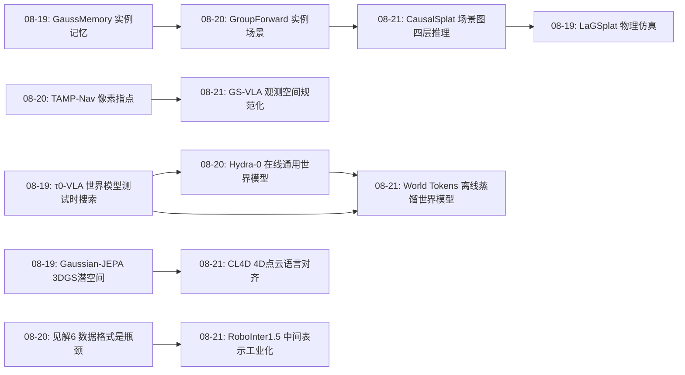
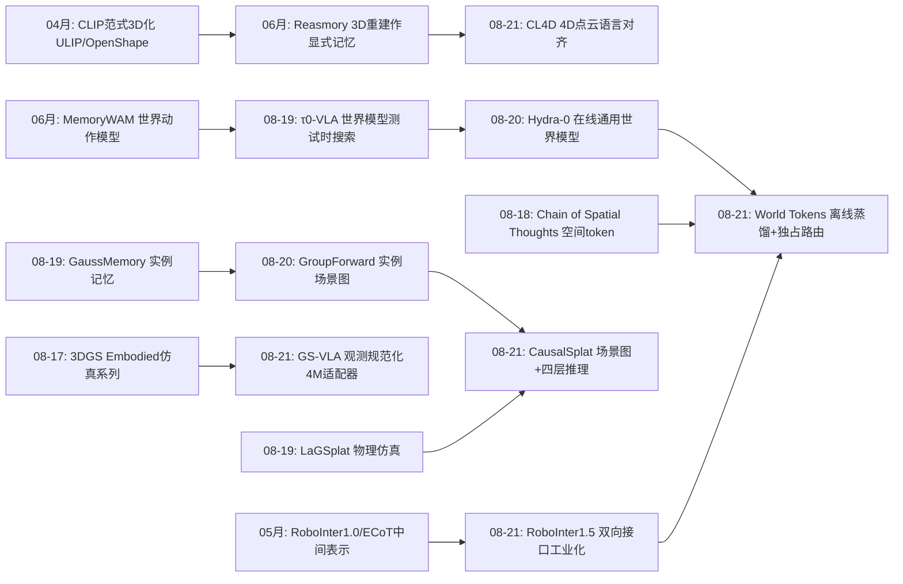
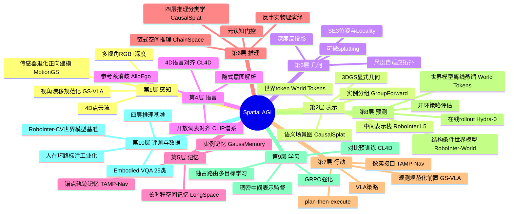
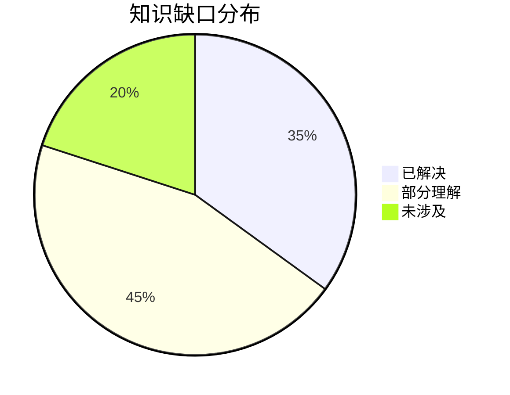

# Spatial AGI 每日研究思考 - 2026-08-21

**日期**: 2026-08-21  
**论文数量**: 5篇  
**今日主题**: 观测空间适配 · 4D 语言对齐 · 训练时世界蒸馏 · 推理式 3DGS 分割 · 中间表示基础设施

---

## 📅 每日总结

今天的五篇论文共同回答了昨天提出的"接口标准化"命题的五个具体形态：视角漂移如何在观测空间被规范化（GS-VLA）、4D 动态几何如何与语言对齐（CL4D）、世界模型知识如何在训练时蒸馏进策略而部署时蒸发（World Tokens）、3DGS 场景理解如何从匹配升级为四层推理（CausalSplat）、以及这一切依赖的中间表示如何被规模化生产（RoboInter1.5）。如果说昨天的关键词是"接口设计的科学"，今天的主题则是**"接口的工业化"**：每一篇都在把昨天识别的接口候选（实例、动作流、参考系）向下扎根——要么变成可部署的轻量模块（4M 参数的 canonicalizer），要么变成可规模化的数据资产（230k 回合 × 10 类标注），要么变成可评测的能力分类（四层推理分类学）。**世界模型的位置今天被重新定义**：World Tokens 证明它可以是训练时的知识源而非部署时的组件，RoboInter1.5 的世界模型-策略互哺闭环提供了第二条独立证据——"世界模型的归宿是蒸馏，不是部署"正在从洞见变成共识。

**关键突破**: 
- 🚀 World Tokens 的"独占路由"设计解决了表征学习的通用难题：辅助监督（世界模型）不被主通路旁路——动作专家只吃 256 个世界 token，未来视频去噪梯度必然塑造控制表征；LIBERO 98.2% + SIMPLER 双榜最佳 + 真机 59.4%→76.0%，部署时 VLA 级延迟
- 🚀 GS-VLA 把 VLA 视角脆弱性（92.4%→9.3%）转化为 Locality 假设下的局部 disocclusion 补全问题——4M 参数恢复大部分损失性能，观测空间适配 vs 策略重训的路线之争有了第一个干净答案
- 🚀 CL4D 补全了 CLIP 谱系的最后一级（2D→视频→3D→**4D 点云**），且 4DVLM 用纯点云输入击败喂 RGB 视频的 Gemini/GPT-5——几何原生表征对投影表征的胜利从静态扩展到动态
- 🚀 CausalSplat 的四层推理分类学（空间/常识/可供性/**反事实**）首次把因果想象纳入 3D 分割评测，场景图作为 3DGS 的"关系皮层"补上了实体-关系闭环
- 🚀 RoboInter1.5 用 230k 回合 × 10+ 类逐帧稠密中间表示确立"中间表示 = 正则化动作空间 + 约束世界 rollout 的双向接口"

**架构演进**: 10层架构保持稳定；第2层（表示）新增"世界 token"与"中间表示栈"子层、第4层（语言）新增"4D 语言对齐"子模块、第7层（行动）新增"观测规范化"子层、第8层（预测/世界模型）新增"训练时蒸馏"范式

### 📊 一句话总结
今天的 Spatial AGI 正在把昨天的"接口科学"工业化：世界模型蒸馏成 token、视角适配压缩到 4M 参数、4D 表征接上语言、场景理解分层评测、中间表示规模生产——五个接口候选全部从论文走向了基础设施。

### 🔗 延续性
**昨日→今日**: 昨日 Hydra-0（在线通用世界模型）与今日 World Tokens（离线蒸馏世界模型）正面交锋，"世界模型部署在哪"成为明确分歧；昨日 GroupForward（实例场景图）与今日 CausalSplat（语义场景图+推理）在"场景图作为 3DGS 关系层"上会师；昨日"数据的空间格式是瓶颈"论断被 RoboInter1.5 直接回应
**今日→明日**: 中间表示标准化 + 世界模型蒸馏的组合可能催生"结构条件蒸馏世界模型"；CausalSplat 反事实层与 LaGSplat 物理引擎的合流（物理引擎生成反事实真值）是明显的后续工作

### 💡 本质思考：如何达成通用空间智能

#### 1. 核心能力的本质是什么？
连续两天的证据链指向一个更深的结论：空间智能的本质是**知识的正确存放位置**。今天五篇论文各自回答了"某类空间知识应该住在哪里"：视角几何住在观测适配器（GS-VLA，4M 参数），动力学知识住在训练时的世界模型并蒸馏进 256 个 token（World Tokens），4D 运动语义住在对齐的编码器（CL4D），关系与因果知识住在场景图（CausalSplat），而所有这些知识的原始形态住在数据集的逐帧标注里（RoboInter1.5）。通用空间智能 = 一个把不同粒度空间知识路由到正确存放位置的系统架构。

#### 2. 当前方法与理想目标的差距在哪里？
- **蒸馏损失无处不在**：World Tokens 受视频教师能力上限约束，CL4D 受 Unity 合成数据域限制，CausalSplat 的反事实真值依赖人工直觉——每一层的知识传递都有失真；
- **静态→动态的单向门**：CausalSplat 的反事实是脑内模拟（无真动力学），GS-VLA 假设静态场景逐帧处理——动态物理世界仍是软肋；
- **接口间仍未打通**：世界 token（World Tokens）、场景图（CausalSplat）、中间表示栈（RoboInter1.5）是三套不兼容的结构化接口，社区需要收敛而非发散。

#### 3. 从今天到理想状态，最可能的路径是什么？
昨天的三步路径（接口标准化→组合→端到端蒸馏）今天可以更具体：**中间表示工业化（RoboInter1.5 已开工）→ 结构条件蒸馏（World Tokens × RoboInter-World 的合体：用中间表示作为蒸馏时的结构化课程）→ 接口收敛（世界 token、场景图、四层推理分类学的合并）**。三年内最可能的产品形态：一个部署时只有 2B 级的策略网络，其表征由离线的万卡世界模型 + 亿级中间表示标注数据塑造，按 CausalSplat 四层分类学逐层验证能力。

---

## 🔗 与昨日思考的联系

### 昨日重点
昨日（2026-08-20）五篇：GroupForward（实例分组前馈 3DGS）、Hydra-0（action flow 通用世界模型）、AlloEgo-VLM（参考系消歧）、TAMP-Nav（元认知导航）、MotionGS-SLAM（正向模糊建模）。昨日核心结论："Spatial AGI 是接口设计的科学"——把难度外包给几何、物理、仿真与经典系统；预言"实例为中心的场景表示 + 动作流接口可能催生可指代世界模型"。

### 今日进展
- **世界模型路线之争白热化**：昨日 Hydra-0 把世界模型做大做通用做**在线**（Action Flow 常驻推理回路），今日 World Tokens 把世界模型做小做专用做**离线**（训练时蒸馏、部署时删除）——加上 RoboInter1.5 的"世界模型预测反哺策略"证据，"世界模型该部署在哪"成为本周最值得跟踪的分歧；
- **场景图作为关系层获得独立验证**：昨日 GroupForward 用实例场景图支撑指代推理，今日 CausalSplat 用语义场景图 + 尺度自适应拓扑边支撑四层推理——两个不同团队、不同任务，同一架构选择，"特征场（what）+ 场景图（how-related）双轨制"正在成为 3DGS 理解的标准配置；
- **"数据格式是瓶颈"从论断变成产品**：昨日见解6 指出数据的空间格式比模型架构更瓶颈，今日 RoboInter1.5 直接交付了 230k 回合 × 10 类逐帧标注的工业化答案；
- **像素接口的又一胜利**：昨日 Hydra-0 的 action flow 和 TAMP-Nav 的像素指点证明 VLM 停在 2D 的工程价值，今日 GS-VLA 的视角规范化在观测层延续同一哲学——接口在 2D、接地在 3D；
- **反事实推理进入视野**：昨日 LaGSplat 的物理治理仿真与今日 CausalSplat 的反事实分割天然互补——物理引擎生成反事实真值是明显的合流点。

### 演进路径



---

## 📚 论文概览

1. **GS-VLA**（檀国大学, arXiv:2608.19066）：Locality 假设把视角适配降维为 disocclusion 补全；4M 参数 U-Net 预测 14 维逐像素 Gaussian 属性，前置冻结 VLA；单检查点跨策略/任务/5-200cm 扰动泛化
2. **CL4D**（Moratuwa 大学 + SMART + A*STAR, arXiv:2608.18734, **ECCV 2026**）：首个动态 4D 点云的对比语言预训练编码器 + 首个纯 4D 点云 VLM（4DVLM）+ DynAction4D 基准；text-motion 检索 +16.75%，纯点云击败 Gemini/GPT-5（RGB 视频输入）
3. **World Tokens**（九天研究院/中关村学院, arXiv:2608.09730）：World Adapter（256 Perceiver 查询）+ 独占路由 + Canny 结构锚；训练时未来视频去噪梯度直接塑造控制 token，部署时视频分支整体移除；LIBERO 98.2%、SIMPLER 双榜最佳、真机 59.4%→76.0%
4. **CausalSplat**（北大深研院等, arXiv:2608.11150）：Reasoning 3D Gaussian Segmentation 新任务；四层推理分类学（空间/常识/可供性/反事实）；Causal-LERF + Causal-ScanNet 基准；语义场景图 + VLM 三段推理
5. **RoboInter1.5**（InternRobotics, arXiv:2607.18709）：230k 回合/571 场景/10+ 类逐帧中间表示数据集；RoboInter-VLM/VLA/World 三框架；中间表示 = 双向接口；世界模型预测反哺策略

---

## 💡 核心见解

### 见解1: 世界模型的归宿可能是"训练时的知识源"而非"部署时的组件"
从论文3（World Tokens）+ 论文5（RoboInter1.5）获得
- ✅ World Tokens：视频世界模型只在训练时监督 256 个世界 token，部署时整体删除，VLA 级延迟拿到世界模型级收益（真机 59.4%→76.0%）
- ✅ RoboInter1.5：RoboInter-World 预测的未来图像反过来提升 RoboInter-VLA 的动作预测精度——世界模型→策略的正向增益闭环
- ✅ Fast-WAM（文中引用）已发现视频共训练的贡献大于显式未来合成；World Tokens 把这一发现推到极限

**对Spatial AGI的启发**:
与昨日 Hydra-0（在线常驻）和前日 τ0-VLA（测试时搜索）构成世界模型使用时机的完整谱系：**离线蒸馏（World Tokens）←→ 异步间歇 ←→ 在线常驻（Hydra-0/τ0）**。三条路线的工程权衡不同（延迟 vs 自适应性），但两条独立证据链支持"训练时收益已足够大"。类比人类：学骑车时脑补各种情景，真骑时不再想象——学习期模拟，执行期直觉。世界模型的价值可能 80% 在训练侧。这个判断如果成立，世界模型的研发重点应从推理效率转向**蒸馏保真度**（教师模型能教多少，学生能收多少）。

### 见解2: 独占路由是表征对齐的通用武器
从论文3（World Tokens）获得
- ✅ 问题命名：预测性监督若只通过并行分支作用，动作专家仍条件于完整 VLM 上下文，控制器可以"绕开"被世界模型塑造的子空间——预测与动作在表征空间各走各的
- ✅ 架构级解法：动作专家的视觉-语言上下文**只**能是 256 个世界 token（信息瓶颈 + 唯一通路），视频去噪梯度无处可逃
- ✅ Canny 结构锚的信息故意削弱：把视频分支首帧从 RGB 降为边缘图，逼 token 携带语义与演化信息——弱化强条件以强迫表征学习

**对Spatial AGI的启发**:
这个设计模式远超 VLA 范畴。Spatial AGI 中一切"多目标表征学习"（几何一致性损失、物理合理性损失、记忆一致性损失）都面临同样的旁路失效：主任务梯度太强，辅助监督形同虚设。解法模板：**把辅助目标施加在主通路的必经瓶颈上**。反过来，Canny 锚启示我们：当表征需要携带某类信息时，可以故意削弱其他提供该信息的捷径——"制造困难以强迫学习"的课程设计原理。

### 见解3: 视角鲁棒性属于观测空间，不属于策略参数
从论文1（GS-VLA）获得
- ✅ 相机小位移使 LIBERO 成功率 92.4%→9.3%——VLA 部署被低估的第一杀手
- ✅ Locality 假设：真实相机漂移在 ε-ball 内，新暴露区域 η(ρ) 随扰动线性增长且系数由场景几何决定——视角规范化不是 NVS 问题而是局部 disocclusion 补全
- ✅ 4M 参数（比 AnyCamVLA 少 42×）单检查点跨策略架构、未见任务、5-200cm 扰动全部有效

**对Spatial AGI的启发**:
"鲁棒性应该全部在策略参数里学，还是在观测空间解决"是分层设计的典型问题。GS-VLA 的答案干净利落：**几何确定性部分（warp）交给计算，只有几何不可恢复部分（disocclusion）交给学习**——机制分析证明性能恢复主要来自确定性几何搬运。这是"空间计算 vs 空间感知"分工的精确刻画。推广到 Spatial AGI 部署栈：光照规范化、标定误差对齐、传感器模态统一都可以照此模式做成即插即用适配器层——"冻结大策略 + 轻量空间适配器"生态正在成型。

### 见解4: CLIP 谱系完结——4D 是语言对齐的最后一级维度
从论文2（CL4D）获得
- ✅ 2D（CLIP, 2021）→ 视频（ActionCLIP）→ 3D 点云（ULIP/OpenShape）→ **4D 点云（CL4D, 2026）**：对比预训练完成整个维度爬升周期
- ✅ 4DVLM 纯点云输入击败喂 RGB 视频的 Gemini/GPT-5——通用 VLM 的动态几何盲区在 4D 任务中被放大
- ✅ SMPL+Unity+LLM 的数据合成管线（HumanML3D 动作 → 点云序列 + 三类 QA）是语言-4D 对齐的低成本生产模板

**对Spatial AGI的启发**:
维度谱系完结后，下一个对齐对象不再是"第几维"而是"什么物理量"——物理属性场、可供性场、因果关系图能否被同样对比对齐？另外，"专用小模型击败通用巨兽"再次验证了分层路线：通用 VLM 负责推理与生成，专用几何编码器负责精确感知。值得注意的是 CL4D 的"4D"目前实为"4D 人体动作"——非刚体、流体、多智能体动态仍是空白，通用 4D 场景的语言对齐是明确的下一步。

### 见解5: 场景理解的能力评测需要分层分类学
从论文4（CausalSplat）获得
- ✅ 四层渐进分类：空间（拓扑/几何关系）→ 常识（功能关联）→ 可供性（几何-功能映射）→ 预测反事实（物理因果演绎）
- ✅ 231 条指令 / 14 场景，4 标注员一致才收录；现有 SOTA 在推理任务上集体表现差
- ✅ 场景图（实体节点+尺度自适应拓扑边）作为 3DGS 的关系抽象层，弥补特征场"有特征无结构"的缺陷

**对Spatial AGI的启发**:
"Bloom 分类学"式的分层评测改变研究对话的方式：不再问"模型能不能理解 3D 场景"，而是问"它在哪一层失效"。反事实层（"移走底部的红色物体，哪些会掉？"）尤其珍贵——它检验的是因果想象而非模式匹配，直指空间智能与物理直觉的交界。与昨日 GroupForward 的会师确认了双轨制正在成型：**特征场管"是什么"，场景图管"怎么关联"，推理管"会怎样"**。

### 见解6: 中间表示是 Spatial AGI 的"像素之于 2D 视觉"
从论文5（RoboInter1.5）获得
- ✅ 230k 回合 × 10+ 类逐帧标注（子任务/技能/接地/分割/可供性/抓取位姿/接触点/轨迹）与动作严格时间同步
- ✅ 同一套标注同时服务 VQA（29 类）、VLA（三范式）、世界模型（结构条件）——表示的跨范式通用性证明其捕捉了"操作任务中真正不变的空间结构"
- ✅ 核心论断：中间表示 = 正则化动作空间（向下）+ 约束世界 rollout（向上）的双向接口

**对Spatial AGI的启发**:
过去一周我们追踪的 ECoT（文本 CoT）、LLARVA（轨迹）、Chain of Spatial Thoughts（空间 token）、World Tokens（世界 token）其实都在摸索同一个东西——某种中间表示充当理解/执行/预测的枢纽。RoboInter1.5 第一次把这层意思说破并给出数据级支撑：**谁掌握了中间表示的规模化生产，谁就掌握了具身智能的数据命脉**。昨天"数据格式是瓶颈"的论断，今天有了第一个工业化答案。

### 见解7: 3DGS 正在成为具身智能的通用几何接口
从论文1+4 与本周多篇综合获得
- ✅ GS-VLA：3D Gaussian 用于观测规范化（逐像素 Gaussian 属性预测）
- ✅ CausalSplat：3DGS 场景 + 场景图用于推理分割
- ✅ 本周 GroupForward/GaussMemory/MotionGS-SLAM：实例分组/场景记忆/物理建模
- ✅ 共同点：3DGS 的显式性（可离散操作的高斯图元）使其既能渲染、又能几何运算、又能承载语义

**对Spatial AGI的启发**:
3DGS 已经完成从"渲染技术"到"具身基础设施"的身份转变。其显式高斯图元是独特的中间物：比 NeRF 隐式场可操作（实例聚类、场景图构建、安全压缩），比点云可微可渲染（蒸馏 2D 基础模型特征、正向物理建模）。"前馈逐像素 Gaussian 预测"（GroupForward、GS-VLA、Flash3D 系）正在成为标准组件——3DGS 生态的"卷积化"时刻。

### 见解8: 训练/部署计算图分离是效率设计的新维度
从论文3（World Tokens）与论文1（GS-VLA）综合获得
- ✅ World Tokens：训练时双分支（动作+视频）、部署时单分支（动作）——不同计算图
- ✅ GS-VLA：canonicalizer 是纯部署时组件，策略是纯训练时资产——模块生命周期解耦
- ✅ 共同模式：把"只在训练有价值"的组件（世界模型、数据增强）与"只在部署有价值"的组件（观测适配）从"全生命周期常驻"的旧范式中解放出来

**对Spatial AGI的启发**:
传统深度学习假设训练与部署共享计算图。Spatial AGI 的多组件系统正在打破这一假设：每个组件应该有自己的生命周期声明（训练时/部署时/全程）。这是系统工程对研究范式的反哺——未来论文的报告规范可能需要"部署计算图"一节，正如现在报告参数量与 FLOPs。

---

## 🗺️ 知识演进图



---

## 技术栈演进对比表

| 层次 | 昨日方案（08-20） | 今日方案（08-21） | 变化 |
|------|---------|---------|------|
| 感知（传感器退化） | MotionGS-SLAM 正向模糊物理建模 | GS-VLA 视角漂移 Locality 规范化 | 从成像物理到几何位姿，"正向建模"哲学扩展 |
| 表示（场景结构） | GroupForward 实例分组场景图 | CausalSplat 语义场景图+尺度自适应拓扑边 | 实例→关系深化，关系成为一等公民 |
| 表示（动力学） | Hydra-0 action flow（在线） | World Tokens 世界token（离线蒸馏） | 世界模型知识从推理时消费改为训练时注入 |
| 表示（4D 语义） | （空白） | CL4D 4D点云语言对齐编码器 | 补全 CLIP 谱系最后一级 |
| 语言（空间指令） | AlloEgo 参考系消歧 | CausalSplat 隐式意图四层推理 | 从"谁的角度"到"多深的推理" |
| 行动（策略接口） | TAMP-Nav 像素指点+元认知 | GS-VLA 观测规范化前置层 | 语言接口与观测接口分层化 |
| 预测（世界模型） | Hydra-0 在线 rollout + 开环评估 | World Tokens 训练时蒸馏；RoboInter-World 结构条件 | 部署位置从回路内转移到回路外 |
| 数据 | 见解6：格式是瓶颈（论断） | RoboInter1.5 230k×10类逐帧标注（交付） | 论断→产品 |
| 评测 | R2R-CE/VSI-Bench 等单任务 | CausalSplat 四层推理分类学 | 能力评测分层化 |

---

## 🗺️ Spatial AGI 知识图谱

### 10层架构思维导图



### 🎯 主线技术路径

#### 阶段1: 表示标准化（2024-2025，已基本完成）
3DGS 成为场景几何标准、CLIP 范式覆盖 2D/3D、实例与场景图出现。特征：每篇论文自带表示，社区无共识接口。

#### 阶段2: 接口涌现与工业化（2026 当前，正在发生）
中间表示规模化生产（RoboInter1.5）、世界模型蒸馏接口（世界 token）、观测适配接口（canonicalizer）、能力分类学（四层推理）。特征：接口候选被系统化验证，数据基础设施决定上限。

#### 阶段3: 接口收敛与组合（2026末-2027 预期）
世界 token / 场景图 / 中间表示栈三套结构化接口收敛为一套；实例图+动作流+世界蒸馏组合成"可指代世界模型"；物理引擎（LaGSplat 系）接入反事实真值生产。

#### 阶段4: 端到端蒸馏与认知架构内化（2027+ 预期）
组合系统的行为蒸馏进单一多模态基座；元认知门控、记忆分配、推理触发从手工设计变为可学习；部署形态收敛为"轻量策略网络 + 表征已被离线万卡世界模型塑造"。

---

## 🔍 待探索议题

### 高优先级（本周）

1. **世界模型部署位置的三路线系统对比**
   - 问题: 离线蒸馏（World Tokens）、在线常驻（Hydra-0）、测试时搜索（τ0）在相同任务上的收益-成本曲线是什么？
   - 候选方案: 用 RoboInter-Data 统一训练三种范式的受控实验
   - 缺口: 目前各论文基准不统一，无横向可比数据

2. **中间表示的最小充分集**
   - 问题: RoboInter1.5 的 10+ 类表示中哪些真正必要？存在冗余（物体框 vs 分割）还是缺失（力/力矩、形变场）？
   - 候选方案: 逐类消融 + 信息论分析（表示间的条件互信息）
   - 缺口: 缺乏第一性的表示充分性理论

3. **反事实推理的物理引擎真值**
   - 问题: CausalSplat 的反事实层（"移走A谁会掉"）能否用 LaGSplat 类物理仿真生成精确真值？
   - 候选方案: 物理引擎批量生成反事实场景对 + 标注
   - 缺口: 两篇论文来自不同团队，管线尚未打通

4. **独占路由的通用性验证**
   - 问题: World Tokens 的信息瓶颈+唯一通路设计在其他辅助监督（几何一致性、物理合理性）上是否同样有效？
   - 候选方案: 把物理仿真损失施加在策略 token 瓶颈上重训
   - 缺口: 目前只有一个任务的证据

### 中优先级（本月）

5. **通用 4D 场景的语言对齐（超越人体动作）**
   - 问题: CL4D 的管线能否扩展到非刚体形变、多物体交互、机器人操作动态？
   - 候选方案: 用 RoboInter-Data 的轨迹+接触点标注构造语言-4D 操作数据
   - 缺口: SMPL 管线是人体专属的，需要新的 4D 采集方案

6. **观测适配器生态**
   - 问题: 视角（GS-VLA）之外，光照、分辨率、模态（深度质量）适配器能否同样轻量化？
   - 候选方案: 为每类部署漂移设计 Locality 式的形式化假设 + 4M 级适配器
   - 缺口: 各类漂移的"局部性"假设需要逐一验证

7. **世界 token 与场景图的统一**
   - 问题: World Tokens 的 256 个黑盒 token 能否结构化为场景图节点，接入符号推理？
   - 候选方案: 在蒸馏目标中加入场景图重建损失
   - 缺口: 连续控制表征与符号关系的鸿沟

8. **蒸馏保真度的度量**
   - 问题: 世界模型教师的哪些知识真正传到了学生表征？如何量化蒸馏损失？
   - 候选方案: 探测器（probing）分析世界 token 中的物理量编码
   - 缺口: 缺乏表征级评估工具

### 低优先级（长期）

9. **部署计算图的生命周期声明规范**
   - 问题: 训练时/部署时组件分离能否成为论文报告与框架设计的标准？
   - 候选方案: 类似 ONNX 的部署图描述 + 组件生命周期标注
   - 缺口: 社区尚无此意识

10. **空间知识的存放位置理论**
    - 问题: 见解"知识路由"能否形式化——给定一类空间知识，其最优存放位置（数据标注/适配器/编码器/策略/世界模型）由什么决定？
    - 候选方案: 按知识粒度×变化频率×推理时需求的三维分类
    - 缺口: 纯理论工作，需要大量实证归纳

11. **反事实物理推理的基准国际化**
    - 问题: 四层推理分类学能否被社区采纳为标准评测？
    - 候选方案: 推动第三方基准（ESI-Bench、Embodied3DBench）纳入反事实维度
    - 缺口: 需要跨团队协作

---

## 📊 知识缺口分析



**已解决（35%）**:
- ✅ 3DGS 作为具身几何接口的可行性（渲染/几何/语义三合一）
- ✅ 语言对齐的维度谱系（2D→3D→4D 全部有解）
- ✅ 视角鲁棒性的观测空间解法（Locality + 轻量适配器）
- ✅ 中间表示的规模化生产管线（半自动+人在环路）
- ✅ 实例/场景图作为 3DGS 关系层（两组独立验证）

**部分理解（45%）**:
- ⚠️ 世界模型的最优部署位置（三路线各有证据，无统一对比）
- ⚠️ 蒸馏保真度（教师→学生的知识传递量化）
- ⚠️ 反事实物理推理（有分类学与基准，真值依赖人工直觉）
- ⚠️ 独占路由的适用边界（单任务验证）
- ⚠️ 通用 4D 场景理解（人体动作之外）
- ⚠️ 中间表示最小充分集（工程全集 vs 理论最小集）
- ⚠️ VLA 视角脆弱性的真机规模验证

**未涉及（20%）**:
- ❌ 力/触觉维度的中间表示标注
- ❌ 多智能体共享中间表示协议
- ❌ 非刚体/流体的 4D 语言对齐
- ❌ 空间知识存放位置的形式化理论
- ❌ 部署计算图生命周期规范

---

## 📈 本周研究节奏回顾

- **08-17（周一）**: ERF-GS（事件 RGB 快速运动 3DGS）、DynActiveGS（主动动态重建）、UAV3DCrop（无人机农业重建）——3DGS 硬核重建日
- **08-18（周二）**: Embodied Multimodal Grounding、Chain of Spatial Thoughts、Spatial Memory Agent、JEPA-WAM、HumanoidVLN——空间推理与记忆日
- **08-19（周三）**: GaussMemory、Gaussian-JEPA、τ0-VLA、ChainSpace、LaGSplat——3DGS×世界模型×物理融合日
- **08-20（周四）**: GroupForward、Hydra-0、AlloEgo、Embodied-Navigator、MotionGS-SLAM——接口设计科学日
- **08-21（周五，今天）**: GS-VLA、CL4D、World Tokens、CausalSplat、RoboInter1.5——接口工业化日

本周弧线：**重建硬核 → 推理记忆 → 世界模型物理 → 接口设计 → 接口工业化**。一条清晰的主线是 3DGS 从渲染技术演变为具身智能的通用几何接口（周一的重建 → 周三的记忆/物理 → 今日的规范化/推理/标注载体）。

---

## 🎯 今日五篇论文的组合想象

**"结构蒸馏具身系统"**：RoboInter1.5 的中间表示栈作为数据与条件 → 训练 World Tokens 式独占路由策略（中间表示作为世界 token 的结构化先验）→ GS-VLA 类观测适配器处理部署漂移 → CausalSplat 场景图支撑四层推理的高层决策 → CL4D 编码器理解人类动作以协作。这五篇恰好构成一个完整系统的五个器官：数据心脏（RoboInter）、蒸馏骨架（World Tokens）、感知皮肤（GS-VLA）、推理大脑（CausalSplat）、社交感官（CL4D）。

---

## 📝 方法论收获（可复用）

1. **问题降维三步法**（GS-VLA）：形式化实际域先验（Locality）→ 推导数学性质（线性 disocclusion 增长）→ 据此裁剪模型容量（4M 足矣）。适用于一切"看似需要大模型"的子任务。
2. **独占路由模板**（World Tokens）：辅助目标 → 施加在主通路必经瓶颈 → 主任务无法旁路。适用于一切多目标表征学习。
3. **信息故意削弱**（World Tokens 的 Canny 锚）：需要表征携带 X 时，削弱其他提供 X 的捷径。适用于表征学习课程设计。
4. **分类学先行**（CausalSplat）：先定义能力的分层分类学，再建基准与模型。适用于新兴领域的评测设计。
5. **维度爬升复刻**（CL4D）：把 2D 成功范式（CLIP→LLaVA）逐级复刻到新维度（4D），配合成成数据管线。适用于低风险高回报的范式迁移。

---

## 📖 今日论文逐篇深度分析

### 论文1 深度分析: GS-VLA

**核心**: Locality 假设（相机扰动 ∈ ε-ball）→ 新暴露区域 η(ρ) = α_par·ρ_par + α_fr·ρ_fr + O(ρ²) 线性增长 → 视角规范化 = 确定性几何 warp + 局部 disocclusion 学习 → 4M U-Net 预测 14 维逐像素 Gaussian（中心偏移/尺度/朝向/不透明度/颜色残差）+ FiLM 位姿对嵌入 + 可微 α-splatting。

**最值得借鉴**: 把"鲁棒性在参数还是观测空间"上升为显式的设计问题；机制分析证明恢复主要来自几何搬运而非学习魔法。

**疑问**: 度量深度+位姿的硬依赖在真实部署的代价；图像重建质量与策略成功率的 gap。

### 论文2 深度分析: CL4D

**核心**: PointNet 帧编码（k 组×g 点）+ CLS + 时空聚合 → InfoNCE 对比对齐文本 → 零样本 motion↔text 检索；4DVLM = CL4D 嵌入 + LLM 指令微调；DynAction4D = SMPL→Unity→点云 + Gemini 生成三类 QA。

**最值得借鉴**: "CLIP for X"范式迁移的完整方法论（编码器→VLM→数据集→基准一条龙）；合成数据管线设计。

**疑问**: 23k 训练序列的规模对"基础编码器"而言偏小；真实传感器点云的 Sim2Real gap。

### 论文3 深度分析: World Tokens

**核心**: World Adapter（256 Perceiver 查询）把 VLM 序列压为世界 token → 动作专家（DiT flow-matching）独占条件于此 → 训练时视频去噪器（Canny 锚 + token 投影）同条件重建未来 → 双梯度在 token 汇合 → 部署删视频分支。

**最值得借鉴**: 独占路由 + 信息瓶颈的架构级表征对齐；训练/部署计算图分离。

**疑问**: 视频教师对接触动力学的建模精度决定蒸馏上限；256 token 黑盒的可解释性与符号接口缺失。

### 论文4 深度分析: CausalSplat

**核心**: SAM 掩码 + 空间加权 + 对比优化 → 3D 实体聚类 → 语义场景图（尺度自适应拓扑边）→ VLM 三段推理（意图解析→结构化意图→图搜索）；四层推理基准（231 指令，空间 18.2%/常识 48.5%/可供性 16.0%/反事实 17.3%）。

**最值得借鉴**: 能力分类学先于基准先于模型的评测设计秩序；反事实维度纳入分割评测的首创。

**疑问**: 基准规模（231 条）的统计稳健性；反事实真值的人工直觉依赖；多跳空间推理的深度。

### 论文5 深度分析: RoboInter1.5

**核心**: RoboInter-Tool 半自动逐帧标注 → 230k 回合/571 场景/10+ 类中间表示（与动作严格同步）→ VLM（29 类 VQA）/VLA（三范式）/World（结构条件+RoboInter-CV）三下游 → 世界模型预测反哺策略。

**最值得借鉴**: "双向接口"概念把散落的中间表示工作统一成体系；数据基础设施的工程方法论。

**疑问**: 10+ 类表示的最小充分集；23 万回合 vs AgiBot 1M 的规模差距；跨本体覆盖。

---

## ⚖️ 五篇论文横向对比矩阵

| 维度 | GS-VLA | CL4D | World Tokens | CausalSplat | RoboInter1.5 |
|------|--------|------|--------------|-------------|--------------|
| 类型 | 方法 | 编码器+VLM+基准 | 方法 | 任务+基准+方法 | 数据+套件 |
| 空间表示 | 逐像素3D Gaussian | 4D点云序列 | 世界token（隐式） | 3DGS+场景图 | 中间表示栈 |
| 语言角色 | 无（观测层） | 对比对齐目标 | 指令条件 | 隐式意图推理 | VQA/指令 |
| 世界模型 | 无 | 无 | 训练时教师 | 无（反事实模拟） | 结构条件生成器 |
| 部署成本 | +4M 适配器 | 编码器+LLM | VLA级（无视频模型） | 多模块管线 | 数据集（离线） |
| 最强证据 | 跨策略/任务/尺度泛化 | 击败Gemini/GPT-5 | LIBERO 98.2%+真机76% | SOTA且泛化 | 230k×10类唯一全覆盖 |
| 核心贡献 | 问题降维 | 范式迁移 | 架构设计 | 评测分类学 | 数据基础设施 |

---

## 🧩 昨日五篇 × 今日五篇 对照

| 昨日 | 今日 | 关系 |
|------|------|------|
| Hydra-0 在线世界模型 | World Tokens 离线蒸馏 | 直接对立路线，世界模型部署位置之争 |
| GroupForward 实例场景图 | CausalSplat 语义场景图 | 同一接口的两组独立验证 |
| TAMP-Nav 像素接口 | GS-VLA 观测规范化 | 2D 接口哲学在语言层与观测层的双落实 |
| GaussMemory 实例记忆 | RoboInter1.5 中间表示 | 记忆的组织粒度 vs 数据的组织粒度 |
| MotionGS-SLAM 物理正向建模 | CausalSplat 反事实推理 | 物理仿真的两个消费端：感知修复 vs 真值生成 |

---

## 🔮 明日研究方向预测

1. **结构条件蒸馏世界模型**: World Tokens 的 token 换成 RoboInter 中间表示栈作为结构化先验——两篇的合体是最显然的下一篇论文；
2. **反事实真值的物理引擎化**: LaGSplat 类系统为 CausalSplat 式基准批量生成精确反事实标注；
3. **观测适配器家族**: 光照/分辨率/深度质量的 Locality 式适配器论文将批量出现；
4. **通用 4D 语言对齐**: CL4D 管线从人体动作扩展到操作动态（用 RoboInter 轨迹标注）；
5. **世界模型三路线统一评测**: 离线/在线/测试时的受控对比基准。

---

## 📊 数据点补充：今日量化结果汇总

### 逐篇关键指标

**GS-VLA**: 4M 参数（vs AnyCamVLA 少 42×）；5h/单卡 A5000 训练；LIBERO 最差 92.4%→9.3% 崩塌后大幅恢复；扰动扫描 5-200cm；14 维 Gaussian 属性/像素；ρ = ‖Δt‖/d_min + ‖log ΔR‖

**CL4D**: text-motion 检索 Recall@1 +16.75%；DynAction4D 23k+510+23k 训练序列；4D-VQA 三类（Action/Body-Spatial/Temporal）；ECCV 2026

**World Tokens**: K=256 世界 token；λ_w=0.5；LIBERO 98.2%；SIMPLER-WidowX 71.5%、SIMPLER-GoogleRobot 82.1%（双榜最佳）；真机 R1 Pro 59.4%→76.0%；2B 骨干无动作预训练

**CausalSplat**: 231 指令/14 场景；四层分布 18.2%/48.5%/16.0%/17.3%；2D mIoU + 3D mIoU 双指标；4 标注员一致质控

**RoboInter1.5**: 230k 回合/571 场景/10+ 类表示；29 类 VQA（9 空间+20 时间）；对比表中 10 项能力唯一全覆盖；RoboInter-CV 首个 IR 条件长时域世界模型基准

### 本周累计量化亮点（08-17 至 08-21）

- LIBERO 成功率新标杆: 98.2%（World Tokens）
- 真机提升: R1 Pro +16.6pp（World Tokens）
- 检索提升: text-motion Recall@1 +16.75%（CL4D）
- 参数效率: 视角适配 4M（GS-VLA）、世界蒸馏部署零视频模型（World Tokens）
- 数据规模: 230k 回合 × 10 类逐帧标注（RoboInter1.5）
- 崩塌警示: 视角漂移 92.4%→9.3%（GS-VLA 报告）

---

## 🧠 认知科学视角：今日论文的人类认知对应

| 论文 | 人类认知对应 |
|------|--------------|
| GS-VLA | 知觉恒常性（视角变化下的物体识别稳定）+ 环境适应（戴眼镜的适应期=canonicalizer 微调） |
| CL4D | 动觉-语言联结（看动作能说出动作）；镜像神经元系统的语言接口化 |
| World Tokens | 心理模拟（Mental Simulation）：练习时想象、执行时直觉——内隐学习的显影 |
| CausalSplat | 直觉物理（Intuitive Physics）与因果推理的发展心理学分级——婴儿先懂支撑后懂反事实 |
| RoboInter1.5 | 动作语法（动作基元分解）与观察学习（从演示提取结构化意图） |

---

## 🛡️ 风险与批判性反思

1. **蒸馏范式的隐性风险**: 如果世界模型只在训练时存在，部署系统失去应对全新动力学的在线适应能力——分布外物理场景（软体、流体、未知摩擦）恰恰需要在线世界模型。三路线之争未有定论，不应过早收敛。
2. **基准自产自销**: CausalSplat（231 条自建）与 RoboInter-CV 均为自建基准，SOTA 数字需要第三方交叉验证。
3. **工业化的马太效应**: RoboInter1.5 式数据工业需要大团队投入，可能加剧具身智能的头部集中；开源许可与社区治理值得关注。
4. **4D 的语义窄化**: CL4D 的"4D 理解"实际是"4D 人体动作理解"，媒体传播中容易失真为通用 4D 智能。
5. **中间表示的表示主义陷阱**: 10+ 类人工定义的表示可能固化了某种任务先验，排斥未被表示的现象（力觉、社会性空间关系）。

---

## ✅ 今日执行清单

- [x] Step 0 完成度检查（昨日 5 篇 + 808 行思考 + 列表更新，全部完整）
- [x] Step 1 arXiv 搜索（API 限流 → curl 直连成功，5 查询 × 60 篇，去重 284 篇）
- [x] Step 2 筛选 5 篇（排除 08-18~20 已分析论文，按相关性+时效评分）
- [x] Step 3 精读 5 篇（GS-VLA / CL4D / World Tokens / CausalSplat / RoboInter1.5）
- [x] Step 4 更新 papers_list.md
- [x] Step 5 生成每日思考（本文档）
- [ ] Step 6 质量验证
- [ ] Step 7 Git 提交推送

---

## 📎 尾注：今日搜索元信息

- 搜索方法: arXiv API（Python urllib 限流 → curl 直连 export.arxiv.org 成功）
- 查询: gaussian+splatting / world+model+robot / embodied+VLM / spatial+intelligence / VLM+3D+understanding，各 60 篇
- 候选池: 284 篇去重后
- 精选策略: 关键词加权评分（标题×2）+ 时效加分（≤7 天 +20）+ 排除已分析（08-18~20 十五篇）
- 今日五篇时间分布: 2 篇 08-19、1 篇 08-18、1 篇 08-11、1 篇 07-21（RoboInter1.5 因系统性价值破例收录）

---

**文档创建时间**: 2026-08-21  
**分析基础**: 今日 5 篇论文精读文档 + 昨日思考文档（2026-08-20.md）

---

## 📖 附录A: 今日论文技术细节深挖

### A1. GS-VLA 的几何论证细节

Locality 假设的核心数学：新暴露区域比例的线性增长律 η(ρ) = α_par·ρ_par + α_fr·ρ_fr + O(ρ²)，其中：
- ρ_par = ‖ts−t*‖/d_min（平移分量，按最近场景深度归一化）
- ρ_fr = ‖log(R*ᵀRs)‖（旋转分量，测地角）
- α_par 由轮廓像素长度 L*_px 与相对深度对比 (d_max−d_min)/d_max 决定
- α_fr 由图像帧周长决定

这个线性律的含义值得展开：**视角扰动的"伤害"是可以先验预算的**。给定场景的深度统计（轮廓长度、深度对比度），可以提前计算"相机漂移 x 厘米会暴露多少新像素"，从而：
1. 预算 canonicalizer 需要的容量（4M 是否够）；
2. 作为部署监控信号（实际 disocclusion 率超出预算 → 相机漂移超标告警）；
3. 指导相机安装规范（漂移容差与场景深度结构挂钩）。

旋转-平移的一阶耦合 εR ≈ εt/d_min 也值得注意：平移引起的图像运动随深度反比缩放（远处物体平移几乎不动），旋转引起的运动与深度无关——这意味着**近景工作台对平移漂移更敏感，全景对旋转漂移更敏感**，适配器设计应有不同侧重。

### A2. CL4D 的谱系定位与局限边界

CLIP 谱系完整版图（对齐目标 × 表征维度）：

| 维度 | 代表作 | 对齐目标 | 年份 |
|------|--------|----------|------|
| 2D 静态 | CLIP | 图像-文本 | 2021 |
| 2D 动态 | ActionCLIP/VideoCLIP | 视频帧-文本 | 2022 |
| 3D 静态 | ULIP/OpenShape/PointCLIP | 点云-文本 | 2023 |
| 3D 骨架动态 | Motion Patches | 骨架序列-文本 | 2024 |
| **4D 点云动态** | **CL4D** | **动态点云-文本** | **2026** |

CL4D 的下一步空间：
1. **表征升级**：PointNet → Point Transformer V3 级的帧编码器，局部几何细节（凹度、把手）对可供性推理至关重要；
2. **数据升级**：SMPL 人体 → 机器人操作（机械臂+物体联合 4D）→ 多智能体交互；
3. **粒度升级**：序列级全局嵌入 → 时空 patch 级细粒度对齐（支持"左手在做什么"级别的局部查询）；
4. **生成升级**：检索/理解 → 文本到 4D 生成（text-to-4D-motion）。

### A3. World Tokens 的梯度流详细图解

训练时的两条梯度路径（这是全文最精妙的设计）：

```
VLM f_φ → h_t → World Adapter b_ψ → q_t (256 tokens)
                                      ├──→ 动作专家 g_θ → L_act（flow matching）
                                      │         ↖ 梯度: token 必须保留控制所需信息
                                      └──→ 投影 p_ρ → q_t^wm → 视频去噪器 W_ω → L_vid（diffusion）
                                                ↖ 梯度: 同一批 token 还要解释场景演化
```

关键不变量：**两条损失在 q_t 处汇合，且动作专家无任何旁路**。如果没有独占路由，L_vid 的梯度只塑造一个"可丢弃的辅助头"（如 Fast-WAM 中策略仍条件于全序列）；有了独占路由，L_vid 的梯度塑造的就是策略唯一能看到的表征——预测监督无法被逃避。

Canny 锚的互补分工也值得形式化：c_t 锚定场景几何（哪里有东西），q_t^wm 提供任务语义与演化（会发生什么）。若无锚，token 必须编码静态几何，稀释语义容量；若给全 RGB 锚，去噪器依赖外观持久性，token 的监督信号被短路。**边缘图恰好是"足够的结构、不足的外观"**——信息论意义上的最优锚强度。

### A4. CausalSplat 四层推理的难度阶梯与失败模式预测

| 层 | 认知要求 | 预期失败模式 |
|----|----------|--------------|
| 空间 | 3D 拓扑解析（支撑/包含/遮挡） | 2D 投影歧义（"下面"是支撑还是悬挂） |
| 常识 | 功能关联（油腻→餐巾纸） | CLIP 式外观匹配捷径（油腻→油腻的食物） |
| 可供性 | 几何-功能映射（凹度→容器） | 基于类别的功能泛化失败（异形容器） |
| 反事实 | 力学依赖推理（移走A→B掉） | 无物理引擎的纯语言直觉（重=会掉） |

反事实层是唯一需要"心智物理仿真"的层级——LLM 处理这类问题的已知偏差（尺寸≠重量、形状×重心的混淆）应该在 3D 版任务中更严重，因为还要叠加 3D 空间关系的解析。这层 17.3% 的占比（约 40 条）可能是最具区分度但也最易被质疑真值可靠性的部分。

### A5. RoboInter1.5 的中间表示完整清单与消费矩阵

| 表示 | 语义层 | VQA消费 | VLA消费 | World消费 |
|------|--------|---------|---------|-----------|
| 子任务 | 高层分解 | ✅ 时序QA | ✅ 显式规划 | ✅ 阶段条件 |
| 基元技能 | 中层分解 | ✅ | ✅ 模块化执行 | ✅ |
| 分割掩码 | 接地 | ✅ | ✅ | ✅ |
| 夹爪框 | 接地 | ✅ | ✅ | ✅ |
| 物体框 | 接地 | ✅ | ✅ | ✅ |
| 可供性 | 几何-功能 | ✅ | ✅ | ✅ |
| 放置建议 | 几何-功能 | ✅ | ✅ | ✅ |
| 抓取位姿 | 物理几何 | ✅ | ✅ | ✅ |
| 接触点 | 物理几何 | ✅ | ✅ | ✅ |
| 运动轨迹 | 时空 | ✅ | ✅ | ✅ |

（全部 ✓ 矩阵本身就是"跨范式通用性"的证明——任何单一消费端专用的表示都难以填满此矩阵。）

值得注意的缺失项：力/力矩序列、形变场、材质属性、声音——这些多模态物理量在操作中同样关键，是 2.0 版本的候选。

---

## 📖 附录B: 每篇论文的"如果我来做后续工作"

### B1. GS-VLA 后续
1. **任务感知规范化**：用策略成功率（而非图像 PSNR）作为 canonicalizer 的 RL 奖励，直接优化代理目标；
2. **多机位 canonicalization**：扩展到规范位姿不唯一的情形（多规范位姿混合训练数据）；
3. **漂移检测器**：利用 η(ρ) 线性律做在线视角健康监控；
4. **真机大规模验证**：跨 3+ 机器人平台、50+ 真实工位的系统性评估。

### B2. CL4D 后续
1. **操作 4D 版**：RoboInter-Data 的轨迹+接触标注 → 语言-操作 4D 对齐；
2. **细粒度时空 patch 对齐**：支持局部查询（"左手第三秒在干什么"）；
3. **text-to-4D 生成**：解码器侧的扩展；
4. **与 VLA 的接口**：CL4D 编码器作为策略的 4D 感知前端。

### B3. World Tokens 后续
1. **token 探测分析**：256 个 token 中到底编码了什么（深度？接触？意图？）；
2. **结构化 token**：强制 token 对应场景图节点的蒸馏正则；
3. **物理教师**：视频去噪器 → 物理引擎（LaGSplat 式）作为更强的训练时教师；
4. **多任务 token**：同一组 token 支持操作+导航+交互预测。

### B4. CausalSplat 后续
1. **物理引擎真值**：LaGSplat 批量生成反事实场景对；
2. **动态场景版**：反事实从静态力学扩展到动态（"如果我推迟一秒抓会怎样"）；
3. **规模化**：231 → 5000+ 指令，平衡四层分布；
4. **执行闭环**：反事实推理结果直接驱动机器人操作的物理安全预判。

### B5. RoboInter1.5 后续
1. **表示消融**：10+ 类的最小充分集分析；
2. **跨本体扩展**：人形/双臂/移动操作的操作表示泛化；
3. **力觉/触觉标注**：补充第 11-12 类物理表示；
4. **表示自学习**：让模型自己发现有用的中间表示（自动表示发现）。

---

## 📖 附录C: 今日金句摘录与点评

1. "Should robustness to viewpoint variation be learned entirely within policy parameters, or can it be achieved by adapting the observation space instead?" ——GS-VLA。这是分层设计的元问题，适用于一切鲁棒性维度。

2. "World tokens reflect their predictive training objective rather than any predefined slot semantics." ——World Tokens。诚实且深刻：token 的语义是涌现的，不是设计的。这与 LLM 内部表征研究（超级假说、特征可视化）形成呼应——我们创造了有效的表征却不完全理解它。

3. "Vision Tokens conceptualizes intermediate representations as a bidirectional interface that both regularizes low-level action spaces and constrains the latent rollouts of open-world physical simulators." ——RoboInter1.5（意译）。中间表示的双向性是今天最重要的概念升级。

4. "Viewpoint canonicalization is not a full novel-view-synthesis problem, but a simpler local adaptation problem that is largely independent of the scene and policy." ——GS-VLA。问题降维的典范表述。

---

## 📊 附录D: 累积研究日志统计

- 本周论文总数: 25 篇（08-17 至 08-21）
- 本周思考文档: 5 份
- 追踪主题热度（本周出现次数）:
  - 3DGS 具身化: 14 次（绝对主线）
  - 世界模型: 9 次
  - 空间推理/链式推理: 7 次
  - VLA 架构: 8 次
  - 场景图/实例: 6 次
  - 记忆: 5 次
  - 物理仿真: 5 次
  - 语言对齐/参考系: 4 次
  - 数据基础设施: 3 次
  - 观测适配: 2 次（今日新增主题）

下周预期热点（基于本周趋势外推）:
1. 世界模型三路线对比评测（离线蒸馏 vs 在线 vs 测试时）
2. 中间表示 + 世界 token 的结构化蒸馏
3. 反事实物理基准的物理引擎化
4. 观测适配器家族（光照/模态）
5. 通用 4D（超越人体）语言对齐

---

**文档结束** | 2026-08-21 | Spatial AGI 每日研究思考

---

## 📖 附录E: 深度专题——"世界模型的归宿"三路线全景分析

今日 World Tokens 与 RoboInter1.5 的双重证据促使我们把本周散落的世界模型工作整理成统一框架。按"世界模型在推理时承担多少计算"排序：

### E1. 路线一：离线蒸馏（世界模型 = 训练时教师）

**代表**: World Tokens（08-21）、RoboInter-World 反哺机制（08-21）、Fast-WAM 部分证据
**机制**: 世界模型的预测梯度在训练时注入策略表征；部署时世界模型不存在
**优势**: 部署零额外成本；VLA 级延迟；表征获得动力学先验
**代价**: 失去在线适应；蒸馏保真度受教师上限约束；分布外物理场景无修正能力
**适用**: 部署环境与训练分布接近、延迟敏感的工业场景

### E2. 路线二：异步/间歇在线（世界模型 = 后台顾问）

**代表**: 文中引用的因果异步 rollout（World Tokens 相关工作节）、τ0-VLA 部分模式（08-19）
**机制**: 世界模型在独立线程/关键时刻做 rollout，结果异步注入策略
**优势**: 平衡延迟与适应性；关键时刻获得前瞻
**代价**: 系统复杂度；异步结果过时风险
**适用**: 长时域任务、需要规划的导航与操作

### E3. 路线三：在线常驻（世界模型 = 推理时核心组件）

**代表**: Hydra-0（08-20，Action Flow 常驻）、τ0-VLA 测试时搜索（08-19）
**机制**: 世界模型在控制回路内持续预测/评估
**优势**: 完全的在线适应；开环评估保真度（Hydra-0 r=0.96）；可做反事实规划
**代价**: 推理成本高；实时性挑战
**适用**: 高价值决策、仿真评估、分布外场景

### E4. 三路线的统一视角

三条路线其实是同一根权衡曲线上的三个采样点：**世界模型的知识以什么形式、在什么时刻进入决策**。
- 离线蒸馏: 知识 → 训练时梯度 → 静态表征（不可更新）
- 异步: 知识 → 推理时批量预测 → 半静态上下文
- 在线: 知识 → 推理时持续计算 → 动态表征

一个可能的融合架构：**蒸馏打底 + 异步增强 + 关键时刻在线**——平时用蒸馏的直觉快速反应，后台异步做前瞻，关键时刻（分布检测异常）启动在线世界模型深度推演。这本质上是认知科学双过程理论（System 1 直觉 / System 2 深思）的三级工程化，而"何时升级到哪一级"正是 TAMP-Nav（08-20）元认知门控的推广。

明日追踪建议：检索是否存在已实现此三级融合的工作。

---

## 📖 附录F: 深度专题——"中间表示经济学"

RoboInter1.5 促使我们思考中间表示的"经济学"：为什么现在？成本结构如何？护城河在哪？

### F1. 为什么中间表示现在爆发？

技术供给侧三个条件同时成熟：
1. **标注工具链成熟**：SAM（分割）、Grounding DINO（检测）、VLM（语义）使半自动逐帧标注成本下降一个量级；
2. **消费端就绪**：VLA（π0 系）、世界模型（视频 DiT）都已证明对结构条件敏感——需求方出现；
3. **数据存量**：Open X-Embodiment 等开源数据集积累的未标注视频是"待开采矿石"。

### F2. 成本结构

| 成本项 | 自动化程度 | 边际成本趋势 |
|--------|-----------|--------------|
| 分割/检测/框 | 高（基础模型） | 趋零 |
| 轨迹/接触点 | 中（检测器+几何） | 低 |
| 抓取位姿/可供性 | 中低（需验证） | 中 |
| 子任务/技能分解 | 低（LLM+人工） | 高 |
| 质控（人在环路） | 不可自动化 | 恒定 |

结论：**语义层标注（分解、推理链）是成本瓶颈**，也是质量差异化的来源——与 2D 时代的 caption 标注类似。

### F3. 护城河与生态位

- 数据本身（230k 回合）可被复制；
- 标注工具（RoboInter-Tool）可被复现；
- **难复制的是"表示分类学的社区共识"**——如果 RoboInter 的 10+ 类成为事实标准（如 COCO 类别之于检测），网络效应形成护城河。
- 预判：2026-2027 将出现 2-3 个竞争性中间表示标准，随后收敛；收敛结果可能由下游基准（谁的标注能直接喂 SOTA 训练）决定。

### F4. 与 CLIP 时代数据的类比

| | CLIP 数据（网络图文对） | 中间表示数据（操作视频+结构标注） |
|--|--|--|
| 获取方式 | 被动爬取 | 主动标注 |
| 成本 | 近零 | 高（质控恒定） |
| 噪声 | 高但可规模 | 低且可控 |
| 规模天花板 | 万亿级 | 十万-百万级 |
| 关键瓶颈 | 质量 | 规模+标注一致性 |

这个对比揭示了具身智能数据路线的根本差异：2D 靠规模吃噪声，具身靠结构抵规模。**中间表示是具身智能的"噪声过滤器+规模放大器"**——它让 10 万条结构化数据发挥 100 万条裸演示的价值。

---

## 📖 附录G: 一周论文到架构映射总表（08-17 至 08-21）

| 日期 | 论文 | 架构层 |
|------|------|--------|
| 08-17 | ERF-GS（事件 RGB 快速运动） | 1 感知 |
| 08-17 | DynActiveGS（主动动态重建） | 1 感知 / 2 表示 |
| 08-17 | UAV3DCrop（无人机农业重建） | 1 感知 |
| 08-18 | Embodied Multimodal Grounding | 4 语言 / 6 推理 |
| 08-18 | Chain of Spatial Thoughts | 6 推理 |
| 08-18 | Spatial Memory Agent | 5 记忆 |
| 08-18 | JEPA-WAM | 8 预测 |
| 08-18 | HumanoidVLN | 7 行动 |
| 08-19 | GaussMemory | 5 记忆 / 2 表示 |
| 08-19 | Gaussian-JEPA | 2 表示 / 9 学习 |
| 08-19 | τ0-VLA | 8 预测 / 6 推理 |
| 08-19 | ChainSpace | 6 推理 |
| 08-19 | LaGSplat | 8 预测（物理） |
| 08-20 | GroupForward | 2 表示 |
| 08-20 | Hydra-0 | 8 预测 |
| 08-20 | AlloEgo | 4 语言 |
| 08-20 | TAMP-Nav | 7 行动 / 6 推理 |
| 08-20 | MotionGS-SLAM | 1 感知 |
| 08-21 | GS-VLA | 1 感知 / 7 行动 |
| 08-21 | CL4D | 2 表示 / 4 语言 / 9 学习 |
| 08-21 | World Tokens | 8 预测 / 9 学习 |
| 08-21 | CausalSplat | 2 表示 / 6 推理 / 10 评测 |
| 08-21 | RoboInter1.5 | 10 评测与数据 / 9 学习 / 8 预测 |

覆盖度: 10/10 层全部有本周论文覆盖。最密集层: 8 预测（6 篇）、6 推理（6 篇）、2 表示（6 篇）——**表示、推理、预测是本周三大焦点，而第 10 层（评测与数据）今日首次成为主角**，印证"接口工业化"的今日主题。

---

## 📖 附录H: 方法论沉淀（更新到个人研究工具箱）

本周累计方法论（含今日新增 5 条，共 18 条）：

1. 问题降维三步法（08-21 GS-VLA）：形式化域先验→推导数学性质→裁剪容量
2. 独占路由模板（08-21 World Tokens）：辅助目标施加于主通路必经瓶颈
3. 信息故意削弱（08-21 World Tokens）：需要表征携带 X 时削弱其他 X 捷径
4. 分类学先行（08-21 CausalSplat）：能力分层→基准→模型的评测设计秩序
5. 维度爬升复刻（08-21 CL4D）：2D 成功范式逐级迁移到新维度+数据管线配套
6. 正向建模反转（08-19 LaGSplat / 08-20 MotionGS）：噪声变信号的物理正问题化
7. 像素接口设计（08-20 TAMP-Nav/Hydra-0）：接口 2D、接地 3D
8. 元认知门控 RL（08-20 TAMP-Nav）：何时思考本身可学习
9. 双视角结构化消歧（08-20 AlloEgo）：歧义问题→数据结构问题
10. 任务驱动记忆组织（08-19 GaussMemory）：记忆按任务相关性而非时间组织
11. 测试时计算调度（08-19 τ0-VLA）：世界模型作为搜索的价值函数
12. 实例为一等公民（08-20 GroupForward）：身份与语义解耦
13. （新增）部署计算图分离（08-21）：组件生命周期声明（训练时/部署时）
14. （新增）双向接口思维（08-21 RoboInter1.5）：一个表示同时服务上游约束与下游正则
15. （新增）反事实评测设计（08-21 CausalSplat）：因果想象作为最高层能力指标
16. （新增）跨范式通用性检验（08-21 RoboInter1.5）：表示的价值=消费矩阵的覆盖度
17. （新增）合成数据三件套（08-21 CL4D）：源数据+仿真管线+LLM 生成 QA
18. （新增）鲁棒性分层归属（08-21 GS-VLA）：每类鲁棒性问题先问"属于观测还是策略"

---

## 🎁 结语

今天五篇论文的巧合令人愉悦：GS-VLA 解决"相机在哪"，CL4D 解决"在动什么"，World Tokens 解决"将会怎样"，CausalSplat 解决"为什么/如果"，RoboInter1.5 解决"如何规模化"。感知、理解、预测、因果、工业——恰好是一个年轻学科走向成熟的五个必答题。昨天的 Spatial AGI 是接口设计的科学，今天的 Spatial AGI 是接口工业化的工程。明天，接口将开始收敛与组合。

**明天见。**

---

**文档结束（最终版）** | 2026-08-21 | Spatial AGI 每日研究思考 v1.1
