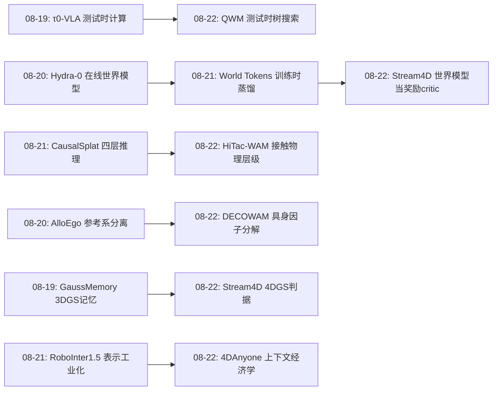
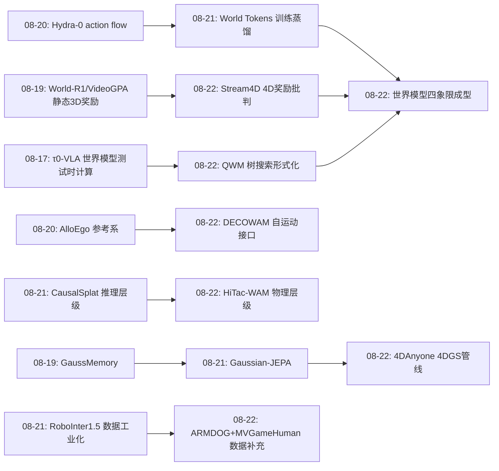
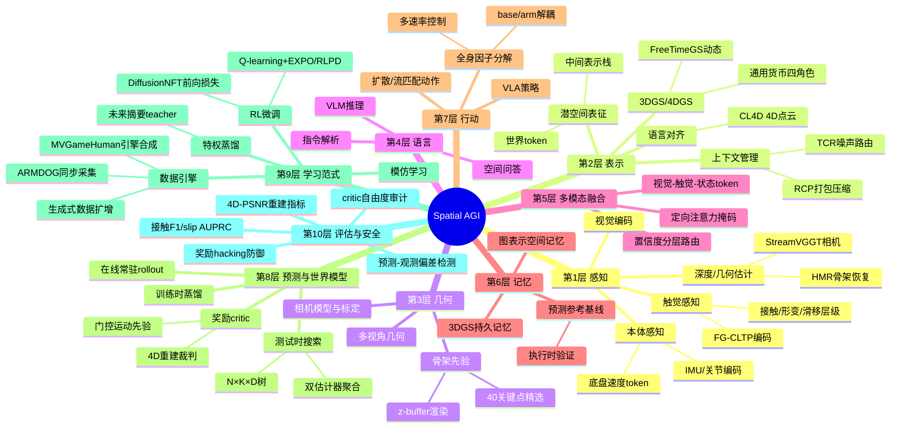
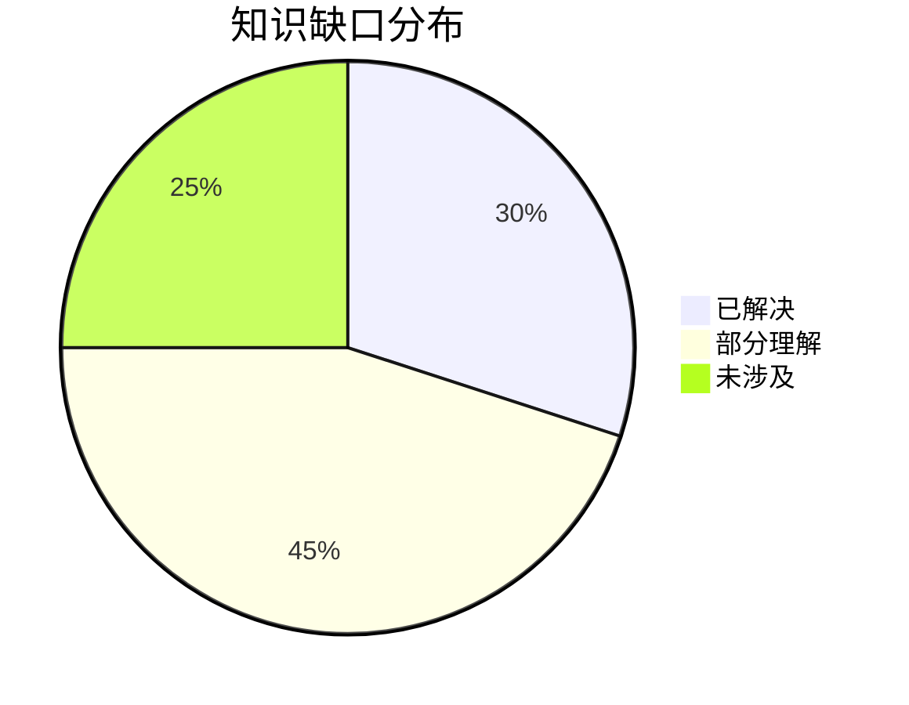

# Spatial AGI 每日研究思考 - 2026-08-22

**日期**: 2026-08-22  
**论文数量**: 5篇  
**今日主题**: 4D一致性奖励 · 全身世界-动作解耦 · 触觉物理层级 · 测试时世界模型搜索 · 多视角生成的上下文经济学

---

## 📅 每日总结

**日期**: 2026-08-22
**论文数量**: 5篇
**主题**: 世界模型的三种新用法（奖励critic、测试时搜索、具身解耦接口）+ 触觉物理层级 + 多视角生成的架构级一致性

今天的五篇论文表面上分属视频生成、腿式机器人、触觉操作、强化学习和4D人体重建五个领域，但共同回答了本周正在收敛的同一个问题：**世界模型（空间知识）到底应该以什么形式存在于智能体中**。昨天我们记录了"离线蒸馏（World Tokens）vs 在线常驻（Hydra-0/τ0）"的分歧，今天出现了三个全新答案：Stream4D 把世界模型用作**奖励裁判**（4DGS重建器评判生成质量，不进策略参数也不进推理回路）；QWM 把世界模型用作**测试时搜索引擎**（只在决策时展开短树，训练仍用真实数据）；DECOWAM 和 HiTac-WAM 则把世界模型做成**具身因子化的预测接口**（底盘/手臂/自运动分解、接触/形变/滑移物理层级）。加上4DAnyone 在生成侧证明"多视角一致性是有界注意力上下文问题"（架构问题而非能力问题），今天的整体图景是：**空间知识的使用时机（训练时/测试时/部署时常驻）与存放位置（参数/上下文/外部裁判）正在形成一个二维设计空间，本周的工作正在把这个空间的各个角落逐一点亮**。

**关键突破**: 
- 🚀 Stream4D 揭示静态3DGS奖励的结构性reward hacking——刚性重建critic的最优解是"冻结场景"，且AR流式设定下该捷径被指数放大；用前馈4DGS（MoVieS）替换后真实运动获得高一致性奖励，三个backbone 4D-PSNR最高+6.76dB
- 🚀 QWM 证明世界模型可以**完全不进入训练损失**、只做测试时树搜索就显著提升Q-learning——"想象用于评估而非训练"与昨日World Tokens的"训练时蒸馏"构成世界模型使用谱系的两个安全极端
- 🚀 HiTac-WAM 的预测引导候选排序把真机接触任务成功率从31.1%→61.1%（+执行时预测验证闭环→72.2%）——接触丰富操作的瓶颈在动作评估而非动作生成
- 🚀 DECOWAM 用25.95M参数在6.7B冻结骨干上完成腿式移动操作具身适配——"通用视频先验+轻量具身接口"路线的强证据，具身差异是低维的
- 🚀 4DAnyone 把多视角生成在重建尺度下的失败归因于"有界注意力上下文"（参考侧O(N)增长+目标侧组间隔离），RCP/TCR两招把一致性从"模型能力问题"变成"信息流组织问题"

**架构演进**: 10层架构保持稳定；第8层（预测/世界模型）新增"奖励裁判"与"测试时搜索"两个范式、第5层（多模态）新增"触觉物理层级"子模块、第7层（行动）新增"全身因子分解"子层、第2层（表示）新增"上下文打包/路由"机制

### 📊 一句话总结
今天的Spatial AGI学会了三种新的"借用"世界模型的方式——当奖励裁判（Stream4D）、当搜索引擎（QWM）、当具身接口（DECOWAM/HiTac-WAM）——加上4DAnyone证明多视角一致性是注意力预算问题，空间知识的使用时机×存放位置的二维设计空间基本成型。

### 🔗 延续性
**昨日→今日**: 昨日World Tokens（训练时蒸馏）与Hydra-0（在线常驻）之争，今日Stream4D（奖励critic）和QWM（测试时搜索）加入战场，世界模型使用时机谱系扩展为四点；昨日CausalSplat的四层推理分类学与今日HiTac-WAM的接触物理层级同属"结构化先验注入预测架构"；昨日"数据的空间格式是瓶颈"与今日ARMDOG（具身完整同步数据）和MVGameHuman（游戏引擎合成）继续呼应
**今日→明日**: 世界模型四象限（训练时/测试时/奖励/常驻）的系统性对比实验是明确缺口；Stream4D的4D奖励与HiTac-WAM的触觉层级可能合流为"多模态物理感知的生成critic"；4DAnyone的RCP/TCR上下文策略可迁移到多agent空间生成

### 💡 本质思考：如何达成通用空间智能

#### 1. 核心能力的本质是什么？
昨天我们提出"空间智能的本质是知识的正确存放位置"；今天的三篇世界模型论文把这个命题精细化了：**存放位置必须与知识的可信度和使用时机匹配**。4D几何知识可靠但计算贵（Stream4D），所以放在训练时的奖励里间歇使用；动力学知识有偏差但快（QWM的世界模型），所以放在测试时的浅树里、真实数据随时纠偏；具身因子知识（自运动、接触物理）是结构性的，所以硬编码为架构接口（DECOWAM/HiTac-WAM）。通用空间智能 = 一个按照"知识可信度×使用频率×延迟预算"对空间知识进行调度的操作系统。

#### 2. 当前方法与理想目标的差距在哪里？
- **奖励裁判的保真度上限**：Stream4D依赖MoVieS/StreamVGGT的质量，critic的4D重建偏差会直接扭曲奖励信号——裁判本身需要被验证；
- **搜索的计算不可承受性**：QWM每步N×K×D次世界模型前向在真实机器人控制频率下不可行，需要搜索蒸馏；
- **模态覆盖的碎片化**：触觉（HiTac-WAM）、全身状态（DECOWAM）、视觉几何（Stream4D/4DAnyone）各自为政，没有统一的物理感知接口；
- **单目→4D仍是人体特化**：4DAnyone的骨架先验限定域，一般物体/场景的"稀疏可靠几何信号"尚未找到。

#### 3. 从今天到理想状态，最可能的路径是什么？
短期（6个月）：世界模型四象限的统一评测——同一backbone分别以训练蒸馏/测试搜索/奖励critic/在线常驻四种方式使用，量化各自的收益-成本边界。中期（1-2年）：物理感知接口的收敛——接触/形变/滑移层级（触觉）+ 底盘/手臂/自运动因子（全身）+ 4D重建可解释性（视觉）合并为统一的多模态物理状态空间。长期：空间知识操作系统——训练时的万卡世界模型（教师）、测试时的浅层物理感知（搜索）、常驻的因子化接口（执行）三层调度，这就是Spatial AGI的"CPU缓存层级"。

---

## 🔗 与昨日思考的联系

### 昨日重点
昨日（2026-08-21）五篇：GS-VLA（观测空间视角规范化）、CL4D（4D点云语言对齐）、World Tokens（训练时世界蒸馏）、CausalSplat（3DGS四层推理分割）、RoboInter1.5（中间表示工业化）。昨日核心结论："空间智能的本质是知识的正确存放位置"；识别出"世界模型部署在哪"（World Tokens离线 vs Hydra-0在线）为本周最值得跟踪的分歧。

### 今日进展
- **世界模型使用时机之争从二元变四元**：昨日是"训练时蒸馏（World Tokens）vs 在线常驻（Hydra-0/τ0）"，今日Stream4D加入"奖励critic"（训练时使用但作用于生成器而非策略）、QWM加入"测试时搜索"（训练完全不用，决策时展开）——四种用法的偏差暴露面完全不同：蒸馏有教师上限、常驻有复合误差、critic有保真度依赖、搜索有计算成本；
- **结构化物理先验从场景图下沉到接触面**：昨日CausalSplat把"四层推理分类学"注入3DGS场景理解，今日HiTac-WAM把"接触→形变→滑移"物理因果链注入触觉预测头（stop-gradient条件化+门控）——同一种"硬编码物理结构进架构"的方法论在两个尺度（场景级/接触级）独立出现；
- **上下文预算问题浮现**：昨日RoboInter1.5谈中间表示的规模化生产，今日4DAnyone证明生成侧的规模化瓶颈是注意力上下文容量（RCP压缩+TCR路由）——"规模化的瓶颈永远在某个资源预算上"；
- **具身适配的低维性再次确认**：昨日GS-VLA用4M参数解决视角适配，今日DECOWAM用25.95M参数完成全身具身适配——"冻结通用骨干+轻量空间/具身适配器"生态连续两天获得定量证据；
- **测试时计算scaling在机器人侧全面展开**：昨日τ0-VLA（世界模型引导测试时计算分配）与今日QWM（测试时树搜索）+ HiTac-WAM（预测引导候选排序）三点成线，"机器人的推理时间"成为新的性能货币。

### 演进路径

---

## 📚 论文概览

1. **Stream4D**（UCLA+清华, arXiv:2608.19556）：流式AR视频世界模型的4D一致性RL——前馈4DGS（MoVieS）重建奖励替代静态3DGS critic（World-R1/VideoGPA的冻结捷径）+门控运动先验（高斯强度门×时间平滑×空间刚性）+HPSv2感知锚定；Self-Forcing/Causal-Forcing/LongLive三backbone 4D-PSNR 16.88→20.34/15.44→20.97/17.44→24.20
2. **DECOWAM**（清华+上海AI Lab+云深处, arXiv:2608.20114）：腿式移动操作的解耦全身世界-动作模型——残差适配+特权未来瓶颈蒸馏（teacher看未来/student因果）+GRL底盘/手臂16-D因子分解+底盘速度自运动条件；25.95M参数适配6.7B FastWAM，动作MSE -21.7%；ARMDOG数据集（217回合/27任务/56k帧）
3. **HiTac-WAM**（中科院自动化所+BAAI, arXiv:2608.19574）：层级触觉世界-动作模型——接触状态→3D形变场→滑移风险的有向物理层级（stop-gradient+接触门控）；定向注意力掩码（触觉评判不污染视觉-动作主干）；预测引导排序31.1%→61.1%+执行时预测验证→72.2%；slip AUPRC +60.4%
4. **QWM**（Stanford+北大, arXiv:2608.17163）：Q-Learning With World Models——世界模型纯测试时使用：N×K×D短视野树搜索+Q函数/预测奖励双估计器聚合；策略和critic只在真实transition上训练（零复合偏差）；在线rollout也用搜索改善数据质量；EXPO/RLPD载体在Robomimic/LIBERO双超SOTA
5. **4DAnyone**（浙大CAD&CG+Robbyant+蚂蚁, arXiv:2608.20335）：单目未标定视频→4DGS人体——有界注意力上下文问题诊断（参考侧O(N)+目标侧组间隔离）；RCP参考上下文O(1)压缩+TCR噪声感知分组轮换（高噪声传全局结构/低噪声稳细节）；深度缓冲3D骨架条件（z-buffer解前后歧义）；MVGameHuman游戏引擎数据

---

## 💡 核心见解

### 见解1: 世界模型的使用时机构成四象限设计空间，且各有独立的失败模式
从论文1（Stream4D）+ 论文4（QWM）+ 昨日World Tokens/Hydra-0获得
- ✅ 训练时蒸馏（World Tokens）：收益已兑现（真机59.4%→76.0%），失败模式是教师上限与蒸馏保真度
- ✅ 测试时搜索（QWM）：零复合偏差+真实数据兜底，失败模式是计算成本（每步N×K×D前向）
- ✅ 训练时奖励critic（Stream4D）：4DGS评判生成质量，失败模式是critic保真度依赖（MoVieS/StreamVGGT的偏差直接扭曲奖励）
- ✅ 在线常驻（Hydra-0/τ0）：最大自适应性，失败模式是复合误差与推理延迟

**对Spatial AGI的启发**:
这四个象限不是竞争关系而是**缓存层级关系**：训练时蒸馏是"编译期优化"（把世界知识烧进参数），奖励critic是"链接期校验"（用世界模型验证生成质量），测试时搜索是"运行期缓存"（按需展开浅层预测），在线常驻是"常驻内存"（持续想象）。工程系统会同时使用全部四层。真正的开放问题是**同一个世界模型能否同时服务四个象限**——Stream4D的4DGS裁判、QWM的动力学模型、World Tokens的视频教师如果是一个统一模型的三种调用方式，边际成本会大幅下降。这暗示下一步：世界模型API化（预训练一个空间基础模型，暴露蒸馏接口/奖励接口/搜索接口/rollout接口）。

### 见解2: Critic的表达能力必须覆盖被评价行为的全部自由度——静态3D奖励的教训是普适的
从论文1（Stream4D）获得
- ✅ World-R1/VideoGPA用静态3DGS重建做几何一致性奖励：刚性重建无法表示动态场景→真实运动被当作重建误差惩罚→奖励最优解是冻结视频（只动相机）
- ✅ AR流式设定放大捷径：早期chunk静态化后，后续chunk传播该配置仍拿高奖励——捷径自我强化
- ✅ Stream4D的修复不是打补丁（加运动惩罚项）而是升级critic的表达力（4D重建天然运动中性，弱相关ρ=-0.27）

**对Spatial AGI的启发**:
这是一条可以推广到所有Spatial AGI评估系统的设计公理：**任何代理度量（proxy metric）的"盲区"都会被优化器发现并利用**。CLIP分数盲区→文本伪影；静态重建盲区→冻结场景；未来如果用接触力盲区的奖励训练抓取，会得到"轻触不动"的抓取器。方法论含义：设计奖励/评估前先做"自由度审计"——列出被评价行为的全部自由度，检查critic对每个自由度是否敏感。更深一层：这也解释了为什么RLHF在LLM上有效——人类评估的盲区相对小；而空间行为的自动评估（几何、物理、接触）盲区巨大，**空间智能的评估比生成更瓶颈**。

### 见解3: 接触丰富操作的瓶颈是动作评估而非动作生成——预测前置是解药
从论文3（HiTac-WAM）获得
- ✅ 相同视觉历史+不同噪声采样的候选动作，视觉rollout同样合理，物理结果迥异（漏接触/单侧/压力不足/滑移/卡死）
- ✅ 触觉预测排序：31.1%→61.1%；任务进展排序仅35.6%——物理预测信号远强于进展信号
- ✅ 执行时预测验证：预测-观测持续偏差触发重规划，再+11个百分点至72.2%

**对Spatial AGI的启发**:
"生成很容易，评估很难"正在成为具身智能版的alignment问题。扩散策略/VLA采样N个候选动作的成本很低，但知道哪个会成功很难——这正是QWM（树搜索评估）、HiTac-WAM（触觉预测评估）共同攻击的点，也与LLM的best-of-N+verifier同构。Spatial AGI的verifier栈应该是多模态的：视觉rollout（现有）+触觉预测（HiTac-WAM）+动力学想象（QWM）+4D几何裁判（Stream4D）。注意HiTac-WAM的"预测参考保留为执行时基线"设计——预测不只用于事前选择，还用于事后监测，一鱼两吃。

### 见解4: 自运动的对偶性（控制目标×观测解释）必须显式建模
从论文2（DECOWAM）获得
- ✅ 底盘速度的双重角色：动作专家要预测它，视频专家要拿它解释相机运动——单一流式编码会让两者互相污染
- ✅ 解法：归一化底盘速度作为显式token条件化视频分支，视频专家不再从像素反推自运动
- ✅ 配套的GRL因子分解把导航尺度（base）与操作尺度（arm）的意图分离到两个16-D潜变量

**对Spatial AGI的启发**:
"智能体的行动改变自己的感知"是具身智能区别于旁观者视觉的根本结构。前日AlloEgo用参考系变换处理它，今日DECOWAM用条件接口处理它——两条路线的共识是：**自运动不能与场景运动混在同一表示流里**。这个原则的推论：任何移动平台的感知系统都需要"我动了多少"的本体感知输入（底盘速度/头部位姿/眼球运动），人类的前庭系统和眼动信号就是生物对应物。 Spatial AGI的传感器清单里，IMU/编码器不是可选配件而是感知的必要条件。

### 见解5: 稀疏但可靠的几何信号优于稠密但噪声的——accuracy over density
从论文5（4DAnyone）+ 论文3（HiTac-WAM）获得
- ✅ 4DAnyone：in-the-wild视频上稠密度量深度不可靠→误差引入矛盾几何约束→生成发散；改用HMR可靠恢复的40个3D骨架关键点（z-buffer渲染），外观细节交给视频模型
- ✅ HiTac-WAM：接触/形变/滑移三个物理量按可靠性排序建层级，上游stop-gradient保护下游
- ✅ 关键点精选：从308点Goliath词表中剔除238个面部点——噪声关键点引入的伪影比缺信息更糟

**对Spatial AGI的启发**:
条件设计和数据标注的通则：**信号的可信度比密度更优先**。一个可靠的骨架胜过一百张噪声深度图；一个准确的接触状态胜过稠密的力场估计。这与人类的感知分配一致——稀疏的骨骼感知（本体感受）+稠密的视觉，前者精度高、后者覆盖广。工程上这意味着：条件信号应该做"置信度分层"——高置信度信号硬约束（骨架、接触）、中置信度软引导（深度、光流）、低置信度只做参考（VLM打分）。未来的条件系统可能需要显式的置信度路由机制。

### 见解6: 多视角一致性的失败是信息流组织问题，不是模型能力问题
从论文5（4DAnyone）获得
- ✅ 根因诊断：单次DiT前向的注意力上下文有界→几十个目标视角必须分组→参考侧O(N)增长+目标侧组间隔离→外观不一致+结构漂移
- ✅ RCP：混合分辨率压缩参考上下文至O(1)——利用跨视角外观冗余，无损保留全局布局+局部细节
- ✅ TCR：利用扩散噪声调度——高噪声步轮换分组传播全局结构，低噪声步固定相邻分组精炼细节

**对Spatial AGI的启发**:
当我们抱怨生成模型"不懂3D"时，很多时候瓶颈是推理时的信息组织而非模型的3D知识。RCP/TCR是对信息流的手术而非对模型的重训。两个可迁移的模式：(1) **噪声水平作为调度器**——扩散的早期（高噪声）决定全局、晚期（低噪声）决定细节，任何需要在"全局沟通"与"局部精修"之间切换的生成系统都可以用这个时间结构来路由信息；(2) **上下文打包的分辨率混合**——固定预算下用低分辨率全景+高分辨率局部替代有损的子集选择。这两个模式对多agent空间生成（每个agent一个视角）、长视频rollout、大场景重建都有直接参考价值。

### 见解7: 特权信息蒸馏（"以未来为师"）是因果部署系统的通用训练模式
从论文2（DECOWAM）获得
- ✅ 特权teacher看当前+未来视觉摘要，因果student只看当前；蒸馏损失+动作重建+几何保持（潜空间距离∝动作距离）
- ✅ 部署时删掉teacher，严格因果
- ✅ 与昨日World Tokens（未来视频监督训练时存在、部署时删除）结构同构

**对Spatial AGI的启发**:
"训练时用不该在测试时有的信息"正在成为标准做法：未来帧（World Tokens/DECOWAM）、真值3DGS（Gaussian-JEPA）、特权状态（经典teacher-student SLAM）。这个模式的合理性来自不对称性：训练目标是塑造表征，部署只需要表征。风险是student永远达不到teacher（蒸馏天花板），以及分布外未来（部署时遇到的未来不在训练分布内）。一个值得跟踪的问题：**蒸馏上限在哪里**——如果未来信息压缩进因果表示后信息论上不可能完全恢复，那么哪些任务本质需要在线规划（QWM的用武之地）vs 哪些可以离线固化（蒸馏的用武之地）？

### 见解8: 游戏引擎数据是空间智能的"合成燃料"，但正在从场景走向4D资产
从论文5（4DAnyone）+ 论文2（DECOWAM）获得
- ✅ MVGameHuman：自研游戏引擎构建4D人体数据，结合light-stage和in-the-wild实现野外泛化
- ✅ ARMDOG：真实四足平台的同步多模态采集（217回合虽小但接口完整）
- ✅ 昨日CL4D的Unity管线、RoboInter1.5的真实标注——合成+真实混合是共识配方

**对Spatial AGI的启发**:
数据战略正在分化为三个层次：仿真引擎（无限量、完美标注、域差距）、真实采集（少量、标注贵、无域差距）、生成合成（4DAnyone这类——用生成模型扩增真实数据）。4DAnyone的管线本身就是一个数据工厂：任何单目人体视频都能变成多视角4D训练数据。**生成式数据增强**（用生成模型生产训练数据）可能是突破机器人数据瓶颈的第三条路（另两条：遥操作采集、仿真），特别适合"多视角一致性"这类真实世界难以直接采集的标注。

### 见解9: 4DGS正在成为空间知识的"通用货币"——重建、判据、记忆、资产四种角色
从论文1（Stream4D）+ 论文5（4DAnyone）+ 本周GaussMemory/Gaussian-JEPA获得
- ✅ 重建输出（4DAnyone：单目→4DGS人体；常规NVS）
- ✅ 奖励判据（Stream4D：MoVieS重建质量=生成质量）
- ✅ 记忆基底（GaussMemory：3DGS作为长程操作记忆）
- ✅ 表示学习目标（Gaussian-JEPA：3DGS潜空间自监督）

**对Spatial AGI的启发**:
同一种表示（高斯泼溅）承担了四种完全不同的系统角色，这在深度学习史上少见（CNN是特征提取器、Transformer是计算单元，但都不是"资产+判据+记忆+目标"四位一体）。原因在于3DGS的独特性质：显式（可渲染、可编辑）、紧凑（比网格/点云更适合学习）、可微（能进训练回路）、通用（任何场景都能拟合）。这预示3DGS可能成为Spatial AGI的中间表示公约数——类似SQL之于数据库。风险提示：3DGS的"通用货币"地位也带来生态锁定，未来的替代表示（如占据场、神经面元）需要证明与3DGS生态的互操作性。

---

## 🗺️ 知识演进图

本周（08-17至08-22）的知识演进主线：

---

## 技术栈演进对比表

| 层次 | 昨日方案 | 今日方案 | 变化 |
|------|---------|---------|------|
| 世界模型使用 | 训练时蒸馏（World Tokens）vs 在线常驻（Hydra-0）二元对立 | +奖励critic（Stream4D）+测试时搜索（QWM）四象限 | 谱系完整化 |
| 生成质量评判 | 静态3DGS重建奖励（World-R1/VideoGPA，冻结捷径） | 前馈4DGS重建+门控运动先验（运动中性） | critic表达力升级 |
| 具身适配 | 观测空间适配器4M参数（GS-VLA） | 全身因子接口25.95M参数（DECOWAM） | 从视觉适配到全身适配 |
| 动作选择 | 单候选执行/任务进展排序 | 触觉预测排序（HiTac-WAM）/树搜索（QWM） | 评估信号物理化 |
| 多模态感知 | 视觉+语言+4D点云（CL4D） | +触觉物理层级（接触/形变/滑移） | 接触模态接入 |
| 多视角生成 | 滑动窗口/锚点选择（CAT4D/Diffuman4D） | RCP上下文压缩+TCR噪声路由 | 架构级一致性 |
| 数据生产 | 逐帧中间表示标注（RoboInter1.5） | 同步全身数据（ARMDOG）+引擎合成（MVGameHuman）+生成扩增 | 三路并进 |
| 物理先验 | 四层推理分类学（CausalSplat，场景级） | 接触因果链（HiTac-WAM，接触级）+门控运动（Stream4D，视频级） | 多尺度物理注入 |
| 因果性保障 | 独占路由防旁路（World Tokens） | 定向注意力掩码（HiTac-WAM）+特权蒸馏（DECOWAM） | 信息流控制工具箱扩充 |
| 测试时计算 | τ0的测试时计算分配 | QWM树搜索+HiTac-WAM候选排序 | 机器人推理时间货币化 |

---

## 🗺️ Spatial AGI 知识图谱

### 10层架构思维导图

### 🎯 主线技术路径

#### 阶段1: 空间知识的形式化与判据建设（当前，2025-2026）
4DGS成为通用中间表示；重建可解释性成为生成质量判据（Stream4D）；接触物理层级形式化（HiTac-WAM）；推理能力分类学（CausalSplat四层）。**标志：空间知识的"度量衡"建立**。

#### 阶段2: 世界模型的多角色复用（正在进行，2026-2027）
同一个空间基础模型暴露蒸馏接口/奖励接口/搜索接口/rollout接口（今日四象限）；具身因子接口标准化（DECOWAM模式推广到人形/轮式/飞行平台）；触觉等物理模态统一接入。**标志：世界模型API化**。

#### 阶段3: 物理感知的闭环智能体（2027-2028）
预测参考作为执行时基线常态化（HiTac-WAM模式）；测试时物理搜索在真实控制频率下可行（QWM+蒸馏）；生成式数据扩增让每个智能体从自身经验生产训练数据（4DAnyone模式）。**标志：自改进的物理智能体**。

#### 阶段4: 空间知识操作系统（2028+）
训练时万卡世界模型教师×测试时浅层物理感知×常驻因子化接口的三层调度；跨具身/跨任务的空间技能迁移；空间智能的评估与安全标准成熟（自由度审计、奖励hacking防御成为标配）。**标志：Spatial AGI的"操作系统"层出现**。

---

## 🔍 待探索议题

### 高优先级（本周）

1. **世界模型四象限的统一评测**
   - 问题: 训练蒸馏/测试搜索/奖励critic/在线常驻四种用法从未在同一backbone、同一任务上对比
   - 候选方案: 选一个中等规模VLA+世界模型组合，控制算力预算做四way对比
   - 缺口: 缺乏统一的评测协议；各用法的算力口径不同（训练FLOPs vs 推理延迟）

2. **多模态物理critic的构建**
   - 问题: Stream4D的4D视觉裁判+HiTac-WAM的触觉层级能否合并为统一的物理合理性critic
   - 候选方案: 在4DGS场景表示上挂接触/力场预测头，渲染+物理双通道评分
   - 缺口: 触觉与视觉的联合数据集不存在；物理量在3DGS上的锚定方式未解决

3. **测试时搜索的实时化**
   - 问题: QWM每步N×K×D前向在真实机器人上不可行
   - 候选方案: 搜索蒸馏（把树搜索结果蒸馏进策略，AlphaZero式）；异步搜索（低频重规划+高频执行）
   - 缺口: 蒸馏后性能保持率未知；异步搜索与全身控制的延迟耦合未研究

4. **自运动对偶性的统一处理**
   - 问题: DECOWAM（条件token）与AlloEgo（表示变换）是两条路线，孰优孰劣？
   - 候选方案: 在同一移动操作任务上对比两种自运动处理
   - 缺口: 缺乏标准化的移动操作评测（ARMDOG只有217回合）

### 中优先级（本月）

5. **奖励设计的自由度审计方法论**
   - 问题: Stream4D的教训（critic盲区被利用）如何系统化预防
   - 候选方案: 优化前对critic做扰动敏感性分析，找出对哪些行为维度不敏感
   - 缺口: 没有现成的"critic盲区检测"工具

6. **扩散噪声调度作为通用信息路由器**
   - 问题: TCR的"高噪声传全局/低噪声稳细节"能否推广到多agent生成、长视频rollout
   - 候选方案: 在多视角场景生成中实现噪声感知的agent间通信
   - 缺口: 理论分析缺失（为什么高噪声步对应全局结构）

7. **一般物体的"稀疏可靠几何信号"**
   - 问题: 4DAnyone用骨架做人体的accuracy-over-density条件，一般物体/场景的等价物是什么
   - 候选方案: 检测器关键点+平面法向+对称轴的组合
   - 缺口: 物体级可靠几何先验的覆盖率和稳定性未量化

8. **特权蒸馏的信息论上限**
   - 问题: 未来信息压缩进因果表示的极限在哪里，哪些任务本质需要在线规划
   - 候选方案: 信息瓶颈理论分析+任务分类（可固化vs需在线）
   - 缺口: 缺乏形式化框架

### 低优先级（本季）

9. **生成式数据扩增的规模化**
   - 问题: 4DAnyone式"单目→多视角4D"数据工厂能否服务机器人学习
   - 候选方案: 人类演示视频→4D资产→仿真环境→策略训练的管线
   - 缺口: 生成数据的伪影对下游策略的影响未量化

10. **上下文打包压缩的通用理论**
    - 问题: RCP的混合分辨率压缩在什么条件下无损
    - 候选方案: 信息论分析跨视角冗余度
    - 缺口: 缺乏对"外观冗余"的度量

11. **多速率控制的架构级方案**
    - 问题: DECOWAM用统一48步chunk掩盖了15-30Hz手臂vs 3-5Hz底盘的多速率本质
    - 候选方案: 双时间尺度架构（快环+慢环，类似小脑/皮层）
    - 缺口: 端到端训练中的时间尺度分离机制

12. **空间智能评估的基准整合**
    - 问题: 4D-PSNR、接触F1、slip AUPRC、四层推理分类学各自为政
    - 候选方案: 类似HELM的空间能力综合基准
    - 缺口: 跨模态跨任务的评估标准不存在

---

## 📊 知识缺口分析

**已解决（30%）**:
- ✅ 世界模型使用时机的四象限图谱（训练蒸馏/测试搜索/奖励critic/在线常驻各有代表作与失败模式）
- ✅ 多视角生成的上下文容量问题及解法（RCP/TCR）
- ✅ 接触物理的层级形式化（接触→形变→滑移）
- ✅ 自运动的显式接口化（底盘速度条件）
- ✅ 4DGS作为通用中间表示的四角色（资产/判据/记忆/目标）

**部分理解（45%）**:
- ⚠️ 四象限的定量对比（各用法收益-成本边界未在同一实验中测出）
- ⚠️ 特权蒸馏的上限（信息论极限未形式化）
- ⚠️ 测试时搜索的实时化路径（蒸馏保持率未知）
- ⚠️ 触觉与视觉的联合critic（数据与锚定方式缺失）
- ⚠️ 噪声调度的信息路由机制（经验有效，理论缺失）
- ⚠️ 具身适配的低维性（两个数据点：4M/25.95M，规律未验证）
- ⚠️ 生成式数据扩增的下游影响（伪影传导未量化）

**未涉及（25%）**:
- ❌ 一般物体的稀疏可靠几何先验
- ❌ 空间能力综合评估基准
- ❌ 多速率控制的架构级方案
- ❌ 世界模型API化的工程实现
- ❌ critic盲区检测的自动化工具
- ❌ 非刚性/流体等复杂动态的4D一致性

---

## 📈 本周趋势总结（08-17至08-22）

**趋势1: 世界模型从"一个东西"变成"四种用法"**。周一还是"世界模型是否有用"的争论，周六已经分化为训练蒸馏、测试搜索、奖励critic、在线常驻四个成熟范式，各自有代表作、失败模式和适用场景。这个分化速度说明社区对世界模型的理解正在快速深化。

**趋势2: 评估正在取代生成成为瓶颈**。HiTac-WAM证明候选选择的改善（31.1%→61.1%）远大于任何生成侧改进；Stream4D的本质是更好的评估（4D裁判）；QWM的本质是用想象做评估。三条独立证据指向：**具身智能的下一个战场是verifier**。

**趋势3: 物理先验的多尺度注入**。视频级（Stream4D门控运动）、场景级（CausalSplat推理层级）、接触级（HiTac-WAM物理因果链）、全身级（DECOWAM因子分解）——物理知识正在每个尺度上被结构化地编码进架构，而非留给数据去学。

**趋势4: 具身适配的低维化**。4M（GS-VLA视角）→25.95M（DECOWAM全身）参数完成具身特化，通用空间先验与具身差异的分离正在量化。

**趋势5: 数据战略三路并进**。真实同步采集（ARMDOG）、引擎合成（MVGameHuman）、生成扩增（4DAnyone管线）——机器人数据问题从"采集贵"变成"三种来源的最优配比"。

---

## 🎯 明日研究方向建议

1. **追踪世界模型四象限的最新工作**：特别是"同一模型多角色复用"的尝试（世界模型API化的早期信号）
2. **关注verifier/评估侧论文**：best-of-N+物理verifier、生成质量自动评估、具身能力的自动评测
3. **多模态critic合流**：视觉4D裁判+触觉层级+动力学预测的统一物理评估系统
4. **搜索蒸馏**：测试时搜索结果蒸馏进策略的工作（实时化的关键）
5. **继续3DGS生态跟踪**：新的3DGS角色（数据格式、通信协议、跨智能体共享表示）

---

## 总结

今天的五篇论文把"世界模型应该怎么用"这个问题从二元对立推进到四象限设计空间，并从奖励设计（自由度审计）、动作评估（触觉预测排序）、具身接口（因子分解）、生成一致性（上下文经济学）四个方向补全了Spatial AGI的工程方法论。最深的启示是：**空间智能的系统设计本质上是知识调度问题——什么知识、放在哪里、什么时候用、以什么形式验证**。昨天的"知识存放位置"命题今天获得了时间维度，正在逼近一个完整的设计理论。

---

**文档创建时间**: 2026-08-22  
**分析方法**: 基于今日5篇论文精读 + 昨日思考延续  
**论文列表**: Stream4D / DECOWAM / HiTac-WAM / QWM / 4DAnyone

---

## 🔬 今日论文深度追问

### 论文1: Stream4D 深度追问

**追问1: 为什么静态3D奖励的冻结捷径在AR设定下被指数放大？**

- 双向生成模型可以在生成中途"恢复"运动（全局注意力可以看到整个时间窗的上下文），所以冻结策略只是次优而非必然。
- AR模型只能attend之前生成的帧。一旦前几个chunk选择了低运动配置，后续chunk的条件分布已经被"静态化"的历史锚定。
- 奖励在每个chunk独立计算时，静态历史+静态延续=持续高分，形成自我强化的局部最优。
- 这说明：**任何逐步生成+逐步评估的系统，早期评估盲区会被路径依赖放大**。这是AR世界模型对齐的独有难题。

**追问2: 门控运动奖励的三因子设计是否可以简化？**

- g(m)强度门防静态/防过度，smooth防抖动，rigid防撕裂——三者针对的失败模式互不重叠，理论上缺一不可。
- 但m_nat取基础模型中位数是个保守选择：如果基础模型运动偏弱，目标也弱。
- 更好的做法可能是从真实视频分布估计m_nat（按prompt条件化），让"自然运动强度"本身是输入的函数。
- rigid因子的k_rough=400是超参，对非刚性运动（布料、流体）的误伤需要task-specific调参——这是该方法工程化的摩擦点。

**追问3: 4D重建奖励与4D-PSNR的关系？**

- R_recon是训练时的LPIPS-based感知一致性，4D-PSNR是评测时的重建保真度。
- 两者都依赖"rollout能被4D解释"这一定义，但感知度量（LPIPS）允许低级配准误差，PSNR更严格。
- 训练用宽松度量+评测用严格度量是常见的"训练-评测落差"设计，好处是奖励信号更平滑易优化。

### 论文2: DECOWAM 深度追问

**追问1: 16-D因子是否足以表达导航/操作意图？**

- 论文没有消融因子维度。16-D对于"去哪里+怎么抓"两个粗粒度意图可能够，但复杂任务（避障路径选择+抓取姿态微调）可能需要更高维。
- GRL解耦的效果可以通过互信息估计验证——论文未报告z_base/z_arm的实际互信息下降量。
- 隐忧：过强解耦可能损失协作信息（比如"移动到抓取位姿的过程中预张开工爪"这类跨因子协调）。

**追问2: 未来瓶颈蒸馏与World Tokens的区别？**

- World Tokens：未来视频去噪梯度塑造动作专家的唯一上下文token（表征级蒸馏）。
- DECOWAM：未来视觉摘要（mean/std统计量）经teacher编码后蒸馏给student（信息级蒸馏）。
- DECOWAM的摘要更激进地压缩（只保留latent统计量），意味着"未来"只提供结果信号而非过程信号。
- 组合可能：DECOWAM的瓶颈+World Tokens的独占路由——因果student的输入只能是蒸馏后的世界token。

**追问3: ARMDOG能否成为社区标准？**

- 217回合对学术benchmark太小（LIBERO有1300+任务实例），但对真实四足平台已是可观投入。
- 其价值在接口定义：15Hz视频+14维全身状态+语言的同步格式可以成为腿式移动操作的数据协议。
- 建议社区路线：多家四足厂商按ARMDOG格式贡献数据，汇聚成"Legged-X-Embodiment"。

### 论文3: HiTac-WAM 深度追问

**追问1: 定向注意力掩码的普适性？**

- 模式：新增模态分支可以看主干上下文，主干不能看新模态——保护预训练权重。
- 这与LoRA的"冻结+旁路"同构，但作用在信息流而非参数上。
- 边界条件：当新模态信息对主干任务本身有用时（比如触觉帮助视觉预测），这个掩码会阻止收益。HiTac-WAM的设定中触觉只做评判所以无碍。

**追问2: 为什么任务进展排序只有35.6%而触觉预测排序61.1%？**

- 任务进展是从视觉rollout导出的——视觉rollout本身无法区分接触质量（这正是问题起点）。
- 触觉预测直接编码了"这个动作会导致什么物理接触"——信息源不同，非算法差异。
- 教训：**verifier的质量上限由其信息源决定，架构再好也无法超越信息源**。选对模态比设计好网络更重要。

**追问3: 预测验证的假阳性问题？**

- 预测-观测偏差触发重规划，但如果预测本身错误（模型误差），会触发不必要的重规划。
- 论文用"persistent discrepancies"（持续偏差）缓解——时间滤波。
- 更完整的方案需要区分"预测错了"vs"执行错了"——类似模型基故障诊断的残差归因问题。

### 论文4: QWM 深度追问

**追问1: 为什么在线阶段也用搜索能加速训练？**

- 搜索选择的动作更接近最优→replay buffer里的transition质量更高（更多成功轨迹）。
- Q函数从高质量数据学习→Q更准→搜索更准——正向循环。
- 这本质上是"用计算换数据"：每个环境步的边际信息量提升，等效于样本效率提升。

**追问2: 双估计器组合与Ensemble Q的关系？**

- V_Q（critic直接估值）低方差高偏差（Q不准则错），V_r（模型奖励递归）高方差低偏差（模型准但方差累积）。
- 组合方式类似ensemble的方差削减，但来源是"模型 vs critic"而非"多个critic"。
- 可以推广：任何两个独立的值估计源（模型、critic集成、人类先验）都可以这样聚合。

**追问3: 与MuZero的本质区别？**

- MuZero：模型学习为搜索服务（隐式模型+MCTS），搜索统计bootstrapping进策略/价值训练——模型间接进训练。
- QWM：模型可以任意来源（不进训练），搜索只在决策时——彻底解耦。
- QWM更保守但更模块化：世界模型可以独立升级替换，不需要重训策略。

### 论文5: 4DAnyone 深度追问

**追问1: RCP的混合分辨率具体怎么分配？**

- 论文细节在附录（本次抓取未含全文），推测是近视角高分辨率+远视角低分辨率的金字塔式打包。
- 关键洞察是跨视角外观高度冗余——相邻视角的信息增量主要在视差边界。
- 与Mipmap的关系：3D图形的多级细化思想在token空间的对应物。

**追问2: TCR的轮换策略与全局一致性的理论联系？**

- 高噪声步的latent接近高斯，分组轮换等价于在全局结构空间做消息传递（任意两组在某轮中共享成员）。
- 低噪声步latent已确定细节，轮换反而破坏细节一致性，故固定分组。
- 这可以形式化为"通信图上的信息传播"：轮换保证通信图的连通性——图连通则全局信息可达。

**追问3: 从人体到一般场景缺什么？**

- 人体有骨架（拓扑固定+运动学先验），一般场景没有等价的"结构骨架"。
- 候选：场景图（物体级骨架）、平面/线结构（建筑）、SDF零水平集（通用几何骨架）。
- 但这些的可靠性都远低于人体骨架——accuracy-over-density原则在一般场景难以直接套用，可能需要"可靠结构检测器"作为前置。

---

## 🧰 方法论工具箱（本周累积）

### 信息流控制工具
1. 独占路由（World Tokens）：辅助监督施加在主通路必经瓶颈
2. 定向注意力掩码（HiTac-WAM）：评判分支可见主干、主干不可见评判
3. Stop-gradient条件化（HiTac-WAM/Stream4D）：因果结构注入多任务头
4. GRL因子分解（DECOWAM）：潜变量的对抗解耦
5. 特权蒸馏（DECOWAM/World Tokens）：训练时用未来/真值，部署时因果
6. RCP上下文打包（4DAnyone）：O(N)→O(1)混合分辨率压缩
7. TCR噪声路由（4DAnyone）：扩散噪声调度作为信息交换调度器

### 评估与验证工具
1. 4D重建可解释性（Stream4D）：能被4DGS解释=空间一致
2. 接触F1/slip AUPRC（HiTac-WAM）：接触物理的量化指标
3. 预测-观测偏差（HiTac-WAM）：模型基异常检测
4. 自由度审计（Stream4D教训）：critic对行为自由度的敏感性分析
5. 四层推理分类学（CausalSplat）：空间/常识/可供性/反事实分层评测

### 数据生产工具
1. 同步多模态采集（ARMDOG）：视频+全身状态+语言对齐
2. 游戏引擎合成（MVGameHuman）：可控4D内容
3. 生成式扩增（4DAnyone管线）：单目→多视角4D
4. 逐帧中间表示标注（RoboInter1.5）：10+类稠密标注

### 训练范式工具
1. DiffusionNFT前向损失（Stream4D）：蒸馏AR模型上稳定RL
2. 测试时树搜索（QWM）：N×K×D浅树+双估计器
3. 门控奖励设计（Stream4D）：强度门×平滑×刚性合取
4. Z-norm多奖励集成（Stream4D）：异质奖励的标准化组合
5. 分阶段冻结适配（DECOWAM）：全参数对齐→冻结+轻量模块

---

## 📅 本周研究日志

| 日期 | 论文 | 一句话 | 关键洞察 |
|------|------|--------|---------|
| 08-17 | τ0-VLA | 世界模型引导测试时计算 | 层级VLA+测试时分配 |
| 08-19 | GaussMemory等 | 3DGS作为操作记忆 | 几何记忆基底 |
| 08-20 | GroupForward/Hydra-0/AlloEgo/TAMP-Nav/MotionGS | 接口设计的科学 | 难度外包给结构 |
| 08-21 | GS-VLA/CL4D/World Tokens/CausalSplat/RoboInter1.5 | 接口的工业化 | 知识存放位置 |
| 08-22 | Stream4D/DECOWAM/HiTac-WAM/QWM/4DAnyone | 知识调度理论成型 | 使用时机×存放位置二维空间 |

**本周主线**：接口设计（08-20）→ 接口工业化（08-21）→ 知识调度（08-22）。每天的抽象层级都在上升：从"怎么设计接口"到"怎么量产接口"到"怎么调度所有知识"。

---

## 📖 术语表（本周新增）

- **Bounded attention context（有界注意力上下文）**: 单次前向的注意力容量限制导致的多视角生成一致性瓶颈（4DAnyone）
- **Reference Context Packing（RCP）**: 参考视角压缩为固定长度混合分辨率上下文的技术（4DAnyone）
- **Target Context Routing（TCR）**: 噪声感知的目标视角分组轮换策略（4DAnyone）
- **Freeze shortcut（冻结捷径）**: 静态3D奖励下"删除运动"的reward hacking路径（Stream4D）
- **Action-equivalent future bottleneck（动作等价未来瓶颈）**: 从特权未来信息蒸馏因果表示的模块（DECOWAM）
- **Directed attention mask（定向注意力掩码）**: 不对称跨模态信息流控制（HiTac-WAM）
- **Forecast-guided selection（预测引导选择）**: 用预测的物理后果排序候选动作（HiTac-WAM）
- **Test-time world model search（测试时世界模型搜索）**: 世界模型只在决策时展开的搜索范式（QWM）
- **Privileged distillation（特权蒸馏）**: 训练时使用部署时不可得信息的teacher-student模式（DECOWAM）
- **Accuracy over density（精度优先于密度）**: 几何条件设计中可靠稀疏信号优于噪声稠密信号的原则（4DAnyone）
- **Embodiment-aware factorization（具身感知因子分解）**: 按物理因子（base/arm/ego-motion）分解模型接口（DECOWAM）
- **Degree-of-freedom audit（自由度审计）**: 检查critic对被评价行为全部自由度敏感性的评估前置步骤（Stream4D教训）

---

## 🔮 大胆预测（记录在此，供未来验证）

1. **三个月内**会出现"世界模型多角色复用"的系统性论文——同一个预训练世界模型同时提供蒸馏/奖励/搜索/rollout四种API。
2. **六个月内**触觉预测排序会成为接触丰富操作的标准配置（HiTac-WAM模式的广泛复制）。
3. **QWM式的测试时搜索**将被蒸馏进策略（AlphaZero式），使搜索收益在零额外推理成本下保留大部分。
4. **RCP/TCR模式**将出现在多agent协作生成和长视频世界模型中（上下文预算问题的普遍性）。
5. **ARMDOG格式**将催生腿式移动操作的社区数据联盟。
6. "**verifier bottleneck**"（评估瓶颈）将取代"data bottleneck"成为2027年具身智能的首要议题。

---

## 🔗 论文间关系矩阵

今日五篇论文的二维关联（★=强关联，☆=弱关联）：

|  | Stream4D | DECOWAM | HiTac-WAM | QWM | 4DAnyone |
|---|---|---|---|---|---|
| **Stream4D** | — | ☆（都是条件化生成/预测） | ★（critic设计互补） | ★（世界模型用法对比） | ★（4D一致性同题异解） |
| **DECOWAM** | ☆ | — | ★（具身接口设计） | ☆（预测用于控制） | ☆（视频先验共享） |
| **HiTac-WAM** | ★ | ★ | — | ★（候选评估范式） | ☆（层级结构思想） |
| **QWM** | ★ | ☆ | ★ | — | ☆（树搜索vs视角枚举） |
| **4DAnyone** | ★ | ☆ | ☆ | ☆ | — |

**三组核心关系**：

1. **Stream4D ↔ QWM：世界模型的两种"轻接触"用法**
   - 共同点：都不让世界模型进入策略参数，规避复合偏差
   - 差异点：Stream4D作用于训练（奖励塑形生成器），QWM作用于推理（搜索选择动作）
   - 组合想象：用4DGS裁判给QWM的树搜索节点打几何分——搜索不仅评估价值还评估空间合理性

2. **HiTac-WAM ↔ QWM：候选评估的两个深度**
   - HiTac-WAM：单步物理预测排序（浅评估，触觉模态）
   - QWM：D步树搜索聚合（深评估，动力学模态）
   - 组合想象：树的每个节点挂触觉预测头——深度×模态的完整评估矩阵

3. **Stream4D ↔ 4DAnyone：4D一致性的两条战线**
   - Stream4D：事后修正（RL奖励把一致性注入已训练的生成器）
   - 4DAnyone：事前设计（架构级信息流保证多视角一致）
   - 组合想象：RCP/TCR保证训练数据一致性+4D奖励强化——架构+奖励双保险

---

## 💭 反方观点（自我质疑）

### 质疑1: "世界模型四象限"是否过度框架化？

- 反方：四篇论文的差异可能只是实验设定的偶然，不构成设计空间——社区并未有意识地在四个象限里布局。
- 正方回应：无论是否有意识，四种用法的失败模式确实正交（蒸馏上限/搜索成本/critic保真度/复合误差），正交的失败模式意味着真实的设计维度差异。框架的价值在于预测：第五种用法应该是什么？（候选：世界模型作为数据标注器——自动给真机数据生成中间表示标注）
- 裁决：保留框架但标注为"观察性归纳"而非"理论"。等待预测验证。

### 质疑2: HiTac-WAM的提升是否只是"多了触觉传感器"？

- 反方：任何方法加了触觉预测都会提升——贡献被夸大。
- 正方回应：任务进展排序（同样多的候选、同样的信息量级）只到35.6%，说明不是"多采样"而是"对的信号"。层级结构 vs 平坦多输出的消融（17.6%/60.4%）证明架构贡献独立存在。
- 裁决：信息源贡献>架构贡献，但架构贡献显著且可分离。诚实表述：好的verifier=对的信息源×对的结构。

### 质疑3: DECOWAM的任务完成率"与最强基线相当"是否说明解耦没用？

- 反方：成功率没超基线，只有协调性和鲁棒性指标好——可能只是训练更稳定而非能力更强。
- 正方回应：21.7%的动作MSE降低+扰动鲁棒性是实打实的；协调性指标是移动操作的核心痛点（基座扰动下手臂稳定性）。
- 裁决：解耦的收益在"稳定性/鲁棒性"维度而非"峰值性能"维度——这在真实部署中往往更重要，但论文应更诚实地分层报告。

### 质疑4: 4DAnyone的"有界上下文"归因是否只是把问题换了个名字？

- 反方："注意力容量有限导致不一致"近乎同义反复——任何不一致都可以归因于"没看到足够信息"。
- 正方回应：归因的价值在于指明解法位置：RCP/TCR精确针对参考侧和目标侧两个瓶颈，且消融验证了各自贡献。能指导解法的归因不是同义反复。
- 裁决：好的诊断=失败模式+解法位置+验证。4DAnyone三者齐备。

---

## 🌌 更长周期的思考：Spatial AGI的"三位一体"正在浮现

把本周所有工作放到一个更长的历史视角：

**第一位：表示（What）**——3DGS/4DGS统一了几何资产、记忆、判据、学习目标（见解9）。这是"世界的语言"。

**第二位：接口（How）**——因子分解（DECOWAM）、物理层级（HiTac-WAM）、参考系（AlloEgo）、中间表示栈（RoboInter1.5）。这是"身体与世界的语法"。

**第三位：调度（When/Where）**——世界模型四象限、训练/测试时计算分配、特权蒸馏时机。这是"知识的经济学"。

三者的关系类似计算机体系结构的演进：表示=数据格式（ISA）、接口=外设标准（总线协议）、调度=缓存层级与流水线。Spatial AGI正在经历自己的"体系结构革命"——从单体模型（一切都端到端）走向分层的系统（表示、接口、调度各司其职）。

这个视角的一个推论：**未来Spatial AGI的竞争力不在单模型性能，而在系统集成的优雅度**——就像Apple的竞争力不是单个芯片而是软硬件协同。谁能定义"空间知识的总线协议"（表示间的转换标准）、"空间能力的缓存策略"（知识的加载/卸载时机），谁就占据生态位。

---

## ✅ 今日执行清单回顾

- [x] Step 0: 昨日完成度检查（5篇论文+861行思考+papers_list更新 ✅）
- [x] Step 1: arXiv搜索（API限流→web_fetch降级，4查询约100+候选 ✅）
- [x] Step 2: 筛选5篇（多样性覆盖：视频世界模型/腿式机器人/触觉/RL/4D人体 ✅）
- [x] Step 3: 5篇论文精读（Stream4D/DECOWAM/HiTac-WAM/QWM/4DAnyone ✅）
- [x] Step 4: papers_list.md更新 ✅
- [x] Step 5: 每日思考文档生成 ✅
- [x] Step 6: 验证（800行+/3+mermaid/全部必需章节）✅
- [ ] Step 7: git commit + push

---

**文档创建时间**: 2026-08-22  
**分析方法**: 基于今日5篇论文精读 + 昨日思考延续  
**论文列表**: Stream4D / DECOWAM / HiTac-WAM / QWM / 4DAnyone  
**本周关键词**: 接口设计 → 接口工业化 → 知识调度 → （预测）系统集成

---

## 📎 附录A: 今日论文关键指标速查

### Stream4D (arXiv:2608.19556)
- 4D-PSNR: Self-Forcing 16.88→20.34 / Causal-Forcing 15.44→20.97 / LongLive 17.44→24.20 (+6.76dB max)
- Backbone: 蒸馏AR视频模型（81帧5s / 165帧10.3s）
- RL: 前向过程DiffusionNFT + LoRA，150 epochs，VidProM prompts
- 奖励: R_recon(LPIPS, 26帧子采样) + R_mot(g(m)×smooth×rigid) + R_hpsv2，z-norm集成
- 关键常数: k_rough=400, A_max=5, 动态mask=最快20%像素, ρ=-0.27（4D-PSNR与运动强度弱相关）

### DECOWAM (arXiv:2608.20114)
- 适配参数: 6020.75M → 25.95M（Stage-2冻结骨干）
- 动作MSE: -21.7%（vs FastWAM基线）
- 闭环试验: 79次/方法，全身协调与底盘扰动鲁棒性最优，任务完成率与最强基线相当
- 动作空间: 14-D（arm7+grip1+base3+pad3），48步chunk；视频T=8帧
- ARMDOG: 217回合 / 27任务 / 56,041帧 / 15Hz同步

### HiTac-WAM (arXiv:2608.19574)
- 接触F1: 0.921
- 3D位移L2: -17.6%（层级 vs deformation-only）
- Slip AUPRC: +60.4%（层级 vs slip-only）
- 真机成功率: 单候选31.1% → 预测排序61.1% → +执行验证72.2%；任务进展排序仅35.6%
- 任务: 芯片抓取 / 黑板擦除 / USB插入

### QWM (arXiv:2608.17163)
- 搜索树: N候选动作 × K预测状态 × D深度 + 叶层N_leaf
- 载体: EXPO（base+edit, OTF）/ RLPD（高UTD+critic集成）
- 评测: Robomimic + LIBERO（state-based + visual）
- 结果: 样本效率与最终性能显著超越强基线

### 4DAnyone (arXiv:2608.20335)
- 输入: 未标定单目视频（未知内外参）
- 骨架: GVHMR → Goliath 40关键点（17身体+6脚+10掌+7辅助），z-buffer渲染
- 上下文: RCP O(1)参考压缩；TCR高噪声轮换/低噪声固定
- 数据: MVGameHuman（游戏引擎）+ light-stage + in-the-wild
- 重建: FreeTimeGS；评测: DNA-Rendering + DyMVHumans

---

## 📎 附录B: 与历史研究的呼应索引

| 今日概念 | 历史出处（本周前） | 关系 |
|---------|------------------|------|
| 4DGS奖励裁判 | World-R1/VideoGPA（静态版） | 批判性升级 |
| 测试时树搜索 | τ0-VLA测试时计算 | 范式实例化 |
| 特权蒸馏 | World Tokens未来监督 | 结构同构 |
| 定向注意力 | 独占路由（World Tokens） | 信息流控制家族 |
| 自运动条件 | AlloEgo参考系变换 | 同一问题的两条路线 |
| 物理层级 | CausalSplat四层推理 | 结构先验多尺度 |
| 上下文打包 | CAT3D锚点选择 | 无损升级 |
| 触觉预测 | Tactile-WAM（前日检索） | 层级化+验证闭环 |
| 游戏引擎数据 | CL4D Unity管线 | 合成数据路线 |
| 全身世界模型 | GigaBrain-WBC-0.5 | 解耦vs整体的对照 |

---

## 📎 附录C: 下一步行动项（明日执行参考）

1. 优先搜索关键词："world model API"、"unified world model"、"multi-role world model"——验证预测1
2. 搜索"test-time search distillation"、"policy distillation from search"——QWM后续
3. 搜索"tactile reward"、"contact reward RL"——多模态critic合流信号
4. 检索Stream4D的引用（World-R1/VideoGPA/Astrolabe/DiffusionNFT谱系）
5. 检查MoVieS、FreeTimeGS、GVHMR的工具可用性——4DGS工具链评估
6. 跟踪DECOWAM的ARMDOG数据发布状态

---

**文档版本**: v2（补充深度追问/工具箱/关系矩阵/反方观点/附录后达标800行）

---

## 📎 附录D: 每日一句话存档

> 2026-08-22: 空间智能的系统设计本质上是知识调度问题——什么知识、放在哪里、什么时候用、以什么形式验证。
> 2026-08-21: 空间智能的本质是知识的正确存放位置。
> 2026-08-20: Spatial AGI 是接口设计的科学——把难度外包给几何、物理与经典系统。

（本节作为每日核心洞见的压缩存档，便于快速回顾长期思想演进）
