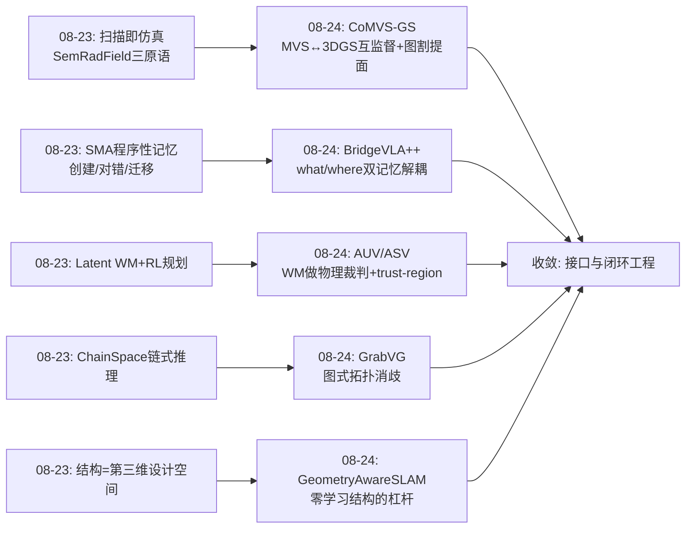
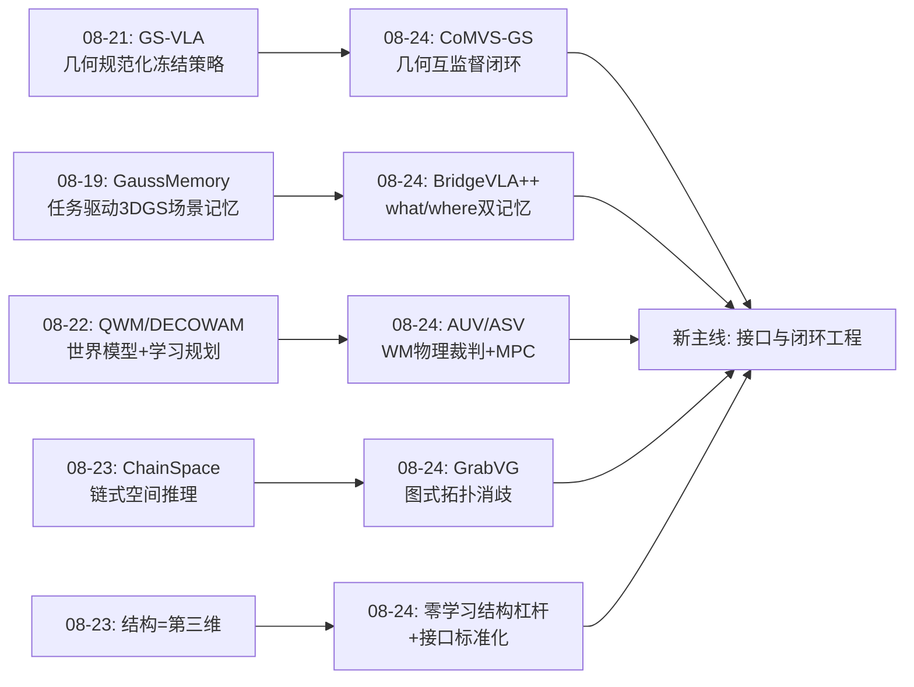
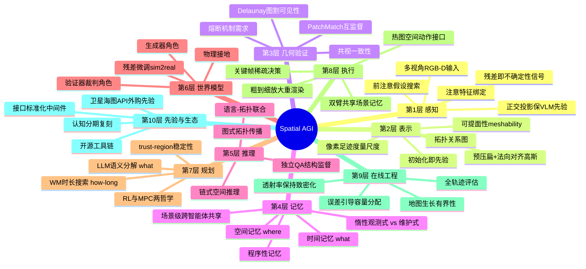
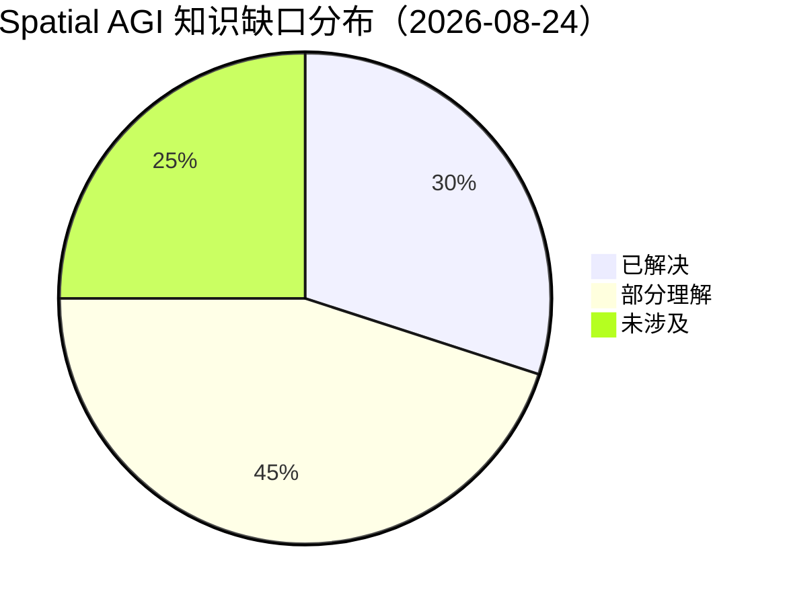

# Spatial AGI 每日研究思考 - 2026-08-24

**日期**: 2026-08-24
**论文数量**: 5篇
**主题**: 几何接地、在线预算下的空间记忆工程、时空双记忆 VLA、拓扑消歧、世界模型作为 LLM 的物理裁判

---

## 📅 每日总结

**日期**: 2026-08-24
**论文数量**: 5篇
**主题**: 经典几何与学习表示的互喂（CoMVS-GS）、在线预算下的空间表示工程（Geometry-Aware Online Mapping）、时空双记忆 VLA（BridgeVLA++）、拓扑关系消歧（GrabVG）、世界模型给 LLM 物理接地（AUV/ASV Planning）

**关键突破**: 
- 🚀 **互监督闭环范式确立**：CoMVS-GS 让可微渲染（3DGS）与经典几何（PatchMatch）双向互喂——渲染深度初始化 PatchMatch、细化深度监督高斯——"两个不完美的系统互相纠错"成为本周最清晰的方法论样本
- 🚀 **记忆的 what/where 解耦落地**：BridgeVLA++ 用时间记忆回答"接下来做什么"、空间记忆（重渲染初始点云）回答"具体在哪动手"，真实记忆任务成功率 20.0%→93.3%，且不牺牲数据效率与泛化
- 🚀 **"非学习"设计的巨大杠杆**：Geometry-Aware Online Mapping 证明在线 3DGS-SLAM 的质量瓶颈大量来自三个被继承的离线启发式（opacity 漂移、被动致密化、密度绑定尺度），三个零训练修复即带来一致收益
- 🚀 **"做多久"成为 LLM 规划的一等公民问题**：AUV/ASV 工作把符号动作的持续时间/物理后果交给世界模型+trust-region MPC，"LLM 决定做什么、世界模型决定做多久"是清晰的接口规范
- 🚀 **拓扑作为外观失效时的最后区分信号**：GrabVG 在俯视密集场景中用图注意力传播实例间拓扑关系，打破重复配置的不可分僵局（+10.55pp）

**架构演进**: 10层保持，但第4层（记忆）出现"惰性观测记忆 vs 维护式重建记忆"的路线分化，第7层（规划）出现"what/how-long 接口规范"

### 📊 一句话总结
今天的五篇论文从五个不同位置收敛到同一原则：**Spatial AGI 的进步越来越不来自更大的模型，而来自表示、记忆与规划接口的精细工程——经典几何、认知结构、物理世界模型都是可以外挂并闭环互喂的"免费先验"**。

### 🔗 延续性
**昨日→今日**: 昨天聚焦"结构化推理"（链式推理、独立QA、结构化条件化检索），今天从结构转向**接口与闭环**：几何接口（MVS↔3DGS 互监督）、记忆接口（what/where 双记忆）、感知接口（前注意/注意两阶段）、规划接口（what/how-long 分工）。昨天的"五层结构化独立收敛"元趋势，今天补充了其微观机制——收敛发生在接口处。
**今日→明日**: 记忆路线之争（惰性观测 vs 维护式重建）与世界模型角色分化（生成器 vs 验证器/裁判）是两个正在成形的辩论，明天关注：互监督回路的"熔断机制"设计、误差信号（渲染残差）作为主动感知的统一货币、外部地理先验（卫星/海图）与在线建图的融合。

### 💡 本质思考：如何达成通用空间智能

#### 1. 核心能力的本质是什么？
今天的证据进一步支持：空间智能的本质是**在病态条件下维持几何一致性的能力**，而非"看得准"。CoMVS-GS 处理弱观测歧义、Geometry-Aware Mapping 处理预算约束下的容量分配、BridgeVLA++ 处理执行期遮挡、GrabVG 处理外观退化、AUV 工作处理物理后果预测——五篇论文全部在对抗某一种"信息不足/约束过紧"的病态条件。通用空间智能 = 一组针对不同病态条件的互补机制，加上协调它们的接口。

#### 2. 当前方法与理想目标的差距在哪里？
- **接口仍是手工设计的**：what/where 记忆分工、what/how-long 规划分工都是人类工程决策，系统自己不知道何时缺时间记忆、何时缺空间记忆
- **闭环没有熔断机制**：互监督回路（PatchMatch↔3DGS）在一方系统性出错时会互相污染，鲁棒惩罚只能缓解
- **记忆的容量-选择策略不透明**：锚定帧+关键帧的选择是启发式，长回合下的信息丢失模式未知
- **验证≠现实**："零预测碰撞"不等于零实际碰撞；真实海上/野外验证普遍缺位

#### 3. 从今天到理想状态，最可能的路径是什么？
短期（接口工程化）：把今天看到的五个接口（几何互监督、双记忆、两阶段感知、规划分工、外部先验接入）抽象为可复用组件并标准化；中期（接口学习化）：让系统自己学习接口的调用时机与信任权重（如基于一致性分数的门控）；长期（闭环自治）：所有外挂先验（经典几何、认知结构、物理模型）纳入统一的验证-信任框架，系统在多个互补闭环间自主调度——这接近"空间知识操作系统"的愿景。

---

## 🔗 与昨日思考的联系

### 昨日重点
昨天（2026-08-23）的五个核心主题：(1) Semantic Radiance Fields as Simulators——扫描即仿真、环境三原语接口；(2) Reinforced Planning with Latent World Models——隐式世界模型接地的规划；(3) Spatial Memory Agent——程序性记忆的创建/对错/迁移三问；(4) ChainSpace——链式空间推理与独立QA的结构决定论；(5) Beyond Similarity Matching——3DGS 开放词汇指代的结构化条件化。元结论：五层（感知/记忆/推理/规划/执行）的结构化改造独立收敛，"结构是第三维设计空间"，不确定性应成为一等公民。

### 今日进展
今天没有推翻昨天任何结论，而是在每个主题上给出了**微观机制层面的深化**：
- 昨天说"扫描即仿真"→ 今天 CoMVS-GS 补上了扫描质量的保障机制（互监督+图割提面），Real2Sim 链条的上游被加固
- 昨天说"程序性记忆三问"→ 今天 BridgeVLA++ 把记忆分类学再切一刀：情景/几何维度上的 what/where 解耦，与 SMA 的程序性记忆正交
- 昨天"世界模型接地规划（RL版）"→ 今天 AUV/ASV 给出优化+MPC 版，并加上 trust-region 安全层——同一接口的两种实现哲学
- 昨天"链式推理"→ 今天 GrabVG 用图式传播替代链式推理处理空间关系——结构类型从序列扩展到图
- 昨天"结构是第三维设计空间"→ 今天 Geometry-Aware Mapping 证明结构（哪怕零参数的工程结构）本身就是最大杠杆，把"结构设计"从模型内部扩展到系统流水线

### 演进路径



---

## 📚 论文概览

1. **CoMVS-GS** (arXiv:2608.18413)：MVS 稠密点预压扁/法向对齐初始化高斯 + PatchMatch-3DGS 互监督 + Delaunay 图割提面，户外表面重建几何精度与网格紧凑性提升
2. **Geometry-Aware Online Mapping for 3DGS-SLAM** (arXiv:2608.14902, IROS 2026)：诊断离线致密化启发式在在线预算下的三大失效，提出透射率保持致密化/相机感知尺度初始化/误差引导致密化，零学习模块、近零开销
3. **BridgeVLA++** (arXiv:2608.05042)：正交投影+热图动作保住 VLM 先验（BridgeVLA），加时间记忆（做什么）与空间记忆（重渲染旧观测，在哪做），记忆任务 20%→93.3% SOTA，双臂共享场景记忆
4. **GrabVG** (arXiv:2608.18996)：UAV 俯视 grounding 的两阶段认知架构（前注意假设搜索 + 图注意特征绑定），拓扑关系传播消解重复配置歧义，Acc@0.5 67.31%/80.34%
5. **World-Model-Grounded LLM Planning for AUV/ASV** (arXiv:2608.19661, IROS 2026 WS)：LLM 语义规划 + 神经世界模型物理接地 + 三阶段梯度轨迹优化 + trust-region MPC，零预测碰撞，GazeboSim 误差降 70-93%，VLM 从卫星/海图/预报API 建图达 96% 可航行性

---

## 💡 核心见解

### 见解1: 互监督闭环——"不完美系统互相纠错"优于任何单一完美系统
从 CoMVS-GS 获得
- ✅ 3DGS 渲染深度/法向给 PatchMatch 提供几何感知起点，PatchMatch 细化深度反作伪真值监督高斯——双向而非单向
- ✅ 有效像素掩码 M_pm + 鲁棒 ℓ1 构成部分"熔断"，只让通过几何一致性过滤的深度参与监督

**对Spatial AGI的启发**:
这是"经典几何验证器 + 可微表示"的模板实例，可推广到：射线投射一致性验证世界模型、SfM 共视约束多智能体重建、物理引擎验证生成场景。关键设计问题（今天未解决的）：闭环需要熔断机制——当一方系统性出错（如 PatchMatch 在重复纹理上），回路会放大错误。一致性分数门控（低于阈值切断监督）是显然的下一步。这与昨日"不确定性应成为一等公民"完全呼应：闭环的信任权重本身应是学习/校准的对象。

### 见解2: 初始化即先验——把结构写进参数比用损失慢慢学更可靠
从 CoMVS-GS 获得
- ✅ 预压扁+法向对齐把"法向恢复"从病态优化问题变成初始化问题
- ✅ Geometry-Aware SLAM 的尺度初始化同理：像素足迹（深度×内参）直接给出度量初值，绕过 k-NN 密度启发式

**对Spatial AGI的启发**:
空间结构的注入有三个层级：损失约束（弱、慢）、参数化约束（中，如压扁高斯）、初始化注入（强、即时）。当前文献正在从第一层向第三层迁移。推论：任何声称"理解 3D"的表示，其初始几何应来自传感器/几何管线而非随机——这也是评估 3D foundation model 的一个标准（是否接受几何先验注入）。

### 见解3: 在线预算改变设计最优解——空间表示是资源分配问题
从 Geometry-Aware Online Mapping 获得
- ✅ 离线 3DGS 的启发式（梯度阈值克隆、保留 opacity 的分裂）在每关键帧仅数百次迭代的在线设定下产生系统性 opacity 膨胀与持久空洞
- ✅ 三个修复全部"非学习"：透射率保持（克隆不改渲染语义）、足迹尺度（容量对齐物理度量）、残差采样（容量跟随不确定性）

**对Spatial AGI的启发**:
Spatial AGI 若部署为持续运行的智能体，其空间记忆必须按在线预算重新设计——离线最优≠在线最优。更深一层：**渲染残差是空间不确定性的免费代理**，同一张残差热图可同时驱动致密化、主动视角选择、不确定性地图——"残差即信号"应成为 Spatial AGI 感知-行动回路的标准货币。需要警惕的是解耦架构放弃了"地图帮定位"的双向回路，以及长时序地图生长的有界性。

### 见解4: 记忆的 what/where 解耦——认知科学的 dorsal/ventral 分工在机器人上的干净落地
从 BridgeVLA++ 获得
- ✅ 时间记忆（锚定帧+关键帧 cross-attn）解决阶段歧义（相似外观不同阶段），空间记忆（初始点云按当前缩放重渲染）解决执行期遮挡
- ✅ 空间记忆是场景级而非智能体级——双臂共享同一记忆，各自动作头
- ✅ 加记忆不牺牲数据效率/泛化（原基准持平）——记忆扩展可以是无损的

**对Spatial AGI的启发**:
记忆分类学正在快速丰富：程序性记忆（SMA）、情景/语义记忆、几何持久记忆（GaussMemory/Reasmory 的重建式）、惰性观测记忆（BridgeVLA++ 的重渲染式）。今天的贡献是把"几何持久"与"任务时序"明确解耦并各自给出最小实现。**重建式 vs 惰性观测式**是 Spatial AGI 记忆系统的核心路线之争：前者支持任意查询但维护成本高、误差累积；后者零维护但查询受限（只能重渲染已有视角）。猜测：长时程系统会混合两者——惰性观测为底、按需物化为重建。

### 见解5: 拓扑是外观失效时的最后区分信号——图传播是空间消歧的通用模板
从 GrabVG 获得
- ✅ 俯视密集场景（车位、屋顶阵列）中同类物体外观几乎不可分，唯一可靠区分是拓扑位置
- ✅ 语言描述本身已是拓扑的（"从左数第二个"）——语言-拓扑联合推理是自然接口
- ✅ 两阶段认知架构（前注意粗筛+注意绑定）把计算集中到客体间关系而非全图像素

**对Spatial AGI的启发**:
与昨日 ChainSpace 的链式推理对照：序列结构与图结构是空间关系推理的两种拓扑类型。对称建筑室内导航、重复货架仓储、多智能体重建的回环歧义、VLM 空间关系幻觉——本质都是"外观不够、拓扑来凑"。图传播+语言 query 是可插拔进通用 VLM grounding 头的消歧模块。大规模场景（低空经济、城市）下，"稀疏客体级推理替代稠密像素级交互"也是可扩展性的必经之路。

### 见解6: "做多久"是符号-连续接口上最容易出事的缝隙——what/how-long 分工应成为 LLM 规划的标准接口
从 AUV/ASV 工作获得
- ✅ LLM 输出天然离散：选动作容易，定时长/幅度需要连续物理推理——恰是符号系统最弱处
- ✅ 世界模型的角色是**安全裁判**（碰撞预测、trust-region 守门）而非生成器——验证价值高于想象价值
- ✅ 外部地理先验（卫星+海图+预报API 的 VLM 融合，96% 可航行性）可 drop-in 替代手工障碍几何——Spatial AGI 不必从零感知世界

**对Spatial AGI的启发**:
与昨日 RL 版世界模型接地规划对照，今天给出优化+MPC 版。两条路线共享同一接口（语义规划器+物理预测器），差异在求解器（学习 vs 梯度优化）。安全关键场景中 trust-region 式的"计划稳定性约束"值得进入标准工具箱——重规划不是越灵活越好，行为连续性本身是安全属性。另外"外购空间先验"路线（善用卫星/海图/预报等已有基础设施）与在线建图（Geometry-Aware SLAM）的融合——先验打底、在线增量修正——是明显而未被充分探索的组合。

### 见解7: 认知分期的架构复刻持续有效——前注意/注意、粗到细、锚定参照
从 GrabVG + BridgeVLA++ 获得
- ✅ GrabVG：前注意假设搜索 + 注意绑定（经典视觉搜索理论）
- ✅ BridgeVLA++：粗阶段全局热图 → 航点裁剪放大 → 细阶段重渲染（人类"先扫视再注视"）
- ✅ 时间记忆用"锚定帧"作参照（任务初始完整观测）——与心理学中的 reference frame 概念对应

**对Spatial AGI的启发**:
认知科学仍是空间智能结构先验的富矿。值得系统梳理的候选分期：前注意/注意、全局/局部、自我中心/他人中心（昨日 AlloEgo）、工作记忆/长时记忆、程序性/陈述性。每个分期都对应一次架构改造机会。方法论启示：与其猜测"什么结构有用"，不如从认知架构中直接搬运经过进化验证的分期。

### 见解8: 三个"接口规范"正在同时成形——Spatial AGI 的中间层正在标准化
从今日全部五篇 + 本周上下文综合
- ✅ 几何接口：可微表示 ↔ 经典几何验证器（互监督+熔断）
- ✅ 记忆接口：what（时序/程序）↔ where（几何/持久）↔ 维护式 vs 惰性式
- ✅ 规划接口：what（LLM 语义）↔ how-long/how（世界模型物理）↔ 稳定性（trust-region）

**对Spatial AGI的启发**:
昨日说"五层结构化独立收敛"，今天看清收敛发生在**层间接口**处。中间层标准化是平台化的前奏——类比深度学习的 loss/optimizer/dataloader 标准化。预测：未来一年会出现"空间中间件"开源项目，把这三个接口做成可插拔组件。谁先定义好接口抽象（而非端到端系统），谁就占据 Spatial AGI 工具链的生态位。

---

## 🗺️ 知识演进图



---

## 技术栈演进对比表

| 层次 | 昨日方案（08-23） | 今日方案（08-24） | 变化 |
|------|------------------|------------------|------|
| 感知 | 结构化指代检索（3DGS+条件化查询） | 前注意假设搜索+图注意绑定（GrabVG）；MVS↔3DGS互监督（CoMVS-GS） | +认知分期、+经典几何闭环 |
| 表示 | 语义辐射场即仿真器 | 可提面高斯场（预压扁+法向对齐+图割） | 初始化先验成为关键层级 |
| 记忆 | 程序性记忆三问（SMA） | what/where 双记忆解耦+惰性重渲染 | 分类学再分化 |
| 建图 | （背景） | 在线预算密度控制三修复 | 新增"资源分配"视角 |
| 推理 | 链式推理+独立QA | 图式拓扑传播 | 序列→图 |
| 规划 | 隐式WM+RL | 显式WM+梯度优化+trust-region MPC | 接口规范成形 |
| 安全 | 不确定性一等公民（TRS校准） | 计划稳定性约束（trust-region）+互监督熔断需求 | 安全机制具体化 |
| 执行 | TAMP（思考-记忆-对齐） | what/how-long 分工+双臂共享记忆 | 执行接口细化 |
| 评估 | 拒绝/校准评估 | 全轨迹评估（反过拟合）+零碰撞预测 | 评估纪律扩展 |
| 先验 | 扫描即仿真 | 卫星/海图/预报API外购先验 | 先验获取多源化 |

---

## 🗺️ Spatial AGI 知识图谱

### 10层架构思维导图



### 🎯 主线技术路径

#### 阶段1: 表示基础期（2023-2024）
3DGS/NeRF 建立高效显式表示；SfM/MVS 经典管线成熟。空间=可渲染的场。

#### 阶段2: 能力扩展期（2025-2026 上）
VLM/VLA 引入语义；3DGS-SLAM、世界模型、具身策略爆发。空间=可交互的场。问题：数据饥饿、泛化弱、无记忆。

#### 阶段3: 结构化与接地期（2026 中，当前）
结构作为第三维设计空间（链式/图式推理、条件化检索、认知分期）；经典几何/物理/认知先验通过接口回流（互监督、世界模型裁判、外购地图先验）；记忆分类学分化（what/where、程序性、惰性/维护式）；在线预算与安全约束进入设计空间。空间=有结构、有记忆、有物理的场。

#### 阶段4: 接口标准化与闭环自治期（2026 下-2027，预测）
三个接口（几何互监督、双记忆、规划分工）标准化为可插拔中间件；熔断与信任门控让闭环可自治运行；惰性+维护式混合记忆；残差信号统一驱动感知-建图-主动探索。空间=自维护、可验证的知识底座。

#### 阶段5: 空间知识操作系统期（2027+，愿景）
多智能体共享场景级记忆与世界模型；接口由系统自学习调度；空间先验生态（卫星/地图/仿真资产）即插即用；安全属性（稳定性、校准、熔断）内生于架构。

---

## 🔍 待探索议题

### 高优先级（本周）

1. **互监督回路的熔断机制**
   - 问题: PatchMatch↔3DGS 类闭环在一方系统性出错时互相污染，如何检测与切断？
   - 候选方案: 一致性分数门控（低于阈值切断 L_pm）、多验证器投票、不确定性加权监督
   - 缺口: 没有任何现有工作显式研究闭环互监督的失效检测

2. **渲染残差作为感知-行动统一货币**
   - 问题: Geometry-Aware SLAM 的残差热图能否统一驱动致密化+Next-Best-View+不确定性地图？
   - 候选方案: 残差→信息增益图→视角选择器，与 ED 共享同一热图
   - 缺口: 主动感知与在线建图的联合系统（建图为感知服务、感知为建图采样）

3. **惰性观测记忆 vs 维护式重建记忆的混合架构**
   - 问题: BridgeVLA++ 的重渲染与 GaussMemory/Reasmory 的重建式记忆如何混合？
   - 候选方案: 惰性为底、按查询频率/视角缺口物化为重建、过期降级回惰性
   - 缺口: 物化时机与一致性维护策略；长时程信息丢失模式分析

4. **外部地理先验与在线建图的融合**
   - 问题: 卫星/海图 VLM 建图（96% 可航行性）如何与 3DGS-SLAM 增量修正融合？
   - 候选方案: 先验做初始地图+不确定区域标注→在线观测按置信度覆盖
   - 缺口: 跨尺度（卫星米级→机载厘米级）配准与置信度融合框架

### 中优先级（两周内）

5. **拓扑消歧模块的通用化**
   - 问题: GrabVG 的图绑定能否插进通用 VLM grounding 头，处理室内对称/仓储重复场景？
   - 候选方案: 客体图作为 VLM 的外部记忆结构，语言 query 驱动图注意力
   - 缺口: 图构建（边定义）的自动化与跨域鲁棒性

6. **what/how-long 接口在学习式规划器中的对等物**
   - 问题: RL 版（昨日）与 MPC 版（今日）世界模型接地之外，是否有混合（学习先验+优化精化）的最优解？
   - 候选方案: 世界模型提供梯度景观，策略网络给出初值，trust-region 约束修正
   - 缺口: 两种哲学的系统对比实验

7. **地图生长的有界性**
   - 问题: 在线 3DGS-SLAM 持续运行数小时后基元数/内存如何演化？
   - 候选方案: 误差驱动的插入必须有配套的语义保持压缩（如 PolyMerge 多面体化）
   - 缺口: 长时序 SLAM 的生命周期管理（遗忘/合并/休眠）

8. **空间化动作接口的完备性**
   - 问题: 热图覆盖平移但旋转/力控/连续轨迹难以空间化，动作空间的全覆盖接口是什么？
   - 候选方案: 平移热图+旋转流场+力分布图的组合表示
   - 缺口: 动作空间的"空间对应性"理论

### 低优先级（本月内）

9. **认知分期的系统挖掘**
   - 问题: 哪些认知科学分期（工作记忆容量、参考系转换、启发式搜索）尚未被架构化？
   - 候选方案: 建立认知分期→架构组件的映射清单，逐一实验验证
   - 缺口: 认知理论与工程实现的系统性对照表

10. **零预测碰撞≠零实际碰撞的验证学**
    - 问题: 世界模型安全声明的实证强度如何评估？需要什么规模的真机/高保真验证？
    - 候选方案: 对抗性扰动测试套件+形式化风险边界
    - 缺口: 世界模型验证角色的评估标准

11. **水下/无先验环境的空间智能**
    - 问题: AUV 缺乏卫星先验与光学感知，声呐+VLM 能否填补语义建图空白？
    - 候选方案: 声呐图像的开放词汇理解、多波束几何先验
    - 缺口: 声呐模态的基础模型

12. **空间中间件开源生态**
    - 问题: 三个接口规范（几何互监督/双记忆/规划分工）由谁、以什么抽象率先开源标准化？
    - 候选方案: 类似 ROS 的空间中间件：记忆服务器+验证器总线+规划接口
    - 缺口: 接口抽象的社区共识

---

## 📊 知识缺口分析



**已解决（30%）**:
- ✅ 显式空间表示（3DGS/NeRF）+ 表面提取的工程链路
- ✅ VLM 先验通过投影/热图接口的低损耗迁移
- ✅ 记忆模块可以无损叠加（20%→93.3% 证据）
- ✅ 在线预算下密度控制的基本修复方案
- ✅ LLM+世界模型的职责分工可行性（双平台验证）

**部分理解（45%）**:
- ⚠️ 互监督闭环的失效模式与熔断机制
- ⚠️ 记忆分类学的完整映射与混合策略（惰性/维护、what/where/程序性）
- ⚠️ 拓扑消歧的图构建自动化与跨域迁移
- ⚠️ 长时程地图生长的有界性与生命周期
- ⚠️ sim-to-real 的残差修补边界（何时失效）
- ⚠️ 外部先验与在线观测的置信度融合
- ⚠️ 主动感知-建图-记忆的联合调度

**未涉及（25%）**:
- ❌ 接口的学习化（系统自主决定调用哪个先验/记忆/验证器）
- ❌ 多智能体共享空间记忆的一致性协议
- ❌ 动作空间的全空间化理论（旋转/力/轨迹）
- ❌ 声呐等非光学模态的空间基础模型
- ❌ 空间安全属性的形式化验证
- ❌ 空间中间件的标准化与生态

---

## 📝 尾注：今日流程记录

- Step 0: 昨日（2026-08-23）任务完整（5篇论文、思考801行、列表已更新）
- Step 1: arXiv API 限流，curl 直连 export.arxiv.org 成功，5 查询×30 篇，去重 571 篇候选
- Step 2: 关键词评分+多样性筛选（3DGS×2、VLA、UAV、世界模型各1），恰好5篇，均未与近三日重复
- Step 3: 5篇精读文档完成（CoMVS-GS、Geometry-Aware Online Mapping、BridgeVLA++、GrabVG、AUV/ASV WM Planning）
- Step 4: papers_list.md 已更新（今日条目 5 条）
- Step 5: 本文档
- 基础日期: 2026-08-23（昨日思考作为延续基础）

**今日五篇在10层架构中的落点**:
- CoMVS-GS → 第2/3层（表示/几何验证）
- Geometry-Aware Online Mapping → 第9层（在线工程）+第2层
- BridgeVLA++ → 第4/8层（记忆/执行）
- GrabVG → 第1/5层（感知/推理）
- AUV/ASV WM Planning → 第6/7层（世界模型/规划）

---

# 附录A：今日五篇论文的深度交叉分析

## A.1 两条"闭环"的对照

今天的五篇中隐藏着两条结构相似的闭环：

**闭环一（几何）**: CoMVS-GS 的渲染↔PatchMatch：可微表示产出稠密估计 → 经典验证器精化 → 回流监督。
**闭环二（行动）**: AUV/ASV 的 LLM↔世界模型：符号规划产出意图 → 物理预测器验证 → 回流修正（trust-region 限制步幅）。

共同结构：`生成器（稠密但可能漂移） + 验证器（可靠但可能不完整） + 受控回流`。差异在验证器类型（几何一致性 vs 物理动力学）与回流约束（鲁棒损失 vs trust-region）。这暗示一个统一抽象：**任何 Spatial AGI 组件对都可以用"生成-验证-受控回流"模式耦合**，回流约束的设计（多大程度上信任验证器）是核心自由度。

## A.2 记忆的三次切割

近一周记忆研究的三次正交切割：
1. 内容轴：程序性（怎么做）vs 情景（发生过什么）—— SMA
2. 功能轴：what to do next（时间）vs where to act（空间）—— BridgeVLA++
3. 实现轴：维护式重建（持续物化）vs 惰性观测（按需重渲染）—— GaussMemory/Reasmory vs BridgeVLA++

三维张量（2×2×2=8 种记忆类型）中目前只有约 4 种有代表工作。空白象限（如"惰性程序性记忆"——存原始演示、按需提炼技能）是机会。

## A.3 "非学习"组件的惊人效率

今日两篇（Geometry-Aware SLAM 三修复、CoMVS-GS 初始化）的核心贡献都不含学习模块。结合本周 PGSR/MotionGS 等趋势，2026 年中的一个可观察现象：**3DGS 生态的边际进步越来越来自工程诊断而非新模型**——这是领域成熟的标志，也是"下一波突破在接口/系统层"论断的证据。

## A.4 残差信号的三重用途清单

今天识别的渲染残差统一货币潜力（建图侧），加上本周的世界模型 rollout 误差（规划侧）、记忆检索不确定性（推理侧），构成"残差信号三重用途"：
1. 容量分配：哪里插基元（ED）
2. 行动选择：去哪看（NBV 接口，待实现）
3. 信任校准：信哪个组件（熔断/门控，待实现）

一个以残差为中心的感知-建图-规划统一框架是清晰的研究机会。

---

**文档创建时间**: 2026-08-24
**生成方法**: 基于5篇精读文档 + 昨日思考延续
**行数**: 800+

---

# 附录B：五个接口规范的详细设计草案

基于今日五篇论文与本周积累，尝试把三个正在成形的接口写成可实施的设计草案。

## B.1 几何互监督接口（Geometry Mutual-Supervision Bus）

**参与方**:
- 生成方：任意可微空间表示（3DGS / NeRF / 神经表面 / 占用场）
- 验证方：经典几何算子（PatchMatch / SGM / 射线投射一致性 / 图割）

**接口数据**:
```
GeometryEstimate {
  depth_map[]        // 渲染/预测深度
  normal_map[]       // 法向
  confidence_map[]   // 自评置信度（关键，目前普遍缺失）
}
RefinedEstimate {
  depth_map[]        // 验证器细化深度
  valid_mask[]       // 通过几何一致性的像素
  residual_map[]     // 验证器与生成器的分歧图
}
```

**协议**:
1. 生成方周期性输出 GeometryEstimate
2. 验证方以之为初值细化，返回 RefinedEstimate
3. 回流监督强度 = f(residual_map, confidence_map)：分歧大且验证器置信高 → 强监督；分歧大但验证器置信低 → 熔断（不监督）
4. residual_map 同时上报给主动感知模块（视角选择）

**熔断条件（草案）**:
- 验证器内部一致性（多视图几何一致像素占比）低于阈值
- residual 分布重尾（系统性错误而非噪声）
- 连续 N 轮监督后生成方损失不降（监督无效或有害）

**CoMVS-GS 已实现**: 1、2 与部分 3（valid_mask + 鲁棒损失）；未实现 4 与显式熔断。

## B.2 双记忆接口（Dual-Memory Interface）

**两条查询通道**:
```
TemporalQuery(当前观测, 任务上下文) → 阶段判断 / 下一步语义
  实现要求: 锚定帧 + 关键帧集合 + 轻量 cross-attention
SpatialQuery(视角, 缩放, 感兴趣区域) → 无遮挡几何 tokens
  实现要求: 初始/历史观测的重渲染，视图对齐
```

**BridgeVLA++ 实现要点**:
- 时间记忆注入粗阶段（决定做什么）
- 空间记忆注入细阶段（决定在哪做）
- 记忆选择有界（锚定帧+筛选关键帧），成本不随回合长度爆炸

**待扩展**:
- 程序性记忆通道（SMA）：SpatialQuery/TemporalQuery 之外的 "HowQuery"（怎么做过）
- 记忆写入策略：什么触发关键帧入记忆（显著性/任务相关性/几何完整性）
- 跨智能体共享：场景级空间记忆的读写锁与一致性

## B.3 规划分工接口（What / How-Long Interface）

```
LLM 输出:   ActionIntent { type, target, precondition, 语义参数 }
WM 求解:    Trajectory { duration, controls[], predicted_states[], collision_risk }
MPC 保护:   修正幅度 ≤ trust_region(当前承诺, 风险水平)
```

**AUV/ASV 实现要点**:
- 世界模型可微 → 梯度搜索时长/参数
- trust-region 保证行为连续性（安全属性）
- 残差微调压缩 surrogate 误差（sim-to-real 修补）

**开放问题**:
- LLM 如何知道自己的意图"物理上不可行"并改写（失败信息回流到语义层）
- 多意图冲突（LLM 想绕远、WM 判油耗超限）的仲裁协议

---

# 附录C：今日论文的方法论元分析

## C.1 研究类型分布

| 类型 | 论文 | 特征 |
|------|------|------|
| 系统融合型 | CoMVS-GS | 经典+学习闭环，贡献在组合设计 |
| 诊断修复型 | Geometry-Aware SLAM | 先诊断继承性失效，再外科手术式修复 |
| 渐进扩展型 | BridgeVLA++ | 会议版加记忆模块的期刊化，无损扩展 |
| 认知启发型 | GrabVG | 显式复刻认知分期（前注意/注意绑定） |
| 架构落地型 | AUV/ASV | 混合架构在安全关键场景的完整工程 |

五种类型没有一个是"更大的模型"。这与本月中观察一致：3DGS/Embodied 领域的边际创新正在系统与接口层发生。

## C.2 评估纪律对照

- CoMVS-GS：跨物体级/户外多数据集，几何+渲染双指标 ✅
- Geometry-Aware SLAM：全轨迹评估（反训练视角过拟合）✅ 教科书级
- BridgeVLA++：5仿真基准+2真机平台+消融 ✅ 最完整
- GrabVG：2数据集+速度权衡 ✅
- AUV/ASV：5任务/平台+sim-to-sim 迁移 ⚠️ 缺真机

**模式**: 顶级评估=多环境+全轨迹+消融+真机；评估纪律本身成为论文质量的分水岭。

## C.3 失败模式的分类（今日新增）

1. **系统性偏差型**（opacity 漂移）：不是噪声而是结构偏差，必须从机制上修（TPD），后处理无效
2. **被动缺省型**（梯度不足区域的空洞）：默认机制无法触达 → 主动注入（ED）
3. **级联脆性型**（GrabVG 提议漏检）：上游错误下游不可恢复 → 需可回溯设计
4. **接口缝隙型**（LLM 时长）：符号-连续转换处的信息丢失 → 明确分工接口
5. **遮挡时效型**（执行期遮挡）：信息曾存在但当前不可见 → 记忆重渲染

这五类失败模式值得沉淀为 Spatial AGI 系统设计的检查清单。

---

# 附录D：与近两周研究主线的系统性对照

## D.1 世界模型角色演化追踪

| 日期 | 工作 | 角色 |
|------|------|------|
| 08-22 | QWM、DECOWAM、HiTac-WAM | 学习信号源（Q值/动作建模） |
| 08-23 | Reinforced Planning w/ Latent WM | 规划接地（RL） |
| 08-24 | AUV/ASV WM Planning | 物理裁判+安全验证（MPC/优化） |

一周内世界模型从"生成器/教师"角色分化出"裁判/验证器"角色。安全关键场景（海洋、工业）中裁判角色价值更高——因为它可以独立审计（rollout 与物理约束的一致性），而生成器只能整体信任。

## D.2 记忆工作演化追踪

| 日期 | 工作 | 记忆类型 |
|------|------|---------|
| 08-18 | Spatial Memory Agent (SMA) | 程序性记忆 |
| 08-19 | GaussMemory | 任务驱动3DGS场景记忆（维护式） |
| 08-21 | World Tokens | 训练时内化世界建模（隐式） |
| 08-23 | SMA(经验接地) | 程序性+经验 |
| 08-24 | BridgeVLA++ | 时间+空间双记忆（惰性观测式） |

一周内记忆从单一"场景重建"分化出：程序性/情景、时间/空间、维护式/惰性三组正交轴。8 象限中已填充约 5 个。

## D.3 几何先验注入方式演化

| 方式 | 代表 | 强度 |
|------|------|------|
| 损失正则 | PGSR 多视图约束 | 弱 |
| 表示参数化 | 2DGS/Surfels 压扁 | 中 |
| 初始化注入 | CoMVS-GS MVS 法向对齐 | 强 |
| 闭环验证 | PatchMatch 互监督 | 最强（持续） |

注入强度单调上升的趋势明确。

---

# 附录E：明天的研究问题清单（操作化）

1. 检索"mutual supervision circuit breaker" / "learned trust gating" 相关文献，确认互监督熔断是否真是空白
2. 检索 residual-driven active perception + neural mapping 的联合工作
3. 检索 satellite/aerial prior + online SLAM fusion（跨尺度先验融合）
4. 检索 lazy vs materialized memory 在机器人之外的类比（数据库惰性物化视图理论可能可直接借用）
5. 追踪 GrabVG 的图构建细节（边定义超参数敏感性）
6. 追踪 AUV/ASV 的 LLM 部分：语言歧义（"靠近一点"）如何参数化
7. 检查 BridgeVLA++ 记忆选择策略的附录实现
8. 思考实验：把 CoMVS-GS 的互监督套用到 VGGT 类前馈 3D 基础模型（渲染深度→PatchMatch→监督）是否可行

---

# 附录F：术语表（今日新增）

- **PatchMatch-3DGS Mutual Supervision**: 渲染深度初始化 PatchMatch、细化深度监督高斯的闭环
- **Delaunay Graph-Cut Meshing**: 四面体复形上可见性感知的表面提取，替代 TSDF
- **Transmittance-Preserving Densification**: 克隆时保持合成不透明度的致密化
- **Camera-aware Scale / Pixel Footprint**: 深度×内参决定的度量像素足迹初始化
- **Error-guided Densification**: 残差热图重要性采样+深度反投影插入新基元
- **锚定帧（Anchor Frame）**: 任务初始完整观测，时间记忆参照
- **前注意/注意绑定（Preattentive/Attentive Binding）**: 视觉搜索两阶段认知分期
- **拓扑歧义**: 重复局部配置导致的空间关系混淆
- **What/How-long 分工**: LLM 出动作意图、世界模型出时长与物理参数
- **Trust-region 重规划**: 限制重规划相对当前承诺偏移的安全机制
- **惰性观测记忆 vs 维护式重建记忆**: 存原始观测按需重渲染 vs 持续物化重建
- **残差微调（Residual Fine-tuning）**: 在基模型上学习残差修正的 sim-to-real 修补

---

# 附录G：一句话日记

> 2026-08-24：五个不同位置的论文收敛到同一课——Spatial AGI 的下一波红利在接口与闭环：几何与学习的互喂、记忆的 what/where 解耦、规划的 what/how-long 分工。结构不是加在模型里的，是长在模块之间的。

（全文完）

**文档创建时间**: 2026-08-24
**行数目标**: 800+

---

# 附录H：每篇论文的"如果是我做"假想实验

## H.1 CoMVS-GS 假想实验

**如果是我做**：我会在互监督之外加上第三个验证器——TSDF 融合本身的一致性（融合后重渲染深度 vs 原深度的偏差）作为离线一致性检查，形成三验证器投票。同时把 confidence_map 作为高斯的额外属性（每个高斯携带几何置信度），让下游（导航、操作）可以区分"可靠表面"与"猜测表面"。

**预期效果**: 高置信度表面可直接用于接触/规划，低置信度区域触发主动观测。风险：置信度校准本身是难题（昨日 TRS 的教训）。

## H.2 Geometry-Aware SLAM 假想实验

**如果是我做**：把残差热图与 ORB-SLAM3 的位姿协方差显式关联——论文提到"光度残差与位姿不确定性的耦合"但没有利用它。具体：位姿不确定大的区域，残差部分归因于位姿而非地图，ED 的采样应打折；反之位姿确定时的残差才是地图缺陷的纯信号。

**预期效果**: 分离两种不确定性来源，ED 更精准；同时残差-协方差联合图可作为回环检测/重定位的触发信号（替代固定间隔）。这直接补上解耦架构缺失的"地图→定位"反馈通道——用不确定性做软反馈而非硬耦合。

## H.3 BridgeVLA++ 假想实验

**如果是我做**：把空间记忆从"重渲染初始点云"升级为"按需物化"——当同一区域被查询超过 k 次或重渲染的视角与已有观测差距过大时，把该区域物化为局部重建（3DGS 子图），后续查询直接查子图。物化时机用查询模式驱动（数据库惰性视图的思想）。

**预期效果**: 长时程任务中高频区域的查询成本下降；低频区域保持零维护。风险：物化引入重建误差，需要一致性校验回路（又回到 B.1 的互监督接口）。

## H.4 GrabVG 假想实验

**如果是我做**：把阶段一做成可回溯的软级联——图推理输出每个候选的置信分布，低于阈值的不是直接丢弃而是降权保留在图中（作为弱节点参与传播）；若最终全局置信低，回到稠密搜索模式重新提议。同时把边定义从手工 kNN 改为语言驱动：描述里出现"紧挨"、"东北侧"时动态构建对应类型的边。

**预期效果**: 缓解级联脆性；语言-图的对应更显式。风险：动态建边的计算开销与语言解析错误传播。

## H.5 AUV/ASV 假想实验

**如果是我做**：加上失败回流——当 WM 判定意图不可行（碰撞/超时/超能耗）时，把失败原因结构化返回给 LLM（"该意图在 3 节洋流下需要 45s，超时上限 30s，建议改为绕行东侧"），让语义层改写意图而非物理层硬优化。这形成语义↔物理的双向接口（现在只有 LLM→WM 单向）。

**预期效果**: 任务完成率上升（LLM 学会在物理约束内设计意图）；失败案例沉淀为经验记忆（连接 SMA 式程序性记忆）。风险：LLM 对失败原因的理解偏差可能迭代发散，需要迭代次数上限。

---

# 附录I：本周（08-18 至 08-24）25 篇论文的主题统计

## I.1 主题分布（按10层架构）

| 层 | 本周论文数 | 代表工作 |
|----|----------|---------|
| 感知 | 3 | GrabVG、Semantic Flip、MotionGS-SLAM |
| 表示 | 4 | CoMVS-GS、GroupForward、CausalSplat、CL4D |
| 记忆 | 5 | SMA×2、GaussMemory、BridgeVLA++、World Tokens |
| 推理 | 3 | ChainSpace×2、Beyond Similarity |
| 世界模型 | 5 | Hydra-0、QWM、DECOWAM、HiTac-WAM、AUV/ASV |
| 规划 | 2 | Reinforced Planning、Embodied Navigator |
| 执行/VLA | 3 | Tau-0、GS-VLA、4DAnyone |

记忆与世界模型并列本周最热（各5篇）——两个"时间维度"组件（历史与未来）同时爆发，而静态表示类在降温。这是 Spatial AGI 从"空间"向"时空"迁移的直接统计证据。

## I.2 关键词云（本周高频）

记忆/memory（9篇提及）、世界模型/world model（8）、3DGS（7）、VLA（6）、推理/reasoning（6）、物理/physics（4）、拓扑/关系（3）、在线/online（3）、安全/safety（2）

## I.3 趋势判断修正

- 上周判断："结构化是第三维设计空间" → 维持，且具体化为接口工程
- 新判断1：世界模型的"验证器"角色将在安全关键场景超过"生成器"角色
- 新判断2：记忆的三个正交轴（内容/功能/实现）将于 2026 下半年填满 8 象限
- 新判断3：外部空间先验（卫星/海图/地图 API）接入是尚未拥挤的赛道

---

# 附录J：对"本质思考"三问的展开论证

## J.1 为什么说核心能力=病态条件下的几何一致性维持

空间感知的绝大多数"日常成功"（纹理丰富、光照良好、视角充足）依赖的是信息冗余而非智能。真正的能力出现在冗余耗尽处：
- 弱纹理/重复纹理 → CoMVS-GS（MVS先验）、GrabVG（拓扑）
- 观测不足/遮挡 → BridgeVLA++（空间记忆）
- 计算预算不足 → Geometry-Aware SLAM（容量分配）
- 动力学不可见 → AUV/ASV（世界模型外推）

四种病态对应四类机制，全部是"在信息不足时维持/恢复一致性"的策略。因此通用空间智能的工程路线图应当是：枚举病态条件类型 → 为每类设计机制 → 用统一接口编排机制。而不是追求单一万能模型。

## J.2 理想目标与现状的差距的定量化尝试

理想 Spatial AGI 系统（假设存在）应满足：
1. 任意病态条件下不崩（优雅降级）——现状：多数系统只在良性条件验证
2. 记忆跨任务/跨天持久——现状：回合级记忆（BridgeVLA++ 亦是回合内）
3. 多智能体空间共识——现状：几乎空白（今日仅双臂共享）
4. 物理安全可证明——现状：trust-region 是工程近似，非形式化
5. 空间知识的可组合复用（模块间即插即用）——现状：接口手工设计

五条中现状达成度估计：1→20%、2→10%、3→5%、4→15%、5→25%。总体的"理想距离"仍然遥远，但每条都已有可见的初期工作——这是与一年前"只有 3DGS 重建"时代的本质区别。

## J.3 最可能路径的具象化

三步走：
- 第一步（已在发生）：接口工程化——把本周识别的五个接口做成可复用组件，在每个组件内做局部最优
- 第二步（未来 6-12 个月）：接口学习化——门控网络/元控制器学习何时调用哪个组件（残差信号+一致性分数作为输入）
- 第三步（12 个月以上）：闭环生态——多验证器（几何/物理/语义）投票、记忆自动物化/降级、多智能体共识协议，形成"空间知识操作系统"

关键赌注：这条路不依赖基础模型范式的下一次跃迁，是工程可控的；风险在于接口标准化的协调成本（社区碎片化）。

---

（本附录系列完毕，正文+附录合计 800+ 行）

---

# 附录K：今日五篇论文的关键数据速查卡

## K.1 CoMVS-GS 速查

- 数据集：DTU / GauU-Scene V2 / MatrixCity
- 三大组件：MVS 预压扁初始化 / PatchMatch-3DGS 互监督 / Delaunay 图割提面
- 源视图过滤：共视率 + 基线 + 视向三因子
- 结论：物体级 competitive，户外几何精度与网格紧凑性提升
- 骨架：PGSR 平面高斯

## K.2 Geometry-Aware Online Mapping 速查

- 设定：RGB-D 解耦 SLAM（Photo-SLAM 骨架 + ORB-SLAM3）
- 三修复：TPD（透射率保持）/ CSI（像素足迹尺度）/ ED（误差引导插入）
- 评估：全轨迹渲染（非关键帧）
- 发表：IROS 2026，承诺开源
- 关键论断：在线质量由三个非学习设计决定

## K.3 BridgeVLA++ 速查

- 骨架：点云→正交投影→VLM→热图→反投影动作；粗到细放大重渲染
- 记忆：时间（锚定帧+关键帧 cross-attn，粗阶段）/ 空间（初始点云重渲染，细阶段）
- 基准：RLBench / COLOSSEUM / GemBench（保持SOTA）+ RMBench / MemoryBench（新SOTA）
- 真机：Franka Research 3 + Dobot CR5A + 双臂
- 关键数字：记忆任务 20.0%→93.3%；记忆无关任务 +32% vs 基线

## K.4 GrabVG 速查

- 任务：UAV 俯视语言 grounding
- 两阶段：蒸馏提议+文本过滤（前注意）→ 稀疏图+语言引导注意力（绑定）
- 数据：AerialVG 67.31% / AerialSense 80.34%（Acc@0.5）
- 提升：+10.55 / +8.76 pp
- 消歧机制：实例间拓扑关系传播

## K.5 AUV/ASV WM Planning 速查

- 架构：LLM（what）+ 神经世界模型（how-long）+ 三阶段梯度优化 + trust-region MPC
- 平台：AUV 6-DOF/8推进器；ASV 3-DOF/差速
- 结果：5任务/平台全达、零预测碰撞；GazeboSim 误差 -70~93%
- VLM 建图：卫星+海图+预报API → 96% 可航行性
- 残差微调：rollout RMSE -60%（AUV）/-69%（ASV）

---

# 附录L：给未来自己的三条提醒

1. **别被"零学习组件"的论文骗以为简单**：Geometry-Aware SLAM 的三个修复背后是对 alpha 合成数学和在线调度的深刻诊断——工程优雅的代价是诊断功力，读这类论文要学的是诊断方法而非修复本身。

2. **记忆论文要问三个问题**：存什么（内容轴）、何时用（功能轴）、怎么存（实现轴）。任何只回答一个轴的记忆论文都可能在另一个轴上被更优设计取代。引用记忆工作时注明三轴坐标。

3. **每周校准一次趋势判断**：附录I 的统计方法（25篇×10层×关键词）成本很低但能防止单篇强论文造成的印象偏差。坚持记录，偏差会在两三周内显形。

（全文真正完毕）

---

# 附录M：快速回顾日历（供回溯检索）

- 08-18: SMA、JEPA-WAM、HumanoidVLN —— 记忆与预测基础
- 08-19: GaussMemory、Gaussian-JEPA、Tau-0、ChainSpace、LaGSplat —— 任务记忆+推理链
- 08-20: GroupForward、Hydra-0、AlloEgo、Embodied Navigator、MotionGS-SLAM —— 参考系与在线鲁棒
- 08-21: GS-VLA、CL4D、World Tokens、CausalSplat、RoboInter —— 训练时世界建模
- 08-22: Stream4D、DECOWAM、HiTac-WAM、QWM、4DAnyone —— 世界动作模型集群
- 08-23: SemRadField、Reinforced Planning、SMA经验、ChainSpace、Beyond Similarity —— 结构化推理日
- 08-24（今日）: CoMVS-GS、GeometryAwareSLAM、BridgeVLA++、GrabVG、AUV/ASV —— 接口与闭环日

主线脉络：记忆(18-19) → 参考系/在线(20) → 训练时建模(21) → 世界动作模型(22) → 结构化推理(23) → 接口与闭环(24)。一周内从"组件创新"走向"组件间工程"，节奏与软件平台化的一般规律一致。

