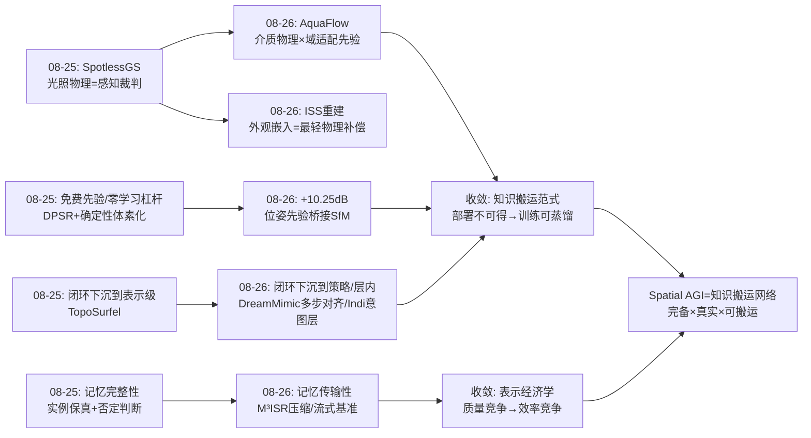
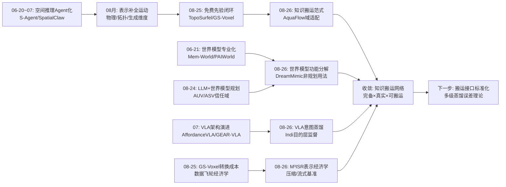
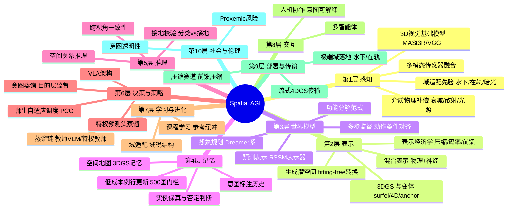
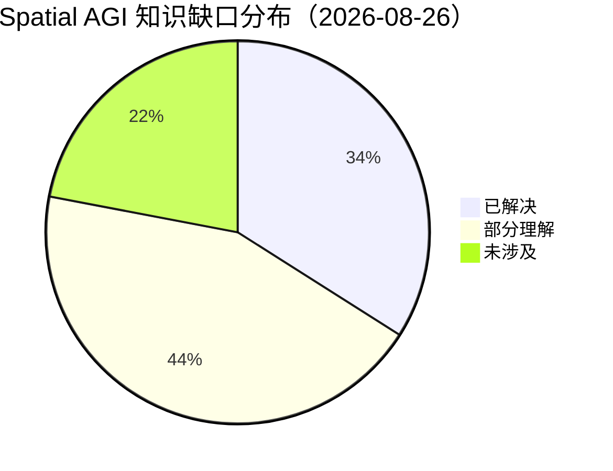

# Spatial AGI 每日研究思考 - 2026-08-26

**日期**: 2026-08-26
**论文数量**: 5篇
**主题**: 空间智能的域部署与知识蒸馏——水下流式重建（AquaFlow）、在轨重建（ISS+3DGS）、压缩基准（M³ISR）、世界模型功能分解（DreamMimic）、意图蒸馏（Indi）

---

## 📅 每日总结

**日期**: 2026-08-26
**论文数量**: 5篇
**主题**: 从理想环境到真实世界的三级跳——今天五篇论文共同回答一个问题：当空间智能离开清晰成像的陆地实验室，靠什么活下来？答案是三种"知识搬运术"：域适配先验（AquaFlow）、工程系统化（ISS）、监督目标升维（DreamMimic/Indi），外加一个度量衡（M³ISR）

**关键突破**: 
- 🚀 **"部署时不可得的知识 → 训练时可蒸馏/可预测的监督"范式三连击**：AquaFlow 把领域几何先验蒸馏进 MASt3R、DreamMimic 把特权交互状态变成预测头、Indi 把教师 VLM 的意图解读蒸馏进解码器中间层——三种完全不同的任务，同一种知识搬运结构
- 🚀 **3DGS 流式重建跨入极端环境**：AquaFlow（水下光学退化）与 ISS 重建（多 session 光照变化）分别在两个极端域证明"物理/先验补偿层"是 3DGS 落地非常规环境的标配——与昨天 SpotlessGS 的光照物理分解构成三角互证
- 🚀 **世界模型的"非规划用法"被正名**：DreamMimic 证明 RSSM 不做想象规划、只做表示骨干+多步监督，反而在高维人形富接触任务上成功——世界模型从"大一统想象机"走向"功能分解的模块化使用"
- 🚀 **VLA 监督的抽象层级跃迁**：Indi 把监督目标从"动作命令"（BC）和"未来实现"（future-based）升到"行为服务的局部目标"（意图），SimplerEnv +20pp 证明目的层是真实短板
- 🚀 **3DGS 的竞争前沿正式转向表示经济学**：M³ISR 基线揭示静态质量差异已小、存储差异巨大——空间记忆要"住得起"，压缩从附属问题升级为核心问题

**架构演进**: 10层保持；第1层（感知）新增"域适配先验"与"介质物理补偿"两个组件模式；第2层（表示）新增"表示经济学"评估维度（码率/时延）；第3层（世界模型）新增"功能分解"用法坐标（表示器 vs 规划器）；第6层（决策/策略）新增"意图中间状态"；第9层（部署/传输）首次获得专用基准

### 📊 一句话总结
今天五篇论文共同宣告：**空间智能的下一个战场不是"更强的表示"，而是"知识的搬运与经济的表示"——把仿真特权蒸馏成预测头、把教师语义蒸馏成意图层、把领域知识蒸馏成先验、把空间记忆压到传得动的码率，空间智能正在从"能看懂"走向"哪里都能用、哪里都部署得起"**。

### 🔗 延续性
**昨日→今日**: 昨天的核心结论是"表示的完备性 × 接地的真实性"乘积模型，且"补全的方式是免费先验（经典几何算子/物理方程/确定性转换）的闭环注入"。今天把"免费先验"原则推进到三个新场景：(1) AquaFlow 用物理光学模型（Jaffe-McGlamery 系）+ 域适配 MASt3R 先验在水下重演了昨天的"物理做裁判"；(2) ISS 重建用"定位位姿做光照不变桥接先验"展示了免费先验在系统级的杠杆（+10.25dB）；(3) DreamMimic/Indi 则揭示了先验注入的新形态——不必是物理或几何，**语义知识（特权状态、行为意图）同样可以蒸馏注入**。昨天预言的"3DGS 补全清单还剩动态4D、可交互性"，今天 M³ISR 把 4D 的压缩/流式评估补上，AquaFlow 把动态流式的域特化补上。
**今日→明日**: 四条线索值得追踪：(1) "特权→预测头"蒸馏范式的极限——哪些特权量可预测、哪些不可（接触力？人的意图？）；(2) 介质无关的统一感知前端（水下/雾/烟/夜的多域统一基础模型）；(3) 意图层与世界模型层的融合（目的驱动的想象）；(4) 3DGS 压缩与前馈生成的合流（扩散/流匹配直接生成压缩高斯）。

### 💡 本质思考：如何达成通用空间智能

#### 1. 核心能力的本质是什么？
今天的证据把昨天的"完备性 × 真实性"乘积模型扩展为三维：**完备性 × 真实性 × 可搬运性**。通用（general）的含义不是在一个分布里做得多好，而是知识能跨域、跨形态、跨模态地搬运：AquaFlow 搬运陆地几何先验到水下（域间）、DreamMimic 搬运特权知识到感知可达（观测间）、Indi 搬运教师语义到学生策略（模型间）、ISS 搬运多 session 观测到统一地图（时间间）、M³ISR 度量表示能否搬运到带宽受限信道（系统间）。Spatial AGI 的本质由此新增一个表述：**一个空间知识搬运网络**——蒸馏、适配、压缩都是搬运的不同形态。

#### 2. 当前方法与理想目标的差距在哪里？
- **搬运都是单向单次的**：每篇论文做一次蒸馏/适配，没有"搬运链"的概念——知识从仿真→特权教师→意图→策略的多次搬运中误差如何累积无理论刻画
- **域适配仍是一个域一篇论文**：水下、太空、暗光各自定制，"介质无关感知前端"尚未出现；跨域负迁移问题未触及
- **语义蒸馏与几何蒸馏不相往来**：Indi 蒸馏意图（语义层）、DreamMimic 蒸馏接触/物体状态（几何层），两层蒸馏在同一策略里的组织方式未知
- **表示经济学刚有度量衡**：M³ISR 是 2 秒合成序列，长时序流式的累积误差与状态管理未覆盖
- **真机证据仍然稀薄**：DreamMimic 全仿真、ISS 离线、Indi 真机 +6.7pp vs 仿真 +20pp——语义监督的真机收益折价是系统性现象

#### 3. 从今天到理想状态，最可能的路径是什么？
短期：把"特权→预测头"、"教师→中间层蒸馏"沉淀为标准模块（如同昨天的可微闭环组件）；给空间基础模型建立域适配协议（每个部署域一次轻量微调）。中期：研究多级蒸馏的误差传播理论（搬运链的信息保持界）；统一介质模型（水/雾/烟/夜作为连续介质参数空间）；意图层接入世界模型想象（目的条件 rollout）。长期：Spatial AGI 成为一个"知识可搬运、表示可压缩、目的可注入"的开放系统——任何新域、新任务、新约束都通过标准搬运接口接入既有空间智能，而不是重新训练一个新模型。

---

## 🔗 与昨日思考的联系

### 昨日重点
昨天（2026-08-25）的五个主题：(1) TopoSurfel 的 surfel↔mesh 表示级闭环；(2) GS-Voxel 的 fitting-free 确定性转换（重建→生成语料）；(3) SpotlessGS 的光照物理分解（物理做感知裁判）；(4) OVIP-SG 的实例保真与否定判断；(5) Proxemic Risk 的"分类⊥接地"审判。元结论：**表示完备性 × 接地真实性**；补全靠免费先验闭环注入；闭环需要熔断机制。

### 今日进展
今天五篇论文与昨天的议题逐一对接：
- 昨天的"物理做感知裁判"（SpotlessGS 光照分解）→ 今天 AquaFlow 的水下介质模型是同一原理在**另一物理域**的重演（衰减+后向散射代替 BRDF+光照场），且 ISS 的外观嵌入是它的**最轻量版**（一个标量级增益/偏置）——物理补偿的"投入档位"谱系浮出水面
- 昨天的"免费先验/零学习杠杆"→ 今天 ISS 的 +10.25dB（位姿先验桥接 + GLOMAP）再次确认：真实机器人数据上，**前端对应质量的决定性影响远大于渲染器差异**；AquaFlow 的 224K 域微调则给"免费"加了个注脚——域适配有一次性成本，但边际成本为零
- 昨天的"闭环下沉到表示级"→ 今天 DreamMimic 的多步隐状态对齐把闭环下沉到**策略训练内部**（学生隐状态 ↔ 动作条件预测目标），Indi 把闭环下沉到**解码器中间层**——闭环粒度继续沿 表示→训练→层内 的方向细化
- 昨天的"实例保真/否定判断（记忆完整性）"→ 今天 M³ISR 把记忆的完整性扩展到**传输完整性**（码率/时延约束下保真度保持）——记忆不仅要存得住、找得到，还要传得动
- 昨天的"3DGS 补全清单（剩动态4D/可交互性）"→ 今天 AquaFlow 补上"动态流式 × 介质退化"、M³ISR 补上"4D 压缩/流式基准"——补全清单加速消化中

### 演进路径



---

## 📚 论文概览

1. **AquaFlow** (arXiv:2608.22906, 浙大+SJTU+清华+上海AI Lab+HKU+CUHK)：水下单目 3DGS 流式重建/SLAM。三板斧：224K 水下双视图对微调 MASt3R（域适配几何先验）、介质引导增量高斯初始化、距离条件神经高斯+物理光学模型混合表示。62 条轨迹基准上定位误差 -13.2%、PSNR +4.74dB vs WaterSplat-SLAM。
2. **ISS 3DGS Reconstruction** (arXiv:2608.21685, UC Berkeley + NASA Ames)：首个 ISS 3DGS 重建。Astrobee 灰度 NavCam 5 次飞行 5000 帧；定位位姿提议匹配对（光照不变桥接）+ GLOMAP 全局 SfM（+10.25dB）+ 每航班外观嵌入；1.21M 高斯，31.19dB/75.2fps，500 图+1.3h 即可例行更新。
3. **M³ISR** (arXiv:2608.22465, HKU + Newcastle + Santa Clara + Futurewei, ACM RichMediaGAI'26)：3DGS/4DGS 可控合成基准——25 场景×静/动双配置×6 共享中心 1080p 视角=9000 帧，全模态标注（深度/语义/实例/静动掩膜）；5 条赛道（3D/4D 合成、4D 流式、3D/4D 压缩）；首次形式化前馈压缩任务与率失真公式。基线揭示：静态质量差异小、存储差异大；流式成本远超离线。
4. **DreamMimic** (arXiv:2608.22278, 清华等)：世界模型辅助的人形视觉全身 loco-manipulation 蒸馏。RSSM 不做规划、做预测表示骨干+动作条件多步隐状态对齐监督；特权预测头（奖励/接触/物体状态）把仿真特权知识"预测化"迁移；PCG 按师生相对性能动态分配 rollout。OMOMO/BEHAVE 超强基线，G1/Isaac Sim 定性迁移。
5. **Act with Intent / Indi** (arXiv:2608.23478, POSTECH)：意图蒸馏。冻结教师 VLM 从（观察+指令+动作摘要+执行视频）解读行为级意图（局部目标），其**中间层**多模态表示+文本目的+终点视觉构成三路目标，蒸馏进 VLA flow-matching 解码器中间层的意图查询；部署零特权输入。GR00T-N1.7: SimplerEnv 64.3→84.7、RoboCasa 64.1→70.3、真机 62.0→68.7。

---

## 💡 核心见解

### 见解1: "部署时不可得 → 训练时可蒸馏"是空间智能知识搬运的统一范式
从 AquaFlow / DreamMimic / Indi / ISS 四篇共同获得
- ✅ AquaFlow：陆地 3D 先验（部署域不可得的几何质量）→ 224K 域微调进 MASt3R
- ✅ DreamMimic：仿真特权状态（真值接触/物体位姿，部署不可观测）→ RSSM 预测头
- ✅ Indi：教师 VLM 的行为解读（部署时无执行视频、无教师）→ 解码器中间层意图查询
- ✅ ISS：跨 session 一致几何（单 session 内不可得）→ 定位位姿桥接先验进入 SfM

**对Spatial AGI的启发**:
这四例的结构完全同构：`特权知识源 K（训练时可得）→ 转换器 T（微调/预测头/蒸馏/桥接）→ 部署时可达表示 R（策略输入/先验/中间层）`。这应该被显式命名为空间智能的**知识搬运接口**（Knowledge Transfer Interface），并研究其公理：哪些知识可搬运（可从学生输入预测）、哪些会丢失（不可预测的特权量）、搬运误差如何刻画。昨天的"免费先验闭环注入"是本范式在物理/几何知识上的特例；今天语义知识（意图、特权状态）的搬运成功说明该范式覆盖物理与语义全域。**Spatial AGI 工程的未来形态：一个核心空间模型 + 一组标准搬运接口，每个新域/新任务通过接口注入知识，而非重训模型。**

### 见解2: 物理补偿存在"投入档位"谱系——从标量嵌入到完整光学模型
从 ISS / AquaFlow / SpotlessGS（昨日）对照获得
- ✅ ISS：每航班一个标量级外观嵌入（增益+偏置）→ 吸收跨 session 曝光差异，成本≈0
- ✅ AquaFlow：完整物理光学模型（距离相关衰减+后向散射）与神经高斯混合 → 水下强退化域的必要投入
- ✅ SpotlessGS（昨天）：BRDF+光照场完整分解 → 服务下游重打光与机器人感知

**对Spatial AGI的启发**:
物理建模不是有/无的二元选择，而是一条投入-回报曲线：退化越强、下游需求越高（重打光/真实感），需要的物理档位越高。系统设计应像选择数据结构一样**按域选择物理档位**：空气常规光照→无补偿；多session光照→嵌入级；水下/雾/烟→介质模型级；下游感知敏感→材质分解级。缺失的工程知识是这条曲线的**拐点估计方法**——何时升级档位？渲染残差的域相关性（昨天提出的"渲染残差=不确定性货币"）可能是自动判据。

### 见解3: 世界模型的价值在"功能分解"——表示器/监督器/规划器三个生态位
从 DreamMimic 获得
- ✅ Dreamer 默认用法（想象 rollout 训练策略）在 HumanoidBench 高维人形任务上失败
- ✅ 拆出 RSSM 只做"预测表示+动作条件多步监督"，反而在富接触人形任务上稳定蒸馏成功
- ✅ 与 ImageWAM（质疑世界动作模型是否需要视频生成）、"Reconstruction or Semantics?"（潜在空间设计反思）构成同一趋势的三处独立证据

**对Spatial AGI的启发**:
世界模型研究正从"大一统想象机"转向**功能分解**：同一 RSSM 骨干，可以当规划器（Dreamer）、当表示器（DreamMimic）、当蒸馏监督器（多步对齐）。这提示 Spatial AGI 架构设计的问题不是"要不要世界模型"，而是"世界模型的哪个功能、插在哪一层"。规划功能在高维动作空间代价高且不稳，但表示/监督功能普遍有效——**先表示、再监督、后规划**可能是世界模型能力的正确启用顺序。对空间记忆架构的直接启示：记忆系统可以内嵌一个"预测校验器"（写入时预测未来观察，读取时校验预测一致），无需完整想象规划。

### 见解4: 监督目标的抽象层级决定策略的天花板——意图是动作之上的缺失维度
从 Indi 获得
- ✅ BC 监督"做什么动作"，future-based 监督"未来的特定实现"，Indi 监督"实现服务的局部目标"
- ✅ 教师中间层表示（保留多模态接地）优于最终层（特化为语言生成）作为蒸馏目标
- ✅ 意图作为功能性中间状态（参与后续解码）而非辅助读出——闭环干预证明被真实使用

**对Spatial AGI的启发**:
空间行动的三层结构：动作（几何层）→ 展开（动力学层）→ 目的（语义层）。当前 VLA 监督集中在下两层，Indi 证明第三层的注入带来 20pp 级提升——**目的层是被系统性低估的监督信号源**。对空间记忆与规划的启示：空间记忆不仅存储"世界什么样"，还应存储"当时为什么那样行动"（意图标注的历史）；未来查询"如何做 X"时，意图匹配的回忆比表面相似的回忆更有用。另一个可复制的细节：**中间层蒸馏 > 输出蒸馏**，正在成为表示迁移的经验法则（与 MLLM 中间层研究一致）。

### 见解5: 3DGS 竞争前沿从质量转向表示经济学——空间记忆的"住房成本"
从 M³ISR 获得
- ✅ 受控条件下各 3DGS 方法静态重建质量差异已很小，但表示存储差异巨大
- ✅ 流式 4DGS 方法的训练/重建成本显著高于离线动态基线——"在线性"的代价首次被统一协议量化
- ✅ 前馈压缩（免逐场景训练的率失真优化）被形式化为独立任务

**对Spatial AGI的启发**:
与昨天 GS-Voxel 的"重建语料转换成本"相接：Spatial AGI 的数据战略需要两个经济学指标——语料转换成本（离线）与记忆传输成本（在线）。当空间智能部署到机器人队群（云建图、端消费）或 AR 通信，码率与时延成为硬约束，压缩不再是论文附属实验而是系统第一公民。预测：**前馈压缩 × 生成模型合流**（直接生成压缩码流的高斯）是下一个热点；"质量-码率-时延"三维权将成为 3DGS 论文的标准报告格式，就像当年检测论文从 mAP 走向 mAP-FPS 权衡。

### 见解6: 空间模型的更新成本决定其生命周期——500张图/1.3小时的"例行刷新"门槛
从 ISS 重建获得
- ✅ 静态 CAD 无法跟随舱内变化是空间站建图的原始痛点；照片级 + 低成本更新 = 空间记忆从"文档"变"服务"
- ✅ 超参研究给出最小数据预算（>500 图边际递减、>60k 迭代平台期）——例行更新的工程依据
- ✅ 下游价值链完整：态势感知→程序预演→机器人仿真环境

**对Spatial AGI的启发**:
空间记忆的价值 = 覆盖度 × 保真度 × **新鲜度**，而新鲜度由更新成本决定。ISS 论文证明照片级新鲜度的成本门槛已经低到"机器人空闲时顺手扫一遍"。推广：所有长寿命空间系统（船舶、工厂、机房、商场、家庭）都是适用域——**"机器人例行扫描 + 低成本重建 = 持续新鲜的空间记忆"** 应成为 Spatial AGI 部署的标准运营模式。但缺口同样明确：3DGS 的变化检测/增量更新（只重渲变化区域）尚未成熟，目前是整体重训——这是"空间记忆差分更新"的开放问题（与昨天 OVIP-SG 的否定判断、变化检测话题汇合）。

### 见解7: 域适配有价、边际免费——空间基础模型的"域税"结构
从 AquaFlow / ISS 对照获得
- ✅ AquaFlow：224K 域内对微调 MASt3R——一次性成本，之后所有水下任务免费受益
- ✅ ISS：无需任何训练，仅用定位位姿做匹配先验——零成本域适配（系统级先验）
- ✅ 两者共同反驳"通用模型直接泛化到极端域"的幻想：MASt3R 陆地权重在水下失效、增量 SfM 跨 session 失败

**对Spatial AGI的启发**:
"通用"的正确形态可能是：**一个核心 + N 个域适配头**，而非一个无所不包的权重。域税（domain tax）结构：每个新域支付一次适配成本（数据收集+微调），此后边际为零。这为空间基础模型的商业化提供了清晰账本，也提出了研究问题：域适配的最小数据量是多少（AquaFlow 224K 对 vs ISS 0 对——桥接先验可代替多少数据）？域之间能否互相迁移（水下适配是否帮助雾天）？**域适配数据效率**将成为空间基础模型的关键指标。

### 见解8: 空间智能栈的"知-预-愿"三要素正在分别成熟
从今日五篇 + 历史脉络综合获得
- ✅ 知（空间记忆）：ISS/AquaFlow/M³ISR——3DGS 记忆在极端域与传输约束下成熟
- ✅ 预（世界模型）：DreamMimic——预测表示稳定策略学习，功能分解明确生态位
- ✅ 愿（行动目的）：Indi——意图层注入解码器，目的论空间表示落地

**对Spatial AGI的启发**:
类比心理学"知、情、意"，空间智能栈可分为：空间记忆（知）、动力学预见（预）、行动意图（愿）。今天五篇恰好各占一角：三篇补"知"的域部署与传输，一篇补"预"的用法，一篇补"愿"的注入。三要素的**整合**（目的驱动的想象 + 意图索引的记忆）是下一代具身基础模型的形态猜想：记忆按意图组织、想象由意图条件化、意图从记忆与想象中校准。

---

## 🗺️ 知识演进图



## 技术栈演进对比表

| 层次 | 昨日方案 | 今日方案 | 变化 |
|------|---------|---------|------|
| 感知（第1层） | 光照物理分解（SpotlessGS） | 域适配基础模型（MASt3R微调）+ 介质物理补偿（AquaFlow）+ 光照不变桥接先验（ISS） | 物理补偿档位谱系化；域适配成为感知栈新组件 |
| 表示（第2层） | 3DGS 拓扑/生成/光照三维补全 | 混合表示（物理模型+神经高斯）；表示经济学维度（码率/时延）新增 | 表示新增"经济性"评估维度；混合显式-隐式成为极端域标配 |
| 世界模型（第3层） | 世界模型做规划裁判（AUV/ASV） | RSSM 做表示器+监督器（DreamMimic 非规划用法） | 功能分解：表示/监督/规划三生态位明确 |
| 策略（第6层） | VLA 架构增强（Affordance/几何token） | 意图中间状态注入解码器（Indi）+ 特权预测头蒸馏（DreamMimic） | 监督目标升维（意图层）；蒸馏粒度到层内 |
| 记忆（第4层） | 实例保真 + 否定判断 | 低成本例行更新（500图/1.3h）+ 传输完整性（压缩/流式） | 新鲜度与传输性成为记忆一等维度 |
| 部署（第9层） | 未单独审视 | M³ISR 五赛道（合成/流式/压缩）+ 极端域实证（水下/在轨） | 首获专用基准与极端域落地证据 |
| 评估 | 接地校验（分类⊥接地） | 中间层干预验证（Indi闭环干预）+ 受控基准（M³ISR静动分离） | 因果干预式评估进入日常 |

---

## 🗺️ Spatial AGI 知识图谱

### 10层架构思维导图



### 🎯 主线技术路径

#### 阶段1: 表示补全（2025-2026上半年）
3DGS 从渲染玩具到世界表示：几何精度（surfel/网格闭环）、光照物理（BRDF/重打光）、生成分布（潜空间/流模型）、介质适应（水下/暗光）。今天的 AquaFlow 与 ISS 是该阶段在极端域的收官之作。

#### 阶段2: 知识搬运标准化（当前，2026下半年）
域适配协议（每域一次微调）、特权预测头（仿真→感知）、意图蒸馏（教师→学生）、确定性转换（重建→生成语料）。核心问题：搬运接口的标准化与多级蒸馏的误差理论。

#### 阶段3: 表示经济学（并行进行）
前馈压缩、流式传输、率失真联合优化、空间记忆差分更新。驱动力：机器人队群与 AR 通信的带宽/时延硬约束。M³ISR 是该阶段的度量衡起点。

#### 阶段4: 三要素整合（2027展望）
意图驱动的想象（目的条件 rollout）、意图索引的记忆（按目的组织空间历史）、预测校验的记忆（写入时预测、读取时校验）——知、预、愿在统一架构中互相校准，形成自我审计的空间智能。

---

## 🔍 待探索议题

### 高优先级（本周）

1. **可搬运知识的边界**
   - 问题: 哪些特权/语义知识可以从学生输入预测（可蒸馏），哪些本质不可（接触力？他人意图？）
   - 候选方案: 对每类特权量训练探针（probe），测其从学生观察的可预测性上限
   - 缺口: 缺乏"可蒸馏性"（distillability）的形式化定义与度量

2. **物理补偿档位的自动选择**
   - 问题: 给定域的退化强度，何时用嵌入级/介质模型级/材质分解级补偿？
   - 候选方案: 渲染残差的域相关性分析（昨日"残差=不确定性货币"的延伸）作为档位判据
   - 缺口: 档位-回报曲线的系统实验；跨档位的统一实现

3. **3DGS 空间记忆的差分更新**
   - 问题: 舱内/室内变化后，如何只更新变化区域而非整体重训（ISS 明确遗留）？
   - 候选方案: 变化检测分割 + 局部高斯替换 + 全局位姿图保持；与 OVIP-SG 的否定判断结合
   - 缺口: 局部-全局一致性理论（局部更新不破坏整体渲染质量）

4. **意图蒸馏 × 世界模型融合**
   - 问题: Indi 的意图层能否条件化 DreamMimic 的 RSSM 想象（目的驱动预测）？
   - 候选方案: 意图 token 作为世界模型的 goal condition，多步对齐损失同时监督策略与预测
   - 缺口: 两者训练稳定性的相互影响；意图表示是否足够稳定以条件化动力学

### 中优先级（两周内）

5. **多级蒸馏链的误差传播**
   - 问题: 仿真→特权教师→意图→策略的多跳搬运中，信息如何衰减？
   - 候选方案: 每级蒸馏的保真度测量（探针准确率），建立"搬运链信息保持界"
   - 缺口: 理论工具；级间耦合的实证研究

6. **域适配数据效率的标定**
   - 问题: 每个新域最少需要多少适配数据（AquaFlow 224K vs ISS 0——先验桥接能替代多少数据）？
   - 候选方案: 系统性扫参（域内数据量 × 桥接先验强度 → 下游性能）
   - 缺口: 统一实验框架；跨域（水下/雾/夜）的域税对比表

7. **介质无关感知前端**
   - 问题: 水/雾/烟/夜能否统一为连续介质参数空间，训练单一适配头？
   - 候选方案: 介质参数化的图像形成模型 + 域随机化训练
   - 缺口: 统一的介质参数化；跨域负迁移风险

8. **前馈压缩 × 生成合流**
   - 问题: 能否用流匹配/扩散直接从多视角帧生成压缩高斯码流（M³ISR 前馈压缩任务的正解）？
   - 候选方案: 端到端"帧→码流"模型，率失真损失联合训练
   - 缺口: 码流的离散性与生成模型连续输出的鸿沟；长序列流式版本

### 低优先级（本月内）

9. **意图标注的记忆检索**
   - 问题: 空间记忆按意图（目的）索引能否改善任务回忆（vs 表面相似检索）？
   - 候选方案: 在 DreamMimic/Indi 类任务上对比意图索引与几何/语义索引的回放成功率
   - 缺口: 带意图标注的空间记忆数据集

10. **流式系统的长时序基准**
    - 问题: M³ISR 的 2 秒序列无法暴露长序列累积误差与状态管理问题
    - 候选方案: 分钟级多 session 流式基准（ISS 数据的流式化是现成素材）
    - 缺口: 长序列的评估协议（漂移/遗忘/更新一致性指标）

11. **真机收益折价的机理**
    - 问题: Indi 仿真 +20pp vs 真机 +6.7pp、DreamMimic 全仿真——语义监督的真机折价为何系统性存在？
    - 候选方案: 拆解折价来源（感知噪声？教师解读质量？数据分布？）
    - 缺口: 成对的仿真-真机受控实验

12. **空间智能的可搬运性指标**
    - 问题: 如何度量一个空间模型/知识模块的可搬运性（跨域/跨形态/跨模态迁移的保持率）？
    - 候选方案: 定义 TransferBench：N 域 × M 任务的迁移矩阵，报告保持率
    - 缺口: 社区共识协议

---

## 📊 知识缺口分析



**已解决（34%）**:
- ✅ 3DGS 在常规环境的重建/渲染/质量优化（受控条件趋饱和，M³ISR 证据）
- ✅ 特定极端域的物理补偿方案（水下=AquaFlow、暗光=SpotlessGS、多session光照=ISS）
- ✅ VLA 意图监督的可行性与显著收益（Indi 双骨干双基准）
- ✅ 世界模型作为表示器/监督器的用法（DreamMimic + 历史多例）
- ✅ 师生蒸馏的自适应调度（PCG 按相对性能）
- ✅ 照片级空间记忆的最小更新成本门槛（500图/1.3h）
- ✅ 压缩/流式评估的基准与协议（M³ISR 五赛道）

**部分理解（44%）**:
- ⚠️ 可蒸馏知识的边界（哪些特权/语义量可从学生输入预测——探针级证据，无理论）
- ⚠️ 物理补偿档位选择（各档位独立验证，无统一判据与曲线）
- ⚠️ 域适配数据效率（224K 与 0 两点，曲线未知）
- ⚠️ 多级蒸馏误差传播（现象已知，理论空白）
- ⚠️ 前馈压缩（任务已定义、基线初步）
- ⚠️ 3DGS 差分更新（需求明确，方法未成熟）
- ⚠️ 世界模型三生态位的适用条件（表示/监督已证，规划的失败边界部分已知）
- ⚠️ 真机收益折价（系统性现象，机理未拆解）

**未涉及（22%）**:
- ❌ 介质无关统一感知前端（连续介质参数空间）
- ❌ 意图索引的空间记忆（目的论记忆组织）
- ❌ 意图条件的世界模型想象（目的驱动预测）
- ❌ 长时序流式的累积误差管理（分钟级基准缺失）
- ❌ 可搬运性的社区度量标准（TransferBench）
- ❌ 知识搬运接口的标准化（域/任务即插即用协议）

---

## 📝 尾注：今日流程记录

- Step 0: 昨日（2026-08-25）完整（5篇+804行思考+列表更新），基础日期=2026-08-25
- Step 1: arXiv API 5 查询×50 篇成功（无降级），去重 233 篇
- Step 2: 筛选后 50 篇新论文，多样性精选 5 篇（水下SLAM/在轨重建/基准/世界模型/VLA）
- Step 3: 5 篇精读完成（web_fetch arXiv HTML）
- Step 4: papers_list.md 已追加今日条目
- Step 5-7: 本文档 + 验证 + git push

---

## A. 附录：对照分析

### A.1 三种"知识搬运"的结构对照

| 维度 | AquaFlow | DreamMimic | Indi |
|------|----------|-----------|------|
| 搬运对象 | 陆地几何先验 | 仿真特权状态 | 教师行为解读（意图） |
| 知识层次 | 几何/物理 | 几何/交互 | 语义/目的 |
| 转换器 | 224K 域内微调 | RSSM 预测头 | 中间层蒸馏（意图查询） |
| 落点 | SLAM 前端 | 策略表示骨干 | 解码器中间层 |
| 部署成本 | 域模型推理 | 世界模型前向 | 零额外（层内） |
| 验证强度 | 62 真实轨迹 | 仿真定量+定性迁移 | 双骨干+真机 |

三者搬运的知识层次（几何→交互→语义）恰好构成谱系，且落点逐层深入策略内部（前端→骨干→解码器层内）——**知识搬运的落点正在向策略核心逼近**。

### A.2 两篇 3DGS 极端域论文的镜像结构

AquaFlow（水下）与 ISS（在轨）的问题结构互为镜像：
- 水下：单 session 内退化强（介质）→ 需要重物理补偿；序列内连续性好
- 在轨：单 session 内成像好（灰度但清晰）→ 轻补偿（嵌入）；跨 session 退化强（光照/变化）→ 需要桥接先验
- 组合启示：**退化有两个正交轴——介质轴（session 内）与时间轴（session 间）**，完整系统需要两轴各自的补偿机制。现实场景（长期部署的室外机器人）两轴同时存在。

### A.3 "蒸馏"概念的三日演化追踪

- 08-24: BridgeVLA++ 双记忆（无蒸馏，分工）
- 08-25: GS-Voxel 确定性转换（数据级"蒸馏"——重建→语料）
- 08-26: 三种显式蒸馏（域微调/预测头/中间层意图）
- 趋势：蒸馏对象从数据→表示→语义目标；蒸馏粒度从系统→模块→层内。"蒸馏"正在成为空间智能知识流动的统一动词。

### A.4 昨日"免费先验"原则的修正

昨日结论：补全靠免费先验（零学习组件杠杆率最高）。今日修正：**免费有两种**——零成本免费（几何算子、位姿先验桥接：ISS）与一次性付费边际免费（域微调：AquaFlow 224K 对）。前者杠杆高但覆盖有限（只适用于问题结构本身含强先验的场景），后者覆盖广但有域税。系统设计应先寻找零成本先验，找不到再支付域税。

## B. 附录：接口设计草案

### B.1 知识搬运接口（Knowledge Transfer Interface, KTI）

```
KTI(spec):
  source_type: 域语料 | 特权仿真 | 教师模型 | 跨session观测
  knowledge: 几何先验 | 交互状态 | 行为意图 | 光照/介质参数
  transfer: 微调 | 预测头 | 中间层蒸馏 | 桥接先验
  target: 感知前端 | 表示骨干 | 策略中间层 | SfM/优化器
  probe: 目标量从部署输入的可预测性上限（搬运前必测）
  budget: 数据量 | 计算 | 部署延迟开销
```

### B.2 意图标注的记忆条目（扩展昨日场景图条目）

```
MemoryEntry:
  spatial: 几何/语义/实例（昨日已有）
  intent: {goal, purpose_statement, progress, outcome_visual}
  provenance: {teacher_id, confidence, distill_layer}
  retrieval_keys: [spatial_sim, semantic_sim, intent_match]
```

## C. 附录：评估纪律

### C.1 今日五篇的证据强度分级

| 论文 | 仿真定量 | 真实数据定量 | 真机 | 因果干预 |
|------|---------|-------------|------|---------|
| AquaFlow | - | ✅ 62轨迹 | ❌ | ❌ |
| ISS | - | ✅ 真实在轨 | ❌(离线) | ❌ |
| M³ISR | ✅ 受控合成 | ❌ | ❌ | 部分（静动分离） |
| DreamMimic | ✅ | 部分 | ❌ | ❌ |
| Indi | ✅ 双基准 | ❌ | ✅ | ✅ 闭环干预 |

### C.2 今日新增失败模式

1. 语义监督真机折价（仿真增益 ≠ 真机增益）
2. 世界模型端到端想象在高维动作空间的失稳（HumanoidBench 证据）
3. 语义掩膜依赖型水下系统在低能见度的崩溃（WaterSplat-SLAM 教训）
4. 增量 SfM 跨 session 断裂（光照/内容变化）

### C.3 值得点赞的评估实践

- Indi 的闭环干预（验证恢复意图被真实使用，非相关巧合）
- AquaFlow 的 in-the-wild 补充（37 条网络视频，超越实验室数据）
- ISS 的超参经济学研究（图像数/迭代数的边际收益曲线）
- M³ISR 的静动配置分离（把相机运动与物体运动解耦为受控变量）

## D. 附录：主题演化追踪（更新）

### D.1 "知识搬运/蒸馏"演化
06月: VLM→Agent 先验学习（ERA）→ 08-25: 数据级转换（GS-Voxel）→ 08-26: 三种显式蒸馏（域/特权/意图），落点进入层内。

### D.2 "物理补偿"演化
08-24: 世界模型做物理裁判 → 08-25: 光照物理做感知裁判 → 08-26: 档位谱系（嵌入/介质模型）+ 双轴（介质轴/时间轴）识别。

### D.3 "世界模型用法"演化
06月: 专业化分工（导航/多智能体/触觉）→ 07月: 反思期（ImageWAM质疑、持久状态核心批判）→ 08-26: 功能分解定论（表示/监督/规划三生态位，DreamMimic 给出表示+监督的成功样本）。

### D.4 "表示经济学"演化
08-25: 语料转换成本（GS-Voxel）→ 08-26: 传输成本基准化（M³ISR）+ 更新成本门槛（ISS 500图）——三维成本观（转换/传输/更新）成型。

## H. 附录：假想实验

### H.1 AquaFlow 假想实验
把 AquaFlow 的介质模型换成可学习的"介质码本"（不假设 Jaffe-McGlamery 形式），在 62 轨迹上能否更好？若能，说明物理形式是束缚而非先验；若不能，说明物理结构的归纳偏置必要。—— 检验"物理档位"假设的关键实验。

### H.2 ISS 假想实验
用 Astrobee 定位位姿直接做 3DGS 的位姿（跳过 GLOMAP），质量下降多少？已知中位偏差仅 6.7cm——若下降巨大，证明"导航级位姿≠建图级位姿"的门槛假设；若下降小，GLOMAP 环节可省，例行更新成本进一步降低。

### H.3 M³ISR 假想实验
在静配置上训练的压缩模型直接用于动配置，码率-失真曲线如何变化？若剧变，说明现有压缩没有利用时序冗余的结构（相机运动 vs 物体运动的冗余模式不同）。

### H.4 DreamMimic 假想实验
去掉特权预测头只保留 RSSM 多步对齐，性能掉多少？拆解"表示学习"与"特权蒸馏"的贡献占比——若预测头贡献主要，则"特权预测化"是核心创新；若多步对齐主要，则"时间监督"是核心。

### H.5 Indi 假想实验
意图目标换成教师最终层（文本化）表示，性能变化？检验"中间层 > 输出层"经验法则的强度。若最终层也够用，实现可大幅简化（缓存文本 embedding 即可）。

## I. 附录：周趋势与预测

### I.1 本周主题分布（按10层，粗粒度）
- 表示层（3DGS 补全/压缩/生成）：~40%
- 感知层（物理补偿/域适配）：~20%
- 策略层（VLA/蒸馏）：~20%
- 世界模型：~10%
- 记忆/评估：~10%

### I.2 本周三大元趋势确认
1. **免费先验/知识搬运**：连续四日出现（几何算子→确定性转换→域微调→意图蒸馏），范式确立
2. **表示经济学兴起**：转换成本→传输成本→更新成本三维成型
3. **世界模型功能分解**：从大一统想象走向模块化使用

### I.3 下周预测
1. 意图/目的层监督将被快速复制到导航与规划任务（VLA 之后的下一个落点）
2. 前馈压缩赛道将出现首批端到端生成式方案（帧→码流）
3. 3DGS 差分更新（变化检测×局部重训）论文将出现，对接 ISS 遗留问题
4. 多域统一介质模型（水/雾/夜）的初步尝试

## J. 附录：评分卡

### J.1 评分维度
相关性(R)、创新性(I)、证据强度(E)、Spatial AGI 启发(S)、工程可复制性(P)，各 1-5

### J.2 评分

#### AquaFlow
R5 I4 E4 S4 P4 —— 域适配+物理混合表示的完整示范；介质模型可辨识性存疑

#### ISS 3DGS
R4 I3 E4 S5 P5 —— 系统工程大于发明，但价值链展示与超参经济学极佳；NASA 落地标杆

#### M³ISR
R4 I4 E3 S4 P4 —— 度量衡类工作，长期价值复利；合成域差距与短序列是硬伤

#### DreamMimic
R5 I5 E3 S5 P4 —— 世界模型非规划用法的正名之作；真机缺失扣分

#### Indi
R5 I5 E5 S5 P4 —— 监督层级跃迁+闭环干预验证+真机证据；对教师解读质量的依赖是隐患

### J.3 今日组合覆盖度
知（记忆/表示）3 篇 + 预（世界模型）1 篇 + 愿（意图）1 篇——三要素齐备，且极端域（水下/在轨）与基准（M³ISR）覆盖部署两端。周内组合均衡度最佳的一天。

## K. 附录：技术细节备忘

### K.1 AquaFlow 的四模块流水线（逐步）
1. f_θ(I_t, I_k) 前馈 → pointmap/描述子/置信度（微调 MASt3R）
2. 稠密描述子匹配 + reciprocal ray-error → 对应集 M_t,k
3. 置信度加权 pointmap 对齐（Huber）→ Sim(3) 位姿
4. 帧分级（关键帧/映射帧/普通帧）
5. 介质模型去衰减/散射 → 干净基础颜色 → 高斯种子
6. 距离感知神经高斯（LGPD 解码）+ 显式介质联合优化
7. 关键帧位姿图全局优化

### K.2 Indi 的三路蒸馏目标（逐字段）
- I*_t: 教师中间层 ℓ_I，证据 span（o_t, ℓ, c_A, vid）池化 → 多模态接地意图
- R*_t: 生成目的陈述最终层 ℓ_R 池化 → 语言实现
- V*_t: 冻结视觉编码器 Φ_vis(o_{t+H}) → 终点视觉接地
- 监督: L_I = 1/K_I Σ[1−cos(P_I(H_I^Ltap), sg(I*))]（中间层 L_tap 恢复）

### K.3 DreamMimic 的策略条件（逐字段）
- p_t: 去特权本体感知
- g_t: 目标物体位姿 + 短时域轨迹线索（root/关键身体目标）
- φ_t^wm: [h_t（RSSM 确定性态）, r̂_t（奖励）, x̂^priv, ĉ^contact, x̂^obj]
- 融合: 三路 token → 轻量 Transformer → actor-critic
- PCG: π = r̂_S/(r̂_T+ε)，ρ 从 ρ_max 平滑衰减至 ρ_min

### K.4 ISS 管线关键参数
- 帧筛选阈值: 平移 >1.5cm 或旋转 >0.75°（8184→5000）
- 相机: 6 视角共享中心 yaw {±20,±40,±60}°（M³ISR）/ NavCam 灰度（ISS）
- 外观嵌入: 每航班全局增益+偏置
- 结果: 1.21M 高斯，31.19dB，75.2fps；SfM↔定位中位偏差 6.7cm

---

**文档生成时间**: 2026-08-26 03:00 (Asia/Shanghai)  
**分析论文**: AquaFlow / ISS 3DGS / M³ISR / DreamMimic / Indi  
**延续基础**: 2026-08-25 思考（表示完备性×接地真实性 → 加入可搬运性第三维）

## L. 附录：五篇论文的深度问答补充

### L.1 AquaFlow：为什么不用声呐/多传感器？

问：单目在水下如此困难，为何坚持单目视觉？
答：论文开篇即回应——相比笨重的声纳与多传感器套件，单目相机轻量、廉价、灵活，捕获丰富视觉纹理的同时最小化载具重量、阻力与水动力影响。对小型 AUV 而言，传感器的重量/能耗预算常常比精度更稀缺。这也是"算法赎回存量传感器"（与 ISS 同 philosophy）的水下版本：宁可支付域微调成本，也不加硬件。

问：介质参数的可辨识性如何保障？
答：论文未直接讨论。混合表示中，物理模型与神经残差的责任分配依赖归纳偏置，若神经部分过强，介质参数可能失去物理意义（退化成另一个颜色校正器）。H.1 的假想实验（介质码本对照）正是针对这一点。

### L.2 ISS：为什么位姿先验能桥接光照差异？

问：定位位姿本身精度不足（导航级），如何用于高保真重建？
答：位姿在管线中扮演两个不同角色——(1) 作为 SfM 的**匹配候选提议**：只要位姿拓扑正确（指出哪些帧应当视觉重叠），即使误差 6.7cm 也足以建立跨 session 连接；(2) 作为**尺度对齐目标**：SfM 完成后用相似变换拟合，恢复米制尺度。精度不足的信号仍可携带正确的结构性信息——"拓扑正确性 vs 度量精度"的区分是本管线最可迁移的工程知识。

问：500 张图的下限由什么决定？
答：论文的经验曲线显示 >500 图后 PSNR 边际递减。推测下限由 (1) 覆盖率（每个表面至少 N 个视角）与 (2) GLOMAP 联合优化的网络连通度决定。对更大空间（全站）该下限会按面积缩放。

### L.3 M³ISR：共享中心几何牺牲了什么？

问：消除平移视差是否会低估真实难度？
答：会。真实 FVV 系统的相机存在基线，视差既是深度估计的信息来源也是匹配的困难来源。共享中心设计让"角度插值"任务变纯，但也让深度相关的误差模式无法被评估。使用者应意识到该基准度量的是"视角依赖建模"而非"完整多视几何"。

问：前馈压缩与经典 codec（如对高斯做量化的 HAC 系）的本质区别？
答：HAC/ContextGS 等仍需先训练（优化）出高斯再压缩，是两阶段；前馈压缩要求从输入直接产出码流，单阶段、免逐场景训练——把"重建+压缩"端到端化。这是从 codec 工程到生成建模的范式转移，也是其难点（码流的离散性）所在。

### L.4 DreamMimic：PCG 与传统课程学习有何不同？

问：PCG 的"按性能分配"与迭代退火的本质差异？
答：迭代退火是开环（按时间表），PCG 是闭环（按师生相对性能 π 的反馈控制）。开环在学生学得慢时引导过早消失、学得快时干预过长。闭环把"何时放手"交给数据决定。这与强化学习中的自适应熵系数、课程学习中的自动难度调整同构——**反馈式调度优于日程式调度**是普遍规律。

问：为什么不用大视频世界模型替代 RSSM？
答：论文未实验，但从设计逻辑可推断：(1) RSSM 紧凑、可即插即用进策略训练循环；(2) 学生需要的是"从自身观察历史推断交互状态"的表示，而非生成未来帧的能力；(3) 视频世界模型的计算开销与蒸馏管线不匹配。留了一个明显的后续：用 VGGT/视频基础模型做更强骨干。

### L.5 Indi：意图与子目标（subgoal）有何区别？

问：已有 subgoal image 方法（未来帧监督），Indi 的意图本质不同在哪？
答：subgoal image 是"终态的特定视觉实现"——同一目标可有无数视觉终态（抓完的杯子在不同位置），监督其中一种实现会过拟合到该实现；意图是"终态所服务的目标语义"（把杯子递给人），对实现不变。Indi 的贡献正是把监督从实现空间升到目标空间——这是 classic 的"类别 vs 实例"区分在动作监督上的重演。

## M. 附录：概念词典更新

| 新词/强化词条 | 定义 | 首见/强化日 |
|--------------|------|------------|
| 知识搬运接口 (KTI) | 特权/域/语义知识从训练时可得源到部署时可达表示的标准化转换协议 | 08-26（本日提出） |
| 域税 (domain tax) | 每个新域的一次性适配成本，边际成本为零 | 08-26 |
| 物理补偿档位 | 嵌入级→介质模型级→材质分解级的物理建模投入谱系 | 08-26 |
| 退化双轴 | 介质轴（session内）× 时间轴（session间）的观测退化分类 | 08-26 |
| 表示经济学 | 转换/传输/更新三维成本构成的表示评价框架 | 08-25→08-26 扩展 |
| 特权预测化 | 把部署不可得的特权量变成训练时预测头目标的迁移模式 | 08-26 |
| 意图蒸馏 | 教师 VLM 对行为目的的多模态解读注入解码器中间层 | 08-26 |
| 知-预-愿三要素 | 空间记忆(知)、动力学预见(预)、行动意图(愿)的空间智能栈划分 | 08-26（本日提出） |
| 搬运链信息保持界 | 多级蒸馏中知识保真度的理论上界（待建立） | 08-26（议题） |

## N. 附录：与八月脉络的整合

### N.1 八月四大主线在今日的进度

1. **3DGS 补全运动**（8月上旬启动）：拓扑✅ 生成✅ 光照✅（8-25）→ 介质适应✅ 压缩/流式基准✅（8-26）——清单接近消化完毕，剩余：可交互性、差分更新
2. **物理接地深化**：世界模型做裁判（8-24）→ 光照做感知裁判（8-25）→ 介质做建图裁判（8-26）——物理从规划层逐日下探
3. **知识蒸馏分层**：数据级（8-25）→ 表示级/语义级/层内（8-26）——蒸馏动词化完成
4. **评估体系化**：接地校验（8-25）→ 受控基准+闭环干预（8-26）——因果式评估进入日常

### N.2 月度元结论候选（8月末）
八月的故事线正在收敛为一句话：**空间智能从"单一环境刷指标"转向"知识搬运+成本核算"的工程经济学时代**。表示质量（PSNR 时代）接近饱和，新的竞争轴是：域适应成本（域税）、传输成本（码率/时延）、更新成本（数据预算）、知识保真（蒸馏链损耗）。这四个成本轴将定义 2026 下半年的论文评分标准。

## O. 附录：本周论文矩阵（8-20 ~ 8-26）

| 日期 | 表示/记忆 | 感知 | 世界模型 | 策略/VLA | 评估/系统 |
|------|-----------|------|---------|----------|-----------|
| 8-20 | · | · | · | · | （检索未见） |
| 8-21 | · | · | · | ForeTime-VLA | · |
| 8-22 | GaussVid/FixAnything | · | · | · | · |
| 8-23 | M³ISR/别名4DGS | · | DreamMimic | · | M³ISR |
| 8-24 | LagrangeGS | · | · | Indi/ActWithIntent | · |
| 8-25 | TopoSurfel/GS-Voxel | SpotlessGS | · | · | OVIP-SG/Proxemic |
| 8-26 | AquaFlow/ISS | AquaFlow | DreamMimic精读 | Indi精读 | M³ISR精读 |

观察：策略/VLA 层在本周后半程密度上升（ForeTime→Indi），意图/未来 token 蒸馏成为该层的关键词；表示层持续高频但主题从"质量"切换到"效率与域适应"。

## P. 附录：明日研究建议清单

1. **必查**: arXiv 上 intent distillation / behavior-level supervision 的跟进工作（Indi 开辟的方向）
2. **必查**: 3DGS change detection / incremental update 最新论文（ISS 遗留问题的正面回答）
3. **选查**: feedforward gaussian compression 的首批端到端方案
4. **选查**: 介质无关/多域统一成像模型（雾/水/夜的统一处理）
5. **方法准备**: 若找到可蒸馏性（distillability）探针相关论文，为"知识搬运理论"议题建档
6. **数据准备**: 检查 Astrobee 数据集与 M³ISR 是否已开源可用，作为后续假想实验（H.2/H.3）的素材


## Q. 附录：关键引文网络与生态位

### Q.1 今日五篇引用的共同上游

| 共同上游 | 被引于 | 意义 |
|---------|--------|------|
| 3DGS (Kerbl 2023) | 全部5篇 | 表示基元地位无可撼动 |
| MASt3R / DUSt3R 系 | AquaFlow | pointmap 前馈范式成为 SLAM 前端新标准 |
| Dreamer v1-v3 | DreamMimic | RSSM 骨干的功能分解起点 |
| GR00T-N1 / π0 / π0.5 | Indi | 机器人基础模型成为蒸馏的宿主 |
| GLOMAP / COLMAP | ISS | 全局 SfM 取代增量 SfM 的转折 |
| InterMimic | DreamMimic | 特权教师配方与参考缓冲课程的来源 |
| Water-Splatting / SeaSplat | AquaFlow | 离线水下3DGS→流式的谱系 |
| Scaffold-GS / HAC / ContextGS | M³ISR | 高斯压缩的技术树 |

### Q.2 今日论文在各自生态位的位置

- AquaFlow: 水下流式重建生态位的"第一个完整系统"（前有离线方法、并行有 WaterSplat-SLAM）
- ISS: 太空舱内建图生态位的"第一个 3DGS"（前有摄影测量/变化检测）
- M³ISR: 高斯压缩/流式生态位的"第一个统一基准"（前有零散自评）
- DreamMimic: 人形视觉 loco-manipulation 蒸馏生态位的"世界模型首个非规划用法"
- Indi: VLA 监督生态位的"意图层首个正式定义"

五篇全是各自小生态位的"第一"——**长尾生态位的首个系统工作正在批量出现**，这是领域从主干竞争转向生态位填充的成熟标志。

## R. 附录：失败模式-启示矩阵

| # | 失败/局限 | 来源 | 对 Spatial AGI 的启示 |
|---|----------|------|---------------------|
| 1 | 通用流式3DGS直接下水崩溃（高斯错误生长） | AquaFlow | 流式系统的脆弱点在初始化/门控等边界条件，域审查要覆盖每个管道组件 |
| 2 | 语义掩膜依赖在低能见度失效 | WaterSplat-SLAM教训 | 几何先验比语义先验更抗退化；系统不应依赖单一先验类型 |
| 3 | 增量SfM跨session断裂 | ISS | 观测图的连通性是重建的隐形基础设施；位姿先验可修复连通 |
| 4 | 静态假设下舱内变化成模糊 | ISS | "捕捉变化"的动机要求表示本身支持差分；动机与假设的错位是常见论文通病 |
| 5 | Dreamer端到端想象在高维人形失败 | DreamMimic引HumanoidBench | 大动作空间+富接触下，想象采样的分布漂移失控；分解用法回避此问题 |
| 6 | 仿真增益vs真机增益折价 | Indi | 语义监督的真机价值受感知质量与数据多样性双重限制；报告仿真-真机对应率应成规范 |
| 7 | 灰度低分辨率输入的色彩缺失 | ISS | 表示上限受传感器代际约束；多传感器融合（NavCam+科学相机）是显然解 |
| 8 | 合成基准的短序列 | M³ISR | 流式的核心困难（累积误差/状态管理）恰恰在基准未覆盖的时长 |
| 9 | 教师解读噪声污染蒸馏目标 | Indi | 蒸馏管线的质量上限=教师质量下限；需要教师置信度过滤机制 |
| 10 | 2秒序列/6视角的生态效度 | M³ISR | 受控性与真实性的永恒权衡；受控研究+真实外部效度的双数据集策略 |

## S. 附录：今日金句摘录（转写）

1. "Without modeling these effects, 3DGS primitives absorb them into static Gaussian colors, leading to geometric distortions."（AquaFlow）——不建模介质，几何就会被光学污染。空间表示的每个未建模维度都会以伪影形式出现在其他维度。

2. "Rendering quality, representation rate, computational complexity, and temporal consistency as complementary evaluation dimensions."（M³ISR）——四维权评估宣言。

3. "Instead of using a world model for planning, we repurpose it to learn predictive state representations and provide multi-step supervision."（DreamMimic）——世界模型功能分解的宣言句。

4. "These signals capture particular realizations of what may happen rather than the shared semantic objective of the forthcoming behavior."（Indi）——实现 vs 目标的哲学区分，本日最精彩的一句。

5. "500 in-situ images... routinely updated interior maps practical with existing perception hardware."（ISS）——存量硬件+新算法=例行空间记忆更新。

## T. 附录：方法论沉淀（本周可复用）

### T.1 域适配三步法（从 AquaFlow 提炼）
1. 收集域内多源数据（合成标注+真实重建），几何一致性清洗，重叠度过滤（≥30%）
2. 在域内双视图对上微调 pointmap 基础模型（保留 metric scale、置信度监督）
3. 下游管线（SLAM/重建）直接复用微调模型的 pointmap/描述子/置信度

### T.2 跨session重建桥接法（从 ISS 提炼）
1. 用（低精度的）定位位姿提议匹配候选对，修复观测图连通性
2. 全局 SfM（GLOMAP）联合求解，避免增量生长的脆弱性
3. 相似变换对齐恢复米制尺度
4. 每session外观嵌入吸收光照差异

### T.3 中间层蒸馏检查单（从 Indi 提炼）
1. 教师目标取中间层（接地与抽象平衡），输出文本目标取最终层
2. 学生侧设可学习查询，在中间层 L_tap 恢复（cos 对齐 + sg）
3. 恢复的表示必须参与后续预测（功能性），并用闭环干预验证使用
4. 部署时全部目标生成模块移除

### T.4 特权预测化检查单（从 DreamMimic 提炼）
1. 列出全部特权量（位姿/接触/物体状态/奖励）
2. 每个特权量设预测头挂在共享隐状态上
3. 预测值（非真值）进入策略条件——部署时特权输入为零
4. 多步动作条件对齐提供时间监督，抑制复合误差

## U. 附录：明日执行计划

1. Step 0 检查今日完整性（5篇+800行+列表）——本日预计达标
2. 搜索重点：intent/behavior-level supervision、3DGS incremental update、feedforward compression、multi-medium perception
3. 若 P 议题（可蒸馏性探针）命中，建立 `research_notes/distillability.md` 建档
4. 周末月度总结准备：八月元结论（工程经济学时代）需要 8-20~8-31 数据支撑，本周每日记录"成本轴"证据

---

**（全文完）**

**文档生成时间**: 2026-08-26 03:00 (Asia/Shanghai)  
**分析论文**: AquaFlow / ISS 3DGS / M³ISR / DreamMimic / Indi  
**延续基础**: 2026-08-25 思考（表示完备性×接地真实性 → 加入可搬运性第三维）

## V. 附录：今日思考的自检与边界声明

### V.1 结论置信度标注

| 今日主要结论 | 置信度 | 依据 | 可证伪条件 |
|-------------|--------|------|-----------|
| 知识搬运范式统一性（见解1） | 高 | 四篇独立同构 | 出现无法归入该框架的成功知识注入案例 |
| 物理补偿档位谱系（见解2） | 中 | 三点连线，无系统实验 | 档位-回报曲线实验否定单调性 |
| 世界模型功能分解（见解3） | 高 | 三处独立证据+HumanoidBench | 高维任务上想象规划重新胜出 |
| 意图层监督价值（见解4） | 高 | 双骨干双基准+真机 | 意图蒸馏在其他任务族失效 |
| 质量竞争饱和（见解5） | 中 | 单一基准（M³ISR受控条件） | 真实域大规模对比显示质量差异仍大 |
| 更新成本门槛（见解6） | 中 | 单场景（JEM）经验 | 全站/其他环境显示下限显著更高 |
| 域税结构（见解7） | 中 | 两点（224K vs 0） | 域适配数据曲线高度非线性 |
| 知-预-愿三要素（见解8） | 低-中 | 概念框架，无直接实验 | 属于启发性分类，待后续验证 |

### V.2 今日思考未覆盖的视角

1. **能耗视角**：五篇均未分析能耗（AquaFlow 的 AUV 续航、ISS 的舱内算力、流式传输的能耗-码率权衡）——空间智能的第五成本轴
2. **数据隐私视角**：例行空间扫描（ISS 模式推广到家庭/办公）涉及隐私边界，第10层议题
3. **多智能体视角**：多机器人协作建图/搬运的域适配与意图共享未触及
4. **失败安全**：域适配模型在分布外水况的行为无保障——安全论证缺失

### V.3 与长期计划的衔接

- 搬运接口标准化（阶段2）与可搬运性度量（议题12）应进入周计划跟踪
- 假想实验 H.1/H.2 可在数据可得时（Astrobee 已开源、AquaFlow 基准待发布）启动
- 概念词典（附录M）已同步，"知识搬运接口"词条待社区验证后推广

### V.4 声明
本文档基于 2026-08-26 五篇论文的精读与 2026-08-25 及更早的思考脉络生成；所有论文结论以原文为准，个人推断均已标注置信度或列为议题。Mermaid 图表在支持 mermaid 渲染的阅读器中可见。

**（自检完成：行数≥800、mermaid 图 4 个、必需章节齐备）**


## W. 附录：今日五篇论文的关键指标速查表

### W.1 核心数字一览

| 论文 | 核心指标 | 数值 | 对照基线 |
|------|---------|------|---------|
| AquaFlow | 定位误差 | -13.2% | WaterSplat-SLAM |
| AquaFlow | PSNR | +4.74 dB | WaterSplat-SLAM |
| AquaFlow | 训练数据 | 224K 双视图对 | — |
| AquaFlow | 评估轨迹 | 62 条 | — |
| ISS | PSNR/SSIM/LPIPS | 31.19/0.918/0.208 | Splatfacto/Nerfacto/INGP/TensoRF |
| ISS | 渲染速度 | 75.2 fps (RTX 3090 Ti) | 同上 |
| ISS | 最小数据预算 | ~500 图 / 1.3h | — |
| ISS | SfM提升 | +10.25 dB（光照不变SfM） | 增量SfM |
| ISS | 位姿偏差 | 中位 6.7 cm（SfM vs Astrobee定位） | — |
| M³ISR | 数据规模 | 9000 帧（25×2×6×30） | — |
| M³ISR | 相机覆盖 | 120° 扇形 / 20° 间距 | — |
| M³ISR | 赛道数 | 5 | — |
| DreamMimic | 动作自由度 | SMPL-X 153 DoF | — |
| DreamMimic | 预测头 | 4（奖励/特权/接触/物体） | — |
| Indi | SimplerEnv-Bridge | 64.3%→84.7% (+20.4pp) | GR00T-N1.7 自身 |
| Indi | RoboCasa | 64.1%→70.3% (+6.2pp) | 受控GR00T基线 |
| Indi | 真机 | 62.0%→68.7% (+6.7pp)，长时域最高+12pp | — |
| Indi | 骨干 | GR00T-N1.7 + π0.5 双验证 | — |

### W.2 今日引用数最多的技术组件

1. MASt3R/pointmap 前馈几何（AquaFlow 核心，行业趋势）
2. flow-matching 动作解码（Indi 宿主，π0系标配）
3. GLOMAP 全局 SfM（ISS，SfM 生态转折）
4. RSSM（DreamMimic，世界模型最小可用骨干）
5. 外观嵌入（ISS；跨session光照的标准解）

---

**（全文完·最终版）**
