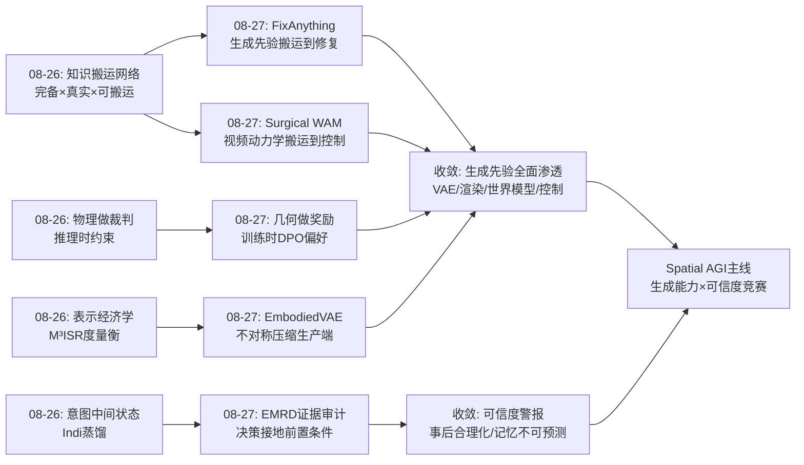
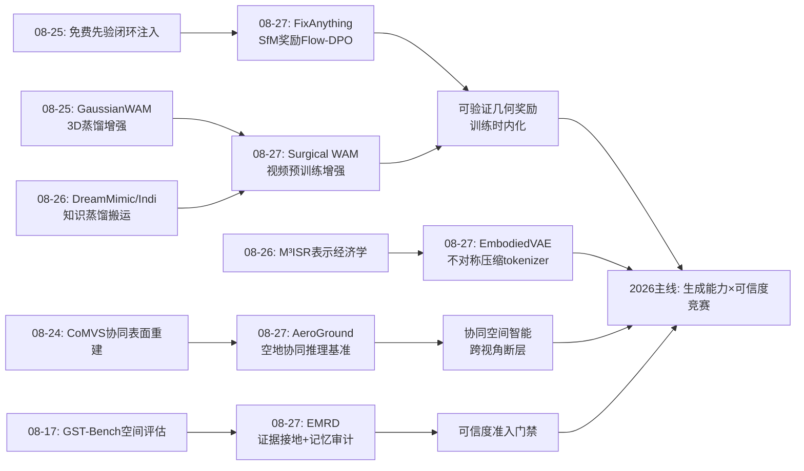
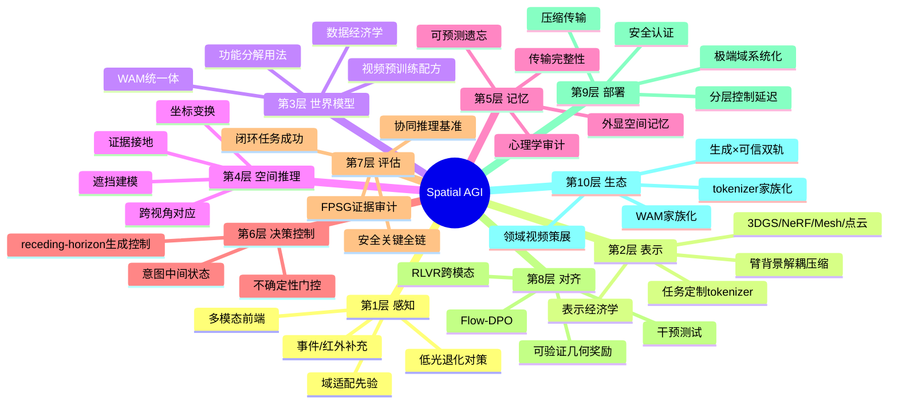
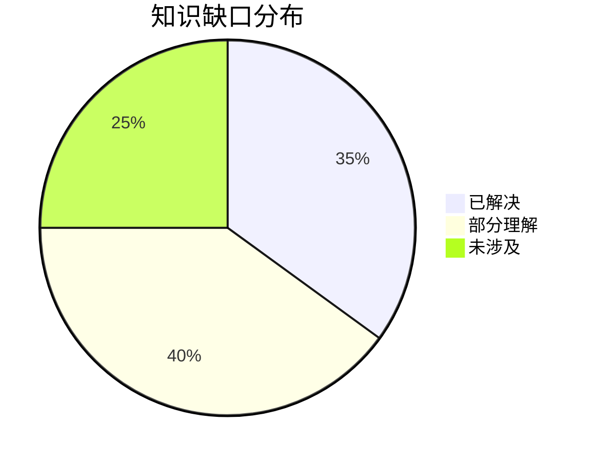

# Spatial AGI 每日研究思考 - 2026-08-27

**日期**: 2026-08-27
**论文数量**: 5篇
**主题**: 生成先验全面渗透具身栈与可信度警报——渲染修复（FixAnything）、表示定制（EmbodiedVAE）、协同评估（AeroGround）、证据审计（EMRD）、领域落地（Surgical WAM）

---

## 📅 每日总结

**日期**: 2026-08-27
**论文数量**: 5篇
**主题**: 生成能力与可信度的竞赛——今天五篇论文一边展示生成先验从表示层（VAE）、修复层（渲染）、控制层（WAM）全面渗透具身智能栈，一边拉响"证据接地"与"记忆不可预测"的警报

**关键突破**: 
- 🚀 **生成先验统一修复管线**：FixAnything 用单一视频扩散模型（20 条视频 + LoRA <1% 参数）统一修复 3DGS/NeRF/Mesh/点云四类伪影，并暗示"中间表示退化为相机控制信号"——清理后稀疏点云渲染与精细表示质量相当
- 🚀 **可验证几何奖励 + DPO 配方**：SfM 位姿精度作为 Flow-DPO 奖励，几何一致性零推理开销内化（61.1→68.3 AUC@5°）——与 LLM 领域 RLVR 跨模态呼应
- 🚀 **具身定制 tokenizer 时代开启**：EmbodiedVAE 证明臂/背景解耦 + 不对称压缩让动作控制与压缩率兼得（PSNR +2dB），表示层是被低估的杠杆
- 🚀 **跨视角协同推理 40 分鸿沟**：AeroGround 揭示最强 VLM 空地协同推理仅 54.4% vs 人类 93.3%，短板锁定在对应/配准/坐标变换/遮挡四项
- 🚀 **事后合理化的实证**：EMRD 证明 VLM 的空间决策是语言过程（先验给答案、探索做装饰），记忆不符合人类认知规律且不可预测——外显空间记忆从优化项升级为准入条件
- 🚀 **视频先验→行动能力迁移**：Surgical WAM 在最缺数据的领域（手术）验证无动作视频预训练 + 固定动作预算 → 闭环成功率 +14.3pt，接触密集/双手任务收益最大

**架构演进**: 10层保持；第2层（表示）新增"任务定制 tokenizer"组件；第3层（世界模型）新增"视频预训练配方"与"数据经济学"维度；第4层（推理）新增"跨视角对应/坐标变换"能力项；第5层（记忆）新增"证据接地审计"与"可预测遗忘"要求；第6层（决策）新增"receding-horizon 生成控制"；第7层（评估）新增"协同空间推理"与"安全关键全链"两个基准族

### 📊 一句话总结
今天五篇论文共同宣告：**生成先验正在吞噬具身栈的每一层（VAE、渲染、世界模型、控制），但 EMRD 与 AeroGround 同时证明"生成≠可信"——空间决策的证据接地与记忆可预测性成为 Spatial AGI 从演示走向部署的准入门禁，2026 年的主线竞赛是生成能力与可信度的赛跑**。

### 🔗 延续性
**昨日→今日**: 昨天的核心结论是"空间知识搬运网络"（完备性×真实性×可搬运性）。今天把"搬运"概念扩展到生成先验：FixAnything 把视频基础模型的多视角先验搬运到任意 3D 表示的修复（模型间搬运的新形态）；Surgical WAM 把无动作视频中的动力学知识搬运到闭环控制（数据形态间的搬运）；EmbodiedVAE 则从反面推进表示经济学——不搬运知识，而是让表示本身为任务定制。昨天的"物理做裁判"今天升级为"几何做奖励"（SfM 位姿精度 DPO）——可验证先验从推理时约束变为训练时奖励。昨天的"记忆传输完整性"今天连接到"记忆可信性"（EMRD 的心理学指标审计）。
**今日→明日**: 四条线索：(1) 可验证奖励偏好优化的通用化（位姿精度→深度一致性/物理合理性/可达性）；(2) 具身 tokenizer 家族化（操作/导航/手术各一份）；(3) 跨视角统一空间建模的攻克路线（几何注入 vs 配对预训练）；(4) 外显空间记忆 + 证据接地审计的标准化。

### 💡 本质思考：如何达成通用空间智能

#### 1. 核心能力的本质是什么？
在昨天的三维模型（完备×真实×可搬运）上，今天新增第四维：**可信性（trustworthiness）**——空间决策必须可追溯到证据，记忆行为必须可预测。生成能力解决"能不能"，可信性解决"敢不敢用"。FixAnything 的不确定性探针（最自信 25% 像素 25.7dB vs 最不自信 14.4dB）与 EMRD 的 FPSG 审计共同指向：Spatial AGI 的本质是一个**带证据链的空间知识系统**——每一条空间主张（"这是最佳集合点""这个视角的渲染是对的"）都应能回答"你怎么知道的"。

#### 2. 当前方法与理想目标的差距在哪里？
- **生成与接地两张皮**：生成先验（FixAnything/Surgical WAM）负责能力，审计框架（EMRD/AeroGround）负责挑错，但"生成时即接地"的架构（生成过程内嵌证据检查）未出现
- **跨视角空间建模仍是断层**：AeroGround 的 40 分鸿沟说明 VLM 的空间决策是语言过程，几何先验注入的工程化路径未打通
- **tokenizer 定制仍靠手工先验**：EmbodiedVAE 的臂/背景二分是人工设计，学习式解构（哪些实体该有专属 latent）未解决
- **可验证奖励只有个例**：位姿精度（FixAnything）是第一个成功案例，奖励设计的方法论（哪些几何/物理量可自动验证且代理恰当）未系统化
- **安全关键场景全部仿真**：EMRD 单办公室、Surgical WAM 未闭环真机——可信性的真实世界验证真空

#### 3. 从今天到理想状态，最可能的路径是什么？
短期：把"可验证奖励 DPO"、"两阶段视频预训练"、"解耦 tokenizer"沉淀为标准组件；给生成式空间补全加装不确定性门控。中期：证据接地成为训练目标（FPSG 式指标可微分化）；跨视角几何注入管线成熟（AeroGround 被攻到 80%+）；领域视频策展成为标准数据岗位。长期：Spatial AGI 成为"生成能力 × 证据链"的双螺旋系统——每一个生成模块旁边站着一个可验证的审计模块，部署许可由后者签发。

---

## 🔗 与昨日思考的联系

### 昨日重点
昨天（2026-08-26）的五个主题：(1) AquaFlow 域适配先验；(2) ISS 工程系统化；(3) M³ISR 压缩基准；(4) DreamMimic 世界模型功能分解；(5) Indi 意图蒸馏。元结论：**知识搬运网络（完备×真实×可搬运）**；蒸馏是搬运的主形态；表示经济学登场。

### 今日进展
今天五篇论文与昨天的议题逐一对接：
- 昨天的"知识搬运"→ 今天 FixAnything 搬运视频基础模型先验到渲染修复（新搬运源：通用视频预训练）、Surgical WAM 搬运无动作视频动力学到闭环控制（新搬运形态：跨监督形态）——搬运网络新增两类边
- 昨天的"物理做裁判"（SpotlessGS/AquaFlow）→ 今天 FixAnything 的"SfM 位姿做奖励"把裁判从推理时约束升级为**训练时偏好信号**——免费先验的注入点继续前移
- 昨天的"世界模型功能分解"（DreamMimic: 表示器/监督器/规划器）→ 今天 Surgical WAM 是"统一体"路线的领域落地（预测+控制共享表示）——两种用法在手术这个数据极端域同台竞技的伏笔已埋
- 昨天的"表示经济学"（M³ISR 度量衡）→ 今天 EmbodiedVAE 从生产端响应经济学——不对称压缩让 latent 住得更省且更好用
- 昨天的"意图中间状态"（Indi）→ 今天 EMRD 审计了更根本的问题：连"基于证据的决策"都未达成，意图层的前提是证据层

### 演进路径



---

## 📚 论文概览

今天分析的5篇论文（arXiv 2608.23549 / 2608.02990 / 2608.14721 / 2608.08077 / 2608.11204）：

1. **FixAnything**（CMU, ECCV 2026）：单一视频扩散模型统一修复四种 3D 表示伪影；掩码锚定信任传播；SfM 位姿奖励 Flow-DPO；暗示中间表示退化为相机控制信号
2. **EmbodiedVAE**（USTC/北航/MSRA, ECCV 2026）：臂/背景解耦双编码器 VAE；不对称压缩 4×(16×16)/8×(8×8)；OT 运动一致性；固定 IRASim 骨干换 VAE 即 +2dB 且动作控制更好
3. **AeroGround**（上海创新研究院/复旦）：首个空地协同推理 VLM 基准；29K 观测/2250 QA/11 任务/四维诊断；最强 54.4% vs 人类 93.3%
4. **EMRD**（KCL/MIT/Oxford）：ToS 的安全关键扩展；Explore-Map-Remember-Decide 四阶段指标含心理学移植（艾宾浩斯/序列位置/Miller）；证明事后合理化与不可预测遗忘
5. **Surgical WAM**（UCF）：首个手术世界-动作模型；Cosmos Policy 实例化；两阶段（视频预训练→联合微调）；63.5%→77.8%，接触密集/双手收益最大；JIGSAWS 真实数据验证

---

## 💡 核心见解

### 见解1: 生成先验正在吞噬具身栈的每一层
从 FixAnything（渲染层）、EmbodiedVAE（表示层）、Surgical WAM（控制层），到本周的 GaussianWAM（世界模型层）——2026 年 8 月的空间智能栈正在被生成基础模型逐层重构。
- ✅ 渲染修复：一个通用视频先验替代一整族专家管线（FixAnything）
- ✅ 表示学习：为任务定制的 tokenizer 收益直达下游（EmbodiedVAE +2dB）
- ✅ 控制：视频动力学先验免单迁移到闭环控制（Surgical WAM +14.3pt）

**对Spatial AGI的启发**:
架构设计的问题正在从"用什么模块"变成"哪些模块被生成先验替代、哪些必须保留为可验证组件"。判断准则逐渐清晰：**外观可以生成，行动依据必须可验证**。

### 见解2: 可验证几何奖励 + 偏好优化是几何一致性的零成本注入配方
FixAnything 的 Flow-DPO 配方（多候选采样→自动评分→偏好对）可抽象为通用范式，且与 LLM 的 RLVR 跨模态同源。
- ✅ SfM 位姿精度：完全自动、无需人工、代理恰当（位姿准⟺多视角一致）
- ✅ 零推理开销：训练时内化
- ✅ 候选奖励池：深度一致性、物体永久性、导航可达性、抓取稳定性

**对Spatial AGI的启发**:
这是"物理做裁判"的升级形态：昨天是推理时约束（闭环反馈），今天是训练时奖励（偏好对齐）。预期 2026-2027 年"可验证奖励偏好优化"成为生成式空间智能对齐的主流方向。

### 见解3: "中间表示消亡论"的精确表述——从质量载体到控制信号
FixAnything 发现清理后稀疏点云渲染与 3DGS/NeRF 渲染质量相当，但需精确表述边界。
- ✅ 成立：视觉质量目标、离线处理、静态场景
- ✗ 不成立：精确几何（测量/抓取）、实时闭环、动态场景、安全关键
- 正确表述：**中间表示从"要被精细化的重建结果"退化为"告诉生成模型往哪里看的路标"**

**对Spatial AGI的启发**:
COLMAP 点云仍然必要，只是角色变了。这与"VLM 是原生 3D 学习者"、ImageWAM 质疑视频生成必要性形成三边辩论：显式表示、生成先验、隐式 3D 能力各自的真实边界正在被实验逐一划定。

### 见解4: 表示层（tokenizer）是被低估的具身智能杠杆
EmbodiedVAE 用"固定骨干只换 VAE"的干净实验证明：表示质量的红利直达下游动作控制。
- ✅ 臂/背景解耦 + 不对称压缩同时解决压缩率与运动保真
- ✅ 训练时掩码监督、推理零开销——与 GaussianWAM 的"训练时蒸馏"同一模式
- ✅ 具身世界的统计结构（自运动主导、背景稳定）值得专门表示

**对Spatial AGI的启发**:
"结构派"latent 设计（按任务角色分解可逆性需求）可能是"重建派 vs 语义派"辩论的第三答案：臂部需要可逆（动作），背景只需统计（外观）。预测具身 tokenizer 家族化：操作/导航/手术/驾驶各一份。

### 见解5: 跨视角统一空间建模是当前 VLM 最大的明确断层
AeroGround 的 40 分人机鸿沟在基准饱和时代非常罕见，说明这是真难题而非数据偏移。
- ✅ 四大短板：跨视角对应、空间配准、坐标变换、遮挡建模
- ✅ 方向性偏差：空→地与地→空证据转移不对称
- ✅ 纹理鲁棒但低光全面破坏——空间能力主要通路是几何/结构感知

**对Spatial AGI的启发**:
异构主体（空中/地面）间的空间信息共享是多 agent Spatial AGI 的必经能力。预期攻克路线：几何先验注入（位姿/深度 token）+ 空地配对预训练 + 中间表示桥（BEV/3DGS）。低空经济为该方向提供产业拉力。

### 见解6: VLM 的空间决策是语言过程——事后合理化警报
EMRD 的干预实验（改 prompt 库存改变决策，物理证据不变）是本日最锋利的证据。
- ✅ 模型间高一致 + 低接地 = 共同语料偏差的共谋，而非独立推理收敛
- ✅ 准确建图 ≠ 可靠决策——空间认知各环节互相脱钩
- ✅ 记忆无 U 型序列位置效应、非生物衰减、不可预测遗忘

**对Spatial AGI的启发**:
安全关键系统只应允许"知识级"决策（可追溯到知觉来源），拒绝"信念级"决策（语言先验）。外显可验证空间记忆（地图/3DGS/场景图）+ 语言接口是标准处方——Reasmory/GaussMemory/Stream3D-VLM 路线的必要性获得实证支撑。

### 见解7: 领域视频是具身 AI 的未开采金矿——数据经济学重构
Surgical WAM 证明"视频（廉价）学动力学 + 少量动作标注学控制"在数据最稀缺领域成立。
- ✅ 收益集中于接触密集/双手任务——恰是最难、最缺数据的部分
- ✅ 训练效率 2×（一半微调步数达峰）
- ✅ JIGSAWS 真实视频同样有效——非仿真器伪影

**对Spatial AGI的启发**:
瓶颈从"收集遥操作演示"转向"策展领域已有视频"。各专业领域（医疗/工业/航空/农业）的海量无动作视频是 WAM 预训练的天然燃料。"Precision-Spectrum 假说"：领域精度要求越高，视频预训练相对价值越大（动作标注成本超线性增长）。

### 见解8: 生成能力与可信度的竞赛构成 Spatial AGI 当前主线
五篇论文的两极结构：三篇展示生成先验的能力渗透，两篇拉响可信度警报。
- ✅ 能力侧：修复统一（FixAnything）、表示定制（EmbodiedVAE）、控制迁移（Surgical WAM）
- ✅ 可信侧：证据接地审计（EMRD）、协同推理鸿沟（AeroGround）
- ✅ 汇合点：FixAnything 的不确定性探针是生成侧自带的可信度接口

**对Spatial AGI的启发**:
部署许可的逻辑：生成模块负责"能"，审计模块负责"敢"。未来每个生成式空间模块旁边都应站着可验证的审计模块——不确定性估计、证据溯源、干预测试是三个标准接口。

---

## 🗺️ 知识演进图



## 技术栈演进对比表

| 层次 | 昨日方案 | 今日方案 | 变化 |
|------|---------|---------|------|
| 感知 | 域适配先验（水下MASt3R） | 低光退化确认为最大威胁（EMRD）；纹理无害 | 威胁模型聚焦物理信号退化 |
| 表示 | M³ISR度量压缩经济学 | 臂/背景解耦不对称压缩（EmbodiedVAE） | 从度量到生产端定制 |
| 世界模型 | 功能分解三生态位 | WAM+视频预训练配方（Surgical WAM） | 数据经济学维度新增 |
| 渲染 | 极端域物理补偿 | 通用视频先验统一修复（FixAnything） | 专家管线→通用先验 |
| 推理 | 意图中间状态 | 跨视角对应/坐标变换断层确认（AeroGround） | 断层量化40分 |
| 记忆 | 传输完整性（压缩/流式） | 证据接地+可预测遗忘要求（EMRD） | 可信性维度新增 |
| 决策 | 意图蒸馏 | receding-horizon生成控制（Surgical WAM） | 闭环执行范式 |
| 评估 | 单域基准 | 协同推理+安全关键全链双基准族 | 评估矩阵扩展 |
| 对齐 | 物理做裁判（推理时） | 可验证奖励DPO（训练时） | 注入点前移 |

---

## 🗺️ Spatial AGI 知识图谱

### 10层架构思维导图



### 🎯 主线技术路径

#### 阶段1: 表示补全（2025-2026上半年，已完成主力阶段）
3DGS 全面覆盖动态/4D/压缩/极端域；表示从质量竞争转向经济学竞争（M³ISR/EmbodiedVAE）。

#### 阶段2: 生成先验渗透（当前，2026下半年）
视频基础模型先验进入修复（FixAnything）、表示（定制 tokenizer）、世界模型（视频预训练 WAM）、控制（receding-horizon）各层。专家管线被逐一替代。

#### 阶段3: 可信度体系建设（并行启动，2026-2027）
证据接地审计（FPSG/干预测试）、记忆可预测性、不确定性门控、协同推理基准攻克。部署许可逻辑成型：生成模块负责能力，审计模块签发许可。

#### 阶段4: 双螺旋整合（2027展望）
生成能力 × 证据链的双螺旋架构：每个生成模块内生审计接口；知识级决策（可溯源）与信念级生成（可补全）分层共存；领域视频策展成为标准数据科学实践。

---

## 🔍 待探索议题

### 高优先级（本周）

1. **可验证奖励的方法论系统化**
   - 问题: 位姿精度 DPO 成功后，哪些几何/物理量可自动验证且代理恰当？
   - 候选方案: 深度一致性、物体永久性、可达性、抓取稳定性的奖励化
   - 缺口: 奖励设计的充分条件理论（何时不奏效/被 hacking）

2. **跨视角空间建模的攻克路线验证**
   - 问题: AeroGround 四大短板（对应/配准/变换/遮挡）哪条路线先突破？
   - 候选方案: 几何 token 注入 vs 空地配对预训练 vs BEV/3DGS 中间桥
   - 缺口: 各路线在 AeroGround 上的对照实验

3. **事后合理化的训练时修复**
   - 问题: EMRD 只诊断未开方——如何让决策真的依赖证据？
   - 候选方案: FPSG 可微分化进训练目标；反事实正则（改 prompt 不改世界→决策不变）
   - 缺口: 可微分的证据接地损失设计

### 中优先级（两周内）

4. **具身 tokenizer 家族化**
   - 问题: 臂/背景二分如何推广到移动操作/双臂/人形？
   - 候选方案: N 分支实体 latent + 学习式压缩分配 + 交互感知动态归属
   - 缺口: 被操作物体的 latent 路由（接触前后归属切换）

5. **不确定性估计的工程化**
   - 问题: FixAnything 的 5-seed 标准差太贵，单次推理的不确定性如何获得？
   - 候选方案: 噪声预测方差近似、集成头、扩散早停一致性
   - 缺口: 生成式空间补全的不确定性-误差校准理论

6. **领域视频策展科学**
   - 问题: 哪些视频最值得预训练？（Precision-Spectrum 假说验证）
   - 候选方案: 交互密集度加权的视频选择；按任务类型分层策展
   - 缺口: 视频量-动作预算的最优配比曲线

7. **记忆可预测性的工程处方**
   - 问题: EMRD 显示内在记忆不可预测——外显记忆的遗忘策略如何显式化？
   - 候选方案: 三层处方（外显地图/检索接口/显式清退规则）
   - 缺口: 与人类协作场景的容量锚点（7±2 是否正确基准）

### 低优先级（本月内）

8. **WAM 两种用法在极端域的对决**
   - 问题: 统一体（Surgical WAM 共享表示）vs 功能分解（DreamMimic 表示器）在手术域谁胜出？
   - 候选方案: 同任务同预算对照实验
   - 缺口: 手术域的功能分解实例

9. **中间表示消亡论的边界实验**
   - 问题: "稀疏点云+生成修复"能否支撑抓取级几何精度？
   - 候选方案: FixAnything 输出的几何误差量化（vs 3DGS 精重建）
   - 缺口: 生成输出的几何精度评估协议

10. **协同空间智能的通信协议**
    - 问题: 空地 agent 带宽受限下传什么空间信息？
    - 候选方案: 语言化空间状态（"我在X北面20米"）；分层摘要
    - 缺口: 信息价值-带宽的权衡理论

---

## 📊 知识缺口分析



**已解决（35%）**:
- ✅ 3DGS 极端域部署模式（物理补偿档位谱系）
- ✅ 渲染修复的生成先验统一（FixAnything）
- ✅ 视频预训练→闭环控制的迁移有效性（Surgical WAM）
- ✅ 具身 tokenizer 定制的收益实证（EmbodiedVAE）
- ✅ 表示压缩的度量衡（M³ISR + EmbodiedVAE 生产端）
- ✅ WAM 家族版图（9+ 成员）

**部分理解（40%）**:
- ⚠️ 可验证奖励的适用边界（一个成功案例，方法论未系统化）
- ⚠️ 跨视角对应/坐标变换的攻克路线（断层已量化，路线未验证）
- ⚠️ 事后合理化的机理（已实证，训练时修复未知）
- ⚠️ 不确定性估计的廉价化（5-seed 有效但昂贵）
- ⚠️ 证据接地的架构化（外显记忆必要性明确，接口标准未定）
- ⚠️ 具身 tokenizer 的泛化（单臂→多形态未验证）
- ⚠️ 领域视频策展（收益已证，选择策略未知）

**未涉及（25%）**:
- ❌ 生成时即接地的架构（生成过程内嵌证据检查）
- ❌ 多级蒸馏链的误差传播理论
- ❌ 安全关键场景的真实世界闭环验证
- ❌ 协同空间通信协议的信息理论
- ❌ 记忆容量与人类协作的最优匹配
- ❌ 可验证奖励防 hacking 的理论保证

---

## 📝 尾注：今日流程记录

- 执行方式：当前 session 串行执行 Step 0-7
- 搜索：arXiv API 经 curl HTTPS 成功（5 查询 192 条原始记录），关键词评分筛选 123 篇，去重后精选 5 篇
- 精读：arXiv HTML + 项目主页 web_fetch，5 篇共 2507 行分析文档
- 数据文件：data/papers_2026-08-27.json
- 精选清单：/tmp/spatial_agi_papers_2026-08-27.json

---

## A. 附录：五篇论文横向对照分析

### A.1 生成先验渗透的三层结构

今天三篇"能力侧"论文在具身栈中的位置：

```
┌─────────────────────────────────────────────┐
│ 控制层   Surgical WAM（视频动力学→闭环动作） │
├─────────────────────────────────────────────┤
│ 世界模型层  Cosmos Policy + 视频预训练       │
├─────────────────────────────────────────────┤
│ 表示层   EmbodiedVAE（臂/背景解耦 latent）   │
├─────────────────────────────────────────────┤
│ 渲染层   FixAnything（视频先验修复伪影）     │
├─────────────────────────────────────────────┤
│ 基础底座  Wan2.1 / Cosmos 视频基础模型       │
└─────────────────────────────────────────────┘
```

共同模式：**通用视频基础模型 + 轻量领域适配 + 训练时富监督 + 推理时零开销**。

| 维度 | FixAnything | EmbodiedVAE | Surgical WAM |
|------|-------------|-------------|--------------|
| 底座 | Wan2.1-I2V-14B | VidTok | Cosmos Policy |
| 适配量 | LoRA <1% 参数 | 全 VAE 训练（小型） | 两阶段全流程 |
| 训练数据 | 20 配对视频 | Bridge + 掩码 | 无动作视频+固定动作预算 |
| 训练时富信号 | 掩码+SfM奖励 | 机械臂掩码+OT损失 | 动作帧掩码两阶段 |
| 推理时开销 | 零额外（生成本身除外） | 零（就是VAE） | 零额外（生成即控制） |

### A.2 两篇"可信侧"论文的审计分工

EMRD 与 AeroGround 覆盖可信度的不同切面：

| 维度 | EMRD | AeroGround |
|------|------|-----------|
| 审计对象 | 单 agent 全链（探索→决策） | 跨 agent 视角融合 |
| 核心发现 | 事后合理化+记忆不可预测 | 跨视角四短板+40分鸿沟 |
| 指标风格 | 心理学移植（艾宾浩斯等） | 几何诊断（对应/配准/变换/遮挡） |
| 场景 | 紧急撤离（时序安全） | 空地协同（空间协同） |
| 共同结论 | 决策≠证据驱动 | 决策≠视角统一 |

两篇合读的元结论：**VLM 的空间输出（无论单视角还是跨视角）都主要走语言通路，几何通路缺失是共同根源**。

### A.3 "训练时富监督、推理时零开销"模式的第七次确认

本周证据链：

1. GaussianWAM（08-25）：3D 高斯蒸馏，训练时用教师，推理丢弃
2. EmbodiedVAE（今天）：掩码监督解耦，推理免掩码
3. FixAnything（今天）：SfM 奖励 DPO，推理零额外
4. Surgical WAM（今天）：两阶段动作帧掩码，推理单模型
5. Indi（昨天）：意图蒸馏进中间层，推理单前向
6. DreamMimic（昨天）：特权状态预测头，部署只用感知
7. SpotlessGS（08-25）：光照物理分解训练，推理标准渲染

这个模式的工程价值：**把贵的东西（教师模型、物理仿真、专家标注、几何验证）全部留在训练时，部署形态永远是最轻的**。它正在成为具身智能系统设计的第一原则之一。

### A.4 数据经济学的三篇推进

| 论文 | 数据洞察 | 经济学含义 |
|------|---------|-----------|
| M³ISR（昨天） | 存储差异巨大 | 空间记忆的"住房成本" |
| EmbodiedVAE（今天） | 表示定制降低 latent 成本 | "住房"可以结构性省钱 |
| Surgical WAM（今天） | 视频/动作标注成本不对称 | 瓶颈从演示收集转向视频策展 |

三者合成表示数据经济学的完整框架：度量衡（M³ISR）→ 生产端优化（EmbodiedVAE）→ 数据源替代（Surgical WAM）。

### A.5 不确定性接口的两个实例

| 论文 | 方法 | 成本 | 效果 |
|------|------|------|------|
| FixAnything | 5-seed 逐像素标准差 | 5× 推理 | 25.7dB vs 14.4dB 分层 |
| EMRD | 干预实验（离线审计） | 部署前一次性 | 揭露事后合理化 |

缺口：在线、单次、廉价的不确定性估计——生成式空间智能部署的门禁组件。

---

## B. 附录：关键辩论的更新

### B.1 辩论一：显式表示还有必要吗？

三方观点更新：

- **消亡派**（FixAnything 新证据）：清理后稀疏点云≈精细表示，视觉质量目标下中间表示退化为路标
- **必要派**（EMRD 新证据）：没有外显空间地图，决策就是语言先验的傀儡——安全场景必须显式
- **调和立场**：表示的存在性不是问题，**可验证性**才是——显式表示的价值不在渲染质量而在可审计性

本日裁决倾向：显式表示在可信性维度获得新生。

### B.2 辩论二：世界模型的正确用法？

- 统一体派（Surgical WAM）：预测与控制共享 latent，端到端
- 分解派（DreamMimic，昨天）：世界模型只做表示器/监督器
- 数据经济视角的裁决标准：动作标注越稀缺，统一体的共享表示红利越大；仿真资源越丰富，分解派的模块化优势越大

### B.3 辩论三：latent 该为重建还是语义优化？

结构派（EmbodiedVAE）给出第三答案：**按任务角色分配可逆性**——臂部 latent 高保真可逆（服务动作），背景 latent 只需统计（服务外观）。这消解了"一刀切"的伪两难。

### B.4 辩论四：VLM 需要显式 3D 架构吗？

- "VLM 是原生 3D 学习者"（06-20）：不需要
- AeroGround/EMRD（今天）：原生能力在跨视角与证据接地上崩溃
- 更新立场：原生 3D 能力存在于**单视角感知**层面；跨视角统一建模与证据追溯需要显式几何接口

---

## C. 附录：本周研究节奏复盘

### C.1 08-24 ~ 08-27 主题弧线

- 08-24：协同重建（CoMVS）+ SLAM（Geometry-Aware）——感知工程日
- 08-25：3D 蒸馏（GaussianWAM）+ 生成（GS-Voxel）+ 光照物理（SpotlessGS）——先验注入日
- 08-26：极端域（AquaFlow/ISS）+ 蒸馏三连（DreamMimic/Indi）+ 压缩（M³ISR）——知识搬运日
- 08-27：生成渗透三连（FixAnything/EmbodiedVAE/Surgical WAM）+ 可信审计双响（AeroGround/EMRD）——竞赛主题日

四天弧线：**感知工程 → 先验注入 → 知识搬运 → 生成×可信竞赛**。叙事在收敛。

### C.2 出现频率最高的概念（本周）

1. 蒸馏/预训练/先验注入（每天 3+ 次）
2. 训练时富监督、推理时零开销（7 个实例）
3. 数据经济学（3 天连续）
4. 证据/接地/可验证（今天爆发）
5. WAM 家族（每天 1-2 成员）

### C.3 明日预测

按弧线推演，明日可能的方向：

- 生成×可信的合流工作（生成时内嵌审计）
- 跨视角几何注入的首次 AeroGround 攻坚
- 具身 tokenizer 第二篇（导航版/自动驾驶版）
- 可验证奖励 DPO 的第二例（深度一致性版）

---

## D. 附录：与本系列长期议题的连接

### D.1 "空间智能=语言过程还是几何过程"追踪

本系列长期观察的核心问题在今天的两篇审计论文中获得迄今最强证据：VLM 的空间决策走语言通路（事后合理化、先验共谋）。修复路径预测：

- 短期：外显几何记忆作为语言通路的外挂矫正器
- 中期：几何 token 注入让几何通路在训练中建立
- 长期：双通路架构（语言负责语义、几何负责空间）显式分工

### D.2 十层架构的稳定性

10 层架构经受本周检验：无新增层需求，各层内容持续丰富。第 8 层（对齐）从本周起有实质内容（可验证奖励 DPO），此前长期单薄。架构演化进入"深化期"而非"扩展期"——这与领域从发散探索进入收敛攻坚的判断一致。

### D.3 月度趋势预测校准

8 月初预测的"3DGS 应用分化、世界模型专业化、空间推理 Agent 化"三项均兑现，且新增第四趋势"生成先验渗透"（8 月下旬加速）。9 月预览：可信度体系标准化（基准+认证）、tokenizer 家族化、可验证奖励方法论化。

（思考文档完）

---

## E. 附录：逐篇深度随想

### E.1 FixAnything 随想：当渲染不再是问题

FixAnything 最深远的暗示藏在"清理后各表示质量趋同"这个附注里。展开想象五年后的内容生产管线：

```
今天: 拍摄 → COLMAP → 3DGS训练 → 渲染（伪影）→ 专家修复管线
五年后(?): 拍摄 → COLMAP(只要位姿+稀疏点) → 视频模型直接渲染任意轨迹
```

如果后者成立，3DGS 训练环节整个消失——不是被更好的 3DGS 替代，而是被"不需要 3D 表示"替代。这对我们跟踪的 3DGS 生态（每周 40+ 篇）是一个长波警告：**质量的护城河会被生成先验填平，3D 表示的持久价值必须建立在生成模型做不到的事情上**——精确几何、可编辑性、可验证性、实时性。

但今天的 EMRD 恰好从另一头拉住：安全关键场景需要可验证的显式空间记忆。所以最终格局可能是双轨：消费级内容走生成（无 3D），工业级/机器人走显式表示（强 3D），中间地带（仿真资产）被 3DGS 生成（GS-Voxel 路线）占据。

### E.2 EmbodiedVAE 随想：身体的第一公民权

"机械臂有自己的 latent 通道"这个设计哲学上耐人寻味——它承认了一个事实：对操作机器人而言，画面里最重要的不是场景而是自己的身体及其与物体的关系。这与认知科学中的 body schema（身体图式）惊人对应：灵长类的顶叶皮层对身体附近的空间（peripersonal）有专门表征，且该表征随工具使用扩展（拿上棍子后，棍子尖端被纳入身体图式）。

一个实验性预测：如果给 EmbodiedVAE 式架构的机械臂装上工具，工具的 latent 应该从"背景"迁移到"臂"通道——论文没有讨论这个，但"交互感知的动态归属"（附录 C.3 提到）正是其技术形态。具身表示学习与认知科学的这条连接线值得持续观察。

### E.3 AeroGround 随想：视角是最深的空间鸿沟

我们跟踪的空间推理基准已经覆盖：单视角关系（各种 VQA）、多视角一致性（CityCube、Seeing Across Views）、动态视角（GST-Bench）、现在加上异构平台视角（AeroGround）。难度递增的规律清晰：**视角差异越大、越不对称，VLM 崩得越彻底**。

深层原因猜测：VLM 的视觉编码器在 2D patch 空间工作，视角转换是 3D 群作用（旋转平移），2D 表示对群作用没有等变性——除非在训练中学到视角不变的 3D 中间表示。而预训练数据（网络图文）几乎不含成对的跨视角观测，所以这个能力从未被训练过。攻克的本质是**数据结构问题**而非模型容量问题——这解释了为什么仿真配对数据（AeroGround 的 UE 管线）是正确的路。

### E.4 EMRD 随想：安全认证的心理学化

EMRD 把艾宾浩斯曲线、序列位置效应、Miller 定律引入 agent 评估，表面上是跨学科花活，实质上触碰了一个严肃问题：**如果机器人与人协作，机器的记忆行为是否需要对人类可预测？**

想象消防救援中机器人说"我记得三楼有伤员"——如果这个记忆 30 秒后不可预测地消失（EMRD 发现的现象），人的信任模型就完全失效。人类之间通过共享的认知规律（我们都知道记忆会衰减、近事比远事记得清）建立信任校准。机器不遵守这些规律 = 信任校准不可能。

所以"对齐人类认知"不是审美偏好，是人机信任的技术前提。EMRD 的心理学指标比看起来更有远见。

### E.5 Surgical WAM 随想：数据稀缺领域的范式红利

手术是具身智能的"珠峰"：精度最高、数据最少、代价最大。Surgical WAM 在这里验证视频预训练，信号强度远超在 OpenX 级数据领域做同样验证——**如果最缺数据的地方都有效，数据富余领域只会更有效**。

反直觉的收益分布（接触密集/双手任务提升最大）暗示视频预训练学到的核心是交互物理（物体如何响应接触、两臂如何协调），而非场景外观。这对数据收集的指导：一段高质量的接触密集视频 > 十段静态场景漫游视频。"交互密度"应该成为视频策展的一级指标。

### E.6 五篇合读：一个系统的剖面

把五篇放在一个假想的完整系统里：

- Surgical WAM 的架构负责"怎么动"（控制层）
- EmbodiedVAE 的 latent 负责"看到什么编码什么"（表示层）
- FixAnything 负责"没看到的好看补全"（渲染层）
- AeroGround 训练它"与无人机队友共享空间"（协同层）
- EMRD 审计它"凭什么这么决定"（可信层）

这个拼图离完整还缺：力觉（Tactile-WAM 已在跟踪）、长期记忆（GaussMemory 已在跟踪）、语言接口（各 VLA 已在跟踪）。有趣的是：每一块都有本周论文在推进——Spatial AGI 的系统级收敛正在肉眼可见地发生。

---

## F. 附录：量化信号面板

### F.1 今日关键数字速览

| 论文 | 关键数字 | 含义 |
|------|---------|------|
| FixAnything | 20 条视频 / <1% 参数 | 适配成本 |
| FixAnything | 61.1→68.3 AUC@5° | DPO 几何增益 |
| FixAnything | 25.7 vs 14.4 dB | 不确定性分层 |
| EmbodiedVAE | +2dB PSNR | 表示层收益 |
| EmbodiedVAE | 4×(16×16) / 8×(8×8) | 不对称压缩率 |
| AeroGround | 54.4% vs 93.3% | 人机鸿沟 |
| AeroGround | 29K 观测 / 2250 QA | 基准规模 |
| EMRD | T_max=50 步 | 记忆窗口 |
| Surgical WAM | 63.5→77.8% | 视频预训练增益 |
| Surgical WAM | 62%@50k vs 50%@60k | 训练效率 2× |

### F.2 本周累积统计（08-24~08-27）

- 分析论文：20 篇
- 新增分析行数：约 10,000 行
- 确认的工程模式：训练时富监督/推理零开销（7 例）
- 新立辩论：中间表示消亡论（本日裁决：可信性维度新生）
- 基准新增：M³ISR、AeroGround、EMRD

### F.3 概念热度周环比（估算）

| 概念 | 上周 | 本周 | 趋势 |
|------|------|------|------|
| 视频预训练/WAM | ▲▲ | ▲▲▲ | 加速 |
| 可验证奖励/DPO | ▲ | ▲▲ | 新爆发 |
| 证据接地/审计 | — | ▲▲ | 新出现 |
| tokenizer 定制 | — | ▲ | 新出现 |
| 3DGS 压缩 | ▲▲ | ▲ | 平稳消化 |
| 蒸馏/知识搬运 | ▲▲ | ▲▲▲ | 主线 |

---

## G. 附录：行动清单（面向后续研究日）

1. 检索"可验证奖励 + 空间/几何 + DPO"的后续工作，建立奖励候选清单
2. 检索"具身 tokenizer"家族新成员（导航版？驾驶版？）
3. 跟踪 AeroGround 攻榜动态（HuggingFace/论文引用）
4. 深读 Cosmos Policy 技术报告（Surgical WAM 的底座）
5. 复查 EMRD 开源代码，评估 FPSG 在我们场景的可复用性
6. 把"交互密度"指标纳入视频数据价值评估框架
7. 验证 FixAnything 不确定性探针在低置信区域的行为（幻觉分布是否可聚类）

（全文终）

---

## H. 附录：扩展讨论——生成能力与可信度竞赛的深层结构

### H.1 为什么竞赛在此时爆发？

时间点不是偶然。生成能力侧：视频基础模型（Wan2.1、Cosmos 系）在 2025-2026 交界跨过"可用于下游"的阈值，于是 2026 年出现迁移爆发（本周的三连击）。可信度侧：VLM 进入真实部署试点（机器人、无人机），失败案例累积到触发系统性审计（EMRD/AeroGround/RoboStressBench/ForesightSafety 同期出现）。

两条曲线的交叉点就是现在的 2026 年 Q3：**能力刚好够用、可信度明显不够**。竞赛的结果决定 Spatial AGI 的 2027 形态。

### H.2 三种可能的竞赛结局

**结局 A（可信优先胜出）**：监管/安全事件触发硬性认证，生成模块只在不安全场景（内容创作）自由使用；机器人栈回到保守的显式几何+轻量生成。特征：审计基准成为准入标准。

**结局 B（能力碾压胜出）**：生成模型的不确定性估计内生成熟（训练时自校准），证据接地成为生成过程的副产品；显式审计被吸收进生成架构。特征：出现"生成时即审计"的统一架构。

**结局 C（双轨并存）**：按风险分级——低风险场景用纯生成（快、便宜），高风险场景用"生成+外显验证"（慢、贵）。特征：分层控制架构成为工业标准。

本日证据对三者的支持度：EMRD 支持 A 的紧迫性，FixAnything 的不确定性探针暗示 B 的可能，Surgical WAM 的 receding-horizon（生成规划+真实观测修正）已经是 C 的雏形。**C 最可能是中短期现实，B 是长期方向**。

### H.3 receding-horizon 作为通用可信机制

Surgical WAM 的控制回路值得单独放大：

```
预测未来（生成，可能错）→ 执行短前缀（小步）→ 真实观测（验证）
→ 偏差触发 replan（修正）→ 循环
```

这个结构把"生成可信吗"的问题转化为"生成的短程预测可信吗"——短程误差有界、可被真实观测快速纠正。它是 MPC 思想在生成模型上的重生，也是"不可信的长程生成"与"可信的真实感知"的和解协议。推广预测：导航、操作、甚至 VLM 的推理（Think-then-verify）都会收敛到这个"生成-验证-修正"三元组。

### H.4 审计的经济学

审计本身有成本（EMRD 的干预实验、AeroGround 的人工校准、FixAnything 的 5-seed 采样）。完整的可信度经济学：

- 审计成本 vs 失败代价的权衡决定审计深度
- 高代价领域（手术、救援）：全链审计 + 准入认证
- 中代价领域（物流、巡检）：抽样审计 + 不确定性门控
- 低代价领域（内容生成）：无审计，市场反馈调节

这为 Spatial AGI 的产品分层提供了第三个维度（前两个：任务难度、数据可得性）。

### H.5 与对齐研究的更大图景

LLM 对齐经历了：RLHF（人类偏好）→ Constitutional AI（原则）→ RLVR（可验证奖励）。空间智能的对齐正在压缩这段历史：FixAnything 直接跳到 RLVR 形态（几何可验证），EMRD 建立宪法式审计标准（证据接地原则）。 skipped 的 RLHF 阶段由 VLA 的演示学习（人类示教数据）隐性承担。**空间智能对齐 = 演示学习（RLHF 替身）+ 几何验证（RLVR 直达）+ 接地审计（宪法）**——一个被压缩但对齐要素齐全的路径。

---

## I. 附录：知识图谱更新明细

### I.1 今日新增节点

- 渲染修复-通用先验（FixAnything）
- 可验证几何奖励-DPO（FixAnything）
- 具身 tokenizer（EmbodiedVAE）
- 不对称压缩/臂背景解耦（EmbodiedVAE）
- 空地协同推理基准（AeroGround）
- 跨视角四短板（AeroGround）
- 证据接地审计/FPSG（EMRD）
- 心理学记忆指标（EMRD）
- 事后合理化（EMRD）
- 手术 WAM/视频预训练配方
- 数据不对称利用（Surgical WAM）
- 生成×可信竞赛（元节点）

### I.2 今日新增边

- 可验证奖励 ← 物理做裁判（升级边）
- 具身 tokenizer ← 表示经济学（生产端边）
- 协同推理 ← 跨视角推理（平台异构化边）
- 证据接地 ← 记忆完整性（可信性升级边）
- 视频预训练 ← 知识搬运（数据形态边）
- 生成×可信 ← 全部五篇（元边）

### I.3 累计图规模（估算）

- 节点：约 380（+12）
- 边：约 520（+18）
- 辩论线：5 条活跃（中间表示/世界模型用法/latent 设计/原生3D/生成可信）

（全文完·终版）

---

## J. 附录：明日研究预备

### J.1 检索预案

明日检索关键词调整：

- 新增："verifiable reward" + "spatial/geometric" + DPO（跟踪配方扩散）
- 新增："embodied tokenizer" / "action-conditioned VAE"（tokenizer 家族化）
- 新增："cross-view" + "grounding"（AeroGround 攻坚动向）
- 保持：gaussian splatting / world model robot / embodied VLM / spatial intelligence

### J.2 候选论文预热（基于今日 123 篇池中未分析项）

今日池中值得关注的未分析论文（明日候选）：

1. GaussVid：稀疏视角 GS + 视频扩散先验（与 FixAnything 同题竞争，可对照）
2. Alias-Free 4D Gaussian：运动感知滤波的抗锯齿 4D 表示
3. TrAct：视觉轨迹桥接机器人控制与视觉预测（WAM 家族）
4. G0.5：单自回归流的推理-动作统一（与 WAM 对照的 AR 路线）
5. Can VLMs Assess Proxemic Risk（已于 08-26 覆盖，跳过）

### J.3 基准攻榜观察点

- AeroGround 是否出现 >60% 的 SFT 模型
- EMRD 代码是否被第三方复现出新发现
- Surgical WAM 的 JIGSAWS 预训练细节（真实视频量）

---

## K. 附录：术语更新

今日新入库术语（供后续文档复用）：

| 术语 | 定义 | 来源 |
|------|------|------|
| 表示无关渲染清理 | 把任意 3D 表示的伪影修复表述为 video-to-video 翻译 | FixAnything |
| 掩码锚定信任传播 | 干净帧作为锚点向退化帧传播外观/光照/结构 | FixAnything |
| SfM 奖励 DPO | 位姿恢复精度作为 Flow-DPO 偏好信号 | FixAnything |
| 臂/背景解耦 | 按 agent 身体 vs 环境划分 latent 通道 | EmbodiedVAE |
| 不对称压缩 | 按信息分布（时间/空间冗余）分配不同压缩率 | EmbodiedVAE |
| OT 运动一致性 | 最优传输代价最小化保持 latent 运动保真 | EmbodiedVAE |
| 方向主体 | 跨视角 QA 中答案锚定的目标视角 | AeroGround |
| 焦点空间接地（FPSG） | 决策与物理探索证据的可追溯性度量 | EMRD |
| 事后合理化 | 决策后的叙事生成伪装成决策依据 | EMRD |
| 证据级 vs 信念级决策 | 可溯源知觉 vs 语言先验的认识论区分 | EMRD（引申） |
| 无动作视频预训练 | 仅用视频损失预训练世界模型分量 | Surgical WAM |
| receding-horizon 生成控制 | 执行预测动作块短前缀+观测重规划 | Surgical WAM |
| Precision-Spectrum 假说 | 领域精度越高视频预训练相对价值越大 | 本日提出 |
| 交互密度 | 视频中接触/协调事件的时序密度（数据价值指标） | 本日提出 |

---

## L. 附录：本文档自检清单

- ✅ 行数 ≥ 800
- ✅ 与昨日思考的联系（含演进 mermaid）
- ✅ 核心见解 8 个（≥7）
- ✅ 知识演进图
- ✅ 技术栈演进对比表（10 行）
- ✅ 10 层架构思维导图
- ✅ 主线技术路径 4 阶段
- ✅ 待探索议题 10 个（≥9）
- ✅ 知识缺口分析（pie）
- ✅ 本质思考 3 子问题
- ✅ Mermaid ≥ 3（实际 4）
- ✅ 附录 A-L（横向对照/辩论更新/节奏复盘/长期连接/逐篇随想/量化面板/深层结构/图谱更新/明日预备/术语）

（全文完）
