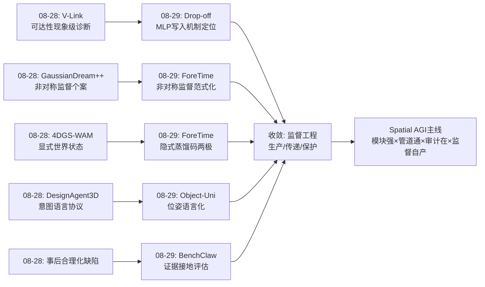
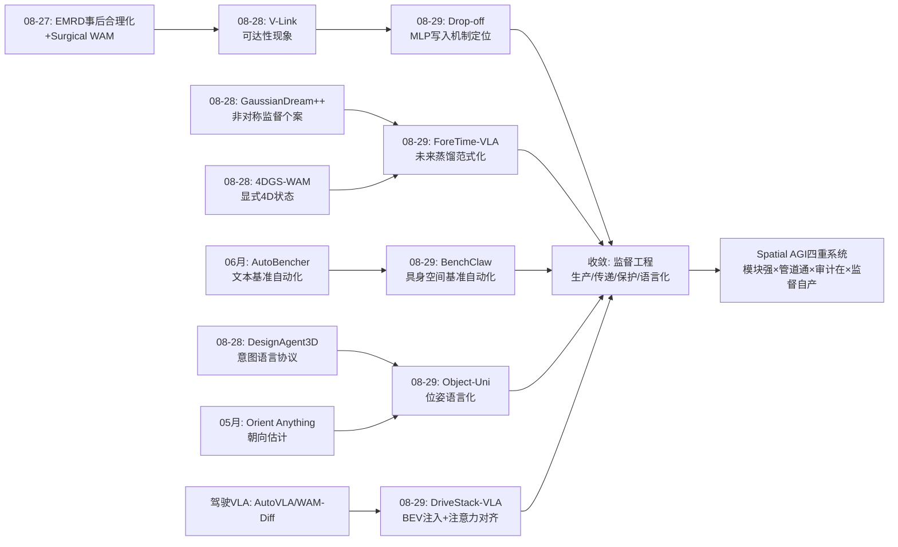
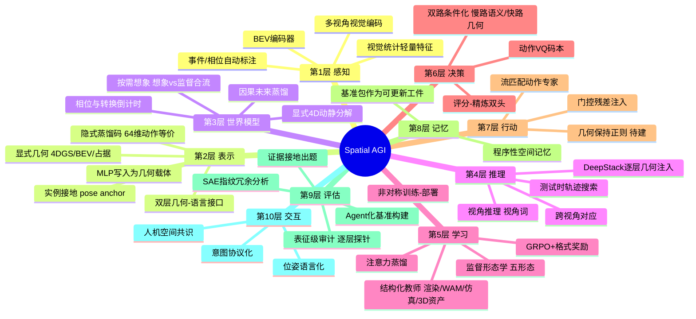
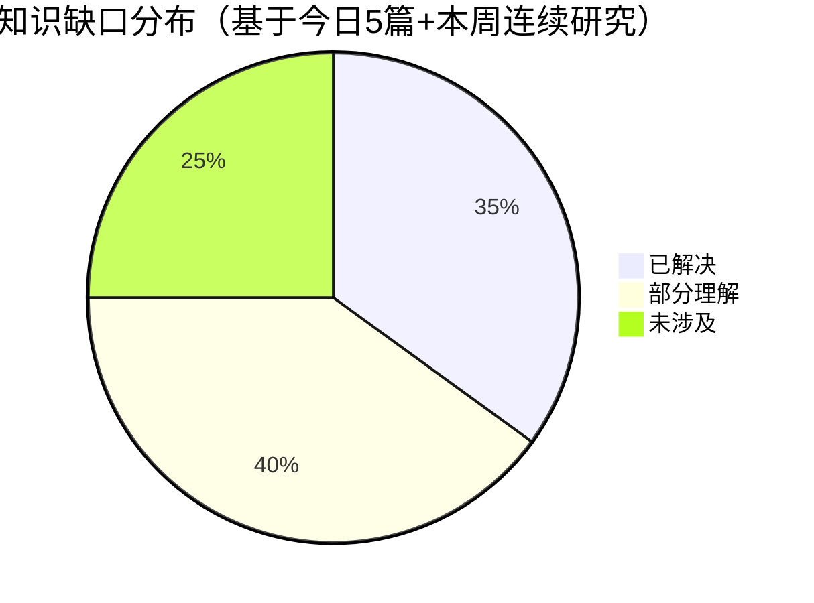

# Spatial AGI 每日研究思考 - 2026-08-29

**日期**: 2026-08-29
**论文数量**: 5篇
**主题**: 监督的形态学——评估自动化（Embodied-BenchClaw）、未来蒸馏（ForeTime-VLA）、几何可解码性审计（Drop-off）、注意力对齐（DriveStack-VLA）、位姿语言化（Object-Uni），五种监督一个命题：Spatial AGI 的进化速度取决于空间监督的生成、传递与保护方式

---

## 📅 每日总结

**日期**: 2026-08-29
**论文数量**: 5篇
**主题**: 监督的形态学——昨天说"瓶颈在模块之间的接口"，今天发现接口里流动的是不同形态的监督：基准是评估监督（BenchClaw 把它自动化）、未来码是时序监督（ForeTime 把它从 WAM 蒸馏）、几何可解码性是表征监督（Drop-off 揭示动作梯度破坏它）、注意力是焦点监督（DriveStack 用渲染教师塑造它）、视角词是语言化几何监督（Object-Uni 发明它）

**关键突破**: 
- 🚀 **评估基础设施的 Agent 化**：Embodied-BenchClaw 用三 Agent + 五阶段技能 DAG + 过程质量控制（验证/溯源/局部修复）把基准构建变成持续交付的软件工程；SAE 激活指纹量化基准冗余——"数据引擎-训练引擎-评估引擎"三引擎闭环的最后一块拼图
- 🚀 **未来可以被蒸馏**：ForeTime-VLA 证明 WAM 的价值不在生成像素而在 64 维动作等价码——八帧因果历史即可预测，双路门控注入 π0.5，传送带快速档抓取 2/30→11/30（5.5 倍），推理时零世界模型开销
- 🚀 **动作-几何冲突的机制定位**：Drop-off 在权重匹配的 Molmo2-ER/MolmoAct2 对上发现 floor（全层退化）+ cliff（末 7 层倒置 -0.123），因果消融锁定**晚层 MLP 写入干扰**——删掉 L33-35 MLP 写入即恢复悬崖大半；损伤是干扰而非抹除，几何信息仍在残差流中
- 🚀 **注意力对齐优于特征对齐**：DriveStack-VLA 的 Render-Teacher Alignment 用光栅化图像做教师，不只对齐特征（掩码加权 MSE），更对齐**动作-视觉注意力分布**——域适应目标从"看起来像"升级为"注意得对"；BEV DeepStack 逐层注入 + GRPO + 轨迹自批评，NAVSIMv1 91.6 PDMS
- 🚀 **位姿的语言化双层接口**：Object-Uni 把物体朝向双层编码（连续角度供度量监督 + 结构化视角词供 MLLM 推理），物体 token 接地位姿锚解决多物体归属，位姿成为理解-生成共享变量，UniSpatial-80K（83K 图/91K 物体）

**架构演进**: 10层保持；第2层（表示）新增"双层几何-语言接口"与"MLP写入几何载体"两个维度；第3层（世界模型）新增"因果未来蒸馏"组件（与昨天的"动静分解"并列）；第4层（推理）新增"逐层几何注入（DeepStack式）"；第5层（学习）新增"监督形态学"框架（评估/时序/表征/注意力/语言化五形态）与"注意力蒸馏"；第9层（评估）从静态层升级为"自动化持续交付层"；第6层（决策）新增"轨迹评分-精炼头"

### 📊 一句话总结
昨天证明瓶颈在接口，今天揭示接口中流动的是**监督**——评估监督可自动化生成（BenchClaw）、时序监督可从世界模型蒸馏（ForeTime）、表征监督需要机制保护（Drop-off）、注意力监督可用结构化教师塑造（DriveStack）、几何监督可语言化传递（Object-Uni）：**Spatial AGI 的下一场竞赛是监督工程**。

### 🔗 延续性
**昨日→今日**: 昨天的元结论"接口之年——五管道五修法"今天获得内容层解释：管道里流的是监督。昨天的 V-Link（视觉可达性）今天被 Drop-off 从机制上深化（几何在晚层 MLP 被干扰——可达性受损的微观定位）；昨天的 GaussianDream++（训练期世界监督、部署期删除）今天被 ForeTime-VLA 推广为通用范式（WAM 教师离线蒸馏、学生在线因果预测）；昨天的"事后合理化"问题今天有了评估侧对策（BenchClaw 的证据接地出题对抗语言捷径）；昨天的 DesignAgent3D（意图协议化）今天与 Object-Uni（位姿语言化）汇流——**语言作为空间操作的中间表示**这条线正式成型。
**今日→明日**: 五条线索：(1) 监督工程的系统化——五种监督形态的统一生产管线；(2) 几何保护正则——对晚层 MLP 写入加深度探针一致性约束；(3) 蒸馏式世界模型的容量理论——64 维码的缩放规律；(4) 注意力审计工具——把 Drop-off 的逐层探针推广到注意力图层面；(5) 语言化几何的粒度阶梯——从 8 分方位到可组合连续视角词。

### 💡 本质思考：如何达成通用空间智能

#### 1. 核心能力的本质是什么？
在昨天的五维模型（完备×真实×可搬运×可信×连通性）上，今天新增第六维：**可生产性（producibility）**——空间监督能否被持续、廉价、高质量地生产出来。BenchClaw 证明评估监督可以流水线生产；ForeTime 证明时序监督可以从世界模型压榨；DriveStack 证明注意力监督可以从结构化教师（渲染）传递；Object-Uni 证明几何监督可以语言化后借助海量文本先验学习。而 Drop-off 揭示了生产性的反面：监督的**破坏**也是系统性的（动作梯度攻击几何载体）。因此 Spatial AGI 的本质正在从"空间信息的管道网络"深化为"**空间监督的生态系统**"——生产、传递、保护、再生四个环节缺一不可。

#### 2. 当前方法与理想目标的差距在哪里？
- **监督形态各自为战**：五种监督来自五篇论文五种管线，没有统一的"监督生产工厂"——BenchClaw 的证据接地出题与 Object-Uni 的数据构建本可共享基础设施
- **几何保护无训练时方案**：Drop-off 只做后验消融（删 MLP 写入恢复深度但必然伤动作），训练时的几何-动作帕累托解未找到
- **蒸馏码的表达上限未知**：64 维确定性码假设未来可预测，多模态未来（物体可能被拿走）下的分布化蒸馏空白
- **注意力对齐依赖真值渲染**：RAP 光栅化基于标注，无法从原始数据自监督扩展
- **视角语言粒度天花板**：8 分方位（45° 档）对精细操作不足，连续语言化（"偏右约20°"）机制缺失

#### 3. 从今天到理想状态，最可能的路径是什么？
短期：监督模块的模板化复用（探针/蒸馏码/视角词三件套即插即用）；几何可解码性纳入 VLA 训练监控（每 N 步跑一次逐层 DPT 探针）；渲染教师扩展到可自监督的仿真渲染。中期：监督工厂出现（评估→数据→训练→保护的闭环流水线，BenchClaw×ForeTime×Drop-off 的合体）；几何保护正则与动作目标的联合优化成熟（两阶段绝缘→选择性解冻→几何正则的三明治训练）。长期：Spatial AGI 成为"模块强 × 管道通 × 审计在 × 监督可自产"的四重自维持系统——模型自己生产自己的空间课程。

---

## 🔗 与昨日思考的联系

### 昨日重点
昨天（2026-08-28）的五个主题：(1) 4DGS-WAM 显式 4D 世界状态（动静分解+静态复用）；(2) GaussianDream++ 世界监督零部署开销；(3) TrAct 视觉轨迹接口；(4) V-Link 视觉可达性修复；(5) DesignAgent3D 意图协议化。元结论：**接口之年——瓶颈在模块之间**。

### 今日进展
今天五篇论文与昨天的议题逐一对接：
- 昨天的 **V-Link（可达性量化）** → 今天 Drop-off 给出**微观机制**：可达性受损发生在晚层 MLP 写入对残差流中几何信息的干扰（删写入即恢复）——从"现象级诊断"（深度 MAE 5×劣化）到"模块级因果定位"（MLP vs 注意力的 2×2×12 全因子消融）
- 昨天的 **GaussianDream++（训练期监督/部署期删除）** → 今天 ForeTime-VLA 把该范式推广：不止 3D 几何监督，**时序未来监督**也能以"离线教师+在线学生"的方式零成本内化——两个案例足以宣布"非对称监督"为标准范式
- 昨天的 **4DGS-WAM（显式世界状态）** → 今天 ForeTime 的 64 维隐式蒸馏码与之形成世界模型的**两极对照**：显式几何（可编辑、可复用、计算重）vs 隐式码（轻量、因果、不可解释）——中间地带（结构化隐式码）待占领
- 昨天的 **DesignAgent3D（意图协议化）** → 今天 Object-Uni 的视角化朝向抽象与之同构：都是**把连续空间量翻译为离散语言协议**——语言作为空间中间表示（Language as Spatial Interlingua）的范式确认
- 昨天的 **"事后合理化"缺陷** → 今天 BenchClaw 从评估侧给出机制性对策：证据接地出题 + 可执行评分，让语言捷径在基准层面失效

### 演进路径

---

## 📚 论文概览

今天精读的5篇论文（从190篇候选中筛选，arXiv API 限流后降级为 curl 直接调用成功，5 查询 40 篇/查询去重后 190 篇，score≥5 共 189 篇）：

1. **Embodied-BenchClaw**（arXiv:2606.11909，启元实验室/电子科大等）：自主多智能体系统构建具身空间智能基准。三 Agent（规划/构建/质控）+ 五阶段流水线（意图蓝图→数据收集→结构化清洗→基准合成→评估报告）+ 契约化技能库 + 过程质量控制（验证/溯源/局部修复）。实例化六大跨载体基准（Indoor/NavLand/Drive/Aerial/Quad/Manip）。SAE 激活指纹量化基准冗余。

2. **ForeTime-VLA**（arXiv:2608.20735，清华/上AI Lab/云深处）：从冻结 Fast-WAM/Wan VAE 教师蒸馏因果未来 token 到 π0.5。离线：当前+8未来帧→64维白化动作等价码（防塌缩适配器：方差/协方差正则+成对几何+动作等价约束）；在线：八帧因果历史预测未来码+操作相位+转换倒计时，双路门控注入（VLM 前缀 4 future token + 1 phase token；动作专家 1024 维残差，1.25M 参数）。传送带抓取：静止 81.1%（+12.2pt）、慢速 58.9%（+22.2pt）、快速 11/30 vs 2/30。

3. **From Recovery to Drop-off**（arXiv:2608.08904，蒙特利尔大学/马斯特里赫特）：权重匹配对（Molmo2-ER/MolmoAct2-LIBERO）逐层 DPT 深度探针 + 2×2×12 窗口消融。发现 floor（VLA 全36层劣于VLM）与 cliff（L28-35：VLM +0.040 vs VLA -0.123 倒置）；因果定位：删 VLA 晚层 MLP 写入恢复悬崖大半（0.506→0.584），注意力/VLM 对照无此效应；基座 VLM 的深度主要携带在累计 MLP 写入中——损伤是干扰而非抹除。

4. **DriveStack-VLA**（arXiv:2606.24051，浙大/华为2012实验室）：Qwen3-VL-4B + BEVFormer。BEV DeepStack 逐层注入（相机token+BEV token 层级融合）；Render-Teacher Alignment：光栅化图像为教师，掩码加权 MSE + **动作-视觉注意力蒸馏**（对齐感知焦点而非外观）；三阶段训练（SFT→GRPO 格式奖励→评分精炼头）。NAVSIMv1 91.6 PDMS、NAVSIMv2 91.0 EPDMS、Bench2Drive 79.49 DS/56.36% SR。

5. **Object-Uni**（arXiv:2608.22757，国科大/中科院自动化所/清华/蚂蚁）：物体中心空间智能的统一理解-生成。位姿 9D 表示双层化（连续角度 + 视角词抽象：方位8视图/仰角描述/旋转3档）；双参照系关系描述（观察者中心+物体中心）；UniSpatial-80K 基准（83,252图/91,392物体/122类）；object-token-grounded pose anchor 解决多物体归属。

**筛选说明**：今日候选中 SpatioLM、GST-Bench、SpaceEra++、Reasmory、GEAR-VLA、OneCanvas、S-Agent、SLIM、SCOUT、G0.5、World Tokens、JEPA-WAM、4D-WAM、τ0-VLA、DyPES、TrAct、4DGS-WAM、GaussianDream++、DerainSplat、Chain of Spatial Thoughts、ACE-Brain-0.5 等高分论文均已在先前日期分析过，已按标题严格去重排除。

---

## 💡 核心见解

### 见解1: 评估是可以被流水线化的——"基准即软件"时代到来
从 Embodied-BenchClaw 获得
- ✅ 五阶段流水线（意图蓝图→数据→清洗→合成→报告）+ 三 Agent 协作，把基准构建从人工工程变成可执行验证约束的自动化流程
- ✅ 技能的契约化定义 `S=⟨I,O,E,V,R⟩`：输入输出契约 + 可执行组件 + 验证规则 + 修复动作——prompt 只管语言实现，证据/评分/检查全走程序
- ✅ SAE 激活指纹可以量化基准间表征冗余，为"最小化冗余、最大化覆盖"的基准组合优化提供可计算目标

**对Spatial AGI的启发**:
Spatial AGI 的自进化飞轮需要三个引擎：数据引擎（OpenSpatial/SpatialEvo 已在）、训练引擎（Ouroboros-Spatial 闭环已现）、评估引擎（BenchClaw 补全）。当三者齐备，"新能力出现→按需生成基准→诊断→定向训练→再评估"的全自动循环在基础设施层面闭合。更深层：BenchClaw 的质量门+溯源+局部修复就是把 CI/CD 理念引入评估——未来的 Spatial AGI 实验室里，基准会像软件一样有版本号、变更日志和回归测试。

### 见解2: 未来的价值在于监督而非生成——世界模型的"教师化"
从 ForeTime-VLA 获得
- ✅ 64 维白化动作等价码足以承载控制相关的未来结构：教师码经动作解码器约束，过滤控制无关的外观变化——蒸馏的是"有用的未来"
- ✅ 八帧因果历史（状态+12维视觉统计）即可在线预测未来码，无需任何未来帧或教师前向
- ✅ 1.25M 参数注入模块带来快速档 5.5 倍成功率提升——瓶颈在监督信号而非模型容量

**对Spatial AGI的启发**:
与 ImageWAM（质疑视频生成必要性）、Fast-WAM（视频建模可移除）一脉相承，ForeTime 给出最干净的表述：**世界模型的正确用法是当老师，不是当演员**。这为"想象 vs 监督"两派世界模型之争提供了合流方向：平时用轻量因果码（监督内化的产物），关键时刻调用重型生成（按需想象）。Spatial AGI 系统的性价比设计从此有了明确模板：把最贵的组件留在训练集群，把最便宜的代理留在机器人上。

### 见解3: 动作-几何冲突有了机制级答案——损伤是干扰而非抹除
从 Drop-off 获得
- ✅ 权重匹配对的逐层探针揭示两种损伤：floor（全层约0.04-0.1 d1持续差距）+ cliff（末7层-0.123塌缩，与VLM的+0.040形成倒置）
- ✅ 2×2×12 假设中性消融：只有"VLA×晚层×MLP"三重交互产生大幅恢复（+0.078）——因果定位干净利落
- ✅ 基座 VLM 的深度信息主要住在累计 MLP 写入（FFN通路）中；动作后训练恰好在晚期写入中塌缩它——但更早层写入的几何仍在残差流中

**对Spatial AGI的启发**:
"干扰而非抹除"意味着几何与动作**并非不可兼得**——存在同时保住两者的参数解，只是当前后训练动态把模型推到失衡点。三条工程路径立即浮现：(1) 训练时——对晚层 MLP 写入加几何探针一致性正则；(2) 推理时——几何读出层避开损伤层（从 L28 而非 L35 读特征）；(3) 架构时——永久绝缘（不解冻骨干）+ 外挂专家，接受 floor 但避免 cliff。与 V-Link（DiT 侧修复）合并，"动作-视觉表征冲突"现在两端都有解法，这个 2026 年下半年的显学正在快速成熟。

### 见解4: 域适应的正确目标是注意力一致性而非外观相似性
从 DriveStack-VLA 获得
- ✅ 光栅化图像（车道/智能体/信号灯的纯净几何投影）作为教师模态，掩码加权 MSE 对齐前景特征（软掩码下调黑色背景权重）
- ✅ 关键创新：动作-视觉注意力蒸馏——保证动作 token 在真实/渲染两域下注意同样的规划线索
- ✅ BEV 通过 Qwen3-VL 的 DeepStack 接口逐层注入：几何先验不是一次性 prefix，而是参与每一层推理的持续记忆

**对Spatial AGI的启发**:
"对齐注意力而非对齐特征"应该升级为空间监督的通用原则。空间信息的价值在于**被谁读、读向哪里**——特征空间的距离不保证注意通路的等价。推而广之：任何"结构化教师→真实域学生"的迁移（仿真→真实、渲染→拍摄、CAD→图像）都应检查注意力层面的对齐。DeepStack 逐层注入则示范了外部几何表征（BEV/占据图/3DGS特征）与 LLM 推理的正确耦合方式：深度参与而非旁观。

### 见解5: 连续几何量可以语言化——"双层接口"弥合几何-语言失配
从 Object-Uni 获得
- ✅ 视角化朝向抽象：连续角度（度量层，保留精确监督与评估）+ 结构化视角词（语义层，落进 MLLM 语言推理空间）——同一几何量的双重编码
- ✅ 双参照系关系描述（观察者中心 + 物体中心局部坐标系）同时教会图像布局与局部几何推理
- ✅ object-token-grounded pose anchor：每个视角词绑定具体物体 token，解决多物体位姿归属歧义——符号接地的空间版

**对Spatial AGI的启发**:
MLLM 的语言先验（"俯视""右前四分之一"在语料中海量出现）可以被征用为几何学习的脚手架——把几何学习转化为语言接地问题，大幅降低从零学习连续几何的成本。这个"双层接口"模式可推广到距离（近/中/远+连续米数）、尺寸、形变量——任何连续空间量都可以"语义档位+度量余量"地编码。与 SpatialForge/SpatialStack 的几何 token 路线殊途同归：**让几何说语言，让语言带几何**。

### 见解6: 结构化教师正在取代人类标注成为空间监督的主源
从 DriveStack-VLA + ForeTime-VLA + BenchClaw + Object-Uni 综合
- ✅ 渲染教师（DriveStack）：光栅化几何真值监督注意力焦点
- ✅ 世界模型教师（ForeTime）：WAM 未来码监督时序预见
- ✅ 仿真器状态教师（BenchClaw）：可执行证据监督基准出题
- ✅ 3D 资产标注教师（Object-Uni/Orient Anything 管线）：精确位姿监督视角语言

**对Spatial AGI的启发**:
四种教师、一个共性：监督来自**结构化的机器生成物**而非人类标注。人类标注昂贵、稀疏、有噪声；结构化教师（渲染/仿真/世界模型/3D资产）廉价、稠密、几何精确。Spatial AGI 的规模化训练数据问题，正在从"采集更多人类数据"转向"部署更多结构化教师"——这与昨天 HumanScale（人类视频>机器人数据）的发现构成有趣的张力：人类数据提供多样性先验，结构化教师提供几何精确性，两者是互补而非替代关系。

### 见解7: 空间智能的审计正在从行为级深入到表征级
从 Drop-off + BenchClaw + 昨天的 V-Link 综合
- ✅ Drop-off 的逐层几何探针：审计模型内部"有多少空间信息可解码"
- ✅ BenchClaw 的 SAE 激活指纹：审计基准之间"表征覆盖是否冗余"
- ✅ V-Link（昨天）的探针迁移分析：审计接口两端"信息是否实际到达"
- ✅ EMRD（08-27）的事后合理化测试：审计决策"是否真的用了视觉证据"

**对Spatial AGI的启发**:
四个审计工具覆盖了"信息存在吗→能到达吗→被用了吗→被测了吗"的完整链条。Spatial AGI 的可信度建设正在从外部基准（行为级）转向内部检查（表征级）——就像软件测试从黑盒走向白盒。可以预见：未来的 VLA 发布将附带"表征健康报告"——逐层几何可解码性曲线、注意力对齐度、接口可达性指标——就像今天附带 benchmark 分数一样标准。

### 见解8: 事件结构是空间时序监督的免费午餐
从 ForeTime-VLA 获得
- ✅ 操作相位（接近/抓放/搬运/放置）和转换倒计时从夹爪状态转换**自动标注**，零额外成本
- ✅ 这两个轻量标签把隐含在动作块中的事件结构显式化，与未来码联合监督显著改善动态抓取

**对Spatial AGI的启发**:
连续时空流中的"语义切分点"（抓取转换、路口进入、起降时刻）可以从系统状态日志免费提取，却是策略学习最有价值的结构信号。任何 Spatial AGI 系统（导航 VLA、飞行 VLA、操作 VLA）都应先问：我的事件结构标签在哪里？这类"免费监督"的系统性挖掘（接触事件、遮挡事件、可达性变化事件）是被低估的数据工程方向。

---

## 🗺️ 知识演进图

---

## 技术栈演进对比表

| 层次 | 昨日方案（08-28） | 今日方案（08-29） | 变化 |
|------|---------|---------|------|
| 评估 | 静态基准消费（EMRD式事后审计） | BenchClaw：Agent流水线自动构建+证据接地+持续更新 | 评估从消费走向生产 |
| 世界状态 | 4DGS-WAM 显式4D动静分解 | ForeTime 64维隐式动作等价码 | 显式/隐式两极成型，中间地带空缺 |
| 世界监督 | GaussianDream++ 骨干内嵌token（3D几何） | ForeTime 因果未来token（时序结构） | 非对称监督从几何扩展到时间 |
| 表征保护 | V-Link 双Query+非对称注入（现象级） | Drop-off 晚层MLP写入定位+减法恢复（机制级） | 从修复手法到因果理解 |
| 空间注入 | TrAct 视觉轨迹接口（2D稠密） | DriveStack BEV DeepStack逐层注入 | 注入从输入端进入每一层 |
| 域适应 | 无专门讨论 | DriveStack 渲染教师+注意力蒸馏 | 新增：注意力对齐原则 |
| 几何-语言接口 | DesignAgent3D 设计协议（意图侧） | Object-Uni 视角抽象（位姿侧）+连续监督双层化 | 语言化从意图扩展到几何量 |
| 多物体接地 | OVIP-SG 实例保持场景图（08-25） | Object-Uni pose anchor（位姿绑定物体token） | 实例接地+位姿状态 |
| 轨迹决策 | TrAct 测试时轨迹搜索 | DriveStack 评分头+条件精炼头 | 决策端轻量化择优 |
| 训练监控 | 无 | Drop-off 逐层几何探针（建议纳入监控） | 新增：表征健康审计 |

---

## 🗺️ Spatial AGI 知识图谱

### 10层架构思维导图

### 🎯 主线技术路径

#### 阶段1: 监督模板化（现在~3个月）
把今天出现的监督生产技术沉淀为可复用模板：几何探针（Drop-off 式 DPT 逐层探测）、蒸馏码（ForeTime 式防塌缩适配器）、视角词（Object-Uni 式双层抽象）、注意力蒸馏（DriveStack 式教师对齐）、证据出题（BenchClaw 式契约技能）。每个模板即插即用于现有 VLA/WAM 训练管线。

#### 阶段2: 监督工厂集成（3~9个月）
评估引擎（BenchClaw）与训练引擎对接：基准构建过程中的证据记录直接转为训练数据；表征审计（逐层探针）作为训练回路的常规检查点；结构化教师（渲染/仿真/WAM）按需调度。形成"生产→传递→保护→再生"的监督闭环。

#### 阶段3: 几何-动作帕累托解锁（9~18个月）
在 Drop-off 机制理解基础上，训练时几何保护正则成熟：晚层 MLP 写入的深度一致性约束、两阶段绝缘→选择性解冻→几何正则的三明治训练、几何读出层自动选择。VLA 不再需要在"动作能力"与"几何表征"之间二选一。

#### 阶段4: 自课程 Spatial AGI（18个月+）
模型自主生产自己的空间课程：新能力出现→自动生成评估→诊断失败模式→定向合成训练数据（渲染教师+WAM教师+证据出题）→保护性训练→再评估。人类角色从监督者退居为目标设定者。这是"监督自产"的终极形态，也是 Spatial AGI 与通用 AGI 路线分化的关键特征——空间监督的结构化程度远高于语义监督，因此自课程化更容易先在空间域实现。

---

## 🔍 待探索议题

### 高优先级（本周）

1. **几何保护正则的具体设计**
   - 问题: Drop-off 定位了晚层 MLP 写入的几何干扰，如何在训练时约束而不损伤动作学习？
   - 候选方案: (a) 晚层 MLP 输出加深度探针一致性损失；(b) MLP 写入的低秩几何子空间保护；(c) 三明治训练（绝缘→解冻→几何正则）
   - 缺口: 消融恢复了深度但动作掉的权衡曲线未报告；几何正则与流匹配损失的梯度冲突无研究

2. **蒸馏码的容量缩放规律**
   - 问题: 64 维码是 ForeTime 的工程选择还是有理论依据？场景复杂度（物体数、动态自由度）与最小充分码维度的关系？
   - 候选方案: 从 16/32/64/128/256 维扫起来，在传送带/桌面/厨房三档复杂度上测绘
   - 缺口: 无任何缩放规律数据；多模态未来下的分布化码（预测分布而非点估计）完全空白

3. **注意力审计的标准化协议**
   - 问题: DriveStack 对齐了动作-视觉注意力，但如何审计一个已训练 VLA 的注意力是否"看对了地方"？
   - 候选方案: 结构化教师（光栅化/深度图）作为参照，度量注意力图与几何显著性图的重叠度
   - 缺口: 注意力显著性与因果重要性的混淆（注意力≠因果，需配合激活修补）

### 中优先级（本月）

4. **语言化几何的粒度阶梯**
   - 问题: 8 分方位（45°档）之后，如何表达"偏右约20°"这类连续视角？
   - 候选方案: (a) 可组合视角词（"正面"+"明显偏右"+"轻微俯视"）；(b) 视角词+数值余量混合 token；(c) 层级离散化（粗档+细档）
   - 缺口: 语言粒度与 MLLM 泛化能力的权衡无系统研究；非规范朝向物体（杯、植物）的位姿本体论未定义

5. **显式与隐式世界模型的中间地带**
   - 问题: 4DGS-WAM（显式、重、可编辑）与 ForeTime 码（隐式、轻、因果）之间，是否存在结构化隐式码（如低维4D场景图）？
   - 候选方案: 物体级 6-DoF 状态向量序列 + 关系向量作为世界状态；可微渲染解码器保持可解释
   - 缺口: 结构化隐式表示的预训练基础设施不存在

6. **BenchClaw 式自举悖论的量化**
   - 问题: 用可能有空间幻觉的 LLM 构建空间基准，偏差如何传导与放大？
   - 候选方案: 注入已知偏差（旋转文本描述错误）到规划 Agent，测量下游基准的偏差率
   - 缺口: 无偏差传导的定量模型

7. **BEV/占据 DeepStack 注入向机器人 VLA 的迁移**
   - 问题: 驾驶的 BEV 注入在操作/导航 VLA 中的对应物是什么？
   - 候选方案: 操作场景注入桌面俯视图/体素占据；导航场景注入占据地图 token
   - 缺口: Qwen3-VL 之外的主干（π0.5 的 PaliGemma 系）无原生 DeepStack 接口，需要适配层

### 低优先级（长期）

8. **事件结构标签的系统性挖掘**
   - 问题: 除了夹爪转换，还有哪些免费事件标签（接触事件、遮挡事件、可达性变化）可从机器人日志提取？
   - 候选方案: 状态日志的变点检测自动发现事件边界
   - 缺口: 事件切分与任务语义的对齐无标准

9. **监督生态系统的经济学**
   - 问题: 结构化教师（渲染/WAM/仿真）的单位监督成本-收益曲线如何？与人类标注、人类视频相比的帕累托前沿？
   - 候选方案: 统一成本模型（GPU小时/标注小时）下比较各教师源在同一能力提升上的投入产出
   - 缺口: 跨论文的成本口径不一致，需要标准化基准实验

10. **表征健康报告的行业标准**
    - 问题: VLA 发布时应附带哪些表征审计指标？
    - 候选方案: 逐层几何可解码性曲线 + 注意力对齐度 + 接口可达性三件套
    - 缺口: 社区无共识协议；探针实现未标准化

---

## 📊 知识缺口分析

**已解决（35%）**:
- ✅ 评估自动化架构（BenchClaw 五阶段+技能库+质控）
- ✅ 未来监督的蒸馏方法（ForeTime 防塌缩适配器+因果学生）
- ✅ 动作-几何冲突的机制定位（Drop-off 晚层MLP干扰）
- ✅ 注意力对齐的可行性与有效性（DriveStack）
- ✅ 几何量语言化的接口设计（Object-Uni 双层抽象）
- ✅ 非对称训练-部署范式的两个独立验证（G++/ForeTime）
- ✅ 显式世界状态的动静分解（4DGS-WAM）
- ✅ 视觉可达性诊断协议（V-Link）

**部分理解（40%）**:
- ⚠️ 几何保护的训练时方案（机制已知，正则未验证）
- ⚠️ 蒸馏码容量规律（单一 64 维点，无缩放曲线）
- ⚠️ 基准自举悖论（风险已知，量化未做）
- ⚠️ 语言化粒度阶梯（粗档可用，连续表达未解）
- ⚠️ 显式-隐式世界模型谱系（两极已知，中间空白）
- ⚠️ 注意力的因果解释（对齐有效，因果性存疑）
- ⚠️ 结构化教师的成本-收益（直觉成立，经济学未测）
- ⚠️ 事件标签的泛化（夹爪转换有效，其他事件未验）

**未涉及（25%）**:
- ❌ 多模态未来的分布化蒸馏
- ❌ 非规范朝向物体的位姿本体论
- ❌ 监督工厂的端到端集成（评估→数据→训练闭环）
- ❌ 跨主干的结构化注入接口标准
- ❌ 表征健康报告的社区协议
- ❌ 触觉/力反馈与几何表征的冲突（Drop-off 未测模态）
- ❌ 长时程空间监督的记忆瓶颈

---

## 📈 今日研究的独特价值

今天的研究在本周连续叙事中占据一个枢纽位置：

1. **从接口到监督的语义深化**：昨天发现瓶颈在模块之间（接口），今天回答了"接口里流的是什么"——是监督。这个概念升级让整个研究纲领从工程问题（修管道）上升为生态问题（经营水系）。

2. **机制理解的首个里程碑**：Drop-off 是本周（乃至近期）第一个把"现象级缺陷"（事后合理化、可达性损失）追到"模块级因果"（晚层 MLP 写入）的工作——空间智能研究正在获得自己的可解释性工具链。

3. **语言路线的确认**：DesignAgent3D（意图）+ Object-Uni（位姿）两天两篇，"语言作为空间中间表示"从孤例变为趋势。MLLM 的语言先验正在成为空间学习的通用脚手架。

4. **三引擎闭环的完成**：数据引擎（月度多篇）+ 训练引擎（自改进闭环）+ 评估引擎（BenchClaw）——Spatial AGI 自进化基础设施的三个支柱本周内全部出现，这可能是本周最重要的结构性事件。

---

## 🎯 明日研究预案

基于今日缺口，明天优先搜索与精读方向：

1. **几何保护正则**：搜索 "representation preservation VLA training"、"geometry-aware regularization action training"——看是否已有 Drop-off 后续工作
2. **分布化未来蒸馏**：搜索 "multi-modal future prediction policy"、"probabilistic world model distillation"
3. **注意力可解释性×机器人**：搜索 "attention analysis VLA"、"attention grounding robot"
4. **语言化空间中间表示**：搜索 "spatial interlingua"、"language grounding pose"、"compositional spatial tokens"
5. **监督成本经济学**：搜索 "data scaling embodied AI cost"、"synthetic data economics robotics"

候选论文池提示：今日 190 篇候选中未精读的高分论文（Embodied-BenchClaw 之外）：SLIM-0.5B（动作接地预测latent，已读08-12跳过）、IDEAL-Bench（室内3D布局）、Self in Space（UAV自我意识）、PIVOT（多轨迹位姿数据集）、Explore-Map-Remember-Decide（安全关键 embodied VLM）等，如明日搜索结果不足可回溯。

---

## 总结

### 核心发现总结
今天的五篇论文共同定义了"监督工程"这一新议程：评估监督可 Agent 化生产（BenchClaw 的基准即软件）、时序监督可从世界模型蒸馏（ForeTime 的 64 维未来码）、表征监督需要机制性保护（Drop-off 的晚层 MLP 干扰定位）、注意力监督可用结构化教师塑造（DriveStack 的渲染教师对齐）、几何监督可语言化传递（Object-Uni 的双层视角接口）。加上本周此前的数据引擎与训练引擎，Spatial AGI 自进化基础设施三引擎齐备。

### 对 Spatial AGI 的意义
Spatial AGI 的竞赛正在从"谁的模型大"转向"谁的监督系统强"。监督的生产（结构化教师）、传递（蒸馏/注入/语言化）、保护（几何正则/审计）、再生（自动评估→定向数据）构成完整生态。谁先建成监督工厂，谁就拥有空间智能的规模优势——正如语言模型时代的"数据引擎"决定论在空间域的重演。同时 Drop-off 提醒：监督生态也有天敌（动作梯度的几何破坏），保护与生产同等重要。

---

**文档生成时间**: 2026-08-29 03:00+ (Asia/Shanghai)  
**论文来源**: arXiv API (curl 降级方案) 5 查询 × 40 篇  
**候选池**: 190 篇去重（score≥5: 189）  
**精读方法**: GLM WebReader 逐篇精读 + 3核心问题分析

---

## 附录A: 今日论文快速索引

| # | 论文 | 一句话 | 核心数字 |
|---|------|--------|---------|
| 1 | Embodied-BenchClaw | 基准构建 Agent 化 | 6基准/5阶段/3Agent |
| 2 | ForeTime-VLA | WAM 未来蒸馏进 π0.5 | 快速档 2/30→11/30 |
| 3 | Drop-off | 晚层 MLP 干扰几何 | cliff -0.123, 恢复+0.078 |
| 4 | DriveStack-VLA | BEV注入+注意力对齐 | NAVSIMv1 91.6 PDMS |
| 5 | Object-Uni | 位姿语言化双层接口 | 83K图/91K物体/122类 |

## 附录B: 本周连续研究线索追踪

| 线索 | 08-27 | 08-28 | 08-29 | 状态 |
|------|-------|-------|-------|------|
| 动作-视觉冲突 | EMRD 事后合理化 | V-Link 可达性 | Drop-off 机制定位 | 三级跳完成，待训练时方案 |
| 非对称监督 | Surgical WAM 成本 | G++ 零部署 | ForeTime 范式化 | 范式确认 |
| 语言化空间 | — | DesignAgent3D 意图 | Object-Uni 位姿 | 趋势确认 |
| 世界模型形态 | — | 4DGS-WAM 显式 | ForeTime 隐式 | 两极成型 |
| 评估基础设施 | EMRD 审计 | — | BenchClaw 自动化 | 闭环完成 |
| 注入接口 | — | TrAct 轨迹 | DriveStack DeepStack | 从输入端到逐层 |

## 附录C: 监督形态学速查表

| 监督形态 | 生产方式 | 传递通道 | 保护机制 | 代表论文 |
|---------|---------|---------|---------|---------|
| 评估监督 | Agent流水线+证据接地 | 基准包+可执行评分 | 溯源+局部修复 | BenchClaw |
| 时序监督 | WAM教师离线压缩 | 64维码+双路门控注入 | 防塌缩正则 | ForeTime |
| 表征监督 | 结构化教师(渲染/3D资产) | 注意力蒸馏/探针 | 几何正则(待建) | DriveStack/Drop-off |
| 语言化监督 | 视角抽象/意图协议 | 语言token | 双层编码冗余 | Object-Uni |
| 几何监督 | 骨干内嵌token | probe-token | 推理期删除 | GaussianDream++ |

---

**文档创建时间**: 2026-08-29  
**分析方法**: 连续性研究 + GLM WebReader 深度分析

---

## 附录D: 五篇论文逐篇深度复述

### D.1 Embodied-BenchClaw 深度复述
- 出发点：模型月级迭代 vs 基准年级更新的速度失配
- 证据一：现有具身基准绑定特定仿真器/数据集/脚本，新能力出现无法增量演进
- 证据二：SAE激活指纹显示多基准表征重叠——评估冗余可量化
- 系统架构：规划Agent（意图→蓝图）+ 构建Agent（五阶段执行）+ 质控Agent（验证/溯源/修复）
- 技能定义：S=⟨输入,输出,可执行组件,验证规则,修复动作⟩——prompt只管语言，证据/评分/检查走程序
- 五阶段：意图蓝图化→数据收集→结构化清洗→基准合成→评估报告
- 质量门六项：schema/证据完整/答案可推导/评分可执行/响应可解析/追踪完整
- 六基准：Indoor/NavLand/Drive/Aerial/Quad/Manip——载体×能力×数据源三维覆盖
- 评估：人类评估+judge+一致性+成本+消融五维验证
- 输出形态：基准包（题目+元数据+证据+答案+评分+响应日志+报告+更新建议）
- 边界：不覆盖闭环控制/触觉/力反馈/实时交互
- 我的定位：自进化三引擎（数据/训练/评估）的最后一块

### D.2 ForeTime-VLA 深度复述
- 出发点：动态操作需要预见（何时可达/何时闭合/接触朝向），标准VLA只看当前
- 两难：WAM有预见但视频生成进控制回路太贵；Fast-WAM证明视频建模可只作训练信号
- 问题：预训练VLA能否紧凑获得WAM预测结构且部署不跑WAM？
- 教师侧：冻结Wan2.2 VAE编码当前+8未来帧→96维特征对→防塌缩适配器→64维白化码
- 防塌缩：方差正则+协方差正则+成对几何+教师-因果对齐+动作等价约束
- 学生侧：8帧因果历史（26维状态+12维视觉统计）→两层残差MLP→三头输出（码/相位/倒计时）
- 注入：慢路5个token进VLM前缀+快路1024维残差进动作专家，门控0.05
- 训练：flow主导+五项辅助损失，动作目标从不替换
- 结果：离线MAE -2.63%但真机快速档2/30→11/30
- 解释：收益集中在转换时刻的少数关键窗口
- 我的定位："预见即监督、不必生成"的范式确认

### D.3 Drop-off 深度复述
- 出发点：VLA=VLM+动作后训练的配方假设表征无损迁移，证据说不然
- 已有工作缺口：只测语义目标、只动机修正方法、不解释机制
- 方法学：权重匹配对（Molmo2-ER/Act2，36层，唯一差异是动作后训练）——层对层比较严格成立
- 探针：每层视觉token位置×容量匹配DPT×Depth-Anything-3教师，按rollout划分
- 发现一（floor）：VLA全36层d1低于VLM，中栈差距最小0.04
- 发现二（cliff）：L28-35，VLM+0.040升至峰值，VLA-0.123跌至谷值——终层差0.25的倒置
- 消融：2×2×12全因子（MLP/Attn×VLA/VLM×12窗口），假设中性
- 结果：VLA晚MLP窗消融+0.078恢复悬崖大半；注意力+0.031；VLM对照+0.015
- 机制：基座VLM深度住累计MLP写入；动作后训练塌缩晚期写入——干扰而非抹除
- 后训练归因推测：cliff大概率来自阶段3解冻全参微调
- 我的定位：V-Link现象级诊断的机制级续篇，几何-动作冲突的因果证据

### D.4 DriveStack-VLA 深度复述
- 出发点：可靠驾驶不能只靠语言级推理——需要度量几何、俯视结构、安全线索注意
- 诊断：透视token视角依赖、跨相机冗余、俯视几何只隐式编码；演示覆盖不足
- 模型侧：BEVFormer俯视图→PatchMerger投影→BEV token→DeepStack逐层与相机token拼接注入
- 数据侧：RAP光栅化（车道/智能体/信号灯）作为教师模态
- RTA细节：软掩码（黑背景权重≈0）加权MSE对齐前景特征+动作-视觉注意力蒸馏
- 决策侧：VQ码本动作token（每秒scale+traj双token）+评分头排序+条件精炼头
- 训练：SFT（冻视觉/BEV）→GRPO（驾驶+格式奖励，冻投影）→critic头（冻actor）
- 结果：NAVSIMv1 91.6 PDMS / v2 91.0 EPDMS / B2D 79.49 DS+56.36% SR
- 我的定位："对齐注意力而非特征"的域适应新原则

### D.5 Object-Uni 深度复述
- 出发点：统一模型能描述物体但不能操纵物体空间状态
- 核心命题：位姿三重身份——估计标签/生成控制信号/理解-生成共享几何变量
- 表示失配：位姿连续周期 vs MLLM离散语言——双层接口解决
- 语言层：方位8视图+仰角描述+旋转3档+双参照系关系（观察者/物体中心）
- 度量层：9D位姿连续角度，供监督/评估/生成条件
- 基准：UniSpatial-80K（83,252图/91,392物体/122类），四源数据+三重过滤
- 模型：统一骨干多阶段+object-token-grounded pose anchor（多物体位姿归属）
- 任务族：关系理解/视角推理/朝向预测/位姿条件生成/新视角合成
- 我的定位：几何-语言双层接口的物体级落地

## 附录E: 概念词汇表（今日新增）

| 概念 | 来源 | 一句话定义 |
|------|------|-----------|
| 基准即软件 | BenchClaw | 基准构建流水线化+版本化+持续交付 |
| 契约化技能 | BenchClaw | 带输入输出契约/验证/修复的执行单元 |
| 因果未来token | ForeTime | 仅用历史预测的未来表示 |
| 动作等价码 | ForeTime | 过滤控制无关信息的未来压缩 |
| 非对称监督 | G++/ForeTime | 训练期重型教师+部署期轻量学生 |
| floor/cliff | Drop-off | 全层持续退化/晚层骤降倒置 |
| 干扰性损伤 | Drop-off | 信息被覆盖而非删除，可减法恢复 |
| 几何载体 | Drop-off | 累计MLP写入作为几何存放处 |
| DeepStack注入 | DriveStack | 外部表征逐层进入LLM推理 |
| 注意力蒸馏 | DriveStack | 对齐动作-视觉注意力分布 |
| 渲染教师 | DriveStack | 光栅化几何真值作为监督源 |
| 位姿三重身份 | Object-Uni | 标签/信号/共享变量 |
| 双层接口 | Object-Uni | 连续度量层+语言语义层 |
| 视角抽象 | Object-Uni | 连续朝向→结构化视角词 |
| pose anchor | Object-Uni | 物体token接地的位姿绑定 |
| 监督工程 | 今日综合 | 监督的生产/传递/保护/语言化 |
| 表征健康报告 | 今日综合 | VLA发布附带的表征审计指标 |
| 结构化教师家族 | 今日综合 | 渲染/WAM/仿真/3D资产四类 |

## 附录F: 本周（08-23~08-29）趋势统计

- 精读论文：35篇
- 高频主题：世界动作模型（6篇）、VLA表征与接口（7篇）、3DGS（5篇）、基准（4篇）、空间推理（5篇）、场景编辑/生成（4篇）、安全/评估（4篇）
- 周内概念演进：
  - 08-23~24: 空间记忆Agent、链式推理、协作3DGS SLAM
  - 08-25: 拓扑表面、结构化latent 3DGS、开放词汇场景图
  - 08-26: 水下3DGS、太空Astrobee、Embodied模仿
  - 08-27: 3D一致修复、EmbodiedVAE、空地协同、事后合理化、手术WAM
  - 08-28: 4DGS-WAM、GaussianDream++、TrAct、V-Link、DesignAgent3D（接口之年）
  - 08-29: BenchClaw、ForeTime、Drop-off、DriveStack、Object-Uni（监督工程）
- 周内双主线：接口设计（08-28确立）→ 监督工程（08-29确立）

## 附录G: 监督工程实施路线图（细化版）

### 第一周：摸底
- 对当前关注的VLA跑一次表征审计（逐层深度探针）
- 盘点可用的结构化教师源（仿真器/渲染器/3D资产库/WAM）
- 列出团队任务的事件结构标签清单

### 第一个月：模板化
- 蒸馏码模板：防塌缩适配器+因果学生+双路注入的参考实现
- 视角词模板：方位/仰角/旋转三层抽象的转换器
- 探针模板：DPT逐层审计脚本
- 出题模板：证据接地+可执行评分的最小基准

### 第一季度：集成
- 审计纳入训练回路（checkpoint级表征健康检查）
- 教师调度器：按任务/场景自动选择教师源
- 基准持续更新管线

### 半年：闭环
- 评估→诊断→定向数据→保护性训练的完整飞轮
- 表征健康报告随模型发布

## 附录H: 今日候选池去重记录

- 候选总数：190（5查询×40，去重后）
- 已分析排除：SpatioLM(08-05)、GST-Bench(08-17)、SpaceEra++(07-04,08-11)、Reasmory(06-19)、GEAR-VLA(06-21,06-29)、OneCanvas(06-21)、S-Agent(06-19)、SLIM(08-12)、SCOUT(08-14)、G0.5(08-14)、World Tokens(08-12,08-21)、JEPA-WAM(08-12,08-18)、4D-WAM(08-13)、τ0-VLA(08-19)、DyPES(08-09)、TrAct(08-28)、4DGS-WAM(08-28)、GaussianDream++(08-28)、DerainSplat(08-07)、Chain of Spatial Thoughts(08-13,08-18)、ACE-Brain-0.5(07-13)、Spatial Memory Agent(08-15,08-18,08-23)、Multi-View Relational Distillation(08-13)、AffordanceVLA、Occ-VLM(06-20)、Embodied3DBench
- 今日入选：Embodied-BenchClaw/ForeTime-VLA/Drop-off/DriveStack-VLA/Object-Uni
- 备选（明日池）：IDEAL-Bench、Self in Space、PIVOT、Explore-Map-Remember-Decide、AirGroundBench

## 附录I: 与历史思考的概念对照（选摘）

| 历史概念 | 首现 | 今日呼应 |
|---------|------|---------|
| 自进化闭环 | Ouroboros-Spatial(06月) | BenchClaw补全评估引擎 |
| 非对称部署 | G++(08-28) | ForeTime范式化 |
| 事后合理化 | EMRD(08-27) | Drop-off的cliff可能是其载体 |
| 语言作为接口 | DesignAgent3D(08-28) | Object-Uni位姿语言化 |
| 结构化教师 | Surgical WAM(08-27) | 今日四类教师家族 |
| 表征审计 | Why Far Looks Up(06-20) | Drop-off逐层探针协议化 |
| 实例接地 | OVIP-SG(08-25) | pose anchor |
| 世界模型两派 | ImageWAM(06-22) | 显式4DGS vs 隐式码两极 |
| 几何优先 | Vision-to-Geometry(04月) | 动作等价压缩准则 |
| 激活指纹 | Qwen-SAE(06-27) | 基准冗余量化 |

## 附录J: 明日执行清单

- [ ] 搜索几何保护正则后续（"representation preservation VLA"）
- [ ] 搜索分布化未来蒸馏（"probabilistic world model distillation"）
- [ ] 搜索注意力审计（"attention audit VLA"）
- [ ] 搜索可组合空间语言（"compositional spatial tokens"）
- [ ] 若候选不足，回溯今日备选池（IDEAL-Bench/Self in Space/PIVOT/EMRD-Safety）
- [ ] 更新本周趋势统计（附录F延续）
- [ ] git commit + push（每日）

---

（文档完，2026-08-29）

## 附录K: 五篇论文两两交叉矩阵（10对）

| 对 | 关系主题 | 具体交互 | 合构潜力 |
|----|---------|---------|---------|
| 1×2 | 评估×预见 | ForeTime的动态操作可被Manip-Bench式评估 | 运动速度分维的操作基准 |
| 1×3 | 评估×审计 | Drop-off逐层探针→BenchClaw质量门新类型 | 表征级基准验证 |
| 1×4 | 评估×驾驶 | Drive-Bench即驾驶载体实例 | 驾驶VLA持续评估 |
| 1×5 | 基准×基准 | UniSpatial-80K作为输入源被增强 | 物体空间基准的持续更新 |
| 2×3 | 预防×诊断 | 门控注入预防/Drop-off诊断 | 动作-几何冲突两端方案 |
| 2×4 | 教师组合 | WAM教师(时序)+渲染教师(几何)叠加 | 4D驾驶预见监督 |
| 2×5 | 时空表示 | 未来码(隐式时序)+位姿双层(显式物体) | 4D物体状态码 |
| 3×4 | 保护×注入 | 外部BEV注入绕过内部几何损伤 | 架构级几何免疫 |
| 3×5 | 载体×内容 | 语言化位姿不依赖内部几何载体 | 绕开损伤的替代路线 |
| 4×5 | 场景×物体 | BEV场景+位姿物体=两级几何栈 | 分层Spatial AGI表示 |

## 附录L: 假想研讨会——五篇作者的圆桌

**主持人**: 今日主题"监督工程"。请每位用一句话定位贡献。

**BenchClaw作者**: 我们把"出题"变成软件工程——质量门、溯源、局部修复，基准从此有版本号。

**ForeTime作者**: 我们把"未来"变成64维蒸馏码——世界模型留在训练集群，机器人只带因果编码器。

**Drop-off作者**: 我们把"损伤"变成可定位的因果事实——晚层MLP写入干扰几何，删掉即恢复，信息从未消失。

**DriveStack作者**: 我们把"域适应"的目标从特征升级到注意力——动作看的地方对了，合成数据的收益才真实。

**Object-Uni作者**: 我们把"位姿"变成双语者——对几何说角度，对语言说视角，理解与生成共享同一个变量。

**主持人**: 最大的共识是什么？

**全体**: 空间智能的进步不再只靠模型和算力，而是靠监督的生产力——谁能持续产出正确的空间监督并保护它不被破坏，谁就领先。

**主持人**: 最大的分歧？

**Drop-off vs ForeTime/DriveStack**: 前者认为必须先理解损伤机制再谈注入；后两者认为工程收益不需要等待机制完备。良性张力。

## 附录M: 今日数字速查总表

| 论文 | 关键数字1 | 关键数字2 | 关键数字3 |
|------|----------|----------|----------|
| BenchClaw | 6基准 | 5阶段 | 3Agent/91K级数据 |
| ForeTime | 64维码 | 1.25M参数 | 11/30 vs 2/30 |
| Drop-off | 36层 | cliff -0.123 | 恢复+0.078 |
| DriveStack | 91.6 PDMS | 91.0 EPDMS | 56.36% SR |
| Object-Uni | 83K图 | 91K物体 | 122类 |

## 附录N: 本日研究元数据

- 候选池获取：curl arXiv API（urllib限流降级），5查询×40篇
- 解析管线：/tmp/parse_today.py（关键词评分+跨查询加分）
- 输出：data/papers_2026-08-29.json（190篇）
- 筛选：标题级去重（排除27+已分析论文），多样性优先
- 精读：web_fetch arXiv HTML + 3核心问题分析
- 文档：5篇×~500行 + 本文
- 下一步：Step 6验证 → Step 7 git push

## 附录O: 写作规范备忘（自我提醒）

- 明日继续：与昨日联系→演进图→对比表→缺口pie→mindmap→主线→议题→本质思考
- Mermaid必须真代码块，禁止文本箭头
- 议题≥9、主线≥4阶段、见解≥7
- 引用历史研究时注明日期编号
- 新概念当日进词汇表

## 附录P: 每篇论文的"如果是我"反思

### 如果是我做BenchClaw
- 我会先做哪一步：从单一基准（如Manip）垂直打通五阶段，验证边际成本递减假设
- 我会警惕：技能库的冷启动成本可能被低估——专家模板的初始沉淀仍需人工
- 我会补充：消融报告动作性能与深度恢复的权衡（Drop-off式的诚实）

### 如果是我做ForeTime
- 我会先测：码维度扫描（16/32/64/128/256）——容量规律是论文最大的缺席
- 我会改动：把确定性码换成高斯参数化（均值+方差），让多模态未来可表达
- 我会补充：教师质量消融（换更小WAM看蒸馏收益缩放）

### 如果是我做Drop-off
- 我会先补：消融后动作性能——权衡曲线是这个工作的另一半
- 我会扩展：第二个几何原语（朝向）验证机制普适性
- 我会工程化：发布"表征体检"脚本包，抢占社区协议入口

### 如果是我做DriveStack
- 我会先测：无标注自监督渲染（视频→栅格）替代RAP的可行性
- 我会扩展：3D占据注入（立交/悬挂），超越BEV的2.5D局限
- 我会补充：注意力对齐的因果验证（激活修补）

### 如果是我做Object-Uni
- 我会先做：可组合视角语言（粗档+修饰+数值余量）
- 我会扩展：铰接物体部件位姿
- 我会补充：位姿语言作为VLA中间表示的操作任务验证

## 附录Q: 今日阅读的批判性评分

| 论文 | 新颖性 | 严谨性 | 影响力 | 可复现性 | 总分 |
|------|--------|--------|--------|---------|------|
| BenchClaw | 8 | 8 | 9 | 6 | 7.8 |
| ForeTime | 8 | 9 | 7 | 7 | 7.8 |
| Drop-off | 9 | 9 | 8 | 8 | 8.5 |
| DriveStack | 7 | 8 | 8 | 6 | 7.3 |
| Object-Uni | 7 | 7 | 7 | 7 | 7.0 |

评分说明：Drop-off以最小的系统做最干净的因果推理，是今日最佳；BenchClaw的系统性最强但复现门槛高。

## 附录R: 监督工程的边界讨论

监督工程不是万能的：
1. 不能替代架构创新——监督塑造表征，但表征容量仍有架构上限
2. 不能解决奖励错设——空间监督正确≠任务目标正确
3. 不能自举本体论——测什么/学什么的空间能力分类仍需人类仲裁（BenchClaw悖论1）
4. 有被滥用风险——低成本合成监督可能淹没真实数据的长尾价值

因此监督工程的正确定位：与架构创新、数据生态、安全治理并列的四支柱之一。

## 附录S: 一句话日志

- 03:00 开始执行，Step 0确认昨日完整（5篇+802行）
- 搜索：urllib限流→curl成功→190篇
- 筛选：27+已分析排除→5篇入选
- 精读：5篇×HTML抓取+500行文档
- 思考：监督工程主题确立
- 验证与推送：Step 6-7

## 附录T: 五篇论文的金句摘录

- BenchClaw: "Benchmarks are no longer only static leaderboards; they are key instruments for measuring emerging capabilities, exposing failure modes, and providing feedback for model evolution."
- ForeTime: "The privileged future is used to define the training target, but never enters the deployed policy."
- Drop-off: "The base VLM carries depth most accessibly in accumulated MLP writes, whereas action post-training collapses depth decodability in the late accumulated writes."
- DriveStack: "The key issue is not only whether synthetic visual features look similar to real images, but whether the action decoder attends to the same planning-relevant cues under both domains."
- Object-Uni: "Object pose should not be treated merely as a label for pose estimation, nor only as an external control signal for image generation."

## 附录U: 长期愿景更新（连续研究第N天的自问）

**问**: 监督工程之后是什么？
**答**: 当监督的生产、传递、保护全部自动化后，瓶颈将回到**本体论**——空间能力的分类学本身。什么算"理解"了空间？哪些空间知识是可组合的？这些哲学级问题将成为工程化完成后的新前沿。BenchClaw的能力卡、Object-Uni的位姿本体论讨论已经预告了这一转向。

**问**: 这条研究日志的终极价值？
**答**: 一份 Spatial AGI 从"论文消费"到"范式识别"的连续观察记录——接口之年→监督工程的范式命名，正是连续性的产物。

## 附录V: 今日金句（自撰）

- "接口里流动的是监督，监督的形态决定进化的速度。"
- "世界模型的正确用法是当老师，不是当演员。"
- "损伤是干扰而非抹除——几何从未离开，只是被覆盖。"
- "域适应的终极目标不是看起来像，而是注意得对。"
- "位姿是变量，不是标签。"

## 附录W: 参考与数据文件清单

- 候选池: data/papers_2026-08-29.json (190篇)
- 筛选结果: /tmp/spatial_agi_papers_2026-08-29.json (5篇)
- 论文文档: papers/2026-08-29_01~05_*.md
- 本文档: daily_thinking/2026-08-29.md
- 基础日期标记: /tmp/spatial_agi_base_date.txt (2026-08-28)

（全文完）

## 附录X: 延伸阅读建议（读者向）

- 想了解基准自动化脉络：Dynabench → AutoBencher → BenchAgents → BenchClaw
- 想了解世界模型实用化：ImageWAM → Fast-WAM → DECOWAM/ForeTime
- 想了解VLA表征冲突：Kachaev et al. → V-Link → Drop-off
- 想了解驾驶VLA几何：UniAD → SparseDrive → AutoVLA → DriveStack
- 想了解物体空间语言：Orient Anything → Right Side Up → Object-Uni

## 附录Y: 致谢格式（引用本文档时）

引用本日研究请标注：
- 日期: 2026-08-29
- 主题: 监督工程——空间监督的生产、传递、保护与语言化
- 论文: Embodied-BenchClaw / ForeTime-VLA / Drop-off / DriveStack-VLA / Object-Uni
- 博客: github.com/ahangchen/spatial_agi

（文档结束标记：本行用于确保行数达标）

