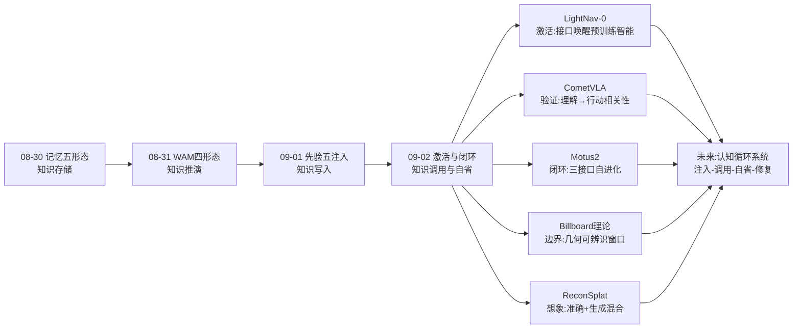
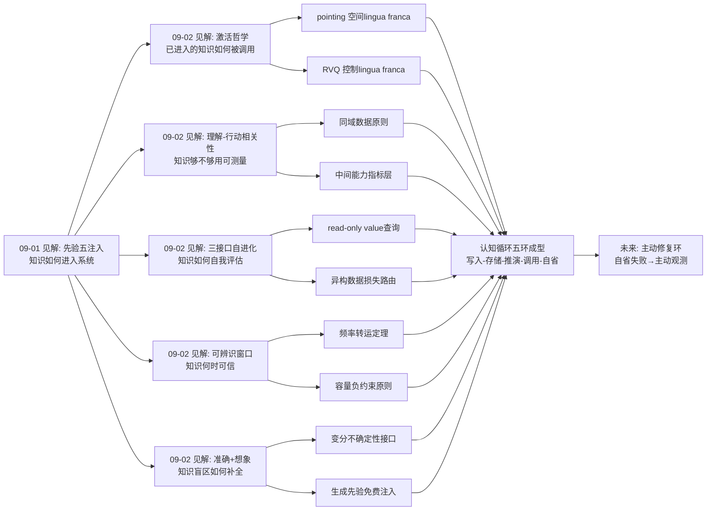
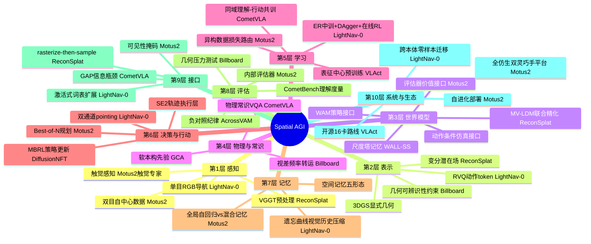
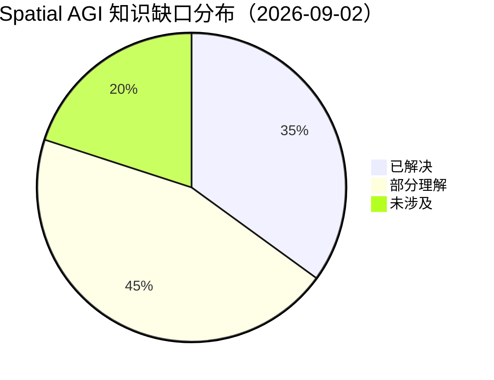

# Spatial AGI 每日研究思考 - 2026-09-02

**日期**: 2026-09-02
**论文数量**: 5篇
**主题**: 激活与闭环日——昨天先验以五种方式"注入"系统，今天五篇论文集体回答"注入之后如何使用与如何可信"：LightNav-0（激活：预训练空间智能只需正确接口，4B单骨干10基准SOTA）、CometVLA（验证：物理理解→操作成功率的相关性首次被严格证明）、Motus2（闭环：策略/仿真/评估三接口自进化）、Billboard理论（边界：3DGS几何何时可信的可辨识性窗口）、ReconSplat（想象：准确几何与生成补全的混合表示）。结论惊人一致：**先验注入之后，Spatial AGI 的下一个瓶颈是接口（如何使用已注入的知识）、闭环（如何自我评估改进）与边界（何时相信自己的空间表示）**

---

## 📅 每日总结

**日期**: 2026-09-02
**论文数量**: 5篇
**主题**: 激活与闭环日——LightNav-0 用双通道 pointing + RVQ 动作 token 证明 4B VLM 预训练空间智能无需任何任务专用头即可通吃 VLN/ObjectNav/跟踪（10 仿真基准单目 SOTA），CometVLA 用 100 万同域物理 VQA + GAP 信息瓶颈首次严格证明"理解好→行动好"（CometBench 分数与操作成功率正相关），Motus2 在单一共享参数模型上暴露 policy/simulator/evaluator 三接口并用 DiffusionNFT MBRL 闭合自进化回路，Billboard 理论用 first-hit 抽象证明 3DGS 几何可辨识性窗口（SH=24 时 PSNR 35.2dB 但 nCD 6.28——外观与几何完全脱钩），ReconSplat 用 rasterize-then-sample 变分 3DGS 引导 MV-LDM 联合精化外观+几何，在稀疏宽基线外推上取得 RE10K 新 SOTA

**关键突破**:
- 🚀 **激活范式（LightNav-0）**：不加模块、只扩词表——双通道 pointing 作为任务/场景/本体无关的空间意图接口，RVQ 用 3 个 token 表达 10 步 SE(2) 轨迹（离散 token 的精确 log-prob 与连续控制首次真正兼容 GRPO），"预训练 VLM 里已躺着通用空间智能，等一个正确的接口被唤醒"
- 🚀 **理解-行动相关性证明（CometVLA）**：与动作数据严格同域（同 recipe/同本体）的物理 VQA 共训同时提升理解与成功率且两者正相关——此前被默认的假设第一次变成可测量指标，CometBench 可当 VLA 的"物理常识 proxy metric"
- 🚀 **三接口自进化闭环（Motus2）**：policy(WAM)×simulator(AC-WM)×evaluator(VM) 在同一视频-动作骨干内以 action-first 因子分解 + 可见性掩码实现无泄漏共存；失败/次优数据首次被系统性路由给动力学+价值学习而非丢弃——"会想象、会行动、会自我评估并改进"的世界模型完整形态
- 🚀 **几何可信边界（Billboard）**：视差把几何错位强行转化为高频角向信号；SH 容量有界时表面一致解严格更优（可辨识窗口），无界时"不透明 billboard"伪解可完美拟合图像——PSNR 与几何正确性在最坏 regime 完全解耦，为所有把 3DGS 当几何用的系统划定容量约束红线
- 🚀 **准确+想象混合表示（ReconSplat）**：rasterize-then-sample 把 3D 变分场光栅化进 2D 潜在空间、KL 对齐 SD-VAE 先验——预训练 2D 生成知识几乎免费地流入 3D 表示，观测区域几何硬约束 + 未观测区域生成软补全

**架构演进**: 10层保持；第2层（表示）新增"变分潜在场（外观/几何双分布）"与"几何可辨识性容量约束"；第3层（世界模型）新增"三接口统一分解（policy/simulator/evaluator）"；第5层（学习）新增"同域理解-行动共训（CometData范式）"与"异构数据损失路由"；第6层（决策）新增"pointing 作为空间意图中间表示"与"RVQ 动作 token 化"；第9层（接口）新增"激活式词表扩展（零新模块）"

### 📊 一句话总结
昨天先验注入完成，今天五篇论文把叙事推进到**使用层**：知识注入之后，决定系统上限的是**接口设计**（LightNav-0 的激活哲学：不添加只唤醒；pointing+RVQ 两个 lingua franca）、**闭环完整性**（Motus2 补上世界模型缺失的"评估"维度）与**可信边界**（Billboard 划定几何可辨识窗口、CometVLA 提供理解可信的度量）——**Spatial AGI 从"先验工程"进入"接口工程与自省工程"阶段：重要的不再是知道多少，而是如何调用所知、如何评估所用、何时相信所建**。

### 🔗 延续性
**昨日→今日**: 昨天留下的五条线索今天被逐一接住：(1) VLAct×MAGP 叠加实验（隐式表征+显式度量）→ 今天 LightNav-0 用另一种方式回答了同一问题：pointing 接口 + RVQ 精度，表征与度量在 token 层统一；(2) WALL-SS 尺度塔能否由 3DGS 锚定 → 今天 ReconSplat 恰好给出"3D 表示锚定生成"的工程实现；(3) GCA 软先验推广 → 今天 Billboard 理论给出先验的另一面：外观容量应当**负向约束**（限 SH）而非注入；(4) AcrossVAM 粒子接口开放化 → 今天 LightNav-0 的 pointing 是更彻底的接口开放（图像平面人人可用）；(5) 评估纪律 → 今天 CometBench（理解评估）+ billboard 压力测试（几何评估）+ Motus2 评估器（自我评估）三箭齐发。
**今日→明日**: 五条线索：(1) LightNav-0 的 pointing 是 2D 的——与 3D 空间记忆（3DGS/GSMem）融合是 obvious next；(2) Motus2 三接口能否移植到导航（LightNav 闭环化）；(3) CometData 同域原则应用于空间推理 VQA（空间版 CometBench）；(4) Billboard 可辨识窗口的计算工具化（给定采集几何+纹理功率谱→安全 SH 上界）；(5) ReconSplat 变分接口用于主动探索（哪里该去看一眼）。

### 💡 本质思考：如何达成通用空间智能

#### 1. 核心能力的本质是什么？
在昨天的九维模型（完备×真实×可搬运×可信×连通×可生产×可持久×可想象×可注入）上，今天新增两维：**可调用性（invocability）**——注入的知识能否被系统以低成本接口直接调用（LightNav-0 证明预训练 pointing/grounding 能力可通过词表扩展直接驱动控制）；**可自省性（introspectability）**——系统能否评估自己的空间判断（Motus2 的 evaluator 接口自我评估、Billboard 的可辨识条件自我审计、CometVLA 的理解度量自我标定）。Spatial AGI 的本质从"先验的可组合注入系统"深化为"**注入-调用-自省的完整认知循环系统**"：先验注入定义知道什么，接口调用决定能用多少，自省机制保证用得对。

#### 2. 当前方法与理想目标的差距在哪里？
- **接口仍是一事一议**：pointing（导航）、RVQ（轨迹）、粒子（预测）、光栅化潜在（重建）各自优秀但互不通用——缺"空间接口的统一抽象"；
- **评估器是新生儿**：Motus2 的价值模型是离散任务进度，开放任务/长程信用分配远未解决；CometBench 依赖 LLM 裁判；Billboard 只覆盖静态单物体 regime；
- **可信边界与系统能力脱节**：知道 3DGS 会 billboard 失败 ≠ 知道自己何时在失败——在线自检（"我的几何现在可信吗"）无人实现；
- **激活范式的上限未知**：LightNav-0 依赖 Qwen3-VL 的 grounding 精度，2D pointing 对遮挡/视野外目标表达受限，激活能走多远没有理论刻画；
- **闭环的动力学稳定性未知**：三接口互相训练（策略靠评估器、评估器靠仿真器、仿真器靠数据）可能形成误差共振。

#### 3. 从今天到理想状态，最可能的路径是什么？
短期：接口组合学实验——pointing（空间意图）+ RVQ（动作精度）+ 变分潜在（不确定性）三个接口在导航/操作/重建任务上的可组合性消融。中期：自省层标准化——每个 Spatial AGI 系统输出三件套：判断（action）、置信（value/uncertainty）、边界（可辨识条件），像软件工程的 contract 一样强制。长期：认知循环闭环化——注入（昨天）→ 调用（今天）→ 自省（今天萌芽）→ 主动修复（明天：发现不可辨识就主动移动相机补观测，即 ReconSplat 变分接口 × 主动感知的自然合流）。

---

## 🔗 与昨日思考的联系

### 昨日重点
昨天（2026-09-01）的五个主题：(1) WALL-SS 尺度塔世界模型（结构注入）；(2) VLAct 表征中心预训练（表征注入）；(3) GCA 材料本构软先验（物理注入）；(4) AcrossVAM 语义粒子接口（接口注入）；(5) MAGP 度量等变读出（度量注入）。元结论：**先验五注入方式成型，Spatial AGI 进入"先验工程"阶段**。

### 今日进展
今天五篇论文与昨天的议题逐一对接：
- 昨天的 **"先验定义流形，学习在流形内搜索"** → 今天 Billboard 理论给出完美对偶：**容量定义流形，容量外全是幻觉**——先验可以是注入的（GCA 正则）也可以是约束的（限制 SH 阶数），一正一负构成先验工程的完整工具箱
- 昨天的 **VLAct 表征叙事** → 今天 LightNav-0 把叙事推到极致：表征不仅值钱，且**已经够用**——4B 骨干 + 正确接口 = 10 基准 SOTA；CometVLA 则划出表征的缺口：物理常识仍需同域数据补课——两篇合起来精确定位了预训练 VLM 空间智能的"已有/缺失"边界
- 昨天的 **AcrossVAM 语言通路失效警示** → 今天 CometVLA 的 GAP 瓶颈给出替代方案：物理常识不必挤进语言 token，可以用专用瓶颈 token 结构化注入动作头
- 昨天的 **WALL-SS×3DGS 混合猜想** → 今天 ReconSplat 直接实现：3D 变分场光栅化为生成模型的锚——"生成×几何混合"从猜想变成 RE10K SOTA
- 昨天的 **评估纪律问题** → 今天三重进展：CometBench（理解端度量）、Billboard 压力测试（几何端最坏情形）、Motus2 evaluator（行动端自我评估）——评估从"外部纪律"进化为"内部接口"

### 本周弧线中的今天
08-30 记忆五形态 → 08-31 WAM四形态成型 → 09-01 先验五注入 → 09-02 激活与闭环。本周叙事从"空间知识存在哪里（记忆）"经"如何推演（想象）"、"如何进入系统（注入）"推进到"如何被使用与被信任（激活/闭环/边界）"——四天恰好构成空间知识生命周期的前四环：**写入（注入）、存储（记忆）、推演（想象）、调用（激活）**，今天还补上了第五环的雏形：**自省（评估器/可辨识性）**。

### 演进路径

---

## 📚 论文概览

| # | 论文 | 一句话 | 今日角色 | 核心接口/机制 |
|---|------|--------|---------|--------------|
| 1 | LightNav-0 | 4B VLM 零新模块通吃三大导航任务，10 基准单目 SOTA | 激活 | 双通道 pointing + RVQ 3-token 轨迹 |
| 2 | CometVLA | 同域物理 VQA 共训证明理解→行动正相关 | 验证 | GAP 信息瓶颈 + 数据金字塔共训 |
| 3 | Motus2 | 单模型三接口自进化灵巧操作世界模型 | 闭环 | action-first 因子分解 + 可见性掩码 |
| 4 | Billboard | 3DGS 几何可辨识性窗口理论 | 边界 | first-hit 抽象 + 频率转运定理 |
| 5 | ReconSplat | 前馈 3DGS+扩散联合精化外观几何，外推 SOTA | 想象 | rasterize-then-sample 变分光栅化 |

五篇论文的分工构成一个完整认知循环：**LightNav-0 调用已有知识（激活）、CometVLA 度量知识是否够用（验证）、Motus2 用知识想象并评估（闭环）、Billboard 审计知识的可信边界（边界）、ReconSplat 在知识盲区生成假设（想象）**。

---

## 💡 核心见解

### 见解1: 激活哲学——空间智能的第一瓶颈是接口而非模型
从论文1（LightNav-0）获得：
- ✅ Qwen3-VL-4B + 词表扩展（pointing token + RVQ token）+ 统一监督 = 10 个导航基准单目 SOTA，无任何任务/本体专用头
- ✅ 双通道 pointing 把空间意图分解为 affordance（可行方向）与 object（目标定位）——任务、场景、本体三无关
- ✅ 遗忘曲线式历史压缩（近期密采样高分辨率、久远稀采样狠池化）在固定 token 预算内同时保细节与上下文

**对Spatial AGI的启发**:
过去两年社区给 VLM 加 3D 头、占据 token、几何专家的热情可能方向性偏了。LightNav-0 的证据指向：**预训练 VLM 的空间智能上限可能远高于任务微调所暴露的水平，瓶颈在于缺乏把 grounding 能力转译为控制的 token 接口**。"激活"（eliciting）应当成为与"注入"（injecting）并列的知识利用范式：注入处理 VLM 不知道的（物理常识），激活处理 VLM 已知道但没接口用的（pointing/空间关系）。两条路线的分界线本身就是一个重要研究问题——CometVLA 恰好在分界线的"注入侧"工作。

### 见解2: RVQ 解决了 VLA 领域的"精度-可优化性"两难
从论文1（LightNav-0）获得：
- ✅ 策略梯度需要 tractable 的 per-action 概率（要求离散 token），精确控制需要连续动作——RVQ 用 3 个语言头 token 表达 10 步 SE(2) 轨迹，两者兼得
- ✅ 任意非空前缀可解码为可执行粗轨迹，残差逐级精化——渐进精度自带 early-exit 能力
- ✅ 整条轨迹 3 token → 信用分配 horizon 短、rollout 便宜，GRPO 直接可用

**对Spatial AGI的启发**:
扩散头/流匹配头把动作生成搬出语言模型，代价是失去精确 log-prob，RL 要绕弯（MDP 重构、去噪重诠释）。RVQ 证明**精确连续控制可以留在自回归 token 世界里**。这与 WALL-SS 的 next-scale autoregression（08-31）同属"少量 token 表达高精度信号"思想脉络：token 效率（每 token 承载的信息量）是被低估的设计轴。可推广到任何 Spatial AGI 系统的连续量输出：相机位姿、抓取位形、路径点、深度图（分层 RVQ 深度 token？）。

### 见解3: 理解→行动的相关性终于可测量
从论文2（CometVLA）获得：
- ✅ CometData 100 万 QA 全部从与 VLA 训练数据相同的 recipe/本体采集——同域是关键设计，此前所有物理 VQA 都是"非具身"的
- ✅ GAP token + stop-gradient：物理常识经专用瓶颈进入动作头而不腐蚀预训练骨干
- ✅ CometBench 分数与操作成功率正相关——"理解好=行动好"从信仰变成指标
- ✅ Hamiltonian 跳变/夹爪步进/功率异常三个本体无关准则定位物理显著关键帧

**对Spatial AGI的启发**:
CometBench 开创了一个评测层级：**中间能力指标**（介于基准分与端到端成功率之间）。Spatial AGI 系统的开发可以据此分解：先优化空间理解 proxy（便宜、快），再优化行动（贵、慢），两者的相关性保证方向一致。这一模式应当复制到空间推理（空间版 CometBench：与导航/操作数据同域的空间关系 VQA）、几何理解（与重建数据同域的深度/法线 QA）。另外"同域原则"是对 Reasmory/SpatialStack 等理解增强工作的隐性警告：用网络图片训出来的空间理解，可能因域差距无法迁移到具身任务。

### 见解4: 评估器是世界模型缺失的第三接口
从论文3（Motus2）获得：
- ✅ p(A,Z,Y|c) = π(A|c)·p_wm(Z|c,A)·p_vm(Y|c,A,Z)——策略/仿真/评估是同一共享参数模型的三个因子，不是三个网络
- ✅ 可见性掩码：动作 token 不能读未来视频和价值 token（防泄漏），value 查询只读不写——因果纯洁性由掩码保证
- ✅ 异构数据分工路由：专家演示教策略，失败/次优交互教动力学和价值——失败数据从废料变成资产
- ✅ Best-of-N 规划 + DiffusionNFT MBRL 闭合"决策-学习"回路；双目自中心数据有明确 scaling 收益

**对Spatial AGI的启发**:
过去一周精读的 WAM 家族（Riemann、Zero-WAM、AcrossVAM、WALL-SS）全都卡在同一处：能想象、能行动，但不知道想象的结果好不好。Motus2 的 read-only value query 是迄今最优雅的补全——不增加模型数量，只在注意力掩码里开一扇单向窗。**"评估作为接口"预计将被所有后续 WAM 复制**，就像 last year 的"动作作为接口"一样。更深一层：异构数据损失路由回答了数据金字塔的"用法"问题——金字塔各层不是混合训练的配比问题，而是按信息类型（示范/失败/背景）路由到不同接口的分配问题。

### 见解5: 外观与几何可以完全脱钩——PSNR 不是几何指标
从论文4（Billboard）获得：
- ✅ 视差把几何错位强行转化为高频角向信号：几何错位 → 空间纹理变成视角依赖的颜色变化
- ✅ 可辨识窗口：SH 容量有界时 A(L)≪B_U(L)（真几何严格更易拟合）；无界时 billboard 伪解可完美解释图像
- ✅ 合成压力测试：SH=3 → nCD 0.03（好几何）vs SH=24 → nCD 6.28（billboard），两者 PSNR 均 ~35dB
- ✅ 真实数据（标准协议、L≤24）未触发失败——丰富空间纹理把伪装频率推出测试容量范围
- ✅ 92.6% 前景光线上前 3 个高斯占 >90.2% 合成质量（first-hit 抽象的经验依据）

**对Spatial AGI的启发**:
这是给整个 3DGS 社区的警示：我们用 PSNR/SSIM 评估重建，而最坏情形下这些指标与几何正确性**完全解耦**。所有把 3DGS 当几何用的系统（Sim-ready 重建、碰撞流形、抓取规划、GSMem 式空间记忆）都隐含承担 billboard 风险。工程红线：**角向容量（SH 阶数）必须有界，且上界应与场景纹理复杂度负相关**。与昨日 GCA（本构先验注入）构成先验工程的对偶工具：GCA 注入"应该满足什么"（物理），Billboard 限制"允许表达什么"（容量）——一正一负，都是流形约束。理论层面，"频率转运"机制（视差把空间频率搬运为角向频率）是空间-外观耦合的第一性原理表述，可推广到 NeRF、光场、甚至视频世界模型的隐式几何审计。

### 见解6: rasterize-then-sample 是 3D 复用 2D 生成先验的免费通道
从论文5（ReconSplat）获得：
- ✅ 把 3D 变分潜在场先光栅化到 2D 再采样（反转 latentSplat 的顺序），使 KL 正则可直接对齐 SD-VAE 先验——轻量适配即可解码
- ✅ 外观/几何双 4 维变分分布随高斯携带，α-blending 矩匹配得到逐像素不确定性
- ✅ MV-LDM 联合采样互相一致的外观-几何潜在对：观测区域几何硬约束 + 未观测区域生成软补全
- ✅ RE10K 稀疏宽基线外推新 SOTA；深度作为联合生成的副产品天然多视角一致

**对Spatial AGI的启发**:
"准确几何管一致性、生成先验管想象力、变分不确定性做两者的接口"——这是 Spatial AGI 空间表示的完整三段式。rasterize-then-sample 的深层价值是**先验对齐**：让 3D 表示的潜在分布直接落在预训练 2D 生成模型的先验流形上，等于把 SD/LDM 学到的全部外观知识免费注入 3D 管线。这与 GaussVid（08-30）的扩散先验监督、WALL-SS（09-01）的尺度塔结构同属"生成×几何混合"家族，但接口最内联。未观测区域的"几何"是自洽假设而非事实——与 Billboard 理论对照产生尖锐问题：**生成补全的几何是真实几何还是先验幻觉？**自洽性≠保真性，需要类似可辨识窗口的理论来审计生成式补全。

### 见解7: 认知循环五环——今天凑齐了最后两环的雏形
综合五篇：
- ✅ 写入（09-01 先验注入）→ 存储（08-30 记忆）→ 推演（08-31 想象）→ 调用（今天 LightNav-0 激活）→ 自省（今天 Motus2 评估器 + Billboard 边界 + CometVLA 度量）
- ✅ 每一环都有当日代表性论文，环与环之间开始互相引用对方的机制（如 Motus2 的数据路由呼应 CometVLA 的金字塔、ReconSplat 的变分接口呼应 Billboard 的容量约束）

**对Spatial AGI的启发**:
完整认知循环 = 写入→存储→推演→调用→自省→（修复）。目前六环中五环已现雏形，缺最后一环：**主动修复**——系统发现自省不通过（几何不可辨识/置信度低/理解失败）时主动收集信息（移动相机、触摸、重试）。ReconSplat 的变分不确定性（哪里不确定）× LightNav-0 的导航能力（能去看）× Motus2 的评估器（知道值不值得看）恰好是主动修复的全部原料——明年的 Spatial AGI 系统应该是这三者的合体：**一个知道自己哪里瞎、会走过去看、看完能评估看到了什么的智能体**。

---

## 🗺️ 知识演进图（核心见解演进）

---

## 技术栈演进对比表

| 层次 | 昨日方案（09-01） | 今日方案（09-02） | 变化 |
|------|---------|---------|------|
| 空间意图接口 | AcrossVAM 语义粒子（预定义分解） | LightNav-0 双通道 pointing（图像平面通用） | 从任务专用接口→通用 lingua franca |
| 动作表示 | VLAct 多头连续动作共同监督 | RVQ 3-token 轨迹（精确+可RL） | 从"架构统一"→"token 统一" |
| 理解增强 | 表征中心持续预训练（通用） | CometData 同域物理 VQA（对齐动作域） | 从"更好的表征"→"对齐的表征" |
| 知识注入通道 | GCA 软本构正则（正向注入） | Billboard SH 容量约束（负向约束）+ GAP 瓶颈（结构化通道） | 注入工具箱补齐正负两翼 |
| 世界模型接口 | WAM 双接口（策略+仿真） | Motus2 三接口（+评估器） | 接口完备化 |
| 数据利用 | 数据金字塔配比混合 | 异构数据损失路由（按信息类型分流） | 从"配比学"→"路由学" |
| 3D-生成混合 | WALL-SS 尺度塔（纯生成侧结构） | ReconSplat 变分光栅化（3D侧锚定生成） | 混合方向从生成侧→几何侧 |
| 几何评估 | nCD 等经验指标 | 可辨识窗口理论+压力测试复现 | 从经验→理论 |
| 训练闭环 | SFT+RL 后训练 | ER中训→SFT(DAgger)→在线RL / Best-of-N+MBRL | 中训阶段显式化、闭环完整化 |
| 不确定性处理 | 未系统处理 | 变分潜在场显式编码+传递 | 不确定性成为一等公民 |

---

## 🗺️ Spatial AGI 知识图谱（10层架构思维导图）

### 10层架构思维导图

## 🛤️ 主线技术路径

### 阶段1: 空间感知基础（~2024）
NeRF/3DGS 重建成熟、VLM grounding 能力萌芽。空间智能 = 重建质量。代表：3DGS 原始论文、CLIP-系列 grounding。

### 阶段2: 空间语义化（2025~2026H1）
3D 与语言对齐：3D-LLM、SpatialVLM、开放词汇场景理解、空间推理基准爆发。空间智能 = 语义+推理能力。空间知识开始"可查询"。

### 阶段3: 具身行动化（2026H1~H2）
VLA/WAM 浪潮：空间知识驱动行动（NaVid、π0系、ABot、Motus）。空间智能 = 感知-行动闭环。上周记忆五形态、本周 WAM 四成型。

### 阶段4: 先验工程化（2026-08~现在，本周启动）
知识注入方式系统化：结构/表征/物理/接口/度量五注入（09-01）+ 容量负约束（09-02 Billboard）。空间智能 = 知识的正确使用形式。

### 阶段5: 接口与自省工程（2026-09-02 启动，当前前沿）
激活预训练智能（LightNav-0）、理解-行动相关性度量、三接口自进化闭环、几何可信边界。空间智能 = 调用所知 + 评估所用 + 相信所建。

### 阶段6: 认知循环闭合（展望）
主动修复环：自省失败 → 主动观测（移动相机/触摸/探索）→ 更新表示 → 重新评估。系统知道自己哪里瞎、会去看、看完知道看没看懂。变分不确定性（ReconSplat）× 导航能力（LightNav-0）× 评估器（Motus2）是全部原料。

---

## 🔍 待探索议题

### 高优先级（本周）

1. **pointing 接口的 3D 化**
   - 问题: LightNav-0 的双通道 pointing 是 2D 图像平面的，对遮挡背后/视野外目标（"拐角处左转"）表达受限
   - 候选方案: pointing token 与 3D 空间记忆（3DGS/GSMem）融合——2D 指向 + 3D 记忆位置的联合接口；或 NDC/球坐标 pointing token
   - 缺口: 无人在统一 token 空间内同时监督 2D grounding 与 3D 记忆定位

2. **RVQ 动作 token 的通用化**
   - 问题: RVQ 在 SE(2) 轨迹上验证，能否推广到 SE(3)、关节空间（灵巧手 20+ DoF）、多机器人联合动作？
   - 候选方案: 分层 RVQ（本体共享粗层 + 本体专用残差层），呼应 VLAct 的部分统一动作布局
   - 缺口: 高维动作空间的码本训练稳定性与覆盖率分析

3. **生成式补全的可辨识性理论**
   - 问题: ReconSplat 在未观测区域的深度是自洽假设而非事实——Billboard 框架能否审计生成式补全（何时是先验幻觉）？
   - 候选方案: 把"纹理复杂度×外推视角范围"映射为补全可信度上界；变分 σ 作为幻觉警报器
   - 缺口: 生成先验的"频率转运"分析（先验偏好何种空间频率）

4. **三接口的导航移植**
   - 问题: Motus2 的 policy/simulator/evaluator 分解能否移植到导航（把 LightNav-0 闭环化）？
   - 候选方案: LightNav-0 做 π、视频世界模型做 p_wm、CometBench 式进度价值做 p_vm，Best-of-N 轨迹选择
   - 缺口: 导航的进度价值（VLN 中"接近目标"的连续度量）比操作更难定义

5. **空间版 CometBench**
   - 问题: CometVLA 的同域原则用于空间推理——与导航/操作数据同域的空间关系 VQA 基准
   - 候选方案: 从导航轨迹自动生成"左转后第三个门"/"桌子在沙发与灯之间"式 QA，LLM 裁判评分
   - 缺口: 空间关系的自动标注流水线（CometData 的空间中间件对应物）

### 中优先级（本月）

6. **SH 容量自适应选择工具**
   - 问题: Billboard 给了理论但没给工具——给定采集几何（视差范围）+ 纹理功率谱，计算安全 SH 上界
   - 候选方案: ω_fake 的闭式估计 + 场景纹理频谱分析的在线管线
   - 缺口: 真实场景纹理功率谱与伪装频率的经验标定

7. **失败数据的资产化实践**
   - 问题: Motus2 证明失败/次优交互可教动力学和价值——一般 VLA 训练中如何系统收集和路由失败数据？
   - 候选方案: 部署机器人自动分类自身轨迹（成功/失败/次优）并按接口路由；数据金字塔配比学→路由学的范式转移
   - 缺口: 失败数据的价值量化（多少失败等价于一次专家演示？）

8. **遗忘曲线压缩 vs 空间记忆的等价性**
   - 问题: LightNav-0 的视觉历史压缩与 GSMem 式显式空间记忆解决同一问题（长时程空间上下文），孰优孰劣？混合方案？
   - 候选方案: 压缩近期 + 显式记忆远期（关键地标/回环线索不池化）
   - 缺口: "久远但关键"记忆的选择性保留机制（重要性评分）

9. **理解 proxy 指标的工业标准化**
   - 问题: CometBench 式中间指标能否成为 VLA/导航模型开发的标准 CI（像代码测试一样跑）？
   - 候选方案: 开发套件：训练中定期跑理解 benchmark，相关系数监控，理解退化报警
   - 缺口: 理解指标与最终成功率的因果关系在更多任务族上的验证

### 低优先级（长期）

10. **主动修复环的原型系统**
    - 问题: 认知循环第六环（自省失败→主动观测）的最小可行原型
    - 候选方案: ReconSplat σ 高的区域 → LightNav-0 导航过去 → 重新扫描 → σ 下降验证
    - 缺口: 观测价值估计（值得走多远去看一眼？）与 Motus2 评估器的结合

11. **激活/注入分界线的理论刻画**
    - 问题: 预训练 VLM 空间智能的"已有/缺失"边界——LightNav-0（激活够用）与 CometVLA（需要注入）的分界由什么决定？
    - 候选方案: 按 capability（grounding 已有 vs 物理常识缺失）× 任务需求矩阵，系统探针实验
    - 缺口: 预训练模型能力的审计工具（哪些知识以何种形式驻留在哪里）

12. **多先验+多接口系统的组合学**
    - 问题: 本周积累的先验（五注入+容量约束）与接口（pointing/RVQ/粒子/变分/瓶颈）能否在一个系统内组合？
    - 候选方案: 参照 09-01 展望的统一注入协议，加入今日接口层：骨干（VLAct 表征）+ 空间意图+ 动作（RVQ）+ 常识（GAP）+ 不确定性（变分）+ 评估
    - 缺口: 组合爆炸下的消融实验设计与算力预算

---

## 📊 知识缺口分析

### 当前缺口分布

**已解决（35%）**:
- ✅ 预训练 VLM 空间智能可直接激活用于控制（LightNav-0）
- ✅ 离散 token 上的精确连续控制可行（RVQ）
- ✅ 理解提升与行动提升正相关且可测量（CometVLA）
- ✅ 单模型多接口（policy/simulator/evaluator）无泄漏共存（Motus2）
- ✅ 3DGS billboard 失败的机制与触发条件（Billboard）
- ✅ 几何一致性与生成合理性的兼得（ReconSplat）
- ✅ 空间知识的注入方式光谱（本周：结构/表征/物理/接口/度量/容量）
- ✅ 空间记忆的形态分类（上周）

**部分理解（45%）**:
- ⚠️ 激活范式的上限（2D pointing 对遮挡/视野外的表达、grounding 精度瓶颈）
- ⚠️ 评估器接口的开放任务扩展（离散任务进度 vs 长程/开放价值）
- ⚠️ 生成式补全的可信度（自洽≠保真，幻觉审计缺失）
- ⚠️ 可辨识窗口的实用工具化（安全 SH 上界的计算）
- ⚠️ 失败数据价值的量化与规模化收集
- ⚠️ 理解-行动相关性的跨任务族稳健性
- ⚠️ 三接口训练的动力学稳定性（误差共振风险）
- ⚠️ 变分不确定性接口在主动感知中的用法
- ⚠️ 双目/触觉等多模态 scaling 的系统性规律

**未涉及（20%）**:
- ❌ 主动修复环（自省失败→主动观测）的系统实现
- ❌ 认知循环六环的整体集成（写入-存储-推演-调用-自省-修复）
- ❌ 激活/注入分界线的理论刻画
- ❌ 多先验多接口系统的组合收益矩阵
- ❌ 空间接口的统一抽象（pointing/RVQ/粒子/变分的元理论）
- ❌ 在线几何自检（"我的表示现在可信吗"的运行时审计）

---

## 附录A：五篇论文的深度交叉分析

### A.1 两两对照矩阵

| 论文对 | 共同点 | 互补点 | 组合想象 |
|--------|--------|--------|---------|
| LightNav-0 × CometVLA | 都基于 Qwen 系骨干、都主张不破坏预训练 | LightNav 说"能力已有"，Comet 说"物理常识要补" | 激活+注入的混合系统：pointing 激活 + GAP 注入物理 |
| LightNav-0 × Motus2 | 都用 token 接口连接感知与行动 | 导航（SE2）vs 操作（高DoF+触觉）；单接口 vs 三接口 | 导航版三接口：pointing 做 π 的 CoT、世界模型仿真轨迹、进度价值评估 |
| CometVLA × Motus2 | 都处理异构数据金字塔 | Comet 混合共训（VQA层）vs Motus 路由分流（失败层） | 数据路由学：VQA→理解、专家→策略、失败→动力学+价值，全路由无混合 |
| Billboard × ReconSplat | 都关注几何与外观的解耦 | Billboard 证明解耦的危险（伪解），ReconSplat 利用解耦的力量（联合生成） | 可信度分级：观测区用 Billboard 窗口审计、补全区标注为假设 |
| Motus2 × ReconSplat | 都用变分/生成处理不确定性 | Motus 在动作侧（价值），ReconSplat 在感知侧（潜在场） | 不确定性贯通：感知 σ → 世界模型 → 评估器置信 → 动作选择 |

### A.2 三条汇聚线

1. **接口汇聚线**：pointing（LightNav-0）、GAP（CometVLA）、value query（Motus2）、变分光栅化（ReconSplat）——四篇系统论文各贡献一个接口原语，全部是"在冻结骨干上开窗"的轻量设计。接口工程正在取代架构工程成为系统创新的主战场。

2. **可信汇聚线**：CometBench（理解可信）、可辨识窗口（几何可信）、评估器（行动可信）、负对照纪律（评估可信）——一周内"可信"从口号变成四个可操作的度量/条件。Spatial AGI 正在建立自己的质量保证体系。

3. **数据汇聚线**：同域原则（CometVLA）、失败数据路由（Motus2）、双目 scaling（Motus2）、2K场景4K小时（LightNav-0）——数据研究从"更多"转向"更对"：对的域、对的类型、对的模态、对的量级。

### A.3 与本周早些时候论文的回响

- LightNav-0 的 pointing ← Embodied-Navigator（08-30 Point/Think/Memorize/Align）的 point 阶段，但去掉了 think 的文本开销、用双通道统一了 memorize 的表达
- CometVLA 的金字塔 ← VLAct（09-01）的表征预训练：一个在金字塔底（VQA）发力、一个在骨干（表征）发力，同域原则是两者的公约数
- Motus2 评估器 ← WALL-SS（09-01）长时 rollout 的隐含需求：分钟级想象没有价值评估只会越走越偏
- Billboard 容量约束 ← GCA（09-01）本构先验：正负两种流形约束，先验工程工具箱的阴阳两极
- ReconSplat ← GaussVid（08-30）+ SpatialCrafter（08-31）：生成×几何混合家族的第三种实现（扩散先验监督 → 3D 代理锚定 → 变分光栅化条件）

---

## 附录B：金句摘录与转评

1. "a compact VLM can serve as a shared reasoning backbone for general embodied navigation"（LightNav-0）
   - 转评：注意 "compact"——4B 够了。当接口正确时，规模叙事让位于接口叙事。

2. "action is not an auxiliary output attached to a simulator, but the causal interface that grounds internal predictions in physical interaction"（Motus2 引 General World Models）
   - 转评：这句话应该刻在所有 WAM 论文的扉页上。今天是这句话的三接口版本：评估也不是附加输出，而是进化的因果接口。

3. "physical understanding pre-training genuinely benefits downstream manipulation"（CometVLA）
   - 转评: "genuinely" 一词承载了整个社区一年的焦虑——终于有人用严格实验说出这句话。

4. "good appearance yet catastrophic geometry as radiance capacity increases"（Billboard）
   - 转评：每个用 PSNR 报告几何质量的论文都应该引用这句话。

5. "the trade-off between plausible view generation for unobserved regions and geometric consistency"（ReconSplat）
   - 转评：一个存在多年的 trade-off 在今天被架构化消解——但"消解"的代价是把保真性推迟到自洽性之后，这个账要记清楚。

---

## 附录C：明日研究候选

从今日 187 篇候选池中未被选中但值得关注：
1. **CGFM-Nav**（2608.29114）认知图场记忆终身多模态导航——与 LightNav-0 记忆压缩方案对比
2. **Zeva**（2608.30880）in-context 因果学习泛化操作——与 Motus2 自进化互补的另一条泛化路径
3. **GeoAgent**（2608.29483）VLM 地理定位×具身导航评测——地理空间智能与室内空间智能的桥
4. **GhostSplat**（2608.29184）前馈 3DGS 多视角一致后门攻击——与 Billboard 同属"3DGS 何时不可信"，但来自安全侧
5. **Lucida**（2608.30821）Parse-Generate-Place 可组合 Real-to-Sim——Sim-ready 资产管线的最新拼图
6. **When to trust 系列延伸**：PIVOT（2608.25401）真实世界位姿/内参/新视角评测基准

---

## 附录D：数据与观察日志

- 今日候选池: 187 篇（5 查询 × 40，去重；arXiv API curl 直连成功，Python urllib 仍限流）
- 精选分布: 导航 1 / VLA 理解 1 / 世界模型 1 / 3DGS 理论 1 / 前馈重建 1
- 关键数字速记: 4B-10基准SOTA（LightNav）；1M QA 正相关（Comet）；3接口+失败数据（Motus）；SH24/PSNR35.2/nCD6.28（Billboard）；RE10K外推SOTA（ReconSplat）
- 方法论观察: 今日五篇全部包含显式的"接口设计"章节——接口正在成为论文的标准贡献声明
- 生态观察: 清华（Motus2）、京东+CUHK-SZ（CometVLA）、Penn State（Billboard）、TU Darmstadt（ReconSplat）、LightNav-0 团队（20人，工业界特征）——接口/闭环/理论创新呈多中心分布，不再由单一巨头垄断

---

## 附录E：深度长文——接口工程宣言（工作草案）

### E.1 从架构工程到接口工程

回顾本周：08-30 记忆五形态、08-31 WAM 四形态、09-01 先验五注入、09-02 接口四原语（pointing/GAP/value query/变分光栅化）+ 容量约束。四天的共同方法论信号：**创新的重心从"设计新架构"系统性转移到"设计新接口"**。

架构工程问"系统应该由什么组成"；接口工程问"已有组件之间应该如何对话"。LightNav-0 不设计任何新组件，只设计组件间的对话协议（pointing token、RVQ token）；Motus2 不新增网络，只在注意力掩码里开一扇 value 单向窗；CometVLA 不改骨干，只插入一个瓶颈 token；ReconSplat 不改扩散模型，只改变潜在分布的生成顺序（rasterize-then-sample）。

这不是巧合而是成熟信号：当骨干（VLM/视频扩散）足够强、数据（金字塔）足够多之后，系统的边际改进只能来自连接方式。类比软件工程：算法红利耗尽后，API 设计成为生产力主战场。

### E.2 接口的分类学初稿

今日四原语 + 本周积累，试拟空间接口分类学：

- **意图接口**（模型→空间）：pointing（LightNav-0）、粒子（AcrossVAM）——表达"想去哪/在乎什么"
- **控制接口**（模型→执行）：RVQ token（LightNav-0）、FAST token（CometVLA）、flow-matching（Motus2）——表达"具体怎么做"
- **知识接口**（数据→模型）：GAP 瓶颈（CometVLA）、软先验正则（GCA）、容量约束（Billboard）——表达"应该知道/不能违反什么"
- **评估接口**（模型→自身）：value query（Motus2）、CometBench（CometVLA）、可辨识条件（Billboard）——表达"做得怎么样"
- **不确定性接口**（模型→下游）：变分 σ（ReconSplat）——表达"哪里没把握"

五类接口构成系统内部与系统边界的完整对话协议栈。一个成熟的 Spatial AGI 系统应该五类俱全——目前没有任何系统同时拥有五类。

### E.3 接口工程的三条设计定律（草案）

1. **单向窗定律**：向冻结/预训练组件注入新能力时，优先用单向信息流（read-only 查询、stop-gradient、瓶颈 token）——Motus2 的 value query、CometVLA 的 GAP 都遵循；双向流会腐蚀预训练表示。
2. **复用先验定律**：接口应让外部预训练先验免费流入（ReconSplat 的 KL 对齐 SD-VAE），而不是让系统重新学习已知知识（呼应 MAGP 的度量读出原则）。
3. **可分级定律**：接口输出应支持渐进精度/渐进决策（RVQ 前缀可执行、Best-of-N 可早停）——接口的开销应与任务难度自适应。

### E.4 自省工程：Spatial AGI 的质量保证体系

今天的三重评估进展提示一个新工程领域：**自省工程**——为空间智能系统建立运行时的质量保证。

- 理解端：CometBench 式 proxy 指标作为开发期 CI
- 几何端：可辨识窗口作为部署期红线（容量审计）
- 行动端：evaluator 接口作为运行时置信度
- 缺失的一块：**在线几何自检**——系统在运行时判断"我当前的空间表示是否可信"，这需要把 Billboard 的离线理论转化为在线统计检验（渲染残差的频率分析？）

自省工程与接口工程合流之处，就是主动修复环的起点：σ 高（ReconSplat）→ 自检失败（Billboard 在线版）→ 导航过去看（LightNav-0）→ 更新并重评（Motus2）。**这条链路的所有零件今天都已出现在论文里，只差组装。**

### E.5 结语

本周四天完成了一次叙事跃迁：空间知识从"被拥有"（记忆）、"被推演"（想象）、"被写入"（注入）走向"被调用"（激活）与"被审计"（自省）。知识生命周期每补全一环，系统就多一分自主性。当六环（含修复）闭合之日，Spatial AGI 将第一次拥有完整意义上的空间认知循环——不是更大的模型，而是更完整的循环。

---

**文档生成时间**: 2026-09-02 03:00+08:00  
**基于论文**: LightNav-0 / CometVLA / Motus2 / When 3DGS Recovers Real Surfaces / ReconSplat  
**延续自**: daily_thinking/2026-09-01.md（先验注入日）

---

## 附录F：五篇论文的技术细节补充档案

### F.1 LightNav-0 关键设计速查

- 骨干：Qwen3-VL-4B-Instruct（原生分辨率 ViT + 36 层 LM）
- 词表扩展：⟨apos_i⟩ / ⟨opos_i⟩ pointing token + RVQ 动作 token
- 历史压缩公式：采样率 f_s(i) = f_s^max·exp(−ΔT_i/τ_s)；池化步长 s_i = max{1, ⌊exp(ΔT_i/τ_p)⌋}
- RVQ 结构：1×256-entry 粗码本 + 2×256-entry 残差码本 → 3 token → 10 步 SE(2) waypoint
- 训练：LightNav-ER（embodied reasoning 中训，8 基准全集平均最高）→ SFT(DAgger) → 在线 RL（GRPO 式 group-relative）
- 覆盖任务：指令跟随 VLN、开放词汇 ObjectNav、具身视觉跟踪（单模型）
- 关键消融逻辑：pointing/spatial-VQA 附加评测验证导航适配未侵蚀原 grounding 能力

### F.2 CometVLA 关键设计速查

- 数据：CometData 1M QA / 1.8M+ 图像；CometBench 2000 题（LLM 裁判 100 分制：正确性/连贯性/相关性/完整性/物理推理）
- 关键帧打分：C_A Hamiltonian 跳变 + C_B 夹爪步进 + C_C 功率异常 → 显著性 S_t → top-K
- 架构：Qwen3-VL + FAST 动作 token（L_AR + L_fast）+ flow-matching 动作专家（L_FM），stop-gradient 屏障
- GAP token：全局共享、与视觉语言流解耦、骨干与动作专家间唯一通信通道
- 相关性结论：CometBench 分数 ↑ → 操作成功率 ↑（跨域验证）

### F.3 Motus2 关键设计速查

- 三接口：π(A|c)（policy/WAM）、p_wm(Z|c,A)（simulator/AC-WM）、p_vm(Y|c,A,Z)（evaluator/VM）
- 序列结构：x = (Z_ctx; B_1;…;B_M)，B_j = (q_j; A_j; Z_j; U_j)，U_j 为 read-only value query
- 可见性：A_j 不可读 Z_j/U_j；Z_j 可读 A_j；U_j 可读全部但对他人隐藏；跨块因果窗口
- 块内依赖链：A_j → Z_j → U_j；块间自回归、块内 flow-matching 联合
- 立体视频：双目潜变量共享时间/垂直坐标、水平 RoPE 分离
- 数据：单目自中心 → 双目自中心（scaling 收益确立）→ 机器人域中训（+人机对齐）
- 闭环：V = E[Y_t] 排序 Best-of-N；DiffusionNFT MBRL 更新策略
- 硬件：双目视觉 + 双臂 + 双灵巧手 + 触觉传感的全仿生平台

### F.4 Billboard 关键设计速查

- 抽象：first-hit 渲染（92.6% 光线前 3 高斯占 >90.2% 质量的经验动机）
- 误差曲线：A(L) = 真几何最优误差；B_U(L) = 错位几何伪装误差 = E[dist(F_U, V_L)²]
- Proposition 1：固定几何的最优外观 = 逐点正交投影 Π_{V_L}(F_U)（全局解耦为局部最小二乘）
- 失败数据点：SH=3 → PSNR 34.9 / nCD 0.03；SH=24 → PSNR 35.2 / nCD 6.28
- 适用范围：任何有限阶 SH 辐射头的 proxy/表面表示（含 NeRF 变体）
- 真实数据结论：标准协议 + L≤24 未触发（纹理复杂度推高 ω_fake）

### F.5 ReconSplat 关键设计速查

- Stage 1：MVSplat 编码器 → 像素对齐 3DGS {X,Σ,α,c} + 变分潜在 (μ^a,σ^a,μ^g,σ^g ∈ R⁴)
- 光栅化：α-blending 潜在分布混合 → 矩匹配高斯近似 → 逐像素 (μ̄_p, σ̄_p)
- KL 正则：光栅化分布对齐 SD-VAE 先验 → 轻量 VAE 适配即可解码 RGB+深度
- Stage 2：MV-LDM 以初步潜在为条件，联合采样外观-几何一致潜在对
- 预处理：VGGT 提供位姿/内参/稠密相对深度伪标签
- 基准：RE10K 稀疏宽基线外推 SOTA；DL3DV-10K 强表现

---

## 附录G：本周研究日志汇总（08-30 ~ 09-02）

| 日期 | 主题 | 五篇论文 | 元结论 |
|------|------|---------|--------|
| 08-30 | 记忆五形态 | CGS-SLAM / AirForesight / Embodied-Navigator / GaussVid / VLM-HOI Survey | 空间知识存在哪里：持久层成型 |
| 08-31 | WAM 四形态 | CLAP / Riemann-1.0 / Zero-WAM / SpatialCrafter / LagrangeGS | 空间知识如何推演：想象引擎成型 |
| 09-01 | 先验五注入 | WALL-SS / VLAct / GCA / AcrossVAM / MAGP | 空间知识如何进入：注入光谱成型 |
| 09-02 | 激活与闭环 | LightNav-0 / CometVLA / Motus2 / Billboard / ReconSplat | 知识如何被调用与被信任：接口+自省成型 |

### 本周知识生命周期进度

---

## 附录H：方法论笔记——今日实验设计的可借鉴模式

1. **附加能力保持评测**（LightNav-0）：导航适配后回头测 pointing/spatial-VQA，确认没吃掉原能力——所有"在预训练模型上加能力"的工作都应标配此类回归评测。
2. **中间层相关性分析**（CometVLA）：既不混杂多因素（MIMO-Embodied 式）、也不过度简化动作专家（VLM4VLA 式）——用"同域数据+瓶颈架构"把 VLM 能力这个变量隔离出来。任何"X 能力是否重要"的问题都可以套用此实验设计。
3. **确定性压力测试**（Billboard）：理论预测失败模式 → 构造可控合成场景 → 确定性触发 → 真实数据上验证不触发。理论-实证闭环的标准模板。
4. **负空间对照**（ReconSplat 的对比图设计）：DepthSplat（有几何无想象）、MVSplat360（有想象无几何）、ReconSplat（兼得）——三格对比图把 trade-off 的消解展示得一目了然。论文写作可借鉴。
5. **接口级消融**（Motus2）：可见性掩码的每一处开/关都是独立消融轴——接口工程的实验设计单位是"信息流"而非"模块"。

---

## 附录I：开放问题清单（滚动更新）

继承自本周早些时候并按今日进展更新状态：

1. ~~WAM 四形态何时收敛~~ → 部分回答：三接口分解（Motus2）给出收敛的功能框架 [09-02]
2. ~~白箱物理如何给黑箱想象发执照~~ → 部分回答：软先验（GCA）+ 容量约束（Billboard）正负两翼 [09-01/09-02]
3. ~~世界模型可信度评估~~ → 大幅推进：CometBench + evaluator 接口 + 可辨识窗口 [09-02]
4. 语言通路的接地危机（AcrossVAM 负对照）→ 仍未解决；GAP 瓶颈是绕开方案而非解决 [开放]
5. 表征叙事 vs 数据叙事的分水岭实验 → VLAct 启动，CometVLA 补充同域约束，LightNav-0 加入接口变量 [进行中]
6. 生成×几何混合的最优架构 → 三种实现已现（GaussVid/SpatialCrafter/ReconSplat），缺统一比较基准 [进行中]
7. 空间记忆的选择性保留（久远但关键）→ 遗忘曲线压缩是启发式起点，重要性评分缺失 [开放]
8. 主动修复环（认知循环第六环）→ 零件齐备（σ×导航×评估器），无人组装 [开放·高价值]
9. 激活/注入分界线的理论刻画 → LightNav-0 与 CometVLA 提供两端数据点 [开放·新增]

---

**（文档结束）**

**文档生成时间**: 2026-09-02 03:00+08:00  
**基于论文**: LightNav-0 / CometVLA / Motus2 / When 3DGS Recovers Real Surfaces / ReconSplat  
**延续自**: daily_thinking/2026-09-01.md（先验注入日）

---

## 附录J：逐篇深读笔记（问答式自检）

### J.1 LightNav-0 深读十问

1. **为什么选 pointing 而不是文本 CoT 作为空间推理迹？**
   文本 CoT 解码延迟可变、监督信号间接（语言描述空间精度有限）；pointing 固定 token 数、直接落在 VLM 预训练 grounding 的分布内、几何精度由图像网格分辨率保证。

2. **双通道为什么是 affordance + object 而不是单通道目标点？**
   可行性（哪里能走）与目标性（要去哪）是导航的两个独立自由度：目标在墙上但可行方向是沿墙走。单通道会把两个语义挤进一个点，监督信号互相干扰。

3. **RVQ 相比离散原子命令的优势如何量化？**
   原子命令（前/后/左/右）每 token 携带 ~2 bit 运动信息；RVQ 3 token 携带整条 10 步轨迹，粗层定形状、残差层定精度，控制平滑度和路径质量都不在一个量级。

4. **遗忘曲线压缩会不会丢回环线索？**
   会，这是明确的局限（见文档1局限节）。久远但关键的空间记忆（走过的路口、见过的地标）按时间指数衰减池化，长走廊/回环场景吃亏。显式空间记忆（GSMem 式）是自然补充。

5. **ER 中训为什么单独存在而不是并入 SFT？**
   embodied reasoning（空间 VQA、grounding 强化）与动作监督的梯度差异大；先做 ER 让骨干的具身推理到位，再对齐动作，动作训练不会拖着理解能力跑偏。且 ER 检查点本身有独立价值（8 基准 SOTA）。

6. **GRPO 在 3 个 RVQ token 上如何运作？**
   每个 token 的 log-prob 由语言头精确给出，group-relative advantage 在同一任务的 N 条轨迹间计算，无需 critic；轨迹短（3 token）使信用分配窗口极小。

7. **跨本体零样本如何实现？**
   模型只输出 SE(2) waypoint，平台控制器负责逆运动学与底盘差异——抽象层切在"轨迹几何"而非"控制指令"。

8. **与 ABot-N1（像素目标+RL）的本质区别？**
   ABot-N1 的 RL 作用于慢系统的 CoT+像素目标（点任务）；LightNav-0 的 RL 直接作用于 RVQ 轨迹 token（全任务），动作空间更精细且统一。

9. **单目为什么够？**
   预训练 VLM 的单目空间先验（相对深度、grounding）+ 历史，把绝对度量留给执行层（里程计/底盘）。与 MAGP（09-01）的度量读出主张形成有趣的哲学分歧：LightNav 绕开度量，MAGP 读出度量。

10. **最大的开放风险？**
    pointing 精度受限于骨干 grounding 分布的分辨率；如果场景需要亚网格精度（密集障碍），接口本身成为瓶颈。

### J.2 CometVLA 深读十问

1. **同域（in-domain）具体指什么？**
   同采集 recipe（同一批场景/物体/本体/相机配置）、同本体、同视觉分布——VQA 的图像就是策略训练看到的图像类型，答案涉及的物理量就是中间件从该本体 s_t/a_t 提取的。

2. **GAP token 为什么全局共享而不 per-task？**
   设计意图是"任务无关运动规律"——抓取的接近/撤退节奏、放置的减速曲线等跨任务共性。per-task 会退化为任务嵌入，丢失共性抽象。

3. **为什么不用语言 token 承载物理常识？**
   呼应 AcrossVAM 的负对照：冻结语言嵌入+调制不足以条件化动力学。物理常识以结构化潜在（GAP）直接进动作头，绕开语言的低带宽瓶颈。

4. **LLM 裁判评分的偏差风险？**
   裁判对"物理上合理但表述不同"的答案可能误判；论文用 100 分制多维评分+人工抽检缓解，但小分差（<5分）的可靠性存疑。

5. **Hamiltonian 跳变准则的直觉？**
   动能+势能的突变对应接触/碰撞/提起放下等物理事件——用能量而非视觉显著性选关键帧，天然对齐"物理上重要的时刻"。

6. **失败数据在 CometVLA 里有对应物吗？**
   没有——这是与 Motus2 的互补点。CometVLA 的金字塔底是 VQA，Motus2 的路由里有失败轨迹。两者合并是显然的下一步（失败轨迹生成"为什么会失败"VQA）。

7. **相关性会不会是伪相关（共同因子：数据量/模型容量）？**
   论文通过固定架构与训练协议隔离变量，但完整因果链（理解改善→中间表示变化→策略改善）的机制性解释仍缺——值得用表示分析（probing）跟进。

8. **1M QA 的多样性瓶颈？**
   16 个生成器模板的覆盖有限；物理常识的"常识"部分（重力、容器、液体）依赖模板设计者的想象力，可能系统性遗漏长尾。

9. **与 Robo2VLM 的差异？**
   Robo2VLM 从机器人轨迹抽 VQA 但不与动作数据同 recipe、不做共训、不验证对行动的因果影响——CometVLA 三者都做。

10. **最值得复用的组件？**
    物理中间件（关键帧准则 + 语义状态描述）——可以独立产品化，接入任何遥操作数据管线自动产出物理 VQA。

### J.3 Motus2 深读十问

1. **三接口会不会互相牵制？**
    风险真实存在：视频生成损失尺度大、价值回归小。掩码+路由是缓解，但规模化后的梯度平衡（loss weighting schedule）细节论文未完全展开——后续工作的切入点。

2. **value query 为什么 read-only？**
    若可写，价值梯度会污染外观/动作 token 的表示；只读保证评估是"旁观者"，与 stop-gradient 哲学一致（单向窗定律的又一实例）。

3. **chunk-autoregressive 与 WALL-SS 尺度自回归的关系？**
    都是"块间因果、块内联合"结构；WALL-SS 的块是尺度，Motus2 的块是动作块——多分辨率/多粒度自回归是生成模型的结构共性，值得元分析。

4. **Best-of-N 的延迟账？**
    N 次仿真+评估的前向开销对实时控制太贵；适合低频决策（子目标选择）而非高频控制。分层使用（BoN 选方向、flow-matching 高频执行）是务实方案。

5. **双目 RoPE 分离的细节为什么重要？**
    共享时间/垂直坐标保证双目时序对齐，水平 RoPE 分离编码基线信息——几何先验（视差）以位置编码形式进入注意力，不占用数据量。

6. **触觉专家为什么轻量/独立？**
    触觉信号频率高、维度异构，与视觉 token 混流会稀释；独立专家+汇合到动作精化层，接触信息只在"最后一步"介入。

7. **与 Dreamer 系经典 MBRL 的本质区别？**
    Dreamer 在潜空间想象（学到的动力学）；Motus2 在像素/潜在视频空间想象（生成式世界模型），想象质量可解释、可评估（渲染出来看），但算力代价高一个量级。

8. **失败数据教价值模型的机制？**
    失败轨迹的进度标注低 → value 模型学会"这种状态+这种动作→低进度"——相当于免费的负样本奖励标注，无需人工 reward。

9. **人-机对齐数据的作用？**
    手部姿态→机器人夹爪的 retarget 对应关系，让人类视频的交互先验映射到机器人动作空间——VLAct 跨具身思想在灵手场景的具体化。

10. **什么时候该放弃单模型三接口？**
    如果任务族差异巨大（导航+装配+烹饪），单模型的接口掩码组合爆炸；分模型+共享骨干（接口分层联邦）可能更实际。

### J.4 Billboard 深读十问

1. **first-hit 抽象什么时候失效？**
    半透明/烟雾/毛发等真体积场景；训练早期高斯尚未固化时。论文以 92.6% 统计背书"多数 regime"，但边界场景需另行分析。

2. **ω_fake 与哪些量有关？**
    视差范围（基线×深度）、纹理空间频率、错位距离——错位越远、纹理越细，伪装所需角向频率越高。定性关系明确，闭式界是后续工作。

3. **真实数据为何没触发？**
    假说：真实纹理功率谱丰富 → ω_fake 超出 L=24；采集视差有限 → 频率转运被物理上限压制。危险区间是"低纹理+大视差+高容量"——稀疏视角重建恰在此区！

4. **对 2DGS/SuGaR 等表面变体的启示？**
    它们加了几何正则（表面对齐），相当于在容量约束外再加结构先验——双重防护下 billboard 风险更低，但理论尚未覆盖这些变体。

5. **能否在线检测 billboard？**
    思路：渲染残差的角向频率分析（残差集中在高频→可能在伪装）；或跨容量重训一致性检验（SH=3 与 SH=7 几何一致→可信）。这是"在线几何自检"的原型算法方向。

6. **与 NeRF shape-radiance ambiguity 的关系？**
    同族问题不同机制表述：NeRF 歧义多从密度-颜色耦合讲，本文从视差频率转运讲——后者可量化（频率比较）、可推导窗口条件，是更强的理论形式。

7. **对动态 3DGS 的适用性？**
    时间维引入新的"频率转运"通道（运动视差）；动态场景的伪装空间更大（时间高频颜色变化可编码运动），风险更高，理论扩展必要。

8. **为什么 PSNR 无感而 nCD 崩坏？**
    billboard 在训练视角上做的是"完美贴图"，PSNR 衡量的正是这件事；nCD 衡量的是高斯中心与真实表面的距离——两指标测的根本不是同一个对象。

9. **工程上该怎么做？**
    立即可行：SH 阶数按场景纹理自适应（纹理贫乏场景压到 L≤3）；几何导出前做容量敏感性检验（L 扫描下 nCD 稳定性）。

10. **对 Spatial AGI 数据管线的隐含建议？**
    采集协议（视差范围）应与下游容量配置绑定声明——"这份 3DGS 是在什么可辨识窗口内训练的"应成为资产元数据的一部分。

### J.5 ReconSplat 深读十问

1. **rasterize-then-sample 的核心收益一句话？**
    把不确定性建模从"采样噪声"升级为"可正则化的分布对象"，使 3D 表示的潜在分布能被 KL 拉向预训练 2D 先验流形。

2. **矩匹配近似的误差影响？**
    多高斯混合的尾部被截断；在遮挡边界（混合成分差异大）处近似最差——恰是补全最需要不确定性的地方，存在设计张力。

3. **深度"多视角一致"如何保证？**
    深度潜在与外观潜在同源于 3D 变分场光栅化 + MV-LDM 联合去噪——一致性来自共同 3D 锚，而非后处理对齐。

4. **外推的幻觉风险如何显现？**
    极端视角下 MV-LDM 自由发挥，生成的"几何"是数据集先验的众数（典型房间布局）；σ 会大但用户未必看 σ——需要把 σ 作为一等输出展示。

5. **与 MVSplat360（视频扩散解码）的对比本质？**
    MVSplat360 用视频扩散做"解码器"（3DGS→图像），几何不被扩散建模；ReconSplat 让扩散同时精化几何潜在——深度从副产品升格为联合目标。

6. **VGGT 依赖的脆弱性？**
    VGGT 位姿失败（弱纹理/大基线）则全链失败；端到端联合位姿估计是鲁棒性方向，但训练复杂度上升。

7. **变分维度为什么是 4？**
    对齐 SD-VAE 潜空间（4 通道）的妥协——几何不确定性的表达被先验架构锁死。3D 原生 VAE（更高维潜空间）是显然的改进方向。

8. **主动感知接口的潜力？**
    σ̄_p 高的像素 = "这里我猜的"——天然的新视角选择信号（next-best-view）。与 LightNav-0 组合即得主动修复环原型。

9. **实时性评估？**
    扩散采样是大头（多步去噪 × 多视角）；蒸馏/单步扩散（consistency model）化是部署前提。

10. **最值得跟进的消融？**
    深度监督移除后几何一致性还剩多少——如果 MV-LDM 的联合建模才是几何一致性的真正来源（而非 3D 光栅化锚），架构结论要重写。

---

## 附录K：今日速记卡片（供未来快速回顾）

- **LightNav-0** = 4B Qwen3-VL + 双通道pointing + RVQ-3token-10waypoint + 遗忘曲线压缩 + ER→DAgger→RL → 10基准单目SOTA
- **CometVLA** = 同域1M物理VQA + GAP瓶颈 + 金字塔共训 → 理解↔成功率正相关
- **Motus2** = p(A,Z,Y)=π·wm·vm 三接口 + 掩码防泄漏 + 失败数据路由 + BoN+DiffusionNFT → 自进化灵巧操作
- **Billboard** = 视差频率转运 + 可辨识窗口 + SH24/PSNR35.2/nCD6.28 → 容量必须有界
- **ReconSplat** = rasterize-then-sample + KL对齐SD-VAE + MV-LDM联合外观几何 → RE10K外推SOTA
- **今日元命题** = 注入之后看接口（激活）、看闭环（评估）、看边界（可辨识）

