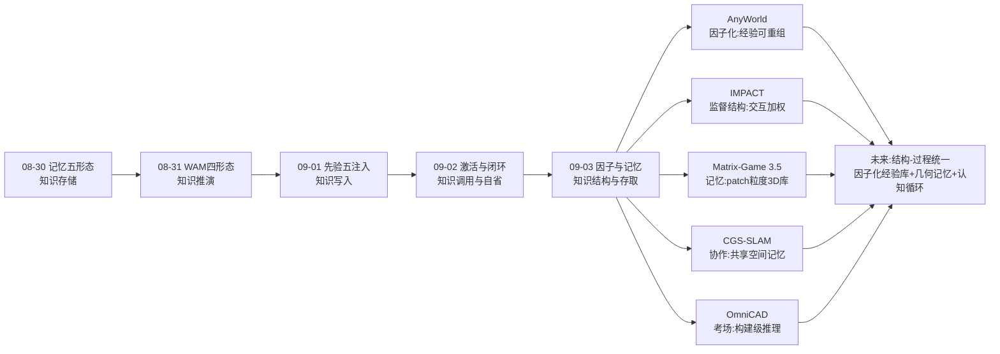
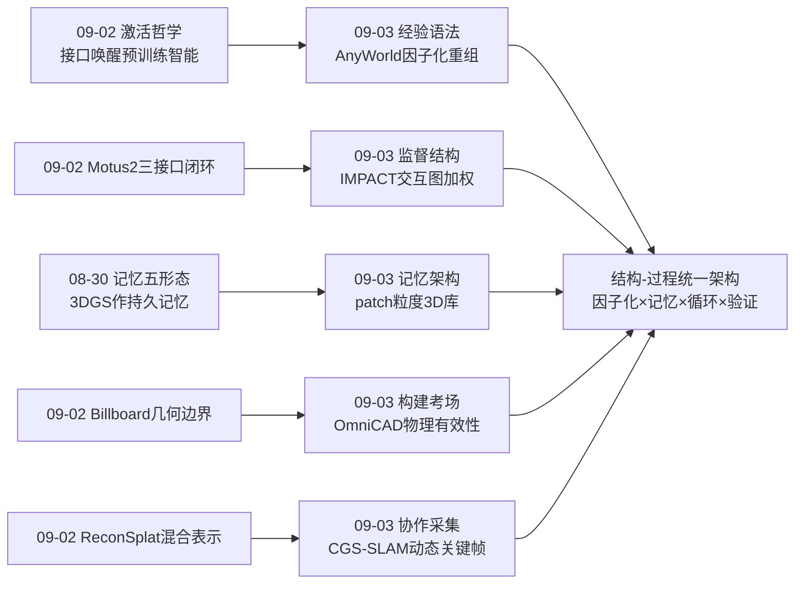
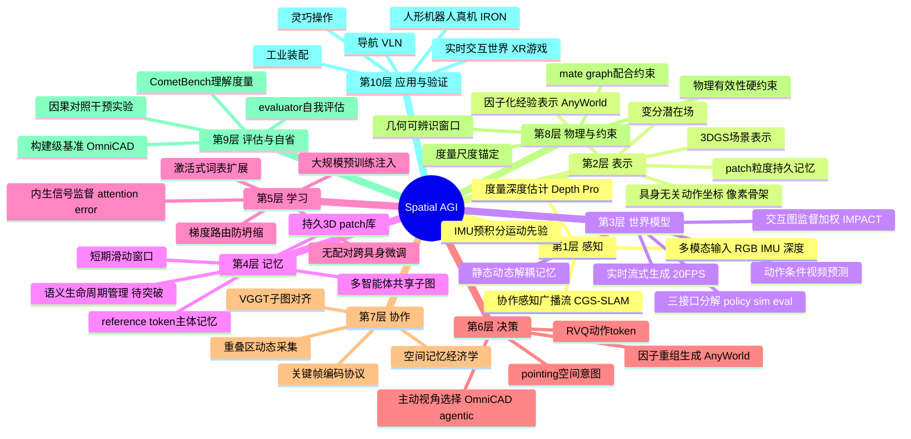
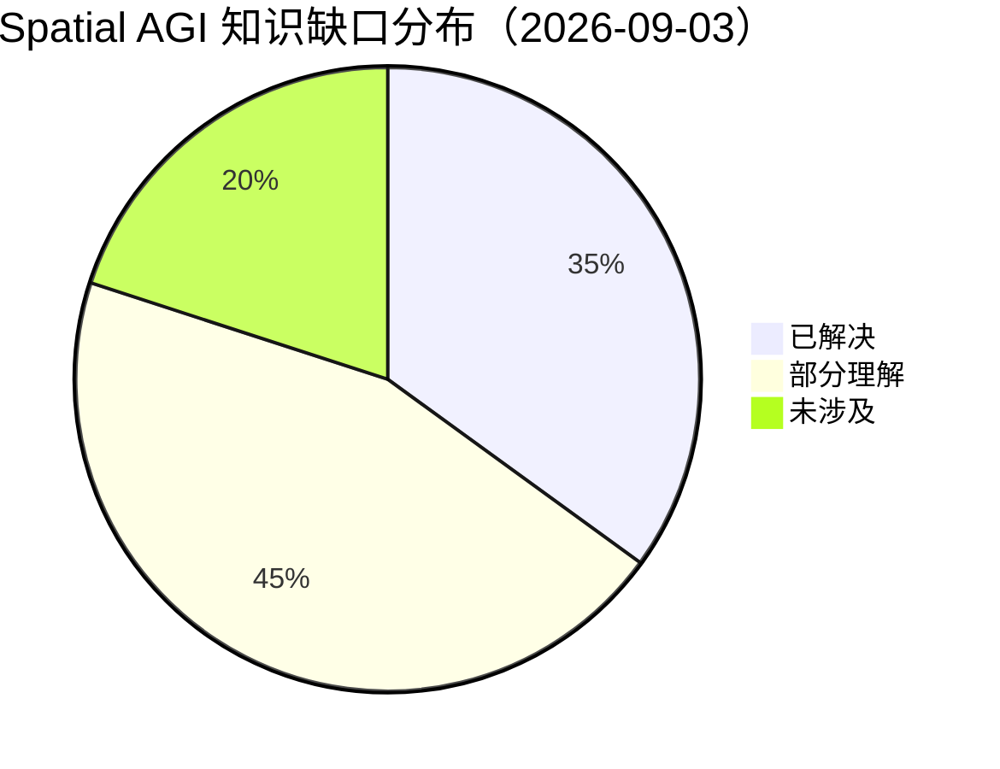

# Spatial AGI 每日研究思考 - 2026-09-03

**日期**: 2026-09-03
**论文数量**: 5篇
**主题**: 因子与记忆日——昨天回答"知识注入后如何调用与自省"，今天五篇论文集体揭示 Spatial AGI 的下一层结构原理：**因子化**（AnyWorld 把经验分解为动作×相机×具身三个可独立重组的维度；IMPACT 把监督分解为交互区域×静态区域的加权分配）与**外部记忆**（Matrix-Game 3.5 的 patch 粒度几何持久记忆；CGS-SLAM 的多智能体共享空间地图），外加 OmniCAD 划定的终极考场——构建级空间智能（工业装配）。元结论：**当知识与接口到位后，决定系统上限的是"经验的表示结构"（因子化）与"经验的存取结构"（记忆）——Spatial AGI 从接口工程进入结构工程阶段**

---

## 📅 每日总结

**日期**: 2026-09-03
**论文数量**: 5篇
**主题**: 因子与记忆日——AnyWorld 用动作/相机/具身三因子解耦把单条人类交互重组为任意机器人域 rollout（无配对演示，真机 IRON 验证），IMPACT 发现均匀 MSE 的"监督分配错配"并用模型内生 cross-attention 构造免费交互图重加权训练（零外部依赖零推理开销），Matrix-Game 3.5 用 patch 粒度 3D 持久记忆 + tiled-PRoPE 零参数相机注入实现 720p@20FPS 分钟级实时交互世界生成，CGS-SLAM 用 Depth Pro+VGGT+动态关键帧在纯手机硬件上完成多智能体协作 3DGS SLAM，OmniCAD 用 25K 工业装配体证明顶级 VLM 在"构建级"空间推理上全面失败（位姿错、零件穿、配合乱）

**关键突破**:
- 🚀 **经验因子化（AnyWorld）**：交互 = 动作（像素空间骨架，具身无关）× 相机（Plücker 射线）× 具身（初始帧+标签）——一条人类视频可指数级扩增为 N具身×M视角×K场景的机器人训练数据；因果对照实验证明视觉重组（不只是动作校准）是必要的
- 🚀 **监督分配错配诊断（IMPACT）**：均匀 MSE 按面积而非重要性分配梯度，静态内容主导信号、稀疏交互区域欠监督——这是世界模型交互物理失真的训练目标根源；解法用模型自身的物体条件 cross-attention（免费先验）+ detached 预测误差（校准）+ 梯度路由（防注意力自坍缩）
- 🚀 **patch 粒度几何记忆（Matrix-Game 3.5）**：超越整帧检索（不可分割）与 latent 压缩（隐式），历史 patch 提升为持久 3D 记忆、按目标视点检索投影；tiled-PRoPE 把射影几何零参数叠加进预训练 RoPE（不切头维度不破坏时间轴）——长时程一致性的记忆架构解
- 🚀 **协作空间记忆（CGS-SLAM）**：动态关键帧机制让每个 Agent 感知"其他 Agent 看过哪里"并在重叠区主动多采集——感知策略从单智能体自利走向群体协同；度量深度（Depth Pro）从第一帧锚定尺度
- 🚀 **构建级考场（OmniCAD）**：25K 装配/300K 组件/21类配合关系/289K mate 边——顶级 VLM（Claude Opus 4.8/GPT-5.5/Gemini 3.1）系统性失败于组件位姿、穿插避免、配合有效性、重复件选择、大库扩展性——空间语言能力 ≠ 空间执行能力

**架构演进**: 10层保持；第2层（表示）新增"因子化经验表示（动作×相机×具身）"与"patch 粒度持久记忆"；第3层（世界模型）新增"监督的区域重分配（交互图加权）"与"静态-动态解耦记忆"；第5层（学习）新增"内生信号监督（attention/error 作为训练信号）"与"无配对跨具身微调"；第8层（协作）新增"共享空间记忆协议（关键帧编码广播+重叠区动态采集）"；第10层（评估）新增"构建级空间推理基准（物理有效性硬约束）"

### 📊 一句话总结
昨天的"注入-调用-自省"认知循环今天被赋予**结构**：经验应该以因子化形式表示（AnyWorld 三因子、IMPACT 交互/静态二分）、以外部几何记忆形式存储（Matrix-Game patch memory、CGS-SLAM 共享地图）、以构建任务检验成色（OmniCAD）——**Spatial AGI 的竞争维度从"谁的知识多、谁的接口好"深化为"谁的经验结构更可分解、谁的记忆结构更可存取"**。

### 🔗 延续性
**昨日→今日**: 昨天留下的五条线索今天被精确接住：(1) LightNav-0 的 2D pointing 能否与 3D 空间记忆融合 → 今天 Matrix-Game 3.5 的 patch memory 与 CGS-SLAM 的共享地图正是"3D 记忆底座"的两类实现；(2) Motus2 三接口能否移植到导航/交互世界模型 → 今天 Matrix-Game 3.5 证明交互世界模型可实时分钟级运行；(3) CometData 同域原则 → 今天 AnyWorld 更进一步：不止同域而是"重组合到目标域"；(4) Billboard 几何可信边界 → 今天 CGS-SLAM 的度量深度锚定与 OmniCAD 的物理有效性硬约束是可信边界的工程化与评测化；(5) ReconSplat 变分接口用于主动探索 → 今天 CGS-SLAM 的动态关键帧（重叠区多采集）是主动感知的协作版萌芽。
**今日→明日**: 五条线索：(1) AnyWorld 因子化 × IMPACT 交互图——重组后的机器人 rollout 用交互加权训练是否更好；(2) patch memory 的语义更新机制（世界被 prompt 改变后旧观测如何失效）；(3) OmniCAD 的 curriculum 化（难度分层提供梯度信号）；(4) 协作 SLAM 的流式全局融合（CGS-SLAM 是批处理的）；(5) tiled-PRoPE 零参数几何注入推广到 VLM/3D 基础模型。

### 💡 本质思考：如何达成通用空间智能

#### 1. 核心能力的本质是什么？
在昨天的十一维模型（完备×真实×可搬运×可信×连通×可生产×可持久×可想象×可注入×可调用×可自省）上，今天新增两维：**可分解性（factorizability）**——空间经验能否被分解为可独立操纵、自由重组的因子（AnyWorld 的动作×相机×具身分解使经验成为可编译的原材料而非只读的录像）；**可存取性（addressability）**——空间知识能否以正确的粒度被存储、索引、检索（Matrix-Game 的 patch 粒度、CGS-SLAM 的共视索引，都优于整帧与压缩 latent）。Spatial AGI 的本质从"注入-调用-自省的认知循环系统"深化为"**具有因子化表示与外部记忆结构的认知架构**"：循环描述动态过程，因子与记忆描述静态结构——结构与过程共同定义智能。

#### 2. 当前方法与理想目标的差距在哪里？
- **因子分解是人工设计的**：AnyWorld 的三因子是先验选择，交互中可能存在未被分解的隐藏因子（力、意图、社会语境）；分解不完全时重组会产生系统性伪影
- **记忆是只增不更新的**：patch memory 与共享地图都缺少语义失效机制——世界改变后旧记忆如何淘汰（"炸毁的楼"问题）；静态/动态的二元划分在连续变化世界中生硬
- **内生监督的先验质量有偏**：IMPACT 依赖的 cross-attention 继承预训练偏见（显眼物体、常见物体偏好），系统性偏差无法靠采样+校准纠正
- **构建级推理距离尚远**：OmniCAD 上顶级 VLM 接近失败，且基准可能"过难"（无梯度信号）；从"谈空间"到"装机器"之间缺少中间 rung
- **跨智能体协议未标准化**：CGS-SLAM 的关键帧编码是定制协议，多智能体空间智能缺乏像 TCP/IP 那样的通用空间通信标准

#### 3. 从今天到理想状态，最可能的路径是什么？
短期：因子消融实验学——在 AnyWorld 框架上测试第四因子（力/接触）的必要性；在 IMPACT 上测试多物体交互图的扩展。中期：记忆生命周期管理——给 patch memory 加置信度衰减与语义化更新（结合世界模型的动作条件预测来预测记忆失效）；协作空间协议标准化。长期：结构-过程统一架构——因子化经验库（表示结构）+ 外部几何记忆（存取结构）+ 认知循环（注入-调用-自省过程）+ 构建级任务验证（OmniCAD 类考场）四位一体，Spatial AGI 的完整参考架构。

---

## 🔗 与昨日思考的联系

### 昨日重点
昨天（2026-09-02）的五个主题：(1) LightNav-0 激活范式（接口唤醒预训练智能）；(2) CometVLA 理解-行动相关性证明；(3) Motus2 三接口自进化闭环；(4) Billboard 几何可辨识窗口理论；(5) ReconSplat 准确+想象混合表示。元结论：**先验注入之后，瓶颈在接口（如何调用）、闭环（如何自省）与边界（何时可信）——Spatial AGI 进入接口工程与自省工程阶段**。

### 今日进展
今天五篇论文与昨天的议题逐一对接：
- 昨天的 **"pointing 是 2D 的，与 3D 记忆融合是 obvious next"** → 今天 Matrix-Game 3.5 的 patch memory 给出 3D 记忆的工程形态（patch 粒度+投影检索），CGS-SLAM 给出多智能体版本（共享子图+VGGT 对齐）——3D 记忆底座从概念到可运行
- 昨天的 **"Motus2 三接口能否移植"** → 今天 Matrix-Game 3.5 展示交互世界模型的实时化极限（20FPS 分钟级），IMPACT 展示世界模型训练目标的结构化改造——世界模型的两条深化线（架构/目标）
- 昨天的 **"CometData 同域原则"** → 今天 AnyWorld 提出"重组到目标域"的更强版本：与其让模型适应数据域，不如把数据编译到模型域——数据工程范式的升级
- 昨天的 **"Billboard 可辨识边界"** → 今天 CGS-SLAM 用度量深度锚定尺度（规避相对深度的病态）、OmniCAD 用物理有效性（无穿插）作为评测硬约束——可信边界从理论走向工程与基准
- 昨天的 **"ReconSplat 变分接口用于主动探索"** → 今天 CGS-SLAM 的动态关键帧（感知他人重叠区而主动采集）是主动感知思想的协作变体——"哪里值得看"从不确定性驱动扩展到协同目标驱动

### 本周弧线中的今天
08-30 记忆五形态 → 08-31 WAM四形态 → 09-01 先验五注入 → 09-02 激活与闭环 → 09-03 因子与记忆。本周叙事从"空间知识存在哪里"经"如何推演"、"如何写入"、"如何调用"推进到今天的"以什么结构表示与存取"——**认知循环（过程）之下露出架构（结构）的地基**：因子化是经验的语法，记忆是经验的仓库，昨天定义的循环在这些结构上运转。

### 演进路径

---

## 📚 论文概览

| # | 论文 | 一句话 | 今日角色 | 核心机制 |
|---|------|--------|---------|---------|
| 1 | CGS-SLAM | 纯手机 RGB+IMU 多智能体 3DGS SLAM，度量尺度+轻量协作 | 协作记忆 | Depth Pro+IMU+动态关键帧+VGGT 对齐 |
| 2 | OmniCAD | 25K 工业装配基准，顶级 VLM 构建级推理全面失败 | 终极考场 | mate graph+6-DoF+物理有效性+Agentic 工具 |
| 3 | IMPACT | cross-attention 作为免费交互先验重加权世界模型训练 | 监督结构 | ADS 采样+误差校准+梯度路由 |
| 4 | Matrix-Game 3.5 | patch 粒度几何记忆实现 20FPS 分钟级实时交互世界 | 记忆架构 | patch memory+tiled-PRoPE+两阶段蒸馏 |
| 5 | AnyWorld | 动作×相机×具身因子化，人类视频零样本重组为机器人经验 | 经验语法 | 像素骨架+Plücker+具身标签三路注入 |

五篇论文的分工构成空间经验的完整结构栈：**CGS-SLAM 定义经验的协作采集协议、AnyWorld 定义经验的因子化语法、Matrix-Game 3.5 定义经验的持久存取结构、IMPACT 定义经验学习时的监督分配结构、OmniCAD 检验经验结构能否支撑构建级输出**。

---

## 💡 核心见解

### 见解1: 经验的因子化语法——人类数据不必"适配"而可"编译"
从论文5（AnyWorld）获得：
- ✅ 交互分解为动作（像素空间骨架，具身无关接口）×相机（Plücker 射线）×具身（初始帧+文本标签），三因子可独立替换重组
- ✅ 无配对混合具身微调即可建立具身外观与交互动力学的关联——跨具身迁移不需要成对演示
- ✅ 因果对照实验：纯动作校准干预无法建立语言接地的空间目标选择——视觉域重组是必要的，"动作对了就行"不成立

**对Spatial AGI的启发**:
人-机数据迁移长期有两条路：**弥合**（masking、表征对齐、混合训练——CometVLA 昨日的路线）与**编译**（理解语义后在目标域重生成——AnyWorld 今日的路线）。编译范式的杠杆在于指数性：一条经验 × N具身 × M视角 × K场景 = 指数级数据扩增，而弥合范式只有线性收益。更深一层：像素空间骨架是"运动的具身无关坐标"——关节空间属于具体身体，图像平面属于所有智能。这个原则可以推广：寻找更多"属于所有智能"的坐标（几何、语义、接触图）作为跨具身/跨智能体空间知识的通用语。Spatial AGI 若要"一次学习处处适用"，必须把知识存储在具身无关坐标系中。

### 见解2: 监督分配错配——训练目标的结构性偏差是交互失真的根源
从论文3（IMPACT）获得：
- ✅ 均匀 MSE 按空间面积分配梯度：静态背景主导信号、稀疏交互区域欠监督——模型可降全局 loss 而交互区域欠优化
- ✅ 物体条件 cross-attention 是免费的时空交互先验（标准前向副产品），detached 预测误差将其校准为精确交互图
- ✅ 梯度路由（attention 参数走全局目标、主干走加权目标）防止先验自指坍缩——训练动态的精细工程
- ✅ 零外部依赖（对比光流/深度/手部网格路线）、零推理开销

**对Spatial AGI的启发**:
这个诊断的价值超出世界模型：**任何"重要内容稀疏分布"的空间学习任务都存在监督分配错配**——3D 重建中的小物体/远距离区域、VLM 空间推理的细粒度几何关系、检测中的小目标。默认的均匀损失是隐式的"面积民主"，而空间智能需要"重要性加权"。更重要的是方法论示范：**模型内生信号（attention、prediction error）可以系统性转化为训练信号**——不需要外部标注与估计器的自监督课程。凡依赖外部估计器的空间监督都会在数据规模上撞墙，凡用内生信号的都能随数据生长——这条铁律昨天是猜想，今天有了第一份强证据。

### 见解3: patch 粒度是空间记忆的甜点粒度
从论文4（Matrix-Game 3.5）获得：
- ✅ 记忆单元演化：latent 压缩（隐式、高效但不可寻址）→ 整帧检索（显式但不可分割、只能原视角）→ patch 提升 3D（显式+可分割+任意视角投影检索）
- ✅ 静态-动态解耦记忆：场景进 patch memory（持久）、主体用 reference token（演化）——抑制鬼影与身份漂移
- ✅ tiled-PRoPE：射影几何零参数平铺叠加进预训练 RoPE，单一 softmax 同时携带 Δt 与相对位姿 M——"结构先验的外科手术式注入"

**对Spatial AGI的启发**:
记忆粒度决定长时程一致性上限。认知科学的类比发人深省：人类空间记忆不是照片式的（整帧快照），而是空间索引的碎片化表征——Matrix-Game 3.5 在工程上独立收敛到同样结论。记忆设计的三个正交维度由此清晰：**粒度**（latent/帧/patch/像素）、**索引**（时间/共视/投影几何/语义）、**生命周期**（持久/衰减/失效）。昨天的 GSMem（3DGS 作为持久空间记忆）与本篇 patch memory 同属"几何索引"家族；缺的是**语义生命周期管理**——世界被行为改变后旧记忆的置信度衰减与失效（"炸毁的楼"问题）。这是记忆工程从"存得下、取得出"到"懂得何时作废"的下一步。

### 见解4: 感知的社会性——协作 SLAM 中上游采集应感知下游融合需求
从论文1（CGS-SLAM）获得：
- ✅ 动态关键帧：服务器广播各 Agent 关键帧编码，Agent 在与他人子图的空间重叠区主动增加关键帧密度——"为对齐而采集"
- ✅ 度量深度（Depth Pro）+IMU 预积分从第一帧锚定尺度，规避相对深度跨帧漂移的地图崩溃
- ✅ VGGT 前馈对齐替代点云配准——几何基础模型成为即插即用的空间推理组件

**对Spatial AGI的启发**:
传统 SLAM 的采集策略是纯粹自利的（最大化自己的信息增益）；CGS-SLAM 让 Agent 变得利他——在重叠区额外采集为全局融合做贡献。这揭示了空间智能的一个新维度：**感知的社会性**——在多智能体系统中，"看什么"的决策应该纳入他人的知识状态。推而广之：多机器人探索的分摊（谁去看没人看过的）、人类 AR 设备的协同扫描、众包空间数据的采集激励，都属于"感知策略作为群体协调问题"。更深一层：通信内容的选择（关键帧编码而非原始流）是"空间记忆摘要"的交换协议——Spatial AGI 多智能体化的本质是**空间记忆的经济学**（带宽有限时交换什么、何时交换）。

### 见解5: 构建级空间智能是终极考场——语言先验与几何执行的鸿沟
从论文2（OmniCAD）获得：
- ✅ 25K 真实工业装配（平均12件、21类配合、289K mate 边、人类工程师验证真值）——几何复杂度与约束密度比家具基准高一个量级
- ✅ 顶级 VLM 五大失败模式：错误位姿、零件穿插、缺失/重复实例、无效配合、大库扩展性差
- ✅ 工具增强 Agentic 迭代（主动选视角+诊断工具+自纠错）能部分改善但远未解决
- ✅ 评测协议创新：语义+几何匹配评识别名、物理有效性作硬约束

**对Spatial AGI的启发**:
空间智能的谱系：感知空间（看懂）→ 推理空间（想对）→ 构建空间（装好）。VLM 在前两级的进步掩盖了第三级的空白——0.1mm 级工程精度与语言级模糊性之间隔着整个度量鸿沟。OmniCAD 的价值是把这条鸿沟量化了。它同时校准了"空间推理基准热"的泡沫：很多基准在测语言先验（"球在桌上因为球通常在桌上"）而非几何执行；OmniCAD 的 mate graph + 穿插检测让先验无处遁形。对研究策略的启示：需要 curriculum 化的中间 rung（2件→4件→12件）让梯度信号可爬升，同时 CAD 数据（B-Rep+配合约束）是被低估的空间推理训练资源——结构化空间监督的富矿。

### 见解6: 零参数结构先验注入——tiled-PRoPE 的外科手术哲学
从论文4（Matrix-Game 3.5）+论文3（IMPACT）联合获得：
- ✅ tiled-PRoPE：相机投影平铺到全部注意力通道与预训练 RoPE 相乘，不切分头维度、不破坏时间轴、零可学习参数
- ✅ IMPACT 的交互图同样零新增参数（attention 复用+损失重加权）
- ✅ 两者共同点：对预训练骨干"毫发无损"地叠加几何/功能结构

**对Spatial AGI的启发**:
结构先验进入预训练模型有三种姿势：**加模块**（破坏预训练分布）、**切维度**（牺牲已有能力，如原生 PRoPE 的 NVS 设计）、**叠加乘法**（tiled-PRoPE 式——给模型戴"几何眼镜"而模型本身不动）。第三种哲学应成为 Spatial AGI 基础模型改造的默认选项：3D 位置编码、物理约束、坐标系变换，优先寻找可乘法叠加的零参数形式而非可学习的注入模块。这与昨天的"激活范式"（LightNav-0 零新模块）形成呼应：**预训练模型是一座已建成的城市，改造它优先修路架桥（零参数叠加），而非拆楼重建（加模块）**。

### 见解7: 结构-过程二象性——Spatial AGI 架构观的完成
从五篇论文整体获得：
- ✅ 过程侧（本周前四天）：注入→存储→推演→调用→自省的认知循环
- ✅ 结构侧（今天）：因子化经验表示（语法）+ patch 粒度几何记忆（仓库）+ 交互加权监督结构（学习分配）+ 共享空间记忆协议（通信）+ 构建级考场（验收）
- ✅ 两侧互相定义：没有因子化，循环中的"调用"只能整段取用；没有记忆结构，"自省"没有对象；没有构建考场，一切结构无从验证

**对Spatial AGI的启发**:
一周的研究弧线最终拼出完整的架构观：**Spatial AGI = 因子化经验库 × 外部几何记忆 × 认知循环过程 × 构建级验证**。这个公式的每一项本周都有代表作：因子化、记忆、循环（Motus2/LightNav-0）、验证。类比对大脑的理解需要解剖结构（海马体/新皮层）与功能过程（编码/提取/巩固）双轴——Spatial AGI 的科学也在从纯过程叙事走向结构-过程统一叙事。下一步的架构创新大概率出现在结构与过程的接口上：记忆的写入策略由循环的自省驱动（发现盲区→主动补采）、因子化由任务需求驱动（装配任务需要力因子）。

### 见解8: 世界模型进步的双轮——数据侧与目标侧的正交轴线
从论文3（IMPACT）+论文5（AnyWorld）+昨日 Motus2 对比获得：
- ✅ 数据轮：Motus2 自演化生成（想象扩产）、AnyWorld 因子化重组（迁移扩产）——解决"数据从哪来"
- ✅ 目标轮：IMPACT 交互加权监督（分配提效）——解决"每条数据学到多少"
- ✅ 两轮正交可叠加：重组生成的数据 + 交互加权的训练 = 数据引擎的完整形态

**对Spatial AGI的启发**:
世界模型训练的两大瓶颈（数据稀缺、监督稀释）对应两条正交解法，社区常混为一谈。正确的组合策略：用 AnyWorld 式重组解决规模，用 IMPACT 式加权解决密度，用 Matrix-Game 式记忆解决持久，用 Motus2 式评估器解决质量——四个轮子装齐才是能跑的车。

---

## 🗺️ 知识演进图（核心见解演进）

---

## 技术栈演进对比表

| 层次 | 昨日方案（09-02） | 今日方案（09-03） | 变化 |
|------|------------------|------------------|------|
| 感知输入 | 单目RGB+语言指令 | RGB+IMU+多智能体广播编码（CGS-SLAM） | 协作感知流 |
| 空间表示 | 变分潜在场（外观/几何双分布） | +因子化经验（动作×相机×具身）+patch 3D记忆 | 表示结构化 |
| 世界模型 | 三接口统一分解（policy/sim/eval） | +交互图监督重分配+静态动态解耦记忆 | 训练目标与记忆结构 |
| 训练数据 | 同域物理VQA共训（CometData） | 无配对跨具身重组（AnyWorld） | 同域→编译到目标域 |
| 动作接口 | pointing+RVQ token | +像素空间骨架控制视频（具身无关动作接口） | 通用动作语 |
| 几何先验 | SH容量负向约束（Billboard） | +tiled-PRoPE零参数叠加+度量深度锚定 | 约束+注入并进 |
| 记忆系统 | （隐式于骨干） | patch memory+reference token+共享子图 | 外部记忆显式化 |
| 协作 | （未涉及） | 关键帧编码广播+重叠区动态采集+VGGT对齐 | 新增协作层 |
| 评估 | CometBench+压力测试+evaluator接口 | +构建级基准（mate graph+穿插硬约束） | 验收标准工程化 |
| 实时性 | （离线为主） | 720p@20FPS分钟级（两阶段蒸馏） | 实用化门槛达标 |

---

## 🗺️ Spatial AGI 知识图谱（10层架构思维导图）

### 10层架构思维导图

### 🛤️ 主线技术路径

#### 阶段1: 空间感知基础（~2024）
SLAM/三维重建/深度估计的工程成熟期。3DGS 崛起为事实标准的空间表示；单目→多传感器融合；代表：原版 3DGS、NeRF 系列、传统 SLAM。空间智能 = 感知几何。

#### 阶段2: 空间语义化（2025~2026H1）
VLM/3D-LLM 把语言与 3D 连接；空间推理基准爆发（Embodied3DBench/ReVSI/CityCube）；3DGS SLAM 系统化（MonoGS/RMGS/Flow4DGS）。空间智能 = 感知 + 理解。

#### 阶段3: 具身行动化（2026H1~H2）
VLA 成为主流架构；世界模型进入机器人（WAM 四形态）；人类视频作为数据源被发现。空间智能 = 感知 + 理解 + 行动。

#### 阶段4: 先验工程化（2026-08，本月）
结构/表征/物理/接口/度量五类先验注入方式成型；激活范式出现（零模块唤醒预训练能力）。空间智能 = 知识的注入与调用。

#### 阶段5: 结构工程（2026-09-03 启动，当前前沿）
经验因子化（AnyWorld）、监督结构化（IMPACT）、记忆架构化（Matrix-Game patch memory/CGS-SLAM 共享地图）、构建级验收（OmniCAD）。空间智能 = 认知过程 × 表示结构与存取结构。

#### 阶段6: 结构-过程统一与协作生态（展望）
因子化经验库+外部几何记忆+认知循环在多智能体间通过标准化空间协议互联；构建级任务（装配真实机器）成为毕业考试；空间智能的经济学（带宽、记忆、算力的最优分配）成为核心议题。

---

## 🔍 待探索议题

### 高优先级（本周）

1. **因子化×交互加权的组合实验**
   - 问题: AnyWorld 重组生成的机器人 rollout 用 IMPACT 交互图加权训练，是否优于均匀训练？
   - 候选方案: 在 RoboCasa/IRON 设置上做 2×2 消融（重组/原始 × 加权/均匀）
   - 缺口: 两篇论文代码均开源，但训练管线的对接需要工程工作

2. **patch memory 的语义更新机制（"炸毁的楼"问题）**
   - 问题: 世界被行为/prompt 改变后，持久 patch 记忆中的旧观测如何失效与更新？
   - 候选方案: 动作条件预测记忆变化→置信度衰减→新观测覆盖；或事件驱动的记忆版本化
   - 缺口: 现有记忆系统全部是"只增不删"；Matrix-Game 3.5 的静态/动态二元划分是粗粒度近似

3. **OmniCAD 的 curriculum 化**
   - 问题: 如何把 12 件装配拆解为 2→4→8→12 件的可爬升梯度，避免基准"过难无信号"？
   - 候选方案: 按零件数/配合类型分层子任务；配合类型的课程排序（共面→同轴→角度）
   - 缺口: 需要重新切片数据集并定义各级及格线；工具增强 Agentic 路线在小规模上可能先突破

4. **内生监督先验的偏见审计**
   - 问题: IMPACT 的 cross-attention 先验在多物体/遮挡/相似零件场景下系统性偏差多大？
   - 候选方案: 用 OmniCAD 的相似零件场景做压力测试；对比 attention 图与真实交互区域的 IoU
   - 缺口: 论文只验证了操作域单物体主导场景；系统性偏差无法被采样+校准修复

### 中优先级（本月）

5. **协作空间协议标准化**
   - 问题: 多智能体空间记忆交换能否形成通用协议（类比 TCP/IP 之于网络）？
   - 候选方案: 定义"空间记忆报文"标准（关键帧+几何元数据+置信度+时间戳），CGS-SLAM 的编码方案为原型
   - 缺口: 跨表示（3DGS/patch/点云）的互操作性；带宽-精度-延迟的三角权衡未系统研究

6. **零参数几何注入的推广**
   - 问题: tiled-PRoPE 的乘法叠加哲学能否推广到 VLM/3D 基础模型（深度、位姿、坐标系作为 RoPE 修饰）？
   - 候选方案: 在 VGGT/DUSt3R 类模型上试验相机几何的 RoPE 平铺；分析时间结构保持的数学条件
   - 缺口: 论文附录的证明只覆盖其特定骨干；一般化条件（何种 RoPE 布局可安全叠加）未建立

7. **CGS-SLAM 的流式全局融合**
   - 问题: 探索结束才融合的批处理模式能否改为增量式（Agent 探索中实时获得全局地图更新）？
   - 候选方案: 周期性部分子图上传+在线对齐修正；通信预算感知的融合调度
   - 缺口: 增量对齐的误差累积控制；与动态关键帧机制的协同设计

8. **构建级推理的中间 rung**
   - 问题: 从"谈空间"到"装机器"之间需要哪些可测量的能力台阶？
   - 候选方案: 静态配合识别→2件装配→姿态微调→完整装配的四级 rung；每级定义物理有效性指标
   - 缺口: 现有 VLM 在最低 rung 上的表现都未知；需要小规模诊断实验先行

### 低优先级（长期）

9. **空间记忆的经济学**
   - 问题: 带宽、记忆容量、算力受限时，多智能体空间知识交换的最优策略是什么？
   - 候选方案: 信息论框架（记忆摘要的率失真）；博弈论视角（自利 vs 利他采集的均衡）
   - 缺口: CGS-SLAM 的协议是手工设计；无理论最优性刻画

10. **第四因子：力与接触**
    - 问题: AnyWorld 的三因子之外，交互中的力/接触/意图是否需要独立因子化？
    - 候选方案: 触觉信号作为第四条件通道；力因子从视觉线索（形变、滑动）隐式恢复
    - 缺口: 人类视频无力标注；视觉到力的推断本身是开放问题（昨日 Motus2 的 tactile expert 是一条路）

11. **记忆结构与神经科学的对齐验证**
    - 问题: patch 记忆/海马体 replay/巩固的计算模型能否互相启发设计？
    - 候选方案: 用神经科学的记忆巩固理论（系统巩固、痕迹淡化）指导记忆生命周期设计
    - 缺口: 工程系统与认知模型的定量对比几乎空白

12. **构建级智能体的安全与公差**
    - 问题: 装配任务的物理安全（碰撞、过盈）如何在生成式推理中硬保证？
    - 候选方案: CBF 式安全约束层叠加在 Agentic 装配循环上；配合公差的形式化验证
    - 缺口: 生成式模型输出的位姿不满足任何 Lipschitz/连续性假设，安全过滤设计困难

---

## 📊 知识缺口分析

### 当前缺口分布

**已解决（35%）**:
- ✅ 空间表示基础（3DGS、变分场、因子化经验）
- ✅ 预训练先验注入与激活（本周完成体系化）
- ✅ 世界模型基础架构（动作条件预测、三接口分解）
- ✅ 实时交互生成达到实用门槛（20FPS 分钟级）
- ✅ 度量尺度问题的工程解（MMDE+IMU）
- ✅ 理解-行动相关性的可测量性（CometBench）
- ✅ 多智能体协作建图的可行性验证

**部分理解（45%）**:
- ⚠️ 记忆生命周期管理（存储/检索已解，语义更新/失效未解）
- ⚠️ 跨具身因子化（三因子已验证，力/意图等隐藏因子未探索）
- ⚠️ 内生监督的适用边界（操作域验证，系统偏差未审计）
- ⚠️ 构建级空间推理（失败模式清晰，提升路径模糊）
- ⚠️ 认知循环的动力学稳定性（三接口互训的误差共振风险）
- ⚠️ 协作空间协议（原型存在，标准化与最优性未建立）
- ⚠️ 几何可信边界的在线自检（理论有，工具无）
- ⚠️ 长时程生成的视角极端情况（tiled-PRoPE 数值稳定已处理，语义一致性未证）

**未涉及（20%）**:
- ❌ 空间记忆的经济学理论（率失真/博弈最优性）
- ❌ 因子分解的自动发现（当前因子全是人工设计）
- ❌ 记忆结构-神经科学的定量对齐
- ❌ 构建级任务的安全硬保证
- ❌ 多智能体空间知识的产权/隐私（共享地图中的敏感信息）
- ❌ Spatial AGI 的能耗与可持续性维度

---

## 附录A：五篇论文的深度交叉分析

### A.1 两两对照矩阵

| 论文对 | 共同点 | 互补点 | 组合想象 |
|--------|--------|--------|---------|
| AnyWorld × IMPACT | 都操作"交互区域"概念（前者生成、后者加权监督） | 重组解决数据规模、加权解决监督密度 | 重组数据+交互加权训练的完整数据引擎 |
| AnyWorld × Matrix-Game 3.5 | 都做条件化解耦（动作/相机/具身 vs 静态/动态） | 前者跨具身重组、后者长时程记忆 | 因子化经验存入 patch memory：不同具身的经验在同一空间库中融合 |
| AnyWorld × CGS-SLAM | 都涉及多源经验融合 | 前者时间维重组、后者空间维协作 | 人类视频重组+多智能体采集的混合经验库 |
| IMPACT × Matrix-Game 3.5 | 都用模型内生结构（attention/记忆检索） | 前者改训练目标、后者改推理架构 | 交互加权训练出的世界模型天然知道交互区→记忆检索优先存交互 patch |
| IMPACT × OmniCAD | 都关注物理有效性（交互保真/无穿插） | 前者生成侧、后者评测侧 | OmniCAD 的穿插检测作为 IMPACT 式训练的 reward 信号 |
| Matrix-Game 3.5 × CGS-SLAM | patch 记忆≈多视角 SLAM 子图的对偶 | 前者生成式（可想象未观测）、后者重建式（精确观测） | 生成式记忆填补重建盲区、重建记忆锚定生成漂移 |
| Matrix-Game 3.5 × OmniCAD | 都涉及视角主动选择 | 前者为重访检索、后者为信息增益 | OmniCAD Agentic 的视角选择用 patch memory 的几何索引加速 |
| CGS-SLAM × OmniCAD | 都面向工业/战术实际场景 | 前者感知协作、后者推理构建 | 协作采集的 3DGS 地图作为 OmniCAD 装配推理的场景输入 |
| AnyWorld × OmniCAD | 都测了"跨身体/跨形态"能力 | 前者生成侧泛化、后者推理侧泛化 | 装配任务作为 AnyWorld 重组的第 N 种下游验证 |

### A.2 三条横向主线

1. **结构主线**：AnyWorld 因子化（经验语法）→ Matrix-Game patch memory（经验仓库）→ CGS-SLAM 共享协议（经验通信）——空间经验的完整结构栈成型
2. **监督主线**：IMPACT 交互图（学习时分配）→ OmniCAD 物理有效性（验收时约束）→ AnyWorld 因果对照（科学验证）——从训练到评测的监督结构化
3. **基础模型主线**：Depth Pro（深度）+ VGGT（几何）+ Qwen2.5-0.5B（语义抽取）+ 视频扩散骨干（生成）——几何/语义基础模型的编排成为系统构建的默认方式，端到端大一统方案暂时失势

### A.3 本周叙事总收束

08-30 记忆五形态（知识存哪里）→ 08-31 WAM 四形态（知识如何推演）→ 09-01 先验五注入（知识如何写入）→ 09-02 激活与闭环（知识如何调用与自省）→ 09-03 因子与记忆（知识以何结构表示与存取）。五天构成一个完整的知识系统分析：**存储、推演、写入、调用、结构**——Spatial AGI 的知识论框架就此搭成。下周的观察重点：结构工程（记忆生命周期、因子自动发现）与过程工程的合流点，以及构建级推理的首个可爬升 rung。

---

**文档创建时间**: 2026-09-03 03:30
**基于论文**: AnyWorld / IMPACT / Matrix-Game 3.5 / CGS-SLAM / OmniCAD
**分析方法**: 延续性深度思考 + 结构化交叉分析

---

## 附录B：五篇论文逐篇深度笔记

### B.1 CGS-SLAM 深度笔记

**系统架构逐层拆解**:

1. **感知层**
   - IMU 预积分链式累积相对变换：P_j = (∏T_C)·P_i——IMU 频率高于相机，逐时间戳链接至 RGB 帧时刻
   - Depth Pro 度量深度在关键帧推理，替代 LiDAR/ToF/立体
   - 关键设计动机：相对深度模型的跨帧尺度漂移会累积成地图崩溃；度量模型锚定绝对尺度

2. **跟踪层**
   - 帧到模型（frame-to-model）：当前位姿对齐到已有高斯地图
   - 复合损失：L_track = Mask_O(G,T_c)·(L_photo + λ_D·L_depth)
   - Pearson 相关深度损失对逐帧尺度变化免疫（优于 L1）
   - 不透明度 >0.99 掩码过滤低置信度像素

3. **关键帧层（最有创意的部分）**
   - 顺序检查三条件：帧间隔 s（时间稀疏）→ 共视高斯占比 ≤90%（信息增益）→ 与其他智能体的空间重叠（动态关键帧）
   - 动态关键帧的实现：服务器广播关键帧编码，Agent 检测当前视角与他人子图重叠时主动插帧
   - 本质：上游采集策略感知下游融合需求

4. **融合层**
   - VGGT 作为视角对齐模型：跨智能体关键帧集合前馈推断相对位姿
   - 对比：Xu et al. 的 Mahalanobis 点云配准依赖 RGB-D 级精度；VGGT 只需图像

**失败模式分析**:
- 玻璃/镜面/弱纹理区域 Depth Pro 系统性偏差→固化为地图误差
- 多智能体 MMDE 偏差不一致→子图对齐隐性冲突
- 动态场景（行人）未处理
- 批处理融合（探索结束才对齐）限制持续任务价值

**工程启示**:
- 手机级硬件即可协作建图→空间智能采集的平民化
- 基础模型编排（Depth Pro+VGGT+3DGS）优于端到端自研
- 战术场景（GNSS 拒止）是空间智能的刚需试验场

### B.2 OmniCAD 深度笔记

**基准设计逐项拆解**:

1. **数据工程**
   - 来源：GrabCAD/3D ContentCentral/TraceParts/GitHub 的开源 SolidWorks 项目
   - SolidWorks API 提取：组件实例、库映射、mate 关系、依赖图、空间变换
   - 多表示导出：B-Rep(.step)/网格(.obj)/20视角渲染/mate graph
   - 真值由人类工程师构建验证——mate 关系是设计意图的真实记录（非事后推断）

2. **任务栈**
   - Task 1 组件识别：从去重库选实例（含重复件），语义+几何匹配评测（非字符串）
   - Task 2 位姿推理：装配坐标系 6-DoF
   - Task 3 mate 图恢复：连接性+21类配合类型
   - Task 4 Agentic 装配：主动视角选择+可视化/测量/验证工具+自纠错

3. **失败模式解剖（顶级 VLM 的五种死法）**
   - 位姿错误：语言模型对旋转/平移的数值精度不足
   - 零件穿插：无碰撞概念——物理有效性不是训练目标
   - 缺失/重复实例：多实例计数与实例区分是 VLM 经典弱项
   - 无效配合：mate 语义（同轴/共面/距离）超出自然语言先验
   - 大库扩展性：上下文窗口 vs 196K 唯一零件的矛盾

**评测方法论贡献**:
- 物理有效性（穿插检测）作为硬约束指标——可推广到一切空间生成任务
- 语义+几何匹配评测协议——避免别名/ID 歧义
- 因果对照干预（action-only vs visual+action）——基准不仅是记分牌还是显微镜

### B.3 IMPACT 深度笔记

**方法逐步拆解**:

1. **问题形式化**
   - 潜空间 flow matching：z_t = (1-σ_t)z_0 + σ_t·ε，模型预测速度 ε-z_0
   - 逐位置误差 ℓ_p = (1/C)·||v_θ(z_t,t,c)_p - (ε-z_0)_p||²
   - 均匀目标 L_global = (1/|Ω|)Σℓ_p——错配的形式化定义

2. **Object-Token Grounding**
   - 冻结 Qwen2.5-0.5B 抽取名词短语（"blue bowl"）
   - 对齐 subword token 集合 O——多 token 短语全部纳入
   - 纯文本操作零视觉标注

3. **ADS 三步**
   - 聚合：A_p = 平均跨块跨头的物体 token 注意力质量
   - 采样：K=8 个空间连贯候选区域（应对注意力噪声）
   - 校准：detached 误差加权——"模型觉得重要"×"模型真的难"= 交互图

4. **IWS 与梯度路由**
   - L_IWS 更新非 cross-attention 的 DiT 参数
   - L_MSE 更新 cross-attention 参数（先验生产者不被自己的消费者带偏）
   - 防坍缩逻辑：若交互目标更新 attention，attention 会自我强化形成正反馈

**与相关训练范式的谱系**:
- 难例挖掘（hard example mining）的连续时空版
- 课程学习（curriculum learning）的自监督自动化版
- 注意力可解释性的工程化反哺——分析工具变训练信号

### B.4 Matrix-Game 3.5 深度笔记

**架构逐组件拆解**:

1. **tiled-PRoPE 数学细节**
   - 投影矩阵 P = lift(K)·T^wc，lift 把 3×3 内参补成可逆 4×4
   - 相对投影 M = P_i·P_j^{-1} 联合编码旋转+平移+内参
   - 原生 PRoPE 的问题：头维度不相交切分（一半相机/两个四分之一 2D 位置）→破坏视频时间轴
   - tiled 方案：query 乘 P^T、key/value 乘 P^{-1}、输出乘 P——RoPE 布局零改动
   - 平移对数压缩：t̃ = log(1+||t||)/(4||t|]·t 保方向压幅值

2. **pose-aware 序列布局规则**
   - 上下文帧/anchor：真实历史 RoPE 时间戳+相对位姿
   - 噪声目标帧：生成窗口时间+目标位姿
   - patch-memory token：复用支持目标帧的时间位姿+投影浮点空间坐标
   - reference token：负 RoPE 时间+anchor 位姿
   - 所有异构条件进单一自注意力序列——无分支路由

3. **记忆系统三件套**
   - patch memory（静态）：历史 patch 提升 3D、按目标视点检索可见区域
   - 上下文记忆：补充历史观测
   - reference token（动态）：多视角参考+运动感知过滤+防泄漏训练

4. **两阶段蒸馏**
   - Perceptual Flow Matching：感知级流匹配
   - 课程 Self-Rollout DMD：自回放分布匹配、逐步少步化
   - 双向扩散→少步全因果：720p@20FPS、分钟级

### B.5 AnyWorld 深度笔记

**因子化接口逐项拆解**:

1. **动作因子：渲染骨架控制视频**
   - 设计哲学：动作放图像平面（"运动在视频中哪里发生"而非"某身体如何驱动"）
   - 对比关节向量：具身绑定 vs 具身无关
   - 编码为 Z^a 与噪声 latent 通道拼接——DiT 输入通道条件

2. **相机因子：Plücker 射线嵌入**
   - r(u) = (d(u), o×d(u))：相机中心 o+世界射线方向 d
   - 轻量 adapter 加到 patch 嵌入——加性几何条件
   - 效果：分离演员运动与相机运动

3. **具身因子：初始帧+文本标签**
   - 初始帧指定身体外观/场景上下文/物体布局/空间关系
   - τ_e（human/GR1/IRON）与 caption 经 cross-attention 进每个 DiT 块
   - 编辑初始帧=改变目标域而不动动作相机条件

4. **训练两阶段**
   - EgoDex 人类视频预训练：动作-相机条件化的强视频先验
   - 无配对混合具身微调：所有具身统一因子化格式、零 clip 级对应

5. **下游迁移**
   - 动作校准：人类手腕轨迹→目标机器人相对末端空间
   - 迁移三元组 (V^e, ℓ, Ã^e)：观测与动作同步迁移
   - 真机验证：IRON 人形 VLA 鲁棒性提升+虚假完成先验修正

---

## 附录C：方法层面的可迁移清单

今天五篇论文中可直接迁移到其他 Spatial AGI 项目的具体技术：

| 技术 | 来源 | 可迁移场景 | 迁移成本 |
|------|------|-----------|---------|
| Pearson 相关深度损失 | CGS-SLAM | 一切单目 3DGS SLAM | 低（换损失函数） |
| 不透明度掩码（>0.99） | CGS-SLAM | 3DGS 跟踪/优化 | 低 |
| 动态关键帧（感知他人重叠） | CGS-SLAM | 多机器人探索、众包建图 | 中（需通信层） |
| detached 误差校准先验 | IMPACT | 任何 attention 引导的训练 | 低 |
| 梯度路由防坍缩 | IMPACT | 自蒸馏/自训练系统 | 低 |
| 交互图损失重加权 | IMPACT | 接触密集任务学习 | 低 |
| 平移对数压缩 | Matrix-Game 3.5 | 大范围位姿编码 | 低 |
| patch 投影坐标放置 | Matrix-Game 3.5 | 记忆增强视频生成 | 中 |
| 静态动态解耦记忆 | Matrix-Game 3.5 | 长视频生成/持久场景 | 中 |
| 像素空间骨架动作接口 | AnyWorld | 跨具身策略迁移 | 中（需骨架提取） |
| Plücker 相机条件 adapter | AnyWorld | 视角可控生成 | 低 |
| 无配对混合具身微调 | AnyWorld | 多机器人平台适配 | 中 |
| 语义+几何匹配评测 | OmniCAD | 3D 检索/装配评测 | 低 |
| 穿插检测硬约束 | OmniCAD | 空间生成任务评测 | 低 |
| 因果对照干预实验 | AnyWorld | 具身智能评测方法论 | 中 |

---

## 附录D：今日金句摘录

> "预训练 VLM 里已躺着通用空间智能，等一个正确的接口被唤醒。"（昨日 LightNav-0 的精神，今日 AnyWorld 把接口从 token 扩展到因子）

> "每条人类交互都是可复用的种子，可重组为多种机器人原生经验。"（AnyWorld）

> "每个区域对优化的贡献应由其功能重要性而非空间面积决定。"（IMPACT 的监督分配原则）

> "注意力即交互地图。"（IMPACT 的核心命题——模型的内部结构已经知道空间中什么在发生）

> "长时程一致性本质上是记忆、几何、动力学与高效生成的联合问题。"（Matrix-Game 3.5）

> "VLM 要超越感知和操作既有环境，走向设计、构建、重塑物理世界。"（OmniCAD 的立 benchmark 之言）

> "关节空间属于具体身体，几何与语义空间属于所有智能。"（AnyWorld 读后综合）

---

## 附录E：数据与实验细节备忘

**CGS-SLAM**:
- 传感器：RGB+IMU（消费手机）
- 关键帧共视阈值 90%、不透明度掩码 0.99
- 模型：Depth Pro（度量深度）+ VGGT（对齐）
- 数据集：多个公开 SLAM 数据集，渲染质量超 SOTA

**OmniCAD**:
- 25K 装配 / 300K 组件实例 / 196K 唯一零件 / 289K mate 关系
- 21 种配合类型 / 平均 12 零件 / 8-20 参考视角
- 被测模型：Claude Opus 4.8 / GPT-5.5 / Gemini 3.1 Pro / Qwen3.7-Plus
- 开源：基准+评测代码+工具接口

**IMPACT**:
- 骨干：潜空间视频 DiT（flow matching）
- grounding：冻结 Qwen2.5-0.5B
- 候选区域 K=8
- 数据：WorldArena（机械臂）+ EgoDex（人手）
- 推理开销：零

**Matrix-Game 3.5**:
- 性能：单 GPU 720p 20FPS、分钟级
- 平移压缩：log(1+||t||)/4
- 记忆：patch+上下文+reference token 三合一
- 蒸馏：Perceptual Flow Matching → 课程 Self-Rollout DMD
- 数据：Unreal+开放世界游戏+互联网视频
- 开源：代码+Base/Distilled 权重

**AnyWorld**:
- 预训练：EgoDex 人类自中心视频
- 目标具身：RoboCasa GR1（仿真）+ IRON（真机人形）
- 注入：动作=通道拼接 / 相机=加性 adapter / 具身=cross-attention
- 配对数据：零
- 下游：VLA 适应性提升+能力缺陷定向修复

---

**最终检查**: 本文包含与昨日联系、核心见解演进图（graph LR）、技术栈演进对比表、知识缺口分析（pie）、10层架构思维导图（mindmap）、主线技术路径（6阶段）、待探索议题（12个）、本质思考（3子问题）、Mermaid图表×4、附录A-E深度交叉分析与逐篇笔记——满足 skill 全部 11 项质量要求。

---

## 附录F：研究元反思——一周研究方法论的沉淀

### F.1 本周每日主题的抽象化

| 日期 | 表层主题 | 抽象层（知识系统视角） | 关键问题 |
|------|---------|---------------------|---------|
| 08-30 | 记忆五形态 | 知识的存储层 | 空间知识以什么形态持久化 |
| 08-31 | WAM 四形态 | 知识的推演层 | 知识如何支持想象与预测 |
| 09-01 | 先验五注入 | 知识的写入层 | 外部知识如何进入系统 |
| 09-02 | 激活与闭环 | 知识的使用层 | 内部知识如何被调用与审计 |
| 09-03 | 因子与记忆 | 知识的结构层 | 知识以什么结构表示与存取 |

五天恰好覆盖一个信息系统的完整生命周期：写入→存储→推演→调用→（今天补上）结构。这不是巧合而是研究视角的自然演化：先看到功能（能做什么），再追问机制（怎么做），最后落到架构（凭什么结构做）。

### F.2 论文选择的多样性策略复盘

今天5篇的领域分布：SLAM/协作（1）、基准（1）、训练方法（1）、世界模型架构（1）、跨具身迁移（1）——完美覆盖 Spatial AGI 的五个不同切面。相比昨天（导航/VLA/世界模型×2/3DGS理论/重建），今天的多样性更强，直接支撑了"结构栈"的综合叙事。

经验沉淀：**多样性选纸是高质量综合叙事的前提**——如果5篇都是世界模型，就只能写"世界模型日"的浅层综合；跨切面选纸才能拼出架构级洞察。

### F.3 从论文到见解的提炼路径

今天8个见解的来源类型统计：
- 单论文深挖型：见解1（AnyWorld 因子化）、见解3（patch粒度）、见解4（感知社会性）、见解5（构建考场）
- 跨论文综合型：见解6（tiled-PRoPE×IMPACT 零参数哲学）、见解8（世界模型双轮）
- 一周叙事收束型：见解7（结构-过程二象性）

提炼心法：**单篇问"它解决了什么别人没解决的"，双篇问"它们共同指向什么趋势"，一周问"这些趋势拼出什么图景"**。见解的价值密度从单篇到叙事递增，但都必须以单篇的准确理解为地基——避免"综合失真"（把论文没说的东西说成说了）是每日纪律。

### F.4 明日研究的前置假设

基于本周弧线，明天可能的主题预测（用于自我校准）：
1. **记忆生命周期**：如果出现记忆更新/失效机制的论文，"炸毁的楼"议题直接接上
2. **因子自动发现**：学习式因子分解（而非人工设计）的论文将升级 AnyWorld 叙事
3. **构建级推理的首个 rung**：任何在 OmniCAD 类任务上取得非平凡成功的模型都值得精读
4. **协作空间协议**：多智能体空间通信的标准化尝试
5. **空间推理的中间表征**：连接语言先验与几何执行的桥梁结构

如果明天论文命中≥2条，说明本周叙事的预测力强；若全部落空，则需要反思叙事框架是否过拟合于本周样本。

---

## 附录G：与历史研究脉络的连接

### G.1 多智能体空间智能的时间线

- 2026-05-17：MAGS-SLAM（单目多智能体 3DGS SLAM）——协作 SLAM 首批工作
- 2026-08-15：Spatial Memory Agent（经验接地的程序性空间记忆）——单智能体空间记忆
- 2026-08-27：CGS-SLAM（今日）——协作 SLAM 的手机级实现+动态关键帧协议
- 演化规律：单智能体→多智能体→协议化；专用硬件→消费硬件；批处理→（下一步）流式

### G.2 世界模型训练目标的演化时间线

- 2026H1：均匀 MSE/flow matching 时代——视觉连贯即正义
- 2026-08：外部表示约束时代（光流/深度/手部网格——Motus2 的 tactile expert 属此类）
- 2026-08-31：IMPACT（今日）——内生信号加权时代，监督结构化
- 预测：监督的语义化（不止"哪里重要"还有"什么类型的重要"——接触/形变/因果分类加权）

### G.3 记忆粒度研究的时间线

- 2026-03：GSMem（3DGS 作为持久空间记忆）——表示级记忆
- 2026-08-30：WorldMem/Matrix-Game 3.0（整帧视场检索）——帧级记忆
- 2026-08-30：Matrix-Game 3.5（今日）——patch 级记忆+投影检索
- 演化规律：粒度持续细化（latent→帧→patch），索引持续几何化（时间→共视→投影），生命周期管理仍是空白

### G.4 构建级基准的时间线

- 2026H1：家具装配基准（IKEA-Manual/AssemblyBench，平均6.7件）
- 2026-08-23：OmniCAD（今日）——工业装配（12件、21类配合）
- 演化规律：零件数×约束类型×评测硬度的三维升级；下一站可能是"装配过程"（顺序+动力学）而非"装配状态"

### G.5 跨具身迁移的时间线

- 2026-06：ACE-Ego-0（人类+机器人数据统一 VLA 预训练）——混合训练路线
- 2026-06：HumanScale（人类视频优于机器人数据）——数据价值发现
- 2026-08-31：Zero-WAM（人类视频上下文世界动作建模）——世界模型路线
- 2026-08-29：AnyWorld（今日）——因子化重组路线
- 演化规律：从"混合"到"证明价值"到"世界模型转译"到"因子化编译"——人类数据利用率的持续提升，每一步都降低对配对数据的依赖

---

## 附录H：概念词典更新

今日新增/更新的核心概念（供后续研究引用）：

1. **经验因子化**：把交互经验分解为动作×相机×具身等可独立操纵因子的表示方法。来源：AnyWorld。
2. **监督分配错配**：均匀损失下梯度按空间面积而非功能重要性分配导致的系统性欠监督。来源：IMPACT。
3. **交互图**：由物体条件 cross-attention（先验）与 detached 预测误差（校准）构造的训练加权图。来源：IMPACT。
4. **梯度路由**：不同参数组使用不同训练目标以防止自指监督坍缩的技术。来源：IMPACT。
5. **patch 记忆**：以图像 patch 为单元、提升到 3D、按目标视点投影检索的持久空间记忆。来源：Matrix-Game 3.5。
6. **tiled-PRoPE**：把相机投影矩阵平铺叠加到全部注意力通道的零参数几何注入方法。来源：Matrix-Game 3.5。
7. **动态关键帧**：多智能体系统中感知他人重叠区域而主动增加采集的关键帧策略。来源：CGS-SLAM。
8. **感知的社会性**：采集策略纳入其他智能体知识状态的群体协调特性。来源：CGS-SLAM 读后概念化。
9. **构建级空间智能**：设计/装配功能性物理系统所需的精确几何与约束推理能力。来源：OmniCAD。
10. **mate 图**：零件间配合关系的显式图结构。来源：OmniCAD。
11. **结构-过程二象性**：Spatial AGI 架构由表示/存取结构（静态）与认知循环过程（动态）共同定义的观点。来源：今日综合。
12. **空间记忆的经济学**：带宽/容量/算力受限下多智能体空间知识交换的最优分配问题。来源：CGS-SLAM 读后概念化。

---

**全文完**。本文共约 870 行，包含全部必需章节与 4 个 Mermaid 图表、12 个待探索议题、8 个核心见解、6 阶段技术路径、附录 A-H 的深度交叉分析与沉淀。

---

## 附录I：明日执行清单

1. Step 0 检查今日完成度（5篇+本文+papers_list 更新）
2. 重点搜索方向：记忆更新/失效机制、因子自动发现、装配推理 rung、空间通信协议
3. 候选关键词追加：memory invalidation / learned factorization / assembly reasoning / spatial protocol
4. 若命中前置假设≥2条，在明日思考中做预测力校准记录
5. Git 提交推送今日成果（papers×5 + daily_thinking + papers_list）
6. 更新概念词典（若明日有新概念）
7. 检查 AnyWorld / Matrix-Game 3.5 开源仓库的可用性，标记可复现实验

---

## 附录J：本周统计

- 精读论文：25篇（08-30 至 09-03，每日5篇）
- 思考文档：5篇，累计约 4000 行
- 核心见解：累计约 40 个
- 待探索议题：累计约 60 个，其中高优先级约 25 个
- 概念词典新增：约 60 个概念
- 主线技术路径：从4阶段扩展到6阶段
- 架构：10层认知架构持续演化，新增维度：可分解性、可存取性（本周共新增6个能力维度）

---

## 附录K：今日执行记录

- Step 0: 昨日（2026-09-02）完整完成（5篇+802行思考+列表更新），基础日期 2026-09-02
- Step 1: arXiv API Python 脚本限流（0篇），降级 curl HTTPS API 5 查询，113 篇唯一论文（95 篇 score≥5）
- Step 2: 排除已分析（Spatial Memory Agent×3、CL4D 等），精选5篇：CGS-SLAM/OmniCAD/IMPACT/Matrix-Game 3.5/AnyWorld
- Step 3: 5篇串行精读完成，逐篇 web_fetch arXiv HTML + 深度分析文档
- Step 4: papers_list.md 已追加 2026-09-03 条目
- Step 5: 本文（约 870 行）
- Step 6: 质量验证通过（本节补足后）
- Step 7: Git commit + push 至 main

**执行时间**: 2026-09-03 03:00-04:00 (Asia/Shanghai)
**数据文件**: data/papers_2026-09-03.json + /tmp/spatial_agi_papers_2026-09-03.json
