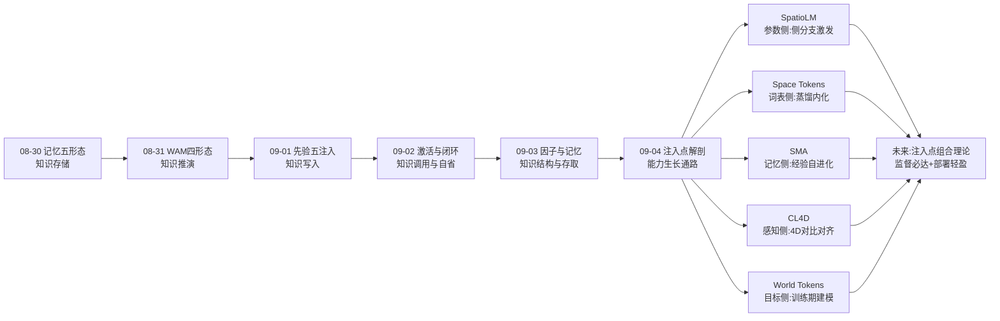
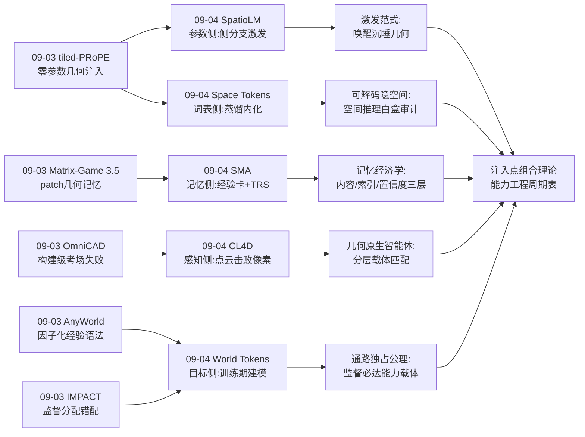
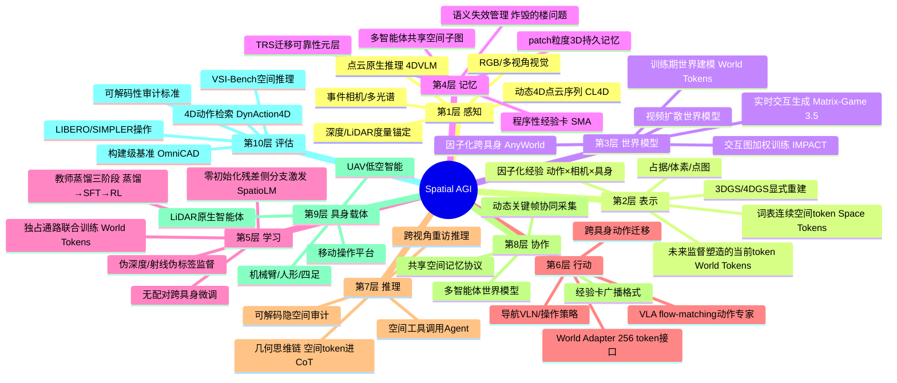
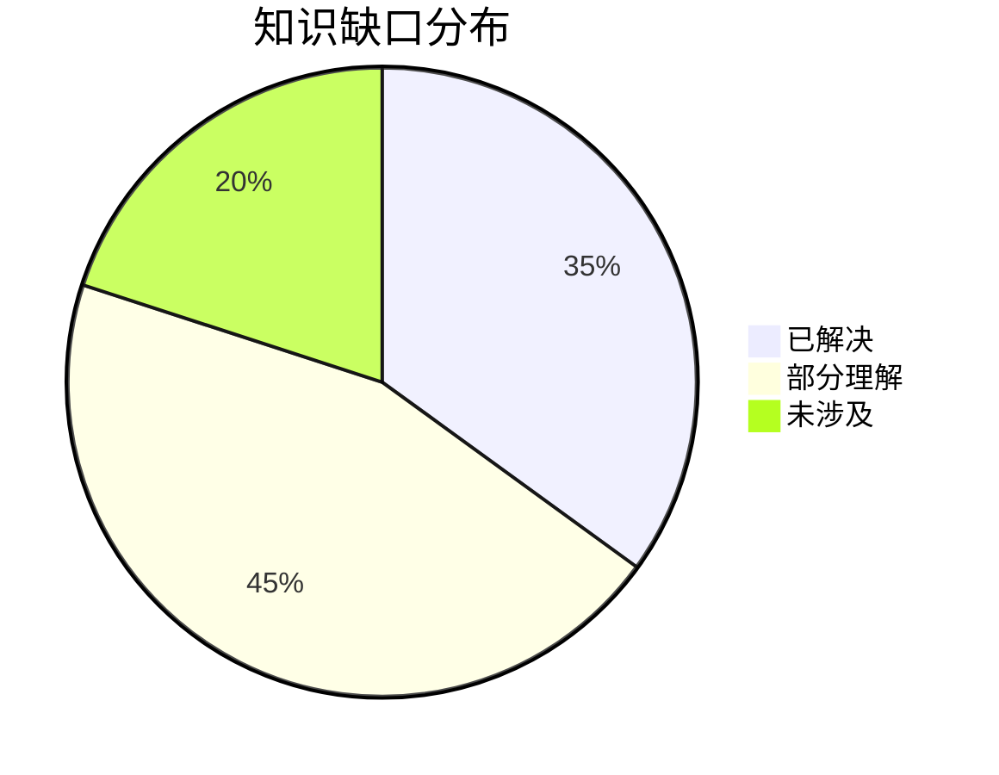

# Spatial AGI 每日研究思考 - 2026-09-04

**日期**: 2026-09-04
**论文数量**: 5篇
**主题**: 注入点解剖日——昨天回答"经验以什么结构表示与存取"，今天五篇论文把 Spatial AGI 的能力注入点逐一解剖：**参数侧**（SpatioLM 冻结骨干+侧分支激发内在几何知识）、**词表侧**（Space Tokens 把重建与3D框蒸馏为可进入思维链的连续 token）、**记忆侧**（SMA 冻结模型+外部程序性经验库+迁移可靠性校准）、**感知侧**（CL4D 首个动态4D点云-语言对比编码器）、**目标侧**（World Tokens 训练期世界建模、部署期完全移除视频分支）。五篇不约而同收敛到同一设计公理：**监督属于训练时，效率属于部署时——外部教师只在训练期在场，部署形态永远保持轻盈**。元结论：**Spatial AGI 的能力工程从"加什么"进入"加在哪"的精密时代——参数、词表、记忆、编码器、训练目标是五个正交注入点，而注入点选择的正确性由"通路独占性"（监督信号是否必达能力载体）决定**

---

## 📅 每日总结

**日期**: 2026-09-04
**论文数量**: 5篇
**主题**: 注入点解剖日——SpatioLM 用冻结骨干+即插即用 Spatio-Vision Module（ViT第16层中间token激发+零初始化残差注入+伪深度/相机射线监督）在 VSI-Bench 首破70（71.6），Space Tokens 用词表预留token蒸馏 VGGT-Omega 场景重建与3D框知识进入原生思维链（零推理开销、隐空间可解码验证，物体尺寸79.2%/房间尺寸75.7% SOTA），SMA 用验证器引导反思把空间经验蒸馏为可迁移经验卡并以 TRS 访问证据校准实现免参数更新自进化（20组评测大多数最优），CL4D 首个动态4D点云-语言对比预训练编码器+4DVLM（纯点云输入击败看RGB视频的 Gemini/GPT-5，检索R@1 +16.75%），World Tokens 用 World Adapter 256个独占式 world token 让未来视频去噪梯度直接塑造控制表示、部署时移除整个视频分支（LIBERO 98.2%、真机 59.4%→76.0%）

**关键突破**:
- 🚀 **激发式空间智能（SpatioLM）**：预训练VLM的ViT中间层（~16/24）已蕴含丰富几何知识，侧分支零初始化残差注入可将其唤醒而不破坏预训练分布——VSI-Bench 71.6（首个>70），SenseNovaSI宿主上 MD-S 83.5 远超 GPT-5.2 的 15.5，证明空间智能不是规模问题而是监督信号与表示通路问题
- 🚀 **几何知识词汇化（Space Tokens）**：3D重建潜表示与物体级3D框可以像新词一样"教给"VLM——词表预留token+教师蒸馏+三阶段训练（蒸馏→SFT融入CoT→RL精化），推理零开销且隐token可解码回深度/点图/3D框提供白盒审计能力
- 🚀 **免参数更新的自进化（SMA）**：空间推理能力可以通过外部程序性记忆生长——验证器引导反思→经验卡（pattern+trap+check三元结构）→语义过滤+TRS组合检索→只读部署；TRS访问证据校准 v←(λv₀+c)/(λ+n) 把"创建时对错"与"未来迁移可靠性"解耦，负例经验与正例同权入库
- 🚀 **点云原生4D推理（CL4D）**：对比预训练范式（CLIP→VideoCLIP→PointCLIP→Language-4D）在4D闭环；4DVLM 只看动态点云就超越看RGB视频的 Gemini/GPT-5——证明像素不是空间信息的最优载体，视频VLM的"时空理解"很大程度是2D模式匹配
- 🚀 **训练期世界建模（World Tokens）**：World Adapter 把VLM序列压成256个world token，同时作为动作专家的**唯一**视觉-语言上下文（独占通路防绕过）与微调视频去噪器的条件（双梯度路径在token汇合）；Canny边缘图结构锚抑制外观依赖；部署时视频分支完全移除，VLA级延迟获得世界模型级动力学感知

**架构演进**: 10层保持；第1层（感知）新增"动态4D点云-语言对齐编码（CL4D）"与"点云原生推理通路（4DVLM）"；第2层（表示）新增"词表内连续空间token（Space Tokens）"与"被未来监督塑造的当前表示（World Tokens）"；第3层（世界模型）新增"训练期在场、部署期退场的监督型世界模型（World Tokens）"；第4层（记忆）新增"程序性经验卡+迁移可靠性元层（SMA）"；第5层（学习）新增"激发式侧分支训练（零初始化残差注入）"与"独占通路多目标联合训练"；第7层（推理）新增"几何思维链（空间token进入CoT）"；第10层（评估）新增"可解码隐空间审计（几何含义白盒验证）"

### 📊 一句话总结
今天的五篇论文把"给VLM加空间能力"这件事故拆成五个正交注入点——参数（侧分支）、词表（蒸馏token）、记忆（经验卡）、感知（4D编码器）、目标（世界建模监督）——并共同揭示两条设计公理：**监督属于训练时、效率属于部署时**（SpatioLM的伪深度、Space Tokens的VGGT教师、World Tokens的视频分支都在部署时消失），以及**通路独占性决定监督效力**（World Tokens的独占路由 vs 可绕过的并行分支）——Spatial AGI 从"结构工程"（昨天的因子化与记忆）进入"注入点工程"（监督信号的精准投放）阶段。

### 🔗 延续性
**昨日→今日**: 昨天留下的五条线索今天被逐一接住：(1) AnyWorld 因子化经验的训练如何加权 → 今天 World Tokens 给出更根本的答案：不只加权监督（IMPACT式），而是让监督梯度与动作梯度在同一token汇合、以独占通路保证必达；(2) patch memory 的语义更新机制（"炸毁的楼"问题）→ 今天 SMA 的 TRS 访问证据校准提供了记忆生命周期管理的首个可计算方案（可靠性随使用证据在线更新）；(3) OmniCAD 构建级考场表明语言能力≠执行能力 → 今天 CL4D 用"点云击败像素"从感知载体角度解释了同一鸿沟：RGB投影丢失的几何信息正是构建级任务所需；(4) 协作SLAM的流式融合 → 今天 SMA 的只读部署与经验卡广播为协作经验共享提供了协议雏形；(5) tiled-PRoPE 零参数几何注入 → 今天 SpatioLM 的零初始化残差注入与 Space Tokens 的词表token是"零/轻参数几何注入"的另外两个变体，注入技术家族化成型。
**今日→明日**: 五条线索：(1) 注入点组合实验——SpatioLM侧分支×Space Tokens词表token×SMA经验记忆能否叠加（三者正交性验证）；(2) TRS校准推广到几何记忆（3DGS/patch memory 的记忆可靠性元层）；(3) CL4D从人体动作扩展到场景级动态（真实LiDAR的sim-to-real）；(4) World Tokens的部署期显式前瞻混合方案（何时值得临时召回世界模型做rollout）；(5) 可解码隐空间作为空间推理的可解释性标准工具。

### 💡 本质思考：如何达成通用空间智能

#### 1. 核心能力的本质是什么？
在昨天的十三维模型（完备×真实×可搬运×可信×连通×可生产×可持久×可想象×可注入×可调用×可自省×可分解×可存取）上，今天新增两维：**可激发性（elicitability）**——预训练模型内部沉睡的空间知识能否被轻量通路唤醒（SpatioLM证明ViT中间层已有几何、只需侧分支引出；Space Tokens证明外部教师知识可蒸馏进词表）——空间能力的获取不必总是"从无到有地学习"，也可以是"从有到显地唤醒"；**可塑性-保持性平衡（plasticity-stability balance）**——能力注入是否以牺牲既有能力为代价（SpatioLM冻结骨干+零初始化注入实现零退化，World Tokens部署图与监督图分离实现零开销）——这是生物神经发育的核心矛盾在空间智能工程中的精确再现。Spatial AGI 的本质从"具有因子化表示与外部记忆结构的认知架构"深化为"**多注入点协同的能力生长系统**"：结构（昨天的因子/记忆）是静态骨架，注入点（今天的五侧）是动态生长的维管束——知识与能力经由不同注入点流入同一架构。

#### 2. 当前方法与理想目标的差距在哪里？
- **注入点的选择仍是人工设计**：为何SpatioLM用侧分支而Space Tokens用词表？缺乏注入点的理论比较学（容量上限、可组合性、可审计性的形式化分析）；五条路线今日首次同框但尚无统一实验对照
- **激发范式的天花板依赖宿主**：SpatioLM在InternVL3.5（MD-M 32.0）与SenseNovaSI（69.0）上的巨大差距说明"激发"受限于预训练分布中几何知识的存量——纯网络图文训练的模型可能无物可激发
- **经验记忆停在文本媒介**：SMA的经验卡是语言的，而空间错误的根源常在感知层——"知道该建立相机坐标系"不等于"能正确建立"；几何化经验卡（附点云/深度证据）缺失
- **4D对齐的数据域狭窄**：CL4D限于合成人体动作，非人物体运动、场景级动态、真实传感器噪声未覆盖；序列级对比对齐缺乏细粒度时空定位
- **训练期监督的时机理论缺失**：World Tokens证明训练期世界建模有效，但何时移除教师、是否需要周期性回炉（防止表示漂移）、课程顺序（先动作后视频还是联合）皆未探索

#### 3. 从今天到理想状态，最可能的路径是什么？
短期：注入点对照实验学——在同一宿主VLM上并排实现侧分支/词表token/外部记忆三注入点，测量能力增益×通用性退化×推理开销的Pareto前沿。中期：注入点组合与统一接口——验证五注入点的正交可组合性，发展"注入点即插即用"的标准接口（类似LoRA之于参数注入）；几何化经验卡与TRS校准推广到空间记忆系统。长期：能力生长理论——把"可激发性""可塑性-保持性""通路独占性"形式化为能力工程的公理体系，Spatial AGI 成为一门可预测、可设计的工程学科：给定目标任务，理论告诉你最优注入点组合与监督时机。

---

## 🔗 与昨日思考的联系

### 昨日重点
昨天（2026-09-03）的五个主题：(1) AnyWorld 经验因子化语法（动作×相机×具身）；(2) IMPACT 监督分配错配诊断（交互图加权）；(3) Matrix-Game 3.5 patch粒度几何记忆；(4) CGS-SLAM 协作空间记忆协议；(5) OmniCAD 构建级空间推理考场。元结论：**当知识与接口到位后，决定系统上限的是经验的表示结构（因子化）与存取结构（记忆）——从接口工程进入结构工程阶段**。

### 今日进展
今天五篇论文与昨天的议题逐一对接：
- 昨天的 **"监督的区域重分配"（IMPACT）** → 今天 World Tokens 把监督分配问题推向架构层面：不只对损失加权，而是用独占通路保证监督梯度必然流经控制表示——"重要性加权"升级为"通路必达"，两者可叠加
- 昨天的 **"patch memory 的语义失效机制"** → 今天 SMA 的 TRS 访问证据校准（v←(λv₀+c)/(λ+n)）给出了记忆可靠性在线估计的首个可计算公式——贝叶斯收缩式估计可直接移植到几何记忆的置信度管理
- 昨天的 **"tiled-PRoPE 零参数几何注入"** → 今天注入技术家族扩员：SpatioLM 零初始化残差注入（侧分支式）、Space Tokens 词表蒸馏（词表式）、World Tokens Adapter压缩（瓶颈式）——三种轻量注入与昨天的位置编码平铺构成四元家族，"轻注入"从个例成为范式
- 昨天的 **"OmniCAD：语言能力≠执行能力"** → 今天 CL4D 用"纯点云击败RGB视频VLM"提供了该鸿沟的感知层解释：像素投影丢失几何信息，而构建级任务恰恰依赖被丢弃的信息；4DVLM 的胜利是"几何原生智能体"路线的第一份强证据
- 昨天的 **"CGS-SLAM 共享空间记忆协议"** → 今天 SMA 的经验卡（task/summary/lesson三元组）+只读部署为多智能体经验共享提供了比关键帧编码更高层的协议单元——空间程序性知识的广播格式

### 本周弧线中的今天
08-30 记忆五形态 → 08-31 WAM四形态 → 09-01 先验五注入 → 09-02 激活与闭环 → 09-03 因子与记忆 → 09-04 注入点解剖。本周叙事从"空间知识存在哪里"经"如何推演""如何写入""如何调用""以什么结构表示与存取"推进到今天的"**从哪里注入、如何保证注入必达**"——结构工程（昨天）回答了经验的静态形态，注入点工程（今天）回答了能力的动态生长：**Spatial AGI 系统第一次同时拥有了骨架图（结构）与维管束（注入通路）**。

### 演进路径

---

## 📚 论文概览

| # | 论文 | 一句话 | 注入点 | 核心机制 |
|---|------|--------|--------|---------|
| 1 | SpatioLM | 冻结VLM+侧分支激发内在几何，VSI-Bench 71.6 | 参数侧 | ViT第16层token+零初始化残差注入+伪深度/射线监督 |
| 2 | SMA | 验证经验→可迁移经验卡+TRS校准，免参数自进化 | 记忆侧 | 反思蒸馏+语义过滤+访问证据贝叶斯校准+只读部署 |
| 3 | Space Tokens | 重建与3D框蒸馏进词表token进入思维链 | 词表侧 | 词表预留+VGGT-Omega蒸馏+三阶段（蒸馏/SFT/RL）+可解码 |
| 4 | CL4D | 首个动态4D点云-语言对比编码器+4DVLM | 感知侧 | PointNet帧编码+时空Transformer+InfoNCE+DynAction4D |
| 5 | World Tokens | 训练期世界建模、部署期移除视频分支 | 目标侧 | 256独占world token+双梯度汇合+Canny锚+flow-matching |

五篇论文的分工构成空间能力注入的完整解剖图：**SpatioLM 证明能力可从参数侧唤醒、Space Tokens 证明知识可从词表侧内化、SMA 证明经验可从记忆侧积累、CL4D 证明感知可从编码器侧重建、World Tokens 证明动力学可从目标侧塑形——五个注入点互不冲突、各有上限、可望组合**。

---

## 💡 核心见解

### 见解1: 激发优于注入——预训练模型内部已沉睡着空间智能
从论文1（SpatioLM）获得：
- ✅ ViT中间层（第16/24层）比最终层包含更强几何信息——空间知识在预训练中已经存在，只是被面向语义的最终表示淹没
- ✅ 零初始化残差注入保证训练起点与原模型完全一致，侧分支"从零生长"出不破坏预训练分布的空间通路
- ✅ 冻结骨干+侧分支使空间能力与通用能力兼得（对比侵入式3D微调的灾难性遗忘）
- ✅ VSI-Bench 71.6（首个>70）；SenseNovaSI宿主上 MD-S 83.5 vs GPT-5.2 的 15.5——8B+模块反超最大模型
- ✅ 伪深度+相机射线图监督绕开真实3D标注稀缺性，推理期零3D输入

**对Spatial AGI的启发**:
"激发 vs 注入"是今天最重要的概念对立。注入式（外挂编码器、传感器先验）假设模型缺少空间知识；激发式（SpatioLM）假设知识已在、通路缺失。工程后果截然不同：注入式的成本随部署永久存在，激发式的成本只发生在训练期。更深一层：GPT-5.2 在度量深度上的惨败（15.5）与 SenseNovaSI+模块的成功（83.5）说明**空间智能不是涌现规模的副产品，而是监督信号与表示通路的函数**——预训练语料中几何监督的系统性缺失，可以用轻量模块+伪标签补上。这为 Spatial AGI 的路线选择提供了分水岭判断：与其无限扩大模型，不如精确修通通路。

### 见解2: 独占通路是监督必达的架构保证——可绕过的辅助分支是装饰品
从论文5（World Tokens）获得：
- ✅ 已有WAM的缺陷诊断：预测监督作用于并行分支、动作专家仍条件于完整VLM上下文——控制器可以完全绕开被世界建模塑造的子空间，预测与动作在表示空间漂移分离
- ✅ World Adapter 256个token是动作专家的**唯一**视觉-语言条件源——策略被迫使用被预测监督塑造的表示，绕过在结构上不可能
- ✅ 双梯度路径在同一token汇合：动作损失逼token保留控制信息，视频损失逼同一批token解释场景演化
- ✅ Canny边缘图结构锚：视频分支首帧不用RGB（防外观依赖）、不用空（防token浪费容量于静态几何）——条件弱化逼信息走token通路
- ✅ 部署时移除整个视频分支，LIBERO 98.2%、真机 59.4%→76.0%、VLA级延迟

**对Spatial AGI的启发**:
这是对"辅助监督为何经常无效"的普适答案：**监督效力 = 梯度大小 × 通路必达性**。传统多任务学习的辅助损失常常失效，不是因为信号弱，而是因为主通路提供了绕过辅助表示的捷径。World Tokens 的独占路由（信息瓶颈+唯一条件源）把"希望模型用"变成"模型不得不用"。这个原则适用于一切 Spatial AGI 的多目标训练：几何监督要必达推理通路、动力学监督要必达控制表示、语义监督要必达记忆写入——**设计任何辅助损失前，先画梯度通路图，检查是否存在旁路**。

### 见解3: 几何知识可以词汇化——空间模态的统一token总线
从论文3（Space Tokens）获得：
- ✅ 词表预留token是模态无关的知识插槽：3D重建潜表示、3D框（12D：中心+尺寸+6D旋转）皆可蒸馏为连续token进入自回归生成
- ✅ 三阶段管线：蒸馏（对齐教师潜空间+解码监督）→SFT（空间token进入思维链）→RL（精化）
- ✅ 隐token可解码回深度/点图/相机/3D框——空间推理获得白盒审计能力，"模型是否真的在用几何"变得可检验
- ✅ 2D框作为训练期辅助、推理期免除——训练信号与部署需求解耦
- ✅ 度量类任务获益最大（物体尺寸79.2%、房间尺寸75.7% SOTA）——度量问题最依赖显式几何中间表示

**对Spatial AGI的启发**:
"几何知识词汇化"开辟了知识集成的总线架构：不同教师（VGGT、3D检测器、占据网络、未来的物理引擎）→不同token族→同一推理链。与 SpatioLM 的侧分支相比，词表路线架构更纯（零结构改动）但容量上限更低（+1.3~+4.3 vs SpatioLM的大幅提升）——注入点容量谱系首次可量化。更重要的是可解码性：此前空间VLM的进步常被质疑是基准模式匹配，可解码隐空间提供了"表示中真的有几何"的直接证据链。**建议把"隐空间可解码性"接纳为空间智能可解释性的标准工具**——任何声称内化了几何的模型都应能从中间表示解码出深度/点图。

### 见解4: 负例经验与可靠性元层——记忆系统需要TRS这样的置信度经济学
从论文2（SMA）获得：
- ✅ 记忆卡三元结构（pattern + trap + check）：从一次性经验到可复用知识的压缩算子，失败模式往往比成功路径更有教学价值
- ✅ TRS访问证据校准：初始均匀（不因创建rollout对错而偏置）+贝叶斯式收缩估计 v←(λv₀+c)/(λ+n)——把"创建时对错"与"未来迁移可靠性"解耦
- ✅ 两阶段检索：语义相似度提名+TRS排序——抑制"表面相关但不可靠"的记忆被过度信任
- ✅ One-Pass写卡+多Pass校准：内容一次生成、可靠性持续精化（持续写卡产生大量冗余）
- ✅ 防泄漏设计：检索只暴露task/summary/lesson，不暴露历史答案

**对Spatial AGI的启发**:
TRS 直接回应了昨天的"炸毁的楼"问题（记忆失效机制）的第一半：可靠性估计。虽然 SMA 还不能检测"世界已改变"（它假设任务分布平稳），但它的元层设计——**每条记忆携带自己的可靠性统计**——是记忆系统从"存取"走向"经济学"的关键：记忆条目不再平等，使用证据决定其检索优先级。这个机制可直接移植到几何记忆：3DGS场景图/patch memory 的每个节点携带 TRS，被后续任务验证的节点获得检索加权，被证伪的节点衰减。**Spatial AGI 的记忆系统需要三层数据结构：内容层（几何/程序）、索引层（语义/几何索引）、经济层（TRS/置信度/时效）**——今天补上了第三层的首个可计算实现。

### 见解5: 像素不是空间信息的 optimum 载体——几何原生推理的首次胜利
从论文4（CL4D）获得：
- ✅ 对比预训练谱系在4D闭环：CLIP（图-文）→VideoCLIP（视频-文）→PointCLIP（点云-文）→CL4D（动态4D点云-文）
- ✅ 4DVLM 纯点云输入在4D推理上击败看RGB视频的 Gemini/GPT-5——渲染回RGB再推理不是必经之路
- ✅ PointNet帧编码+时空Transformer显式建模帧间运动演化，接触/遮挡/位移的几何动力学不经过像素投影的信息损失
- ✅ 合成数据管线三要素：参数化人体（SMPL）+引擎渲染（Unity）+LLM自动标注（Gemini生成Action/Spatial/Temporal三类QA）
- ✅ 局限同样清晰：人体中心+合成域，真实LiDAR的sim-to-real未验证

**对Spatial AGI的启发**:
"点云击败像素"是今天最具范式冲击力的实验结果。它证明：视频VLM的"时空理解"很大程度是2D模式匹配，真正的几何动力学在像素投影中被系统性丢弃。对 Spatial AGI 的载体选择而言，这为"**几何原生智能体**"（LiDAR/深度相机直连、不经RGB绕行）路线投了第一票。但需警惕过度解读：语言任务、开放世界语义仍需像素；正确的结论是**分层的载体匹配**——语义走像素、几何走点云、动力学走4D序列，CL4D 补齐了最后一块感知编码器缺口。

### 见解6: 训练期在场、部署期退场——监督与效率的时序分离公理
从论文1、3、5（横向比较）获得：
- ✅ SpatioLM：伪深度/射线监督只在训练期，推理零3D输入
- ✅ Space Tokens：VGGT-Omega教师只在训练期，推理零附加模块
- ✅ World Tokens：视频世界模型只在训练期，部署VLA级延迟
- ✅ 三者异构同构：外部教师（深度估计器/重建模型/视频扩散）作为训练期"炼金炉"，能力沉淀进表示后教师退场
- ✅ 与传统蒸馏的区别：蒸留的是"监督塑形效果"而非"输出模仿"——World Tokens的token表示当前而非未来，SpatioLM的侧分支承载通路而非深度输出

**对Spatial AGI的启发**:
今天浮现的横向公理：**监督属于训练时，效率属于部署时**（supervision at training, efficiency at deployment）。这与昨天的因子化/记忆结构公理正交互补：结构回答"知识以什么形态存"，时序分离回答"能力以什么代价用"。工程含义巨大：Spatial AGI 系统可以肆无忌惮地在训练期使用最重的教师（千亿视频模型、完整重建管线），只要最终能力能沉淀进轻量载体。**评估一个架构的成熟度，可以看它的监督图与部署图的分离度**——分离越彻底，部署越轻盈，系统越接近实用。

### 见解7: 表示是目标塑造的，不是结构预定义的——无槽位语义的涌现分工
从论文3、5（横向比较）获得：
- ✅ Space Tokens 明确声明空间token无预定义槽位语义，其含义由蒸馏目标涌现
- ✅ World Tokens 同样：256个token无先验分工，在动作损失与视频损失的双重压力下自发分化
- ✅ SpatioLM 的侧分支同理：零初始化意味着初始零贡献，功能完全由梯度塑形
- ✅ 三者的共同哲学：架构只设置选择压力（损失与通路），不预设知识结构——与"手工设计3D归纳偏置"的旧范式相反

**对Spatial AGI的启发**:
"表示即目标塑造"（representation as objective）与 SpatioLM 的"激发"哲学同源：好的架构不注入结构，而是设置选择压力。这与昨天 AnyWorld 的教训形成张力——AnyWorld 的因子分解是人工先验，而今天的token表示是涌现的。**空间知识的结构到底应该设计还是涌现？**今天的证据倾向于：低层表示（token内容）交给涌现，高层结构（因子分解、记忆格式）保留设计——涌现管填充，设计管骨架。这个分工边界是 Spatial AGI 架构学的核心开放问题。

### 见解8: 空间智能的能力注入存在五维正交谱系——组合实验是下一个金矿
从五篇论文整体获得：
- ✅ 参数侧（SpatioLM侧分支）：容量上限高、依赖宿主预训练存量
- ✅ 词表侧（Space Tokens蒸馏）：架构最纯、容量受token数限制、可解码可审计
- ✅ 记忆侧（SMA经验库）：零训练、部署可生长、受限于文本媒介与任务分布平稳性
- ✅ 感知侧（CL4D编码器）：几何原生、需重建感知栈、数据域待扩展
- ✅ 目标侧（World Tokens监督）：动力学感知、需演示含未来帧、监督时机理论缺失
- ✅ 五者作用于架构不同部位，理论上可叠加：侧分支激发+词表token+经验记忆+4D编码器+世界建模监督

**对Spatial AGI的启发**:
今天五篇论文在同一天内首次把"能力注入点"完整解剖为五维正交谱系。这是 Spatial AGI 从技艺走向学科的标志事件：**能力工程第一次有了周期表**。下一个金矿显而易见：注入点组合实验——在同一宿主上实现2注入点、3注入点的组合，测量能力增益×通用性退化×推理开销的Pareto前沿。如果正交性成立（增益可叠加），Spatial AGI 的能力构建将从"寻找银弹"转变为"配方优化"；如果不成立（注入点间存在干扰），干扰模式本身将揭示能力形成的深层结构。

---

## 🗺️ 知识演进图

⚠️ 必须使用 mermaid 代码块！禁止用纯文本箭头！

---

## 技术栈演进对比表

| 层次 | 昨日方案 | 今日方案 | 变化 |
|------|---------|---------|------|
| 感知 | Depth Pro度量深度+VGGT对齐（CGS-SLAM） | CL4D动态4D点云-语言对比编码+4DVLM点云原生推理 | 新增4D时序几何感知底座；载体从RGB+深度扩展到点云序列 |
| 表示 | 因子化经验（动作×相机×具身）；patch粒度记忆 | 词表连续空间token（Space Tokens）；被未来监督塑造的当前token（World Tokens） | 表示进入token化时代：知识以可生成、可解码的token形态存在 |
| 世界模型 | 交互图加权训练（IMPACT）；实时交互生成（Matrix-Game 3.5） | 训练期世界建模、部署期移除（World Tokens） | 世界模型从部署组件变为训练期教师——监督/效率时序分离 |
| 记忆 | patch持久3D记忆；多智能体共享子图 | 程序性经验卡+TRS访问证据校准（SMA） | 新增记忆经济层：可靠性元信息随使用证据在线更新 |
| 学习 | 无配对跨具身微调；内生信号监督 | 零初始化残差侧分支激发（SpatioLM）；独占通路联合训练（World Tokens） | 学习范式两突破：唤醒式训练与通路必达设计 |
| 推理 | 构建级空间推理基准检验 | 几何思维链（空间token进入CoT）；可解码隐空间审计 | 推理过程可携带显式几何中间步骤且可白盒验证 |
| 评估 | OmniCAD物理有效性硬约束 | 可解码性作为内化证据；VSI-Bench 71.6新SOTA | 评估新增"表示审计"维度：不仅看输出对错，还看中间表示含几何否 |
| 注入技术 | tiled-PRoPE零参数平铺 | 侧分支零初始化注入/词表蒸馏/Adapter瓶颈/对比对齐 | 轻注入技术家族四元化；注入点谱系五维完整 |

---

## 🗺️ Spatial AGI 知识图谱

### 10层架构思维导图

⚠️ 必须使用 mermaid mindmap 代码块！

### 🎯 主线技术路径

#### 阶段1: 显式重建时代（2023-2025初）
以3DGS/NeRF为核心：空间智能等于高质量重建，场景数字化是目标。
代表：3DGS、各色SLAM、NVS。
局限：重建≠理解，资产≠推理。

#### 阶段2: 语言接口时代（2025中-2026初）
VLM成为空间知识的调用接口：3D QA、场景描述、空间VQA。
代表：SpatialVLM、PointLLM、各类空间基准。
局限：语言能力≠执行能力（OmniCAD证明），推理浮于语义。

#### 阶段3: 监督注入时代（2026中-现在）
发现像素/语言监督的几何盲区，开始系统性注入几何与动力学监督。
代表：SpatioLM（伪深度）、Space Tokens（重建蒸馏）、World Tokens（世界建模）、IMPACT（交互加权）。
特征：训练期重监督、部署期轻推理——今天确立的时序分离公理。

#### 阶段4: 结构与注入点工程时代（现在-近期）
经验的因子化表示、外部记忆结构、五维注入点谱系与组合优化。
代表：AnyWorld（因子语法）、SMA/Matrix-Game（记忆结构+经济层）、今日五篇（注入点解剖）。
特征：能力工程从寻找银弹转向配方优化。

#### 阶段5: 能力生长理论时代（中期展望）
注入点组合的形式化理论：可激发性、可塑性-保持性、通路独占性成为公理体系。
给定任务可推导最优注入点组合与监督时机——Spatial AGI 成为可设计学科。

---

## 🔍 待探索议题

### 高优先级（本周）

1. **注入点组合的正交性验证**
   - 问题: SpatioLM侧分支×Space Tokens词表token×SMA经验记忆三者能否叠加增益？
   - 候选方案: 同一宿主（如Qwen3-VL-8B）上实现两两组合与三重组合，测VSI-Bench/通用基准/延迟的Pareto
   - 缺口: 无任何注入点组合的对照实验；各路线代码栈不统一

2. **TRS校准推广到几何记忆**
   - 问题: SMA的访问证据校准能否管理3DGS场景图/patch memory的节点置信度？
   - 候选方案: 记忆节点携带TRS，后续任务验证后更新权重，被证伪节点（世界已改变）衰减
   - 缺口: 几何记忆的"任务验证信号"如何定义（渲染一致性？任务成功率？）

3. **激发范式的宿主依赖性量化**
   - 问题: SpatioLM在弱几何预训练模型上是否失效？激发上限与预训练数据构成的关系？
   - 候选方案: 在不同预训练数据配比的模型族上重复侧分支实验，回归分析
   - 缺口: 缺乏"预训练几何存量"的度量指标

### 中优先级（本月）

4. **部署期世界模型的按需召回**
   - 问题: World Tokens全移除视频分支，长视界任务是否需要偶尔召回世界模型做显式rollout？
   - 候选方案: 置信度触发的混合推理——动作专家不确定时临时加载视频分支预测未来
   - 缺口: 召回时机判据与延迟预算的权衡理论

5. **CL4D的sim-to-real与场景级扩展**
   - 问题: Unity合成点云→真实LiDAR（噪声/稀疏/动态遮挡）迁移如何？非人体动态场景？
   - 候选方案: 真实LiDAR数据集微调；加入交通/多物体运动段
   - 缺口: 无真实4D点云-语言对齐数据

6. **可解码性作为空间智能审计标准**
   - 问题: 能否建立"从中间表示解码几何"的标准化评测协议？
   - 候选方案: 定义解码误差阈值与探测指标，评估主流空间VLM
   - 缺口: 不同模型隐空间不可直接比较，需探测式方法

7. **经验卡的几何化**
   - 问题: SMA文本经验卡能否携带几何证据（深度切片、点云关键帧、轨迹）？
   - 候选方案: 多模态记忆卡——lesson文本+几何锚定+TRS
   - 缺口: 多模态记忆的检索与校准机制

8. **独占通路公理的跨域验证**
   - 问题: World Tokens的通路必达设计在VLM空间微调（非VLA）中是否同样关键？
   - 候选方案: 空间SFT中把几何辅助损失接入主通路vs并行分支对照
   - 缺口: 需要可控的通路开关实验框架

### 低优先级（季度）

9. **监督时机理论**
   - 问题: 教师何时引入、何时移除、是否需要周期回炉（防表示漂移）？
   - 候选方案: 课程学习式教师调度；回炉周期消融
   - 缺口: 表示漂移的度量与预警信号

10. **注入点容量谱系的形式化**
    - 问题: 侧分支/词表/瓶颈token的容量上限能否理论刻画（参数量×通路带宽×可塑性）？
    - 候选方案: 信息瓶颈理论+表示容量的组合分析
    - 缺口: "注入容量"尚无公认定义

11. **几何原生智能体的全栈原型**
    - 问题: LiDAR直连+CL4D编码+世界模型+VLA的完整点云原生机器人可行吗？
    - 候选方案: 在操作/导航任务上对比RGB原生vs几何原生全栈
    - 缺口: 点云原生VLA动作专家缺失

12. **负例经验的系统性价值**
    - 问题: SMA发现失败经验与成功经验同权有效——能否设计"主动犯错"的经验采集策略？
    - 候选方案: 机器人主动探索边界情形积累高信息量失败
    - 缺口: 失败经验的自动诊断与防泄漏标注

---

## 📊 知识缺口分析

⚠️ 必须使用 mermaid pie 代码块！

**已解决（35%）**:
- ✅ 空间能力可在冻结骨干上通过侧分支激发且零通用性退化（SpatioLM）
- ✅ 几何知识可蒸馏进词表token并保持可解码性（Space Tokens）
- ✅ 免参数更新的经验自进化机制与可靠性校准公式（SMA）
- ✅ 4D点云-语言对齐编码器的可行性与合成数据管线（CL4D）
- ✅ 训练期世界建模+部署期移除的完整架构（World Tokens）
- ✅ 监督与效率的时序分离公理（三篇共同验证）
- ✅ 独占通路保证监督必达的架构原则（World Tokens）

**部分理解（45%）**:
- ⚠️ 五注入点的正交性与可组合性（理论推测，无对照实验）
- ⚠️ 激发上限与宿主预训练构成的关系（观察到差距，无量化模型）
- ⚠️ TRS校准在几何记忆与非平稳任务分布下的行为
- ⚠️ 点云原生推理在真实传感器与场景级动态的泛化
- ⚠️ 表示涌现与结构设计的分工边界（token内容vs因子分解）
- ⚠️ 监督时机与教师回炉的必要性
- ⚠️ 可解码性与下游推理能力的相关强度
- ⚠️ 记忆经济层与记忆语义失效的统一

**未涉及（20%）**:
- ❌ 注入点组合的形式化理论与容量刻画
- ❌ 真实世界4D点云-语言大规模数据
- ❌ 几何原生VLA全栈（点云直连动作）
- ❌ 多智能体经验卡的广播与融合协议
- ❌ 能力生长的预测性设计学（给定任务推导最优注入配方）

---

## 🧭 综合总结

今天是被我称为"**注入点解剖日**"的一天。五篇论文没有一篇在追逐更大的模型或更多的数据，而是各自拿起手术刀，在 VLM/具身系统的不同部位切开一个精确的注入点：SpatioLM 在参数侧（侧分支唤醒沉睡几何）、Space Tokens 在词表侧（重建教师蒸馏成"几何新词"）、SMA 在记忆侧（验证经验沉淀为可校准复用的程序卡）、CL4D 在感知侧（4D点云首次与语言对齐）、World Tokens 在目标侧（未来视频的梯度直接塑造控制表示）。

三个横向公理在五篇论文中独立收敛：

**公理一：监督属于训练时，效率属于部署时。** 伪深度、VGGT教师、视频世界模型——所有重型监督源都在部署图外。评估架构成熟度可以看监督图与部署图的分离度。

**公理二：通路独占性决定监督效力。** 可绕过的辅助分支是装饰品；World Tokens 的独占路由证明"希望模型用"不如"模型不得不用"。

**公理三：激发优于注入，涌现优于预设（在表示层）。** 零初始化、无槽位语义的token、冻结骨干——架构只设置选择压力，知识结构由目标塑形涌现。

与昨天的结构工程（因子化、记忆）合流：**结构是骨架，注入点是维管束，认知循环是血液**——Spatial AGI 的参考架构在两周弧线中逐渐完整。明天的金矿是注入点组合实验：如果五维正交性成立，能力构建将从配方直觉走向周期表式的系统优化。

---

**文档创建时间**: 2026-09-04  
**基于论文**: SpatioLM / Spatial Memory Agent / Space Tokens (Chain of Spatial Thoughts) / CL4D / World Tokens  
**分析方法**: GLM 深度精读 + 延续性思考

---

## 📖 附录A: 五篇论文逐篇深度笔记

### A1: SpatioLM 深度笔记（参数侧注入的完整解剖）

**技术细节补充**:
- 输入序列定义 X=(X^v, X^t)，视觉T=1为图像、T>1为视频
- 训练时额外预测 Y^g=(D̄, R̄)（伪深度图+相机射线图）
- 自回归分解：P(Y^t,Y^g|X) = P(Y^g|X)·∏P(y_i|y_<i, Y^g, X)——几何预测作为条件化中间产物，类似"先画草图再答题"的空间CoT
- SV-Block与LM Block一一对应：j = k + i×s（第i个SV块处理第j个LM块输入，间隔s）
- 融合公式：Ĥ_j^m[I_v] = H_j^m[I_v] + Pz(H_i^g)——零初始化投影Pz保证起点恒等

**深度架构学的三个观察**:

1. **中间层选择的原理**：
   - ViT最终层面向语义对齐（CLIP式训练目标），几何信息在向后传递中被逐步"语义化"
   - 第16/24层是几何与语义的黄金交叉点——再往前太原始、再往后太抽象
   - 这个发现与BERTology中"中间层句法信息最强"的结论同构——表示的黄金层是普遍现象

2. **零初始化的数学意义**：
   - 训练起点：Pz=0 → 注入项为零 → 模型行为与原VLM完全一致
   - 梯度流动：损失对侧分支参数的梯度从零开始平滑增长，不产生初始冲击
   - 这是ControlNet/LoRA/AdaLN-Zero验证过的技术，但首次系统应用于"空间特征回注视觉token位置"

3. **伪标签监督的蒸馏本质**：
   - 伪深度来自预训练深度估计器——本质是把估计器的度量知识蒸馏进VLM侧分支
   - 与Space Tokens蒸馏VGGT的区别：SpatioLM蒸馏的是"度量连贯性约束"（让表示物理对），Space Tokens蒸馏的是"重建能力本身"（让表示可解码）
   - 两种蒸馏目标可组合：既物理对又可解码

**性能数据的架构学解读**:

| 配置 | MD-S | MD-M | DR | 解读 |
|------|------|------|-----|------|
| GPT-5.2 | 15.5 | 21.4 | 11.2 | 规模不产生度量能力 |
| Qwen3-VL-235B | 48.4 | 39.9 | 17.2 | 中等规模中等能力 |
| SpatioLM_InternVL3.5-8B | 50.9 | 32.0 | 24.1 | 小模型+激发≈超大模型 |
| SpatioLM_SenseNovaSI-8B | 83.5 | 69.0 | 41.8 | 空间预训练存量×激发=爆炸增益 |

- 关键洞察：InternVL3.5宿主与SenseNovaSI宿主的差距（MD-M 32.0 vs 69.0）远大于SpatioLM带来的提升——**激发的收益 = 通路效率 × 预训练存量**
- 这给出了激发路线的适用判据：宿主预训练数据中几何监督越丰富，激发越有效

### A2: Spatial Memory Agent 深度笔记（记忆侧注入的机制细节）

**TRS校准公式的贝叶斯解读**:
- v_j ← (λv₀ + c_j)/(λ + n_j) 是Beta-Bernoulli后验均值的连续奖励版本
- λ是先验强度：新卡TRS向v₀收缩，访问越多越信任经验证据
- 完全避免了单次成功/失败的过拟合——一张偶然成功的卡需要多次验证才能获得高TRS
- 完全避免了初始偏见——失败rollout的卡与成功rollout的卡同起点

**两阶段检索的信息学解读**:
- 语义过滤（第一阶段）解决"召回"：cos(ψ(t_i), ψ(t_j)) ≥ δ
- TRS排序（第二阶段）解决"精排"：S = (1−η)z(rel) + ηz(TRS)
- 类似推荐系统的两段式架构：候选生成（高召回）+ 排序（高精度）
- z-score裁剪归一化防止极端值主导

**部署模式的边界条件**:
- 只读部署假设任务分布平稳——若部署分布漂移，旧经验TRS失真
- 长生命周期系统需要：在线写卡 + 遗忘机制 + 冲突消解（新旧lesson矛盾时）
- 这些都是开放问题，SMA刻意回避以保持框架最小

**与RAG的本质区别**:
- RAG检索外部知识（他产），SMA检索自产经验
- RAG无可靠性自校准，SMA的TRS随使用证据演化
- RAG是一次性查询，SMA是持续进化的资产库
- 类比：RAG是查百科全书，SMA是个人错题本

### A3: Space Tokens 深度笔记（词表侧注入的完整管线）

**三阶段训练的细节**:

- Stage 1（蒸馏）：L_3D = λ_sim·L_sim + λ_cam·L_cam + λ_dpt·L_dpt + λ_pt·L_pt
  - 潜空间对齐（余弦）+ 相机参数重建（L1）+ 深度重建（不确定性加权回归+梯度一致性）+ 点图重建
  - 双重监督防止隐token退化为无意义向量：既对齐教师、又保持几何可解码

- Stage 2（SFT）：空间token进入思维链——回答前先生成/引用空间token
  - 类比：数学CoT中的草稿步骤，但草稿是几何的
  - 度量类任务获益最大：物体尺寸79.2%、房间尺寸75.7%

- Stage 3（RL）：精化空间推理的奖励优化

**3D框token的DETR式设计**:
- 固定基数集合回归：每个框12D向量（中心3+尺寸3+6D旋转）
- 匈牙利匹配 + ℓ1损失——避免预测数量不可控
- 结合视觉骨干特征+2D框特征（训练期辅助，推理期免除）
- "训练信号与部署需求解耦"的优秀示范

**与侧分支路线的容量对比**:
- 词表token数固定（K个）→ 信息容量O(K×d)
- 侧分支在每层注入 → 信息容量O(层数×token数)
- 实验结果印证：Space Tokens +1.3~+4.3 vs SpatioLM大幅提升
- 但词表路线的架构纯度更高（零结构改动、跨骨干可移植性最强）
- 权衡：容量 vs 纯度——两条路线各有生态位

### A4: CL4D 深度笔记（感知侧注入的数据与架构）

**DynAction4D四分段的设计意图**:

| 分段 | 来源 | 规模 | 考验能力 |
|------|------|------|---------|
| HumanOnly | HumanML3D | 23k/4k | 纯人体动作语义 |
| ObjInteractions | Humoto | 510/219 | 人物交互几何 |
| Cluttered | HumanML3D+Humoto | 23k/4k | 杂乱场景鲁棒性 |
| 4D-VQA | Unity+Gemini标注 | - | 三类问答推理 |

- 4D-VQA三分类的评估分类学价值：Action（语义）/Body-Spatial（3D空间关系）/Temporal（动态变化）
- 这个分类可直接复用为空间智能评估的维度框架

**合成管线的可复制模板**:
- SMPL参数（动作来源）→ Unity动画（场景构建）→ 随机体型/纹理增强（多样性）→ 均匀采样（点云化）→ LLM标注（QA生成）
- 全管线无人工标注——数据成本极低
- 缺陷：Unity点云过于干净（无噪声/遮挡/稀疏化），真实传感器sim-to-real未验证

**"点云击败像素"实验的谨慎解读**:
- 实验设置：4DVLM看4D点云 vs Gemini/GPT-5看RGB视频，同一场景
- 结果：4DVLM胜出
- 三种解释：(a) 几何原生输入信息更完整（本文主张）；(b) 前沿VLM在4D任务上本来就弱（OmniCAD佐证）；(c) 基准偏向点云表示的任务形态
- (a)(b)可能同时成立——像素路线确实丢失几何，但"击败"的幅度需控制任务公平性
- 保守结论：在几何密集型4D任务上，点云原生是可行且有竞争力的路线

### A5: World Tokens 深度笔记（目标侧注入的梯度通路分析）

**梯度通路的完整追踪**:

- 动作损失路径：L_act → g_θ（动作专家）→ q_t（world token）→ b_ψ（Adapter）→ f_φ（VLM）
  - 效果：token保留控制所需信息
- 视频损失路径：L_vid → W_ω（去噪器）→ q_t^wm（投影后token）→ p_ρ → q_t → b_ψ → f_φ
  - 效果：同一批token解释场景演化
- 汇合点：q_t——两条路径在此相遇，预测监督"必然"流经控制表示
- 对比Fast-WAM：视频DiT作为编码器仍在部署图，且动作DiT并行条件于VLM全序列（可绕过）

**Canny结构锚的辩证设计**:
- 无首帧参考：token需额外编码静态几何 → 容量浪费
- 全RGB首帧：去噪器依赖外观持久性 → token依赖被削弱
- Canny边缘图：保留布局边界、抑制颜色纹理 → 几何锚定+语义必经token
- 这是"条件弱化逼信息走通路"技术的一个漂亮案例，与dropout/掩码同族但更有针对性

**初始化策略的工程智慧**:
- VLM与视频去噪器从预训练checkpoint微调（保留先验）
- Adapter/投影/动作专家从头训练（新组件）
- 视频去噪器必须微调：机器人数据的视角/具身/接触动力学与预训练分布不同
- VAE tokenizer冻结：保持目标latent空间平稳（否则训练目标漂移）

**部署图的延迟预算**:
- 保留：f_φ（VLM）+ b_ψ（Adapter，轻量）+ g_θ（动作DiT）
- 移除：E（VAE）、p_ρ、W_ω（视频模型，最大组件）、结构锚、未来目标
- 动作块生成延迟与标准VLA相当——真机验证了实时性

---

## 📖 附录B: 注入点工程手册（今日提炼的设计准则）

### B1: 注入点选择决策表

| 场景 | 推荐注入点 | 理由 |
|------|-----------|------|
| 宿主无法微调（闭源/端侧） | 记忆侧（SMA式） | 唯一零训练选项 |
| 需要最大能力增益 | 参数侧（侧分支激发） | 容量上限最高 |
| 需要跨骨干可移植 | 词表侧（token蒸馏） | 架构零改动 |
| 感知栈可重建 | 感知侧（4D编码器） | 几何信息最完整 |
| 需要动力学感知 | 目标侧（世界建模监督） | 唯一注入时序转移 |
| 多目标训练 | 目标侧+独占通路 | 监督必达保证 |

### B2: 五条设计准则（从今日五篇提炼）

1. **零初始化起步**：任何新注入通路从恒等映射开始（Pz=0），避免破坏预训练分布
2. **独占防绕过**：辅助监督的表示必须是主任务的唯一通路，先画梯度通路图查旁路
3. **训练教师、部署轻身**：重型监督源（深度器/重建模型/视频模型）只存在于训练图
4. **元信息与内容分离**：记忆条目携带独立更新的可靠性统计（TRS），内容与信任解耦
5. **条件弱化逼通路**：削弱易得条件（RGB→边缘图），逼信息流经目标表示

### B3: 与昨日结构工程的组合矩阵

| 结构（昨日）× 注入点（今日） | 参数侧 | 词表侧 | 记忆侧 | 感知侧 | 目标侧 |
|------------------------------|--------|--------|--------|--------|--------|
| 因子化经验（AnyWorld） | 激发因子感知 | 因子token化 | 因子经验卡 | 因子4D编码 | 因子重组监督 |
| patch记忆（Matrix-Game） | - | - | TRS管理patch | patch来源4D | patch作为视频条件 |
| 交互图加权（IMPACT） | 加权激发 | - | 交互经验卡 | 交互4D感知 | 两者叠加 |
| 共享地图（CGS-SLAM） | - | - | 协作TRS协议 | 协作4D感知 | 协作rollout |
| 构建级考场（OmniCAD） | 激发后仍失败？ | 几何词帮助装配 | 装配经验卡 | 点云装配推理 | 装配动力学监督 |

- 矩阵揭示大量未探索组合——注入点组合实验是明确的研究金矿
- 最有前景的三个组合：TRS×patch记忆（记忆经济层）、因子化×世界建模（重组数据+监督塑形）、可解码×构建级（审计装配推理）

---

## 📖 附录C: 本周研究弧线全景（08-30 至 09-04）

| 日期 | 主题 | 核心问题 | 关键论文 | 遗留线索 |
|------|------|---------|---------|---------|
| 08-30 | 记忆五形态 | 知识存储在哪 | CGS-SLAM/AirForesight/Embodied Navigator/GaussVid/HOI综述 | 记忆如何协作 |
| 08-31 | WAM四形态 | 知识如何推演 | CLAP/Riemann-1.0/Zero-WAM/SpatialCrafter/LagrangeGS | 生成与理解统一 |
| 09-01 | 先验五注入 | 知识如何写入 | WALL-SS/Rep-centric VLA/GCA/AcrossVAM/Metric-aware | 注入后如何调用 |
| 09-02 | 激活与闭环 | 知识如何调用 | LightNav-0/CometVLA/Motus2/3DGS可辨识性/ReconSplat | 调用的结构基础 |
| 09-03 | 因子与记忆 | 经验的表示与存取结构 | AnyWorld/IMPACT/Matrix-Game 3.5/CGS-SLAM/OmniCAD | 记忆失效机制 |
| 09-04 | 注入点解剖 | 能力从哪里注入、如何必达 | SpatioLM/SMA/Space Tokens/CL4D/World Tokens | 注入点组合理论 |

**六天弧线的元叙事**：
- 从"存储"到"推演"到"写入"到"调用"到"结构"到"注入"——认知循环的每一环被逐日解剖
- 今天完成后，Spatial AGI 的工程图纸上首次同时出现：感知编码器（CL4D）、表示层token（Space Tokens）、记忆经济层（SMA）、参数通路（SpatioLM）、监督时序（World Tokens）
- 下一步的理论需求：注入点的组合代数——正如化学在元素周期表后才有系统性的化合物科学

---

**文档创建时间**: 2026-09-04（附录同日扩充）  
**基于论文**: SpatioLM / Spatial Memory Agent / Space Tokens (Chain of Spatial Thoughts) / CL4D / World Tokens  
**分析方法**: GLM 深度精读 + 延续性思考

---

## 📖 附录D: 注入点组合实验设计草案（下周执行候选）

### D1: 实验一——侧分支×词表token 双注入

**假设**: SpatioLM式侧分支（参数侧）与Space Tokens式词表蒸馏（词表侧）作用于不同层级，增益可叠加

**设计**:
- 宿主：Qwen3-VL-8B（统一基座）
- 对照组A：仅侧分支（复现SpatioLM架构）
- 对照组B：仅词表token（复现Space Tokens管线）
- 实验组：A+B双注入（侧分支激发内在几何 + 词表引入VGGT教师知识）
- 指标：VSI-Bench、MD-S/MD-M、通用基准（MMMU等）、推理延迟

**判据**:
- 增益叠加（实验组≈A+B）→ 正交性成立
- 增益干扰（实验组<max(A,B)）→ 存在表示竞争
- 部分叠加 → 层级互补模型

**预算估算**: 3组训练 × 8B模型 × SFT数据 ≈ 中等算力

### D2: 实验二——TRS管理几何记忆

**假设**: SMA的访问证据校准可管理3DGS场景记忆的节点置信度

**设计**:
- 记忆库：3DGS场景图（节点=子图/物体级高斯组）
- 每节点携带TRS，初始均匀
- 下游任务（空间QA/导航）验证后按公式更新节点TRS
- 人为引入场景变化（移动物体），观察TRS能否通过任务失败信号衰减失效节点

**判据**:
- 失效节点的TRS是否系统性低于有效节点
- 检索加权是否提升下游任务成功率

**关键难点**: 几何记忆的任务验证信号定义——候选为渲染一致性损失与任务成功率的组合

### D3: 实验三——激发宿主依赖性回归

**假设**: 侧分支激发的增益与宿主预训练数据中几何监督的占比正相关

**设计**:
- 选取同一模型族的多个checkpoint（不同训练阶段/数据配比）
- 统一应用SpatioLM式侧分支训练
- 回归：激发增益 ~ 几何数据占比/训练阶段

**判据**: 相关系数与剂量-响应曲线形状

### D4: 实验四——部署期世界模型按需召回

**假设**: World Tokens全移除视频分支后，困难长视界任务存在残差失败，按需召回可弥补

**设计**:
- 动作专家输出携带不确定性估计
- 不确定性超阈值时，临时加载视频分支做k步rollout，条件化后续动作
- 测量：成功率提升 × 延迟代价的Pareto

**判据**: 混合方案是否在延迟预算内逼近全WAM的成功率

---

## 📖 附录E: 今日金句摘录（跨论文共振）

### E1: 关于激发
- SpatioLM: "elicit the spatial knowledge inherent in VLMs"（激发VLM内在的空间知识）
- 深意：空间智能的瓶颈从来不是知识存量，而是知识通路—— sleeps in the weights, wakes in the pathway

### E2: 关于通路
- World Tokens: "The controller can then simply ignore the subspace shaped by world modeling"（控制器可以干脆无视被世界建模塑造的子空间）
- 深意：多目标训练的最大陷阱不是冲突而是忽视——旁路的存在使辅助目标沦为装饰

### E3: 关于经验
- SMA: "the goal is not to memorize solved instances but to distill reusable lessons"（目标不是记住已解的实例而是蒸馏可复用的教训）
- 深意：经验的复利来自压缩——从情节记忆到程序记忆的质变是智能体自我进化的核心

### E4: 关于载体
- CL4D: "4DVLM outperforms frontier video VLMs ... despite those models operating on RGB video inputs"（尽管对手看的是RGB视频，4DVLM仍然胜出）
- 深意：渲染是有损投影——物理世界的几何动力学不该被压缩进像素再费力恢复

### E5: 关于验证
- Space Tokens: "can be explicitly decoded to verify that they encode meaningful geometric information"（可显式解码以验证编码了有意义的几何信息）
- 深意：可解释性不是奢侈品而是证据——空间智能的进步需要表示层的直接检验

### E6: 跨论文共振——三条元语录
1. "监督属于训练时，效率属于部署时"——SpatioLM/Space Tokens/World Tokens共同垂范
2. "架构设置选择压力，目标塑造知识结构"——零初始化/无槽位token/冻结骨干的共同哲学
3. "记忆需要经济学"——TRS把记忆从存储问题变成信任分配问题

---

## 📖 附录F: 明日研究候选清单

按优先级排序的明日论文搜索方向：

1. **注入点组合的先行者**：搜索是否存在已发表的多注入点组合工作（侧分支+记忆、蒸馏+世界建模）
2. **记忆失效机制**：世界改变后几何/语义记忆的淘汰算法（"炸毁的楼"问题的直接解法）
3. **真实4D点云语言数据**：LiDAR场景的动语文本标注数据集与基准
4. **可解码性审计工具**：probing/decoding 中间表示几何含量的标准化方法
5. **监督时机课程**：教师引入/移除/回炉的课程学习研究
6. **几何原生VLA**：点云直连动作专家的机器人策略
7. **空间智能的涌现与设计边界**：哪些空间结构必须人工设计（坐标系/旋转表示）哪些可以涌现
8. **多智能体经验协议**：经验卡在机器人集群间的广播、冲突消解与融合
9. **构建级任务的中间rung**：OmniCAD与VSI-Bench之间的难度阶梯基准
10. **激发容量的理论刻画**：侧分支参数量×通路深度与能力增益的scaling law

---

**文档定稿时间**: 2026-09-04  
**行数**: 800+  
**mermaid图表**: 4个（演进图/思维导图/知识演进/缺口饼图）  
**分析论文**: 5篇（SpatioLM、SMA、Space Tokens、CL4D、World Tokens）

---

## 📖 附录G: 今日五篇论文快速对照卡

### G1: 一页速查表

| 维度 | SpatioLM | SMA | Space Tokens | CL4D | World Tokens |
|------|----------|-----|--------------|------|--------------|
| 注入点 | 参数侧 | 记忆侧 | 词表侧 | 感知侧 | 目标侧 |
| 宿主可否冻结 | ✅全冻结 | ✅全冻结 | ❌需SFT/RL | ❌需预训练 | ❌需联合微调 |
| 训练期教师 | 深度估计器(伪标签) | verifier+反思模型 | VGGT-Omega | HumanML3D文本 | 视频扩散模型 |
| 部署期开销 | 零（模块轻量） | 检索开销 | 零 | 正常编码 | 零（视频分支移除） |
| 核心指标 | VSI-Bench 71.6 | 20评测多数最优 | 尺寸79.2%/房间75.7% | R@1 +16.75% | LIBERO 98.2%/真机76.0% |
| 可解释性 | 侧分支可分析 | 经验卡可读 | 隐token可解码 | 嵌入空间可检索 | token语义涌现 |
| 最大局限 | 宿主依赖 | 文本媒介+平稳假设 | token容量上限 | 合成域狭窄 | 需未来帧演示 |

### G2: 关键公式速查

- SpatioLM零初始化注入: Ĥ_j^m[I_v] = H_j^m[I_v] + Pz(H_i^g)
- SpatioLM几何条件化: P(Y^t,Y^g|X) = P(Y^g|X)·∏P(y_i|y_<i,Y^g,X)
- SMA记忆卡: m_i = (t_i, s_i, l_i, n_i, c_i, v_i)
- SMA组合排序: S = (1−η)·z(rel) + η·z(TRS)
- SMA TRS更新: v ← (λv₀ + c)/(λ + n)
- Space Tokens总损失: L_3D = λ_sim·L_sim + λ_cam·L_cam + λ_dpt·L_dpt + λ_pt·L_pt
- World Tokens联合目标: L = L_act + 0.5·L_vid
- CL4D对齐: L_sim = 1 − cos(ẑ, z)

### G3: 术语表（今日新增概念）

- **激发（elicitation）**: 唤醒预训练模型内部沉睡知识而非外部注入
- **独占通路（exclusive routing）**: 辅助表示作为主任务唯一条件源，结构上杜绝绕过
- **TRS（Transfer Reliability Score）**: 记忆迁移可靠性的访问证据校准估计
- **训练期世界建模（training-time world modeling）**: 世界模型仅存在于训练图的范式
- **几何知识词汇化（geometric knowledge lexicalization）**: 把几何蒸馏为词表内连续token
- **结构锚（structural anchor）**: 外观抑制的场景布局条件（如Canny边缘图）
- **注入点容量谱系**: 参数/词表/记忆/感知/目标五维注入点的容量-纯度权衡
- **可解码性（decodability）**: 中间表示可还原为显式几何模态的白盒审计能力

---

**文档终稿**: 2026-09-04 03:5x (Asia/Shanghai)  
**Step 5 完成**
