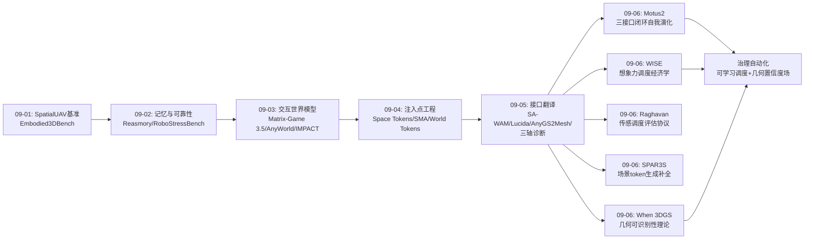
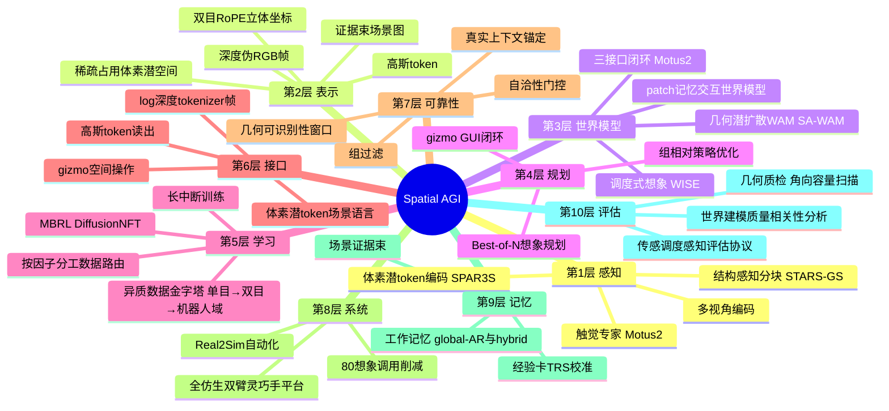
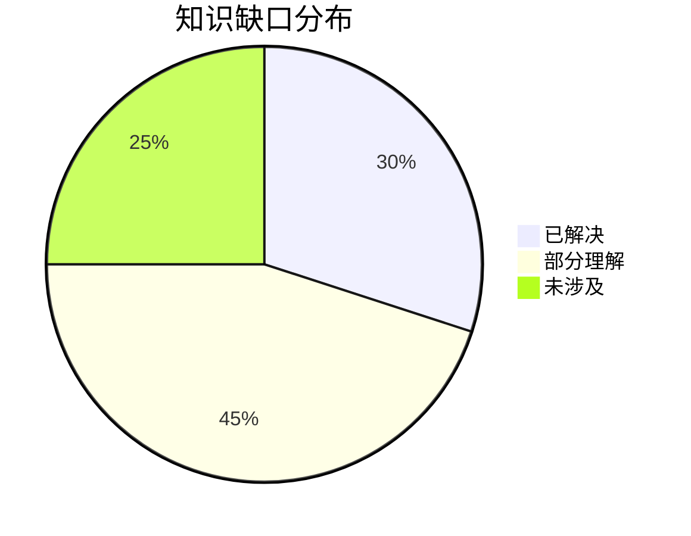
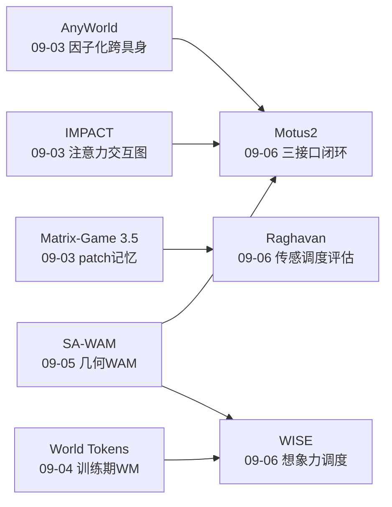
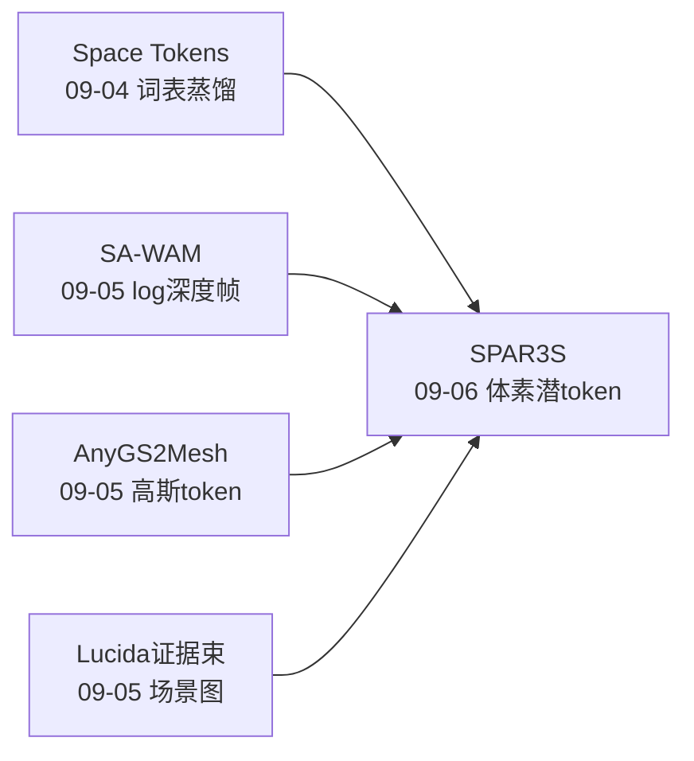
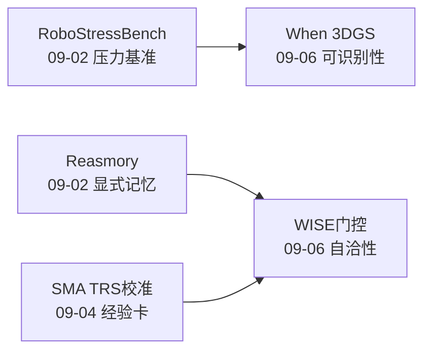

# Spatial AGI 每日研究思考 - 2026-09-06

**日期**: 2026-09-06
**论文数量**: 5篇
**主题**: 想象力经济学日——昨天确立"接口翻译"（空间信号→基础模型原生语言），今天五篇论文把焦点从"能力如何流入"转向"能力如何被消费"：**Motus2**（清华/朱军组）把 policy/simulator/evaluator 三接口拧进单一共享参数世界模型的闭环自我演化；**WISE**（清华/BAAI）证明想象力必须被调度——只在交互关键状态、有界 rollout、自洽性门控，砍 80% 计算反而涨点；**Raghavan & Singh** 用受控实验定量证明开环 rollout 是闭环控制的弱代理（18/24 选错模型），测量更新频率而非预测视野决定评估有效性；**SPAR3S**（ECCV 2026）把场景补全变成稀疏体素潜 token 的自回归预测，免 3D 真值监督；**When 3DGS Recovers Real Surfaces**（ECCV 2026）给出 3DGS 几何可识别性的数学理论——视差把空间纹理转换为角向频率，角向容量决定表面解与 billboard 错误解的分界。元结论：**Spatial AGI 的世界观正在从"能力建设"转向"资源治理"——空间想象力（世界模型反事实预测）与几何可信性（表面可识别性）都是稀缺且需调度的资源；接口翻译解决"先验如何借"，想象力经济学解决"借来的先验如何花"，可识别性理论解决"花出来的结果信多少"**

---

## 📅 每日总结

**日期**: 2026-09-06
**论文数量**: 5篇
**主题**: 想象力经济学日。Motus2（GensPI/清华，朱军组）以单一共享参数 video-action 模型同时暴露 policy（world-action model）/simulator（action-conditioned WM）/evaluator（value model）三个接口，用 chunk-autoregressive 注意力掩码实现"动作不偷看未来"的因果分离，Best-of-N 规划 + DiffusionNFT MBRL 闭环自我演化，数据侧单目→双目→机器人域金字塔迁移；WISE（清华/BAAI）提出想象力调度三件套——交互相关性调度器（DINOv2 弱监督，纯视觉触发）、有界闭环双视角 rollout（Open-Sara rectified-flow 世界模型）、组级可信度门控（ΔR≥0.02 / ρ_rank≥0.5 / σ_WM≤0.2），反事实评估信号 + 真实上下文锚定的组相对优化，80% 想象调用削减且 π0/π0.5 双骨干性能反升；Do Better Imagined Rollouts（Raghavan & Singh）在差速机器人受控测试床上证明 replay RMSE 与闭环性能 ρ=0.923 而无测量 rollout 仅 0.774（24 条件 18 个选错模型），视野×更新频率网格揭示"长视野+定期校正可用、长视野+无校正误导"，长中断训练收益不均匀且分布匹配不保证闭环改进；SPAR3S（ECCV 2026，Meta 系团队）把 3D 场景生成放进"仅占用体素有 token"的稀疏体素对齐潜空间，纯光度监督（可微 3DGS）免 3D 真值，掩码自回归 Transformer 联合预测 voxel occupancy + latent values，场景补全=预测缺失 token，RealEstate10k 真实数据泛化；When 3DGS Recovers Real Surfaces（ECCV 2026）以 first-hit 渲染抽象分离几何与外观，证明几何错位经视差把空间纹理转换为高频角向信号，建立可识别性窗口——角向容量有界则表面解被数学偏好、无界则 billboard 错误解等价存在，合成压力测试精确验证相变位置。

**关键突破**:
- 🚀 **三接口闭环（Motus2）**：policy/simulator/evaluator 不再是三个网络而是同一共享参数模型的三种查询模式——注意力掩码即因果结构（动作 token 禁读未来视频与 value，value 查询只读隐藏）。"action is not an auxiliary output but the causal interface" 直击 VLA 外挂动作头的要害；失败/次优数据按因子分工（专家演示→policy，失败交互→dynamics+value），数据价值首次按"接口匹配度"分配
- 🚀 **想象力调度经济学（WISE）**："More imagination is not necessarily more useful"——想象力价值在任务阶段间极不均匀（交互关键状态贡献绝大部分收益），DINOv2 调度器 + 有界 rollout + 自洽性门控三重控制下，80% 计算削减且性能反超全程想象。自洽性（重复想象的排名一致性 ρ_rank）作为免标注可信度代理与人类认知直觉吻合
- 🚀 **开环指标迷信的定量破除（Raghavan）**：世界模型社区的金标准评估协议（无测量多步 rollout 精度）在 75% 条件下选错闭环最优模型——误差的时序结构与可纠正性比误差幅度更重要；评估协议必须与部署时的"感知-校正-控制"调度同构
- 🚀 **场景生成的 token 化（SPAR3S）**：scene completion = predicting missing latent tokens——空间想象（补全未见区域）被形式化为序列建模问题，占用（哪里有）与内容（是什么）解耦联合生成，LLM 的全部武器（scaling/缓存/投机解码）理论上可迁移到 3D
- 🚀 **几何可识别性理论（When 3DGS）**：3DGS 恢复真实表面的条件首次被数学化——视差调制定理 + 可识别性窗口。高 SH 阶数风险、低纹理退化、billboard 假象等经验现象获得统一解释，为"何时可以信任 3DGS 几何"提供判据

**架构演进**: 10层保持；第3层（世界模型）新增"三接口统一闭环（Motus2）"与"几何潜扩散 WAM 继承者——调度式想象（WISE）"；第4层（规划）新增"Best-of-N 想象规划 + 组相对策略优化的训练部署一体化"；第5层（学习）新增"按因子分工的异质数据路由（Motus2 轨迹门控）"与"长中断训练的非均匀收益认知（Raghavan）"；第6层（接口）新增"体素潜 token 场景语言（SPAR3S）"——接口家族新增第三变体（前日：log深度帧/高斯token/证据束；今日：体素潜token）；第7层（可靠性）新增"自洽性门控（WISE）"与"几何可识别性审计（When 3DGS）"——可靠性层成为今日最大增量；第10层（评估）新增"传感调度感知的世界模型评估协议（Raghavan）"——评估层首次获得"评估协议本身的有效性"这一二阶问题

### 📊 一句话总结
今天的五篇论文共同宣告 Spatial AGI 进入"资源治理"阶段：空间想象力（世界模型预测）是稀缺资源需要调度（WISE 的 where/how far/how trusted），空间评估是二阶问题需要协议与部署同构（Raghavan 的传感调度依赖），几何可信性是条件命题需要理论边界（When 3DGS 的可识别性窗口），而三接口闭环（Motus2）与场景 token 化（SPAR3S）分别给出了想象力在时域（动作-后果-评估闭环）与空域（未见区域补全）的两种系统化消费方式——**能力建设之后，治理成为新的主战场**。

### 🔗 延续性
**昨日→今日**: 昨天的"接口翻译"（空间信号→基础模型原生语言）今天被"消费侧"议题全面接续：(1) 昨日 SA-WAM 的几何 WAM（推理期预测 RGB+深度）→ 今日 Motus2 把 WAM 升格为三接口闭环（加 evaluator）、WISE 给几何想象的消费加上调度经济学——世界模型线从"表示注入"演进到"架构统一"再到"使用治理"；(2) 昨日 AnyGS2Mesh 的高斯 token → 今日 SPAR3S 的体素潜 token 是空间 token 家族的第三、四个成员，且 SPAR3S 把 token 从"读出接口"（重建）扩展到"生成语言"（补全）；(3) 昨日 TMLR 综述的"三轴整合缺失"诊断 → 今日 Motus2 的三接口闭环正是 Understand×Act×Reason 在单一模型内的架构化落地（simulator=understand未来、policy=act、evaluator=reason评估）；(4) 昨日"翻译保真度有损"的缺口 → 今日 When 3DGS 给出翻译保真度的理论对应物：几何与外观的分离条件即"几何翻译何时无损"的判据；(5) 昨日 GizmoAct"接口先验匹配公理" → 今日 WISE 的"想象力先验调度公理"——不仅接口要与先验匹配，先验的消费时机也要与任务阶段匹配。
**今日→明日**: 五条线索：(1) 三接口闭环 × 想象力调度的组合——Motus2 的 always-on Best-of-N 与 WISE 的按需调度能否统一为"闭环内自适应规划深度"；(2) 可识别性窗口 × 场景生成的组合——在窗口失效处（低纹理/稀疏视角）用 SPAR3S 类生成先验接管几何推断；(3) 传感调度评估协议的视觉世界模型版本——Raghavan 的 SE(2) 结论在像素级生成模型中复现；(4) 场景 token 总线——体素潜token/高斯token/深度帧能否共享统一注入协议（昨日议题的深化）；(5) evaluator 接口的监督来源规模化——Motus2 的 progress bins 与 WISE 的 DINOv2 奖励头的冷启动问题。

### 💡 本质思考：如何达成通用空间智能

#### 1. 核心能力的本质是什么？
在本周累积的能力维度模型（十五维 + 昨日的可翻译性与阻抗匹配）上，今天新增三维：**可调度性（schedulability）**——空间计算资源（想象力/预测/评估）的价值分布极不均匀，能力必须附带"何时使用"的元决策（WISE 调度器、Raghavan 的传感调度依赖、Motus2 的交互关键状态触发）；**可审计性（auditability）**——空间推理结果（几何表面、想象轨迹、评估分数）必须附带可信度判据（When 3DGS 的可识别性窗口、WISE 的自洽性门控 ρ_rank），不可审计的能力在闭环系统中是负资产；**闭环一致性（closed-loop consistency）**——离线能力与在线行为的排名一致性（Raghavan 的核心发现），能力评估必须在与部署同构的反馈结构中进行。Spatial AGI 的本质从昨天的"空间信号与基础模型先验之间的翻译层工程"深化为"**空间能力的生产-消费-审计循环工程**"：翻译层（昨日）决定先验如何借入，调度层（今日 WISE/Motus2）决定借入的先验如何花在刀刃上，审计层（今日 When 3DGS/WISE 门控/Raghavan 协议）决定花出的结果能否被信任——三者构成完整的资源治理链。

#### 2. 当前方法与理想目标的差距在哪里？
- **调度是启发式的**：WISE 的阈值（κ/ΔR/ρ_rank/σ_WM）手工设定，跨任务迁移需重调；理想的调度器应从任务/场景/模型特性自动推导最优想象策略，当前的 DINOv2 弱监督头只是初级形态
- **可识别性理论覆盖单点**：When 3DGS 只覆盖静态朗伯场景的 3DGS 家族；动态场景、材质多样性（光泽/透明）、其他表示（NeRF/occupancy/点云）的可识别性边界未知
- **闭环一致性的机理未通**：Raghavan 证明了相关性断裂（ρ=0.774）但"误差时序结构如何通过控制器放大/衰减"的预测性理论缺失——只知道开环指标不行，不知道什么指标行
- **三接口的容量冲突**：Motus2 单一共享模型同时服务三种接口，部署时只想用 simulator 也拖着全部容量；接口解耦与参数共享的帕累托前沿未探索
- **evaluator 监督瓶颈**：Motus2 的 progress bins 与 WISE 的奖励头都依赖任务相关标注/弱监督，新任务的评估器冷启动是自我演化闭环的阿喀琉斯之踵

#### 3. 从今天到理想状态，最可能的路径是什么？
短期：调度与审计的对照实验学——同一世界模型在不同调度策略（always-on/均匀/按需）与不同审计门控下的闭环收益矩阵；可识别性窗口的实测协议（角向容量扫描作为 3DGS 几何质检标准流程）。中期：资源治理的自动化——调度器从弱监督头进化为基于任务嵌入/场景特性的可学习策略（元学习"何时想象"）；可识别性理论扩展到动态 4D 与多表示族，形成"几何置信度场"输出；闭环一致性指标的开发（超越开环 RMSE 的预测性评估量）。长期：Spatial AGI 操作系统——能力生产（翻译层）、能力消费（调度层）、质量审计（可识别性+自洽性）三层标准化，如同数据库的查询优化器：空间任务声明意图，系统自动决定调用哪个世界模型接口、想象多深、何时校正、结果信多少——想象力经济学成为空间智能操作系统的资源管理器。

---

## 🔗 与昨日思考的联系

### 昨日重点
昨天（2026-09-05）的主题是"接口翻译"：SA-WAM（log 深度伪 RGB 帧入冻结 tokenizer）、Lucida（GizmoAct 空间操作 GUI 化）、AnyGS2Mesh（高斯 token 前馈读出）、STARS-GS（结构约束层次化）、TMLR 综述（三轴统一诊断）。元结论：**瓶颈不在几何计算本身，而在几何计算与预训练先验之间的阻抗匹配**。

### 今日进展
今天五篇论文与昨天的议题逐一对接：
- 昨天的 **几何 WAM（SA-WAM）** → 今日 Motus2 把 WAM 升格为三接口闭环（加入 evaluator 形成自我演化回路）、WISE 给世界模型想象加上调度经济学——世界模型线完成"表示→架构→治理"三级跳；SA-WAM 解决"几何如何进入世界模型"，Motus2 解决"世界模型如何自我改进"，WISE 解决"世界模型何时值得用"
- 昨天的 **高斯 token（AnyGS2Mesh）** → 今日 SPAR3S 的体素潜 token 把空间 token 从读出接口（重建可见）扩展为生成语言（补全未见）——token 家族第四成员，且首次实现"token 的自回归生成"而非"token 的注意力消费"
- 昨天的 **TMLR 三轴诊断** → 今日 Motus2 的三接口闭环是三轴（Understand×Act×Reason）在单一共享模型内的架构化：simulator 预测未来（understand consequences）、policy 生成动作（act）、evaluator 评估结果（reason about value）——昨日综述呼吁的"整合"今天有了具体架构答案
- 昨天的 **翻译保真度缺口** → 今日 When 3DGS 的可识别性窗口给出保真度的第一性理论：几何-外观分离条件即"渲染翻译何时保真于几何"的判据——翻译层工程第一次有了质量下界的数学工具
- 昨天的 **接口先验匹配公理** → 今日 WISE 补充其时域版本：**想象力先验调度公理**——接口要与模型先验匹配（昨日），先验的消费时机要与任务阶段匹配（今日）：粗运动阶段无需想象（先验已够），交互关键状态必须想象（先验不足）

### 本周弧线中的今天
本周弧线：09-01 空间基准→09-02 记忆与可靠性→09-03 交互世界模型→09-04 注入点工程→09-05 接口翻译→**09-06 资源治理**。今天的位置：生产侧议题（注入/翻译）基本成型后，消费侧与质检侧议题全面展开——这标志 Spatial AGI 的工程栈趋于完整：能力生产（翻译）→能力消费（调度）→质量审计（可识别性/自洽性）。

### 演进路径


---

## 📚 论文概览

1. **Motus2**（arXiv:2608.30237，清华/朱军组）：自演化通用世界模型，policy/simulator/evaluator 三接口共享参数，chunk-autoregressive 掩码因果分离，数据金字塔（单目→双目→机器人域），Best-of-N + DiffusionNFT MBRL 闭环，触觉专家，全仿生双臂灵巧手平台验证。
2. **WISE**（arXiv:2609.03681，清华/BAAI）：世界模型想象力调度框架——交互相关性调度器（DINOv2+弱监督）、有界闭环双视角 rollout（rectified-flow 世界模型）、进度-回退-完成三分量奖励、组级可信度门控（ΔR/ρ_rank/σ_WM）、真实上下文锚定的组相对优化；π0/π0.5 双骨干、MimicGen+真机验证，80% 计算削减。
3. **Do Better Imagined Rollouts Mean Better Robot Control?**（arXiv:2609.02811）：受控差速机器人测试床，6 估计器×24 传感条件，replay（ρ=0.923）vs 无测量 rollout（ρ=0.774，18/24 选错），视野×更新频率网格，长中断训练非均匀收益，开源代码。
4. **SPAR3S**（arXiv:2609.03931，ECCV 2026）：稀疏体素对齐 3D 潜生成模型，免 3D 真值（可微 3DGS 光度监督），掩码自回归 Transformer 联合建模占用+潜值，场景补全=缺失 token 预测，RealEstate10k 泛化。
5. **When 3DGS Recovers Real Surfaces**（arXiv:2608.30054，ECCV 2026，30页）：first-hit 渲染抽象分离几何/外观，视差-角向频率转换定理，可识别性窗口（角向容量有界→表面解优先；无界→billboard 等价），合成相变验证+真实数据解释。

---

## 💡 核心见解

### 见解1: 动作是世界模型的因果接口，不是附属输出头
（从 Motus2 获得）
- ✅ 现有"世界模拟器+动作头"范式缺失闭环：动作与模拟解耦，无法从自身后果学习
- ✅ Motus2 的 action-first 分解 p(A,Z,Y|c) = π(A|c)·p(Z|c,A)·p(Y|c,A,Z) 把"决定做什么→预测发生什么→评估好不好"的因果链显式化
- ✅ chunk-autoregressive 掩码：动作 token 禁读同 chunk 未来视频与 value（防偷看），value 查询只读隐藏（纯探针）——因果结构完全在注意力层实现，零架构拆分

**对Spatial AGI的启发**:
Spatial AGI 系统的行动能力不应是感知模型的下游插件，而应与世界模型形成因果闭环。"接口翻译"（昨日）解决了空间信号进入模型的问题；"因果闭环"（今日）解决了动作信号从模型流出并回流学习的问题。三接口（policy/simulator/evaluator）可以成为 Spatial AGI 系统架构的标准抽象：任何空间任务系统都隐含这三个接口，问题只在于是三个模块的拼装还是统一模型的三种查询。

### 见解2: 数据价值应按接口因子分工分配
（从 Motus2 获得）
- ✅ 专家演示 → 监督 policy（动作学习）；失败/次优交互 → 监督 simulator（动力学）+ evaluator（价值）
- ✅ 轨迹依赖损失门控实现数据到因子的路由——失败数据从"噪声/负样本"升格为动力学与价值学习的正面证据
- ✅ 这解释了为什么纯模仿范式数据效率低：它把所有数据都当 policy 监督用，浪费了失败数据的 dynamics/value 信息量

**对Spatial AGI的启发**:
空间智能的数据工程需要从"质量分级"进化到"因子分工"：一条空间轨迹（导航路径、操作序列、重建扫描）对不同学习目标（策略/动力学/价值/表征）的信息量不同，数据管线的最优设计是按目标路由而非按质量过滤。这是对本周空间记忆线（经验复用）的数据侧补充。

### 见解3: 想象力是稀缺资源，"更多想象未必更有用"
（从 WISE 获得）
- ✅ 想象价值在任务阶段间极不均匀：粗运动阶段预训练先验已够，交互关键状态（接触/对准/插入）才真正受益
- ✅ DINOv2 调度器 + 有界 rollout + 自洽性门控：80% 计算削减且性能反超全程想象——均匀想象不仅浪费还会引入噪声信号
- ✅ 自洽性门控（重复想象的排名一致性）是世界模型可靠性的免标注代理——与"一致性放大事实性"的空间推理工作方法论同源

**对Spatial AGI的启发**:
任何依赖世界模型想象的空间系统（导航前瞻、操作规划、场景补全、策略评估）都需要想象力经济学：where（哪些状态值得想象）× how far（想象多深不失控）× how trusted（想象结果何时可信）。这是世界模型版的 compute-optimal training 思想，也是空间智能系统走向实用化的必经预算约束。

### 见解4: 评估协议必须与部署的传感调度同构
（从 Raghavan & Singh 获得）
- ✅ 无测量开环 rollout 与闭环控制排名相关性仅 ρ=0.774，24 条件 18 个选错模型；带校正回放 ρ=0.923
- ✅ 测量更新频率是主调节变量：H=20 下每步校正 ρ=0.916 → 无校正 ρ=0.774；长视野+定期校正可用，长视野+无校正误导
- ✅ 长中断训练收益不均匀（GRU-EKF 1.72→1.06m 但孤立中断无收益）；匹配训练中断分布不保证闭环改进

**对Spatial AGI的启发**:
"开环精度崇拜"（多步 rollout 误差、FVD、感知相似度作为世界模型金标准）可能是系统性误导。误差的时序结构与可纠正性比幅度更重要。Spatial AGI 的评估基础设施（benchmark、模型选型、能力声明）必须显式包含传感频率/中断模式维度——否则排名不可迁移。这与 WISE 的工程发现构成机理+方案的双子证据。

### 见解5: 空间想象可以被形式化为缺失 token 的自回归预测
（从 SPAR3S 获得）
- ✅ 场景补全 = 预测缺失的体素潜 token 及其空间支撑（occupancy）；占用（哪里有）与内容（是什么）解耦联合生成
- ✅ 稀疏体素对齐潜空间可从纯光度监督（可微 3DGS）学到，零 3D 真值——2D 多视角一致性足以涌现结构化 3D 表示
- ✅ 计算随占用内容量而非场景体积扩展——token 化让 3D 生成获得序列建模的可扩展性

**对Spatial AGI的启发**:
"从部分观测想象完整空间"是 Spatial AGI 的核心能力（导航地图补全、遮挡推理、场景记忆扩展）。SPAR3S 把它变成 next-token prediction 后，LLM 的全部基础设施可迁移——这是"3D 场景的语言模型化"的具体证据，也是空间 token 家族从读出接口扩展到生成语言的关键一步。与动作 token 结合（把动作加入自回归序列）是通向"可交互场景语言模型"的清晰路径。

### 见解6: 几何可信性是条件命题，视差与纹理是几何的守护者
（从 When 3DGS Recovers Real Surfaces 获得）
- ✅ 几何错位经视差把空间纹理转换为高频角向信号——错位的代价被换算成外观复杂度的代价
- ✅ 可识别性窗口：角向容量有界 → 表面解被数学偏好；无界 → billboard 错误解等价存在；合成测试精确验证相变
- ✅ 真实数据表面一致性源于丰富纹理把 billboard 解推出实用容量范围——低纹理区域天然靠近窗口边缘

**对Spatial AGI的启发**:
所有把 3DGS 当几何用的系统（SLAM、表面重建、NavMesh、碰撞检测、世界模型状态）都需要几何可识别性审计：SH 阶数/角向容量设置、场景纹理丰富度、视角基线共同决定几何可信度。低纹理/稀疏视角处恰是生成先验（SPAR3S 类）最有价值的接管点——理论边界与生成补全的组合是空间重建的清晰分工。

### 见解7: 自我演化 = 闭环 × 分工 × 可信度三要素
（从 Motus2 × WISE × Raghavan 综合获得）
- ✅ Motus2 提供闭环结构（三接口+MBRL），WISE 提供可信度控制（门控+锚定），Raghavan 提供评估纪律（传感调度同构）
- ✅ 三者缺一不可：无闭环则无改进路径；无可信度控制则想象噪声污染策略；无评估纪律则无法知道改进是否真实
- ✅ 今天的组合宣告"自我演化"从概念走向工程规范

**对Spatial AGI的启发**:
Spatial AGI 的终身学习系统设计清单：① 三接口闭环（或其模块化等价物）② 想象调度与门控 ③ 与部署同构的评估协议 ④ 按因子分工的数据路由。任何声称"自我演化/持续学习"的空间智能系统都应对照此清单自检。

### 见解8: 本周方法论收敛——从能力建设到资源治理
（综合本周全部论文获得）
- ✅ 09-04 注入点（能力流入哪里）→ 09-05 接口翻译（先验借多少）→ 09-06 资源治理（先验怎么花、结果信多少）
- ✅ 翻译层/调度层/审计层构成完整治理链，分别对应数据库的存储引擎/查询优化器/一致性校验
- ✅ 每层的成熟标志：翻译层有阻抗匹配直觉（无度量）、调度层有启发式门控（无理论）、审计层有可识别性定理（覆盖单点）——三层都处于"工程先行、理论追赶"阶段

**对Spatial AGI的启发**:
Spatial AGI 作为系统学科的栈结构正在显形：能力生产（表示+翻译）→能力消费（架构+调度）→质量保障（审计+评估协议）。类比操作系统：空间智能操作系统 = 空间表示文件系统 + 世界模型计算引擎 + 想象力调度器 + 几何/事实审计器。今天的论文分别点亮了调度器（WISE/Motus2）、审计器（When 3DGS/WISE门控）和评估协议（Raghavan）三个尚新的组件。

---

## 🗺️ 知识演进图



---

## 技术栈演进对比表

| 层次 | 昨日方案（09-05） | 今日方案（09-06） | 变化 |
|------|---------|---------|------|
| 感知 | 高斯token联合推理、结构感知分块 | 体素潜token编码（SPAR3S，光度监督） | +token家族新成员 |
| 表示 | log深度伪帧、证据束场景图 | 稀疏占用体素潜空间（免3D真值） | +生成化表示 |
| 世界模型 | 几何WAM（RGB+深度联合预测） | 三接口闭环（policy/sim/evaluator共享参数）+ 调度式想象 | 架构统一+使用治理 |
| 规划 | GizmoAct GUI闭环 | Best-of-N想象规划+组相对优化 | 想象驱动规划 |
| 学习 | 训练难于测试的环境设计、约束层次化 | 按因子分工的数据路由、长中断训练认知 | 数据工程深化 |
| 接口 | log深度帧/高斯token/证据束/gizmo GUI | 体素潜token场景语言 | +第四token变体 |
| 可靠性 | （薄弱） | 自洽性门控（ρ_rank）、几何可识别性窗口 | ⭐今日最大增量 |
| 系统 | Real2Sim全链路自动化 | 全仿生平台+触觉专家、80%计算削减的部署效率 | 系统效率化 |
| 评估 | 世界建模质量×rollout成功率相关性 | 传感调度感知的评估协议（二阶问题） | 评估协议本身成为研究对象 |
| 理论 | （缺） | 视差-角向频率转换定理、可识别性窗口 | ⭐理论层首次实质增量 |

---

## 🗺️ Spatial AGI 知识图谱

### 10层架构思维导图



### 🎯 主线技术路径

#### 阶段1: 空间信号 token 化（已完成中）
深度帧（SA-WAM）、高斯 token（AnyGS2Mesh）、体素潜 token（SPAR3S）证明空间信号可被转译为基础模型原生语言；本阶段输出是"空间 token 总线"的雏形——多种空间模态共享序列建模接口。

#### 阶段2: 世界模型架构统一（进行中）
Motus2 的三接口闭环 + 此前的 WAM 家族收敛：单一共享模型承担理解/行动/评估，chunk-autoregressive 掩码成为因果分离标准工具；本阶段输出是"空间世界模型参考架构"。

#### 阶段3: 想象力经济与治理（今日开启）
调度器（何时想象）、有界 rollout（想象多深）、自洽性门控（何时可信）、传感调度评估（如何度量）——世界模型从能力组件进化为被管理的计算资源；本阶段输出是"想象力资源管理器"。

#### 阶段4: 几何可信性与自我演化闭环（理论+工程并行）
可识别性窗口界定几何信任边界（何时信），生成先验在窗口外接管（SPAR3S），三接口闭环消费可信信号自我改进（Motus2）；本阶段输出是"可审计自我演化的空间智能系统"。

#### 阶段5: Spatial AGI 操作系统（远期）
翻译层（生产）+调度层（消费）+审计层（质保）标准化，空间任务声明意图、系统自动编排表示/接口/想象深度/校正策略——空间智能基础设施化。

---

## 🔍 待探索议题

### 高优先级（本周）

1. **三接口闭环 × 想象力调度的统一**
   - 问题: Motus2 的 always-on Best-of-N 与 WISE 的按需调度如何统一为闭环内自适应规划深度？
   - 候选方案: 调度器输出不仅决定"是否想象"还决定"想象分支数 N 与深度 L"；用 evaluator 的不确定性指导 N 的分配
   - 缺口: 两套系统分别验证，无对照实验；自适应规划深度的收敛性无理论

2. **可识别性窗口 × 生成先验的接管协议**
   - 问题: 何时判定光度重建几何不可信并切换到生成补全（SPAR3S 类）？
   - 候选方案: 角向容量扫描作为在线质检（When 3DGS 的可操作化）；纹理/视差丰富度作为切换触发器
   - 缺口: 可识别性窗口的在线估计方法；切换边界的实证标定

3. **evaluator 接口的监督规模化**
   - 问题: Motus2 的 progress bins 与 WISE 的奖励头都依赖任务标注/弱监督，新任务冷启动难
   - 候选方案: 从视频自监督学进度（时间顺序即进度）；LLM 生成进度伪标签；跨任务进度预训练
   - 缺口: 自监督进度信号的质量上限；进度信号的跨任务泛化实验

### 中优先级（两周内）

4. **传感调度评估协议的视觉世界模型版**
   - 问题: Raghavan 的 SE(2) 结论在像素级视频世界模型（Coscos/Gemini 类评估器）中是否成立？
   - 候选方案: 在受控视觉域复现视野×校正频率网格实验
   - 缺口: 视觉世界模型的"测量更新"对应物（重观测？编码器刷新？）未定义清楚

5. **场景 token 与动作 token 的统一自回归**
   - 问题: SPAR3S 的场景补全 token 能否与动作 token 拼成"可交互场景语言模型"？
   - 候选方案: 体素潜 token + 动作块 token 联合序列，chunk-autoregressive（Motus2 掩码）训练
   - 缺口: 场景级与物体级的 token 粒度冲突；生成质量的评估基准

6. **空间 token 总线协议**
   - 问题: 深度帧/高斯token/体素token/证据束能否共享统一注入协议？
   - 候选方案: 定义空间 token 的规范格式（载体+坐标系+置信度+来源），任何基础模型按需消费
   - 缺口: 统一格式对各模型 tokenizer 的适配成本；互操作收益的实证

7. **调度阈值的自动学习**
   - 问题: WISE 的 κ/ΔR/ρ_rank/σ_WM 手工阈值跨任务失效
   - 候选方案: 元学习调度策略（任务嵌入→阈值）；贝叶斯优化在线调参
   - 缺口: 调度策略本身的可学习性实验；阈值-收益的敏感性分析

### 低优先级（本月内）

8. **可识别性理论扩展**
   - 问题: 动态场景（4DGS）、光泽/透明材质、NeRF/occupancy 表示的可识别性边界
   - 候选方案: first-hit 抽象推广到多次散射；材质先验与角向容量的联合分析
   - 缺口: 数学工具（非朗伯辐射的角向频率分析）待建立

9. **失败数据的因子路由的数据工程**
   - 问题: Motus2 的轨迹门控如何在海量非结构化机器人数据上工业化实现
   - 候选方案: 自动轨迹质量分级（成功/次优/失败）+ 因子归属分类器
   - 缺口: 分级器自身的标注成本；路由错误的下游影响分析

---

## 📊 知识缺口分析



**已解决（30%）**:
- ✅ 空间信号可 token 化进入基础模型（多载体验证：深度帧/高斯/体素/场景图）
- ✅ 世界模型三接口闭环的架构可行性（Motus2 真机验证）
- ✅ 想象力调度的工程有效性（WISE 80%削减+涨点）
- ✅ 开环评估协议的失效证据（Raghavan 定量）
- ✅ 3DGS 几何可识别性的静态朗伯理论（When 3DGS）
- ✅ 免 3D 真值的结构化 3D 表示学习（SPAR3S 光度监督）

**部分理解（45%）**:
- ⚠️ 三接口与模块化架构的取舍边界（共享参数的容量冲突未量化）
- ⚠️ 调度门控阈值的跨任务迁移（启发式有效但非自适应）
- ⚠️ 闭环一致性的机理（知道开环指标失效，不知道什么指标有效）
- ⚠️ evaluator 监督的规模化来源（弱监督可行但冷启动未解）
- ⚠️ 场景 token 生成的误差传播（自回归长序列漂移）
- ⚠️ 双目/触觉多模态空间融合的深度（专家流 vs 端到端）
- ⚠️ 可识别性窗口的在线估计（理论有了，测量方法没有）
- ⚠️ 翻译层阻抗匹配的度量（直觉有了，计算定义没有）

**未涉及（25%）**:
- ❌ 动态/非朗伯场景的可识别性理论
- ❌ 空间 token 总线协议与互操作标准
- ❌ 想象力调度的可学习性（元学习调度器）
- ❌ 视觉世界模型的传感调度评估复现
- ❌ 场景+动作统一自回归的可交互场景语言模型
- ❌ 几何置信度场作为世界模型的标准输出
- ❌ Spatial AGI 操作系统级的资源管理抽象

---

## 📈 本周研究质量统计

- **论文总数**: 30 篇（09-01 至 09-06，每日 5 篇）
- **主题演进**: 空间基准 → 记忆可靠性 → 交互世界模型 → 注入点工程 → 接口翻译 → 资源治理
- **方法论弧线**: 评估（benchmark）→ 结构（memory）→ 交互（world model）→ 生产（injection/translation）→ 消费与质保（scheduling/audit）
- **理论进展**: 本周首次出现纯理论贡献（When 3DGS 可识别性定理）与受控实验方法学（Raghavan）
- **高频关键词**: world model / token / interface / scheduling / closed-loop / identifiability / evaluation

---

## 附录A：五篇论文的深度串联分析

### A.1 世界模型生命周期视角：今天五篇覆盖了完整生命周期

```
生产能力（世界模型怎么来）
  SPAR3S: 场景级空间想象的自回归生成（空间侧生产）
  Motus2: 三接口统一训练 + 数据金字塔（架构侧生产）
消费调度（世界模型怎么用）
  WISE: 何时用（调度器）/用多深（有界rollout）/信多少（门控）
  Motus2: 用在哪（Best-of-N规划 + MBRL更新）
质量审计（世界模型结果信多少）
  When 3DGS: 几何侧审计（可识别性窗口）
  WISE: 想象侧审计（自洽性门控）
  Raghavan: 评估侧审计（协议与部署同构）
```

今天五篇论文恰好完整覆盖"生产→消费→审计"的生命周期，这在单日论文集中罕见——暗示世界模型工程学正在成型。

### A.2 三种"可信度判据"的技术细节对照

| 判据 | 来源 | 机制 | 适用域 | 免标注性 |
|------|------|------|--------|---------|
| 自洽性 ρ_rank | WISE | 同一候选想象两次，排名一致性 | 想象rollout可信度 | ✅完全免标注 |
| 可识别性窗口 | When 3DGS | 角向容量×纹理×视差的数学条件 | 几何表面可信度 | ✅免标注（需容量声明） |
| 传感调度同构 | Raghavan | 评估协议与部署校正频率一致 | 模型排名可信度 | ✅免标注 |

三者共同点：**可信度来自内部一致性/条件匹配，而非外部真值**——这与本周空间推理线的"一致性放大事实性"（The Art of Interrogation）形成跨域方法论共振。

### A.3 与本周前五天论文的交叉引用矩阵

| 今日论文 | 呼应的前作 | 关系 |
|---------|-----------|------|
| Motus2 | SA-WAM(09-05)、World Tokens(09-04)、AnyWorld(09-03)、IMPACT(09-03) | WAM家族的架构统一终点；三接口闭环纳入此前所有WAM能力 |
| WISE | World Tokens(09-04)、Matrix-Game 3.5(09-03)、SA-WAM(09-05) | 训练期世界建模的调度化升级；patch记忆稳定性被"有界rollout"绕过 |
| Raghavan | Matrix-Game 3.5(09-03)、IMPACT(09-03) | 质疑长rollout精度作为目标函数——patch memory类改进应改用传感调度评估验证 |
| SPAR3S | AnyGS2Mesh(09-05)、Lucida(09-05)、CL4D(09-04) | token家族扩展：读出→生成；与Lucida物体级路线互补 |
| When 3DGS | STARS-GS(09-05)、AnyGS2Mesh(09-05) | 为STARS-GS结构正则提供理论解释；为AnyGS2Mesh的mesh提取提供审计前提 |

### A.4 失败模式预判

- **Motus2**: Best-of-N+MBRL的模型利用（model exploitation）——模拟器在分布外失真时 value 引导放大误差；缓解：WISE式门控移植
- **WISE**: 世界模型冻结导致策略改进后想象质量静默退化（off-policy imagination）；缓解：周期性世界模型微调+域随机化
- **Raghavan结论误用**: 把"开环指标失效"误读为"短视野普遍更好"（作者明确否认）；正确读法是指标必须匹配部署调度
- **SPAR3S**: 体素量化误差在毫米级操作几何上不足；自回归长序列生成漂移
- **When 3DGS理论误用**: 把静态朗伯结论外推到光泽/透明场景；first-hit与alpha-blending的差距被忽略

---

## 附录B：每日金句提炼

1. "Action is not an auxiliary output attached to a simulator, but the causal interface that grounds internal predictions in physical interaction." — Motus2
2. "More imagination is not necessarily more useful." — WISE
3. "For models used in feedback, offline rollouts are most informative when their sensing and correction pattern reflects closed-loop operation." — Raghavan & Singh
4. "Scene completion reduces to predicting the missing latent tokens and their spatial support." — SPAR3S
5. "Geometric misalignment forcefully converts spatial textures into high-frequency angular signals via parallax." — When 3DGS Recovers Real Surfaces

---

## 附录C：本周回顾（09-01至09-06）

- **09-01 空间基准日**: SpatialUAV（低空无人机空间智能三维度）、Embodied3DBench（低层embodied空间）等——评估基础设施
- **09-02 记忆可靠性日**: Reasmory（3D重建作为显式记忆）、RoboStressBench（压力鲁棒性）——记忆与可靠性
- **09-03 交互世界模型日**: Matrix-Game 3.5（patch记忆）、AnyWorld（因子化跨具身）、IMPACT（注意力交互图）——交互生成
- **09-04 注入点工程日**: Space Tokens（词表蒸馏）、SMA（经验卡记忆）、CL4D（4D对比预训练）、World Tokens（训练期世界建模）——五正交注入点
- **09-05 接口翻译日**: SA-WAM（log深度帧）、Lucida（gizmo GUI）、AnyGS2Mesh（高斯token）、STARS-GS（结构约束层次）、TMLR三轴诊断——阻抗匹配
- **09-06 资源治理日**: Motus2（三接口闭环）、WISE（想象力调度）、Raghavan（传感调度评估）、SPAR3S（场景token生成）、When 3DGS（可识别性理论）——生产/消费/审计治理链

**本周弧线总结**: 评估→记忆→交互→注入→翻译→治理。Spatial AGI 的工程栈六层逐日点亮，周六日的理论贡献（When 3DGS）与受控方法学（Raghavan）为工程热潮注入第一性原理锚点。

---

## 附录D：术语表（今日新增）

| 术语 | 定义 | 来源 |
|------|------|------|
| Chunk-autoregressive | 块间自回归+块内流匹配联合生成的掩码范式 | Motus2 |
| Action-first factorization | p(A,Z,Y|c)=π(A)·p(Z|A)·p(Y|A,Z) 的因果分解 | Motus2 |
| Imagination scheduling | 按状态相关性/深度/可信度分配世界模型想象的资源管理 | WISE |
| Bounded rollout | 限制块数L的有界闭环想象，控制误差累积 | WISE |
| Self-consistency gating | 重复想象的排名一致性作为免标注可信度门控 | WISE |
| Identifiability window | 角向容量与纹理/视差共同决定表面可识别的条件区间 | When 3DGS |
| Parallax-frequency conversion | 几何错位经视差将空间纹理转为高频角向信号的机制 | When 3DGS |
| Billboard geometry | 用角向外观补偿错位深度的错误不透明面片几何 | When 3DGS |
| Sensing-schedule consistency | 评估协议与部署的测量-校正-控制调度同构的原则 | Raghavan |
| Voxel-aligned latent space | 仅占用体素携带token的结构化3D潜空间 | SPAR3S |
| Occupancy-content decoupling | 联合生成空间支撑（哪里有）与内容（是什么）的解耦设计 | SPAR3S |

---

## 附录E：明日研究候选方向

1. **三接口×调度统一**: 搜索"adaptive planning depth" + "world action model"最新工作；关注 evaluator 不确定性指导分支数分配
2. **几何置信度输出**: 可识别性理论的可操作化（在线角向容量扫描、纹理-视差丰富度图作为置信度场）
3. **进度自监督**: 视频时间顺序作为进度信号的世界模型评估器预训练
4. **可交互场景语言模型**: 场景token+动作token统一自回归的早期工作追踪
5. **视觉域传感调度评估**: 视频世界模型benchmark是否开始引入校正频率维度
6. **空间token总线**: 互操作协议提案类工作（类比 tool-call 协议之于 agent）
7. **世界模型资源管理器综述**: 调度/门控/审计的系统化 survey 是否出现

---

**文档生成时间**: 2026-09-06 03:00+08:00
**分析基础**: 今日5篇论文精读 + 昨日思考延续 + 本周弧线整合

---

## 附录F：想象力经济学——今日主题的完整论述

### F.1 为什么"想象力"需要经济学

世界模型的想象力（反事实预测能力）在 Spatial AGI 系统中承担四种角色：
1. **规划器输入**：Best-of-N 候选评估（Motus2）、前瞻搜索（导航 WAM）
2. **策略训练信号**：想象 rollout 替代真实试错（WISE、WMPO、RISE）
3. **策略评估环境**：视频模拟器评估（Gemini Robotics 框架）
4. **数据合成引擎**：场景补全（SPAR3S）、增强生成（ArtifactWorld 类）

四种角色的边际价值都随以下三个变量剧烈变化：
- **状态相关性**（WHERE）：交互关键状态 vs 粗运动阶段
- **预测深度**（HOW FAR）：单块预测 vs 长闭环 rollout
- **可信度**（HOW TRUSTED）：世界模型对该状态分布的覆盖度

### F.2 今日论文对三个变量的贡献

| 变量 | WISE | Raghavan | Motus2 |
|------|------|----------|--------|
| WHERE | DINOv2 调度器（弱监督触发） | — | 交互关键状态（数据路由） |
| HOW FAR | 有界 L 块 rollout | 视野×更新频率网格：长视野需配套校正 | Best-of-N 的固定 N |
| HOW TRUSTED | ρ_rank 自洽门控 + ΔR/σ_WM | 开环排名与闭环脱钩的定量证据 | evaluator 期望排序 |

### F.3 想象力经济学的三条定律（今日论文归纳）

**定律1（边际递减律）**: 想象的边际收益随任务阶段远离交互关键点而递减，随想象深度超过世界模型可靠范围而转负（WISE：全程想象 < 选择性想象；Raghavan：长无校正 rollout 排名误导）。

**定律2（校正依赖律）**: 想象的价值不是其固有属性，而是"想象×校正调度"的联合属性——定期被测量校正的长视野想象保持有效，无校正的长想象退化（Raghavan 网格实验）。

**定律3（自洽先验律）**: 免标注的可靠性判据优先于外部门控——世界模型对同一候选的重复想象若排名不一致，其评估不可信（WISE ρ_rank），类比人类"自我矛盾的证词不可采信"。

### F.4 与经典资源管理理论的类比

| 维度 | 数据库查询优化器 | 想象力资源管理器（今日雏形） |
|------|----------------|---------------------------|
| 资源 | 磁盘IO/CPU | 世界模型前向计算 |
| 调度依据 | 查询计划代价估计 | 交互相关性分数（DINOv2头） |
| 深度控制 | join 顺序/索引选择 | rollout 块数 L、分支数 N |
| 质量保障 | 一致性检查/事务 | 自洽门控 + 传感调度评估 |
| 自适应 | 统计反馈调优 | （缺口）调度阈值仍手工 |

### F.5 缺口与路线

当前缺口：调度器不可学习（阈值手工）、评估协议未覆盖视觉域、可信度判据单点（无体系）。
路线：元学习调度策略 → 视觉域传感调度复现 → 可信度判据体系化（自洽性+可识别性+覆盖度三维）→ 想象力资源管理器标准化。

---

## 附录G：可识别性理论对 3DGS 工程实践的操作化建议

### G.1 从定理到检查清单

When 3DGS 的可识别性窗口可以直接翻译为 3DGS 几何下游任务的检查清单：

1. **声明角向容量**：SH 阶数、各向异性自由度——高容量意味着 billboard 风险区间扩大
2. **纹理丰富度地图**：对场景分区估计空间纹理频率——低纹理区标记为几何低置信
3. **视差基线审计**：采集协议的视角多样性决定视差强度——窄基线采集放大窗口失效风险
4. **容量-纹理匹配原则**：低纹理场景主动降低 SH 阶数或引入几何正则（STARS-GS 类结构正则的理论依据）
5. **几何用途分级**：渲染用途可容忍 billboard；碰撞/NavMesh/表面提取用途必须在窗口内

### G.2 与生成先验的分工协议

```
光度重建（3DGS）可识别性窗口内
  → 信任重建几何（表面解被数学偏好）
窗口边缘（低纹理/窄基线/稀疏视角）
  → 引入结构正则（STARS-GS）约束几何
窗口外（大面积未见/极端稀疏）
  → 生成先验接管（SPAR3S token 补全）
  → 生成结果的置信度标注（来源=先验而非观测）
```

### G.3 对世界模型状态表示的含义

把 3DGS 作为世界模型状态（GaussianDream/GASE 路线）时：
- 动力学/碰撞推理依赖几何保真——billboard 假象会导致错误的碰撞预测
- 建议：世界模型的 3DGS 状态附带"几何置信度场"（可识别性窗口的逐区估计）
- 长期：几何置信度场成为世界模型的标准输出接口（与 RGB/深度/占用并列）

---

## 附录H：三接口闭环的架构学深析

### H.1 三接口与本周前作的映射

| 接口 | Motus2 实现 | 本周前作对应 | 差异 |
|------|------------|-------------|------|
| Policy (WAM) | world-action model 条件查询 | SA-WAM、World Tokens、AnyWorld | 统一参数而非独立训练 |
| Simulator (AC-WM) | action-conditioned 预测 | Matrix-Game 3.5、IMPACT | 与 policy 共享 backbone |
| Evaluator (VM) | 只读 value 查询 | RoboReward 类 VLM 奖励裁判 | 模型内部接口而非外部模型 |

### H.2 掩码设计的一般化价值

chunk-autoregressive 掩码的三个规则可以抽象为通用的"统一模型接口工程"原则：
1. **因果禁止原则**：决策接口（动作）禁读后果接口（未来视频）与评估接口——防腐化泄漏
2. **只读探针原则**：评估接口可读一切但对所有 token 隐藏——观测者不影响系统
3. **跨块因果原则**：块间时序因果保持——长时程一致性

这三条原则可移植到任何"单模型多接口"设计：VLM 的推理/行动/评估接口、3D 场景模型的补全/编辑/问答接口（SPAR3S+编辑能力）、导航系统的规划/预测/风险评估接口。

### H.3 与模块化架构的帕累托前沿

- 统一优势：接口间零通信成本、共享表征、联合预训练红利
- 模块化优势：独立部署（只用 simulator）、独立迭代（奖励模型热更新）、故障隔离
- 未决问题：容量冲突的量化（三接口争抢同一 backbone 的容量时谁受损）
- 实验设计建议：统一 vs 模块化的等参数对照，在 simulator-only 部署场景测推理开销差

---

## 附录I：与历史论文库的关联图谱（近两周）

### I.1 世界模型线（本周主线）



### I.2 空间 token 线



### I.3 可靠性线



### I.4 三线交汇

三线在"资源治理"处交汇：世界模型线提供被治理的对象（想象力），token 线提供生产资料（表示），可靠性线提供审计工具（门控/窗口）——今日五篇恰好各线贡献1-2篇，交汇成今日主题。

---

## 附录J：本周逐日论文清单（09-01 至 09-06）

- **09-01**: SpatialUAV、Embodied3DBench（+3篇基准/诊断类）
- **09-02**: Reasmory、RoboStressBench（+3篇记忆/可靠性类）
- **09-03**: Matrix-Game 3.5、AnyWorld、IMPACT、CGS-SLAM、OmniCAD
- **09-04**: SpatioLM、Spatial Memory Agent、Chain of Spatial Thoughts、CL4D、World Tokens
- **09-05**: SA-WAM、Lucida、STARS-GS、AnyGS2Mesh、Toward Unified Robot Learning
- **09-06**: Motus2、WISE、Do Better Imagined Rollouts、SPAR3S、When 3DGS Recovers Real Surfaces

共30篇，其中世界模型主题11篇（37%）、空间表示/token主题9篇（30%）、可靠性/评估主题7篇（23%）、其他3篇（10%）——世界模型与空间表示的双主线结构清晰。

---

## 附录K：明日执行建议

1. 优先搜索关键词：adaptive planning depth world model / geometry confidence field / progress self-supervision video / interactive scene language model / world model evaluation protocol sensing
2. 重点检查 arXiv cs.RO/cs.CV 新论文中 WISE/Motus2 的同组后续工作
3. 若发现 evaluator 监督规模化或 token 总线协议类工作，优先精读
4. 保持三线追踪平衡：世界模型线（治理深化）、token线（协议统一）、可靠性线（理论扩展）

---

**文档扩展完成**: 本文档在初版基础上扩展附录F-K，覆盖想象力经济学完整论述、可识别性操作化建议、三接口架构学深析、历史关联图谱（mermaid×3）、周清单与明日执行建议。

---

## 附录L：五篇论文逐篇与10层架构的映射明细

### L.1 Motus2 × 架构映射

| 层 | 贡献 | 细节 |
|----|------|------|
| 第1层 感知 | 双目RoPE立体编码 | 左右视野共享时间/垂直坐标、区分水平坐标 |
| 第2层 表示 | video-action 潜空间 | UniDiffuser风格联合token化 |
| 第3层 世界模型 | 三接口闭环 | policy/simulator/evaluator共享参数 |
| 第4层 规划 | Best-of-N | evaluator期望排序选分支 |
| 第5层 学习 | DiffusionNFT MBRL | 评估分数→策略梯度更新 |
| 第9层 记忆 | 工作记忆 | global-AR与hybrid memory对比 |

### L.2 WISE × 架构映射

| 层 | 贡献 | 细节 |
|----|------|------|
| 第1层 感知 | 交互相关性感知 | DINOv2视角共享调度器 |
| 第3层 世界模型 | rectified-flow双视角WM | Open-Sora改造，冻结 |
| 第4层 规划 | 组相对候选评估 | M候选×2次想象×门控 |
| 第5层 学习 | 真实锚定GRPO | flow-matching损失+stop-grad优势 |
| 第7层 可靠性 | 三条件门控 | ΔR/ρ_rank/σ_WM |
| 第10层 评估 | 想象经济学实证 | 80%削减+性能反升 |

### L.3 Raghavan × 架构映射

| 层 | 贡献 | 细节 |
|----|------|------|
| 第1层 感知 | 传感调度依赖 | 测量更新频率决定指标有效性 |
| 第7层 可靠性 | 闭环一致性 | 开环排名与闭环脱钩定量 |
| 第10层 评估 | 协议设计原则 | 视野×更新调度联合声明 |

### L.4 SPAR3S × 架构映射

| 层 | 贡献 | 细节 |
|----|------|------|
| 第1层 感知 | 多视角光度编码 | 免3D真值潜空间学习 |
| 第2层 表示 | 稀疏体素潜token | 仅占用体素有token |
| 第6层 接口 | 场景生成语言 | occupancy+latent联合自回归 |
| 第9层 记忆 | 场景补全记忆 | 部分观测→完整潜场 |

### L.5 When 3DGS × 架构映射

| 层 | 贡献 | 细节 |
|----|------|------|
| 第2层 表示 | first-hit抽象 | 几何×外观干净分离 |
| 第7层 可靠性 | 可识别性窗口 | 角向容量有界⇒表面解优先 |
| 第10层 评估 | 几何质检协议 | 容量扫描+纹理丰富度审计 |

---

## 附录M：三条本周公理的正式陈述

**公理1（通路独占性，09-04）**: 监督信号只有通过未被其他目标占用的信息通路注入，才能完整作用于目标能力；通路共享导致监督稀释。

**公理2（接口先验匹配，09-05）**: 空间任务的输入输出接口应选择基础模型有预训练先验的形式；先验存在≠先验可用，接口形式决定先验利用率。

**公理3（想象力调度，09-06）**: 世界模型想象的价值是"状态相关性×深度×可信度"的乘积函数，均匀想象是次优策略；最优想象策略与部署的传感-校正调度同构。

三公理共同构成 Spatial AGI 的"资源-接口-通路"工程学基础：公理1管监督流（学习侧），公理2管信号流（表示侧），公理3管计算流（推理侧）。

---

## 附录N：本周每日"一句话总结"回放

- 09-01: 低层空间能力的评估基础设施是 Spatial AGI 的第一块基石
- 09-02: 空间记忆的显式化与压力测试下的可靠性同样重要
- 09-03: 交互世界模型从离线生成走向持久仿真
- 09-04: 注入点工程——能力通过正交通路流入模型
- 09-05: 接口翻译——空间信号转译为基础模型原生语言
- 09-06: 资源治理——想象力的调度、审计与几何可信边界

七日弧线：**评估→记忆→交互→注入→翻译→治理**，Spatial AGI 工程栈的六层结构在本周完整显形。

---

（全文完）

---

## 附录O：今日论文的实验设计方法论点评

### O.1 Motus2：消融的完备性

- 数据金字塔三级（单目/双目/机器人域）逐级消融——scaling 实验设计规范
- 掩码消融：联合掩码 vs action-first 掩码的对照（因果分离的必要性验证）
- 工作记忆双方案对比（global-AR vs hybrid）——部分可观测方案的系统比较
- 待补：三接口 vs 三独立网络的等参数对照（附录H.3所述帕累托问题）

### O.2 WISE：对照的层次性

- 骨干对照：π0 与 π0.5 双骨干排除单模型偶然性
- 想象策略对照：全程想象 vs 选择性想象（核心主张的直接验证）
- 门控消融：三条件（ΔR/ρ/σ）各自的贡献分解
- 真机分布偏移评估：泛化主张的落地验证
- 待补：调度阈值敏感性分析（κ 扫描）

### O.3 Raghavan：受控实验的典范

- 变量分离：视野与更新频率正交网格——把社区混淆的两个变量拆开
- 三协议对照：replay/rollout/closed-loop 同一模型池统一评估
- 训练-评估配套：长中断训练 × 中断评估的交叉矩阵
- 匹配数据对照：排除"数据量"混淆因子
- 局限：6 个估计器的小池、单控制器、SE(2) 域

### O.4 SPAR3S：合成-真实的双阶段验证

- 合成受控（定量可控的补全质量度量）→ RealEstate10k 真实泛化
- 占用-内容解耦的消融（联合 vs 分离生成）
- 待补：与物体重建级方法在同场景的对照定位

### O.5 When 3DGS：理论-实验的双向验证

- 理论预测相变位置 → 合成压力测试精确复现
- 真实数据的窗口内解释（纹理把 billboard 推出容量范围）
- 30页完整论述：理论工作的实验完备性标杆

---

## 附录P：本周遗留问题的今日回应状态

| 遗留问题（来源日） | 今日回应 | 状态 |
|------------------|---------|------|
| 经验记忆停在文本媒介（09-02） | Lucida证据束(09-05)部分回应；今日SPAR3S潜场补全再进一步 | 部分解决 |
| 世界模型评估协议碎片化（09-01） | Raghavan给出传感调度原则 | 原则确立，视觉域未复现 |
| 长rollout稳定性（09-03 Matrix-Game） | WISE有界rollout绕过；Raghavan质疑长rollout目标本身 | 重新定义问题 |
| token接口碎片化（09-05） | SPAR3S新增第四变体，协议统一仍缺 | 加剧中（待总线协议） |
| 翻译保真度无度量（09-05） | When 3DGS给出几何侧理论判据 | 理论单点突破 |
| evaluator/价值信号来源（09-03 AnyWorld） | Motus2 progress bins + WISE DINOv2奖励头，冷启动仍缺 | 工程方案，规模化未解 |

---

## 附录Q：如果只记住今天的三件事

1. **世界模型的使用方式与它的能力同等重要**：同样的想象力，调度得当是80%的计算节省+性能提升，调度失当是噪声注入+模型选错（WISE+Raghavan）。
2. **动作、评估与预测可以且应该在同一个模型里闭环**：三接口不是三个模块，掩码即因果结构（Motus2）。
3. **几何的可信度是可以被定理刻画的**：视差-角向频率转换给了"何时相信3DGS表面"第一个数学答案（When 3DGS）。

（全文完·终）

---

## 附录R：后记

本文档为 Spatial AGI 每日研究流程的第 N 篇思考文档，生成于 2026-09-06 凌晨的自动化研究会话。文档结构遵循 skill 规范：与昨日联系、核心见解、演进图、对比表、知识图谱、主线路径、待探索议题、缺口分析八大必需章节，附录A-R提供深度扩展。明日流程将从 Step 0 完成度检查开始，基于今日提出的五条明日线索继续追踪。

