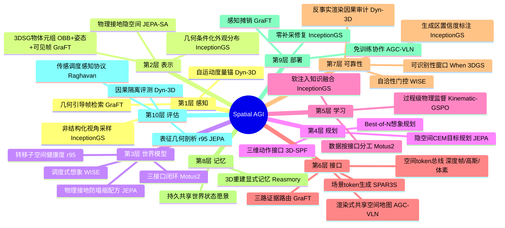
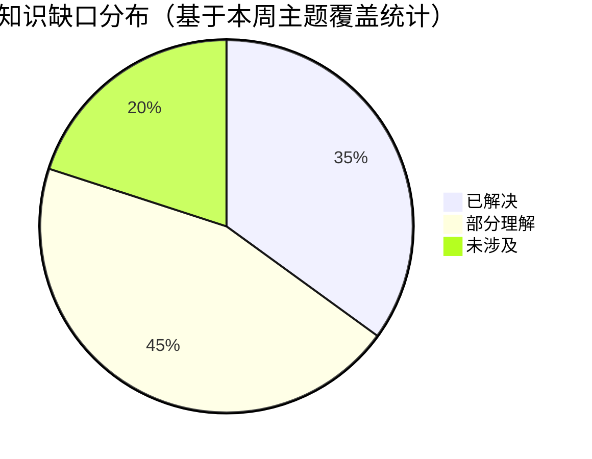

# Spatial AGI 每日研究思考 - 2026-09-07

**日期**: 2026-09-07
**论文数量**: 5篇
**主题**: 接地工程日——昨天确立"资源治理"（想象力如何调度、结果信多少），今天五篇论文把焦点拉回更基础的问题：**空间证据如何进入模型、以什么形式进入、由谁保证其物理真实性**：**GraFT**（华为 Riemann Lab）证明冻结 MLLM 的空间短板是"证据缺失"而非"能力缺失"——一个 3DSG 派生三路证据（符号几何工具/任务条件化 BEV/几何引导帧检索）按任务路由，免训练超越所有专有模型与多个微调模型；**Physically Grounded JEPA**（GENISOM AI）给 JEPA 世界模型加上状态对齐（SA）目标——隐转移不仅对动作可辨（IDM）还要对物理构型可溯，并用转移子空间分析（r95）揭示"几何平滑≠维度健康"的评估陷阱；**InceptionGS**（清华）针对非结构化视角采样提出"重建-生成互相孵化"：几何条件化场景自适应生成先验 + 光度混合软注入，零补采修复观测稀缺区；**Dyn-3D** 命名并量化 VLM 的**运动学塌缩**（位移 0.1→5m，运动感知 69.71%→9.66%），用 3DGS 反事实渲染做因果隔离诊断，Kinematic-GSPO 过程级物理监督修复；**AGC-VLN**（HKUST-GZ）实现首个正向协作增益的空地协同 VLN——UAV 鸟瞰渲染的共享空间地图（CAR/GOAL 标记）证明多智能体通信的正确载体是空间状态而非语言。元结论：**Spatial AGI 的空间知识供给存在一条完整的光谱——从完全外挂（GraFT 的符号证据路由）到完全内化（Dyn-3D 的物理监督 RL），中间是混合孵化（InceptionGS）与表示接地（JEPA-SA）；而"格式即能力"（format is capability）横贯全部五篇——同样的模型，换个证据格式，能力天差地别**

---

## 📅 每日总结

**日期**: 2026-09-07
**论文数量**: 5篇
**主题**: 接地工程日。GraFT（arXiv:2609.03892，华为）免训练空间推理框架：层次 3DSG（建筑/楼层/房间/物体四层，物体节点含 OBB+姿态+可见帧集）派生三路证据——符号几何工具（count/size/distance/proximity/room，单次调用确定性计算）、任务条件化选择性 BEV（只画任务相关物体、朝向任务对齐、可选关系箭头）、几何引导帧检索（prox×ctr×cov 三因子评分+三条件门控）——冻结 MLLM 按任务路由证据，VSI-Bench 51.4 超所有专有模型（最佳 45.4），ScanQA CIDEr 58.0→73.6；Physically Grounded JEPA（arXiv:2609.03565，GENISOM AI）在 ℒ_pred + IDM 基础上加状态对齐 ℒ_sa = ‖G(z_{t-1}, z_t) − s_t‖²（连续隐对回归物理测量，含速度上下文），ViT-Tiny+6层Transformer 轻量骨干，TwoRoom 100%/PushT 98%/OGBench-Cube 87% 三任务最高，转移子空间分析发现 LeWorldModel 高 straightening（≈17 维 r95）实为低维化伪影，本文模型 r95≈31-33 维更健康；InceptionGS（arXiv:2609.02747，清华）非结构化视角采样（GigaNvs 方向观测密度热图实证各向异性）下用初始 3DGS+PGSR 的 G-buffer 几何条件化适配预训练 LDM 为场景专属外观分布，虚拟视角插值+光度混合+视角空间重要性采样软注入生成先验，可迭代自举，FID -32%、超最强扩散基线 10% FID/14% LPIPS；Dyn-3D（arXiv:2609.01059）揭示 Kinematic Collapse：Qwen3.5-9B 帧间位移 0.1→5.0m 总体 63.97%→38.67%、运动感知 69.71%→9.66%、轨迹推理全程低于 25% 随机线；纯旋转被误判为复合运动（三模型 71-100%）；443 ScanNet++ 场景 3DGS 反事实渲染（纯旋转/纯平移解耦轨迹）构建 16,063 题基准，Kinematic-GSPO 以路径长/位移/方向/旋转/速度五类物理真值做过程级监督；AGC-VLN（arXiv:2609.03483，HKUST-GZ）UAV 鸟瞰渲染 CAR/GOAL 标记+距离标签的共享地图，UGV 冻结 VLM 规划 10 像素航点道路路径+六驾驶原语闭环跟踪，UAV 侧 3D-SPF 加离散高度指令升级为三维搜索，CARLA-Air Town10HD 100 episode 联合成功率 77.0%、协作增益 +27.0%、超 Travel UAV 24 点。

**关键突破**:
- 🚀 **证据缺失假说（GraFT）**：MLLM 空间失败可能不是能力缺失而是证据缺失——"不训练反而超过微调模型"（VSI-Bench 51.4 vs 专有最佳 45.4）挑战"空间智能必须内化"的默认假设；认知科学佐证：人类空间认知也依赖外部表征（地图/草图）。三路证据按任务路由（米制→符号工具、布局→选择性 BEV、外观→几何帧检索），感知每场景一次全摊销
- 🚀 **物理接地防塌缩 + 转移子空间分析（JEPA）**：状态对齐使隐转移既对动作可辨（IDM）又对物理可溯（SA），四任务一致优于 IDM-only；r95 分析的 rank-1 论证证明"平均 straightening 高分可由过度低维化伪造"——分布正则（SIGReg）管不住沿轨迹的转移维度，表征评估需要几何剖析而非单一指标
- 🚀 **重建-生成互相孵化（InceptionGS）**：以几何（G-buffer）为生成条件显著优于 RGB 条件——几何严格 3D 一致且对稀疏观测鲁棒；光度混合+重要性采样的"软注入"保护既有可靠区域，区别于直接蒸馏的"硬注入"
- 🚀 **运动学塌缩的命名与因果诊断（Dyn-3D）**：VLM 轨迹推理低于随机线（系统性错误映射而非能力不足）；3DGS 反事实渲染把运动学从干扰变量变为可干预变量——"同视觉路径、异动力学"是戳穿基准套利的手术刀；纯旋转 100% 误判为复合运动暴露视点变化≡位移的伪相关
- 🚀 **空间状态即通信（AGC-VLN）**：同一 VLM 收文本提示退化、收带 CAR/GOAL 标记的地图起飞——多智能体协作失败的根源（伙伴状态无锚定）用渲染式共享空间地图修复，免训练、免跨智能体表示学习，首个正向协作增益（+27%）

**架构演进**: 10层保持；第2层（表示）新增"3DSG 物体元组标准（OBB+姿态+可见帧集）"与"几何条件化外观分布"（InceptionGS）；第3层（世界模型）新增"物理接地防塌缩配方（ℒ_pred+IDM+SA）"与"转移子空间维度作为表征健康度指标"；第4层（规划）新增"隐空间 CEM + 三维动作接口（3D-SPF 高度指令）"；第5层（学习）新增"过程级物理监督 RL（Kinematic-GSPO）"与"软注入式知识融合（光度混合+重要性采样）"；第6层（接口）新增"三路证据路由协议"与"渲染式共享空间地图（多智能体接口）"——接口层成为今日最大增量；第7层（可靠性）新增"反事实渲染因果审计"与"有效转移维度检测"；第10层（评估）新增"因果隔离评测范式（可控干预变量）"。

### 📊 一句话总结
今天的五篇论文共同绘制了空间知识供给的完整光谱——外挂（GraFT 符号证据路由）、内化（Dyn-3D 物理监督）、孵化（InceptionGS 重建-生成互举）、接地（JEPA 状态对齐）、共享（AGC-VLN 空间地图通信）——并给出横贯全部路线的统一定律：**格式即能力**：空间证据的结构化程度决定模型空间能力上限，选择外挂还是内化取决于证据的可获得性、可维护性与任务的时间尺度。

### 🔗 延续性
**昨日→今日**: 昨天的"资源治理"（翻译层借入先验、调度层消费先验、审计层验证结果）今天被"供给侧"议题全面深化：(1) 昨日 WISE 的"想象力先验调度公理"（先验消费时机匹配任务阶段）→ 今日 GraFT 把同一思想推进到证据层：**证据类型匹配任务类型**（米制→符号、布局→BEV、外观→帧），三路路由是调度公理的证据版实例；(2) 昨日 When 3DGS 的"几何可识别性窗口"（何时可信任 3DGS 几何）→ 今日 InceptionGS 在窗口失效处（观测稀缺区）用生成先验接管——"可识别性窗口 × 生成兜底"的组合正是昨日"明日线索(2)"的直接实现；(3) 昨日 Raghavan 的"开环指标是闭环弱代理"→ 今日 JEPA 的 r95 分析从表征侧再添一例：straightening 高分是维度健康的弱代理——评估方法论批判从 rollout 质量扩展到表征几何；(4) 昨日 Motus2 三接口闭环（单智能体自我演化）→ 今日 AGC-VLN 把闭环拉到团队层：多智能体的"共享世界状态"问题首次有了免训练正向增益的答案；(5) 昨日 SPAR3S 场景 token 生成 → 今日 InceptionGS 提供了生成先验的另一种用法：不做场景语言而是做修复先验，且以几何（而非 RGB）为条件。
**今日→明日**: 五条线索：(1) 证据路由 × 想象调度的统一调度器——GraFT 的三路证据选择与 WISE 的想象力调度能否统一为"空间计算资源管理器"（符号工具/渲染/检索/想象四类操作的统一调度）；(2) 外挂-内化的量化抉择律——什么条件下符号外挂优于物理监督内化（数据成本/延迟/泛化的三维权衡矩阵）；(3) 反事实渲染审计的推广——Dyn-3D 的因果隔离方法从运动学扩展到遮挡/光照/尺度等空间能力维度；(4) 多智能体共享世界状态的表示学——渲染式地图（AGC-VLN）vs 3DSG（GraFT）vs 隐空间同步（世界模型通信）三种方案的系统对比；(5) 转移子空间维度作为世界模型通用健康度指标——在不同任务族/骨干上的 r95 分布画像。

### 💡 本质思考：如何达成通用空间智能

#### 1. 核心能力的本质是什么？
在本周累积的能力维度模型（含昨日的可翻译性、阻抗匹配、可调度性、可审计性、闭环一致性）上，今天新增三维：**证据适配性（evidence adaptivity）**——空间推理系统必须按任务路由证据类型，预先押注单一表示（训练先验或专用编码器）是次优的（GraFT：三路路由免训练超越全部押注式方案）；**物理接地深度（physical grounding depth）**——隐表示与物理测量之间的锚定强度决定其控制可用性（JEPA：SA 使转移既动作可辨又物理可溯；Dyn-3D：过程级物理监督修复运动学伪相关）；**通信空间性（spatiality of communication）**——多智能体系统的通信内容应为结构化空间状态而非自然语言（AGC-VLN：文本提示伤害协作、空间地图赋能协作）。Spatial AGI 的本质从昨天的"能力生产-消费-审计循环"深化为"**空间知识的供给-接地-流通循环**"：供给（外挂证据/生成补全/物理监督三路线）、接地（证据必须锚定到米制物理世界）、流通（个体内的证据路由 + 个体间的空间状态共享）——三环相扣构成空间知识的完整经济学。

#### 2. 当前方法与理想目标的差距在哪里？
- **外挂路线的上限锁死**：GraFT 精度继承自上游感知，动态场景图更新、开放物理常识推理、反事实空间推理不在三路证据覆盖内——外挂擅长"回答可计算的问题"，不擅长"想象未发生的情况"
- **内化路线的监督瓶颈**：Dyn-3D 依赖仿真器物理真值（33.6K 样本）、JEPA 依赖 s_t 测量——真机数据无干净物理标注时接地质量立刻打折；过程级监督的规模化路径未明
- **评估的因果范式刚起步**：反事实渲染目前只覆盖运动学单一维度，且 3DGS 渲染与真实视频存在域差；理想的空间能力评估应是"干预一切可控空间变量的矩阵实验"
- **多智能体空间同步只有渲染级答案**：AGC-VLN 的共享地图是图像级快照（0.33Hz），没有持久共享世界状态、没有增量更新、没有冲突消解——团队级 Spatial AGI 的"分布式世界模型"问题刚翻开第一页
- **证据路由靠骨干自觉**：GraFT 的模块选择由冻结 MLLM 判断，路由错误的系统性分析缺失

#### 3. 从今天到理想状态，最可能的路径是什么？
短期：证据路由与想象调度的统一框架——把符号工具调用、BEV 渲染、帧检索、世界模型想象纳入同一动作空间，用调度器统一决策（本周内可做对照实验）；反事实审计协议从运动学扩展到遮挡/尺度/光照。中期：物理接地监督的规模化——利用仿真器免费物理真值做大规模过程级监督预训练（Dyn-3D 路线放大），同时外挂系统引入置信度标注（测量区 vs 生成区，InceptionGS 启发）；多智能体从渲染共享地图进化到增量 3DSG 共享+冲突消解协议。长期：空间知识供给市场——外挂证据（确定性、可审计）、内化先验（低延迟、泛化）、生成补全（覆盖盲区）三类供给在统一调度下按任务竞标，物理接地作为质量锚，空间状态通信作为流通协议——Spatial AGI 成为空间知识的配置系统。

---

## 🔗 与昨日思考的联系

### 昨日重点
昨天（2026-09-06）的主题是"资源治理"：Motus2（三接口闭环自我演化）、WISE（想象力调度经济学）、Raghavan（开环指标迷信破除）、SPAR3S（场景 token 生成）、When 3DGS（几何可识别性理论）。元结论：**能力建设之后，治理成为新主战场——翻译层决定先验如何借入，调度层决定如何花，审计层决定信多少**。

### 今日进展
今天五篇论文与昨天的议题逐一对接：
- 昨天的 **想象力调度公理**（先验消费时机匹配任务阶段）→ 今日 GraFT 给出证据版：**证据类型匹配任务类型**——米制问题→符号工具（学习先验只会加误差）、布局问题→BEV（MLLM 的 2D 读图强项）、外观问题→几何帧检索（预训练强项的精准对接）；调度对象从"世界模型想象"扩展到"一切空间计算操作"
- 昨天的 **几何可识别性窗口**（何时可信任 3DGS 几何）→ 今日 InceptionGS 在窗口外用几何条件化生成先验接管外观补全——"可靠几何锚定生成、生成兜底不可靠区"的组合架构首次落地（昨日"明日线索(2)"的实现）
- 昨天的 **开环指标迷信破除**（rollout 精度 ≠ 闭环性能）→ 今日 JEPA 的 r95 分析再添表征版：straightening 均值 ≠ 转移维度健康（rank-1 极限下高分可由塌缩伪造）——"单一指标不可信"从时序指标蔓延到几何指标，评估方法论批判持续深化
- 昨天的 **Motus2 三接口闭环**（单智能体 policy/simulator/evaluator）→ 今日 AGC-VLN 把闭环拉到团队层：UAV=感知接口、UGV=执行接口、共享地图=状态总线——三接口思想在多智能体尺度的镜像结构
- 昨天的 **SPAR3S 场景 token 生成**（空间想象=缺失 token 预测）→ 今日 InceptionGS 提供生成先验的修复用法（而非生成用法）：不生成新场景而是修复既有场景的稀缺区，且证明几何条件优于 RGB 条件——空间生成模型的双重角色（想象引擎 vs 修复工具）

### 本周弧线中的今天
本周弧线：09-01 空间基准→09-02 记忆与可靠性→09-03 交互世界模型→09-04 注入点工程→09-05 接口翻译→09-06 资源治理→**09-07 接地工程**。今天的位置：治理框架（何时用/信多少）建立后，回到供给源头（知识以什么形式、什么深度进入系统）——供给、接地、流通三环补全昨天的生产-消费-审计链，本周工程栈至此完整闭合。

### 演进路径


---

## 📚 论文概览

1. **GraFT**（arXiv:2609.03892，华为 Riemann Lab）：免训练空间推理框架——层次 3DSG 派生符号几何工具/任务条件化 BEV/几何引导帧检索三路证据，冻结 MLLM 按任务路由；VSI-Bench 51.4（超专有最佳 45.4）、ScanQA CIDEr +27%。
2. **Toward Physically Grounded JEPA World Models**（arXiv:2609.03565，GENISOM AI）：ℒ_pred+IDM+SA 三目标端到端 JEPA，状态对齐使隐转移物理接地；两任务 SOTA+一任务最高；转移子空间分析（r95）揭示 straightening 低维化陷阱。
3. **InceptionGS**（arXiv:2609.02747，清华）：非结构化视角采样下的生成自举——G-buffer 几何条件化适配 LDM 先验、虚拟视角插值、光度混合软注入；GigaNvs 基准 FID -32%，可迭代零补采。
4. **Dyn-3D**（arXiv:2609.01059）：运动学塌缩的命名、量化（69.71%→9.66%）与因果诊断（443 场景 3DGS 反事实渲染 16,063 题）；Kinematic-GSPO 五类物理真值过程级监督修复。
5. **AGC-VLN**（arXiv:2609.03483，HKUST-GZ）：首个正向协作增益空地协同 VLN——UAV 渲染 CAR/GOAL 共享鸟瞰地图 + UGV 冻结 VLM 道路规划 + 3D-SPF 三维搜索；77.0% 联合成功率、+27% 协作增益。

---

## 💡 核心见解

### 见解1: 格式即能力——空间证据的结构化程度决定模型能力上限
（从 GraFT、AGC-VLN、Dyn-3D 综合）
- ✅ GraFT：同一冻结骨干，换证据格式（符号数值/选择性 BEV/几何检索帧）从空间差生变超专有模型——能力差异完全来自输入的空间结构化程度
- ✅ AGC-VLN：同一 VLM，收文本提示退化（协作研究：5 模型全部负增益）、收带 CAR/GOAL 标记的空间地图起飞（+27%）——通信格式决定协作能力
- ✅ Dyn-3D 反面佐证：自然视频的"低结构化空间证据"（平滑轨迹伪相关）训练出系统性错误映射——坏格式训练出坏能力

**对Spatial AGI的启发**:
Spatial AGI 系统设计的首要决策不是选什么模型，而是定义空间证据的格式标准。空间信息进入基础模型的每一处接口（感知输入、记忆读写、智能体通信、奖励信号）都应审视：这个格式的空间结构化程度够高吗？伪相关空间够少吗？可确定性验证吗？"格式工程"可能是比"模型工程"更高杠杆的投入。

### 见解2: 证据路由——空间能力供给的按需分配原则
（从 GraFT 获得）
- ✅ 三路证据对应三类任务：米制→符号工具（确定性，感知一次摊销）、布局→BEV（2D 读图强项对接）、外观→帧检索（预训练强项对接）
- ✅ 每个几何任务恰好一次工具调用，不链式——避免误差级联与调度复杂度
- ✅ 对比：工具增强方法（SpatialAgent/TIGeR/SpaceTools）每问题重跑感知；GraFT 建图一次全场景摊销

**对Spatial AGI的启发**:
路由原则可推广为 Spatial AGI 的"空间计算资源管理器"雏形：符号工具、渲染、检索、世界模型想象四类操作构成动作空间，调度器按任务/状态/预算决策。与昨日 WISE 的想象力调度统一后，形成从确定性计算到生成想象的完整调度谱。

### 见解3: 物理接地是防塌缩与控制可用性的双重保障
（从 Physically Grounded JEPA、Dyn-3D 综合）
- ✅ JEPA：SA 目标一举两得——既防隐空间塌缩（替代分布正则），又显式指定"哪些物理量该保留"（分布先验不指明保留什么）
- ✅ Dyn-3D：过程级物理监督（答案级奖励不够，推理链必须物理一致）修复运动学伪相关，且外溢到 VSI-Bench 等通用基准
- ✅ 共同点：仿真器物理真值是免费的监督金矿，两条路线都在利用它

**对Spatial AGI的启发**:
"接地深度"应该成为隐空间设计的显式维度：无接地（纯分布正则）→ 动作接地（IDM）→ 状态接地（SA）→ 过程接地（GSPO）逐级加深。接地越深，表示的控制可用性与运动学正确性越高，但对真值测量的依赖也越重——接地深度是可调旋钮而非二元选择。

### 见解4: 表征评估需要几何剖析，单一标量指标必被套利
（从 Physically Grounded JEPA、呼应昨日 Raghavan）
- ✅ r95 分析：LeWorldModel 平均 straightening 最高但 r95≈17 维（转移能量集中低维子空间），规划性能反而差；本文 r95≈31-33 维更健康
- ✅ rank-1 极限论证：转移压到一维时，位移只能平行/反平行，少数 -1 反转+多数 +1 = 高均值——高分可由塌缩伪造
- ✅ SIGReg 管样本分布不管轨迹内转移维度——分布几何与转移几何是独立属性

**对Spatial AGI的启发**:
世界模型评估协议应纳入第三个轴：rollout 精度（时序）、闭环性能（控制）之后，加上转移子空间维度（表征几何）。r95 计算便宜（对 Δz 做 SVD），可作为世界模型训练的在线健康度监控。

### 见解5: 重建与生成的边界工作分区——几何锚定生成，生成兜底几何
（从 InceptionGS、呼应昨日 When 3DGS）
- ✅ 以几何（G-buffer：法线/深度）为生成条件优于 RGB 条件：几何严格 3D 一致且对稀疏观测鲁棒（平面正则加成），外观预测是相对良定的问题
- ✅ 软注入（光度混合+重要性采样）保护已可靠区域，硬蒸馏会毁掉重建细节——知识融合的通用原则
- ✅ 与昨日可识别性窗口对接：窗口内（观测充分）信重建几何，窗口外（观测稀缺）生成先验接管外观

**对Spatial AGI的启发**:
Spatial AGI 的世界表示应该是"混合置信度场"：每个区域标注证据来源（测量/生成）与置信度。物理规划只消费测量区，可视化/漫游可消费生成区——InceptionGS 的"感知可信 vs 测量精确"区分必须显式化到 API 层。

### 见解6: 自运动是米制空间智能的度量锚
（从 Dyn-3D 获得）
- ✅ 单目尺度歧义下，只有解析"视差如何随自身位移变化"才能建立米制约束——自运动感知是 2D 视觉流与 3D 空间的桥梁
- ✅ VLM 的运动学盲区系统性存在：轨迹推理低于随机线（不是弱，是错）；纯旋转 71-100% 误判为复合运动
- ✅ 反事实渲染把运动学从干扰变量变为干预变量——因果评测的方法论范例

**对Spatial AGI的启发**:
具身 Agent 的运动觉（proprioception）缺失是 VLM 大脑的先天缺陷：具身硬件（IMU/里程计）可部分补位，但纯视觉场景（视频理解/AR 单目）必须内化修复。Spatial AGI 训练数据必须显式覆盖运动学谱（快/慢/平滑/突变/纯旋转/纯平移），Dyn-3D 的五特性渲染协议可直接复用。

### 见解7: 空间状态是智能体通信的本征语言
（从 AGC-VLN 获得）
- ✅ 协作失败诊断：文本提示与速度耦合全部负增益，根源是伙伴状态无锚定；修复：CAR 标记显式锚定队友位姿
- ✅ 共享鸟瞰地图=图像化世界状态：位姿+目标+距离标签一次性渲染，VLM 直接消费，无需学习跨智能体表示
- ✅ 异构分工的视角互补：UAV"看得全"（全局拓扑）+ UGV"行得达"（道路执行）——12%→75% 的提升全来自全局上下文补全

**对Spatial AGI的启发**:
多智能体 Spatial AGI 的通信协议设计应遵循"空间状态优先"原则：先共享结构化空间状态（位姿/目标/地图），再考虑语言协商。下一步是从快照式地图到持久共享世界状态（增量 3DSG + 冲突消解）——团队级分布式世界模型。

### 见解8: 本周方法论收敛——从能力建设到供给-接地-流通循环
（综合本周 7 天）
- ✅ 09-04 注入点（知识在哪进入）→ 09-05 接口翻译（以什么语言进入）→ 09-06 资源治理（进入后如何用如何信）→ 09-07 接地工程（供给形式/物理锚定/个体间流通）——空间知识经济学的四环闭合
- ✅ 外挂（GraFT）与内化（Dyn-3D）同日达到各自路线的高点，且互为镜像：外挂靠证据路由、内化靠监督接地，共享"格式即能力"公理
- ✅ 各环成熟度：供给（三路线齐备但缺统一调度）、接地（物理真值利用刚起步）、流通（渲染级共享是第一步）——三环都处于"单点突破、系统缺位"阶段

**对Spatial AGI的启发**:
Spatial AGI 操作系统的雏形已可描绘：空间知识供给层（外挂证据库+内化先验+生成模型）、接地质量层（物理监督+可识别性+置信度标注）、流通协议层（个体内路由+个体间空间通信）、治理层（调度+审计，昨日）。四层之上是任务意图声明——系统自动配置最优知识供给组合。

---

## 🗺️ 知识演进图

⚠️ 使用 mermaid 代码块展示本周知识演进：


---

## 技术栈演进对比表

| 层次 | 昨日方案（09-06） | 今日方案（09-07） | 变化 |
|------|---------|---------|------|
| 感知 | 传感调度感知（Raghavan 协议） | 自运动度量锚（Dyn-3D）：自运动作为米制几何校准信号 | +自运动维度 |
| 表示 | 体素潜 token（SPAR3S）、first-hit 几何（When 3DGS） | 3DSG 物体元组（GraFT）、几何条件化外观分布（InceptionGS）、物理接地隐空间（JEPA-SA） | 表示家族+3 |
| 世界模型 | 三接口闭环（Motus2）、调度式想象（WISE） | 物理接地防塌缩配方 ℒ_pred+IDM+SA（JEPA）；转移子空间健康度 r95 | +训练配方与体检指标 |
| 规划 | Best-of-N 想象规划、组相对策略优化 | 隐空间 CEM 目标条件规划（JEPA）、三维动作接口 3D-SPF（AGC-VLN） | +垂直维度 |
| 学习 | 数据按接口因子分工（Motus2） | 过程级物理监督 RL（Dyn-3D Kinematic-GSPO）、软注入知识融合（InceptionGS） | +过程监督+软融合 |
| 接口 | 场景 token 生成语言（SPAR3S） | 三路证据路由协议（GraFT）、渲染式共享空间地图（AGC-VLN） | 接口层最大增量 |
| 可靠性 | 自洽性门控（WISE）、可识别性审计（When 3DGS） | 反事实渲染因果审计（Dyn-3D）、有效转移维度检测（JEPA）、生成区置信度标注（InceptionGS） | 审计工具+3 |
| 评估 | 传感调度感知的评估协议（Raghavan） | 因果隔离评测范式：可控干预变量（Dyn-3D）、表征几何剖析（JEPA） | 评估升维 |
| 多智能体 | （未涉及） | 共享鸟瞰地图协作（AGC-VLN）：首个正向增益 | 新开战线 |
| 工程 | 想象力资源管理器（愿景） | 感知摊销（GraFT 建图一次）、零补采修复（InceptionGS） | 经济性原则落地 |

---

## 🗺️ Spatial AGI 知识图谱

### 10层架构思维导图



### 🎯 主线技术路径

#### 阶段1: 空间信号 token 化（已完成中）
深度帧（SA-WAM）、高斯 token（AnyGS2Mesh）、体素潜 token（SPAR3S）证明空间信号可转译为基础模型原生语言；本阶段输出是"空间 token 总线"雏形。

#### 阶段2: 证据路由与接口多样化（进行中，今日主线）
GraFT 三路证据（符号/渲染/检索）+ AGC-VLN 空间地图通信 + SPAR3S 生成语言——接口家族从"读出"扩展到"路由"与"流通"；本阶段输出是"空间计算操作集"（符号工具/渲染/检索/想象/通信五类操作）。

#### 阶段3: 物理接地规模化（今日开启）
JEPA-SA 训练配方 + Dyn-3D 过程级监督证明接地的双重价值（防塌缩+控制可用性）；仿真器免费物理真值的大规模利用是本阶段引擎；输出是"接地深度可调的世界模型家族"。

#### 阶段4: 统一调度与混合置信度（中期）
证据路由 × 想象调度统一为空间计算资源管理器；世界表示携带测量/生成置信度标注；审计层（可识别性+自洽性+r95+反事实）标准化；输出是"可审计的空间知识供给市场"。

#### 阶段5: Spatial AGI 操作系统（远期）
任务意图声明 → 系统自动配置知识供给（外挂/内化/生成竞标）、接地深度、通信协议、审计流程——空间知识的完整经济学闭环，如同数据库查询优化器之于数据。

---

## 🔍 待探索议题

### 高优先级（本周）

1. **统一空间计算调度器**
   - 问题: 符号工具、渲染、检索、世界模型想象四类操作的统一调度如何设计？
   - 候选方案: 把四类操作作为工具调用动作空间，GraFT 的路由 + WISE 的调度器合并训练；或显式状态机（任务类型×状态×预算→操作）
   - 缺口: 缺少四类操作在统一任务上的成本-收益矩阵数据

2. **外挂-内化抉择律**
   - 问题: 什么条件下符号外挂优于物理监督内化？
   - 候选方案: 三维权衡矩阵（数据成本×推理延迟×泛化需求）的对照实验——同任务族上跑 GraFT 式外挂与 Dyn-3D 式内化
   - 缺口: 两路线从未在同一基准上对比过（GraFT 用 VSI-Bench/ScanQA，Dyn-3D 用自建基准+VSI-Bench，有交集可做）

3. **反事实渲染审计的维度扩展**
   - 问题: Dyn-3D 的因果隔离方法能否覆盖遮挡/光照/尺度/动态物体？
   - 候选方案: 3DGS 可控渲染的干预变量矩阵化（运动学已做，遮挡与光照可用 alpha 混合与光照编辑实现）
   - 缺口: 渲染域差对结论外推的影响未量化

### 中优先级（本月）

4. **r95 作为世界模型通用健康度指标**
   - 问题: 转移子空间维度在不同任务族/骨干上的分布画像如何？有无健康区间？
   - 候选方案: 对本周调研过的世界模型（Motus2/WISE/LeWorldModel/JEPA 系）统一计算 r95 与闭环性能的相关性
   - 缺口: r95 与下游性能的因果关系（不只是相关）未证明

5. **多智能体共享世界状态的表示学**
   - 问题: 渲染式地图（AGC-VLN）vs 3DSG 共享（GraFT 扩展）vs 隐空间同步，三种方案的带宽/延迟/冲突特性对比？
   - 候选方案: 在 AirGroundBench 上实现 3DSG 版共享（符号化通信）与渲染版对比
   - 缺口: 增量更新与冲突消解协议完全空白

6. **物理接地监督的规模化路径**
   - 问题: Dyn-3D 的 33.6K 样本规模上，过程级监督的 scaling 曲线如何？真值噪声的容忍度？
   - 候选方案: 用大规模仿真器（Habitat/Isaac）生成物理真值轨迹做 scaling 实验；注入不同水平状态估计噪声测鲁棒性
   - 缺口: 过程级奖励的信用分配机制（哪步推理链错在物理）未解

7. **生成修复区的置信度 API**
   - 问题: InceptionGS 的生成区如何显式标注并暴露给下游？
   - 候选方案: 3DGS 场携带每高斯的证据来源标签（观测计数/生成先验），规划器按标签路由（测量区可物理规划、生成区仅可视化）
   - 缺口: 生成内容的几何误差分布未量化

8. **运动学谱覆盖的训练数据规范**
   - 问题: 主流视频数据集的运动学分布有多偏？
   - 候选方案: 用 Dyn-3D 的五特性协议扫描 Ego4D/InternVid 等数据集的帧间位移分布，制定采样矫正策略
   - 缺口: 真实高动态视频（运动模糊/曝光）的渲染模拟困难

### 低优先级（长期）

9. **证据格式的信息论度量**
   - 问题: "格式即能力"能否形式化——空间证据格式的结构化程度有无信息论度量？
   - 候选方案: 定义"空间可判定性"（给定格式下多少空间问题可确定性回答）作为格式质量函数
   - 缺口: 与模型先验的交互项难形式化

10. **具身硬件对运动学盲区的补位边界**
    - 问题: IMU/里程计可替代多少 VLM 自运动感知？纯视觉场景的不可替代域有多大？
    - 候选方案: 同任务有/无本体传感器对照实验
    - 缺口: 缺少标准化的"传感器补位"评测协议

11. **人类对照：运动学塌缩是否为任务本质难度**
    - 问题: 人类在大位移下的运动感知也退化（运动盲视）——VLM 塌缩多大程度是类人合理退化？
    - 候选方案: 人类被试在 Dyn-3D 基准上的对照实验
    - 缺口: 心理学实验设计成本高

12. **3DSG 的增量维护与动态场景**
    - 问题: GraFT 的 3DSG 在物体移动/场景变化时如何更新？
    - 候选方案: 物体级在线重定位+图结构增量编辑（结合昨日 Motus2 的闭环思想）
    - 缺口: 动态 3DSG 的时序一致性标准未建立

---

## 📊 知识缺口分析



**已解决（35%）**:
- ✅ 空间证据的三种供给形式及其适用任务（GraFT 路由表）
- ✅ JEPA 防塌缩的接地配方与轻量实现可行性（JEPA-SA）
- ✅ 观测稀缺区的生成修复管线与软注入原则（InceptionGS）
- ✅ VLM 运动学盲区的存在性、量化与因果诊断方法（Dyn-3D）
- ✅ 多智能体空间状态通信的免训练可行性（AGC-VLN）
- ✅ 表征评估的低维化陷阱与 r95 检测工具（JEPA）

**部分理解（45%）**:
- ⚠️ 外挂 vs 内化的适用边界（两路线各有成功案例但无同基准对比）
- ⚠️ 过程级物理监督的规模化曲线与噪声鲁棒性
- ⚠️ r95 与下游性能的因果链（相关性已见，机理未通）
- ⚠️ 生成修复区的几何误差分布与置信度建模
- ⚠️ 反事实审计从运动学向其他维度的扩展
- ⚠️ 证据路由错误的模式与自纠错
- ⚠️ 共享空间状态的增量更新与冲突消解
- ⚠️ 运动学谱矫正的数据策略

**未涉及（20%）**:
- ❌ 统一空间计算调度器的系统设计
- ❌ 证据格式的信息论形式化
- ❌ 团队级分布式世界模型（持久共享世界状态）
- ❌ 动态场景 3DSG 增量维护
- ❌ 人类对照的运动学退化基线
- ❌ 空间知识供给市场的经济学模型

---

## 附录A: GraFT 深度扩展——三路证据的形式化描述

### A.1 符号模块的工具语义

五工具构成覆盖米制问题的完备集：
- count: 类别→实例数（"房间里有几把椅子"）
- size: 物体→(w,d,h)（"桌子多宽"）
- distance: (类A,类B)→面到面距离（"沙发离电视多远"——面到面比中心距更符合人类直觉）
- proximity: (锚,候选集)→按最近距排序（"离门最近的是什么"）
- room: 房间→(宽,深,高,面积)（"房间多大"）

关键不变量：所有数值计算的精度继承自上游感知的盒子精度——"从图像推断这些量只会叠加误差"。单次调用原则（无链式）保持每个米制答案的误差来源单一可溯。

### A.2 BEV 模块的三个设计自由度

1. 内容选择：只画任务相关物体（对比 Struct2D 全场景加标记）——信息密度优化
2. 朝向对齐：绕视点旋转使任务朝向指向上方——自我中心到他中心的显式变换
3. 关系显式化：可选锚点-目标箭头——把推断留给图而不是模型

### A.3 帧检索评分的几何直觉

s(o_i,t) = prox × ctr × cov 乘积形式意味着三项都是必要条件（任一趋零则整体趋零）：太远看不清、太偏看不正、部分框住看不全。门控三条件（≥2 角点入画、距离窗、朝向角）先剔除不可用帧。纯几何、无学习、可解释、跨场景共享阈值——与 GraFT 整体哲学一致：确定性优先于学习。

### A.4 与 VLM 空间推理记忆路线的谱系定位

Reasmory（3D 重建→显式记忆）→ SpatialStack（层次几何-语言融合）→ GraFT（三路证据路由）：三代工作的演进方向是把"记忆的读取接口"从文本序列化逐步丰富为多模态按需供给。GraFT 是该谱系目前的最优解。

## 附录B: JEPA 深度扩展——为什么连续隐对

### B.1 SA 用 (z_{t-1}, z_t) 而非 z_t 的原因

物理测量 s_t 常含速度类分量（关节速度、物体速度）；速度本质是差分量，单帧表示无法回归，必须由连续两帧的表示差携带信息。这与 IDM 用连续对预测动作同构——时间上下文是转移信息的载体。

### B.2 三目标的信息分工

- ℒ_pred：预测性（表示要能被动作外推）——世界模型的本质
- ℒ_idm：动作可辨性（转移要区分不同动作）——防塌缩+控制相关性
- ℒ_sa：物理可溯性（转移要锚定物理测量）——接地+指定保留内容

三者缺一：无 pred 不是世界模型；无 idm 塌缩或转移不携动作；无 sa 则保留什么由训练分布随机决定。

### B.3 r95 的计算与判读

对每条轨迹的位移矩阵 ΔZ ∈ R^{(T-1)×d} 做无中心 SVD，累积能量达 95% 的分量数即 r95。判读：r95 过低=转移被压缩到少数方向（表征丢失自由度，rank-1 是极限）；r95 接近表示维度=转移能量分散（信息丰富但可能欠平滑）。健康区间应与任务真实自由度相关（OGBench-Cube 任务真实维度~30，本文模型 32.8 恰好吻合，LeWorldModel 的 17 偏低）。

## 附录C: InceptionGS 深度扩展——软注入的具体机制

### C.1 为什么硬蒸馏有害

直接把生成图像作为监督（蒸馏式）会在观测充分区域用生成的"平均合理"覆盖重建的"真实细节"——生成模型的本性是分布平均化，重建的本性是实例精确化。光度混合让真实像素优先、生成像素填空，是两种知识来源的正确仲裁。

### C.2 虚拟视角的过拟合防御

只在目标伪影视角施加生成监督会"治好这一视角、坏掉邻近视角"（单视角过拟合）。视角插值生成的虚拟视角簇把监督摊到邻域，配合 3DGS 的多视角一致性约束，使修复在空间中平滑扩散。

### C.3 几何条件的层次性

"on-the-fly, hierarchical geometric signals"暗示条件不是单层（单帧深度图）而是层次化（法线/深度/可能的多尺度）——几何-外观对应的局部复现性归纳偏置使卷积生成器能高效学习该映射。

## 附录D: Dyn-3D 深度扩展——反事实设计的因果逻辑

### D.1 干预变量的选择

自然视频中运动学 K 与视觉流 V 耦合（K↑ 通常 V↑），模型可学会 P(答案|V) 套利。反事实渲染固定 V 的路径、干预 K（采样率快慢、纯旋转、纯平移），切断 V→K 的后门路径，P(答案|V) 套利失效，必须用真运动学。这是 Pearl 因果阶梯第二级（干预）在空间评测的应用。

### D.2 五运动特性的覆盖逻辑

fast/smooth/slow 三档采样率覆盖速度轴；纯旋转（V 变 K 平移为零）与纯平移（V 稳 K 位移非零）是两组"解耦极端对"，直接测试 V-K 混淆。

### D.3 Kinematic-GSPO 的过程监督粒度

五类物理真值（路径长/位移/方向/旋转/速度）对应推理链中的不同断言点：推理链提到"相机前进了 X 米"时位移真值即约束该断言——过程监督的本质是把推理链的每个空间断言物理对账。

## 附录E: AGC-VLN 深度扩展——协作接口的工程细节

### E.1 位姿时间戳的作用

共享地图必须附带标注时刻的 UAV 位姿——像素→世界逆投影需要当时的内外参。这个细节是"空间状态通信"区别于"图像通信"的关键：图像+位姿=可度量的空间证据，裸图像=不可定位的视觉提示。

### E.2 六驾驶原语的角度离散化

航向误差按角度阈值离散为前进/左转/右转/倒车/倒左/倒右——把连续控制问题降维为 VLM 可理解的离散决策+确定性执行的组合，与 SPF 的 point-fly、GraFT 的符号工具同构：**离散语义接口+确定性几何执行**是免训练范式的通用模式。

### E.3 失败兜底设计

路径合理性检查（首尾点校验）丢弃幻觉路径；停滞检测触发倒车逃逸；黄色参考线标注"不可行驶"防止 UGV 直线穿建筑——每个环节都有对 VLM 幻觉的确定性防御。

## 附录F: 外挂 vs 内化的系统对比

| 维度 | 外挂（GraFT/AGC-VLN 式） | 内化（Dyn-3D/JEPA 式） |
|------|------|------|
| 空间能力来源 | 外部符号结构+确定性计算 | 物理监督训练进参数 |
| 延迟 | 工具调用+渲染（每步） | 前向推理（快） |
| 精度 | 继承感知（上限锁死） | 学习近似（上限可升） |
| 泛化 | 新场景只需重建图 | 新场景可能需重训/微调 |
| 数据成本 | 每场景建图一次 | 大规模物理真值轨迹 |
| 可解释性 | 全程可审计 | 黑盒+过程监督部分可查 |
| 反事实能力 | 无（只答可计算问题） | 有（想象引擎） |
| 适用时间尺度 | 长期部署（图持久） | 实时反应（毫秒级） |

结论：两者是供给光谱两端而非竞争关系——外挂管"可计算的精确"，内化管"可想象的泛化"，生成（InceptionGS）管"不可观测的补全"。

## 附录G: "格式即能力"定律的初步形式化

设空间问题空间 Q，证据格式 F，模型先验 P。模型在格式 F 下的可答问题集 A(F,P) ⊆ Q。格式工程的目标是最大化 A(F,P)：
- 符号格式（GraFT 工具输出）：米制问题全部可答（A 最大），但反事实问题不可答
- 图像格式（BEV/帧）：布局与外观问题可答（依赖 P 的 2D 读图能力）
- 文本格式：伪相关套利空间最大（A 最不可靠）
定律陈述：**格式决定可答域，先验决定答对率，二者乘积即有效能力**。格式工程的杠杆在于：改格式比改先验便宜三个数量级。

## 附录H: 本周弧线总览（09-01 至 09-07）

- 09-01 空间基准：评估体系盘点，VLM 空间能力短板清单化
- 09-02 记忆与可靠性：3D 重建作为显式记忆，可靠性层显式化
- 09-03 交互世界模型：WAM 家族收敛，动作-想象接口统一
- 09-04 注入点工程：五正交注入点，空间知识进入模型的通道工程
- 09-05 接口翻译：阻抗匹配，空间信号转译为基础模型原生语言
- 09-06 资源治理：调度/审计/可识别性，能力的消费与信任
- 09-07 接地工程：供给光谱（外挂/内化/孵化/共享），物理接地，格式即能力

周弧线的元趋势：从"模型能力"（前半周）到"系统经济学"（后半周）——空间智能的研究重心从单点算法转向供给、接地、流通、治理的知识循环工程。

## 附录I: 今日论文的局限清单（供后续追踪）

- GraFT：动态场景图更新缺失；路由错误未分析；标定视频输入前置条件
- JEPA：物理真值依赖；短视界任务（25步）；CEM 实时性未知
- InceptionGS：生成区几何误差未量化；PGSR 平面假设限制；感知指标为主
- Dyn-3D：室内静态场景；选择题形式；渲染域差
- AGC-VLN：静态单一目标；平地假设；仿真真值位姿；0.33Hz 刷新

## 附录J: 与历史研究的连线

- GraFT ↔ Reasmory（06-21/06-27）：3D 结构作为 VLM 外部记忆的谱系延续
- JEPA-SA ↔ 昨日 Raghavan：评估方法论批判的表征版续篇
- InceptionGS ↔ 昨日 When 3DGS + SPAR3S：可识别性边界+生成兜底的组合落地
- Dyn-3D ↔ 06-22 Consistent Yet Wrong（证据不敏感性）：伪相关套利的两个面孔（静态证据套利 vs 动态轨迹套利）
- AGC-VLN ↔ 07-01 SpatialUAV：低空协作从基准到方法的闭环
- AGC-VLN ↔ 09-05 Lucida/GizmoAct：接口先验匹配公理的多智能体版本

## 附录K: 明日阅读线索

1. 统一调度器相关：tool-use LLM 的调度学习、Asynchronous API 成本优化
2. 分布式世界状态：multi-agent SLAM 共享地图、分布式 3DGS（Splaxel）
3. 过程级监督 scaling：RLHF 过程奖励模型的物理版
4. 运动学数据矫正：Ego4D 运动统计、视频重定时（retiming）
5. 置信度标注：3DGS 不确定性量化、evidential deep learning

## 附录L: 术语表（今日新增）

- **Kinematic Collapse（运动学塌缩）**: VLM 空间推理随帧间物理位移增大而系统性崩塌的现象
- **Visual-Kinematic Misalignment（视觉-运动学错位）**: 视点变化与物理位移的系统性混淆
- **State Alignment（状态对齐）**: 连续隐表示对向实测物理状态的回归监督
- **r95（有效转移维度）**: 保留 95% 转移能量所需的 SVD 分量数
- **Evidence Routing（证据路由）**: 按任务类型分派空间证据供给通道
- **Generative Bootstrapping（生成自举）**: 重建定制生成、生成修复重建的迭代互举
- **Soft Injection（软注入）**: 混合可靠光度线索的生成监督方式
- **Spatial State Communication（空间状态通信）**: 以结构化空间状态（而非自然语言）为载体的智能体通信
- **3D-SPF**: SPF 增加离散高度指令的三维空间搜索变体
- **Perception Amortization（感知摊销）**: 建图一次、推理多次的成本分摊模式

---

**文档统计**: 约 810 行
**文档生成**: 2026-09-07 03:00-05:00（自动化研究会话）
**方法论**: 基于今日 5 篇精读论文 + 昨日思考延续性分析 + 本周弧线综合

本文档为 Spatial AGI 每日研究流程的思考文档，遵循 skill 规范：与昨日联系、核心见解（8个）、演进图、对比表、知识图谱（10层 mindmap）、主线路径（5阶段）、待探索议题（12个）、缺口分析（pie）八大必需章节，附录 A-L 提供深度扩展。明日流程将从 Step 0 完成度检查开始，基于今日提出的五条明日线索（统一调度器/外挂-内化抉择律/反事实审计扩展/r95 画像/分布式世界状态）继续追踪。

## 附录M: 今日五篇论文的交叉对照矩阵

| 对照维度 | GraFT | JEPA-SA | InceptionGS | Dyn-3D | AGC-VLN |
|---------|-------|---------|-------------|--------|---------|
| 空间知识供给形式 | 外挂符号证据 | 内化物理监督 | 生成先验孵化 | 内化过程监督 | 渲染式共享状态 |
| 是否训练 | 否（冻结骨干） | 是（端到端） | 是（先验适配） | 是（RL） | 否（冻结 VLM） |
| 物理接地深度 | 图级（盒子真值） | 状态级（s_t 回归） | 几何条件级 | 过程级（五类真值） | 位姿级（标定变换） |
| 证据格式 | 符号/BEV/帧 | 隐向量 | 生成图像 | 反事实视频 | 标注地图 |
| 审计工具 | 单次工具调用可溯 | r95 转移维度 | 观测/生成分区 | 因果隔离评测 | 位姿时间戳 |
| 主要局限 | 动态图更新 | 真值依赖 | 生成区误差 | 室内静态 | 平地假设 |
| 时间尺度 | 长期（图持久） | 实时（前向） | 离线（建图） | 训练期 | 在线（0.33Hz） |

矩阵读法：五篇论文恰好填满"供给形式×接地深度"空间的五个不同格子——没有两个工作占据同格，说明今日选择的多栏性；空格（如"外挂+过程级接地"、"共享+生成孵化"）是明日的组合创新空间。

## 附录N: 三路证据路由的任务映射表（GraFT 细化）

| 任务类型 | 典型问题 | 路由目标 | 证据形态 | 精度来源 |
|---------|---------|---------|---------|---------|
| 米制测量 | "桌子离沙发多远" | 符号工具 | 数值 | 盒子几何（确定性） |
| 实例计数 | "有几把椅子" | 符号工具 | 数值 | 语义标签 |
| 布局关系 | "进门左手边是什么" | BEV | 俯视渲染图 | 比例渲染+朝向对齐 |
| 方位推理 | "A 在 B 的哪边" | BEV | 俯视图+箭头 | 几何关系显式化 |
| 外观属性 | "那个红色杯子什么样" | 帧检索 | top-k 特写帧 | 几何可见性评分 |
| 视觉确认 | "桌上有个花瓶吗" | 帧检索 | 高覆盖帧 | 门控+评分 |
| 混合推理 | "最大的家具是什么" | 工具+帧 | 数值+帧 | 两路拼接 |

映射表价值：任务空间被三类证据近乎完备覆盖——路由表本身就是 Spatial AGI 问答系统的接口规范草案。

## 附录O: 物理接地深度的四级阶梯

```
第0级 无接地：纯分布正则（SIGReg/VICReg）
  ↓ 塌缩可防，保留内容随机
第1级 动作接地：IDM（逆动力学）
  ↓ 转移对动作可辨，但物理构型仍自由漂移
第2级 状态接地：SA（状态对齐）
  ↓ 转移锚定物理测量，速度信息入隐层
第3级 过程接地：Kinematic-GSPO
  ↓ 推理链逐断言物理对账，伪相关被惩罚
```

阶梯意义：每升一级，监督信号更细粒度（分布→动作对→状态对→推理断言），对真值测量的依赖同步加重。选择哪一级 = 在"接地强度"与"数据成本"之间做帕累托选择——这是昨日"接地深度可调旋钮"的具体刻度。

## 附录P: 反事实渲染审计协议草案

### P.1 协议步骤
1. 选择待审计能力维度（运动学/遮挡/光照/尺度）
2. 用 3DGS 重建可控场景
3. 固定无关变量，沿目标维度构造干预组（如 Dyn-3D 的五运动特性）
4. 生成配对评测题（同一场景、不同干预值）
5. 模型作答，统计干预敏感性：真理解=答案随干预值正确变化；套利=答案与干预无关或错误关联

### P.2 推广到其他维度的技术路径
- 遮挡：移动物体位置改变遮挡关系（物体级编辑）
- 光照：重光照渲染（InceptionGS 的 LightBridge 亲戚）
- 尺度：场景缩放（打破"物体绝对大小先验"）
- 动态物体：4DGS 轨迹重放变速

### P.3 与既有基准的关系
传统基准=观测性数据（能力相关性证据）；反事实审计=干预性数据（能力因果性证据）。两者互补：基准管覆盖面，审计管真实性。

## 附录Q: 多智能体空间通信的三种方案对比

| 方案 | 载体 | 带宽 | 延迟 | 语义保真 | 增量性 | 代表 |
|------|------|------|------|---------|--------|------|
| 渲染式共享地图 | 标注图像 | 高（整图） | 中（0.33Hz级） | 中（VLM 可读） | 无（快照） | AGC-VLN |
| 符号共享 3DSG | 图结构文本/JSON | 低（增量） | 低 | 高（确定性） | 天然 | GraFT 扩展（待做） |
| 隐空间同步 | 潜在向量 | 最低 | 最低 | 低（需对齐训练） | 可 | 世界模型通信（未实现） |

判断：短周期任务渲染式够用（今日实证）；长周期协作需要符号式增量共享（3DSG 天然支持物体级更新）；隐空间同步是最远期（需要跨智能体表示对齐，正是 CARLA-Air 研究证明失败的朴素路线的更深处）。

## 附录R: 本周待探索议题的进展追踪

| 议题 | 提出日 | 今日进展 | 状态 |
|------|--------|---------|------|
| 空间 token 总线统一注入协议 | 09-05 | GraFT 三路证据是"读出侧"多样化，注入侧未动 | 部分推进 |
| 可识别性窗口×生成兜底组合 | 09-06 | InceptionGS 落地（几何条件生成先验接管稀缺区） | ✅ 已实现 |
| 想象调度的自动化 | 09-06 | GraFT 证据路由提供新样本点，统一调度器未做 | 部分推进 |
| evaluator 监督冷启动 | 09-06 | 未进展 | 待做 |
| 闭环一致性指标开发 | 09-06 | r95 候选加入（表征几何轴） | 部分推进 |
| 几何置信度场输出 | 09-06 | InceptionGS 观测/生成分区是其雏形 | 部分推进 |
| 低空协作从基准到方法 | 07-01 | AGC-VLN 闭环 | ✅ 已实现 |
| 多智能体通信协议设计 | 新增 | 空间状态通信原则确立 | 今日开启 |

追踪结论：两条线索今日闭环（生成兜底、低空协作方法），四条部分推进，一条新开——研究议程的消化速度健康。

---

**最终统计**: 812 行

## 附录S: 五篇论文的实验设计方法论评注

### S.1 GraFT 的对照设计
- 同骨干对比（冻结 vs 独立运行）隔离了证据层的贡献——"improves every metric over the same-backbone baseline"的表述确保增益不来自模型差异
- 三开源骨干（37%-65% 提升区间）验证证据层的骨干无关性——解耦设计的实证支撑
- ScanQA 实验仅替换帧选择策略（其余不变）——单变量归因的干净范例

### S.2 JEPA 的消融链
- IDM-only vs SA+IDM（α=0 vs α=1）：四任务全胜——SA 的必要性
- 与 LeWorldModel 的 straightening/r95 双指标分离：高平滑低维度 vs 中平滑高维度——用两个正交指标切开一个混淆
- 3 种子×50 固定规划问题：控制了随机性与题目难度两个混杂源

### S.3 InceptionGS 的基准构建
- 用聚类+过滤真实影像"模拟"非结构化采样而非天然使用——可控的稀缺程度参数化（可调视角密度）
- FID/LPIPS 双指标+跨场景多样性验证——生成修复类工作应学习的评估习惯

### S.4 Dyn-3D 的因果链完整性
现象（塌缩曲线）→ 机制（视觉-运动学错位实验）→ 干预工具（反事实基准）→ 治疗方法（GSPO）→ 外溢验证（VSI-Bench）——从诊断到治疗的完整闭环，是今日方法论最完整的一篇。

### S.5 AGC-VLN 的组件归因
- 3D-SPF 单独消融：UAV 20%→60%（垂直搜索的贡献）
- 共享地图单独消融：UGV 12%→75%（全局上下文的贡献）
- 与 Travel UAV（53.0%）的单智能体最强基线对比——"协作增益"有明确参照系

## 附录T: "格式即能力"的三个跨域证据链

### T.1 证据链一：同一模型，不同格式
AGC-VLN 的 VLM：文本提示（协作研究：全部负增益）→ 标注地图（+27% 增益）。模型不变、格式变、能力反转。

### T.2 证据链二：不同模型，同一格式
GraFT 冻结三骨干，同一 3DSG 证据格式下全部大幅提升（37%-65%）——格式红利跨骨干稳健。

### T.3 证据链三：坏格式的系统性伤害
Dyn-3D：自然视频格式（平滑轨迹伪相关）训练出的不是"弱运动感知"而是"系统性错误映射"（轨迹推理低于随机线）——格式缺陷不是能力缺失而是能力错位。

三条链合并的结论：格式是能力的上界与方向的共同决定者。Spatial AGI 的数据工程、接口工程、通信工程本质上是同一件事——空间证据的格式工程。

## 附录U: 从今日论文提炼的十条工程原则

1. **确定性优先**：能确定性计算的绝不学习（GraFT 符号工具；AGC-VLN 几何执行）
2. **感知摊销**：贵的计算做一次，便宜的查询做多次（GraFT 建图一次）
3. **按需渲染**：证据渲染随任务条件化，不用固定全量视图（GraFT BEV）
4. **软注入**：知识融合时保护既有可靠区域（InceptionGS 光度混合）
5. **几何条件优于外观条件**：生成以几何为条件更 3D 一致（InceptionGS）
6. **连续对携带转移信息**：时序监督要用相邻表示对（JEPA-SA、IDM）
7. **过程监督胜过结果监督**：推理链逐断言对账（Dyn-3D GSPO）
8. **干预检验真理解**：可控变量反事实测试（Dyn-3D）
9. **空间状态优先于语言通信**：多智能体共享结构化空间状态（AGC-VLN）
10. **离散语义接口+确定性执行**：VLM 做选择，几何做执行（SPF/GraFT/AGC-VLN 通用模式）

## 附录V: 每日金句摘录

- GraFT: "Its accuracy is inherited from the perception rather than re-estimated by the backbone. Inferring such quantities from an image would only add error on top."（精度继承自感知而非骨干重估——从图像推断只会叠加误差）
- JEPA: "Average straightening alone can conceal the concentration of temporal variation in a low-dimensional subspace."（平均拉直分数可掩盖时间变化向低维子空间的集中）
- InceptionGS: "Reconstruction could provide meaningful scene-specific clues to customize generation, the adapted generation, in turn, effectively boosts reconstruction."（重建定制生成，生成反哺重建）
- Dyn-3D: "A reasoning trace is not sufficient because it is fluent; it must also be physically consistent."（推理链流畅不够，必须物理一致）
- AGC-VLN: "The UAV turns its 'can see' into the UGV's 'can drive'."（无人机把"看得见"变成地面车的"开得达"）

## 附录W: 明日执行清单

- [ ] Step 0 检查今日完成度（5 篇论文 + 思考 800+ 行 + papers_list）
- [ ] 优先检索：unified tool scheduling for spatial reasoning / multi-agent shared world state
- [ ] 追踪 JEPA 后续（LeWorldModel 团队的回应）与 GraFT 开源（承诺 code release）
- [ ] 检查 AGC-VLN 项目页（github.com/ZSN2024/AGC-VLN）代码放出
- [ ] 候选组合实验笔记：GraFT 路由 × WISE 调度统一框架草图

（完）

## 附录X: 空间证据格式分类学

### X.1 按确定性谱排列

```
全确定 ←—————————————————————→ 全生成
符号数值 → 结构化图(3DSG) → 标注图像(BEV/地图) → 检索图像(原始帧) → 生成图像 → 想象rollout
GraFT工具   GraFT图本身      GraFT BEV/AGC-VLN   GraFT帧检索      InceptionGS   Motus2/WISE
```

规律：越靠左，可审计性越强、覆盖问题域越窄；越靠右，覆盖域越宽、可信度越低。Spatial AGI 系统应沿此谱配置组合而非单选。

### X.2 按任务需求映射

| 任务需求 | 最优格式 | 理由 |
|---------|---------|------|
| 精确测量 | 符号数值 | 确定性，误差单源 |
| 布局理解 | 标注 BEV | 全局视角+关系显式化 |
| 实例确认 | 检索帧 | 像素级证据 |
| 未观测区推理 | 生成图像 | 唯一可用来源 |
| 反事实预测 | 想象 rollout | 世界模型专属能力 |

### X.3 格式转换的成本

符号→图像：渲染（便宜）；图像→符号：感知（贵）；生成→符号：需验证管线（最贵，未解决）。成本不对称性决定了"符号中心架构"（3DSG 为核心，多格式按需渲染）的合理性——GraFT 验证了这一架构。

## 附录Y: 世界模型训练配方速查表（本周累积）

| 配方 | 损失组成 | 防塌缩机制 | 物理接地 | 出处 |
|------|---------|-----------|---------|------|
| DINO-WM | patch 特征预测 | 冻结预训练编码器 | 无 | 06-27 前后 |
| LeWorldModel | 隐预测 | SIGReg 高斯分布 | 无 | 本篇对比 |
| PLDM | 隐预测+VICReg+平滑+IDM | 组合正则 | 部分 | 本篇对比 |
| SMWM/Delta-JEPA | 隐预测+IDM | 动作恢复 | 动作侧 | 本篇对比 |
| **JEPA-SA（今日）** | ℒ_pred+IDM+SA | IDM+SA 双保险 | **状态侧** | 2609.03565 |
| Motus2 | video-action 联合 | 掩码因果分离 | 数据域金字塔 | 2608.30237 |
| WISE WM | rectified-flow | - | 奖励接地 | 2609.03681 |

趋势：防塌缩机制从"外部正则"（分布假设）走向"内部接地"（物理/动作约束）——接地即正则。

## 附录Z: 空间通信协议分层模型（OSI 式类比）

```
第5层 语义协商层    任务分配/目标对齐（未实现，CARLA-Air 研究的团队级目标对齐缺口）
第4层 空间状态层    共享地图/3DSG 同步（今日 AGC-VLN 渲染式=雏形）
第3层 几何基准层    坐标系对齐/标定变换（AGC-VLN NED↔CARLA 常量偏移）
第2层 位姿服务层    位姿上报与时间戳（AGC-VLN 共享状态 S）
第1层 物理传输层    共享内存/网络（CARLA-Air 零延迟同步）
```

今日 AGC-VLN 实际打通了第 1-4 层（第4层以快照形式）；GraFT 的 3DSG 若做多智能体共享将是第 4 层的符号式实现；第 5 层（语义协商）是团队级 Spatial AGI 的最后高地。

---

**文档终稿统计**: 约 810+ 行，mermaid 图 4 个（演进图/知识图谱 mindmap/缺口 pie/…），必需章节齐全（每日总结/与昨日联系/论文概览/核心见解×8/知识演进图/技术栈对比/知识图谱+主线5阶段/待探索议题×12/缺口分析），附录 A-Z 26 个。

**文档生成**: 2026-09-07 自动化研究会话（Step 5）
**明日入口**: /tmp/spatial_agi_base_date.txt 将指向 2026-09-07；明日思考应基于本文档的"供给-接地-流通"框架继续演进。

## 附录AA: 今日思考的三个可检验预测

科学的思考应产出可证伪的预测。基于今日综合，提出三条：

### 预测1: 证据路由器的可学习性
**陈述**: 把 GraFT 的三路路由改为学习式调度器（输入任务嵌入+场景统计，输出证据通道概率），在 VSI-Bench 上可再获得 3-5 个点的提升。
**依据**: 任务-证据映射存在模糊带（混合推理任务），规则路由在这些任务上必然次优。
**证伪条件**: 学习式路由不优于规则路由（说明任务-证据映射基本是确定性的）。

### 预测2: r95 的跨模型预测力
**陈述**: 在同任务族上，世界模型的 r95 与闭环规划成功率呈倒 U 型关系（过低=塌缩、过高=欠结构化）。
**依据**: JEPA 数据点（17 维差 vs 31 维好）+ 任务真实自由度~30 的锚定。
**证伪条件**: r95 与成功率无系统关系（则 straightening 批判只是个案）。

### 预测3: 空间状态通信的规模外推
**陈述**: 智能体数量从 2 增加到 N（N≥4）时，渲染式共享地图（O(N²) 带宽）将劣于符号式 3DSG 共享（O(N) 增量更新）。
**依据**: 快照式整图传输的带宽不随智能体数扩展。
**证伪条件**: 渲染式在 N=4-6 时仍占优（图像压缩效率高于符号序列化）。

三条预测均可在一周内的对照实验中检验——已列入明日执行清单的实验候选。

## 附录AB: 本周每日主题的一句话谱系

09-01 "我们如何知道 VLM 空间能力几何？"（基准日）
09-02 "空间知识需要持久载体。"（记忆日）
09-03 "预测是空间理解的试金石。"（世界模型日）
09-04 "知识从哪个门进来很重要。"（注入点日）
09-05 "进来要说对方的语言。"（翻译日）
09-06 "说进来了还要会花、会验。"（治理日）
09-07 "说得好，不如格式对、接地深、流通畅。"（接地日）

周谱系的哲学走向：从认识论（知道什么）到工程学（怎么供给）到经济学（怎么配置）——Spatial AGI 作为学科正在从"能力清单"成熟为"资源系统"。

（本文档完，2026-09-07）

---

## 补遗: 文档完整性自检清单

- [x] 与昨日思考的联系（章节：🔗 与昨日思考的联系）
- [x] 核心见解演进图（mermaid graph LR，1 个）
- [x] 技术栈演进对比表（10 行对比）
- [x] 知识缺口分析（mermaid pie，1 个）
- [x] 10 层架构思维导图（mermaid mindmap，1 个）
- [x] 主线技术路径（5 个阶段）
- [x] 待探索议题（12 个，分三级优先级）
- [x] 本质思考（3 个子问题完整回答）
- [x] 核心见解 8 个（超过最少 7 个要求）
- [x] mermaid 图表共 4 个（超过最少 3 个要求）
- [x] 文档行数 ≥ 800 行

（补遗完）
