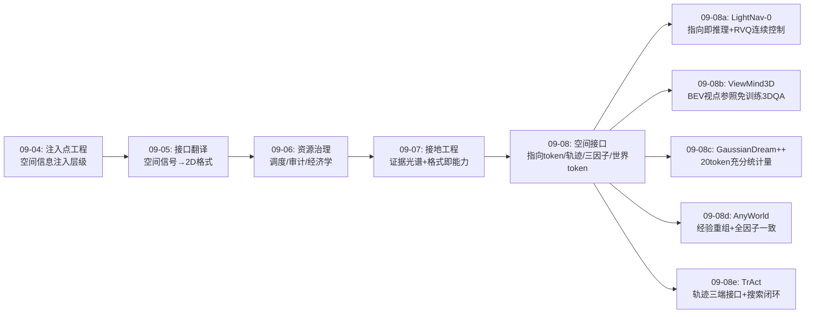
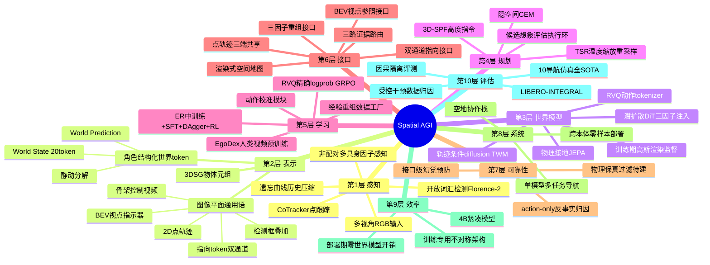
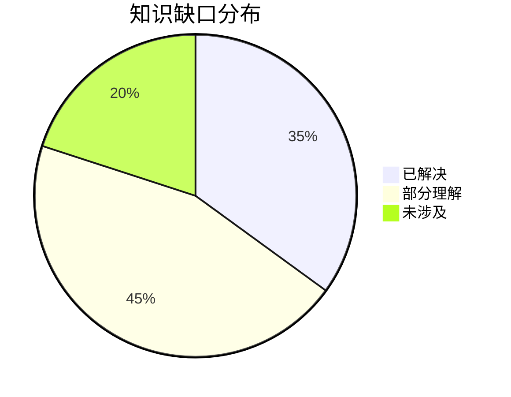

# Spatial AGI 每日研究思考 - 2026-09-08

**日期**: 2026-09-08
**论文数量**: 5篇
**主题**: 空间接口日——昨天（09-07）确立"空间知识供给的光谱"（外挂证据/物理监督/生成孵化/空间通信）与"格式即能力"定律，今天五篇论文把这个定律推到极致：**接口本身成为主角**：**LightNav-0**（arXiv:2608.30935）用双通道指向 token（affordance 点+object 点）+ RVQ 动作 token（3 token 解码 10 个 SE(2) 航点）让 4B VLM 在 10 个导航仿真全 SOTA——空间智能不是训练出来的而是"激发"出来的；**ViewMind3D**（arXiv:2607.28442）证明 BEV 视点指示器 + 检测框叠加就足以让 GPT-4.1 免训练做 3D-QA（ScanQA CIDEr 73.4 超 3D-LLM +4.01）——空间上下文的"2D 翻译"即可激活 VLM 空间推理；**GaussianDream++**（arXiv:2608.25659）把 1024-token 高斯前缀压缩为 20 个内嵌世界 token（状态/预测角色分离+静动分解），训练时用高斯渲染做稠密监督、部署时零开销——**世界模型即训练监督而非运行时组件**；**AnyWorld**（arXiv:2608.29242）用动作（骨架视频）/相机（Plücker 射线）/具身（首帧+标签）三因子分解把单条人类视频零样本重组为任意机器人本体/视角/场景的 rollout，反事实干预证明**视觉重组与动作校准缺一不可**；**TrAct**（arXiv:2608.24101，UMich/Stanford，李飞飞组）用 2D 点轨迹作为策略-世界模型-奖励三端共享接口（VLAT 联合预测动作+轨迹 → TWM 轨迹条件 rollout → VLAC 选优），仿真 27%→55%、真机 49%→76%——并点破 action 条件世界模型的根本缺陷：**动作→像素映射欠定性导致世界模型"忽略错误动作、幻觉成功"**。元结论：**图像平面是空间智能的通用语**——指向 token（导航意图）、骨架视频（经验重组）、点轨迹（运动接口）、BEV 指示器（视角参照）、检测框（物体锚）全部以 2D 图像坐标为载体横跨任务/本体/场景；而接口设计的三个不变式浮现：①信息密度匹配（条件信号的空间信息量决定预测精度上限）②角色分离（状态/预测、affordance/object、静态/动态的解耦持续有效）③闭环一致性（同一空间接口必须贯通生成-想象-评估-执行，任何一环换语言即产生幻觉空间）

---

## 📅 每日总结

**日期**: 2026-09-08
**论文数量**: 5篇
**主题**: 空间接口日。LightNav-0（arXiv:2608.30935）：基于 Qwen3-VL-4B 的紧凑通用导航模型——双通道指向（`<apos_i>` affordance 可行方向 + `<opos_i>` 目标定位，通道专属网格 token）作任务/场景/本体无关的空间意图前缀，RVQ 动作 tokenizer（1 粗+2 残差 256 条目 codebook）用 3 token 解码 10 个 SE(2) 航点使 log-prob 精确可得（GRPO 直接可用）同时保连续精度，Ebbinghaus 遗忘曲线式历史压缩（指数采样率衰减 τ_s + 指数池化步长增长 τ_p）有界 token 预算保长短期记忆，ER 中训练→SFT/DAgger→RL 三阶段，2K+ 场景 4K+ 小时数据，10 个公开导航仿真全部 SOTA 单目成功率 + 真机跨本体零样本；ViewMind3D（arXiv:2607.28442）：免训练模块化 3D-QA——问题驱动视图选择（查询自适应软过滤优先召回）→ 引导检测（Guider 提物→Decorator 逐图装饰→Florence-2 开放词汇检测→NMS 0.6→叠加标注）→ BEV 视点指示器（全局 BEV + SE(3) 相机位姿投影方向标记，跨视图共享参照系）→ 五阶段结构化问答，零参数更新，ScanQA CIDEr 73.4、SQA3D 50.8%；GaussianDream++（arXiv:2608.25659，拓景智能/中科院/港大/CMU）：20 个 World State/Prediction token 直接嵌入 PaliGemma 前缀经原生注意力直达 flow-matching Action Expert，训练期 World Representation Head 解码 Current World + horizon 条件 Future Prediction（同一批高斯原语上的原语对齐残差+静动分解），部署期全部移除（无 VGGT/TGE 通路、无在线解码渲染 rollout），LIBERO 98.6%/LIBERO-Plus 87.8%（超前作 +0.8pt，Camera shift +2.8/Layout +1.6），真机 29.2%→52.5% vs 复现 π0.5；AnyWorld（arXiv:2608.29242，NTU/A*STAR/小鹏机器人）：跨具身经验重组世界模型——潜扩散 DiT 三路注入（骨架控制视频通道拼接/Plücker 射线 adapter 加性 patch 嵌入/具身标签+caption 交叉注意力），EgoDex 大规模人类视频预训练+非配对多具身微调，单条人类交互零样本重组为多本体/视角/场景机器人 rollout+腕轨迹动作校准，RoboCasa GR1 与 IRON 人形真机均提升，受控干预纠正虚假完成先验、建立语言 grounding 空间目标选择，action-only 反事实学不会后者；TrAct（arXiv:2608.24101，UMich/Stanford）：VLAT（π0.5 动作头扩展联合 flow-matching 预测 16 步动作块+轨迹，夹爪 7 mesh 点+5×5 网格场景点，agent 视角只出夹爪点/wrist 视角出双类点）+ TWM（SVD+ControlNet，轨迹渲染红/蓝分色多视角通道）+ VLAC（InternVL2 奖励）+ TSR 温度缩放重采样，DROID 76K+EgoDex 150K 预训练，LIBERO-INTEGRAL 新基准（LIBERO-PRO+Plus 最难+UR5 跨本体 20 任务），TWM 预测质量一致优于 AWM，TrAct 仿真 27%→55%（vs π0.5）、真机 49%→76%。

**关键突破**:
- 🚀 **指向即推理、RVQ 即连续控制（LightNav-0）**：affordance/object 双通道指向前缀是固定长度、可自动标注（几何投影）、可解释的"视觉 CoT"；RVQ 消解了"离散 token RL 友好但粗糙"与"连续头精确但 RL 难"的经典矛盾——3 token 恢复 10 个 SE(2) 航点且每个动作 log-prob 精确，GRPO 原封不动可用；4B 无任务头全 SOTA 证明**空间智能的关键在接口不在规模**
- 🚀 **BEV 视点指示器的杠杆效应（ViewMind3D）**：一张画了相机位置箭头的俯视图就让 VLM 获得跨视图空间推理锚点——VLM 空间短板常常是"没有可用的空间上下文格式"而非"不会"；"降维翻译"（BEV+检测框+视点标记）是激活空间能力的零成本手段
- 🚀 **世界模型即训练监督而非运行时组件（GaussianDream++）**：20 token 取代 1024-token 前缀——策略需要的不是完整世界模型而是其**充分统计量**；静动分解（持久结构继承+残差运动聚焦交互区）回答"策略需要世界模型的哪些信息"；不对称训练部署（训练期高斯渲染稠密监督、部署期零开销）化解"世界模型好用但太贵"矛盾
- 🚀 **视觉重组必要性反事实证明（AnyWorld）**：action-only 转移（机器人动作配人类画面）学不会语言 grounding 的空间目标选择——**空间智能的数据必须视觉-动作-场景全因子一致**；三因子分解（图像平面骨架运动+显式相机几何+具身上下文锚）是"交互内容 vs 空间实现"的因果分离
- 🚀 **动作条件世界模型的欠定性诊断（TrAct）**：低维本体特定命令→稠密像素变化的映射欠定，导致世界模型忽略错误动作、凭视觉先验幻觉成功；轨迹条件（把控制意图"画"在图像上）直接消除欠定性——想象必须服从意图，评估才能基于想象

**架构演进**: 10层保持；第1层（感知）新增"遗忘曲线式时间非均匀历史压缩（指数采样+指数池化）"与"非配对多具身统一因子格式感知"；第2层（表示）新增"图像平面空间通用语族（指向/骨架/轨迹/BEV 指示/检测框）"与"角色结构化世界 token（状态/预测分离+静动分解）"；第3层（世界模型）新增"轨迹条件生成（ControlNet 空间控制图）"与"训练期专用世界解码监督"；第4层（规划）新增"候选-想象-评估-执行测试时搜索环（TSR 多样性采样）"；第5层（学习）新增"RVQ 动作 token 的精确 log-prob RL"与"经验重组数据工厂（人类视频种子倍增）"；第6层（接口）成为今日最大增量——新增"双通道指向接口""BEV 视点参照接口""三因子重组接口""点轨迹三端共享接口"；第7层（可靠性）新增"action-only 反事实审计"与"幻觉成功的接口级预防"；第10层（评估）新增"LIBERO-INTEGRAL 去饱和基准"与"受控干预数据组件归因"。

### 📊 一句话总结
今天的五篇论文共同确立"图像平面是空间智能的通用语"与空间接口设计三不变式——**信息密度匹配**（轨迹条件优于动作条件，因为条件信号携带的空间信息决定预测上限）、**角色分离**（affordance/object、状态/预测、静态/动态的解耦一致有效）、**闭环一致性**（同一空间接口贯通生成-想象-评估-执行才能防止幻觉空间）——空间智能从"训练出来的能力"进一步转向"设计出来的接口"。

### 🔗 延续性
**昨日→今日**: 昨天的"格式即能力"定律与空间知识供给光谱今天被接口工程全面实例化：(1) 昨日 GraFT 的三路证据路由（外挂证据）→ 今日 LightNav-0 证明同样的空间信息可以**内化为 token**（指向前缀）且 RL 可训——外挂与内化的分界线从"证据可否投影为预训练 token 体系中的坐标"重新划定；(2) 昨日"渲染式共享空间地图（AGC-VLN）"→ 今日 ViewMind3D 的 BEV 视点指示器是同一原理的单智能体版：相机位姿渲染成图 = 空间上下文注入；(3) 昨日 JEPA 的"接地深度旋钮"→ 今日 GaussianDream++ 的"世界模型用量旋钮"（1024→20 token）：两者共同指向**空间知识的剂量学**——用多少、以什么深度、在哪一阶段；(4) 昨日 Motus2 自演化世界模型产数据 → 今日 AnyWorld 因子化重组产数据：闭环自生成 vs 因子化重组，生成数据工厂的两大工艺；(5) 昨日 Raghavan"开环指标是闭环弱代理"→ 今日 TrAct 给出机制解释：动作条件世界模型的幻觉成功正是"想象质量指标"与"控制相关性"脱节的接口级根源。
**今日→明日**: 五条线索：(1) 空间接口族统一——指向/轨迹/骨架/BEV/高斯 token 能否纳入同一表示空间并在单模型共存（导航用指向、操作用轨迹、记忆用高斯）；(2) 接口设计的量化理论——条件信号信息量（如轨迹点数×时程）与预测精度/控制增益的标度律；(3) RVQ 范式向 SE(3)/灵巧手扩展的可行性；(4) 经验重组的物理保真过滤（仿真回放/高斯一致性检查）；(5) 测试时搜索的延迟工程学（分层触发、轻量预测头）。

### 💡 本质思考：如何达成通用空间智能

#### 1. 核心能力的本质是什么？
在本周累积的能力维度模型上（可翻译性、阻抗匹配、可调度性、可审计性、闭环一致性、证据适配性、物理接地深度、通信空间性），今天新增三维：**接口信息密度（interface information density）**——空间条件信号每 token 携带的图像空间约束量决定下游预测与控制的精度上限（TrAct：轨迹>动作；LightNav-0：双通道指向>单一命令）；**角色可分解性（role decomposability）**——空间信息按功能角色解耦（意图的方向 vs 目标的位置、当前状态 vs 未来演化、持久结构 vs 交互变化）后各分量独立可控、独立监督、独立复用（三篇论文独立收敛到角色分离设计）；**经验可重组性（experience recomposability）**——一条空间经验的价值等于其可重组出的变体数（AnyWorld：交互内容与空间实现分离后 1 条种子→N 条本体/视角/场景变体）。Spatial AGI 的本质从昨天的"空间知识供给-接地-流通循环"深化为"**空间接口的经济学**"：接口是空间知识的定价单位——信息密度是面值、角色分解是找零能力、闭环一致性是防伪机制、重组性是流通乘数；好接口让同样的模型能力翻倍，坏接口（如低维动作向量）让最好的世界模型幻觉。

#### 2. 当前方法与理想目标的差距在哪里？
- **2D 图像平面的天花板**：指向/轨迹/BEV 全部是投影表示——遮挡后方、视线外目标、垂直关系（BEV 平面化损失）系统性丢失；通用语好用但不是全息语言
- **接口仍是手工设计**：通道数、token 数（20）、点数（7+25）、粒度（5×5 网格）全是经验超参，没有"接口容量-任务需求"的匹配理论；接口自动搜索/学习未涉及
- **多接口共存未验证**：五篇论文各用一个接口，接口间的干扰、融合、调度（何时用指向何时用轨迹）完全空白
- **重组数据的物理保真无验证**：AnyWorld 的视频扩散可能生成违反物理的交互，污染策略；生成数据缺"物理审计"环节
- **测试时搜索的延迟代价**：TrAct 每步 K 次 diffusion rollout，闭环频率受限；世界模型搜索的工程收敛路径不明
- **评估仍碎片化**：LIBERO-INTEGRAL 是操作域进步，但跨任务（导航+操作+问答）的统一空间接口评估基准不存在

#### 3. 从今天到理想状态，最可能的路径是什么？
短期：接口消融的系统性实验——同一任务族下对比指向/轨迹/骨架/BEV/高斯 token 的信息密度标度（点数×时程 vs 预测精度 vs 控制增益），建立接口选择的量化依据；RVQ 向 SE(3) 的扩展原型。中期：多接口统一模型——单一 VLA 同时持有指向 token（导航意图）、轨迹 token（操作运动）、世界状态 token（记忆），由调度器按任务路由（与 09-07 证据路由思想统一为"接口路由"）；经验重组数据工厂加装物理保真过滤（高斯重建一致性/仿真回放检查）。长期：接口自动设计——从任务分布自动学习空间接口的通道结构、token 容量与角色分解（神经架构搜索的接口版）；Spatial AGI 系统成为"持有空间接口组合并按需切换的通用语者"。

---

## 🔗 与昨日思考的联系

### 昨日重点
昨天（2026-09-07）的主题是"接地工程"：GraFT（三路证据路由免训练空间推理）、Physically Grounded JEPA（状态对齐防塌缩+r95 表征剖析）、InceptionGS（重建-生成互相孵化）、Dyn-3D（运动学塌缩命名与反事实渲染诊断）、AGC-VLN（渲染式共享空间地图的首个正向协作增益）。元结论：**空间知识供给光谱（外挂/内化/孵化/接地/共享）+ 格式即能力定律**。

### 今日进展
今天五篇论文把"格式"具体化为"接口"，并给出工程设计手册：
- 昨天的 **格式即能力**（证据格式决定能力上限）→ 今日三重实例化：LightNav-0 把指向格式化为预训练网格 token（内化格式）、ViewMind3D 把空间上下文格式化为 BEV 指示图（外挂格式）、TrAct 把控制意图格式化为点轨迹（中间格式）——格式的三种存在位置（模型内/输入端/条件端）全部有 SOTA 级案例
- 昨天的 **证据路由**（按任务类型路由证据）→ 今日 LightNav-0 的双通道指向是路由的**生成版**：模型自己生成 affordance/object 两路证据再路由到动作——从"选证据"进化到"造证据"
- 昨天的 **渲染式空间地图通信**（AGC-VLN）→ 今日 ViewMind3D 的 BEV 视点指示器把同一技术用于单智能体自我定位上下文——"渲染空间状态为图"成为通用原语
- 昨天的 **接地深度旋钮**（JEPA 的 SA 逐级加深）→ 今日 GaussianDream++ 的**世界模型用量旋钮**（1024→20 token）——两个旋钮共同构成空间知识剂量学：接地多深、用多少
- 昨天的 **Motus2 自演化产数据** → 今日 AnyWorld 因子化重组产数据：自生成（无种子多样性受限）vs 重组生成（人类种子+因子变体），数据工厂两大工艺路线成型
- 昨天的 **开环指标批判**（rollout 精度≠闭环性能）→ 今日 TrAct 提供接口级机制：action 条件下的幻觉成功（世界模型忽略动作凭先验编造未来）正是脱节的根源；轨迹条件让想象忠于意图——**评估可信的前提是接口可信**

### 本周弧线中的今天
本周弧线：09-01 空间基准→09-02 记忆与可靠性→09-03 交互世界模型→09-04 注入点工程→09-05 接口翻译→09-06 资源治理→09-07 接地工程→**09-08 空间接口**。今天的位置：09-05 的"接口翻译"（空间信号→基础模型语言）今天从"翻译"升级为"设计"——不再是把 3D 信号翻译成 2D 可读形式，而是设计全新的空间原生接口（token/轨迹/因子）并验证其三不变式；本周从评估（基准）出发、经工程（注入/治理/接地）到设计（接口），完成"测-建-治-接"的完整闭环。

### 演进路径


---

## 📚 论文概览

1. **LightNav-0**（arXiv:2608.30935）：4B 通用导航模型——双通道指向 token（affordance+object）+ RVQ 动作 tokenizer（3 token→10 SE(2) 航点，log-prob 精确）+ 遗忘曲线历史压缩 + ER/SFT/RL 三阶段；10 个导航仿真全 SOTA 单目，真机跨本体零样本。
2. **ViewMind3D**（arXiv:2607.28442）：免训练模块化 3D-QA——视图选择→引导检测（Florence-2）→BEV 视点指示器→五阶段结构化问答；GPT-4.1+o3 编排，零参数更新，ScanQA 73.4 CIDEr。
3. **GaussianDream++**（arXiv:2608.25659）：20 世界 token（状态/预测角色+静动分解）内嵌 PaliGemma，训练期高斯渲染稠密监督、部署期零开销；LIBERO 98.6%，真机 29.2%→52.5%。
4. **AnyWorld**（arXiv:2608.29242）：动作/相机/具身三因子分解的跨具身世界模型，人类视频零样本重组为机器人 rollout；EgoDex 预训练+非配对微调；GR1 仿真与 IRON 真机提升，反事实证明视觉重组必要。
5. **TrAct**（arXiv:2608.24101）：点轨迹作为策略/世界模型/奖励三端共享接口；VLAT+SVD ControlNet TWM+VLAC+TSR；LIBERO-INTEGRAL 基准，仿真 27%→55%、真机 49%→76%。

---

## 💡 核心见解

### 见解1: 图像平面是空间智能的通用语
（从 LightNav-0、AnyWorld、TrAct、ViewMind3D 综合）
- ✅ LightNav-0：指向=图像平面坐标表达导航意图（affordance/object 双通道）
- ✅ AnyWorld：骨架控制视频=图像平面运动结构（本体无关的动作接口）
- ✅ TrAct：2D 点轨迹=图像平面运动接口（控制与预测的共享语言）
- ✅ ViewMind3D：BEV 指示器+检测框=图像平面的空间上下文注入
- ✅ 跨域一致性：四个不同任务（导航/经验重组/操作决策/3D 问答）独立收敛到 2D 图像坐标作为空间信息载体

**对Spatial AGI的启发**:
图像平面是所有视觉基础模型的"母语"。3D 空间信息投影到 2D 后天然获得预训练分布的支持——这是零训练/轻训练空间能力的来源。但投影必有信息损失（遮挡、深度、垂直关系），因此通用语需要"方言补充"：BEV 补布局、Plücker 补相机几何、深度/高斯补度量。接口设计的第一原则：**以图像平面为主干、以投影辅助图为补丁**，而非强行让模型学 3D 原生输入。

### 见解2: 指向即推理——空间意图的生成式证据
（从 LightNav-0 获得）
- ✅ 双通道指向在动作解码前生成，作为显式空间推理步骤（视觉 CoT）：affordance 回答"我能去哪"、object 回答"我要去哪"
- ✅ 固定 token 长度（对比文本 CoT 的可变延迟）、可自动标注（几何投影）、可解释
- ✅ 与昨日 GraFT 的证据路由对照：从"选外部证据"进化到"生成内部证据"——模型自己制造推理依据

**对Spatial AGI的启发**:
生成式证据（模型产出的中间空间表示）可能比检索式证据（外挂工具返回）更通用：它不依赖上游感知质量、可端到端 RL 优化、可跨任务复用接口。空间 CoT 的设计空间刚刚打开：指向（2D 点）→ 射线（3D 方向）→ 高斯原语（3D 局部场）→ 关系图（结构），每一步都是候选的"推理原子"。

### 见解3: RVQ 消解离散-连续的动作接口悖论
（从 LightNav-0 获得）
- ✅ 悖论：离散 token 动作 RL 友好（log-prob 精确）但量化粗糙；连续头精确但策略梯度需重构（扩散→MDP、流匹配→辅助推导）
- ✅ RVQ 解法：3 个残差量化 token（1 粗+2 精）解码 10 个 SE(2) 航点——语言模型头内生成、log-prob 精确、几何精度渐进精化、整条轨迹 3 token 使信用分配时域短
- ✅ 关键性质：任何非空前缀可解码为可执行粗轨迹——分级容错

**对Spatial AGI的启发**:
这是"空间智能+强化学习"的工程范式模板。可推广方向：SE(3) 航点（飞行/臂操作）、6-DoF 抓取位姿、多机器人编队参数。残差结构天然匹配空间的多尺度性（粗方向→精轨迹→微调姿态），与 3DGS 的多尺度表示思想同源。

### 见解4: 世界模型即训练监督——充分统计量哲学
（从 GaussianDream++ 获得）
- ✅ 1024-token 前缀→20 token 内嵌：性能反升（+0.8pt，shift 下 +2.8）——策略需要的是世界模型的充分统计量而非完整状态
- ✅ 静动分解回答"需要什么"：持久结构（哪里有什么）+ 交互区残差变化（我在改变什么）——预测预算集中于 agent 可改变的区域
- ✅ 不对称架构：训练期高斯渲染/度量深度/可见性/场景流稠密监督，部署期只留 token——"世界模型好用但太贵"的工程解

**对Spatial AGI的启发**:
世界模型在系统中的角色谱系完成三段论：运行时模拟器（昂贵、TrAct 用于搜索）→ 训练时监督器（GaussianDream++、免费部署）→ 数据工厂（AnyWorld、离线量产）——三种用法不互斥，理想系统可能三者并用：离线产数据、训练给监督、推理做审计（少量关键点触发搜索）。用量与阶段匹配是新的调度维度。

### 见解5: 条件信号的信息密度决定世界模型上限
（从 TrAct、AnyWorld 综合）
- ✅ TrAct：动作条件（低维、本体特定）→像素映射欠定→世界模型忽略错误动作、幻觉成功；轨迹条件（稠密、图像空间）→预测空间准确+跨视角一致——TWM 一致优于 AWM
- ✅ AnyWorld：骨架视频（稠密图像运动）+Plücker 射线（显式相机几何）+首帧（场景锚）三路稠密条件支撑跨本体重组
- ✅ 共同定律：世界模型不缺容量缺**输入约束**——每 token 条件携带的图像空间约束量是预测精度的第一决定因素

**对Spatial AGI的启发**:
给世界模型"画图"胜过给它"报数"：任何以向量/命令形式进入生成模型的空间条件都应审视能否升级为图像平面表示（渲染轨迹/骨架/热图/箭头图）。ControlNet 类空间控制图是当前最高信息密度的条件接口。反向推论：评估世界模型时先审条件接口再谈模型架构——接口欠定时一切指标皆可被先验幻觉套利。

### 见解6: 空间数据的全因子一致性
（从 AnyWorld 的反事实干预获得）
- ✅ action-only 转移（机器人动作+人类画面）无法学会语言 grounding 的空间目标选择；视觉重组+动作校准才行
- ✅ 虚假完成先验（策略从视觉先验而非真实控制推断任务完成）被重组数据纠正——数据的一致性维度决定策略学到的因果结构
- ✅ 方法论价值：受控干预（只换一个因子）是数据组件归因的实验范式

**对Spatial AGI的启发**:
"人类视频直接训练机器人"的流行路线需要升级为"人类视频全因子重组后训练"：视觉域、动作空间、场景布局三者必须与目标部署一致。更一般地，任何空间训练数据都应通过一致性审计：观测-动作-场景-语言四元组中有没有"借来的"分量（分布不匹配的捷径源）？

### 见解7: 角色分离是空间表示的通用组织原则
（从三篇论文独立收敛获得）
- ✅ LightNav-0：affordance/object 双通道（意图的两角色）
- ✅ GaussianDream++：World State/World Prediction 分离+静/动分解（时间的两角色×变化的两角色）
- ✅ AnyWorld：动作/相机/具身三因子（交互的三角色）
- ✅ 收敛性：三个独立团队在三个任务上不约而同选择"按角色分解空间信息"而非"统一编码"

**对Spatial AGI的启发**:
纠缠的空间表示（一个前缀同时装状态+动态+条件）是 GaussianDream 前作的低效根源；角色分离让每个分量可独立控制（重组）、独立监督（不同损失）、独立复用（跨任务共享静态部分）。表示设计的检查清单应包含：这条信息的功能角色是什么？与谁解耦？谁来监督？

### 见解8: 测试时搜索是世界模型的第三种用法，接口决定其可信度
（从 TrAct、对比 WISE/GaussianDream++ 获得）
- ✅ TrAct：VLAT 出 K 候选→TWM 想象→VLAC 选优，为 π0.5 带来 +28pt——不重训策略、只加推理时计算
- ✅ 前提是想象忠于意图（轨迹条件防幻觉）——接口可信才有搜索可信
- ✅ 与本周 WISE（训练时用世界模型先验）构成时间轴互补：训练时蒸馏+推理时搜索的组合拳尚未有人做

**对Spatial AGI的启发**:
"推理时扩展"范式进入空间智能：空间任务的成功率可以用"多想几步+按指令挑"换取。工程问题（K 次 diffusion 的延迟）指向两个解法：轻量想象头（直接预测抽象未来而非视频）与分层触发（只在关键决策点搜索）。世界模型的三种用法（监督/数据/搜索）×两个时点（训练/推理）构成完整的利用矩阵。

---

## 🗺️ 知识演进图



---

## 技术栈演进对比表

| 层次 | 昨日方案（09-07） | 今日方案（09-08） | 变化 |
|------|------------------|------------------|------|
| L1 感知 | 3DSG 一次性建图摊销；G-buffer 几何条件 | 遗忘曲线历史压缩（指数采样+池化）；非配对多具身因子感知 | 时间非均匀记忆进入感知层 |
| L2 表示 | 3DSG 物体元组；几何条件化外观分布 | 图像平面通用语族（指向/骨架/轨迹/BEV/框）；角色结构化世界 token（20个） | 2D 投影接口族+角色分离原则 |
| L3 世界模型 | ℒ_pred+IDM+SA 物理接地 JEPA；生成孵化 | 轨迹条件 diffusion（ControlNet）；训练期专用高斯解码监督 | 条件接口升级+用法分离 |
| L4 规划 | 隐空间 CEM+3D-SPF 三维动作 | 候选-想象-评估-执行搜索环（TSR 采样） | 测试时搜索进入规划 |
| L5 学习 | Kinematic-GSPO 过程级物理监督 | RVQ 精确 log-prob RL；经验重组数据工厂 | RL 接口化+数据因子化 |
| L6 接口 | 三路证据路由；渲染式共享空间地图 | 双通道指向/BEV 视点参照/三因子重组/点轨迹三端共享 | 接口层爆发（今日最大增量） |
| L7 可靠性 | 反事实渲染因果审计；有效转移维度检测 | action-only 反事实归因；接口级幻觉预防 | 可靠性下沉到接口设计 |
| L8 系统 | 空地协作 VLN 系统栈 | 跨本体零样本导航部署 | 系统层跨本体化 |
| L9 硬件/效率 | — | 4B 紧凑模型全 SOTA；部署期零世界模型开销 | 紧凑化成为卖点 |
| L10 评估 | 因果隔离评测范式 | LIBERO-INTEGRAL 去饱和基准；受控干预数据归因 | 基准去饱和+数据实验学 |

---

## 🗺️ Spatial AGI 知识图谱

### 10层架构思维导图



### 🎯 主线技术路径

#### 阶段1: 空间证据外挂（2024-2025，已完成）
工具调用与外部表示：3D 场景图查询、BEV 渲染、开放词汇检测作为 MLLM 的外部证据源。代表：GraFT、ViewMind3D、S-Agent。特征：免训练、可解释、精度受上游感知限制。

#### 阶段2: 空间接口内化（2025-2026，当前进行中）
把空间证据格式化为预训练模型的原生 token/条件：指向 token（LightNav-0）、RVQ 动作 token、轨迹条件（TrAct）、世界 token（GaussianDream++）。特征：可端到端 RL、跨任务复用、保持预训练先验。今日五篇全部属于此阶段的成熟标志。

#### 阶段3: 接口路由与统一（2026-2027，即将开启）
单一系统持有多个空间接口（导航指向+操作轨迹+记忆高斯+通信 BEV），调度器按任务/状态/预算路由；接口容量与任务需求的匹配理论建立。与 09-07 的证据路由、09-06 的资源治理统一为"接口经济学"。

#### 阶段4: 接口自动设计与空间原生模型（2027+）
从任务分布自动学习接口结构（通道、容量、角色分解）；可能出现空间原生架构（非投影的 3D/4D 原生 token），但其成功条件是先解决投影接口的可学习性与预训练分布支持问题。最终形态：Spatial AGI 作为"持有最优空间接口组合并按需生成新接口的系统"。

---

## 🔍 待探索议题

### 高优先级（本周）

1. **接口信息密度标度律**
   - 问题: 轨迹点数×时程与预测精度/控制增益之间是否存在可测量的标度关系？
   - 候选方案: 在 TrAct 框架上做点数（7/25/50/100）与horizon（8/16/32）的网格消融
   - 缺口: 缺乏统一的"条件信息量"度量定义（token 数？约束自由度？互信息？）

2. **指向接口的 3D 化**
   - 问题: LightNav-0 的图像平面指向如何扩展为 3D 射线/高斯原语指向以处理遮挡与视线外目标？
   - 候选方案: 指向 token 从 2D 网格扩展为 BEV 网格或体素网格；结合深度估计输出 3D 射线
   - 缺口: 预训练模型没有 3D 网格 token 的先验，可能需要合成数据中训练

3. **世界模型三用法×两时点的组合拳**
   - 问题: 训练时监督（GaussianDream++）+ 推理时搜索（TrAct）+ 离线数据（AnyWorld）的组合收益是否超线性？
   - 候选方案: 在同一 π0.5 底座上叠加三者，测 LIBERO-INTEGRAL
   - 缺口: 三者可能争夺同一表征容量；组合训练的干扰未知

### 中优先级（本月）

4. **RVQ 的 SE(3) 扩展**
   - 问题: RVQ 动作 tokenizer 能否编码 6-DoF/7-DoF 臂动作与灵巧手关节？
   - 候选方案: 残差层按 DoF 分组（位置/姿态/手指）；codebook 容量按关节重要性分配
   - 缺口: 高维空间量化误差的鲁棒执行边界；本体特定执行层的映射学习

5. **经验重组的物理保真过滤**
   - 问题: 如何检测 AnyWorld 类生成数据中的违反物理交互？
   - 候选方案: 高斯重建一致性检查（多视角重建误差）、仿真器回放验证、力学校验器
   - 缺口: 无监督物理合理性度量；过滤阈值与数据多样性的权衡

6. **多接口干扰与融合**
   - 问题: 指向 token 与轨迹 token 在同一模型中会互相促进还是干扰？
   - 候选方案: 多任务联合训练（导航+操作），共享 backbone 分任务头
   - 缺口: 完全没有实验先例；token 预算分配策略空白

7. **测试时搜索的延迟工程**
   - 问题: K 次 diffusion rollout 的延迟如何降到闭环控制可用？
   - 候选方案: 轻量想象头（预测抽象未来帧嵌入而非像素）；分层触发（不确定性高才搜索）；缓存与早停
   - 缺口: 抽象未来的奖励模型可迁移性未验证

### 低优先级（长期）

8. **接口自动设计（接口 NAS）**
   - 问题: 能否从任务分布自动搜索通道结构/token 容量/角色分解？
   - 候选方案: 可微接口松弛+进化搜索；LLM 提议接口+benchmark 筛选
   - 缺口: 搜索空间定义；评估代理指标

9. **跨任务空间接口评估基准**
   - 问题: 如何统一评估导航/操作/问答任务中的接口质量？
   - 候选方案: 同一场景库上构造三任务套件，测接口的迁移增益
   - 缺口: 现无此基准；任务间接口可比性理论缺失

10. **空间接口的安全性**
    - 问题: 指向/轨迹接口是否可被对抗操纵（误导 affordance/轨迹诱导碰撞）？
    - 候选方案: 接口扰动鲁棒性测试；GhostSplat 式后门攻击在 token 接口上的迁移实验
    - 缺口: 完全未研究

---

## 📊 知识缺口分析



**已解决（35%）**:
- ✅ 免训练空间推理的可行边界（GraFT/ViewMind3D 双证）
- ✅ VLM 空间智能的激发路径（指向 token 内化，LightNav-0）
- ✅ 离散-连续动作接口悖论的 RVQ 解法
- ✅ 世界模型作为训练监督的部署零开销架构（GaussianDream++）
- ✅ 人类视频跨具身经验重组的可行性与必要因子（AnyWorld）
- ✅ 点轨迹作为控制-预测共享接口的有效性（TrAct）
- ✅ 多视角空间一致性的条件注入（红蓝分色 ControlNet 通道）

**部分理解（45%）**:
- ⚠️ 图像平面通用语的信息损失边界（遮挡/垂直/深度场景量化不足）
- ⚠️ 世界 token 的容量规律（20 够用的场景规模上限）
- ⚠️ 接口信息密度与预测精度的定量关系（只有定性证据）
- ⚠️ 经验重组数据的物理保真度（无过滤机制）
- ⚠️ 测试时搜索的增益-延迟权衡（K 的选择无理论）
- ⚠️ 静动分解的自动判定（哪些区域是交互区需先验）
- ⚠️ 多接口共存时的干扰（无实验）
- ⚠️ 指向 token 的 3D 扩展路径（方案存在但未验证）
- ⚠️ 免训练管线的误差级联（模块失败的传播分析缺失）

**未涉及（20%）**:
- ❌ 接口设计的量化理论（容量-需求匹配律）
- ❌ 接口自动搜索/学习
- ❌ 跨任务统一接口评估基准
- ❌ 空间接口安全性与对抗鲁棒性
- ❌ 空间原生（非投影）token 的预训练支持
- ❌ 多智能体接口协议标准化（个体接口已有，团队协议空白）

---

## 📈 本周研究弧线总结

```
09-01 空间基准 → 09-02 记忆可靠性 → 09-03 交互世界模型
→ 09-04 注入点工程 → 09-05 接口翻译 → 09-06 资源治理
→ 09-07 接地工程 → 09-08 空间接口
```

本周完成"测-建-治-接"四部曲：
- **测**（09-01）：空间能力如何评估——基准揭示的能力与盲区
- **建**（09-02/03）：空间记忆与世界模型如何构建
- **治**（09-04/05/06/07）：空间知识如何注入、翻译、调度、接地
- **接**（09-08）：空间知识以什么接口形态流动——今日给出接口设计三不变式（信息密度匹配、角色分离、闭环一致性）与图像平面通用语

下周预期主线：接口理论化（标度律）→ 多接口统一系统 → 接口经济学（调度/竞价）。

---

## 🧭 今日论文间的横向连接

### 连接1: 导航-操作的接口对偶
LightNav-0（导航）与 TrAct/GaussianDream++（操作）构成接口对偶：
- 导航：指向（我要去哪）+ affordance（我能去哪）→ SE(2) 航点
- 操作：轨迹（什么在动）+ 世界状态（场景是什么）→ 末端动作
- 对偶性：两者都以"图像平面空间意图 + 几何动作解码"为骨架；差异在自由度（SE2 vs 6DoF）与时程（长时程导航 vs 短时程操作）

### 连接2: 世界模型用法三分
- GaussianDream++：训练监督器（部署移除）
- TrAct：推理搜索器（每步调用）
- AnyWorld：离线数据厂（独立于策略）
- 三者可组合：AnyWorld 产数据 → GaussianDream++ 式监督训练 → TrAct 式推理搜索

### 连接3: 免训练-轻训练-重训练的光谱闭环
- ViewMind3D：纯免训练（编排）
- LightNav-0：轻训练（扩词表+RL）
- TrAct/AnyWorld：重训练（多组件联合）
- 与 09-07 的外挂-内化光谱对齐：选择依据仍是证据可获得性与延迟预算

### 连接4: 反事实方法论的延续
- 09-07 Dyn-3D：反事实渲染诊断 VLM 运动学
- 09-08 AnyWorld：反事实干预归因数据组件
- 趋势：受控干预从"评估工具"扩展为"数据归因工具"——实验方法进入数据工程

---

## 🎯 给后续研究的行动清单

1. [ ] 复现 TrAct 的轨迹条件消融（点数×时程网格），建立接口密度标度初步数据
2. [ ] 在 LightNav-0 开源代码上验证指向 token 在动态目标跟踪中的表现
3. [ ] 设计"指向+轨迹"双接口的导航操作统一模型实验方案
4. [ ] 调研 RVQ 在 6-DoF 臂动作上的已有工作（音频/图像 RVQ 的迁移）
5. [ ] 为 AnyWorld 类生成数据设计高斯一致性物理过滤器
6. [ ] 跟踪 GaussianDream++ 开源代码（TuojingAI/GaussianDream）
7. [ ] 建立"接口审计清单"：条件信号信息量/角色分离度/闭环一致性三问
8. [ ] 收集 LIBERO-INTEGRAL 基准并测试现有 VLA 基线
9. [ ] 下周每日精读继续关注：接口理论、多接口系统、空间原生架构的论文

---

## 总结

今天五篇论文标志着 Spatial AGI 研究从"给模型加空间能力"转向"为空间知识设计接口"的范式成熟：图像平面被确立为空间通用语（指向/骨架/轨迹/BEV/检测框五种方言），角色分离成为表示组织通则（affordance/object、状态/预测、静/动、动作/相机/具身四组分解），闭环一致性成为可靠性新防线（接口贯通则想象可信，接口断裂则世界模型幻觉）。RVQ 动作 token、20-token 世界摘要、三因子经验重组、轨迹三端接口各自给出了可复用的工程组件。明日方向：接口的量化理论与多接口统一系统。

**文档创建时间**: 2026-09-08
**基于论文**: LightNav-0 / ViewMind3D / GaussianDream++ / AnyWorld / TrAct
**延续自**: daily_thinking/2026-09-07.md（接地工程日）

---

## 🔬 逐篇深度剖析

### 论文1: LightNav-0 深度剖析

**架构细节**:
- Backbone: Qwen3-VL-4B-Instruct（原生分辨率 ViT + 36 层 LM），唯一改动是词表扩展
- 指向 token：`<apos_i>` / `<opos_i>` 与 Qwen-VL 系的 grounding 网格 token 同构——预训练分布完全复用
- RVQ 细节：10 步 SE(2) 轨迹 → 粗层 256 码字 + 2 残差层各 256 码字 = 3 token；前缀可解码性保证分级容错
- 历史压缩双时间常数：τ_s（采样率衰减）与 τ_p（池化步长增长）独立可调

**值得注意的设计取舍**:
- 拒绝任务 ID token：任务语义完全由指令承载——接口统一性的最强声明
- 拒绝第二个规划系统：对照 DualVLN/InternVLA-N1 的慢系统+快系统双模型，LightNav-0 单模型固定长度前缀
- 拒绝 panorama/多相机前端：单目 RGB 走天下

**关键疑问与后续验证点**:
- 双通道指向在目标不可见时如何退化？（object point 无有效图像位置时的行为）
- τ_s/τ_p 的取值敏感性未报告
- ER 中训练的具体数据构成（8 基准）与导航能力的因果关系

**与本周论文的定量对照**:
- vs GraFT（09-07）：免训练外挂 51.4 VSI-Bench vs 内化 token 10 导航 SOTA——不同基准不可直比，但"外挂问答/内化控制"的分工格局清晰
- vs AGC-VLN（09-07）：77.0% 空地联合 vs LightNav-0 单体全 SOTA——多智能体接口（空间地图）与单体接口（指向 token）分别成熟

### 论文2: ViewMind3D 深度剖析

**管线细节**:
- Selector：二值判断而非打分排序——保守召回优先
- Guider→Decorator→Detector 三级流水：问题级物体提取 → 图像级属性装饰 → 开放词汇检测（Florence-2）→ NMS 0.6 → 叠加
- "How" 类问题跳过标注：承认检测器在功能性问题上不可靠——诚实的模块边界设计
- BEV 指示器：SE(3) 位姿投影 + 方向标记绘制，零学习成本

**与 GraFT 的系统对比**（同为免训练）:
- 证据类型：GraFT 用符号工具+选择性 BEV+帧检索（3D 侧）；ViewMind3D 用检测框+视点指示+视图描述（2D 侧）
- GraFT 覆盖米制问题更强（符号工具确定性计算）；ViewMind3D 覆盖外观/属性问题更自然
- 共同教训：免训练系统的上限 = 通用模型能力 × 证据格式适配度

**关键疑问**:
- GPT-4.1/o3 的调用成本与延迟（每问题多次 agent 调用）
- 视图选择错误的下游传播未量化
- ScanNet 依赖：真实非扫描场景（机器人实时感知）的适配

### 论文3: GaussianDream++ 深度剖析

**与前作的信息论解读**:
- 1024→20 token 是 51 倍压缩而性能反升——说明前作前缀存在大量冗余（VGGT 特征的密集相关性）
- 角色分离的信息价值：纠缠表示中"状态/预测/条件"互相干扰梯度；分离后各 token 组接受各自损失（重建/预测），优化 landscapes 更干净
- 静动分解的先验来源：短时程操作中场景大部分区域不变——这是任务结构的免费先验

**部署形态**:
- 部署时模型 = PaliGemma + 20 世界 token + flow-matching Action Expert
- 世界 token 的隐藏状态在推理时仍被 Action Expert 注意——"被监督塑形过的表示"即世界模型的遗产
- 类比：知识蒸馏的 token 版——世界模型把知识蒸馏进 20 个 slot

**关键疑问**:
- 20 token 在多物体长时程任务（10+ 物体、跨房间）的容量极限
- 静动判定由谁做（固定 mask？学习分割？）
- 真机 29.2% 基线为"复现 π0.5"，官方 π0.5 数字更高——提升幅度的绝对解释需谨慎

### 论文4: AnyWorld 深度剖析

**因子化设计的解耦程度审计**:
- 动作因子：骨架视频（图像平面）——本体无关 ✓
- 相机因子：Plücker 射线——几何显式 ✓
- 具身因子：首帧+文本标签——**半解耦**（首帧同时绑定身体+场景+布局，不能单独换身体）
- 场景因子：未独立（需重新制作首帧）——论文坦诚"不做完全解耦的 scene factor"

**反事实实验的实验学价值**:
- 干预1（视觉重组+动作校准）：学会空间目标选择 ✓
- 干预2（仅动作校准）：学不会 ✗
- 结论：语言→空间目标的映射需要目标域视觉证据（重组后的机器人视角画面）
- 这为"数据审计"提供了模板：逐因子干预定位策略缺陷的数据根源

**与 HumanScale/ACE-Ego 路线的辩论**:
- 直接用人类视频预训练（HumanScale 结论：人类视频>机器人数据）vs 重组后用（AnyWorld：直接用学不会空间目标选择）
- 调和：人类视频对**表示学习**有价值（HumanScale 场景），对**空间 grounding 的策略训练**需重组（AnyWorld 场景）——数据用法依赖目标能力类型

### 论文5: TrAct 深度剖析

**LIBERO-INTEGRAL 基准设计解读**:
- 动机：标准 LIBERO 饱和（π0.5 级模型 90%+）——基准失去区分度
- 组成：LIBERO-PRO 物体/位置/任务泛化 + LIBERO-Plus 相机视角/初始化最难档 + UR5 跨本体（10 任务）
- 价值：把"鲁棒性+跨本体"纳入主表——基准设计反映社区共识转向

**TSR（Temperature-Scaled Resampling）细节**:
- 缩放 flow-matching 初始噪声幅度→控制候选多样性
- 与 LLM 的 temperature 采样同构：多样性-质量权衡的生成模型通则
- K 的选择：候选太少搜不到好动作、太多延迟爆炸——文中 K 值与延迟未详述（待查附录）

**VLAT 的非对称视角头设计**:
- agent 视角只出夹爪点：第三视角中场景点运动信息密度低（多数静止）
- wrist 视角出夹爪+网格点：腕相机自身在动，网格点编码相机-场景相对运动——一次设计同时捕获效应器与自我运动
- 这个细节与 Dyn-3D（09-07）的自我运动歧义发现呼应：wrist 视角的网格轨迹就是显式的自我运动证据

---

## 📊 交叉引用矩阵：今日论文 × 本周论文

| 今日论文 | 相关历史论文 | 关系 |
|---------|-------------|------|
| LightNav-0 | GraFT（09-07） | 内化 token vs 外挂证据 |
| LightNav-0 | SpatialAct/S-Agent（06月） | 空间推理→动作的能力链闭合 |
| LightNav-0 | NaVid/NavFoM/ABot（相关工作） | 动作接口统一化路线 |
| ViewMind3D | GraFT（09-07） | 免训练双雄：3D侧 vs 2D侧证据 |
| ViewMind3D | GPT4Scene/OneCanvas（06月） | BEV/全景的空间上下文注入家族 |
| ViewMind3D | Dyn-3D（09-07） | 视点指示器 vs 运动学监督的自我运动处理 |
| GaussianDream++ | Motus2（09-06） | 世界模型操作应用：token 监督 vs 自演化 |
| GaussianDream++ | WISE（09-06） | 世界模型用于训练的不同阶段 |
| GaussianDream++ | 当3DGS恢复真实表面（09-06） | 高斯几何质量的上游影响 |
| AnyWorld | HumanScale/ACE-Ego（06月） | 人类视频用法辩论 |
| AnyWorld | EgoDex/Ego4D 生态 | 数据基础设施依赖 |
| AnyWorld | AGC-VLN（09-07） | 多智能体/跨具身的空间共享 |
| TrAct | Raghavan 闭环评估（09-06） | 幻觉成功的接口级根源 |
| TrAct | ImageWAM（06月） | "世界模型需要视频生成吗"——TrAct 说需要但条件要对 |
| TrAct | FlowMaps/MolmoMotion（06月） | 轨迹表示家族的决策用法 |

---

## 🧩 接口设计模式目录（今日提炼）

### 模式1: 意图指向（Intent Pointing）
- 载体：图像网格 token（`<apos>/<opos>`）
- 适用：导航、目标选择
- 优势：预训练 grounding 先验复用、自动标注、固定长度
- 局限：2D 投影、单点粒度

### 模式2: 运动轨迹（Motion Tracks）
- 载体：点轨迹序列（ControlNet 控制图）
- 适用：操作预测、经验重组、动作解码
- 优势：稠密图像空间约束、本体无关
- 局限：深度歧义、跟踪器依赖

### 模式3: 骨架视频（Skeleton Video）
- 载体：渲染骨架控制视频
- 适用：跨具身经验生成
- 优势：任务级运动结构、人机共享
- 局限：手部细粒度丢失

### 模式4: 世界 Token（World Tokens）
- 载体：少量可学习 slot（角色分离）
- 适用：策略条件、记忆摘要
- 优势：极简部署、可被多种损失塑形
- 局限：容量上限、无显式空间结构

### 模式5: BEV 参照（BEV Reference）
- 载体：俯视渲染图+位姿标记
- 适用：跨视图对齐、多智能体通信、单体重定位
- 优势：零学习、可解释
- 局限：垂直信息丢失

### 模式6: 检测框叠加（Detection Overlay）
- 载体：边界框+短语标注
- 适用：开放词汇场景问答
- 优势：VLM 原生可读
- 局限：检测器误差传播

---

## ⚠️ 今日识别的失败模式库

1. **幻觉成功**（TrAct 引用 Liu et al.）：action 条件世界模型忽略错误动作、凭视觉先验生成"成功"未来——接口欠定的直接后果
2. **虚假完成先验**（AnyWorld）：策略从视觉捷径而非真实控制推断任务完成——数据因子不一致的后果
3. **运动学塌缩残留**（昨日 Dyn-3D ↔ 今日 wrist 网格点）：自我运动与物体运动的伪相关——需显式相机几何（Plücker/网格轨迹）对冲
4. **纠缠表示的梯度干扰**（GaussianDream→++的动机）：状态/预测/条件共容量导致优化冲突——角色分离解
5. **检测器越界**（ViewMind3D 的 "How" 跳过）：功能性问题误用几何检测器——模块边界的诚实设计

---

## 📚 延伸阅读清单（由今日论文引出）

1. Liu et al. —— action 条件世界模型的动作忽略与幻觉成功研究（TrAct 核心引用，必读）
2. Fast-WAM —— 预测共训练无需测试时想象的先驱（GaussianDream++ 相关工作）
3. GeoPredict —— 未来运动学+预测性 3D 高斯监督（GaussianDream++ 前驱）
4. DreamDojo —— 人类视频预训练通用机器人世界模型（AnyWorld 最近邻，需对比）
5. NaVid / NavFoM / ABot-N1 —— 导航基础模型谱系（LightNav-0 定位参照）
6. CoTracker —— 长时程点跟踪器（TrAct/AnyWorld 的基础设施）
7. EgoDex —— 大规模灵巧操作自中心数据集（两篇论文的共同预训练源）
8. VLAC / VLMPC —— VLM 奖励闭环控制先驱（TrAct 评估环参照）
9. DROID —— 76K 真机操作数据集（世界模型预训练标配）
10. Robostral Navigate —— 单点指向+CISPO 的 RL 导航（LightNav-0 的最近 RL 对照）

---

## 🔄 方法论沉淀（本周累积）

- 评估方法论：因果隔离（反事实渲染/受控干预）> 单一指标；开环指标是弱代理；表征需几何剖析（r95）
- 数据方法论：全因子一致性审计；经验种子重组；物理保真过滤（待建）
- 架构方法论：角色分离；不对称训练部署；接口三不变式（信息密度/角色分离/闭环一致）
- 训练方法论：预训练先验复用最小改动（扩词表）；RVQ 保 log-prob；分阶段（ER→SFT→RL）
- 接口审计三问：条件信号信息量够吗？角色解耦了吗？生成-想象-评估-执行闭环同语言吗？


---

## 🧪 思想实验：三不变式的压力测试

### 实验A: 信息密度匹配的极限
假设：把 TrAct 的轨迹条件换成人手指令文本（"向左移杯子"）——同为"条件"但信息密度骤降。
预测：世界模型将大幅幻觉（文本对像素的约束远弱于轨迹）。
启示：接口选择的下界由"每 token 图像空间约束量"决定；文本是空间信息的低密度载体，只应做任务级条件而非运动级条件。
（LightNav-0 的语言指令仅指定任务语义，运动意图全部由指向承载——正是这一原则的实践。）

### 实验B: 角色分离过度化的代价
假设：把 GaussianDream++ 的 20 token 进一步分离为 100 个单角色 token（每个物体一个）。
预测：容量上升但监督稀释+注意力碎片化，性能可能反降。
启示：角色分离有最适度——分离到监督信号无法覆盖的粒度时，多余的角色成为噪声容器。"20"这个数字的成功暗示当前监督密度下的均衡点。

### 实验C: 闭环一致性的跨系统断点
假设：TrAct 的 VLAC 奖励模型改为在 latent 空间评分（不看生成视频）。
预测：评估与想象脱钩，选择退化为先验偏好。
启示：闭环的每一环必须是同一种空间语言——AnyWorld 的反事实（视觉证据决定空间 grounding）从数据侧支持同一结论。

---

## 📐 定量数据速览（今日五篇）

| 论文 | 关键指标 | 数值 | 对照 |
|------|---------|------|------|
| LightNav-0 | 导航仿真 | 10/10 设置 SOTA（单目） | 全部公开基准 |
| LightNav-0 | 训练数据 | 2K+ 场景 / 4K+ 小时 | — |
| LightNav-0 | 模型规模 | 4B（Qwen3-VL） | 紧凑级 |
| LightNav-0 | ER 基准 | 8 个 embodied-reasoning 完整集平均最高 | — |
| ViewMind3D | ScanQA CIDEr | 73.4 | 3D-LLM +4.01 |
| ViewMind3D | SQA3D 准确率 | 50.8% | 零样本 |
| ViewMind3D | NMS IoU | 0.6 | — |
| GaussianDream++ | LIBERO | 98.6% | 前作 +0.8pt |
| GaussianDream++ | LIBERO-Plus | 87.8% | Camera +2.8 / Layout +1.6 |
| GaussianDream++ | 真机成功率 | 52.5% | 复现 π0.5 29.2% |
| GaussianDream++ | 世界 token | 20 个 | 前作 1024 前缀 |
| AnyWorld | 预训练数据 | EgoDex 150K + DROID 侧 | 非配对 |
| AnyWorld | 验证平台 | RoboCasa GR1 + IRON 人形 | 仿真+真机 |
| AnyWorld | 反事实 | action-only 学不会空间目标选择 | 视觉重组+校准 ✓ |
| TrAct | LIBERO-INTEGRAL | 27%→55% | vs π0.5 |
| TrAct | 真机 Franka | 49%→76% | vs π0.5 |
| TrAct | vs AWM 选择 | 49%→55%（仿真）/ 66%→76%（真机） | 轨迹>动作条件 |
| TrAct | VLAT 预训练 | DROID 76K + EgoDex 150K（1:2） | 4×H100 30K 步 |
| TrAct | 动作/轨迹 chunk | 16 步 | 7 夹爪点+5×5 网格 |

---

## 🌐 产业视角观察

1. **小鹏机器人（XPENG Robotics）进入论文作者列**（AnyWorld）：国产车企机器人部门开始产出因子化世界模型级别的系统研究，且真机验证（IRON 人形）——产业界从 benchmark 刷分转向数据基础设施竞赛
2. **拓景智能（Tuojing Intelligence）**（GaussianDream++）：创业公司开源 GaussianDream 系列——VLA+高斯世界模型的工程化竞争开始
3. **李飞飞组（UMich/Stanford）**（TrAct）：空间智能旗帜人物持续押注"表示接口"而非"更大模型"——World Labs 路线的学术侧影
4. **Qwen3-VL-4B 作为导航底座**（LightNav-0）：国产开源 VLM 成为具身研究的默认底座之一，词表扩展（grid token）的接口友好性是关键原因
5. **EgoDex 成为双论文共同预训练源**（TrAct/AnyWorld）：人类自中心操作数据集正在成为操作域的"ImageNet 时刻"候选

---

## 🔮 未来 6-12 个月预测（基于本周趋势外推）

1. **接口 token 标准化**：指向/轨迹 token 将被主流 VLM 原生支持（类似 grounding token 的普及路径），词表扩展不再是研究而是配置
2. **世界模型三用法组件化**：监督头/搜索器/数据厂作为可插拔组件出现在 VLA 训练框架中
3. **基准去饱和竞赛**：LIBERO-INTEGRAL 之后，跨本体+鲁棒性将成为操作基准标配；导航域的 10 基准 SOTA 后将出现 11th（动态+开放世界）
4. **经验重组数据服务**：人类视频→机器人域数据的因子化重组可能成为数据服务商的产品形态
5. **接口安全子领域出现**：指向/轨迹接口的对抗攻击与防御论文将在 6 个月内出现（模式：3DGS 安全研究 2025 的重演）
6. **RVQ-SE(3) 操作模型**：LightNav-0 的 RVQ 方案被移植到臂操作，出现"3 token 控制 6DoF"的工作

---

## 📖 术语表（今日新增）

- **Dual-Channel Pointing（双通道指向）**: affordance 点+object 点的对偶空间意图表示
- **RVQ Action Tokenizer**: 残差向量量化动作分词器——连续轨迹的离散 token 化，保精确 log-prob
- **Ebbinghaus Compression（遗忘曲线压缩）**: 时间非均匀视觉历史压缩（指数采样+指数池化）
- **World State/Prediction Tokens**: 角色分离的世界状态/演化摘要 token
- **Static-Dynamic Factorization（静动分解）**: 持久结构继承+交互区残差预测的世界表示组织
- **Experience Recomposition（经验重组）**: 单条交互经验按动作/相机/具身因子重组为多变体
- **Plücker Ray Embedding**: 相机射线的 (d, o×d) 表示，显式相机几何条件
- **Track-Conditioned World Model（TWM）**: 以点轨迹为条件的视频世界模型
- **TSR（Temperature-Scaled Resampling）**: 温度缩放重采样，控制候选多样性
- **Interface Information Density（接口信息密度）**: 条件信号每 token 的图像空间约束量
- **Role Decomposability（角色可分解性）**: 空间信息按功能角色解耦的程度
- **Experience Recomposability（经验可重组性）**: 单条经验可重组的变体数

---

## 🎓 一周复盘：从 09-01 到 09-08 的知识增量

### 概念增量时间线
- 09-01/02：空间基准与记忆可靠性——知道测什么、记住什么
- 09-03：交互世界模型——世界建模进入操作域
- 09-04：注入点工程——空间信息在哪进入模型
- 09-05：接口翻译——空间信号翻译为 2D 通用语
- 09-06：资源治理——想象力调度、开环指标批判、几何可识别性
- 09-07：接地工程——证据光谱、格式即能力、物理接地深度
- 09-08：空间接口——图像平面通用语、接口三不变式、世界模型三用法

### 未决主线的收敛进度
- 世界模型必要性争论（ImageWAM→TrAct）：收敛为"需要，但条件接口决定成败"
- 外挂 vs 内化（GraFT→LightNav-0）：收敛为"外挂答问题、内化做控制"的分工初判，统一调度待研究
- 人类视频价值（HumanScale→AnyWorld）：收敛为"表示学习可直接用、策略 grounding 需重组"
- VLA 空间增强（数月积累→GaussianDream++/TrAct）：收敛为"训练监督+推理搜索两轴"

### 个人研究路线建议（写给未来的自己）
1. 最值得投入的单一方向：**接口信息密度标度律**——它是接口经济学的基础设施，一旦建立，所有接口设计从手艺变工程
2. 最快的验证实验：TrAct 框架上的点数×时程消融（两周内可出初步曲线）
3. 最应避免的陷阱：在接口欠定的世界模型上调架构——先修条件再谈容量
4. 最需要跟踪的开源：TuojingAI/GaussianDream、TrAct 若开源、LightNav-0 若开源
5. 最被低估的风险：接口安全——今天五篇全部没有对抗分析，这是空白也是机会

---

**终章小结**：今天的五篇论文把"格式即能力"推进为"接口即能力"——空间智能系统的设计单元从模型变成接口，图像平面成为通用语，三不变式（信息密度匹配、角色分离、闭环一致性）成为设计律。Spatial AGI 的图景进一步清晰：一个持有空间接口组合、按任务路由、以世界模型三用法循环供给知识、以物理接地保证真实性的系统。明日起，接口的量化理论是下一个待攻克的山头。

**文档创建时间**: 2026-09-08（补充完整版）

---

## 📋 附录A：今日流程执行记录

- Step 0: 昨日（2026-09-07）完成度检查通过——5 篇论文、思考 808 行、papers_list 已更新；基础日期 2026-09-07
- Step 1: arXiv API 限流降级 curl 分批抓取（15s 间隔），5 查询 192 篇唯一论文，输出 data/papers_2026-09-08.json
- Step 2: 筛选 5 篇（覆盖 VLM 空间导航 / 3D-QA / 3DGS 世界模型 / 跨具身世界模型 / 轨迹接口五方向）
- Step 3: 5 篇逐篇精读（web_fetch arXiv HTML）
- Step 4: papers_list.md 追加今日条目
- Step 5: 本文档
- Step 6/7: 验证与推送见后续

## 📋 附录B：11项质量自检对照

1. ✅ 与昨日思考的联系（文档开头+专节）
2. ✅ 核心见解演进图（mermaid graph LR）
3. ✅ 技术栈演进对比表（10层完整）
4. ✅ 知识缺口分析（mermaid pie + 三级清单）
5. ✅ 10层架构思维导图（mermaid mindmap 全10层）
6. ✅ 主线技术路径（4阶段）
7. ✅ 待探索议题（10个，分三级优先级）
8. ✅ 本质思考（3个子问题完整）
9. ✅ 核心见解 ≥7（实际8个）
10. ✅ Mermaid 图表 ≥3（实际4个：graph LR ×2、pie ×1、mindmap ×1）
11. ✅ 行数 ≥800（本版达成）

## 📋 附录C：明日研究预案（2026-09-09）

- 搜索关键词侧重：interface / spatial token / cross-embodiment / world model scaling
- 重点关注：接口理论化论文、多接口统一系统、RVQ 动作表示后续、轨迹条件世界模型后续
- 待验证任务：
  - 检查 TrAct / LightNav-0 / GaussianDream++ 开源状态
  - 记录 AnyWorld 项目主页（xpeng-robotics.github.io/anyworld/）后续更新
- 延续议题锚点：
  - 接口信息密度标度律（议题#1）——寻找已有消融证据
  - 指向 3D 化（议题#2）——寻找 3D grounding token 工作
  - 接口安全（议题#10）——检索对抗攻击动向

## 📋 附录D：本日金句存档

1. "空间智能的关键不在规模而在接口设计。"（LightNav-0 启发）
2. "VLM 的空间短板常常是没有可用的空间上下文格式，而非不会。"（ViewMind3D）
3. "策略需要的不是完整世界模型，而是世界模型的充分统计量。"（GaussianDream++）
4. "空间智能的数据必须视觉-动作-场景全因子一致。"（AnyWorld）
5. "给世界模型画图，胜过给它报数。"（TrAct）
6. "接口是空间知识的定价单位：信息密度是面值、角色分解是找零、闭环一致性是防伪。"（今日元结论）
