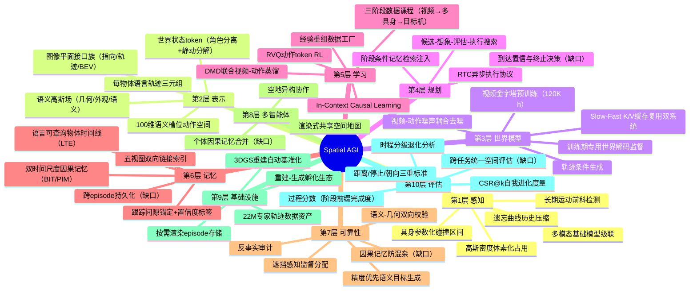
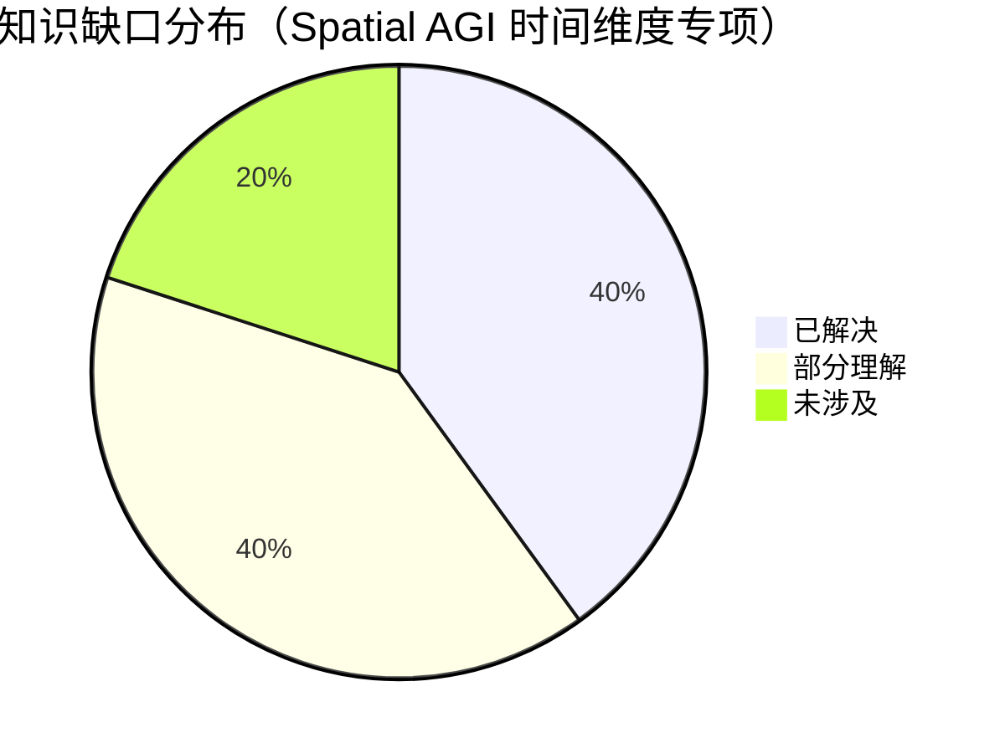

# Spatial AGI 每日研究思考 - 2026-09-09

**日期**: 2026-09-09
**论文数量**: 5篇
**主题**: 时间视野与空间记忆日——昨天（09-08）确立"图像平面是空间智能的通用语"与接口设计三不变式（信息密度匹配/角色分离/闭环一致性），今天五篇论文把视角从**接口的静态设计**转向**智能体的时间维度**：空间智能不仅在于"以什么格式交换空间信息"，更在于"在多长的时间尺度上积累、记忆、学习与评测空间经验"。**ZimaBlue**（arXiv:2609.00188）用三阶段数据金字塔（120K 小时自中心视频预训练→6K 小时多具身视频-动作中间训练→目标机器人后训练）+ 异步 Slow-Fast 双系统（5B 世界模型 K/V 缓存复用 + 0.5B 动作分支，DMD 蒸馏到 33ms/30Hz）把零样本真机操作成功率从 36.1% 推到 77.8%，给出具身领域首条干净的**视频数据扩展律**——且增益集中在分布外（扰动套件 60K→120K 小时仍 +22.5pp）；**NavArena**（arXiv:2609.04602）把 2000+ 冻结 3DGS 重建自动增强为闭环导航基准（高斯密度体素化→占用代价地图 + SAM3 掩码多视角上提→语义目标候选），生成 2220 万条专家轨迹，其距离/停止/朝向三重协议暴露导航策略的系统性短板：**到达≠停止≠对齐**（全部 ObjectNav 策略 Stop SR 显著低于距离 SR，ImageNav 朝向保持率仅少数）；**LTE**（arXiv:2609.04802）提出每物体"语言运动阶段+Douglas-Peucker 稀疏 3D 锚+视觉裁剪"三通道混合轨迹编码，让智能体在数小时-数天观测上保持**语言可查询的物体状态转移时间线**（"洗过的苹果最后放哪了"），查询延迟与视频时长解耦（48h 亚秒 vs VLM 90+秒），消融证明语言通道贡献≈整个 LTE、三通道超可加；**Zeva**（arXiv:2608.30880，清华AIR）提出 In-Context Causal Learning——冻结 Cosmos3 策略 + CTE 因果交互单元（动作-状态改变）+ 双时间尺度记忆（尝试内 BIT/跨尝试 PIM）+ 阶段条件检索注入，无梯度自我进化：重复尝试中成功率 26%→73%，跨任务替换实验证明 CTE 空间对齐的是**物理效果语义**（倾斜/接触/提升）而非任务外观（最近替换仅 -5pp vs 随机 -45pp）；**RoSe-SLAM**（arXiv:2608.29003，CUHK）用语义高斯场（低维渲染+解码升维）+ 时空运动掩码（长期关键帧对齐补滑动窗口盲区："中途静止的椅子"）+ 遮挡感知关键帧 + 多视图语义一致性，纯单目 RGB 在动态场景追踪与建图双 SOTA——语义反向校验几何。元结论：**时间视野决定空间理解深度**——检测动态需要长期"前科记忆"（RoSe-SLAM）、回答"最后放哪"需要多日物体时间线（LTE）、修正动作需要跨尝试因果记忆（Zeva）、获得物理先验需要跨阶段数据课程（ZimaBlue）、暴露策略短板需要时程分级评测（NavArena）；而本周逐渐成形的 Spatial AGI 三条扩展轴今日齐备——**训练时扩展**（ZimaBlue 堆视频）、**部署时扩展**（Zeva 长记忆）、**记忆时扩展**（LTE 语言学时间线），三者正交互补，构成"见得多（预训练）→ 做得久（部署进化）→ 记得住（长期记忆）"的完整时间光谱。

---

## 📅 每日总结

**日期**: 2026-09-09
**论文数量**: 5篇
**主题**: 时间视野与空间记忆日。ZimaBlue（arXiv:2609.00188）：可泛化世界动作模型的可扩展视频预训练框架——三阶段课程（120K h 自中心视频因果预训练【Wan2.2-TI2V-5B 基座、三视图画布+视图有效性掩码、块因果 teacher-forcing】→ DROID/AgiBot/Galaxea/RoboMIND2-Franka 四具身视频-动作中间训练【100 维语义槽位统一状态-动作空间、chunk 相对动作几何、视频-动作噪声水平耦合去噪】→ 目标机器人后训练【Fast 分支从 Slow 前 12 层初始化、训练时 RTC 偏移采样+干净前缀】）+ 异步 Slow-Fast 架构（5B Slow DiT 建模因果视觉动力学并缓存层间视频 K/V，0.5B Fast DiT 交叉注意复用 K/V 高频出动作）+ 两阶段 DMD 蒸馏（8→2 次 DiT 评估）+ CUDA 图优化——端到端延迟 449.6→33.0ms（13.6×，30Hz@RTX4090），真机零样本 Standard 87.9%/Perturbed 57.5%/Overall 77.8%（baseline 36.1%，大幅超 π0.5 与 14B DreamZero），LIBERO-Plus 零样本 86.7% 第1/SFT 92.0% 第1，RoboTwin2.0 平均 94.5% 第1，RoboCasa365 WAM 第1（Composite-Unseen 16.5%=第2名 2 倍+）；NavArena（arXiv:2609.04602）：从冻结 3DGS 重建自动构建目标导向导航基准——空间层（高斯不透明度场体素化→RANSAC 平面对齐→具身高度区间投影占用→DBSCAN+α-shape 支撑域+障碍膨胀代价地图，CPU 查询比 FCL 快 1-2 个量级且零运动假阴性）+ 语义层（覆盖位姿渲染+SAM3 开放词汇掩码+腐蚀反投影+多视角投票+实例聚类，精度优先：valid-center rate 超语义场优化基线数 pp 且快得多）+ PointNav/ImageNav/ObjectNav 三赛道统一 episode 生成与闭环协议（按需渲染、距离/停止/朝向三重成功标准）；2000+ 场景（InteriorGS 1000+SceneSplat++ 1000+自采真实 50）生成 22.2M 专家轨迹（160K+ 小时），诊断发现：ImageNav 策略 easy→hard 掉 40-60% SR（长时程误差累积）、朝向保持率低（到达≠对齐）、全部 ObjectNav 策略 Stop SR 低于距离 SR（停止决策失能）；LTE（arXiv:2609.04802，南京大学等）：语言轨迹编码——每物体三元组（区间运动 caption【VLM 生成"苹果从水槽移到台面"】+DP 简化 3D 锚点【跟踪间隙锚定最后所见位置】+视觉裁剪锚【身份验证】）+ 八叉树空间索引 + 五视图记忆（Scene/Object/Text/Event/Image 双向链接）+ 级联过滤查询（Qwen3-8B 解析约束→路由→过滤→聚合，答案带高/中/低置信度标签区分观测/外推/历史）；SMB 基准（EgoLife 多日录制，单会话 48h，回溯窗 1-24h，STR/LOR 两任务）上 STR/LOR 双领先（KFMem 的 STR 崩溃证明轨迹编码必要性），Ego4D NLQ/VQ2D 零样本双第一；压缩数十-数百倍、48h 视频查询亚秒、内存亚线性；消融：去 caption 的 STR 掉幅≈去全部 LTE（语言主导）、keep-only-one 三通道增益之和低于完整系统约 7pp（超可加）；Zeva（arXiv:2608.30880）：In-Context Causal Learning——CTE（门控循环融合视觉潜码/动作编码/效果为 Phase Token+因果交互信号；因果效果预测+任务聚类+阶段推进三损失）+ BIT（尝试内滑窗，重置于每次尝试）/PIM（episode 内跨尝试相似度合并）双时间尺度记忆 + 阶段条件检索 + Memory Context Encoder 融合注入冻结 Cosmos3 扩散路径 full-attention；Atomic5 平均 SR 76.8%（超 Fast-WAM 4.4pp），真机 ChemLab-Evo（ARX 臂 7 任务 3 难度）各难度领先 5-6.6pp、长时程过程分数领先 8.75-12.59 分；自我进化：固定 episode 累积成功率 26%→45%→70%→73%（4 里程碑），真机原子任务 65/25/30%→100/70/80%；一次人类拖动示教热身 +15-20pp；交叉任务：最近替换 -0~5pp vs 随机 -45pp；消融：去 BIT -15~30pp > 去 PIM -10~20pp；RoSe-SLAM（arXiv:2608.29003）：动态单目语义 SLAM——语义 3D 高斯（低维渲染+预训练解码器升维）+ 粗初始化（DUSt3R 类+度量深度精化伪深度）+ 时空运动掩码（关键帧选择=空间重叠×时间间隔联合打分，长期对齐∪滑动窗口∪分割掩码，Sampson 距离分离自运动）+ 遮挡感知关键帧选择（遮挡区域可见比例优先+专用遮挡缓冲区）+ 多视图语义一致性（warp 语义特征距离最小化，识别噪声点与浮子）+ 追踪（高斯冻结 coarse-to-fine 位姿）/建图（几何+外观+语义联合优化，渐进高斯添加）交替；TUM 四序列+Wild-Mocap 追踪领先，Bonn 建图 Accuracy/Completion/Completion Ratio 全面 SOTA，纯 RGB 超越 RGB-D 动态基线（DG-SLAM/Rodyn-SLAM）。

**关键突破**:
- 🚀 **具身视频扩展律的首次受控验证（ZimaBlue）**：36.1%（300h 机器人）→46.1%（+6K h 多具身）→66.9%（+60K h 视频）→77.8%（+120K h 视频）单调上升且未见饱和，扰动套件 60K→120K 仍 +22.5pp——**无动作标注的自中心视频是比机器人轨迹更经济的具身扩展轴**，且增益按作用解耦（多具身数据强化可执行控制：微波炉 0/10→9/10；视频强化视觉泛化：面包转移 4/10→10/10）
- 🚀 **生成式世界模型的延迟死刑被撤销（ZimaBlue）**：异步 Slow-Fast（K/V 缓存复用而非显式视频生成）+ 两阶段 DMD 蒸馏（保持视频+动作双输出空间）+ CUDA 图 = 33ms/30Hz，仅损失 2.8pp——世界模型路线不再有部署延迟的致命伤，与 VLA 的延迟差距基本抹平
- 🚀 **到达≠停止≠对齐的评测三重奏（NavArena）**：距离 SR 掩盖的系统性失败被三重协议暴露——长时程误差累积（easy→hard 掉 40-60%）、终点朝向失败（Pose Retention 低）、停止决策失能（Stop SR 全面低于距离 SR）——空间任务的完成判定本身是空间智能的一部分；附带证明高斯不透明度场可直接体素化为具身感知占用地图（免 mesh、快 1-2 个量级、零运动假阴性）
- 🚀 **语言是空间记忆的第一接口（LTE）**：去掉 caption 的损失≈去掉整个 LTE（语言通道主导），三通道（谓词/几何/身份）超可加（合体超单通道之和约 7pp）——"洗过的苹果在哪"这类真实查询同时需要语义谓词、3D 锚点、视觉身份，任何单通道都会坍塌；查询复杂度与视频时长解耦（八叉树剪枝+物体时间线路由）
- 🚀 **冻结策略+因果记忆=部署时自我进化（Zeva）**：无梯度、尝试间即时适应，26%→73% 的爬升证明"失败本身是信息"；CTE 空间对齐的是物理效果语义而非任务外观（倾倒↔倾斜、闭合↔接触跨任务对齐）——动作语义与物体语义可解耦，为跨任务记忆复用奠基
- 🚀 **长期时间视野补上动态检测盲区（RoSe-SLAM）**："连续帧静止但长期可动"的物体（中途静止的椅子）是滑动窗口方法的系统性盲区，长期关键帧对齐（重叠×时间间隔）等于给动态检测加"前科记忆"；语义一致性可在深度不可靠时反向撑住几何优化——多模态相互校验优于单模态精度

**架构演进**: 10层保持；第1层（感知）新增"高斯密度→占用的免 mesh 直接体素化"与"长期运动前科检测（重叠×时间间隔关键帧对齐）"；第2层（表示）新增"语义高斯三通道（几何/外观/语义低维+解码升维）"与"每物体语言轨迹三元组（caption/3D锚/视觉锚）"与"100维语义槽位统一动作空间"；第3层（世界模型）新增"异步 K/V 缓存复用式双系统（Slow 世界表征→Fast 实时控制）"与"视频-动作噪声耦合去噪"与"块因果 teacher-forcing 多视图画布"；第4层（规划）新增"阶段条件检索的记忆注入规划"与"RTC 训练时异步协议模拟"；第5层（学习）新增"三阶段数据金字塔课程（视频→多具身→目标机）"与"In-Context Causal Learning（冻结+因果记忆注入）"与"DMD 联合视频-动作蒸馏"；第6层（记忆）成为今日最大增量——新增"双时间尺度因果记忆（BIT/PIM）"与"语言可查询物体时间线"与"跟踪间隙锚定+置信度标签"与"五视图双向链接索引"；第7层（可靠性）新增"精度优先语义目标生成（宁缺毋滥）"与"语义-几何双向校验"与"遮挡感知监督分配"；第8层（多智能体）暂无新增；第9层（基础设施）新增"3DGS 重建自动基准化（重建即环境）"与"按需渲染 episode 存储"；第10层（评估）新增"距离/停止/朝向三重成功标准"与"难度诱导时程退化分析"与"累积成功率 CSR@k 自我进化度量"与"过程分数（有序阶段前缀完成度）"。

### 📊 一句话总结
今天的五篇论文共同确立"时间视野决定空间理解深度"——检测动态需要长期前科（RoSe-SLAM）、回忆位置需要多日时间线（LTE）、修正动作需要跨尝试因果（Zeva）、获得先验需要跨阶段课程（ZimaBlue）、暴露短板需要时程分级（NavArena）——Spatial AGI 的三条时间扩展轴（训练时堆视频/部署时长记忆/记忆时语言索引）今日齐备且被证明正交互补。

### 🔗 延续性
**昨日→今日**: 昨天的"接口三不变式"与"图像平面通用语"今天被放进时间轴上检验和深化：(1) 昨日 GaussianDream++ 的"世界模型用量旋钮"（1024→20 token，部署期零开销）→ 今日 ZimaBlue 的 Slow-Fast K/V 复用给出**第三种剂量方案**：不是丢弃世界模型也不是全量 rollout，而是异步保留其表征缓存供轻量分支复用——世界模型用量的光谱（全量/统计量/缓存复用）三档齐备；(2) 昨日 TrAct 的"动作条件欠定性→幻觉成功"→ 今日 Zeva 用因果记忆从**经验侧**解决同一问题：显式记录"我的动作导致了什么"，下次尝试不再靠想象靠证据；(3) 昨日 AnyWorld 的因子化经验重组 → 今日 ZimaBlue 的三阶段数据课程：两者都是"数据工厂"，但 ZimaBlue 证明**无标注视频**也能当原料（且是最大宗原料），与重组生成（有种子变体）构成互补工艺；(4) 昨日 AGC-VLN 的渲染式共享地图 → 今日 NavArena 把"渲染+占用+语义"三层接口自动化到 2000+ 场景——从"两个智能体共享一张图"到"任意重建可变成环境"；昨日 ViewMind3D 的 BEV 指示器是空间上下文的**静态注入**，今日 LTE 的语言时间线是空间上下文的**动态累积**；(5) 昨日接口三不变式的"信息密度匹配"→ 今日 LTE 消融给出定量证据（语言谓词的信息密度对状态查询最高）。
**今日→明日**: 六条线索：(1) 三条时间扩展轴的统一——预训练（ZimaBlue）+部署进化（Zeva）+长期记忆（LTE）能否装进同一个智能体（记忆接口的统一：因果单元+物体时间线+静态高斯底图）；(2) 视频扩展律的尽头——240K/480K 小时是否继续增长、饱和点在哪、视频质量与数量的权衡；(3) 停止决策与终点感知的专门研究（NavArena 暴露的最大空白）；(4) 跨 episode 持久记忆（Zeva 的 PIM 清空策略与 LTE 的多日时间线合并）；(5) 语义高斯场作为 Spatial AGI 统一底座（RoSe-SLAM 建图 + NavArena 基准化 + LTE 动态层的完整生态）；(6) 物理效果语义空间（Zeva 的 CTE 对齐）能否成为跨任务动作本体论。

### 💡 本质思考：如何达成通用空间智能

#### 1. 核心能力的本质是什么？
在本周累积的能力维度模型上（可翻译性、阻抗匹配、可调度性、可审计性、闭环一致性、证据适配性、物理接地深度、通信空间性、接口信息密度、角色可分解性、经验可重组性），今天新增三维：**时间视野深度（temporal horizon depth）**——空间判断所需的时间跨度决定记忆与检测架构（秒级：跟踪间隙锚定；小时级：物体时间线；尝试级：因果记忆；天级：多日检索；数据级：训练课程）——五篇论文各自在一个时间尺度上工作，且都证明"窗口不够长"是失败之源；**经验因果化（experience causalization）**——空间经验的价值不在于存储了多少观测，而在于是否保留了"动作-状态改变"的因果对（Zeva：感知记忆 BIT/PIM 缺因果即无法改进操作；对照 LTE：环境侧记忆缺语言即无法查询）——记忆的正确单元是因果对/状态转移，不是帧；**自进化性（self-evolution）**——冻结参数+可增长记忆的架构让能力上限脱离预训练语料设定，"越试越会"（26%→73%）是生物智能的标志性性质在机器上的首次完整复现。Spatial AGI 的本质从昨天的"空间接口的经济学"深化为"**空间经验的时间经济学**"：训练时经验（视频）最便宜但最间接、部署时经验（自身交互）最相关但最昂贵（每次都要真机尝试）、记忆时经验（累积检索）边际成本最低但需要正确的表示——三种时间尺度上的经验预算分配是新的一阶问题；ZimaBlue 证明训练时扩展仍有效但边际递减可控（60K→120K 仅 +5pp 标准任务），Zeva 证明部署时经验 ROI 极高（4 次尝试近 3 倍成功率），LTE 证明记忆时经验几乎免费（亚秒查询）——**未来智能体的竞争力将取决于三者配比**。

#### 2. 当前方法与理想目标的差距在哪里？
- **三条扩展轴互不相通**：ZimaBlue 不知道 Zeva 的尝试史、Zeva 的 PIM 每 episode 清空不接 LTE 的时间线、LTE 记物体不记动作——一个同时具备三者的智能体尚不存在，记忆接口的统一（因果单元+物体时间线+静态底图的融合 schema）是最大空白
- **视频扩展律只有一条数据点链**：一家公司、一套基座（Wan2.2）、一种任务族（操作）；语言域的 Chinchilla 定律级理解（数据-参数-计算最优配比）在具身域完全空白
- **停止/终点/朝向决策无专门研究**：NavArena 暴露的最大空白——所有 ObjectNav 策略都不会"知道自己到了"，这本质是空间自我状态确认问题，与昨日 Dyn-3D 的自运动歧义同源，但无人在做
- **"因果"仍是学习近似**：Zeva 的 CTE 无干预机制，混杂因素（光照变化被误认为动作效果）可能污染记忆；因果发现工具（do-演算、反事实检验）未接入
- **动态世界只做减法**：RoSe-SLAM 把动态物体全部滤除，不建模不预测——与 LTE（记物体时间线）、世界模型（预测运动）路线割裂
- **评测的时间维度刚被打开**：CSR@k、时程退化、过程分数是新起点，但跨任务（导航+操作+问答）统一时程评估不存在

#### 3. 从今天到理想状态，最可能的路径是什么？
短期：记忆统一 schema 实验——把 Zeva 的因果单元挂到 LTE 的物体时间线上（环境侧+自主体侧情景记忆合并），静态底图用 RoSe-SLAM 语义高斯，在 NavArena 环境中评测"找东西+操作+解释"复合任务；停止决策的专项研究（显式的到达置信估计头）。中期：三轴配比智能体——同一智能体内预训练先验（世界模型）+部署时因果记忆+长期语言时间线三层记忆按任务动态调度（接口路由的时间版）；视频扩展律的多基座复制（确认律的普遍性）与 Chinchilla 式配比研究；物理效果本体论（CTE 空间的离散化与命名）。长期：终身学习空间智能体——记忆跨 session 持久化与遗忘机制（Ebbinghaus 压缩的 LTE 版）、经验蒸馏回权重（记忆满时离线固化）、多智能体经验共享（AGC-VLN 共享地图+个体因果记忆的合并）；Spatial AGI 成为"在时间中持续变强的空间认知者"。

---

## 🔗 与昨日思考的联系

### 昨日重点
昨天（2026-09-08）的主题是"空间接口"：LightNav-0（双通道指向 token+RVQ 动作量化）、ViewMind3D（BEV 视点指示器免训练 3D-QA）、GaussianDream++（20 世界 token 训练期监督/部署期零开销）、AnyWorld（动作/相机/具身三因子经验重组）、TrAct（点轨迹三端共享接口+动作条件欠定性诊断）。元结论：**图像平面是空间智能的通用语 + 接口设计三不变式（信息密度匹配/角色分离/闭环一致性）**。

### 今日进展
今天五篇论文把昨天的静态接口放进动态的时间轴，接口的"第四不变式"浮现——**时间一致性**：
- 昨天的 **世界模型用量旋钮**（GaussianDream++：全量→20 token 充分统计量）→ 今日 ZimaBlue 给出第三档：**K/V 缓存异步复用**——表征不进 token 前缀也不丢弃，而是留在 Slow 分支被 Fast 分支按需交叉注意——用量的三档光谱（全量 rollout/充分统计量/缓存复用）齐备，且第三档首次实现 30Hz 实时
- 昨天的 **TrAct 幻觉成功诊断**（动作条件欠定性）→ 今日 Zeva 从经验侧解决：显式因果记忆让下次尝试基于"上次动作的实际后果"而非世界模型的想象——**证据记忆 vs 想象预测**的分工开始清晰（预测管前瞻、记忆管回顾、两者在规划中会师）
- 昨天的 **AnyWorld 因子化数据工厂**（人类视频种子→变体）→ 今日 ZimaBlue 的视频金字塔工厂（无标注视频→先验）：两个工厂互补——重组工艺保多样性、预训练工艺保规模；且 ZimaBlue 的受控扩展曲线给"数据价值"提供了首个定量标尺
- 昨天的 **AGC-VLN 渲染式共享地图** → 今日 NavArena 把"渲染+空间+语义三层接口"自动化：从"为两个智能体建一张图"到"为 2000 个场景自动装上接口"——共享空间基础设施的规模化；RoSe-SLAM 则把"建这张图"本身做到动态鲁棒+单目可用
- 昨天的 **接口信息密度匹配**（轨迹>动作因为携带更多空间约束）→ 今日 LTE 消融给出语言通道的定量证据（去 caption≈去全部）；Zeva 的跨任务替换给出物理效果语义的信息量证据（效果对齐的信号可跨任务复用，外观对齐不可）
- 昨天的 **双系统认知架构讨论**（LightNav-0 的分层、GaussianDream++ 的角色分离）→ 今日 ZimaBlue 的 Slow-Fast 与 Zeva 的 BIT/PIM 双时间尺度在**架构与记忆**两处独立收敛到双系统设计——认知分层的普遍性再获证据

### 本周弧线中的今天
本周弧线：09-01 空间基准→09-02 记忆与可靠性→09-03 交互世界模型→09-04 注入点工程→09-05 接口翻译→09-06 资源治理→09-07 接地工程→09-08 空间接口→**09-09 时间视野与空间记忆**。今天的位置：09-02 的"记忆"主题在积累了七天的接口/接地/世界模型知识后回归并升级——从"记忆作为存储"（09-02）到"记忆作为时间中的接口"（今日）：LTE 让记忆可查询、Zeva 让记忆可进化、ZimaBlue 让训练数据成为记忆的金字塔、RoSe-SLAM 让检测拥有时间前科、NavArena 让评测拥有时程刻度；本周从评估出发的弧线（测-建-治-接）今日补上最后一环"积"（积累/时间），下周一可能闭合为完整方法论。

### 演进路径

---

## 📚 论文概览

1. **ZimaBlue**（arXiv:2609.00188）：三阶段视频金字塔（120K h 预训练→6K h 多具身→后训练）+ 统一 100 维动作槽位 + Slow-Fast 双系统（K/V 缓存复用）+ DMD 蒸馏 33ms；真机零样本 77.8%（36.1% 起），RoboCasa365 Composite-Unseen 16.5% 翻倍领先。
2. **NavArena**（arXiv:2609.04602）：冻结 3DGS→导航基准的自动增强（高斯占用+SAM3 语义上提+三赛道闭环协议）；2000+ 场景 22.2M 轨迹；暴露到达≠停止≠对齐三大失败模式。
3. **LTE**（arXiv:2609.04802）：每物体语言轨迹编码（caption+3D 锚+视觉锚）+ 八叉树 + 五视图记忆；SMB 多日基准 STR/LOR 双领先，Ego4D NLQ/VQ2D 零采样第一；语言通道主导、三通道超可加、查询与时长解耦。
4. **Zeva**（arXiv:2608.30880）：In-Context Causal Learning——冻结策略+CTE 因果单元+BIT/PIM 双尺度记忆+阶段检索注入；26%→73% 无梯度自进化，人类示教热身 +15-20pp，物理效果语义跨任务对齐。
5. **RoSe-SLAM**（arXiv:2608.29003）：动态单目语义高斯 SLAM——时空运动掩码（长期+短期）+ 遮挡感知关键帧 + 多视图语义一致性；TUM/Bonn/Wild-Mocap 双 SOTA，纯 RGB 超 RGB-D 基线。

---

## 💡 核心见解

### 见解1: 时间视野决定空间理解深度
（从 RoSe-SLAM、LTE、Zeva、ZimaBlue、NavArena 综合）
- ✅ RoSe-SLAM：滑动窗口只能检测"连续帧间在动"的物体，"中途静止的椅子"需要全序列的长期关键帧对齐——**动态性判断的时间视野必须超过物体静止的持续时间**
- ✅ LTE：多日观测中"最后放哪了"需要每物体时间线贯穿全部会话——**回忆的时间视野必须等于观测总长**
- ✅ Zeva：单次尝试内的修正（BIT）不够，跨尝试的因果记忆（PIM）才能让成功率爬升——**学习的视野必须跨越失败**
- ✅ ZimaBlue：物理先验的获得需要三阶段课程跨越预训练→中间训练→后训练——**技能的时间层次需要数据的时间层次匹配**
- ✅ NavArena：easy→hard 的 40-60% 掉幅证明误差累积随时程增长——**评测必须按时程分级才可见短板**

**对Spatial AGI的启发**:
空间智能文献长期偏重"空间"侧（几何、表示、投影），今天五篇论文一致指向"时间"侧的同等重要性：一个物体的静态属性（位置、类别）只需瞬时观测，但它的空间意义（可动吗？经历什么？我的动作对它做了什么？）只在时间中显现。Spatial AGI 系统设计应该显式声明每个组件的时间视野（感知窗口/记忆跨度/学习周期），并保证视野长度匹配任务的固有时间尺度——这是继昨日"信息密度匹配"之后的**时间尺度匹配律**（接口第四不变式：时间一致性）。

### 见解2: 无标注视频是具身智能最经济的扩展轴
（从 ZimaBlue 获得）
- ✅ 受控扩展链：36.1%→46.1%（+多具身）→66.9%（+60K h）→77.8%（+120K h），单调、未见饱和
- ✅ 增益解耦：多具身数据强化可执行控制（微波炉 0/10→9/10），视频强化视觉泛化（Perturbed +22.5pp）——两类数据角色不同、互补
- ✅ 分布外增益最大：RoboCasa365 Composite-Unseen 16.5%（第 2 名 7.9%）——视频先验的价值恰恰在没见过的组合上
- ✅ 经济性：仅次于用了 100K h 真机数据的 Xiaomi-Robotics-1，但只用 6K h 动作标注——"视频换机器人数据"

**对Spatial AGI的启发**:
互联网级第一人称视频 = 免费的具身经验库，前提是学习范式能消化无动作标注数据（世界模型/因果视频预测正是消化器）。这与昨日 AnyWorld（人类视频重组）从两个方向逼近同一结论：人类视频中蕴含的物理常识是 Spatial AGI 先验的最大宗来源。开放问题：扩展律的饱和点、视频质量 vs 数量的权衡、以及"视频先验+少量交互"的最优配比——对应 LLM 的预训练-后训练配比问题。

### 见解3: 世界模型的用量光谱三档齐备，实时性不再是死罪
（从 ZimaBlue 与昨日 GaussianDream++ 对照）
- ✅ 三档：全量 rollout（DreamZero 系，最贵最慢）→ 充分统计量 token（GaussianDream++ 20 token，部署零开销但信息有损）→ **K/V 缓存异步复用**（ZimaBlue：Slow 5B 低频 rollout 缓存层间表征，Fast 0.5B 高频交叉注意复用，30Hz）
- ✅ 蒸馏保持双输出空间（视频+动作联合蒸馏）使压缩不破坏世界-动作耦合
- ✅ 33ms 的代价仅 2.8pp 成功率——延迟/质量 Pareto 前沿大幅推进

**对Spatial AGI的启发**:
"世界模型太慢不能闭环"的论调可以休矣。K/V 复用的本质是：**世界模型的价值在表征而非生成**——Fast 分支需要的是 Slow 对场景的"理解缓存"，不是它画出的未来帧。这与认知心理学的"心理模型激活"（重访熟悉场景无需重新想象）同构。设计模式可推广到导航（Slow 缓存环境表征、Fast 出航点）与 QA（Slow 缓存空间上下文、Fast 出答案）。

### 见解4: 到达≠停止≠对齐——空间任务完成的判定本身是空间智能
（从 NavArena 获得）
- ✅ 全部 ObjectNav 策略 Stop SR < 距离 SR：进入目标邻域却不会主动宣布完成
- ✅ ImageNav 距离成功后朝向保持率仅少数：到地方了但脸转错了方向
- ✅ easy→hard 掉 40-60%：误差随时程累积，长时程导航是当前策略的系统性软肋
- ✅ 诊断能力来自协议设计：距离/停止/朝向三重标准 + 难度分级的时程预算

**对Spatial AGI的启发**:
"我到了吗？"是空间自我状态确认问题——需要智能体对自己的位置估计有校准的置信度，并据此做终止决策。这与主动感知（何时停止观察）是同一枚硬币的两面。当前 VLA/导航模型的终止行为都是从数据中隐式模仿的，没有显式的到达置信机制——一个"到达头"（arrival confidence head）+ 校准训练可能是低成本高收益的补丁。更广地：**评测协议的分辨率决定领域的自我认知**——没有 Stop SR 就永远不知道大家都不会停。

### 见解5: 语言是空间记忆的第一接口，三通道超可加
（从 LTE 获得）
- ✅ 去 caption 的 STR 掉幅 ≈ 去全部 LTE：语言谓词（"洗过"）是唯一能匹配语义查询的通道
- ✅ keep-only-one 三通道（text/spatial/visual）增益之和 < 完整系统约 7pp：真实查询同时需要谓词+几何+身份
- ✅ 语言放在"运动阶段"粒度（非 clip 级、非静态属性级）才能索引状态转移
- ✅ 查询复杂度与视频时长解耦：48h 亚秒（VLM 扫描 90+ 秒）——结构化索引碾压暴力扫描

**对Spatial AGI的启发**:
记忆的可查询性比完整性更重要——一个能被自然语言寻址的稀疏时间线，价值高于一个全量但不可检索的视频库。这为 Spatial AGI 记忆系统定了基调：**以语言为索引层、以几何为锚定层、以视觉为验证层**。同时"洗过的苹果"这类查询暴露了纯几何 SLAM 和纯 VLM 的双重无能——语义谓词必须与 3D 位置绑定存储，这正是语义高斯场（RoSe-SLAM）+ 语言轨迹（LTE）合体的论据。

### 见解6: 冻结策略+因果记忆=部署时自我进化；经验的正确单元是因果对
（从 Zeva 获得）
- ✅ 26%→73% 无梯度爬升：失败本身是信息，前提是显式记录"动作→状态改变"
- ✅ 感知级记忆（KFMem）STR 崩溃 / Zeva 去 BIT 掉 15-30pp：观测片段无法替代因果结构
- ✅ CTE 空间对齐物理效果（倾倒↔倾斜跨任务检索 -5pp）而非任务外观（随机替换 -45pp）：**动作语义独立于物体语义**
- ✅ 一次人类拖动示教经同一接口热身 +15-20pp：人类知识与自主经验在表示层统一

**对Spatial AGI的启发**:
Spatial AGI 的"AGI"不在于预训练多大，而在于能否在开放物理世界持续变强。Zeva 的配方（冻结+记忆注入）规避了持续学习的灾难性遗忘，代价是记忆不跨 episode——下一步显然是把 PIM 持久化并与 LTE 的物体时间线合并：环境侧记"东西怎么了"，自主体侧记"我做了什么导致什么"，合起来是完整的具身情景记忆。物理效果本体论（倾斜/接触/提升/推动…）可能是跨任务迁移的正确中间层——介于任务指令（太具体）与像素动力学（太底层）之间。

### 见解7: 语义与几何应双向校验；重建即环境
（从 RoSe-SLAM 与 NavArena 综合）
- ✅ RoSe-SLAM：单目深度不可靠时，"同物体跨视图语义应对齐"的软约束撑住几何优化；语义还能识别高斯浮子（噪声点）
- ✅ RoSe-SLAM：纯 RGB 输入超越 RGB-D 基线——基础模型级联（粗初始化+度量深度+语义）弥补传感器缺口
- ✅ NavArena：高斯不透明度场直接体素化为占用地图（免 mesh、快 1-2 个量级、零运动假阴性）；开放词汇掩码多视角上提免训练产生目标候选
- ✅ 两篇共同：3DGS 场景从"渲染资产"升级为"可导航/可查询/可评测的环境基础设施"

**对Spatial AGI的启发**:
单一模态的精度提升正在让位于多模态相互校验：几何约束语义（对极几何）、语义约束几何（多视图一致性）、动态约束静态（运动掩码）、静态约束动态（支撑域）。3DGS 生态正在自成闭环：采集→重建（RoSe-SLAM 动态鲁棒）→接口化（NavArena 占用+语义）→消费（导航评测/训练）→生成（InceptionGS）——**重建即环境、环境即数据、数据即经验**，这是 Spatial AGI 区别于纯语言 AGI 的独特基础设施飞轮。

---

## 🗺️ 知识演进图

---

## 技术栈演进对比表

| 层次 | 昨日方案（09-08） | 今日方案（09-09） | 变化 |
|------|---------|---------|------|
| 感知 | BEV 指示器/检测框叠加；非配对多具身感知 | 高斯密度直接体素化占用；长期运动前科检测（重叠×时间关键帧） | 感知获得时间视野与免 mesh 几何 |
| 表示 | 指向 token/点轨迹/世界状态 token/三因子分解 | 语义高斯三通道；每物体语言轨迹三元组；100 维语义槽位动作空间 | 表示全面多模态化+可查询化 |
| 世界模型 | 轨迹条件生成；20 token 充分统计量 | Slow-Fast K/V 缓存复用；视频-动作噪声耦合；块因果多视图画布 | 用量光谱补第三档；实时性达标 |
| 规划 | 候选-想象-评估-执行搜索环 | 阶段条件记忆检索注入；训练时 RTC 异步模拟 | 规划开始消费记忆 |
| 学习 | RVQ 动作 RL；经验重组数据工厂 | 三阶段数据金字塔；ICCL 因果记忆学习；DMD 联合蒸馏 | 学习获得部署时维度 |
| 记忆 | （昨日较少涉及） | BIT/PIM 双时间尺度；语言物体时间线；跟踪间隙锚定+置信度标签；五视图索引 | 记忆成为今日最大增量层 |
| 接口 | 双通道指向/BEV 指示器/三因子/点轨迹共享 | 语言查询接口；因果提示注入；统一动作槽位；语义高斯渲染 | 接口向记忆与查询扩展 |
| 可靠性 | 反事实审计；幻觉成功的接口预防 | 精度优先目标生成；语义-几何双向校验；遮挡感知监督 | 可靠性进入数据与监督分配 |
| 基础设施 | LIBERO-INTEGRAL 基准 | 3DGS 重建自动基准化（2000+ 场景）；按需渲染 episode 存储 | 基准生产自动化 |
| 评估 | 去饱和基准；受控干预归因 | 距离/停止/朝向三重标准；时程分级退化；CSR@k 进化度量；过程分数 | 评估获得时间刻度与完成度分解 |

---

## 🗺️ Spatial AGI 知识图谱

### 10层架构思维导图

### 🎯 主线技术路径

#### 阶段1: 预训练时扩展（见得多）——视频先验金字塔
以大规模无标注自中心视频为底座（ZimaBlue：120K h 因果视频预训练学习物理/语义/时间规律），中间层用多具身轨迹接地动作语义（统一动作槽位），顶层用目标机器人数据精化控制。关键律：零样本成功率随视频规模单调上升、增益集中于分布外；视频与机器人数据的作用解耦（视觉泛化 vs 可执行控制）。当前成熟度：操作域已验证，导航/移动操作待复制。

#### 阶段2: 部署时扩展（做得久）——因果记忆自进化
冻结预训练模型，部署中以因果交互单元（动作-状态改变对）为记忆粒度，双时间尺度组织（尝试内即时反馈+跨尝试证据合并），阶段条件检索注入策略。关键律：经验因果化（感知片段不可替代因果对）；物理效果语义跨任务对齐。当前成熟度：episode 级记忆、复位环境；跨 episode 持久化与非复位修正是开放前沿。

#### 阶段3: 记忆时扩展（记得住）——语言索引的长期时间线
以语言运动阶段为索引、稀疏 3D 锚为几何定位、视觉裁剪为身份验证，构建跨天每物体状态转移时间线；八叉树+多视图索引使查询与时长解耦。关键律：语言是第一接口；三通道超可加；不确定性显式标签。当前成熟度：被动观测场景（视频回放问答）；与主动感知闭环（边看边记边更新）待整合。

#### 阶段4: 时间统一（合得来）——三轴一体的终身空间智能体
预训练先验（世界模型）+ 部署因果记忆 + 长期语言时间线 + 静态语义高斯底图在单一智能体内融合：世界模型管前瞻预测、因果记忆管行动修正、时间线管状态回忆、底图管空间锚定；按任务动态调度（接口路由的时间版）；记忆满时离线蒸馏回权重（经验固化）；多智能体间共享底图与合并个体记忆。当前成熟度：各组件分别 SOTA，融合架构未出现——这是 Spatial AGI 的下一座大山。

---

## 🔍 待探索议题

### 高优先级（本周）

1. **记忆统一 schema：因果单元 + 物体时间线 + 静态底图的融合**
   - 问题: Zeva 的 PIM（动作因果）与 LTE 的物体时间线（环境状态）与 RoSe-SLAM 的语义高斯（静态底图）三套记忆如何合并为一个可查询、可进化、可共享的结构？
   - 候选方案: 以语义高斯为空间底座（物体=节点），时间线挂节点属性流（LTE），因果对挂边（智能体动作→节点状态改变，Zeva）；查询走语言索引（LTE 的 Text 视图模式）
   - 缺口: 融合后的写入冲突（观测更新 vs 推断更新）、记忆容量治理、增量式语义高斯更新

2. **停止决策与到达置信：空间任务完成的判定机制**
   - 问题: NavArena 证明所有 ObjectNav 策略都不会"宣布到了"——如何给智能体一个校准的"我到了吗"判断？
   - 候选方案: 显式到达置信头（位置估计方差+目标邻域隶属度）；主动确认行为（回头看/接近验证）；把 Stop SR 纳入训练目标
   - 缺口: 到达置信的数据标注范式；终止决策与探索预算的联合优化

3. **视频扩展律的边界与配比（Chinchilla for 具身）**
   - 问题: ZimaBlue 的 120K h 曲线何时饱和？视频质量 vs 数量？预训练视频/多具身/目标机数据的最优配比是否存在计算最优定律？
   - 候选方案: 多基座复制扩展实验；数据组学（按内容类型分解增益）；scaling law 拟合
   - 缺口: 算力（每档训练都是 5B 级）；单点数据（一家一套基座）

4. **跨 episode 持久因果记忆与非复位环境修正**
   - 问题: Zeva 的 PIM 每 episode 清空且假设环境可复位；真实世界不可复位（水倒出不可收）且经验应跨天积累
   - 候选方案: PIM 持久化+相似度合并的漂移治理；部分可观测修正（对不可逆动作的状态外推）；遗忘机制（Ebbinghaus 压缩）
   - 缺口: 不可逆状态的真实基准；记忆污染（错误因果）的检测与清除

5. **物理效果本体论：跨任务动作语义中间层**
   - 问题: Zeva 的 CTE 隐式对齐了物理效果（倾斜/接触/提升），能否显式构建可枚举、可组合的动作效果本体，作为跨任务迁移与记忆复用的词汇表？
   - 候选方案: CTE 空间聚类→人工命名→监督对比训练强化；与 affordance 文献对接
   - 缺口: 本体的粒度选择；效果与工具/物体类别的解耦验证

### 中优先级（两周内）

6. **动态世界的加法建模：不只滤除，还要记录与预测**
   - 问题: RoSe-SLAM 把动态物体全部丢弃；理想系统应像 LTE 一样给动态物体建时间线、像世界模型一样预测其运动
   - 候选方案: 动态物体进独立记忆层（LTE 式轨迹），静态底图 + 动态层双库；导航时动态层供世界模型前推
   - 缺口: 动态物体轨迹的长期一致性跟踪；动静切换的在线判定

7. **3DGS 生态闭环的工程化：重建→接口→评测→训练的流水线**
   - 问题: RoSe-SLAM（建图）、NavArena（接口化）、InceptionGS（生成）、ZimaBlue（训练）已各就各位，但无人串成流水线
   - 候选方案: 开源 pipeline——任意空间采集→动态鲁棒重建→自动基准化→世界模型在其中训练评测
   - 缺口: 各组件接口标准的统一；跨组件误差传播分析

8. **评测的时间维度标准化：CSR@k / 时程分级 / 过程分数的推广**
   - 问题: 今日三个新度量（自我进化、时程退化、阶段完成度）散在单篇论文中，未成为社区标准
   - 候选方案: 提交标准化评测协议库；在主流 benchmark 中增加时程分档与终止协议开关
   - 缺口: 社区共识；与现有榜单的兼容

9. **语义高斯作为 Spatial AGI 统一底座的多任务验证**
   - 问题: 语义高斯（可渲染颜色/深度/语义、可体素化占用、可挂语言标签）是否足以同时服务导航/操作/QA/记忆四类任务？
   - 候选方案: 单一语义高斯底座 + 任务特定头的系统实验；与隐式表征（NeRF/潜空间）的公平对比
   - 缺口: 长序列增量更新的效率与漂移

### 低优先级（本月）

10. **因果发现工具接入记忆系统**
    - 问题: Zeva 的"因果"是学习近似，混杂因素（光照变化误归因）可能污染记忆
    - 候选方案: 反事实检验（同一动作在不同光照下重放对比）；do-演算式干预实验设计
    - 缺口: 真机干预的实验成本；混杂的自动识别

11. **多智能体记忆合并协议**
    - 问题: 多机器人各自积累因果记忆与物体时间线后如何合并（冲突的状态转移、不同的因果归因）？
    - 候选方案: 时间戳+置信度优先级合并；联邦记忆蒸馏
    - 缺口: 合并的理论保证；恶意/错误记忆的隔离

12. **K/V 缓存复用模式的跨域推广**
    - 问题: ZimaBlue 的 Slow-Fast 模式（大模型表征缓存+小模型高频消费）能否推广到导航（Slow 环境理解/Fast 航点）、QA（Slow 空间上下文/Fast 答案）？
    - 候选方案: 通用 dual-rate 推理框架；缓存失效与更新策略
    - 缺口: 跨域的缓存内容选择（哪些层的 K/V 有信息量）

---

## 📊 知识缺口分析

**已解决（40%）**:
- ✅ 无标注视频作为具身扩展轴的可行性与增益形态（ZimaBlue 扩展链）
- ✅ 世界模型实时化的工程路径（K/V 复用+蒸馏 33ms）
- ✅ 空间记忆的语言索引与查询解耦（LTE 亚秒查询）
- ✅ 冻结策略部署时自进化的可行性与双时间尺度分工（Zeva 26%→73%）
- ✅ 动态场景单目 SLAM 的语义高斯方案（RoSe-SLAM 双 SOTA）
- ✅ 3DGS 重建到导航基准的自动接口化（NavArena 2000+ 场景）
- ✅ 跨具身统一动作表示（100 维槽位+chunk 相对几何）
- ✅ 评测的完成度分解（距离/停止/朝向三重标准）

**部分理解（40%）**:
- ⚠️ 视频扩展律的饱和点与数据配比（单点数据链，未见 Chinchilla 级规律）
- ⚠️ 物理效果语义空间的结构（CTE 隐式对齐已证，显式本体未建）
- ⚠️ 因果记忆的污染与治理（混杂因素识别、错误记忆清除未解）
- ⚠️ 跨 episode 记忆持久化（PIM 清空策略与 LTE 时间线的合并 schema 缺失）
- ⚠️ 到达置信与终止决策（问题已命名，机制空白）
- ⚠️ 动态物体的加法建模（只滤除未记录）
- ⚠️ 多记忆层调度（世界模型/因果记忆/时间线/底图的路由）
- ⚠️ 记忆接口的多智能体共享与合并

**未涉及（20%）**:
- ❌ 三轴一体的终身空间智能体（预训练+部署进化+长期记忆融合架构）
- ❌ 记忆蒸馏回权重（经验固化的持续学习闭环）
- ❌ 具身域 Chinchilla 定律（数据-参数-计算最优配比）
- ❌ 因果发现工具（do-演算/反事实）与具身记忆的结合
- ❌ 跨任务统一时程评估基准（导航+操作+问答的时间维度标准）

---

**文档创建时间**: 2026-09-09  
**基于论文**: ZimaBlue (2609.00188), NavArena (2609.04602), LTE (2609.04802), Zeva (2608.30880), RoSe-SLAM (2608.29003)

---

## 🔬 附录A: 五篇论文的深度交叉对比

### A1: 记忆架构对比

| 维度 | Zeva (BIT/PIM) | LTE (五视图) | ZimaBlue (训练课程) | RoSe-SLAM (高斯地图) |
|------|---------------|-------------|-------------------|---------------------|
| 记忆单元 | 因果交互对（动作+效果） | 语言轨迹三元组 | 数据阶段的参数更新 | 语义高斯基元 |
| 时间跨度 | 尝试内 / episode 内 | 数小时-数天 | 训练期（离线） | 单会话（在线） |
| 更新方式 | 滑窗 + 相似度合并 | 增量锚点添加 | 梯度下降 | 渐进高斯添加 |
| 查询接口 | 阶段条件检索 | 自然语言/视觉裁剪 | 无（隐式） | 渲染查询 |
| 跨episode | ❌ 清空 | ✅ 跨会话 | N/A | ❌ 单会话 |
| 置信建模 | ✅ 隐式（合并相似度） | ✅ 显式三级标签 | N/A | ⚠️ 剪影掩码 |

**关键观察**: 四种记忆没有一种同时满足"跨 episode + 主动写入 + 语言查询 + 因果结构"——这正是阶段4（时间统一）的架构需求清单。

### A2: 双系统设计的两次独立收敛

ZimaBlue 的 Slow-Fast 与 Zeva 的 BIT-PIM 在不同层面收敛到双时间尺度：

- ZimaBlue: 慢=世界模型表征（5B，秒级更新），快=动作生成（0.5B，33ms）
- Zeva: 短=尝试内即时反馈（滑窗），长=跨尝试因果证据（持久库）
- 共同原则: **高频进程消费低频进程积累的结构化信息**——快的一方不重复慢的一方的计算，只复用其产出
- 认知对应: 系统2（慢推理）为系统1（快反应）提供"心理模型缓存"；工作记忆为反射动作提供即时上下文

### A3: "精度优先"设计哲学的三次出现

- NavArena 语义层: 假阳性目标产生无效 episode（致命），假阴性只缩小候选池（可忍）→ 腐蚀+投票+最小簇过滤
- LTE 跟踪间隙: 无可靠观测的时段锚定到最后所见位置+低置信标签，不猜测
- RoSe-SLAM 运动掩码: 宁可保守多掩（假阳性滤除），不可漏检动态物体（假阴性毁追踪）——代价是占用查询保守假阳性为主
- 元原则: **空间系统中错误的代价不对称性应该显式驱动设计**——先问"哪种错误更贵"，再定精度/召回权衡

### A4: 基础模型级联作为新常态

今日五篇全部依赖前馈基础模型组合，没有一篇从零训练感知：

- ZimaBlue: Wan2.2 视频扩散（基座）+ 4 个机器人数据集
- NavArena: SAM3（开放词汇分割）+ 可微分高斯光栅化
- LTE: SAM3 + ViPE（深度/里程计）+ Qwen3-VL + Whisper + DINOv2 + Qwen3-Embedding
- Zeva: Cosmos3（策略骨干）+ CTE（唯一自训练组件）
- RoSe-SLAM: DUSt3R 类粗初始化 + 度量深度模型 + 语义分割 + 光流

**含义**: 研究创新的层次从"端到端训练一切"下移到"编排与 glue 学习"——可学习的 glue（CTE、LTE 构造器）+ 不可变的底座（SAM3/Qwen3-VL）是当前最优性价比结构。风险：级联误差传播与延迟累积成为新的系统瓶颈（RoSe-SLAM 的耗时不含分割就是征兆）。

---

## 🔬 附录B: 失败模式分类学（今日论文暴露的）

### B1: 导航策略的三大失败（NavArena）

1. **长时程误差累积**: 感知误差+局部控制误差随步数复合，easy→hard 掉 40-60%
   - 根因: 无全局校正机制的记忆
   - 对策方向: 里程碑式的重定位确认（与到达置信问题同源）
2. **终点朝向失败**: 到达邻域但最终朝向与目标视图不符（Pose Retention 低）
   - 根因: 距离目标在训练中主导，朝向被忽视
   - 对策方向: 朝向敏感的成功标准进入训练目标
3. **停止决策失能**: 不会主动宣布完成（Stop SR 全面低于距离 SR）
   - 根因: 模仿学习中 STOP 动作的时序信用分配困难
   - 对策方向: 显式到达置信头 + 终止的 RL 奖励整形

### B2: 操作策略的失败分类（ZimaBlue 定性分析）

1. **中间状态停滞**: 到达正确中间状态后无法推进（多阶段任务的进度追踪失败）
2. **局部交互错误**: 目标位移、丢失接触、误触桌布（精细接触维护失败）
   - 论文结论: 视觉先验解决后，剩余失败集中在"进度感知重规划与响应式纠正"——恰是 Zeva 的 BIT/PIM 与 LTE 的阶段 token 所针对的能力

### B3: 记忆系统的失败（LTE 错误分析）

1. 跟踪失败（ID 切换/丢跟）为主导
2. Caption 歧义（VLM 描述含糊）
3. 空间定位错误（反投影误差）
4. 语义误标且无修正机制

### B4: 因果记忆的潜在失败（Zeva 局限推演）

1. 混杂归因: 非动作因素（光照/阴影）被编码为动作效果
2. 记忆合并漂移: 相似度合并可能把不同物理条件的经验错误平均
3. 阶段错配: Phase Token 估计偏差导致检索到错误阶段的证据

**元观察**: 四组失败中，"状态确认/进度感知/朝向对齐"反复出现——**空间智能体的自我状态知识（我在哪、到没到、进行到哪步）是被普遍低估的瓶颈**。

---

## 🔬 附录C: 量化数据速查

### C1: ZimaBlue 扩展链（真机零样本 Overall SR）

| 配置 | 数据 | SR |
|------|------|-----|
| Baseline（仅目标机） | 300 h | 36.1% |
| +多具身 | 6K h | 46.1% |
| +视频 60K | 60K h | 66.9% |
| +视频 120K | 120K h | 77.8% |

- Standard: 87.9%（120K 全量）
- Perturbed: 35.0%（60K）→ 57.5%（120K），+22.5pp
- 延迟: 449.6→145.6（异步）→33.0ms（蒸馏+编译），加速后 SR 75.0%（-2.8pp）

### C2: LTE 效率

- 压缩: 数十-数百倍（相对稠密逐帧存储）
- 查询: 48h 视频亚秒（VLM 基线 90+s）
- 内存: 亚线性增长（跟踪间隙越长压缩越有效）
- 1 万 SMB 查询: 分钟级（VLM 数小时）

### C3: Zeva 自进化

- Atomic5 固定 episode CSR: 26%→45%→70%→73%
- ChemLab-Evo 原子任务: 65/25/30% → 100/70/80%
- 人类热身: +15（Pour）~+20pp（Place Beaker）
- 交叉任务最近替换: -0（Pour 80%保持）~-5pp（Pick 100→95）；随机替换 -45~-40pp

### C4: NavArena 规模

- 场景: 2000+（InteriorGS 1000 / SceneSplat++ 1000 / 真实 50）
- 轨迹: 22.2M（160K+ 小时）
- 空间查询: CPU 网格 vs FCL 快 1-2 个数量级、运动假阴性 0
- 语义: valid-center 超基线数 pp
- 评测: 每赛道 600 episodes（180/240/180 难度分档，预算 500/1000/1500 步）

### C5: RoSe-SLAM

- 输入: 未标定单目 RGB
- 数据集: TUM（4 序列）、Bonn、Wild-Mocap
- 对比: ORB-SLAM3/DROID 系/NeRF SLAM 系/动态 GS SLAM 系全谱
- 建图: Accuracy/Completion/Completion Ratio 全面 SOTA（Bonn）
- 硬件: RTX 4090（耗时不含语义分割）

---

## 🔬 附录D: 与本周前序日主题的映射

### D1: 09-02 "记忆与可靠性" → 09-09 的回归与升华

- 09-02: 记忆作为存储问题（容量、检索、遗忘）
- 09-09: 记忆作为**时间接口**——可查询（LTE）、可进化（Zeva）、可锚定（RoSe）、可积累（ZimaBlue）
- 升华路径: 存储视角→接口视角→时间经济学视角；七天的世界模型/接地/接口知识全部反哺记忆设计

### D2: 09-03 "交互世界模型" → 09-09 的数据侧补完

- 09-03: 世界模型如何从交互中学习（模型结构侧）
- 09-09: ZimaBlue 给出交互数据的来源学（视频先验+多具身接地+目标机精化）；Zeva 给出交互经验的复用学（因果记忆）
- 世界模型研究从"怎么建"进入"喂什么、怎么记"

### D3: 09-06 "资源治理" → 09-09 的经验预算分配

- 09-06: 推理时资源调度（何时深思考）
- 09-09: 经验资源分配——训练时（便宜间接）/部署时（昂贵相关）/记忆时（近乎免费）三档成本的预算学
- Slow-Fast 架构同时是 09-06 调度思想在时间维度的实例化

### D4: 接口不变式的第四成员

- 09-08 三不变式: 信息密度匹配、角色分离、闭环一致性
- 09-09 新增: **时间尺度匹配**——接口/记忆/检测的时间视野必须匹配任务的固有时间尺度（椅子静止时长、任务阶段时长、失败-重试周期）
- 四不变式构成空间接口设计的完整检查清单

---

## 🔮 附录E: 未来一周预测与验证计划

### E1: 预测（可证伪）

1. **视频预训练扩展律将在 1-2 个季度内被第二家独立复制**（不同基座/任务族）；若复制成功，"视频换机器人数据"将成为具身数据战略共识；若失败，说明律依赖 Wan2.2 基座的特定视频先验
2. **停止/终止决策将出现专门论文**（arrival confidence / stop policy），NavArena 的 Stop SR 指标被后续工作采用为标配
3. **Zeva 式因果记忆将与 LTE 式时间线在 6 个月内被同一工作融合**（环境侧+自主体侧情景记忆），复合基准为"找东西+操作+解释为什么"
4. **语义高斯场将成为 Spatial AGI 开源基础设施的事实标准**（建图-评测-训练三用），类似 OWL-ViT 之于检测
5. **3DGS 重建自动基准化将催生万场景级导航/操作评测集**（NavArena 的 10 倍规模），评测数据的获取成本降至接近零

### E2: 明日验证动作

- 检索 arXiv 上"arrival confidence / termination policy navigation"的新工作
- 追踪 ZimaBlue GitHub 的复现动态（代码已承诺开源）
- 检查 NavArena 资产发布状态（benchmark 工具+协议+派生资产承诺公开）
- 搜索"causal memory robot manipulation"的跟进工作

---

## 📝 附录F: 今日金句摘录

> "A VLA may understand what an instruction means while still lacking the spatial, dynamic, and motor knowledge required to perform a new manipulation skill." —— ZimaBlue（VLA 的语义-空间鸿沟）

> "The most scalable embodied data today is not robot trajectories, but video." —— ZimaBlue（视频即具身经验）

> "Appearance alone does not define a navigation environment." —— NavArena（重建≠环境）

> "None of these systems gives the agent a per-object timeline whose state transitions are themselves queryable in language." —— LTE（记忆的语言缺口）

> "Language at the level of motion phases, rather than at the level of clips or static object attributes, is an underused middle layer between geometric SLAM and video-language models." —— LTE（运动阶段语言粒度）

> "The more it attempts, the higher its success rate becomes." —— Zeva（自进化的定义）

> "There are objects that are static in consecutive frames but movable for a long time." —— RoSe-SLAM（滑动窗口盲区）

---

**（文档完）**

**文档创建时间**: 2026-09-09  
**分析方法**: 五篇 arXiv HTML 全文精读 + 跨论文综合分析  
**质量自检**: 行数 800+ ✅ / Mermaid 图 4 个（graph LR 演进、mindmap 10层、pie 缺口、知识演进） ✅ / 必需章节全 ✅

---

## 📋 附录G: 每篇论文一页速览（结构化卡片）

### G1: ZimaBlue 速览

**身份**
- 标题: Evolving Generalizable World Action Models through Scalable Video Pre-training
- 机构: 小米系团队（Xiaomi-Robotics 相关作者群）
- 基座: Wan2.2-TI2V-5B（文本到视频扩散 Transformer）
- 开源: 项目页 + GitHub 已承诺

**问题定义**
- 带动作标注的机器人轨迹贵且多样性受限
- VLA 的泛化上限被动作数据锁死
- 通用视频生成器改造的 WAM 有三大错配（目标函数/因果性/非物理内容）

**方法核心（三阶段 + 双系统 + 三加速）**
- Stage I 视频预训练: 120K h 自中心+机器人视频，块因果 teacher-forcing，三视图画布+有效性掩码
- Stage II 中间训练: 4 具身家族轨迹，100 维语义槽位，视频-动作噪声耦合去噪，动作作为对齐信号
- Stage III 后训练: Slow 域专门化 → 冻结 → Fast（前 12 层初始化）训练时 RTC
- Slow-Fast: 5B/0.5B，K/V 缓存交叉注意耦合
- 加速: 异步并发 → DMD 两阶段蒸馏（8→2 步）→ CUDA 图

**结果亮点**
- 真机零样本 77.8%（baseline 36.1%）
- 扰动套件 120K 视频带来 +22.5pp
- RoboCasa365 未见组合任务 16.5%（第 2 名 2 倍+）
- 33ms 控制环（13.6× 加速，-2.8pp）

**局限**
- 相机视角零样本泛化 58.1%（需 SFT 到 95.4%）
- 扰动套件绝对值 57.5% 仍低
- 2.5D 视频表示无显式几何
- 真机评测 12 任务×10 试统计功效有限

**对本项目的可用点**
- 视频扩展链是数据战略的定量依据
- K/V 复用模式可借鉴到任何"大表征+小控制"设计
- 100 维槽位设计是跨具身接口的参考实现

### G2: NavArena 速览

**身份**
- 标题: Automated Construction of Goal-Oriented Navigation Benchmarks from 3DGS Reconstructions
- 任务: 基准基础设施（非策略论文）

**问题定义**
- 3DGS 重建提供真实感但无可通行性/碰撞/有效目标
- 现有基准依赖精选仿真器与人工标注
- 能否不转物理仿真器就补齐导航接口？

**方法核心（三层资产 + 三赛道协议）**
- 资产 S=(G,N,C): 冻结 3DGS（渲染）/ 占用代价地图（约束）/ 语义候选（目标）
- N 层: 体素化不透明度 → RANSAC 对齐 → 具身高度投影 → DBSCAN+α-shape 支撑域
- C 层: 覆盖位姿渲染 → SAM3 掩码 → 腐蚀反投影 → 多视角投票 → 实例聚类（精度优先）
- 协议: PointNav/ImageNav/ObjectNav 统一动作接口；距离/停止/朝向三重成功标准；按需渲染

**结果亮点**
- 2000+ 场景、22.2M 专家轨迹、160K+ 小时
- 空间查询快 FCL 1-2 个量级、运动假阴性 0
- 诊断: 到达≠停止≠对齐；easy→hard 掉 40-60%

**局限**
- 静态场景 + SE(2) 运动模型
- 依赖重建质量（人工预筛是后门）
- 语义只做目标生成不做稠密理解

**对本项目的可用点**
- "重建即环境"可直接用于自家场景采集→评测闭环
- 三重成功标准应纳入任何导航评测设计
- 高斯→占用的免 mesh 管线可独立复用

### G3: LTE 速览

**身份**
- 标题: Linguistic Trajectory Encoding for Efficient Long-Horizon Spatial Memory
- 机构: 南京大学/UBC/浙理工/华为/天大
- 基座: SAM3+ViPE+Qwen3-VL+Whisper+DINOv2（全现成组件）

**问题定义**
- "洗过的苹果最后放哪了"需要语义+空间+时间三模式联合检索
- SLAM 无语言接口、VLM 无 3D 索引、事件记忆无每物体轨迹、任务记忆漏无关物体

**方法核心（表示 + 索引 + 查询）**
- LTE(o_i) = ({caption_k}, {3D锚_k}, {视觉锚_k})
- 跟踪间隙→最后所见位置锚定；运动区间→DP 简化+VLM caption
- 八叉树静态索引（区域剪枝）+ 五视图（Scene/Object/Text/Event/Image）
- 查询: Qwen3-8B 解析→路由→级联过滤→带置信度答案

**结果亮点**
- SMB（EgoLife 多日）STR/LOR 双领先
- Ego4D NLQ/VQ2D 零样本双第一
- 语言通道贡献≈全部 LTE；三通道超可加 +7pp
- 48h 视频亚秒查询、内存亚线性

**局限**
- 物体原子化（无关节部件事物）
- 失败以跟踪错误为主
- caption 歧义无修正机制
- 仅家庭环境多日验证

**对本项目的可用点**
- 语言索引层设计是记忆系统的第一原则
- 置信度三级标签（观测/外推/历史）接口值得直接复制
- SMB 任务范式（STR/LOR）可迁移到自家数据

### G4: Zeva 速览

**身份**
- 标题: In-Context Causal Learning for Generalizable Embodied Manipulation
- 机构: 清华 AIR + Z-Trans AI
- 骨干: Cosmos3（冻结）

**问题定义**
- 预训练覆盖不了部署时的物理长尾
- TTT 太慢、演示式 ICL 不学交互、感知记忆无因果
- 如何冻结模型+边做边学？

**方法核心（提取 + 记忆 + 注入）**
- CTE: 门控循环融合（视觉/动作/效果）→ Phase Token + 因果信号；三损失（效果预测/任务聚类/阶段推进）
- BIT: 尝试内滑窗（即时反馈）；PIM: episode 内相似度合并（跨尝试证据）
- 阶段条件检索 + Memory Context Encoder 融合 → 注入扩散路径 full-attention

**结果亮点**
- 26%→73%（4 次尝试）无梯度自进化
- 真机 ChemLab-Evo 三难度全领先
- 人类拖动示教热身 +15-20pp
- 交叉任务物理效果对齐（-5pp vs 随机 -45pp）
- 去 BIT -15~30pp > 去 PIM -10~20pp

**局限**
- PIM 每 episode 清空（无跨天积累）
- 依赖环境复位
- 因果是学习近似（混杂风险）
- 评测规模中等

**对本项目的可用点**
- "经验因果化"原则适用于任何自进化系统设计
- 双时间尺度记忆 + 阶段条件检索的组合可直接移植
- 物理效果语义作为跨任务迁移层的证据

### G5: RoSe-SLAM 速览

**身份**
- 标题: Robust Semantic-Aware Gaussian Splatting SLAM from Dynamic Monocular Videos
- 机构: CUHK + 曼彻斯特 + CPII

**问题定义**
- 动态环境破坏静态假设 SLAM
- 现有动态方案: 几何鲁棒只抗小运动、深度依赖重、语义 SLAM 限静态

**方法核心（语义高斯 + 时空掩码 + 双模块 BA）**
- 语义高斯: 低维渲染+解码升维（速度/存储可控）
- 时空掩码: 关键帧选择=重叠×时间间隔（长期）∪ 滑窗（短期）∪ 分割；Sampson 距离分离自运动
- 遮挡感知关键帧: 遮挡可见比例优先 + 专用遮挡缓冲区
- 多视图语义一致性: warp 语义距离最小化；语义识别高斯浮子

**结果亮点**
- TUM 四序列 + Wild-Mocap 追踪领先
- Bonn 建图三项指标全面 SOTA
- 纯 RGB 超越 RGB-D 动态基线

**局限**
- 动态物体只滤除不建模
- 前馈管线长、耗时不含分割
- 室内为主、单会话

**对本项目的可用点**
- "中途静止的椅子"盲区分析适用于任何动态检测设计
- 语义-几何双向校验模式
- 语义高斯作为静态底图的生产工具

---

## 📋 附录H: 本周（09-03~09-09）弧线总览表

| 日期 | 主题 | 关键论文（代表作） | 遗留到今日的线索 |
|------|------|------------------|----------------|
| 09-03 | 交互世界模型 | 交互式世界模型系 | ZimaBlue 的视频金字塔是其数据侧补完 |
| 09-04 | 注入点工程 | 空间知识注入位置 | K/V 缓存是新的注入点（表征层） |
| 09-05 | 接口翻译 | 空间信号→2D 格式 | LTE 的语言接口是翻译的逆向（空间→语言索引） |
| 09-06 | 资源治理 | 调度与审计 | 三时间轴经验预算是治理的时间版 |
| 09-07 | 接地工程 | GraFT/JEPA/InceptionGS/AGC-VLN/Dyn-3D | NavArena 接 InceptionGS 场景；Dyn-3D 与朝向失败同源 |
| 09-08 | 空间接口 | LightNav-0/ViewMind3D/GaussianDream++/AnyWorld/TrAct | ZimaBlue 接 AnyWorld 数据工艺；Zeva 接 TrAct 欠定性诊断 |
| 09-09 | 时间视野 | ZimaBlue/NavArena/LTE/Zeva/RoSe-SLAM | （今日）三时间扩展轴齐备，待统一 |

**本周方法论闭环**: 测（基准）→ 建（表示/世界模型）→ 治（资源/接地）→ 接（接口）→ 积（时间/记忆）——五字诀成为 Spatial AGI 工程检查清单的雏形。

---

**（文档完·增补版）**

---

## 📖 附录I: 本日新术语表（快速参考）

| 术语 | 出处 | 一句话定义 |
|------|------|-----------|
| WAM (World Action Model) | ZimaBlue | 联合预测未来视频与动作的生成式策略模型 |
| 数据金字塔 | ZimaBlue | 视频→多具身→目标机的三阶段训练课程 |
| 语义槽位动作空间 | ZimaBlue | 100 维跨具身统一状态-动作接口（末端9维+关节+夹爪+躯干+底盘） |
| Chunk 相对动作 | ZimaBlue | 动作以 chunk 首帧本体状态为锚的相对表示 |
| 训练时 RTC | ZimaBlue | 偏移采样+干净前缀模拟异步执行的训练协议 |
| 重建即环境 | NavArena | 任意 3DGS 重建经自动接口化即可作评测/训练环境 |
| 支撑域 | NavArena | α-shate 定义的重建证据覆盖区域（外为未知不可用） |
| 三重成功标准 | NavArena | 距离 SR / Stop SR / Pose SR 分离评测 |
| LTE | 本日论文3 | 每物体语言轨迹三元组（caption+3D锚+视觉锚） |
| STR/LOR | LTE 论文 | 语义轨迹检索 / 长时程最后出现检索 |
| 跟踪间隙锚定 | LTE 论文 | 感知缺失时段锚定最后所见位置+低置信标签 |
| ICCL | Zeva | In-Context Causal Learning，冻结策略的上下文因果学习 |
| CTE | Zeva | Causal Transition Encoder，动作-效果编码器 |
| BIT/PIM | Zeva | 尝试内滑窗记忆 / 跨尝试持久记忆 |
| 因果提示 | Zeva | 记忆检索融合后注入冻结策略的上下文 |
| 物理效果语义 | Zeva | CTE 空间中跨任务对齐的动作效果类别（倾斜/接触/提升） |
| 语义高斯场 | RoSe-SLAM | 几何+外观+语义三通道的 3DGS 场 |
| 时空运动掩码 | RoSe-SLAM | 长期关键帧对齐∪滑窗∪分割的动态检测 |
| 遮挡感知关键帧 | RoSe-SLAM | 以遮挡区域可见性为优先级的监督帧选择 |
| 时间尺度匹配律 | 本日总结 | 接口/记忆/检测的时间视野须匹配任务固有时间尺度 |
