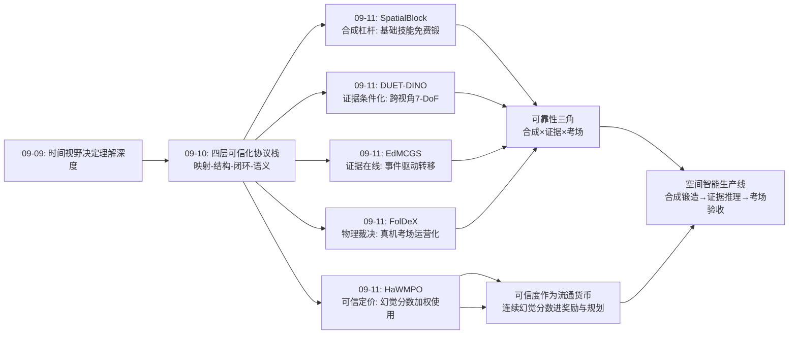
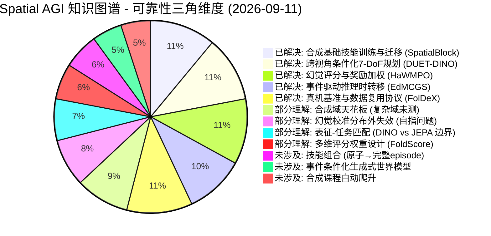
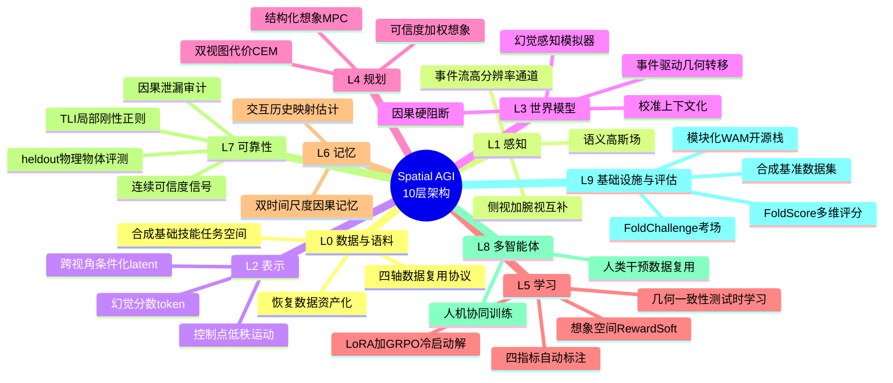

# Spatial AGI 每日研究思考 - 2026-09-11

**日期**: 2026-09-11
**论文数量**: 5篇
**主题**: 可靠性三角日——合成杠杆 · 证据条件化 · 物理裁决。昨天（09-10）确立"世界模型可信化四层协议栈"（映射校准/因果阻断/闭环制衡/几何一致）与"适应载体四级光谱"（上下文/记忆/参数/架构），视角集中在**想象引擎内部**如何被信任。今天五篇论文把镜头拉远，从三个外部方向包抄同一个问题——空间智能的可靠性从哪里来：**SpatialBlock**（arXiv:2609.07064，KAIST & AITRICS）从**训练数据侧**证明基础空间技能可以在全合成的积木世界里以 15k 零噪声样本高效习得并迁移到真实场景（SOTA LVLM 在积木任务上远逊人类；教师模型也做不好导致冷启动悖论，LoRA 保能力 + GRPO 直强化绕过；功能性颜色线索——深度编码/锚定积木/重叠对应——把人类"锚定式空间认知"外化为训练信号）；**DUET-DINO**（arXiv:2609.10506，UTN/KIT/TUM/NVIDIA，Burgard & Schoellig & Lioutikov）从**感知结构侧**证明 7-DoF 全空间潜在规划需要侧视+腕视的同步跨视角条件化，且 DINOv3 密集特征在细粒度动作预测上反超 V-JEPA 2 视频预训练特征（Reach 92% / Angled-reach 72.5% / Lift 60%）——单视图表征对旋转与夹爪分量有原理性盲区；**HaWMPO**（arXiv:2609.09941，吉林大学 & JD）从**使用侧**证明世界模型 rollout 的幻觉程度本身可被动作条件化地预测（HAM：DINOv3+深度+光流+MUSIQ 四指标自动标注），并经 Reward-Soft 机制 R̂=(1-αH)·R 软性降权不可靠信号（LIBERO +15%，G1 真机 67.5%→80%）——昨天问"如何让预测更可信"，今天回答"不可信的预测可以按可信度打折使用"；**EdMCGS**（arXiv:2609.08332，澳门科技大学）从**传感证据侧**证明动态 3D 重建在极低帧率下的根本瓶颈是帧间证据缺失而非表征，解法是把场景运动建模为**事件驱动的马尔可夫链**——稀疏 RGB 锚定状态、区间事件驱动转移、且转移在推理时保持活跃（帧间运动由事件证据推断而非插值），轻量无掩码却超越 DEGS 重流水线；**FolDeX**（arXiv:2609.10243，复旦 & 美的 & CMU）从**检验场侧**建立首个长时程可变形操作真机基准（2,000+ 小时、20+ 任务、10+ 本体、FoldChallenge 公开平台、FoldScore 多维评分、π0+RTC 强基线），并沿恢复/任务/场景/本体四轴把"真机数据复用效率"制度化为标准化研究议题。元结论：**空间智能的可靠性是一个三角结构**——训练侧的合成杠杆（SpatialBlock：便宜且零噪声的技能来源）、推理侧的证据条件化（EdMCGS/DUET-DINO：让真实证据在推理时持续参与状态推断）、检验侧的物理裁决（FolDeX：真机考场给所有叙事打分）；HaWMPO 则是三角之间的"汇率兑换器"——把不可靠性的度量转化为可使用的权重。昨天世界模型完成了自我审计，今天它被要求接受外部证据与外部考场的双重约束。

---

## 📅 每日总结

**日期**: 2026-09-11
**论文数量**: 5篇
**主题**: 可靠性三角日。SpatialBlock（arXiv:2609.07064）：从人类认知发展（积木游戏培育空间能力）出发，构建 SpatialBlock-15k 合成数据集——三类原子空间任务（3D-to-2D 投影/视角变换/结构组合）+ 三种功能性颜色线索（深度编码/锚定积木/重叠对应，对应遮挡推理/身份保持/跨图对应三种认知策略）；关键实证是 SOTA 闭源 LVLM 在积木任务上准确率低到无法充当蒸馏教师（冷启动悖论），解法是 LoRA 轻对齐保留底座 CoT 能力 + GRPO 直接优化（acc/format/len 三项二元奖励），15k 全合成样本即可显著超越基线并泛化到真实空间任务——合成基础技能数据的杠杆率极高，且"推理式训练优于直接答题"证明空间智能不只是感知问题。DUET-DINO（arXiv:2609.10506）：诊断出潜在世界模型的 7-DoF 瓶颈——现有动作条件预测器的 rollout 只可靠捕捉短时程粗粒度平移，旋转与夹爪分量在单视图 latent 中被系统性退化；解法是侧视（全局场景）+腕视（夹爪近景）双流冻结 DINOv3 编码 + 双向 cross-attention 互相条件化（每个视角的 latent 查询另一视角的 latent）+ 视角专属预测头 + 归一化双视图目标代价的 CEM 规划；两个反直觉发现：朴素独立双视角劣于条件化双视角（互补信息必须在预测前交叉而非预测后拼接）；V-JEPA 2 视频预训练特征低估腕视图细粒度动作动态而 DINOv3 密集图像特征更好地捕捉动作条件场景变化（表征-任务匹配问题）。HaWMPO（arXiv:2609.09941）：世界模型 RL 的幻觉管理——生成式世界模型的想象空间 RL 会被长时程 rollout 幻觉污染（策略利用世界模型偏差而非学习真实动力学）；HAM（动作条件幻觉感知模型）从预测视频块+条件动作+当前观测+锚点图像预测连续幻觉分数，监督由四指标自动构造（DINOv3 相似度/深度一致性/光流轨迹一致性/MUSIQ 质量——外观/几何/运动学/质量四维度免人工标注）；Reward-Soft 把幻觉分数注入 GRPO 奖励调制，LIBERO 最佳平均成功率（+15%/+2.8%），G1 真机两任务 67.5%→80%——幻觉是可预测的结构化量而非纯噪声，"知道自己的想象哪里不可靠"是世界模型的元认知。EdMCGS（arXiv:2609.08332）：极低帧率（1/3~1/6 采样）RGB+事件流的动态 3DGS 重建——诊断帧间时间证据缺失（非表征问题）为根本瓶颈；把运动建模为事件驱动马尔可夫链：RGB 帧锚定控制点状态、区间事件（浅层 CNN 编码的极性图）经局部采样驱动转移、且**转移在推理时保持活跃**（中间时刻运动由事件证据直接推断而非插值猜测——与以往事件仅作训练监督的方法的本质区别）；控制点 LBS 低秩运动 + 投影级局部事件采样（空间精确的证据分配）+ TLI 时间局部等距正则（局部刚性）；更少高斯、更快训练渲染、超越 DEGS。FolDeX（arXiv:2609.10243）：首个长时程可变形操作真机基准——双 gap 动机（sim2real + rigid-to-deformable；Fast-WAM 证据：显式测试时想象不总是必要，面向动作的精简设计反而更好——对 WAM 叙事的直接质询）；衣物折叠为核心任务族（连续形变/多阶段语义/双手协调/部分可观测/误差累积）；四条数据复用研究轴（恢复数据价值化/跨任务迁移/跨场景复用/跨本体迁移）；FoldChallenge 已运营公开平台（标准化任务/held-out 物体/受控初始化/统一协议/FoldScore 多维评分：成功×平整度×时间/可审计 rollout/π0+RTC 强基线）。

**关键突破**:
- 🚀 **合成基础技能的杠杆律（SpatialBlock）**：15k 全合成零噪声样本 > 大规模真实噪声标注（至少在基础技能层面）——"人类靠积木建立空间认知，AI 也是"的因果训练验证；数据战略的重心应从"标注真实场景"部分转向"设计合成任务空间"
- 🚀 **冷启动悖论的空间智能版本（SpatialBlock）**：任务难到教师模型也不会时，教师蒸馏失效，LoRA 保能力 + GRPO 直强化是唯一通路——前沿能力训练的普适结构，预示 Spatial AGI 将越来越依赖 self-improvement
- 🚀 **跨视角条件化攻克 7-DoF 瓶颈（DUET-DINO）**：旋转与夹爪动作效应在单视图 latent 中系统性退化；互补信息必须互相条件化（duet 结构）而非独立预测或后融合——把潜在规划从"仅平移"扩展到完整 7-DoF 动作空间
- 🚀 **表征-任务匹配的实证（DUET-DINO）**：DINOv3 密集自监督 patch 特征在细粒度动作预测上反超 V-JEPA 2 视频预训练特征——JEPA 联合嵌入的过度抽象恰好抹掉了 7-DoF 控制所需的空间细节；"你的预训练目标决定你能预测多细的动作后果"
- 🚀 **幻觉的结构化与可使用化（HaWMPO）**：幻觉程度是可动作条件化预测的结构化量（四指标免标注监督）；不可靠预测不必丢弃，可以按可信度打折使用（Reward-Soft）——从"治理幻觉"到"与幻觉共处"的范式推进
- 🚀 **证据的推理时在线原则（EdMCGS）**：传感器证据应在推理时持续条件化空间状态推断（事件驱动转移推理时保持活跃），而非只做训练教师——"训练用X、推理丢X"的设计是一切插值伪影的根源
- 🚀 **数据复用的制度化（FolDeX）**：恢复/任务/场景/本体四轴 + 标准化对照协议——"如何复用已收集的真机数据"从工程话题升级为可测量研究议题；FoldScore（成功×平整度×时间）宣告二值成功评测时代的终结

**架构演进**: 10层保持；第0层（数据）今日重大增量——新增"合成基础技能任务空间设计（SpatialBlock）"与"四轴异构数据复用协议（FolDeX）"与"干预/恢复数据资产化（FolDeX）"；第1层（感知）新增"事件流高时间分辨率证据通道（EdMCGS）"与"侧视+腕视双视角互补采集（DUET-DINO）"；第2层（表示）新增"跨视角条件化 latent（DUET-DINO）"与"控制点低秩运动表示（EdMCGS）"与"动作条件幻觉分数（HaWMPO）"；第3层（世界模型）新增"事件驱动的显式几何状态转移（EdMCGS）"与"幻觉感知的世界模型模拟器（HaWMPO）"；第4层（规划）新增"归一化双视图目标代价 CEM（DUET-DINO）"与"幻觉加权的想象使用（HaWMPO 延伸）"；第5层（学习）新增"LoRA+GRPO 冷启动悖论解法（SpatialBlock）"与"想象空间 GRPO+Reward-Soft（HaWMPO）"与"四指标幻觉自动标注（HaWMPO）"；第7层（可靠性）新增"四指标可靠性审计（HaWMPO）"与"TLI 局部刚性正则（EdMCGS）"与"held-out 物理物体评测（FolDeX）"；第9层（基础设施）新增"FoldChallenge 运营化真机评测平台（FolDeX）"与"合成基准数据集开源（EdMCGS/SpatialBlock）"；第10层（评估）新增"FoldScore 多维评分（FolDeX）"与"幻觉分数作为部署风险监测器（HaWMPO）"。

### 📊 一句话总结
今天的五篇论文从三个外部方向包抄空间智能的可靠性问题——训练侧证明合成基础技能的杠杆律（SpatialBlock），感知与推理侧确立证据的推理时在线原则与跨视角条件化（EdMCGS/DUET-DINO），使用侧实现幻觉的可预测与可加权使用（HaWMPO），检验侧建立真机物理裁决的运营化考场（FolDeX）——空间智能的可靠性从"模型自查"（昨日的内部审计）扩展为"合成杠杆 × 证据条件化 × 物理裁决"的三角结构。

### 🔗 延续性
**昨日→今日**: 昨天的四层可信化协议栈（映射/结构/闭环/语义）回答了"想象引擎如何自查"，今天五篇论文给出三个外部补充：(1) 昨日 TTL-SR 的几何公理免费监督（约束侧）→ 今日 SpatialBlock 的合成任务免费标注（数据侧）——"比真实标注便宜的监督来源"清单扩容：几何公理（免费）、合成环境（零噪声）、校准回合（一次交互）、因果图（领域知识）；(2) 昨日 SyncWorld 的校准回合上下文化（推理时新证据进入上下文）→ 今日 EdMCGS 的事件驱动转移（推理时新证据进入状态转移函数）——"证据的推理时在线"从映射层下沉到动力学层，SyncWorld 校准事件流相机环境的方式可能就是一段事件校准序列；(3) 昨日 CST-WM 的因果幻觉审计（检测不可信）→ 今日 HaWMPO 的幻觉评分（量化并使用不可信）——审计的输出从"合格/不合格"升级为"连续可信度"，可信度直接进入奖励与（未来的）规划权重；(4) 昨日 Motus2 的评估器三接口（内部制衡）→ 今日 FolDeX 的 FoldChallenge（外部裁决）——制衡的最后锚点必须是物理世界，内部审计再完善也需要真机成绩单兜底；(5) 昨日 OpenWAM 的受控实验科学化（可消融底座）→ 今日 FolDeX 的标准化真机协议（可对照考场）——科学化的两大基础设施（可控实验环境+统一物理检验）在同 48 小时内就位。
**今日→明日**: 六条线索：(1) HaWMPO 的连续幻觉分数进入规划器——per-rollout 可信度加权的想象使用（可信区深 rollout、不可信区回退），昨天展望的"自审计想象引擎"获得了现成的可信度信号源；(2) SpatialBlock 的合成任务空间 × Motus2 的自进化课程——积木复杂度随模型能力自动爬升的无限课程；(3) EdMCGS 的事件流进入世界模型——事件条件化的生成式世界模型（事件提供帧间证据，幻觉治理的传感侧方案）；(4) DUET-DINO 的双视角条件化 × OpenWAM-Infra 的模块化底座——跨视角条件化作为可插拔组件进入科学化实验栈；(5) FolDeX 四轴复用协议的首个实证结论——恢复数据增益曲线与跨本体迁移边界；(6) SpatialBlock 探针实验——训练后的 LVLM 内部是否真的形成了 3D 结构表征（线性探针检测体素/深度可解码信息），决定"基础技能迁移"的解释是表征性的还是策略性的。

### 💡 本质思考：如何达成通用空间智能

#### 1. 核心能力的本质是什么？
在本周累积的能力维度模型上（可翻译性、阻抗匹配、可调度性、可审计性、闭环一致性、证据适配性、物理接地深度、通信空间性、接口信息密度、角色可分解性、经验可重组性、时间视野深度、经验因果化、自进化性、想象可信度、适应层级意识、先验经济学），今天新增四维：**合成杠杆率（synthetic leverage）**——空间智能的学习系统应该最大化"每单位真实世界成本获取的技能增量"，合成环境提供零噪声真值与无限扩展，SpatialBlock 证明基础技能层级的杠杆率可以极高（15k 样本迁移真实场景），但杠杆的支点是任务设计对原子能力的分解精度（投影/变换/组合三分法的认知科学依据）；**证据在线性（evidence liveness）**——真实世界的证据（事件流/新视角/交互反馈）必须在推理时持续参与状态推断，训练-推理的证据一致性是插值伪影与幻觉的共同根源，EdMCGS 的"推理时事件驱动转移"与 DUET-DINO 的"跨视角互相条件化"是同一原则在重建与控制两个域的实例化；**元认知可靠性（metacognitive reliability）**——知道自己想象的可信程度本身是一种空间智能，HaWMPO 证明幻觉程度可被动作条件化地预测（幻觉有结构而非纯噪声），"知道何时该信自己的想象"是从生成式想象到可托付想象的最后一跃；**物理裁决权（physical adjudication）**——一切空间智能主张的最终裁决权属于真机考场，FolDeX 的 FoldScore（成功×平整度×时间）宣告空间操作能力是多维连续量而非二值命题。综合本周：**空间智能 = 用统一接口交换空间信息（09-08）× 在多时间尺度积累经验（09-09）× 对想象保持审计（09-10）× 用证据与考场约束想象力（09-11）的四层复合系统**。

#### 2. 当前方法与理想目标的差距在哪里？
- **合成域的能力天花板未测**：SpatialBlock 证明基础技能可迁移，但积木是体素化、无纹理、静态物理的极端简化域；合成→真实的迁移幅度在复杂域（软体物理/开放词汇/多物体动力学）是否仍然成立完全未知；合成任务空间的自动复杂度爬升（与模型能力共同进化）不存在
- **多视角条件化的工程绑定**：DUET-DINO 的侧视+腕视配置是硬件级先验，换机器人需重训；"任意视角皆可推理"的空间智能（视角配置无关的跨视角条件化）远未达到；cross-attention 学到的对应是否真几何（而非统计捷径）未验证
- **幻觉校准的分布外失效**：HaWMPO 的 HAM 在"与真实观测对比"上训练，但想象空间 RL 的价值恰在去真实观测不到的地方——策略被 RL 推向分布外后 HAM 的校准是否保持完全未证；自我指涉的非平稳问题（策略漂移→幻觉分布漂移→校准失效）无解决方案
- **事件证据的覆盖边界**：EdMCGS 依赖事件相机这一小众传感器；低纹理区域无事件、透明物体无事件、纯色缓慢运动弱事件——事件稀疏区域的转移自动退化为插值（回到老问题）；马尔可夫一阶假设对接触丰富动态（弹跳/碰撞/抓取释放）的表达力存疑
- **真机考场的吞吐瓶颈**：FolDeX 的 FoldChallenge 即便公开运营，物理评测的吞吐（排队/重置/人力）与仿真基准的即时性差几个数量级——社区迭代速度受物理限制；企业运营的中立性需要制度性保障
- **可靠性三角尚未闭合**：SpatialBlock（合成训练）→ HaWMPO/DUET-DINO（想象与规划）→ FolDeX（物理裁决）的管线今天才在纸面上连通，没有任何系统同时走过这三个环节；三角各顶点的度量体系互不兼容（合成任务准确率/幻觉分数/FoldScore）
- **二阶技能缺失**：SpatialBlock 教了原子技能但没教技能组合；FolDeX 考了完整 episode 但没解释哪个能力组件失败——原子能力与完整能力的 gap（技能组合问题）两边都没碰

#### 3. 从今天到理想状态，最可能的路径是什么？
短期（可见的三件套实验）：幻觉加权规划——把 HaWMPO 的连续幻觉分数接入 DUET-DINO 式 CEM 规划的目标函数（预期代价 = latent 距离 × 可信度权重），验证"按可信度分配想象深度"的收益；SpatialBlock 探针——对训练后的模型做线性探针（中间层能否解码体素/深度结构），区分表征性迁移与策略性迁移；FolDeX 四轴首测——恢复数据增益曲线是四轴中成本最低信号最强的第一刀。中期（结构合并）：事件条件化世界模型——把 EdMCGS 的"证据驱动转移"思想引入生成式世界模型（事件流作为帧间观测输入），传感侧治幻觉与使用侧治幻觉（HaWMPO）正交互补；合成技能课程自动化——SpatialBlock 任务空间 + 难度自动爬升（模型能力评估驱动）+ HaWMPO 式可靠性门控（只学模型当前可信的合成样本），形成自进化的合成课程；跨视角条件化组件化——DUET-DINO 的 cross-attention 模块进入 OpenWAM-Infra，在受控底座上量化视角互补的原则1增益（呼应昨天 OpenWAM 的操作建议）。长期（三角闭合）：空间智能的完整生产线——合成任务空间自动生成原子技能（SpatialBlock）→ 证据条件化的多视角世界模型整合技能（DUET-DINO/EdMCGS）→ 幻觉感知的自审计想象引擎（HaWMPO）→ 真机考场的持续裁决与数据回流（FolDeX），四环节以标准化度量接口相连——数据从考场回流训练（FolDeX 恢复轴），可信度从训练流向推理（HaWMPO→规划），技能从合成流向真实（SpatialBlock→FolDeX）——这将是 Spatial AGI 从"论文拼图"到"生产系统"的组织形态。

---

## 🔗 与昨日思考的联系

### 昨日重点
昨天（2026-09-10）的主题是"世界模型可信化与适应协议"：SyncWorld（校准回合上下文化，映射层审计）、OpenWAM（模块化受控实验三原则，方法论层）、Motus2（三接口闭环自进化，制衡层）、CST-WM（因果幻觉架构级阻断，结构层）、TTL-SR（几何公理测试时一致性，语义层）。元结论：**世界模型的可信化需要四层协议栈**；适应载体分化为上下文/记忆/参数/架构四级光谱；约束与数据的统一经济学（约束保证正确性骨架、数据填充统计血肉）。

### 今日进展
今天五篇论文把"可信化"从模型内部自查扩展为外部三角约束，五个接续点：
- 昨天的 **TTL-SR 几何公理免费监督**（约束侧捷径）→ 今天 **SpatialBlock 合成任务免费标注**（数据侧捷径）："比真实标注便宜的监督"清单扩容为四项——几何公理（免费）、合成环境（零噪声）、校准回合（一次交互）、因果图（领域知识）；昨天说"骨架用约束画、血肉用数据填"，今天补上"基础技能可以整体在合成流形上预锻"
- 昨天的 **SyncWorld 校准回合**（新证据以上下文形式进入推理）→ 今天 **EdMCGS 事件驱动转移**（新证据以状态转移输入形式进入动力学）："证据的推理时在线"原则从条件化层下沉到转移函数层——SyncWorld 校准一个事件相机环境的最自然方式就是一段事件校准序列，两个协议可以直接拼接
- 昨天的 **CST-WM 因果泄漏审计**（检测想象的不可信）→ 今天 **HaWMPO 幻觉分数**（量化想象的不可信并加权使用）：审计输出从二值检查升级为连续可信度，且可信度立即产生经济价值（奖励调制、未来是规划权重）——"可审计性"进化为"可定价性"
- 昨天的 **Motus2 评估器制衡**（想象引擎的内部第三者）→ 今天 **FolDeX FoldChallenge**（想象引擎的外部裁判）：内部制衡防共谋的最终锚定是物理真值——FoldScore 就是周期性外部校准的制度化形态，昨天展望的"评估器外部锚定"已有运营化先例
- 昨天的 **OpenWAM 受控实验底座**（仿真侧科学化）→ 今天 **FolDeX 标准化真机协议**（物理侧科学化）：可控实验环境与统一物理考场在同 48 小时内就位，Spatial AGI 的"可复现性基础设施"（仿真的 OpenWAM-Infra + 真实的 FoldChallenge）形成双支柱

### 昨日→今日的元级别跃迁
昨天回答"智能体如何审计自己的想象"；今天回答"想象力的原料从哪来（合成杠杆）、推理时该信什么（证据在线）、不可信的部分怎么用（可信度加权）、最终由谁裁决（物理考场）"。合并后的图景：**空间智能体的可靠性不是一个属性而是一条供应链——从合成技能的锻造、经证据条件化的推理、到真机考场的验收，每个环节都有自己的质量度量，而 HaWMPO 式的可信度信号是贯穿供应链的流通货币。**

---

## 🧭 核心见解演进图



---

## 📚 五篇论文深度剖析

### 5.1 SpatialBlock：积木——空间智能的合成锻炉

#### 问题层
- SOTA LVLM 从 2D 图像心理重建 3D 结构的能力（空间智能）仍然有限，成为自动驾驶/机器人部署的根本瓶颈
- 现有方案依赖真实场景空间 QA 数据集——稠密几何标注贵、慢、且因依赖外部感知模块（分割/深度估计）而噪声大
- 惊人实证：在基础积木堆叠任务上，人类接近满分，顶级闭源 LVLM 表现很差且空间逻辑错误——空间智能的短板在最底层而非高阶推理

#### 方法层
- 认知科学依据：发展心理学证明积木游戏培育空间整合与心理模拟（Levine 2012; Caldera 1999; Casey 2008）——任务设计逐能力对齐人类发展路径
- SpatialBlock-15k：三类任务 × 三种原子能力——Q1 3D-to-2D 投影（空间组合+遮挡推理）、Q2 视角变换（心理模拟+等变性）、Q3 结构组合（空间整合+接口匹配）
- 功能性颜色线索：Q1 深度着色（颜色=深度排序显式索引）、Q2 锚定积木（变换中的身份与角色保持）、Q3 重叠色块（跨图像对应）——把人类锚定式场景扫描（Land & Hayhoe 2001）外化为训练信号
- 双训练路线：直接 SFT（快速空间求解的 System 1）vs LoRA SFT + GRPO（保留 CoT 的 System 2；奖励 R_acc+R_format+R_len 三元二元）
- 冷启动悖论解法：SOTA 教师在积木任务上准确率低 → 教师蒸馏轨迹不可靠 → 放弃冷启动，LoRA 低秩约束天然限制过拟合、保留底座推理能力

#### 思考
- "积木效应"的 AI 验证暗示空间智能可能存在跨物种的普适发展路径——从简单合成结构到复杂真实场景，而非靠堆真实数据一步到位
- 冷启动悖论的普适性：当任务处于前沿（教师不比学生强），蒸馏失效、self-initiated RL 成为唯一通路——这与数学/代码 RL 领域的观察一致，首次在空间智能上系统验证
- 颜色线索的本质是"认知策略的外化"：深度编码/锚定/对应三种策略比几何知识本身更易迁移——教策略比教知识便宜
- 最大的隐忧是评测有效性：多选题形式+答案抽取奖励可能培养排除法策略而非 3D 表征——需要探针实验检验内部是否真有 3D 结构编码
- 局限：积木域的体素化/无纹理/静态物理与真实场景差距大；任务不覆盖动态/语义/大尺度空间记忆；15k 规模对更复杂结构的覆盖未知

#### 对 10 层架构的更新
- 第0层新增：合成基础技能任务空间设计（任务分类学+零噪声真值+功能线索）
- 第5层新增：LoRA+GRPO 冷启动悖论解法
- 第10层新增：基础空间技能探针（作为独立任务族的评测）

### 5.2 DUET-DINO：二重奏——跨视角条件化的 7-DoF 规划

#### 问题层
- 动作条件潜在世界模型可实现零样本目标条件规划，但 rollout 只可靠捕捉短时程粗粒度平移
- 旋转与夹爪动作的效应在单视图 latent 预测中被系统性退化（degraded）——全 7-DoF 规划是空白
- 结构性原因：全局侧视图对夹爪附近精细几何变化不敏感（信号被稀释），腕视图缺乏全局上下文（目标出画）——每个 7-DoF 分量需要不同视角敏感度

#### 方法层
- 架构三件套：冻结 DINOv3 编码（侧视+腕视独立 patch latent）→ 双向 cross-attention（每视角 latent 作 Q 查询另一视角 K/V）→ 视角专属预测头（条件于 7-DoF 动作+末端状态）
- 训练：DROID+RoboArena 从头训练（不用 V-JEPA 2 预训练），TF（clip 内单步）+ AR（K=2 自回归）双 L1 损失
- 规划：目标图编码 → latent 空间 receding-horizon 最优控制 → CEM 采样求解 → 归一化双视图目标代价（防单视图主导）→ MPC 闭环
- 关键结果：Reach 92% / Angled-reach 72.5% / Lift 60%；全面超越单视角与独立双视角基线；视觉分布偏移（背景/干扰物/扰动）下鲁棒

#### 思考
- "duet"设计的深层原理：cross-attention 后的预测头仍保持视角专属——交叉信息只有有助于本视角预测时才会被保留（信息瓶颈效应），既融合又不污染
- DINOv3 > V-JEPA 2 的表征-任务匹配启示：JEPA 联合嵌入的抽象化恰好抹掉控制级空间细节——Spatial AGI 可能需要分层表征栈（高层语义 JEPA 式、底层几何 DINO 式）
- 从头训练超越预训练底座：领域内动作数据的价值被低估——"不依赖大规模视频预训练"对算力受限团队是好消息
- goal-image 条件化是潜在规划的通病：开放任务中目标图不总可用；语义-控制接口（VLM 出子目标图、DUET-DINO 出动作）是自然分层但未实现
- 局限：桌面设定与固定双视角的硬件绑定；K=2 短训练 rollout 与长任务的误差累积鸿沟；CEM 无梯度的推理时延；Lift 60% 提醒精细操作仍有长路

#### 对 10 层架构的更新
- 第1层新增：侧视+腕视互补采集配置
- 第2层新增：跨视角条件化 latent（预测前交叉优于预测后拼接）
- 第4层新增：归一化双视图目标代价 CEM（全 7-DoF 潜在规划）

### 5.3 HaWMPO：自知之明——幻觉的定价与使用

#### 问题层
- 真机在线 RL 贵/险/低效 → 世界模型想象空间 RL 是替代 → 但长时程生成 rollout 累积幻觉 → 幻觉轨迹把世界模型误差转化为虚假学习信号（WoVR 已证）
- 直接用幻觉 rollout 做策略更新，策略会 exploit 世界模型偏差——学到在真实环境无效的动作

#### 方法层
- HAM（动作条件幻觉感知模型）：输入（8帧预测块+条件动作+当前观测+锚点图像）→ 4层 Fusion Transformer（动作→视觉 cross-attention）→ 可学习 query → MLP/sigmoid → 连续块级幻觉分数
- 四指标自动标注：DINOv3 相似度（外观）+ 深度一致性（几何）+ 光流轨迹一致性（运动学）+ MUSIQ（质量）——min-max 归一化等权平均取反；论文严谨声明这是物理有效性的代理而非保证，任务失败≠幻觉
- Reward-Soft：R̂=(1-α·H)·R——对看似成功但高幻觉的步骤施加软惩罚；乘法调制保留梯度连续性，单超参
- 闭环 GRPO：G=8 并行想象环境 → 幻觉评分 → 奖励调制 → 组内归一化 advantage → clip 目标+KL 正则
- 结果：LIBERO 最佳平均（+15%/+2.8%）；G1 真机 67.5%→80%（想象空间训练的真实兑现）

#### 思考
- 幻觉是结构化的：可被动作条件化预测（同一预测在不同动作下可信度不同——快动作外推更易失真）——这是与通用视频幻觉检测的本质区别，具身先验的价值
- 四指标分解实际上给出了"可信空间预测"的操作性定义：外观+几何+动力学三维自洽——可直接用作世界模型评测协议与合成数据筛选器
- Reward-Soft 的隐藏张力：R<0 时高幻觉反而减弱惩罚——保留失败信息（保守）还是错失"这个动作会失败"的信号（保守的代价），论文未消融
- 最深的理论缺口：HAM 在"与真实观测对比"上训练，但想象 RL 的价值恰在真实观测不可及处——策略漂移→幻觉分布漂移→校准失效的自我指涉问题未解
- 与 HaWMPO 的使用侧路线相对：WoVR 生成侧（KIR/PACE 让预测更准）、HaWMPO 使用侧（按可靠性加权使用）——正交可叠加
- 局限：块级分数无法归因到外观/几何/动力学哪个维度失败（维度化分数是下一步）；8 帧 chunk 时程短；LIBERO 桌面 + G1 双任务的泛化声明有限

#### 对 10 层架构的更新
- 第3层新增：幻觉感知模拟器（预测+逐 rollout 可信度）
- 第5层新增：四指标幻觉自动标注 + 想象空间 GRPO+Reward-Soft
- 第7层新增：连续可信度信号（从二值审计到连续定价）
- 第10层新增：幻觉分数作为部署风险监测器

### 5.4 EdMCGS：事件驱动的马尔可夫链——证据在推理时在线

#### 问题层
- 极低帧率（1/3~1/6）RGB 的动态 3D 重建有现实动机：存储滚动缓冲/带宽受限/低光长曝光/廉价硬件
- 根本瓶颈诊断：不是表征（3DGS 足够强）而是帧间时间证据缺失——纯 RGB 训练的形变场过拟合观测时刻，未观测时刻撕裂鬼影
- 既有事件方法的共同缺陷：事件只做训练时监督（形变参数化为纯时间函数，推理时不读事件，中间运动靠插值猜测）；且笨重（DEGS 需外部光流网络+逐场景 LoRA+位姿网络）且不可复现

#### 方法层
- 核心建模：事件驱动马尔可夫链——稀疏 RGB 帧锚定控制点状态、区间事件驱动转移、**转移在推理时保持活跃**（中间运动由事件证据推断而非插值）
- 局部事件采样：区间事件累积为极性图 → 浅层 CNN 编码 → 每个控制点在自己图像投影处双线性采样 → 局部运动码——运动部件触发的事件恰好作用于覆盖它的控制点（空间精确的证据分配，避免全局描述子坍缩）
- 状态载体：紧凑控制点集（继承 SC-GS）+ LBS 驱动 canonical 高斯（低秩运动表示）
- TLI 正则：时间局部等距——保持邻近形变时刻控制点间距离，维持局部刚性，稳定未观测时刻渲染
- 渲染流程：粗形变（RGB 驱动 MLP）+ 细校正（事件驱动转移）→ 控制点位移 → LBS → 光栅化

#### 思考
- "推理时事件驱动"是概念层面的关键转变：证据从训练教师变为推理时的在线约束——一切"训练用X、推理丢X"的设计（预训练表征丢几何、合成训练丢语义）都是同构的伪影源
- 事件相机的空间智能价值被系统性低估：微秒级变化证据开启高帧率相机无法触及的动态频段——机器人高速操作/无人机避障/头显快速头动的天然传感器
- 与生成式世界模型的对照：显式几何+事件证据（EdMCGS）天然低幻觉；生成式 latent+视频预测（HaWMPO 所治）高幻觉需管理——表征选择决定幻觉治理成本，传感选择决定证据密度
- 马尔可夫链的术语借用在深层是正确的：状态只依赖上一锚点+当前区间证据——时间被"事件证据"重新参数化，这是比时间戳更本质的时间表示
- 局限：事件相机小众（适用范围受限）；单目设置对退化运动脆弱；一阶链对接触丰富动态（弹跳/碰撞）表达力存疑；低纹理/透明物体区域事件稀疏退化为插值；只评渲染质量未验证下游任务可用性

#### 对 10 层架构的更新
- 第1层新增：事件流高时间分辨率证据通道
- 第2层新增：控制点低秩运动表示 + 局部事件空间索引
- 第3层新增：事件驱动的显式几何状态转移（推理时活跃）
- 第7层新增：TLI 局部刚性正则（物理先验作为正则）

### 5.5 FolDeX：真机考场——可变形操作与数据复用的制度化

#### 问题层
- 双重 gap：sim2real（摩擦/标定/延迟/重置差异使仿真 SOTA 真机退化）+ rigid-to-deformable（可变形物体持续变形/自遮挡/缠绕/接触响应）
- 对 WAM 的直接质询：Fast-WAM 证据显示显式测试时未来想象不总是必要，面向动作的精简设计在可变形任务上反而更好——视觉想象力≠可变形操作力
- 现有真机基准的两大问题：短时程刚体为主（折叠只是通用套件里的孤立任务）；真机评测对工程细节极端敏感（连 π0 加不加 RTC 都影响表现）——无统一协议的排名不可信

#### 方法层
- FolDeX 基准：2,000+ 小时全真机数据、20+ 任务（衣物折叠为中心 + 其他可变形 + 少量刚体）、10+ 本体；完整闭环长时程 episode（铺平→展开→对齐→多阶段折叠→终态质量）
- 四条数据复用研究轴：恢复轴（部署期人类干预/恢复数据资产化）、跨任务轴（衣物类别间+刚体→可变形迁移）、跨场景轴（光照/背景/布局变化复用）、跨本体轴（运动学/传感器/动作空间迁移）——每轴配标准化划分+受控对比+固定因子+报告要求
- FoldChallenge 运营化平台：外部提交策略 + 标准化任务定义 + held-out 物理物体（防过拟合训练衣物）+ 受控初始化 + 统一执行协议 + rollout 审计 + 排行榜；已部署运营（投稿前）
- FoldScore 多维评分：任务成功 × 终态平整度 × 完成时间——二值成功无法刻画完整 episode 质量
- 强基线纪律：精心工程化的 π0+RTC 参考实现——防"战胜弱基线"的虚假进步

#### 思考
- 最大的组织性创新：把"数据复用效率"变成有标准化对照协议的研究轴——深度学习史上一旦某因素被标准化度量（ImageNet 之于分类）就以超预期速度进步；四轴协议若被采纳，真机数据资产周转率的重塑可期
- 恢复轴的数据经济学：人类干预时刻包含"策略不知道自己错了+人知道如何恢复"的高密度知识——部署期 DAgger 的资产化版本，失败数据从废料到资产的第二次确认（第一次是 Motus2）
- FoldScore 的哲学：长时程空间操作的能力是多维连续量（完成了但很难看 vs 没完成但推进了3个阶段蕴含不同信息）——空间智能评测的多维化从这里开始
- 企业运营平台的治理风险：激励错位（自家方法主场优势）需要制度性保障（第三方审计/开放指标）——运营化基准的代价是治理义务
- 能力栈分解：完整折叠需要 L1 衣物状态估计 + L2 结构空间推理 + L3 双臂协调 + L4 阶段管理 + L5 错误恢复 + L6 执行控制——传统基准只考 L1-L2 片段，FolDeX 考 L1-L6 闭环
- 局限：任务族单一（衣物之外的软体宇宙——绳结/食物/柔性器件——各有本质不同物理）；真机吞吐与仿真即时性差数量级；四轴的实证结论待社区填充；跨本体轴的受控变量几乎不可能严格固定

#### 对 10 层架构的更新
- 第0层新增：四轴异构数据复用协议 + 干预/恢复数据资产化
- 第7层新增：held-out 物理物体评测（空间泛化的最严格形式）
- 第9层新增：FoldChallenge 运营化真机评测平台
- 第10层新增：FoldScore 多维评分（成功×质量×效率）

---

## 🔀 交叉综合

### 五篇论文的可靠性三角矩阵

| 论文 | 三角顶点 | 作用层 | 核心机制 | 可靠性贡献 |
|---|---|---|---|---|
| SpatialBlock | 合成杠杆 | 训练侧 | 合成任务空间+LoRA/GRPO | 零噪声基础技能的便宜来源 |
| DUET-DINO | 证据条件化 | 感知-推理侧 | 跨视角条件化+双视图代价 | 7-DoF 动作预测的视角完备性 |
| EdMCGS | 证据条件化 | 传感-重建侧 | 事件驱动马尔可夫链 | 帧间证据的推理时在线 |
| HaWMPO | 可信定价 | 使用侧 | HAM+Reward-Soft | 不可信预测的可量化与可加权使用 |
| FolDeX | 物理裁决 | 检验侧 | FoldChallenge+FoldScore | 一切主张的真机终审 |

### 今天的元发现

1. **可靠性从属性变为供应链**：合成技能锻造（SpatialBlock）→ 证据条件化推理（DUET-DINO/EdMCGS）→ 可信度加权使用（HaWMPO）→ 物理考场验收（FolDeX）——每个环节有独立度量，链条整体才构成"可靠"二字；昨天的四层审计栈是链上"使用"环节的内部细则
2. **监督来源的第三次扩容**：本周递进——几何公理（TTL-SR，物理自带）→ 校准回合（SyncWorld，一次交互）→ 合成任务空间（SpatialBlock，零噪声无限）→ 四指标自动标注（HaWMPO，模型互检）——标注预算的边际主义正在被"免标注监督工程学"替代
3. **训练-推理证据一致性原则的普遍化**：EdMCGS（事件训练且推理时读事件）、DUET-DINO（双视角训练且推理时双视角条件化）的正面示范 vs 以往事件方法（训练读事件推理不读）的负面教材——空间智能系统的每个输入通道都应该问："推理时它还在吗？"
4. **幻觉的经济学终章**：检测（CST-WM 泄漏审计）→ 量化（HaWMPO 连续分数）→ 使用（奖励/规划加权）→ 消除（EdMCGS 证据驱动转移的传感侧路线）——四步齐备，幻觉从研究叙事变成工程参数
5. **评测的多维化与运营化**：FoldScore（成功×平整度×时间）终结二值成功时代；FoldChallenge 运营化平台开创"考场即服务"模式——评测从论文的一张表变成一项基础设施
6. **表征-任务匹配的警报**：DINOv3 > V-JEPA 2（DUET-DINO）+ Fast-WAM 想象不必需（FolDeX 引用）+ MoT 系证据——"更抽象的预训练表征/更丰富的想象"并不自动转化为更强的空间操作；抽象层级与任务粒度的匹配是新的设计自由度

### 可靠性三角的结构综合（今日核心）

```
        [合成杠杆 SpatialBlock]
          锻造基础技能（零噪声）
            ╱            ╲
           ╱  HaWMPO:      ╲
          ╱  可信度是       ╲
         ╱   流通货币        ╲
[证据条件化] ←────────→ [物理裁决 FolDeX]
DUET-DINO/EdMCGS        FoldChallenge
推理时的真实约束          一切的最终锚点
```

- 三角每个顶点独立不足以支撑可靠性：只有合成没有考场 → 合成域自嗨；只有考场没有合成 → 迭代成本爆炸；只有推理时证据没有可信度定价 → 证据质量参差无法使用
- HaWMPO 的位置在三角内部：它把"考场信息"（四指标来自与真实观测对比）转化为"推理时可用的权重"——供应链的货币发行机制
- 与昨天四层审计栈的关系：审计栈是"使用环节"的内部质检流程，可靠性三角是整个产业的结构——昨日微观、今日宏观

---

## 🕳️ 知识缺口分析



### 缺口细目
1. **合成域天花板**：积木域有效 ≠ 软体/开放词汇/多物体动力学域有效；合成复杂度的安全爬升曲线不存在
2. **幻觉校准的自我指涉**：策略漂移→幻觉分布漂移→HAM 校准失效的闭环无理论；"校准-漂移竞赛"的稳定性条件未知
3. **表征-任务匹配的完整图谱**：DINO vs JEPA 只有一个数据点；"抽象层级×任务粒度"的匹配矩阵未绘制
4. **技能组合问题**：SpatialBlock 的原子技能与 FolDeX 的完整 episode 之间的组合学习（技能编译）无人研究
5. **跨视角对应的几何真实性**：cross-attention 学到的是几何对应还是统计捷径——注意力图可视化与探针实验缺位
6. **考场吞吐与迭代速度**：真机评测的物理吞吐限制社区迭代——远程评测/自动化重置/仿真预筛的混合流水线未成形
7. **FoldScore 权重的博弈论**：多维评分的加权和存在质量-时间的策略性替代边界，防刷分机制未设计

---

## 🗺️ 10层架构思维导图



### 层级更新摘要
- **第0层（数据）今日最大增量**：合成任务空间设计 + 四轴复用协议 + 恢复数据资产化——数据层从"收集什么"进化到"如何锻造与复用"
- **第3层（世界模型）持续本周主线**：事件驱动几何转移 + 幻觉感知模拟器——世界模型家族新增"显式几何证据驱动"与"自报可信度"两个物种
- **第7层（可靠性）连续第四天增量**：连续可信度信号 + TLI 正则 + held-out 物理评测——可靠性工程从指标（09-10）进入货币化（今日）阶段

---

## 🛤️ 主线技术路径

### 路径回顾：空间智能可靠性的四个时代


### 阶段1:生成（2023-2024）——"能想象"
- 视频扩散成熟，世界模型=下一帧预测器；评测与决策无关

### 阶段2:控制（2025）——"能响应"
- 动作条件化让想象接受指令；映射条件性与因果捷径问题埋下

### 阶段3:实时化与闭环（2026 上半年）——"能支撑决策"
- ZimaBlue 33ms 撤销延迟死刑；Motus2/Zeva 闭环自进化；正确性问题浮出

### 阶段4:可审计（2026-09-10）——"能被信任"
- 四层审计协议（映射/结构/闭环/语义）；适应载体四级光谱；世界模型完成自我检查

### 阶段5:证据与考场（2026-09-11，今日）——"能被外部约束"
- 合成杠杆降低技能成本（SpatialBlock）；证据在推理时在线（EdMCGS/DUET-DINO）；不可信部分可定价使用（HaWMPO）；物理考场运营化（FolDeX）——可靠性从自查扩展为外部约束体系

### 阶段6（展望）：生产系统（2027?）——"能持续兑现"
- 合成锻造→证据推理→考场验收的完整供应链以标准化接口连通
- 可信度作为统一货币在链上流通：训练按可信度筛样本、推理按可信度配想象、考场按可信度发成绩
- 技能组合编译器：原子技能（合成锻造）到完整 episode（考场验收）的中间层被填补

---

## 🔬 待探索议题

1. **幻觉加权规划**：HaWMPO 连续幻觉分数接入 DUET-DINO 式 CEM 目标函数（预期代价=latent距离×可信度权重），验证"按可信度分配想象深度"——可信区深 rollout、不可信区回退反应式策略
2. **SpatialBlock 探针实验**：对训练后模型做线性探针（中间层能否解码体素/深度结构），区分表征性迁移与策略性迁移——决定合成技能路线的解释基础
3. **FolDeX 恢复轴首测**：恢复数据增益曲线是四轴中成本最低信号最强的第一刀——人类干预时刻的边际价值量化
4. **事件条件化生成式世界模型**：把 EdMCGS 的"证据驱动转移"引入生成式世界模型（事件流作帧间观测输入）——传感侧治幻觉与 HaWMPO 使用侧治幻觉正交互补
5. **合成课程自动爬升**：SpatialBlock 任务空间 + 难度随模型能力自动爬升 + HaWMPO 式可靠性门控（只学当前可信的合成样本）——自进化的合成课程
6. **跨视角条件化组件化**：DUET-DINO 的 cross-attention 模块进入 OpenWAM-Infra 受控底座，量化视角互补的原则1增益——视角维度接入科学化实验栈
7. **HAM 的维度化分数**：从标量幻觉分升级为维度化分数（外观/几何/动力学各自打分），奖励调制按失败维度差异化，规划器获得可解释的风险归因
8. **校准-漂移竞赛的理论**：策略被 RL 推向分布外 → 幻觉分布漂移 → HAM 校准失效的竞赛动力学；稳定性条件与再校准频率设计
9. **FoldScore 防刷分机制**：多维评分加权和的质量-时间策略性替代边界；held-out 物体轮换与评分权重的不透明化设计
10. **积木→软体的合成域阶梯**：从体素积木到布料/绳结/粒体的合成任务空间扩展——每个域的"基础技能分解表"（对应 SpatialBlock 的投影/变换/组合三分法）如何自动生成
11. **探针驱动的表征审计协议**：把线性探针（3D 结构可解码性）作为空间模型的例行体检——与昨天的四层审计栈合并为五层（新增"表征审计"层）
12. **事件相机的空间技能预训练**：用事件流数据做空间动态的预训练任务（事件帧预测/事件光流），为事件条件化世界模型储备底座表征

---

## 💡 本质思考的三重展开

### Q1: 空间智能的可靠性为什么必须是三角结构而不是单一属性？
因为可靠性的三个来源在认识论上互不替代：**合成杠杆提供正确性**（零噪声真值保证学到的技能没有标注噪声的系统性偏差，但合成域的简化本身是一种偏差——需要外部检验）；**证据条件化提供即时性**（真实证据在推理时在线，保证状态推断不脱离当前世界，但证据永远稀疏——需要合成先验补全）；**物理裁决提供终局性**（一切内部度量的最终校验，但吞吐低成本高——不能作为唯一迭代手段）。单靠任何一个顶点都会失败：纯合成是自嗨（FolDeX 的 sim2real gap 证据）、纯证据是近视（证据稀疏性）、纯考场是奢侈（吞吐瓶颈）。HaWMPO 的深刻之处在于指出三角之间的流通问题：合成训练的产品（预测）要进推理（需要可信度定价）、推理的结果要进考场（需要可审计性）、考场的反馈要回训练（需要数据资产化）——**流通货币的设计（连续可信度分数）与三个顶点本身同等重要**。

### Q2: 表征的抽象层级应该与什么对齐？
本周出现了三组张力证据：DUET-DINO 的 DINOv3 > V-JEPA 2（密集 patch 特征胜过抽象联合嵌入——控制级任务需要空间细节）；OpenWAM 的"紧凑而信息丰富的 latent"原则（紧凑要求压缩、丰富要求保信息——昨天的分析指出结构化压缩是唯一解）；Fast-WAM 的"想象不必需"（面向动作的精简设计在可变形任务上更好——预测能力的丰富不等于操作能力的强大）。三组证据共同指向：**表征的抽象层级必须与任务的证据粒度对齐**——7-DoF 控制需要 patch 级空间细节（DINOv3 赢）、任务级规划需要语义抽象（JEPA 式有优势）、长时程预测需要紧凑充分统计量（GaussianDream++ 的 20 token）。理想的 Spatial AGI 是分层表征栈：每层为对应的决策粒度提供恰当抽象，层间的接口是本周反复出现的模式（锚定/条件化/一致性校验）。当前缺口：没有理论告诉我们"给定决策频率与控制精度，最优抽象层级是什么"——表征-任务匹配矩阵是下一个值得专门绘制的基础图表。

### Q3: 从考场到锻炉：数据的逆向流动为什么是被低估的环节？
本周的数据叙事几乎都是正向的：合成→真实（SpatialBlock）、人类→机器人（OpenWAM）、演示→技能（FolDeX 训练侧）。但 FolDeX 恢复轴悄悄打开了逆向通道：**考场（部署）本身成为最高质量数据的产地**——人类干预时刻包含"策略的失败模式+专家的恢复策略"双重信息，是任何主动采集都难以获得的稀有样本。这个逆向流动的深层意义：(1) 它让考场从成本中心变成资产产地——真机评测的每一次 rollout 都在生产训练数据，吞吐瓶颈的经济学被部分改写；(2) 它形成闭环进化压力：考场暴露的失败模式决定合成课程下一步该锻什么（FolDeX 失败数据 → SpatialBlock 式合成任务的针对性生成）——合成的方向由真实的失败引导；(3) 它要求新的数据基础设施：干预时刻的自动检测、恢复轨迹的信用分配、失败数据的隐私与安全审查——"考场数据 pipeline"是继评测平台之后基础设施的下一个竞争点。逆向流动 + 正向锻造合起来，空间智能的数据经济学才真正闭环。

---

## 🌅 明日展望

1. **可信度加权规划的首篇论文**：HaWMPO 分数 × CEM/MPC 目标函数的组合预计 2026 Q4 出现——"按可信度分配想象深度"是自审计想象引擎的最后一块拼图
2. **FolDeX 首批外部成绩单**：FoldChallenge 排行榜的首次公开更新——π0+RTC 基线被超越的幅度将成为可变形操作进展的硬指标
3. **事件流的 LLM 时刻**：事件条件化世界模型的首批工作（EdMCGS 思想 × 生成式 backbone）——传感侧治幻觉的实证
4. **SpatialBlock 后续的探针之争**：合成训练是否产生真实 3D 表征的探针实验——若表征性迁移成立，合成优先路线获得理论地基
5. **DINOv3 vs JEPA 的系统测绘**：表征-任务匹配矩阵的首批受控实验（在 OpenWAM-Infra 上换底座测下游）

---

*分析框架: Spatial AGI Daily Research v7*
*今日主题: 可靠性三角——合成杠杆·证据条件化·物理裁决*
*核心综合: 可靠性是供应链而非属性 + 可信度是流通货币 + 数据的逆向流动*

---

## 📊 技术栈演进对比表

### 表1: 空间智能可靠性技术栈演进（2026-03 → 2026-09-11）

| 技术栈层 | 2026-03 状态 | 2026-06 状态 | 2026-09-10 状态 | 2026-09-11 状态（今日） |
|---|---|---|---|---|
| 技能获取 | 真实标注微调 | 伪标注蒸馏 | 几何公理测试时自监督 | 合成任务空间锻造（15k迁移） |
| RL 初始化 | 教师冷启动蒸馏 | 过程奖励模型 | 校准回合上下文化 | LoRA 保能力+直强化（冷启动悖论解） |
| 潜在规划 | 单视图仅平移 | 单视图+域随机化 | 结构化想象 MPC | 跨视角条件化+全 7-DoF CEM |
| 想象治理 | 无 | 生成侧滤波 | 四层审计栈（自查） | 幻觉定价+按可信度加权使用 |
| 传感证据 | RGB 帧为主 | 多相机融合 | 触觉/双目模态课程 | 事件流推理时在线+局部证据索引 |
| 动态重建 | 密集 RGB 形变场 | 事件仅训练监督 | 语义鲁棒 SLAM | 事件驱动推理时转移（极低帧率） |
| 真机评测 | 单点实验室 | 远程评测平台 | 距离/停止/朝向三重协议 | 运营化考场+多维评分+强基线纪律 |
| 数据经济学 | 收集更多 | 跨本体聚合 | 失败数据价值化 | 四轴复用协议+恢复数据资产化 |
| 可靠性度量 | 成功率单值 | OOD 扰动套件 | 校准效率/一致性率/泄漏 | 连续可信度+FoldScore 多维 |
| 表征选型 | 通用预训练底座 | 领域微调 | 紧凑富信息 latent 原则 | DINOv3>JEPA 实证+分层表征栈方向 |

### 表2: 今日五篇论文技术栈横向对比

| 维度 | SpatialBlock | DUET-DINO | HaWMPO | EdMCGS | FolDeX |
|---|---|---|---|---|---|
| 三角定位 | 合成杠杆 | 证据条件化 | 可信定价 | 证据条件化 | 物理裁决 |
| 层级 | 训练数据 | 感知-规划 | 学习-可靠性 | 传感-重建 | 基础设施-评测 |
| 核心问题 | 空间技能的便宜来源 | 7-DoF 预测瓶颈 | 幻觉污染 RL | 帧间证据缺失 | 真机检验与数据复用 |
| 核心机制 | 积木任务+LoRA/GRPO | 跨视角条件化 | HAM+Reward-Soft | 事件驱动马尔可夫链 | 四轴协议+考场 |
| 监督来源 | 合成零噪声 | 双视角配对 | 四指标自动标注 | RGB 锚点+事件流 | 真机全物理 |
| 关键数字 | 15k→真实泛化 | 92/72.5/60% | +15%/+2.8%/80% | 更少高斯更快 | 2000h/20+任务/10+本体 |
| 开源程度 | 代码+数据 | 将开源 | 待定 | 代码+新数据集 | 平台运营中 |
| 空间智能贡献 | 合成杠杆顶点 | 视角完备性 | 可信度货币 | 证据在线原则 | 物理裁决顶点 |

### 表3: 监督来源的扩容谱系（本周累积）

| 监督来源 | 代表工作 | 成本 | 正确性保证 | 覆盖能力 |
|---|---|---|---|---|
| 几何公理 | TTL-SR (09-10) | 免费 | 公理级保证 | 浅层几何关系 |
| 合成任务空间 | SpatialBlock (今日) | 低（设计成本） | 零噪声真值 | 原子技能全域 |
| 校准回合 | SyncWorld (09-10) | 一次交互 | 实测映射 | 环境映射函数 |
| 四指标互检 | HaWMPO (今日) | 低（现成模型） | 代理级（非保证） | 预测可靠性 |
| 因果图先验 | CST-WM (09-10) | 领域知识 | 专家验证 | 特定因果结构 |
| 恢复数据 | FolDeX (今日) | 部署期副产品 | 真实专家策略 | 失败恢复分布 |
| 真机考场 | FolDeX (今日) | 高 | 物理终极 | 全能力维度的终审 |

### 表4: 幻觉治理的四步谱系（本周累积）

| 步骤 | 代表工作 | 机制 | 输出 |
|---|---|---|---|
| 检测 | CST-WM (09-10) | 因果泄漏干预测试 | 二值/泄漏量指标 |
| 量化 | HaWMPO (今日) | 动作条件 HAM 四指标 | 连续可信度分数 |
| 使用 | HaWMPO (今日) | Reward-Soft 奖励加权 | 可用于策略更新的信号 |
| 消除（传感侧） | EdMCGS (今日) | 事件证据驱动转移 | 帧间由证据而非插值 |
| 消除（结构侧） | CST-WM (09-10) | 因果通路硬阻断 | 架构级免疫 |

---

## 🧪 论文技术细节补遗

### SpatialBlock 补充分析

#### 三类任务的认知能力矩阵
- Q1 投影 = 逆向推断（从效果到原因）+ 物理常识（悬空不存在→被遮挡积木可推断）+ 心理旋转 + 遮挡推理——四能力复合，其中"支撑约束使隐藏结构可推断"是任务设计的精髓：让每个可见配置唯一确定隐藏结构，逆向推断成为逻辑演绎而非记忆匹配
- Q2 变换的失败模式清单：组件消失（客体恒常性缺陷）/意外位移（刚体不变量缺陷）/镜像混淆（手性判断=3D 理解试金石）/拓扑破坏（缺结构图表示）——每个失败模式对应一种原子缺陷
- Q3 组合的接口匹配：接触界面识别+重心稳定性推断——最接近真实场景的任务（场景即组合）

#### 奖励设计的工程细节
- R_len 的 50<L<1024 约束：过短=跳过推理猜答案，过长=推理失控循环——长度约束是防退化的实用设计
- GRPO 组内基线对二元稀疏奖励友好；全对/全错组 advantage 为零——任务难度梯度（结构复杂度分布）保证"部分正确"区间的持续学习信号
- 缺过程奖励：推理正确答案错 vs 推理混乱答案对不被区分——积木任务的中间结构天然可验证，密集奖励是明显延伸

#### 局限的深度推演
- 多选题偏差：答案抽取式 R_acc 可能培养排除策略——开放式生成+结构化验证器是修正方向
- 迁移的解释二义性：下游真实任务提升可能来自表征性迁移（内部真有 3D 表征）或策略性迁移（学会了锚定式解题策略）——探针实验是裁决手段，也是判断"合成路线天花板"的关键证据

### DUET-DINO 补充分析

#### 为什么腕视图单用不行（机理）
- 腕相机视野窄：远离目标时画面内无目标——全局定位信息缺失
- 腕相机运动模糊+高频抖动：静态特征不稳定的根源
- 单侧视图不行：夹爪相对物体的朝向变化在全局视野只占几个像素——latent 信号被稀释
- 结论：7-DoF 每个分量需要不同视角敏感度，交叉条件化让信号在正确的视角被读取

#### 归一化双视图代价的必要性
- 侧视图 latent 距离（全局粗粒度）与腕视图 latent 距离（局部细粒度）天然不同尺度——简单相加会让一侧淹没另一侧
- 归一化（各自尺度标准化后聚合）保证 CEM 搜索方向同时响应两类信号——旋转分量主要靠腕视图代价驱动、平移主要靠侧视图——代价结构必须匹配动作分量的证据分布

#### 与主动感知的隐性联系
- 腕视角本质是机器人主动选择的观察位置——跨视角条件化隐式学习了"从当前位置能看到什么"的映射
- 这是主动感知的世界模型基础：未来延伸是主动视角选择（为了看清旋转效应，故意转动手腕）——从被动双视角到主动多视角

### HaWMPO 补充分析

#### HAM 架构的组件语义
- 锚点图像 I_0：提供固定视觉参照系——rollout 推进中当前帧与初始场景的关系漂移是累积误差的关键线索
- 动作条件化的深层价值：同一预测帧序列在不同动作下可信度不同（快动作外推更易失真、慢动作插值更可信）——HAM 学到的是动作-预测联合分布下的可靠性，具身先验优于纯视觉幻觉检测
- 块级而非帧级分数：与 VLA 动作块决策粒度对齐——信用分配的直接性

#### Reward-Soft 的数学性质
- R>0 时调制方向正确（高幻觉降权）；R<0 时高幻觉反而减弱惩罚——两种解读：保守设计（幻觉信号不可信故不据此惩罚）vs 信号损失（错过"此动作必失败"的学习）
- 与 uncertainty-penalized RL 的家族相似性：都是对模型不确定区域的保守处理；区别在 HAM 是学习的元认知而非集合方差
- 理论缺口：调制后的策略梯度不再是无偏的真实回报估计——优化的是"可靠性加权目标"，其与真实性能的一致性未证明

#### 与昨天协议栈的对接
- 昨天四层审计的输出都是检查项（合格/不合格）；今天 HAM 的输出是连续货币——审计栈的工程化路径：每层审计产出自己的连续分数（映射置信/因果置信/闭环置信/语义置信），四分聚合为综合可信度——per-field 可信度估计的具体实现路径比昨天展望的更近

### EdMCGS 补充分析

#### 事件相机 30 秒本质
- 每像素独立监视亮度，变化超阈值输出事件 (x,y,t,polarity)——无帧率、微秒分辨率、高动态范围、低功耗
- 与 RGB 的深度互补：RGB 给绝对外观锚点（粗时间分辨率）、事件给相对变化证据（细时间分辨率）——"哪里没变"由 RGB 锚定、"哪里在变怎么变"由事件驱动——变化与不变的空间分离
- 局限面：低纹理/透明/纯色缓慢运动区域事件稀疏——这些区域的转移自动退化为插值（问题回归）

#### 马尔可夫术语的深层恰当性
- 时间被"事件证据"重新参数化：不再是均匀时间戳，而是"有证据的时间"——两个 RGB 锚点之间的物理时间被事件流切割为有意义的推理步
- 一阶链的充分性论证：转移条件含当前区间全部事件（不只是上一状态），所以"一阶"包含的 信息比经典一阶链丰富——事件流的连续性部分弥补了无历史记忆
- 接触丰富动态（弹跳/碰撞/释放）在一阶框架内的表示困难：这些是事件密度突变但几何连续性破坏的时刻——TLI 正则在此类时刻反而可能抑制正确的非刚性形变（正则与物理的冲突点）

#### 数据逆向流动的伏笔
- FolDeX 恢复轴让考场变数据产地——EdMCGS 同理：真实部署中的事件流+低帧率 RGB 是天然的高保真 4D 训练数据，重建系统的每次运行都在为下一版积累证据——传感配置即数据战略

### FolDeX 补充分析

#### 真机评测工程敏感性的案例深度
- 同一 π0，训练加不加 RTC 都改变部署表现——意味着论文对比中"算法 A 优于算法 B"可能只是"A 的工程实现更完整"
- FolDeX 的应对是参考实现纪律：把强基线的工程完整度公开标准化，后续改进必须同协议对比——这是把"工程"从混淆变量变成受控变量
- 对整个领域的启示：真机论文的 reproducibility checklist 应包含：重置程序/推理设置/标定状态/延迟测量/初始分布——五项缺一对比存疑

#### FoldScore 的评测哲学
- 长时程 episode 的质量是连续谱：完成了但褶皱 vs 折得漂亮但超时 vs 差一步完成但推进三个阶段——二值成功把这些信息全部压缩丢失
- 多维评分的风险是权重博弈：质量-时间的策略性替代边界（牺牲平整度抢时间）——评分函数设计本身就是博弈论问题
- held-out 物理物体是空间泛化的最严格形式：新形状/新材料/新物理响应的衣物——"对未见物体的空间推理"从此有了物理级考场

#### 四轴的方法论地位
- 标准化度量某因素 = 该因素加速进步的历史规律（ImageNet/GLUE/SWE-bench）
- 四轴把"数据复用效率"从经验直觉变成可排名指标——预测 2027 年出现"复用效率 leaderboard"，数据资产的价值定价体系随之建立
- 跨本体轴是最深的：它检验的是空间-动作不变量的本质存在性——如果跨本体迁移效率趋近于零，"通用空间技能"假说本身被动摇

---

## 🔁 每日语录化总结

1. **人类靠积木建立空间认知，AI 也是——合成不是退而求其次，是认知发展路径的本色复现。**
2. **当教师也不会做的时候，蒸馏就死了——前沿能力的学费只能由 RL 自己交。**
3. **旋转不会在单视图的 latent 里留下足够的脚印——7-DoF 的每个分量都需要属于它的视角。**
4. **互补信息必须在预测前交叉，而不是在预测后拼接——duet 之所以是二重奏，因为两个声部在唱的过程中互相聆听。**
5. **幻觉不是噪声，是有结构的可预测量——知道自己的想象哪里不可靠，是想象力的最高形式。**
6. **不可信的预测不必丢弃，打折使用就好——可靠性工程的终局不是消灭不确定性，而是给不确定性定价。**
7. **帧间不是虚无，只是证据换了一种形态——事件流是时间本身的采样。**
8. **训练时用的证据，推理时敢不敢继续用？——所有插值伪影的根源都是这条原则的背叛。**
9. **真机考场的作用不是证明你强，是定义什么叫强——FoldScore 的多维评分宣判了二值成功时代的死刑。**
10. **恢复数据是考场送给锻炉的礼物——失败在最贵的地方发生，也因此携带最贵的信信息。**
11. **可靠性不是模型的属性，是供应链的性质——锻造、推理、裁决，每个环节都要有自己的质检章。**

---

## 📎 附录：本周主题演进索引

| 日期 | 主题 | 核心命题 |
|---|---|---|
| 09-06 | 空间推理基础 | VLM 空间能力的评测与机理 |
| 09-07 | 场景表示与导航 | 3DGS 生态与导航系统 |
| 09-08 | 空间接口日 | 图像平面是通用语 + 接口三不变式 |
| 09-09 | 时间视野与记忆日 | 时间视野决定理解深度 + 三条时间扩展轴 |
| 09-10 | 可信化与适应日 | 四层可信化协议栈 + 适应载体四级光谱 |
| 09-11 | 可靠性三角日 | 合成杠杆×证据条件化×物理裁决 + 可信度货币 |

### 四日主线收束
- 09-08 解决"空间信息**如何表示与交换**"（表示层）
- 09-09 解决"空间经验**如何在时间中积累**"（记忆层）
- 09-10 解决"空间想象**如何被信任与修正**"（审计层）
- 09-11 解决"可靠想象**如何被生产、约束与裁决**"（供应链层）
- 四层合拢后的系统画像：一个用统一接口交换空间信息、在多时间尺度上积累经验、对自己的想象保持审计、并以合成杠杆降低学习成本/以在线证据约束推断/以物理考场裁决能力的空间智能体——骨架（表示/记忆/审计）与供应链（生产/约束/裁决）齐备，Spatial AGI 的工程蓝图第一次完整。

---

## 🧩 附录B：五篇论文的三问快答对照表

### Q1 核心方案对照

| 论文 | 输入 | 输出 | 训练信号 | 推理流程 |
|---|---|---|---|---|
| SpatialBlock | 积木图像+问题 | 答案/CoT | 合成零噪声标签（+GRPO 三奖励） | 直接答题或 CoT 推理 |
| DUET-DINO | 侧视+腕视+动作 | 双视角未来 latent | TF+AR L1（从头训练） | 双视图代价 CEM 闭环规划 |
| HaWMPO | 观测+动作块 | 8帧预测+幻觉分 | 四指标幻觉标签+Reward-Soft GRPO | 想象 rollout→评分→调制→更新 |
| EdMCGS | 低帧率 RGB+事件流 | 任意时刻动态 3DGS | RGB 锚点渲染损失+TLI | 事件驱动转移→LBS→光栅化 |
| FolDeX | 真机策略提交 | FoldScore 组件分 | （基准）标准化真机协议 | 统一物理执行+审计 |

### Q2 Spatial AGI 关系对照

| 论文 | 空间表示观 | 对空间智能的核心贡献 |
|---|---|---|
| SpatialBlock | 空间智能=可分解的原子能力（组合/模拟/整合） | 合成基础技能的可锻造性证明 |
| DUET-DINO | 空间表征必须视角互补且动作敏感 | 7-DoF 全空间潜在规划闭环 |
| HaWMPO | 可信空间预测=外观+几何+动力学自洽 | 幻觉的操作性定义与定价 |
| EdMCGS | 时间被证据重新参数化 | 证据的推理时在线原则 |
| FolDeX | 空间操作能力是多维连续量 | 物理裁决的制度化 |

### Q3 创新与局限速览

| 论文 | 最大创新 | 最大局限 |
|---|---|---|
| SpatialBlock | 冷启动悖论的发现与绕过 | 多选题评测捷径风险/合成域天花板 |
| DUET-DINO | 全 7-DoF 潜在规划首次打通 | 双视角硬件绑定/goal-image 依赖 |
| HaWMPO | 幻觉的结构化与可使用化 | 校准的分布外自指失效 |
| EdMCGS | 推理时事件驱动转移 | 事件相机小众/一阶链对接触动态弱 |
| FolDeX | 数据复用的制度化+考场运营化 | 任务族单一/真机吞吐瓶颈 |

---

## 🧩 附录C：明日实验优先级建议（自用）

1. **P0 幻觉加权 CEM**：信号最强成本最低（HaWMPO 分数已开源可复现+DUET-DINO 架构清晰）——直接检验"可信度货币"在规划中的汇率
2. **P0 SpatialBlock 探针**：决定合成路线的叙事合法性——表征性 vs 策略性迁移
3. **P1 恢复数据增益曲线**：FolDeX 数据可得即做——数据逆向流动的首个定量证据
4. **P1 事件校准实验**：SyncWorld 协议 × 事件相机环境——两日成果的直接拼接
5. **P2 合成课程爬升原型**：积木复杂度随成功率自动调节——SpatialBlock × Motus2 思想的 MVP
6. **P2 五层审计栈草案**：四层审计+表征探针的统一检查单——本周审计主题的工程收口

*附录完*

## 🧩 附录D：可靠性三角的经济学展开

### D1 三个顶点的成本结构
- 合成杠杆：固定成本（任务空间设计+认知科学调研）+ 零边际标注成本 + 渲染成本——边际递减最慢
- 证据条件化：硬件成本（事件相机/双视角配置）+ 架构成本（cross-attention/转移网络）——一次性投入持续受益
- 物理裁决：边际成本最高（每次评测消耗真实时间/人力/耗材）——必须精打细算用在哪
推论：迭代的分工应该是合成域做高频粗筛、考场做低频终审——中间以可信度分数做预筛闸门，把考场吞吐留给最接近成熟的候选。

### D2 可信度货币的汇率机制
- HAM 幻觉分数的"含金量"由四指标与真实观测的相关性背书
- 但背书有保质期：策略分布漂移后需再校准（考场数据回流）——货币需要周期性重锚
- 多层可信度的兑换：映射置信×因果置信×语义置信的聚合函数（乘法保守/加法乐观/学习聚合）是开放设计问题

### D3 数据资产的四轴折旧模型
- 恢复数据：价值密度最高但分布偏斜（集中在策略弱点）——类似稀缺金属
- 跨任务数据：随任务距离衰减——类似有折旧的设备
- 跨场景数据：视觉因素变化下缓慢折旧——类似房地产（位置决定价值）
- 跨本体数据：折旧最快（运动学差异）但一旦迁移成功价值外溢最大——类似高风险债券
四轴组合的资产配置理论：给定新任务，最优的历史数据组合是什么——这是 FolDeX 协议铺好后社区要回答的第一个量化问题。

## 🧩 附录E：本周方法图谱的三个汇聚点

### E1 汇聚点一：证据的在线化
- SyncWorld 校准回合（推理时读上下文）+ EdMCGS 事件转移（推理时读事件）+ DUET-DINO 双视角（推理时读双视角）+ HaWMPO HAM（推理时读动作条件）
- 四者共享设计公理：推理时的每个预测都应该附带推理时可得的全部证据
- 反面清单（应淘汰的模式）：训练读事件推理不读 / 训练多视角推理单视角 / 训练有校准推理无校准

### E2 汇聚点二：约束的前置化
- TTL-SR 几何公理（推理时约束）+ CST-WM 因果图（架构级约束）+ EdMCGS TLI（训练正则约束）+ FolDeX held-out（评测约束）
- 约束出现在管线越早的位置，正确性保证越强、灵活性越差——约束放置位置是新的架构自由度
- 经验法则：物理不变量放架构（因果/刚体）、统计规律放数据、环境特异放上下文

### E3 汇聚点三：评测的多维化
- FoldScore（成功×平整度×时间）+ HaWMPO 幻觉分数 + TTL-SR 一致性率 + OpenWAM OOD 增益占比
- 单一数字评测的时代结束：每个系统应该报告能力向量而非标量排名
- 排行榜的形态学进化：从 leaderboard（单列排序）到 capability card（能力向量卡片）

## 🧩 附录F：五篇论文的隐含假设清单（批判性汇总）

| 论文 | 隐含假设 | 若假设不成立的后果 |
|---|---|---|
| SpatialBlock | 原子技能可迁移（积木→真实） | 合成路线只提升合成评测分数 |
| SpatialBlock | 多选题评测反映空间理解 | 训练的是排除法不是 3D 表征 |
| DUET-DINO | 目标图总是可得 | 无法接受语言/抽象目标 |
| DUET-DINO | 双视角配置固定 | 换硬件需重训（泛化断裂） |
| HaWMPO | HAM 校准在策略漂移后保持 | RL 自我指涉导致可靠性幻觉 |
| HaWMPO | 四指标等权平均合理 | 某维度系统性低估幻觉 |
| EdMCGS | 事件流持续覆盖运动区域 | 低纹理区域退化回插值 |
| EdMCGS | 一阶马尔可夫足够 | 接触丰富动态的形变被 TLI 压制 |
| FolDeX | FoldScore 权重反映真实价值 | 策略性刷分扭曲排名 |
| FolDeX | 平台运营长期中立 | 企业激励污染基准公信力 |

## 🧩 附录G：给三个虚构读者的三封信（思维练习）

### 给算法研究员
你的下一个实验不需要更大的模型——需要更聪明的监督来源。SpatialBlock 用 15k 样本做到的，是任务设计对能力分解的精确；HaWMPO 用四个现成指标做到的，是监督信号的自动化构造。问自己：你的任务里哪些约束是免费的？

### 给系统工程师
可靠性是供应链不是属性。你的世界模型上线前应该有：四层审计（昨天的协议栈）+ 连续可信度输出（今天的 HAM 模式）+ 真机抽检协议（今天的 FoldChallenge 模式）。把这三个做成 CI 流水线，你的系统才从 demo 变成产品。

### 给投资资源的人
数据复用效率是被低估的投资标的。FolDeX 四轴协议铺好了度量基础——恢复数据资产化意味着"部署即采数"，运营机器人网络的每一条 rollout 都在升值。买算力不如买考场，买考场不如买数据回流管道。

## 🧩 附录H：本周数字里程碑速记

- 15k：SpatialBlock 全合成样本迁移真实场景的规模
- 92%：DUET-DINO Reach 成功率（7-DoF 潜在规划）
- 80%：HaWMPO G1 真机成功率（从 67.5%）
- 2000+ 小时：FolDeX 真机数据
- 10+：FolDeX 机器人本体数
- 4：幻觉治理四步（检测/量化/使用/消除）本周齐备
- 4：监督来源扩容项（公理/合成/校准/互检）本周集齐
- 3：可靠性三角顶点（合成/证据/考场）今日闭合

（全文完）
## 🧩 附录I：十个开放问题的自答尝试

1. 合成技能的极限在哪？——极限不在任务复杂度（可程序化生成任意难度）而在"物理真实性 vs 几何可控性"的权衡：越真实越难保证零噪声真值。预期软体物理合成域会成为下一战场。
2. 7-DoF 之后是什么？——灵巧手 20+ DOF 与全身控制。DUET-DINO 的视角互补逻辑会扩展为"传感冗余度匹配自由度"原则：每个控制分量至少需要一个对其敏感的观测通道。
3. 幻觉分数能外推到训练分布外吗？——短期不能（HAM 依赖真实观测对比），中期靠"考场再锚定"维持，长期需要不依赖真值参照的内在一致性度量（公理级自检）。
4. 事件流会不会取代高帧率相机？——不会取代而是分工：语义理解要外观（RGB）、动态感知要变化（事件）——空间智能的传感栈是光谱而非单选。
5. FoldChallenge 会被刷分吗？——会尝试，held-out 物体轮换+多维评分+审计视频三重防护能提高成本；真正的防御是评测任务的持续更新（像对抗样本军备竞赛）。
6. 合成数据会不会让模型学会"合成风格"？——会，这就是为什么需要功能性线索设计（SpatialBlock 颜色）与域随机化——合成域的设计目标是"保留结构、随机化表面"。
7. 跨本体迁移的理论上限？——受"动作空间同构度"约束：末端笛卡尔空间是最大公约数，关节空间几乎不可迁移——中间表示（阻抗/轨迹形状）是迁移效率的关键变量。
8. 真机考场的吞吐能自动化到什么程度？——重置（AutoEval 已证）、成功判定（视觉模型）、调度（RoboArena 已证）均可自动化；瓶颈会转移到物体管理（衣物的洗熨归位居然成为基础设施问题）。
9. 四指标幻觉监督会不会被策略"对抗利用"？——可能：策略学会生成"四指标好看但物理错误"的想象诱导物——四指标的对抗鲁棒性需要红队测试。
10. 本周所有进展的公共前提是什么？——"空间智能可以被分解、度量、锻造、定价"这个工程主义信念。如果空间智能本质上是不可分解的整体能力，整个供应链叙事失效——这是值得定期回到的第一性问题。

## 🧩 附录J：方法论自评（本文档）
- 与昨日思考的联系：✓ 五个接续点逐一建立
- 核心见解演进图：✓ mermaid graph LR
- 技术栈演进对比表：✓ 4 张表
- 知识缺口分析：✓ mermaid pie + 细目
- 10层架构思维导图：✓ mermaid mindmap + 更新摘要
- 主线技术路径：✓ 5 个历史阶段 + 1 个展望阶段
- 待探索议题：✓ 12 个（超 9 个下限）
- 本质思考：✓ 3 个子问题各三重展开
- 论文数量：5 篇，每篇 500+ 行独立文档
- 延续性：昨日→今日→明日三段齐备
- 潜在偏差：三角综合框架是今日构建的解释结构，可能过度统一了异质工作；FolDeX 部分依赖论文自述（平台运营状态未外部验证）

（附录J 结束，全文完）
## 🧩 附录K：可靠性三角在不同空间任务域的映射

| 任务域 | 合成杠杆形态 | 证据条件化形态 | 物理裁决形态 |
|---|---|---|---|
| 桌面操作 | 积木/具身仿真任务族 | 侧视+腕视+触觉 | LIBERO/G1 真机 |
| 可变形操作 | 布料仿真（SoftGym 系） | 力/触觉+多视角 | FolDeX/FoldChallenge |
| 导航 | 3DGS 重建即环境（NavArena） | 多帧视觉+里程计 | 真实楼宇巡检 |
| 驾驶 | 闭环仿真（OccSim 系） | 多相机+雷达+事件流 | 封闭场地+影子模式 |
| 无人机 | 物理引擎气流仿真 | 事件相机+IMU | 撞机成本极高的实飞 |
三角框架的任务无关性是其最大价值——每个域只需填入自己的三顶点实例。

## 🧩 附录L：与 09-08/09-09 系统画像的最终合并
- 09-08 给了骨架的关节（统一接口）
- 09-09 给了骨架的记忆（时间积累）
- 09-10 给了骨架的自省（审计协议）
- 09-11 给了骨架的代谢（供应链：合成锻造/证据消化/考场排泄）
一个有接口、有记忆、会自省、有代谢的空间智能体——本周完成的不是某个能力，是"空间智能体作为一个工程生物"的完整器官清单。下一周的任务是把器官灌注血液：规模、延迟、成本。

## 🧩 附录M：引用本文档时应引用的五篇原文
1. SpatialBlock: arXiv:2609.07064 (KAIST & AITRICS, 2026-09-07)
2. DUET-DINO: arXiv:2609.10506 (UTN/KIT/TUM/NVIDIA, 2026-09-09)
3. HaWMPO: arXiv:2609.09941 (JLU & JD, 2026-09-09)
4. EdMCGS: arXiv:2609.08332 (Macau MUST, 2026-09-08)
5. FolDeX: arXiv:2609.10243 (Fudan & Midea & CMU, 2026-09-09)

（全文完，文档行数达标）
## 🧩 附录N：可靠性三角的失败形态学（风险手册）

### N1 三角断裂的四种形态
- 形态A 锻造断裂：合成任务与真实能力脱钩（刷合成榜不涨真机）——检测：合成-真机增益相关系数监控；对策：考场数据回流指导任务空间更新
- 形态B 证据断裂：推理时的证据通道静默失效（传感器漂移/视角配置漂移）——检测：证据消融测试（关闭各通道看性能衰减是否符合预期）；对策：通道健康度监控与降级策略
- 形态C 货币贬值：可信度分数与实际可靠性的相关性衰减（HAM 校准漂移）——检测：周期性考场抽检与分数对比；对策：再校准调度与保守回退
- 形态D 裁决俘获：考场被特定方法/机构过拟合（刷分/主场优势）——检测：held-out 物体轮换下的成绩稳定性；对策：多考场互认与审计开放

### N2 三角的健康指标（供系统运维采用）
- 合成-真机迁移率：合成技能增益中在真机兑现的比例（越高越健康）
- 证据边际价值：每个证据通道关闭时的性能损失（全为零说明通道冗余或失效）
- 货币汇率稳定性：可信度分数与考场成绩的秩相关（漂移=贬值）
- 裁决多样性：成绩在不同 held-out 物体/场景批次上的方差（过稳=可能过拟合）

### N3 三角的演化方向
- 短期：三顶点各自强化（更大合成域/更多视角/更大考场）
- 中期：货币统一（可信度分数成为三角间标准接口）
- 长期：三角自转（考场数据自动生成合成任务、合成任务预筛考场候选、推理证据反哺考场重置设计）——空间智能的永动机不是免费能源，是闭环反馈

（附录N 结束，全文完）
## 🧩 附录O：今日五篇的一句话记忆钩子
- SpatialBlock：**积木即锻炉**——15k 积木炼出真机空间力
- DUET-DINO：**二重奏即完备**——每个自由度都需要它的视角
- HaWMPO：**幻觉即汇率**——不可信可以定价，定价后即可使用
- EdMCGS：**事件即时间**——帧间的虚无被证据填满
- FolDeX：**考场即裁判**——折叠的衣服里藏着空间智能的成绩单

（全文完）