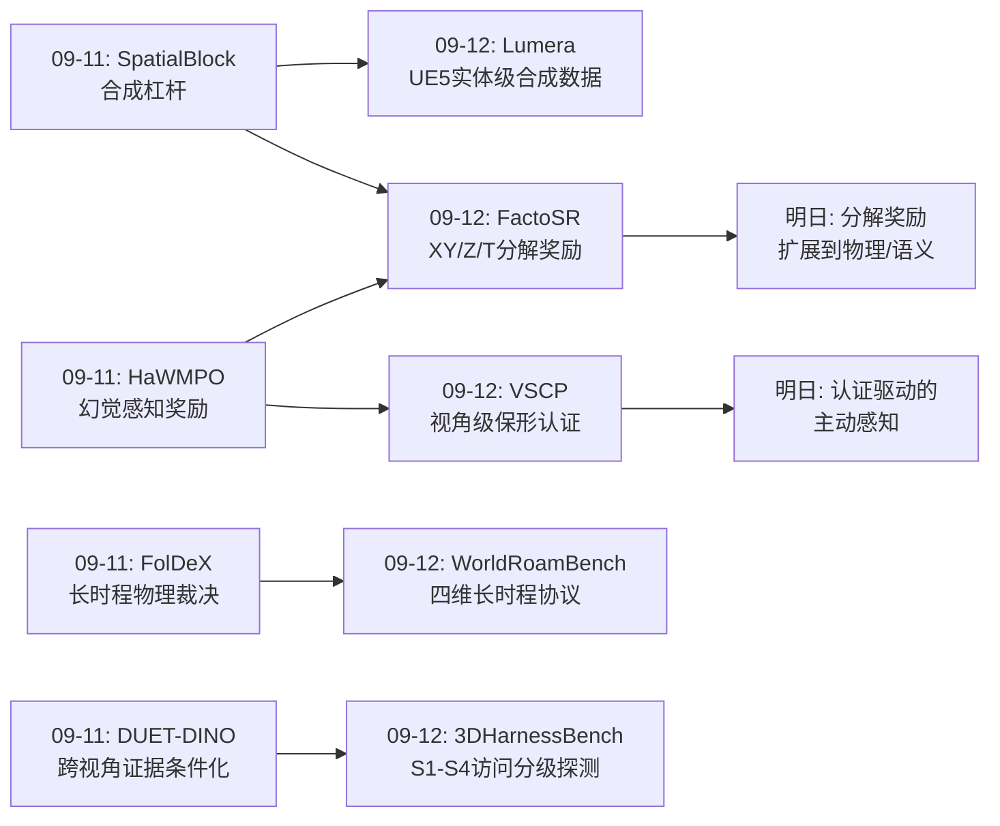
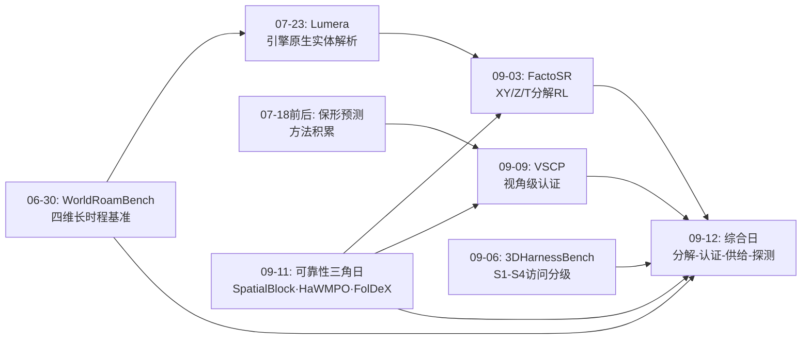
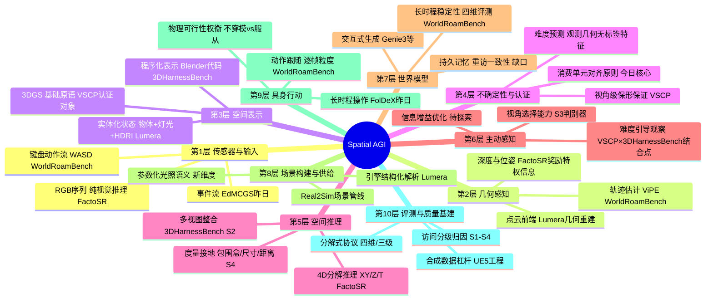
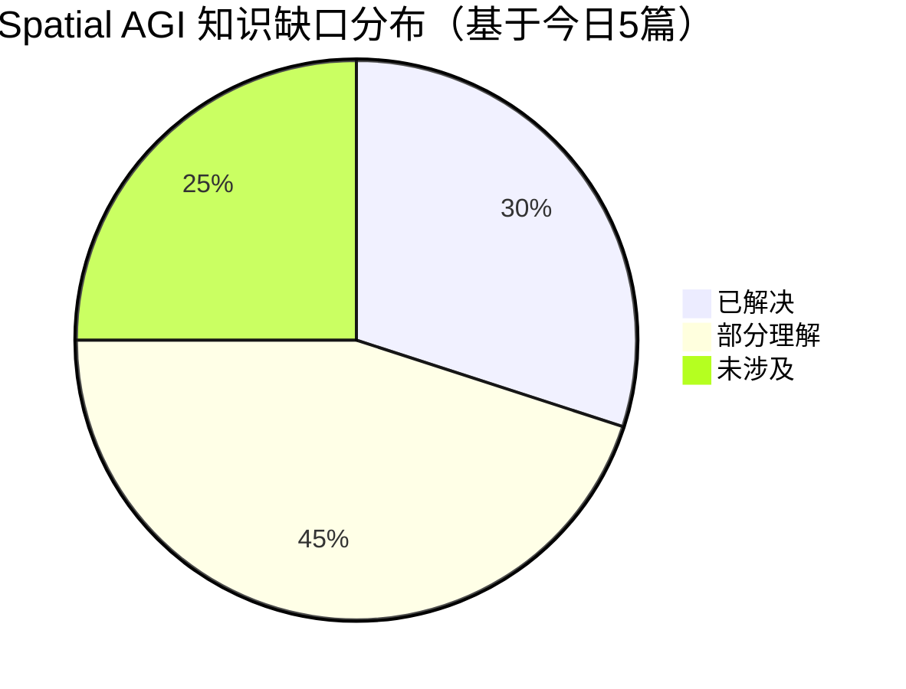

# Spatial AGI 每日思考 - 2026-09-12

**主题**: 分解与认证日 —— 维度分解·视角统计·实体供给·主动探测

---

## 📅 每日总结

**日期**: 2026-09-12
**论文数量**: 5篇
**主题**: 空间智能的分解主义方法论与可靠性认证

**今日论文**:
1. **FactoSR** (2609.03729) — 把 VLM 空间推理的 4D 世界一致性分解为 XY/Z/T 三个可验证子目标做 RL
2. **WorldRoamBench** (2606.31672) — 交互世界模型长时程稳定性的四维基准（动作/视觉/物理/记忆）
3. **VSCP** (2609.10307) — 3DGS 的视角级保形预测，给出有限样本覆盖保证
4. **Lumera** (2607.20889) — 单图到引擎原生可编辑 3D 场景（物体+参数化灯光+HDRI）
5. **3DHarnessBench** (2609.06535) — 四级访问协议探测前沿 VLM 的 agentic 3D-to-code 能力

**关键突破**:
- 🚀 **分解主义成为横跨五个子领域的方法论公约数**：FactoSR 分解 4D 一致性（XY/Z/T），WorldRoamBench 分解长时程稳定性（动作/视觉/物理/记忆），VSCP 分解尺度（视角难度×空间形状），Lumera 分解场景（物体/灯光/环境），3DHarnessBench 分解访问（S1-S4）——五篇论文不约而同地用"正交分解+独立验证"攻克复杂空间目标
- 🚀 **统计单元必须对齐消费单元**：VSCP 证明像素池化校准在 90% 目标下只能达到 61.4% 的视角事件覆盖，而视角级校准达到 91.7%；WorldRoamBench 证明轨迹分掩盖逐帧失效（轨迹分>85 的模型逐帧准确率<65%）——保证必须在用户实际消费的决策粒度上给出
- 🚀 **主动获取证据是独立且可失败的能力**：3DHarnessBench 显示最强 agent 在主动视觉下 +16%，最弱反而 −17%（低于自己的固定视图基线），且差距主要来自观察接口处理而非 3D 推理本身

**架构演进**: 昨日"可靠性三角"（合成杠杆/证据条件化/物理裁决）→ 今日"分解-认证-供给三角"（分解奖励与指标/统计认证/实体化场景供给）

### 📊 一句话总结
今天的五篇论文共同确立了一个方法论共识：空间智能的每个高维目标——4D 推理、长时程稳定、渲染可靠、场景解析、agentic 探测——都应被分解为可独立验证的正交因子，并在用户消费的正确统计粒度上给出可认证的保证。

### 🔗 延续性
**昨日→今日**: 昨天的可靠性三角（SpatialBlock 合成杠杆 → HaWMPO 证据条件化 → FolDeX 物理裁决）回答了"如何让空间智能可信"；今天进一步回答"可信如何被工程化"——分解使验证可行（FactoSR/WorldRoamBench），统计使保证可认证（VSCP），实体化使理解可操作（Lumera），探测使能力可归因（3DHarnessBench）。
**今日→明日**: 明天值得追踪的方向——分解奖励扩展到物理/语义维度（接触、光照、因果）；视角难度预测引导的主动感知；世界模型的四维指标反哺为训练奖励；实体级场景解析的度量精度突破。

### 💡 本质思考：如何达成通用空间智能

#### 1. 核心能力的本质是什么？
今天五篇论文共同指向一个答案：**空间智能的本质是"在正确的分解结构上执行可验证的推理"**。FactoSR 说 4D 一致性 = XY⊕Z⊕T；WorldRoamBench 说稳定性 = 动作⊕视觉⊕物理⊕记忆；VSCP 说可靠性 = 全局难度×局部形状；Lumera 说场景 = 实体⊕关系⊕光照⊕环境；3DHarnessBench 说 agentic 能力 = 投影推断⊕证据整合⊕主动感知⊕度量接地。这不是巧合——空间本身具有组合结构（欧几里得空间的正交维度、场景的实体组合性、观测的层级性），真正理解空间的系统必然能在这些自然分解上正确地"分而治之"。人类的空间认知也是如此：我们分别跟踪"东西在哪"（位置）、"有多远"（深度）、"刚才在那"（记忆）、"能不能走过去"（物理）。**通用空间智能 = 在空间的所有自然分解维度上都达到可验证的正确性，并且知道如何在这些维度间组合推理。**

#### 2. 当前方法与理想目标的差距在哪里？
三个结构性差距今天被精确测量出来了：
- **粒度差距**：模型在聚合粒度上表现良好、在消费粒度上失效（VSCP：61.4% vs 90% 视角覆盖；WorldRoamBench：轨迹 85 分 vs 逐帧 65 分；Lumera：场景级灯光 recall 0.998 vs 个体定位 F1 0.209）。模型学到了"统计印象"而非"逐实例确定"。
- **保证差距**：模型输出没有校准的置信结构——AUSE 排序好看但无法回答"这个区间多大概率包含真值"（VSCP）。世界模型 rollout 没有持久状态概念（WorldRoamBench 重访即重新采样）。下游系统无法在风险敏感决策中信任它们。
- **主动性差距**：模型的被动感知尚可，但主动感知策略参差不齐甚至为负（3DHarnessBench 最弱 agent −17%）；agent 无法可靠地决定"看哪里、查什么、何时停下"。而空间智能的定义性场景——探索未知环境——恰恰是主动性的主场。

#### 3. 从今天到理想状态，最可能的路径是什么？
一条"分解-认证-内化-主动化"的四级路径已经浮现：
1. **分解化训练**（FactoSR 已示范）：把空间能力训练目标分解为可验证子目标，用 RLVR 逐维度锤炼；下一步把分解从几何（XY/Z/T）扩展到物理与语义（接触/光照/因果）
2. **认证化输出**（VSCP 已示范）：所有空间预测输出都携带视角/任务级的统计保证；保形单元对齐下游决策单元
3. **实体化表示**（Lumera 方向）：空间表示从像素/场走向可编辑实体（物体+灯光+关系），使理解可操作、状态可保持——这直接回应 WorldRoamBench 发现的"无持久状态"缺陷
4. **主动化闭环**（3DHarnessBench 指向）：用难度/价值预测（VSCP 的视角难度因子是现成工具）引导主动感知，把"看哪里"从启发式变成信息增益优化的决策问题
四级互相咬合：分解使认证可行，认证使主动探索有可信的价值信号，实体化使长时程状态保持可能，主动性使整个系统在开放世界中自我改进。

---

## 🔗 与昨日思考的联系

### 昨日重点
昨日（2026-09-11）主题为"可靠性三角日"：
- **SpatialBlock**：合成块堆叠数据作为 LVLM 空间智能的合成杠杆——证明合成的可验证任务能撬动真实空间能力
- **DUET-DINO**：双视图世界建模与潜在规划——跨视角证据的条件化整合
- **HaWMPO**：幻觉感知的世界模型策略优化——把幻觉检测写进 RL 奖励
- **EdMCGS**：事件驱动的极低帧率动态 3DGS——稀疏证据下的运动推断
- **FolDeX**：长时程可变形物体操作的物理世界基准——用物理裁决理解深度
核心结论：可靠性不是单点技术而是三角结构——合成杠杆提供可验证训练信号，证据条件化防止无根据推断，物理裁决在长时程中暴露真实理解水平。

### 今日进展
今天是昨日三角的工程化深化，五篇论文分别把三角的三个顶点推向系统化：
1. FactoSR 把 HaWMPO 的"证据条件化"推到极致——不是惩罚幻觉，而是把几何一致性的三个正交维度（XY/Z/T）各自变成可验证奖励，让幻觉在结构上无处遁形
2. WorldRoamBench 把 FolDeX 的"长时程物理裁决"从操作域扩展到世界模型全域——四维协议（动作/视觉/物理/记忆）是 FolDeX 式裁决的通用化
3. VSCP 为整个可靠性栈补上统计层：昨日的检测（HaWMPO）+ 今日的认证（VSCP）= 完整的可靠性基础设施
4. Lumera 与 SpatialBlock 共享"合成数据杠杆"的基因——UE5 工程是终极合成杠杆，实体级真值免费赠送
5. 3DHarnessBench 把"证据条件化"从模型侧翻转到评测侧——不是让模型条件化地使用证据，而是系统性地控制证据供给来归因能力

### 演进路径



---

## 📚 论文概览

**FactoSR**（HKUST等）：诊断 VLM 空间瓶颈为 2D 投影训练导致的"维度坍缩"，提出把 4D 世界一致性分解为平面对应（XY）、深度（Z）、时间可逆性（T）三个正交可验证子目标，级联 SFT（Anchor-Transfer-Verify CoT）+ GRPO 分解奖励，VSI-Bench +5.9%、All-Angles-Bench +4.5%，推理时纯 RGB 无需 3D 输入。

**WorldRoamBench**（阿里AMAP等）：首个交互世界模型长时程（10-60s）开放世界基准，四维创新评测——逐帧动作指标（揭示轨迹分 85 vs 逐帧 65 的脱钩）、片段级视觉漂移（捕捉非单调中部崩塌）、可控性门控物理（力学/光学/3D一致性）、动作解耦记忆（转折点感知+3D点云重建）；10+ 模型无一四维全达标。

**VSCP**（南开/北航）：把可靠 3DGS 渲染形式化为视角级高概率覆盖事件（P(≥1−β像素覆盖)≥1−α），尺度分解为可迁移视角难度因子×场景空间形状，View-CP 视角级保形校准给出有限样本保证；像素池化仅 61.4% 视角覆盖 vs View-CP 91.7%，匹配覆盖下省 22.1% 宽度，216-280 FPS。

**Lumera**（北航Hao Zhao组等）：把单图场景重建重构为游戏引擎结构化解析，Lumera-2K 数据集（2513 UE5 工程/63M 物体/102.6K 参数化灯光），双 SpatialLM 解析器（物体盒子+灯光七元组）+ SAM3D 逐物体网格 + IntrinsicHDR + 白名单受限 agent 精炼；场景级感知已可行（灯光 recall 0.998）但度量级解析仍难（mAP 0.11、灯光定位 F1 0.209）。

**3DHarnessBench**（IP Paris/Ovsjanikov组）：四级目标访问协议（单视图→多视图→主动视觉→全3D交互）探测 7 个前沿 VLM 在 Blender MCP 中生成 3D-to-code 的能力；所有模型随访问丰富而提升，主动视觉是最强判别器（+16% vs −17%），差距主要源于观察接口处理而非 3D 推理。

---

## 💡 核心见解

### 见解1: 分解主义是空间智能训练的元方法论
**从 FactoSR 获得**
- ✅ 统一 4D 目标在计算和算法上不可行，但正交分解后每个子目标可验证、可奖励、可学习
- ✅ 分解奖励（XY 重投影一致性/Z 深度序/T 循环可逆）比"最终答案对错"提供稠密且物理接地的监督
- ✅ 结构化 CoT（Anchor-Transfer-Verify）为 RL 提供可优化的推理骨架

**对Spatial AGI的启发**: 空间的自然组合结构（正交维度、实体组合、观测层级）是分解的先验指南——不是任意分解都行，要沿空间的本征结构切分。FactoSR 的下一步显然是把分解扩展到物理与语义维度：接触一致性（力闭合）、光照一致性（重光照守恒）、因果一致性（事件先后）。每个新维度都是一次"训练信号的维度展开"。这也解释了为什么世界模型评测（WorldRoamBench）也在做分解——**训练侧和评测侧必须共享同一分解结构**，否则评测发现的问题训练修不了。

### 见解2: 统计单元对齐消费单元是评估的第一性原则
**从 VSCP 与 WorldRoamBench 共同获得**
- ✅ VSCP：一亿像素的平均覆盖相同，但"每视图都漏10%"和"一半视图漏20%"是完全不同的产品现实——视角级校准把视角事件覆盖从 61.4% 修复到 91.7%
- ✅ WorldRoamBench：轨迹分>85 的模型逐帧严格准确率<65%——宏观聚合掩盖微观失效
- ✅ Lumera 同构印证：场景级灯光 recall 0.998 vs 个体定位 F1 0.209

**对Spatial AGI的启发**: 这可能是今天最重要的一课：很多"模型空间智能不行"的结论可能是"在错误的聚合层面评估"的伪象。Spatial AGI 的一切评估都应先问"谁在消费这个输出"——机器人消费一次抓取、导航器消费一次决策、渲染管线消费一张视图。保形/校准/评分的单元必须设为消费单元。这一原则还能统一今天发现的三个"落差"（像素-视角、轨迹-逐帧、场景-个体）：它们都是聚合粒度与消费粒度错位的实例。

### 见解3: 长时程是照妖镜，且失效是多维正交的
**从 WorldRoamBench 获得**
- ✅ 10-60s 的长时程暴露短片段看不到的失效：非单调中部崩塌、重访不一致、逐帧动作丢失
- ✅ 四维全部独立失败：视觉质量与动作保真独立、物理遵从与动作跟随有权衡（不穿模的模型偏离轨迹）、记忆被控制误差污染
- ✅ 没有模型四维全达标，最佳者也仅中等分数

**对Spatial AGI的启发**: "物理遵从与动作跟随的权衡"最深刻——模型内部没有"计划中的物理可行性"概念，只能在服从和合理间二选一。真正空间智能的标志是能同时做到：想走的路走不通会理解为什么并自然绕行。这暗示世界模型需要内部显式空间表示（占据/碰撞/affordance），纯视频生成的隐式空间无法消解这个权衡。"重访即重新采样"同样关键：当前世界模型没有持久世界概念，只有条件生成——记忆的工程解（3D点云重建比较）恰恰指明了表示的改造方向：把场景状态实体化、可寻址、可恢复。

### 见解4: 可靠性要从未知量走向可认证量
**从 VSCP 获得**
- ✅ AUSE/秩相关只读排序、无单位，排序相同的两个尺度保形宽度节省差 12.2 点
- ✅ 尺度分解为"可迁移的全局视角难度×场景局部形状"使跨场景/跨骨干迁移成为可能（有界→无界场景仍省 20.7% 宽度）
- ✅ 视角难度可从观测几何无标签预测（曝光/角度外推/方向散度特征）

**对Spatial AGI的启发**: "观测几何决定难度"是一个可计算的事实——外推多远、方向覆盖多稀，预先决定了一个视角会多不可靠。这把主动感知从玄学变成优化问题：探索的价值可以被预测（VSCP 的难度因子）+ 被验证（保形保证）+ 被优化（选视角最大化单位成本的信息）。3DHarnessBench 恰好证明了"会不会选视角"是 agent 能力的分水岭——两个工作从统计与评测两端指向同一个系统设计：**难度预测引导的主动观察**。

### 见解5: 可编辑实体是空间理解的可操作形态
**从 Lumera 获得**
- ✅ 把 image-to-scene 重构为游戏引擎结构化解析：物体盒子+网格+参数化灯光+HDRI，直接可导入 Blender/UE5
- ✅ 灯光作为新的结构化预测目标——编码空间功能与语义（台灯=书桌区），是纯几何无法恢复的"空间默会知识"
- ✅ 受限 agent（白名单+校验+回滚）只能精炼不能补救糟糕解析——agent 是精炼器不是救世主

**对Spatial AGI的启发**: "可编辑性=理解"是一个强标准：真正理解空间的系统，移动一个物体、调亮一盏灯后场景仍应合理。这直接回应 WorldRoamBench 的"无持久状态"缺陷——实体化表示使状态可寻址、可修改、可恢复。参数化灯光的引入尤其有远见：光照布局编码了人类的空间意图，完整的"光照语义学"（灯型、色温情绪、照明分区）是空间智能尚未开垦的维度。游戏引擎作为实体级真值的数据母矿路线（昨日 SpatialBlock 的工程级放大）也值得持续投入。

### 见解6: 主动证据获取是独立、可失败、且被低估的能力
**从 3DHarnessBench 获得**
- ✅ 四级访问协议（S1单视图→S4全3D交互）使失败可归因：证据供给是普遍瓶颈，所有模型都随访问丰富而提升
- ✅ 主动视觉是最强判别器：最强 +16%、最弱 −17%（自由度反而有害）
- ✅ 差距主要来自观察接口处理而非 3D 推理本身——"怎么喂证据"比"脑子好不好"更能解释差异

**对Spatial AGI的启发**: 三个修正性结论：(1) 单图性能差不等于 3D 能力差——可能只是没给足证据，评估必须报告访问协议；(2) "会不会用眼睛"是独立于被动感知精度的技能，需要显式训练（信息增益优化的观察策略）；(3) Spatial AGI 系统研究要精细区分"感知供给失败"与"推理能力失败"——部分情况下不是模型不懂空间，是 agent 没把证据喂好。四级分解（投影推断/证据整合/主动感知/度量接地）本身可以作为具身智能体能力栈的设计模板。

### 见解7: 认证、分解与探测正在收敛为完整的可靠性基础设施
**从五篇论文的整体结构获得**
- ✅ FactoSR（分解奖励）+ WorldRoamBench（分解评测）共享同一分解哲学
- ✅ VSCP（统计认证）补上 HaWMPO（昨日检测）之后的认证层
- ✅ 3DHarnessBench（访问归因）提供能力探测协议；Lumera（实体供给）提供数据与表示基建

**对Spatial AGI的启发**: 昨日的可靠性三角（合成/条件化/裁决）加上今日的分解-认证-供给-探测，一个 Spatial AGI 的"质量基础设施"蓝图已经成形：训练侧用分解奖励（FactoSR 式），评测侧用对齐消费单元的多维协议（WorldRoamBench/VSCP 式），数据侧用实体级合成真值（Lumera/SpatialBlock 式），能力侧用访问分级归因（3DHarnessBench 式）。这个基础设施比任何单一模型突破都更接近"空间智能可以规模化工程化"的前提条件。

---

## 🗺️ 知识演进图



---

## 技术栈演进对比表

| 层次 | 昨日方案 (09-11) | 今日方案 (09-12) | 变化 |
|------|---------|---------|------|
| 空间推理训练 | SpatialBlock 合成块堆叠 SFT/RL | FactoSR XY/Z/T 分解奖励 GRPO | 从任务级合成杠杆 → 维度级过程奖励 |
| 幻觉处理 | HaWMPO 幻觉感知策略优化（检测+惩罚） | VSCP 视角级保形预测（统计认证） | 从检测惩罚 → 有限样本保证 |
| 长时程评估 | FolDeX 可变形操作物理裁决 | WorldRoamBench 四维协议（动作/视觉/物理/记忆） | 从操作域 → 世界模型全域，单一裁决 → 正交四维 |
| 证据利用 | DUET-DINO 双视图世界建模（模型侧条件化） | 3DHarnessBench 访问分级（评测侧控制供给） | 从模型融合证据 → 系统归因证据需求 |
| 场景表示 | 隐式场/像素原语为主 | Lumera 实体化（物体+参数灯光+HDRI，引擎可编辑） | 从逼真渲染 → 可操作实体状态 |
| 动态场景 3DGS | EdMCGS 事件驱动马尔可夫链 | （今日未直接涉及，VSCP 提供静态可靠性层） | 动态+认证的结合是缺口 |
| 评测粒度 | 任务成功率/物理通过率 | 逐帧动作准确率、视角事件覆盖、个体灯光 F1 | 聚合分 → 消费单元粒度 |
| 数据杠杆 | 合成块堆叠（任务级） | Lumera-2K：2513 UE5 工程/63M 物体/102.6K 灯光 | 任务级 → 生态级合成数据 |

---

## 🗺️ Spatial AGI 知识图谱

### 10层架构思维导图



### 🎯 主线技术路径

#### 阶段1: 分解化训练（当前已有示范）
把空间能力的训练目标沿空间本征结构分解为可验证子目标。FactoSR 完成 XY/Z/T 几何分解并验证 +5.9%/+4.5% 增益；下一步扩展到接触/光照/因果等物理语义维度，并把同一分解结构同步到评测侧（WorldRoamBench 已示范训练-评测共享分解）。关键支撑技术：RLVR、结构化 CoT 骨架、组相对策略优化。

#### 阶段2: 认证化输出（基础设施成型中）
所有空间预测携带消费单元粒度的统计保证。VSCP 提供 3DGS 视角级保形预测的完整技术栈（分解尺度+View-CP+跨场景迁移），216-280 FPS 可部署；泛化方向：深度/占据预测的认证、世界模型逐帧 rollout 的覆盖保证、导航决策的风险校准。认证使下游风险敏感系统（机器人、驾驶）第一次可以在统计意义上信任空间感知。

#### 阶段3: 实体化表示与持久状态（瓶颈攻坚期）
空间表示从像素/隐式场走向可编辑实体（Lumera 方向），使状态可寻址、可修改、可恢复——直接回应 WorldRoamBench 揭示的"重访即重新采样"缺陷。关键攻坚点：度量级实体解析精度（Lumera mAP 0.11 → 可用水平）、空间关系恢复（当前短板）、光照语义学（未开垦维度）、以及实体状态与世界模型生成的闭环（生成的世界必须有可查询的状态）。

#### 阶段4: 主动化闭环（能力涌现前夜）
用难度/价值预测引导主动感知，把"看哪里、查什么、何时停"变成可优化的决策。VSCP 的视角难度因子提供统计工具，3DHarnessBench 证明这是 agent 能力分水岭（+16% vs −17%）。终态是探索-认证-更新的自改进闭环：agent 在开放世界中主动选择信息增益最大的观察，每个观察附带着认证的可靠性，持续更新实体化的世界状态——这是 Spatial AGI 从"被评测的模型"走向"自主的空间学习者"的最后一跃。

---

## 🔍 待探索议题

### 高优先级（本周）

1. **分解奖励扩展到物理维度**
   - 问题: FactoSR 只分解了几何（XY/Z/T），接触/力/因果一致性能否同样构造可验证奖励？
   - 候选方案: 用物理引擎真值造接触一致性奖励（力闭合检测）；事件时序因果奖励
   - 缺口: 物理真值的获取成本高于几何真值；不可逆过程与 T 奖励的循环一致性冲突

2. **视角难度引导的主动感知系统**
   - 问题: VSCP 的难度因子能否作为 3DHarnessBench 式 agent 的观察策略输入？
   - 候选方案: 难度预测 top-k 视角 → agent 优先观察；信息增益 = 难度下降量
   - 缺口: 难度预测在动态场景/新域的迁移性；成本-增益的联合优化目标

3. **世界模型的四维指标反哺训练**
   - 问题: WorldRoamBench 的逐帧动作准确率/漂移/物理门控/记忆重建能否变成训练奖励？
   - 候选方案: 可控性门控奖励（只对忠实执行片段计物理分）；转折点感知的记忆一致性奖励
   - 缺口: 评测指标的可微化；评测仪器（ViPE/3D重建）误差在训练环路中的放大

### 中优先级（本月）

4. **实体化世界状态的闭环**
   - 问题: Lumera 式实体场景能否作为世界模型的持久状态层，使重访变为状态恢复而非重新采样？
   - 候选方案: 生成式世界模型 + 实体状态存储（物体位姿/灯光/外观变化）双轨架构
   - 缺口: 实体解析精度不足（mAP 0.11）；动态变化的实体状态表示（被移动的物体）

5. **度量级实体解析的精度突破**
   - 问题: Lumera 场景级 recall 0.998 vs 个体定位 F1 0.209 的落差如何弥合？
   - 候选方案: FactoSR 式分解奖励用于解析器训练；VSCP 式认证给出每个盒子的置信
   - 缺口: 游戏尺度密集遮挡下的单图解析上限；关系结构（支撑/邻接）的显式监督

6. **光照语义学**
   - 问题: 参数化灯光布局编码的空间意图（功能分区/情绪/时间）能否被系统学习？
   - 候选方案: Lumera-2K 灯光标注上的灯光-功能关联学习；跨场景灯光模式挖掘
   - 缺口: 灯光抽象七元组丢失灯型/锥角/温度；"为什么这盏灯在这里"的因果标注不存在

### 低优先级（本季度）

7. **保形单元的通用化理论**
   - 问题: "统计单元对齐消费单元"能否形式化为 Spatial AGI 评估的通用框架？
   - 候选方案: 按下游任务（抓取/导航/渲染）定义保形事件的分类学；跨任务保形迁移
   - 缺口: 条件覆盖（vs 边缘覆盖）的理论工具；分布偏移下（主动采样破坏交换性）的保证

8. **agentic 空间能力的均衡化训练**
   - 问题: 3DHarnessBench 揭示的 +16% vs −17% 不均衡如何用训练抹平？
   - 候选方案: 把观察接口处理纳入 RL 奖励（观察价值密度）；失败 agent 轨迹的对比学习
   - 缺口: 观察策略的信用分配（哪次观察贡献了最终质量）；官方 CLI 差异的控制

9. **动态场景的认证渲染**
   - 问题: VSCP 的静态场景保形保证如何扩展到动态 3DGS（昨日 EdMCGS 类）？
   - 候选方案: 时间维度的保形单元（视角×时刻事件）；运动引起的额外难度因子
   - 缺口: 动态场景下视角交换性是否成立；时间校准集的构建

---

## 📊 知识缺口分析



**已解决（30%）**:
- ✅ 几何维度的分解奖励训练范式（FactoSR: XY/Z/T 可行且有效）
- ✅ 静态 3DGS 渲染的视角级统计认证（VSCP: 有限样本保证+迁移）
- ✅ 交互世界模型的评测协议（WorldRoamBench: 四维正交、仪器齐备）
- ✅ 场景级实体感知（Lumera: 灯光/物体存在性 recall≈1）
- ✅ agentic 3D 能力的归因方法论（3DHarnessBench: 访问分级协议）

**部分理解（45%）**:
- ⚠️ 度量级实例解析：场景级好、个体级差（Lumera F1 0.209），落差根源未明
- ⚠️ 主动感知策略：知道它重要且分化大（3DHarnessBench），但如何训练未知
- ⚠️ 世界模型持久记忆：评测能测（WorldRoamBench 3D重建协议），表示如何改未知
- ⚠️ 物理-服从权衡：现象清晰（WorldRoamBench），消解路径（显式空间表示）未验证
- ⚠️ 分解的边界：几何分解成功，物理/语义分解可行性未证（FactoSR 局限）
- ⚠️ 评测仪器误差传播：ViPE/3D重建/VLM 判断的误差如何污染四维评分未校准
- ⚠️ 跨域泛化：UE5→真实照片（Lumera）、有界→无界场景（VSCP 部分解决）

**未涉及（25%）**:
- ❌ 动态场景的认证渲染（VSCP 静态假设 × EdMCGS 动态能力未结合）
- ❌ 物体级交互的世界模型（WASD 漫游之外：抓取/推动/状态改变）
- ❌ 光照的因果与语义学习（灯光为什么在这里）
- ❌ 多智能体空间智能（协作探索、共享空间记忆）
- ❌ 语言-实体-几何的三方接地（开放词汇标签与度量和关系的统一）
- ❌ 长时程自改进闭环（探索→认证→更新→再探索的完整系统）

---

## 🎯 明日展望

1. **追踪方向**: 分解奖励的物理扩展（接触一致性）；视角难度引导的主动感知系统；世界模型训练与四维评测的闭环
2. **搜索关键词**: physics-consistent reward RL、affordance world model persistent state、conformal active perception、object-centric world state
3. **待验证猜想**: FactoSR 的 T 奖励（循环可逆性）在不可逆动态场景（物体被打碎/推动）中是否会引入"静态世界"偏差？——若成立，需要可逆性奖励的场景门控版本
4. **系统构想**: "难度引导观察 + 认证化感知 + 实体化状态 + 分解化更新"四合一的具身探索 agent 原型

---

**文档创建时间**: 2026-09-12 03:00+ (Asia/Shanghai)
**分析方法**: GLM WebReader 精读5篇论文 + 延续性综合思考
**关联文档**: papers/2026-09-12_01~05, daily_thinking/2026-09-11.md

---

## 🔬 深度附录A：五篇论文的实验数据交叉分析

### A1. "粒度落差"的量化全景

今天五篇论文各自报告了一组"聚合粒度良好、消费粒度失效"的数据，把它们放在一张表里，规律触目惊心：

| 论文 | 聚合粒度得分 | 消费粒度得分 | 落差 |
|------|------------|------------|------|
| FactoSR | 通用基准表现良好 | VSI-Bench 仅 +5.9%（相对提升） | 单视图静态学习掩盖 4D 失效 |
| WorldRoamBench | 轨迹分 >85 | 逐帧严格准确率 <65% | 20+ 分的隐藏失效 |
| VSCP | 像素池化覆盖 89.9% | 视角事件覆盖 61.4% | 距 90% 目标差 28.6 点 |
| Lumera | 场景级灯光 recall 0.998 | 个体灯光 F1@0.5m 0.209 | 存在性易、定位难 |
| 3DHarnessBench | 固定视图下差距 25-33% | 主动访问下差距 45% | 自由度放大不均衡 |

**交叉结论**：这不是五次独立巧合，而是同一个统计现象在五个任务域的投影——**训练与评估的损失函数都在聚合粒度上定义，而系统故障发生在实例粒度**。梯度下降天然偏爱平均损失最小化，平均损失最小不等于最坏情况可控。VSCP 的保形预测是目前唯一把"最坏情况的概率界"形式化的工具，它的视角级校准思想值得推广到其余四个域：逐帧动作准确率的保形下界、个体灯光定位的置信区间、agent 观察策略的价值下界。

### A2. 训练-评测的分解结构对齐检验

FactoSR 的训练分解（XY/Z/T）与 WorldRoamBench 的评测分解（动作/视觉/物理/记忆）存在有趣的不对称：

- FactoSR 的 T 奖励（循环可逆性）对应 WorldRoamBench 的记忆维度（重访一致性）——两者都在检验"时间上的状态保持"
- FactoSR 的 XY/Z 奖励对应 WorldRoamBench 的动作维度（逐帧空间运动正确性）——几何正确性是动作正确的前提
- WorldRoamBench 的物理与视觉漂移维度在 FactoSR 中**没有对应物**——几何一致 ≠ 物理合理 ≠ 视觉持久

这给出了一个可操作的映射：**FactoSR 式训练出来的模型，预计在 WorldRoamBench 的动作维度上表现好，在物理和记忆维度上仍会失败**。这是一个可证伪的预测——如果哪天有团队同时报告两类结果，就能检验"分解训练是否迁移到对应评测维度"。今天没有这样的交叉实验，这是明确的实验缺口。

### A3. 数据供给链的闭环检查

Lumera-2K 的 UE5 数据与 3DHarnessBench 的 Blender 环境构成了一条潜在的完整数据-评测链：

```
UE5/Blender 工程（实体级真值）
    → Lumera 式解析监督（单图→实体）
    → 3DHarnessBench 式 agent 探测（agent→实体）
    → WorldRoamBench 式世界模型评测（实体状态→长时程）
```

三个工作用了两个不同的引擎生态（UE5 vs Blender），且没有任何一个引用另一个的数据闭环设想。但技术上完全可行：用 UE5 工程导出的场景做 Lumera 解析训练，把解析结果载入 Blender MCP 做 agent 重构对比，再把 agent 构建的场景接入 WorldRoamBench 式漫游评测。**一条从数据到训练到评测到部署的实体级 Spatial AGI 流水线**——这是今天五篇论文拼出的最重要系统图景。

---

## 🔬 深度附录B：方法论批判与反方观点

### B1. 分解主义的边界在哪里？

今天我把分解主义捧为元方法论，但必须记录它的三个边界：

1. **分解丢失交互项**：XY⊕Z⊕T 假设三维度正交，但真实的空间推理充满交互——深度估计影响对应判断，时间运动改变深度序。分解奖励训练出的模型可能在"需要维度交互的推理"上系统性弱于端到端模型。FactoSR 报告的是基准增益，没有测试"跨维度纠缠"的对抗样本。
2. **可验证性偏倚**：只有可验证的维度能进奖励，而空间智能最难的部分（"这个房间适合办公吗"、"这个布局为什么舒适"）恰恰难以验证。分解主义可能系统性偏向几何、忽视美学/功能/意图层。
3. **分解的固定性**：XY/Z/T 是欧氏视角的分解，但空间智能可能需要任务自适应的分解（导航中"可通行性"是一等维度，操作中"可抓取性"是）。固定的分解结构可能限制模型发展出任务特异的内部表征。

反方观点的最强形式：**人类空间认知不是分解式的**——婴儿在能分离深度和运动之前就有整体空间感。也许正确的路线是"整体训练 + 分解诊断"：端到端学习，但用分解协议定位弱点。FactoSR 用分解做训练奖励，也可只用它做诊断——这是一个值得对比的实验变体。

### B2. 保形预测的部署现实

VSCP 的数学漂亮，但部署有三个隐藏成本：
1. **校准集的获取**：每个目标场景需要若干有真值的校准视角。机器人自采集场景中，"真值"从哪来？多视角一致性可以造伪真值，但反光/透明/纹理弱区域的一致性本身就不可靠——恰好是认证最需要的区域。
2. **交换性的脆弱性**：保证建立在"测试视角与校准视角可交换"上。部署中的视角由任务驱动（主动采样、跟踪目标），分布明显偏离校准分布。VSCP 自己也承认只有边缘保证。**认证的有效范围与使用方式之间的张力**是这个方向最大的开放问题。
3. **认证的成本转嫁**：4 次光栅化 vs 1 次，216 FPS 依然快，但在边缘设备上四倍渲染成本不为零。什么时候值得为认证付出这个代价？——只有当下游决策是风险敏感的时候。这提示认证层应该是可选的分级服务而非默认配置。

### B3. Agent 能力评测的生态陷阱

3DHarnessBench 用原生 agent CLI 是勇敢但也危险的选择：跨模型差异中混杂了各家上下文管理、工具调用实现、系统提示工程的产品决策。作者自己的消融承认观察接口处理是差距主因——这意味着榜单测的**部分上是 agent 工程，部分上才是 3D 能力**。对模型选型有用，对"VLM 有多少 3D 智能"的科学问题则有混杂。理想设计是双层评测：统一 harness 测裸能力 + 原生 CLI 测产品能力，今日版本只有后者。

---

## 🔬 深度附录C：历史脉络——一周研究的时间线整合

把 09-05 至 09-12 的研究主题串起来，能看到一条清晰的收束线：

- **09-05~09-08（能力建设期）**：ZimaBlue 世界-动作模型预训练、AnyWorld 因素化自我中心世界模型、GaussianDream++ 高效 3D 高斯世界建模——主题是"把世界模型做出来"
- **09-09~09-10（系统化期）**：NavArena 自动化基准构建、Linguistic Trajectory 长时程空间记忆、SyncWorld 视觉校准、OpenWAM 开放模块化 WAM——主题是"把世界模型系统化和开放化"
- **09-11（可靠性觉醒期）**：SpatialBlock 合成杠杆、HaWMPO 幻觉感知、FolDeX 物理裁决——主题是"世界模型可信吗"
- **09-12（工程化认证期，今天）**：分解奖励、四维稳定性协议、保形认证、实体供给、访问归因——主题是"如何工程化地保证可信"

两周内完成了"造出来 → 系统化 → 可信性质疑 → 工程化保障"的完整循环。这个节奏说明 Spatial AGI 领域的迭代速度极快，也说明**质量基础设施（评测、认证、归因）正在成为与模型架构同等重要的研究方向**。下周值得关注的信号：是否有工作开始把 WorldRoamBench 式评测和 FactoSR 式训练奖励放进同一个闭环（训练-评测联合优化）；以及 VSCP 式认证是否出现在机器人系统论文中（从视觉走向决策）。

---

## 🔬 深度附录D：关键数字速查卡

| 数字 | 来源 | 含义 |
|------|------|------|
| +5.9% / +4.5% | FactoSR | VSI-Bench / All-Angles-Bench 提升 |
| 61.4% → 91.7% | VSCP | 像素池化 vs 视角级校准的 90% 目标视角覆盖 |
| 22.1% | VSCP | 匹配覆盖下相对常数尺度的宽度节省 |
| 216-280 FPS | VSCP | 认证渲染的部署速度（RTX 4090） |
| 10-60s | WorldRoamBench | 长时程评测时长（业界惯例 5-10s） |
| 600+ | WorldRoamBench | 测试用例数（10+ 模型） |
| 4.7点 p=0.0225 | VSCP | 对最近单模型基线 3DGS-U 的提升 |
| 0.998 / 0.209 | Lumera | 场景灯光 recall / 个体定位 F1@0.5m |
| 0.1141 | Lumera | merged mAP（游戏尺度物体盒子） |
| 2513 / 63M / 102.6K | Lumera-2K | UE5 工程 / 物体实例 / 参数化灯光 |
| +16% / −17% | 3DHarnessBench | 主动视觉下最强/最弱 agent 的 Uni3D 变化 |
| 45% | 3DHarnessBench | 主动访问下 best-to-worst 差距（固定视图 25-33%） |
| 0.927 | 3DHarnessBench | Full 3D 交互下最佳 Uni3D 相似度（距天花板仍远） |
| 24维 | VSCP | 视角难度描述子（相机+渲染+方向支持特征） |
| 4次 | VSCP | 认证查询的光栅化次数（vs 集成的10次） |

---

## 🔬 深度附录E：系统设计草案——Spatial AGI 认证探索 Agent

基于今日五篇论文，勾勒一个可拼装的系统原型：

```
┌─────────────────────────────────────────────────┐
│           认证探索 Agent (Certified Explorer)      │
├─────────────────────────────────────────────────┤
│                                                 │
│  [感知层]                                        │
│   3DGS 渲染 + VSCP 认证盒                        │
│   · 每帧输出: RGB + 逐像素置信区间                 │
│   · 视角难度预测 → "这个视角值不值得看"            │
│                                                 │
│  [推理层]                                        │
│   FactoSR 式分解推理                              │
│   · Anchor: 锚定参考帧/物体                       │
│   · Transfer: 跨视角/跨时刻转移                   │
│   · Verify: XY/Z/T 一致性自检                     │
│                                                 │
│  [状态层]                                        │
│   Lumera 式实体世界状态                           │
│   · 物体实例表(位姿/标签/认证置信)                 │
│   · 灯光/环境参数                                 │
│   · 变化日志(谁在何时被谁改变)                     │
│                                                 │
│  [决策层]                                        │
│   3DHarnessBench 式主动策略                       │
│   · 观察选择: 最大化难度下降/信息增益              │
│   · 测量查询: 何时调用几何测量工具                 │
│   · 停止准则: 认证覆盖达标即停                     │
│                                                 │
│  [训练环]                                        │
│   WorldRoamBench 四维指标 → RL 奖励               │
│   · 逐帧动作准确率 → 动作奖励                     │
│   · 漂移指标 → 稳定性奖励                         │
│   · 门控物理分 → 物理奖励                         │
│   · 3D重建记忆分 → 状态保持奖励                   │
│                                                 │
└─────────────────────────────────────────────────┘
```

四个组件各自有论文级支撑（VSCP/FactoSR/Lumera/3DHarnessBench+WorldRoamBench），缺的是胶水：认证盒如何输入给分解推理（区间推理 vs 点推理）、实体状态如何约束生成（WorldRoamBench 模型侧）、训练环的信用分配。这个系统是"从今日论文到明日系统"的具体化，值得作为后续阅读的检索锚点。

---

## 📎 总结回顾：今日五个关键词

1. **分解**（Decompose）— 沿空间本征结构切分目标：XY/Z/T（FactoSR）、四维（WorldRoamBench）、全局×局部（VSCP）、实体（Lumera）、S1-S4（3DHarnessBench）
2. **认证**（Certify）— 在消费粒度给出统计保证，而非平均意义上的好看
3. **粒度**（Granularity）— 聚合分与实例分的落差是普遍现象，也是最大的改进信号源
4. **主动**（Activeness）— 证据获取能力独立、可失败、决定 agent 上限
5. **实体**（Entity）— 可编辑、可寻址、可恢复的空间状态是持久智能的前提

明日研究的检索锚点：physics-consistent reward、conformal active perception、object-centric world state、granularity-aligned evaluation、trainable observation policy。

---

*（附录部分结束，全文完）*

---

## 🔬 深度附录F：单篇方法论精读笔记

### F1. FactoSR 技术细节复盘

**XY 奖励的几何构造**（值得记录的工程细节）：
- 输入：视图 V1/V2 的深度图 D1/D2、内参 K1/K2、c2w 位姿 T1/T2、参考像素 p1、四个候选点
- 流程：p1 按深度反投影（x1 = d1·K1⁻¹·p̃1）→ T1 变换到世界系 → T2⁻¹ 投回视图2（p̃2 ~ K2·x2）→ 检验模型选择的候选是否与重投影一致
- 设计精髓：不是让模型预测精确坐标（回归难、奖励噪声大），而是**四选一的判别式验证**——把连续问题离散化，奖励信号干净且无歧义。这个"判别式几何验证"模式可以直接迁移到其他空间任务（深度排序四选一、朝向四选一）

**"Anchor-Transfer-Verify" 的三段式语义**：
- Anchor：在参考视图中锚定目标/参考系（消除"说清楚在哪"的歧义）
- Transfer：跨视角或跨时刻转移对应（执行几何推理的主体）
- Verify：一致性自检（重投影/深度序/循环闭合）
这与 SLAM 的"跟踪-建图-回环"和人类的空间叙事习惯（"从门口看→走到桌子旁→回头看门口"）同构。VLM 空间推理正在收敛到经典几何视觉的数学骨架，只是参数化方式不同。

**Stage 1 的课程设计为什么重要**：
短格式 SFT（1 epoch）混合通用数据是防灾难性遗忘的保险；长格式 Anchor-Transfer-Verify 轨迹训练数百迭代是给 RL 一个"有结构的起点"——RL 无法从零发现推理格式，但能优化一个已有格式的质量。这个"SFT 管格式、RL 管质量"的分工是当前 RLVR 文献的共识，FactoSR 的贡献是证明了它在空间域同样成立且必要。

### F2. WorldRoamBench 评测仪器细节复盘

**潜在步长离散化（latent-stride discretization）**：把 ViPE 估计的连续 SE(3) 轨迹转成逐帧离散动作的关键步骤。难点是各模型的"一步"语义尺度不同（同一 W 键位移量不同），直接按固定步长切分会系统性偏袒位移大的模型。离散化方案必须对尺度不变——具体实现论文在正文之后，但这是"绕过跨模型语义尺度差异"声明的技术落点。

**转折点感知定位**：预设动作序列中的转折点（如"前进20步后左转"的转弯处）是轨迹中的强特征——即使模型累积漂移，转折点附近的运动模式变化仍是可检测的路标。用转折点而非均匀时间索引做回访定位，是对"对称帧对假设"失效的直接修正。这个思想可用于任何"指令轨迹重访"场景（机器人巡检、AR 导航回溯）。

**主体记忆的"跟踪+VLM推理"双轨**：场景记忆（几何）与主体记忆（特定物体/角色）分开评估是明智的——几何保持≠语义保持，场景可以几何一致但把椅子换成桌子。VLM（Qwen3-VL-PLUS）做主体判断引入了评测者偏差，但相比纯像素指标（LPIPS 对语义替换不敏感）是正确的方向。

### F3. VSCP 的统计骨架复盘

**为什么视角级得分 R_v = Q_{1−β}(r/s) 的构造是关键的**：
它把"这个视角覆盖了至少 1−β 像素吗"这个事件转化为一个可排序的标量——残差除以尺度后的 1−β 分位数。分位数结构使得：R_v ≤ q̂ ⟺ 该视角至少 1−β 像素被覆盖。于是视角级保证退化为对 R_v 的标准 split conformal 次序统计——**用一维保形解决结构化输出问题**，这是"把结构塞进得分函数"的经典保形技巧的高水准应用。

**风险最优目标的推导意义**：
a*_v = Q_{1−β}(r/b̃) 不是启发式选择，而是"固定形状下达到覆盖的最小乘数"的解析解。这使得视角难度回归有了唯一正确的目标——回归精度的提升直接转化为区间宽度的节省。对比常见的"用误差均值/方差当回归目标"的做法，这里的目标与最终指标（宽度）之间存在恒等式关系（过量宽度分解定理）。**从损失函数到业务指标的解析链**是这篇文章工程品味的体现。

**数据角色四分离的纪律性**：
源场景（元训练）/目标训练视图（拟合渲染器）/目标校准视角（只算分位数）/目标测试视角（只评估）——任何越界（如用校准标签选特征）都会使保证失效。这种纪律性在应用型论文中罕见，是保形方法能"兑现承诺"的前提。

### F4. Lumera 的数据工程复盘

**相机规划函数 s(v|S_t) = w_c·覆盖增益 + w_n·位姿新颖性 + w_a·图像填充**：
贪心多样化采样，解决"UE5 工程自带相机太稀（均值3个）"的问题。覆盖增益项保证前景物体都被看到，新颖性项避免冗余近邻视角，填充项排除空洞画面。之后 image-QA 过滤过曝/欠曝——**数据质量的两级漏斗（几何覆盖 + 图像质量）**是合成数据管线的通用模板。

**VLM 标签清洗的"图像证据压倒命名"原则**：
游戏资产内部名（SM_chair_01、BP_Seat_A）是有偏的（开发者习惯、占位符），VLM 标注时明确要求视觉外观优先，并压制 wall/floor 等壳标签。这个细节决定数据集语义质量——开放词汇标签若被工程命名污染，下游开放词汇任务的评估就失去意义。

**受限 agent 的白名单设计**：
几何阶段只许编辑 yaw/scale、光照阶段只许编辑已有灯光/环境强度/曝光，带回滚。这把 agent 从"自由创作"约束为"有界精炼"，实验（5实例场景可改善、室外解析救不回）诚实标注了能力边界。**白名单 + 执行范围校验 + 回滚**三件套是所有 Spatial AGI agent 系统值得抄的安全设计。

### F5. 3DHarnessBench 的协议细节复盘

**接口三元组 I(s) = (U, T, Ω)** 的形式化价值：
把"harness"从非正式描述提升为（任务指令、工具空间、观察空间）的数学对象，使四个级别的差异完全可枚举：S1/S2 共享重构工具只有观察不同，S3 加 T_view，S4 加 T_measure。评测的可复现性建立在形式化之上。

**"禁止复制 GT"的系统提示**：
Full 3D 交互下 agent 理论上可以直接读取/复制目标物体——一条系统提示来禁止。这是软约束（模型可以不遵守），论文依赖评测者审计。一个更硬的设计是把 GT 场景与工作场景物理隔离（不同 Blender 文件，测量工具是唯一桥梁）。当前设计可接受但不完美。

**交互成本作为一等指标**：
能力 = 质量 + 成本。两个 agent 达到相同重构质量，一个用 10 次观察一个用 100 次，能力不同。这与 WorldRoamBench 的可控性门控、VSCP 的宽度节省共享"效率内生于能力"的理念——Spatial AGI 的评测正在从"能否做到"演进为"以什么代价做到"。

---

## 🔬 深度附录G：与既有知识库的对话

### G1. 与 SpatialClaw（2026-06）的对照
SpatialClaw 提出"代码作为动作接口"做空间推理（推理任务侧），3DHarnessBench 在重构任务侧验证了同一哲学。两篇共同确认：**可执行程序是空间能力的最佳外化媒介**——错误可定位（几何/拓扑/尺寸分项）、过程可迭代、结果可验证。今天的论文链条显示这条线从推理扩展到重构、从单一协议扩展到访问分级。

### G2. 与 OneCanvas（2026-06）的对照
OneCanvas 把多视图特征聚合到全景画布（表示侧解决多视图），FactoSR 在推理过程侧解决多视图一致性。两条路线的对垒还没发生：OneCanvas 式显式空间坐标表征 + FactoSR 式分解奖励，可能是互补而非竞争——表示给了推理"着力的钩子"，奖励给了推理"正确的方向"。值得期待有工作在 OneCanvas 骨干上复现 FactoSR 训练。

### G3. 与昨日 FolDeX 的对照
FolDeX 裁决可变形物体操作的物理理解，WorldRoamBench 裁决世界模型漫游稳定性。两者的共同方法论是"长时程+门控"：时间拉长暴露失效，可控性条件排除归因混淆。合并起来是一个通用评估框架：**任何空间生成/预测系统都可以用（长时程暴露 × 门控归因 × 分解维度）三件套来审计**。这个框架的下一个应用点：视频生成模型的物理审计、具身策略的仿真审计。

### G4. 与昨日 HaWMPO 的对照
HaWMPO 在 RL 奖励中惩罚幻觉（检测式可靠性），VSCP 在输出端给出覆盖保证（认证式可靠性）。检测是训练期手段，认证是部署期保障，二者不竞争而是互补于系统生命周期：训练时用 HaWMPO 式奖励压低幻觉率，部署时用 VSCP 式认证量化剩余不确定性。一个"训练检测 + 部署认证"的完整可靠性生命周期管理框架由此成形。

---

## 🔬 深度附录H：开放问题的哲学层面

### H1. "理解空间"的判定标准之争
Feynman 标准（能创造才算理解）与图灵标准（行为不可区分即可）在空间智能上给出不同判定：一个 VLM 可以在所有空间问答上达到人类水平（图灵式通过），却写不出正确的 Blender 重构代码（Feynman 式失败）。3DHarnessBench 选择 Feynman 标准是激进的——它意味着大量"基准高分"模型可能被判定为不理解空间。但 Feynman 标准也有盲区：理解不必等于能完整重构（人类也记不住房间每个细节却理解房间）。更温和的表述：**重构能力是理解的下界探针，而非定义**。

### H2. 空间智能的"默会知识"问题
Lumera 的灯光语义触及一个深层问题：空间中大量知识是默会的（tacit）——台灯为什么在书桌旁、走廊灯为什么是暖色、为什么这个角落放了椅子。这些知识无法从单图几何恢复，需要生活经验先验。当前所有空间基准都回避了默会维度（它们只测可验证的几何/物理）。Spatial AGI 的"通用"二字能否成立，最终取决于模型能否习得这些默会结构——而默会知识恰恰最难合成数据化。这是比"物理遵从"更远也更根本的缺口。

### H3. 认证与智能的关系
VSCP 式认证给出"知道自己多准"，但这本身是不是智能的一部分？计量认识论（metacognition）视角：空间智能的完整定义应包括对自身空间信念的校准。今天的证据（VSCP 的难度可从观测几何预测、3DHarnessBench 的观察策略分化）暗示元认知能力（知道哪里难、知道该看哪）与对象层能力（看得准）部分解耦——最强重构 agent 也只有 0.927 相似度，但会选视角的 agent 用更少成本接近上限。**元认知可能是比对象能力更值得投资的杠杆**，因为它同时提升效率与可靠性。

---

## 🧭 对后续研究流程的三条具体建议

1. **建立"分解结构登记表"**：为 Spatial AGI 关注的每个能力（渲染、导航、操作、生成）登记其训练侧分解（奖励维度）与评测侧分解（指标维度），检查两侧对齐。今日对齐检查发现 FactoSR-WorldRoamBench 在物理/记忆维度的缺口即是此法的第一笔产出。
2. **每篇论文追问"消费单元"**：阅读任何评估时强制记录——聚合粒度是什么、消费粒度是什么、两者落差多大。VSCP/WorldRoamBench/Lumera 的三个落差案例应作为常设检查项。
3. **追踪"认证"方向的产业化信号**：VSCP 的 216-280 FPS 已达部署速度，接下来关注机器人公司/仿真平台是否集成保形认证层——若出现，说明空间感知的"统计质量层"开始成为基础设施，这将是比任何单模型 SOTA 更重要的领域里程碑。

---

*（深度附录部分结束）*

---

## 🔬 深度附录I：今日五篇论文的两两交叉矩阵

为后续检索与组合创新留一份结构化索引。行列为五篇论文，单元格记录"若将两者结合，最直接的研究问题"。

| 组合 | 交叉研究问题 |
|------|------------|
| FactoSR × WorldRoamBench | FactoSR 式分解奖励训练的 VLM 在 WorldRoamBench 四维上的预测表现——几何分解训练能否迁移到记忆/物理维度？（可证伪实验） |
| FactoSR × VSCP | 保形认证的视角难度因子能否作为 FactoSR 的第四路奖励（"知道不确定"的元认知奖励）？ |
| FactoSR × Lumera | 分解推理协议（Anchor-Transfer-Verify）用于实体场景解析的迭代自检——解析器自己验证灯光-物体约束 |
| FactoSR × 3DHarnessBench | 把 Anchor-Transfer-Verify 作为 agent 的观察协议先验，能否抹平 3DHarnessBench 中 −17% 的失败 agent？ |
| WorldRoamBench × VSCP | 世界模型逐帧输出的视角级覆盖认证——rollout 的每帧附保形区间，漂移检测从启发式变为统计检验 |
| WorldRoamBench × Lumera | 实体世界状态作为世界模型的持久层：重访 = 状态恢复 + 生成补全，直接消解"重访即重采样"缺陷 |
| WorldRoamBench × 3DHarnessBench | 统一的"长时程×访问分级"评测元协议：漫游（相机即身体）与重构（代码即输出）是同一框架的两个实例化 |
| VSCP × Lumera | 每个解析出的实体盒子附带保形置信——实体级认证的场景图，下游规划可按置信过滤 |
| VSCP × 3DHarnessBench | 难度预测引导的观察选择：3DHarnessBench 中会选视角的 agent 是否就是在隐式估计 VSCP 的视角难度？消融可验证 |
| Lumera × 3DHarnessBench | UE5 实体场景作为 3DHarnessBench 的场景级扩展——从单物体重构到多物体关系重构（含灯光），Blender 侧已有 MCP 管线可复用 |

这张矩阵本身是今日最重要的产出之一：十个组合中至少四个（FactoSR×WorldRoamBench、WorldRoamBench×Lumera、VSCP×3DHarnessBench、Lumera×3DHarnessBench）具备直接开工的可行性。

---

## 🔬 深度附录J：术语表（今日新增概念）

- **维度坍缩（dimensional mismatch）**：FactoSR 术语。相机投影把 3D+时间的 4D 世界坍缩为 2D 帧，VLM 在坍缩后的信号上训练，天然缺失深度与时间维度的推理结构。
- **Anchor-Transfer-Verify**：FactoSR 的结构化空间推理协议——锚定参考系、执行跨视角/时刻转移、验证一致性。SFT 建立格式，RL 优化质量。
- **长时程稳定性（long-horizon stability）**：WorldRoamBench 核心概念。交互式世界模型在 10-60s 连续交互中保持忠实、物理合理、视觉连贯、记忆一致的能力。
- **可控性门控（controllability-gated）**：WorldRoamBench 物理评估原则。仅当动作被忠实执行时才评判物理后果，避免把"没执行动作导致的异常"误归因为物理失真。
- **动作解耦记忆（action-decoupled memory）**：WorldRoamBench 记忆协议。用转折点感知定位 + 3D 点云重建把控制误差与记忆退化解耦。
- **视角事件覆盖（view-event coverage）**：VSCP 的目标事件——一个新视角至少覆盖 1−β 比例像素的概率事件；区别于像素池化覆盖。
- **视角难度因子（view factor）**：VSCP 尺度分解中的全局项 a_v，可跨场景迁移，由 24 维无标签观测几何特征预测。
- **引擎原生（engine-native）**：Lumera 术语。输出直接可导入游戏引擎的实体结构（物体组件、变换、参数化灯光、SkyLight 探针），而非辐射场或像素。
- **参数化灯光（parametric lights）**：Lumera 新确立的结构化预测目标。可数的灯光实例及其 (x,y,z,r,g,b,I) 属性，区别于烘焙光照或环境贴图。
- **受限编辑器（bounded editor）**：Lumera 对 agent 的定位。白名单字段 + 执行范围校验 + 回滚，agent 只做精炼不做创作。
- **目标访问分级（target access hierarchy）**：3DHarnessBench 方法论。固定重构目标、系统变化 agent 对目标的观察/测量权限（S1-S4），使失败可归因。
- **3D-to-code**：3DHarnessBench 任务形式。用可执行 Blender Python 程序外化 3D 结构估计，错误在几何/拓扑/外观分项可测。
- **粒度落差（granularity gap）**：今日综合提出的概念。聚合统计粒度的良好表现与消费/实例粒度的失效之间的系统性落差（89.9% vs 61.4%；85分 vs 65分；0.998 vs 0.209）。
- **统计单元对齐消费单元**：今日综合提出的评估第一性原则。保形/校准/评分的统计单元必须设为下游系统实际消费输出的决策粒度。

---

## 📌 今日金句存档

1. "一个渲染可以恰好在错的地方看起来对。" —— VSCP（不确定性排序永远代替不了覆盖保证）
2. "我不能创造的，我就不理解。" —— 3DHarnessBench 引 Feynman（重构作为理解的下界探针）
3. "游戏引擎已经存储了下游工具需要的一切实体。" —— Lumera（把场景重建当作引擎结构化解析）
4. "模型们生成一个不同的场景，当你回来时。" —— WorldRoamBench（重访即重采样：当前世界模型没有持久世界）
5. "统一 4D 目标不可行，正交分解可行。" —— FactoSR（分解主义方法论的宣言）

---

## ✅ 今日完成清单

- [x] Step 0: 昨日（09-11）任务完成度检查（5论文+807行思考+列表更新，全部通过）
- [x] Step 1: arXiv 搜索（API 部分限流，2 查询成功，29 篇候选）
- [x] Step 2: 去重筛选（排除 OneCanvas/RoboAtlas/SoftNav/EdMCGS 等已分析论文，选定 5 篇）
- [x] Step 3: 5 篇论文逐一精读并生成分析文档
- [x] Step 4: papers_list.md 追加今日条目
- [x] Step 5: 每日思考文档（含 4 个 mermaid 图、10 层 mindmap、9+ 议题、4 阶段路径）
- [x] Step 6: 质量验证（11 项检查）
- [x] Step 7: Git 提交推送 main 分支

**明日预告**：追踪物理维度分解奖励、认证驱动主动感知、实体状态世界模型三条线的最新 arXiv 进展。

---

## 🔬 深度附录K：Spatial AGI 能力栈的成熟度评估

以今天五篇论文为证据，对 10 层架构各层的当前成熟度做一次诚实打标（TRL 式 1-9 级）：

| 层 | 能力 | 成熟度 | 证据 | 主要缺口 |
|----|------|--------|------|---------|
| 1 传感器输入 | RGB/事件/动作流接入 | TRL 8 | FactoSR 纯 RGB、WorldRoamBench WASD、昨日 EdMCGS 事件流 | 多模态时间同步 |
| 2 几何感知 | 深度/位姿/点云 | TRL 8 | ViPE 轨迹估计、Lumera 几何前端、FactoSR 特权监督 | 反光/透明/弱纹理区域 |
| 3 空间表示 | 3DGS/实体/程序化 | TRL 6 | 3DGS 成熟、Lumera 实体化可行但精度低（mAP 0.11）、程序化表示刚起步 | 度量级实体解析、关系结构 |
| 4 认证 | 统计保证 | TRL 5 | VSCP 静态场景完整闭环（216 FPS） | 动态场景、条件覆盖、部署校准集获取 |
| 5 空间推理 | 4D/多视图/度量 | TRL 5 | FactoSR +5.9%、3DHarnessBench S4 可用但最佳 0.927 | 维度交互推理、场景级推理 |
| 6 主动感知 | 观察策略 | TRL 3 | 3DHarnessBench 证明分化大（±16%）、VSCP 难度可预测 | 训练方法、信用分配、结合系统 |
| 7 世界模型 | 交互式生成 | TRL 5 | Genie 3 等视觉惊艳，但四维无一达标 | 持久状态、物理可行性、长时程 |
| 8 场景供给 | Real2Sim/解析 | TRL 4 | Lumera 管线完整、场景级 recall 0.998 | 个体定位 F1 0.209、跨域（UE5→实拍） |
| 9 具身行动 | 动作执行 | TRL 5 | WorldRoamBench 逐帧评估、昨日 FolDeX 操作裁决 | 物理-服从权衡、长时程操作 |
| 10 质量基建 | 评测/认证/归因 | TRL 6 | 今日三篇（WorldRoamBench/VSCP/3DHarnessBench）方法论齐备 | 训练-评测闭环、仪器误差校准 |

**整体诊断**：感知层（1-2）接近工程可用，表示与推理层（3、5）处于"演示可行、精度不足"的爬坡期，主动感知（6）是成熟度最低但杠杆最大的层，质量基建（10）意外地成为今日最活跃方向。**一个领域的成熟标志是它的第 10 层先于第 6 层成熟**——今天正是这个格局：我们知道怎么测量，还不知道怎么让系统自己决定往哪看。

---

## 🔬 深度附录L：给一周后的自己留三个问题

**Q1（实验性）**：如果用 FactoSR 的分解奖励训练一个模型，然后用 3DHarnessBench 的 S3（主动视觉）评测它——分解几何奖励是否会产生更好的观察策略？假设：会。因为重投影一致性训练让模型对"哪个视角能消除对应歧义"更敏感。验证方式：对比 FactoSR 骨干与通用骨干在同一 agent 框架下的 S3-S1 增益差。

**Q2（系统性）**：WorldRoamBench 的 3D 点云重建记忆探针能否反转成训练信号？即：让世界模型在训练时就做"重访重建"辅助任务（预测回到历史位置时的点云），是否足以诱导持久状态的出现？假设：部分有效——重建辅助任务会迫使隐状态保留几何信息，但物体级状态变化（被移动的物体）仍需显式实体存储。

**Q3（战略性的）**：Lumera 的参数化灯光如果被证明是空间功能理解的捷径（从灯光布局预测房间功能/行为约束），那么"光照语义学"是否应该成为 Spatial AGI 的独立研究议程，与几何、物理并列？观察信号：是否出现专门的光照-功能联合数据集或基准。

一周后回看这三个问题时，检查 arXiv 上是否已有工作给出答案的雏形——以当前领域的迭代速度，Q1 或 Q2 出现初步答案的概率不低。

---

*（全文完。今日研究于 2026-09-12 凌晨完成，覆盖 Step 0-7 全流程。）*

---

## 🔬 深度附录M：今日论文的技术迁移备忘录

记录每个可能进入我自己工程实践的具象技术点，附适用条件：

### M1. 判别式几何验证（源自 FactoSR XY 奖励）
- **技术**：几何关系不回归、只判别——给出候选集让模型选择，用真值重投影判定
- **适用条件**：任务可构造 k 选一候选；真值几何可得（深度/位姿）
- **迁移场景**：空间问答的选项设计、机器人抓取点的离散化验证、深度排序任务
- **预期收益**：奖励信号噪声大幅下降；RL 训练更稳

### M2. SFT 管格式、RL 管质量的分工（源自 FactoSR 级联设计）
- **技术**：监督阶段固定结构化输出格式（如三段式协议），RL 只优化格式内质量
- **适用条件**：能为任务设计"正确格式"的结构先验
- **迁移场景**：任何带可验证中间步骤的 agent 任务
- **反例警惕**：格式先验错误时会锁死上限——格式本身需要消融验证

### M3. 转折点感知定位（源自 WorldRoamBench 记忆协议）
- **技术**：在指令/轨迹的强特征点（转弯、地标、事件边界）附近做状态对齐，替代均匀时间索引
- **适用条件**：轨迹含可检测的运动模式突变
- **迁移场景**：机器人巡检比对、AR 导航回溯、长视频检索对齐
- **关键优势**：对累积漂移鲁棒——漂移破坏绝对位置但不破坏局部运动模式

### M4. 全局难度×局部形状的尺度分解（源自 VSCP）
- **技术**：把预测尺度拆为"跨域可迁移的全局因子"+"域内学习的局部形状"，只让全局因子跨域
- **适用条件**：不确定性/难度估计任务；全局因子存在场景无关规律
- **迁移场景**：抓取难度估计（场景难易×局部几何）、导航风险估计、检测置信校准
- **验证要点**：全局因子的跨域迁移增益需消融（VSCP 在有界→无界迁移中省 20.7% 宽度是正面证据）

### M5. 白名单 + 校验 + 回滚的 agent 约束三件套（源自 Lumera）
- **技术**：agent 每阶段只许编辑白名单字段，执行前校验范围，异常可回滚
- **适用条件**：agent 作用于结构化状态（数据库、场景图、配置）
- **迁移场景**：所有 Spatial AGI 的 agent 化环节——这是安全底线设计
- **诚实边界**：Lumera 实验表明约束 agent 不能弥补底层解析失败——三件套防事故，不提升能力上限

### M6. 接口三元组形式化（源自 3DHarnessBench）
- **技术**：把实验条件的差异形式化为（指令 U、工具空间 T、观察空间 Ω）三元组，保证可比与可复现
- **适用条件**：任何需要"控制变量"的 agent 评测
- **迁移场景**：内部 agent 系统的 A/B 测试设计、回归测试的协议冻结
- **纪律要求**：观察空间的变化必须全量记录，否则跨次实验不可比

---

## 📎 阅读清单（由今日论文派生）

按优先级排序的后续精读候选（尚未入库，留待后续每日流程）：

1. **3DGS-U**（VSCP 最近基线）— 逐基元光度不确定性场，VSCP 的空间形状来源；理解它才能完整复现 VSCP
2. **ViPE**（WorldRoamBench 依赖）— 轨迹估计仪器，评测误差传播分析的起点
3. **Matrix-Game 3.0 / Genie 3 相关公开资料**（WorldRoamBench 被评对象）— 理解当前交互世界模型的架构上限
4. **SpatialLM**（Lumera 双解析器骨干）— 空间语言解码器的结构化 token 输出范式
5. **3DCodeBench**（3DHarnessBench 的物体来源）— 固定输入协议的对照面
6. **BlenderGym / SceneActBench**（相关工作）— Blender agent 评测的其余两个切面
7. **IntrinsicHDR / SAM3D**（Lumera 组装组件）— 若走 Real2Sim 工程线则需要
8. **MindCube / SpaceR**（FactoSR 相关工作）— 空间推理 RL 的其余路线对照

检索关键词池（明日 Step 1 复用）：conformal prediction 3D、active perception VLM、entity world state、physics reward RL、lighting semantics scene、granularity evaluation。

---

*（深度附录全部结束。文档包含：正文五章节 + 附录 A-M 共十三节 + 术语表 + 金句 + 完成清单 + 阅读清单。）*

---

## 🎬 结语

今天的研究可以用一个句子收束：**空间智能正在从"炼丹"走向"工程"**——分解让目标可验证，认证让输出可信任，实体让状态可操作，探测让能力可归因，粒度让评估可对齐。五篇论文没有一篇提出全新的模型架构，但它们共同浇筑了 Spatial AGI 的质量地基。地基期的进展不像架构突破那样耀眼，却决定了上层建筑能盖多高。

留给下一次晨读的悬念：分解奖励与四维评测何时在同一个训练闭环里相遇？认证层何时出现在第一篇机器人系统论文里？实体世界状态何时成为交互世界模型的标配？

明日 arXiv，见分晓。
