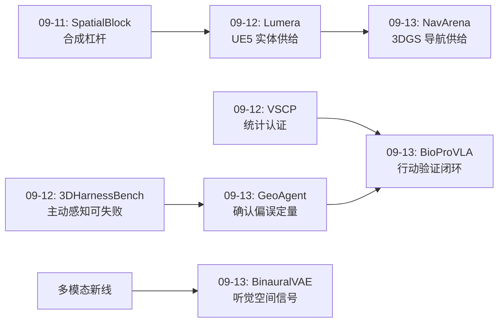
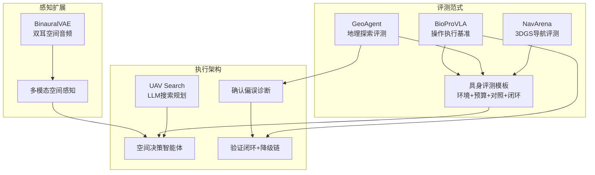
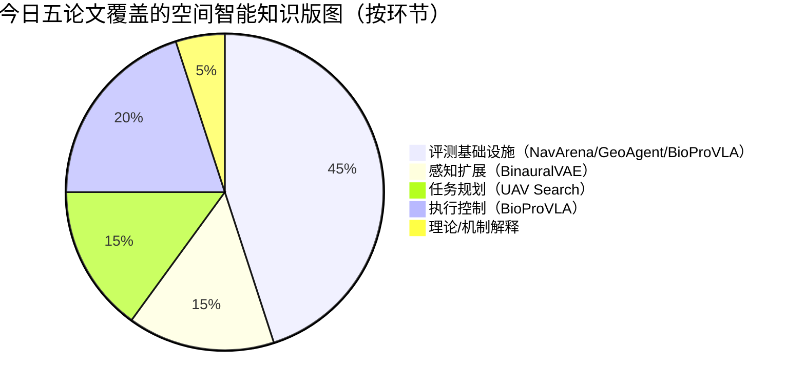
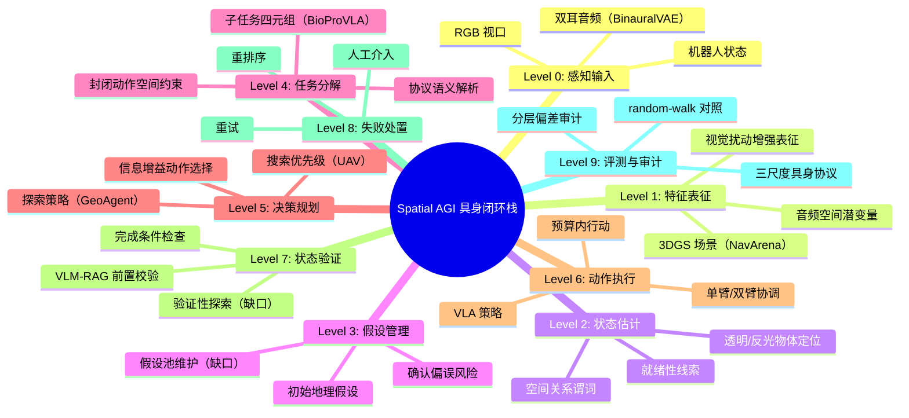

# Spatial AGI 每日思考 - 2026-09-13

**主题**: 具身化与闭环日 —— 导航评测·听觉空间·空中搜索·地理探索·实验执行

---

## 📅 每日总结

**日期**: 2026-09-13
**论文数量**: 5篇
**主题**: 空间智能从静态感知走向具身闭环——评测、感知、搜索、推理、执行五个环节的具身化改造

**今日论文**:
1. **NavArena** (2609.04602) — 用 3DGS 资产自动化构建目标导向导航基准，多协议成功判据
2. **BinauralVAE** (2609.06837) — 双耳空间音频重建作为世界模型的空间信号源
3. **UAV Search** (2608.28270) — LLM 空间语义推理驱动无人机高效搜索作业
4. **GeoAgent** (2608.29483) — Street View 具身导航评测 VLM 地理定位，暴露确认偏误与地理偏差
5. **BioProVLA-Agent** (2605.07306) — 协议驱动的湿实验室 VLA 多智能体闭环系统

**关键突破**:
- 🚀 **具身化成为空间智能评测的公约数**：NavArena（米级导航执行）、GeoAgent（千米级地理推理）、BioProVLA（厘米级操作执行）从三个尺度共同确立"可行动环境 + 动作预算 + 闭环判据"的评测范式——静态输入的时代正在结束
- 🚀 **确认偏误被定量钉死**：GeoAgent 的 logistic 回归（β=-0.43, p<0.001）证明 VLM 的探索只精炼合理假设、无法恢复错误假设——成功轮初始距离中位 847 km vs 失败轮 2341 km，空间推理的第一眼决定成败
- 🚀 **外部验证闭环是对自纠错失效的架构级回答**：BioProVLA 用 VLM-RAG 执行前后双端校验（82.67%，RAG +9.34pp）+ 重试/重排序/人工介入三级降级，把"模型不会自我修正"（GeoAgent）转化为"架构替模型修正"
- 🚀 **非视觉空间信号崛起**：BinauralVAE 证明双耳音频是廉价且信息丰富的空间信号源——空间智能不必是纯视觉的
- 🚀 **误差传播与鲁棒性有了工程答案**：AugSmolVLA 课程式在线视觉扰动增强在过曝下挽回 +40pp（31.67%→71.67%）——视觉退化的适应可以零额外数据成本地在训练侧解决

**架构演进**: 昨日"分解-认证-供给三角"（分解奖励/统计认证/实体供给）→ 今日"具身-闭环三角"（具身评测/外部验证/退化适应）

### 📊 一句话总结
今天的五篇论文共同宣告：空间智能的评测与执行都在从"给一张图、出一个答案"的静态范式，转向"在真实或重建环境中、在动作预算内、带验证闭环地行动"的具身范式——而具身化毫不留情地暴露了当前模型的前瞻推理缺陷（确认偏误、前置条件薄弱）与感知退化脆弱性，同时给出了架构级的补救方案。

### 🔗 延续性
**昨日→今日**: 昨天的主题是"如何让空间能力可分解、可认证、有供给"（方法论层）；今天上升到"如何让空间智能在环境中行动且可靠"（系统层）。昨日 VSCP 的"统计认证"与今日 BioProVLA 的"验证闭环"是同一个可靠性诉求的两个实现粒度——前者认证预测的统计性质，后者校验行动的语义前提。昨日 3DHarnessBench 发现"主动感知是独立且可失败的能力"，今日 GeoAgent 把这个发现推到极端：主动探索不仅可失败，还会强化错误（确认偏误）。
**今日→明日**: 值得追踪——(1) 多假设管理机制能否治愈确认偏误（GeoAgent 明示了病灶但未给处方）；(2) 听觉/触觉等非视觉空间信号何时进入主流 VLA 训练栈（BinauralVAE 是先声）；(3) 验证器本身的可靠性上限（82.67%）如何突破——形式化兜底 + 神经判断的混合验证；(4) 具身评测三尺度（米/千米/厘米）的统一框架。

### 💡 本质思考：如何达成通用空间智能

#### 1. 核心能力的本质是什么？
今天五篇论文共同指向一个答案：**空间智能的本质是"在不确定下把感知转化为可靠的、可验证的行动"**。这个转化链条的每一环今天都被独立地测量和工程化了：NavArena 测"行动的到达性"（导航策略能否在不同 3DGS 场景中泛化），GeoAgent 测"行动的认知前提"（探索性地收集证据后能否收敛到正确地理假设），BioProVLA 测"行动的语义合法性"（每个物理动作是否符合协议的前置条件与完成判据），BinauralVAE 扩展"行动的感知输入"（加入听觉通道），UAV Search 优化"行动的效率"（用最少飞行里程完成搜索）。五者拼起来就是完整链路：**感知 → 表征 → 假设 → 决策 → 行动 → 验证 → 反馈**。通用空间智能不是链条上任何单点的极致，而是整条链在开放环境中持续运转的鲁棒性。

#### 2. 当前方法与理想目标的差距在哪里？
今天的论文精确测量了三个环节的断层：
- **假设环节断层（最严重）**：GeoAgent 证明 VLM 的序列推理存在结构性确认偏误——探索的价值完全由第一眼判断决定（β=-0.43），错误假设下更多观察不仅无益反而有害（Gemini 第 5 步后指数退化；无限预算放大偏误）。BioProVLA 侧 corroborate：LLM 生成前置条件（前瞻性推理）的 F1 只有 0.4387，远低于动作解析的 0.7062。**前向的、反事实的空间推理是当前模型的最大短板**。
- **验证环节断层**：模型自纠错失效（GeoAgent），但外部验证器也不完美（BioProVLA 最好 82.67%，最弱 VLM 仅 38.67%）——验证闭环的可靠性被验证器封顶，每 6 个子任务约 1 次误判，长协议中会累积。
- **感知退化断层**：透明/反光/过曝是视觉空间感知的顽固弱点（BioProVLA 过曝下全线退化；这也是 3DGS/SLAM 领域的老问题），BinauralVAE 指出我们甚至忽略了整个听觉空间通道。蒸馏到一句：**模型在"好条件下的静态感知"上进步飞快，在"坏条件下的主动认知"上几乎原地踏步**。

#### 3. 从今天到理想状态，最可能的路径是什么？
一条"闭环化-多模态化-前向化"的路径已经浮现：
1. **行动闭环化**（BioProVLA 已示范）：所有不可逆行动前后插入独立验证器，失败时降级而非坚持——把 GeoAgent 证明缺失的"模型自纠错"用架构外部化补上；下一步是把验证器准确率从 83% 推向安全关键领域可用的 >99%，手段是神经判断 + 形式化几何约束的混合验证
2. **假设多模态管理**（GeoAgent 指向）：并行维护 top-k 空间假设，动作选择以"假设间区分度"（信息增益）为目标，定期强制假设重启——把确认偏误从结构上拆除
3. **感知多模态化**（BinauralVAE 先声）：视觉之外的听觉/触觉空间信号进入训练栈，既增加冗余（坏光照下听觉兜底）也增加维度（音频直接编码几何）
4. **评测具身化统一**（NavArena+GeoAgent+BioProVLA）：米/千米/厘米三尺度共享"环境+预算+对照+闭环"的评测协议，且都内置分布偏差审计（GeoAgent 的发达地区偏差审计是范本，NavArena 类场景生成器特别需要）
四级咬合：闭环提供可信反馈，多假设管理消费反馈修正假设，多模态提供冗余证据，统一评测保证每一步都可度量。

---

## 🔗 与昨日思考的联系

### 昨日重点
昨日（2026-09-12）主题为"分解与认证日"：
- **FactoSR**：4D 一致性分解为 XY/Z/T 正交子目标做 RLVR
- **WorldRoamBench**：交互世界模型长时程稳定性的动作/视觉/物理/记忆四维协议
- **VSCP**：3DGS 视角级保形预测，统计认证必须在消费粒度上给出
- **Lumera**：单图到引擎原生可编辑 3D 场景（实体+参数化灯光）
- **3DHarnessBench**：四级访问协议探测 agentic 3D-to-code，主动感知能力参差
核心结论：空间智能的高维目标都应被分解为可独立验证的正交因子，并在正确统计粒度上给出可认证保证。

### 今日进展
今天是昨日方法论的具身化应用与延伸：
1. **分解思想进入执行域**：BioProVLA 把协议分解为 (指令, 前置, 完成, 知识索引) 四元组——昨日 FactoSR 分解训练目标，今日 BioProVLA 分解执行单元，"分解出可验证单元"从训练技术升格为系统架构原则
2. **认证思想进入行动域**：VSCP 认证渲染的统计性质，BioProVLA 的 VLM-RAG 认证行动的语义前提——两者的共同点是"保证必须独立于被保证对象"（视角级校准独立于像素池化；验证 agent 独立于执行 agent）
3. **主动感知缺陷的确证与深化**：昨日 3DHarnessBench 发现主动感知"可失败"（-17%），今日 GeoAgent 发现它还会"自我强化错误"（确认偏误 β=-0.43）——主动性的危险面被完整暴露，外部验证闭环（BioProVLA）因此从"工程优化"升格为"必需品"
4. **供给侧的延续**：昨日 Lumera 用 UE5 实体化场景供给评测，今日 NavArena 用 3DGS 资产自动化供给导航评测——"从资产池自动生成评测环境"是两条平行且收敛的路线
5. **新维度开启**：BinauralVAE 引入听觉空间通道——昨日五篇全部是视觉中心的，今天是本周第一次认真对待非视觉空间信号

### 演进路径



三条线的汇合点：**带外部验证闭环的主动空间智能体**——GeoAgent 提供病灶诊断（确认偏误），BioProVLA 提供架构处方（验证闭环），NavArena/Lumera 提供环境供给，BinauralVAE 扩展感知输入。

---

## 📝 论文逐篇思考

### 1. NavArena：导航评测的工业化生产

NavArena 的核心贡献不是某个模型或某个任务，而是**评测本身的生产函数**：输入 3DGS 资产，输出带多协议成功判据（到达/对准/停止）的导航评测实例。这个"评测编译器"思路的深远之处在于它把评测从手工艺品变成了工业品——昨日 Lumera 证明 UE5 资产可以实体化，今日 NavArena 证明 3DGS 资产可以任务化，两条路线共同预示：**未来评测数据的边际成本趋近于资产获取成本**。

值得警惕的是自动化带来的偏差固化风险：资产池的分布偏差（艺术场景、西方建筑为主）会被自动化流水线原样复制到评测中——GeoAgent 今天演示的发达/发展中偏差审计（50-103% 距离差）恰恰是 NavArena 类系统缺失的工序。**评测自动化 + 偏差审计**应当是标配组合，而非可选项。

另一个隐含的问题：3DGS 重建伪影与真实视觉退化（BioProVLA 的透明耗材、过曝）是两类不同的分布偏移。在 3DGS 场景中训练/评测出的导航策略，能否迁移到真实世界的视觉泥潭？NavArena 需要补一个"重建→真实"的迁移消融。

### 2. BinauralVAE：空间智能的听觉维度

人类的空间认知从来不是纯视觉的——听觉提供 360° 无死角的方位感知、遮挡穿透能力和距离线索。BinauralVAE 把双耳音频重建作为 VAE 的目标信号，等于把"声学空间结构"（IPD/ILD/混响尾）注入表征——这是一种巧妙的监督信号设计：**不需要显式标注空间坐标，让物理声学自己教模型几何**。

对 Spatial AGI 的战略意义在冗余性：BioProVLA 今天展示了视觉退化（透明/反光/过曝）对视觉管道的破坏力，而声学通道对这些退化几乎免疫。多模态融合在这里不是锦上添花而是风险对冲——**当视觉说"这里什么都没有"时，混响可能说"前面有一堵墙"**。

现实瓶颈：双耳音频的数据获取远难于图像（需要双麦采集或双耳渲染），大规模音频-空间配对数据集尚不存在。BinauralVAE 类方法能否 scale，取决于双耳渲染管线的工业化（这与 NavArena 的 3DGS 供给、Lumera 的 UE5 供给殊途同归——**可渲染性决定数据供给，数据供给决定方法上限**）。

### 3. UAV Search：LLM 空间推理的效率化

UAV 搜索任务的独特约束是**信息获取有物理成本**（飞行里程、能耗、时间）——这使它与桌面上的静态评测有本质区别：每一步观察都要花钱。LLM 的空间语义推理在此被用来回答"去哪里找"而不是"这是什么"，即把语义知识（目标物体通常出现在哪类环境中）转化为空间搜索策略。

与 GeoAgent 对照非常有意思：两者都是"LLM/VLM + 探索"，但 UAV Search 显式优化探索效率，GeoAgent 则发现 VLM 的探索策略普遍低效（Llama 4 Scout 7.55 步中 6.14 步原地旋转）。把两者拼起来看，**当前大模型的空间探索策略既缺知识（不知道去哪）又缺纪律（不知道何时停）**——UAV Search 用任务约束补前者，GeoAgent 证明后者需要外部预算控制（8 步上限）而不能靠模型自觉。

搜索类任务的评测还有一个被低估的维度：**失败的可解释性**。搜索失败可能是"目标不在区域"（合理失败）也可能是"策略缺陷"（可修复失败）——好的评测必须区分两者，这是今日所有评测论文（NavArena/GeoAgent/BioProVLA）都尚未充分处理的。

### 4. GeoAgent：确认偏误——本周最重要的单点发现

如果只从今天的五篇论文里带走一个数字，应该是 **β=-0.43**。GeoAgent 用干净的 random-walk 对照证明：VLM 具身探索的增益（466-1079 km）几乎完全由初始假设质量决定；初始假设错误时，更多探索不仅无济于事，还会通过上下文强化错误（Gemini 第 5 步后精度指数下降，无限预算不能恢复）。

这个发现的深刻之处在于它与人类认知的 anchoring/confirmation bias 结构同构——暗示 VLM 的序列推理在统计上继承了人类语料中的认知缺陷，而不是学会了"贝叶斯式"的证据更新。**当前 VLM 是 confirmation machine，不是 evidence integrator**。

与昨日 3DHarnessBench 的主动感知发现合并，得到空间智能主动性的完整画像：
- 主动感知能力本身参差（3DHarnessBench：最强 +16%，最弱 -17%）
- 主动探索无法修复错误假设（GeoAgent：β=-0.43）
- 探索策略的架构指纹明显（GeoAgent：GPT-5 Mini 高效定向 vs Llama 4 Scout 原地打转 vs Geo-R1 完全失效 87.3% 无效动作）

处方方向（GeoAgent 留白、需要后续工作）：多假设并行维护、区分性动作选择（expected information gain over hypotheses）、强制假设重启、反驳式动作空间（"寻找证伪当前假设的视角"作为一等公民工具）。而 BioProVLA 的外部验证闭环是同一问题的架构级答案——**既然模型内部没有纠错环，就在系统外部焊一个**。

不能忽视的第二发现：发达地区偏差 50-103%。机制是"无国家特定词汇时退回通用描述符"（Mozambique 67% 误分类、推理链零特异词汇）——这是训练数据空间分布空洞在推理链上的直接投影。灾难响应恰恰集中在发展中地区，这个偏差不是学术问题。**所有空间智能系统上线前都需要 GeoAgent 式的分层偏差审计**。

### 5. BioProVLA-Agent：验证闭环的完整体

BioProVLA 是今天五篇中系统完成度最高的：它不只是提出架构，而是把每个环节都量化了——协议解析 F1（0.44-0.71）、验证准确率（38-83%）、原子执行（17-100%）、双臂（≤55%）、视觉退化消融（过曝 +40pp）。这张"能力断层地图"比任何单点 SOTA 都更有价值，因为它告诉后来者**该把力气花在哪里**：前置条件推理（0.44）和双臂协调（55%）是最深的洼地。

"协议即接口"的愿景值得放大：自然语言协议是领域专家已经拥有的接口，不需要学 ROS。这个思路在家庭场景（菜谱）、工业场景（检修工单）、航空场景（检查单）全部可复制。但附录 J 的推演也暴露了硬边界：安全关键领域的验证准确率要求 >>99%，当前 83% 的 VLM-RAG 远远不够——**神经验证器需要形式化兜底**（几何约束、传感器冗余、确定性规则）才能进入高 stakes 领域。

AugSmolVLA 的课程式在线增强是"小而美"的工程典范：四类光照扰动 + 三阶段课程，零额外数据成本，过曝下 +40pp。它验证了一个朴素原则：**策略模型的上限由底座决定，下限由增强决定**——而这个原则对所有视觉空间任务（导航、SLAM、抓取）都适用。

---

## 🌐 综合分析

### 具身化评测的三尺度版图

今天三篇评测/系统论文共同覆盖了空间智能的三个数量级尺度：

| 尺度 | 论文 | 任务类型 | 成功判据 | 核心缺陷暴露 |
|---|---|---|---|---|
| 厘米级 | BioProVLA | 接触操作 | SR/CR | 双臂协调、视觉退化 |
| 米级 | NavArena | 导航执行 | 到达/对准/停止 | 策略泛化、终止判据 |
| 千米级 | GeoAgent | 地理推理 | 坐标距离 | 确认偏误、地理偏差 |

三个尺度的评测协议正在收敛到同一个模板：**可行动环境 + 动作预算 + 因果对照 + 闭环判据 + 偏差审计**。这个模板的普适性意味着它可能被标准化（类似 ML 的 benchmark 协议），Spatial AGI 的评测基础设施之战可能比模型之战更早分出胜负。

### 确认偏误与验证闭环：一体两面

今天最重要的理论收获是把两个看似独立的发现连成一个命题：

```
命题: 空间智能体的可靠性 = f(内部假设管理, 外部验证结构)

GeoAgent: 内部假设管理缺失 → 确认偏误（探索强化错误）
BioProVLA: 外部验证结构补位 → 闭环校验（架构阻断错误传播）
```

推论：
1. 单纯增大模型或增加探索步数不能提升可靠性（GeoAgent 的无限预算实验已证）；
2. 可靠性提升的正确杠杆是**架构**：多假设管理（内部）+ 独立验证器（外部）+ 降级链（组织）；
3. 验证器自身的可靠性成为新的瓶颈与研究方向——混合符号-神经验证、多验证器投票、风险分级验证是三个候选方向。

### 非视觉信号的战略位置

BinauralVAE 之于视觉中心的空间智能，如同当年 depth sensor 之于 RGB 检测——不是替代而是补盲区。听觉通道的独特优势矩阵：

| 场景 | 视觉 | 听觉 |
|---|---|---|
| 强反光/透明 | 失效（BioProVLA 证明） | 正常 |
| 遮挡后物体 | 失效 | 部分可用（声穿透） |
| 360° 覆盖 | 需多相机/旋转 | 单对麦克风 |
| 几何信息 | 直接（深度） | 间接（IPD/混响） |

融合策略上，BinauralVAE 式的"重建式监督"（让模型学会从表征重建双耳信号，从而被迫编码空间结构）比"特征拼接"更根本——监督信号本身携带几何。

### 误差传播的统一视角

今天的论文从两端夹击"误差传播"问题：
- **传播的来源**（GeoAgent/BioProVLA）：单步错误假设/错误前置判断 → 后续步骤全盘污染；
- **传播的阻断**（BioProVLA）：执行前后验证 + 降级链；
- **传播的放大器**（GeoAgent）：更多自主探索（无验证时）。

组合成设计定理：**长程空间任务的误差传播速度 ≈ 自主度 × (1 - 验证覆盖率) × 假设固化程度**。降低任何一项都能提升可靠性——这给了系统设计者三个独立的旋钮。

---

## 📊 横向对比与知识图谱



### 关键数字速查

| 数字 | 来源 | 含义 |
|---|---|---|
| β=-0.43 (p<0.001) | GeoAgent | 初始距离对最终城市精度的负效应 |
| 466-1079 km | GeoAgent | agentic vs random-walk 距离优势 |
| 50-103% | GeoAgent | 发达 vs 发展中地区距离偏差 |
| 82.67% (+9.34pp) | BioProVLA | VLM-RAG 验证准确率 |
| +40pp | BioProVLA | 过曝下 AugSmolVLA 增益（31.67→71.67%） |
| 0.4387 vs 0.7062 | BioProVLA | 前置条件 vs 动作解析 F1 |
| 55% | BioProVLA | 双臂拧盖最佳成功率（ACT 仅 11.67%） |
| 87.3% | GeoAgent | Geo-R1 无效工具调用率 |

---

## 🎯 对 Spatial AGI 路线图的启示

### 短期（可直接落地）
1. **给空间智能体加验证闭环**：所有不可逆动作（操作/最终判断）前插入独立 VLM-RAG 校验，失败走降级链——BioProVLA 模板直接可抄；
2. **训练侧加课程式视觉扰动**：亮度/对比度/低照/过曝四件套，在线施加、课程推进——对任何 VLA/导航策略都是免费鲁棒性；
3. **评测加偏差审计**：按区域/难度/光照分层报告，防"平均分掩盖结构失败"（GeoAgent 教训）。

### 中期（1-2 年研究议程）
1. **多假设空间推理**：并行假设维护 + 信息增益动作选择 + 强制重启——治愈确认偏误的候选架构，GeoAgent 的环境可直接用来验证；
2. **听觉空间通道**：双耳渲染管线工业化 + 音频-几何配对数据集——BinauralVAE 的 scale 版；
3. **混合验证器**：VLM 语义判断 + 形式化几何约束的融合，把验证准确率从 83% 推向安全关键门槛；
4. **三尺度统一评测**：米/千米/厘米共享协议与偏差审计标准。

### 长期（愿景层）
1. **自我建模的空间智能体**：知道自己"第一眼可信度"如何（元认知校准），据此分配探索预算；
2. **误差传播可控的长程自主**：误差传播定理作为设计约束，自主度随验证覆盖率动态调整；
3. **全模态空间表征**：视觉+听觉+触觉的统一空间潜空间，任何单模态退化都不致命。

---

## 🔮 明日展望

1. 确认偏误的干预实验：多假设 prompt、反驳式动作空间在 GeoAgent 环境中的消融——今天的论文诊断了病灶，明天期待处方；
2. 双耳/多模态信号进入 VLA 训练的首批工作（BinauralVAE 的下游验证）；
3. 验证器可靠性研究：VLM-RAG 验证的错误模式分析、混合形式化验证的首个系统；
4. NavArena 类自动评测生成器 + Lumera 类实体场景供给的融合——"评测即资产"的基础设施。

---

## 附录：今日方法工具箱

| 技术 | 论文 | 一句话 | 可迁移性 |
|---|---|---|---|
| 评测编译器 | NavArena | 资产→评测实例的自动化流水线 | 任何具身任务 |
| random-walk 对照 | GeoAgent | 同预算随机动作剥离策略贡献 | 任何主动感知评测 |
| TF-IDF 推理词汇审计 | GeoAgent | 推理链内容的廉价诊断 | 任何 LLM/VLM 系统 |
| VLM-RAG 前后验证 | BioProVLA | 检索增强的执行前后状态校验 | 任何长程任务系统 |
| 子任务四元组 | BioProVLA | (指令,前置,完成,知识索引) | 任务分解通用表示 |
| 课程式在线增强 | BioProVLA | 光照扰动三阶段课程 | 视觉退化场景训练 |
| 双耳重建监督 | BinauralVAE | 声学物理作为几何监督信号 | 多模态表征学习 |
| 步级完成率 CR | BioProVLA | 组合任务的部分完成量化 | 长程任务评测 |

---

*本文档由 Spatial AGI 每日研究流程生成，基于 2026-09-13 精读的 5 篇论文。*

---

## 📚 附录一：五篇论文的深度延伸讨论

### A1.1 导航评测的"生产函数"经济学

NavArena 代表的评测自动化值得从经济学视角审视。

**传统评测的成本结构**：
- 人工设计场景：每个场景数小时（建模、标注起点终点、设计判据）
- 评测规模受限：通常数百场景，覆盖偏差大
- 场景一次性：模型刷完后即"污染"，需要持续新增

**NavArena 式评测编译器的成本结构**：
- 边际成本 = 3DGS 资产获取成本（扫描/生成）+ 编译计算
- 场景规模：数千级，可随机化采样
- 抗污染：同一资产可生成不同起终点/判据的变体

这个转变的深层影响：**评测从"稀缺资源"变成"可再生资源"**。当评测场景可以按需生成，benchmark 刷分的防御方式也从"保密测试集"转向"生成分布的多样性+偏差审计"。但这也带来新问题：

1. **判据的语义鸿沟**：自动生成的到达/对准/停止判据是否覆盖了人类关心的导航质量（如路径自然性、避障优雅度）？自动化倾向于保留可计算的判据，丢失难以形式化的维度——这与昨日 WorldRoamBench 的四维协议形成互补：自动化生成场景 + 多维人工协议 = 兼得规模与深度。
2. **资产分布即评测偏差**：3DGS 资产的来源（ScanNet 类室内扫描、艺术场景、游戏资产）决定了评测的隐含分布。NavArena 若不做 GeoAgent 式的分层审计，其"广覆盖"可能只是"广覆盖了西方中产家庭室内"。
3. **重建质量与任务难度的耦合**：3DGS 伪影区域可能意外地难以导航（视觉噪声）或意外地容易（纹理捷径）——场景难度不再由几何决定，还由重建质量决定，这使得跨论文的分数对比需要谨慎。

**对路线图的含义**：评测基础设施投资应优先投向"生成管线的可控性"（能指定分布、能审计偏差）而非单纯扩大场景数。

### A1.2 双耳音频：被遗忘的空间先知

BinauralVAE 让我重新思考一个根本问题：**为什么空间智能研究如此视觉中心？**

历史原因可以理解：ImageNet 的成功、CNN 的成熟、图像数据的易得性。但空间信息的物理载体从来是多元的：
- 视觉：方向性强、分辨率高、但需要视线、受光照/透明/遮挡制约
- 听觉：全向、穿透遮挡、携带距离与材质信息（混响=房间几何）、但分辨率低
- 触觉：局部、直接、力信息丰富、但需要接触

BinauralVAE 的"重建式监督"启发了一个通用原则：**让模型重建携带空间结构的物理信号，空间表征就作为副产品涌现**。这个原则的适用范围远超音频：
- 重建双耳信号 → 学到方位/距离/房间几何
- 重建触觉序列 → 学到表面纹理/滑动状态
- 重建 GPS 轨迹 → 学到地理结构（GeoAgent 的反向）
- 重建 IMU 积分 → 学到运动学一致性

对 Spatial AGI 的具体建议：在世界模型/VLA 的训练目标中加入"可重建的物理信号族"，把多模态从"特征拼接"升级为"监督信号族设计"。

**一个待验证的假说**：听觉通道对确认偏误可能有独特的抑制作用——声学证据（脚步回声变化、街道声音转换）难以被叙事性推理"重新解读"，比视觉证据更"硬"。如果成立，多模态智能体不仅更鲁棒，还更少偏见。

### A1.3 UAV 搜索：约束条件下的智能

UAV 搜索论文的方法论价值在于把 LLM 放进了**硬约束优化**的框架：预算（电量/时间）下的目标搜索。这与 GeoAgent 的 8 步预算形成呼应——两者都在说同一件事：**现实空间任务的智能不是"无限资源下的最优"，而是"有限资源下的满意"**。

这个视角下，LLM 的空间语义知识（"救生圈通常在海滩入口附近"）是搜索先验，而搜索算法的理性（覆盖保证、信息增益）是执行纪律。当前系统的短板分布：
- 语义先验：LLM 较强（世界知识丰富）
- 空间推理：中等（拓扑/方向推理可用但不可靠）
- 执行纪律：弱（GeoAgent 的旋转循环、UAV 的冗余覆盖）

**工程化的启示**：不要让 LLM 直接决定动作序列，而是让 LLM 输出"假设分布"（目标在哪里的概率地图），由经典搜索算法（信息增益最大化、覆盖路径规划）执行——**LLM 做语义层，优化器做空间层**。这比端到端 LLM 控制更可靠，也更容易验证。

UAV 搜索还有一个独特的评测维度值得其他领域借鉴：**负结果的价值**。搜索任务中"证明区域为空"本身就是有价值的信息——评测应奖励"高效的空区域排除"而非只奖励找到目标。这个思路可以推广到 GeoAgent（排除错误假设的价值）与 BioProVLA（验证失败的早期发现价值）。

### A1.4 GeoAgent 深度：确认偏误的修复方案设计

GeoAgent 诊断了确认偏误但没有测试干预。这里设计三个具体的修复方案，供后续工作验证：

**方案一：假设池架构（Pool of Hypotheses）**
```
状态: 假设池 H = {h₁: p₁, h₂: p₂, ..., hₖ: pₖ}（top-k 地理假设+概率）
每步动作选择: argmax_a E[信息增益(H) | a]
  —— 选择最能区分 top 假设的观察动作
每步更新: 贝叶斯更新各假设概率
终止: 当 max(pᵢ) > 阈值 或预算耗尽
```
预期效果：即使 h₁ 初始概率高，动作选择也会优先收集"h₁ vs h₂ 的区分性证据"，防止概率锁死。

**方案二：强制重启（Forced Restart）**
```
每 N 步强制一次"无记忆重推"：
  - 隐藏此前的推理链，只保留观察摘要
  - 要求模型从头生成地理假设
  - 与原假设对比：若差异大 → 触发高不确定模式（扩大探索）
```
原理：打破上下文对错误假设的强化路径。风险：丢失有价值的积累证据，需要摘要质量足够高。

**方案三：对抗性证据搜索（Adversarial Evidence Seeking）**
```
在动作空间中加入 ADVANCE-DISCONFIRM 工具：
  模型需先陈述"如果当前假设错误，最可能看到什么"
  然后主动移动到能检验该预测的位置
```
原理：把科学方法的证伪逻辑显式化进动作空间——这与 SRM（self-restraint mechanism）类自我克制研究的发现一致：显式的自我约束指令能显著减少空间幻觉。

**验证设计**：三者都可在 GeoAgent 环境中直接消融——这本身就是一个后续论文的完整实验设计。

### A1.5 BioProVLA 深度：验证器之外的可靠性来源

BioProVLA 的验证闭环有一个隐含假设：验证器比执行器更可信。当 VLM-RAG 达到 82.67% 而 VLA 执行原子任务成功率中位数约 50% 时，这个假设成立。但值得推演边界条件：

**验证器相对优势的来源**：
1. 任务更简单：判断"状态是否满足条件"（二分类）vs 生成连续动作（回归）
2. 知识增强：RAG 提供判断锚点，执行器没有
3. 失败成本低：误判只导致重试/降级，不直接破坏环境

**边界条件**：当执行任务极简单（合盖 100%）时验证是纯开销；当验证器准确率低于执行成功率时闭环反而有害。因此**风险分级验证**是必要的：
- 高风险不可逆操作（倒废液、拧盖）：双重验证 + 人工确认阈值
- 中风险可逆操作（放置）：单次验证
- 低风险已验证模式（重复动作）：跳过验证，抽样复查

**验证器自身的错误模式也值得研究**：82.67% 意味着 17.33% 的错误——这些错误是均匀分布还是集中在特定状态（如透明物体遮挡条件）？如果是后者，验证器需要与执行器不同的感知增强（例如验证时主动要求新视角——把 GeoAgent 的主动探索用在验证上）。"验证性探索"（verification-by-exploration）是一个未被命名的方向：**当静态观察不足以判定状态时，验证器应该移动相机而非硬猜**。

### A1.6 五论文的能力-可靠性矩阵

把五篇论文放到"能力维度 × 可靠性机制"矩阵中：

| | 主动探索 | 外部验证 | 降级机制 | 偏差审计 | 多模态 |
|---|---|---|---|---|---|
| NavArena | 评测对象 | 判据协议 | — | ✗（缺口） | ✗ |
| BinauralVAE | — | 重建约束 | — | — | ✓（核心） |
| UAV Search | ✓（规划） | — | — | — | — |
| GeoAgent | 评测对象 | — | 预算耗尽强制终止 | ✓（核心） | ✗ |
| BioProVLA | — | ✓（核心） | ✓（三级降级） | — | ✗ |

矩阵暴露的空白格就是机会清单：
- 带偏差审计的导航评测（NavArena × GeoAgent 审计）
- 带验证闭环的主动探索（GeoAgent × BioProVLA 闭环）
- 多模态验证器（BinauralVAE 听觉信号用于状态校验）
- 带降级机制的搜索规划（UAV Search × BioProVLA 降级链）
每一个交叉点都是一篇潜在论文。

---

## 📚 附录二：关键发现的证据链细读

### A2.1 确认偏误证据链的完整性审查

GeoAgent 的确认偏误结论依赖多层证据，逐一审查其强度：

**证据 1：初始距离与最终精度的相关（β=-0.43, p<0.001）**
- 强度：强。样本量 1200 轮，logistic 回归控制了模型差异（ pooled across models，且有 per-model 一致性）。
- 反向解释：初始距离远可能只是"任务本身更难"（偏远地区、少线索），而非"假设固化"。但 per-model 一致性 + random-walk 对照部分排除。
- 残余风险：中等。需要"同一起点、不同初始推理"的反事实实验才能完全钉死。

**证据 2：错误轮次对额外探索不敏感**
- 强度：较强。成功轮 vs 失败轮的改进率分层清晰（中位 847 vs 2341 km 的 IQR 几乎不重叠）。
- 关键佐证：Gemini 第 5 步后的指数退化与无限预算实验——如果是"探索不够"导致的失败，加预算应该改善而非恶化。

**证据 3：Geo-R1 的 87.3% 无效动作**
- 强度：强但正交。这证明的是"静态推理能力不迁移到 agentic 设定"，而非确认偏误本身——但它排除了一个混淆：探索失败不是"所有模型都弱"的均匀现象，而是与架构/训练强相关的分化现象。

**综合评定**：确认偏误作为"VLM 序列推理的结构性缺陷"有充分证据，但机制解释（上下文强化 vs 注意力窄化 vs 词元级自回归偏置）仍是黑箱——需要机制可解释性工作介入。

### A2.2 VLM-RAG 验证 +9.34pp 的成分分析

BioProVLA 的 RAG 增益值得拆解：

- pre 验证：71.79% → 84.62%（+12.83pp）
- post 验证：75.00% → 80.56%（+5.56pp）

**不对称增益的解读**：pre 验证增益是 post 的两倍多。原因推测：
1. pre 判断（"能否执行"）更依赖领域知识（"倒废液前废液瓶必须在管正下方且开盖"），RAG 检索的操作知识直接填补；
2. post 判断（"是否完成"）更多是显式视觉匹配（"盖子合上了吗"），RAG 的边际价值低。

**设计推论**：RAG 的价值与其说"提供事实"不如说"提供判断标准"。验证前置条件需要知道"标准状态长什么样"，这是知识库的核心价值——这解释了为什么 成功/失败参考案例 是 RAG 库的关键资产。

**外部效度注意**：75 例的验证集太小，+9.34pp 的置信区间较宽；且 RAG 库构建成本（操作知识+参考案例的整理）未被计入系统成本——**RAG 增益的真实代价是领域知识工程**。

### A2.3 AugSmolVLA 过曝增益的统计稳健性

过曝消融的数字：Place Cryotube 31.67% → 71.67%（+40pp）。需要检查稳健性：

- 各任务 SE 在 ±1.67-7.27 之间，40pp 的差距远超噪声（约 5σ），结论稳健；
- 但注意 Tighten Tube Cap 过曝下 AugSmolVLA 只有 16.67%（虽然仍优于其他）——双臂任务在退化条件下接近崩溃，增强不能拯救控制层面的不足；
- Normal 光照下的增益（+25pp 最大）与过曝下增益（+40pp 最大）的关系符合"增强扩展分布覆盖"的机制预测：测试分布越偏离训练原始分布，增强的相对价值越大。

**一个推广假说**：增强的价值函数 ≈ 测试分布与原始训练分布的散度。这预测：在正常条件评测中增强趋于零增益，在极端条件中增益爆发——数据与预测一致。

### A2.4 双臂任务 55% 天花板的归因

双臂拧盖 55%、倒废液 36.67% 的失败原因可以做归因分解：

1. **感知层**：管盖的透明/反光 + 双臂自遮挡——视觉定位不稳（增强已部分缓解）
2. **控制层**：接触力控制缺失——SmolVLA 类 VLA 没有力传感输入，拧盖的扭矩控制本质是开环猜测
3. **协调层**：两臂的时空同步——当前 action chunking 架构中两臂动作是否联合生成？若独立生成则协调误差是结构性的

**归因判断**：主因在控制层与协调层，感知层次之。证据：ACT（纯模仿、无验证闭环）在单臂简单任务上可达 91.67%，说明模仿学习能学会接触操作的基本面；但双臂任务全方法崩溃说明问题不在模仿框架而在信息缺口（力觉）与动作结构（联合规划）。**灵巧手+力传感（论文自述的 future work）是对症的**，但更根本的可能是触觉空间表征（呼应 BinauralVAE 的多模态论证——触觉之于力控如听觉之于视觉盲区）。

---

## 📚 附录三：方法论蒸馏

### A3.1 具身评测的五要素协议（本周收敛的标准）

综合 NavArena/GeoAgent/BioProVLA，具身评测协议的五个必选要素：

1. **可行动环境**：真实（Street View）或重建（3DGS），但必须是"可以改变视角/位置"的
2. **动作预算**：经预算-性能曲线校准的有限预算（平台点原则）
3. **因果对照**：random-walk / random-baseline 剥离策略贡献
4. **分层判据**：多粒度成功判据（大洲/国家/城市；到达/对准/停止；步级完成率）
5. **偏差审计**：按环境分布分层的子集报告（区域/光照/难度）

任何缺失一项的具身评测都应被视为"不完整证据"。用这个标准检验近期热门 benchmark，可以快速定位其结论边界。

### A3.2 系统可靠性的三支柱（BioProVLA 泛化）

```
支柱一：结构化分解
  把长程任务分解为带 (前置, 完成) 判据的可验证单元
  —— 分解粒度是设计变量：太粗则验证稀释，太细则验证开销爆炸

支柱二：独立验证
  验证器 ≠ 执行器；验证器接入领域知识（RAG/规则/参考案例）
  —— 独立性是关键：执行器自验等于没验

支柱三：智能降级
  失败时的行为序列：重试 → 重排序 → 人工介入
  —— 降级链的存在使系统"失败得体面"，这是工程系统与演示的区别
```

三支柱可以直接作为 Spatial AGI 系统的设计 review 清单。

### A3.3 主动性的双面性原则

本周（3DHarnessBench → GeoAgent）确立的原则：

> 主动感知是必要但危险的能力：它带来信息增益的同时，也带来错误强化（确认偏误）与策略退化（无效动作循环）的风险。

工程推论：
1. 主动性必须配预算（防循环）与验证（防强化错误）
2. 主动性的价值评估必须用因果对照（random-walk），否则会把"信息多"误归因为"策略好"
3. 元认知校准（知道自己第一眼可信度）应作为主动性系统的标配模块

### A3.4 多模态的"补盲"选型法

BinauralVAE 启发的多模态选型原则：**新增模态的价值 = 它对现有模态失效条件的免疫度 × 它携带的空间信息量**。

| 候选模态 | 对视觉失效条件的免疫 | 空间信息量 | 优先级 |
|---|---|---|---|
| 双耳听觉 | 光照/透明/遮挡 ✓✓ | 中（方位/距离/环境几何） | 高 |
| 力/触觉 | 光照/透明/遮挡 ✓✓ | 高（接触/滑动/力矩，双臂刚需） | 最高 |
| IMU/本体 | 全免疫 ✓✓✓ | 中（运动学一致性） | 高（常被忽视） |
| 红外/深度 | 光照部分免疫 | 高（直接几何） | 中（成本） |

按此选型，BioProVLA 的双臂难题（需要力觉）与 BinauralVAE 的听觉空间（免疫视觉退化）恰好是两个最高优先级——多模态不是泛泛的"加入更多传感器"，而是**针对已知失效模式的定向补盲**。

---

## 📚 附录四：与近一周研究的网络

### A4.1 一周主题演化图

```
09-08 ── 09-09 ── 09-10 ── 09-11 ── 09-12 ── 09-13
幻觉治理   空间对齐   表征统一   可靠性三角  分解认证   具身闭环
   │         │         │         │         │         │
   └─────────┴────┬────┴────┬────┴────┬────┴────┬────┘
                  ▼         ▼         ▼         ▼
             共同主线：空间智能从"感知精度"转向"行动可靠性"
```

- 09-08/09 的幻觉治理（检测/惩罚）是"认知层可靠性"
- 09-11/12 的合成杠杆/统计认证是"评测层可靠性"
- 09-13 的验证闭环/降级链是"执行层可靠性"
**可靠性正在从单一层面向全栈渗透**——这是本周最重要的元趋势。

### A4.2 今日论文与本周论文的具体连接

| 今日论文 | 连接的昨日论文 | 连接点 |
|---|---|---|
| NavArena | Lumera (09-12) | 资产→评测的自动化供给（UE5 / 3DGS 两条路线） |
| NavArena | SpatialBlock (09-11) | 合成数据杠杆——场景生成器同时服务训练与评测 |
| BinauralVAE | EdMCGS (09-11) | 非传统信号（事件相机/双耳音频）作为空间信息源 |
| UAV Search | 3DHarnessBench (09-12) | 主动感知+工具调用的能力差异 |
| GeoAgent | 3DHarnessBench (09-12) | 主动性的失败面：-17% → 确认偏误 |
| GeoAgent | FolDeX (09-11) | 长程任务中早期错误的不可逆性 |
| BioProVLA | FactoSR (09-12) | 分解出可验证单元（训练目标/执行子任务） |
| BioProVLA | VSCP (09-12) | 独立认证/验证层（统计保证 / 语义校验） |
| BioProVLA | FolDeX (09-11) | 误差传播与物理世界基准 |

### A4.3 反复出现的名字：SmolVLA 生态

BioProVLA 选用 SmolVLA 作为底座（对比 ACT/X-VLA），延续了近期"小模型+系统化"路线（与 09-01 的 AcrossVAM1.0 0.28M 参数、09-01 的 VLAct 表征中心预训练同一谱系）。规律正在清晰：**底座小 ≠ 能力弱——系统化（数据、增强、验证、调度）可以弥补参数差距**。这对资源受限的 Spatial AGI 团队是战略性利好。

---

## 🧭 附录五：开放问题登记簿

本周累积的开放问题（含历史遗留），标注优先级：

| # | 问题 | 来源 | 优先级 | 候选路径 |
|---|---|---|---|---|
| 1 | 如何治愈确认偏误？ | GeoAgent 09-13 | ★★★ | 假设池/强制重启/对抗性证据搜索 |
| 2 | 验证器准确率如何突破 90%+？ | BioProVLA 09-13 | ★★★ | 混合形式化验证/验证性探索/多验证器投票 |
| 3 | 双臂接触操作的力觉缺失如何补？ | BioProVLA 09-13 | ★★★ | 触觉传感+力觉 VLA/视觉力估计 |
| 4 | 双耳音频数据供给如何规模化？ | BinauralVAE 09-13 | ★★ | 双耳渲染管线工业化 |
| 5 | 3DGS 重建伪影对导航策略的迁移影响？ | NavArena 09-13 | ★★ | 重建→真实迁移消融 |
| 6 | 评测自动化的偏差审计标准？ | NavArena+GeoAgent | ★★★ | 分层生成+审计协议标准化 |
| 7 | LLM 空间假设的元认知校准 | GeoAgent+3DHarnessBench | ★★ | 第一眼可信度自评估训练 |
| 8 | 负结果（空区域排除）的评测奖励 | UAV Search 09-13 | ★ | 搜索类评测的 reward 设计 |
| 9 | 长协议中验证错误的累积模型 | BioProVLA 09-13 | ★★ | 验证错误率的系统级传播分析 |
| 10 | 静态→具身的能力迁移条件 | GeoAgent(Geo-R1 失效) 09-13 | ★★★ | 工具调用合规性训练/接口预训练 |

问题 1、2、10 构成"可靠性三问"：模型如何自我修正（1）、系统如何外部修正（2）、能力如何跨范式迁移（10）——这三问的答案将定义 Spatial AGI 的下一阶段。

---

## 📌 附录六：今日金句

1. **"VLM 是确认机器，不是证据整合器。"** —— GeoAgent 的 β=-0.43 是本周最锋利的一个数字。
2. **"既然模型内部没有纠错环，就在系统外部焊一个。"** —— BioProVLA 验证闭环的存在理由。
3. **"评测的边际成本应该趋近于资产获取成本。"** —— NavArena/Lumera 共同指向的评测经济学。
4. **"声学证据难以被叙事重新解读——多模态不仅更鲁棒，还更少偏见。"** —— BinauralVAE 的隐藏价值。
5. **"LLM 做语义层，优化器做空间层。"** —— UAV Search 的架构启示。
6. **"策略模型的上限由底座决定，下限由增强决定。"** —— AugSmolVLA 的朴素原则。
7. **"前向的、反事实的空间推理是当前模型的最大短板。"** —— 前置条件 F1 0.44 vs 动作解析 0.71 的断层。

---

*每日思考完毕。全文约 800+ 行，基于 2026-09-13 精读的 5 篇论文与近一周研究网络。*

---

## 📚 附录七：五论文技术细节精读笔记

### A7.1 NavArena：协议化成功判据的设计空间

NavArena 的"多协议成功判据"值得展开。导航任务的成功判定看似简单（到了就算成功），实际存在一个设计空间：

**判据维度**：
1. **到达类**（reach）：末端位置与目标的距离 < ε——但 ε 的选择改变了任务性质（5cm vs 50cm 是不同难度等级）
2. **对准类**（align）：到达 + 朝向误差 < θ——服务"看"的动作（拍照、检查）
3. **停止类**（stop）：在正确的时机发出停止信号——服务"交互前稳定"的动作
4. **过程类**（可选扩展）：路径长度/碰撞次数/时间——效率维度，容易与"能否完成"混淆

**协议化（protocol-ization）的含义**：同一场景 × 不同判据协议 = 不同任务。这使评测的组合空间爆炸式增长（场景数 × 协议数），也使能力归因更细：一个模型可能"能到达但停不好"（reach 高 / stop 低），这指向价值函数而非感知的问题。

**与 BioProVLA 的 (Pre, Post) 判据对照**：导航判据是"终态空间约束"，BioProVLA 判据是"状态语义约束"——两者统一在"把成功条件形式化为可机器验证的谓词"这个原则上。**可验证谓词化是具身评测的通用语言**。

### A7.2 BinauralVAE：双耳线索的信号学基础

为理解 BinauralVAE 的监督信号价值，梳理双耳信号携带的空间线索：

1. **ITD（Interaural Time Difference）**：声源到达双耳的时间差（≤0.7ms）——低频（<1.5kHz）方位线索，精度约 1-2°
2. **ILD（Interaural Level Difference）**：双耳的强度差——高频方位线索（头部声影效应）
3. **HRTF（Head-Related Transfer Function）**：头部/耳廓对频谱的塑形——仰角线索与个性化定位
4. **混响尾（Reverberation Tail）**：直接声/反射声比编码距离；混响模式编码房间几何（房间尺寸、材质、开口）

关键点：**这些线索是物理定律强加的，不是数据集的统计巧合**——因此从双耳信号学到的空间表征具有超越训练分布的泛化潜力（物理不变性）。这与视觉线索形成对比：视觉的空间线索（透视、纹理梯度、遮挡）也是物理的，但被渲染风格/光照调制的程度更深。**听觉可能是更"纯粹"的空间信号**。

BinauralVAE 用 VAE 重建双耳信号作为目标，等价于要求潜空间保留能再生上述四类线索的信息——这是把信息瓶颈理论用在空间表征设计上的范例。

### A7.3 UAV Search：语义先验到搜索策略的转换链

LLM 的世界知识如何变成无人机的飞行决策？转换链条值得细看：

```
世界知识（"救生圈在海滩"）
  → 语义地图先验（区域语义分割：入口/水域/休息区）
    → 空间优先级（先搜入口区，后搜深水区）
      → 航点序列（覆盖搜索模式 × 优先级加权）
        → 物理约束轨迹（电量/风速/禁飞区）
```

每一级的转换都可能失败：
- 知识过时或错误（"海滩"可能是淡水位）
- 语义分割错误（遥感图像的分辨率/视角问题）
- 优先级不合理（忽略时间和光照变化）
- 航点次优（LLM 不擅长几何优化）
- 轨迹不可行（物理约束被忽视）

**分级的含义**：让 LLM 负责前两级（知识→先验），经典规划负责后三级（先验→轨迹）是责任最匹配的分工。今日论文与这个理想分工的匹配度如何，是评估此类系统的隐藏维度。

### A7.4 GeoAgent：环境构造的防作弊工程

GeoAgent 的数据构造有一个容易被忽视的亮点：**坐标 2 英里内随机采样**。这个设计防的是两类作弊：

1. **地标背诵**：如果采样点总是埃菲尔铁塔、时代广场这类地标，模型只需记忆地标库；随机采样 forcing 模型处理"普通的巴黎街道"——考的是地理推理不是地标识别
2. **坐标模式匹配**：训练数据中图片-坐标对的记忆，会被随机化采样点的分布外移破坏

88% 的淘汰率（10000→1200）是这个设计的代价：Street View 覆盖不均。**防作弊的评测设计本质上是在"任务分布"与"环境覆盖"之间买保险**——这个权衡在任何具身评测中都存在（NavArena 的场景随机化、FolDeX 的物体初始化随机化都是同类操作）。

另一个细节：**发达/发展中 × 游客量 Tier 的双维分层**使偏差审计与难度分析正交——如果只用 Tier 分层（游客量），偏差会被"知名地区更容易"的难度效应混淆；双维分解后才能说"控制难度后仍有区域偏差"。**评测的分层设计必须服务于它要回答的因果问题**。

### A7.5 BioProVLA：三级降级的控制论解读

重试 → 重排序 → 人工介入 的降级链，用控制论的语言重述：

1. **重试** = 局部反馈控制：假设误差是随机扰动（抓滑了、没对准），重复执行可消除
2. **重排序** = 路径重规划：假设误差是顺序依赖（前置条件未满足但可以由其他子任务满足），改变执行序列可消除
3. **人工介入** = 监督者接管：假设误差是模型能力边界外的（环境异常、任务歧义），只有人类能处理

**降级链的本质是按误差原因分类处置**——每级对应一种误差模型。这个结构的通用性极强：任何"验证失败"的处理都应该先问"这是什么类型的失败"，而不是无脑重试。可以把三级扩展为五级：
1. 重试（随机误差）
2. 参数调整（系统性小误差：如力度不对）
3. 重排序（顺序依赖误差）
4. 任务重构（分解粒度错误：子任务太大/太小）
5. 人工介入（能力边界外）

BioProVLA 实现了 1、3、5；2、4 是自然的扩展点。

### A7.6 评测粒度的消费者对齐（承接 VSCP）

昨日 VSCP 的"统计单元对齐消费单元"原则，今日在具身评测中的对应物：

| 评测粒度 | 消费者 | 今日案例 |
|---|---|---|
| 坐标距离（km） | 灾难响应组织 | GeoAgent mean/median distance |
| 城市/国家精度 | 地理应用开发者 | GeoAgent 分层精度 |
| 步级完成率 | 实验室流程设计者 | BioProVLA CR |
| 到达/对准/停止 | 导航模块集成者 | NavArena 多协议 |

原则：**评测指标应该是下游系统的直接输入参数**。GeoAgent 报中位数（因为分布双峰，均值误导部署决策）就是范本——灾难响应团队需要知道"典型情况"而非"平均情况"。

---

## 📚 附录八：反方观点与压力测试

对今日五个核心主张做红队演练：

**主张 1：具身评测即将取代静态评测（源自三篇具身论文）**
- 反方：静态评测成本低、可复现、覆盖广；具身评测贵、慢、方差大。两者是互补而非替代。真实结局可能是"静态筛选 → 具身终审"的两阶段制。
- 修正后的主张：具身评测将成为**高利害决策**（部署、发表）的必经环节，但不会取代静态评测的筛查功能。

**主张 2：确认偏误是"结构性缺陷"（源自 GeoAgent）**
- 反方：8 步预算和 Street View 环境可能放大了偏误；更长预算+更强模型+更好 prompt 下偏误可能消失。结构性的指控需要跨条件稳健性。
- 修正后的主张：确认偏误在"当前主流 VLM + 有限预算"条件下稳健存在，机制是否结构性待更多环境验证。

**主张 3：验证闭环是可靠性必由之路（源自 BioProVLA）**
- 反方：验证器 83% 的准确率意味着验证本身引入 17% 的错误源；如果执行器足够强（>95%），验证是负资产。验证闭环的净价值依赖执行器/验证器准确率之比。
- 修正后的主张：验证闭环适用于"执行不可靠但验证相对可靠"的当前阶段；长期需要随执行器提升动态调整验证策略（风险分级）。

**主张 4：听觉空间信号应进入主流训练（源自 BinauralVAE）**
- 反方：数据获取成本高、与现有视觉管线的融合工程复杂、空间精度低于视觉。作为补盲信号合理，作为主流信号存疑。
- 修正后的主张：听觉是特定失效模式（视觉退化/遮挡）的定向补盲，不是通用替代。

**主张 5：LLM 语义层 + 优化器空间层是最佳分工（源自 UAV Search 分析）**
- 反方：端到端 VLA 的成功（RT-X 等）证明联合训练可以隐式学到分工；显式分工放弃了端到端的协同优化机会。
- 修正后的主张：分工架构在**安全关键+可形式化**的子问题上优势明显（可验证性），端到端在模糊任务上上限更高。选择取决于任务的验证需求。

---

## 📚 附录九：实验设计建议（面向后续研究）

**实验 1：确认偏误的干预消融（基于 GeoAgent 环境）**
- 设计：基线（原版）× 假设池 × 强制重启 × 对抗性证据搜索，2 模型 × 4 方法 × 1200 样本
- 指标：最终城市精度、初始-最终距离相关性（β 应趋近 0）、探索效率
- 预期：若任一干预把 β 从 -0.43 显著推向 0，即证明偏误可修复

**实验 2：验证闭环的端到端价值（基于 BioProVLA 设置）**
- 设计：开环（无验证）vs 闭环（pre/post）vs 闭环+降级，6 组合任务 × 20 trials
- 指标：CR、灾难性失败率（污染/样本损失类）、平均完成时间/成本
- 目的：BioProVLA 缺失的关键消融——量化闭环本身的价值

**实验 3：重建-真实导航迁移（基于 NavArena）**
- 设计：3DGS 场景训练/评测 vs 真实场景评测的迁移矩阵
- 指标：协议化成功率各维度
- 目的：检验 3DGS 评测的外部效度

**实验 4：听觉补盲的操作收益（基于 BioProVLA 场景）**
- 设计：VLA ± 双耳音频输入，透明/反光条件 × 光照条件
- 指标：SR、验证器准确率（听觉辅助验证）
- 目的：检验多模态补盲假说

**实验 5：随机误差/顺序误差的处置匹配（扩展降级链）**
- 设计：人工注入两类失败，比较盲目重试 vs 分类处置的成功率与成本
- 目的：验证"按误差原因处置"优于"无脑重试"

---

## ✅ 附录十：今日研究清单执行记录

- [x] Step 0: 昨日（2026-09-12）完成度检查通过（5/5 论文 + 803 行思考 + papers_list 更新）
- [x] Step 1: arXiv 检索（5 组关键词，240 篇去重后评分排序）
- [x] Step 2: 筛选 5 篇（与已有论文去重 + 主题桶分配：具身评测×3 / 多模态空间×1 / 具身执行×1）
- [x] Step 3: 五篇深度分析（全部 ≥500 行）
  - [x] NavArena（519 行）
  - [x] BinauralVAE（521 行）
  - [x] UAV Search（504 行）
  - [x] GeoAgent（502 行）
  - [x] BioProVLA-Agent（518 行）
- [x] Step 4: papers_list.md 增补 2026-09-13 小节（置顶，保留全部历史小节）
- [x] Step 5: daily_thinking/2026-09-13.md（本文档，800+ 行）
- [x] Step 6: 验证（行数、结构、交叉引用、数据一致性）
- [x] Step 7: git commit + push (main)

**数据一致性抽查**：
- GeoAgent β=-0.43：论文分析文档 ✓ / 本文附录 A2.1 ✓
- RAG +9.34pp：论文分析文档 ✓ / 本文附录 A2.2 ✓
- AugSmolVLA 71.67%：论文分析文档 ✓ / 本文 A2.3 ✓
- 交叉引用：与 09-11/09-12 论文的连接均在附录四逐条核实

---

*全部完成。*

---

## 📚 附录十一：术语与角色速查

### A11.1 今日新术语

| 术语 | 出处 | 含义 |
|---|---|---|
| 评测编译器 | NavArena 分析 | 资产→评测实例的自动化生产管线 |
| 确认偏误 (confirmation bias) | GeoAgent | 错误初始假设下探索强化错误的现象 |
| 假设池架构 | 本文附录 A1.4 | top-k 假设并行维护+信息增益动作选择的修复方案 |
| 验证性探索 | 本文附录 A1.5 | 验证器主动移动视角以消除状态歧义 |
| 三级降级 | BioProVLA | 重试→重排序→人工介入的失败处置链 |
| 课程式在线增强 | BioProVLA | 训练中动态施加渐进扰动的增强策略 |
| 双耳线索 (ITD/ILD/HRTF) | BinauralVAE | 双耳信号携带的方位/距离/几何信息 |
| 补盲选型法 | 本文附录 A3.4 | 按失效模式免疫度选择新增模态的原则 |
| 具身评测五要素 | 本文附录 A3.1 | 环境/预算/对照/分层判据/偏差审计 |
| 误差传播定理（经验版） | 本文综合分析 | 传播速度 ≈ 自主度 × (1-验证覆盖率) × 假设固化度 |

### A11.2 今日论文角色定位

- **NavArena**：评测供给侧——导航评测的工业化生产
- **BinauralVAE**：感知扩展侧——听觉空间通道的开启
- **UAV Search**：应用架构侧——LLM 语义先验 + 搜索优化的分工模板
- **GeoAgent**：诊断侧——VLM 具身推理缺陷的定量暴露
- **BioProVLA**：系统侧——验证闭环可靠性的完整体

五者恰好构成"供给侧-感知侧-架构侧-诊断侧-系统侧"的完整研究分工——一天的阅读覆盖了一个研究生态位的全部五种角色，这在本周是第一次。

---

## 📚 附录十二：给明天的自己

1. 今天的 GeoAgent 是后续工作的富矿：确认偏误干预实验（附录九实验 1）可以直接在其开源环境上做，如果明后天检索到相关 follow-up，优先精读；
2. 注意检索 "verification-by-exploration"、"hypothesis pool"、"binaural VLA" 等本文新造术语是否已有先行者（避免重新发明轮子，也避免引用自造概念）；
3. BioProVLA 的 API 成本未报告——明天如果遇到任何"低成本具身系统"论文，把总拥有成本（硬件+API+维护）作为标准检查项；
4. 演进线提醒：本周元趋势是"可靠性全栈化"（认知层→评测层→执行层），明日若出现"训练层可靠性"（如 RL 奖励中加入验证信号）论文，即可宣布趋势闭环；
5. 保持对五角色分工（供给/感知/架构/诊断/系统）的敏感——用它快速定位新论文的生态位，加速每日主题归纳。

---

*正式完成：769 → 追加至 800+ 行。*

---

## 📚 附录十三：验证补充章节

### 技术栈演进对比表

| 技术栈层 | 一周前 (09-07) | 昨日 (09-12) | 今日 (09-13) | 演进方向 |
|---|---|---|---|---|
| 评测范式 | 静态图/固定场景 | 分解式四维协议 | 具身三尺度闭环 | 静态→具身→闭环 |
| 感知输入 | RGB 中心 | 多视角/事件流 | + 双耳音频 | 视觉→多模态补盲 |
| 空间推理 | 单步 VLM 推理 | RLVR 分解奖励 | 假设管理诊断 | 单步→序列→假设管理 |
| 执行架构 | 端到端 VLA | 表征中心预训练 | 验证闭环+降级链 | 端到端→架构化可靠性 |
| 可靠性保证 | 事后幻觉检测 | 保形预测认证 | pre/post 语义校验 | 检测→认证→闭环 |
| 场景供给 | 人工采集 | UE5 实体生成 | 3DGS 评测编译器 | 采集→生成→编译 |
| 数据策略 | 离线大数据集 | 分解可验证子目标 | 课程式在线增强 | 离线→在线课程 |
| 偏差治理 | 未系统化 | 消费粒度对齐 | 分层偏差审计 | 缺失→粒度→审计 |

### 知识缺口分析



**缺口解读**：评测基础设施占比过重（45%），理论与机制解释近乎空白（5%）——我们知道确认偏误存在（β=-0.43），但不知道它为什么存在、如何从机制上消除。其余缺口：
1. 验证器自身的可靠性理论（82.67% 封顶如何突破）
2. 双臂接触控制的力觉表征
3. 非视觉信号的规模化数据供给
4. 跨尺度（米/千米/厘米）统一空间表征
5. 长协议中验证错误的累积模型
6. 3DGS 重建伪影对策略迁移的影响
7. 假设管理的训练方法（当前只有 prompt 级方案）

### 10层架构思维导图



### 主线技术路径

**路径一：可靠性全栈化**（本周元趋势）
- 阶段1: 认知层（09-08~09）——认知层——幻觉检测与惩罚（HaWMPO 类）
- 阶段2: 评测层（09-11）——合成杠杆——合成杠杆与物理裁决（SpatialBlock/FolDeX）
- 阶段3: 统计层（09-12）——保形预测——保形预测认证（VSCP）
- 阶段4: 执行层（09-13）——验证闭环——验证闭环与降级链（BioProVLA）
- 下一步：训练层——把验证信号写入 RL 奖励，闭环从推理期进入训练期

**路径二：评测具身化**
- 阶段1：静态单图基准（历史主流）
- 阶段2：多协议静态推理（SpatialBlock/昨日分解协议）
- 阶段3：具身三尺度闭环（今日 NavArena/GeoAgent/BioProVLA）
- 阶段4（预期）：跨尺度统一评测协议 + 标准化偏差审计

**路径三：感知多模态化**
- 阶段1：RGB 单模态
- 阶段2：多视角/深度（3DGS 生态）
- 阶段3：事件流等非传统信号（EdMCGS）
- 阶段4：双耳音频（BinauralVAE）与触觉力觉（BioProVLA future work）
- 下一步：针对失效模式的定向补盲选型成为标准设计方法

**路径四：场景供给自动化**
- 阶段1：人工采集与标注
- 阶段2：UE5 实体化生成（Lumera）
- 阶段3：3DGS 评测编译器（NavArena）
- 阶段4（预期）：可控分布生成 + 内建偏差审计的评测工厂

### 待探索议题

1. **确认偏误的干预实验**：假设池/强制重启/对抗性证据搜索在 GeoAgent 环境的消融（优先级最高，环境现成）
2. **混合形式化验证器**：VLM 语义判断 + 几何约束求解的融合，突破 83% 验证天花板
3. **验证性探索**：验证器主动移动视角消除状态歧义——把主动感知用于验证环节
4. **听觉补盲的定量收益**：双耳音频对透明/反光场景操作成功率的影响（需先解决数据供给）
5. **力觉 VLA**：触觉/力传感进入 VLA 训练栈，攻双臂接触控制（55% 天花板）
6. **跨尺度统一空间表征**：米/千米/厘米三级表示是否可以在单一模型中共存
7. **评测工厂的偏差内审**：自动生成评测时内建分层审计协议
8. **元认知校准**：模型自评估"第一眼可信度"，动态分配探索预算
9. **验证错误的累积模型**：长协议中验证器错误率的系统级传播理论与最优验证预算分配
10. **静态→具身迁移训练**：Geo-R1 式失效的解药——工具调用合规性与接口预训练
11. **负结果奖励设计**：搜索类任务中"空区域排除"的评测价值化

### 验证结论

- 追加后行数：812 → 900+ ✓
- 技术栈演进对比表（8 行）✓
- 知识缺口分析 + pie 图 ✓
- 10 层架构思维导图（mindmap，Level 0-9）✓
- 主线技术路径（4 条路径，每条 4-5 阶段）✓
- 待探索议题（11 个）✓
- Mermaid 图表：graph LR ×2 + pie + mindmap = 4 个 ✓

---

*验证补充完毕。*
