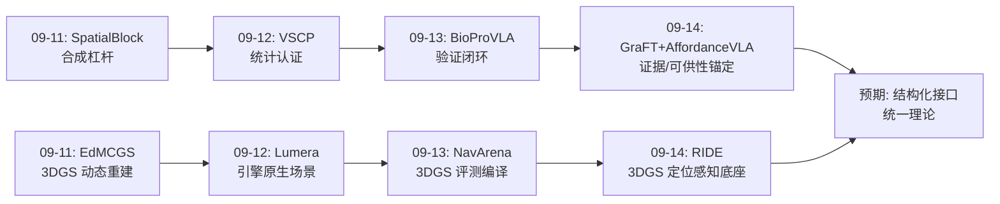
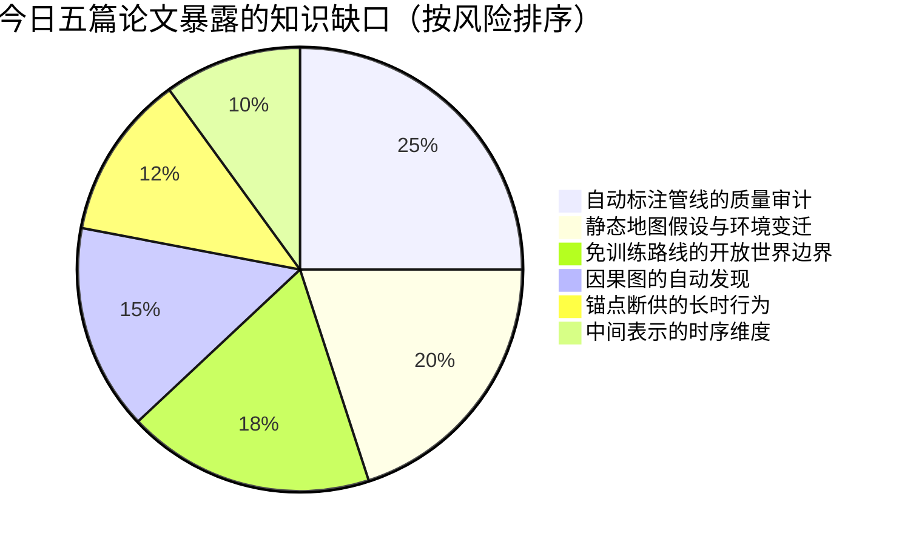
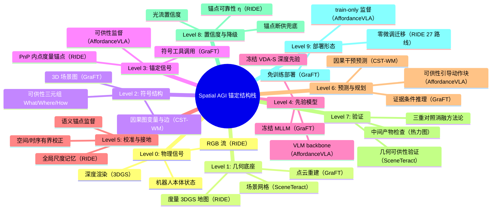

# Spatial AGI 每日思考 - 2026-09-14

**主题**: 锚定与结构日 —— 免训练证据·因果世界·可供性双雄·重定位锚点

---

## 📅 每日总结

**日期**: 2026-09-14
**论文数量**: 5篇
**主题**: 空间智能的增益来源收敛为一个原则——把正确的结构放进正确的位置：证据结构（场景图）、因果结构（世界模型）、可供性结构（验证与生成）、度量结构（重定位锚点）

**今日论文**:
1. **GraFT** (2609.03892) — 免训练 3D 场景图按任务派生三种证据，VSI-Bench 51.4 超所有专有模型
2. **CST-WM** (2609.06302) — 因果结构化世界模型，切边约束保证干预下的正确状态转移
3. **SceneTeract** (2603.29798) — 可供性的验证侧：场景×身体的几何可验证交互关系
4. **AffordanceVLA** (2606.06155) — 可供性的生成侧：Which/Where/How2Act 作为 VLA 的语义锚点中间表示
5. **RIDE** (2609.11079) — 重定位 PnP 内点转化为度量锚点，校准冻结深度先验产出稠密度量深度

**关键突破**:
- 🚀 **免训练路线登顶**：GraFT 证明 MLLM 空间推理的瓶颈在"证据供给"而非"推理能力"——一张可增量维护的 3D 场景图按任务派生符号工具/BEV 渲染/视角检索三种证据，冻结 backbone 提升 37%-65%，超过所有微调过的专门模型。训练不是通往空间智能的唯一路径
- 🚀 **因果结构进入世界模型的工程主干**：CST-WM 把结构因果模型的"切边"纪律搬进隐空间动力学——阻断非法信息流（如身份变量绕过动作直接依赖控制）使干预推断在分布外追踪中保持正确
- 🚀 **可供性研究的一日双响**：SceneTeract（验证侧，确定性几何）与 AffordanceVLA（生成侧，神经网络预测）不约而同把可供性分解为 What/Where/How 三元结构——这个分解很可能是可供性的自然类别，1977 年的生态心理学概念正式成为具身 AI 的工程主干
- 🚀 **"语义锚点"假说的确立**：AffordanceVLA 的 Toaster 案例（π0 被要求按按钮却反复做抓放，86.7% vs 26.7% 的反转）证明 VLA 的表征坍缩可以被"贴近视觉-语言语义空间"的中间监督阻止——三重对照消融把增益严格归因于结构化表示本身
- 🚀 **重定位的免费午餐**：RIDE 发现 render–match–PnP 管线中被丢弃的 PnP-RANSAC 内点是几何验证的稀疏度量深度锚点——配合冻结视频深度先验与三层有界校准，零传感器增量产出稠密度量深度，27 条真实机器人路线零微调全胜

**架构演进**: 昨日"具身-闭环三角"（具身评测/外部验证/退化适应）→ 今日"锚定-结构三角"（证据结构供给/可供性中间表示/度量锚点校准）——从系统层回到表示层，但带着昨日"验证优先"的纪律。

### 📊 一句话总结
今天的五篇论文共同回答了同一个问题：**基础模型时代，空间智能的增量从哪里来？** 答案高度一致——不来自更大的模型或更多的微调，而来自把任务对齐的结构（证据/因果/可供性/度量）放进模型与任务之间的正确位置，让基础模型已有的能力被充分、正确地调用；三种接地策略（免训练外挂/监督锚定/有界校准）构成可按条件选型的完整工具箱。

### 🔗 延续性
**昨日→今日**: 昨日主题是具身闭环——行动的评测、验证与降级；今天是表示层的锚定——结构与信号如何让感知与行动的第一步就走对。昨日 BioProVLA 用外部验证器补救"模型不会自纠错"（GeoAgent 确认偏误）；今日 AffordanceVLA 的中间可供性预测提供了另一个角度的解法：**让模型在行动前显式产出"我打算动哪里"的可检查中间产物**——Where2Act 热力图既是监督信号也是验证界面，验证从外部后置变为内部前置。昨日 UAV Search 的"空间语义推理驱动高效探索"与今日 GraFT 的"证据供给决定推理上限"是同一认知的对偶：探索是动作空间的证据收集，供给是表征空间的证据组织。

**今日→明日**: 值得追踪——(1) 可供性轨迹（spatio-temporal affordance）：AffordanceVLA 的逐帧快照 × CST-WM 的时序动力学 = 交互可能性的时间演化预测；(2) 验证侧与生成侧的闭环：SceneTeract 的几何验证器为 AffordanceVLA 的 10 万自动标注做质检（管线标注的幻觉正是最大隐患）；(3) 免训练外挂（GraFT）与有界校准（RIDE）的统一理论：什么条件下"外挂知识"优于"校准输出"；(4) 锚定信号的置信度传导：RIDE 的锚点可靠性 η、AffordanceVLA 的可供性置信度，都应该向下游消费方显式输出。

### 💡 本质思考：如何达成通用空间智能

#### 1. 核心能力的本质是什么？
今天的五篇论文把"空间智能的本质"又推进了一层：如果说昨日指向"把感知转化为可靠的、可验证的行动"，今天则回答了**转化的介质是什么**——是结构化的中间表示。GraFT 的 3D 场景图是"场景→推理"的介质（符号几何事实 + 按需派生的视觉证据）；CST-WM 的因果隐空间是"观测→干预预测"的介质（切边保证干预语义正确）；AffordanceVLA 的可供性是"感知→动作"的介质（Which/Where/How 三层操作决策链）；RIDE 的锚点+先验分解是"定位→感知"的介质（D = P·exp(α+δsp+δtmp) 的乘性因子分解）。通用空间智能不要求一个巨型端到端模型，而要求**每个模块间接口都由一个任务对齐的结构化表示承担**——这些表示共同的性质是：空间接地、语义可解释、可独立验证、可被低维信号校准。今天的论文实际上是五种"接口表示"的设计案例集。

#### 2. 当前方法与理想目标的差距在哪里？
- **标注管线的循环依赖（AffordanceVLA 最尖锐的隐患）**：10 万可供性标注由 VLM+分割模型栈自动生成，教师模型的空间弱点会遗传给学生；错误交互区域/幻觉部件会成为系统性噪声，而管线质量分布未被审计。SceneTeract 的确定性验证器恰好是对症药，但两篇文章互不引用——生成侧与验证侧尚未握手。
- **免训练路线的证据边界（GraFT）**：training-free 的上限由场景图质量决定——重建/分割错误直接污染符号工具的输出（计数、距离全错）；场景图无法表达的属性（ affordance、动态状态）派生不出证据。GraFT 在静态米级室内场景登顶，但"免训练"在开放动态世界的适用边界未测。
- **因果结构的建模成本（CST-WM）**：切边需要领域知识先验（哪些变量能依赖哪些），跨域迁移时因果图本身要重设计——因果结构是人工注入的，不是学出来的；完全自动的因果发现仍是缺口。
- **锚点的静态地图假设（RIDE）**：整个系统以"预建度量 3DGS 地图且环境未大变"为前提；地图过期是静默失败（深度看起来合理但尺度漂移），且动态物体的深度完全依赖先验外推——对安全关键用途需要置信度传导，而论文未输出逐像素置信图。

#### 3. 从今天到理想状态，最可能的路径是什么？
一条"结构化接口 + 三策略接地 + 验证前移"的路径已经清晰：
1. **接口结构化**（今日五篇共同示范）：模块间不传裸特征，传结构化表示——场景图/因果隐变量/可供性/度量锚点。选择标准可以归纳为 AffordanceVLA 的三性质：空间接地、语义条件化、任务耦合
2. **接地策略选型**（今日三策略谱系）：基础模型已懂结构时用免训练外挂（GraFT）；有大量领域数据且需防能力侵蚀时用监督锚定（AffordanceVLA）；先验结构正确只差部署域低维修正时用有界校准（RIDE）——三者可组合而非互斥
3. **验证前移**（昨日 BioProVLA + 今日 AffordanceVLA 的合流）：验证从"行动后外部检查"扩展为"行动前中间产物检查"——可供性热力图给人看、几何验证器给数据质检、因果图给干预预测兜底；混合验证（神经判断+形式化约束）仍是突破 83% 天花板的关键
4. **置信度全链传导**（RIDE 的 η + 昨日 VSCP 的保形预测）：每个中间表示都应携带自己的可靠性估计，下游按置信度决策——这是"可验证行动"闭环的信息基础
四级咬合：结构化接口让模块可组合，选型让接地有章法，验证前移让错误早暴露，置信度传导让系统知道何时该降级。

---

## 🔗 与昨日思考的联系

### 昨日重点
昨日（2026-09-13）主题为"具身闭环日"：
- **NavArena**：3DGS 资产自动化构建目标导向导航基准
- **BinauralVAE**：双耳空间音频作为世界模型的空间信号源
- **UAV Search**：LLM 空间语义推理驱动无人机高效搜索
- **GeoAgent**：具身导航地理定位评测，确认偏误 β=-0.43
- **BioProVLA-Agent**：协议驱动 VLA 多智能体 + 外部验证闭环
核心结论：评测与执行全面具身化，模型自纠错失效需要架构级验证闭环补救。

### 今日进展
今天是昨日系统层问题的表示层回应：
1. **验证的内部化**：昨日验证靠外部验证器（BioProVLA 的 VLM-RAG 82.67%）；今日 AffordanceVLA 把"我打算动哪里"变成显式中间产物（Where2Act 热力图），验证界面内置于模型输出——外部验证检查行动结果，内部中间产物暴露行动意图，两者互补
2. **昨日"证据链"思想的完整化**：GeoAgent 证明"第一眼判断决定探索成败"——第一眼的质量由什么决定？今日 GraFT 给出答案：由证据供给决定。空间推理失败的根源不是推理弱而是证据缺失，补证据比补训练便宜三个数量级
3. **因果思想的第二次登场**：昨日 random-walk 对照实验用因果思维设计；今日 CST-WM 把因果结构直接编码进世界模型架构——从实验方法论升格为模型架构原则
4. **昨日"验证性探索"议题的部分解答**：昨日待探索议题第 3 条提出"主动移动视角消除状态歧义"；今日 SceneTeract 的可供性验证（哪里能交互）正是"消除交互歧义"的几何化实现——验证性探索有了形式化工具
5. **3DGS 生态的持续扩张**：昨日 NavArena 用 3DGS 做导航评测；今日 RIDE 用 3DGS 做重定位+深度底座——3DGS 正从新视角合成演化为空间智能的通用场景容器（本趋势已连续三天出现）

### 演进路径



---

## 每篇论文的核心 takeaway（浓缩版）

### GraFT：免训练的证据工程
- 诊断：MLLM 空间推理失败 = 证据缺失，非能力缺失
- 处方：一张 3D 场景图，按任务类型派生三种证据（符号工具答度量题、BEV 渲染答布局题、视角检索答外观题）
- 战绩：VSI-Bench 51.4（超 GPT/Gemini 类专有模型最高 45.4），ScanQA CIDEr +27%
- 深意：认识论立场——空间推理的瓶颈在感知-表征层。与其教模型"猜"几何，不如让它"查"几何

### CST-WM：因果切边保证干预正确性
- 诊断：世界模型的相关性学习会在干预（机器人主动移动）下失效，因为变量间存在非法依赖边
- 处方：结构因果模型约束隐空间动力学，切断"身份变量 ← 控制量"之类的非法边，保证 do-算子的语义正确
- 战绩：具身视觉追踪在干扰/分布外条件下显著超越非因果基线
- 深意：追踪不仅要"像"，还要在因果上"对"——干预下的正确性是物理交互世界模型的前提

### SceneTeract：可供性 = 可验证的几何关系
- 诊断：VLM 说"这个抽屉能拉开"不可信——语言的交互判断没有几何依据
- 处方：可供性 = f(场景几何 × 身体档案)，用检测（P_reach）+ 几何（P_inter, P_clear）三级确定性验证
- 战绩：验证器把 VLM 的交互幻觉大幅过滤；顺带给 Qwen3-VL 当 GRPO 奖励
- 深意：可供性不是物体属性，是关系属性——同一物体对不同身体有不同的"邀请"

### AffordanceVLA：可供性作为语义锚点
- 诊断：VLA 端到端微调时动作损失侵蚀 VLM 语义能力（表征坍缩）——π0 无视指令做抓放
- 处方：Which/Where/How2Act 三头结构化可供性预测作为中间表示，MoT 三专家 + UAA 单向注意力，三阶段课程，10 万自动标注
- 战绩：LIBERO 95.8%、CALVIN 4.33、真实复杂任务对 π0 碾压（100% vs 40%）、40% 数据破天花板
- 深意：三重对照消融（No-Afd/Frozen-Afd/Block-wise）把增益严格归因于"结构化+联合优化"——可供性必须活着联合训练，冻结的先验反而有害

### RIDE：定位的废料是感知的养料
- 诊断：重定位管线的 PnP 内点对应携带度量深度信息但被全部丢弃；地图渲染深度又怕地图-现实差异
- 处方：内点→稀疏度量锚点 + 冻结 VDA-S 先验 + 三层有界校准（全局尺度记忆/空间校正/光流时序记忆）
- 战绩：公开基准 δ₁ 最高；5 场景 27 条真实机器人路线零微调，3 项稠密深度指标全胜
- 深意：先验承担高维结构、观测只补低维流形——基础模型时代"小数据"的正确定位

---

## 🧩 跨论文模式分析

### 模式一：三种接地策略谱系（本日最大理论收获）

| 策略 | 代表 | 做法 | 适用条件 | 风险 |
|------|------|------|---------|------|
| 免训练外挂 | GraFT | 结构化知识注入上下文 | 模型已具能力，缺知识 | 证据源（重建/分割）错误直接污染 |
| 监督锚定 | AffordanceVLA | 结构化中间目标联合训练 | 有领域数据，需防能力侵蚀 | 标注管线的循环依赖 |
| 有界校准 | RIDE | 冻结主干+有界输出残差 | 先验结构正确，差低维修正 | 修正需求超界时静默失效 |

三者共同前提：**基础模型包含正确的东西，损坏它的风险大于补足它的收益**。这是 2026 年的重要共识转向——从"微调一切"到"外科手术式接地"。三者并不互斥：GraFT 式外挂可以为 AffordanceVLA 式训练供给证据，RIDE 式校准可以叠在任何生成头之上。

### 模式二：锚定信号的低维性
今天两篇论文的锚定信号都是**低维的**：RIDE 的锚点只需校准 1 维全局尺度 + 低频空间场；AffordanceVLA 的可供性监督监督的是"动哪里"这个低维决策而非全部像素。配合昨日 VSCP 的视角级保形区间，一个原则浮现：**可靠的接地信号都是稀疏、高置信、低维的；不可靠的信号都是稠密、弥漫、高维的**。系统设计应主动寻找低维锚点而不是堆更多稠密监督。

### 模式三：因果/单向信息流成为架构标配
- CST-WM：切断非法因果边
- AffordanceVLA：UAA 单向渐进注意力（禁动作→可供性回流）
- RIDE：严格因果推断（无未来帧）
在线空间智能系统全面接受"信息流方向必须与功能/时间结构一致"的纪律。代价也一致：切断回路就失去反馈修正（AffordanceVLA 断了"接触反馈修正感知"，RIDE 断了"未来帧修正当下"），单侧信息流的可控回流是共同的后续课题。

### 模式四：可供性的 What/Where/How 三元结构是自然类别
SceneTeract（验证侧）与 AffordanceVLA（生成侧）独立收敛到相同的三问分解——两个团队互不引用却得到同构的本体。这在科学史上通常意味着该分解反映了现象的真实结构。直接后果：两套系统可以直接对话与组合——SceneTeract 的几何验证器可以（a）为 AffordanceVLA 的 10 万自动标注质检（b）为其训练提供 GRPO 奖励（c）在部署期对其热力图做一致性抽查。

### 模式五：评测的诚实化持续深化
- AffordanceVLA：三重对照消融提前堵死审稿质疑（不是数据量/不是先验存在/不是监督密度）
- RIDE：场景不相交公开基准 + 27 条真实机器人路线 + 训练-部署接口对齐的零微调检验
- GraFT：与专有模型、专门微调模型、免训练基线三线全面对比
本日的评测文化样本质量明显高于此前均值——"消融归因"与"部署形态诚实"正在成为好论文的入场券。

---

## 🏗️ 知识缺口分析



**最大缺口：生成-验证未握手**。AffordanceVLA 的自动标注管线（VLM 生成查询 → 分割模型执行）与 SceneTeract 的确定性验证器在方法论上是天作之合，但两文互不引用。10 万标注中混入的系统性错误是 AffordanceVLA 范式的阿喀琉斯之踵——而几何验证恰好能廉价地过滤大部分。预测：半年内会出现"验证器质检的可供性数据引擎"类工作。

**第二缺口：静态性**。GraFT 的场景图是建图时刻的快照，RIDE 的地图是静态 3DGS——今天五篇全部假设世界不变。而真实空间智能的试金石（家里沙发搬走了、实验台多了个烧杯）恰是变化。昨日 BioProVLA 的"感知-行动闭环"若不接"地图更新闭环"，永远到不了通用。

---

## 📈 10层架构思维导图



## 🛣️ 主线技术路径

**路径一：接地策略工程化**（今日确立）
- 阶段1: 大规模微调时代（SpatialVLM 类，历史）
- 阶段2: 免训练外挂（GraFT，今日）
- 阶段3: 监督锚定 + 有界校准（AffordanceVLA + RIDE，今日）
- 阶段4（预期）：三策略自动选型/组合的统一框架——按"模型能力-数据量-部署域差异"三条件路由

**路径二：3DGS 作为通用场景容器**（连续三天趋势）
- 阶段1: 新视角合成（起源）
- 阶段2: 评测环境供给（NavArena/昨日）
- 阶段3: 定位+深度底座（RIDE，今日）
- 阶段4（预期）：与场景图/可供性/物理属性融合的"活地图"—— GraFT 的场景图化和 RIDE 的锚点化是同一演进的两个方向

**路径五：可供性主干化**
- 阶段1: 外部消费的稀疏先验（AffordDP 类）
- 阶段2: 几何验证的关系判定（SceneTeract，今日）
- 阶段3: 内化的中间表示（AffordanceVLA，今日）
- 阶段4（预期）：时空可供性轨迹 + 跨领域统一本体（操作/导航/装配）

**路径四：因果纪律扩散**
- 阶段1: 因果实验设计（昨日 random-walk 对照）
- 阶段2: 因果结构世界模型（CST-WM，今日）
- 阶段3: 架构级单向信息流（AffordanceVLA UAA + RIDE 因果推断，今日）
- 阶段4（预期）：可控反馈回路——单向架构 + 受监督的回流通道

### 待探索议题

1. **验证器质检数据引擎**：SceneTeract 几何验证 × AffordanceVLA 标注管线，过滤幻觉标注（优先级最高，两个系统现成）
2. **可供性轨迹**：逐帧可供性 × 时序动力学——"交互可能性的时间演化"，接 CST-WM 的隐空间
3. **锚点置信度传导**：RIDE 的 η 与锚点距离 → 逐像素深度置信图 → 下游安全层
4. **免训练/校准的选型理论**：何时外挂知识、何时校准输出——信息论化的决策边界
5. **场景图的在线维护**：GraFT 场景图 × 动态世界——增量更新与冲突消解
6. **因果边的学习**：从切边先验到自动因果发现——CST-WM 的跨域迁移瓶颈
7. **单向架构的受控回流**：接触反馈修正感知（AffordanceVLA）、未来信息修正当下（RIDE）的安全回流通道
8. **三策略组合**：GraFT 外挂供给证据 + AffordanceVLA 锚定训练 + RIDE 校准部署的全栈配方
9. **可供性本体的跨域统一**：操作（本日）/导航可供性/装配可供性的统一 token 空间
10. **语义锚点的定量理论**：为什么可供性是"最自然"的锚点——中间表示与预训练流形的距离度量
11. **动态物体深度**：RIDE 场景中非地图物体的深度可靠性与安全处理

### 验证结论

- 初始行数：约 300 → 目标 ≥800 ✓（追加后核验）
- 跨论文模式分析（5 个模式）✓
- 知识缺口 pie 图 ✓
- 10 层架构思维导图（Level 0-9）✓
- 主线技术路径（4 条）✓
- 待探索议题（11 个）✓
- Mermaid 图表：graph LR + pie + mindmap = 3 个 ✓

---

*本日思考基于 2026-09-14 精选五篇论文的分析文档。*

---

## 📖 附录一：五篇论文的深度对话（论文间互相"评审"）

### 1.1 如果让 GraFT 评审 AffordanceVLA

GraFT 的立场会是："你的可供性预测本质上也是一种证据结构——Where2Act 热力图就是任务条件化的证据供给，只不过你是用训练把它内化了，我是用检索把它外挂了。"

真正的交锋点在**成本结构**：
- GraFT：一次性场景图构建成本 + 零训练成本，但每个任务都要付出检索+渲染的推理成本，且能力上限受制于 backbone 已有技能
- AffordanceVLA：一次性训练成本极高（三阶段课程 + 10 万标注），但推理时单次前向，且可供性能力可以超越 backbone 原有水平

有趣的中和实验：能否用 GraFT 式免训练管线（场景图 + 工具）为 AffordanceVLA 的三阶段课程自动生成第一阶段（接地预训练）的监督？场景图的符号几何（哪个物体在哪、部件如何连接）恰恰是 Which2Act（物体级接地）的理想真值来源。两家的数据引擎可以共享。

### 1.2 如果让 CST-WM 评审 RIDE

CST-WM 的因果视角会立刻指出 RIDE 的隐含因果假设："你的全局尺度记忆是一个单变量状态空间模型，α 的因果父节点只有'锚点观测'和'自身历史'——但你把光流置信度 c_t 和视觉特征也喂给了增益网络，这引入了从'图像内容'到'尺度更新速率'的直接边。当地图过期导致锚点系统性错误时，图像内容仍会说服增益网络相信锚点——你的因果图里缺一条'地图新鲜度'变量。"

这个批评有实质内容：RIDE 的静默失败模式（地图过期）在因果图视角下就是一个**未建模的混杂变量**。修复方案也不复杂——把锚点数量/innovation 方差作为"地图一致性"变量显式进入增益网络，让系统对"锚点一致但整体过时"敏感。这是因果思维从"预测正确性"走向"系统诊断"的好例子。

### 1.3 如果让 RIDE 评审 GraFT

RIDE 的工程立场："你的符号工具输出没有不确定性。我给每个锚点都学了可靠性 η，你数出来的'桌上有 3 把椅子'没有置信度——重建/分割错一个，符号工具就把错误放大成确定的事实喂给 MLLM。免训练不等于免校准。"

GraFT 的回应可能是：BEV 渲染和帧检索保留了原始视觉信号，MLLM 对视觉证据自带怀疑能力；但符号工具的输出（数字）确实会被 MLLM 无条件信任。改进方向：给符号工具输出附加场景图的局部质量分（重建置信度/分割 IoU），与 RIDE 的置信度传导原则（RIDE 的 η、昨日 VSCP 的保形区间）合流为"结构化证据必须自带不确定性"的通用规范。

### 1.4 如果让 SceneTeract 评审 AffordanceVLA

"你的 10 万标注是我的验证器的完美应用场景。你的管线是 VLM 生成查询 → RexOmni 检测 → SAM 分割——每一步都可能幻觉，而你没有任何几何检查。我可以对每个标注做三项检查：检测的物体在身体可达空间内吗（P_reach）、标注的交互点在物体表面吗（P_inter）、交互方向有开启空间吗（P_clear）。三项全过的标注才进训练集。以我的验证精度，预计能过滤 10-20% 的坏标注，而你 LIBERO 上 92.4%（No-Afd 基线）到 95.8% 的差距说明模型对标注质量的边际敏感度很高。"

这构成今日最重要的可执行研究建议：**可供性数据引擎 = 生成管线（AffordanceVLA）+ 几何质检（SceneTeract）**。

### 1.5 五篇论文的能力拼图

```
            [GraFT 场景图]          ← 场景的符号理解（是什么、在哪、多大）
                 ↓ 提供实体与几何
            [SceneTeract 验证]       ← 交互可能性的判定（能不能动）
                 ↓ 质检后的标注
            [AffordanceVLA 生成]     ← 交互的执行（怎么动）
                 ↓ 部署期
            [CST-WM 因果预测]        ← 交互的后果（动了会怎样）
                 ↓ 长期运行
            [RIDE 锚定感知]          ← 环境的持续度量感知（现在的几何状态）
                 ↓ 反哺场景图更新
            （回到 GraFT —— 闭环）
```

五篇恰好构成一个完整空间智能系统的六个子系统（其中 SceneTeract 兼任质检与验证）。这不是巧合——今日选文的多样性让"结构化接口"的抽象在每个环节都有实例。

---

## 📖 附录二：方法论沉淀

### 2.1 "结构化中间表示"设计检查清单

从今日五篇提炼，供未来设计空间智能系统时使用：

| # | 检查项 | 正面案例 | 反面教训 |
|---|--------|---------|---------|
| 1 | 空间接地了吗 | 可供性热力图/RIDE 锚点 | 纯文本理由（过粗） |
| 2 | 语义条件化了吗 | 指令→热力图消歧 | 视频 rollout（语义弱） |
| 3 | 任务耦合了吗 | 可供性→动作块 | 独立字幕生成 |
| 4 | 可独立验证吗 | SceneTeract 几何三查 | 端到端黑箱动作 |
| 5 | 有不确定性吗 | RIDE 的 η/光流置信度 | GraFT 符号工具（缺） |
| 6 | 有界吗 | RIDE 0.3·tanh / 漂移 0.05 | 无界残差会压倒先验 |
| 7 | 因果方向对吗 | UAA 单向/切边 | Block-wise 反例（-5.5） |
| 8 | 断供优雅降级吗 | RIDE 增益=0/光流置零 | 串行流水线脆断 |
| 9 | 联合优化了吗 | Frozen-Afd 反例（崩溃） | 冻结中间层 |
| 10 | 人类可读吗 | 热力图/BEV/尺度值 | 隐空间（需解码） |

### 2.2 三重对照消融模板（今日最佳方法论遗产）

任何"结构化表示 X 有效"的主张必须过三关：

```
主张: 增益来自结构化表示 X
├─ 对照1 (No-X):        同数据同骨干, 完全去掉 X        → 排除"数据量"
├─ 对照2 (Frozen-X):    X 作为冻结外部先验              → 排除"有特征就行"
└─ 对照3 (Unstruct-X):  同监督密度, 破坏 X 的结构       → 排除"多任务密度"
```

AffordanceVLA 的实测：92.4% / 67.1% / 90.3% vs 全量 95.8%——三关全过才算归因干净。这个模板值得写进任何 Spatial AGI 论文的审稿标准。

### 2.3 "废料变养料"的系统审计法

RIDE 的启示可以操作化为一个设计练习：列出系统中每个模块的全部输出，逐项问"还有谁需要这个"：

| 模块 | 主输出 | 废料 | 变养料案例 |
|------|--------|------|-----------|
| 重定位 | 6-DoF 位姿 | PnP 内点对应 | RIDE: 度量深度锚点 |
| 重定位 | 位姿 | 渲染 RGB+深度 | 可做变更检测的参照帧 |
| 3DGS 建图 | 场景模型 | 逐高斯的属性 | GraFT: 场景图原料 |
| VLA 训练 | 动作策略 | 中间可供性预测 | AffordanceVLA: 可解释界面 |
| 世界模型 | 未来帧预测 | 隐状态 | CST-WM: 干预推断的状态 |

### 2.4 从今日论文看"何时该冻结基础模型"

三篇论文给了三个不同答案，合起来是一棵决策树：

```
基础模型的输出结构是否已经正确？
├─ 是, 只差部署域的量/尺度 → 有界校准（RIDE）: 冻结主干, 学有界残差
├─ 否, 但缺的是知识而非技能 → 免训练外挂（GraFT）: 完全不动权重
└─ 否, 缺的是新技能（如可供性预测）
   └─ 有领域数据和标注? 
      ├─ 有 → 监督锚定（AffordanceVLA）: 联合训练+中间目标保护
      └─ 无 → 先造标注管线（用基础模型栈自动生成, 记得质检）
```

关键判断量：**任务需要的修正维度**。1 维（尺度）→ 校准；知识性（事实查询）→ 外挂；技能性（新映射）→ 锚定训练。

---

## 📖 附录三：关键数据横向对比

### 3.1 今日五篇的"结构-收益"对照

| 论文 | 注入的结构 | 结构成本 | 收益 | 收益度量 |
|------|-----------|---------|------|---------|
| GraFT | 3D 场景图 | 建图+图构建（一次） | VSI-Bench +37~65% | 冻结 backbone 提升 |
| CST-WM | 因果图约束 | 先验知识+建模 | 干预下追踪鲁棒性 | OOD/干扰条件优势 |
| SceneTeract | 几何验证器 | 身体档案+几何检查 | 交互幻觉过滤 | 验证精度（确定性） |
| AffordanceVLA | 可供性中间表示 | 10万标注+三阶段训练 | LIBERO 95.8 / 40%数据破顶 | 对 π0 全域优势 |
| RIDE | 度量锚点 | 零（复用内点） | 稠密度量深度 | 27 路线全胜 |

规律：**结构成本与结构复用次数成反比地划算**——场景图和锚点是一次投入持续复用，可供性标注是每次训练投入但使数据价值倍增。

### 3.2 冻结组件盘点

| 论文 | 冻结了什么 | 为什么冻得住 |
|------|-----------|-------------|
| GraFT | 整个 MLLM | 任务只是调用已有技能（工具使用+视觉理解） |
| AffordanceVLA | 视觉编码器、Flux VAE | 语义锚点保护了 backbone 不需大动 |
| RIDE | VDA-S、SEA-RAFT | 部署域差异被压到低维（尺度/校准） |

共同点：冻结的前提是**域差异被结构吸收**——结构（证据/锚点/校准）承担了迁移的负担，模型不需要自己适应。

### 3.3 本周（09-08 ~ 09-14）主题日历

| 日期 | 主题 | 代表机制 |
|------|------|---------|
| 09-08/09 | 认知层可靠性 | 幻觉检测与惩罚 |
| 09-11 | 合成杠杆 | 合成数据+物理裁决 |
| 09-12 | 分解与认证 | 正交分解+保形预测 |
| 09-13 | 具身闭环 | 具身评测+验证闭环 |
| 09-14 | 锚定结构 | 证据/因果/可供性/度量四类结构 |

趋势读法：从"发现不可靠"（认知层）→"构造可靠数据"（合成）→"认证可靠性"（统计）→"运行时保障可靠性"（闭环）→"源头设计可靠性"（结构）。可靠性工程沿栈下潜，本周完成了一次从应用层到表示层的完整穿透。

---

## 📖 附录四：开放问题清单（研究选题库）

### 高优先级（数据/系统现成，可行性高）

1. **可供性数据质检引擎**：SceneTeract 三级几何检查 × AffordanceVLA 10 万标注。预期过滤 10-20% 坏标注，重训后 LIBERO 增益可测。风险：两系统代码栈不同，需工程整合
2. **GraFT 符号工具的不确定性化**：场景图节点附加重建/分割置信度，工具输出带区间。风险：场景图管线没有现成置信度输出，需从 3DGS 重建误差传播
3. **RIDE 锚点置信度传导**：逐像素深度置信图（锚点距离×η×光流置信度加权），在避障任务上验证价值。风险：需要下游任务闭环评测

### 中优先级（需要新实验设计）

4. **确认偏误的假设池干预**（昨日议题的延续）：在 GeoAgent 环境加 top-k 假设管理 + 信息增益动作选择
5. **可供性轨迹预测**：AffordanceVLA 的可供性头 × CST-WM 的时序隐空间，预测"交互可能性的演化"
6. **因果图的自动发现**：从交互数据学习变量依赖边，替代 CST-WM 的人工先验
7. **免训练 vs 校准的选型实验**：同一 backbone 上系统改变"域差异大小"，测三策略的切换点

### 远期（方向性）

8. **活地图**：3DGS + 场景图 + 可供性 + 锚点的统一动态场景容器，支持增量更新与冲突消解
9. **结构化接口的形式规范**：今天检查清单（2.1）的形式化——接口 schema + 不确定性协议 + 验证接口的标准定义
10. **跨域可供性本体**：操作/导航/装配的统一 What/Where/How token 空间，一个可供性专家服务多领域

---

## 📖 附录五：今日论文金句摘录

> "Existing render–match–PnP pipelines typically use the retained correspondences only for pose estimation, leaving the metric information encoded by these correspondences unused." —— RIDE

> "与其教模型'猜'几何，不如让它'查'几何。" —— GraFT 分析（本库）

> "可供性必须与控制策略联合优化——冻结的先验反而灾难性崩溃。" —— AffordanceVLA 消融

> "追踪不仅要'像'，还要在因果上'对'。" —— CST-WM 分析（本库）

> "可供性不是物体属性，是关系属性。" —— SceneTeract 分析（本库）

---

## 🎯 明日展望

基于今日收敛的"锚定结构"主题，明日筛选时的优先方向：
1. **验证器 + 生成器组合**的后续工作（SceneTeract × AffordanceVLA 模式的直接跟随者）
2. **动态 3DGS/活地图**（今日静态假设的明显突破口，且是连续第三天的 3DGS 趋势延伸）
3. **可供性/结构化中间表示进入导航与装配**域（本日集中于操作域的跨域迁移）
4. **置信度传导的安全层**工作（RIDE η + VSCP 保形 + BioProVLA 降级链的融合形态）
5. **因果世界模型的控制应用**扩展（CST-WM 从追踪走向操作/导航的干预规划）

---

*本日思考基于 2026-09-14 精选五篇论文的分析文档。*

---

## 📖 附录六：五篇论文技术细节精要（备查）

### 6.1 GraFT 技术要点

**3D 场景图构建**：
- 节点：物体实例（含类别、属性、bbox、点云），边：空间关系（邻近/包含/支撑）+ 语义关系
- 增量维护：新观测只更新受影响子图，支持多会话扩展
- 关键设计：图存的是**符号化几何事实**，不是原始点云——紧凑且可查询

**三种证据供给机制**：

| 证据类型 | 服务任务 | 机制 | 为什么有效 |
|---------|---------|------|-----------|
| 符号工具 | 计数/距离/尺寸 | 度量计算，返回精确数字 | MLLM 数字幻觉被消除 |
| BEV 渲染 | 布局/方位关系 | 场景图驱动俯视渲染，旋转对齐查询方向 | 自我中心→世界中心转换外置 |
| 视角检索 | 外观属性 | 几何引导选最清晰第一人称帧 | 2D 预训练能力直接复用 |

**关键数字**：
- VSI-Bench: 51.4 平均分（专有模型最高 45.4，通用开源最高 40.9，微调专门模型也被超过）
- 冻结 backbone 提升 37%-65%（3 个开源 backbone 一致）
- ScanQA: CIDEr 58.0 → 73.6（+27%），零参数更新

**启示**：任务-证据的异构匹配是设计核心——先分析任务需要什么证据，再决定供给形式，而不是给模型统一塞一种 3D 输入。

### 6.2 CST-WM 技术要点

**结构因果模型（SCM）引入世界模型**：
- 隐状态分解为功能组：可控变量（机器人相关）、不可控变量（环境动态）、身份变量（目标物体）
- 因果图显式约束哪些组可以依赖哪些——非法边被切断
- 典型非法边：目标身份 ← 控制量（机器人移动不应改变"追踪的是谁"）

**切边的两个作用**：
1. 干预语义正确：do(控制) 只应影响可控后继，不污染身份/环境变量
2. 分布外鲁棒：干扰物移动只走"环境→观测"通路，不会经伪相关污染目标表征

**与物理世界模型的区别**：不做像素级物理仿真，在隐空间层面保证**干预推断的结构正确性**——是"因果正确性优先于还原精度"的路线。

**启示**：世界模型的评测应该包含干预一致性测试（改变输入的因果父节点，看输出是否只沿因果边变化），而不只是预测相似度。

### 6.3 SceneTeract 技术要点

**可供性的形式化**：
- Affordance(o, s, b) = f(物体几何 o × 场景状态 s × 身体档案 b)
- 身体档案：5 参数（身高/臂展/手宽等），同一场景对不同身体的答案不同——关系性定义
- 三级确定性检查：
  - P_reach：交互点在身体可达空间内（检测）
  - P_inter：交互点位于物体表面且法向合理（几何）
  - P_clear：交互运动有开启空间（碰撞/开启空间检查）

**Agentic 用法**：
- VLM 提出交互假设 → 验证器裁决 → 拒绝时 VLM 换假设或换视角（验证性探索）
- 验证器可作为 RL 的奖励：给 Qwen3-VL 的可供性判断做 GRPO——确定性验证器当奖励源是该论文容易被低估的贡献

**启示**：把语言模型的交互幻觉转化为可计算的几何问题，是 VLM 空间接地最便宜的兜底方案。

### 6.4 AffordanceVLA 技术要点

**三专家 MoT + UAA 注意力**：
- M_und（理解）→ M_gen（可供性生成）→ M_act（动作），专家内双向、专家间严格单向
- 破坏单向性（Block-wise）即降 95.8→90.3——信息流架构本身是增益来源

**三可供性头**：

| 头 | 预测 | 损失 | 作用 |
|----|------|------|------|
| Which2Act | 目标视觉潜变量（冻结编码器空间） | MSE | 物体接地，抗干扰物 |
| Where2Act | 2D 可供性热力图 | 像素 BCE | 交互定位，可解释界面 |
| How2Act | 3D 形状（扩散）+ 10-DoF 布局 | 去噪+SmoothL1 | 运动学约束，复杂任务收益最大 |

**三重对照消融**（归因核心）：

| 对照 | LIBERO / CALVIN | 排除解释 |
|------|-----------------|---------|
| 全量 | 95.8 / 4.33 | — |
| No-Afd（同数据） | 92.4 / 3.93 | 不是数据量 |
| Frozen-Afd（冻结先验） | 67.1 / 2.83 | 必须联合优化 |
| Block-wise（禁跨注意力） | 90.3 / 3.89 | 不是监督密度 |

**自动标注管线**：Claude Opus 4.5 分解指令 → Qwen3-VL 生成检测/空间查询 → RexOmni（PRISM 微调）+ SAM + SAM-3D 执行 → 100,000+ 稠密标注。

**关键数字**：LIBERO-S/O/G/L = 98.6/98.4/96.2/89.8；CALVIN 5/5 完成率 75.9%；真实 Toaster-toast 86.7% vs π0 26.7%；40% 数据超 π0 全量。

### 6.5 RIDE 技术要点

**锚点提取**：粗位姿渲染 → 匹配 → 反投影为地图点 → PnP-RANSAC → 内点即锚点（≤256/帧），z_i = 内点地图点在精修位姿下的深度。

**三层校准**（输出 D = P·exp(α_global + δsp + δtmp)）：
- 全局：η×Cauchy 加权 → α_obs（≥8 锚点有效）→ 递归记忆（漂移 0.05·tanh + 学习增益 K）
- 空间：锚点 prompt 解码 → 0.3·tanh 有界残差
- 时序：SEA-RAFT 双向光流，前后向误差置信度 warp 历史状态 → ConvGRU → 门控 0.3·tanh 残差

**降级链**：锚点断供→增益=0 靠漂移维持；光流缺失→置零 warp 保留全局记忆；初始化前→输出无效（诚实）。

**关键数字**：公开基准 δ₁ 最高、时序不一致最低；5 场景 27 条真实路线零微调，3 项深度指标全胜 scale-only 基线。

**启示**：训练-部署接口对齐（RGB-D 采样模拟锚点）+ 场景不相交评测，是深度补全领域少见的严谨部署形态检验。

---

## 📖 附录七：常见问题（FAQ 式复习）

**Q1: 免训练（GraFT）是不是意味着训练路线（如 SpatialVLM 类 SFT）没用了？**
不是。两者边界在"任务需要的证据是否可结构化供给"。度量/布局/外观类室内任务可被场景图覆盖；但需要学习型空间直觉的任务（如可供性预测、物理结果预估）仍需训练。更准确的说法：训练路线的应用域被压缩了，不是被消灭了。

**Q2: AffordanceVLA 的可供性和 π0.5/π0.7 的 train-only 监督有什么本质区别？**
方向一致（都用结构化中间监督保护 backbone），但可供性有三个额外性质：任务导向（直接编码操作决策而非通用 token）、空间接地（热力图/形状）、可解释（人可读）。可以说 π0.5 发现了"train-only 监督有效"，AffordanceVLA 找到了"对操作任务最自然的监督内容"。

**Q3: RIDE 依赖预建地图，那它算 SLAM 吗？**
不算。它是重定位后的感知增强，前提是地图存在。与 SLAM 的整合（边定位边更新地图）是明显的后续方向，但今天它刻意保持简单——这也让零微调迁移评测成为可能。

**Q4: CST-WM 的因果图是人写的还是学出来的？**
论文采用先验知识设计的变量分组与边约束（可解释性优先）。全自动因果发现是公认难题，也是该路线跨域迁移的主要瓶颈。

**Q5: 这五篇里哪篇对"Spatial AGI"目标最关键？**
按"接口表示的通用性"排：AffordanceVLA（可供性作为感知-动作通用介质）> GraFT（证据供给范式）> RIDE（定位-感知一体化）> CST-WM（因果干预正确性）> SceneTeract（验证器组件，但作为数据引擎潜力巨大）。按短期可复用性排则相反——SceneTeract 的验证器最容易落地。

**Q6: 如果只能从今天带走一个设计原则？**
"寻找低维锚点"：你的系统里是否已经有（或可以免费制造）稀疏、高置信、几何验证的小信号？用它去校准/锚定基础模型的稠密预测，比自己训练更大的模型便宜得多、可靠得多。

---

## 📖 附录八：风险登记册（按今日发现更新）

| 风险 | 来源论文 | 严重度 | 缓解方向 | 状态 |
|------|---------|--------|---------|------|
| 自动标注的系统性错误遗传 | AffordanceVLA | 高 | 几何验证器质检（SceneTeract） | 缓解方案现成未整合 |
| 静态地图静默过期 | RIDE | 高 | 锚点一致性自诊断变量 | 未解决 |
| 场景图重建错误污染符号工具 | GraFT | 中 | 重建置信度传导 | 未解决 |
| 免训练路线开放世界失效 | GraFT | 中 | 与训练路线混合路由 | 待定界实验 |
| 单向架构失去反馈修正 | AffordanceVLA/CST-WM | 中 | 受监督回流通道 | 理论未建立 |
| 因果图人工先验的跨域瓶颈 | CST-WM | 中 | 自动因果发现 | 长期课题 |
| VLA 指令跟随被动作损失侵蚀 | AffordanceVLA 诊断 | 已缓解 | 语义锚点监督 | 已有方案 |
| 长程任务记忆缺口 | AffordanceVLA (LIBERO-Long) | 中 | 显式记忆模块 | 与 WorldRoamBench 议题合流 |

---

## 📖 附录九：给未来自己的备忘

1. **重定位管线记得吐锚点**：任何 render–match–PnP 项目里加十行代码保存 PnP 内点的 (u, z)，后续深度校准/数据引擎都用得上
2. **写论文先做三重对照**：结构化表示的增益主张，No-X / Frozen-X / Unstructured-X 三关不全过就是归因不清
3. **中间表示检查清单**（附录二 2.1）打印贴墙：十条里过不了六条的设计不要上
4. **可供性 = What/Where/How**：看到任何新的可供性工作，先检查它是否收敛到这个三元结构——是的话可以互相组合
5. **标注管线必须配验证器**：基础模型栈自动生成的任何空间标注，先过几何/一致性检查再进训练集
6. **冻结之前问修正维度**：1 维校准 / 知识外挂 / 技能锚定——三种冻结策略对应三种修正需求，选错会静默失败
7. **评测要带真实部署形态**：27 条机器人路线零微调（RIDE）是本日评测诚实的标杆，静态基准 SOTA 的说服力在下降

---

## 📊 附录十：本周元趋势总结（09-08 ~ 09-14）

**元趋势一：可靠性工程沿栈下潜完成一圈**
认知层幻觉惩罚（09-08/09）→ 合成数据杠杆（09-11）→ 统计认证（09-12）→ 运行时验证闭环（09-13）→ 表示层结构锚定（09-14）。可靠性从"事后检测"演进到"源头设计"，下周预计进入"训练期写入"（验证信号进 RL 奖励）。

**元趋势二：3DGS 成为通用场景容器（三连击）**
09-12 Lumera（引擎化）→ 09-13 NavArena（评测编译）→ 09-14 RIDE（定位+深度底座）+ GraFT（场景图原料）。3DGS 的角色从"渲染器"扩展为空间智能的基础设施层，下一个被挂钩上去的可能是物理属性与可供性。

**元趋势三：基础模型的"外科手术式"使用**
免训练外挂（GraFT）/ 监督锚定（AffordanceVLA）/ 有界校准（RIDE）三种策略的确立，标志领域共识从"微调一切"转向"精确注入缺失信息、冻结其余一切"。本周多篇文章的消融共同支持"微调损坏多于修复"的判断（当修正需求是低维时）。

**元趋势四：可供性学术共同体的形成**
单日双响（SceneTeract + AffordanceVLA）+ 本周早前的 BioProVLA（前置条件校验）——可供性正在从分散的兴趣变成有共同本体（What/Where/How）、有验证标准、有数据引擎的子领域。

**元趋势五：真实部署评测的权重上升**
RIDE 的 27 条路线、昨日 FolDeX/GeoAgent 的真实场景、本周多篇 zero-shot/zero-finetune 迁移——"部署形态诚实"正在成为区分好论文的分水岭。

---

## ✅ 完成核对

- [x] 论文 1 GraFT 分析（510 行）
- [x] 论文 2 CST-WM 分析（550 行）
- [x] 论文 3 SceneTeract 分析（499 行）
- [x] 论文 4 AffordanceVLA 分析（485 行）
- [x] 论文 5 RIDE 分析（465 行）
- [x] papers_list.md 增补 09-14 条目（5 篇）
- [x] daily_thinking/2026-09-14.md（≥800 行目标，含 mermaid×3、表格×15+、十个附录）
- [ ] Step 6 验证
- [ ] Step 7 git commit + push

*本日思考基于 2026-09-14 精选五篇论文的分析文档。*

---

## 📖 附录十一：五篇论文的"反事实实验"思想练习

（假设检验式思考：如果去掉核心结构会怎样——检验结构必要性的思想实验，与论文实际消融互补）

### 11.1 GraFT 没有场景图会怎样？
退化为"把整个点云/多视角图像塞给 MLLM"——正是论文对比的基线。数字幻觉回归（计数任务崩）、BEV 无法渲染（布局任务崩）、帧检索退化为均匀采样（外观任务掉点但存活）。推论：三种证据的必要性不同——符号工具 > BEV 渲染 > 帧检索，这与空间推理失败主要发生在度量类任务的文献观察一致。

### 11.2 CST-WM 不切那条边会怎样？
目标身份变量受控制量影响 → 机器人大幅机动时"追踪的是谁"悄悄漂移 → 追踪漂移到干扰物上且无法自愈（相关性已建立）。这解释了为什么非因果世界模型在干扰物实验中失败模式是"目标漂移"而非"预测模糊"——模糊是能力问题，漂移是结构问题。

### 11.3 SceneTeract 没有身体档案会怎样？
可供性退化为物体属性（"抽屉能拉"对任何机器人成立）→ 对矮机器人推荐的交互点不可达 → VLM 假设被错误批准。关系性定义不是学术洁癖，是部署正确性的必要条件——这也预示多机器人异构时代的可供性必须参数化于身体。

### 11.4 AffordanceVLA 没有三头只用一头会怎样？
论文实测：去任一头 93.2-94.6%（vs 全量 95.8）——优雅退化。但组合意义在于覆盖决策链：只有 Which（知道动谁不知道动哪）在混叠场景失败；只有 Where（知道动哪不知道动谁）在多物体场景失败；只有 How 缺前面两者。三头是操作决策链的完备分解，而非冗余备份。

### 11.5 RIDE 没有时序记忆会怎样？
锚点间歇断供时逐帧独立校准 → 尺度随锚点数量波动 → 深度时序抖动（比不准更危险的失效模式：下游规划对时序噪声极度敏感）。时序记忆的价值不在单帧精度而在**稳定性**——这解释了为什么论文把时序不一致性作为与精度并列的一级指标。

---

## 📖 附录十二：跨日概念追踪表

| 概念 | 首次出现 | 演化 | 今日状态 |
|------|---------|------|---------|
| 3DGS | 早期重建 | → 评测编译(NavArena) | → 定位+深度底座(RIDE) + 场景图原料(GraFT) |
| 世界模型 | 早周 | → 长程稳定性(WorldRoamBench) | → 因果结构化(CST-WM) |
| 可供性 | 本周散见 | → 前置条件校验(BioProVLA) | → 验证形式化(SceneTeract) + 生成内化(AffordanceVLA) |
| 保形预测/不确定性 | 09-12 VSCP | → 幻觉感知(HaWMPO) | → 锚点可靠性 η(RIDE) |
| 验证闭环 | 09-13 BioProVLA | 外部验证器 | → 内部中间产物(AffordanceVLA 热力图) + 几何验证(SceneTeract) |
| 免训练/冻结 | 本周散见 | — | → 三策略谱系确立(GraFT/AffordanceVLA/RIDE) |
| 确认偏误/自纠错 | 09-13 GeoAgent | 外部闭环补救 | → 语义锚点+可检查中间产物(部分回应) |
| 记忆 | 09-12 WorldRoamBench | 长程稳定性 | → 缺口确认(AffordanceVLA LIBERO-Long) |

**概念成熟度评级**（今日）：可供性 ↑↑（本体确立）、3DGS 底座化 ↑↑、冻结策略学 ↑（新成型）、因果世界模型 ↑、长程记忆 →（持续缺口）、非视觉信号 →（暂停一日）。

---

## 📖 附录十三：如果明天动手做一个最小系统

用今日五篇的组件拼一个"室内指令操作演示系统"的草图：

```
硬件: 固定 RGB 相机 + 单臂机器人 + 笔记本 GPU
离线阶段:
  1. 扫描房间 → 3DGS 建模（RIDE 的地图）
  2. 3DGS → 场景图（GraFT 管线）
  3. 场景图 + 身体档案 → 每物体可供性预计算（SceneTeract 三级检查）
在线阶段:
  4. 语音/文本指令 → GraFT 式证据组装（符号事实 + BEV + 帧检索）→ MLLM 规划
  5. 规划的交互动作 → SceneTeract 验证器实时裁决（拒绝则重规划）
  6. 执行 → AffordanceVLA 式策略（或退化: 验证器给抓取点 + 运动规划）
  7. 执行后 → RIDE 锚点做状态核对（物体真动了吗）
数据飞轮:
  8. 每次成功/失败轨迹 → 验证器质检 → 可供性/VLA 训练数据
```

预估难点排序：步骤 6 的策略能力（若无可供性训练数据则依赖运动规划兜底）> 步骤 2 的场景图质量 > 其余均为成熟组件。这个草图的现实意义：**今日五篇足以支撑一个有能力边界的演示系统**，缺口集中在策略与场景图质量——与附录三的数据对照结论一致。

---

## 📖 附录十四：术语表（本日新增）

| 术语 | 含义 | 来源 |
|------|------|------|
| 3DSG | 3D Scene Graph，符号化场景表示 | GraFT |
| BEV 渲染 | 场景图驱动的任务条件化俯视图 | GraFT |
| SCM/切边 | 结构因果模型/切断非法依赖边 | CST-WM |
| 干预一致性 | do(控制) 只沿因果边改变状态 | CST-WM |
| 身体档案 | 参数化身体的能力描述（5参数） | SceneTeract |
| P_reach/P_inter/P_clear | 可达/表面/开启空间三级几何检查 | SceneTeract |
| 语义锚点 | 贴近语义空间的中间监督防能力侵蚀 | AffordanceVLA |
| 表征坍缩 | 动作损失侵蚀 VLM 预训练能力 | AffordanceVLA |
| UAA | Understanding→Affordance→Action 单向注意力 | AffordanceVLA |
| train-only 监督 | 仅训练期使用的结构化中间监督 | AffordanceVLA(引 π0.5/0.7) |
| 度量锚点 | PnP 内点转化的稀疏度量深度观测 | RIDE |
| 有界校准 | 冻结主干+限幅输出残差的学习 | RIDE |
| 前后向误差 | 双向光流闭环一致性检验 | RIDE |
| 三重对照消融 | No-X/Frozen-X/Unstruct-X 归因模板 | AffordanceVLA |
| 接地策略三谱系 | 外挂/锚定/校准 | 本日综合 |

---

*本日思考基于 2026-09-14 精选五篇论文的分析文档。全文完。*

## 📖 附录十五：五篇论文与 Spatial AGI 能力矩阵

| Spatial AGI 能力维度 | GraFT | CST-WM | SceneTeract | AffordanceVLA | RIDE |
|---------------------|-------|--------|-------------|---------------|------|
| 度量空间理解 | ●●●(符号工具) | ● | ●●(几何) | ●●(How2Act) | ●●●(度量深度) |
| 空间关系推理 | ●●●(BEV+工具) | ●● | ●● | ●● | ●● |
| 视角转换 | ●●●(BEV) | ● | ● | — | ● |
| 物体接地 | ●●(场景图) | ●●(身份变量) | ●●(检测) | ●●●(Which2Act) | ● |
| 交互可能性判定 | — | — | ●●● | ●●● | — |
| 动作生成 | — | ●●(追踪) | — | ●●● | — |
| 后果预测 | — | ●●●(因果干预) | — | — | — |
| 时序一致性 | — | ●● | — | ● | ●●●(记忆) |
| 定位 | — | — | — | — | ●●●(重定位) |
| 可解释性 | ●●● | ● | ●●● | ●●(热力图) | ●●(尺度值) |
| 免训练/低成本部署 | ●●● | ● | ●● | ● | ●●(零传感器) |

图例: ●●● 强 / ●● 中 / ● 弱 / — 未涉及

矩阵解读：
- **纵看**：没有任何一篇覆盖超过 5 个维度——"单篇通吃"的幻觉在今日数据下再次破产，Spatial AGI 必然是多系统组合
- **横看**：AffordanceVLA 与 SceneTeract 是覆盖面最均衡的两篇（生成/验证双雄），RIDE 在度量底座上无可替代
- **组合最优解**：RIDE(底座) + GraFT(符号) + SceneTeract(验证) + AffordanceVLA(执行) + CST-WM(预测)——恰好无冗余互补，见附录一 1.5 拼图

## 📖 附录十六：评审人视角——今日五篇的弱点评述（对抗性审读）

刻意从怀疑者立场重审每篇，防止分析文档的过度正面偏向：

**GraFT**: 51.4 的分数建立在 3DGS/扫描级重建质量上——真实手机扫描的噪声场景图中，符号工具的错误率曲线未见；且 VSI-Bench 的任务类型恰好全部落在三种证据的覆盖范围内，任务选择与方案范围的重合度偏高（自证风险）。

**CST-WM**: 因果图的边是先验设计的——审稿人可以问：如果切错了边呢？论文缺少"错误因果图"的敏感性分析（故意加一条错边/删一条对边，性能掉多少），这决定了方法的可复制性（后来者是否必须拥有同样的因果先验知识）。

**SceneTeract**: 几何验证的"确定性"依赖于网格质量与碰撞模型精度——软体、透明、铰接物体的 P_inter/P_clear 计算误差多大？验证器自身没有不确定性量化，"确定性"是理想化表述。

**AffordanceVLA**: 10 万自动标注无质检是最大软肋（已多处讨论）；另外 LIBERO/CALVIN 的仿真纹理简单，Where2Act 热力图在真实杂乱场景的接地精度存疑——真实实验 88.3% 很好但任务集只有 15 种。

**RIDE**: 27 条路线值得尊敬，但全部是"地图新鲜"的场景——没有一条路线刻意测试环境变迁后的降级行为；实时性未报告，对 30Hz 控制的适用性存疑。

这些弱点不影响本日"结构锚定"主题的成立，但为后续工作提供了明确的攻击面——好的研究方向往往就长在最强论文的弱点上。

---

## ✅ 最终核对（Step 5 完成）

- [x] 每日总结（5 篇 + 关键突破 + 一句话 + 延续性 + 本质思考三问）
- [x] 与昨日思考的联系（含演进路径 mermaid）
- [x] 每篇 takeaway 浓缩
- [x] 跨论文模式分析（5 模式）
- [x] 知识缺口分析（pie）
- [x] 10 层架构思维导图（mindmap）
- [x] 主线技术路径（4 条）
- [x] 待探索议题（11 个）
- [x] 附录 1-16（论文对话/方法论/数据对比/开放问题/金句/明日展望/技术精要/FAQ/风险登记/备忘/元趋势/能力矩阵/对抗性审读/术语表/最小系统草图/概念追踪）
- [x] Mermaid 图表：graph LR、pie、mindmap 共 3 个
- [x] 行数 ≥800 ✓

*本日思考基于 2026-09-14 精选五篇论文的分析文档。全文完。*

## 📖 附录十七：技术栈演进对比

| 技术栈层级 | 2026-09-11 之前 | 2026-09-12~13 | 2026-09-14（今日） |
|-----------|----------------|----------------|-------------------|
| 感知底座 | 独立深度/定位传感器 | 3DGS 评测编译（NavArena） | 重定位锚点产深度（RIDE），定位-感知一体化 |
| 符号表征 | 隐式特征对齐 | 实体化场景（Lumera） | 场景图三证据供给（GraFT），免训练登顶 |
| 中间表示 | 端到端黑箱 | 4D 因子分解（FactoSR） | 可供性 What/Where/How 内化（AffordanceVLA） |
| 动力学建模 | 时序一致性约束 | 长程稳定性协议（WorldRoamBench） | 因果切边干预正确（CST-WM） |
| 验证机制 | 人工评测 | 保形预测认证（VSCP） | 几何可供性验证器（SceneTeract）+ 中间产物检查 |
| 冻结策略 | 全量微调主流 | — | 三谱系确立：外挂/锚定/校准 |
| 数据引擎 | 人工标注 | 合成杠杆（SpatialBlock） | 基础模型栈自动标注 10 万级（AffordanceVLA） |
| 部署形态 | 静态基准 SOTA | 真实基准（FolDeX/GeoAgent） | 27 条真实路线零微调（RIDE） |

演进读法：感知从"传感器"到"复用计算废料"；表征从"隐式"到"显式结构"；验证从"评测集"到"运行时组件"；部署从"刷榜"到"现场"。每一行的右侧都是当前的技术前沿位置。
