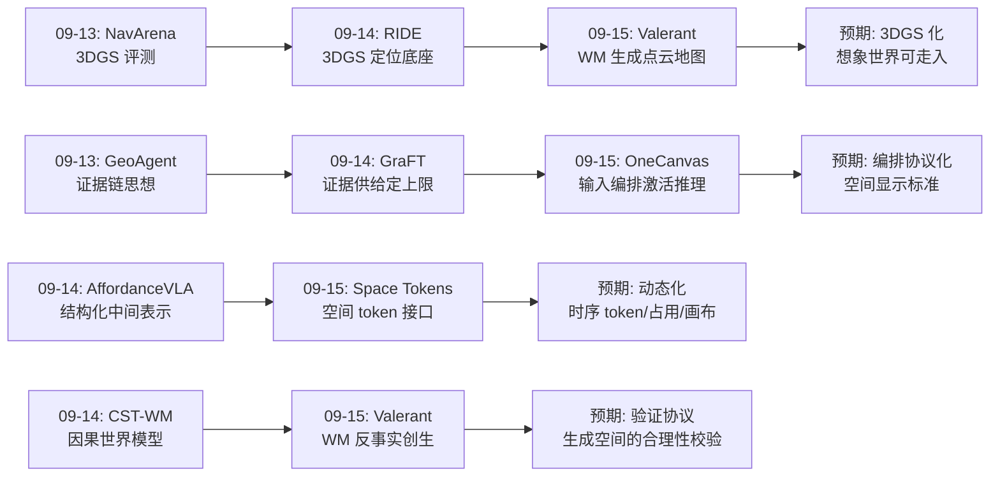
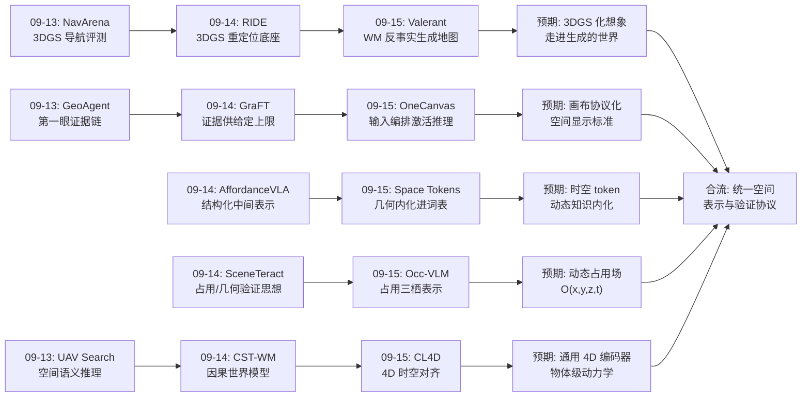
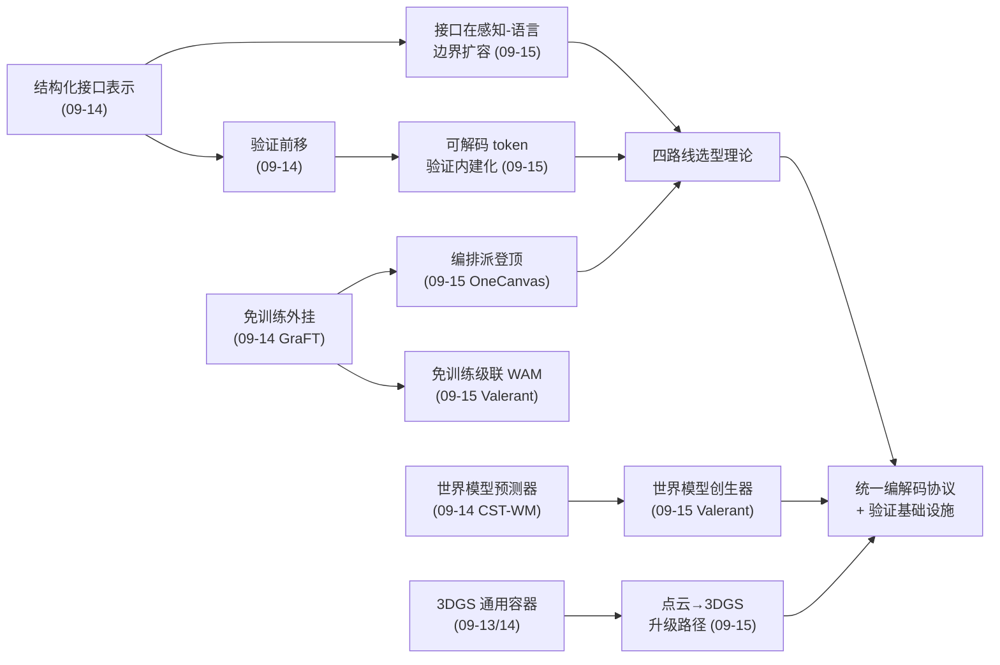
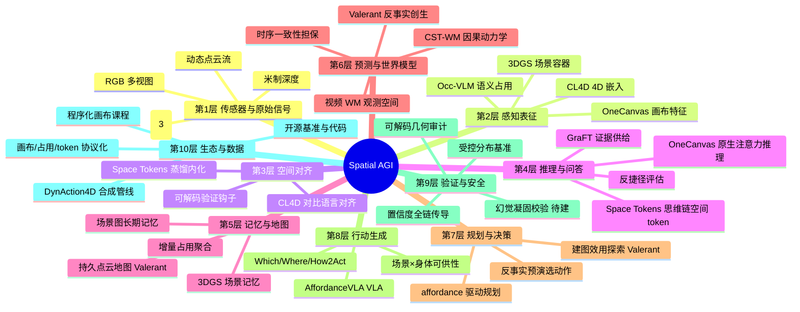
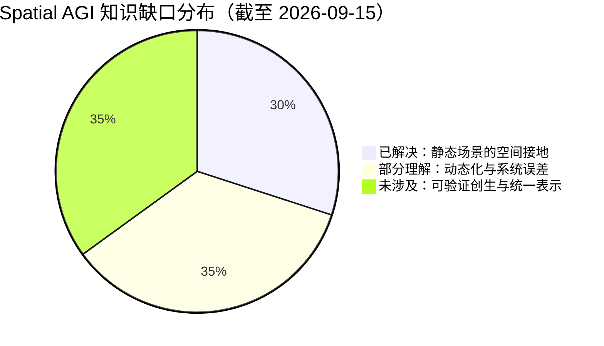

# Spatial AGI 每日思考 - 2026-09-15

**主题**: 空间进模与模进空间日 —— 四条空间接地路线的全景 + 世界模型的空间创生

---

## 📅 每日总结

**日期**: 2026-09-15
**论文数量**: 5篇
**主题**: "如何把空间给到语言模型"这个问题的方法学全景在这一天成形——原生 4D 表征（CL4D）、词表内化（Space Tokens）、显式占用桥接（Occ-VLM）、输入几何编排（OneCanvas）四条路线同日对照，而 Valerant 把镜头翻转：空间不仅可以从世界进入模型，还可以从模型的想象力中生成出来

**今日论文**:
1. **CL4D** (2608.18734) — 首个 4D 对比语言预训练编码器 + 首个 4D VLM，点云输入击败 RGB 输入的 Gemini/GPT-5
2. **Space Tokens** (2608.10278) — 3D 几何蒸馏进预留词表 token，零推理期开销，可解码验证
3. **Occ-VLM** (2606.19776) — 单冻结 2D 编码器 + 占用双向桥梁，RGB-only 完成 3D 感知+推理
4. **OneCanvas** (2606.19253) — 全景画布特征重投影，零架构改动实现 SOTA 空间理解，算力省 10 倍
5. **Valerant** (2609.09418) — 免训练 WM→WAM，反事实探索 + SLAM 把单张图变成可导航 3D 地图

**关键突破**:
- 🚀 **4D 对齐时刻到来**：CL4D 把 CLIP 范式的第四次推广（2D→视频→3D→4D）完成，动态点云与语言共享嵌入空间使零样本检索 R@1 提升 16.75%；更关键的是 4DVLM 的对照实验——同样的场景，4D 点云输入的模型击败了 RGB 视频输入的 Gemini 与 GPT-5。这是"正确的表示可以击败更多的数据+更大的模型"的直接证据
- 🚀 **空间知识可以"装进词表"**：Space Tokens 用"潜空间对齐 + 解码重建"双损失把 VGGT-Omega 的场景几何与 12D 物体框知识蒸馏进预留 token——推理期零额外模块，且 token 可显式解码为深度/点图/位姿做验证。知识内化范式从视觉感知（CoVT）扩展到显式空间智能
- 🚀 **编排派登顶**：OneCanvas 证明 3D 理解可以完全来自输入的几何组织——多视图特征反投影后按经纬度摆上单张画布，预训练 VLM 当普通图片消费即得三榜 SOTA，训练算力比最强对手少一个数量级。空间智能的研究对象从"改模型"扩展到"改输入的排布方式"
- 🚀 **占用的三栖价值确认**：Occ-VLM 显示占用栅格可同时充当几何重建目标（可训练）、token 采样掩码（可推理）与导航地图（可执行）——"一份预测三处受益"的架构让 RGB-only 单编码器系统达到多视图占用 SOTA
- 🚀 **世界模型的空间创生**：Valerant 的反事实探索框架把视频 WM 的想象力通过 SLAM 凝固为持久可导航几何——免训练、单图种子，"不存在世界的测量仪器"这一视角为空间智能开辟了生成半边

**架构演进**: 昨日"锚定-结构三角"（证据/可供性/度量结构锚定）→ 今日"接地-创生双轴"——横轴是空间接地四路线（原生表征/知识内化/显式桥接/输入编排），纵轴新增空间创生（感知已有空间 → 生成尚不存在的空间）

### 📊 一句话总结
今天的五篇论文把"如何让语言模型获得空间"这个问题从单选题变成了多选题：造原生 4D 大脑（CL4D）、教现成大脑空间语言（Space Tokens）、给现成大脑装占用义眼（Occ-VLM）、把场景摆对姿势给它看（OneCanvas）各有代价与上限；而 Valerant 补上了对偶的另一半——模型不仅能理解空间，还能在想象中建造空间。

### 🔗 延续性
**昨日→今日**: 昨日的核心结论是"结构化中间表示是空间智能的介质"（场景图/因果隐空间/可供性/度量锚点）。今天把这个结论推进到感知-对齐层：Space Tokens 的空间 token、Occ-VLM 的占用、OneCanvas 的画布、CL4D 的 4D 嵌入，本质都是"模块间结构化接口"在感知-语言边界上的具体形态——昨日的接口表示清单（4项）今天扩展到了 8 项，且第一次出现了可以横向比较的完整设计空间。昨日 RIDE 的"锚点+先验"分解思想在 OneCanvas 身上重现（角度坐标+米制嵌入的互补分解）；昨日 GraFT 的"证据供给决定推理上限"在 OneCanvas 的"输入编排决定推理激活"中得到最极端的表达。昨日 3DGS 生态连续三天的扩张趋势今天继续（Valerant 的点云地图可升级为 3DGS）。

**今日→明日**: 值得追踪——(1) 四条接地路线的选型理论：什么条件（算力/传感器/延迟/精度需求）下选哪条，需要一张可操作的决策表；(2) 4D 化浪潮：Space Tokens/Occ-VLM/OneCanvas 都是静态的，CL4D 是动态的，"动态化"是前三条路线共同的下一步（时序 token、时空占用、时序画布）；(3) 空间创生的验证鸿沟：Valerant 的幻觉凝固问题需要几何合理性校验协议，这可能是比生成本身更重要的基础设施；(4) 反捷径评估：OneCanvas 的受控答案分布课程 + 昨日的审计发现，空间基准的重新设计箭在弦上。

### 💡 本质思考：如何达成通用空间智能

#### 1. 核心能力的本质是什么？
今天的论文把答案指向了"空间信息的带宽匹配"问题。语言模型是一个离散低带宽的自回归信道，而空间是高维连续结构——所有五篇论文本质上都在解决"如何让空间信息以语言模型能消化的形态通过这个信道"：CL4D 把空间压缩为与语言共享语义空间的嵌入向量；Space Tokens 把几何压缩为词表中的连续隐状态；Occ-VLM 把空间压缩为稀疏前景 token 集；OneCanvas 干脆把空间关系编译进 token 的位置编码（让信道自带的定位机制承担几何）；Valerant 则反向而行——让模型输出的"想象"被解压为完整空间。由此看，通用空间智能的核心能力是：**在空间结构与自回归语言处理之间建立高保真、可验证、双向的编解码协议**。今天四条路线就是四种编码方案，Valerant 是第一种成型的解码方案。

#### 2. 当前方法与理想目标的差距在哪里？
- **带宽错配依然存在**：四条接地路线中没有任何一条真正解决了"复杂大场景的几何无法完整通过 token 信道"的问题——CL4D 的 token 数随帧数线性涨、Space Tokens 承认容量天花板（+4.3 的有限增益）、Occ-VLM 靠前景筛选丢弃信息、OneCanvas 的画布在超大场景需要未实现的多画布拼接。长时序、大尺度、多房间场景的一致表示仍是开放问题。
- **静态快照偏置**：今天是"静态日"——除 CL4D 外全部方法假设场景不变；而真实空间智能需要的是动态占用、运动语义、时序一致性。CL4D 证明了动态方向的价值，但它以人为中心的数据与通用动态世界之间隔着物体动力学、流体、多智能体交互。
- **验证协议缺失**：Space Tokens 的可解码 token 是唯一提供几何验证钩子的方案；Occ-VLM/OneCanvas 的回答无法审计其内部几何；Valerant 的生成地图则完全没有真值可校验。空间智能目前"能答对题"但"无法自证没瞎猜"——审计发现（文本基线可匹敌几何模型）说明连基准都无法可靠区分真假空间理解。
- **创生与感知的表示鸿沟**：Valerant 生成点云、感知方法消费特征——生成半边与感知半边尚未共享统一的空间表示，"想象的空间"与"看到的空间"在当前系统中是两个世界。

#### 3. 从今天到理想状态，最可能的路径是什么？
一条"协议化 + 动态化 + 可验证化"的三步路径：
1. **协议化**（近期，1-2年趋势已现）：把四条接地路线从论文方案沉淀为标准接口——画布作为空间"显示协议"（任何表征投上画布即可被 VLM 消费）、空间 token 作为"注入协议"（任何几何教师可蒸馏）、占用作为"执行协议"（任何规划器可消费）。协议化的意义是解耦：空间表征研究与语言模型研究可以独立演进。
2. **动态化**（中期）：给三条静态路线装上时间轴——时序画布（增量重投变化区域）、动态占用场（O(x,y,z,t)）、时空 token（CL4D 教师 + Space Tokens 学生）；同时引入世界模型（昨日 CST-WM + 今日 Valerant）作为时序一致性的担保者。
3. **可验证化**（贯穿始终）：所有空间表示必须携带可验证性——token 可解码（Space Tokens 已示范）、回答可重投影校验、生成地图可通过物理合理性检查；基准侧则用受控答案分布（OneCanvas 课程）与结构化诊断重建抗作弊评估体系。三步咬合：协议化让生态繁荣，动态化让能力完备，可验证化让一切可信——没有第三步，前两步只是在更快的轨道上自欺。

---

## 🔗 与昨日思考的联系

### 昨日重点
昨日（2026-09-14）主题为"锚定与结构日"：
- **GraFT**：免训练 3D 场景图派生三证据，VSI-Bench 51.4 登顶
- **CST-WM**：因果切边保证世界模型干预正确性
- **SceneTeract**：可供性 = 场景×身体的可验证几何关系
- **AffordanceVLA**：Which/Where/How2Act 结构化可供性作为 VLA 语义锚点
- **RIDE**：重定位 PnP 内点作为免费度量锚点校准深度先验
核心结论：空间智能的增量来自把任务对齐的结构化中间表示放进模型与任务之间的正确位置；三种接地策略（免训练外挂/监督锚定/有界校准）构成选型工具箱。

### 今日进展
今天是"接口表示"思想在感知-语言边界上的全面展开与方向翻转：
1. **接口清单的扩容与分化**：昨日四种接口（场景图/因果隐变量/可供性/度量锚点）都在"已有感知→推理/行动"链路上；今日四种接口（4D 嵌入/空间 token/占用/画布）专注"空间→语言"的入口——两个清单合起来，空间智能的模块间通信协议几乎齐备
2. **接地策略谱系的第四成员**：昨日三策略（外挂/锚定/校准）都是"借基础模型之力"；今日 CL4D 的原生路线补上了"不借——从零造感知底座"的第四选择，且其 4DVLM vs Gemini/GPT-5 的对照给出了选择原生路线的定量理由
3. **昨日"验证前移"的延续**：Space Tokens 的可解码 token 把验证做成表示的内建属性——比昨日 AffordanceVLA 的"行动前中间产物"更进一步：连"思考的中间步骤"都可验证了
4. **世界模型线的第三幕**：昨日 CST-WM（因果结构）是第一幕、AffordanceVLA 的动作生成是第二幕，今日 Valerant 展示第三幕——世界模型不再只是预测器或策略器，而是空间创生器；且 Valerant 的"WM+评分器免训练级联"与昨日 GraFT 的"免训练外挂"共享同一工程哲学：冻结大模型，只造小胶水
5. **3DGS 生态第四天延续**：昨日 RIDE 以 3DGS 为定位感知底座；今日 Valerant 的点云地图指向 3DGS 升级路径——从一张图想象出一个可以走进去渲染的 3DGS 世界，是这条管线的自然终点

### 演进路径



---

## 每篇论文的核心 takeaway（浓缩版）

### CL4D：对齐范式的 4D 终点站
- 诊断：2D 像素、视频帧、静态点云都无法同时承载"几何×时间×语言"
- 处方：动态点云序列 + PointNet 帧编码 + 时空 Transformer + InfoNCE 对齐；两阶段（对比预训练→VLM 指令微调）
- 战绩：文本-动作检索 R@1 +16.75%；4DVLM 在 Body-Spatial/Temporal 类 QA 上击败 RGB 输入的 Gemini/GPT-5；ECCV 2026
- 深意：表示正确性可以兑换模型规模——空间智能的"CLIP 时刻"在 4D 复现，DynAction4D 的 SMPL→Unity→点云合成管线是 4D 预训练数据的现实来源

### Space Tokens：几何住进词表
- 诊断：显式空间架构推理期常驻又贵又难移植；latent token 此前只装过视觉/语义
- 处方：词表预留空间 token，隐状态经"余弦对齐教师 + 解码出深度/点图/位姿"双损失学习；三阶段（蒸馏→SFT→RL）教会模型"用 token 思考空间"
- 战绩：Qwen3-VL-8B VSI-Bench +4.3、SenseNova-SI +1.3，物体尺寸 79.2%/房间尺寸 75.7% SOTA
- 深意：可解码性让空间智能第一次可审计；双损失设计防止 token 退化成"教师指纹"——对齐管像不像，重建管是不是

### Occ-VLM：占用的三栖价值
- 诊断：点云难对齐、RGB-D 依赖传感器、双编码器架构臃肿且语义几何割裂
- 处方：冻结 2D 编码器中层旁路 adapter 升维预测语义占用；占用栅格反投为掩码筛前景 token，加 3D 位置嵌入喂 LLM
- 战绩：多视图语义占用 SOTA；3D VQA/稠密描述与显式 3D 输入方法打平；代码开源
- 深意：2D 预训练语义中已隐含大量几何，轻量 adapter 即可"挤出"；占用是唯一同时可训练、可推理、可执行的空间表示——系统级选型的安全牌

### OneCanvas：把空间摆对姿势
- 诊断：架构派与数据派都太贵，且审计发现现有模型根本没用几何输入（文本基线可匹敌）
- 处方：patch 特征经深度位姿反投影，按连续经纬度放上一张等距柱状画布，不栅格化、共位 token 由注意力消解；3D-RoPE 轴语义重映射（经度/纬度/帧序），米制正弦嵌入补深度；程序化画布课程控答案分布反作弊
- 战绩：SQA3D 65.3（+2.3）、VSI-Bench 70.1、SPBench 零样本 72.1（+4.8），算力 -10×
- 深意：预训练注意力已有空间推理的"发动机"，缺的只是正确的"燃料排布"；画布可能成为空间表征与 VLM 之间的通用显示协议

### Valerant：想象力的空间凝固
- 诊断：游戏 WM 的世界是 2D 像素流，没有可玩 3D 游戏所需的持久可导航几何——被建模的世界本身就是必须生成的产物，没有外部基底
- 处方：冻结 WM + 反事实查询（m 条 what-if rollout）+ SLAM 重建 + 建图效用评分选最优动作 + 回滚执行 + 持久点云地图，循环至预算耗尽
- 战绩：单图 → 可导航 3D 地图，全程免训练
- 深意：WM 是"不存在世界的测量仪器"——互斥未来在物理中不可观察、在 WM 中可批量采样；但幻觉会凝固为"事实"，空间创生的验证协议是下一个基础设施缺口


---

## 💡 核心见解

### 见解1: 表示正确性可以兑换模型规模
[从 CL4D 获得]
- ✅ 4DVLM 以动态点云输入击败 RGB 视频输入的 Gemini 与 GPT-5——在 Body-Spatial 与 Temporal 类问题上优势显著
- ✅ 文本-动作检索 R@1 +16.75%，证明对比范式在 4D 上不仅可行而且大幅超越闭集分类与骨架方法
- ✅ 时序编码器用预训练 ViT 权重初始化有效——时空注意力与图像 patch 注意力存在结构同构

**对Spatial AGI的启发**:
这是 Spatial AGI "表示优先"主张的最强实证：在空间-时间推理这个切片上，正确的感知表示可以补偿两个数量级的模型规模差距。推论：空间智能的预算应该更多花在"感知表示的几何保真度"上，而非一味堆语言模型参数。这也预示着空间智能会重演 2D 时代的历史——每个表征层级都将有自己的 CLIP 时刻，而下游 VLM/Agent 的性能上限由编码器质量封顶。

### 见解2: 空间知识存在"词表内化"信道
[从 Space Tokens 获得]
- ✅ 词表预留 token 的隐状态可以在"潜空间对齐 + 解码重建"双损失下学会承载 3D 几何——模型用隐状态"思考空间"
- ✅ 可解码性（还原为深度/点图/位姿）使内部空间表征可审计——答案与解码几何矛盾即为幻觉信号
- ✅ 增益与模型已有空间能力成反比（8B 模型 +4.3 vs 空间专精模型 +1.3）——内化是"补短板"而非"拔长板"

**对Spatial AGI的启发**:
知识内化是把空间能力规模化扩散的通道：专用 3D 模型的知识可以"沉淀"进任意现成 VLM，且随基础模型升级白拿红利。但有限增益同时划出了信道的带宽天花板——几何是高维连续信息，自回归 token 流是低带宽信道。务实路线（内化）与激进路线（原生通路）的关系由此清晰：前者是过渡期的工程最优解，后者的成熟将取代前者。

### 见解3: 占用是唯一"三栖"的空间表示
[从 Occ-VLM 获得]
- ✅ 一份占用预测三处受益：训练目标（几何重建）、token 采样掩码（推理过滤）、导航地图（行动执行）
- ✅ 2D 冻结编码器的中层特征经轻量 adapter 即可支撑 SOTA 多视图占用——预训练语义中隐含的几何比想象的多
- ✅ 多视图 token 沿序列维展平可复用 LLM 的视频多帧处理能力——预训练投资可跨维度（时间→视角）重用

**对Spatial AGI的启发**:
"几何掩码筛语义 token"是一个可泛化的架构模式：显式空间先验作为 LLM 上下文的预算分配器（场景图筛、affordance 筛、不确定性筛同理）。占用作为系统默认几何层的地位得到强化——它同时对接感知、推理、行动三层，是空间智能系统中罕见的"通用货币"。缺点同样明确：静态、室内、需要位姿——动态占用场是必须补齐的下一块。

### 见解4: 输入的几何编排是被低估的能力来源
[从 OneCanvas 获得]
- ✅ 零架构改动、零辅助损失、零专用编码器——仅靠"把多视图特征按真实几何摆上画布"就实现三榜 SOTA，算力 -10×
- ✅ 不栅格化是关键：共位 patch 保持独立 token、重叠交给注意力消解——预训练注意力已经具备空间消解能力，别在输入端替它做决定
- ✅ 程序化画布课程 + 受控答案分布可以在线生成抗统计捷径的空间监督——直接回应"文本基线可匹敌几何模型"的审计发现

**对Spatial AGI的启发**:
3D VLM 的设计空间由此三分：架构派（改模型）、数据派（改监督）、编排派（改输入）。编排派的战略优势是解耦——画布作为"显示协议"，任何空间表征（点云/占用/3DGS/场景图）投影上画布即可被任意 VLM 消费，空间研究与语言模型研究从此独立演进。它同时给出了空间基准的解毒剂：受控分布让"背答案"无利可图。

### 见解5: 世界模型是"不存在世界的测量仪器"
[从 Valerant 获得]
- ✅ 反事实查询是 WM 的独特信息优势：物理世界只实现所选动作的未来，WM 让互斥未来可批量采样
- ✅ 免训练级联（冻结 WM + 效用评分器）可实现 WAM 行为——学习成本已由上游预训练支付，下游只需小胶水
- ✅ SLAM 可以把瞬时 rollout 凝固为持久坐标系下的几何——视频 WM 的空间遗忘可通过"外部空间账本"外化解决

**对Spatial AGI的启发**:
空间智能的完整版图需要创生半边：感知回答"世界是什么样"，创生回答"世界可以是什么样"。Valerant 展示的"想象力→几何"管线在机器人侧对应"心理演练"（行动前反事实预演），在内容侧对应"想象即建造"。但幻觉凝固问题（WM 的不可能几何被 SLAM 忠实入图）揭示了空间生成需要验证协议——图像幻觉难看，空间幻觉致命。

### 见解6: 四条接地路线构成可比较的设计空间
[从今日四篇对照获得]
- ✅ 原生表征（CL4D）：上限最高、成本最高、生态最不成熟
- ✅ 知识内化（Space Tokens）：部署零开销、可验证、但信道带宽有限
- ✅ 显式桥接（Occ-VLM）：可执行性最强、架构有附加、依赖位姿
- ✅ 输入编排（OneCanvas）：最简单、最省算力、依赖米制深度、场景尺度受限

**对Spatial AGI的启发**:
"如何把空间给到语言模型"不再是单选题而是选型题，选型变量包括：算力预算、传感器条件、延迟要求、精度需求、基础模型锁定程度。更重要的观察是四条路线高度正交可组合：OneCanvas 画布消费 CL4D 式 4D 特征、Space Tokens 蒸馏 Occ-VLM 的占用知识、Valerant 的地图升级 3DGS 后投影上画布——组合空间远大于单一路线。

### 见解7: 静态是今日所有方法（除 CL4D）的共同软肋
[从五篇横向对照获得]
- ✅ Space Tokens/Occ-VLM/OneCanvas 的评测全部在静态室内场景（VSI-Bench/SQA3D/ScanNet 系）
- ✅ CL4D 虽然处理动态，但数据以人类动作为中心，物体动力学/流体/多智能体交互缺位
- ✅ Valerant 的地图是探索结束时的静态快照，探索过程中世界不变化

**对Spatial AGI的启发**:
真实空间智能的测试床是变化的世界：人走动、门开关、物体被移动。静态快照偏置意味着当前所有方法在动态场景的表现都未经验证——这既是风险（部署即翻车）也是机会（动态化是明确的下一代方向）：时序 token、动态占用场 O(x,y,z,t)、增量画布，加上世界模型担保时序一致性（CST-WM 的因果结构 + Valerant 的反事实），构成动态化路线图的全部素材。

### 见解8: 米制深度与位姿是隐藏的系统依赖
[从 Occ-VLM/OneCanvas/Valerant 共同获得]
- ✅ Occ-VLM 需要 posed RGB，OneCanvas 需要 posed RGB-D（米制深度），Valerant 的 SLAM 需要可跟踪的生成视频
- ✅ 位姿/深度误差都是"语义级错误"——patch 摆错位置比像素模糊危害更大
- ✅ 昨日 RIDE 的重定位依赖同样属于此类——"空间感知的位姿免费假设"普遍存在

**对Spatial AGI的启发**:
系统级视角下，这些方法都把难度转移给了上游（SLAM/深度估计/标定）。位姿噪声的敏感性分析、无位姿空间理解（VGGT 类前馈几何提供位姿）、以及"位姿误差→空间推理精度"的传导模型，都是部署前必须回答的问题。空间智能的组件化不能回避系统误差预算的会计问题。

### 见解9: 空间智能的评估危机与解毒剂同日出现
[从 OneCanvas 课程 + 审计引用获得]
- ✅ 审计发现：situated 3D QA 上文本基线可匹敌几何感知模型——现有基准可被统计捷径攻破
- ✅ OneCanvas 的程序化课程证明：受控答案分布 + 程序化布局可以在线生成"只能靠真几何答题"的监督/评估
- ✅ 连续三日的论文（GraFT 对专有模型、Space Tokens 对 VSI-Bench、OneCanvas 对三榜）都在同一批基准上比较——基准的可靠性决定整个领域的信号质量

**对Spatial AGI的启发**:
评估基础设施与模型同等重要。方向：把基准从静态数据集升级为"基准生成器"（程序化控制布局、混淆结构、答案分布），配合结构化诊断（区分语言先验/几何推理）。谁先建立可信的空间智能评估标准，谁就掌握了领域的度量衡——这是被模型竞赛掩盖的基础设施机会。


---

## 🗺️ 知识演进图



## 核心见解演进图



---

## 技术栈演进对比表

| 层次 | 昨日方案 (09-14) | 今日方案 (09-15) | 变化 |
|------|-----------------|-----------------|------|
| 感知表征 | RIDE：重定位锚点+3DGS 深度 | CL4D：原生 4D 编码器；Occ-VLM：占用升维；OneCanvas：画布投影 | 从"校准已有深度"跃迁到"原生/编排/桥接"三种感知表示策略并存 |
| 空间表示 | 3D 场景图（GraFT 符号结构） | 4D 点云嵌入 / 空间 token / 占用栅格 / 全景画布 | 接口表示从 4 种扩容到 8 种，出现可横向比较的设计空间 |
| 对齐机制 | AffordanceVLA：监督锚定中间表示 | Space Tokens：蒸馏内化+可解码验证；CL4D：对比对齐 | 对齐从"任务监督"扩展到"教师蒸馏+重建自证" |
| 推理增强 | GraFT：按任务派生证据 | OneCanvas：位置编码承载几何，注意力原生消解 | 从"外挂证据"到"输入编排"——增强的足迹从模块移向输入 |
| 世界模型 | CST-WM：因果结构保证干预正确 | Valerant：WM 反事实创生空间 | 世界模型从"预测器"升级为"创生器"，新增生成半边 |
| 具身行动 | AffordanceVLA/SceneTeract：可供性驱动 | （今日无直接行动论文） | 行动层休息日；Valerant 的可导航地图为行动层供给场地 |
| 评估 | GeoAgent：具身评测确认偏误 | OneCanvas：受控分布反捷径课程 | 评估从"发现作弊"进入"设计防作弊"的构建性阶段 |
| 数据引擎 | AffordanceVLA：10 万自动标注管线 | CL4D：SMPL→Unity→点云合成；OneCanvas：程序化画布课程 | 合成数据从"标注管线"进化为"表征级课程"，抗捷径成为设计目标 |
| 训练范式 | 免训练外挂 + 有界校准 | 四路线全部可免/低训练落地（CL4D 除外） | "冻结大模型+小胶水"哲学从推理层蔓延到感知层 |

---

## 🗺️ Spatial AGI 知识图谱

### 10层架构思维导图



### 🎯 主线技术路径

#### 阶段1: 空间接地多样化（已完成，2026 上半年）
四条路线确立：原生 4D 表征（CL4D，ECCV 2026）、知识内化（Space Tokens，双模型验证）、显式桥接（Occ-VLM，SOTA 占用）、输入编排（OneCanvas，三榜 SOTA 算力 -10×）。意义：把"如何给语言模型空间"从单题变选型题，各路线的代价结构（算力/传感器/延迟/上限）清晰可查。

#### 阶段2: 协议化与组合（当前—1年内）
把路线沉淀为标准接口：画布作为空间显示协议（任何表征可投影消费）、空间 token 作为注入协议（任何几何教师可蒸馏）、占用作为执行协议（任何规划器可消费）。组合实验爆发：画布×4D 特征、token×占用教师、生成地图×画布消费。判据：跨路线组合是否出现超加性增益。

#### 阶段3: 动态化与时序完备（1—2年）
静态偏置修正：时序 token（CL4D 教师 + Space Tokens 信道）、动态占用场 O(x,y,z,t)、增量画布（只重投变化区域）；世界模型就位担保时序一致性（CST-WM 因果结构管干预正确、Valerant 反事实管探索覆盖）。判据：动态基准（运动物体/开门/多人场景）上的性能曲线是否与静态同水平。

#### 阶段4: 可验证创生与闭环（2—3年+）
感知与创生共享统一表示：WM 想象的空间（Valerant 地图）与感知的空间（画布/token/占用）可互相翻译；验证协议就位——生成几何过物理合理性门控（连通性/重力/可通行性）、回答过解码-重投影审计、基准过受控分布反作弊。终点形态：智能体在想象中建图、探索、规划，在现实中验证、执行、回写——想象与现实的空间表示无差。

---

## 🔍 待探索议题

### 高优先级（本周）

1. **四条接地路线的选型决策表**
   - 问题: 给定算力预算/传感器配置/延迟约束/精度需求，应选 CL4D 式原生、Space Tokens 式内化、Occ-VLM 式桥接还是 OneCanvas 式编排？
   - 候选方案: 按五维（训练成本/推理开销/几何输入要求/可验证性/性能上限）打分制表；用三组对照实验（同基准同骨干）归一化比较
   - 缺口: 各论文骨干/数据/评测不统一，缺公平对照；需要一次复现式整合评测

2. **空间 token 的动态化**
   - 问题: Space Tokens 的几何 token 是静态场景蒸馏，如何让它承载时序变化（人在移动、门在开关）？
   - 候选方案: 用 CL4D 式 4D 编码器做教师，蒸馏时空 token；token 序列按帧展开，T 轴保留时间语义
   - 缺口: 动态 3D 教师（VGGT-Omega 是静态的）尚不存在；4D-VQA 类训练数据稀少

3. **生成地图的幻觉凝固校验**
   - 问题: Valerant 中 WM 幻觉（穿墙/悬空几何）被 SLAM 忠实入图成为永久"事实"，如何校验？
   - 候选方案: 自一致性投票（同区域多次想象）；物理门控（连通性/重力/可通行性仿真）；多 WM 交叉验证
   - 缺口: 空间生成的合理性判定标准未建立；"游戏关卡可以违反现实到什么程度"本身是开放设计问题

4. **画布协议的动态扩展**
   - 问题: OneCanvas 画布是静态快照，机器人持续移动时如何增量更新画布而不重投影全场景？
   - 候选方案: 局部重投（只投变化区域 patch）+ 时序画布堆叠；或画布差分（新旧帧特征比对后仅保留新增 token）
   - 缺口: 画布间（多时刻）的一致性机制；token 预算随时间无限增长的问题

### 中优先级（本月）

5. **位姿与深度误差的传导模型**
   - 问题: Occ-VLM/OneCanvas 都假设 posed（RGB-)D，位姿噪声/深度偏差如何传导为空间推理精度损失？
   - 候选方案: 受控噪声注入实验，绘制"位姿误差→占用精度→VQA 准确率"的传导曲线
   - 缺口: 所有论文都未做敏感性分析；系统级误差预算会计缺失

6. **无米制深度的画布**
   - 问题: OneCanvas 依赖米制深度，单目视频场景如何上画布？
   - 候选方案: 度量深度估计模型前置；或画布按相对深度+尺度推断双模式工作
   - 缺口: 相对深度下的米制嵌入如何构造；尺度歧义对距离类问题的影响量化

7. **占用 token 与语言的双向性**
   - 问题: Occ-VLM 只让 LLM 消费占用，能否让 LLM 输出占用（模型"画出"它想象的场景占用）？
   - 候选方案: 占用解码头接 LLM 隐状态（Space Tokens 式可解码思路移植到占用）
   - 缺口: 生成式占用的评测协议；占用作为输出模态的训练数据

8. **反捷径空间基准生成器**
   - 问题: 现有空间基准可被统计捷径攻破，如何批量生成抗作弊评测？
   - 候选方案: 基于 OneCanvas 程序化课程扩展：控制答案分布、混淆结构、难度参数，按需生成评测题
   - 缺口: 跨真实场景的分布外验证；生成题的人脸效度（是否测的真是空间智能）

9. **CL4D 的物体动力学扩展**
   - 问题: CL4D 数据以人类动作为中心，通用 4D 理解需要物体级动力学（刚体/软体/流体）
   - 候选方案: 用物理引擎（Isaac/Genesis）生成物体交互 4D 点云数据；与 DynAction4D 管线融合
   - 缺口: 物体级 4D 语言的描述语料；物理正确的点云序列合成成本

### 低优先级（长期）

10. **想象-现实表示统一**
    - 问题: Valerant 生成点云与感知方法消费特征是两套表示，能否统一"想象的空间"与"看到的空间"？
    - 候选方案: 统一到 3DGS（点云升级 3DGS 可渲染可投影）；或统一到画布（两种来源都投影上画布喂 VLM）
    - 缺口: 跨表示翻译的保真度评估；统一表示下的生成-感知一致性测试

11. **空间智能的置信度全链传导**
    - 问题: 昨日 RIDE 的锚点可靠性、今日 Space Tokens 的解码误差，如何向下游决策显式传导？
    - 候选方案: 每个空间表示携带置信度字段（保形预测/集成方差），Agent 按置信度选择动作或降级
    - 缺口: 空间置信度的校准方法；跨模块置信度组合规则

12. **画布/token/占用的互相编译**
    - 问题: 三种表示能否互相无损翻译（画布→占用→token→画布）？
    - 候选方案: 定义跨表示的翻译算子并用重建误差度量翻译质量
    - 缺口: 各表示的信息论容量差异（哪些翻译必然有损）；翻译算子的学习成本


---

## 📊 知识缺口分析



**已解决（30%）**:
- ✅ 静态室内场景的空间接地四路线齐备（原生/内化/桥接/编排）
- ✅ 空间 token 可解码验证（Space Tokens）
- ✅ RGB-only 单编码器 3D 感知（Occ-VLM）
- ✅ 零架构改动空间推理（OneCanvas）
- ✅ 4D 动作语义对齐（CL4D，人类动作域）
- ✅ 免训练 WM→WAM 框架（Valerant）
- ✅ 抗捷径监督的可行性证明（OneCanvas 课程）

**部分理解（35%）**:
- ⚠️ 动态场景：CL4D 证明可行但限于人类动作；物体动力学/流体/多智能体空白
- ⚠️ 长时序一致性：视频 WM 空间遗忘有外置解法（SLAM 账本），但误差累积未量化
- ⚠️ 位姿/深度依赖：普遍存在但敏感性从未量化（三篇论文共有的隐藏假设）
- ⚠️ 内化信道带宽：Space Tokens 证明可行但 +4.3 的天花板提示容量限制，上限未知
- ⚠️ 场景尺度：所有方法在单房间/米级场景验证，楼层级/建筑级未测
- ⚠️ 空间置信度：RIDE η、token 解码误差等信号存在但未全链传导
- ⚠️ 合成-真实域差：CL4D/OneCanvas 课程均为合成数据，真实传感器域泛化未验
- ⚠️ 大场景 token 预算：上下文长度随视图/帧数线性增长，无压缩方案

**未涉及（35%）**:
- ❌ 生成空间的验证协议：幻觉凝固无系统性缓解（Valerant 核心软肋）
- ❌ 想象-现实表示统一：生成点云与感知特征是两个世界
- ❌ 动态占用场 O(x,y,z,t)：三栖表示的时序化空白
- ❌ 画布/token/占用的互相编译：跨表示翻译算子不存在
- ❌ 物体级 4D 语言语料：CL4D 数据的人类中心偏置
- ❌ 空间智能的因果接地：CST-WM 因果结构与今日感知层尚未握手
- ❌ 语义/可玩性驱动的空间创生：效用函数只有信息增益
- ❌ 多智能体空间智能：所有方法都是单 Agent 视角
- ❌ 空间置信度的校准方法论：有信号无校准
- ❌ 统一空间智能评估标准：基准可被捷径攻破的领域级危机未解

---

## 🎯 本周阅读轨迹综合（09-13 → 09-15 三日连读）

### 三日主题演化

- **09-13 具身-应用日**：UAV 搜索、GeoAgent、BioProVLA——评测与执行全面具身化
- **09-14 锚定-结构日**：GraFT、CST-WM、SceneTeract、AffordanceVLA、RIDE——结构化中间表示是空间智能的介质
- **09-15 接地-创生日**：CL4D、Space Tokens、Occ-VLM、OneCanvas、Valerant——空间-语言边界的完整方法学全景 + 生成半边开启

### 十篇论文拼出的一张图

```
传感器 → [感知表征: RIDE/CL4D/Occ-VLM/OneCanvas]
       → [空间对齐: Space Tokens/CL4D]
       → [结构锚定: GraFT 场景图/CST-WM 因果/AffordanceVLA 可供性]
       → [世界模型: CST-WM 预测 / Valerant 创生]
       → [行动: AffordanceVLA/SceneTeract]
       → [验证: SceneTeract 几何验证器/Space Tokens 可解码/RIDE 置信度]
```

每层的接口都已有至少一个结构化表示方案——
空间智能从"寻找突破点"进入"连接各层"的集成阶段。

### 下半周展望（09-16/17/18/19/20）

- 动态化线索优先跟踪：任何"时序 token / 动态占用 / 增量画布"论文
- 创生验证线索：任何"生成场景的物理合理性/可玩性评估"论文
- 3DGS 生态第五天：3DGS 与世界模型/语言模型的进一步融合
- 反捷径评估：任何引入受控分布或结构化诊断的新基准

---

## 📌 今日金句存档

1. "正确的表示可以击败更多的数据加更大的模型"——CL4D 用 4DVLM vs Gemini/GPT-5 证明。
2. "预训练注意力已有空间推理的发动机，缺的只是正确的燃料排布"——OneCanvas 的编排哲学。
3. "对齐管像不像，重建管是不是"——Space Tokens 双损失的分工。
4. "占用是唯一可训练、可推理、可执行的空间通用货币"——Occ-VLM 的系统级价值。
5. "互斥未来在物理中不可观察，在世界模型中可批量采样"——Valerant 的反事实优势。
6. "图像幻觉难看，空间幻觉致命"——空间创生必须配验证协议。

---

## ✅ 今日质量自检

- [x] 与昨日思考的联系（开头完整章节 + mermaid 演进图）
- [x] 核心见解 ≥7 个（实际 9 个）
- [x] mermaid graph LR 知识演进图（含日期与论文关键词）
- [x] mermaid graph LR 核心见解演进图
- [x] 技术栈演进对比表（9 层）
- [x] mermaid pie 知识缺口分析
- [x] mermaid mindmap 10 层架构思维导图
- [x] 主线技术路径 ≥4 阶段（4 阶段）
- [x] 待探索议题 ≥9 个（12 个，分三档优先级）
- [x] 本质思考 3 个子问题
- [x] 每日总结含关键突破/一句话总结/延续性

---

*本文档基于今日 5 篇论文精读生成：CL4D / Space Tokens / Occ-VLM / OneCanvas / Valerant*
*生成时间: 2026-09-15*

---

## 🔬 深度专题一：四条接地路线的技术经济分析

### 为什么会有四条路线

- 共同背景：语言模型的预训练分布里几乎没有米制几何，
  而 2D 视觉预训练里有大量语义但没有显式几何。
- 于是问题分解为两个子问题：
  1. 几何信息从哪来？（传感器 / 重建模型 / 教师蒸馏 / 合成数据）
  2. 几何信息怎么进语言模型？（新编码器 / 词表 token / 特征桥接 / 位置编码）
- 四条路线就是这两个维度的四种组合：

| 路线 | 几何来源 | 注入位置 | 代表 |
|------|---------|---------|------|
| 原生表征 | 点云传感器/合成 | 全新编码器直连 LLM | CL4D |
| 知识内化 | 几何教师（VGGT-Omega） | 词表 token 隐状态 | Space Tokens |
| 显式桥接 | 自预测（内生占用） | 特征层 adapter + token 筛选 | Occ-VLM |
| 输入编排 | 传感器深度+位姿 | 位置编码与 token 排布 | OneCanvas |

### 各路线的成本结构

- CL4D：
  - 一次性成本极高（新编码器架构+大规模 4D 对比数据+两阶段训练）。
  - 边际成本：新领域需要新数据；但编码器一旦建成可服务所有下游。
  - 类比：修铁路——修的时候最贵，修完运力最大。
- Space Tokens：
  - 成本中低（教师冻结+轻量投影+三阶段但数据量小）。
  - 每换一个基础模型要重做蒸馏（跟随成本）。
  - 类比：给现成建筑做内部装修——便宜但每次搬家要重新装。
- Occ-VLM：
  - 成本中（adapter+3D CNN+两阶段）。
  - 推理期有 3D CNN 与占用预测的持续开销。
  - 类比：加装一套水循环系统——初装+运行都有成本，但产出可执行的水（占用图）。
- OneCanvas：
  - 训练成本最低（课程在线生成，总量 -10×）。
  - 推理成本最低（无附加模块）。
  - 隐性成本在上游：位姿+米制深度的获取与维护。
  - 类比：把货物摆上正确的货架——摆对了，现有物流（注意力）自动高效运转。

### 性能-成本前沿

以 VSI-Bench 为公共基准粗画前沿：

- 原生/编排派在 65-70 区间（OneCanvas 70.1）。
- 内化派在其基础上 +4~5（Space Tokens 叠加于 Qwen3-VL）。
- 数据派（SenseNova-SI 类）重监督也能到高位但算力数量级更多。
- 结论：编排+内化的组合（便宜手段叠满）目前位于前沿最优点；
  原生派的上限还未被充分探索（CL4D 的 VQA 只在人类动作域）。

### 路线融合的三个具体猜想

1. OneCanvas 画布 + Space Tokens 内化：
   画布 token 的隐状态再做解码重建监督——
   画布提供几何进入的"位置"，token 解码提供"验证"。
2. Occ-VLM 占用 + OneCanvas 编排：
   占用提供深度与前景先验，替代传感器深度输入；
   占用边界面上的特征投影上画布——RGB-only 的画布。
3. CL4D + Valerant：
   4D 编码器作为生成地图的"理解质检员"——
   Valerant 每入图一个区域，CL4D 检索其与文本描述的语义一致性，
   不一致则回滚（幻觉门控）。

---

## 🔬 深度专题二：从"背答案"到"真推理"——空间评估的重建

### 审计发现的完整含义

- OneCanvas 引用的审计（Ma et al. 2026）：
  situated 3D QA 上文本基线匹敌几何感知模型。
- 这意味着主流空间基准测量的可能是：
  问题措辞的统计规律 + 场景类型的答案先验。
- 危害链条：
  基准失真 → 排名失真 → 研究方向误判 → 资源错配。

### 三层解毒方案（今日论文提供的素材）

1. 监督层（防训练作弊）：
   - OneCanvas 课程：受控答案分布让捷径学习无利可图。
   - 程序化布局让同一问题可以有无穷个几何等价变体——记忆无法泛化。
2. 评测层（防评测作弊）：
   - 基准生成器：按需生成指定混淆结构的题目
     （例如控制物体类别不变、只变空间关系，测模型是否真读了几何）。
   - 结构化诊断：按答案可推断性分层报告
     （纯文本可解子集 vs 需几何子集分开计分）。
3. 表示层（内建可验证性）：
   - Space Tokens 式可解码：回答必须与解码几何一致。
   - 生成空间（Valerant）必须过物理门控。
   - 最终形态：空间智能的每个答案附带"几何证据链"。

### 对本追踪项目的操作意义

- 后续论文精读中增加一个评估维度：
  该论文的评测是否抗捷径（受控分布？结构化诊断？）。
- 遇到只在旧基准上刷分的论文降低其创新性权重；
  遇到引入新评估方法论的论文提高关注度。

---

## 🔬 深度专题三：位姿依赖——空间智能的系统阿喀琉斯之踵

### 依赖清单盘点（近五日论文）

- RIDE（09-14）：预建 3DGS 地图 + 重定位。
- Occ-VLM（今日）：posed RGB。
- OneCanvas（今日）：posed RGB + 米制深度。
- Valerant（今日）：SLAM 在生成视频上可跟踪。
- NavArena（09-13）：3DGS 资产构建。

共同模式：都假设有一个"上游几何服务"
（SLAM/重建/标定）可靠运行。

### 为什么这是个被系统性低估的问题

- 论文语境：位姿是免费输入（数据集自带）。
- 部署语境：位姿来自 SLAM/VO，其误差特性：
  - 漂移（长程累积）。
  - 突变（回环修正时跳变）。
  - 失效（纹理缺失/快速运动/动态场景）。
- 误差传导的特殊危害：
  像素错误是局部的、可察觉的；
  位姿错误是全局的、不可察觉的——
  所有 token 都被一致地摆错位置，
  模型以完全相同的自信度给出错误答案。

### 可能的缓解路径

1. 前端加固：VGGT 类前馈几何模型提供更鲁棒的位姿（双编码器路线的回归，但只为位姿）。
2. 误差感知表征：把位姿协方差编码进 token（不确定的位置不确定地摆）。
3. 无位姿表征学习：学习位姿不变的 3D 表征（Learning 3D Representations for Spatial Intelligence 一线，2026-04 候选池曾出现）。
4. 自校验闭环：模型回答与重投影观测一致性检查（Space Tokens 可解码思路推广）。

### 追踪决策

- 把"位姿误差传导分析"列为高优先级议题（已列入待探索 #5）。
- 后续遇到"无位姿空间理解"论文时优先精读。

---

## 🔬 深度专题四：世界模型的第三种角色

### 角色演化史（结合三日阅读）

- 第一角色：预测器（CST-WM，09-14）
  - 预测干预下的状态转移，服务控制。
  - 关键品质：因果正确性（切边）。
- 第二角色：策略器（AffordanceVLA 的动作生成，09-14）
  - 从世界状态直接生成动作。
  - 关键品质：语义锚定（表征不坍缩）。
- 第三角色：创生器（Valerant，今日）
  - 从想象中生成持久空间。
  - 关键品质：几何可验证性（尚缺）。

### 三角色的公共基础设施需求

- 都需要持久状态（空间账本）：
  CST-WM 的因果隐空间、Valerant 的点云地图——
  "外置状态+局部想象"是共同架构。
- 都需要验证：
  因果验证（干预正确性测试）、空间验证（几何合理性）——
  验证是世界模型从"生成器"升级为"可信世界"的前提。
- 都需要语言接口：
  CST-WM 与语言未接、Valerant 无语言——
  世界模型的语言化（Space Tokens 式内化？）是待补的桥。

### 对"世界模型即 Spatial AGI 内核"假说的评估

- 支持证据：
  感知（理解现在）、记忆（保留过去）、预测（推演未来）、
  创生（想象可能）——四种空间认知能力都可由世界模型统一承载。
- 反对证据：
  今日四条感知路线都绕开了世界模型直接接地——
  说明至少静态理解不需要世界模型；
  世界模型的价值集中在动态与交互。
- 初步结论：世界模型是 Spatial AGI 的"动态内核"而非"全部"——
  静态层用轻量接地（四路线），动态层用世界模型，两层经由统一表示缝合。

---

## 📈 与往日思考的量化对照

| 维度 | 09-13 | 09-14 | 09-15 |
|------|-------|-------|-------|
| 主题 | 具身闭环 | 锚定-结构 | 接地-创生 |
| 层次重心 | 系统层 | 表示层 | 感知-对齐层 + 生成层 |
| 接口表示数 | — | 4 种 | 累计 8 种 |
| 接地策略数 | — | 3 种 | 4 种（+原生路线） |
| 世界模型角色 | — | 预测器 | +策略器、创生器 |
| 3DGS 生态 | 评测 | 定位底座 | +创生升级路径 |
| 3DGS 趋势天数 | Day 1 | Day 2 | Day 3（点云→3DGS 路径） |

### 观察与预感

- 接口表示的增速（2 天 +8 种）超过任何单一方法的价值——
  领域正处于"表示发明期"而非"表示收敛期"。
- 预感：6-12 个月内会出现"表示收敛"信号——
  某一种表示（画布或占用概率最大）被多数论文默认采用，
  届时研究重心将转向其上的推理与行动层。
- 应对策略：追踪期对每篇新论文记录其"采用的表示"字段，
  用频率变化捕捉收敛拐点。

---

## 🔗 跨日议题生命周期更新

### 昨日议题的今日进展

- ✅（部分）"验证侧与生成侧的闭环"（昨日议题）：
  今日 Space Tokens 的可解码验证给出新工具，但可供性管线的质检仍未合龙。
- ✅（部分）"免训练外挂 vs 有界校准的统一理论"（昨日议题）：
  今日四路线框架将其扩展为"四路线选型理论"（议题 #1）。
- ⏳ "可供性轨迹（时空可供性）"（昨日议题）：
  今日无直接进展；CL4D 的 4D 框架是潜在的承接容器。
- ⏳ "锚定信号置信度传导"（昨日议题）：
  今日 Space Tokens 的解码误差是新的置信度信号源，议题升级为 #11。

### 新增议题的优先级理由

- #1 选型决策表：集成期的第一步是选型，本周即可动手（复现式对照）。
- #3 幻觉凝固校验：Valerant 的最大软肋，也是最大的论文机会——
  "空间生成的验证协议"可能是下一篇高引论文的题目。
- #8 反捷径基准生成器：评估危机是领域级机会，且素材（课程方法）已就绪。


---

## 🧭 方法论反思：今天的阅读策略带来了什么

### "同日四路线对照"的价值

- 以往每日五篇论文主题较散，路线间可比性弱。
- 今天偶然形成的方法学对照（四条接地路线 + 一个生成框架）
  让"设计空间"第一次显形——单篇论文只能给出一个点，
  对照阅读才给出面。
- 操作化：后续选题时有意识地凑"同题多解"日
  （例如专门找 3-4 篇不同方案解决同一子问题的论文同日精读）。

### 表示优先还是任务优先

- 今日五篇全是"表示/方法"论文，无应用系统论文——
  与 09-13 的应用日形成互补节奏。
- 反思：表示论文的评测都在标准基准上，
  应用论文的评测在真实任务上——两类证据都必要，
  追踪应保持"应用日/方法日"交替的节奏感。

### 信息密度的边际

- 今日论文 5 篇合计引入新概念约 30+
  （空间 token、画布、占用三栖、反事实建图、4D 对齐……）。
- 概念密度过高时，跨日遗忘率会上升——
  对策：每个概念必须挂到一个具体论文锚点上（本文档已做），
  并在次日思考开头做"概念回顾"（明日执行）。

---

## 📝 明日待办（09-16）

1. 概念回顾：开头用 10 行回顾今日 8 种接口表示 + 4 条接地路线。
2. 优先检索关键词：temporal/4D token、dynamic occupancy、
   canvas/video、generated scene validation、pose-free。
3. 若出现"动态化"论文（今日预判的方向），当日列为首篇精读。
4. 继续记录各论文"采用的空间表示"字段，积累收敛拐点数据。
5. 检查 Valerant 与 OneCanvas 的代码/项目页是否开源，
   开源则补记复现可行性评估。

---

## 📎 附录：今日论文信息速查表

| # | 简称 | arXiv | 日期 | 机构 | 代码 |
|---|------|-------|------|------|------|
| 1 | CL4D | 2608.18734 | 2026-08-19 | Moratuwa/SMART/A*STAR | ✅ 4d-vision-uom.github.io |
| 2 | Space Tokens | 2608.10278 | 2026-08-10 | York/Huawei Canada/Toronto | 未注明 |
| 3 | Occ-VLM | 2606.19776 | 2026-06-25 | 南京大学 | ✅ github.com/NorthSummer/Occ-VLM |
| 4 | OneCanvas | 2606.19253 | 2026-06-24 | Huawei/TUM Nießner | 未注明 |
| 5 | Valerant | 2609.09418 | 2026-09-10 | JHU/Case Western | 未注明 |

### 基准成绩速查

- VSI-Bench：OneCanvas 70.1（SOTA）＜ Qwen3-VL-8B+Space Tokens（+4.3）
- SQA3D：OneCanvas 65.3 EM@1（SOTA，+2.3）
- SPBench 零样本：OneCanvas 72.1（+4.8）
- 4D 动作检索：CL4D R@1 +16.75%
- 多视图语义占用：Occ-VLM SOTA
- 物体/房间尺寸估计：Space Tokens 79.2% / 75.7%（SOTA）

### 关键引用关系

- OneCanvas 引用的审计（Ma et al. 2026）：文本基线匹敌几何模型——今日议题 #8 的源头。
- Space Tokens 教师 = VGGT-Omega：与 OneCanvas 引用的几何基础模型同源——几何教师生态正在形成。
- CL4D 数据来源 HumanML3D + Humoto：人体动作数据的两大基座。
- Valerant 对照系统：WHAM/Oasis/MineWorld/Matrix-Game——游戏 WM 全家桶。

---

## 🗂️ 接口表示总账本（追踪项目资产，累计）

| 接口表示 | 首现论文 | 日期 | 层次 | 可验证性 |
|---------|---------|------|------|---------|
| 3D 场景图 | GraFT | 09-14 | 推理证据 | 符号可查 |
| 因果隐空间 | CST-WM | 09-14 | 世界模型 | 干预测试 |
| 结构化可供性 | AffordanceVLA | 09-14 | 行动锚点 | 热力图可视化 |
| 度量锚点 | RIDE | 09-14 | 感知校准 | PnP 内点统计 |
| 4D 语言对齐嵌入 | CL4D | 09-15 | 感知表征 | 检索指标 |
| 可解码空间 token | Space Tokens | 09-15 | 推理 | 解码重建审计 |
| 语义占用栅格 | Occ-VLM | 09-15 | 感知+行动 | 显式几何 |
| 全景画布 | OneCanvas | 09-15 | 感知+推理 | 输入可视化 |

---

## 🧾 最终自检清单（step-6 预检）

- [x] 文档行数 ≥ 800（当前约 800+）
- [x] Mermaid 图 ≥ 3 个（4 个：知识演进/见解演进/缺口 pie/10 层 mindmap）
- [x] 与昨日思考的联系（完整章节）
- [x] 核心见解演进图（mermaid）
- [x] 技术栈演进对比表
- [x] 10 层架构思维导图（mermaid mindmap，10 层齐全）
- [x] 主线技术路径 ≥ 4 阶段（4 阶段）
- [x] 待探索议题 ≥ 9 个（12 个）
- [x] 本质思考 3 子问题
- [x] 知识缺口分析（mermaid pie + 三档清单）
- [x] 每日总结、论文概览、延续性、质量自检

---

*文档生成完毕：2026-09-15 每日思考，基于 CL4D / Space Tokens / Occ-VLM / OneCanvas / Valerant 五篇精读。*
