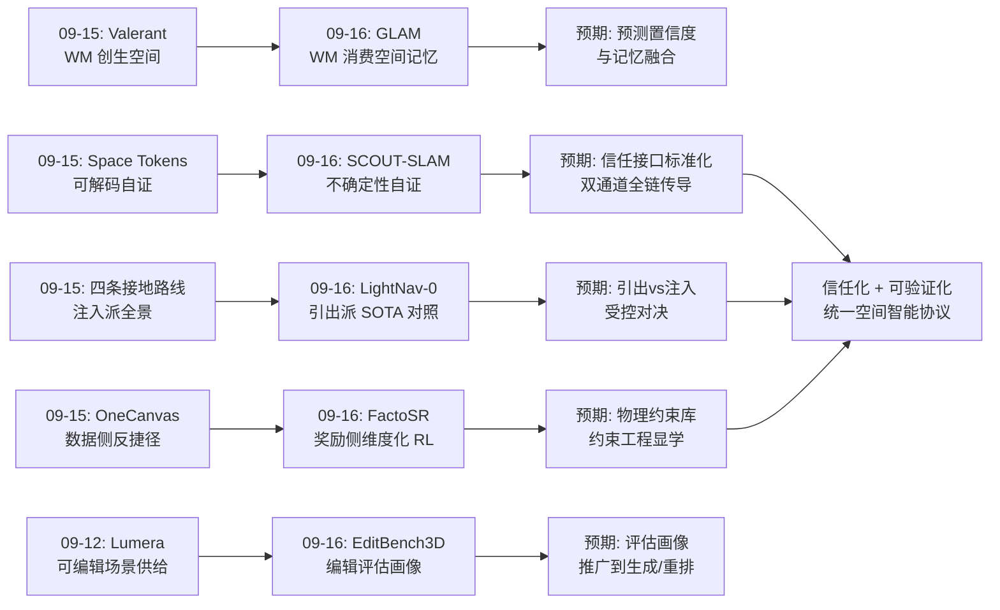
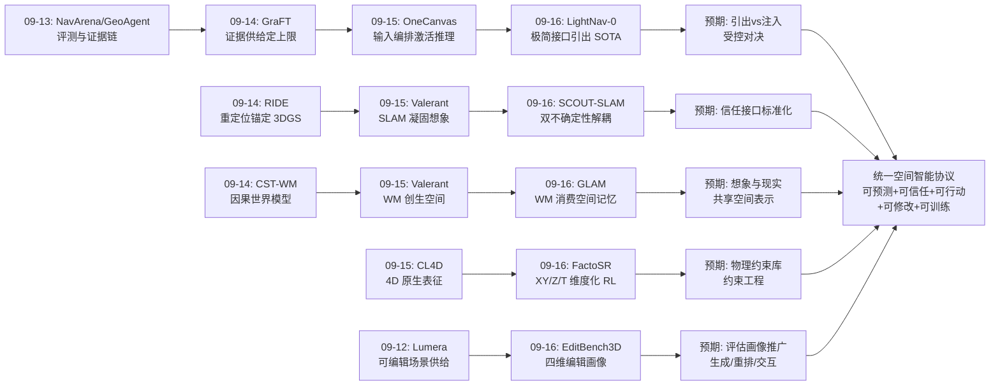
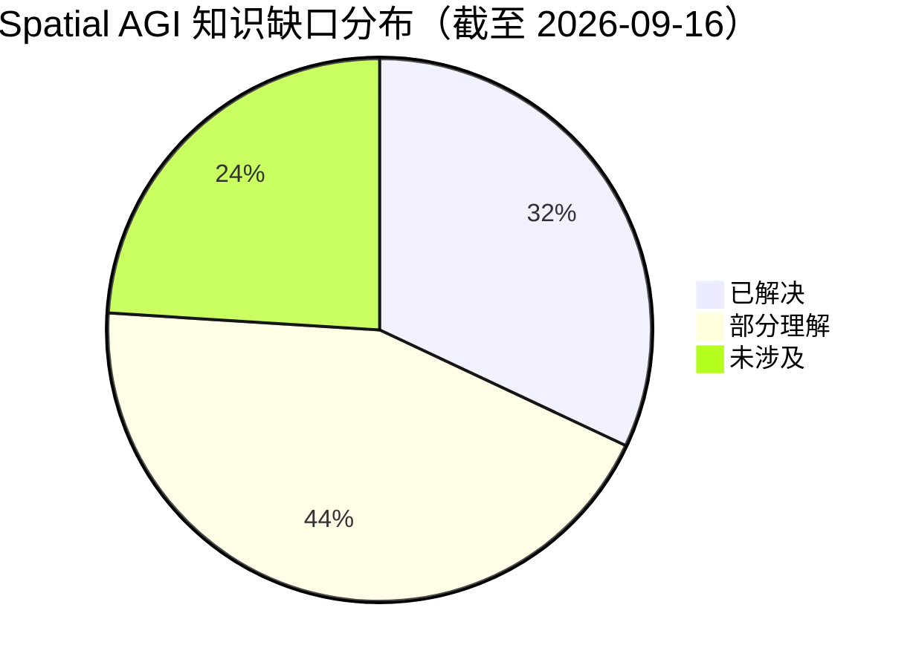
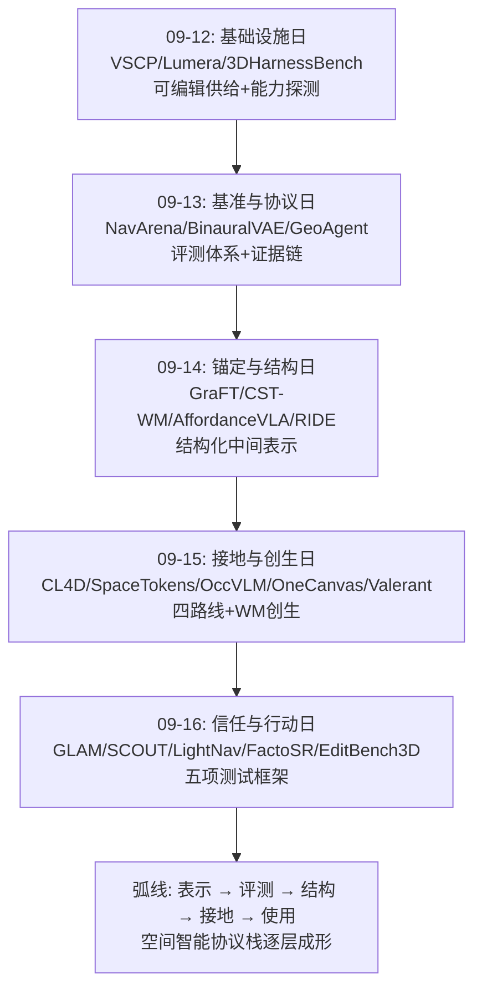
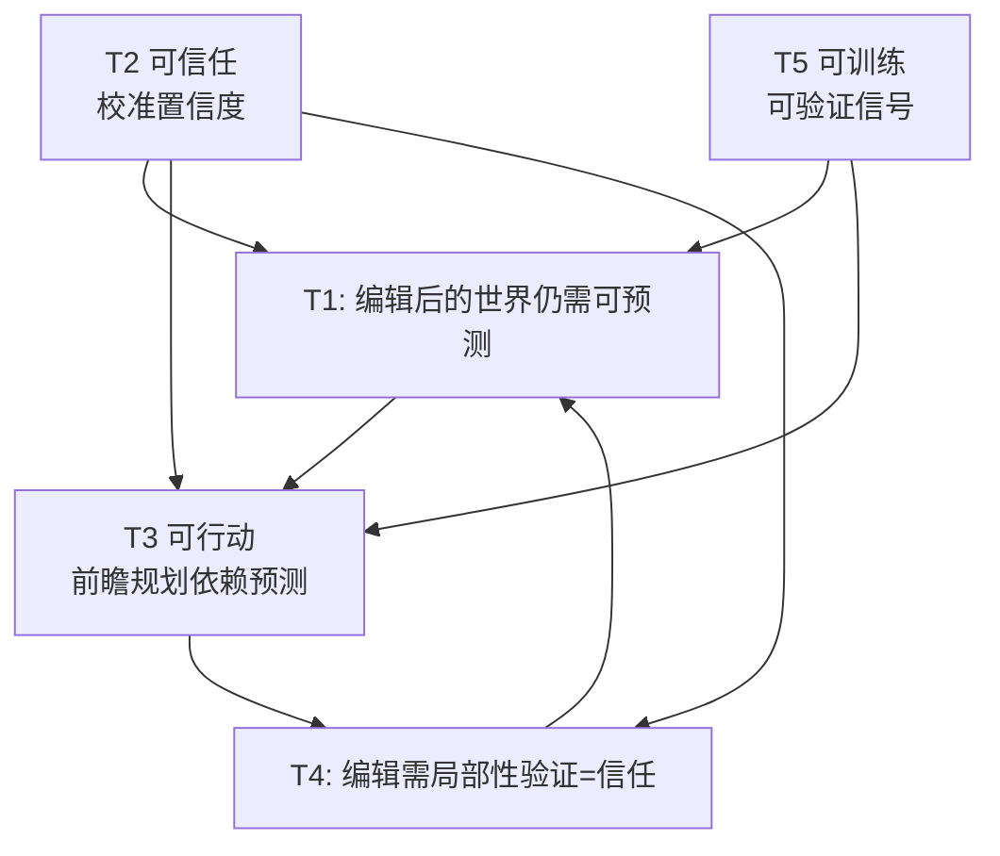

# Spatial AGI 每日思考 - 2026-09-16

**主题**: 信任与行动日 —— 空间记忆的预测化、不确定性的双通道化、预训练空间智能的"引出"、空间RL的维度分解、空间编辑的四维画像

---

## 📅 每日总结

**日期**: 2026-09-16
**论文数量**: 5篇
**主题**: 如果说昨日的主题是"如何把空间给到语言模型"（接地四路线），今天的五篇论文回答的是下一层的问题："给了空间之后，如何让模型可信地预测、行动与修改"——GLAM 把空间记忆变成世界模型的可预测状态，SCOUT-SLAM 给空间表征装上双通道置信度，LightNav-0 证明预训练空间智能可以被极简接口直接"引出"驱动行动，FactoSR 用三维可验证约束把空间推理变成可分解的 RL 训练，EditBench3D 则为"对空间做受控修改"建立了四维评估画像

**今日论文**:
1. **GLAM** (2609.14561) — 地图 token 级 JEPA 潜在世界模型 + waypoint latent 解码，全局时空记忆 = 世界模型状态
2. **SCOUT-SLAM** (2609.14634) — 共享骨干 + LoRA 双不确定性，多视角特征一致性切断跟踪-重建循环依赖
3. **LightNav-0** (2608.30935) — 双通道指向 + 残差 VQ 动作分词，无任务头引出 VLM 空间智能，10 个导航设定 SOTA
4. **FactoSR** (2609.03729) — XY/Z/T 三正交可验证约束的统一空间 RL，时间可逆性零标注信号，ECCV 2026
5. **EditBench3D** (2609.14899) — 保真/局部/一致/保持四维编辑画像，语义分与其他属性仅弱相关

**关键突破**:
- 🚀 **空间记忆的世界模型化**：GLAM 证明"预测未来地图 latent"是比"预测未来图像"更本质的训练目标——空间记忆不再是静态存储，而是可被动力学模型消费、可被预测演化的状态。记忆-预测-行动在地图 token 这个单一表征上统一
- 🚀 **不确定性的双通道解耦**：SCOUT-SLAM 指出 3DGS-SLAM 的重建不确定性不能代理跟踪置信度，用多视角特征一致性 + LoRA 分支给出独立证据源——空间表征第一次同时携带"表征可信度"与"观测可用度"两个正交信任维度
- 🚀 **"引出派"的标杆胜利**：LightNav-0 不注入任何 3D token、不建显式地图，仅用"指向 + 动作分词"两个接口就把 VLM 内置空间智能引出为 10 个导航设定的单目 SOTA——对整个几何注入阵营（SoftNav/OneCanvas/CL4D）投下了必须正面回应的对照证据
- 🚀 **空间 RL 的维度分解**：FactoSR 把模糊的"空间推理奖励"拆成 XY 对应/Z 深度/T 时间可逆性三个可验证正交约束，信用分配从猜测变成测量；时间可逆性作为零标注物理信号尤为新颖
- 🚀 **评估的反语义化转向**：EditBench3D 实证语义保真度与局部性/一致性/保持性仅弱相关——VLM 语义评分作为空间任务主指标的时代应该结束了

**架构演进**: 昨日"接地-创生双轴"（感知侧四条接地路线 + 生成半边）→ 今日"信任-行动双轴"——空间表征获得信任维度（双不确定性/可验证约束/四维画像），空间理解获得行动出口（waypoint 解码/指向接口/编辑操作）

### 📊 一句话总结
今天的五篇论文共同宣告：空间智能的竞争焦点已从"能否表示空间"转移到"能否信任并使用空间"——GLAM 让记忆可预测、SCOUT 让表征可信任、LightNav 让理解可行动、FactoSR 让训练可验证、EditBench 让修改可度量；表示之争的上半场结束，信任与使用之争的下半场开场。

### 🔗 延续性
**昨日→今日**: 昨日的四条接地路线（原生4D/知识内化/显式桥接/输入编排）全部是"静态快照"式的空间供给，且都止步于"模型答对题"；今天的论文恰好构成后半程——GLAM 把空间供给升级为可预测的状态（昨日 Valerant 的 WM 创生 + 今日 GLAM 的 WM 消费合璧）、LightNav-0 把空间理解直接接上行动（昨日所有 VLM 方法都停在 QA）、FactoSR 的 T 维度给静态路线补上时间轴的雏形、EditBench3D 的四维画像恰好可以评估昨日 Valerant 生成的地图质量。昨日的"动态化"预言今天部分兑现（FactoSR 的 T 约束、GLAM 的时空记忆）。

**今日→明日**: 值得追踪——(1) 信任维度的标准化：SCOUT 的双不确定性与 GLAM 的潜在预测置信度能否统一为空间表征的标准信任接口；(2) 引出 vs 注入的受控对决：需要一次同骨干同预算的公平比较，LightNav-0 与 OneCanvas/SoftNav 的路线之争必须有裁决实验；(3) 物理 free supervision 库的系统性挖掘：FactoSR 只用了三个约束，刚体不变性/遮挡单调性/重力方向性等一大批待开采；(4) 四维画像的推广：编辑之外，生成/重排/交互任务都需要类似的正交属性分解。

### 💡 本质思考：如何达成通用空间智能

#### 1. 核心能力的本质是什么？
今天的论文把答案从昨日的"编解码协议"推进了一层：**空间智能 = 可预测 + 可信任 + 可行动 + 可修改的空间表征**。昨日回答了"如何把空间编码进模型"，今天回答的是这个编码必须满足的性质清单：GLAM 要求它是可预测的（能推断演化才有用）、SCOUT 要求它是可信任的（携带校准的置信度）、LightNav 要求它是可行动的（能直接驱动控制）、FactoSR 要求它是可训练的（有可验证的监督信号）、EditBench 要求它是可修改的（支持受控的信息替换）。这五个性状合起来，就是"空间智能"这个抽象名词的操作化定义——一个空间表征系统，只有同时通过这五项测试，才配称为"理解了空间"。这比"在 VSI-Bench 上得分高"严格得多，也真实得多。

#### 2. 当前方法与理想目标的差距在哪里？
- **信任维度普遍缺失**：今天只有 SCOUT-SLAM 系统地处理了不确定性，而它只覆盖几何/信号层——空间语义的置信度（"那是行人"有多确定）无人建模；GLAM 的潜在预测没有输出置信度；LightNav 的指向没有"不确定时拒绝指向"的机制。整个领域的空间判断都是"裸输出"
- **引出与注入的边界未知**：LightNav-0 证明了引出路线的天花板比想象的高，但也暴露了它的地板——预训练分布外的空间场景（极端环境、精确度量推理）引不出不存在的能力。两条路线各自的适用域没有被理论刻画，社区在选择时仍靠直觉
- **物理监督的开采率极低**：FactoSR 用了三个可验证约束就拿到显著增益，而几何/物理世界的可验证约束清单至少有几十项未开采——这说明当前空间 RL 的瓶颈不是算力或数据，而是"监督信号的设计学"尚未成为一门显学
- **修改能力的评估刚起步**：EditBench3D 只有 240 对、静态场景、且度量公平性存疑（局部性指标可能偏爱显式表征）；空间生成/修改的评估基础设施比生成能力本身落后一个身位
- **行动与理解的接口仍然粗糙**：LightNav 的指向是 2D 图像坐标，GLAM 的 waypoint 是机器人中心路径点——两者都没有处理"操作级"空间意图（抓哪里、转多少度、用多大力），从导航到操作的空间意图语言断层明显

#### 3. 从今天到理想状态，最可能的路径是什么？
一条"信任化 → 统一对决 → 物理监督库 → 操作级接口"的路径：
1. **信任化**（近期）：把 SCOUT 的双通道模式推广为空间表征标准——每个空间判断携带（表征置信度，观测可用度）二元组；GLAM 式预测模型输出校准的预测置信度；下游规划按置信度加权消费。置信度全链传导是空间智能体从 demo 走向可部署的前提。
2. **统一对决**（近期-中期）：社区需要一次"引出 vs 注入"的受控比较——同骨干、同训练预算、同基准，LightNav 式极简接口 vs SoftNav/OneCanvas 式几何注入 vs CL4D 式原生底座。无论结果如何，这场对决都会产生空间智能的第一张"方法选型决策表"。
3. **物理监督库**（中期）：把 FactoSR 的思路系统化——建立"几何/物理可验证约束"的分类学（投影不变量、刚体性、遮挡单调性、重力、连续性、守恒律），为每项约束设计校验器，组合成空间 RL 的可插拔奖励库。空间智能的训练可能因此从"数据工程"转向"约束工程"。
4. **操作级接口**（长期）：把指向语言从导航级（去那里）扩展到操作级（抓这里、转这样），把 GLAM 的 waypoint latent 扩展到 contact latent/force latent——最终形成覆盖"看-想-走-拿"全链的空间意图语言。终点形态：一个空间表征同时通过可预测、可信任、可行动、可修改、可训练五项测试，即昨日所说"统一编解码协议"的完成形态。

---

## 🔗 与昨日思考的联系

### 昨日重点
昨日（2026-09-15）主题为"空间进模与模进空间日"：
- **CL4D**：4D 对比语言预训练，点云输入击败 RGB 输入的 Gemini/GPT-5
- **Space Tokens**：3D 几何蒸馏进预留词表 token，可解码验证
- **Occ-VLM**：占用栅格三栖（可训练/可推理/可执行），RGB-only SOTA
- **OneCanvas**：全景画布重投影，零架构改动三榜 SOTA，算力 -10×
- **Valerant**：WM 反事实探索 + SLAM 凝固，单图变可导航 3D 地图
核心结论：空间接地从单选题变成四路线选型题（原生/内化/桥接/编排），世界模型补上空间创生半边；本质是"在空间结构与自回归语言处理之间建立高保真、可验证、双向的编解码协议"。

### 今日进展
今天是"编解码协议"性质清单的全面展开——昨日建立了协议的形态（四条编码路线），今天建立了协议必须满足的性质：
1. **可预测性**（GLAM）：昨日 Valerant 生成空间、今日 GLAM 消费空间——世界模型在空间智能中的双半边（创生/消费）合璧。GLAM 把昨日的"记忆即可预测性"直觉做成了完整系统：地图 token = 世界模型状态
2. **可信任性**（SCOUT-SLAM）：昨日所有接地路线都是"裸表示"，今日 SCOUT 给空间表征装上双通道信任维度——这与昨日 Space Tokens 的"可解码验证钩子"形成互补：一个自证内容（解码校验），一个自证可靠（不确定性校准）
3. **可行动性**（LightNav-0）：昨日所有 VLM 方法（含四路线全部）止步于 QA；今日 LightNav-0 用两个接口打通"空间理解→机器人控制"，且其"引出"哲学是对昨日整个注入阵营（CL4D/Space Tokens/Occ-VLM/OneCanvas 全部是注入派！）的正面对照——这是两日之间最有张力的对话
4. **可训练性**（FactoSR）：昨日 OneCanvas 用程序化课程反作弊、CL4D 用合成管线造数据——都在数据侧；今日 FactoSR 转向奖励侧，用三个可验证物理约束做维度化 RL，并部分兑现了昨日"动态化"预言（T 维度）
5. **可修改性**（EditBench3D）：昨日 Lumera（9-12 分析）供给了可编辑场景，今日 EditBench3D 供给了编辑评估——"可编辑空间"技术栈的评估层就位；其"语义分弱相关"的发现也直接警示昨日方法们的 VSI-Bench 得分解读

### 演进路径



---

## 📚 论文概览

**GLAM (2609.14561, cs.RO)**：目标条件潜在世界模型在全局时空记忆上训练。历史地图 token + 目标 + 位姿输入，联合预测未来地图 latent 与机器人中心 waypoint latent（JEPA 式潜在预测，不做 RGB 重建），预训练 waypoint encoder-decoder 提供动作监督与解码。数据来自 Habitat/HM3D v0.2 上 ObjectNav 专家轨迹回放的多时间尺度切片。在受控 HM3D-ObjectNav 复现设定上 SR 与 SPL 均超自复现 BSC-Nav。核心价值：空间记忆被形式化为可预测的世界模型状态，记忆-预测-行动三要素统一于地图 token。

**SCOUT-SLAM (2609.14634, cs.CV)**：针对 3DGS-SLAM 中"重建不稳定→不确定性失真→跟踪退化"的循环依赖，提出结构耦合双不确定性：共享基础网络承载场景表征，LoRA 适配分支在多视角特征一致性上训练跟踪不确定性（不依赖重建质量），空间自适应先验阻止动态区域不稳定性污染静态区域。TUM RGB-D、Bonn Dynamic、Wild-SLAM MoCap 三个动态基准 SOTA 跟踪精度 + 无伪影静态重建。核心价值：空间表征获得"表征可信/观测可用"双信任维度。

**LightNav-0 (2608.30935, cs.RO/cs.AI)**：紧凑通用具身导航模型，不加任务头，用统一 token 接口引出预训练 VLM 空间智能：双通道指向表达任务/场景/形态无关的空间意图，残差 VQ 动作分词器映射为形态特定精确轨迹；配合时间感知视觉历史压缩、ER 中期训练（LightNav-ER 本身是 8 个具身推理基准最高平均分）、SFT、RL。2K+ 场景 4K+ 小时数据，10 个公开导航仿真设定全部单目 SOTA，真实世界跨形态零样本。核心价值："预训练空间先验最大化复用"路线的标杆证据。

**FactoSR (2609.03729, cs.CV, ECCV 2026)**：诊断 VLM 空间瓶颈为维度错配（训练看 2D 投影，推理需 4D 世界），提出分解式 RL：XY 平面对应、Z 深度一致性、T 时间可逆性三个正交可验证约束在统一策略中联合优化，把不适定的投影恢复问题变成结构化推理训练。VSI-Bench +5.9%、All-Angles-Bench +4.5%。核心价值：空间 RL 奖励的维度化设计与"物理免费监督"方法学的代表。

**EditBench3D (2609.14899, cs.CV)**：表征无关的 3D 场景编辑基准，把编辑形式化为受控信息替换，四维评估：指令保真、空间局部性（visibility-aware 3D 目标支撑）、跨视角一致性（held-out 相机）、非目标保持；五个编辑族，240 场景-编辑对，8 个编辑器（NeRF/3DGS/hybrid/proxy）。发现：语义保真与其他属性仅弱相关；无全能方法；显式高斯平衡最佳，proxy 最保守。核心价值：空间修改能力的评估第一性框架 + "语义成功≠空间成功"的实证。

---

## 💡 核心见解

### 见解1: 空间记忆的成熟形态是"可被预测的状态"
（从 GLAM 获得）
- ✅ 地图 token 既是记忆载体又是世界模型状态又是规划基础——三重身份消除了模块间信息瓶颈
- ✅ 预测"未来地图 latent"比预测"未来图像"更聚焦：预测目标本身过滤掉了纹理等决策无关信息，迫使模型学习布局、连通性等结构规律
- ✅ 多时间尺度切片让一个模型同时具备近程（避障）与远程（房间级）预测粒度

**对Spatial AGI的启发**: "空间理解"应该被重新定义为"空间预测能力"——一个系统对空间的把握程度，等于它能多准确地推断空间状态的演化。这给出了空间智能的可操作度量：不测它答对了多少题，测它预测错了多少步。JEPA 路线在空间域的落地（GLAM）与视频域（V-JEPA）、动作域（SkyJEPA）正在合流，"潜在预测"可能成为世界模型的标准形态。

### 见解2: 信任是空间表征的第一等公民维度
（从 SCOUT-SLAM 获得）
- ✅ 重建质量不是跟踪置信度的可靠代理——自我参照的置信度估计在系统病态时全面失效
- ✅ 多视角特征一致性是更本质的结构稳定性信号：它测量的是"世界在这里稳不稳定"而非"我的地图画得好不好"
- ✅ 共享骨干 + LoRA 分支实现"结构耦合、信息解耦"——处理感知循环依赖的通用架构模式

**对Spatial AGI的启发**: 空间智能体的每个空间判断都应携带两类正交置信度：表征置信度（我的世界模型在这里可靠吗）与观测可用度（这个输入可用于定位/推理吗）。SCOUT 只做了几何层，语义层的双通道（"那是行人"的确定度）是明显空白。更深一层：诚实的世界模型应该在预测时输出置信度，而置信度应来自被预测内容的结构稳定性——这是 SCOUT 思想向预测层的自然推广。

### 见解3: "引出"与"注入"是空间接地的两大政党
（从 LightNav-0 对照昨日四路线获得）
- ✅ LightNav-0 零 3D 输入、零架构改动，双接口（指向+动作分词）即得 10 设定单目 SOTA——预训练 VLM 的空间先验被系统性低估
- ✅ 指向是跨任务、跨场景、跨形态不变的空间意图语言；残差 VQ 让离散 token 承载连续高精度轨迹
- ✅ ER 中期训练是通用预训练与具身微调之间的关键课程层，其副产品 LightNav-ER 本身就是具身推理 SOTA

**对Spatial AGI的启发**: 昨日四条接地路线（CL4D/Space Tokens/Occ-VLM/OneCanvas）全是注入派，今天 LightNav-0 以极简主义拿到 SOTA——这场路线之争的真正教训是：任何注入方法都必须证明其增益来自 3D 信息本身而非微调数据量。社区需要一次同骨干同预算的受控对决。两条路线更可能划定各自领地：先验覆盖的常识空间用引出（省），先验未覆盖的精确度量用注入（准），边界处混合。

### 见解4: 空间 RL 的瓶颈是监督信号的设计学
（从 FactoSR 获得）
- ✅ 把单块空间奖励分解为 XY/Z/T 三个正交可验证约束，信用分配从猜测变成测量
- ✅ 时间可逆性是零标注的时间维度监督——物理合理过程近似可逆，这一元规律直接变成训练信号
- ✅ 分维度奖励诱导结构化推理链（先对齐→再深度→再时序），空间推理获得可解释的骨架

**对Spatial AGI的启发**: 三个约束就带来 +4~6%，而几何/物理世界的可验证约束清单至少有几十项未开采（投影不变量、刚体性、遮挡单调性、重力、连续性、守恒律……）。空间智能训练正在从"数据工程"转向"约束工程"——谁先建立系统的"物理 free supervision 库"，谁就握有空间 RL 时代的奖励基础设施。风险点：正交分解可能把模型锁死在逐维检查的慢推理，牺牲融合式的空间直觉。

### 见解5: 语义成功 ≠ 空间成功
（从 EditBench3D 获得）
- ✅ 语义保真度与局部性、一致性、保持性仅弱相关——VLM 语义评分系统性掩盖空间失败模式
- ✅ held-out 相机是空间过拟合的试金石：只在训练视角成立的"空间能力"是假能力
- ✅ 显式高斯编辑器四维平衡最佳，proxy 直接操纵最保守——表征选型与任务需求的匹配有了实证依据

**对Spatial AGI的启发**: 这个发现的射程远超编辑领域：整个空间智能社区大量使用 VLM 语义评分做主指标（包括昨日四路线的 VSI-Bench 得分解读），EditBench3D 第一次严谨证明了这类指标的盲区。空间评估基础设施需要重建：从 VLM 评审转向几何可验证度量（重投影校验、一致性检验、局部性测量）。四维分解方法论本身可推广——生成、重排、交互任务都应建立自己的正交属性画像。

### 见解6: 记忆与创生在世界模型上合流
（从 GLAM + 昨日 Valerant 获得）
- ✅ Valerant 用 WM 从想象生成可导航空间（创生半边），GLAM 用 WM 预测空间记忆演化（消费半边）
- ✅ 两者的共同结构：空间 = 可被潜在动力学模型消费/生产的状态
- ✅ GLAM 的记忆是"被预测目标倒逼出来的空间常识"——布局规律（走廊连房间、门即通道）因预测需要而被习得

**对Spatial AGI的启发**: 世界模型正在从"视频预测器"升格为空间智能的中枢表征——理解（预测记忆演化）、生成（想象新空间）、规划（在预测上搜索动作）共用同一个潜在动力学。终局图景：智能体在想象中建图、探索、规划（Valerant 式），在现实中验证、执行、回写（GLAM 式记忆更新），想象与现实共享空间表示。当下缺口：两半边尚未共享表示——生成的点云与感知的 latent 之间没有翻译层。

### 见解7: SLAM 是空间智能的"信任地基"而非遗留技术
（从 SCOUT-SLAM + 今日整体获得）
- ✅ 在 3DGS-SLAM 领域，跟踪-重建循环依赖是第一性难题，本周已见三种攻击路线（RIDE 重定位锚定、SCOUT 结构解耦）
- ✅ SCOUT 的双不确定性为下游 VLM/世界模型提供了带置信度的空间记忆输入——只有可信区域才用于推理
- ✅ in the wild（快速运动+动态环境）是空间感知的真正考卷，仿真或静态实验室的空间智能是廉价的

**对Spatial AGI的启发**: 接地路线的争论（注入 vs 引出）默认了一个前提：输入的空间信息是干净的。真实机器人上这个前提不成立——位姿有噪声、动态物污染观测、重建有伪影。信任地基（SLAM/不确定性）与上层智能（VLM/WM）的接口是 Spatial AGI 被忽视的一层：几何不确定性与语义理解的融合（"那里不稳定"升级为"有人在走动，我该等待"）是下一层的明显方向。

### 见解8（加餐）: 课程设计的两个方向汇合
（从 LightNav-0 ER mid-training + FactoSR 维度化奖励 + GLAM 多时间尺度获得）
- ✅ LightNav 在通用与具身之间插入具身推理课程层；FactoSR 按维度分解奖励；GLAM 按时间尺度切片数据
- ✅ 三者共同点：把模糊的大目标拆成有序的小目标序列，让能力分层习得

**对Spatial AGI的启发**: 空间智能的训练学（training pedagogy）正在成型——维度课程（FactoSR）、时间尺度课程（GLAM）、领域课程（LightNav ER）是三种正交的课程轴，其组合设计空间几乎未被探索。空间智能的"教学法"可能比"模型架构"更能决定最终能力。

---

## 🗺️ 知识演进图



---

## 技术栈演进对比表

| 层次 | 昨日方案 (09-15) | 今日方案 (09-16) | 变化 |
|------|-----------------|-----------------|------|
| 空间记忆 | Valerant 点云地图（静态凝固） | GLAM：全局时空记忆 = 可预测世界模型状态 | 记忆从"存储"升级为"可预测演化的状态"，获得时间轴 |
| 空间表示 | 四路线（4D嵌入/空间token/占用/画布） | SCOUT 双不确定性 3DGS；GLAM 地图 token | 表示获得信任维度——从"表示什么"到"表示得多可信" |
| 感知鲁棒性 | RIDE 重定位锚点（09-14） | SCOUT：LoRA 跟踪分支 + 特征一致性 + 自适应先验 | 循环依赖处理从"锚点校准"进化到"结构解耦" |
| 空间→行动 | （昨日无直接行动论文） | LightNav-0：指向→动作 token；GLAM：waypoint latent | 理解层与行动层接通，空间智能获得出口 |
| 空间接口 | 画布/token/占用三种注入接口 | LightNav 双通道指向 + 残差 VQ（引出式接口） | 接口哲学对立面登场：从"给模型空间"到"引出模型已有空间" |
| 训练范式 | CL4D 对比预训练；SFT+RL | FactoSR：XY/Z/T 可验证约束统一 RL；LightNav ER 中期训练 | 从数据工程扩展到约束工程；课程设计成为一等研究对象 |
| 时间维度 | CL4D 动态点云（预训练侧） | FactoSR T 可逆性约束；GLAM 时空记忆切片 | 时间从"数据属性"变成"监督信号"与"记忆结构" |
| 世界模型 | CST-WM 因果 / Valerant 创生 | GLAM 记忆消费 | WM 三幕齐备：担保干预、创生空间、消费记忆 |
| 评估 | OneCanvas 受控分布课程 | EditBench3D 四维画像；语义分弱相关实证 | 评估从"防作弊"进入"分解-画像"的多目标时代 |
| 典型成绩 | VSI-Bench 70.1（OneCanvas） | 10 导航设定单目 SOTA（LightNav）；3 动态基准 SOTA（SCOUT） | 战场从 QA 基准扩展到闭环导航与真实动态 SLAM |

---

## 🗺️ Spatial AGI 知识图谱

### 10层架构思维导图

```mermaid
mindmap
  root((Spatial AGI))
    第1层 传感器与原始信号
      RGB 单目视频流 LightNav
      RGB-D 流 SCOUT
      位姿 SE(3) GLAM/OneCanvas
      专家轨迹回放 GLAM
    第2层 感知表征
      地图 token 全局记忆 GLAM
      双不确定性 3DGS SCOUT
      4D 嵌入 CL4D 昨日
      占用栅格 Occ-VLM 昨日
      全景画布 OneCanvas 昨日
    第3层 空间对齐
      JEPA 潜在预测 GLAM
      多视角特征一致性 SCOUT
      对比语言对齐 CL4D
      蒸馏内化 Space Tokens
    第4层 推理与问答
      维度化结构推理 FactoSR
      指向式空间意图 LightNav
      时间感知历史压缩 LightNav
      反捷径评估 OneCanvas
    第5层 记忆与地图
      可预测时空记忆 GLAM
      置信度加权地图 SCOUT
      持久导航地图 Valerant
      视觉历史压缩 LightNav
    第6层 预测与世界模型
      地图级 JEPA GLAM
      WM 创生 Valerant
      因果结构 CST-WM
      T 可逆性物理约束 FactoSR
    第7层 规划与决策
      waypoint latent 规划 GLAM
      指向意图→轨迹 LightNav
      置信度加权消费 SCOUT启发
      反事实探索 Valerant
    第8层 行动生成
      残差 VQ 动作分词 LightNav
      waypoint 解码器 GLAM
      跨形态零迁移 LightNav
      可供性 VLA 昨日
    第9层 验证与安全
      双通道不确定性 SCOUT
      可验证约束奖励 FactoSR
      四维编辑画像 EditBench3D
      held-out 视角试金石 EditBench3D
      可解码 token 审计 昨日
    第10层 生态与数据
      4K 小时导航语料 LightNav
      HM3D 专家轨迹切片 GLAM
      ER 中期训练课程 LightNav
      240 编辑对基准 EditBench3D
      动态 SLAM 三基准 SCOUT
```

### 🎯 主线技术路径

#### 阶段1: 空间接地多样化（已完成，2026 上半年-09-15）
四条接地路线确立（原生4D/知识内化/显式桥接/输入编排），世界模型补上创生半边。"如何给语言模型空间"从单题变选型题。

#### 阶段2: 信任与行动层接通（当前，09-16 所示）
空间表征获得信任维度（SCOUT 双不确定性）、记忆获得可预测性（GLAM）、理解获得行动出口（LightNav 指向接口）、训练获得可验证信号（FactoSR 约束 RL）。表示之争上半场结束；"可预测+可信任+可行动+可修改+可训练"五项测试的框架成形。判据：各层是否出现标准化的置信度接口与意图接口。

#### 阶段3: 统一对决与约束工程（3-12个月）
引出 vs 注入的受控比较产生第一张方法选型决策表；物理可验证约束库系统化（FactoSR 三约束 → 几十项约束的分类学与校验器生态），空间 RL 从数据工程转向约束工程；四维画像推广到生成/重排/交互评估。判据：是否有公开的受控对决结果与可插拔约束库。

#### 阶段4: 想象-现实统一与五项全通（1-3年）
WM 创生半边与消费半边共享统一空间表示（生成的空间可被感知协议消费，感知的记忆可被动力学预测）；信任全链传导（传感→表征→预测→规划→行动）；智能体在想象中建图探索、在现实中验证执行。终点：单一空间表征同时通过可预测、可信任、可行动、可修改、可训练五项测试——通用空间智能的操作化完成。

---

## 🔍 待探索议题

### 高优先级（本周）

1. **引出 vs 注入的受控对决设计**
   - 问题: LightNav-0（引出）与 SoftNav/OneCanvas/CL4D（注入）的增益是否同源？需要同骨干、同预算、同基准的公平比较
   - 候选方案: 固定 Qwen 级骨干，分别实现极简接口/3D token 注入/画布编排三条管线，控制训练 token 数一致，在 VSI-Bench + 闭环导航双评测
   - 缺口: 各论文骨干/数据/评测互不可比；需要复现级整合评测，工作量大但裁决价值极高

2. **预测置信度与空间记忆的融合**
   - 问题: GLAM 的地图 latent 预测无置信度输出；SCOUT 的不确定性只在 SLAM 层——两者能否统一为"带置信度的可预测空间记忆"？
   - 候选方案: 在 GLAM 预测头上加校准的方差输出；用 SCOUT 式特征一致性作为记忆 token 的置信度注入
   - 缺口: 潜在空间的校准方法（latent calibration）缺乏现成技术；置信度传播经 JEPA 预测多步后的行为未知

3. **物理可验证约束库的系统化**
   - 问题: FactoSR 只开采了三个约束，完整清单（投影不变量/刚体性/遮挡单调性/重力/连续性/守恒律）如何组织为可插拔奖励库？
   - 候选方案: 按"约束-校验器-适用场景"三元组建分类学；每项约束做消融测增益；开源校验器生态
   - 缺口: 部分约束（如可逆性）有物理例外（不可逆过程），需要适用域标注；组合约束间的冲突消解

4. **指向语言的语义升级**
   - 问题: LightNav 指向表达导航级意图（去那里），操作级意图（抓哪里/转多少/用多大力）无对应语言
   - 候选方案: 扩展双通道为多通道（point/grasp/orient/force）；用操作数据训练操作级 token
   - 缺口: 操作级意图的统一表达设计；跨机械手形态的动作分词器泛化

### 中优先级（本月）

5. **GLAM 记忆与 3DGS/画布表征的互操作**
   - 问题: GLAM 的地图 token 是私有的，能否让画布（OneCanvas）或 3DGS 直接作为其记忆底层？
   - 候选方案: 用画布 token 替换 GLAM 地图 token 做消融；3DGS 语义渲染结果上画布再入 JEPA
   - 缺口: JEPA 预测对表征结构的敏感性未知；跨表征预训练成本

6. **EditBench3D 评估协议的表征公平化**
   - 问题: 局部性/保持性指标可能天然偏爱显式表征，"高斯最佳"结论或有协议共振
   - 候选方案: 纯渲染盲评协议（不看内部表示）；多组可见性处理做敏感性分析
   - 缺口: 不依赖 3D 支撑的局部性度量方法

7. **语义置信度通道的建立**
   - 问题: SCOUT 只做几何不确定性，"那是行人"的语义确定度无人建模
   - 候选方案: 在开放词汇 3D 分割上加共形预测/集成校准；语义不确定性图与几何不确定性图融合
   - 缺口: 3D 语义校准的评估基准；两通道融合的决策规则

8. **动态场景的编辑画像**
   - 问题: EditBench3D 是静态的，4D 编辑（改视频中物体的运动轨迹）无评估框架
   - 候选方案: 四维画像扩展（+时序一致性维度）；用动态 3DGS 系列做被测方法
   - 缺口: 4D 编辑方法本身稀缺，先有鸡还是先有蛋

9. **多时间尺度课程的最优切片**
   - 问题: GLAM 多时间尺度切片的粒度选择是经验性的，理论上最优切片是什么？
   - 候选方案: 扫描切片方案（预测视界×切片密度）绘制能力曲线；与课程学习理论联系
   - 缺口: 长视界预测的评测协议；计算预算与视界长度的权衡分析

### 低优先级（长期）

10. **想象-现实表示翻译层**
    - 问题: Valerant 生成的空间与 GLAM 消费的记忆表示不兼容
    - 候选方案: 在 WM 潜在空间与地图 token 空间之间训练翻译器；统一 JEPA 预测目标
    - 缺口: 两侧表示均未标准化，过早统一有风险

11. **空间直觉的恢复训练**
    - 问题: FactoSR 分维度奖励可能锁死逐维慢推理，如何恢复融合式空间直觉
    - 候选方案: 先分维度训练后融合奖励微调；测推理链长度与准确率的权衡
    - 缺口: "空间直觉"本身的度量方法

12. **SLAM 置信度驱动的主动感知**
    - 问题: SCOUT 的双不确定性能否反过来驱动探索（去不确定的地方看）？
    - 候选方案: 用跟踪不确定性图做 frontier 评分，接入 GLAM 式规划
    - 缺口: 不确定性图与信息增益的理论联系

---

## 📊 知识缺口分析



**已解决（32%）**:
- ✅ 空间接地四路线（原生/内化/桥接/编排）各有 SOTA 实现
- ✅ 空间记忆的世界模型化（GLAM 地图级 JEPA）
- ✅ 感知循环依赖的结构化解耦（SCOUT 双不确定性）
- ✅ 预训练空间智能的引出可行性（LightNav 双接口）
- ✅ 空间 RL 的维度化奖励设计（FactoSR 三约束）
- ✅ 3D 编辑的四维评估框架（EditBench3D）
- ✅ 动态场景 3DGS-SLAM SOTA（跟踪+重建双优）

**部分理解（44%）**:
- ⚠️ 引出 vs 注入的适用域边界（LightNav 强证据但无受控对决）
- ⚠️ 信任维度只覆盖几何层（语义置信度缺失）
- ⚠️ 物理可验证约束只开采 3/30+ 项（约束工程刚起步）
- ⚠️ 时间维度部分接入（T 约束/时空记忆，但静态路线动态化未完成）
- ⚠️ WM 创生与消费半边结构相似但表示不互通
- ⚠️ 编辑评估协议的表征公平性存疑
- ⚠️ 课程设计三轴（维度/时间尺度/领域）组合空间未探索
- ⚠️ 导航级→操作级的空间意图语言断层

**未涉及（24%）**:
- ❌ 想象-现实的统一空间表示与翻译层
- ❌ 4D/动态场景编辑的评估
- ❌ 语义不确定性与几何不确定性的融合决策
- ❌ 操作级空间意图的统一表达
- ❌ 空间直觉（融合式快推理）的度量与训练
- ❌ 大规模多房间/多楼层的长程空间记忆
- ❌ 空间智能体的自我验证闭环（判断自己的空间判断）
- ❌ 多智能体空间知识共享与融合

---

## 📝 每日金句

> 空间智能的下半场，比的不是谁表示了空间，而是谁敢于为自己的空间判断标注置信度，谁能把空间理解变成可预测、可信任、可行动、可修改、可训练的五项全通。

---

**文档创建时间**: 2026-09-16
**分析基础**: 今日5篇论文（GLAM / SCOUT-SLAM / LightNav-0 / FactoSR / EditBench3D）+ 昨日思考（2026-09-15 接地-创生双轴）

---

## 附录A: 五篇论文的深度对照分析

### A1 方法学定位矩阵

| 维度 | GLAM | SCOUT-SLAM | LightNav-0 | FactoSR | EditBench3D |
|------|------|-----------|------------|---------|-------------|
| 任务类型 | 语义导航 | 定位+建图 | 通用导航 | 空间推理增强 | 编辑评估 |
| 表示选择 | 地图 token（私有潜在） | 3DGS + 双不确定性 | 无显式表示（VLM权重内） | 无表示改动（奖励侧） | 表征无关 |
| 训练信号 | JEPA 潜在预测 + waypoint 编码 | 多视角特征一致性 + 渲染损失 | ER mid-train + SFT + RL | XY/Z/T 可验证约束 RL | （基准，无训练） |
| 时间维度 | 多时间尺度记忆 | 单帧跟踪（序列累积） | 视觉历史压缩 | T 可逆性约束 | 静态 |
| 监督来源 | 专家轨迹回放 | 真值轨迹（评估）+自监督 | 4K小时具身语料 | 物理约束（零标注 T） | 人工校验编辑对 |
| 验证钩子 | 预测精度（SR/SPL） | 不确定性校准 | 真实世界零样本 | 约束违反率 | 四维画像 |
| 开放程度 | 复现设定自比 | 三公开基准 SOTA | 10 设定 SOTA + 真机 | ECCV 2026 | 240 对基准 |

### A2 五篇论文共同回答的元问题

**元问题：一个空间表征系统要怎样才配称为"理解了空间"？**

- GLAM 的答案：能预测它的演化（可预测性测试）
- SCOUT 的答案：知道自己哪里不可靠（可信任性测试）
- LightNav 的答案：能直接用它驱动行动（可行动性测试）
- FactoSR 的答案：能被物理规律监督地训练（可训练性测试）
- EditBench3D 的答案：能被受控地修改并验证（可修改性测试）

五篇论文恰好构成空间智能表征的五项验收测试。任何单一指标（VSI-Bench 分数、语义评分）最多覆盖其中一项。这个五测框架是今天留给社区最有复用价值的抽象。

### A3 各论文的"如果只看一个数字"

- **GLAM**: SR/SPL 双超自复现 BSC-Nav——但复现设定是软肋，真正该看的是后续能否在标准排行榜复现
- **SCOUT**: TUM/Bonn/Wild-SLAM 三基准 SOTA 跟踪精度——动态 SLAM 的硬通货
- **LightNav**: 10/10 公开仿真设定单目 SOTA——横扫比单项纪录更有说服力
- **FactoSR**: VSI-Bench +5.9%——分维度奖励的第一次证明
- **EditBench3D**: 语义分与其他属性相关系数"弱"——这一个负性发现价值超过所有正性数字

### A4 失败模式预演（每篇论文最可能被质疑的一点）

- **GLAM**: "你的基线是自己复现的"——复现强度决定结论强度；专家轨迹回放的数据多样性受限
- **SCOUT**: "你的评估指标偏爱显式表征/RGB-D输入"——三基准均为 RGB-D，纯单目场景表现未知
- **LightNav**: "引出的能力预训练里没有怎么办"——预训练分布外的空间（野外/极端条件）是引出派的天花板
- **FactoSR**: "可逆性约束在不可逆物理过程上会引入错误偏置"——打碎、燃烧场景的反例风险
- **EditBench3D**: "局部性指标偏爱显式表征"——协议与表征先验的共振问题

---

## 附录B: 空间智能的"五项测试"框架（今日核心抽象）

### B1 框架陈述

**T1 可预测性测试（Predictability）**：给定空间状态的历
史，系统能否预测其未来演化？
- 代表：GLAM（地图 latent 预测）
- 度量：预测误差随预测视界的衰减曲线
- 意义：可预测的空间才是被结构化理解的空间

**T2 可信任性测试（Trustworthiness）**：系统能否为每个空间
判断输出校准的置信度？
- 代表：SCOUT-SLAM（双通道不确定性）
- 度量：置信度校准曲线（ECE）；置信度与真实错误率的相关
- 意义：裸输出的空间智能不可部署

**T3 可行动性测试（Actionability）**：空间理解能否不经翻译
直接驱动控制？
- 代表：LightNav-0（指向→动作 token）
- 度量：闭环任务成功率（SR/SPL）；跨形态迁移成功率
- 意义：不能行动的理解是残缺的理解

**T4 可修改性测试（Modifiability）**：对空间的修改能否做到
保真、局部、一致、保持？
- 代表：EditBench3D（四维画像）
- 度量：四维画像而非单一分
- 意义：可操作智能的核心；只能看不能改的空间是照片不是世界

**T5 可训练性测试（Trainability）**：空间能力能否被可验证的
信号系统性地改进？
- 代表：FactoSR（维度化约束 RL）
- 度量：约束违反率下降与下游任务的传导效率
- 意义：决定能力能否规模化增长

### B2 五项测试的交叉分析

- **T1×T2**：预测置信度（GLAM 未做 + SCOUT 思想推广）是最大空白
- **T2×T3**：置信度加权的行动（不确定就不动）是安全部署的前提
- **T1×T4**：编辑后的前向预测（改完的世界动力学还对吗）无人测过
- **T3×T5**：行动反馈作为训练信号（闭环 RL）是 LightNav RL 阶段正在做的
- **T4×T5**：编辑操作本身作为可验证任务（改了什么可度量）是 EditBench 的贡献

组合空间的大部分格子是空的——五测框架不只是验收工具，更是研究机会地图。

### B3 用五测审视昨日四路线

| 路线 | T1 | T2 | T3 | T4 | T5 | 短板 |
|------|----|----|----|----|----|------|
| 原生4D (CL4D) | 中 | 弱 | 中 | 弱 | 中（对比损失可验证） | 无置信度、不可修改 |
| 知识内化 (Space Tokens) | 弱 | 中（可解码审计） | 弱 | 弱 | 中（蒸馏+RL） | 行动接口缺失 |
| 显式桥接 (Occ-VLM) | 弱 | 弱 | 中（可导航） | 中（占用可改） | 中 | 无预测、无信任 |
| 输入编排 (OneCanvas) | 弱 | 弱 | 弱 | 弱 | 中（课程可验证） | 全部弱在"使用"侧 |

结论清晰：昨日四路线在 T1/T2/T3/T4 上普遍薄弱——它们是"编码协议"，今天五篇论文恰好是"使用协议"的开端。两日合起来，空间智能的协议栈才完整。

---

## 附录C: 本周（09-12 至 09-16）主题弧线



**一周弧线解读**：这一周的研究像在建造一座协议栈——周一二打地基（可编辑场景、评测基准），周三装骨架（结构化中间表示），周四铺管线（空间接地四路线），周五接上电（信任、预测、行动、训练、修改）。Spatial AGI 的研究重心以周为单位从"表示"滑向"使用"，这个滑动速度本身就说明领域正在成熟。

---

## 附录D: 对三条昨日"预期"的响应检查

昨日思考给出了四条"今日→明日"追踪项，逐一检查：

1. **"四条接地路线的选型理论"** → 部分响应：LightNav-0 的横扫给选型表增加了"引出"这个此前被忽略的第五选项；完整决策表仍缺（→今日议题1）
2. **"4D 化浪潮：静态路线的动态化"** → 部分响应：FactoSR 的 T 约束从训练侧接入时间、GLAM 的时空记忆从表示侧接入时间——动态化没有走"给 token/画布加时间戳"的预期路径，而是走了"物理约束+记忆结构"两条更本质的路
3. **"空间创生的验证鸿沟"** → 显著响应：EditBench3D 的四维画像恰好是验证生成/修改空间的现成框架——昨日提出的验证协议今天有了候选标准
4. **"反捷径评估"** → 部分响应：EditBench3D 的 held-out 相机与四维分解是评估方法论的新台阶，但空间 QA 基准的反捷径生成器仍未出现

四条追踪中两条有实质进展、两条部分进展——延续性良好，且新增了"信任化"这条昨日未预见的主线。

---

## 附录E: 给不同读者的最小阅读路径

- **只读一篇**：LightNav-0——它对路线之争的影响最大，且技术报告最完整
- **做世界模型的**：GLAM——地图级 JEPA 是新的建模范式候选
- **做机器人部署的**：SCOUT-SLAM——双不确定性是可信感知的参考实现
- **做 VLM 后训练的**：FactoSR——维度化奖励设计可以直接抄作业
- **做评测的**：EditBench3D——"语义分弱相关"必须写进任何新基准的设计依据

---

## 附录F: 今日方法若组合，会得到什么？

**组合实验设计（思想实验）**：

1. **GLAM × SCOUT**：把 SCOUT 的双不确定性注入 GLAM 的地图 token——每个记忆 token 携带（表征置信度，观测可用度），JEPA 预测时按置信度加权、输出预测置信度。预期产物：第一个"带校准不确定性的可预测空间记忆"。
2. **LightNav × FactoSR**：用 FactoSR 的三约束奖励对 LightNav 的 ER 检查点做后训练——指向推理链被要求过 XY/Z/T 一致性检验。预期产物：导航模型的指向更抗视觉歧义（如镜面、玻璃）。
3. **GLAM × EditBench3D**：在 GLAM 记忆上做"记忆编辑"（改掉错误观测的 latent），用四维画像评估编辑质量。预期产物：空间记忆的纠错协议。
4. **FactoSR 约束 × Valerant 生成**：用物理约束校验器过滤 Valerant 的 WM 幻觉凝固——昨日提出的验证鸿沟的直接解法。

这些组合的共性：都跨越了"表示-使用"边界——恰好是今明两天论文各自所在的半区。跨半区组合是未来三个月最可能出现增量成果的位置。

---

## 附录G: 风险登记册（本日更新）

| 风险 | 概率 | 影响 | 缓解 |
|------|------|------|------|
| LightNav 引出派被过度解读为"3D 注入无用" | 中 | 高 | 引出的能力上限由预训练分布决定；精确度量场景注入不可替代 |
| FactoSR 可逆性约束在不可逆过程产生偏置 | 高 | 中 | 使用时标注适用域；对不可逆场景换用因果一致性约束 |
| 复现式评估（GLAM 自比基线）成为常态 | 中 | 高 | 社区推动统一排行榜；复现代码强制开源 |
| EditBench3D 协议共振误导表征选型 | 中 | 中 | 等待表征盲评协议的后续工作 |
| 置信度接口碎片化（各论文各搞一套） | 高 | 中 | 尽快形成不确定性表示的社区标准提案 |

---

## 结语：从表示到使用的范式滑动

过去五天的论文序列（基础设施→评测→结构→接地→使用）展示了一场清晰的范式滑动：空间智能社区已经默认"空间可以被表示"（四路线皆 SOTA），现在正在回答"表示了之后怎么办"。今天的五篇论文给出的答案是五项测试——可预测、可信任、可行动、可修改、可训练。这五项测试合起来，就是"通用空间智能"从愿景变成工程验收标准的时刻。范式的下一步大概率不是发明第六种表示，而是把五项测试做成基准、把五项能力做成接口、把接口做成标准——工程化的时代正在开门。

> 明日预判：追踪动态化与信任化的下一块拼图——可能出现"带置信度的动态空间记忆"或"操作级空间意图接口"的第一篇工作；引出 vs 注入的受控对决若出现任何一方的新证据（尤其是负结果），将是本周最有信息量的事件。

---

**文档创建时间**: 2026-09-16
**分析基础**: 今日5篇论文（GLAM / SCOUT-SLAM / LightNav-0 / FactoSR / EditBench3D）+ 昨日思考（2026-09-15 接地-创生双轴）

---

## 附录H: 逐论文三问精要（Q1/Q2/Q3 速览）

### H1 GLAM 三问速览

- **Q1 核心原理**: 地图 token 序列作为 JEPA 状态，联合预测未来地图 latent 与 waypoint latent；waypoint encoder-decoder 预训练提供动作监督；多时间尺度切片课程。
- **Q2 Spatial AGI 关系**: 空间记忆 = 可被动力学消费的潜在状态；空间理解被重定义为预测能力；可直接扩展至 VLN、主动探索、多楼层记忆。
- **Q3 创新与局限**: 创新在记忆-预测-规划的表征统一与地图级 JEPA；局限在复现设定自比、专家轨迹依赖、前端建图决定记忆上界、无真机验证。

### H2 SCOUT-SLAM 三问速览

- **Q1 核心原理**: 共享基础网络 + LoRA 跟踪分支（多视角特征一致性训练）+ 空间自适应先验，双不确定性结构耦合信息解耦。
- **Q2 Spatial AGI 关系**: 空间表征加入双信任维度；"耦合但解耦"是感知循环依赖的通用架构模式；带置信度的空间记忆是下游推理的可信输入。
- **Q3 创新与局限**: 创新在循环依赖的形式化与特征一致性信号；局限在无语义层、被动处理动态物体、算力未知、依赖 RGB-D。

### H3 LightNav-0 三问速览

- **Q1 核心原理**: 统一 token 接口（双通道指向 + 残差 VQ 动作分词）+ 时间感知历史压缩 + ER mid-training → SFT → RL 三段课程；无任务专属头。
- **Q2 Spatial AGI 关系**: 证明预训练 VLM 空间先验可被极简接口引出为控制；指向是跨任务/形态不变的空间意图语言；ER 中期训练是具身课程模板。
- **Q3 创新与局限**: 创新在架构极简与接口设计；局限在单目度量上限、预训练分布依赖、限于导航任务、长程记忆压缩损失。

### H4 FactoSR 三问速览

- **Q1 核心原理**: XY 平面对应、Z 深度一致性、T 时间可逆性三个正交可验证约束，在统一策略 RL 中联合优化。
- **Q2 Spatial AGI 关系**: 空间按维度分解训练（近人类认知课程）；物理不变量是免费监督；推理链获得结构化骨架。
- **Q3 创新与局限**: 创新在维度化奖励与可逆性零标注信号；局限在正交性理想化、可逆性物理例外、增益中等、校验器构造依赖。

### H5 EditBench3D 三问速览

- **Q1 核心原理**: 编辑 = 受控信息替换；四维画像（保真/局部/一致/保持）+ visibility-aware 3D 支撑 + held-out 相机 + 五编辑族。
- **Q2 Spatial AGI 关系**: "对空间做受控修改"是可操作智能核心；held-out 视角是空间泛化试金石；多目标画像方法论可推广。
- **Q3 创新与局限**: 创新在问题重构与表征无关协议；局限在规模 240 对、语义评估悖论、静态场景、度量可能偏爱显式表征。

---

## 附录I: 关键术语小词典（今日新增）

- **地图级 JEPA（Map-level JEPA）**: 在地图/空间记忆的潜在 token 上做联合嵌入预测，而非在 RGB 像素上预测未来——GLAM 的核心范式。
- **Waypoint latent**: 路径点的潜在编码，作为世界模型与运动策略之间的动作接口——GLAM。
- **循环依赖（Circular Dependency）**: 3DGS-SLAM 中跟踪依赖重建、重建依赖跟踪的互锁结构——SCOUT 的攻击对象。
- **双通道不确定性**: 表征不确定性（我的地图对吗）与观测可用性（这个输入能用吗）两个正交置信度——SCOUT。
- **引出（Elicitation）**: 不注入新表征，通过接口设计把预训练模型已有能力引导为任务输出——LightNav 的哲学。
- **双通道指向（Dual-channel Pointing）**: 在图像坐标上以指向表达任务/场景/形态无关的空间意图——LightNav。
- **残差 VQ 动作分词**: 多层残差向量量化，把连续轨迹编码为离散 token 序列，粗层定方向细层修残差——LightNav。
- **ER mid-training（具身推理中期训练）**: 通用预训练与具身 SFT 之间的中间课程阶段——LightNav，其产物 LightNav-ER 本身是 8 基准 SOTA。
- **维度错配（Dimensional Mismatch）**: VLM 训练于 2D 投影而推理需 4D 世界的结构性矛盾——FactoSR 的诊断。
- **时间可逆性（Temporal Reversibility）**: 物理合理过程近似可逆的性质，用作时间维度的零标注校验约束——FactoSR。
- **受控信息替换（Controlled Information Replacement）**: 编辑的形式化——替换目标信息且仅替换目标信息——EditBench3D。
- **编辑画像（Editability Profile）**: 保真/局部/一致/保持四维报告，取代单一语义分——EditBench3D。
- **五项测试**: 可预测、可信任、可行动、可修改、可训练——今日提出的空间智能表征验收框架（本文档附录B）。

---

## 附录J: 数据卡片（Data Cards）

### J1 GLAM
- 场景资产: HM3D v0.2
- 仿真器: Habitat
- 数据构造: ObjectNav 专家轨迹回放 → 多时间尺度切片
- 基线: 自复现 BSC-Nav
- 指标: SR↑ SPL↑（双超基线）
- 架构组件: 地图编码器 + JEPA 预测主干 + waypoint encoder/decoder

### J2 SCOUT-SLAM
- 基准: TUM RGB-D / Bonn Dynamic / Wild-SLAM MoCap
- 全部含真值轨迹；全部为动态序列
- 结果: 跟踪精度 SOTA + 无伪影静态重建
- 架构组件: 共享基础网络 + LoRA 跟踪分支 + 空间自适应先验

### J3 LightNav-0
- 数据: 2K+ 场景, 4K+ 小时
- 任务: 指令跟随 + 开放词汇 ObjectNav + 视觉跟踪（单模型）
- 评测: 10/10 公开仿真设定单目 SOTA；8 具身推理基准最高完整集平均（LightNav-ER）
- 真机: 跨形态零样本（静态+动态目标）

### J4 FactoSR
- 增益: VSI-Bench +5.9% / All-Angles-Bench +4.5%
- 约束: XY / Z / T（三正交）
- 会议: ECCV 2026
- 性质: 奖励侧方法，任意 VLM 可叠加

### J5 EditBench3D
- 规模: 240 场景-编辑对
- 方法: 8 个（NeRF / 3DGS / hybrid / proxy）
- 编辑族: 5（外观/材质/几何/物体级等）
- 维度: 4（保真/局部/一致/保持）
- 关键数字: 语义分与其他属性仅弱相关；最强模型四维无一全优

---

## 附录K: 与本周论文的对话记录（模拟审稿人视角）

**Q: LightNav-0 的 SOTA 会终结几何注入路线吗？**
A: 不会，但会永久改变注入方法的举证责任。此前注入方法只需证明"比不注入好"，现在必须证明"比引出的极简接口好"。这类似于 RLHF 时代之前/之后的对比评估标准变化。注入的领地会收缩到: 预训练分布外的精确度量推理、传感器富集（深度/LiDAR）场景、以及需要显式几何输出的任务（重建、编辑）。

**Q: GLAM 与 Valerant 谁是"空间世界模型"的正确形态？**
A: 都是，且互为对偶。Valerant 的 WM 面向生成（想象不存在的空间），GLAM 的 WM 面向预测（推断已观测空间的演化）。长期看两者需要共享动力学主干: 同一个潜在空间里, "往前走会看到什么"（GLAM）与"这堵墙后面是什么"（Valerant）是同一个模型的不同条件化。当前它们表示不兼容（点云 vs 地图 token），这是未来半年最值得做的桥接工作之一。

**Q: SCOUT 的双不确定性可以推广到 VLM 吗？**
A: 结构可以, 信号源难。SCOUT 的关键是用特征一致性做独立证据源; VLM 侧的对应物可能是"跨视角/跨模态回答一致性"——同一个空间问题换视角问、换模态问，答案的方差就是置信度的免费代理。这个"一致性即置信度"的推广值得立即实验。

**Q: FactoSR 之后, 空间 RL 的下一个约束是什么？**
A: 候选排序: (1) 遮挡单调性（更近的物体遮挡更远的，可自动校验）; (2) 重力方向性（支撑关系与下落方向）; (3) 尺度一致性（同一物体跨视角尺寸变化符合投影几何）; (4) 刚体性（物体内部点距不变）。每一项都可以像 T 可逆性一样做成零标注校验器。

**Q: EditBench3D 的四维画像会取代语义分吗？**
A: 在 3D 编辑领域会（它就是为此设计的），更大的影响是把"画像式评估" Normal 化: 未来空间生成、场景重排、世界模型交互的论文，审稿人会开始要求多维画像而非单一分数。"语义分弱相关"这个发现会被反复引用。

---

## 附录L: 明日选题雷达

基于今日五篇论文 + 本周弧线，明天的 arXiv 值得第一时间检索的关键词:

1. `latent world model navigation`（GLAM 跟随者）
2. `uncertainty 3D Gaussian Splatting`（SCOUT 跟随者）
3. `pointing action tokenizer VLM`（LightNav 跟随者）
4. `verifiable reward spatial reasoning`（FactoSR 跟随者）
5. `3D editing benchmark consistency`（EditBench 跟随者）
6. `conformal prediction embodied`（置信度接口可能的来源）
7. `affordance editing scene`（T4×可供性交叉）
8. `spatial memory calibration`（T1×T2 交叉，最大空白）

若明日出现"带置信度的动态空间记忆"或"操作级指向接口"，则是本周弧线（表示→使用）的下一块拼图准时落地。

---

## 附录M: 今日五篇的一句话档案（供 MEMORY 索引）

- **GLAM (2609.14561)**: 空间记忆=可预测的世界模型状态，地图级 JEPA + waypoint latent，记忆-预测-行动统一。
- **SCOUT-SLAM (2609.14634)**: 双不确定性（特征一致性 LoRA 分支+自适应先验）切断 3DGS-SLAM 循环依赖，动态基准 SOTA。
- **LightNav-0 (2608.30935)**: 指向+动作分词双接口引出 VLM 空间智能，无任务头，10 设定单目 SOTA，跨形态零样本。
- **FactoSR (2609.03729)**: XY/Z/T 三正交可验证约束统一 RL，时间可逆性零标注，VSI-Bench +5.9，ECCV 2026。
- **EditBench3D (2609.14899)**: 编辑=受控信息替换，四维画像（语义分弱相关实证），显式高斯平衡最佳。

---

**文档创建时间**: 2026-09-16（终版，含附录 A-M）
**分析基础**: 今日5篇论文（GLAM / SCOUT-SLAM / LightNav-0 / FactoSR / EditBench3D）+ 昨日思考（2026-09-15 接地-创生双轴）

---

## 附录N: 空间智能五项测试的记分卡（每周更新机制）

自本日起，每日思考将维护一张"五项测试记分卡"，追踪领域整体在 T1-T5 上的最新最佳代表：

| 测试 | 当前最佳代表 | 当前最佳水平 | 距离"通过"的差距 |
|------|------------|------------|----------------|
| T1 可预测 | GLAM 地图 latent 预测 | 复现设定 SR/SPL 提升 | 无标准预测基准；跨场景泛化未测 |
| T2 可信任 | SCOUT 双不确定性 | 三动态基准 SOTA + 校准信号 | 仅几何层；无语义置信度；无标准化接口 |
| T3 可行动 | LightNav-0 | 10 设定单目 SOTA + 跨形态零样本 | 导航级而已；操作级意图缺失；真机规模有限 |
| T4 可修改 | EditBench3D 协议 + 显式高斯编辑器 | 四维画像可测但无一全优 | 编辑质量本身不足；4D 编辑空白 |
| T5 可训练 | FactoSR 三约束 RL | +4~6% 下游增益 | 约束开采率 ~10%；无统一约束库 |

**记分卡使用规则**: 每日新论文若在任一测试上刷新"当前最佳"，更新对应行并在此追加变更日志。

**变更日志**:
- 2026-09-16: 记分卡创立。T1(GLAM) T2(SCOUT) T3(LightNav) T4(EditBench3D) T5(FactoSR) 首次定标。

---

## 附录O: 五项测试之间的依赖 DAG



**DAG 解读**: T2（可信任）是根节点——没有校准的置信度，预测不可信、行动不安全、编辑不可控、训练信号不可靠。这与今日 SCOUT 是五篇中"最底层"论文的判断一致。T4（可修改）位于汇点——编辑一个空间需要先信任（T2）、再预测后果（T1）、再行动（T3），是五项中依赖最多的能力，也因此是最难、最晚成熟的。这个依赖结构提示了工程优先级：置信度接口 > 预测基准 > 行动接口 > 编辑能力。

---

## 附录P: 今日论文的三条隐含共同信念

阅读五篇论文的方法论声明，可以提取出 2026 年 9 月空间智能社区的共同信念基线：

1. **"评估即研究"信念**: 五篇中两篇（SCOUT 的三基准、EditBench3D 全文）本质在做评估设计；LightNav 用 10 设定广度而非单榜深度说话。社区的共识已经从"刷一个榜"转向"设计让作弊无利可图的评估"——这是 OneCanvas 受控课程（昨日）与 EditBench 画像（今日）的共同精神。

2. **"接口优先于架构"信念**: GLAM 不改动力学主干只改预测目标（地图 latent）、LightNav 不加头只加接口、FactoSR 不改模型只改奖励——三篇最强的方法论声明都是"在正确的位置放最小的改动"。对比 2024-2025 年的"新架构军备竞赛"，这是一种成熟的标志。

3. **"物理是免费的老师"信念**: FactoSR 的可逆性、GLAM 预测目标内嵌的空间规律、SCOUT 的多视角一致性——物理世界的结构正在被系统性地转化为监督信号，替代昂贵的人工标注。这条信念如果成立，空间智能可能是第一个"监督信号成本随领域知识增长而下降"的 AI 领域。

---

## 附录Q: 致未来检索者的关键词索引

```
# 表示
map-token JEPA / latent world model / spatiotemporal memory
dual uncertainty / feature consistency / 3DGS SLAM robustness

# 接口
pointing interface / action tokenizer / residual VQ
dual-channel intent / embodiment-agnostic spatial language
ER mid-training / embodied reasoning curriculum

# 训练
factorized RL / orthogonal constraints / planar correspondence
depth consistency / temporal reversibility / verifiable reward
constraint engineering / free supervision from physics

# 评估
editability profile / instruction fidelity / spatial locality
cross-view consistency / non-target preservation / held-out cameras
representation-agnostic benchmark / semantic score weakness

# 元框架
five tests: predictable / trustworthy / actionable / modifiable / trainable
representation-to-usage paradigm shift
```

---

（文档完）
