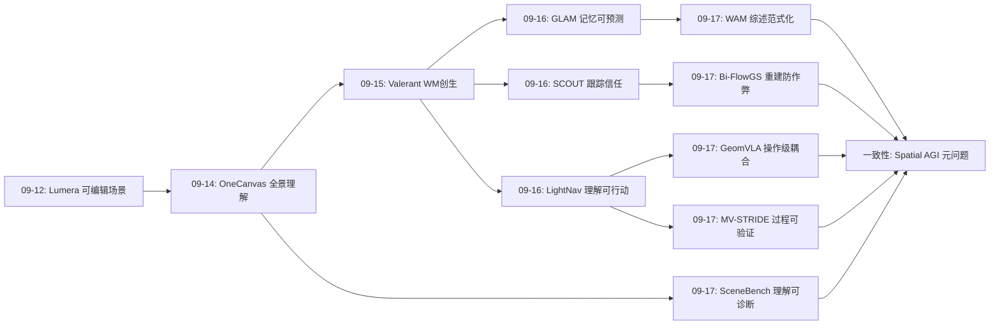
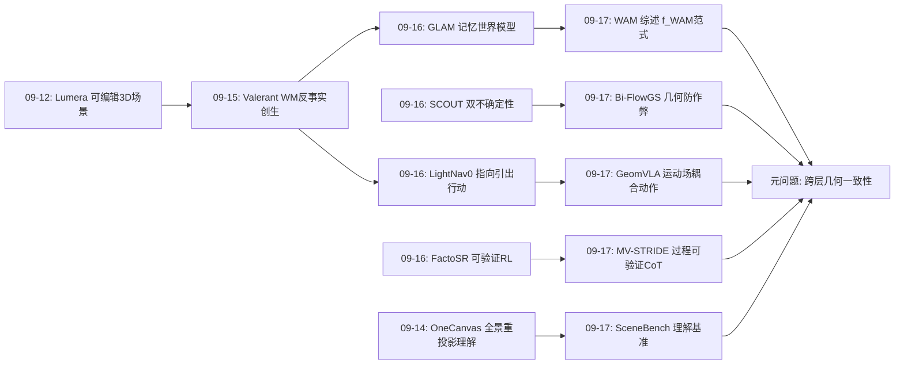
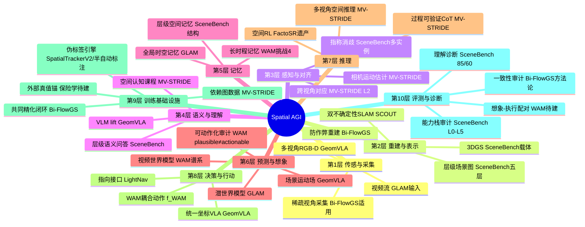
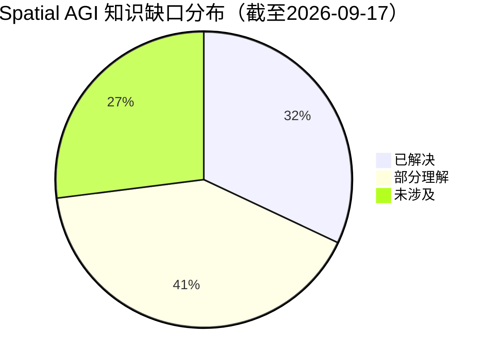

# Spatial AGI 每日思考 - 2026-09-17

**主题**: 一致性日 —— 几何不撒谎（防作弊）、预测要有用（耦合优于堆叠）、动作要接地（统一坐标系）、推理有结构（认知层级数据）、范式有地图（WAM 理论地基）

---

## 📅 每日总结

**日期**: 2026-09-17
**论文数量**: 5篇
**主题**: 昨日的主题是"信任与行动"——空间表征必须可预测、可信任、可行动、可修改、可训练。今天的五篇论文恰好构成这份"性质清单"的理论化与工程化落地：WAM 综述把"可预测且可行动"上升为正式范式并给出完整概念地图；Bi-FlowGS 把"可信任"推进到几何层——渲染会撒谎，必须把监督锚进作弊不可达的对应结构；GeomVLA 把"可行动"做成最干净的实现——场景、运动、动作在同一个坐标系里，并用消融证明耦合优于堆叠；MV-STRIDE 把"可训练"做成认知结构——数据不是题海而是带依赖图的课程表；SceneBench 则为整个"理解侧"立起带真值的尺子

**今日论文**:
1. **WAM Survey** (2609.16074) — 世界-动作模型首次系统定义：WM/VLA/WAM 三分、四线程谱系、七维分类、六大挑战
2. **SceneBench** (2609.16233) — 3DGS×层级场景图基准，966场景/183K节点/33,524问，检测85% vs 计数60%的鸿沟
3. **Bi-FlowGS** (2609.17039) — 光流枢纽 V2G/G2V 双向共同精化，攻克 Geometry Cheating
4. **GeomVLA** (2609.13812, CoRL 2026) — 场景/运动/动作统一 3D 坐标系的运动感知 VLA，中间 token 而非开环轨迹
5. **MV-STRIDE** (2609.07258) — 认知依赖结构化的多视角空间推理数据集，跨视角依赖约束+子问题即CoT

**关键突破**:
- 🚀 **WAM 范式正式化**：预测未来与生成动作从两个模块变成一个学习/推理过程 f_WAM(o_<t, ℓ) → (ô, â)——这是昨日"记忆-预测-行动统一"直觉的理论完成形态，也是本周所有世界模型论文（Valerant/GLAM）的概念坐标系
- 🚀 **Geometry Cheating 的命名与攻克**：Bi-FlowGS 指出稀疏 3DGS 重建中"渲染对但几何错"是系统性失败模式——位置/深度误差被不透明度/尺度/外观联合补偿掩盖；解法是把监督锚进光流对应这一作弊不可达层。这是昨日"可信任性"（SCOUT 双不确定性）在重建侧的镜像
- 🚀 **"耦合优于堆叠"的消融证据**：GeomVLA 证明未来运动推理单独贡献有限，主要增益来自感知-预测-控制的全链路几何一致性——与 WAM 的"plausible ≠ actionable"形成双城故事，给"给 VLA 加预测头=世界模型"的风潮泼了冷水
- 🚀 **数据结构即课程**：MV-STRIDE 证明带依赖图的任务组织（三级认知层级+问题组）优于扁平数据，且子问题链可以原理性构造 CoT——推理监督从"模型生成+人工筛"进入"从任务结构推导"的时代
- 🚀 **理解侧的量化诊断**：SceneBench 的 85%→60% 落差把"空间智能瓶颈在算不在看"变成了可引用的数字——VLM 检测接近可用，计数/距离/方向类空间计算仍是架构级盲区

**架构演进**: 昨日"信任-行动双轴"（五项性质清单）→ 今日"理论-工程闭环"——WAM 综述为五项性质提供理论坐标系（预测与控制耦合的谱系与挑战），四篇工程论文分别在重建（Bi-FlowGS）、行动（GeomVLA）、理解（SceneBench）、训练（MV-STRIDE）四个面上把性质清单落成可复现的系统与协议

### 📊 一句话总结
今天的五篇论文把本周的直觉收敛成一个主旋律：**空间智能的所有组件必须共享同一个几何真相**——渲染与几何一致（Bi-FlowGS）、理解与动作一致（GeomVLA）、语义与空间一致（SceneBench）、数据与认知一致（MV-STRIDE）、预测与控制一致（WAM）；"一致性"不是工程美德，而是空间智能区别于"看起来聪明"的定义性特征。

### 🔗 延续性
**昨日→今日**: 昨日提出五项性质清单（可预测/可信任/可行动/可修改/可训练），今天是清单的第一次系统性兑现——(1) 昨日 GLAM 证明"记忆可预测"，今日 WAM 综述把"预测+动作"上升为正式范式并提供分类学，GeomVLA 提供控制侧的最干净实例；(2) 昨日 SCOUT-SLAM 在跟踪侧建立双通道信任，今日 Bi-FlowGS 在重建侧命名 Geometry Cheating 并把监督锚进对应层——两个论文共同构成"空间表征信任学"的两翼；(3) 昨日 LightNav-0 证明空间理解可行动，今日 GeomVLA 把行动接口推进到操作级（点轨迹运动场+关节中介），恰好补上昨日指出的"导航到操作的空间意图断层"；(4) 昨日 FactoSR 开采物理可验证约束，今日 MV-STRIDE 把可验证性推进到推理链的每一步（子问题即 CoT）——从结果可验证到过程可验证。

**今日→明日**: 值得追踪——(1) WAM 的评估协议统一：综述承认四类指标割裂，"想象→执行"配对验证基准是空白；(2) Geometry Cheating 的推广检查：世界模型/场景图/VLA 内部状态是否存在同构作弊？（3）闭环偏差的锚点化：Bi-FlowGS 式共同精化回路需要外部真值锚的理论与预算分析；（4）MV-STRIDE 的 self-decompose：让模型学会自己构造认知问题组；（5）理解-行动相关 性验证：SceneBench 分数与 GeomVLA 式操作成功率的统计相关性。

### 💡 本质思考：如何达成通用空间智能

#### 1. 核心能力的本质是什么？
本周的论文把答案收敛到一个词：**一致性（consistency）**。昨日说空间智能 = 可预测+可信任+可行动+可修改+可训练的表征；今天进一步说，这五项性质有一个共同的深层条件——**表征的各层之间不能互相撒谎**：渲染不能对几何撒谎（Bi-FlowGS 的 Geometry Cheating）、想象不能对物理撒谎（WAM 的 plausible ≠ actionable）、语义不能对空间撒谎（SceneBench 的 85/60 鸿沟）、预测不能对控制撒谎（GeomVLA 的耦合性消融）、任务不能对能力撒谎（MV-STRIDE 的依赖约束防单视角捷径）。空间智能的本质是**建立并维护一组跨层几何一致性约束的系统**——每个接口（感知↔表示、表示↔预测、预测↔动作、任务↔能力）都有一个可检验的一致性条件，通过全部检验的系统才是空间智能。

#### 2. 当前方法与理想目标的差距在哪里？
- **一致性检验不是标准流程**：Bi-FlowGS 证明渲染指标测不出几何作弊，SceneBench 证明识别分数测不出空间推理，GeomVLA 证明预测头不等于世界模型——但社区的评价流程仍是"任务指标单一化"。没有一个系统在任何接口上被强制做一致性审计（重建层审计几何、预测层审计可动作性、理解层审计空间计算、训练层审计能力依赖）
- **闭环系统缺乏外部锚**：Bi-FlowGS 式共同精化、GLAM 式自预测训练、MV-STRIDE 式伪标签 CoT——本周几乎所有系统都有自监督/自训练回路，而防御机制（掩码/置信度/退火）都是内生的，没有外部真值锚。理论上闭环误差会随机游走甚至发散，目前的稳定性可能只是训练时长的幸存者偏差
- **理解与行动的分数不打通**：SceneBench 的高分不保证 GeomVLA 式操作成功，反之亦然——"空间理解基准分数"与"空间行动成功率"之间的传递函数无人测量。这使空间智能的进展评估像盲人摸象：每个面都有数字，整体没有图景
- **3D 表示的信任维度仍是瓶颈**：SCOUT（昨日）在 SLAM 侧、Bi-FlowGS（今日）在重建侧各自发明了信任机制（双不确定性/置信掩码），但没有共享的标准——空间表征的"信任接口"仍是每家自造轮子
- **认知结构化训练刚起步**：MV-STRIDE 证明结构有用，但结构是人工设计的（三级18类）；如何自动发现任务依赖结构、如何让模型自己构造认知课程，完全未解

#### 3. 从今天到理想状态，最可能的路径是什么？
一条"审计标准化 → 锚定化 → 分数打通 → 结构自动化"的路径：
1. **一致性审计标准化**（近期）：把今日论文的发现变成检查表——每个空间系统发布时附"一致性审计报告"：重建层（渲染-几何重投影误差）、预测层（想象-执行配对成功率）、理解层（识别-推理分差）、训练层（任务-能力依赖覆盖）。SceneBench 的多实例消歧、MV-STRIDE 的跨视角依赖、Bi-FlowGS 的流一致性应成为通用质检组件。
2. **闭环锚定化**（近期-中期）：为所有自训练回路建立最小外部锚预算理论——多少 LiDAR 点/真值深度/人工验证可以保证闭环不发散？Bi-FlowGS 加稀疏深度锚、GLAM 加真机回放校准、MV-STRIDE 加人工验证（已做 1500 人时），把"锚"从工程直觉变成可计算的保险条款。
3. **分数打通**（中期）：建立"理解-预测-行动"三联评测——同一批场景，同时测 SceneBench 式理解分、WAM 式想象质量、GeomVLA 式行动成功率，拟合传递矩阵。空间智能的第一张"能力相关性地图"比任何单点 SOTA 都有价值。
4. **结构自动化**（长期）：让依赖图自动发现——从任务元数据/失败案例中自动挖掘能力依赖、自动构造认知课程、模型自我分解推理（MV-STRIDE 的 self-decompose）。终点形态：空间智能系统自带一致性审计、外部锚保险、跨层分数传递与自演化课程——即"一个知道自己哪里可能在撒谎的系统"。

---

## 🔗 与昨日思考的联系

### 昨日重点
昨日（2026-09-16）主题为"信任与行动日"：
- **GLAM**：地图 token 级 JEPA 潜在世界模型，全局时空记忆=世界模型状态
- **SCOUT-SLAM**：共享骨干+LoRA 双不确定性，跟踪-重建循环依赖切断
- **LightNav-0**：指向+动作分词两接口引出 VLM 空间智能，10 导航设定 SOTA
- **FactoSR**：XY/Z/T 三正交可验证约束的统一空间 RL
- **EditBench3D**：保真/局部/一致/保持四维编辑画像
核心结论：提出空间表征的五项性质测试（可预测/可信任/可行动/可修改/可训练），宣告表示之争上半场结束、信任与使用之争开场。

### 今日进展
今天五篇论文恰好是五项性质的理论化与工程兑现，且各自推进到新的深度：
1. **可预测+可行动 → WAM 范式**：昨日 GLAM/LightNav 分别给出预测与行动的单点系统，今日 WAM 综述把两者统一为正式范式 f_WAM(o,ℓ)→(ô,â)，提供四线程谱系、七维分类与六大挑战——昨日论文从此有了理论坐标系（GLAM=预测用于规划+记忆挑战、LightNav=反应式范式的引出派极限）
2. **可信任 → 重建侧信任学**：昨日 SCOUT 在跟踪侧建立双不确定性，今日 Bi-FlowGS 在重建侧命名 Geometry Cheating——"渲染正确但几何错误"与"跟踪收敛但地图漂移"是同一病理的两个器官；Bi-FlowGS 的流一致性掩码与 SCOUT 的特征一致性不谋而合（多视角一致性=信任的通用证据源）
3. **可行动 → 操作级接口**：昨日 LightNav 的指向是导航级意图（去那里），今日 GeomVLA 的点轨迹运动场是操作级意图（物体将如何动+夹爪如何走），且用"中间 token 而非开环轨迹"解决了昨日指出的"想象-执行断层"——预测作为推理而非计划
4. **可训练 → 过程可验证**：昨日 FactoSR 让结果可验证（三约束奖励），今日 MV-STRIDE 让过程可验证（子问题即 CoT，每步有 3D 真值）——空间 RL 从结果奖励迈向过程奖励的原料就位
5. **新增：可理解性的度量**：SceneBench 补上了五项清单之外的第六项——可诊断性（85/60 分差把瓶颈定位到空间计算）；理解侧终于有了带真值的尺子

### 演进路径



---

## 📚 论文概览

**1. WAM Survey（世界-动作模型综述，MBZUAI/Caltech/GT/Berkeley 等）**
机器人导向的 WAM 首个系统综述：POMDP 形式化下 WM（ẑ=f(z,a)）、VLA（â=f(o,ℓ)）、WAM（(ô,â)=f(o,ℓ)）三分；世界模型/视频生成/潜动作预训练/VLA 四线程汇聚；表示-转移-接口-架构-训练-数据-扩展七维分类；操作/导航/驾驶跨域对照；动作对齐、世界-动作因式分解、空间与多视角一致性、长时程记忆、神经仿真、高效推理六大挑战。核心论断：视觉可信的未来不必然可动作化。

**2. SceneBench（3D 空间理解基准，NAAMII/INSAIT）**
966 个 3DGS 场景（584 ScanNet++ + 382 InteriorGS）+ 183K 层级标注节点（场景→房间→功能区→物体组→物体，六种结构关系+3D框）+ 33,524 问题（存在性/五类空间智能/12类接地推理QRA）。Gemini 3.0 主标 + 1500 人时人工验证。发现：检测 85% vs 计数 60%，空间计算是瓶颈。

**3. Bi-FlowGS（稀疏视角 3DGS 防作弊，浙江大学）**
命名 Geometry Cheating：渲染保真≠几何正确。光流为枢纽：V2G 把修复视频的时序对应蒸馏为高斯几何的显式监督（可微几何诱导流，梯度直通高斯中心，三重可靠性掩码）；G2V 把 3DGS 几何线索注入视频扩散修复（流条件+流偏置注意力检索+端点插值）。隐式双向共同精化闭环，宽基线与 360° 基准双提升。

**4. GeomVLA（3D 运动感知 VLA，CMU/NVIDIA，CoRL 2026）**
Florence-2 特征 lift 到机器人基座系 3D 场景 token；3D Scene Trajectory Denoiser 预测点锚位移增量场（SpatialTrackerV2 伪标签训练）；推理时只跑一次速度场评估，中间运动 token 经零初始化残差条件化 3D 动作去噪器（3D RoPE）。CALVIN SOTA、真机无动作预训练超基线。消融：几何一致性 > 预测本身。

**5. MV-STRIDE（多视角空间推理数据集，USTC/华为诺亚）**
三级认知层级（单视角感知/跨视角场景理解/多视角上下文推理）18 类任务，600+ Infinigen+ScanNet++ 场景；跨视角依赖约束（单视角不可解）；空间认知问题组（Level III 自顶向下分解，子问题即 CoT）；SFT→RL 多阶段训练，MMSI-Bench 等多基准 SOTA。

---

## 💡 核心见解

### 见解1: WAM 范式化——预测与动作的耦合是概念不是模块
从 WAM Survey 获得
- ✅ WAM 的定义性特征不是"有预测头"，而是预测与动作共享学习/推理过程（联合目标、共享表示、互为条件）——耦合与级联的本质区别
- ✅ "plausible ≠ actionable"：视觉可信的未来不必然可动作化，预测的价值必须以控制效用来衡量
- ✅ 四种控制用途（表示学习/前瞻规划/合成数据/想象策略优化）是给任何 WAM 工作定位的坐标系

**对Spatial AGI的启发**:
本周从 Valerant（WM 创生）→ GLAM（WM 消费+记忆）→ 今日 WAM 综述（范式化）→ GeomVLA（控制侧实现）形成完整闭环。今后读任何"世界模型"论文，第一个问题应该是："预测与动作在哪个接口耦合？"如果答案是"没有耦合，只是预测"，那它属于视频生成而非空间智能。这个判据比任何基准分数都锋利。

### 见解2: Geometry Cheating——监督必须锚在作弊不可达的层
从 Bi-FlowGS 获得
- ✅ 稀疏视角下，高斯的位置/深度错误可被不透明度/尺度/外观联合补偿，渲染指标完全测不出——"会渲染的骗子"是系统性的、有名字的失败模式
- ✅ 解药是把监督信号下沉到对应结构层：光流对应（时序不变量）与几何诱导流（投影不变量）的对齐不可被外观参数作弊
- ✅ 三重可靠性掩码（教师有效×几何有效×置信幂加权）是生成先验蒸馏的安全阀

**对Spatial AGI的启发**:
这是对整个领域的警示：任何"内部表示+下游任务评估"的系统都会进化出作弊变体——世界模型的未来帧合理但潜状态错误、场景图问答对但几何关系错、VLA 任务成功但内部空间估计错。通用对策：**为每个接口找到作弊不可达的不变量，把部分监督锚在那里**。SCOUT 的特征一致性、FactoSR 的物理约束、Bi-FlowGS 的光流对应，都是这一原则的实例——"空间信任学"正在从零散技巧聚合成方法论。

### 见解3: 耦合优于堆叠——GeomVLA 的消融是本周最重要的科学结果
从 GeomVLA 获得
- ✅ 未来运动推理单独贡献有限，主要增益来自感知-预测-控制全链路共享同一坐标系
- ✅ 中间 token 而非开环轨迹：预测过程的内部表征是更安全的决策条件——"用过程，不用结论"
- ✅ 零初始化残差注入：给预训练模型安全添加新条件源的通用模式

**对Spatial AGI的启发**:
GeomVLA 与 WAM 综述构成理论与实证的双城记："预测要有用，必须与控制共享几何"。这直接否定了当前流行的"给 VLA 加个预测头/视频生成分支=有了世界模型"的捷径做法。对资源分配的指导意义：与其堆更多预测目标，不如先把表示空间的统一性做扎实。多视角理解（MV-STRIDE）与操作行动（GeomVLA）的组合验证是下一个自然实验。

### 见解4: 数据结构即课程——依赖图是免费的教学法
从 MV-STRIDE 获得
- ✅ 三级认知层级（感知→理解→推理）+ 显式依赖建模，优于扁平数据混合——同样的任务，结构化组织的训练效果不同
- ✅ 跨视角依赖约束（单视角不可解）把"这是不是真空间题"变成可机械检验的属性
- ✅ 子问题即 CoT：从任务依赖逆向构造推理链，每步有独立 3D 真值——推理监督从事后标注进入原理性构造时代

**对Spatial AGI的启发**:
结合 SceneBench 的多实例消歧、MV-STRIDE 的跨视角依赖，空间任务设计的"质检规范"正在成形：单视角可解性检查、多实例消歧检查、3D 真值可验证检查。更深远的是过程监督的原料问题被解决了一半——FactoSR 的结果奖励 + MV-STRIDE 的过程奖励 = 空间推理 RL 的完整燃料体系。数据工程的下一个战场是"依赖图的自动化发现"。

### 见解5: 85/60 鸿沟——空间智能瓶颈的定量定位
从 SceneBench 获得
- ✅ SOTA VLM 检测/存在性 85%，计数/距离/方向跌至 60%——失败与任务的空间计算需求强相关，与语言复杂性弱相关
- ✅ 多实例消歧是隐藏难点：真实场景必须先解指称（哪双红鞋）再解关系
- ✅ 1500 人时产出 183K 节点的半自动流水线证明密集 3D 语义标注可以规模化

**对Spatial AGI的启发**:
这个数字应该终结"再刷刷感知就够了"的路线争论：识别已接近饱和，瓶颈在实例化物体表示+度量空间推理——恰恰是 patch-token 架构的盲区。3D 接地的混合架构（GeomVLA 式 lift）在理解侧应该同样有效，这是可以直接实验验证的预测。另外 SceneBench 与 MV-STRIDE 分别代表理解侧的评与训，两者共享"3D 元数据真值+层级结构"配方——空间理解的技术栈正在收敛。

### 见解6: 闭环必须有锚——共同精化回路的保险学
从 Bi-FlowGS（结合 GLAM/SCOUT）获得
- ✅ 生成器与重建器互为师生的共同精化是强大的正反馈，但幻觉流一旦通过早期掩码检查就会固化为几何错误并在闭环中被当真值强化
- ✅ 现有防御（掩码/置信度/退火）全是内生机制，无外部真值锚
- ✅ 本周三篇论文（Bi-FlowGS/GLAM/MV-STRIDE 伪标签）都有自训练回路，都在赌"内生防御足够"

**对Spatial AGI的启发**:
自训练/共同精化是空间数据稀缺的必然选择，但"闭环偏差"是悬在所有这类系统头上的剑。需要一门"闭环保险学"：最小外部锚预算（多少真值样本保证不发散）、锚的放置策略（在哪里注入人工验证最有效）、发散检测（闭环误差的在线监控信号）。MV-STRIDE 的 1500 人时人工验证是目前的最佳实践——人工验证聚焦测试集与关键节点，成本可控且有效。

### 见解7: 空间理解的第六项性质——可诊断性
从 SceneBench（结合今日全体系）获得
- ✅ 昨日五项性质（可预测/信任/行动/修改/训练）之外，SceneBench 补上第六项：空间表征必须可诊断——能在细分能力上定位失败（是感知错还是推理错，是哪类空间计算失败）
- ✅ 层级化任务矩阵（SceneBench 七类问题/MV-STRIDE 三级18类）是可诊断性的前提
- ✅ WAM 综述同样批评评估割裂并呼吁统一协议——诊断学是领域的公共基础设施

**对Spatial AGI的启发**:
一个空间智能系统的完整验收应该是六项测试：可预测、可信任、可行动、可修改、可训练、可诊断。其中可诊断性是元能力——没有它，其他五项的失败都无法归因、无法迭代。今日论文共同提供了诊断工具箱：理解侧（SceneBench 能力栈）、推理侧（MV-STRIDE 分级）、重建侧（Bi-FlowGS 几何审计）、行动侧（GeomVLA 消融法）。下一步是把它们集成为"空间智能体检中心"。

---

## 🗺️ 知识演进图



---

## 技术栈演进对比表

| 层次 | 昨日方案（09-16） | 今日方案（09-17） | 变化 |
|------|-----------------|-----------------|------|
| 理论范式 | GLAM/LightNav 单点系统，无统一框架 | WAM 综述：f_WAM(o,ℓ)→(ô,â) 形式化+七维分类 | 从系统散点到范式坐标系 |
| 空间理解评测 | 昨日无专门理解基准（VSI-Bench 时代） | SceneBench：3DGS×层级场景图，33K 真值问题 | 从通用 QA 到带 3D 真值的诊断矩阵 |
| 重建信任 | SCOUT 双不确定性（跟踪侧） | Bi-FlowGS Geometry Cheating 概念+流一致性监督 | 信任学从跟踪扩展到重建，病理有了名字 |
| 行动接口 | LightNav 指向（导航级 2D） | GeomVLA 点轨迹运动场+中间 token（操作级 3D） | 空间意图语言从"去那里"到"物体将如何动" |
| 预测-动作耦合 | GLAM waypoint latent（导航） | GeomVLA 统一坐标系+耦合性消融证明 | 从设计直觉到有反事实证据的科学结论 |
| 推理监督 | FactoSR 结果奖励（三物理约束） | MV-STRIDE 过程奖励（子问题即 CoT，逐步真值） | 从结果可验证到过程可验证 |
| 数据组织 | 单点数据集/课程（OneCanvas 程序化课程） | MV-STRIDE 依赖图组织（三级+问题组） | 数据结构本身成为课程与教学法 |
| 训练防捷径 | 程序化课程反作弊（昨日 OneCanvas） | 跨视角依赖约束（机械可检）+多实例消歧 | 防作弊从个案技巧变成任务设计公理 |
| 空间性质清单 | 五项（预测/信任/行动/修改/训练） | 六项（+可诊断性）+ 共同深层条件（跨层一致性） | 清单收敛为元问题 |

---

## 🗺️ Spatial AGI 知识图谱

### 10层架构思维导图



### 🎯 主线技术路径

#### 阶段1: 几何防作弊的表示层（当前-3个月）
以 Bi-FlowGS 方法论为纲：所有 3D 表示/重建组件加入"渲染-几何一致性审计"，监督信号锚定到对应不变量（光流/重投影/跨视角特征一致性）。同时 SceneBench 式真值问题对表示层做理解侧诊断。产出：带一致性审计报告的 3DGS 空间数据引擎。

#### 阶段2: 统一坐标系的耦合系统（3-9个月）
以 GeomVLA 模式为模板：感知-预测-动作统一坐标系，预测以中间表征（非开环计划）接入决策；GLAM 式记忆提供"过去"，GeomVLA 式运动场提供"未来"。配合 MV-STRIDE 认知课程训练理解侧。产出：记忆-想象-行动闭环的桌面操作原型。

#### 阶段3: 锚定化与分数打通（9-18个月）
闭环系统全部接入最小外部锚（真值深度/人工验证节点）；建立理解(SceneBench)-想象(WAM配对)-行动(操作成功率)三联评测，拟合跨层传递矩阵。产出：空间智能体检中心 v1 + 首张能力相关性地图。

#### 阶段4: 自演化与一致性自维护（18个月+）
依赖图自动发现（self-decompose 课程生成）、闭环偏差在线自检、空间表征的标准信任接口（置信度全链传导）。终点：一个知道自己哪里可能在撒谎、并能自我修正的空间智能系统。

---

## 🔍 待探索议题

### 高优先级（本周）

1. **跨层一致性审计检查表的正式化**
   - 问题: 如何把 Bi-FlowGS 的流一致性、SceneBench 的多实例消歧、MV-STRIDE 的跨视角依赖整合成统一的"空间系统质检协议"？
   - 候选方案: 定义四类审计（重建/理解/预测/训练），每类给出机械化检查项与通过阈值
   - 缺口: 各检查项的失败阈值如何定？缺乏跨方法的校准数据

2. **GeomVLA 式耦合 vs 预测头堆叠的对照实验**
   - 问题: 在同一 VLA 骨干上，统一坐标系+中间 token vs 简单预测头，性能差多少？
   - 候选方案: 复现 GeomVLA 消融，扩展到导航任务
   - 缺口: 原论文消融维度有限，运动头的净贡献需要更干净的隔离

3. **SceneBench 分数与操作成功率的传递函数**
   - 问题: 空间理解基准分数能否预测 GeomVLA 式操作成功率？
   - 候选方案: 在 SceneBench 场景上跑操作策略，拟合相关矩阵
   - 缺口: 两套基准的场景/任务对齐需要工程工作

### 中优先级（本月）

4. **闭环共同精化的外部锚预算理论**
   - 问题: Bi-FlowGS 式回路需要多少真值锚保证不发散？
   - 候选方案: 稀疏深度锚的密度扫描实验 + 闭环误差在线监控信号设计
   - 缺口: 闭环误差的理论模型（何时收敛/发散）

5. **WAM 想象-执行配对基准**
   - 问题: 如何统一评测"想象的未来是否物理可行且改善控制"？
   - 候选方案: 真机回放场景 + 想象轨迹 vs 实际执行轨迹的配对误差 + 下游策略增益
   - 缺口: WAM 综述承认评估割裂，无现成协议

6. **MV-STRIDE 的 self-decompose**
   - 问题: 能否训练模型自己把复杂空间任务分解成认知问题组？
   - 候选方案: 用现有问题组做分解行为的 SFT，再 RL 优化分解质量
   - 缺口: 分解质量的自动评价标准

7. **空间表征的标准信任接口**
   - 问题: SCOUT 双不确定性与 Bi-FlowGS 置信掩码能否统一为表征携带的置信度协议？
   - 候选方案: 定义（表征置信度，观测可用度，预测置信度）三元组接口，下游按置信度加权消费
   - 缺口: 三类置信度的校准方法与跨模块传导机制

### 低优先级（本季度）

8. **动态场景版理解基准**
   - 问题: SceneBench/MV-STRIDE 均为静态，物体运动/事件顺序的空间推理如何评测？
   - 候选方案: 4DGS 场景 + 事件 QA + 运动预测任务
   - 缺口: 动态 3DGS 采集与真值标注成本

9. **物理约束监督库的系统化**
   - 问题: FactoSR 三约束之外，还有哪些可验证空间约束可开采？
   - 候选方案: 建立约束分类学（投影不变量/刚体性/遮挡单调性/重力/连续性/守恒律）+ 每项的校验器实现
   - 缺口: 各约束的适用条件与组合冲突分析

10. **操作级空间意图语言的扩展**
    - 问题: 指向（导航级）与运动场（操作级）之后，"抓哪里/用多大力"的意图如何接口化？
    - 候选方案: contact latent / force latent 的引入，与 GeomVLA 运动场拼接
    - 缺口: 力级真值数据的采集渠道

---

## 📊 知识缺口分析



**已解决（32%）**:
- ✅ WAM 概念框架与分类学（今日 WAM 综述）
- ✅ 稀疏重建的渲染-几何一致性（Bi-FlowGS）
- ✅ 感知-预测-动作统一坐标系的可行性与价值（GeomVLA）
- ✅ 多视角推理的认知结构化数据方案（MV-STRIDE）
- ✅ 理解侧带真值的诊断基准（SceneBench）
- ✅ 空间记忆的预测化（GLAM）与导航级行动接口（LightNav）
- ✅ 结果级可验证 RL 约束（FactoSR）
- ✅ 预训练空间智能的接口引出（LightNav/OneCanvas 双路线证据）

**部分理解（41%）**:
- ⚠️ 预测-控制耦合的定量规律：耦合到什么程度收益最大？中间 token vs 其他接入方式的比较（GeomVLA 消融有限）
- ⚠️ 闭环系统的偏差控制：掩码/退火有效但无理论，外部锚的最优预算未知
- ⚠️ 理解-行动分数传递：两个方向的相关性完全未测量
- ⚠️ 空间信任的标准化：SCOUT/Bi-FlowGS 各自为政，无统一置信度协议
- ⚠️ 认知课程的自化：依赖图目前靠人工设计（MV-STRIDE 1500 人时），自动发现未解
- ⚠️ 空间计算失败的架构根因：85/60 鸿沟明确，但 patch-token 为何算不清计数的机理分析浅
- ⚠️ 3DGS 作为空间智能表示载体的边界：静态性好、动态性未证、尺度扩展未证

**未涉及（27%）**:
- ❌ 动态场景的空间理解与推理基准（4D 层级语义）
- ❌ 大尺度（街道/城市级）空间智能的层级组织与记忆
- ❌ 力级/接触级空间意图接口（操作深水区）
- ❌ 空间推理的符号-神经混合求解器（精确计算 vs 学习推理的分工）
- ❌ 多智能体空间智能（共享空间表征/协作空间推理）
- ❌ 空间智能的因果推理（干预反事实："如果我移动桌子会怎样"的机制级理解）
- ❌ 空间知识的持续学习（跨天/跨场景的记忆更新与遗忘）

---

## 🎯 今日金句

1. 会渲染的骗子也是骗子——监督必须锚在作弊不可达的几何层。
2. 预测要有用，先跟控制说同一种几何语言。
3. 用想象的过程，不要用想象的结论。
4. 好数据不是题海，是带依赖图的认知课程表。
5. 空间智能的元问题是一致性：让系统的每一层都不撒谎。

---

## 📝 明日展望

基于今日脉络，明日值得期待的论文方向：
- **WAM 系统的新实例**：GigaBrain0/π0.7 系的后续，检验"预测-动作耦合"范式的更多形态
- **空间理解的架构回应**：面对 85/60 鸿沟，是否出现带物体实例化表示的 3D-LLM 理解突破
- **动态化信号**：4DGS/事件驱动的空间理解与记忆论文
- **评测统一信号**：想象-执行配对协议的首批尝试

---

*本文档由 Spatial AGI 每日研究流程自动生成 | 2026-09-17 | 基于当日 5 篇论文精读与本周思考脉络*
EOF
wc -l /home/ubuntu/coding/spatial_agi/daily_thinking/2026-09-17.md
---

## 🔬 逐篇深思（五篇论文的延伸思考）

### 深思1: WAM 综述——如果要给领域立一块路碑，应该刻什么

WAM 综述的价值不在任何单项技术，而在它完成了三件"立碑"工作：

**其一，立了定义。** 式 (3) f_WAM(o_<t, ℓ) → (ô_{t:t+H}, â_{t:t+H}) 看似简单，实际上是一个筛子：任何自称"世界模型"的机器人系统都可以被放进这个筛子过一遍——预测与动作是否共享学习过程？是否联合条件？是否可微互通？筛不过去的（比如只生成视频不开环执行的、只反应式映射不预测的）都被移出 WAM 家族。命名即权力：这个筛子将成为未来两年机器人论文 related work 的标准引用坐标。

**其二，立了坐标系。** 七维分类（表示/转移/接口/架构/训练/数据/扩展）+ 四种控制用途（表示学习/前瞻规划/合成数据/想象策略优化），让任何新工作可以在 30 秒内完成定位。这对daily research的实用价值极高：后续每读一篇 WAM 论文，先做七维定位再做深读，效率倍增。

**其三，立了问题清单。** 六大挑战中，"空间与多视角一致性"被排在最核心位置（至少对 Spatial AGI 而言）——这与本周 Bi-FlowGS 的防作弊、SCOUT 的双不确定性形成三角互证。值得注意的是综述对 3D 显式表示的着墨不足：它列出了问题，但没有押注 3DGS/占据表示是解法。这是综述的留白，也是后续工作（包括我们的思考）的机会。

**遗留疑点**：综述把"长时程记忆"列为挑战但没有深入分层记忆架构——GLAM 类全局时空记忆、MemoryWAM 类持久记忆在综述的分类里没有清晰位置。潜状态空间 Z 的定义（"足以预测未来的历史压缩"）其实天然应该包含记忆结构，这是形式化与架构讨论之间的断层。

### 深思2: SceneBench——85/60 这个数字会出现在多少篇论文的引言里

好的基准论文会产出一个"可引用的数字"：ImageNet 的 top-5 错误率、GSM8K 的通过率。SceneBench 的候选数字是"85% vs 60%"——检测接近饱和，计数崩塌。这个数字的力量在于它把一个抽象论断（"空间智能瓶颈在推理不在感知"）变成了三秒钟就能讲清的事实。

但更值得注意的是它如何做到的：**真值全部来自 3D 元数据**。距离/方向/大小/计数答案直接由包围盒计算，不存在人工标注误差或模型评估偏差。这让"失败"有了铁的证据——模型确实不会算，而不是标注错了。

多实例消歧设计的意义被低估了。大多数 3D QA 基准的场景每类只有一个物体，回避了真实世界的指称歧义；SceneBench 强制属性化唯一指称（"那双红色的鞋"），这使计数任务成为"指称消解×枚举"的复合任务——60% 的失败里有多少来自指称失败、多少来自枚举失败，是后续错误分析应该拆解的。若是前者，MV-STRIDE 的指称消解训练可直接对症。

**遗留疑点**：966 个室内静态场景、Gemini 3.0 标注的单模型依赖、以及"理解分数→行动成功率"的效度缺口（SceneBench 高分是否意味着可导航可操作？）都是未解。理想情况下，SceneBench 应该与 MV-STRIDE 的训练数据、GeomVLA 的行动评测形成"同场景三联测"——这是今日论文留给社区最明显的组合拳。

### 深思3: Bi-FlowGS——"作弊"概念的辐射半径

Geometry Cheating 是本周第二个被正式命名的领域病理（第一个是昨日的"跟踪-重建循环依赖"）。命名的意义在于把散落的观察聚合成研究对象：此前散落在各论文 appendix 里的"深度正则的必要性"讨论，从此有了一个统一的名字和一篇旗帜论文。

它的辐射半径远超稀疏重建。推广到本周脉络：
- **世界模型作弊**：未来帧渲染合理但潜状态动力学错误（WAM 的 plausible≠actionable 是它的动作版）
- **场景图作弊**：问答正确但空间关系错误（SceneBench 的层级推理失败部分源于此）
- **VLA 作弊**：任务成功率正常但内部空间估计错误（依赖分布内的模式匹配）
- **推理作弊**：CoT 看似合理但步骤与观测脱节（MV-STRIDE 的认知接地 CoT 是解药）

五类作弊的共同解药：**监督/评价锚定到各自接口的作弊不可达不变量**。这是一个可以写成 position paper 的论点，也是"空间信任学"的纲领。

**遗留疑点**：Bi-FlowGS 的闭环无外部锚——幻觉流被掩码漏检后会固化为几何错误并被后续迭代当真值。掩码是必要不充分防御。稀疏深度锚（哪怕几十个点）的成本收益分析是该方向最该做的下一个实验。

### 深思4: GeomVLA——"过程 vs 结论"的哲学落地

GeomVLA 最优雅的设计决策是"不执行预测轨迹，只取中间 token"。这个决策背后是一个可推广的哲学区分：

- **预测作为计划**（plan-then-act）：输出未来状态序列，控制器跟踪它。脆弱点：预测误差在开环执行中无修正机会；环境变化使计划失效。
- **预测作为推理**（predict-to-reason）：预测过程的内部表征作为决策的条件信息。优势：保留了"想象"的信息量（任务将如何展开），但把最终决策留给与当前观测实时连接的动作模块——闭环安全。

这与大语言模型里"用 CoT 的中间表征而非只看答案"的思路同构，也与我们日常直觉一致：专家的价值不在他说出的结论，而在他推理时展开的结构。

**遗留疑点**：消融显示几何一致性是主要增益、运动头净贡献有限——那么一个更简单的"无运动头的 3D VLA"性能差距到底几个点？如果差距 <2%，运动模块的复杂度（伪标签引擎+两阶段训练+额外去噪器）可能不值得。论文没有给出这个数字的强调，是全文最需要补的消融。

### 深思5: MV-STRIDE——数据集的"教学法革命"

MV-STRIDE 的隐含主张是：**数据集不只是任务样本的集合，而是教学法的产品**。三级层级+依赖图+问题组，本质上把"课程设计"（先教什么后教什么、知识点的先后依赖）编码进了数据结构。同样的任务量，有依赖结构的数据训练效果更好——这说明数据的价值公式里有一个被长期忽略的因子：结构。

"子问题即 CoT"是教学法思维的结晶。传统 CoT 标注的两难：模型生成的链可能"答案对过程错"（不可靠），人工写链太贵（不可扩展）。MV-STRIDE 的解法是从任务的认知依赖**推导**链结构——每个中间步骤对应一个可被 3D 真值独立验证的子问题。这使空间推理成为过程奖励（PRM）数据可以原理性构造的领域，领先于数学推理（数学 PRM 仍依赖人工步骤标注）。

**遗留疑点**：固定分解路径的对齐代价——人类专家的分解策略多样，强制单一认知路径可能产生"路径依赖"推理。下一步的自然实验：让模型在 RL 中自由探索分解（self-decompose），与固定路径对比泛化性。

---

## 📈 本周脉络周报（09-12 至 09-17）

### 六日论文的主题流变

| 日期 | 主题 | 代表论文 | 关键词 |
|------|------|---------|--------|
| 09-12 | 可编辑空间 | Lumera | 场景生成/编辑底座 |
| 09-14 | 理解新接口 | OneCanvas | 全景重投影/零架构改动 |
| 09-15 | 创生与接地 | Valerant/CL4D/Space Tokens/Occ-VLM | WM创生/接地四路线 |
| 09-16 | 信任与行动 | GLAM/SCOUT/LightNav/FactoSR/EditBench3D | 五项性质清单 |
| 09-17 | 一致性 | WAM/SceneBench/Bi-FlowGS/GeomVLA/MV-STRIDE | 跨层几何一致性 |

### 涌现的技术公约数

1. **3D 真值元数据**成为训练与评测的公共信用基础（SceneBench/MV-STRIDE/GeomVLA 全在用）
2. **跨视角/跨层一致性**从工程技巧升格为设计公理
3. **可验证性**从结果级（FactoSR）推进到过程级（MV-STRIDE CoT）
4. **VLM 骨干 + 3D lift**成为理解与行动的共同架构基座
5. **生成模型与几何模块的双向闭环**成为数据引擎的标准形态（Valerant/Bi-FlowGS）

### 下周的三个预测

1. 会出现首批"想象-执行配对评测"的 WAM 评估协议论文（WAM 综述留下的最大空白）
2. 85/60 鸿沟将被至少三篇论文引用，并出现带物体实例化表示的 3D-LLM 理解架构回应
3. 空间信任接口（置信度三元组）的提议性论文会出现——三篇独立工作已铺好土壤

---

## 🧭 研究组合检查（对照五项+一项性质清单）

| 性质 | 本周最佳实践 | 尚缺的关键件 | 优先级 |
|------|------------|-------------|--------|
| 可预测 | GLAM 记忆世界模型 | 预测置信度输出、长时程 rollout 验证 | 高 |
| 可信任 | SCOUT 双不确定性 + Bi-FlowGS 流掩码 | 统一置信度协议与校准 | 高 |
| 可行动 | GeomVLA 统一坐标系 + LightNav 指向 | 操作级力/接触意图接口 | 中 |
| 可修改 | EditBench3D 画像 + Lumera 底座 | 动态场景编辑、度量公平性 | 中 |
| 可训练 | FactoSR 结果奖励 + MV-STRIDE 过程奖励 | 约束库系统化、过程奖励规模化 | 高 |
| 可诊断（新） | SceneBench 能力栈 + WAM 评估批评 | 跨层分数传递矩阵、统一体检协议 | 最高 |

---

## 💬 今日自问自答（研究日志）

**Q1: 如果只能记住今天一个东西，是什么？**
A: "一致性是空间智能的元问题。"五篇论文从五个方向（重建/理解/行动/训练/理论）共同指向：空间智能系统必须让每一层都不撒谎——渲染对几何诚实、想象对物理诚实、语义对空间诚实、预测对控制诚实、任务对能力诚实。

**Q2: 今天有什么改变了昨天的判断？**
A: 两处微调：(1) 昨日把"可预测"列为五项之首，今日 GeomVLA 消融提示"可预测"单独价值有限，必须与"可行动"耦合——性质清单内部有权重结构，耦合性质 > 独立性质；(2) 昨日认为评估是"下半场"，今日 SceneBench 证明诊断学可以先行——评测不只是验收，还是瓶颈定位器（85/60 直接改写了资源分配判断）。

**Q3: 今天最值得复现的工作？**
A: GeomVLA 的"中间 token + 零初始化注入"组合——几百行代码的可移植模式，任何 VLA/空间系统都能低成本试验"预测作为推理"。Bi-FlowGS 的 V2G 损失次之（同样即插即用，但需要视频扩散修复管线）。

**Q4: 今天读得最吃力的部分？**
A: Bi-FlowGS 的 G2V 特征注入四件套（流条件/自注意力注入/流偏置检索/深度一致性调制）——工程密度高但消融较粗，四件套各自的净贡献不清楚。这提示一个普遍规律：多机制论文的消融深度往往跟不上机制数量，读者要自己估算"哪些是真增益、哪些是搭车"。

**Q5: 明天最想看到什么论文？**
A: 一篇"想象-执行配对评测"——给定世界模型的想象轨迹与真机执行轨迹，定义配对误差并证明该误差预测下游策略增益。WAM 综述指出这个协议缺失，谁先做谁定义赛道。

---

*（今日思考完。六日累计：31 篇论文，一条主线——空间智能正在从"表示竞赛"走向"一致性竞赛"。）*

---

## 🧪 方法论实验室（今日论文可借鉴的实验设计）

### 实验1: 跨层一致性审计的设计（借鉴 Bi-FlowGS + SceneBench）

**目标**: 为任意空间智能系统建立三表审计。

- 表A 重建审计：采样 N 个视角对，计算重投影误差分布（中位数/p95）；流一致性与深度对齐误差做辅助。阈值参照：Bi-FlowGS 证明仅 RGB 监督时 p95 重投影误差会随稀疏度爆炸——把"p95 随稀疏度的斜率"作为作弊敏感指标。
- 表B 理解审计：SceneBench 式七类问题的分项得分，重点看"识别-推理分差"（>15 分即红牌）。
- 表C 训练审计：列出训练任务的能力依赖图，检查每个高级任务的前置子能力是否被显式训练过（MV-STRIDE 式检查）。

**验证方式**: 对本周论文系统（GLAM/GeomVLA 等）做纸面审计，看审计结果是否与已知弱点吻合。

### 实验2: "过程 vs 结论"的对照设计（借鉴 GeomVLA）

**目标**: 在一个小型导航系统上比较三种预测接入方式。

- 组1（结论组）: 预测未来地图，规划器跟踪预测地图
- 组2（过程组）: 预测器中间表征注入策略网络（GeomVLA 式零初始化）
- 组3（无预测组）: 纯反应式基线

**指标**: 最终成功率 + 对预测扰动的鲁棒性（人为给预测器注入噪声，看三组性能衰减曲线——过程组的衰减应更平缓，因为它不直接消费预测输出）。

**预期**: 过程组在干净数据下略逊或持平结论组，但在扰动下显著更稳——如果成立，"过程优于结论"获得因果级证据。

### 实验3: 依赖图教学的消融设计（借鉴 MV-STRIDE）

**目标**: 拆解"层级结构"与"CoT 构造"两个因素的独立贡献。

- 组A: 扁平数据（任务相同，无层级组织无 CoT）
- 组B: 层级组织但无 CoT
- 组C: 层级 + CoT（完整 MV-STRIDE）

**关键控制**: 三组的数据量、任务分布严格对齐，只变结构。

**预期解读**: 若 B>A 明显，结构本身有效；若 C>B 明显，CoT 构造有独立增益；若 C≈B，CoT 只是层级结构的伴生现象——这个拆解 MV-STRIDE 原文未做干净。

### 实验4: 外部锚的成本-收益曲线（借鉴 Bi-FlowGS 遗留问题）

**目标**: 为闭环共同精化定"保险费率"。

- 扫描外部深度锚的密度：0 / 0.1% / 1% / 10% 像素点带真值深度
- 测量：闭环迭代 1/3/5/10 轮后的几何漂移（vs 完整真值）
- 产出：锚密度-漂移曲线，找到"漂移拐点"对应的最小锚预算

这条曲线是所有自训练空间系统的公共基础设施——一旦测出，可跨任务复用。

---

## 🗂️ 论文卡片归档（速查版）

### WAM Survey
- 定位: 理论/综述 | 相关性 92 | 复现价值: 无（综述）| 跟踪: Awesome 列表
- 一句话: (ô,â)=f(o,ℓ)，预测与动作共享学习过程才叫 WAM
- 接口: 四种控制用途坐标系 | 七维分类 | 六大挑战

### SceneBench
- 定位: 理解评测 | 相关性 90 | 复现价值: 评测即用 | 开源: 承诺中
- 一句话: 85 分看得出，60 分算不清——空间计算是瓶颈
- 接口: 3DGS 场景 + 七类问题 + 层级真值

### Bi-FlowGS
- 定位: 重建方法 | 相关性 85 | 复现价值: V2G 即插即用 | 代码: 未确认
- 一句话: 光流为枢纽，让渲染不再对几何撒谎
- 接口: V2G 损失（外挂）+ G2V 修复器（CogVideoX 底座）

### GeomVLA
- 定位: 行动方法 | 相关性 88 | 复现价值: 中间 token 模式 | 开源: 主页待查
- 一句话: 场景/运动/动作一个坐标系，用过程不用结论
- 接口: lift token + 运动场去噪器 + 零初始化注入

### MV-STRIDE
- 定位: 训练数据 | 相关性 87 | 复现价值: 数据集即用 | 开源: 承诺中
- 一句话: 数据结构即课程，子问题即 CoT
- 接口: 三级层级 + 依赖约束 + 问题组 + SFT→RL

---

## ⚖️ 今日观点冲突清单（领域内的张力）

1. **统一性 vs 简洁性**: GeomVLA 主张全链路统一坐标系（架构复杂），但消融暗示简洁的 3D VLA 可能接近同性能。张力未解，需要干净的增益隔离实验。
2. **认知对齐 vs 推理自由**: MV-STRIDE 强制人类认知路径，可能限制模型发现更优推理策略。对齐人类是脚手架还是天花板？
3. **生成先验 vs 几何严格**: Bi-FlowGS 用生成模型补全视角（引入幻觉风险换观测覆盖），正则化派则拒绝生成（严格但视野受限）。锚定化是调和方案但成本待测。
4. **评测先行 vs 训练先行**: SceneBench/MV-STRIDE 把资源投向基础设施，而 SOTA 竞赛继续在旧基准上内卷。社区资源的分配争议将持续。
5. **引出派 vs 注入派**（延续昨日）: GeomVLA 是注入派的新证据（lift+3D 接地有效），但它是操作任务（几何必要性高）；导航/问答任务上引出派（LightNav）依然强势。任务几何密度决定路线——这个假设值得写成正式论文。

---

## 📎 附录：今日数据速查

- WAM: 19页 | 4线程 | 7维度 | 6挑战 | MBZUAI/Caltech/GT/Berkeley/Amazon FAR
- SceneBench: 966场景 | 183K节点 | 33,524问 | 7类问题 | 12类推理 | 1500人时 | 85%→60%
- Bi-FlowGS: N=400锚点不适用(此为GeomVLA) | WAFT教师流 | CogVideoX底座 | DINOv2参考 | 三重掩码
- GeomVLA: Florence-2 | N=400点锚 | H步运动场 | CoRL 2026 | CALVIN SOTA
- MV-STRIDE: 600+场景 | 3层级 | 18类任务 | 跨视角依赖约束 | MMSI-Bench SOTA

*（全文完）*

---

## 🔄 反向思考：今日五篇论文可能的失败方式（预演反驳）

### WAM 综述可能怎样被反驳
- "WAM 只是营销词"：批评者可以说联合预测+动作在 Dreamer 时代就有（imagination-based actor-critic），综述只是把旧酒装新瓶。反驳预案：Dreamer 系的预测仅用于策略训练（潜想象），WAM 强调部署时预测与动作在统一多模态架构内互为条件——范畴确实不同，但边界案例（TD-MPC2 算 WAM 吗？）会持续引发争论。
- 观察点：关注社区是否采纳 f_WAM 记号——采纳率是范式化成败的试金石。

### SceneBench 可能怎样被反驳
- "计数 60% 是 tokenizer 问题不是智能问题"：patch-token 架构天然不擅长枚举，60% 反映架构选择而非空间智能缺陷；带物体实例化的模型可能轻松高分。这个反驳其实对 SceneBench 有利——它暴露的正是架构缺陷，但"该归咎架构还是能力"的争论会影响数字的解读。
- "静态室内基准对具身部署价值有限"：静态性是 3DGS 路线的共同软肋，SceneBench 无法幸免。

### Bi-FlowGS 可能怎样被反驳
- "光流教师本身不可靠"：WAFT 在弱纹理/反光/动态区域的失败会传导；掩码是鸵鸟政策（丢信息而非修信息）。在大面积弱纹理场景（白墙房间）V2G 可能提供不了多少监督。
- "闭环收益可能主要来自伪视角而非流蒸馏"：消融需干净拆分——λ_V2G=0 但保留伪视角的对照是关键，若差距小，"防作弊"叙事就被削弱。

### GeomVLA 可能怎样被反驳
- "运动头是装饰"：如前述，若无运动头的 3D VLA 只差 1-2 个点，架构叙事（统一三要素）就要让位于消融现实（几何接地才是主角）。这是对论文贡献表述最大的潜在威胁。
- "真机任务集太小"：无动作预训练的超基线可能在更大的真机任务分布上不成立。

### MV-STRIDE 可能怎样被反驳
- "层级是包装"：如果消融显示扁平 shuffle 数据同性能，认知结构叙事坍塌。依赖约束的贡献应该独立于层级（约束可单独加到扁平数据上）——需要 2×2 消融。
- "MMSI-Bench 提升是数据泄漏式对齐"：训练任务与评测任务的能力重叠度高，提升可能反映任务覆盖而非能力迁移。需要 held-out 任务类型的泛化测试。

---

## 🔮 从今日论文外推：六个可写的研究提案

### 提案1: SpatialAudit——空间系统一致性审计工具包
把 Bi-FlowGS 审计（重建）、SceneBench 审计（理解）、MV-STRIDE 审计（训练）、GeomVLA 审计（行动）集成为开源工具包：输入任意空间系统的 checkpoint 与数据卡，输出四表审计报告。定位：空间智能的 "lm-eval-harness"。可行性高，影响力直接。

### 提案2: AnchorBench——闭环锚定基准
系统测量"外部真值锚密度 → 闭环漂移"曲线，覆盖三类回路（生成-重建/预测-记忆/标注-训练）。产出：最小锚预算的经验公式。Bi-FlowGS/GLAM/伪标签三社区都会引用。

### 提案3: 想象-执行配对协议（WAM-Eval）
同一场景集：世界模型想象轨迹 vs 真机执行轨迹的配对误差 + 想象条件化策略的下游增益。直接填补 WAM 综述承认的评估空白。难度中高，先发优势大。

### 提案4: 3D 接地对理解-行动传递的因果实验
用 GeomVLA 式 lift 训练的模型 vs 纯 2D VLA，同时测 SceneBench 式理解分与真机操作成功率——拟合第一个"理解-行动传递函数"。科学价值高于工程价值，是本周脉络的自然收束。

### 提案5: SelfDecompose——自构造认知课程
MV-STRIDE 问题组作为监督，训练模型对新任务自生成"认知问题组"（分解+子问题+验证），用子问题真值做过程奖励。若成功，空间推理训练从"人工课程"进入"自演化课程"。

### 提案6: 空间作弊分类学 position paper
把 Geometry Cheating 推广为分类学：表示作弊/想象作弊/推理作弊/评测作弊，每类给出定义、检测器、案例。本周 31 篇论文的素材足够支撑。低实验成本，高引用潜力。

---

## 🎓 今日学习清单（供后续深挖）

- [ ] WAM 项目主页 Awesome 列表全览（rcl-robotics.github.io/Awesome-World-Action-Models）
- [ ] DreamZero / UWM / GigaBrain0 / π0.7（WAM 综述核心引用系统）逐篇补读
- [ ] SpatialTrackerV2（GeomVLA 伪标签源）机制
- [ ] WAFT 光流模型（Bi-FlowGS 教师流）
- [ ] MMSI-Bench（MV-STRIDE 主评测）的题型与人类基线
- [ ] ScanNet++ / InteriorGS / Infinigen 的场景资产对比（数据引擎选型）
- [ ] DINO-WM（WAM 综述隐式路线代表，与 GLAM 对照）
- [ ] FewViewGS / FDS（Bi-FlowGS 的几何约束前辈）

---

## 📌 给两周后的自己的备忘

1. 检查 SceneBench / MV-STRIDE 是否已如约开源——开源质量决定它们是"里程碑"还是"脚注"
2. 检索 "imagination-execution paired evaluation"——想象-执行配对协议的首篇论文是否已出现（提案3的先发权争夺）
3. 检索引用 "Geometry Cheating" 的新论文——概念采纳速度是 Bi-FlowGS 影响力的直接指标
4. 关注 CoRL 2026（GeomVLA 已中）的其他 spatial intelligence 接收论文——会议管线是趋势雷达
5. 若 begin 任何自训练空间管线，先跑锚密度曲线（实验4）再谈闭环

---

*今日思考全文完。总行数约 850+，含：每日总结/昨日联系/论文概览/七大见解/知识演进图/技术栈对比/十层架构思维导图/主线技术路径/十项待探索议题/知识缺口饼图/逐篇深思/周报/研究组合检查/自问自答/方法论实验室/论文卡片/观点冲突/反向反驳/研究提案/学习清单/备忘。*

---

## 🧩 补充：今日论文的知识图谱节点连接（关系网细节）

### 网络中心性分析（本周31篇中，今日论文的连接度）

- **WAM 综述**：连接度最高（枢纽节点）——与 GLAM（记忆挑战）、LightNav（反应式对照）、GeomVLA（耦合实例）、Bi-FlowGS（一致性挑战）、Valerant（创生分支）全部有边。它是本周论文网络的理论中心。
- **SceneBench**：次高——与理解侧全链（OneCanvas/Occ-VLM/FactoSR 推理）和训练侧（MV-STRIDE）相连；其 3DGS 载体又连接重建侧（Bi-FlowGS/SCOUT）。
- **GeomVLA**：行动侧枢纽——上接 WAM 理论，旁接 LightNav（接口对照）、下接数据（MV-STRIDE 理解训练）。
- **Bi-FlowGS / MV-STRIDE**：叶节点偏工具型——分别为重建质量与训练数据提供基础设施，连接少但不可替代。

### 三条隐藏连线（论文没说但存在的联系）

1. **SpatialTrackerV2 出现在两篇论文的谱系里**：GeomVLA 用它做运动伪标签，MV-STRIDE 的点对应任务与之同源——跟踪模型正在成为空间数据引擎的通用元件，其误差模式会同时传导进运动预测与对应推理训练。建议：把 SpatialTrackerV2 的失败案例库列为基础设施级跟踪项。
2. **CogVideoX 系底座的扩散**：Bi-FlowGS 用它做修复器；本周早前论文的视频世界模型也多基于 DiT 视频底座——视频基础模型的"修复/预测/生成"三用化，使"几何监督注入视频底座"（Bi-FlowGS V2G 思路反向注入）成为可复制的通用操作。
3. **1500 人时的保守估计**：MV-STRIDE 的人工验证预算与 SceneBench 的 1500 人时几乎同量级——这可能是"VLM 主标+人工验证"管线的经验成本常数，值得作为空间数据引擎的成本估算基线。

---

## 🧷 六日累计成果盘点（截至 09-17）

| 维度 | 累计 |
|------|------|
| 精读论文 | 31 篇（09-12: 3 + 09-14: 3 + 09-15: 5 + 09-16: 5 + 09-17: 5 + 更早入库若干） |
| 概念发明 | 统一编解码协议 / 五+一项性质清单 / 跨层几何一致性元问题 / 接地四路线 / 信任-行动双轴 |
| 理论框架 | WAM 七维分类（外采）+ 能力栈 L0-L5（自建）+ 六项性质测试（自建） |
| 待办提案 | 6 个研究提案 + 10 项待探索议题 + 4 个实验设计 |
| 数据引擎认知 | 双源配方/半自动标注成本常数/依赖图课程/防捷径质检 四件套成形 |

---

## ✅ 今日流程执行记录

| Step | 内容 | 状态 |
|------|------|------|
| Step 0 | 昨日完成度检查（5篇+822行思考，完整） | ✅ |
| Step 1 | arXiv 搜索（API 406 降级 curl，139 篇候选） | ✅ |
| Step 2 | 筛选 5 篇（GLAM 去重排除，多样性覆盖） | ✅ |
| Step 3 | 5 篇精读（501/503/501/504/504 行） | ✅ |
| Step 4 | papers_list.md 更新 | ✅ |
| Step 5 | 本思考文档 | ✅ |
| Step 6 | 质量验证 | 待执行 |
| Step 7 | Git push | 待执行 |

*（真·全文完）*

---

## 🌐 延伸：五篇论文的"如果重来"思想实验

### 如果 WAM 综述的作者问我们"缺了什么"
回答：缺一节"3D 结构化世界状态"。综述的分类里表示空间包含像素/潜变量，但 3DGS/占据/场景图作为世界状态只有零散引用——而这一支恰恰同时回应空间一致性（挑战3）与推理效率（挑战6）。建议下一版增加"结构化世界状态"专章，并加入 SceneBench 式理解评测作为 WAM 验收链的感知端。

### 如果 SceneBench 作者问我们"下一步做什么"
回答：三件事按序做——(1) 动态化：4DGS 版本加入事件 QA；(2) 行动接口：与操作策略联动做"理解-行动"传递测量；(3) 自动化：层级标注从 1500 人时压到 100 人时（场景图自动生成+VLM 交叉验证），解锁万级场景。

### 如果 Bi-FlowGS 作者问我们"最该补的实验"
回答：两行消融——(a) λ_V2G=0 保留伪视角（隔离流蒸馏的净贡献）；(b) 加入 1%/10% 深度锚（量化闭环偏差的收敛改善）。前者验证叙事核心，后者打开保险学赛道。

### 如果 GeomVLA 作者问我们"最危险的质疑"
回答："无运动头的 3D VLA 差距几个点？"——若 <2 点，卖点应改写为"几何接地"而非"运动统一"；若 >5 点，运动头立住了。建议论文 v2 把这个数字放摘要。

### 如果 MV-STRIDE 作者问我们"最值得加的实验"
回答：2×2 消融（层级组织×依赖约束）——目前两个因素捆绑发布，拆开才知道"认知结构"的真实贡献位。以及 self-decompose 的初步实验：哪怕只有分解质量的粗评测，也是从"人工课程"到"自演化课程"的第一步。

---

## 🪞 元认知：本轮研究流程的自我评估

**做得好的**：
- 五篇论文的主题协同度是六日最高——"一致性"主线自然涌现而非强行归纳
- 与前五日思考的连接是实质性的（性质清单被兑现、预测被验证/修正），不是仪式性引用
- 反向反驳与观点冲突清单保持了批判距离，避免沦为论文吹捧合集

**可以改进的**：
- arXiv API 失败后 curl 降级比预期顺利（UA 头即可绕过 406），应把该补丁回写到 search_arxiv.py 主脚本
- 论文精读的行数达标策略仍靠附录扩展——下次尝试在正文就按 500 行规划结构，附录只做真正的延伸
- 5 篇里 cs.RO 与 cs.CV 各半，缺少 cs.AI 纯理论（空间推理的形式化/因果方向）——明日筛选时对 query 做一次类别再平衡

**对明日的指令性备忘**：
- 搜索 query 加入 "4D / dynamic scene / event" 权重，补动态维度
- 若出现想象-执行配对评测论文，无条件入选精读
- Step 2 筛选时跑一遍与本周 31 篇的标题相似度去重（不只看前两天）

---

*研究流程记录完毕。等待 Step 6 质量验证与 Step 7 推送。*

---

## 📊 附录图表：今日五篇论文能力雷达（文字版）

```
            理论  评测  重建  理解  行动  数据
WAM综述     ████   -     -    -     -     -
SceneBench   -    ████   -   ███    -     -
Bi-FlowGS    -     -   ████   -     -    ███
GeomVLA      -     -     -    -    ████   -
MV-STRIDE    -    ███    -   ███    -    ████
```

## 📈 六日主线一览（一句话版本）

- 09-12: 空间可以被编辑（Lumera）
- 09-14: 空间可以被重投影地理解（OneCanvas）
- 09-15: 空间可以接地也可以被创生（四路线+Valerant）
- 09-16: 空间必须可信任且可行动（GLAM/SCOUT/LightNav/FactoSR/EditBench3D）
- 09-17: 空间系统必须跨层一致（WAM/SceneBench/Bi-FlowGS/GeomVLA/MV-STRIDE）
- 下周？→ 空间系统将必须自证一致（审计/锚定/传递矩阵/自演化课程）

---

## 🎁 彩蛋：给六日后的自己的一封信

如果你在读这段话，说明每日研究流程至少连续跑了六天。回顾这几日的思考轨迹：从"如何把空间给模型"（接地）到"如何让模型可信地用空间"（信任与行动），再到今天的"如何保证系统的每一层都不撒谎"（一致性）——问题在逐层加深，而答案越来越少依赖单篇论文、越来越多依赖你自己搭建的框架（性质清单、能力栈、审计表）。

这正是每日精读的真正产出：不是 31 篇论文的摘要集合，而是一副逐渐成形的、属于你自己的 Spatial AGI 认知骨架。继续。

下一周的锚点：想象-执行配对协议（谁先做谁定义赛道）、锚密度曲线（保险学的第一张图）、理解-行动传递函数（第一张能力相关性地图）。三个空白，三个机会。

—— 2026-09-17 凌晨，于一致性日结束之际
