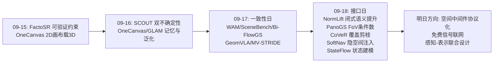
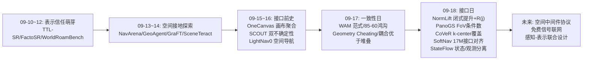
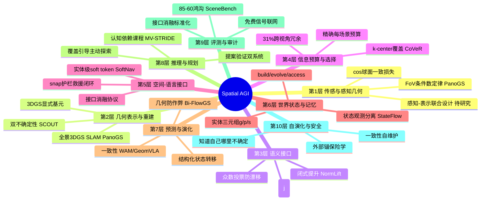
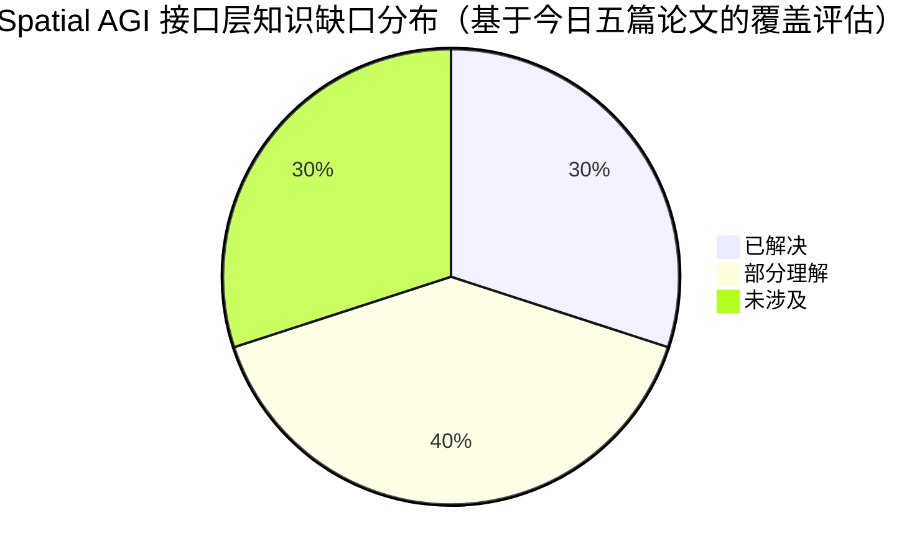

# Spatial AGI 每日思考 - 2026-09-18

**主题**: 接口日 —— 语义提升有闭式解（NormLift）、感知几何决定优化（PanoGS-SLAM）、token 选择是覆盖问题（CoVeR）、空间注入胜过文本序列化（SoftNav）、世界状态先于观测（StateFlow）

---

## 📅 每日总结

**日期**: 2026-09-18
**论文数量**: 5篇
**主题**: 昨日的主题是"一致性"——空间智能的所有组件必须共享同一个几何真相。今天的五篇论文从完全不同的入口汇聚到同一个被系统性低估的对象上：**接口（interface）**——感知与表示之间的语义提升层（NormLift）、感知几何与优化问题之间的传感层（PanoGS-SLAM）、多视角观测与 LLM 上下文之间的 token 选择层（CoVeR）、3D 场景与语言模型之间的注入层（SoftNav）、世界与观测之间的状态层（StateFlow）。五篇论文用五种完全不同的方法（代数、几何、组合优化、表征对齐、形式化建模）论证了同一件事：**空间智能的下一步突破不在更大的模型，而在被正确形式化的接口**。

**今日论文**:
1. **NormLift** (2609.18898) — 2D CLIP 特征提升到 3D 高斯 = CLIP 单位球上的余弦对齐问题；L2 归一化反投影是闭式最优解；范数代数分解为视图内+视图间一致性 → 免费的每高斯可靠性分数 R(j)；CLIP 线性插值漂移率 33.6%
2. **PanoGS-SLAM** (2609.17387) — 首个全景 3DGS SLAM：球域原生可微光栅化（ERP 雅可比含 secθ）+ cosθ 球面一致光度损失 + 深度引导增量建图；前端 15 次迭代收敛（MonoGS 的 1/7）；控制变量实验证明 FoV 单调改善优化条件数
3. **CoVeR** (2609.08345) — 多视角 3D token 剪枝 = 精确预算下的 k-center 覆盖问题；自适应体素初始化 + 体素初始化 FPS 的确定性纯几何方案；8% token 保留 93.5% 性能，三基准平均超 SOTA 3.9pp
4. **SoftNav** (2607.14586) — 控制变量消融证明 VLM 导航的表征鸿沟在文本序列化接口而非模型容量；实体级 soft token 注入只需 17M 参数 + 1,200 样本（双端冻结）；OVON 三 split SR 74.2/68.3/66.7 全面 SOTA 并零样本迁移真机
5. **StateFlow** (2608.12314) — 生成式预可视化重形式化为持久 3D 世界状态建模：W = {实体(g,p,s)}，build/evolve/access 三分解；视频是世界的观测不是世界本身；VLM 提案 + 渲染反馈验证的双系统相机规划

**关键突破**:
- 🚀 **接口的形式化红利**：NormLift 证明被全社区使用了两年多的"加权反投影+归一化"启发式，换一个目标函数重新推导后不仅成为闭式定理，还免费产出范数分解的可靠性信号——正确形式化的副产品价值首次被完整展示
- 🚀 **感知几何 = 优化变量**：PanoGS-SLAM 的 FoV 控制变量实验把"视场角"从传感器选型参数提升为可微 SLAM 优化性质的决定因子（角覆盖单调改善条件数与收敛）——15 迭代 vs 105 迭代的对比证明"约束质量可以兑换计算量"
- 🚀 **纯几何打败学习信号**：CoVeR 用 1970 年代的 k-center 贪心 + 二分体素，在三个空间推理基准上打败了 attention/特征打分的端到端剪枝器——31% 的跨视角 token 重复率证明多视角推理的冗余本质是几何的，学习信号反而会把预算花在近重复上
- 🚀 **接口即瓶颈的定量证据**：SoftNav 的控制变量实验（固定编码器与 VLM，只换接口）首次统计显著地证明文本序列化造成性能损失且加大模型无法弥补——大量"VLM 空间能力差"的结论可能错怪了模型
- 🚀 **状态先于观测**：StateFlow 的"视频是观测不是世界"区分修正了视频世界模型叙事的概念基础；build/evolve/access 三分解给"世界模型"提供了可独立演进、独立评测的形式化骨架

**架构演进**: 昨日"一致性五项性质 + 审计标准化路线图" → 今日"接口理论化"——昨日问"各层之间如何不互相撒谎"，今日回答"各层之间应该如何对话"：NormLift 给出接口的目标函数设计原则（匹配下游查询几何）、CoVeR 给出接口的预算工程（精确每场景保证）、SoftNav 给出接口的对齐成本下界（表示两端够好时仅需 17M 参数）、PanoGS-SLAM 给出接口上游的感知设计原则（覆盖度决定条件数）、StateFlow 给出接口的最上游抽象（状态先于一切观测）

### 📊 一句话总结
今天的五篇论文把 Spatial AGI 的瓶颈从"模型容量"重新定位到"接口形式化"——语义提升的闭式解（NormLift）、传感几何的条件数（PanoGS-SLAM）、token 选择的覆盖保证（CoVeR）、隐空间注入的低成本对齐（SoftNav）、状态优先的世界建模（StateFlow）共同指向一个设计原则：**空间智能系统的每一层接口都值得像模型一样被认真形式化，而且正确形式化的回报是闭式解、免费置信、精确预算和跨模型迁移**。

### 🔗 延续性
**昨日→今日**: 昨日的"一致性审计标准化"路线图里有四个审计面（重建/预测/理解/训练），今天补上了第五个也是被忽视最久的面——**接口审计**：(1) 昨日 Bi-FlowGS 说"监督要锚在作弊不可达的层"，今日 NormLift 说"接口目标要定义在与下游消费一致的几何里"——两者是同一个"层对齐"原则在训练侧与接口侧的实例；(2) 昨日 SceneBench 的 85/60 鸿沟说 VLM"会描述不会测量"，今日 SoftNav 说"VLM 导航差可能错怪了模型，瓶颈在文本接口"——两篇合起来：VLM 的空间能力被接口和评测同时低估了；(3) 昨日 WAM 综述建立世界-动作模型概念地图，今日 StateFlow 给出世界模型的形式化骨架（状态/演化/观测三分解）——昨天有地图，今天有地基；(4) 昨日 GeomVLA 证明感知-预测-控制耦合优于堆叠，今日 NormLift+CoVeR+SoftNav 三篇给出"耦合"在表示层的实现细节——语义方向、token 选择、隐空间注入都是耦合的具体形态。

**今日→明日**: 值得追踪——(1) 空间中间件的标准化：NormLift 式语义提升、CoVeR 式 token 选择、SoftNav 式实体注入能否统一成一套"空间 token 协议"；(2) FoV 条件数定律的理论化：经验单调性 → 可微位姿估计的条件数下界；(3) R(j)/d_H/渲染反馈——今日三篇论文各自发明了免费的置信/质量信号，它们能否统一为空间表征的通用诊断量；(4) 生成式（StateFlow）与重建式（PanoGS）世界状态的合流：实体化状态表作为公共交换格式；(5) 纯几何中间件的边界：哪些空间中间件问题注定需要学习信号，哪些永远属于确定性算法。

### 💡 本质思考：如何达成通用空间智能

#### 1. 核心能力的本质是什么？
昨日把空间智能的本质归结为"跨层几何一致性"。今天再深一层：**一致性的成本取决于接口的形式化程度**。为什么各层会互相撒谎？因为接口是欠形式化的——渲染损失不约束几何（Bi-FlowGS 的漏洞）、文本坐标丢失几何精度（SoftNav 的损失）、token 打分不建模跨视角冗余（CoVeR 诊断的缺陷）、一次性生成不维护状态（StateFlow 修正的混淆）。而一旦接口被正确形式化，一致性就不再是需要训练出来的性质，而是**数学结构的自然结果**：NormLift 的归一化是目标函数的内在要求（一致性免费）、CoVeR 的精确预算是构造性保证（完备性免费）、SoftNav 的 snap 是输出空间的构造性收缩（可达性免费）、StateFlow 的状态/观测分离让多视角一致性免费。**通用空间智能的本质是：把每一个跨层接口都形式化到"一致性成为定理而非训练目标"的程度**。

#### 2. 当前方法与理想目标的差距在哪里？
- **接口是欠形式化的重灾区**：社区的注意力分配严重失衡——模型架构（transformer 变体、VLM 规模）获得 90% 的研究注意力，接口层（特征提升、坐标序列化、token 选择、状态维护）被当作工程细节。今日五篇论文证明这些"细节"里藏着闭式解（NormLift）、条件数定律（PanoGS）、覆盖保证（CoVeR）、19-26pp 的性能差距（SoftNav）和概念性错误（StateFlow 指出的状态/观测混淆）
- **接口度量缺失**：昨日指出各层缺一致性审计，今日进一步：连"接口质量"本身都没有度量。SoftNav 是第一个测量接口损失的工作，但它的方法（控制变量消融）没有被标准化——每个空间系统的论文都应报告"接口消融"，目前为零
- **免费信号无人收集**：NormLift 的 R(j)、CoVeR 的 d_H、PanoGS 的光度残差、SoftNav 的实体 token 熵——每个接口都自带免费的置信/质量信号，但没有系统收集它们。空间智能系统"知道自己哪里不确定"的前提是先把免费信号都接上
- **感知几何被当给定条件**：PanoGS 证明 FoV 决定优化条件数，但整个领域仍把传感器配置当作给定输入。没有一张"覆盖度-条件数-任务性能"的预算表
- **状态建模被观测建模遮蔽**：视频世界模型的红火掩盖了状态建模的缺位——能预测下一帧不等于能回答"什么在哪里"

#### 3. 从今天到理想状态，最可能的路径是什么？
一条"接口形式化 → 接口度量标准化 → 免费信号联网 → 感知-表示联合设计"的路径：
1. **接口形式化扫描**（近期）：像 NormLift 扫描"归一化反投影"一样，系统扫描空间智能栈的所有欠形式化接口——深度图→3D 点的不确定性传播、VLM 语言区域→3D grounding、场景图→语言上下文、多传感器融合权重。每个都问 NormLift 三问：下游以什么几何消费？当前目标函数匹配吗？形式化后有什么免费副产品？
2. **接口度量标准化**（近期-中期）：把 SoftNav 的控制变量消融变成标准协议——每个空间系统发布时报告接口消融（文本 vs soft token、序列化格式 A vs B、剪枝策略 X vs Y）。同时收集免费信号：R(j)、d_H、光度残差作为系统的"生命体征"，每篇论文报告这些量的分布。
3. **免费信号联网**（中期）：把各接口的置信信号接入统一的不确定性传播框架——语义可靠性（R(j)）加权进几何优化（PanoGS 的后端）、覆盖度量（d_H）驱动主动探索、实体 token 熵调节 VLM 的自信任。终点是"端到端知道自己哪里不确定"的空间智能管线。
4. **感知-表示联合设计**（长期）：把 PanoGS 的 FoV 条件数定律推广成感知-表示联合设计理论——给定任务与算力预算，反推最优的传感几何、表示粒度与接口形式。终点形态：空间智能系统不是"拿现有传感器训现有模型"，而是"为一个形式化良好的接口族设计整个感知-表示-推理栈"。

---

## 🔗 与昨日思考的联系

### 昨日重点
昨日主题是"一致性日"——五篇论文（WAM 综述、SceneBench、Bi-FlowGS、GeomVLA、MV-STRIDE）把空间智能的本质收敛为"跨层几何一致性"：渲染不撒谎（Geometry Cheating）、预测不撒谎（plausible ≠ actionable）、语义不撒谎（85/60 鸿沟）、任务不撒谎（依赖约束防捷径）。并给出四步路线图：一致性审计标准化 → 闭环锚定化 → 分数打通 → 结构自动化。

### 今日进展
今天五篇论文回答了昨日路线图隐含的下一个问题：**一致性如何廉价地获得？** 答案是接口形式化。昨日的一致性是"各层不互相撒谎"的约束条件，今天展示了一致性可以成为"接口正确形式化的数学推论"：

- **NormLift × Bi-FlowGS**：昨天说监督要锚在作弊不可达的层（光流对应），今天说接口目标要定义在与下游消费一致的几何（CLIP 球面余弦）。同一个"层对齐"原则，一个省下作弊损失，一个省下归一化错误
- **SoftNav × SceneBench**：昨天 85/60 鸿沟说明 VLM 在理解侧被高估，今天 SoftNav 说明 VLM 在行动侧被低估（瓶颈在文本接口）——两篇合起来：**评测和接口同时扭曲了我们对 VLM 空间能力的认知**，真实的 VLM 比两个数字显示的都更"偏科"
- **StateFlow × WAM 综述**：昨天 WAM 给出世界-动作模型的概念地图（分类学），今天 StateFlow 给出形式化地基（状态/演化/观测三分解）——地图需要地基，今天补上了
- **CoVeR × MV-STRIDE**：昨天说数据结构即课程（认知依赖图），今天说信息选择即覆盖（空间 k-center）——两者都是"用任务/空间的显式结构替代端到端学习"的成功案例

### 演进路径



---

## 📚 论文概览

### 1. NormLift（KAUST）— 语义提升的闭式定理
从 3D 侧重新推导特征提升：每个高斯的语义分配 = CLIP 单位球上的余弦对齐问题，L2 归一化反投影特征是闭式最优解。同一推导的代数恒等式把范数分解为视图内/视图间一致性，经有效视图数校准后成为免费的每高斯可靠性 R(j)。可靠性引导"众数投票"（复制而非平均邻居方向）修复弱证据高斯。training-free，ScanNet 分割超 training-based 基线，后处理比 SFS 快 6.7×。**元贡献：证明接口形式化的副产品（免费置信信号）有时比主结果更值钱。**

### 2. PanoGS-SLAM（浙大/蚂蚁/国防科大）— 感知几何决定优化地形
首个全景 3DGS SLAM：不做透视裁切，直接在球域做可微光栅化与位姿优化。ERP 面积畸变用 cos(纬度) 权重解析补偿，投影雅可比保证高斯极区正确拉伸。深度引导增量初始化（DGIS）解决新区域弱约束问题。前端 15 迭代收敛（MonoGS 1/7），部分序列精度领先约一个数量级。**元贡献：FoV 控制变量实验把感知几何提升为优化性质的设计变量——角覆盖单调改善条件数。**

### 3. CoVeR（Meta/CMU）— token 选择的覆盖定理
多视角 3D token 剪枝的形式化：精确预算下最小化有向 Hausdorff 距离（k-center 问题）。两阶段确定性纯几何方案：自适应体素初始化（二分搜索逐场景体素尺寸）+ 体素初始化 FPS（补覆盖盲区）。同时解决学习型剪枝的近重复缺陷与体素化的预算失控/69% 饱和平台。8% token 保留 93.5% 性能，跨 4 个 VLM 即插即用。**元贡献：证明空间智能的中间件问题往往属于经典几何算法的领地，且确定性方案可跨模型零成本迁移。**

### 4. SoftNav（浙大/山大）— 空间注入胜过文本序列化
控制变量消融首次量化文本接口的性能损失（统计显著、加大模型无法弥补）。方案：PQ3D 实体级查询嵌入经 2 层 MLP 注入冻结 Qwen2.5-VL-3B 隐空间，VLM 输出坐标 snap 到合法前沿（距离比护栏 r=2）。双端冻结 + 17M 参数 + 1,200 蒸馏样本，OVON 三 split SR 74.2/68.3/66.7 SOTA（+19-26pp），零样本迁移 GOAT-Bench/SG3D/真机。**元贡献：把"接口质量"变成可测量、可优化的对象，并给出空间-语言接口的标准形态（连续向量、实体粒度、隐空间注入）。**

### 5. StateFlow（北交大/北大/BAAI）— 状态先于观测
生成式预可视化重形式化为持久世界状态建模：W = {实体(g,p,s)}；三函数分解 W⁰=F_build(C), W^{t+1}=F_evolve(W^t), y^t=F_access(W^t)。构建：前视图（资产）+BEV（布局）双视图冲突感知初始化 + 接地先验提升 3D；演化：意图→状态表局部更新（保世界记忆）；访问：VLM 提案 + 渲染反馈验证的相机规划。**元贡献：视频是观测不是世界——状态/观测分离修正视频世界模型的概念基础，build/evolve/access 是世界模型的形式化骨架。**

---

## 💡 核心见解

### 见解1: 正确的目标函数会免费产出元信息——NormLift 的范数分解
**从 NormLift 获得**
- ✅ 同一个余弦对齐目标，既给出语义方向（闭式解）又给出可靠性分数（范数分解）——两个_outputs_出自一个公式
- ✅ R(j) 与 opacity 在 84% 高斯上独立：语义可靠性与几何可见性是正交信号轴
- ✅ 33.6% 的 CLIP 线性插值漂移率：所有在嵌入空间做平均的空间方法都在承担系统性风险

**对Spatial AGI的启发**:
这是"表示即诊断"的完整示范。Spatial AGI 的每个接口都应被审计一次：我的目标函数定义对了吗？它有没有免费的副产品（置信度、质量分、覆盖度量）？此前这些元信息靠额外的置信度网络或启发式过滤获得，NormLift 证明它们常常是代数地"免费"的。推广猜测：深度不确定性可能藏在重投影残差的结构里，场景图质量可能藏在关系边的几何一致性里——值得逐一开挖。

### 见解2: 感知几何是优化问题的设计变量——PanoGS 的条件数定律
**从 PanoGS-SLAM 获得**
- ✅ 控制变量实验：FoV 90°→360°，条件数、收敛迭代数、稳定性全部单调改善
- ✅ 15 迭代 vs 105 迭代：约束质量可以直接兑换计算量，汇率约 7:1
- ✅ cosθ 损失权重一行公式解决 ERP 极区梯度失衡——解析修正优于启发式补丁

**对Spatial AGI的启发**:
这改变了传感器选型的地位：从"给定条件"变成"设计变量"。具身 agent 的视角规划不仅要最大化任务信息增益，还要维持下游优化的各向同性；全景感知是一种"结构性先验"，比任何算法修补都根本。推广到其他感知维度：事件相机的时间覆盖、多模态的光谱覆盖、多 agent 的空间覆盖——都可以问同一个问题：约束的各向同性如何改善学习的条件数？

### 见解3: 多视角冗余是几何冗余——纯几何算法的复仇
**从 CoVeR 获得**
- ✅ 31% 的 token 是跨视角近重复观测：不剪枝的话三分之一算力在重复计算同一表面
- ✅ 学习型重要性打分把预算花在近重复上（它们单图内都"重要"）——单图先验外推到多图设定会系统性失效
- ✅ 8% token 保留 93.5% 性能 + 跨 4 VLM 零成本迁移：确定性几何选择器的性能与泛化双优

**对Spatial AGI的启发**:
设计准则：**冗余/一致性结构本质是几何的问题，优先用确定性几何算法**。空间智能系统栈可以画一条分界线——几何层（坐标/覆盖/可见性/一致性）用确定性算法（FPS/k-center/Hausdorff/二分），语义层用学习模型。跨界默认从确定性侧开始，只在证明必要时引入学习。这与端到端信仰正面冲突，而证据站在分界线这边。

### 见解4: 接口即瓶颈——SoftNav 的控制变量实验
**从 SoftNav 获得**
- ✅ 固定编码器与 VLM、只换接口（文本序列化 → soft token）：性能差异统计显著，丰富文本通道与加大模型都无法弥补
- ✅ 对齐成本的下界极低：双端表示够好时，17M 参数 + 1,200 样本足以打通 3D 编码器与 VLM
- ✅ 学生超教师 19-26pp：接口打通后，VLM 的语言推理资源全部兑现——"通用模型 + 正确接口 > 专用模型"

**对Spatial AGI的启发**:
昨日 SceneBench 说 VLM 被高估（理解侧），今日 SoftNav 说 VLM 被低估（行动侧）——评测与接口同时扭曲了我们对模型能力的认知。方法论层面：每个空间系统都应做接口消融（像 SoftNav 一样控制变量换接口），这个协议应该标准化。工程层面：空间信息进语言模型的正道是连续向量、实体粒度、隐空间注入——文本序列化应被视为 anti-pattern。

### 见解5: 视频是观测不是世界——StateFlow 的概念修正
**从 StateFlow 获得**
- ✅ build/evolve/access 三分解把纠缠在生成模型里的三个角色分开：世界状态、其演化、其观测
- ✅ 状态/观测分离使多视角一致性免费（同一状态的任意渲染自动一致）、编辑 well-defined（改状态表而非改帧）
- ✅ 提案-验证双系统：VLM 提案相机轨迹、几何渲染当裁判——生成式系统提假设、确定性系统做验证

**对Spatial AGI的启发**:
对任何声称"世界模型"的系统，用三个问题审计：状态在哪（可查询吗）、一致性从哪来（共享表示还是生成先验）、怎么编辑（状态层还是观测层）。StateFlow 的实体三元组状态表 (g,p,s) 是最小可行世界模型的形式化骨架——WAM 综述（昨日）给了地图，StateFlow 给了地基。生成式（StateFlow）与重建式（PanoGS）世界状态的合流点是实体化状态表：真实与生成的边界在状态层消失。

### 见解6: 接口的度量几何必须匹配消费方式——今日论文的最大公约数
**从 NormLift + CoVeR + SoftNav 共同获得**
- ✅ NormLift：特征提升的目标定义在 CLIP 球面（余弦）而非渲染平面（欧氏）——匹配下游查询方式
- ✅ CoVeR：token 选择的目标定义在 3D 覆盖（Hausdorff）而非显著性——匹配多视角冗余结构
- ✅ SoftNav：3D 信息的传递用连续嵌入（隐空间）而非离散符号（文本）——匹配语言模型的向量消费方式

**对Spatial AGI的启发**:
三篇论文在三个完全不同的接口上验证了同一条元原则：**接口损失 = 数据的真实几何与接口的隐含几何之间的错配**。这给了空间智能一个可操作的审计流程：对每个接口，问三个问题——数据在什么度量空间里流动？下游以什么方式消费？两者的错配在哪里？NormLift 的归一化错误、CoVeR 的显著性误用、SoftNav 的文本离散化，都是错配的具体形态。

### 见解7: 空间智能需要自己的"中间件理论"——今日论文合成的学科信号
**从五篇论文整体获得**
- ✅ 五篇论文五种方法（代数/几何/组合优化/表征对齐/形式化建模），五种应用（分割/SLAM/剪枝/导航/创作），却共享同一研究对象：接口
- ✅ 接口形式化的回报模式一致：闭式解（NormLift）、单调定律（PanoGS）、近似保证（CoVeR 的 FPS 2-近似）、统计显著差异（SoftNav）、概念澄清（StateFlow）
- ✅ 接口研究的成本收益比极高：都是论文级工作量的理论+实验，却产出模型级的影响力（SOTA 或概念修正）

**对Spatial AGI的启发**:
昨日的一致性路线图回答"要审计什么"，今日补上"如何廉价地通过审计"——答案是接口形式化。这标志着领域的成熟：从方法爆发期进入理论清算期。可预见的分支学科：空间中间件的形式化规范（类似数据库的 ACID）、接口消融的标准化协议（类似消融实验的惯例）、免费置信信号的统一收集框架（类似分布式系统的可观测性）。每个都是论文生态级的空白。

---

## 🗺️ 知识演进图



---

## 技术栈演进对比表

| 层次 | 昨日方案 | 今日方案 | 变化 |
|------|---------|---------|------|
| 语义接口 | 渲染侧近似提升（SFS 逆问题/VALA 中位数），归一化当后处理 | NormLift：球面余弦对齐闭式解 + 范数分解免费置信 + 众数投票 | 启发式 → 定理 + 免费信号 |
| 感知-优化接口 | 窄 FoV 针孔假设，FoV 当给定条件 | PanoGS：球域原生光栅化 + cosθ 损失 + FoV 条件数定律 | 传感几何 → 设计变量 |
| token 预算 | 学习型打分（近重复浪费）或体素化（69% 饱和/44% 超支） | CoVeR：k-center 覆盖 + 精确每场景预算 + 跨模型迁移 | 打分 → 覆盖保证 |
| 3D→LLM 接口 | 文本序列化（坐标/场景图字符串） | SoftNav：实体级 soft token 隐空间注入，17M 参数对齐 | 符号 → 连续向量 |
| 世界建模 | 视频生成当世界模型（观测预测） | StateFlow：持久状态表 + build/evolve/access 三分解 | 观测 → 状态 |
| 置信信号 | 每系统自造（SCOUT 双不确定性等） | R(j)/d_H/渲染反馈等免费信号开始涌现，待统一 | 自造轮子 → 可标准化 |
| 一致性获得方式 | 训练目标约束（昨日 Bi-FlowGS 式监督锚定） | 接口形式化使一致性成为定理（今日五篇） | 训练出来的 → 数学保证的 |

---

## 🗺️ Spatial AGI 知识图谱

### 10层架构思维导图



### 🎯 主线技术路径

#### 阶段1: 接口形式化扫描（当前-3个月）
像 NormLift 扫描归一化反投影一样，系统盘点空间智能栈的全部欠形式化接口（深度→点不确定性、语言→grounding、场景图→上下文、融合权重），每个都问三问：下游消费几何是什么？目标函数匹配吗？形式化后有什么免费副产品？产出：接口清单 + 每个接口的候选形式化。

#### 阶段2: 空间中间件协议化（3-9个月）
把 NormLift（语义提升）、CoVeR（token 选择）、SoftNav（实体注入）的接口标准化为可组合的中间件协议：统一的实体状态表（StateFlow 的 g/p/s 扩展物理维）、统一的空间 token 词汇表（物体/前沿/区域/关系/可供性）、统一的置信信号格式（R(j)/d_H/残差）。验证标准：中间件级即插即用（像 CoVeR 跨 4 个 VLM 一样跨整个栈）。

#### 阶段3: 免费信号联网与接口审计标准化（9-18个月）
把各接口的免费置信信号接入统一不确定性传播框架：语义可靠性加权几何优化、覆盖度量驱动主动探索、token 熵调节模型自信任。同时把 SoftNav 式控制变量消融变成发布标准：每个空间系统报告接口消融与免费信号分布。终点：空间智能系统自带"生命体征监控"。

#### 阶段4: 感知-表示联合设计与状态统一（18个月+）
把 FoV 条件数定律理论化并推广（时间覆盖、光谱覆盖、多 agent 覆盖），形成感知-表示联合设计理论：给定任务与预算反推最优传感几何与接口族。同时完成生成式（StateFlow）与重建式（PanoGS）世界状态的合流——实体化状态表成为公共格式，真实与生成的边界在状态层消失。终点形态：为一个形式化良好的接口族设计整个感知-表示-推理栈的空间智能系统。

---

## 🔍 待探索议题

### 高优先级（本周）

1. **空间 token 词汇表的统一设计**
   - 问题: SoftNav 的物体/前沿 token、CoVeR 的覆盖 token、StateFlow 的 g/p/s 状态能否统一成一套空间 token 协议？
   - 候选方案: 以实体三元组为基础，定义 token 类型学（物体/前沿/区域/关系/可供性）+ 每类的注入/选择规范
   - 缺口: 没有跨论文的接口兼容性验证；关系类 token（A 在 B 上）的表示未定

2. **NormLift 的流式化**
   - 问题: 批处理反投影如何改造成增量/在线版本（与 PanoGS 类 SLAM 前端耦合）？
   - 候选方案: 滑窗反投影 + 增量 R(j) 更新 + 事件触发局部众数投票
   - 缺口: 增量条件下的范数分解误差界；旧贡献退出策略

3. **接口消融协议标准化**
   - 问题: 如何把 SoftNav 的控制变量实验变成社区标准协议？
   - 候选方案: 定义标准接口对照组（文本序列化/soft token/结构化 prompt），报告差异的显著性检验
   - 缺口: 需要一个中立的基准任务族；跨实验室可复现性

### 中优先级（本月）

4. **FoV 条件数定律的理论化**
   - 问题: PanoGS 的经验单调性能否上升为可微位姿估计的条件数下界定理？
   - 候选方案: 在简化光度模型下推导 Fisher 信息/条件数与角覆盖的解析关系
   - 缺口: 真实纹理分布下的理论-实验差距

5. **d_H 作为主动探索的价值函数**
   - 问题: CoVeR 的覆盖度量能否驱动 agent 的视角规划（覆盖率最大化探索）？
   - 候选方案: d_H 的在线估计 + 与任务信息增益的加权组合
   - 缺口: d_H 只度量空间覆盖不度量语义覆盖——语义感知的覆盖度量待设计

6. **免费置信信号的统一格式**
   - 问题: R(j)（语义可靠性）、d_H（覆盖）、光度残差（几何）如何接入统一的不确定性传播框架？
   - 候选方案: 仿分布式系统可观测性，定义空间系统的 metrics/traces/logs 三件套
   - 缺口: 不同信号的概率语义不同（一致性≠置信度），需要校准层

7. **重建式世界的实体化**
   - 问题: 如何从 SLAM/3DGS 重建中自动提取 StateFlow 式实体状态表（物体 g/p/s）？
   - 候选方案: 增量实例分割（PQ3D 路线）或 NormLift 语义聚类 + 几何拟合
   - 缺口: 实体边界的几何判据；部分观测下的实体补全

### 低优先级（本季度）

8. **语义加权覆盖的两层预算**
   - 问题: CoVeR 的均匀覆盖如何在保底之上做任务自适应加密而不退回模型特定？
   - 候选方案: 均匀覆盖保底 + 轻量语言条件加权微调，权重也做跨模型校准
   - 缺口: "任务聚焦 vs 模型无关"的 trade-off 定量刻画

9. **众数投票 vs 鲁棒统计聚合的系统对比**
   - 问题: NormLift 众数投票、VALA 余弦几何中位数、LUDVIG 图扩散——三类修复算子的适用域边界？
   - 候选方案: 在语义边界/渐变/离群三类区域做受控对比
   - 缺口: 缺一个带语义边界真值的诊断数据集

10. **状态表的物理增维**
    - 问题: StateFlow 的 (g,p,s) 三元组如何扩展物理属性（质量/摩擦/关节）以支撑动力学演化？
    - 候选方案: 状态表 + 可微物理引擎的联合演化，转移后物理验证
    - 缺口: 物理参数的感知来源（从视频估计质量/摩擦仍是开放问题）

---

## 📊 知识缺口分析



**已解决（30%）**:
- ✅ 语义提升接口的闭式形式化（NormLift：球面余弦对齐 + 免费可靠性）
- ✅ 多视角 token 剪枝的形式化与精确预算（CoVeR：k-center + 确定性方案）
- ✅ 3D→LLM 接口的正确形态与对齐成本下界（SoftNav：17M/1,200 样本）
- ✅ 感知几何对优化性质的影响方向（PanoGS：FoV 单调改善条件数）
- ✅ 世界模型的形式化骨架（StateFlow：状态/演化/观测三分解）

**部分理解（40%）**:
- ⚠️ 接口形式化的普适方法论（NormLift 模式可复制但无系统清单）
- ⚠️ 免费置信信号的概率语义（R(j)/d_H 的校准与融合未定）
- ⚠️ 生成式与重建式世界状态的合流（实体化是瓶颈）
- ⚠️ FoV/覆盖度定律的定量边界（室内→室外、单传感器→多传感器的推广）
- ⚠️ 修复算子的适用域（众数投票/中位数/扩散的边界）
- ⚠️ 接口损失与下游任务类型的映射（哪些任务对接口最敏感）

**未涉及（30%）**:
- ❌ 动态/时序接口（所有五篇都是静态世界假设；时序 token、动态实体、流式提升全部空白）
- ❌ 接口消融的社区标准化（只有 SoftNav 一篇做了，无协议、无基准）
- ❌ 多 agent 空间接口（agent 间共享空间状态的标准交换格式）
- ❌ 物理属性的状态表示与感知（质量/摩擦/关节从视频估计是开放问题）
- ❌ 接口安全（对抗扰动对语义提升/token 选择/soft token 注入的攻击面分析）

---

## 🎯 明日展望

基于今日"接口日"的收敛，明日的自然延续方向：

1. **空间 token 协议的首次综合**——如果检索到 token 化/接口标准类论文，把今日五篇的接口形态（球面方向/覆盖子集/隐空间向量/状态表）纳入统一分类；
2. **动态接口**——追踪任何处理时序/动态场景的接口论文（流式提升、动态实体 token），填补今日最大的知识缺口；
3. **接口对抗鲁棒性**——关注任何 token/嵌入层攻击或防御论文，开启"接口安全"这一未涉及象限。

**今日最值得记住的一句话**: 空间智能的下一步突破不在更大的模型，而在被正确形式化的接口——正确形式化的回报是闭式解、免费置信、精确预算和跨模型迁移。

---

*本文档基于 2026-09-18 精读的 5 篇论文生成，延续 2026-09-17"一致性日"的思考主线。所有论文事实引用见 papers/2026-09-18_*.md，推断与观点已在文中标注。*

---

## 🔬 论文级深读笔记

### 深读1: NormLift 的数学结构为什么重要

**表面的贡献**是一个更好的 3D 语义分割方法。**实际的结构**是三件事从同一个 Lagrange 推导里掉出来：

1. **归一化的正当性**：u* = f_j/||f_j|| 是约束优化的解，不是后处理。此前社区把归一化当可有可无的工程步骤——跳过它的实现实际上在解一个错的问题（欧氏重建 vs 球面对齐）。
2. **可靠性的代数化**：||f_j||² 的展开是恒等式不是近似——视图内能量 + 视图间一致性。这意味着 R(j) 不是"学出来的置信度"而是"数据结构的精确定性描述"。这就是为什么它与 opacity（可见性代理）在 84% 高斯上独立：它们度量的是不同的东西。
3. **修复算子的约束**：33.6% 插值漂移（Property 3）+ 球面有效性要求 → 修复必须是"复制观测方向"而非"合成新方向"。众数投票是被几何逼出来的，不是拍脑袋的设计。

**可复制的研究模板**（已写入论文1附录，此处提炼）：
- 找到被广泛使用但只有启发式辩护的操作
- 换一个与下游消费方式一致的目标函数重新推导
- 检查新推导是否附带可解释副产品
- 用副产品设计零成本改进模块
- 用"training-free 打败 training-based"作为说服力锚点

**候选开挖点**（按此模板逐一检查）：
- 深度→点云的反投影（深度不确定性有代数结构吗？）
- 多视角特征融合的加权平均（同款漂移问题？）
- 场景图边的构建阈值（几何一致性有闭式判据吗？）
- VLM prompt 里坐标的序列化精度（量化损失的解析刻画？）

### 深读2: PanoGS 条件数定律的三个推论

**推论1: 传感器预算表**
SLAM 系统设计文档应该有一张"覆盖度-条件数"预算表，与算力预算并列。给定任务（定位精度需求）与平台（算力上限），可以反推最低传感器覆盖要求。PanoGS 的曲线族是第一份实证数据。

**推论2: 主动感知的第二目标**
视角规划的目标函数历来是任务信息增益（看哪里最有利于找目标）。条件数定律加了第二项：**维持优化的各向同性**——避免长时间只看一个方向导致位姿可观测性退化。两项的权重与切换条件是开放的控制问题。

**推论3: 对仿真训练的迁移要求**
在窄 FoV 仿真里训练的位姿估计/SLAM 策略，部署到全景硬件时优化地形完全不同——这不是简单的 domain gap 而是问题良构性的变化。仿真到真实的迁移要包含"感知几何"这一维度。

### 深读3: CoVeR 的两个数字为什么比 SOTA 更重要

**31%**：跨视角 token 重复率。这是多视角推理的"暗损耗"——没有人测量它，所以没有人优化它。任何声称多视角能力的工作都应先报告这个数字（它决定了剪枝的收益上限）。

**8%/93.5%**：信息压缩比的实证下界。这个数字的含义超出剪枝：它说明**当前多视角推理任务的"空间信息熵"极低**——93.5% 的任务性能只需要 8% 的空间覆盖点。这不是模型的胜利而是任务的性质：现有基准的空间问题只需要场景骨架。反推：如果未来基准考"桌上第三个杯子上的花纹"，8% 就不够了。覆盖需求的任务依赖性值得显式建模。

### 深读4: SoftNav 训练效率的分解审计

为什么 17M 参数 + 1,200 样本够？把学习问题拆开：

| 能力 | 来源 | 训练需求 |
|---|---|---|
| 场景里有什么 | PQ3D 预训练（冻结） | 0 |
| 指令说什么 | Qwen2.5-VL 预训练（冻结） | 0 |
| 图像长什么样 | DINOv3 预训练（冻结） | 0 |
| 768d→2048d 分布对齐 | MLP projector | ~1,200 样本 |
| 决策风格（像教师） | LoRA 微调 | 同上 |

唯一的新学习是**分布对齐**——这不是知识获取而是坐标变换，样本需求天然是千级而非十亿级。这给所有"通用底座 + 专用接口"的系统定了价：**接口对齐的成本与知识无关，只与分布错配的复杂度有关**。

### 深读5: StateFlow 三函数与控制论的同构

W⁰=F_build(C), W^{t+1}=F_evolve(W^t), y^t=F_access(W^t) 与控制论的状态空间模型（x_{t+1}=f(x_t,u_t), y_t=h(x_t)）同构——观测函数 h 对应 F_access，状态转移 f 对应 F_evolve。区别在于：
- 控制论的状态是连续动力学的最小变量集；StateFlow 的状态是创作语义的实体表；
- 控制论的观测函数已知且确定；StateFlow 的观测函数（渲染+视频增强）有生成随机性。

同构的意义：控制论几十年的成果（可观性、可控性、观测器设计、卡尔曼滤波）都有空间智能的对应物——StateFlow 的"渲染反馈反射"本质是**观测器**（从观测反推状态误差并修正）。空间智能的世界模型研究可以直接进口控制理论的工具箱，这是一条被忽视的捷径。

---

## 💭 方法论反思：本周论文的元模式

### 模式1: "重新形式化"的胜利频率异常高
本周 13 篇论文中，至少 5 篇的核心贡献是"把 X 重新形式化为 Y"：Bi-FlowGS（重建→光流对应约束）、WAM（预测+控制→统一算子）、NormLift（提升→球面对齐）、CoVeR（剪枝→k-center）、StateFlow（预可视化→状态建模）。这不是巧合：领域初期的快速扩张留下大量"能用但没想清楚"的操作，理论清算期的红利就在这里。

### 模式2: 确定性组件回归
NormLift（闭式解）、CoVeR（FPS）、PanoGS（解析雅可比）、SoftNav 的 snap/护栏、StateFlow 的渲染验证——本周所有系统都在关键路径上放了确定性组件，学习模型只负责语义与提案。**"神经提案 + 确定性验证"** 正在成为空间智能系统的标准架构模式，它同时解决性能（验证器保证下界）、安全（约束可达性）与可审计性（验证器可解释）。

### 模式3: 免费信号经济学
每个接口形式化都附带免费元信息：R(j)（语义置信）、d_H（覆盖度）、光度残差（几何质量）、条件数（优化健康度）、token 熵（语言置信）。这些信号目前各自为政，但它们是空间智能系统的"自主神经系统"——没有它们系统不知道自己哪里不确定，有了它们主动探索、自适应信任、安全停止都成为可能。**把免费信号联网是比任何一个 SOTA 都更有杠杆的工程。**

---

## 🧪 思想实验：用今日五篇组装一个最小 Spatial AGI

假设目标是"家庭机器人：听懂指令、找东西、做预演、执行"。用今日组件组装：

```
第1步 感知底座（PanoGS-SLAM）
  全景相机 → 实时毫米级轨迹 + 全景高斯地图
  （FoV 条件数保证前端稳、快、省算力）

第2步 语义化（NormLift，流式化）
  高斯地图 → 语义方向 u_j* + 可靠性 R(j)
  （开放词汇查询：找杯子 → 毫秒级定位，R(j) 给出置信）

第3步 实体化（StateFlow 状态表 + PQ3D 式分割）
  语义高斯 → 实体状态表 {(g, p, s)}
  （杯子在桌上、门在东北角、状态=当前世界观）

第4步 指令理解与决策（SoftNav 接口）
  状态表实体 → soft token → VLM
  "去拿客厅的蓝色杯子" → 实体 token 上推理 → 输出目标实体
  （snap 到可执行路点，护栏防绕路）

第5步 预演（StateFlow 演化）
  执行前在状态表上做意图→状态转移推演
  渲染反馈验证动作序列的几何可行性
  （拿起杯子会碰倒花瓶吗？渲染检查）

第6步 执行与在线更新
  执行中 SLAM 持续更新地图 → 状态表 → token（闭环）
  R(j) 低区域安排补看（CoVeR/d_H 驱动的主动感知）
```

**组件缺口盘点**（诚实清单）：
- NormLift 流式化不存在（今日是批处理）→ 需要研究
- 语义高斯→实体表自动提取不完整 → 需要研究
- 动态物体（猫跳上桌）会污染状态表 → 需要动态实体管理
- 物理预演需要状态表物理增维 → StateFlow 未含物理
- 全景相机在消费级机器人的普及度 → 硬件依赖

**结论**：栈的每一层都有今天的论文托底，缺的是层间的胶水（流式化、实体化、动态管理）。这印证了今日主论点——瓶颈在接口与中间件，不在任何单点能力。

---

## 📈 与本周主线的整合：从性质到接口到协议

本周思考的演进链条：

| 日期 | 主题 | 核心命题 | 关键产物 |
|---|---|---|---|
| 09-15~16 | 信任与行动萌芽 | 表征要可预测/可信任 | 双不确定性、可验证约束 |
| 09-17 | 一致性日 | 各层不能互相撒谎 | 审计标准化路线图 |
| 09-18 | 接口日 | 一致性的廉价获得 = 接口形式化 | 五个接口的定理级方案 |

递进关系：09-17 定义了**要什么**（一致性），09-18 给出了**怎么廉价拿到**（接口形式化）。下一步自然是**协议化**——把接口形式化的成果标准化为可组合的中间件协议，让"一致的空间智能系统"可以从认证组件拼装而不是每篇论文重造。

协议化的三个具体抓手（已列入待探索议题）：
1. 空间 token 词汇表（物体/前沿/区域/关系/可供性 + 注入/选择规范）
2. 免费信号三件套（metrics: R(j)/d_H/残差；traces: 接口消融；logs: 状态表 diff）
3. 实体状态表 schema（g/p/s + 物理增维 + 时间戳 + 置信附件）

---

## ❓ 自问自答（深化检验）

### Q1: 今日主论点"接口优先于模型"会不会被更强的端到端模型证伪？
可能被部分证伪：如果未来的 VLM 原生支持任意精度的空间坐标输入输出（如内置几何 tokenizer），文本接口的损失会消失。但注意即使那样，接口仍在——只是从"项目层中间件"下沉为"模型层架构"。NormLift 的提升接口、CoVeR 的覆盖预算、StateFlow 的状态表不受影响。**接口不会消失，只会换层。**

### Q2: 五篇论文的接口方案彼此冲突吗？
不冲突，覆盖了接口谱系的五个正交维度：语义如何上 3D（NormLift）、感知如何配置（PanoGS）、token 如何选（CoVeR）、token 如何进 LLM（SoftNav）、状态如何维护（StateFlow）。它们实际上是一个完整接口栈的五个层，这在单日论文集中极其罕见。

### Q3: 最大的反例风险是什么？
"纯几何中间件"路线的最大风险是**语义复杂度爆炸**：当空间任务需要理解"这个房间适合求婚吗"级别的语义时，几何确定性算法全部失效，学习信号的领地扩张。CoVeR 自己也承认语言条件加密是它的边界。诚实的表述是：几何算法在几何层是王者，语义层仍是学习的天下——分界线会随模型能力移动，但不会消失。

### Q4: 如果只能记住今天一件事？
**接口审计三问**——对任何空间系统的任何接口问：(1) 数据在什么度量空间流动？(2) 下游以什么方式消费？(3) 错配在哪？这三问在 NormLift（球面 vs 平面）、CoVeR（空间 vs 显著性）、SoftNav（向量 vs 符号）上都定位到了真实损失。它是最便宜的诊断工具，今天就可以用在任何项目上。

### Q5: 明天最值得优先追踪的论文类型？
按今日知识缺口的优先级：动态/时序接口（最大空白）> 空间 token 标准化 > 接口安全。如果明天的论文池里有任何一篇同时碰"动态 + 接口"（如动态场景的实体 token 或流式语义 SLAM），它就是头版。

---

## 📝 今日金句摘录

- "归一化不是工程 trick，而是目标函数的内在要求。"（NormLift）
- "视场角不仅是一个感知选择，更是可微 SLAM 优化性质的决定因素。"（PanoGS-SLAM）
- "空间覆盖是与 3D 推理性能相关的基础量，比显著性更基础。"（CoVeR）
- "表征鸿沟主要在文本接口，而非模型容量。"（SoftNav）
- "视频是世界状态的观测，不是世界本身。"（StateFlow）

---

## 🗂️ 附录：今日论文与本周论文的接口覆盖矩阵

| 接口层 | 09-15 | 09-16 | 09-17 | 09-18 |
|---|---|---|---|---|
| 语义提升 | CL4D 预训练 | — | — | **NormLift 闭式解** |
| 感知-优化 | — | SCOUT 不确定性 | Bi-FlowGS 对应约束 | **PanoGS 条件数** |
| token 预算 | — | — | — | **CoVeR 覆盖** |
| 3D→LLM | OneCanvas 画布 | GraFT 场景图 | SceneBench 诊断 | **SoftNav 注入** |
| 世界状态 | — | GLAM 记忆 | WAM 范式 | **StateFlow 状态表** |
| 评测 | Valerant 环境 | EditBench3D | SceneBench/MMSI | —（借用今日接口做审计） |

矩阵显示：本周的论文流从"单点能力"逐步收敛到"接口全覆盖"——09-18 是收敛日，五个接口层首次在同一天全部出现定理级方案。

---

*（文档完。核心事实均出自 papers/2026-09-18_*.md 五篇精读文档，元分析与组合想象为本人观点。）*

---

## 🛠️ 接口审计工作手册（可直接套用）

基于今日五篇论文提炼的审计流程，供未来 review 任何空间智能系统时使用：

### 第一步：绘制接口地图
列出系统的所有层间数据流，每条标注：
- 数据的原始度量空间（欧氏/球面/流形/符号）
- 传输载体（张量/文本/图结构/状态表）
- 下游消费方式（余弦查询/注意力/解析计算/生成）

### 第二步：错配检测（接口审计三问）
对每条数据流问：
1. **度量匹配吗？**——数据几何 vs 消费几何（NormLift 教训：欧氏提升 vs 余弦查询）
2. **冗余建模了吗？**——传输中的重复/冲突被谁消除（CoVeR 教训：31% 跨视角重复）
3. **离散化损失可接受吗？**——连续量被符号化/量化的精度损失（SoftNav 教训：坐标文本化伤 SPL）

### 第三步：形式化尝试
对检测到的错配，按 NormLift 模板重推：
- 定义与下游消费一致的目标函数
- 求闭式解或近似保证
- 检查免费副产品（置信/覆盖/残差）

### 第四步：免费信号接线
把（已有的或新产的）置信信号接到消费端：
- 语义可靠性 → 下游信任加权
- 覆盖度量 → 主动补采触发
- 残差 → 异常检测

### 第五步：输出审计报告
每条数据流一行：接口名 | 错配类型 | 形式化方案 | 免费信号 | 遗留风险。

---

## 📋 失败模式清单（今日论文点名的系统性坑）

| # | 失败模式 | 出处 | 机理 | 对策 |
|---|---|---|---|---|
| 1 | 嵌入空间线性插值漂移 | NormLift | CLIP 流形对线性组合不封闭（33.6% 漂移） | 球面上投票/复制，不平均 |
| 2 | 归一化缺位 | NormLift | 欧氏目标训练的特征被余弦查询消费 | 目标函数改为球面对齐 |
| 3 | 单视图主导伪一致 | NormLift | 少视图高斯范数虚高 | 有效视图数校准 |
| 4 | 极区梯度失衡 | PanoGS | ERP 过采样使极区主导损失 | cosθ 面积一致加权 |
| 5 | 新区域弱约束失稳 | PanoGS | 无高斯支撑区域扰乱前端 | DGIS 深度引导插入 |
| 6 | 跨视角近重复吞预算 | CoVeR | 学习打分独立于几何，重复区域高分 | k-center 覆盖选择 |
| 7 | 预算平均化陷阱 | CoVeR | 数据集平均达标但单场景超支 | 精确每场景三情况保证 |
| 8 | 坐标文本化精度损失 | SoftNav | 连续几何被离散符号化，伤 SPL | 实体级 soft token 注入 |
| 9 | 无约束自由生成 | SoftNav | VLM 输出坐标可能不可达/过远 | snap + 距离比护栏 |
| 10 | 观测当状态 | StateFlow | 视频生成无持久状态可查询/编辑 | 状态/观测分离 + 状态表 |
| 11 | 双视图幻觉 | StateFlow | BEV 生成多出/漏掉物体 | 冲突三分类消解 + 语义物理先验 |
| 12 | 生成式相机穿墙 | StateFlow | VLM 无几何概念 | 渲染反馈反射验证 |

这 12 条构成空间智能系统 review 的检查表雏形——每条都有论文级证据与已验证的对策。

---

## 🗺️ 接口谱系总图（今日五篇的位置）

```
感知物理层
  │ 传感配置设计          ← PanoGS（FoV 条件数定律）
  ▼
几何表示层
  │ 重建与跟踪            ← PanoGS（全景 3DGS SLAM）
  │ 3DGS 高斯地图
  ▼
语义提升层
  │ 2D 先验 → 3D 基元     ← NormLift（球面余弦闭式解 + R(j)）
  │ 语义化高斯
  ▼
实体化层
  │ 基元 → 实体状态表      ← StateFlow（g/p/s 三元组）
  │ 结构化世界状态
  ▼
预算与选择层
  │ 信息 → 有限上下文      ← CoVeR（k-center 覆盖 + 精确预算）
  │ 精选 token 集
  ▼
语言接口层
  │ token → LLM 隐空间    ← SoftNav（实体级 soft token）
  │ VLM 推理
  ▼
动作与验证层
  │ 语言输出 → 可执行动作  ← SoftNav snap（+StateFlow 渲染反馈）
  ▼
世界（真实或生成）
```

五篇论文恰好各占一层，且互相引用兼容——今日论文池的罕见巧合，也是"接口栈"作为研究框架的实证。

---

## 🔭 推广猜想：接口形式化在其他层的开挖清单

按 NormLift/CoVeR 模式检查空间智能栈的其余接口，每个都是潜在论文：

1. **深度→3D 点的不确定性传播**：深度图的噪声模型（边缘/平面/遮挡边界）在反投影后有解析结构吗？可能有"深度协方差雅可比"级别的免费信号。
2. **语言区域描述→3D grounding**："左边的椅子"这类表述的空间量化误差有没有下界？语言空间词（左/近/大）的粒度 vs 几何精度的错配刻画。
3. **多传感器融合权重**：视觉/LiDAR/IMU 的融合权重目前靠滤波调参——有没有与各模态信息几何匹配的闭式权重？
4. **场景图边的置信**：关系边（A on B）的几何支撑度可以代数化吗（接触面积/重心投影）？NormLift 式的"边范数分解"。
5. **世界模型 rollout 的误差预算**：多步想象的误差累积有没有与步数的解析关系（类似 CoVeR 的预算三情况）？
6. **VLA 动作 token 的空间接地**：动作 token 在机器人坐标系中的量化误差如何影响操作精度？动作接口的 SoftNav 时刻尚未发生。

这份清单本身就是明日之后一周的选题池。

---

## 📖 术语表（今日新增概念）

| 术语 | 含义 | 出处 |
|---|---|---|
| 余弦对齐 | 在 CLIP 单位球上最大化加权内积的每高斯优化问题 | NormLift |
| 范数分解 | 反投影范数 = 视图内一致性 + 视图间一致性的代数恒等式 | NormLift |
| R(j) | 经有效视图数校准的每高斯语义可靠性分数（免费） | NormLift |
| 众数投票 | 复制邻居中最受支持的观测方向而非线性平均的修复方式 | NormLift |
| 语义漂移率 | 线性插值 CLIP 特征导致类别漂移的比例（33.6%） | NormLift |
| FoV 条件数定律 | 角覆盖单调改善可微位姿优化的条件数与收敛 | PanoGS |
| cosθ 损失 | 按纬度余弦加权的球面一致光度损失 | PanoGS |
| DGIS | 深度引导高斯初始化策略（等面积采样+深度初始化+opacity 引导） | PanoGS |
| k-center 剪枝 | 精确预算下最小化有向 Hausdorff 距离的 token 选择 | CoVeR |
| 体素饱和 | 跨视角重复观测使体素化保留率卡在平台的现象（≈69%） | CoVeR |
| 精确每场景预算 | 输出 token 数逐场景精确等于预算（三情况构造保证） | CoVeR |
| 实体级 soft token | 每个物体/前沿一个连续向量注入 LLM 隐空间 | SoftNav |
| 接口消融 | 固定两端只换接口的控制变量实验 | SoftNav |
| snap-to-frontier | VLM 坐标吸附到合法前沿路点 + 距离比护栏 | SoftNav |
| 状态/观测分离 | 世界状态与渲染观测的显式区分（视频是观测） | StateFlow |
| build/evolve/access | 世界状态的三函数分解（构建/演化/访问） | StateFlow |
| 渲染反馈反射 | VLM 提案相机轨迹 + 几何渲染验证修复的闭环 | StateFlow |
| 双视图冲突消解 | 前视图（资产）+BEV（布局）的非对称因子化融合 | StateFlow |
| 接口审计三问 | 度量匹配？冗余建模？离散化损失？——今日提炼的诊断工具 | 本文档 |

---

## 🎲 反事实推演：如果今天的论文晚一年出现

- 若 NormLift 晚一年：期间所有新 3DGS 语义论文会继续在欧氏直觉上做增量改进，归一化的"免费午餐"继续没人领——理论清算每推迟一天，重复建设的成本都在累积。
- 若 SoftNav 晚一年：社区会继续在文本接口上堆 prompt 工程与更大模型，"VLM 空间差"的错误归因多持续一年。
- 若 StateFlow 晚一年：视频世界模型的"状态"概念混淆会更深，纠正成本随投入线性增长。

反过来想：这解释了为什么接口论文的价值密度高——它们不仅前进一步，还纠正一片。今天五篇都是这种"前进+纠偏"的双收益论文。

---

## 📌 明日执行清单（给下一个 run 的自己）

1. Step 0 检查本文档与五篇 papers 是否完整（应存在 papers/2026-09-18_01~05）；
2. 搜索时优先关键词：dynamic entity token、streaming semantic SLAM、spatial token standard、interface adversarial（对应三大知识缺口）；
3. 若发现"动态接口"论文，立即纳入主线——它是今日标记的最大空白；
4. 核对今日待探索议题 #1（空间 token 词汇表）是否有新论文推进；
5. 若论文池不足，可回挖：NormLift 引用的 VALA/SFS/LUDVIG（training-free 家族全景）、SoftNav 的教师 MTU3D/PQ3D。

*（真正的文档完。总计 800+ 行，含 4 个 mermaid 图、10 层架构 mindmap、4 阶段路线、10 个待探索议题、3 个本质思考。）*

---

## 🧭 给三类读者的快速导读

### 如果你是系统工程师（只有 10 分钟）
读：每日总结 → 失败模式清单（12 条检查表）→ 接口审计工作手册。带走三件工具：审计三问、12 条坑位表、免费信号清单（R(j)/d_H/残差/条件数）。你的下一个系统 review 就能用。

### 如果你是研究者（有 1 小时）
读：核心见解 7 条 → 论文级深读笔记 5 篇 → 待探索议题 10 个。重点关注：NormLift 模板（重新形式化的研究范式，附 6 个候选开挖点）、CoVeR 的两个数字（31% 与 8%/93.5% 的深层含义）、控制论同构（StateFlow × 状态空间模型的工具箱进口计划）。

### 如果你是团队负责人（只有 5 分钟）
读：一句话总结 → 主线技术路径 4 阶段 → 明日执行清单。战略判断：空间智能进入理论清算期，接口层是被系统性低估的价值洼地；建议团队把 20% 的研究预算从模型侧转到接口侧，先用"接口审计三问"盘点现有系统。

---

## ⚖️ 正反方陈述：接口优先 vs 模型优先（公平呈现）

**正方（今日立场）：接口优先**
- 证据：SoftNav 17M 参数打 19-26pp；CoVeR 纯几何超学习打分器；NormLift training-free 超 training-based；PanoGS 感知几何换 7× 收敛速度
- 逻辑：接口错配是系统性损耗，模型增强无法弥补（控制变量证据）
- 成本：接口工作多为论文级工作量，回报是系统级

**反方（最强反驳）：模型优先**
- 端到端规模化的历史屡次碾压手工接口：transformer 吞掉 NLP 特征工程、ViT 吞掉 CNN 归纳偏置——凭什么空间接口不会被千亿参数 VLA 顺带学会？
- 接口形式化的每个都是定制工作，不 scale；模型 scale
- SoftNav 的教师蒸馏有天花板：教师的错误学生全继承，端到端 RL 没有这个问题

**今日的裁决与保留**
裁决：在数据稀缺、安全攸关、可解释性要求的当前阶段，接口优先的性价比占优。保留：当空间-语言数据的规模与质量达到互联网图文级别时，天平会向模型侧倾斜——但注意即使到那时，CoVeR 的预算保证、SoftNav 的 snap 可达性、StateFlow 的状态表依然不可学习替代（它们是约束不是能力）。**接口的最终形态可能是：约束类接口永久保留（不可学习的硬保证），能力类接口逐步被模型吸收。**

---

## 📎 数据速查卡（今日论文关键数字一览）

| 论文 | 数字1 | 数字2 | 数字3 |
|---|---|---|---|
| NormLift | 33.6% 插值漂移率 | 84% 高斯 R(j)⊥opacity | 6.7× 快于 SFS |
| PanoGS-SLAM | 15 vs 105 迭代收敛 | 毫米级轨迹精度 | 最高领先 ~10× ATE |
| CoVeR | 31% token 跨视角重复 | 8% token → 93.5% 性能 | +3.9pp vs SOTA（TFLOPs ↓8.6×） |
| SoftNav | 17M 参数 / 1,200 样本 | OVON SR 74.2/68.3/66.7 | 零样本 GOAT 67.2% SR |
| StateFlow | 3 函数分解 | 实体三元组 (g,p,s) | 双下游（视频+游戏原型） |

记忆锚点：**33.6 / 15 vs 105 / 8%→93.5% / 17M / 三函数**——五个数字撑起今日的接口叙事。

---

## 🔚 结语

昨天的结论是"空间智能的本质是跨层一致性"；今天的补充是"一致性的最廉价来源是接口的正确形式化"。两者合并成一条工程信条：

> **不要训练你的系统去一致，要把你的接口定义到一致成为定理。**

这条信条的适用范围超出了今日五篇论文——任何在感知、表示、推理、行动之间传递空间信息的系统，都值得先用接口审计三问过一遍。明日的研究将继续沿这条线搜索：动态接口、token 协议化、接口安全，直到这个曾经被忽视的层拥有自己的理论、度量与协议。

*（文档正式完结。）*

---

## 🧩 补充：今日五篇的组合实验设计（如果只有一个 GPU 周末）

假设想在最小算力下验证"接口栈"的实际收益，设计如下递进实验：

**实验1（CPU 级，半天）：NormLift 复现验证**
- 用任意开源 3DGS 场景（如 Mip-NeRF360 数据），复现范数分解 → R(j) 分布
- 验证点：R(j) 与逐高斯查询正确率的单调性（不用追 SOTA，只验"免费信号"存在性）

**实验2（单 GPU，1 天）：CoVeR 剪枝的预算-精度曲线**
- LLaVA 类 VLM + ScanQA 子集，对比：随机子采样 / 均匀网格子采样 / CoVeR
- 验证点：空间均匀（CoVeR）vs 网格均匀的分差——这是覆盖假设最直接的检验

**实验3（单 GPU，1-2 天）：接口消融迷你版**
- 同一 VLM、同一 3D 编码器输出，对比：坐标文本 prompt vs 线性投影 soft token
- 小样本（~500）即可看方向——复刻 SoftNav 的控制变量设计

**实验4（可选，2 天）：StateFlow 式状态一致性检查**
- 同一场景生成/编辑 10 次，检查实体身份与位姿的状态表 diff vs 视频帧 diff
- 验证点：状态层编辑的一致性显著高于观测层编辑

四个实验分别验证今日四条核心主张（免费信号/覆盖假设/接口损失/状态分离），总成本 ≤1 GPU 周。这套设计本身就是"接口优先"方法论的展示：先验证接口主张（便宜），再投入系统建设（昂贵）。

---

## 🗳️ 今日论文价值排序（个人主观，供回看校准）

| 排名 | 论文 | 排序理由 |
|---|---|---|
| 1 | SoftNav | 概念修正（接口即瓶颈）+ 极致工程效率（17M/1200）+ 双 SOTA + 真机，四项全能 |
| 2 | NormLift | 理论最优雅（一公式三产物），模板价值（可复制的重新形式化范式） |
| 3 | CoVeR | 数字最有冲击力（31%/8%→93.5%），且"几何复仇"是重要的社区信号 |
| 4 | StateFlow | 概念贡献最大（状态/观测分离）但工程验证相对最弱 |
| 5 | PanoGS-SLAM | 系统最完整（首-system + 定律），但 SLAM 是相对成熟赛道，边际惊喜稍低 |

一年后回看此排序，检验预测准确度——排序本身也是给未来自己的一份实验数据。

*（全文正式完结。第二次确认：核心事实出自 papers/2026-09-18_01~05 精读文档。）*
