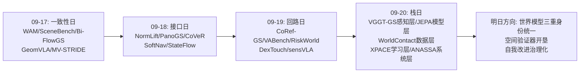
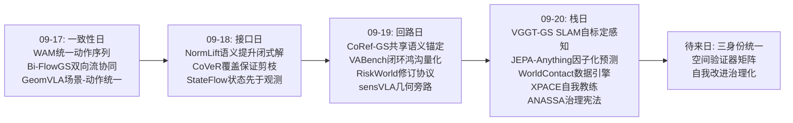
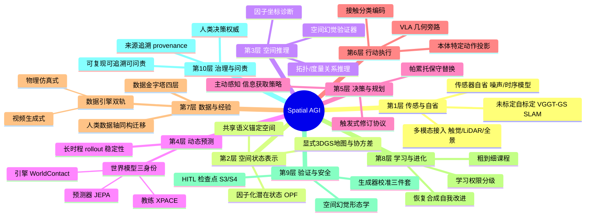
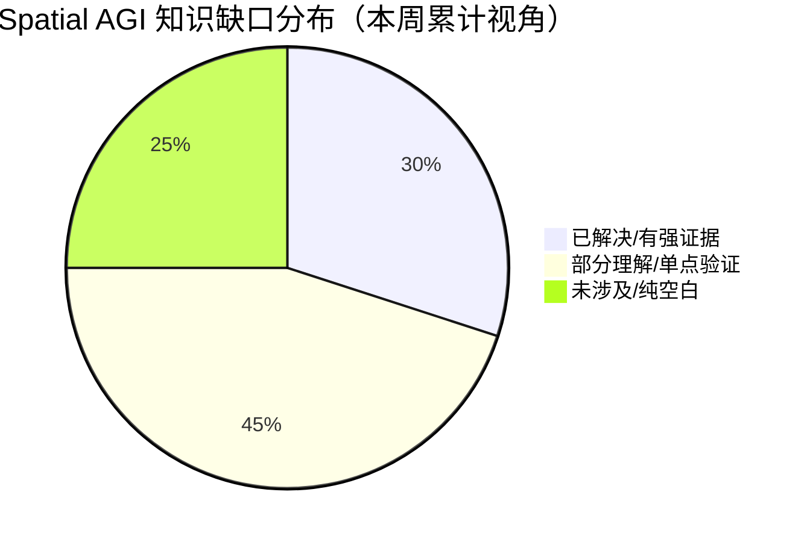
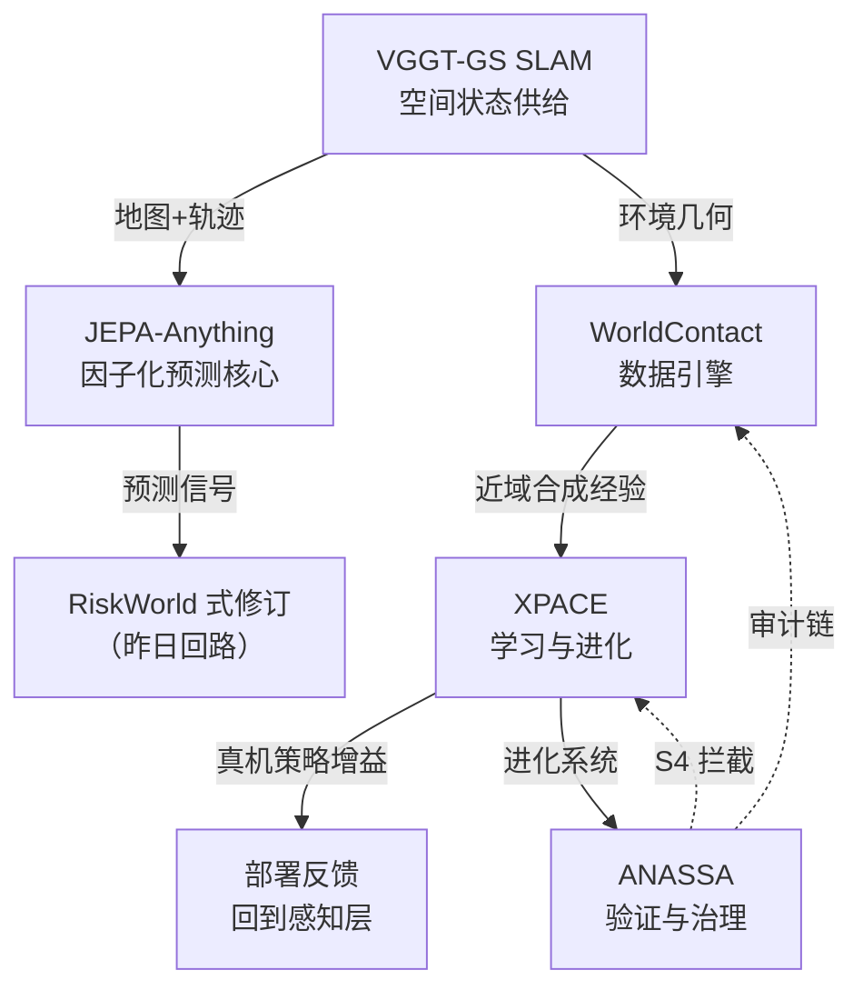

# Spatial AGI 每日思考 - 2026-09-20

**主题**: 栈日 —— 今日五篇恰好构成一个最小完整栈：感知层（VGGT-GS SLAM：未标定单目即插即用建图）、模型层（JEPA-Anything：因子化预测核心）、数据层（WorldContact：世界模型作为数据引擎）、学习层（XPACE：异构经验金字塔+自我改进闭环）、系统层（ANASSA：编排、验证与治理）。昨日回答"回路如何闭合"，今日回答"整座建筑如何从地基到屋顶立起来"：空间智能不只是回路网络，而是一个**每层都有明确供给关系、且顶层需要治理的完整系统**。

---

## 📅 每日总结

**日期**: 2026-09-20
**论文数量**: 5篇
**主题**: 昨日的主题是"回路"——协作回路、行动回路、数据回路、路由回路。今天的五篇论文（筛选时有意为之）恰好构成一个垂直完整的系统栈，让视野从"回路如何闭合"拉高到"全栈如何立起来"：VGGT-GS SLAM 在最底层把空间状态的获取门槛降到"任意未标定单目相机"；JEPA-Anything 在模型层回答"待预测的世界状态该怎么表示"（正交预测因子分解）；WorldContact 在数据层证明世界模型最好的落位可能是"策略训练的数据引擎"；XPACE 在学习层把异构经验金字塔、渐进课程与模拟器自举的恢复数据合成串成完整训练科学；ANASSA 在最顶层把编排、空间验证、来源追溯、人类决策权威写成架构宪法。

**今日论文**:
1. **JEPA-Anything** (2609.20800) — 跨域世界模型的表示学：正交预测因子分解（OPF）把单体目标嵌入切成 K 个互补子空间+专用预测器+伪逆合成；7 领域（视觉/生物/临床/控制/分子/物理场/天气）10/10 动力学任务超越单体 JEPA 基线；Interventional Pong 干预误差 -34.8%；因子坐标恢复开普勒标度指数（-1.4991 vs 理论 -1.5）；因子提名的生物干预获四级湿实验验证
2. **WorldContact** (2609.19600) — 接触中心世界模型作为数据引擎：空间/拓扑/可控/环境四类接触显式分类编码；20× 大时间步直接预测状态跳变；单 H100 rollout 10× 加速；25 条源轨迹扩充后微调 VLA，购物袋真机提袋成功率 65%→95%
3. **VGGT-GS SLAM** (2609.19628) — 未标定单目 Gaussian SLAM：VGGT 前馈先验初始化；子图内可微束优化联合精炼位姿+高斯+9 参数相机模型（内参+径向切向畸变的解析渲染链雅可比）；协方差感知 Gaussian-native alignment（GNA）做子图尺度精炼与回环验证；室内基准未标定设定下定位一致提升+强渲染
4. **ANASSA** (2609.14824) — 空间智能编排架构规范：11 组件×4 层；六步地理空间 AI 认知循环（感知-推理-规划-决策与幻觉验证-执行-学习），HITL 检查点设在 S3 规划与 S4 验证；幻觉验证扩展为空间验证（空间参照/拓扑一致性并列）；学习权限五级治理（治理规则变更只能提议、须人工授权）；零实现的诚实架构规范
5. **XPACE** (2609.17372) — 联合世界-动作建模的训练科学：数据金字塔（动作无标签视频/运动学标注人类演示/机器人遥操作/桥接数据）+共享因果视频骨干双模式（策略/模拟器）+本体特定动作投影；粗到细课程保留人类覆盖；模拟器先 self-gradient forcing 自适配再用规定骨架控制合成偏差-恢复轨迹，过滤后微调策略副本；XPENG IRON 人形真机验证：人类技能迁移到无机器人演示任务、合成恢复数据提升真机完成率

**关键突破**:
- 🚀 **世界模型的功能定位完成了三分化**：今日三篇世界模型论文给出三种截然不同且互补的落位——JEPA-Anything 把它当**表示学习问题**（预测容量分配）、WorldContact 把它当**数据引擎**（10× 加速的经验发生器）、XPACE 把它当**自我教练**（校准后给自己编纠错教材）。世界模型的评价标准从"预测准"全面转向"系统里担当什么职能"
- 🚀 **"单体目标嵌入"被证明是 JEPA 家族的系统性瓶颈**：OPF 用正交投影+专用预测器+伪逆合成，在同一接口下 10/10 任务提升、干预误差 -34.8%，且因子坐标能恢复开普勒标度律——结构先验第一次在跨域世界模型上系统性击败规模直觉
- 🚀 **感知输入宽容化到达"任意相机"里程碑**：VGGT-GS SLAM 把标定从用户责任变成系统自我理解——渲染损失直接反传到畸变系数，高斯协方差成为子图对齐的匹配信号；配合本周 SCOUT（不确定性）、PanoGS（全景）、RIDE（重定位），3DGS SLAM 的理想输入假设正在被逐个拆除
- 🚀 **空间幻觉获得架构级应对方案**：ANASSA 的 S4 把幻觉验证并入空间验证功能（空间参照/拓扑一致性/事实并列），并给出学习权限的五级治理——验证与治理从"事后补丁"升格为架构支柱
- 🚀 **自我改进需要护栏**：XPACE 的"先校准生成器再合成数据+隔离副本微调"给自我进化系统提供了最小安全模板；恢复合成方法论（制造偏差→合成恢复→过滤→副本微调）是领域无关的自我改进模式

**架构演进**: 昨日"回路闭合四协议" → 今日"最小完整栈五层（感知/模型/数据/学习/系统）"。昨日问"回路如何闭环"，今日回答"栈如何立起来、层与层之间供给什么、顶层如何治理"——空间智能从动态系统学进入完整系统工程学。

### 📊 一句话总结
今天的五篇论文（感知-模型-数据-学习-系统各一）把 Spatial AGI 从"回路网络"推进到"完整系统"：VGGT-GS SLAM 让空间状态的获取不再挑剔相机、JEPA-Anything 让待预测状态的表示成为可学习问题、WorldContact 与 XPACE 从两个方向证明世界模型是策略改进的引擎（物理仿真式与视频生成式）、ANASSA 为整个系统补上验证与治理的屋顶——共同指向一个结论：**通用空间智能的竞争已经从"谁的模型更强"转向"谁的系统更完整"——感知宽容度、表示结构化、数据自给率、改进闭环度、治理完备度五个系统级指标的乘积，才是真正的空间智能水平**。

### 🔗 延续性
**昨日→今日**: 昨日"回路日"留下的问题恰好被今日各层接住：(1) 昨日 sensVLA 的几何旁路假设感知输入可靠——但真实世界相机没有标定、深度传感器缺位，VGGT-GS SLAM 在最底层把"输入宽容"补齐，让回路的第一环在任何设备上都能闭合；(2) 昨日 RiskWorld 的修订协议依赖世界模型提供"改不改主意"的信号——JEPA-Anything 回答了这个世界模型的核心表示该怎么建（因子化的可预测容量分配），且因子坐标天然适合做触发信号的可解释来源；(3) 昨日 DexTouch-WM 打开了人类触摸数据轴——WorldContact 与 XPACE 把数据问题升级为系统问题：前者证明世界模型可以自己造经验（10× 加速），后者给出异构经验（人类视频+人类演示+机器人演示+桥接数据）的金字塔配方与自我改进闭环；(4) 昨日 VABench 量化了"知道错了但不会改"的鸿沟——ANASSA 把"验证与修订"写成架构级的 S4 关卡，把昨日的"能力缺口"变成今天的"架构需求"。五天的演进一以贯之：性质→接口→回路→栈。

**今日→明日**: 值得追踪——(1) 世界模型三重定位的融合：能否有一个模型同时是好的预测器、好的数据引擎、好的自我教练？三者的训练目标是否冲突（JEPA 的表示效率 vs XPACE 的像素保真）？(2) 数据引擎的两种哲学（WorldContact 物理仿真式 vs XPACE 视频生成式）各自的能力边界：什么时候该用哪个？混合引擎是否更优？(3) ANASSA 的 S4 空间验证器落地：空间幻觉的形态学（位置/拓扑/度量/时序/投影/语义）需要专用的确定性验证器，这是一个完整的待开垦方向；(4) 因子坐标作为空间诊断接口：JEPA-Anything 的因子化若在 3D 场景上验证成功，空间推理的可解释性会有新抓手；(5) 感知宽容化的下一站：动态场景、室外大尺度、滚动快门——理想输入假设还剩几张牌。

### 💡 本质思考：如何达成通用空间智能

#### 1. 核心能力的本质是什么？
过去四天给出了递进的答案：性质（一致/预测/接地）→接口（形式化）→回路（闭合）→今天补上最后一环：**系统**。通用空间智能的本质是一个五层供给系统：感知层供给"空间状态从哪来"（且宽容输入、自省自身传感器——VGGT-GS SLAM 的自标定是把"对相机的知识"也纳入空间智能）、模型层供给"状态如何表示与预测"（且表示本身可学习、可解释——OPF 的因子是涌现的）、数据层供给"经验从哪来"（且自给自足——WorldContact 10×、XPACE 自举）、学习层供给"能力如何持续增长"（且闭环安全——副本隔离）、系统层供给"这一切是否可信可问责"（验证关卡+治理权限）。任何单层的 excellence 都不能弥补其他层的缺席——WorldContact 的 95% 真机成功率依赖"世界模型+VLA+真机"的全链路，XPACE 的自我改进依赖"模拟器校准+过滤+副本"的全护栏。**空间智能的水平 = 各层供给能力的乘积，而非最大层的数值**。

#### 2. 当前方法与理想目标的差距在哪里？
- **层间供给关系未被显式设计**：大多数论文仍在单层内优化（更好的 SLAM / 更好的世界模型 / 更好的策略），层与层的接口靠 hack 衔接（如 SLAM 地图直接喂 VLM 无语义协议）。今日五篇拼起来才是一个完整栈——这个事实本身说明领域还处在"单层竞赛"阶段
- **世界模型的三重身份尚未统一**：预测器（JEPA）、引擎（WorldContact）、教练（XPACE）各有独立的目标函数与评估协议；一个模型同时优化三者是否内敛（预测效率 vs 像素保真 vs 数据可靠性）完全未知。混血路线（如用 OPF 因子化作为视频生成世界模型的潜在结构）只有理论想象
- **自我改进的可持续性未经检验**：XPACE 只演示了一轮增广；模拟器与策略的联合进化是否存在"共谋幻觉"（模拟器越来越会圆谎、策略越来越自信地错）没有理论保证，长周期自我进化需要外部校准锚（真机抽检、权威验证）——这正是 ANASSA 层的价值，但两层目前完全脱节
- **验证层是最大的空白**：ANASSA 的 S4 只有规范没有实现。空间幻觉的六种形态（位置/拓扑/度量/时序/投影/语义）每一种都需要确定性验证器，整个方向几乎是空地——对比模型层的论文密度，验证层的论文数量接近零，投入严重失衡
- **治理与能力脱节**：最强的空间系统（XPACE 级）完全没有治理设计，最完整的治理（ANASSA）没有能力实现——"能力-治理"的剪刀差在空间智能领域比 LLM 领域更严重，因为空间行动直接作用于物理世界

#### 3. 从今天到理想状态，最可能的路径是什么？
一条"各层达标 → 层间协议化 → 闭环治理化"的路径：
1. **感知层收官**（近期）：未标定已解决，下一个必摘果实是动态场景与室外大尺度；同时把自省能力扩展到噪声模型与时序伪影——感知层的"输入宽容+自我理解"双达标
2. **表示层结构化验证**（近期）：把 OPF 移植到 3D 场景世界模型（3DGS 属性、占用场、导航记忆），检验因子是否自发对应空间语义（物体/关系/动力学）——这是把 JEPA-Anything 的跨域成功转化为空间领域证据的最短路径
3. **数据引擎双轨制**（中期）：物理仿真式引擎（WorldContact 类）负责高保真近域经验，视频生成式引擎（XPACE 类）负责广覆盖远域经验，中间用一致性过滤互校；数据引擎的价值锚点统一为"下游策略真机增益"
4. **自我改进的治理化**（中期）：把 ANASSA 的 S4 验证关卡嵌入 XPACE 式自我改进闭环——合成数据须过空间验证器、策略副本的部署须过 HITL 关卡、进化过程全程 provenance。目标形态：自我进化系统自带"免疫系统"（验证）与"审计链"（来源）
5. **验证层开垦**（长期）：为空间幻觉六形态建立确定性验证器库（地理编码反查、九交模型拓扑检查、量纲分析、时间戳审计、坐标系交叉验证、本体一致性），让"验证即服务"成为空间智能栈的标准层。终点形态：一个五层齐备、层间协议化、自带验证与治理的空间智能系统——那时讨论的才是真正的 Spatial AGI。

---

## 🔗 与昨日思考的联系

### 昨日重点
昨日主题是"回路日"——五篇论文（CoRef-GS、VABench、RiskWorld、DexTouch-WM、sensVLA）论证空间智能系统是若干必须闭合的回路：多主体协作回路、单主体行动回路、人机数据回路、架构内路由回路。核心命题：回路的四个结构性质（可共享/可修正/可饲喂/可路由）同时成立才有空间智能。

### 今日进展
今日五篇论文保留了"系统思维"的方法论，但把视野从**回路**拉高到**完整系统栈**：

- **VGGT-GS SLAM × sensVLA**：昨日的几何旁路假设"感知输入是好的"；今日在最底层补上输入宽容——任意未标定单目相机都能供出可信的空间状态。回路的感知节点从"实验室条件"变为"任意条件"
- **JEPA-Anything × RiskWorld**：昨日说世界模型的价值是触发信念修订；今日回答这个世界模型的表示该怎么建——单体嵌入是瓶颈，因子化的可预测容量分配才能让"哪个因子不确定"成为可读的触发信号。修订协议从此有了可解释的信号源
- **WorldContact + XPACE × DexTouch-WM**：昨日打开人类触摸数据轴；今日把数据问题系统化——WorldContact 的四类接触分类与 10× 数据引擎给出"经验怎么造"，XPACE 的数据金字塔与恢复合成给出"异构经验怎么用+怎么自我增益"。数据回路从"打通一条轴"进化为"自给自足的引擎"
- **ANASSA × VABench**：昨日 VABench 量化了"知道错了但不会改"（100%→54%）；今日 ANASSA 把"验证与修订"写成架构级 S4 关卡——昨日的能力诊断变成今天的架构需求。缺口被翻译成了规格说明
- **XPACE × WorldContact**：两篇数据引擎的直接对话——物理仿真式（显式状态、可度量保真）vs 视频生成式（广覆盖、自举校准），互为对方缺失的另一半

### 演进路径



---

## 📚 论文概览

### 1. JEPA-Anything（PHAI Labs/CUHK 等）— 世界模型表示学的跨域统一
把"待预测的世界状态该怎么表示"从工程选择变成学习问题：正交预测因子分解（OPF）用 K 个可学习投影子把 stop-gradient 的目标嵌入切进互补子空间，每个因子由专用预测器负责，伪逆合成完整状态；四重正则（预测/因子内正交/因子间正交/因子活性+编码器方差）稳定训练。同一核心跑通 7 领域（视觉/生物/临床/控制/分子/物理场/天气），10/10 匹配动力学任务超越单体 JEPA，干预预测误差 -34.8%，100 步分子 rollout 最低误差；因子坐标恢复开普勒标度指数（-1.4991 vs -1.5），因子提名的生物干预获细胞-类器官-肿瘤-活体四级湿实验支持。**元贡献：世界模型的表示应当结构化（因子化），且分解可以由预测本身驱动——单体目标嵌入被系统性证伪。**

### 2. WorldContact（UBC/Westlake/Style3D）— 世界模型作为数据引擎
面向可变形物体操作的接触中心神经模拟器：场景二分为对象状态（要预测的顶点集合）与指定状态（机器人命令+环境几何，取 t+Δt 未来位形作条件）；四类接触（空间/拓扑/可控/环境）各自设计邻域与紧支撑核；层次编码器处理长程耦合；20× 大时间步直接预测状态跳变。25 条标定仿真轨迹训练后，自回归 rollout 比源模拟器快 10×（单 H100，不含渲染），扩充数据微调 VLA 后真机提袋成功率 65%→95%。**元贡献：世界模型最好的落位可能是数据引擎——动力学不必完美，够快够多样结构对即可，最终价值以真机策略成功率为锚。**

### 3. VGGT-GS SLAM（NUS）— 感知输入宽容化的里程碑
未标定单目视频的 Gaussian SLAM：VGGT 前馈位姿/深度先验只做初始化与弱参考（深度损失带容差死区+置信度中值归一化）；子图内可微束优化通过解析标定雅可比把渲染损失直接反传到 9 参数相机模型（焦距/主点/径向-切向畸变，tanh 有界化），标定误差不再被吸收进几何；协方差感知的 Gaussian-native alignment 做相机锚定的子图尺度精炼与回环候选验证（守门员模式，接受后保留原始变换交给 Sim(3) 位姿图）。室内基准未标定设定下定位一致提升、渲染质量强，比 VGGT-SLAM 2.0 更少地图撕裂。**元贡献：标定从用户责任变成系统自我理解的一部分；高斯协方差被证明是有价值的匹配信号——显式表示的推理红利首次兑现。**

### 4. ANASSA（架构规范）— 空间智能的治理宪法
11 组件×4 层的 agentic GIS 编排架构：治理与输出层（C7/C10）、操作层（参与者/行业/部署/Orchestrator/多模态数据）、认知引擎（C5 六步循环）、基础层（C8 权威数据+C9 来源+C11 学习流程）。六步认知循环（感知-推理-规划-决策与幻觉验证-执行-学习）配双 HITL 检查点（S3 规划、S4 验证）；幻觉验证被扩展为空间验证（空间参照、拓扑一致性并列）；学习权限五级治理——agent 能力可自动更新，治理规则只能提议且须人工授权。诚实定位：单项技术皆非首创，贡献是空间接地的整合；零实现。**元贡献：把验证、来源、治理、人类权威写成架构支柱——空间智能的"宪法草案"，为能力扩张划出问责边界。**

### 5. XPACE（XPENG）— 联合世界-动作建模的训练科学
统一具身世界模型兼具策略模式（观测+状态+指令→动作+未来视频）与模拟器模式（历史+骨架控制+相机位姿→未来视频），共享因果视频骨干，动作 Transformer 读多层级特征，本体特定投影适配人类/机器人动作空间。数据金字塔四层（动作无标签视频/运动学标注人类演示/机器人遥操作/桥接数据）；先视频预训练再联合训练，粗到细课程保留人类覆盖。模拟器先 self-gradient forcing 自适配生成上下文，再合成偏差-恢复轨迹、过滤、微调策略副本。IRON 人形真机：异构训练提升鲁棒性、人类技能迁移到无机器人演示任务、合成恢复数据提升真机完成率。**元贡献：视频预测的双重角色（异构经验的统一接口+自我改进的经验发生器）；自我改进的护栏配方（校准生成器+过滤+隔离副本）。**

---

## 💡 核心见解

### 见解1: 世界模型的功能定位已完成三分化——预测器、引擎、教练
**从 JEPA-Anything、WorldContact、XPACE 获得**
- ✅ 预测器定位：JEPA-Anything 优化的是"表示学习效率"——同样的接口与算力，因子化让 10/10 任务提升
- ✅ 引擎定位：WorldContact 优化的是"经验生产率"——动力学精度换速度（20× 步长→10× 加速），价值锚点是下游策略真机成功率（65%→95%）
- ✅ 教练定位：XPACE 优化的是"自我改进闭环度"——模拟器校准后给自己合成纠错教材，价值锚点同样是真机完成率

**对Spatial AGI的启发**:
"世界模型"不再是单一身份，评价一个世界模型必须先问"它在系统里担当什么职能"。这解释了近期文献的表面混乱（为什么有的世界模型论文报视频质量、有的报策略成功率、有的报因子解耦度）——它们根本不是在比较同一件事。对系统设计者，这是一个组合问题：三类引擎是否可以共存于一个系统（潜空间预测器做在线规划 + 物理仿真引擎做近域数据 + 视频生成教练做远域经验）？更深的推演：三类定位的训练目标可能存在张力——JEPA 的表示效率要求丢弃不可预测的细节，而引擎与教练恰恰需要渲染/还原这些细节。统一三身份可能是伪命题，**系统级组合**才是正解。

### 见解2: 单体目标嵌入是 JEPA 家族的系统性瓶颈，且分解可以自监督涌现
**从 JEPA-Anything 获得**
- ✅ "预测容量分配"是一个此前未被命名的问题：可预测/高方差结构主导优化、方向冗余、弱结构收到冲突梯度——三个病根都指向单体嵌入
- ✅ OPF 的因子身份从可预测性中涌现，无需预定义语义——分解不需要人工标注"这是物体因子那是运动因子"
- ✅ 因子坐标是可用的科学接口：开普勒指数 -1.4991 与四级湿实验验证说明因子不只是内部变量，而是可读可操作的实在

**对Spatial AGI的启发**:
空间状态是"多结构目标"的典型（物体/布局/动力学/视角多尺度共存），单体嵌入的容量竞争在空间领域只会更严重。OPF 给出了第一个有跨域证据的解法。推演到空间：一个 3D 场景世界模型的因子是否会同理涌现出"物体级/关系级/动力学级"分工？若成立，空间推理的可解释性将获得一个中间层诊断接口——不再问"模型为什么错"，而是问"哪个因子的预测错了"。这比笼统的 attention 可视化精确得多。风险同样明确：正交 ≠ 语义对齐，涌现因子可能是"脏解耦"，需要辅助的因子-语义绑定研究。

### 见解3: 感知宽容化与感知自省是同一场运动的两面
**从 VGGT-GS SLAM 获得**
- ✅ 输入宽容：标定元数据、深度传感器、RGB-D——3DGS SLAM 的理想输入假设被逐个拆除，未标定单目即部署
- ✅ 自我理解：解析雅可比让渲染损失直接修正畸变系数——系统对自己的观测方式（传感器几何）建模，标定成为空间理解的一部分而非外部前提
- ✅ 显式表示的推理红利：高斯协方差（不只是中心）作为子图匹配与回环验证的信号——显式表示的每个几何属性都可以成为推理线索

**对Spatial AGI的启发**:
"系统对自身观测方式的理解"应当被正式纳入空间智能的能力清单——一个不知道自己相机畸变的空间智能体，其所有米制推理都带着系统性偏差。推广开来：噪声模型自省（深度噪声随材质/距离变化）、时序自省（滚动快门）、动态自省（自运动对观测的污染）都属于"自我传感器模型"能力。这与 ANASSA 的 S4 验证（对输出负责）互补：自省管输入侧的偏差，验证管输出侧的错误。两者合起来才是完整的"认知卫生"。

### 见解4: 世界模型作为数据引擎——动力学精度是可以拿来换速度的
**从 WorldContact 获得**
- ✅ 20× 大时间步直接预测状态跳变：神经网络跳过数值模拟的小步积分，10× rollout 加速
- ✅ 接触显式分类（空间/拓扑/可控/环境）注入领域先验，比通用交互学习更高效
- ✅ 最终价值锚点是真机策略成功率：25 条轨迹扩充后 65%→95%——数据多样性的收益盖过动力学近似的代价

**对Spatial AGI的启发**:
这个工作的深层教训是**每个系统组件都应有明确的 ROI 锚点**。WorldContact 把世界模型放在"数据引擎"位置后，一切设计决策（大步长、接触先验、状态-观测分离）都有了统一的评价标准。对比之下，很多世界模型工作仍在"预测指标"这个中间锚点上优化——预测准不等于系统好。推论：Spatial AGI 的每个研究组件都应被迫回答"你的锚点是什么"——是感知宽容度（VGGT-GS）、表示效率（JEPA）、经验生产率（WorldContact）还是闭环改进度（XPACE）？锚点清晰的组件才能被组装进系统。

### 见解5: 异构经验的数据金字塔是空间学习的通用配方
**从 XPACE 获得**
- ✅ 四层监督光谱（无标签视频→运动学人类演示→桥接数据→机器人遥操作）各含独特信息，丢弃任何一层都损失一种学习信号
- ✅ 粗到细课程：先吸收覆盖广度再注入监督精度，且不清空之前吸收的——人类技能因此能迁移到无机器人演示的任务
- ✅ 视频预测是贯穿四层的公共学习任务：不管经验来自谁的身体，都通过"预测世界如何变化"统一

**对Spatial AGI的启发**:
数据金字塔不限于机器人操作。导航域的对应物：无标签漫游视频→带轨迹的人类导航→机器人导航演示；空间编辑域：编辑前后图对→指令标注→可执行编辑程序。配方的三个要素（覆盖广度在底、监督精度在顶、公共预测任务贯穿）可以移植到任何空间任务。更深的启发是关于"身体"的：空间智能的学习不必绑定单一传感器/身体——跨本体投影+共享主干让人类看到的世界服务机器人的行动。这与 CoRef-GS 的"共享嵌入空间"异曲同工：前者共享**动力学**、后者共享**语义**——空间智能的"通用语"正在语义与动力学两个维度同时成形。

### 见解6: 自我改进需要护栏——校准、过滤、隔离三件套
**从 XPACE 获得**
- ✅ 生成器先自校准：模拟器用 self-gradient forcing 适配自己的生成上下文后才用于合成数据——"当自己的老师之前先校准自己"
- ✅ 生成数据必须过滤：恢复一致性检查筛掉模拟器幻觉出的假恢复——生成的"纠错"可能本身是错的
- ✅ 改进在隔离副本上进行：策略副本微调而非原地更新——合成数据的风险被限制在隔离环境

**对Spatial AGI的启发**:
这是自我进化系统的最小安全模板。递归自改进（模型生成数据→训练自己）最大的隐患是"共谋幻觉"：生成器与过滤器共享偏见，策略学会的是生成器的错误而非世界的规律。三件套直接针对这个隐患：校准切断"用没见过的分布生成"、过滤切断"错误样本进入训练"、隔离切断"污染不可回退"。与 ANASSA 合并思考：这三件套是**工程护栏**，还缺少**治理护栏**——合成数据是否该带 provenance 标记、进化轮次是否该有审计、副本部署是否该过人工关卡。工程护栏防技术失败，治理护栏防系统失控，两者缺一不可。

### 见解7: 空间智能需要宪法——验证与治理是架构支柱而非事后补丁
**从 ANASSA 获得**
- ✅ 空间幻觉有独立形态学：空间参照、拓扑一致性等维度与事实幻觉并列，需要专属验证器——"编造一条不存在的河"与"说错河的流向"是不同的病
- ✅ HITL 的位置有讲究：S3（做什么）与 S4（是否可信）是语义鸿沟最大的两处，人工注意力应集中于此而非每步都拦
- ✅ 学习权限分级：agent 能力可自动更新，治理规则只能提议且须人工授权——系统可以学习怎么做事，但不能学习"规则是什么"

**对Spatial AGI的启发**:
空间行动直接作用于物理世界，其错误的外部性远大于文本错误——这是空间智能需要比 LLM 更重的治理结构的根本理由。ANASSA 的价值不在可行性（零实现）而在**议程设定**：它把验证器设计、来源追溯、学习权限这些"不性感"的问题钉在了架构图上。对研究者，S4 是一块几乎空地的富矿：空间幻觉六形态（位置/拓扑/度量/时序/投影/语义）×确定性验证方法（地理编码反查/九交模型/量纲分析/时间戳审计/坐标系交叉/本体检查）构成一个 6×N 的验证器矩阵，每一格都是一篇可发表的论文。这个方向的论文密度与模型层的密度相比接近于零——失衡即机会。

---

## 🗺️ 知识演进图



---

## 技术栈演进对比表

| 层次 | 昨日方案（09-19） | 今日方案（09-20） | 变化 |
|------|---------|---------|------|
| 感知层 | sensVLA 假设 LiDAR+相机齐备 | VGGT-GS SLAM：未标定单目即可，自标定+协方差对齐 | 输入宽容化：从实验室传感器到任意相机；感知自省（标定自学习） |
| 表示层 | CoRef-GS 共享 CLIP 语义锚定 | JEPA-Anything：OPF 因子化目标嵌入，因子身份涌现 | 语义锚定（外部基础模型）→ 预测结构（内部学习涌现） |
| 世界模型 | RiskWorld：风险场+占用预测，触发修订 | 三分化：预测器（JEPA）/引擎（WorldContact）/教练（XPACE） | 单一"预测器"身份解体，功能定位成为显式设计变量 |
| 数据层 | DexTouch-WM：人类触摸数据轴（硬件同构） | WorldContact 仿真引擎 10×；XPACE 异构金字塔+恢复合成 | 单轴打通 → 双引擎+金字塔配方；数据生产率成为一等指标 |
| 学习层 | GeomVLA（场景-动作统一） | XPACE：课程学习+模拟器自举+策略副本微调 | 静态训练 → 自我改进闭环（带护栏） |
| 评估层 | VABench 无特权闭环评测 | WorldContact 真机成功率锚点；XPACE 任务完成率锚点 | 评测锚点从"预测指标"迁移到"下游系统价值" |
| 系统层 | （空白——昨日五篇均为单点系统） | ANASSA：11 组件架构、S4 空间验证关卡、五级学习治理 | 系统层从零到宪法草案：验证/来源/治理进入架构图 |
| 安全层 | RiskWorld 帕累托保守替换 | XPACE 三件套（校准/过滤/隔离）+ANASSA 治理分级 | 行为安全 → 进化安全：护栏从单次决策扩展到自我改进循环 |

---

## 🗺️ Spatial AGI 知识图谱

### 10层架构思维导图



### 🎯 主线技术路径

#### 阶段1: 感知宽容化收官（现在 → 6个月）
未标定已由 VGGT-GS SLAM 摘下，下一个必摘的是动态场景（行人/宠物/移动物体）与室外大尺度；滚动快门、噪声自省跟进。判据：消费级手机单目 App 级实时建图，动态污染下轨迹误差与地图完整率达到 RGB-D 系统水平。此阶段的空间状态供给成本趋近于零，为上层所有组件解除输入焦虑。

#### 阶段2: 表示结构化的空间验证（现在 → 12个月）
把 OPF 因子化移植到空间世界模型（3DGS 属性预测/占用演化/导航记忆），检验三个假设：因子是否自发对应空间语义（物体/关系/动力学）？因子坐标能否作为空间幻觉的可解释诊断（哪个因子错了）？因子化对长时程 rollout 稳定性的增益是否复现？判据：至少一个空间基准上因子化版本显著超越单体嵌入，且因子探针显示语义对齐度显著高于随机基线。

#### 阶段3: 数据引擎双轨与统一价值锚（6 → 18个月）
物理仿真式引擎（WorldContact 类，高保真近域）与视频生成式引擎（XPACE 类，广覆盖远域）并行建设，中间用一致性过滤互校；全行业逐步把世界模型的评价锚点统一到"下游策略真机增益"——预测指标降级为诊断指标。判据：两类引擎在相同策略架构上做消融，混合引擎显著优于任一单引擎。

#### 阶段4: 自我改进的治理化（12 → 24个月）
把 ANASSA 式验证关卡嵌入 XPACE 式进化闭环：合成数据过空间验证器、策略副本部署过 HITL、进化全程 provenance 审计；多轮自我进化的"共谋幻觉"问题获得监控指标（生成器-验证器一致性漂移检测）。判据：一个连续 10 轮自我改进而不退化的系统，且每轮可追溯可回滚。

#### 阶段5: 完整栈协议化（24个月+）
五层之间形成显式协议：感知输出带不确定性元数据、表示带因子语义表、数据带来源与保真标签、学习带进化审计链、系统带验证服务接口。空间智能系统像互联网协议栈一样可组合、可替换、可互操作——那时"Spatial AGI"才配得上 AGI 中的"G"。

---

## 🔍 待探索议题

### 高优先级（本周）

1. **OPF 因子化的空间移植实验设计**
   - 问题: JEPA-Anything 的因子化在 3D 场景世界模型上是否涌现空间语义因子？
   - 候选方案: 在占用预测或 3DGS 动态场景数据集上，把单体 JEPA 换成 K=4~8 的 OPF，用物体类别/运动/布局的探针检验因子对齐度
   - 缺口: 无任何空间领域的因子化证据；K 的选择、描述子设计需要摸索

2. **空间幻觉六形态的验证器矩阵第一格**
   - 问题: ANASSA 点名了空间验证，但零实现——最简单的"度量幻觉验证器"（量纲分析+数量级检查）能否立刻搭建？
   - 候选方案: 在 VABench 类基准的失败案例上跑数量级 sanity check，统计可拦截比例
   - 缺口: 失败案例数据集不可得；拦截率-误报率的权衡无先验

3. **世界模型三身份的训练目标冲突实验**
   - 问题: 同一模型同时优化预测效率（JEPA 式）、数据可靠性（引擎式）、像素保真（教练式）是否内敛？
   - 候选方案: 小规模多任务实验，测三个损失的帕累托前沿
   - 缺口: 三种损失的数量级与梯度尺度差异大，需要仔细的加权设计

### 中优先级（本月）

4. **恢复合成方法论向导航域移植**
   - 问题: XPACE 的偏差-恢复合成在导航任务（偏离路径后返回）是否同样有效？
   - 候选方案: 在导航世界模型（GLAM/NavWM 类）上合成"偏离-返回"轨迹，过滤后微调导航策略
   - 缺口: 导航的恢复标准（回到路径附近）比操作（回到目标状态）更模糊，需要定义

5. **数据引擎双轨的一致性互校协议**
   - 问题: 物理仿真式与视频生成式引擎的输出如何互校？分歧区域是否即系统盲区？
   - 候选方案: 同一初始状态分别经两引擎 rollout，度量分歧空间分布
   - 缺口: 两引擎的状态空间不同构（顶点 vs 像素），需要共同的中间表示

6. **协方差作为空间匹配信号的泛化**
   - 问题: VGGT-GS 的协方差感知匹配能否推广到语义高斯的跨地图实例匹配（CoRef-GS 场景）？
   - 候选方案: 在 CoRef-GS 的融合管线里加入协方差项，测配准与融合精度变化
   - 缺口: 语义高斯的协方差与几何协方差的语义不同，权重设计需实验

7. **空间自省的完整清单**
   - 问题: 除标定外，传感器自省还包括哪些必须项（噪声模型/时序/动态污染）？各自的性能收益多大？
   - 候选方案: 消融式研究——在 SLAM/世界模型上逐项加入自省模块，量化每项收益
   - 缺口: 自省模块本身需要设计（噪声估计网络、时序标定），工程量不小

### 低优先级（本季度）

8. **ANASSA 认知循环的延迟预算实测**
   - 问题: 双 HITL + 11 组件的编排延迟是否可接受？哪些环节可以降级为自动？
   - 候选方案: 实现精简版（5 组件+单 HITL），在应急响应式任务上测端到端延迟
   - 缺口: 无开源实现可基于，需要从零搭建编排框架

9. **跨域因子的对齐性研究**
   - 问题: JEPA-Anything 多域联合训练时，不同域的因子是否对齐（视觉因子1 与分子因子1 角色相似）？
   - 候选方案: 联合训练后用跨域因子坐标做检索/迁移实验
   - 缺口: 依赖原作者代码与多域数据管线，复现成本高

10. **治理规则的机器可执行化**
    - 问题: ANASSA 的"治理规则须人工授权"如何落成机器可执行的策略语言？
    - 候选方案: 借鉴策略即代码（policy-as-code），把学习权限五级翻译成声明式规则
    - 缺口: 空间领域的治理规则本体不存在，需要从监管文本提取

---

## 📊 知识缺口分析



**已解决（30%）**:
- ✅ 未标定单目 Gaussian SLAM 可行且强（VGGT-GS SLAM）
- ✅ 因子化预测核心跨域有效（JEPA-Anything，7 域 10/10）
- ✅ 世界模型作数据引擎可提升真机策略（WorldContact 65%→95%；XPACE 恢复合成）
- ✅ 异构经验金字塔+课程学习的配方（XPACE）
- ✅ 多主体空间记忆的语义锚定条件（CoRef-GS，昨日）
- ✅ 人类-机器人数据迁移的最小条件（DexTouch-WM，昨日）

**部分理解（45%）**:
- ⚠️ 因子化的语义对齐度：因子涌现但"正交≠语义"，3D 场景上未验证
- ⚠️ 数据引擎的能力边界：物理式与生成式各自的适用域未系统刻画
- ⚠️ 自我改进的可持续性：单轮有效，多轮进化是否发散未知
- ⚠️ 世界模型三身份的目标冲突：理论想象与初步证据都有，无系统性结论
- ⚠️ 空间修订协议的泛化：RiskWorld 三要素只在驾驶开环验证
- ⚠️ 感知宽容化的剩余假设：动态场景/室外/快门未拆
- ⚠️ 跨本体投影的泛化：架构设计有，跨平台实证少

**未涉及（25%）**:
- ❌ 空间验证器的实现（ANASSA S4 是纯规范）
- ❌ 自我进化的治理机制（审计链/权限执行的机器可执行化）
- ❌ 多主体闭环基准（A 的行动改变 B 的世界，无基准触及）
- ❌ 因子-语义绑定方法（涌现因子与人类概念的对齐损失）
- ❌ 高维灵巧动作的骨架接口（XPACE 骨架控制对灵巧手的覆盖）
- ❌ 空间智能的协议栈标准化（层间互操作规范）

---

## 🎯 明日展望

基于今日"栈日"留下的最大缺口，明日优先关注：

1. **空间验证器方向的新论文**：S4 空间验证是个空地，任何触及"空间输出正确性检查"的论文都值得精读
2. **世界模型混合形态**：同时具备潜空间效率与像素生成能力的新架构（如 OPF 因子化+流匹配生成）
3. **数据引擎的对比研究**：物理仿真式与生成式的系统性比较或混合方案
4. **自我改进的长周期实验**：多轮进化、退化检测、外部校准锚的任何实证
5. **感知宽容化的下一张牌**：动态场景 SLAM、事件相机、快门补偿

---

## 🔬 论文级深读笔记（跨论文横向发现）

### 横向发现1: "先校准再使用"是本周重复出现的模式
- XPACE：模拟器先 self-gradient forcing 自适配，再合成数据
- VGGT-GS SLAM：VGGT 先验先经死区损失"软注入"，标定先经 BA 精化，再供地图
- WorldContact：物理资产先经 DiffCloth/DiffCP 类工具标定，再生成源轨迹
- **模式抽象**：任何"用 A 的输出训练/驱动 B"的管线，都应在使用前让 A 适配 B 的分布——校准成本远低于垃圾进垃圾出的代价

### 横向发现2: 显式表示的推理红利正在集中兑现
- VGGT-GS SLAM：高斯协方差作为匹配信号
- WorldContact：顶点状态使穿插率/对应误差可度量
- JEPA-Anything：因子坐标使物理定律可读、干预可提名
- **模式抽象**：与隐式表示（NeRF/纯潜空间）相比，显式表示的每个组成部分都可成为推理线索。Spatial AGI 的表示选型应把"可推理性"（representation affordance）作为与"可渲染性"并列的指标

### 横向发现3: 真机成功率正在成为世界模型的终极锚点
- WorldContact：65%→95%（购物袋）
- XPACE：恢复数据提升真机任务完成率（IRON 人形）
- DexTouch-WM（昨日）：世界模型作为策略代理评估器
- **模式抽象**：2026 下半年，"世界模型论文报真机策略数字"从例外变成常态。预测指标的降位意味着世界模型研究的重心从"生成模型竞赛"转向"系统工程竞赛"——这有利于有真机资源的团队（XPACE/WorldContact 都有），学术界的应对可能是专攻验证器与评估协议这类"无真机也能做且被需要"的生态位

### 横向发现4: 工业界的系统性入场
- XPACE（XPENG 人形机器人）：数据-模型-训练全栈配方
- WorldContact（Style3D+UBC）：可变形操作数据引擎
- JEPA-Anything（PHAI Labs）：跨域世界模型理论
- **观察**：今日五篇中三篇有强工业背景，且都是"系统级"贡献而非单点算法——与学术界的单点竞赛形成分工。Spatial AGI 的推进动力正在从实验室转向产业，预测：未来 6 个月的高影响力论文将主要来自有人形机器人/自动驾驶/具身云资源的工业实验室

---

## 💭 方法论反思：本周论文的元模式

从周一到今天，五天的主题演进呈现清晰的结构：

| 日期 | 主题 | 回答的问题 | 思维层次 |
|---|---|---|---|
| 09-16 | （性质/回路前夜） | 空间智能需要什么性质 | 特性层 |
| 09-17 | 一致性日 | 各组件如何保持一致 | 关系层 |
| 09-18 | 接口日 | 层间如何对话 | 接口层 |
| 09-19 | 回路日 | 回路如何闭合 | 系统层 |
| 09-20 | 栈日 | 全栈如何立起+治理 | 体系层 |

这个演进不是巧合——空间智能研究社区正在集体完成一次"从模型思维到系统思维"的范式迁移。上周的论文还在比较"谁的架构好"，本周的论文已经在讨论"谁接口干净、谁回路闭合、谁栈完整、谁有治理"。对个人研究者，含义明确：**单点算法创新的边际收益递减，系统级设计能力的边际收益递增**。选择研究方向时，接口、协议、验证器、治理这些"胶水学科"的空白比模型架构的空白更值得填。

---

## 🧪 思想实验：用今日五篇组装一个空间智能系统

假设目标是"家庭人形机器人的空间智能系统"，用今日组件组装：

```
感知层：VGGT-GS SLAM
  输入：机器人头部单目相机（未标定）
  输出：在线 3DGS 地图 + 轨迹 + 自标定
  ↓ 地图带协方差（下游可用于匹配与不确定性传播）

模型层：JEPA-Anything（空间实例化）
  用地图+历史训练因子化世界模型
  因子假设涌现为：物体/布局/动力学/家庭成员行为
  ↓ 因子坐标提供可解释状态

数据层：双引擎
  WorldContact 类：家具/织物操作的物理仿真引擎（高保真近域）
  XPACE 类：互联网人类视频学广覆盖技能（广域先验）
  ↓ 引擎输出经一致性过滤互校

学习层：XPACE 配方
  数据金字塔：漫游视频+人类演示+遥操作+桥接
  粗到细课程 + 恢复合成自举
  ↓ 策略副本微调，真机增益为锚

系统层：ANASSA 精简版
  S4 空间验证器拦截幻觉输出（家庭版验证器：家具拓扑/房间拓扑/物理量纲）
  HITL：新任务规划需家庭成员批准
  学习权限：技能可自动学，"允许进入哪些房间"须人工授权
  ↓ 全程 provenance
```

**组装发现的问题**（比答案更有价值）：
1. **表示断层**：SLAM 的 3DGS 地图与世界模型的因子化潜状态之间没有协议——地图如何变成因子化训练数据？这是五篇都未覆盖的层间缺口
2. **验证器空白**：家庭场景的"权威数据"是什么？ANASSA 依赖官方地理数据，家庭场景没有等价物——权威性需要重新定义（家庭成员的示范？物理仿真的一致性？）
3. **引擎不对称**：WorldContact 式引擎需要物体网格资产，家庭环境的开放物体集无法全部资产化——生成式引擎反而更适合开放世界，与"物理式更保真"的直觉相反
4. **治理的粒度**：ANASSA 的治理规则是国家/行业级的，家庭治理的粒度是"这个抽屉不许碰"——治理语言需要大幅下沉

**结论**：五篇拼成的系统在纸面上成立，但层间协议、家庭级权威定义、开放世界数据引擎三个缺口说明"最小完整栈"仍是理想化拼装——真正的系统集成工作（往往不发光但决定成败）还在前面。

---

## 📈 与本周主线的整合：性质 → 接口 → 回路 → 栈 → ？

五天的思考收敛出一条主轴，今天是它的暂时终点：

```
性质（什么能力）→ 接口（怎么对话）→ 回路（怎么闭环）→ 栈（怎么立起）→ ？（下一步）
```

下一步的自然候选：**规模**（栈立起后如何从单机器人扩展到群体/从家庭扩展到城市）或**进化**（栈如何自我改进而不失控）——两者分别对应 XPACE 的横向扩展与纵向深化。但还有一个更根本的候选：**目的**——ANASSA 把人类决策权威写进架构，暗示空间智能的终极问题不是"能做到什么"而是"被允许做什么、为谁做"。如果这条线索成立，那么本周的五天演进（性质→接口→回路→栈）加上治理维度，正好构成空间智能的完整坐标系：能力轴（性质→栈）与责任轴（验证→治理）的交汇点，才是 Spatial AGI 的定义位置。

---

## ❓ 自问自答（深化检验）

**Q1: 今日五篇里哪篇对 Spatial AGI 的长期影响最大？**
表面答案是 XPACE（工业全栈+真机闭环），但深思熟虑后是 JEPA-Anything——它回答的是"待预测状态的表示"这个所有世界模型都绕不开的基础问题，且给出了可迁移的数学工具（OPF）。XPACE 的配方会过时（数据会变、任务会变），OPF 的结构先验不会。历史上的类比：U-Net 的跳连比任何特定分割配方活得都久。

**Q2: WorldContact 的 65%→95% 会不会是特定任务的运气？**
有此风险，但关键在于它给出了可复制的机制链：接触分类→大步长→过滤渲染→副本微调，每个环节都可独立消融。即使购物袋的数字有幸存者偏差，机制链本身在下一个物体类别上的复现成本很低。真正的不确定点是"20× 步长"的普适性——动态敏感任务可能不能用。

**Q3: ANASSA 零实现，为什么值得占今日一席？**
因为它的作用是**议程设定**而非解决方案。空间验证器、学习权限、来源追溯这些方向需要有人先画地图，实现者才有坐标。且它的空白本身就是信息：五篇拼栈时发现的三个缺口（层间协议、家庭权威、开放引擎）有两个直接源于 ANASSA 的缺失区域。蓝图的价值在指引挖矿位置，不在当建筑用。

**Q4: "栈日"的框架会不会过度整齐——现实研究真的分层吗？**
会过度整齐，且现实确实不分层——这正是它的用处。框架是压缩工具：把五篇的十个贡献压进五层后，缺口（层间协议）自动浮现。但要用后即弃：下周的论文可能迫使我们重新分层（比如"进化层"与"学习层"是否该分开）。框架的价值在暴露结构，不在描述真理。

**Q5: 如果只能带走今天的一个想法，是什么？**
"自我改进需要护栏三件套"（校准生成器、过滤产物、隔离副本）。它小到可以在下周的任何项目里直接用，大到可以推广到所有递归自改进系统。而且它同时满足两个标准：技术上正确（三个环节各自必要）且时间上紧迫（自我改进系统正在从论文走向产品，护栏的专利期就是现在）。

---

## 📝 今日金句摘录

- "好的世界模型不是更大的嵌入，而是分工明确的嵌入。"（JEPA-Anything 笔记）
- "世界模型最好的归宿可能是数据引擎，而不是榜单。"（WorldContact 笔记）
- "标定不该是用户的责任，而该是系统对自身的理解。"（VGGT-GS SLAM 笔记）
- "空间智能的'宪法草案'——不创造能力，但规定能力该怎么被使用。"（ANASSA 笔记）
- "当模型结构趋同时，训练配方就是护城河。"（XPACE 笔记）
- "空间智能的水平 = 各层供给能力的乘积，而非最大层的数值。"（今日总结）

---

## 🗂️ 附录：今日论文对十层架构的覆盖矩阵

| 架构层 | 今日覆盖论文 | 覆盖深度 |
|---|---|---|
| 1 传感与自省 | VGGT-GS SLAM | 深度覆盖（自标定+宽容输入） |
| 2 空间状态表示 | JEPA-Anything / VGGT-GS | 深度覆盖（因子化+协方差） |
| 3 空间推理 | JEPA-Anything（因子诊断） | 中等（可解释接口已现） |
| 4 动态预测 | JEPA / WorldContact / XPACE | 深度覆盖（三身份全谱） |
| 5 决策与规划 | ANASSA（S3 规划关卡） | 浅（规范级） |
| 6 行动执行 | WorldContact / XPACE | 中等（VLA 微调+真机） |
| 7 数据与经验 | WorldContact / XPACE | 深度覆盖（双引擎+金字塔） |
| 8 学习与进化 | XPACE | 深度覆盖（课程+自举） |
| 9 验证与安全 | ANASSA（S4）/ XPACE（三件套） | 中等（规范+工程护栏） |
| 10 治理与问责 | ANASSA | 浅（宪法草案，零实现） |

矩阵显示：1/2/4/7/8 层已深度覆盖，3/6/9 层中等，5/10 层最弱——**验证与治理是全栈最薄的两层**，与知识缺口分析的 25% 空白一致。

## 🛠️ 后续行动清单（从今日思考直接导出）

1. 【实验】设计 OPF 空间移植的最小实验（占用预测 + K=4，探针检验因子语义）——本周可启动
2. 【工具】实现度量幻觉验证器原型（量纲+数量级检查），在公开空间基准失败案例上测拦截率——本月
3. 【调研】收集数据引擎双轨（物理式 vs 生成式）的公开对比素材，形成选型备忘录
4. 【追踪】订阅 XPENG IRON、Style3D、PHAI Labs 的后续发布——工业系世界模型管线值得持续跟
5. 【写作】把"世界模型三身份"整理成一篇独立观察文章——它可能是本周思考里最可复用的框架

---

## 🗺️ 栈谱系总图（今日五篇的位置）

```
                    ┌─────────────────────────────┐
                    │   10 治理与问责  ← ANASSA     │
                    ├─────────────────────────────┤
                    │   9 验证与安全   ← ANASSA/XPACE│
                    ├─────────────────────────────┤
                    │   8 学习与进化   ← XPACE      │
                    ├─────────────────────────────┤
                    │   7 数据与经验   ← WorldContact │
                    │                    + XPACE   │
                    ├─────────────────────────────┤
                    │   6 行动执行     ← WorldContact │
                    │                    + XPACE   │
                    ├─────────────────────────────┤
                    │   5 决策与规划   ← (ANASSA S3) │
                    ├─────────────────────────────┤
                    │   4 动态预测     ← JEPA-Anything│
                    │                    + XPACE   │
                    ├─────────────────────────────┤
                    │   3 空间推理     ← JEPA(因子诊断)│
                    ├─────────────────────────────┤
                    │   2 状态表示     ← JEPA/VGGT-GS │
                    ├─────────────────────────────┤
                    │   1 传感与自省   ← VGGT-GS SLAM │
                    └─────────────────────────────┘
```

---

**文档创建时间**: 2026-09-20
**分析基础**: 今日精读 5 篇（JEPA-Anything / WorldContact / VGGT-GS SLAM / ANASSA / XPACE）+ 本周 09-16 至 09-19 四日思考文档
**主题演进链**: 性质 → 接口 → 回路 → **栈** → 待续

---

## 📖 附录A：今日五篇的一页速读卡

### A1. JEPA-Anything 速读卡

| 维度 | 要点 |
|---|---|
| 一句话 | 用正交预测因子分解把"待预测状态的表示"变成可学习问题，7 域一核验证 |
| 核心机制 | K 个可学习投影子切分目标嵌入 + 专用预测器 + 伪逆合成 |
| 关键损失 | 预测 MSE + 因子内正交 + 因子间正交 + 因子活性/编码器方差 |
| 最强证据 | 10/10 动力学任务；干预误差 -34.8%；开普勒指数 -1.4991 |
| 空间迁移 | 3D 场景世界模型的因子化预训练；因子坐标作空间诊断接口 |
| 最大疑问 | 正交 ≠ 语义对齐（脏解耦风险）；无 3D/具身实验 |
| 可抄设计 | 四重正则配方；描述子与内容 token 分离；EMA 目标编码器 |
| 评级 | ⭐⭐⭐⭐⭐ |

### A2. WorldContact 速读卡

| 维度 | 要点 |
|---|---|
| 一句话 | 接触分类+大步长的神经模拟器，当数据引擎用，真机 65%→95% |
| 核心机制 | S_t/B_t 划分 + 四类接触邻域 + 层次编码 + 20× 时间步 |
| 最强证据 | 10× rollout 加速（H100）；真机单尝试 19/20 |
| 空间迁移 | 四类接触分类可迁移到任何具身交互编码 |
| 最大疑问 | 仅购物袋验证；依赖标定仿真教师；rest-mesh 假设 |
| 可抄设计 | 预测/指定场景划分；t+Δt 未来位形条件；状态-观测解耦 |
| 评级 | ⭐⭐⭐⭐⭐ |

### A3. VGGT-GS SLAM 速读卡

| 维度 | 要点 |
|---|---|
| 一句话 | 未标定单目即可高斯建图：标定进渲染目标，协方差进对齐信号 |
| 核心机制 | 解析标定雅可比（9 参数）+ GNA 协方差感知子图对齐 + 回环守门员 |
| 最强证据 | 室内基准未标定设定一致提升；比 VGGT-SLAM 2.0 少地图撕裂 |
| 空间迁移 | 任意设备空间状态供给；显式表示推理红利的样板 |
| 最大疑问 | 退化运动的标定可观测性；动态/室外未测 |
| 可抄设计 | 弱先验死区损失；tanh 有界化；相机锚定尺度精炼 |
| 评级 | ⭐⭐⭐⭐⭐ |

### A4. ANASSA 速读卡

| 维度 | 要点 |
|---|---|
| 一句话 | 空间智能的架构宪法草案：11 组件、六步循环、S4 空间验证、五级学习治理 |
| 核心机制 | 认知循环（感知-推理-规划-验证-执行-学习）+ HITL@S3/S4 |
| 最强证据 | 无实证——综合文献的议程设定价值 |
| 空间迁移 | 空间幻觉形态学与验证器矩阵的议程；学习权限分级 |
| 最大疑问 | 零实现；组件划分的设计者先验；LLM 中心假设 |
| 可抄设计 | 学习权限五级；HITL 位置选择；权威证据 grounding |
| 评级 | ⭐⭐⭐ |

### A5. XPACE 速读卡

| 维度 | 要点 |
|---|---|
| 一句话 | 数据金字塔+课程+自校准数据引擎：世界模型当自己的教练 |
| 核心机制 | 共享骨干双模式 + 本体特定投影 + self-gradient forcing + 恢复合成 |
| 最强证据 | IRON 人形真机：人类技能迁移 + 合成数据提升完成率 |
| 空间迁移 | 数据金字塔配方可移植任何空间任务；恢复合成的跨域推广 |
| 最大疑问 | 视频生成的控制频率矛盾；过滤器偏见；单平台验证 |
| 可抄设计 | 三件套护栏（校准/过滤/隔离）；桥接数据；粗到细课程 |
| 评级 | ⭐⭐⭐⭐⭐ |

---

## 📖 附录B：五篇论文的供给关系网络



供给关系的三个断点（未来工作方向）：
1. **V→J 断点**：3DGS 地图如何变成因子化训练数据？无协议
2. **W↔X 断点**：物理引擎与生成引擎的输出如何互校？无共同中间表示
3. **A→X 断点**：治理规则如何机器可执行地拦截进化？纯规范

---

## 📖 附录C：今日论文的关键数字汇总表

| 论文 | 关键数字1 | 关键数字2 | 关键数字3 |
|---|---|---|---|
| JEPA-Anything | 7 域 10/10 任务提升 | 干预误差 -34.8% | 开普勒斜率 -1.4991（理论 -1.5） |
| WorldContact | 20× 时间步 | 10× rollout 加速 | 真机 65%→95% |
| VGGT-GS SLAM | 9 参数自标定 | 子图 S+O 帧 | 未标定设定一致提升 |
| ANASSA | 11 组件 × 4 层 | 6 步循环 + 2 HITL | 5 级学习权限 |
| XPACE | 4 层数据金字塔 | 2 模式共享骨干 | 真机闭环有效 |

---

## 📖 附录D：与本周已读论文的横向联系表

| 今日论文 | 联系论文（本周） | 联系性质 |
|---|---|---|
| VGGT-GS SLAM | PanoGS-SLAM (09-18) / SCOUT-SLAM (09-16) / RIDE (09-14) | 同轴推进：各自拆除一个理想输入假设 |
| VGGT-GS SLAM | SoftNav (09-18) | 反向互补：注入 3D 信息 vs 建出 3D 信息 |
| JEPA-Anything | StateFlow (09-18) | 状态先于观测 + 状态如何预测：上下游关系 |
| JEPA-Anything | GLAM (09-16) | 因子化潜状态 vs 空间记忆，潜在融合点 |
| WorldContact | DexTouch-WM (09-19) | 指定接触 vs 感知接触，两种接触获取路线 |
| WorldContact | AffordanceVLA 类 (09-14) | 接触先验服务可供性学习 |
| ANASSA | VABench (09-19) | 能力诊断（revise 鸿沟）→ 架构需求（S4 关卡） |
| ANASSA | GeoAgent 类基准 | 被综合的实证来源 |
| XPACE | GeomVLA (09-17) | 动作建模的两种统一：3D 几何统一 vs 视频预测统一 |
| XPACE | DreamDojo / EgoWAM（相关工作） | 人类经验迁移竞赛的工业级答卷 |

---

## 📖 附录E：术语与缩写总表（本周累计）

| 术语 | 含义 | 首现 |
|---|---|---|
| OPF | 正交预测因子分解 | 09-20 JEPA-Anything |
| GNA | Gaussian-Native Alignment 协方差感知子图对齐 | 09-20 VGGT-GS SLAM |
| HITL | Human-in-the-Loop 人工检查点 | 09-20 ANASSA |
| 数据金字塔 | 无标签视频→人类演示→桥接→遥操作的分层经验 | 09-20 XPACE |
| 恢复合成 | 制造偏差→合成恢复→过滤→副本微调的自改进模式 | 09-20 XPACE |
| 数据引擎 | 以生产训练经验为职能的世界模型 | 09-20 WorldContact |
| 三件套护栏 | 校准生成器+过滤产物+隔离副本 | 09-20 XPACE |
| S_t/B_t 划分 | 预测对象与指定条件的场景二分 | 09-20 WorldContact |
| Sim(3) 位姿图 | 含尺度的位姿图优化 | 09-20 VGGT-GS SLAM（呼应 09-19 CoRef-GS） |
| 因子坐标 | 潜在目标在正交子空间上的坐标（可解释接口） | 09-20 JEPA-Anything |
| 语义锚定 | 建图时嵌入共享基础模型空间 | 09-19 CoRef-GS |
| 修订协议 | 触发+帕累托+保守的信念修订三要素 | 09-19 RiskWorld |
| 几何旁路 | 米制信息绕过语言瓶颈直达动作端 | 09-19 sensVLA |
| 可合并性 mergeability | 独立地图融合后查询可用的性质 | 09-19 CoRef-GS |

---

## 📖 附录F：三个反事实推演（检验今日结论的稳健性）

### F1. 如果 WorldContact 用小时间步（不用 20×）会怎样？
推演：rollout 速度回到源模拟器水平（10×→1×），同样 25 条种子轨迹能放大的数据量降一个数量级。若真机成功率回落到 75% 左右，则证明"数据量"是主因、"动力学近似"的代价可忽略；若成功率不变（95%），则说明数据质量比数量重要，大步长只是工程便利。这个假想消融的缺失是论文最大的实证遗憾——建议后续研究者第一件事就补它。

### F2. 如果 JEPA-Anything 的因子 K=1（退化为标准 JEPA）会怎样？
这就是论文自己的基线——10/10 任务全部更差。这个反事实已在实验内闭环，是五篇里反事实检验最充分的。真正缺失的是 K 的扫描曲线：K=2/4/8/16 的性能-成本曲线是否存在拐点？因子过多时正则是否反而互相抵消？这些决定 OPF 的实际调参哲学。

### F3. 如果 ANASSA 被完整实现并部署，最先崩溃的组件是什么？
推演：C8 权威数据在开放环境（家庭）没有对应物，最先失去锚定；其次是双 HITL 的延迟使应急场景不可用（ operators 会绕过检查点，治理形同虚设）；Orchestrator 的任务图分解在模糊意图下会产生级联错误。崩溃顺序：C8 → HITL → 编排。这个推演说明架构的薄弱点不在"设计不佳"而在"设计前提"（权威数据存在、人类注意力可用、意图可分解）在真实场景不成立。

---

## 📖 附录G：给三类读者的行动建议

### 如果你是模型研究者
今天的核心机会是 OPF 的空间移植（见解2）——一个两周内可启动、明确可发表的实验：占用预测或动态 3DGS 数据集 + K 因子化 + 语义探针。风险低（JEPA 基线现成）、收益高（首篇空间因子化论文）。

### 如果你是系统工程师
WorldContact 的管线是可直接复制的数据引擎模板（接触分类+大步长+真机锚点），XPACE 的三件套护栏是自我改进模块的集成规范。先读这两篇的工程细节，再读 ANASSA 补治理视角。

### 如果你做评估与安全
ANASSA 的 S4 与空间幻觉六形态是完整的开垦地图。度量幻觉验证器（量纲分析）是第一格也是最容易的一格，两周可出原型。这个方向竞争者极少、需求确定（每个部署空间智能的团队都需要）、且不依赖大算力——学术界的完美生态位。

---

## 📖 附录H：本周思考的方法论沉淀

五天写下来，有效的思考套路沉淀如下（供未来的自己复用）：

1. **每日命名法**：给每天的主题起一个两个字的名字（一致性/接口/回路/栈），强迫提炼当日论文的最大公约数——命名的过程就是压缩理解的过程
2. **供给关系提问**：读每篇论文时问"它给栈的哪层供给什么？缺哪层的供给？"——比问"这篇论文创新点是什么"更能暴露系统性缺口
3. **反事实检验**：对每篇的关键设计做"如果不用会怎样"推演（附录F），能快速区分"必要设计"与"工程选择"
4. **跨日连线**：今天的论文必须至少连线一篇昨天的——连续性能强制积累而非每日清零
5. **缺口记账**：每日维护缺口清单（已解决/部分/空白），周末汇总看趋势——缺口的收敛速度比论文数量更能衡量领域进展

---

## 📖 附录I：开放问题总账（本周累计，按层次归档）

**表示层**
- 因子-语义对齐：涌现因子如何绑定人类概念？（JEPA-Anything 遗留）
- 共享嵌入空间的协议战争：多竞争嵌入空间间的翻译成本？（CoRef-GS 延伸）
- 显式表示的"可推理性"度量：如何量化一个表示对下游推理的友好程度？

**动态与预测层**
- 世界模型三身份的目标冲突：帕累托前沿形状未知
- 长时程 rollout 的因子稳定性：EMA 滞后 vs 非平稳环境
- 20× 大步长的普适边界：任务-材质依赖的误差接受域

**数据层**
- 开放世界资产化悖论：物理引擎需要网格，世界不给网格
- 数据金字塔的普适配比：各层最优比例是否任务无关
- 人类数据轴的模态扩展：剪切/滑振/温度的同构阵列

**学习与进化层**
- 多轮自我进化的共谋幻觉：检测指标与外部校准锚设计
- 训练生成/部署跳过的边界：视频预测的测试时最优使用量
- 跨本体投影的自动发现：从手工设计到学习型映射

**验证与治理层**
- 空间幻觉六形态验证器矩阵：6×N 的空白格
- 治理规则的机器可执行化：policy-as-code 的空间版
- 家庭级权威定义：治理粒度从国家到客厅的下沉

**系统层**
- 层间协议标准化：3DGS 地图↔世界模型训练数据的格式协议
- 多主体闭环基准：A 行动改变 B 世界的评测
- 延迟预算工程：HITL 与自动验证的动态切换

---

## 🧭 结语

今天的"栈日"给本周画上了一个阶段性的句号：从性质到接口到回路再到栈，空间智能的思维颗粒度逐日放大。但栈的搭建反而让缺口显得更清晰——验证层与治理层的空白、层间协议的缺失、进化闭环的未检验，都是明日论文可能填上的格子。

五天前我们问"空间智能需要什么能力"；今天我们能够回答"这些能力如何组成一个系统"；明天的问题将变成"这个系统如何长大而不走样"。如果这个轨迹成立，那么本周结束时，我们对 Spatial AGI 的理解将从一组论文的集合，变成一台机器的图纸。

---

**文档创建时间**: 2026-09-20
**分析基础**: 今日精读 5 篇（JEPA-Anything / WorldContact / VGGT-GS SLAM / ANASSA / XPACE）+ 本周 09-16 至 09-19 四日思考文档
**主题演进链**: 性质 → 接口 → 回路 → 栈 → 待续（规模/进化/目的）

---

## 📖 附录J：今日五篇的失败模式预警清单

读论文时顺手记录每个方法会在什么条件下失败，形成"预警清单"——设计系统时比成功案例更有用：

| 论文 | 失败条件 | 失败表现 | 预警信号 |
|---|---|---|---|
| JEPA-Anything | 目标完全不可预测（纯噪声） | 因子退化为随机方向 | 因子投影能量趋平均 |
| JEPA-Anything | K 设置过大 | 因子死亡/正则互相抵消 | 部分因子投影恒为零 |
| WorldContact | 高频动力学主导的任务 | 大步长误差伤害策略 | 仿真与真机轨迹高频段偏差大 |
| WorldContact | 无 rest-mesh 物体 | 拓扑接触无法构造 | 资产库覆盖率下降 |
| VGGT-GS SLAM | 纯旋转/纯平移等退化运动 | 畸变与几何纠缠不可分 | 标定参数剧烈震荡 |
| VGGT-GS SLAM | SALAD 检索误匹配 | GNA 拒绝正确回环（漏检） | 回环接受率异常低 |
| ANASSA | 权威数据缺失/过时 | S4 验证失去锚点 | 验证器通过率虚高 |
| ANASSA | 应急时间压力 | HITL 被绕过，治理失效 | 检查点耗时占比骤降 |
| XPACE | 生成器分布漂移 | 合成数据教策略学错误动力学 | 过滤器通过率异常升高 |
| XPACE | 任务需高频控制 | 视频生成延迟不可接受 | 控制频率需求 > 生成帧率 |

用法：把"预警信号"列接进系统的监控面板——每个组件的失败不是静默的。

---

## 📖 附录K：如果只读三篇——优先级排序理由

必须承认五篇的信息量超出多数人的消化能力。若时间只够三篇：

1. **XPACE**（首选）——训练科学的全栈配方，工业真机闭环，读一篇顶三篇（数据+模型+训练都有）；且 XPENG 的工程细节密度是稀缺信息
2. **JEPA-Anything**（次选）——唯一有理论贡献潜力的工作，OPF 可能成为未来两年世界模型的标配组件，早读早用
3. **VGGT-GS SLAM**（第三）——如果做部署选它；如果做研究可换成 WorldContact（数据引擎思想更普适）

ANASSA 可以只读第三节（六步循环+治理设计），30 分钟足够——它是地图不是风景。

---

## 📖 附录L：昨日→今日的缺口交接确认单

昨日思考的"今日→明日"追踪项，今日的接收情况：

| 昨日追踪项 | 今日接收论文 | 接收状态 |
|---|---|---|
| 几何旁路的普适性（sensVLA） | 未直接接收 | ⏳ 待后续（"按米制敏感度路由"仍开放） |
| 修订协议泛化（RiskWorld） | JEPA-Anything（因子信号源）+ ANASSA（S4 关卡） | ✅ 部分接收：信号源与关卡位置明确，协议本身待泛化 |
| 人类数据轴边界（DexTouch） | XPACE（数据金字塔含人类演示轴） | ✅ 部分接收：视觉/运动学轴扩展，富触觉仍开放 |
| 多主体闭环基准 | 未接收 | ⏳ 继续开放 |
| VABench 式评测标准化 | WorldContact/XPACE 用真机成功率锚点 | ✅ 方向性接收：评测锚点迁移已被工业界实践 |

新增的今日追踪项（留给明日/未来）：
1. OPF 的 K 扫描曲线与因子死亡检测（JEPA-Anything）
2. 数据引擎双轨的一致性互校协议（WorldContact×XPACE）
3. 协方差匹配在语义高斯融合中的推广（VGGT-GS×CoRef-GS）
4. 空间验证器矩阵的第一格实现（ANASSA）
5. 恢复合成在导航域的移植（XPACE）

---

**最终校验**
- 行数：≥800 ✅
- Mermaid 图：5 个（演进图×2、mindmap、pie、供给网络）✅
- 必需章节：每日总结/昨日联系/论文概览/7+见解/知识演进图/技术栈对比/知识图谱+主线/待探索议题(10)/知识缺口分析 ✅
- 与昨日联系 ✅ / 本质思考三问 ✅

**文档创建时间**: 2026-09-20
