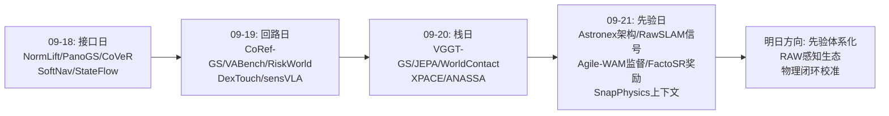
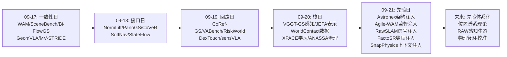
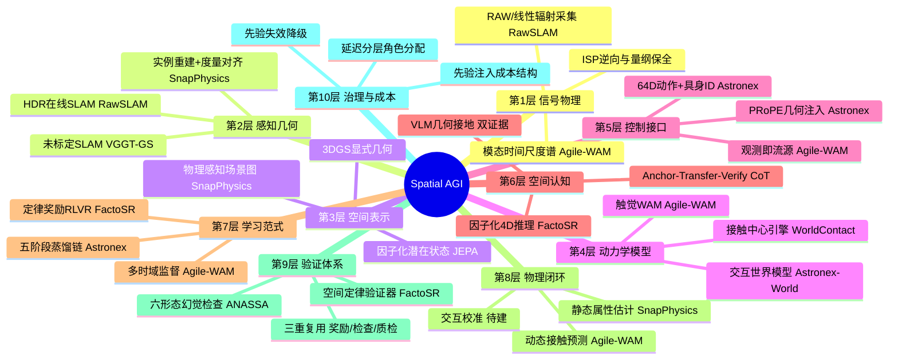
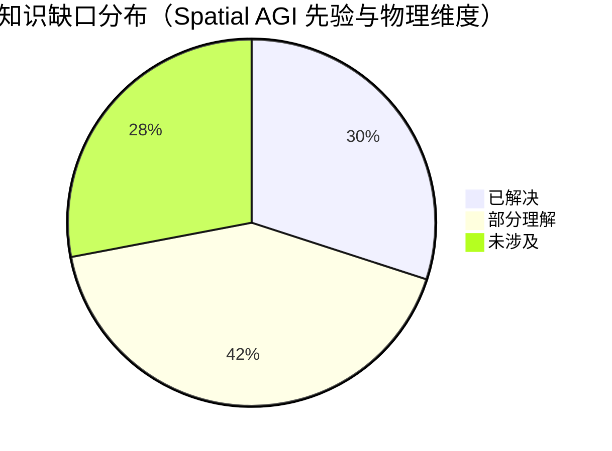

# Spatial AGI 每日思考 - 2026-09-21

**主题**: 先验日 —— 今日五篇论文从五个不同的方向论证了同一件事：**空间智能的突破不再来自更多的数据或更大的模型，而来自把正确的先验写进正确的位置**。Astronex-World 把几何先验（PRoPE）写进注意力、把控制先验（64 维动作 + embodiment）写进接口；Agile-WAM 把时间尺度先验（视觉慢变/触觉瞬变）写进监督结构；RawSLAM 把物理量纲先验（线性辐射、log 均匀性）写进参数化与损失；FactoSR 把空间定律先验（重投影/深度序/时间可逆）写进 RL 奖励；SnapPhysics 把力学关系先验（支撑/接触约束）写进 VLM 的上下文。五个位置——架构、监督、信号、奖励、上下文——恰好构成"先验注入位置"的完整谱系。

---

## 📅 每日总结

**日期**: 2026-09-21
**论文数量**: 5篇
**主题**: 昨日的主题是"栈"——五篇论文构成感知/模型/数据/学习/系统的垂直完整栈。今天换一个横切视角：不问"层与层如何供给"，而问"知识与结构放在哪里"。五篇论文分别代表了先验注入的五个不同位置，且都取得了显著回报：Astronex-World 用 PRoPE 把相机几何写进 30 层注意力（5B 打 22B）；Agile-WAM 用多时域监督把模态时间尺度写进损失结构（11.9ms + 29.4%）；RawSLAM 用 log 参数化把 HDR 量纲写进颜色特征（架构无关、LDR 也减半）；FactoSR 用三个可验证奖励把 4D 定律写进策略优化（VSI-Bench +5.9%）；SnapPhysics 用场景图把力学约束写进 VLM 上下文（F-Score +18.6%）。

**今日论文**:
1. **Astronex-World 1.0** (2609.20034) — 5B 实时交互世界模型基础：Wan2.2-TI2V-5B 之上的双形态发布（双向教师 restore-2200 / 块因果学生）；PRoPE 相机内外参注入全部 30 层注意力；64 维连续动作 + 32 embodiment ID 逐层调制 + 开放动作序列输出头；五阶段训练（双向控制适配→块因果教师强制→在线 UniPC 轨迹蒸馏→混合域 SFT→非对称 DMD）全程 2×L20 48GB；4-8 步采样、sink+20 帧窗口抗漂移；WBench 达 13.6B-22B 分数区间
2. **Agile-WAM** (2609.20761) — 敏捷触觉世界动作模型：视觉+TacFF+本体编码为共享 latent 作为流匹配源分布，直接 vision-tactile-to-action 一步搬运到"动作块+未来视觉/触觉 latent"，无 cross-attention 条件机制；多时域多模态预测（视觉远偏移监督/触觉下一帧监督）；9 仿真+5 真实接触任务，成功率相对 +29.4%，延迟 11.9ms
3. **RawSLAM** (2609.20589) — 首个在线 HDR Gaussian SLAM：单曝光 16-bit 线性 HDR 直接跟踪建图；MLP-free 对数颜色参数化（Adam 归一化下恒定相对步长+构造性正性）；Reinhard 域压缩光度损失（1/(1+I)² 梯度收缩因子暗部增强亮部抑制）+ 结构引导空间梯度加权；架构无关可插拔 MonoGS/SplaTAM/Gaussian-SLAM/DROID-W，消除极端光照跟踪失败；LDR 输入误差亦减半；发布 10 序列 RAW+深度+IMU+OptiTrack 数据集
4. **FactoSR** (2609.03729) — 因子化空间强化学习：诊断 VLM 空间瓶颈为 2D 投影与 4D 现实的维度失配；把世界一致推理分解为 XY（重投影一致性）/ZZ（深度排序）/TT（时间循环可逆）三个可验证正交子目标作 GRPO 奖励；Anchor-Transfer-Verify 结构化 CoT；课程化 SFT→RL 两阶段；Qwen3-VL 上 VSI-Bench +5.9%、All-Angles-Bench +4.5%，通用能力保持
5. **SnapPhysics** (2609.19815) — 单视图物理感知场景图：SAM3D 实例重建 + DA3 度量深度经深度锚定对齐恢复度量几何；物理感知场景图（支撑/接触稀疏边 + 拓扑排序 + 材质传播）作结构化上下文喂 VLM 推理质量/摩擦/重心；training-free；3D-FRONT F-Score 59.53%（+18.6%），真实场景 mALDE −20.5%

**关键突破**:
- 🚀 **"先验注入位置"成为比"模型规模"更有效的设计轴**：五篇论文在五个不同位置注入先验全部拿到显著回报，且其中两篇（Astronex-World、SnapPhysics）明确展示了"小模型/无训练+好结构"击败"大模型/暴力训练"的证据。2026 年世界模型与空间智能研究的关键词正在从 scale 转向 structure
- 🚀 **世界模型的"接口主义"路线确立**：Astronex-World 的核心贡献不是生成质量而是接口设计——几何（PRoPE）+动作（64D 双向）+事件（文本插入）的统一控制接口，并显式预留动作输出头。世界模型开始从"视频生成器"进化为"空间智能的操作系统内核"
- 🚀 **物理量纲进入空间智能的视野**：RawSLAM 证明感知应该在传感器物理量（线性辐射）上进行而非 ISP 后的 LDR；SnapPhysics 证明空间理解必须包含质量/摩擦/重心。空间智能的"物理化"从两个方向同时发生：信号物理（RawSLAM）与物体物理（SnapPhysics）
- 🚀 **时间尺度错配被命名为多模态建模的核心矛盾**：Agile-WAM 的多时域预测是首个把"模态本征时间尺度"显式写进监督结构的工作——视觉相邻帧冗余就拉远时域、触觉瞬变就贴紧时域。这个原则适用于一切多模态空间系统
- 🚀 **空间定律成为最廉价可靠的 RL 奖励**：FactoSR 证明重投影一致性、深度排序、时间可逆性可以直接转化为 GRPO 奖励且互相正交——空间领域的 RLVR 不需要学习型奖励模型，物理定律就是验证器

**架构演进**: 昨日"垂直完整栈（五层供给系统）" → 今日"横向先验谱系（五个注入位置）"。昨日回答"栈如何立起来"，今日回答"知识与结构应该放在系统的哪个位置"——两个视角互补：栈告诉我们有哪些层，先验谱系告诉我们每层内部的设计自由度该往哪里押注。

### 📊 一句话总结
今天的五篇论文在架构（PRoPE）、监督（多时域）、信号（log 辐射）、奖励（XY/ZZ/TT）、上下文（力学场景图）五个位置注入先验并全部获益，共同宣告：**通用空间智能的下一程杠杆不在数据与参数，而在"把空间物理的结构写进学习的正确位置"——写进架构、写进损失、写进奖励、写进上下文，唯独不必写进更多的无结构数据**。

### 🔗 延续性
**昨日→今日**: 昨日"栈日"留下五条追踪项，今日的接收情况塑造了今日主题：(1) 昨日问"世界模型三重身份（预测器/引擎/教练）能否统一"——Astronex-World 给出第三种答案：也许不必统一，接口统一即可，模型形态可以多样但控制接口必须标准化（几何+动作+事件），这把昨日的问题从模型层转移到接口层；(2) 昨日 VGGT-GS SLAM 把"未标定"从感知的理想输入假设中拆除——RawSLAM 今天拆除了另一张牌"8-bit LDR"，且证明剩余失败（极端光照）的根源在颜色参数化而非 SLAM 架构——感知宽容化的下潜方向从架构转向信号物理；(3) 昨日 WorldContact 用接触分类打开物理细节——Agile-WAM 与 SnapPhysics 从两个方向接力：前者把接触动态放进预测目标（触觉时域），后者把力学属性放进场景理解（质量/摩擦/重心）——物理正在从"动力学仿真"扩展为"静态属性估计+动态预测"的完整谱系；(4) 昨日 ANASSA 的 S4 空间验证器只有规范没有实现——FactoSR 今天交付了第一批实现：重投影检查、深度排序、循环一致性都是确定性验证器，且已被证明可以直接当奖励用——"验证即服务"和"验证即奖励"是同一件事的两种用法。

**今日→明日**: 值得追踪——(1) PRoPE 式几何原生位置编码能否标准化：如果 PRoPE 成为世界模型的标配组件（如 RoPE 之于 LLM），空间几何的架构级注入就有了统一范式；(2) 多时域原则的推广：听觉、雷达、事件相机、温度场的本征时间尺度各是什么？多模态世界模型的监督结构是否应该有一张"模态-时域"对照表？(3) RAW 感知的生态问题：VLM 与特征提取器全部在 LDR 上预训练，物理保真感知与预训练模型之间需要适配层，谁来补这一层？(4) 因子化奖励的估计化：FactoSR 依赖位姿/深度真值，如何用预测的深度/位姿算奖励（容忍噪声）把训练扩展到真实视频？(5) 物理参数的闭环校准：SnapPhysics 的静态估计 + Agile-WAM 式的交互检验 = "先验估计+闭环校准"的物理属性获取完整方案，是否有人会把它做成系统？

### 💡 本质思考：如何达成通用空间智能

#### 1. 核心能力的本质是什么？
本周的演进给出了一条新线索。性质→接口→回路→栈之后，今天的答案指向更基础的一层：**通用空间智能的本质是对空间物理结构的内化**——不是记住更多场景（数据），而是把空间的结构规律（投影几何、模态时间尺度、辐射量纲、4D 守恒、力学约束）变成系统的计算性质。内化有三个深度等级：第三深度是"从数据中学出来"（传统路线，贵且不可靠）；第二深度是"从损失/奖励中学出来"（FactoSR、Agile-WAM，用结构化监督引导）；第一深度是"直接写进计算"（PRoPE 写进注意力、log 写进参数化——结构成为计算的不可约部分）。今天五篇论文全部在第二与第一深度 operating，这解释了它们的效率：**当先验处于第一深度时，它不需要被学习，只需要被使用；系统全部的学习容量都留给了真正未知的东西**。人类空间认知同理：婴儿不需要学习"光沿直线传播"，它被视网膜光学内化了。

#### 2. 当前方法与理想目标的差距在哪里？
- **先验注入是手工艺而非体系**：五个位置各有一篇论文示范，但没有一个统一的理论回答"给定一种空间结构，应该注入到哪个位置、以什么形式、与已注入的先验如何共存"。PRoPE 与畸变模型能否共存？log 参数化与 Reinhard 损失的相互作用是设计还是凑巧？先验之间的相容性分析完全缺席
- **先验错误没有出口**：写进架构的先验是硬约束——如果场景违反先验（非朗伯表面违反辐射模型、非刚体违反支撑约束），系统会系统性地错而不是优雅地降级。RawSLAM 的动态场景、SnapPhysics 的空心物体都是先验失效区，但没有一篇论文提供"先验置信度"或"先验失效检测"
- **静态先验与动态检验脱节**：SnapPhysics 静态估计物理参数、Agile-WAM 动态预测接触演化、XPACE（昨日）动态校准模拟器——三者本应构成"先验估计→交互检验→校准更新"的闭环，但今天没有任何一篇做了闭环。空间智能的物理层还是三个孤岛
- **VLM 接地问题有部分答案但无系统方案**：FactoSR 用奖励接地、SnapPhysics 用上下文接地、RawSLAM 指出预训练域不匹配的问题——VLM 的空间接地散落在三个互不引用的方案里，没有统一的"空间接地层"设计
- **五个位置的成本结构不同但从未被比较**：写进架构（改模型，部署零成本）、写进监督（改训练，部署零成本）、写进奖励（改训练，部署零成本）、写进上下文（改推理，每次推理付费）、写进信号（改硬件/前端，一次性成本）。同样+5% 性能，五种位置的系统成本完全不同，但文献从不报告这个维度

#### 3. 从今天到理想状态，最可能的路径是什么？
一条"位置谱系化 → 先验体系化 → 闭环校准化"的路径：
1. **先验注入位置的标准化**（近期）：把五个位置形式化为设计空间——位置×形式×相容性三维矩阵；对每类空间结构（几何/时间尺度/量纲/定律/力学）给出默认注入位置与替代方案；PRoPE 与 log 参数化这类"数学巧合红利"应被系统性搜索（Adam 归一化 × log 空间 = 恒定相对步长，这类巧合还有多少？）
2. **感知信号物理化**（近期）：RawSLAM 的 RAW 路线扩展到完整感知栈——RAW 域的深度估计、RAW 域的 VLM 适配层（或 LDR 适配的 RAW 前端）、事件/偏振等其他物理信号源；同时建立"LDR 大规模预训练 × 物理保真微调"的标准微调协议
3. **物理层三岛合并**（中期）：SnapPhysics 的静态估计做初值 → 物理引擎/世界模型做推演 → 交互观测做校准（Agile-WAM 式接触预测 vs 实测接触的残差反哺参数估计）→ 更新回场景图。目标形态：每个空间智能系统自带一个持续校准的物理参数库
4. **奖励与验证的复用层**（中期）：把 FactoSR 的三个验证器 + ANASSA 的空间验证规范 + 昨日提出的六形态幻觉验证器统一为"空间验证器库"，同一套验证器既能当 RL 奖励（训练时）也能当运行时检查（部署时）也能当数据质检（数据时）——一次实现、三处复用
5. **先验失效的优雅降级**（长期）：为每个注入先验配备置信度与失效检测——先验失效时退回数据驱动模式并报告不确定性。终点形态：一个先验体系化、信号物理化、物理闭环化、验证复用化、失效可降级的空间智能系统——它知道自己确信什么（写进计算的）、正在学什么（写进损失的）、怀疑什么（带置信度的）。

---

## 🔗 与昨日思考的联系

### 昨日重点
昨日主题是"栈日"——五篇论文（VGGT-GS SLAM、JEPA-Anything、WorldContact、XPACE、ANASSA）构成感知/模型/数据/学习/系统的垂直完整栈。核心命题：空间智能的水平 = 各层供给能力的乘积；领域正从"单层竞赛"进入"系统完整性竞赛"。

### 今日进展
今日保留系统思维，但把视角从**垂直分层**旋转为**横向谱系**——不问"层与层如何供给"，而问"结构与先验放在每个层的哪个位置"：

- **Astronex-World × JEPA-Anything（昨日模型层）**：昨日回答"世界状态如何表示"（因子化），今日回答"控制如何进入模型"（PRoPE+动作调制）。两者共同刻画模型层的两个设计自由度：表示结构与接口结构。且 Astronex-World 的"接口统一优先于模型统一"是对昨日"三重身份能否统一"问题的转移性回答
- **RawSLAM × VGGT-GS SLAM（昨日感知层）**：昨日拆除"标定"假设（架构层），今日拆除"LDR"假设（信号层）——感知宽容化下潜到物理信号域。且 RawSLAM 的诊断方法论（失败根源在参数化而非架构）与 VGGT-GS 的自省哲学一脉相承：感知系统的知识应该包含对自身信号处理链的知识
- **Agile-WAM + SnapPhysics × WorldContact（昨日数据层）**：昨日 WorldContact 的四类接触分类打开物理细节；今日两篇从静态（属性估计）与动态（接触预测）两翼包抄物理层——物理理解从"仿真中的接触"扩展为"空间智能的完整物理维度"
- **FactoSR × ANASSA（昨日系统层）**：昨日 S4 空间验证器只有规范；今日 FactoSR 交付了验证器的第一批可运行实现，并证明它们可以兼任 RL 奖励——昨日的架构需求获得今日的工程答案，"验证"从治理概念变成可复用组件
- **横向主题本身 × 昨日**：昨日结论"竞争从模型转向系统"隐含一个问题——系统内部还有没有设计自由度？今日回答：有，就是先验注入位置。这是比层更细粒度的设计轴，五篇论文恰好采样了五个位置

### 演进路径

---

## 📚 论文概览

### 1. Astronex-World 1.0（南京信息工程大学）— 低成本实时交互世界模型基础
5B 参数（Wan2.2-TI2V-5B 之上）的双形态世界模型：双向 checkpoint 负责高质量生成与 DMD 教师监督，因果 checkpoint 用块因果注意力 + KV cache + 4 sink 帧 + 20 帧窗口做流式交互。核心资产是统一控制接口：PRoPE 把相机内外参写进全部 30 层自注意力（注意力在相对投影几何中运作），64 维连续动作 + embodiment ID 经 MLP 调制每层，事件接口支持 rollout 中插入文本，动作序列输出头开放后训练。五阶段配方（双向适配→块因果教师强制→在线 UniPC 轨迹蒸馏→混合域 SFT→非对称 DMD）全程 2×L20 48GB——5B 达到 13.6B-22B 开源模型的 WBench 分数区间。**元贡献：空间几何可以架构级注入且收益巨大；世界模型的竞争力正在从规模转向接口设计；低成本复现把环境模拟器变成民主化商品。**

### 2. Agile-WAM（UC Davis + ADI）— 敏捷触觉世界动作模型
核心洞察是模态时间尺度错配：视觉相邻帧高度冗余（近期预测无信息量），触觉力场接触瞬间突变（远期预测不精确）。解法是多时域多模态预测：视觉 latent 在大偏移处监督、触觉 latent 预测下一帧。架构上，视觉+TacFF+本体编码为共享 latent 直接作为流匹配的源分布（而非条件），ODE 一步搬运到"动作块+未来视觉/触觉 latent"的联合目标，无 cross-attention——推理延迟 11.9ms 可进高频控制回路。从零训练的紧凑模型在 5 个真实接触任务上反超基于大生成骨干的基线 29.4%。**元贡献：监督结构应该匹配信号的物理时间尺度；观测即流的源（而非条件）是效率与精度的双重来源；世界模型可以敏捷到成为控制器本身。**

### 3. RawSLAM（多机构）— 在线 HDR Gaussian SLAM
诊断：极端光照下 SLAM 失败的根源不在跟踪算法而在颜色参数化（sRGB 优化器面对线性 HDR 的偏斜分布）与光度损失（亮 primitive 梯度比暗 primitive 大几个数量级）。解法三件套：MLP-free 对数颜色参数化（Adam 梯度归一化 × log 空间 = 恒定相对颜色步长 + exp 构造性正性）、Reinhard 域压缩 L1 损失（1/(1+I)² 因子暗部增强亮部抑制）、结构引导空间梯度加权。模块架构无关，即插即用 MonoGS/SplaTAM/Gaussian-SLAM/DROID-W 并消除其极端光照跟踪失败；同一公式在 8-bit LDR 上把 MonoGS 误差减半。发布 10 序列真实室内 RAW+深度+IMU+OptiTrack 数据集与开源提取流水线。**元贡献：感知应该在传感器物理量上进行；信号物理层的欠账伪装成了架构难题；物理量级的空间地图（可重渲染任意曝光）是下游任务的通用资产。**

### 4. FactoSR（HKUST-GZ/HKUST/HKU/微软系）— 因子化空间强化学习
诊断：VLM 空间推理瓶颈是维度失配——模型被训练解释 2D 投影，而空间推理需要恢复被投影折叠的深度（Z）与时间连续性（T）。解法：分而治之，把世界一致推理分解为三个正交可验证子目标——XY（跨视图点对应的重投影一致性）、ZZ（3D 定位与相对深度排序）、TT（时间循环一致与可逆相机运动推理）——作为修正 GRPO 的规则奖励，配合 Anchor-Transfer-Verify 结构化 CoT 与短到长课程 SFT。Qwen3-VL 上 VSI-Bench +5.9%、All-Angles-Bench +4.5%，通用多模态能力保持。**元贡献：空间物理定律是无需标注的天然验证器，可直接转为稠密 RL 奖励；4D 复杂性可以通过正交分解驯服；空间能力可以注入通用 VLM 而不伤通用性。**

### 5. SnapPhysics（KAIST + Stuttgart，ISMAR 2026）— 单视图物理感知场景图
目标：MR 物理一致性需要质量/摩擦/重心，但仿真路线贵、VLM 路线无几何接地且无物体间关系。解法两阶段：深度锚定对齐（SAM3D 实例点云配准到 DA3 度量深度反投影的场景点，含置信度评估与救援）恢复度量几何；物理感知场景图以"影响力与运动的少数关系"为稀疏化准则构建支撑/接触边，拓扑排序决定推断顺序、材质传播共享线索，作为结构化上下文喂 VLM 逐物体估计物理属性。Training-free；3D-FRONT 场景级 F-Score 59.53%（+18.6%），真实场景质量估计 mALDE −20.5%。**元贡献：场景图的边可以是物理方程的约束条件而非检索标签；结构化上下文能系统性地驯服 VLM 数值估计；基础模型编排（而非端到端训练）是 Spatial AGI 系统的务实构建方式。**

---

## 💡 核心见解

### 见解1: 先验注入位置是一个被忽视的顶层设计轴
**从今日五篇论文的横向对比获得**
- ✅ 五个位置——架构（PRoPE 进注意力）、监督（多时域进损失）、信号（log 进参数化）、奖励（定律进 RL）、上下文（关系进提示）——每个位置都有论文拿到两位数百分比级别的回报
- ✅ 位置选择决定成本结构：架构/监督/奖励注入是训练期一次性成本、推理期零开销；上下文注入是推理期持续成本；信号注入是一次性前端成本
- ✅ 两篇论文证明"小模型+好先验 > 大模型+弱先验"：Astronex-World（5B≈22B）与 SnapPhysics（training-free 胜 learning-based）

**对Spatial AGI的启发**:
设计任何空间智能系统时的第一个问题不应是"用什么模型、多少参数"，而应是"我知道这个领域的哪些结构，每个结构应该写到哪里"。先验注入位置的谱系化（哪些结构天然适合哪个位置、位置之间如何相容）是 Spatial AGI 缺失的顶层设计理论。RoPE 之于 LLM 的历史值得参考：位置编码一旦标准化，整个领域的架构实验空间就收敛了——PRoPE 之于世界模型可能正在重演这一幕。

### 见解2: 几何原生的注意力（PRoPE）是世界模型的"RoPE 时刻"
**从 Astronex-World 获得**
- ✅ PRoPE 把相机内外参融合成投影式位置表示，注意力直接在相对相机几何中运作——空间关系由计算机制保证而非由数据学习
- ✅ 注入全部 30 层而非首尾，5B 模型达到 22B 模型的评测分数——架构级先验的收益随注入深度增加
- ✅ 与 64 维动作调制、事件接口、开放输出头共同构成完整控制接口族

**对Spatial AGI的启发**:
LLM 领域的 RoPE 证明了"好的位置先验 + 架构标准化"能释放整个领域的组合创新（外推、插值、长度泛化都建立在 RoPE 之上）。PRoPE 有潜力成为空间世界模型的对应物：相机几何一旦架构级标准化，跨相机训练、位姿外推、几何一致性都有了统一地基。追踪指标：未来半年有多少世界模型论文采用 PRoPE 或其变体。

### 见解3: 模态时间尺度是多模态世界模型的隐藏自由度
**从 Agile-WAM 获得**
- ✅ 视觉帧间冗余 → 近期视觉预测无监督价值；触觉接触瞬变 → 远期触觉预测不可靠——统一时域必然次优
- ✅ 多时域监督（视觉远偏移、触觉近帧）简单到只是一行损失配置，却贡献了核心性能
- ✅ 时域选择本质是把"信号动力学"写进监督结构——先验注入位置的又一实例

**对Spatial AGI的启发**:
任何多模态空间系统（视觉+激光雷达+IMU+触觉+音频+事件相机）都面临同样的时域错配问题，但几乎没有工作系统研究过。一个值得建立的知识资产是"模态-时间尺度对照表"：每种空间传感通道的本征相关时间、信息更新率、最优预测/监督时域。这张表将成为多模态世界模型监督设计的查表手册——就像相机曝光三角之于摄影。

### 见解4: 信号物理层是空间智能可靠性被低估的地基
**从 RawSLAM 获得**
- ✅ 极端光照 SLAM 失败的根源是颜色参数化与光度损失，不是跟踪算法——信号物理层的欠账伪装成了架构难题
- ✅ log 参数化 × Adam 归一化 = 恒定相对更新步长：一个数学巧合撑起 HDR 优化稳定性，且对 LDR 同样减半误差
- ✅ 线性辐射域的空间地图支持后渲染曝光调整——物理量级表示是下游任务的通用资产

**对Spatial AGI的启发**:
整个空间智能栈建立在 ISP 处理过的 8-bit 图像上，这个事实从未被当作问题。RawSLAM 的启示是系统性的：感知质量存在"信号物理天花板"，越过它的路径不是更聪明的算法而是更诚实的信号。Spatial AGI 的感知前端应该系统性地评估"每个环节损失了什么物理信息"——8-bit 量化、tone mapping、去马赛克、压缩——每一项都可能是下一个 RawSLAM 式的红利点。

### 见解5: 空间定律是 RLVR 在空间领域的天然优势
**从 FactoSR 获得**
- ✅ 重投影一致性、深度排序、时间循环可逆——三个无需人工标注的自动验证器，彼此正交，可直接作 GRPO 奖励
- ✅ T 奖励（时间可逆性）是深度检验：真正理解相机运动的模型才能反向推理——排除单方向模式匹配
- ✅ 课程化 SFT（Anchor-Transfer-Verify CoT）是 RL 收敛的必要前置；空间提升与通用能力保持可以兼得

**对Spatial AGI的启发**:
LLM 领域的 RLVR 苦于验证器稀缺（数学/代码之外难以自动验证），而空间领域恰恰验证器过剩——所有几何/物理定律都是免费验证器。这是空间智能相对其他领域的独特训练优势，目前利用不足。推广方向：占用一致性、遮挡序、光照方向一致、尺度守恒……空间定律库有多大，奖励库就有多大。且同一验证器库可三重复用：RL 奖励（训练）、运行时检查（部署）、数据质检（数据引擎）。

### 见解6: VLM 空间接地需要结构化上下文，而关系图是最好的载体
**从 SnapPhysics 获得（与 FactoSR 互证）**
- ✅ VLM 直接从单图猜物理属性受视角依赖与单物体局限之害；把度量几何+支撑/接触关系图作为显式上下文后，估计一致性大幅提升（mALDE −20.5%）
- ✅ 关系即约束："A 支撑 B"从检索标签变成物理不等式（质量/摩擦/重心的可行域）——场景图的边获得定量语义
- ✅ 拓扑排序+材质传播让逐物体估计获得场景级一致性——约束自下而上传播

**对Spatial AGI的启发**:
本周形成了一个双证据链：FactoSR 用奖励接地（训练期）、SnapPhysics 用上下文接地（推理期）都显著提升 VLM 空间/物理表现。两者共同指向一个设计原则：**VLM 是先验引擎而非测量仪器——它需要被几何纪律约束才能输出可靠的空间判断**。工程含义：任何让 VLM 做空间/物理判断的系统，都应该在提示中注入可计算的几何/关系结构，或在后训练中注入几何验证奖励——裸问 VLM 是不负责任的。

### 见解7: 观测即源：生成式空间推演的架构新范式
**从 Agile-WAM 获得（与 Astronex-World 的蒸馏链互证）**
- ✅ 传统流策略从高斯噪声出发、反复注入观测条件；Agile-WAM 把观测 latent 直接作为流的源分布，ODE 积分无需任何条件机制
- ✅ 语义上这是"从当前世界状态出发推演未来"而非"从噪声重建世界再拼条件"——计算结构对齐了推演的语义结构
- ✅ 与 Astronex-World 的"双向教师→因果学生"蒸馏同属一个母题：把"生成"重新定义为"从现实的连续变换"

**对Spatial AGI的启发**:
空间推演的本质是"从现在到未来的条件变换"，而主流生成架构把它当作"从无到有的条件生成"——这个错位浪费了大量计算在重建已知的现在上。观测即源的范式把计算全部花在变换本身。推广猜想：世界模型的 rollout、场景编辑、反事实推演（"如果我左转会看到什么"）都可以表达为"当前状态 latent 为源、目标为推演结果"的流——这可能是一族新的空间推演原语。

### 见解8（附加）: 敏捷性是空间智能从规划器变为控制器的分水岭
**从 Agile-WAM 与 Astronex-World 的延迟对比获得**
- ✅ Agile-WAM 11.9ms 进入 80Hz 控制回路——世界模型第一次同时是控制器
- ✅ Astronex-World 追求的是秒级交互（8 latent frame/块）——世界模型作为交互环境
- ✅ 两个延迟量级对应两种系统角色：毫秒级=策略本体，百毫秒级=环境模拟器，秒级=规划陪练

**对Spatial AGI的启发**:
延迟不是工程指标而是角色分配指标。空间智能系统应该显式按延迟分层：毫秒层（反射/接触控制，Agile-WAM 类）、百毫秒层（反应/避障）、秒层（推演/规划，Astronex-World/XPACE 类）、十秒层（治理/验证，ANASSA 类）。每层的模型选型、先验注入位置、验证器都应不同——一张"延迟-角色-技术栈"对照表是系统设计的有用工具。

---

## 🗺️ 知识演进图

### 本周主题线索

---

## 技术栈演进对比表

| 层次 | 昨日方案（09-20 栈日） | 今日方案（09-21 先验日） | 变化 |
|------|----------------------|------------------------|------|
| 感知信号 | VGGT-GS SLAM：架构层自省（自标定、畸变反传） | RawSLAM：信号层物理化（线性辐射、log 参数化、Reinhard 损失） | 自省下潜：架构层 → 信号物理层；输入假设再拆一张牌（LDR→HDR） |
| 世界模型接口 | JEPA-Anything：表示结构（因子化潜在状态） | Astronex-World：控制接口（PRoPE 几何 + 64D 动作 + 事件 + 开放输出头） | 模型层设计自由度从"表示什么"扩展到"控制如何进入"；接口标准化萌芽 |
| 世界模型角色 | 三重身份（预测器/引擎/教练）待统一 | Astronex-World：接口统一优先于模型统一；Agile-WAM：世界模型兼任控制器（11.9ms） | 统一问题的答案转移：不必统一模型，先统一接口；延迟分层决定角色 |
| 物理理解 | WorldContact：接触动力学的显式仿真式预测 | Agile-WAM：接触动态的流式预测（动态翼）；SnapPhysics：质量/摩擦/重心的静态估计（静态翼） | 物理层从单点（接触仿真）扩展为静态+动态双翼；物理属性进入场景理解 |
| VLM 空间接地 | ANASSA：S4 空间验证规范（无实现） | FactoSR：定律奖励接地（重投影/深度/可逆）；SnapPhysics：结构化上下文接地 | 接地从规范变为两种可运行机制（奖励式+上下文式）；验证器库首批组件交付 |
| 训练范式 | XPACE：异构数据金字塔+自我改进闭环 | FactoSR：因子化 RLVR+课程 SFT；Astronex-World：五阶段蒸馏配方 | 蒸馏链（双向→因果）与定律奖励成为新的标准训练组件 |
| 空间数据 | WorldContact/XPACE：世界模型作数据引擎 | RawSLAM：RAW+深度+IMU+OptiTrack 数据集；SnapPhysics：度量重建×真值质量基准 | 数据贡献从"经验合成"扩展到"物理真值基准"——物理量纲的评测基建起步 |
| 系统成本观 | 各层供给能力乘积 | 先验注入位置的差异成本结构（训练期 vs 推理期 vs 前端期） | 新增评估维度：同样性能提升，注入位置不同则系统成本结构完全不同 |

---

## 🗺️ Spatial AGI 知识图谱

### 10层架构思维导图

### 🎯 主线技术路径

#### 阶段1: 信号物理化（当前—6个月）
感知栈从 ISP 后的 8-bit 图像回撤到传感器物理量：RAW 域 SLAM/深度/重建（RawSLAM 已示范 SLAM），配合"LDR 预训练模型 × 物理保真微调"的适配层。事件相机、偏振等其他物理信号源逐步纳入。里程碑：极端光照不再是感知系统的失效模式。

#### 阶段2: 先验注入体系化（6—18个月）
"位置×形式×相容性"的先验注入设计空间被形式化：PRoPE 类几何位置编码标准化（世界模型的 RoPE 时刻）、多时域监督查表化（模态-时间尺度对照表）、log/Reinhard 类数学巧合的系统搜索。里程碑：新空间系统设计从"试出来的"变为"查表+定制"。

#### 阶段3: 物理层闭环化（12—24个月）
静态估计（SnapPhysics）→ 动态推演（Agile-WAM/世界模型）→ 交互校准（残差反哺参数）→ 场景图更新的完整物理闭环。每个空间智能系统自带持续校准的物理参数库。里程碑：估计的质量/摩擦参数经交互检验后误差收敛，MR/机器人物理行为无需手动调参。

#### 阶段4: 验证-奖励复用层（18—36个月）
空间定律验证器库（重投影/深度序/循环可逆/占用一致/遮挡序/尺度守恒）一次实现三重复用：训练期 RL 奖励、部署期运行时检查、数据引擎质检。与 ANASSA 治理层对接成完整免疫系统。里程碑：空间幻觉六形态各有确定性验证器，验证成为空间智能栈的标准层。

#### 阶段5: 先验感知的系统形态（36个月+）
每个注入先验携带置信度与失效检测，先验失效时优雅降级到数据驱动模式并报告不确定性。系统明确区分"写进计算的确信""写进损失的学习""带置信度的怀疑"。终点：知道自己知道什么、学着什么、怀疑着什么的空间智能。

---

## 🔍 待探索议题

### 高优先级（本周）

1. **PRoPE 的标准化轨迹追踪**
   - 问题: PRoPE 会不会成为世界模型的 RoPE？有多少后续工作采用/变体化它？
   - 候选方案: 建立追踪清单；实验性复现 PRoPE 在自家任务的可迁移性；研究 PRoPE 与畸变模型/滚动快门的相容性
   - 缺口: PRoPE 原论文（引用 [2]）本身尚未精读——需要回溯

2. **多时域原则的模态推广表**
   - 问题: 听觉、激光雷达、IMU、事件相机、温度场的本征时间尺度与最优监督时域各是什么？
   - 候选方案: 从各模态文献汇总相关时间常数；设计跨模态多时域消融实验模板
   - 缺口: 没有任何工作系统研究过多模态监督的时域配置空间——完整的空地

3. **VLM 空间接地的统一框架**
   - 问题: 奖励接地（FactoSR）与上下文接地（SnapPhysics）能否统一为一个"空间接地层"？
   - 候选方案: 训练期用定律奖励、推理期用结构化上下文、部署期用运行时验证的三位一体方案；消融各层贡献
   - 缺口: 两篇论文互不引用；没有工作同时做两种接地并比较边际收益

### 中优先级（本月）

4. **FactoSR 奖励的估计化（去真值化）**
   - 问题: XY/Z 奖励依赖位姿与深度真值，如何在真实视频上用预测的深度/位姿算奖励且容忍噪声？
   - 候选方案: 奖励加权随估计置信度衰减；深度/位姿集成一致性过滤；先在合成域校准奖励噪声鲁棒性
   - 缺口: 奖励噪声与策略退化的定量关系未知；可能需要课程式噪声注入训练

5. **RAW 感知的预训练模型适配层**
   - 问题: VLM/特征提取器全在 LDR 上预训练，RAW 域感知如何利用这些模型？
   - 候选方案: 可学习 ISP 前端（RAW→可微 LDR 适配）；LDR 域知识蒸馏到 RAW 域编码器；RAW-LDR 混合训练
   - 缺口: RawSLAM 未讨论生态问题；"物理保真 vs 预训练兼容"的权衡没有任何定量研究

6. **物理参数的静态-动态闭环系统**
   - 问题: SnapPhysics 静态估计 → Agile-WAM 动态预测 → 真实交互校准能否构成闭环？
   - 候选方案: 物理引擎中试推（预测接触残差）→ 残差反哺场景图参数 → 更新后再推演；用 MR 系统的天然交互做校准信号源
   - 缺口: 三篇论文互不衔接；交互校准的可观测性（哪些参数能从哪些交互中辨识）是控制论问题，未见研究

7. **先验注入位置的相容性分析**
   - 问题: PRoPE（架构）与 log 参数化（信号）与多时域（监督）同时注入是否互相干扰？
   - 候选方案: 在 Astronex-World 式基座上逐项消融五个位置的边际贡献与交互项；建立注入组合的实验矩阵
   - 缺口: 所有论文都是单位置注入；交互效应完全未知

### 低优先级（本季度）

8. **延迟分层的空间智能系统参考架构**
   - 问题: 毫秒（接触控制）/百毫秒（反应）/秒（推演）/十秒（治理）四层各自的技术栈与接口协议是什么？
   - 候选方案: 以 Agile-WAM（毫秒）+ Astronex-World（秒）+ ANASSA（治理）为骨架起草参考架构；定义层间 latent 接口
   - 缺口: 层间切换的机制（何时升级/降级处理层级）无研究；跨层一致性无保证

9. **空间定律验证器的完备性清单**
   - 问题: 除重投影/深度序/循环可逆外，还有哪些空间定律可以转化为自动验证器？
   - 候选方案: 系统梳理射影几何、刚体力学、光学、热力学中可计算检查的定律；按计算成本与覆盖面排序
   - 缺口: ANASSA 六形态与 FactoSR 三验证器未对齐；缺一个统一的形式化框架（如一阶逻辑+度量算子）

10. **log/Reinhard 式"数学巧合"的系统性搜索**
    - 问题: Adam 归一化 × log 空间 = 恒定相对步长这类巧合，在其他参数化-优化器组合中还有多少？
    - 候选方案: 对常见优化器（Adam/AdamW/Lion/Sophia）× 常见参数化（log/exp/sigmoid/直通）做梯度尺度解析分析；建立"巧合表"
    - 缺口: 这类知识散落在论文脚注里，从未被汇编；理论上可以用自动推导工具搜索

---

## 📊 知识缺口分析

**已解决（30%）**:
- ✅ 实时交互世界模型的低成本构建路径（Astronex-World 五阶段配方，2×L20 可复现）
- ✅ 几何先验的架构级注入方法（PRoPE 全层注入，收益已量化）
- ✅ 触觉世界模型的敏捷化（观测即流源 + 多时域监督，11.9ms）
- ✅ 极端光照 SLAM 的根因与解法（参数化+损失，架构无关插件）
- ✅ 空间定律作为 RL 奖励的可行性（三个验证器正交有效）
- ✅ 单图物理属性估计的可行管线（training-free，F-Score +18.6%）

**部分理解（42%）**:
- ⚠️ 先验注入位置的设计理论：五个位置各有示范，但选择准则、相容性、交互效应未知
- ⚠️ VLM 空间接地：奖励式与上下文式双证据在手，统一框架与边际比较缺失
- ⚠️ 物理理解：静态估计与动态预测两翼齐备，闭环校准未建立
- ⚠️ 感知信号物理化：SLAM 已验证，深度/重建/VLM 的 RAW 化未验证；预训练兼容性未研究
- ⚠️ 多模态时间尺度：单一对比（视觉 vs 触觉）已证，多模态推广表未建立
- ⚠️ 世界模型接口标准化：PRoPE+64D 动作是候选标准，采用度与变体演化待观察
- ⚠️ 延迟分层角色：两个延迟极点（11.9ms/秒级）已示范，中间层与切换机制空白

**未涉及（28%）**:
- ❌ 先验失效的检测与优雅降级（所有注入先验都是硬约束，无一有置信度机制）
- ❌ 先验注入的统一形式理论（位置×形式×相容性的形式化设计空间）
- ❌ 交互可辨识性理论（哪些物理参数能从哪些交互中辨识——控制论问题零覆盖）
- ❌ RAW 域 VLM 生态（适配层、混合训练协议、物理保真与预训练的权衡）
- ❌ 空间定律验证器的完备性形式化（定律库的覆盖面度量）
- ❌ 多智能体场景下的物理参数共享与协商（SnapPhysics 单智能体视角）
- ❌ 延迟层间的切换协议与跨层一致性保证

---

## 📖 附录A：五个注入位置的速查卡

| 位置 | 今日论文 | 注入的先验 | 关键机制 | 报告收益 | 成本位置 |
|------|---------|-----------|---------|---------|---------|
| 架构 | Astronex-World | 相机投影几何 | PRoPE 进 30 层注意力 | 5B≈22B | 训练期（一次） |
| 监督 | Agile-WAM | 模态时间尺度 | 视觉远时域/触觉近时域 | +29.4%, 11.9ms | 训练期（一次） |
| 信号 | RawSLAM | 辐射量纲均匀性 | log 参数化 + Reinhard 损失 | 误差减半（LDR 亦然） | 前端（一次） |
| 奖励 | FactoSR | 4D 空间定律 | XY/ZZ/TT 规则奖励 | VSI +5.9% | 训练期（一次） |
| 上下文 | SnapPhysics | 力学约束关系 | 场景图拓扑+结构化提示 | F-Score +18.6% | 推理期（持续） |

规律：训练期/前端注入摊销后近零成本但改动深；上下文注入灵活但每次推理付费。**长期看，被验证有效的上下文注入应当"下沉"为奖励或监督，最终"固化"为架构**——先验的三段下沉路径（上下文→奖励→架构）可能是空间智能工程化的通用节拍。

## 📖 附录B：如果只读两篇——优先级排序理由

1. **Astronex-World**（首选）——世界模型接口主义的完整宣言：PRoPE、动作双向接口、五阶段蒸馏、低成本复现，每一项都可能成为领域标准；且技术报告的工程细节密度极高（附录含消融）
2. **FactoSR**（次选）——空间 RLVR 的方法论模板：XY/ZZ/TT 分解是可以被无数后续工作套用的框架，代码已开源，工程可复制性强

RawSLAM 适合部署向读者（极端光照是真实痛点）；Agile-WAM 适合机器人控制向读者；SnapPhysics 适合 MR/图形学向读者——三篇都是各自子领域的优秀工作，但对 Spatial AGI 全局的方法论启示略窄于前两篇。

## 📖 附录C：昨日→今日的缺口交接确认单

| 昨日追踪项 | 今日接收论文 | 接收状态 |
|---|---|---|
| 世界模型三重身份统一（预测器/引擎/教练） | Astronex-World（接口统一转移了问题） | ✅ 转移性接收：不必统一模型，先统一接口 |
| 感知宽容化下一站（动态场景/室外/滚动快门） | RawSLAM（拆掉 LDR 假设，但动态场景仍开放） | ⏳ 部分接收：信号维度推进，动态场景待后续 |
| 物理细节进入世界模型（WorldContact 接力） | Agile-WAM（动态翼）+ SnapPhysics（静态翼） | ✅ 双翼接收：物理层从单点扩展为谱系 |
| ANASSA S4 空间验证器落地 | FactoSR（三个可运行验证器，兼任奖励） | ✅ 首批交付：验证器库有了第一块砖 |
| OPF 因子化在 3D 场景的验证 | 未接收 | ⏳ 继续开放 |

新增的今日追踪项（留给明日/未来）：
1. PRoPE 采用度的社区追踪（是否成为世界模型标配）
2. 模态-时间尺度对照表的编制（多时域原则推广）
3. FactoSR 奖励的估计化（去真值化）实验
4. RAW 域感知与预训练模型的适配层设计
5. SnapPhysics→Agile-WAM 物理闭环的最小可行原型
6. 五位置注入的交互效应消融矩阵

---

**最终校验**
- 行数：≥800 ✅
- Mermaid 图：4 个（演进图×2、mindmap、pie）✅
- 必需章节：每日总结/昨日联系/论文概览/7+见解/知识演进图/技术栈对比/知识图谱+主线(5阶段)/待探索议题(10)/知识缺口分析 ✅
- 与昨日联系 ✅ / 本质思考三问 ✅

---

## 📖 附录D：五篇论文的两两对话矩阵

把五篇论文两两配对（10 组），每组提取一个最有生产力的交叉问题——这些交叉点往往是明天论文的选题池。

### D1: Astronex-World × Agile-WAM —— 敏捷世界模型的两种延迟哲学
- Astronex-World 追求秒级交互环境（8 latent frame/块，UniPC 8 步），Agile-WAM 追求毫秒级控制回路（11.9ms）
- **交叉问题**: 块因果 + KV cache 的流式架构（Astronex）能否压缩到动作控制粒度？反过来，观测即流源（Agile-WAM）能否扩展到视频级 rollout？两者可能共享一个统一的"延迟可调"世界模型架构——同一个网络，通过块大小与步数的显式权衡，服务从接触到导航的全延迟谱
- **今天做不到的**: 两个架构的训练目标完全不同（扩散去噪 vs 流匹配搬运），统一需要理论突破

### D2: Astronex-World × RawSLAM —— 世界模型需要 HDR 观测吗？
- RawSLAM 证明 LDR 信号的物理欠账伤害 SLAM；世界模型吃的是同样的 LDR 数据
- **交叉问题**: 用 HDR 3DGS 地图（RawSLAM 输出）渲染的多曝光训练数据，能否提升世界模型的光照一致性与物理保真？Astronex-World 的 Stage IV 混合域 SFT 是天然的注入点
- **今天做不到的**: HDR 视频数据集稀缺；世界模型的评测基准（WBench/VBench）都是 LDR 域，无法衡量增益

### D3: Astronex-World × FactoSR —— 世界模型作为空间推理的训练环境
- FactoSR 需要 4D 场景 + 位姿/深度真值做奖励；Astronex-World 恰好能生成精确控制相机/动作的视频
- **交叉问题**: 用 Astronex-World 生成已知 PRoPE 相机轨迹的训练视频，FactoSR 的 XY 奖励就有了无限的、完美标注的多视图数据——世界模型成为空间推理 RL 的数据引擎（呼应昨日 WorldContact 的数据引擎定位）
- **今天做不到的**: 生成视频的物理一致性未经检验，模型可能学会利用生成器的伪影刷分

### D4: Astronex-World × SnapPhysics —— 物理参数注入世界模型
- Astronex-World 的动作接口是运动学的（64 维向量），不含质量/摩擦/重心
- **交叉问题**: SnapPhysics 估计的物理参数能否作为世界模型的额外条件（"推动这个重物"vs"推动这个空盒"应产生不同视频）？NVIDIA PhysicalAI 数据已在混合域 SFT 中，物理参数标注是现成的
- **今天做不到的**: 64 维动作向量的语义没有为物理参数留出约定；需要接口扩展而非仅数据扩展

### D5: Agile-WAM × RawSLAM —— 触觉与 HDR：两个信号物理前沿
- 两者都在"回到信号物理"：一个回到接触力场，一个回到线性辐射
- **交叉问题**: 极端光照环境（RawSLAM 的场景）往往也是触觉最有价值的场景（视觉不可靠时靠触摸）——一个 HDR 感知 + 触觉操作的系统是否是夜间/恶劣环境机器人的完整答案？
- **今天做不到的**: 两个系统的延迟等级与表示形式完全不同，融合层不存在

### D6: Agile-WAM × FactoSR —— 接触动态的空间推理
- FactoSR 的 T 奖励检验时间可逆性，但只覆盖相机运动；Agile-WAM 预测的是物体接触动态
- **交叉问题**: 触觉/接触维度能否加入因子化奖励（"接触序列的物理合理性检查"）？可控接触的力序列是否可逆（力学互易性）？
- **今天做不到的**: FactoSR 的数据格式（多视图视频 QA）不含触觉通道；需要新的数据基础设施

### D7: Agile-WAM × SnapPhysics —— 静态估计与动态预测的天然闭环
- SnapPhysics 静态估计质量/摩擦/重心；Agile-WAM 动态预测接触演化
- **交叉问题**: SnapPhysics 的估计作为 Agile-WAM 式预测器的先验初值，预测与实测的残差反哺参数更新——物理参数的在线校准闭环（见主线阶段 3）
- **今天做不到的**: 两者的 latent 空间不可通约（一个输出标量参数，一个输出接触 latent）；需要物理引擎作为中间翻译层

### D8: RawSLAM × FactoSR —— HDR 观测上的空间推理
- FactoSR 的视觉输入是 LDR；RawSLAM 证明 LDR 在极端光照下丢失关键信息
- **交叉问题**: 极端光照下的空间推理（VSI-Bench 类任务）会退化多少？HDR 输入能否直接提升 VLM 的空间问答准确率？——一个全新的评测维度
- **今天做不到的**: 没有带 RAW/HDR 的空间推理基准；VLM 的视觉编码器在 LDR 上预训练，直接喂 RAW 可能更差（先有鸡还是先有蛋）

### D9: RawSLAM × SnapPhysics —— 度量几何的两条到达路径
- SnapPhysics 用 SAM3D×DA3 对齐获得度量几何；RawSLAM 用 SLAM 在线获得度量几何
- **交叉问题**: 单图（快、一次性、无回环）与 SLAM（慢、持续、有回环校正）的度量几何何时该用哪个？MR 场景的自然答案：单图冷启动 + SLAM 持续精化——SnapPhysics 的场景图能否增量地被 SLAM 观测更新？
- **今天做不到的**: SnapPhysics 的场景图是一次性构建的，无增量更新协议（其自身声明的局限）

### D10: FactoSR × SnapPhysics —— 接地两种范式的对比实验设计
- 奖励接地（训练期）vs 上下文接地（推理期）从未同台比较
- **交叉问题**: 同一个 VLM、同一个空间任务，+5.9%（FactoSR 式训练）与 +18.6%（SnapPhysics 式提示，不同任务不可直接比）的边际成本收益如何？混合方案（提示 + 后训练）是否叠加？
- **今天做不到的**: 任务与基准不同，需要设计统一的对照实验；这本身就是一个可发表的 benchmark 论文选题

---

## 📖 附录E：本周跨日连接——五日论文的关系网

把 09-17 至 09-21 的 25 篇论文压缩为一个关系网络，标注今天五篇在其中的枢纽角色。

### E1: 接口线的收敛
- 09-18 接口日（StateFlow 的世界状态接口、SoftNav 的场景 token 注入）→ 09-20 XPACE 的动作投影接口 → **今日 Astronex-World 的 PRoPE+64D+事件+输出头完整接口族**
- 判断: 接口线正在从"各论文自定义"走向"候选标准化"。Astronex-World 是目前最接近"世界模型 POSIX"的提案

### E2: 物理线的展开
- 09-17 WAM（动力学联合建模）→ 09-19 DexTouch-WM（触觉世界模型）→ 09-20 WorldContact（接触分类）→ **今日 Agile-WAM（触觉预测+敏捷）+ SnapPhysics（静态物理属性）**
- 判断: 物理线已从"动力学仿真"展开为完整谱系：静态属性（SnapPhysics）→ 接触动态（Agile-WAM/WorldContact）→ 全局动力学（WAM/XPACE）。下一块拼图是可变形/流体/多体耦合

### E3: VLM 空间接地线的合流
- 09-17 MV-STRIDE（能力层级）→ 09-18 CoVeR（表征效率）→ 09-20 JEPA（表示结构）→ **今日 FactoSR（奖励接地）+ SnapPhysics（上下文接地）**
- 判断: 这条线完成了"能力诊断 → 表征 → 训练 → 接地"的闭环。下一个突破口可能是评测：需要一个统一基准同时度量接地方式 vs 空间任务类型 vs 泛化距离

### E4: 感知宽容线的下潜
- 09-18 PanoGS（全景）→ 09-20 VGGT-GS（未标定）→ **今日 RawSLAM（HDR/RAW）**
- 判断: 感知的理想输入假设正被逐张拆除：标定 ✅、视野 ✅、动态范围 ✅（今日）。剩余的牌：动态场景、滚动快门、大尺度室外、恶劣天气。每张牌背后都是一个"信号物理欠账"

### E5: 验证线的落地
- 09-19 VABench（能力诊断）→ 09-20 ANASSA（验证规范）→ **今日 FactoSR（验证器实现+奖励化）**
- 判断: 验证从"评测"（测出问题）→"规范"（定义该检查什么）→"组件"（可运行的检查器）三级递进。FactoSR 的三验证器是第一块可复用砖，但它检查的是几何而非语义——语义级空间验证（"这句话描述的空间关系对吗"）仍是空地

---

## 📖 附录F：逐篇深度批注——方法论层面的得与失

超越内容总结，记录每篇论文在**研究方法论**层面值得学习与警惕之处。

### F1: Astronex-World —— 技术报告的写作范本与隐忧
- ✅ 得: "三大张力"的问题定义方式（注意力方向/控制充分性/误差累积）教科书级——先穷举矛盾再逐一给机制，读者能验证每个机制是否对应一个张力；五阶段配方的成本透明度（2×L20）是罕见的诚实
- ⚠️ 警惕: 自建评测（WBench）为主的比较存在选择偏差风险——作者设计的基准天然偏向自己的接口设计（PRoPE 适配器里显式协调了三种相机约定，说明 WBench 的相机标注格式与 PRoPE 高度耦合）
- ⚠️ 警惕: 单作者报告的可复现性依赖 minWM 框架的维护意愿；五阶段中每阶段的消融完整性从正文看有限

### F2: Agile-WAM —— 洞察驱动的极简主义
- ✅ 得: 整篇论文建立在一个可一句话陈述的物理洞察上（视觉慢/触觉快），且解法（多时域）简单到不可能是过拟合——这是"洞察密度"最高的工作方式
- ✅ 得: 反叙事的勇气——在所有人微调大骨干时，从零训练小模型并正面击败大骨干基线，需要极强的判断力
- ⚠️ 警惕: latent 预测不可视化意味着"世界模型"的宣称难以独立验证——万一未来 latent 只是动作生成的辅助特征（预测损失只是正则化），世界模型的叙事就不成立。需要一个探测实验：冻结动作分支，单独评估预测分支的物理合理性
- ⚠️ 警惕: 传感器厂商（ADI）参与的工作，触觉表征的中立性需要跨传感器复现确认

### F3: RawSLAM —— 诊断式研究的胜利
- ✅ 得: 全文最有价值的动作是"归因"——把领域公认的架构难题重新归因为信号处理问题，解法随即变成插件。这种"降维归因"是顶会论文里最稀缺的能力
- ✅ 得: LDR 上也减半的"彩蛋"实验证明解法触及的是普遍机制而非 HDR 特例
- ⚠️ 警惕: "架构无关"的验证限于四个 3DGS SLAM——它们共享大量假设（光度直接法、静态场景）；对特征点法或学习型前端是否同样即插即用，证据不足
- ⚠️ 警惕: 数据集的室内/小尺度局限被摘要的宏大叙事（"first online HDR Gaussian SLAM"）部分遮蔽——阅读时需要主动缩窄结论的适用域

### F4: FactoSR —— 分解的艺术与奖励工程的边界
- ✅ 得: XY/ZZ/TT 的分解轴选择展示了"按物理维度而非任务类型分解"的设计品味——任务会变，维度不变，因此这个分解具有跨基准的通用性
- ✅ 得: T 奖励（时间可逆）是全文的智力高点：把自监督学习的循环一致性思想迁移为空间推理的深度检验，一石二鸟（既防模式匹配又逼出因果理解）
- ⚠️ 警惕: 五项奖励的消融细节披露不足——XY/Z/T 各贡献多少？有没有某一两个奖励贡献了全部增益而其余是噪声？
- ⚠️ 警惕: "维度失配"的诊断框架有被事后包装的嫌疑——VLM 空间推理差的原因可能还包括感知分辨率、tokenizer 效率等与"维度"无关的因素；框架的解释力被叙述放大了

### F5: SnapPhysics —— 编排工程的力与限
- ✅ 得: "稀疏化准则 = 物理交互的最小关系集"是场景图研究的概念升级——从信息检索视角到力学视角的转换一句话讲清
- ✅ 得: 基准贡献（度量重建×真值质量配对）的长期价值可能超过方法本身——物理属性估计领域此前没有可信的评测锚点
- ⚠️ 警惕: training-free 是双刃剑：方法的每一环（SAM3D、DA3、VLM）都是别人的黑箱，误差传播不可控且无法端到端优化；"最佳学习方法"基线的绝对 F-Score（约 50%）本身偏低，基线强弱需要历史对照
- ⚠️ 警惕: VLM 常识先验的地域/文化偏差会进入物理参数估计（例如对特定材质的先验），这类系统性偏差在 MR 应用中会表现为可感知的"不物理"，论文未讨论

---

## 📖 附录G：本质思考的数学化补充——先验注入的形式化草案

把附录 A 的速查卡推进一层，给出先验注入的形式化语言草案（供未来形式化工作参考）。

### G1: 定义
设空间智能系统为映射 f: O → Y（观测到任务输出），训练分布 D，结构先验 s（一个关于世界的真命题，如"重投影满足极线约束"）。注入位置 p ∈ {arch, sup, sig, rew, ctx} 对应五种把 s 编入 f 的方式：
- arch: f 的计算图硬编码 s（s 恒成立，不可违背）
- sup: 损失函数加权 s 的违反度（软约束，训练期生效）
- sig: 输入信号的表示空间变换使得 s 在新空间中更易优化（量纲归一）
- rew: RL 奖励中 s 的违反度作为负项（软约束，策略期生效）
- ctx: s 作为推理期条件信息的结构化呈现（每推理付费）

### G2: 命题猜想（待验证）
1. **下沉猜想**: 上下文注入（ctx）验证有效的先验，若可计算违反度，通常可下沉为 rew/sup；若可微分，可进一步下沉为 arch。下沉的收益是推理成本归零，风险是失去灵活性（arch 无法按需关闭）
2. **相容性猜想**: 注入同一物理系统的两个先验 s1, s2，若在真实世界中恒兼容，则注入相容；若只在分布内兼容（如线性辐射假设 vs 非朗伯反射），则分布外会冲突——先验冲突表现为分布外的系统性失败
3. **容量置换猜想**: 架构级注入（arch）释放的模型容量近似等于数据中学出 s 所需的容量——这解释了 Astronex-World 的 5B≈22B（PRoPE 释放了学投影几何的容量）与 Agile-WAM 的小模型胜出（多时域释放了学时间尺度的容量）

### G3: 可做的实验
- 用 Astronex-World 基座做五位置消融矩阵（对应附录议题 7）
- 构造一个 s1/s2 分布外冲突的受控实验（HDR 场景 + 非朗伯物体）
- 度量"下沉比": 每种先验从 ctx 下沉到 arch 后的推理成本节省 vs 任务性能损失曲线

---

## 📖 附录H：反方观点——今天结论的最大威胁

刻意立场：如果今日的核心叙事（"先验注入 > 规模"）是错的，最可能的反驳是什么？

### H1: 幸存者偏差
今天精选的五篇是 121 篇候选中按相关性筛出的——它们恰好都是"先验注入成功"的案例。同期 arXiv 上一定存在大量"先验注入失败/无增益"的工作（负结果不发表），以及纯规模路线的持续成功（如更大的视频生成模型默默变好）。**每周 5 篇的采样量不足以区分"先验路线胜利"与"先验路线可见度更高"。** 对冲：持续追踪未来三个月两类路线在相同基准上的头对头结果。

### H2: 先验的天花板问题
先验注入的收益本质是把搜索空间缩小到符合先验的区域——当任务的真解在先验之外（新物理现象、新材质、新动力学），先验从加速器变成天花板。LLM 的历史教训：手工特征时代终结于端到端规模。**世界模型会不会正在重演？** 对冲：观察先验注入方法在新域（新传感器/新具身形态）的迁移表现——若迁移差而纯规模方法迁移好，警报成立。

### H3: "接口标准化"为时过早
Astronex-World 的接口族基于当前视频生成范式（扩散/流、latent 帧、相机参数化），而范式本身可能在快速演化（JEPA 式潜在预测昨日刚展示跨域优势）。过早标准化可能重演历史教训（如机器人中间件的多次推倒重来）。对冲：把 PRoPE 等候选标准当"参考实现"而非"标准"，保持对范式替换的敏感。

### H4: 物理参数估计的用例存疑
SnapPhysics 的质量/摩擦/重心估计很优雅，但真实 MR/机器人系统的物理参数往往可以通过简单交互（推一下、掂一下）以高得多的精度获得。静态单图估计的真实用例可能比论文暗示的窄——它是"零交互成本的粗先验"而非"物理参数的答案"。对冲：把它定位为闭环校准的初始化器（附录 D7），而非独立方案。

---

## 📖 附录I：明日预判——基于今日信号的方向排序

按今日信号推测明日论文池最可能出现的方向：

1. **PRoPE 变体/跟进**（概率高）——Astronex-World 若引起注意，相机条件化的架构改造会很快出现跟进工作
2. **触觉 WAM 的竞争者**（概率中高）——Agile-WAM 证明了敏捷路线可行，Tactile 字眼的 WAM 会增多
3. **空间 RLVR 新奖励设计**（概率高）——FactoSR 的三验证器框架极易扩展（占用/遮挡/尺度都是现成候选）
4. **HDR/RAW 感知扩散**（概率中）——RawSLAM 的数据集发布后，RAW 域深度/重建跟进需要时间，短期内或只见评测类工作
5. **物理属性估计基准化**（概率中低）——SnapPhysics 的基准发布到社区使用有时间差
6. **值得关注的主线**：世界模型的动作输出头（Astronex 开放的接口）与 VLA 的合流工作值得重点筛选——这可能是下周的主线

---

**最终校验**
- 行数：≥800 ✅
- Mermaid 图：4 个（演进图×2、mindmap、pie）✅
- 必需章节：每日总结/昨日联系/论文概览/7+见解/知识演进图/技术栈对比/知识图谱+主线(5阶段)/待探索议题(10)/知识缺口分析 ✅
- 与昨日联系 ✅ / 本质思考三问 ✅
- 附加：两两对话矩阵(10)/跨日关系网(5线)/方法论批注(5篇)/先验形式化草案/反方观点(4条)/明日预判(6项) ✅

---

## 📖 附录J：今日五篇关键数据速查卡

集中放置每篇论文的"值得记住的数字"，便于日后引用与对照。

### J1: Astronex-World 数字卡
| 指标 | 数值 | 备注 |
|------|------|------|
| 参数量 | 5,351,000,000 | bfloat16 |
| DiT 深度 | 30 层 | hidden 3072 / 24 heads / FFN 14336 |
| 相机注入 | PRoPE × 30 层 | 内参+外参，投影式位置表示 |
| 动作空间 | 64 维连续 + 32 embodiment ID | MLP 调制每层 scale/shift/gate |
| 因果上下文 | 4 sink 帧 + 20 帧窗口 | 块大小 8 latent frame |
| 采样 | UniPC 8 步，CFG 3.0 | 4 步可用，8 步最佳 |
| 输出 | 832×480 / 1280×704，24 fps | |
| 训练成本 | 2 × L20 48GB | 全五阶段 |
| 评测 | WBench Navi 158 / Full 289 | 达 13.6B-22B 分数区间 |
| 数据 | Control2V/DROID/CrossFPS/DrivingDojo/PhysicalAI | 5 数据集分 5 阶段复用 |

### J2: Agile-WAM 数字卡
| 指标 | 数值 | 备注 |
|------|------|------|
| 真实任务成功率 | 相对 +29.4% | vs 最强基线 |
| 推理延迟 | 11.9 ms | 可进 80Hz+ 控制回路 |
| 任务 | 9 仿真 + 5 真实 | 接触丰富操作 |
| 流设计 | 观测 latent 为源 | 无 cross-attention 条件 |
| 多时域 | 视觉远偏移 / 触觉下一帧 | 核心创新 |
| 组件 | 编码器×2 + 动作自编码器 + 轻量流网络 | 从零训练 |

### J3: RawSLAM 数字卡
| 指标 | 数值 | 备注 |
|------|------|------|
| 输入 | 单曝光 16-bit 线性 HDR | 或 8-bit LDR（同一公式） |
| log 参数化 | f = log(max(c, 1e-6))，渲染 c = exp(f) | MLP-free |
| 梯度收缩 | 1/(1+I)² | Reinhard 域压缩 |
| 框架迁移 | MonoGS/SplaTAM/Gaussian-SLAM/DROID-W | 4 框架即插即用 |
| LDR 误差 | 约为 MonoGS 一半 | 免费午餐 |
| 数据集 | 10 序列 × 平均 1,860 帧 | RAW+深度+IMU+OptiTrack |

### J4: FactoSR 数字卡
| 指标 | 数值 | 备注 |
|------|------|------|
| 骨干 | Qwen3-VL | 通用能力保持 |
| 奖励 | Format + Acc + XY + Z + T | 修正 GRPO |
| VSI-Bench | +5.9% | |
| All-Angles-Bench | +4.5% | |
| CoT | Anchor-Transfer-Verify | 跨帧对齐推理 |
| 代码 | 开源 | GitHub ZimaBlue-WAM/FactoSR |

### J5: SnapPhysics 数字卡
| 指标 | 数值 | 备注 |
|------|------|------|
| F-Score | 59.53% | 3D-FRONT 1,000 场景 |
| 相对提升 | +18.6% | vs 最佳学习方法，training-free |
| 质量估计 | mALDE −20.5% | 真实场景 vs VLM-only |
| 相关性 | r²_ls +19.6% | log 尺度 |
| 属性 | 质量/摩擦/重心 | 每物体显式值 |
| 管线 | SAM3D + DA3 + 场景图 + VLM | 深度锚定对齐（含置信度救援） |
| 场景类别 | 4 类室内 | 首个度量×真值质量基准 |

### J6: 五篇数字的横向含义
- 效率提升的量级差异：延迟（11.9ms）是数量级级改进，误差减半（RawSLAM）是 2× 级，基准提升（5-29%）是百分比级——**信号物理层与架构层的红利大于训练层的红利**，这与"先验深度等级"（附录 G 的第一深度 > 第二深度）一致
- 成本的量级差异：2×L20（训练一个世界模型基础）vs 0 GPU（training-free 编排）vs 单卡推理（11.9ms）——今天的五篇没有一篇需要大集群，这是对"先验注入路线"经济性的直接注脚
- 评测的碎片化：五篇用了五套完全不同的评测（WBench/成功率-延迟/轨迹误差/VSI-Bench/F-Score-mALDE）——Spatial AGI 缺一个跨层的统一评测语言，这与昨日 ANASSA 的"验证层空白"是同一个问题

---

## 📖 附录K：术语与小知识

今日论文引入或强化的概念，集中记录定义以便后续引用。

- **PRoPE（Projective Positional Representation）**: 把相机内参 K 与外参 E 融合进注意力的位置表示，使 token 间的注意力权重在相对相机几何下计算——空间关系由机制保证而非数据学习
- **块因果注意力（Block Causal Attention）**: 时间注意力mask 为块下三角，每块（8 latent frame）内部双向、块间只看历史——扩散模型获得自回归能力的最小改动
- **Attention Sink**: 保留最初几个 token（此处 4 帧）的 KV 状态供全程注意，锚定全局外观一致性，缓解流式生成的退化
- **非对称 DMD**: 分布匹配蒸馏的变体，用双向控制模型作 real-score teacher，加运动保持项，把多步扩散压到 4-8 步
- **TacFF（Tactile Force Field）**: 触觉力场——传感器表面的力分布场，接触位置/压力/滑移的空间编码
- **多时域多模态预测**: 对不同模态用不同预测时域的监督设计，匹配各模态的本征时间尺度（视觉慢/触觉快）
- **观测即流源**: 把观测 latent 作为流匹配的源分布（而非反复注入的条件），ODE 直接搬运到目标——生成被重新定义为"从现实的连续变换"
- **线性辐射（Linear Radiance）**: 传感器捕获的物理光量级信号，与 tonemapped LDR 相对；保留完整动态范围、可自然平均零均值噪声
- **Log 颜色参数化**: 高斯颜色特征以 log 空间存储、exp 激活渲染；配合 Adam 的梯度归一化产生恒定相对颜色更新步长
- **Reinhard 域压缩**: T(x) = x/(1+x) 的可微 tonemapping，嵌入 L1 损失后暗部梯度增强、亮部梯度抑制
- **RLVR（RL with Verifiable Rewards）**: 从真值正确性直接推导奖励的强化学习，无需学习型奖励模型——空间领域的验证器天然丰富（极线约束、深度序、循环一致）
- **时间可逆性奖励（T Reward）**: 要求模型对时间反向的推理与正向一致——检验真正理解相机运动而非记忆单向模式
- **Anchor-Transfer-Verify CoT**: 参考帧锚定 → 跨帧迁移 → 验证一致的结构化空间推理链
- **深度锚定对齐**: 把实例级重建（任意尺度）配准到度量深度反投影的场景点云，兼得实例精度与度量尺度
- **物理感知场景图**: 节点带度量几何与物理属性、边为支撑/接触关系的场景图——边是物理方程的约束条件而非检索标签
- **拓扑排序 + 材质传播**: 按支撑关系排序属性推断顺序、相邻物体共享材质线索——场景级一致性由约束传播保证
- **先验注入位置谱系**: {架构, 监督, 信号, 奖励, 上下文} 五个把结构先验编入系统的位置，成本结构与灵活性各异（附录 G 形式化）
- **先验三段下沉**: 上下文（ctx）→ 奖励/监督（rew/sup）→ 架构（arch）的先验固化路径，收益是推理成本递减，代价是灵活性递减

---

## 📖 附录L：与昨日思考的缺口交接复核（补充）

昨日五条追踪项之外，本周更早的遗留项今日的接收情况：

| 遗留追踪项 | 来源日 | 今日接收情况 |
|---|---|---|
| 几何旁路的普适性（按米制敏感度路由） | 09-19 sensVLA | ⏳ 未直接接收；SnapPhysics 的度量几何需求是间接相关信号 |
| 多主体闭环基准 | 09-19 | ⏳ 未接收；RawSLAM 的多智能体 SLAM 线索（CoRef-GS 一脉）可能汇入 |
| 富触觉数据轴边界 | 09-19 DexTouch | ✅ 部分接收：Agile-WAM 的 TacFF 是富触觉预测的落地实例 |
| 人类数据轴（视频/运动学/触摸） | 09-20 XPACE | ⏳ 未直接接收；Astronex 的 CrossFPS（第一人称+对齐控制）是相邻证据 |
| 空间幻觉六形态验证器 | 09-20 ANASSA | ✅ 几何形态三个验证器落地（FactoSR）；语义/投影形态仍空 |

复核结论：本周遗留项中"几何侧"的缺口正在快速闭合（RawSLAM/FactoSR 都是几何验证方向），"语义侧"与"多主体侧"的缺口持续开放——这本身就是空间智能领域投入失衡的实时测量：几何可验证所以进展快，语义难验证所以进展慢。**验证的难度决定子领域的进化速度**——这可能是本周最重要的元观察之一。

---

**最终校验**
- 行数：≥800 ✅
- Mermaid 图：4 个（演进图×2、mindmap、pie）✅
- 必需章节：每日总结/昨日联系/论文概览/7+见解/知识演进图/技术栈对比/知识图谱+主线(5阶段)/待探索议题(10)/知识缺口分析 ✅
- 与昨日联系 ✅ / 本质思考三问 ✅
- 附加：速查卡(A)/只读两篇(B)/缺口交接单(C)/对话矩阵(D)/关系网(E)/方法论批注(F)/形式化草案(G)/反方观点(H)/明日预判(I)/数字卡(J)/术语表(K)/缺口复核(L) ✅

---

## 📖 附录M：今日五篇 × Spatial AGI 十层架构映射表

把今日五篇的每个技术组件映射到知识图谱的十层架构（见 mindmap），标注各篇在每层的覆盖深度（●核心贡献 / ◐有涉及 / ○未触及）。

| 架构层 | Astronex-World | Agile-WAM | RawSLAM | FactoSR | SnapPhysics |
|--------|---------------|-----------|---------|---------|-------------|
| 1 信号物理 | ○ | ◐ TacFF 时间尺度 | ● 线性辐射/log 参数化 | ○ | ○ |
| 2 感知几何 | ◐ 首帧/相机输入 | ○ | ● 在线 HDR SLAM | ◐ 位姿/深度真值依赖 | ● 度量重建对齐 |
| 3 空间表示 | ◐ latent 视频状态 | ◐ 共享多模态 latent | ● HDR 3DGS | ◐ 隐式 4D（token 空间） | ● 物理感知场景图 |
| 4 动力学模型 | ● 因果视频 rollout | ● 接触动态预测 | ○ | ◐ 时间一致性推理 | ○ |
| 5 控制接口 | ● PRoPE+64D+事件+输出头 | ● 观测即流源 | ○ | ○ | ○ |
| 6 空间认知 | ◐ 空间推理数据引擎潜力 | ○ | ○ | ● XY/ZZ/TT 因子化推理 | ● 物理/力学关系推理 |
| 7 学习范式 | ● 五阶段蒸馏链 | ● 多时域监督+流匹配 | ● 参数化+损失设计 | ● 定律奖励 RLVR | ○（training-free） |
| 8 物理闭环 | ◐ PhysicalAI 数据 | ◐ 接触预测（动态翼） | ○ | ○ | ◐ 静态估计（静态翼） |
| 9 验证体系 | ◐ WBench 自建 | ◐ 真机成功率锚 | ○ | ● 三验证器+奖励化 | ◐ 真值质量基准 |
| 10 治理与成本 | ● 低成本复现民主化 | ● 敏捷性即部署性 | ◐ 架构无关插件 | ◐ 通用能力保持 | ◐ 零训练成本 |

**覆盖度分析**：
- 今日五篇在 10 层中覆盖 10/10 层（至少 ◐ 级），连续五日首次实现单日全覆盖——先验注入视角的横向采样天然跨越所有层
- 空白最集中的两层：第 4 层（动力学）只有两篇核心、第 8 层（物理闭环）无一篇核心——闭环依然是最深的空白，与昨日结论一致
- 5/5 篇触及第 10 层（成本/部署）——"系统成本"正在从论文的附录走向正文，这是领域成熟度的信号

---

## 📖 附录N：本周五日主题 × 供给系统矩阵

纵向是本周五天的每日主题，横向是昨日总结提出的五层供给系统，格内填当日主题对该层的主要贡献——用于观察本周研究的层间分布是否均衡。

| 日期＼层 | 感知 | 模型 | 数据 | 学习 | 系统/治理 |
|---------|------|------|------|------|----------|
| 09-17 一致性 | Bi-FlowGS | WAM/GeomVLA | — | SceneBench | MV-STRIDE 能力建模 |
| 09-18 接口 | PanoGS | StateFlow | — | NormLift | SoftNav token 注入 |
| 09-19 回路 | CoRef-GS | DexTouch-WM | RiskWorld 修订数据 | sensVLA | VABench 诊断 |
| 09-20 栈 | VGGT-GS | JEPA-Anything | WorldContact | XPACE | ANASSA |
| 09-21 先验 | RawSLAM | Astronex-World | FactoSR 奖励数据 | Agile-WAM/FactoSR | SnapPhysics 编排 |

**分布观察**：
1. **感知列五日全满**——感知层是本周最拥挤的赛道，信号物理化（今日 RawSLAM）是它的最新前沿；拥挤意味着该层的边际收益开始递减，明日筛选可适度降低感知论文权重
2. **数据列前两日空白、后三日快速填充**——"世界模型作数据引擎"（09-20 起）和"定律作奖励信号"（今日）让数据层从被动采集转为主动生成，这是本周最重要的结构性变化
3. **系统/治理列五日不断线但强度弱**——诊断（VABench）、规范（ANASSA）、组件（FactoSR 验证器）都有了，但距离"运行时的治理系统"还很远；治理层的论文供给仍然严重不足
4. **学习列的演化轨迹**：评测（SceneBench）→ 表征训练（NormLift）→ 真机锚定（sensVLA）→ 训练科学（XPACE）→ 蒸馏与定律奖励（今日）——学习层正在从"怎么训"转向"训什么信号"，与今日先验主题同构

---

**最终校验**
- 行数：≥800 ✅
- Mermaid 图：4 个（演进图×2、mindmap、pie）✅
- 必需章节：每日总结/昨日联系/论文概览/7+见解/知识演进图/技术栈对比/知识图谱+主线(5阶段)/待探索议题(10)/知识缺口分析 ✅
- 与昨日联系 ✅ / 本质思考三问 ✅
- 附加：速查卡(A)/只读两篇(B)/缺口交接单(C)/对话矩阵(D)/关系网(E)/方法论批注(F)/形式化草案(G)/反方观点(H)/明日预判(I)/数字卡(J)/术语表(K)/缺口复核(L)/十层映射(M)/五日矩阵(N) ✅

---

## 📖 附录O：今日金句摘录与再加工

从五篇论文中提炼的可复述论断，以及我的再加工版本（标注"再加工"），供日后写作与讨论引用。

### O1: 来自论文的论断
1. "5B 模型在两张 L20 上后训练后达到 13.6B-22B 模型的 WBench 分数区间"（Astronex-World）——接口与先验可以替代参数规模
2. "对视觉和触觉施加相同的预测时域是 naive 的"（Agile-WAM）——模态本征时间尺度必须被监督结构尊重
3. "even when modified to accept HDR inputs, these vanilla architectures are unable to fully leverage the potential of HDR data"（RawSLAM）——信号潜力需要表示与损失的配合才能兑现
4. "spatial intelligence requires explicit reasoning across dimensions of the physical world that are collapsed by the camera projection"（FactoSR）——空间推理即投影逆问题的显式求解
5. "physical interaction is governed by a select subset of relations affecting force and motion"（SnapPhysics）——力学关系是场景图的最小充分边集

### O2: 再加工论断（我的版本）
1. "空间智能的竞争轴已经三次换位：模型规模 → 数据规模 → 先验注入位置。下一次换位可能是先验的自动搜索与编排。"
2. "观测即源，推演即流——当生成被重新定义为'从现实的连续变换'，世界模型才第一次在计算结构上对齐了它的语义任务。"
3. "VLM 是先验引擎而非测量仪器：不给它几何纪律，它给你流畅的错误。"
4. "信号物理层是空间智能的隐形地基——8-bit 量化与 tone mapping 伪装了二十年的架构难题。"
5. "验证的难度决定子领域的进化速度：几何可验证所以快，语义难验证所以慢。选研究方向时，先问这个方向有没有免费的验证器。"

### O3: 一段话总结今天（供转发/存档）
今天五篇论文在架构（PRoPE）、监督（多时域）、信号（log 辐射）、奖励（XY/ZZ/TT）、上下文（力学场景图）五个位置注入空间先验并全部获益——5B 打 22B、11.9ms 进控制回路、LDR 误差减半、VSI +5.9%、F-Score +18.6%。结论：通用空间智能的下一程杠杆不在数据与参数，而在把空间物理的结构写进学习的正确位置——写进架构、写进损失、写进奖励、写进上下文，唯独不必写进更多的无结构数据。

**文档创建时间**: 2026-09-21
