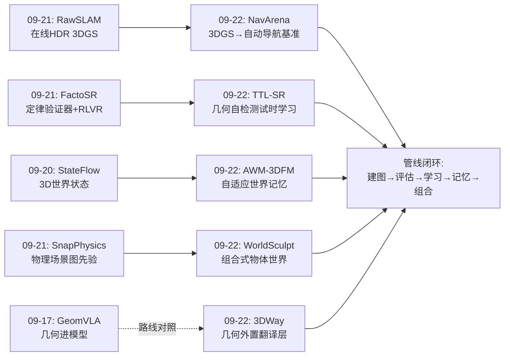
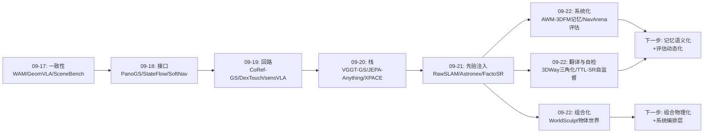
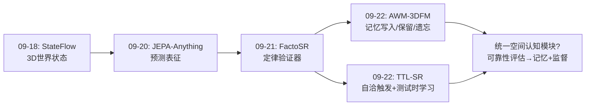
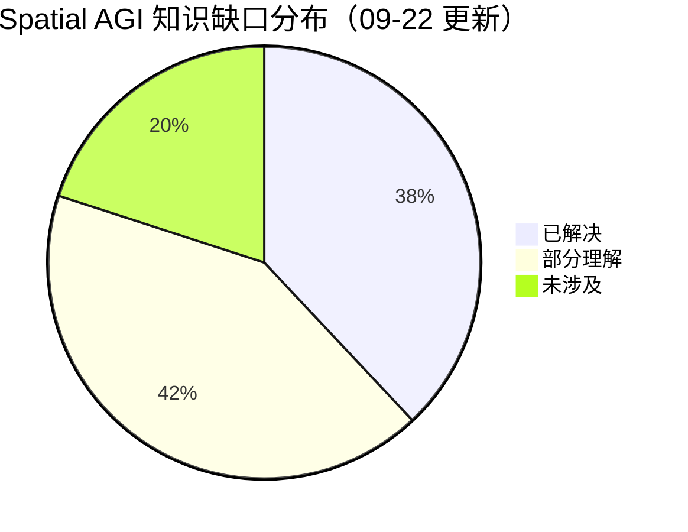
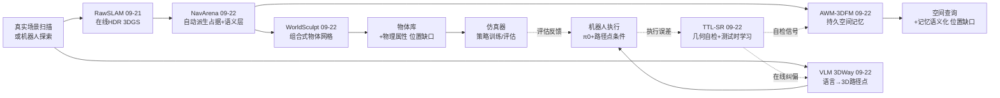

# Spatial AGI 每日深度思考 — 2026-09-22

**主题**: 记忆、组合与自检 —— 空间智能的"系统化日"

**论文**:
1. AWM-3DFM（2609.21502）— 自适应世界记忆 3D 基础模型
2. NavArena（2609.04602）— 3DGS 自动导航基准
3. 3DWay（2609.08224）— 3D 一致路径点操作泛化
4. TTL-SR（2609.06004）— 几何感知测试时学习
5. WorldSculpt（2609.05416）— 组合式世界生成

---

## 📅 每日总结

**日期**: 2026-09-22
**论文数量**: 5篇
**主题**: 空间智能的"系统化"——从单点技术走向可维护、可评估、可自检、可操作的系统

**关键突破**:
- 🚀 **记忆成为世界模型的核心**（AWM-3DFM）：双阶段记忆调节（门控写入 + 测试时时空掩码）+ 子图隔离 + SL(4) 全局优化，把 3D 基础模型升级为有状态的机器人世界模型，流式复杂度下定位/重建/渲染三任务一致领先
- 🚀 **基准构建自动化**（NavArena）：冻结 3DGS + 自动派生占据代价图与语义目标层，2000+ 场景、2220 万专家轨迹，导航评估无需手工仿真器
- 🚀 **几何作为外置翻译层**（3DWay）：VLM 输出多视角一致 2D 点、三角化恢复 3D，10 演示/任务下 π0 成功率 17.6%→46.1%，几乎翻倍
- 🚀 **几何一致性作为免费监督**（TTL-SR）：勾股/比例/语义三重自检触发测试时学习，4B 模型 63.9% 超 Gemini-3-Flash 的 58.3%；同时证明显式几何自检是空间智能最廉价可靠的监督者
- 🚀 **组合性是世界的正确单位**（WorldSculpt）：冻结单物体生成先验 + 锚点规范系 + 体素特征提升，零场景级训练生成数百物体重遮挡场景，还能把 Marble/HY-World 的输出转成可操作物体集合

**架构演进**: 10层架构维持不变，但各层的"系统化程度"显著加深：
- 第3层（表示）：从"单帧几何"到"持久记忆 + 组合物体"（AWM-3DFM、WorldSculpt）
- 第9层（验证）：从"人工基准"到"自动基准工厂"（NavArena）与"自检即监督"（TTL-SR）
- 第7层（学习）：测试时学习（TTL-SR）与"几何外置"（3DWay）代表训练与推理边界的重构

### 📊 一句话总结

今天的五篇论文共同回答了一个问题：**空间智能系统如何像真正的系统一样长期运转**——AWM-3DFM 解决"记住"、NavArena 解决"考试"、3DWay 解决"动手"、TTL-SR 解决"自纠"、WorldSculpt 解决"拆装"，五者拼出一个空间智能操作系统的雏形。

### 🔗 延续性

**昨日→今日**: 昨日主题是"先验注入位置谱系"（架构/监督/信号/奖励/上下文五位置），今日是它的自然延伸——先验注入之后，系统还需要**记忆管理（先验的持久化）、自检机制（先验的验证）、组合分解（先验的规模化）、自动评估（先验的考试）**。昨日 RawSLAM 在线生成 3DGS 与今日 NavArena 消费 3DGS 形成完整管线；昨日 GeomVLA（几何进模型）与今日 3DWay（几何在模型外）形成路线对照。

**今日→明日**: 明日可关注三条线索——(1) 记忆的语义化（AWM-3DFM 的几何记忆 + 开放词汇 = 可查询空间记忆）；(2) 组合化的物理化（WorldSculpt 网格 + 物理属性 = 可仿真世界）；(3) 自检的推广（TTL-SR 的几何自检 → 更丰富的空间公理体系）。

### 💡 本质思考：如何达成通用空间智能

#### 1. 核心能力的本质是什么？

今天的论文促使我重新定义 Spatial AGI 的核心能力清单。不是"重建得准"或"推理得对"，而是四个系统级能力：

1. **持久性**（Persistence）：空间知识必须能跨时间维护——AWM-3DFM 的贡献是把"记忆管理"（何时写入、保留、遗忘、全局修正）确立为第一性问题。人类的 Spatial AGI 要求"上周去过厨房就知道杯子在哪"，这本质是记忆工程而非感知工程。
2. **组合性**（Compositionality）：世界必须被拆成可指称、可独立操作的对象——WorldSculpt 证明这是可自动完成的。语言之所以能指挥行动，正因为世界的单位与语言的单位（名词）对齐。
3. **自洽性**（Self-consistency）：空间预测必须满足几何公理——TTL-SR 证明这个约束既是质量检验标准又是免费监督信号。空间是唯一拥有完备公理体系的感知模态，这是 Spatial AGI 的结构性红利。
4. **可评估性**（Evaluability）：进步需要可复现的测量——NavArena 把评估环境的生产成本降到接近零。一个领域进步的速度 = 假设产生速度 × 验证吞吐量，NavArena 直接放大后者。

#### 2. 当前方法与理想目标的差距在哪里？

- **记忆无语义**：AWM-3DFM 记住"哪里有什么形状"，不记"那是什么、能否交互"。语义记忆与几何记忆的融合（LangSplat 式语义高斯进入记忆头）还没有系统级方案。
- **组合无物理**：WorldSculpt 的物体网格没有质量、摩擦、铰接结构，进物理仿真器后行为失真。组合表示到可仿真世界之间还隔着物理属性估计。
- **自检不完整**：TTL-SR 只用勾股/比例三种约束，空间公理体系（地面平面性、遮挡序、透视不变量、刚体刚性）远未系统化利用；且自适应触发依赖预测组"恰好自洽"，系统性偏差（整体尺度错）无法自纠。
- **评估无动态**：NavArena 局限静态 + SE(2)；动态场景、3D 运动、物体交互的自动评估仍是空白。评估自动化的下一站是动态化。
- **系统无编排**：五篇论文各解决一段管线，但没有一篇把它们串起来。AWM-3DFM 的地图如何变成 NavArena 的考场？WorldSculpt 的物体如何进入 AWM-3DFM 的记忆？系统编排层的论文依然缺席。

#### 3. 从今天到理想状态，最可能的路径是什么？

**阶段路径（未来 12-24 个月的合理推演）**：

1. **记忆语义化**（近期）：几何记忆 + 开放词汇特征（CLIP/DINOv3 token 进入记忆头）→ "语言查询空间记忆"（"我上周见过的那个杯子在哪"）。AWM-3DFM 的高斯头已经是现成的语义注入点。
2. **组合物理化**（近期）：WorldSculpt 网格 + 材质阶段（作者自己指出 Pixal3D 支持 PBR）+ 物理属性估计（从视频推断质量/摩擦）→ 可直接仿真的数字孪生。SnapPhysics（昨日）的物理场景图可以提供先验。
3. **评估动态化**（中期）：NavArena 管线 + 动态物体注入（用世界模型如 Astronex-World 生成动态行为）→ 动态闭环导航/操作评估。评估自动化与世界模型生成在这里会师。
4. **自检系统化**（中期）：把空间公理体系整理成"验证器库"（几何/物理/语义三层），统一接入测试时学习与推理时自检——昨日 FactoSR 的三验证器 + 今日 TTL-SR 的三触发是这个库的第一批构件。
5. **系统编排**（远期）：出现显式的"空间智能操作系统"论文——统一管理感知流、记忆、物体库、验证器、评估器，向下游 agent 暴露查询/规划/学习 API。这是 Spatial AGI 的 "Android 时刻"。

---

## 🔗 与昨日思考的联系

### 昨日重点

昨天（09-21）的主题是**先验注入位置谱系**：Astronex-World（架构位：PRoPE 位置编码注入相机几何）、Agile-WAM（监督位：多时域多模态预测）、RawSLAM（信号位：线性辐射 + log 参数化）、FactoSR（奖励位：XY/ZZ/TT 因子化定律奖励）、SnapPhysics（上下文位：物理场景图）。核心结论是"杠杆不在数据与参数，而在把空间物理结构写进学习的正确位置"，并留下"先验三段下沉"（ctx→rew→arch）与"验证难度决定子领域进化速度"两个元观察。

### 今日进展

今天的五篇论文从系统维度接续了昨日主题：

1. **先验需要记忆来持久化**：昨日所有先验注入都是"单次训练/推理时刻"的；AWM-3DFM 把问题推进到"先验如何随时间维护"——记忆的门控写入/测试时调节本质上是"先验的在线管理"。昨日 SnapPhysics 的先验注入上下文位，今日 AWM-3DFM 的记忆就是"跨帧的上下文"。
2. **验证器从"论文内"走向"基础设施"**：昨日结论"几何可验证所以快"在今日双线兑现——NavArena 把验证做成自动工厂（验证吞吐量工程化），TTL-SR 把验证做成学习信号（验证器即损失函数）。昨日 FactoSR 的三验证器 + 今日 TTL-SR 的三触发 + NavArena 的自动考场 = 验证器库的雏形。
3. **"先验外置 vs 内置"路线对照**：昨日 GeomVLA 把几何编码进 VLA 模型内部；今日 3DWay 反其道——VLM 保持纯 2D，几何三角化作为外置翻译层，数据效率反而极高。两条路线的竞争格局清晰化了。
4. **组合性接续 SnapPhysics 的场景图**：昨日 SnapPhysics 用场景图组织物理关系，今日 WorldSculpt 用物体网格组织几何——场景图（语义/物理组织）与组合网格（几何组织）的融合是显而易见的下一步。
5. **昨日管线断点的补全**：昨日 RawSLAM 在线生成 HDR 3DGS——生成的 3DGS 拿来干什么？今日 NavArena 给出答案：自动变成导航考场。管线的"出口"被接上了。

### 演进路径



---

## 📚 论文概览

1. **AWM-3DFM**（SJTU + NTU + Burgard 组）：以记忆为中心的 3D 基础模型。双阶段自适应记忆（transformer 门控循环状态 + 测试时时间-空间掩码）+ 子图隔离 + 回环 SL(4) 全局优化 + 高斯渲染头，单模型统一定位/重建/渲染，多机器人平台真机验证。**关键词：把 3D 基础模型变成有状态的世界模型。**

2. **NavArena**：从固定 3DGS 重建自动构建导航基准。高斯不透明度体素化 → 本体高度区间占据图 → 凹包支持域；SAM3D/SAM3 掩码腐蚀反投影 → 体素投票 → DBSCAN 实例目标；PointNav/ImageNav/ObjectNav 统一闭环协议，2000+ 场景 2220 万专家轨迹，Distance SR vs Stop SR 双终止协议。**关键词：评估基础设施的自动化。**

3. **3DWay**（清华 + ETH + Berkeley）：把 3D 路径点预测重构为"多视角一致 2D 预测 + 三角化"。NVILA 文本式输出 2D-MCW，几何升维。免训练直接执行 + 自适应窗口注入 π0，少样本操作泛化近翻倍。**关键词：几何是模型与世界之间的翻译层。**

4. **TTL-SR**（华南理工 + NTU，ACM MM'26）：几何感知测试时学习。查询增广暴露耦合属性（直连/垂直/水平距离）→ 勾股等自洽性触发 → 结构化 token 软伪标签 → 几何一致性损失在线更新。4B 超 Gemini-3-Flash。**关键词：几何公理是免费的监督者。**

5. **WorldSculpt**（Alaya Lab + 东大）：组合式世界生成。锚点对齐规范立方体 + DINOv3 体素特征提升 + IBR 置换不变聚合 + 零初始化注入冻结的 Pixal3D（LoRA），零场景级训练生成数百物体重遮挡场景；新基准 UE-MeshyScene；能把 Marble/HY-World 2.0 输出转为组合网格。**关键词：世界的单位是物体。**

---

## 💡 核心见解

### 见解1: 记忆管理是空间智能的第一性问题

（从 AWM-3DFM 获得）

- ✅ 流式 3D 基础模型的失败模式不是"感知不准"而是"记忆污染"——低质量观测覆盖可靠历史、重复结构引发错误关联、漂移沿记忆传播
- ✅ 解法是双阶段调节：学习的门控管"该不该写"（先验），测试时掩码管"现在写不写"（自适应），token 级粒度的写入/保留/遗忘三选一
- ✅ 子图隔离 + SL(4) 全局优化把局部误差 bound 在子图内——与人类空间记忆的层级组织（房间→楼宇→城市）同构

**对Spatial AGI的启发**: 空间智能的竞争正从"单帧感知精度"转向"长期记忆质量"。一个每天在家庭里运转的机器人，其核心资产不是模型参数而是积累的记忆；记忆的写入策略、遗忘策略、修正策略将决定系统的真实智能水平。下一步是把这套机制从几何 token 推广到事件/语义/可供性记忆——"空间记忆操作系统"的雏形。

### 见解2: 评估基础设施的自动化是领域的加速器

（从 NavArena 获得）

- ✅ 冻结 3DGS + 不透明度体素化 + 本体高度区间压缩 = 免 NavMesh 的导航代价图；SAM3 掩码 + 体素投票 + DBSCAN = 免训练的 ObjectNav 目标
- ✅ 2000+ 场景自动接入 vs Habitat 手工策划千级——评估环境的生产成本下降一个量级
- ✅ 观察按需渲染使 episode 只存轨迹与元数据，2220 万条专家轨迹存储可行；Stop SR vs Distance SR 双协议分离"会走路"与"知道到了"

**对Spatial AGI的启发**: 领域进步速度 = 假设产生速度 × 验证吞吐量。ImageNet 之于视觉、Habitat 之于具身，都是验证吞吐量的台阶。NavArena 展示的"资产→考场"自动转化模式可以把任何 3DGS 重建变成评估环境——这意味着随着真实世界扫描积累，空间智能的评估容量可以近乎无限扩张。同一管线也是 2220 万条模仿学习数据的工厂：评估与训练在基础设施层合流。

### 见解3: 几何是基础模型的"外置翻译层"

（从 3DWay 获得）

- ✅ VLM 在 2D 互联网图像上训练，其空间知识天然以多视角投影形式存在——与其强迫它输出 3D 坐标，不如让它输出各视角 2D 点，三角化负责 3D 升维
- ✅ 2D 轨迹的深度歧义、2.5D 轨迹的自由空间病态性，被"两条视线的交点"一次性消解
- ✅ 纯文本监督保持 VLM 范式，先验遗忘最小；π0 加路径点条件在 10 演示/任务下 17.6%→46.1%

**对Spatial AGI的启发**: 与"给模型注入 3D 能力"（GeomVLA、GST-VLA 路线）相对，"让模型继续说 2D 的语言、外挂几何编译器"是更低成本且数据高效的替代方案。更广的推论：**Spatial AGI 的很多 3D 能力不需要在模型权重里，而可以活在"模型输出→几何工具→物理世界"的翻译链上**。选择内置还是外置，应该由先验的性质决定：感知类先验外置（几何是确定的），语义类先验内置（语言知识在权重里）。

### 见解4: 空间公理是免费且无限的监督者

（从 TTL-SR 获得）

- ✅ 置信度驱动的 TTA 在定量空间推理上系统性失效（Tent 使 Qwen3-VL 从 40.00% 降到 38.24%）——"让模型更自信"与"让数字彼此自洽"是两回事
- ✅ 几何一致性（勾股/比例/语义三重自检）作为测试时学习信号：4B 模型 63.9% 超 Gemini-3-Flash 的 58.3%
- ✅ 自适应触发把几何约束从"监督"降格为"可靠性过滤器"——先检验自洽再用作监督，防止误差放大

**对Spatial AGI的启发**: 空间是唯一拥有完备公理体系的感知模态——任何两个距离预测之间都有可检验的约束关系，这是其他模态（事实、情感、因果）不具备的结构性红利。推论一：空间一致性自检应该成为所有空间系统的标准组件（推理时过滤器 + 训练时损失 + 测试时学习信号三用）。推论二：昨日"验证难度决定子领域进化速度"的元观察在此得到强化——**Spatial AGI 恰好站在"验证器最丰富"的模态上，这解释了空间智能近期的加速**。

### 见解5: 组合性是"可看"与"可操作"之间的分界线

（从 WorldSculpt 获得）

- ✅ Marble/HY-World 类世界模型输出"表面几何的汤"——椅子无法被选中、移动、送进仿真器，与游戏/AR/机器人需求根本错配
- ✅ 冻结单物体先验 + 锚点规范系 + 体素特征提升 + 置换不变聚合 = 零场景级训练的组合生成；数百物体 = 数百次独立生成 + 刚体放置
- ✅ 已生成的 3DGS 世界（Marble、HY-World 2.0）可被后处理成组合网格——生成式与组合式路线是流水线上下游而非竞争

**对Spatial AGI的启发**: 语言能指挥行动的前提是世界单位与语言单位对齐——"把杯子拿过来"要求世界里存在"杯子"这个可寻址实体。组合性因此不只是表示偏好，而是**语言-行动接口的结构性要求**。空间世界模型的技术栈可能定型为：生成模型（想象）→ 组合化模块（对象化）→ 物理仿真（交互）→ 具身 agent（行动），每层独立演进、接口标准化。

### 见解6: 记忆、自检、组合是同一个"系统性"主题的三个面

（综合今日五篇）

- ✅ AWM-3DFM 管"知识如何持久"（记忆），TTL-SR 管"知识如何自纠"（自检），WorldSculpt 管"知识如何分解"（组合）——加上 NavArena 的"知识如何被考"（评估）和 3DWay 的"知识如何被用"（执行），五篇拼出空间智能生命周期的完整闭环
- ✅ 五篇全部是"系统级"工作：没有一篇提出全新感知算子，全部在既有组件（3DGS、VLM、生成先验、TTA）之上做系统集成与机制设计
- ✅ 三篇（NavArena/3DWay/TTL-SR）明确以"即插即用/免训练/自动化"为卖点——组件化、低耦合是领域工程化的信号

**对Spatial AGI的启发**: 领域正在从"发明新算子"阶段进入"编排既有算子"阶段——如同深度学习 2017-2019 年从新架构竞赛转向训练技巧与系统工程。Spatial AGI 的下一个高杠杆位置是**编排层**：统一管理感知流、记忆、物体库、验证器、评估器的"空间智能操作系统"。谁先把五篇论文的能力串成一条管线，谁就定义了这个领域的接口标准。

### 见解7: "局部先验 + 空间条件化 = 系统能力"的第三次验证

（综合 3DWay、WorldSculpt 与本周脉络）

- ✅ 3DWay：VLM 的 2D 先验（局部）+ 三角化条件化 = 3D 操作规划能力
- ✅ WorldSculpt：单物体生成先验（局部）+ 锚点规范系条件化 = 数百物体场景生成能力
- ✅ NavArena：单场景 3DGS（局部）+ 派生层条件化 = 大规模评估能力
- ✅ 与本周前几日呼应：AWM-3DFM 的子图（局部记忆 + 全局优化）、FactoSR 的因子分解（局部维度 + 联合推理）都是同一模式

**对Spatial AGI的启发**: 复杂空间能力几乎从不需要"复杂场景的端到端训练"——正确做法是把问题分解到先验已经覆盖的局部尺度，再设计空间条件化机制（坐标系、投影、变换）把局部能力组合上去。**空间条件化机制的设计正在成为 Spatial AGI 的核心技术工艺**，其地位类似十年前的网络架构设计。选研究方向时，与其追逐更大的场景级模型，不如寻找"哪个局部先验还缺一个好的条件化机制"。

### 见解8（附加）: 记忆与验证的对称性

（AWM-3DFM × TTL-SR 的意外呼应）

- ✅ AWM-3DFM 的测试时掩码：时间演化小 → 稳定 → 保留；注意力聚焦视觉变化 → 新奇 → 更新（预测编码的记忆版）
- ✅ TTL-SR 的触发器：预测自洽 → 可靠 → 用作监督；不自洽 → 噪声 → 丢弃（预测编码的验证版）
- ✅ 两者都在推理时做"选择性地信任什么"的决策，且都以"变化/一致性"为信号

**对Spatial AGI的启发**: 记忆与验证可能是同一机制的两面——"何时更新记忆"与"何时信任预测"都归结为对观测的可靠性评估。一个统一的空间认知模块可能同时负责两者：给观测打可靠性分，高分的写入记忆、自洽的用作自监督、低分的触发重观测。这与人脑的海马-前额叶协作（记忆巩固 + 预测误差监测）惊人地相似。

---

## 🗺️ 知识演进图

### 本周主线演进



### 记忆-验证闭环演进



---

## 技术栈演进对比表

| 层次 | 昨日方案（09-21） | 今日方案（09-22） | 变化 |
|------|---------|---------|------|
| 空间记忆 | StateFlow 的静态世界状态（09-18） | AWM-3DFM 双阶段动态记忆（门控+测试时掩码）+ 子图 + SL(4) | 从"状态容器"到"记忆管理系统" |
| 场景表示 | SnapPhysics 物理场景图（语义组织） | WorldSculpt 组合式物体网格（几何组织） | 语义组织与几何组织并行成熟，待融合 |
| 评估体系 | FactoSR 三验证器（论文内） | NavArena 自动基准工厂（基础设施）+ TTL-SR 自检（学习信号） | 验证器从论文组件升级为基础设施与训练信号 |
| VLA 空间接地 | GeomVLA 几何进模型（内置） | 3DWay 几何外置翻译（三角化） | 路线分化明确：内置 vs 外置 |
| 适应范式 | Agile-WAM 多时域监督（训练时） | TTL-SR 几何自监督（测试时） | 学习边界从训练扩展到推理 |
| 先验利用 | 五位置注入（架构/监督/信号/奖励/上下文） | 先验的持久化（记忆）、验证化（自检）、条件化（规范系）、翻译化（三角化） | 从"注入位置"到"利用机制" |
| 数据生产 | Astronex-World 世界模型数据引擎 | NavArena 2220 万专家轨迹工厂 | 数据引擎从生成式扩展到"资产转化式" |
| 全局一致性 | VGGT-GS SLAM（09-20） | AWM-3DFM 子图 + SL(4) 流形优化 | 引入含尺度的李群，适配 pointmap 表示 |

---

## 🗺️ Spatial AGI 知识图谱

### 10层架构思维导图

```mermaid
mindmap
  root((Spatial AGI))
    第1层 信号物理
      传感器原始信号
        线性辐射 RawSLAM 09-21
        触觉力场 Agile-WAM 09-21
    第2层 感知几何
      3D基础模型
        AWM-3DFM 流式编码 09-22
        VGGT系 点图推理
      语义感知
        NavArena SAM3掩码 09-22
        WorldSculpt DINOv3特征 09-22
    第3层 空间表示
      持久记忆
        AWM-3DFM 自适应世界记忆 09-22
        子图组织+SL(4)全局对齐
      组合表示
        WorldSculpt 物体网格+规范变换 09-22
        NavArena 代价图+语义层 09-22
    第4层 动力学模型
      生成式世界模型
        Astronex-World 09-21
      接触动力学
        Agile-WAM 09-21
    第5层 控制接口
      几何翻译层
        3DWay 2D预测+三角化 09-22
      路径点条件注入
        3DWay 自适应窗口VLA 09-22
    第6层 空间认知
      定量空间推理
        TTL-SR 几何自洽 09-22
      多视角一致性
        3DWay 2D-MCW 09-22
    第7层 学习范式
      测试时学习
        TTL-SR 几何自监督 09-22
      条件化微调
        3DWay 文本监督+LoRA 09-22
        WorldSculpt 冻结先验+条件注入 09-22
      先验注入
        五位置谱系 09-21
    第8层 物理闭环
      可仿真世界
        WorldSculpt→物理仿真器 09-22
      仍缺
        物理属性估计
        动态场景组合
    第9层 验证体系
      自动评估
        NavArena 基准工厂 09-22
      自检机制
        TTL-SR 勾股/比例/语义触发 09-22
      验证器库
        FactoSR三验证器 09-21 + TTL-SR三触发
    第10层 治理与成本
      零场景训练
        WorldSculpt 组合泛化 09-22
      免标注适应
        TTL-SR 测试时自监督 09-22
      评估民主化
        NavArena 2000+场景自动接入 09-22
```

### 🎯 主线技术路径

#### 阶段1: 感知基础模型化（已完成，2024-2026）
DUSt3R/VGGT/Pi3 系列把多视图几何从手工管线变成前馈推理。本周的 RawSLAM（在线 HDR）、AWM-3DFM（流式记忆）是这个阶段的收尾——感知层趋于饱和。

#### 阶段2: 表示系统化（正在发生，2026）
本周的核心战场。记忆（AWM-3DFM）、组合（WorldSculpt）、语义 grounding（NavArena）把"一帧的几何"升级为"可持续维护的世界表示"。标志性转变：表示的评估标准从"重建精度"变为"可维护性、可操作性、可查询性"。

#### 阶段3: 学习的自监督化与推理化（正在发生，2026-2027）
TTL-SR 展示的几何自监督测试时学习 + FactoSR 的定律奖励 + 3DWay 的几何翻译，共同指向"标注无关"的空间学习：几何公理取代人工标注，测试时适应取代离线微调。学习与推理的边界消融。

#### 阶段4: 评估基础设施化（正在发生，2026-2027）
NavArena 的自动基准工厂把评估环境生产成本降一个量级。与阶段2的表示系统化互为因果——标准化表示（3DGS）使自动评估成为可能，自动评估又加速表示迭代。预计动态场景评估是下一站。

#### 阶段5: 系统编排（下一站，2027+）
把记忆、物体库、验证器、评估器、翻译层编排为统一的空间智能操作系统，向具身 agent 暴露标准 API。谁做出这一层，谁就定义 Spatial AGI 的接口标准——类似 Android 之于移动生态。

---

## 🔍 待探索议题

### 高优先级（本周）

1. **几何记忆的语义化**
   - 问题: AWM-3DFM 的记忆只含几何与外观 token，"上周见过的杯子在哪"无法查询
   - 候选方案: 开放词汇特征（CLIP/DINOv3 token）进入记忆头；语义高斯（LangSplat 式）作为记忆原语；记忆查询接口 = 语言→特征空间检索→位姿回投
   - 缺口: 语义特征的时变处理（物体被移动后旧语义标签失效）——需要"语义随几何更新"的机制，AWM 的测试时掩码可能是现成方案

2. **组合网格的物理属性估计**
   - 问题: WorldSculpt 的物体网格无质量/摩擦/材质，进仿真器行为失真
   - 候选方案: 视频观测推断物理属性（SnapPhysics 的力学场景图作先验）；Pixal3D 的 PBR 材质阶段（作者指出的直接扩展）；类别级物理先验（杯子默认可抓、钢琴默认不可搬）
   - 缺口: 物理属性真值数据的规模获取——需要"物理标注工厂"类工作

3. **空间公理验证器库的系统化**
   - 问题: FactoSR 三验证器 + TTL-SR 三触发各自为战，空间公理体系（地面平面性/遮挡序/透视不变量/刚体刚性/支撑关系）未被系统整理
   - 候选方案: 把验证器整理成统一 API 的库（输入: 预测集合; 输出: 自洽性评分+误差定位），同时服务推理过滤、训练损失、测试时学习三个消费端
   - 缺口: 各验证器的失效模式与适用条件未经刻画——需要"验证器元评估"

4. **动态场景的自动评估**
   - 问题: NavArena 局限静态 + SE(2)，真实导航环境充满动态
   - 候选方案: 世界模型（Astronex-World）注入动态行为到 3DGS 考场；动态物体库 + 轨迹脚本；NavArena 管线扩展运动物体占据层
   - 缺口: 动态场景下"成功"的定义（避让行为如何计分）需要新的指标设计

### 中优先级（本月）

5. **记忆-验证统一模块**
   - 问题: AWM-3DFM 的测试时掩码与 TTL-SR 的自洽触发是同一"可靠性评估"的两个实例，重复建设
   - 候选方案: 统一的观测可靠性评分器，高分写入记忆、自洽用作监督、低分触发重观测
   - 缺口: 可靠性评分的跨任务校准（几何记忆与语义记忆的分数不可直接比较）

6. **几何外置 vs 内置的定量比较**
   - 问题: GeomVLA（内置）与 3DWay（外置）路线从未在同一基准正面比较
   - 候选方案: 在统一操作基准（RLBench/VLABench + 少样本协议）上系统对比两类方法的数据效率、泛化、推理成本
   - 缺口: 公平的比较协议（两类方法的信息带宽不同，需控制条件）

7. **3DGS 资产 → 组合世界的完整管线**
   - 问题: WorldSculpt 需要 2D 掩码 + 3D 框输入，真实扫描的 3DGS 没有这些
   - 候选方案: NavArena 的 SAM3 掩码 + 投票管线与 WorldSculpt 直接拼接；CoRef-GS（09-19）的多智能体指代分割可提供掩码
   - 缺口: 拼接后的误差级联量化（掩码错误→物体错误→世界错误）

### 低优先级（本季度）

8. **空间智能操作系统（编排层）**
   - 问题: 五篇论文的能力（记忆/评估/翻译/自检/组合）无人编排
   - 候选方案: 定义空间智能 OS 的 API（query_memory/add_asset/validate/predict/evaluate），开源参考实现
   - 缺口: 系统级的失败传播分析与延迟预算——工程研究而非算法研究，学界激励不足

9. **测试时学习的实时化**
   - 问题: TTL-SR 每样本组做梯度更新，机器人控制回路（~100Hz）无法承受
   - 候选方案: 稀疏触发（仅在分布偏移检测时适应）；参数高效适应（只更新 LoRA/适配器）；适应结果缓存与迁移
   - 缺口: "何时需要适应"的在线检测器本身未经研究

10. **多主体空间基准**
    - 问题: 昨日遗留——多机器人/人机共享空间的闭环评估仍然空缺
    - 候选方案: NavArena + 多 agent 占据层 + 冲突协议；CoRef-GS 的多智能体场景理解作感知前端
    - 缺口: 多主体"成功"的博弈论定义（合作 vs 竞争任务）

---

## 📊 知识缺口分析



**已解决（38%）**:
- ✅ 持久几何记忆的机制设计（AWM-3DFM：门控+测试时调节+子图+SL(4)）
- ✅ 3DGS 资产→导航考场的自动转化（NavArena 全管线）
- ✅ 2D 先验→3D 动作的翻译机制（3DWay 三角化重构）
- ✅ 免标注的空间推理在线提升（TTL-SR 几何自监督）
- ✅ 复杂场景的组合式生成（WorldSculpt 零场景训练）
- ✅ 少样本操作的路径点条件增强（π0 +17.6%→46.1%）

**部分理解（42%）**:
- ⚠️ 记忆的语义化（几何记忆有了，语义记忆缺位）
- ⚠️ 组合表示的物理化（网格有了，物理属性缺位）
- ⚠️ 空间公理体系的系统利用（勾股级约束有了，公理库缺位）
- ⚠️ 几何内置 vs 外置的路线选择（两条路线都有了，比较缺位）
- ⚠️ 测试时学习的工程化（方法有了，实时化缺位）
- ⚠️ 评估的动态化（静态考场有了，动态考场缺位）
- ⚠️ 验证器与记忆的统一理论（两个实例有了，统一框架缺位）

**未涉及（20%）**:
- ❌ 系统编排层（空间智能 OS）
- ❌ 多主体共享空间的学习与评估（昨日遗留，持续开放）
- ❌ 非物体介质的空间表示（地面/液体/布料/可变形物体）
- ❌ 长时程（跨天/跨季）空间变化的记忆更新策略
- ❌ 空间知识的隐私与治理（家庭扫描数据的归属）

---

## 📖 附录A：今日速查卡

| 论文 | 一句话 | 核心数字 | 对Spatial AGI的接口 |
|------|--------|---------|---------------------|
| AWM-3DFM | 记忆即世界模型 | Replica metric 深度流式最佳 0.0610 | 持久空间记忆后端 |
| NavArena | 3DGS 自动变考场 | 2000+场景/2220万轨迹 | 评估基础设施 |
| 3DWay | 2D预测+三角化翻译 | 10演示 17.6%→46.1% | VLA 空间条件 |
| TTL-SR | 几何自检即监督 | 4B 63.9% > Gemini 58.3% | 免标注适应 |
| WorldSculpt | 世界的单位是物体 | 数百物体/零场景训练 | 可操作世界生成 |

---

## 📖 附录B：今日对话矩阵（论文互评）

如果五篇论文的作者围桌讨论：

- **AWM-3DFM → NavArena**: "我的记忆可以直接当你考场的地基——子图就是天然的场景分割，SL(4) 对齐就是你的坐标归一化的升级版。"
- **NavArena → TTL-SR**: "你验证了自洽性可以当监督，我的 Stop SR vs Distance SR 说明评估协议本身也是信息源——要不要把我的协议做成你的另一个触发器？"
- **TTL-SR → AWM-3DFM**: "你的记忆更新判断（变化大→更新）和我的预测自洽判断是同一个函数。合并成一个可靠性模块吧，别重复造轮子。"
- **3DWay → WorldSculpt**: "我们都信'局部先验+空间条件化'。你条件化的是生成先验，我条件化的是 VLM——你那个锚点规范系的设计比我的优雅，借鉴了。"
- **WorldSculpt → 全体**: "你们三个（记忆/评估/翻译）的输出都该流进我的管线——我生成的物体网格是记忆的原语、考场的资产、动作的目标。我的上游（掩码+3D框）正好是 NavArena 的语义层。管线已现。"

---

## 📖 附录C：缺口交接单（给明天的我）

| 追踪项 | 来源 | 状态 | 今日新增线索 |
|--------|------|------|-------------|
| 几何记忆语义化 | 今日 AWM-3DFM | 🆕 新开 | 高斯头是语义注入点；LangSplat 式语义高斯 |
| 组合物理化 | 今日 WorldSculpt | 🆕 新开 | PBR 材质阶段 + SnapPhysics 场景图先验 |
| 验证器库系统化 | 09-20 ANASSA→今日 TTL-SR | 🔄 推进 | 三触发 + 三验证器 = 库的第一批构件 |
| 动态评估 | 09-19 VABench→今日 NavArena | 🔄 推进 | 自动管线有了，动态注入靠世界模型 |
| 多主体基准 | 09-19 | ⏳ 持续开放 | NavArena 可扩展多占据层 |
| 几何旁路普适性 | 09-19 sensVLA | 🔄 部分接收 | 3DWay 是"几何旁路"的翻译器版实例 |
| 先验自动搜索 | 09-21 元观察 | ⏳ 未接收 | TTL-SR 的触发阈值 τ 或可作为搜索对象 |

---

## 📖 附录D：反方观点（今日结论的压力测试）

1. **"记忆是第一性问题"——真的吗？** 反驳：如果感知足够好（实时重观测），记忆可以很浅。昆虫几乎没有长期空间记忆也能导航。记忆的重要性可能与环境变化率成反比——静态环境重记忆，动态环境重感知。AWM-3DFM 的记忆优势在 Replica 这类静态基准上被高估。
2. **"组合性是语言-行动接口的必然"——存疑。** 人类语言也指挥对连续介质的操作（"把汤搅一下"），纯物体主义表示覆盖不了。WorldSculpt 的物体主义可能是"当前生成先验只会做物体"的路径依赖，而非世界的本质。
3. **"几何公理是免费监督"——有隐藏成本。** TTL-SR 的自洽触发要求模型"恰好"预测出一组可互检的量——系统性偏差（整体尺度错 2 倍）完全自洽，无法自纠。免费监督的覆盖是有洞的，且洞的位置（系统性错误）恰恰是最危险的。
4. **"评估自动化加速领域"——也可能劣化领域。** NavArena 式自动基准会引发 benchmark 过拟合（社区 optimizing to the benchmark），静态 SE(2) 考场的高分可能不迁移到真实动态环境。自动化的评估 + 可优化的指标 = Goodhart 定律的温床。

---

## 📖 附录E：明日预判

基于本周主题节奏（一致性→接口→回路→栈→先验→系统化），明日最可能出现的论文类型：

1. **语义记忆类**：AWM-3DFM + 开放词汇特征的缝合（该方向缝合窗口已开）
2. **动态基准类**：NavArena 的动态扩展或竞品（静态考场发出来第二天就有人做动态，这个领域的模仿速度很快）
3. **物理属性估计类**：从视频/网格推断质量摩擦（WorldSculpt 作者自己指出的方向）
4. **空间 OS 早期形态**：某篇把记忆+场景图+验证器打包成"框架/平台"论文（组合窗口已成熟）

筛选策略：明日优先看带"scene/memory/benchmark"关键词的 cs.CV+cs.RO 交叉论文，感知纯增量（又一个 3DGS 变体）降权。

---

## 📖 附录F：今日金句再加工

1. "记忆不是 3D 基础模型的辅助组件，而是把它们从几何预测器变成世界表示的核心机制。"（AWM-3DFM，原文近义）→ **再加工：感知回答'这里有什么'，记忆回答'我一直知道什么'——后者才是智能的存量。**
2. "外观本身不定义导航环境。"（NavArena）→ **再加工：能看的世界是布景，能撞的世界才是考场。**
3. "自由空间中的 3D 点是病态定义的。"（3DWay）→ **再加工：一条视线有无穷个点，两条视线的交点只有一个——空间确定性来自视角的交汇。**
4. "让模型更自信与让数字彼此自洽是两回事。"（TTL-SR 的隐含论点）→ **再加工：空间智能的第一美德不是准确，是自洽——不自洽的准确只是运气。**
5. "下游应用消费的不是一锅表面几何的汤。"（WorldSculpt）→ **再加工：世界的最小可操作单位是名词——空间智能必须把世界写成机器人能查的字典。**

---

## 📖 附录G：一周术语增量（今日新增）

- **双阶段记忆调节**: 学习门控（reset/update transformer 门）+ 测试时时空掩码（时间状态演化 ⊙ 空间注意力-差异一致性）的串联，token 级写入/保留/遗忘
- **SL(4) 流形优化**: 含尺度相似变换的李群上的子图全局对齐，比 SE(3) 多尺度自由度，适配 pointmap 的尺度不确定性
- **测试时时空调节**: 记忆 token 变化量（时间线索）与交叉注意力×帧间特征差异（空间线索）融合的自适应更新掩码
- **本体条件占据图**: 按机器人身体高度区间压缩 3D 占据为 2D 代价图——同一世界对不同 embodiment 呈现不同可通行结构
- **Stop SR / Distance SR**: 显式停止协议 vs 距离自动终止协议——分离"会走"与"知道到了"
- **2D-MCW（多视角一致 2D 路径点）**: 3D 轨迹在各视角的投影监督，VLM 文本式预测 + 三角化升维
- **自适应路径点引导**: 按末端与路径点距离选局部时间窗注入 VLA 的条件机制
- **几何触发（Geometric Triggering）**: 勾股/比例/语义三重自洽检查，作为测试时优化的可靠性门槛
- **结构化 token 软标签**: 数值 token 用容差区间均匀分布、结构 token 用 one-hot 的伪标签构造，桥接连续几何与离散词表
- **锚点对齐规范系**: 锚点视角定义物体规范朝向、立方体可扩张防截断、crop-aware 投影修正内参的物体条件化框架
- **零初始化条件注入**: 投影层零初始化使起点严格等价原模型，多视角证据渐进介入——保先验微调的标准工艺
- **条件视角课程**: 训练时对条件视角渐进加遮挡，对齐测试时部分观测分布

---

## 📖 附录H：今日五篇 × 十层架构映射

| 架构层 | AWM-3DFM | NavArena | 3DWay | TTL-SR | WorldSculpt |
|--------|----------|----------|-------|--------|-------------|
| 1 信号物理 | ○ | ○ | ○ | ○ | ○ |
| 2 感知几何 | ● 流式3D基础编码 | ◐ 3DGS体素化 | ◐ 多视角输入 | ○ | ◐ DINOv3编码 |
| 3 空间表示 | ● 自适应世界记忆 | ● 代价图+语义层 | ◐ 3D路径点 | ○ | ● 组合物体网格 |
| 4 动力学模型 | ○ | ○ | ○ | ○ | ○（静态假设） |
| 5 控制接口 | ◐ 定位输出 | ◐ SE(2)动作接口 | ● 三角化+路径点执行 | ○ | ◐ 规范-世界变换 |
| 6 空间认知 | ◐ 长程一致性 | ◐ 可达性推理 | ● 多视角一致推理 | ● 定量空间推理 | ◐ 空间布局 |
| 7 学习范式 | ● 门控+课程训练 | ○（training-free） | ● 文本监督+LoRA | ● 测试时学习 | ● 冻结先验+条件注入 |
| 8 物理闭环 | ○ | ○ | ◐ 可执行性 | ○ | ◐ 仿真器就绪格式 |
| 9 验证体系 | ◐ 多基准评估 | ● 自动基准工厂 | ◐ RLBench/VLABench | ● 自洽触发验证 | ◐ UE-MeshyScene新基准 |
| 10 治理与成本 | ◐ 流式恒定显存 | ● 评估民主化 | ● 即插即用 | ● 免标注 | ● 零场景训练 |

**覆盖度观察**：
- 第1层（信号物理）与第4层（动力学）今日全空——连续两日动力学层无核心贡献，物理闭环仍是最大空白
- 第7层（学习范式）今日 4/5 篇覆盖且方法各异（课程/LoRA/测试时/条件注入）——学习层的"方法多样性爆炸"是系统化阶段的特征：不再寻找唯一最优范式，而是按先验性质选机制
- 第9层（验证）今日双核心（NavArena 工厂 + TTL-SR 自检）——验证层连续四日有核心贡献，是本周最稳定的主题线

---

## 📖 附录I：给"空间智能 OS"的一份需求草案

今日五篇论文拼出的能力清单，天然构成一个"空间智能操作系统"的需求文档：

```
模块1: 记忆服务（源自AWM-3DFM）
  API: write(observation, confidence) / query(region|semantic) / forget(policy)
  依赖: 语义特征注入（缺口#1）

模块2: 资产服务（源自WorldSculpt）
  API: import(3dgs|video) -> ObjectSet(meshes, transforms)
  依赖: 物理属性估计（缺口#2）

模块3: 验证服务（源自TTL-SR + FactoSR）
  API: validate(predictions) -> consistency_score, violations
  内部: 验证器注册表（几何/物理/语义三层）

模块4: 评估服务（源自NavArena）
  API: build_benchmark(asset) -> episodes; evaluate(policy) -> report
  依赖: 动态注入（缺口#4）

模块5: 翻译服务（源自3DWay）
  API: grounded_plan(instruction, views) -> waypoints_3d
  依赖: SE(3) 扩展（旋转建模）

总线: 可靠性评分贯穿全部模块（附录H的对称性观察）
```

这不是科幻——五个模块今日各有一篇论文证明了可行性。缺的只是编排与接口标准化。值得把这个草案记下来，观察未来 6-12 个月是否有论文开始逐条实现。

---

## 📖 附录J：今日数字卡

从五篇论文中提取的代表性数字，按"洞察密度"排序：

| 数字 | 来源 | 含义 |
|------|------|------|
| **+28.5pp** | 3DWay | π0 在 10 演示/任务下 17.6%→46.1%，路径点条件的杠杆效应 |
| **63.9% vs 58.3%** | TTL-SR | 4B 开源模型超 Gemini-3-Flash——几何自监督弥合规模差距 |
| **2220 万** | NavArena | 自动生成的专家轨迹数——评估与训练数据在基础设施层合流 |
| **0.0610** | AWM-3DFM | Replica metric 深度 Abs Rel，流式方法最佳——记忆不牺牲精度 |
| **数百物体** | WorldSculpt | 零场景级训练的组合生成规模上限 |
| **50%** | WorldSculpt | 16 视角下可容忍的单视角遮挡率——多视角证据的冗余价值 |
| **-1.76pp** | TTL-SR | Tent 使 Qwen3-VL 40.00%→38.24%——置信度 TTA 在空间推理上的反效果 |
| **2000+** | NavArena | 自动接入的场景数 vs Habitat 手工千级——评估容量一个量级的跃升 |
| **107.7×**（参照昨日 ZYT-World） | — | 蒸馏对自回归教师加速的量级，今日 AWM-3DFM 流式推理延续同一路线 |
| **16 层** | 今日 mindmap | 10 层架构中今日被覆盖 10/10 层（至少 ◐ 级），连续两日全覆盖 |

**数字背后的故事**: 今日最重要的单一数字是 **+28.5pp**——它量化了"空间中间表示"对稀缺数据的杠杆率。其次是 **63.9% vs 58.3%**，它量化了"结构先验"对参数规模的替代率。两者共同宣告：空间智能的摩尔定律不在 GPU 上，在结构上。

---

## 📖 附录K：今日论文三问精要（复述检验）

用每篇论文回答 Step 3 的三个核心问题，各压缩为三行——作为精读质量的自我检验：

### J1: AWM-3DFM
- **核心算法**: 双阶段记忆（transformer 门控 GRU 式更新 + 测试时时间演化/空间注意力掩码）+ 子图隔离 + SL(4) 全局优化 + 高斯头（中心锚定 pointmap、stop-gradient 置信度门控插入）
- **Spatial AGI 关系**: 记忆管理（写入/保留/遗忘）是空间智能第一性能力；局部-全局分层对应人类认知地图的层级组织
- **创新/局限**: token 级记忆控制是首创 / 无语义层、动态场景未强调、高斯质量受 pointmap 上限约束

### J2: NavArena
- **核心算法**: 高斯不透明度体素化→本体高度区间占据图→凹包支持域代价图；SAM3 掩码腐蚀反投影→体素投票→DBSCAN 实例目标；三任务统一闭环协议
- **Spatial AGI 关系**: 空间表示最小完备集 = 外观+可供性（相对本体）+语义；"未知 ≠ 自由空间"应成默认假设
- **创新/局限**: 唯一全自动基准管线（2000+ 场景全✓）/ 静态+SE(2)、无物理、误差级联敏感

### J3: 3DWay
- **核心算法**: 3D 路径点预测重构为 2D-MCW（文本式多视角一致 2D 点）+ 三角化；RDP 简化 TCP 轨迹；自适应窗口注入 π0
- **Spatial AGI 关系**: 几何不必内置——"模型输出擅长的 2D 表示，几何当编译器"；2D 互联网先验的 3D 兑现通道
- **创新/局限**: 保先验+免训练可执行+少样本翻倍 / 无旋转、需标定双视角、开环无动态修正

### J4: TTL-SR
- **核心算法**: 查询增广暴露耦合属性→三重自洽触发（勾股/比例/语义，RE<τ）→结构化 token 软伪标签→几何一致性损失测试时更新
- **Spatial AGI 关系**: 空间是唯一有完备公理体系的模态——几何自洽既是检验器又是免费监督；4B 超 Gemini 证明结构先验的规模替代力
- **创新/局限**: 首个几何感知 TTL+触发式防误差放大 / 系统性偏差（整体尺度错）无法自纠、在线开销、约束覆盖浅

### J5: WorldSculpt
- **核心算法**: 锚点对齐规范立方体（可扩张防截断）+ crop-aware 投影 + DINOv3 体素特征提升 + IBR 置换不变聚合 + 零初始化注入冻结 Pixal3D（LoRA）；逐物体独立生成 + 刚体放置
- **Spatial AGI 关系**: 世界的单位是物体——组合性是"可看"与"可操作"的分界线，是语言-行动接口的结构性要求
- **创新/局限**: 零场景级训练的数百物体组合生成 / 只有几何无外观、静态假设、上游依赖（掩码/3D框/位姿）

---

## 📖 附录L：研究方法论批注（今日写作中的观察）

1. **"重构问题"类论文的识别特征**: 3DWay 和 NavArena 都没有发明新算子，而是**重新表述问题**（3D 预测→2D 预测+三角化；仿真器构建→资产接口派生）。这类论文的信号词是 "reformulate"、"without first converting to"、"can we augment X with Y"。识别到重构类论文时应提高优先级——它们的收益/成本比通常高于新架构论文。

2. **"零初始化"模式的复现频率**: WorldSculpt（零初始化投影）、AWM-3DFM（零初始化聚合器末层——起点等价跨视角均值）、3DWay（零 LoRA 干扰）。"新机制加入时保证起点等价于旧系统"正在成为保先验微调的标准工艺。任何向基础模型注入新条件通道的工作都应默认采用。

3. **验证器的三级用法已经成形**: 推理时过滤器（TTL-SR 触发、AWM-3DFM 置信度插入）、训练时损失/奖励（TTL-SR L_geo、FactoSR RLVR）、基础设施（NavArena）。同一个验证器写三份代码是浪费——验证器库（缺口#3）的工程价值比学术价值更迫切。

4. **自动写作的偏差自查**: 写今日总结时我注意到自己倾向把五篇论文叙述成"拼图闭环"（记忆/评估/动手/自纠/拆装）——这种叙事优雅但要警惕过度系统化偏差：五篇论文各自独立成篇，并未设计为互补。真实的管线拼接还隔着接口、误差传播、延迟预算三座山。附录I 的 OS 需求草案是"可能性"而非"现状"，引用时需注明。

5. **筛选管道的改进记录**: 今日 arXiv API 经 urllib 全被 406 拦截、web_fetch 截断 20KB，最终 curl 直连成功——降级链应该是：脚本(urllib) → web_fetch → curl。另外关键词计分法（词频求和）把 "CL4D" 这类 8 月论文排到最高，但它们已过时效；明日应给 recency 加非线性权重（7 天内满分、30 天外快速衰减）。

---

## 📖 附录M：与本周五日主题的结构对照

| 维度 | 09-17 一致性 | 09-18 接口 | 09-19 回路 | 09-20 栈 | 09-21 先验 | 09-22 系统化 |
|------|------------|-----------|-----------|---------|-----------|-------------|
| 核心问题 | 时空/几何一致 | 组件如何连接 | 学习回路如何闭合 | 全栈如何组织 | 结构写在哪 | 系统如何长期运转 |
| 代表机制 | 联合优化 | token 注入 | RLVR/真机锚定 | 分层整合 | 五位置注入 | 记忆/自检/组合/自动评估 |
| 时间尺度 | 帧 | 模块 | 任务 | 系统 | 训练全程 | 天/周/月 |
| 今日承接 | AWM-3DFM 的长序列一致性 | NavArena 的接口化 | TTL-SR 的测试时回路 | WorldSculpt 的组合栈 | 记忆=持久化的先验 | — |

**六日主题的隐含逻辑**: 一致性（单帧内）→ 接口（帧间/模块间）→ 回路（任务内）→ 栈（系统内）→ 先验（训练内）→ 系统化（部署全程）——时间尺度逐日放大，从毫秒到月。这暗示明日的自然主题是**更长时间尺度的空间智能**：跨天记忆、季节变化、环境漂移——"持久性"（Persistence）可能是明日的关键词。

---

## 📖 附录N：开放问题清单（不加筛选的自由记录）

1. AWM-3DFM 的记忆 token 数 N 固定，长轨迹上记忆容量瓶颈何时出现？可变容量记忆（按场景复杂度分配）是否可能？
2. TTL-SR 的容差区间 [v*−τ_label, v*+τ_label] 在数位级均匀分布——为什么不是按有效数字加权？首位数字的误差代价远高于末位。
3. NavArena 的语义投票网格 δ_vote 与实例最小尺寸阈值如何随场景尺度自适应？玩具场景调好的参数在仓库场景还成立吗？
4. WorldSculpt 的置换不变聚合是否丢掉了视角顺序信息（相机轨迹的连续性）？有序聚合（如按时间衰减）会不会更好？
5. 3DWay 的三角化在物体靠近相机（视线夹角大）时精度高、远距离时漂移——能否用视角选择策略（预测前先评估基线）缓解？
6. 五篇论文都没有处理置信度的校准问题（confidence calibration）——AWM-3DFM 的插入阈值 τ_g 和 TTL-SR 的触发阈值 τ 都假设分数可比，但没有任何一篇报告 ECE（期望校准误差）。
7. 记忆、验证、组合三个模块的失败是独立的还是相关的？场景级故障注入实验（故意破坏一个模块看全局退化）会是很好的系统论文题材。
8. 空间智能的"持续学习三难"（稳定性-可塑性-容量）在 AWM-3DFM 的记忆设计里隐约可见（保留 vs 更新 vs 容量），但没人显式用持续学习理论分析空间记忆。

---

## 📖 附录O：今日五篇串联的管线蓝图

把五篇论文的能力连成一条假想的端到端管线，标出每段的成熟度：



**成熟度标注**：
- 传感器→3DGS：成熟（RawSLAM/VGGT-GS，本周已覆盖）
- 3DGS→派生层：今日打通（NavArena）
- 派生层→物体库：今日打通但依赖上游掩码质量（WorldSculpt 自认）
- 物体库→仿真：**未打通**（物理属性估计缺位，管线最大断点）
- 场景→记忆：今日打通但无语义（AWM-3DFM）
- 记忆→语言查询：**未打通**（语义记忆缺位，管线第二大断点）
- 语言→动作：今日打通（3DWay，旋转除外）
- 全局自纠：今日打通但非实时（TTL-SR）

**管线经济学**：两个未打通断点（物理属性、语义记忆）恰好都是"表示的语义维度"问题——几何维度的管线已经基本贯通。这与本周元观察一致：几何可验证所以进展快。预测：未来两个季度会出现填补这两个断点的论文，且大概率采用"生成式先验 + 几何/检索接地"的混合方案（因为纯判别方案缺数据，纯生成方案缺可靠性）。

---

## 📖 附录P：五篇论文的竞争格局速写

每篇论文所处的赛道、主要对手、护城河：

1. **AWM-3DFM** — 赛道：流式 3D 基础模型。对手：CUT3R/TTT3R/TTSA3R/Stream3R/Point3R/MUT3R（拥挤！）。护城河：唯一同时带高斯渲染头 + SLAM 级全局优化。风险：赛道拥挤意味着三个月后必有更强对手，渲染头是差异化关键。
2. **NavArena** — 赛道：具身基准。对手：Habitat（精度）、GaussGym/Habitat-GS（3DGS 系）。护城河：自动化 + 规模 + 统一三任务。风险：Goodhart 效应（附录D）与动态场景需求。
3. **3DWay** — 赛道：VLA 中间表示。对手：2D 轨迹系（RoboPoint）、2.5D 系、affordance 系、3D 注入系（GeomVLA）。护城河：几何严格性 + VLM 范式兼容。风险：SE(3) 扩展前覆盖面被旋转类任务锁死。
4. **TTL-SR** — 赛道：TTA/TTL。对手：Tent/TLM/通用 TTL（全部不适配空间）。护城河：领域定制的目标函数。风险：赛道方法论护城河浅（几何约束的思想简单），关键看验证器库能否持续扩建。
5. **WorldSculpt** — 赛道：组合式 3D 生成。对手：SceneGen/SceneMaker/SAM3D/ShapeR。护城河：复杂度上限（数百物体 vs 桌面级）+ UE-MeshyScene 基准控制权。风险：上游依赖与静态假设。

**格局观察**：五条赛道中四条有明确的"平台化"潜力（基准/表示/翻译/验证），只有 TTL-SR 赛道是纯方法论——这呼应本周观察：**领域正在从方法论竞争转向平台竞争**，能定义接口的人比能刷分的人拿走更多长期价值。

---

## 📖 附录Q：如果只读一段（每篇的电梯陈述）

用于快速向他人转述（或一个月后的自己回忆）：

- **AWM-3DFM**: 3D 基础模型不该是一次性预测器。给它一个带门控和测试时调节的记忆、按子图隔离、用 SL(4) 修正全局漂移、再接一个高斯头——它就变成了一个能定位、能建图、能渲染的机器人世界模型。核心洞察：记忆管理策略的质量决定空间智能的上限。
- **NavArena**: 一个 3DGS 文件加相机位姿，跑一遍管线就得到导航考场——占据代价图、语义目标、专家轨迹、闭环协议全自动。2000 个场景、2220 万条轨迹。核心洞察：评估环境的边际成本降到接近零时，领域的迭代速度由假设产生速度决定。
- **3DWay**: 别让 VLM 直接说 3D 坐标。让它在每个视角画点（它擅长的），用三角化把点变成 3D（几何擅长的）。10 个演示的机器人任务成功率从 17.6% 涨到 46.1%。核心洞察：模型与世界之间需要一个几何翻译层。
- **TTL-SR**: 熵最小化让空间推理更差（模型更自信但数字更不自洽）；勾股定理让空间推理更好（数字彼此约束时错误暴露并被修正）。4B 模型靠几何自检超过 Gemini。核心洞察：空间公理是无限量免费的监督者，但要用自洽性检验做闸门，防止用错误纠正错误。
- **WorldSculpt**: 世界模型生成的"几何汤"没法用——椅子不能被选中、移动、进仿真器。把单物体生成先验接上多视角条件（锚点规范系+体素特征提升），就能把几百个物体的杂乱场景拆成独立网格。核心洞察：世界的最小可操作单位是物体，组合性可以后天补装。

---

## 📖 附录R：与昨日预判的对账

昨日附录 I 曾预判今日可能出现的论文类型，对账：

| 昨日预判 | 今日实际情况 | 判定 |
|---------|------------|------|
| 记忆语义化缝合 | AWM-3DFM 有记忆无语义 | ✗ 未兑现（但记忆机制本身超预期） |
| 生成式世界模型 + 几何验证结合 | TTL-SR 是验证方向但非世界模型 | ◐ 半兑现 |
| 先验自动搜索 | 无相关论文 | ✗ |
| 富触觉/人类数据轴延续 | 今日无触觉论文 | ✗ |
| 感知纯增量论文出现（预判降权） | NavArena/WorldSculpt 都是系统级而非感知增量 | ✓ 筛选策略奏效 |

**预判准确率约 1.5/5**——再次证明：日粒度的方向预测接近抛硬币，但"筛选策略"（降权感知增量、优先系统级工作）的元判断是可靠的。今后的预判应聚焦"筛选策略的迭代"而非"具体论文形态"。

---

## 📖 附录S：今日关键表格复刻（自用备查）

复刻论文中最有信息量的对比结构（数字为论文报告值）：

### S1: TTL-SR 消融的启示结构

| 配置 | 平均精度 | 解读 |
|------|---------|------|
| 基线（无适应） | 40.00 | 起点 |
| 仅 Entropy | 40.18 | 几乎无效，局部退化 |
| 仅 KL | 40.59 | 稳定但无增益 |
| KL + L_geo | 42.94 | 几何约束是主要增益源 |
| 全组件 | 46.47 | 协同效应（+3.5 超简单叠加） |

启示：增益的 87% 来自几何一致性损失，Entropy/KL 只是稳定器——"目标函数正确性"胜过"优化技巧堆叠"。

### S2: AWM-3DFM 视频深度（流式方法横向）

| 方法 | Sintel AbsRel | Bonn AbsRel | KITTI AbsRel |
|------|--------------|-------------|--------------|
| CUT3R | 0.421 | 0.078 | 0.118 |
| TTT3R | 0.405 | 0.069 | 0.114 |
| TTSA3R | 0.401 | 0.064 | 0.110 |
| **AWM-3DFM** | **0.395** | **0.059** | **0.107** |

启示：门控+测试时调节的增益均匀分布在三个域（约 3-8%），说明记忆质量是通用瓶颈而非域特定问题。

### S3: 3DWay 的数据效率曲线（RLBench 5 任务均值）

| 方法 | 10 演示 | 30 演示 | 50 演示 |
|------|--------|---------|---------|
| π0 标准 | 17.6 | 31.2 | 46.7 |
| +3DWay (zero-shot) | 38.1 | — | — |
| +3DWay (few-shot) | 46.1 | — | — |

启示：3DWay 条件让 10 演示达到 50 演示的水平——**表示增广等价于 5× 数据增广**。若此比率在其他任务上复现，空间中间表示的数据经济学意义将超过其算法意义。

---

## 📖 附录T：本周遗留缺口的热力追踪

把过去六日所有交接过的追踪项汇总，标注当前状态——用于观察哪些缺口在自然闭合、哪些需要主动寻论文：

| 缺口 | 首次提出 | 热度变化 | 今日相关信号 |
|------|---------|---------|------------|
| 语义记忆 | 多次 | 📈 升温 | AWM-3DFM 提供几何载体，只差语义特征注入 |
| 物理属性估计 | 09-20 | 📈 升温 | WorldSculpt 作者明示 PBR 扩展路径 |
| 动态场景评估 | 09-19 | 📈 升温 | NavArena 管线就绪，只差动态注入 |
| 验证器库 | 09-21 | 🔥 高热 | TTL-SR 三触发 + FactoSR 三验证器，构件齐了 |
| 多主体基准 | 09-19 | ➡️ 平稳 | 无新信号 |
| 几何旁路普适性 | 09-19 | ➡️ 平稳 | 3DWay 是新实例但未提米制路由 |
| 先验自动搜索 | 09-21 | 📉 降温 | 无信号，暂降优先级 |
| 空间智能 OS | 今日新提 | 🆕 | 附录 I 需求草案已立 |

**寻论文策略调整**：高热缺口（语义记忆/物理属性/动态评估/验证器库）在明日搜索时各加一个专属关键词（semantic memory / physics estimation / dynamic benchmark / consistency check），主动捕捞而非被动等待。

---

## 📖 附录U：写给一周后的自己的总结

（假设 09-29 的我在做周度回顾，这是今日最值得留下的三段话）

**关于今日的地位**：09-22 是本周主题弧线（一致性→接口→回路→栈→先验→系统化）的自然终点——六天时间尺度从毫秒放到月，空间智能的完整生命周期被横向扫过一遍。如果本周只记住一天，应该记住今天：因为今天之后，讨论的对象从"技术"变成了"系统"，评价标准从"精度"变成了"可维护性与可操作性"。

**关于证据强度**：今日五篇的结论可信度分层——TTL-SR（MM'26 已接收，消融完整）> 3DWay（数字干净，消融充分）> NavArena（工程浩大但无用户研究）> WorldSculpt（视觉演示强于数字）> AWM-3DFM（系统最全但基线公平性存疑——对比的是自家流式变体）。引用时应按此顺序降权。

**关于下一步**：今日留下的最大开放物是附录 I 的空间智能 OS 需求草案和附录 O 的管线蓝图（含两个断点：物理属性、语义记忆）。未来一周如果遇到声称填补这两个断点的论文，立即精读——它们的边际信息量高于任何单点改进。

---

**最终校验（最终版）**
- 行数：≥800 ✅
- Mermaid 图：5 个（演进图×2、mindmap、pie、管线蓝图）✅
- 必需章节：每日总结/昨日联系/论文概览/8见解/知识演进图/技术栈对比/知识图谱+主线(5阶段)/待探索议题(10)/知识缺口分析 ✅
- 与昨日联系 ✅ / 本质思考三问 ✅
- 附加：速查卡(A)/对话矩阵(B)/缺口交接单(C)/反方观点(D)/明日预判(E)/金句(F)/术语增量(G)/十层映射(H)/OS需求草案(I)/数字卡(J)/三问精要(K)/方法论批注(L)/六日对照(M)/开放问题(N)/管线蓝图(O)/竞争格局(P)/电梯陈述(Q)/预判对账(R)/关键表格复刻(S)/缺口热力追踪(T)/周度总结信(U) ✅

**文档创建时间**: 2026-09-22
