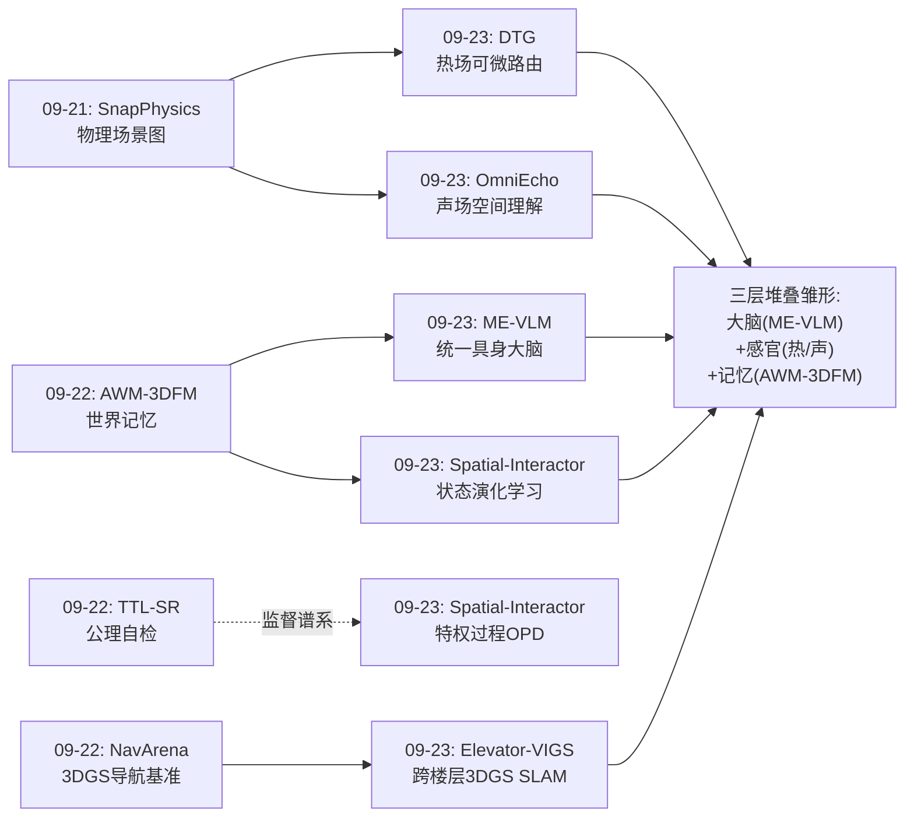
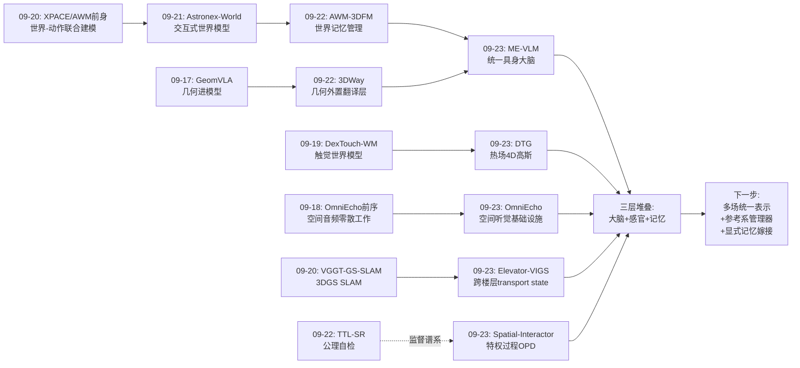
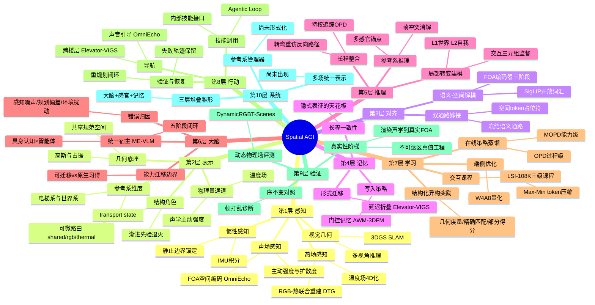
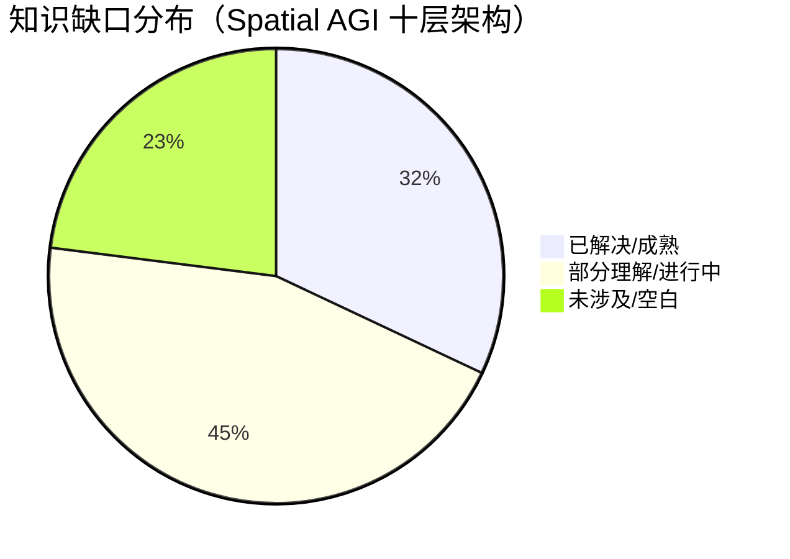
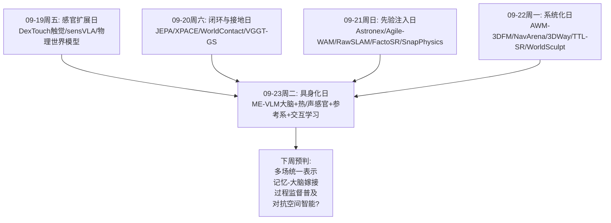

# Spatial AGI 每日深度思考 — 2026-09-23

**主题**: 大脑、感官与参考系 —— 空间智能的"具身化日"

**论文**:
1. ME-VLM（2609.24526）— 具身认知与智能体协调的统一 VLM（理想汽车）
2. Dynamic Thermal Gaussians（2609.24531）— 多模态 4D 高斯泼溅（RGB-热）
3. Elevator-VIGS（2609.23491）— 电梯运动与机器人运动分离的视觉-惯性 3DGS SLAM
4. OmniEcho（2609.23407）— 具身智能体的空间音频理解
5. Spatial-Interactor（2609.23038）— 通过与可观测物理世界交互学习空间推理

---

## 📅 每日总结

**日期**: 2026-09-23
**论文数量**: 5篇
**主题**: 空间智能的"具身化"——宿主模型（大脑）、非视觉物理场（热/声感官）、多参考系（空间素养）、交互监督（学习方式）

**关键突破**:
- 🚀 **具身大脑的统一配方确立**（ME-VLM）：能力注入 SFT → 双专家 RL（智能体专家 + 具身专家，不对称初始化避免目标互耦）→ 多教师在线策略蒸馏 MOPD，单一模型同时登顶 26 个具身基准（70.9，领先 8.2 分）与智能体基准（72.5），R2R 导航 SR 从基线 15.3 跃升至 45.8；端侧 4B + W4A8 + 免训练 Max-Min token 压缩实现 188ms prefill
- 🚀 **空间的多物理场扩展**（Dynamic Thermal Gaussians + OmniEcho）：热场与声场先后被纳入空间表示——DTG 用共享高斯几何 + Gumbel-Softmax 可微路由（shared/rgb-only/thermal-only 三角色）实现首个动态 RGB-热联合重建（热 PSNR 32.24，+1.52dB），thermal-only 高斯自动聚集于热事件边界（无监督物理事件定位）；OmniEcho 用 FOA 主动强度+扩散度的物理化输入表示 + 双通路嫁接架构，证明纯音频即可支撑声源中心空间推理（去视觉方向/定位/运动几乎不掉分）
- 🚀 **参考系素养成为空间智能的基本功**（Elevator-VIGS）：诊断出视觉-惯性"帧冲突"的根源是单坐标系强制统一，用 transport state（电梯上升量+垂直速度）沿重力方向显式承载载具运动、静止边界锚定全部三个不可观测量、consider 处理防止信息被视觉边侵蚀、延迟折叠在安全时统一坐标系——单相机+IMU 首次穿越电梯（28/28 序列零失败，楼层高度误差≤11%）
- 🚀 **交互是空间推理的教科书**（Spatial-Interactor）：帧打乱诊断（Qwen2.5-VL 打乱 32 帧仅掉 <1 分）证明 VLM 存在"序不变捷径"，局部→长程对比（GPT-5.5 从 88.7 崩到 23.9）证明整合失败；(O_t, a_t, O_{t+1}) 三元组直接监督 + 三级课程（L1 世界转变/L2 自我转变/L3 长程整合）+ 特权追踪 OPD，四基座整体提升 16.4–25.0 分

**架构演进**: 10层架构新增与深化多个维度：
- 第1层（感知）：从"视觉为主"扩展到"热+声"（DTG、OmniEcho）——多物理场感知时代开启
- 第2层（表示）：新增"参考系维度"（Elevator-VIGS transport state）与"结构角色维度"（DTG 可微路由）
- 第5层（推理）：确立"局部转变建模 + 长程整合"的双层结构（Spatial-Interactor）
- 第7层（学习）：在线策略蒸馏成为通用底座（ME-VLM 的 MOPD 能力级 + Spatial-Interactor 的 OPD 过程级）
- 第6层（大脑）：ME-VLM 给出首个完整的"具身大脑"工业级配方

### 📊 一句话总结

今天的五篇论文拼出了空间智能体的完整解剖图：ME-VLM 提供大脑（统一认知+智能体的宿主模型），DTG 和 OmniEcho 补上热与声的感官（多物理场空间感知），Elevator-VIGS 教会参考系素养（在移动容器中保持空间状态），Spatial-Interactor 发现了学习方式（交互三元组是空间状态演化的直接监督）。

### 🔗 延续性

**昨日→今日**: 昨日主题是"系统化"（记忆 AWM-3DFM、评估 NavArena、动手 3DWay、自检 TTL-SR、组合 WorldSculpt），留有三个明确线索：记忆语义化、组合物理化、自检推广。今日五篇从"系统组件"推进到"具身整体"——昨日 AWM-3DFM 的世界记忆需要宿主（今日 ME-VLM 大脑）、需要更多感官（今日热/声）、需要更强的状态跟踪（今日 Elevator-VIGS/Spatial-Interactor）。特别地，昨日 3DWay 的"几何外置翻译层"与今日 ME-VLM 的"具身大脑"形成完整三层堆叠推演；昨日 TTL-SR 的"自检即监督"与今日 Spatial-Interactor 的"特权过程监督"是过程监督家族的两代技术。

**今日→明日**: 三条线索——(1) 显式空间记忆与统一大脑的嫁接（ME-VLM + AWM-3DFM/3DGS 记忆外挂）；(2) 多物理场空间表示的融合（DTG 的可微路由扩展到 N 模态：视觉+热+声+触觉）；(3) 特权过程监督的推广（Spatial-Interactor 的追踪式 OPD → 导航决策链/操作序列的过程监督）。

### 💡 本质思考：如何达成通用空间智能

#### 1. 核心能力的本质是什么？

今天五篇论文把 Spatial AGI 的能力清单从"系统级"（昨日四能力：持久性/组合性/自洽性/可评估性）推进到"有机体级"：

1. **参考系素养**（Reference Frame Literacy）：Elevator-VIGS 证明空间智能的第一课不是"感知得准"而是"知道自己在哪个坐标系里"。相机锚定电梯系、IMU 锚定世界系、OmniEcho 的声音锚定声源系、图像锚定相机系——每个感官有自己的参考系，空间智能体必须原生管理"我在哪里的哪一层坐标里"。重力是唯一免费、全局、永不太漂移的组织轴。
2. **状态演化维护**（State Evolution Maintenance）：Spatial-Interactor 证明空间推理的本质不是"静态关系判断"而是"空间状态的持续更新"——识别变化来源（世界动了还是我动了）、按序累积转变、在长程中保持更新后的状态。帧打乱不掉分说明现有模型根本没有这个能力；交互三元组 (O, a, O') 是它的直接监督。
3. **多物理场覆盖**（Multi-Physical-Field Coverage）：视觉只在"可见、无遮挡"的窄域有效；热穿透黑暗（DTG），声音穿透遮挡与视场（OmniEcho）。通用空间智能要求感知栈在物理场维度互补覆盖——每个物理场都是空间的一个侧面。
4. **统一宿主**（Unified Host）：ME-VLM 证明空间能力不应孤立存在，而应长在"具备通用规划/工具/反思能力 + 物理接地表征"的统一模型中，通过感知-推理-动作-验证-重规划闭环运行——孤立的空间专家模型无法完成长程任务。

#### 2. 当前方法与理想目标的差距在哪里？

- **大脑无外挂记忆**：ME-VLM 的空间表征是隐式的（看图答题式的空间能力），21 步导航是展示上限；真实家庭多小时任务中隐式记忆会衰减。它与显式几何记忆（昨日 AWM-3DFM、3DGS 记忆）的嫁接尚未发生。
- **感官不互通**：DTG 处理热、OmniEcho 处理声，但两者互不知晓；多物理场的统一空间表示（一个高斯同时携带外观/温度/声学/触觉属性）不存在。DTG 的三角色路由扩展到 N 模态面临组合复杂度。
- **感官依赖视觉锚**：DTG 的位姿来自 RGB COLMAP（热最有价值的黑暗场景恰是 RGB 失效场景）；OmniEcho 单点 FOA 的距离估计物理上病态（3D 定位仅 14.2%）。感官的独立性还远未实现。
- **状态演化靠语言压缩**：Spatial-Interactor 的特权追踪是文字描述，语言能否承载度量级空间状态（精确位移、角度累积）存疑；内化不完全则部署时回到 23.9 分水平。
- **载具模型只有 1 自由度**：Elevator-VIGS 明确限于纯垂直平移，6-DoF 载具（电车/火车）中"静止边界锚定"这一优雅技巧会失效。
- **导航评测仍是指令跟随**：R2R/RxR 是离散环境文本指令，连续空间、动态障碍、开放词汇的具身导航未验证——ME-VLM 的 45.8 SR 有基准红利成分。

#### 3. 从今天到理想状态，最可能的路径是什么？

1. **感官增强期**（近期）：热/声/触觉各自的"空间编码器 + 基准"快速涌现（DTG 和 OmniEcho 各自提供了模板：物理化输入表示 + 可微结构路由 / 双通路嫁接）；距离估计的物理病态性催生主动感知（动起来听/多视角测温）。
2. **多场统一期**（中期）：DTG 路由机制扩展到 N 模态（共享几何 + N 组属性 + 2^N 角色或层级路由）；声-热-视觉统一进入单一 4D 高斯或占据场——空间表示成为"多物理场数据库"（可查询任意位置的任意物理状态）。
3. **大脑-感官-记忆整合期**（中期）：ME-VLM 类大脑 + 外挂显式空间记忆（AWM-3DFM 式记忆管理 + 3DGS/占据栅格）+ 多感官空间编码器（OmniEcho 式嫁接）的三层堆叠；Spatial-Interactor 的交互课程为整合系统提供训练信号。
4. **过程监督普及期**（贯穿）：特权过程监督从视频 QA（本文）扩展到导航决策链、操作序列、多感官融合推理——"答案奖励只能定位结果，特权追踪才能定位过程"的范式成为长程空间智能体的标准训练法。
5. **参考系管理形式化**（远期）：出现显式的"参考系管理器"——统一处理多感官多参考系证据融合、移动容器（6-DoF）中的 transport state、层级参考系（房间/楼宇/电梯）切换。这可能是 Spatial AGI 的又一个"Android 时刻"。

---

## 🔗 与昨日思考的联系

### 昨日重点

昨日（09-22）主题是**系统化**：AWM-3DFM 确立记忆管理为第一性问题（双阶段记忆调节），NavArena 把评估做成自动工厂，3DWay 确立"几何外置翻译层"路线，TTL-SR 证明几何公理是免费监督者，WorldSculpt 证明世界的单位是物体。核心结论：Spatial AGI 需要四个系统级能力（持久性、组合性、自洽性、可评估性），并预判了"记忆语义化、组合物理化、自检系统化、评估动态化、系统编排"五阶段路径。

### 今日进展

今天的五篇论文从"系统组件"推进到"具身整体"：

1. **宿主模型问题被回答**：昨日的记忆（AWM-3DFM）、自检（TTL-SR）都需要一个宿主——空间能力长在什么模型里？今日 ME-VLM 给出首个工业级答案：统一具身大脑（具身认知×智能体能力，双向闭环）。昨日 3DWay 的几何路径点接口恰好是 ME-VLM 技能调用的动作原语——"大脑 + 记忆外挂 + 几何接口"的三层堆叠轮廓浮现。
2. **感知版图从视觉扩展到物理场**：昨日的感知全是视觉（3DGS 系），今日 DTG（热）与 OmniEcho（声）在一天内把两个非视觉物理场带入空间表示——多物理场感知的趋势从"预感"变为"事实"。这与昨日结论"自检系统化需要更丰富的公理体系"呼应：热力学、声学各有自己的公理可做验证器。
3. **过程监督的代际演进**：昨日 TTL-SR 用几何公理做自检触发（结果侧、自监督），今日 Spatial-Interactor 用特权追踪做过程蒸馏（过程侧、教师监督），ME-VLM 用 MOPD 做能力调和——三者在"监督信号粒度"谱系上各占一位：公理自检（无监督）→ 交互三元组（数据结构）→ 特权追踪（教师描述）→ 几何奖励（度量）。
4. **状态维护主题的三重奏**：昨日 AWM-3DFM 的记忆调节管"写什么"，今日 Elevator-VIGS 的 transport state 管"在哪个参考系里记账"，Spatial-Interactor 的课程管"如何学会累积"——写入、坐标系、累积是空间状态维护的三个正交侧面。
5. **昨日评估动态化的补充**：昨日指出 NavArena 局限静态，今日 OmniEchoBench-Nav（真实声场导航）与 DTG 的 DynamicRGBT-Scenes（高频物理变化）分别在听觉与热力学维度扩展了动态评估的素材库。

### 演进路径



---

## 📚 论文概览

1. **ME-VLM**（理想汽车基础模型团队）：物理 AI 统一基础模型。能力迁移边界划分（可迁移：感知/规划/工具/归因；不可迁移：空间估计/可供性/物理约束/后果预测）→ 具身注入 SFT → 双专家 RL（GRPO+GSPO，结构化异构奖励）→ MOPD 多教师在线蒸馏。26 具身基准 70.9（+8.2），智能体基准 72.5（+9.6），R2R SR 45.8（基线 15.3），4B 端侧 188ms。**关键词：具身大脑的完整工业配方。**

2. **Dynamic Thermal Gaussians**（丽水学院+杭电+浙大）：首个动态 RGB-热联合 4D 重建。共享规范高斯几何 + 模态专属属性 + Gumbel-Softmax 三角色路由（shared/rgb-only/thermal-only）+ 渐进先验退火 + 结构一致致密化；DynamicRGBT-Scenes 数据集（12 序列，FLIR A700 + iPhone 15 Pro）。热 32.24dB（+1.52），RGB 25.03dB（+1.09）。**关键词：空间表示的多物理场化与可微结构自组织。**

3. **Elevator-VIGS**（UZH + ETH Zürich + Stuttgart + Microsoft，Marc Pollefeys 组）：帧冲突诊断 → transport state（h, u 沿重力）+ 出发/到达静止约束（消除三个不可观测量）+ consider 更新投影 + 延迟折叠 + 跨楼层回环三重门控 + VLM/深度/IMU 三线索零样本乘梯检测。28/28 电梯序列零失败，楼层高度≤11% 误差，电梯外与 VIGS-SLAM 差 <0.5cm。**关键词：多参考系空间状态估计的范式。**

4. **OmniEcho**（北大 + 阿里 + 清华）：首个具身空间音频统一工作。OmniEchoBench（197 真实场景/2972 QA/六任务 + 30 环境真实 FOA 声场/900 导航样本）；FOA 编码器（W+主动强度+扩散度，SN3D）三阶段训练，双通路嫁接 Qwen3-Omni（冻结语义通路 + 空间通路 <foa_pad>）。QA 28.5%（基线 11-18%），声引导导航 SR 16.2 接近文本 VLN。**关键词：空间听觉从零到一的完整基础设施。**

5. **Spatial-Interactor**（浙大 OmniAI + SAP）：交互三元组状态转变学习。帧打乱诊断（掉分<1）与局部-长程诊断（GPT-5.5 88.7→23.9）→ LSI-108K 三级课程（L1 被动世界转变/L2 主动自我转变/L3 长程整合）→ SFT + 特权追踪 OPD（同前缀蒸馏，λ_t 衰减）。四基座 +16.4–25.0，跨基准 +4.3–10.6。**关键词：空间推理 = 空间状态的动态维护，交互是其直接监督。**

---

## 💡 核心见解

### 见解1: "具身大脑"的统一配方已经确立

（从 ME-VLM 获得）

- ✅ 异构 RL 目标（智能体式 vs 具身式）直接混合会互相削弱——不对称初始化的双专家分别特化、再以具身专家为锚点做 MOPD 蒸馏，是有效的能力融合配方
- ✅ 能力迁移边界的划分：多模态感知/长程规划/工具调用/归因推理可从数字世界迁移；空间状态估计/可供性/物理约束/后果预测必须物理世界原生习得
- ✅ 环境接地的 RL 评估（模拟器状态/目标谓词/约束违反）+ 失败轨迹保留 = 模型学会验证-纠正-恢复（RoboFail 系列登顶）

**对Spatial AGI的启发**: "大脑 + 空间记忆外挂（AWM-3DFM）+ 几何动作接口（3DWay）+ 感官外挂（OmniEcho 式嫁接）"的分层堆叠成为 Spatial AGI 的工程参考架构。空间能力不应是孤立专家模型，而应长在有通用规划/反思能力的宿主上——因为长程任务需要的是"空间感知约束规划、执行反馈修正感知"的双向闭环，而非单向管线。

### 见解2: 空间表示正在成为"多物理场数据库"

（从 Dynamic Thermal Gaussians 获得）

- ✅ 共享几何底座 + 模态专属属性 + 可微结构路由，是"多种物理观测、同一个物理现实"的表示学回答
- ✅ 路由产生清晰物理语义的空间结构：thermal-only 高斯自动聚集于热水流及其边界——无监督的物理事件空间定位
- ✅ 热监督反传可改善动态几何——非视觉物理量可以作为空间结构的训练信号

**对Spatial AGI的启发**: 空间表示的目标形态不是"会动的图片"而是"可查询的物理世界副本"——任意位置、任意时间、任意物理量（外观/温度/声学/湿度）可查。DTG 的 Gumbel-Softmax 路由 + 渐进先验退火是空间结构自组织的通用工具，可推广到静态/动态分割、物体级分解等一切离散空间结构决策。局限同样明确：无热传导方程（拟合过去而非预测未来）、依赖 RGB 位姿（黑暗中失效）——4D 物理场求解与多传感器融合位姿是下一站。

### 见解3: 参考系素养是空间智能的基本功

（从 Elevator-VIGS 获得）

- ✅ 帧 conflicts 的根源是"单坐标系强制统一"：每个传感器在自己的坐标系里都是对的——相机在电梯系，IMU 在世界系
- ✅ 电梯的出发/到达静止（物理不变量）恰好锚定乘坐期间全部三个不可观测量（出发上升、出发速度、垂直加速度偏差）——免费约束消除航位推算误差
- ✅ 信息该住在哪里有讲究：上升量住在视觉雅可比为零的 transport state 里是安全的，过早搬进位姿会被电梯内视觉边拉回零（15/28 序列发散）——延迟折叠是必要的

**对Spatial AGI的启发**: 真实空间充满移动容器与多参考系（电梯、车、船、机械臂末端），空间智能体必须原生管理"我在哪里的哪一层坐标里"。这与 OmniEcho 的发现（声音锚定声源系、图像锚定相机系）汇聚成同一命题：**Spatial AGI 需要一个显式的参考系管理器**。物理不变量（静止边界、重力方向、门在墙上）是免费的约束锚点——系统性挖掘这类不变量是廉价而高回报的研究方向。

### 见解4: 听觉是视场外空间感知的天然通道

（从 OmniEcho 获得）

- ✅ 现有全模态模型的空间音频理解接近随机（11-18%），空间音频是预训练的系统性盲区
- ✅ 模态各有参考系锚点：FOA 音频独立支撑声源中心推理（方向/3D/运动），但相机中心推理（相机旋转）必须靠视觉——跨模态空间融合需要参考系对齐意识
- ✅ 真实声场 vs 渲染声学差距实质（SoundSpaces 双耳在真实 FOA 上 SR 仅 5.4%）——声学证据的真实性对导航是根本性的

**对Spatial AGI的启发**: 感知栈的互补覆盖原则：视觉管可见域，声音管全向域（穿透遮挡与视场），热管黑暗域（DTG）。"听见→转身→看见"的主动感知循环是空间智能体的基础行为。双通路嫁接（冻结语义通路 + 旁路空间编码器 + 占位 token 融合）是给任何基础模型增配空间模态的低成本通用配方。距离估计的物理病态性（单点 FOA 3D 定位仅 14.2%）暗示空间听觉需要主动运动（听觉视差）。

### 见解5: 空间推理的本质是空间状态的动态维护

（从 Spatial-Interactor 获得）

- ✅ 帧打乱不掉分（<1.4）证明 VLM 用"序不变捷径"绕过了状态追踪——静态 QA 训练从未要求真正的时序推理
- ✅ 空间状态的两个正交变化来源（世界 W_t 动了 / 我 E_t 动了）需要显式区分——这正对应 L1/L2 课程，也与 Elevator-VIGS 的双参考系分解同构
- ✅ 特权追踪 OPD：训练时给教师看"分段转变描述"，在学生自己的推理前缀上同前缀蒸馏，把过程信号注入推理链；推理时零开销

**对Spatial AGI的启发**: (观测, 动作, 新观测) 三元组应该成为 Spatial AGI 训练数据的原子单元——它携带静态 QA 永远不具备的"演化"信息。长程空间推理的失败要从"过程"定位而非"结果"——答案奖励只能告诉我们错了，特权追踪才能告诉我们哪步转变错了。帧打乱实验应成为空间基准的标配对照（防"序不变泡沫"）。

### 见解6: 在线策略蒸馏成为空间模型后训练的通用底座

（从 ME-VLM 与 Spatial-Interactor 共同获得）

- ✅ ME-VLM 的 MOPD：双 RL 专家（能力级教师）→ 单学生，具身专家做锚点保留脆弱的物理接地
- ✅ Spatial-Interactor 的 OPD：特权追踪教师（过程级）→ 学生，λ_t 衰减让模型逐步内化过程监督
- ✅ 共同配方：教师信号只在训练时存在、在学生自己的 rollout 分布上同前缀 KL、推理时单一模型零路由开销

**对Spatial AGI的启发**: 在线策略蒸馏解决了空间智能训练的两个根本矛盾——异构能力的融合（空间感知 vs 语言推理）与过程监督的注入（长程转变的正确累积）。可以预见"多教师空间蒸馏"：几何专家（3DGS/TTL-SR 式公理验证器）+ 语义专家（VLM）+ 感官专家（声/热编码器）蒸馏进统一学生。蒸馏教师的质量上限决定学生上限——这也解释了为什么"教师多样性"（不同物理场的专家）比"教师规模"更重要。

### 见解7: 评估的"真实性阶梯"决定空间智能的进化速度

（从 OmniEchoBench、DynamicRGBT-Scenes、Elevator-VIGS 数据集共同获得）

- ✅ OmniEchoBench-Nav 用 30 个真实环境密集采集的 FOA 声场做导航证据——第一个"真实声学"导航基准（此前全是渲染声学）
- ✅ DTG 的 DynamicRGBT-Scenes 提供高频物理变化的同步双模态 4D 序列——"物理场演化"维度的评测空白被填补
- ✅ Elevator-VIGS 用激光测量的层高做真值（因为外部追踪器进不了电梯）——在不可达环境中构造真值的工程智慧

**对Spatial AGI的启发**: 延续昨日"验证吞吐量"命题：评估的真实性分层（渲染声学→真实声场；静态→快变热场；开放空间→电梯内部不可达区）直接决定对应子领域的进化速度。渲染-真实差距是实质性的（5.4% vs 16.2% SR），在渲染评估上过拟合的空间模型在真实世界会失效。Spatial AGI 评测的下一站：多物理场 + 动态 + 不可达区域真值工程的系统化。

---

## 🗺️ 知识演进图



---

## 技术栈演进对比表

| 层次 | 昨日方案 | 今日方案 | 变化 |
|------|---------|---------|------|
| 第1层 感知 | 视觉/几何为主（3DGS、多视角） | + 热场（DTG）、声场（OmniEcho FOA） | 多物理场感知时代开启 |
| 第2层 表示 | 持久记忆 + 组合物体（AWM-3DFM、WorldSculpt） | + 参考系维度（transport state）、结构角色维度（可微路由）、物理量通道（温度/主动强度） | 表示从几何数据库向多物理场数据库演进 |
| 第3层 对齐 | 语义特征注入（CLIP/DINOv3 token） | 双通路嫁接（冻结语义+空间通路，<foa_pad> 占位符） | 模态扩展有了标准接口 |
| 第4层 记忆 | 双阶段记忆调节（门控写入+测试时掩码） | 延迟折叠（何时把信息从一种状态形式迁到另一种） | 记忆管理新增"形式迁移"维度 |
| 第5层 推理 | 测试时学习自检（TTL-SR） | 局部转变建模 + 长程整合双层结构；参考系显式声明 | 推理 = 状态演化维护的共识形成 |
| 第6层 大脑 | 各任务专属模型 | ME-VLM 统一具身大脑（具身认知×智能体，五阶段闭环） | 宿主模型问题首个工业级答案 |
| 第7层 学习 | 测试时学习、RLVR（公理奖励） | 三级课程 + 双专家 RL + MOPD/OPD 在线策略蒸馏（能力级与过程级） | 在线蒸馏成为后训练通用底座 |
| 第8层 行动 | 路径点接口（3DWay）、技能条件 | 技能/工具调用 + 执行反馈 + 错误归因三分法 | 行动闭环加入归因与恢复 |
| 第9层 验证 | 自动基准工厂（NavArena）、几何自检 | 真实声场导航基准、物理场演化基准、不可达区真值工程 | 评估真实性阶梯逐级攀登 |
| 第10层 系统 | 系统编排层缺席 | "大脑+感官+记忆"三层堆叠轮廓浮现（尚未有论文整合） | 编排层论文仍是最大空白 |

---

## 🗺️ Spatial AGI 知识图谱

### 10层架构思维导图



### 🎯 主线技术路径

#### 阶段1: 视觉空间智能（已成熟，2024–2025）
3DGS、NeRF、多视角推理、静态空间 QA——空间的"可见域"感知与表示基本解决，但被帧打乱诊断揭示存在序不变泡沫。

#### 阶段2: 动态与系统化（2025–2026 中，进行中）
世界模型、记忆管理、组合生成、自动评估——空间智能从单帧走向流式、从感知走向有状态（AWM-3DFM、NavArena、WorldSculpt）；SLAM 专攻生存环境（未标定、低光、移动容器——VGGT-GS、RawSLAM、Elevator-VIGS）。

#### 阶段3: 具身化与多感官（2026，当前所在）
统一具身大脑（ME-VLM）确立宿主模型配方；热（DTG）与声（OmniEcho）两个非视觉物理场进入空间表示；交互三元组（Spatial-Interactor）确立状态演化的直接监督；在线策略蒸馏（MOPD/OPD）成为后训练底座。空间智能体开始拥有完整的"大脑+感官"形态。

#### 阶段4: 多场统一与记忆嫁接（2026 下–2027，预判）
DTG 的可微路由扩展到 N 物理模态；ME-VLM 类大脑与显式空间记忆（AWM-3DFM）及感官编码器（OmniEcho 式嫁接）完成三层堆叠整合；特权过程监督扩展到导航决策链与操作序列；参考系管理器开始形式化（6-DoF 载具 transport state 是试金石）。

#### 阶段5: 空间智能操作系统（2027+，远期）
显式编排层的出现——统一管理多感官流、多参考系、多场记忆、验证器库、评估器，向下游暴露查询/规划/学习 API。空间智能的"Android 时刻"：预测-决策-行动在统一参考系框架下实时闭环，主动感知（听→转→看→动）成为本能。

---

## 🔍 待探索议题

### 高优先级（本周）

1. **显式空间记忆嫁接到统一大脑**
   - 问题: ME-VLM 的隐式空间表征在 21 步导航后衰减，如何把 AWM-3DFM 式显式记忆（3DGS/占据/拓扑）作为外挂接入统一大脑的推理闭环？
   - 候选方案: 记忆 token 化后经 <mem_pad> 占位符注入（复制 OmniEcho 的 <foa_pad> 模式）；记忆读写作为工具调用纳入 Agentic Loop
   - 缺口: 记忆的写入时机决策（何时该存）、检索时机决策（何时该查）没有训练信号——可能需要过程监督

2. **可微结构路由的 N 模态扩展**
   - 问题: DTG 的三角色路由（shared/rgb/thermal）如何扩展到 视觉+热+声+触觉 四模态？角色组合 2^N 爆炸还是层级化路由？
   - 候选方案: 层级路由（先 shared/specific 再 specific 内细分）；成对路由矩阵 + 全局一致性正则
   - 缺口: 缺少多模态动态场景的同步数据集（热+声+RGB 同时采集的 4D 序列不存在）

3. **语言化空间记忆的容量极限**
   - 问题: Spatial-Interactor 的特权追踪是文字描述——语言能否承载度量级空间状态（精确位移累积、角度和）？内化不完全时部署性能回落多少？
   - 候选方案: 混合追踪（文字描述 + 数值几何 token）；对比纯语言追踪 vs 结构化状态向量追踪的 OPD 增益
   - 缺口: 缺少"追踪容量"的受控实验（追踪长度×空间精度的二维扫描）

### 中优先级（本月）

4. **6-DoF 载具的 transport state**
   - 问题: Elevator-VIGS 限于纯垂直平移；电车/火车有水平平移+旋转，且"到站静止"边界模糊（滑行、缓停）
   - 候选方案: 学习式事件边界检测替代硬阈值；地面车辆可用"停站时间分布"作为软先验
   - 缺口: 无公开的载具全程真值数据集（含载具内部运动分解）

5. **空间听觉的主动感知**
   - 问题: 单点 FOA 距离估计物理病态（3D 定位仅 14.2%）——人类靠头部运动产生听觉视差
   - 候选方案: 主动听觉策略学习（运动方向最大化定位信息增益）；声-视觉联合主动定位
   - 缺口: OmniEchoBench 只有静态采集，无"运动中听"的序列

6. **热力学公理作为验证器**
   - 问题: DTG 无热传导物理（拟合过去非预测未来），TTL-SR 的公理自检体系不含热学
   - 候选方案: 把热传导方程作为 4D 热场的物理一致性损失（衔接 ETGS 闭式解）；热自检触发测试时学习
   - 缺口: 演化几何上的热方程求解（几何本身在动时边界条件如何定）

7. **序不变泡沫的基准清理**
   - 问题: 帧打乱诊断（掉分<1）说明现有空间基准的分数部分来自序不变捷径——哪些基准被污染了？
   - 候选方案: 对主流空间基准（VSI-Bench 等）做系统性扰动审计（帧打乱/视角翻转/物体替换）；发布"扰动鲁棒版"排行榜
   - 缺口: 扰动幅度与"真正需要时序"任务边界的形式化定义

### 低优先级（本季度）

8. **多物理场空间数据库的查询接口**
   - 问题: 未来空间表示同时携带外观/温度/声学/语义——下游 agent 如何查询（"哪里温度在升？哪里有回声？"）？
   - 候选方案: 语言查询→物理场检索（复用 OmniEcho 的开放词汇声学空间）；物理量 API 设计
   - 缺口: 跨物理场的统一查询语义（热查询与声查询的共性抽象）

9. **错误归因三分法的自动化**
   - 问题: ME-VLM 提出归因三分法（感知噪声/规划偏差/环境扰动）但靠模型端到端判断；可否结构化？
   - 候选方案: 用一致性检验分离感知噪声（同场景多视角/多感官交叉验证）、用可微仿真区分规划偏差与环境扰动
   - 缺口: 三类错误的真实标注数据（需要可控注错的具身环境）

10. **具身大脑的跨本体泛化**
    - 问题: ME-VLM 在哪些机器人本体上实测、sim-to-real 差距未报告；空间技能接口（抓取/导航）如何跨本体统一？
    - 候选方案: 本体条件化 token（embodiment embedding）；跨本体技能库 + 统一语义技能接口
    - 缺口: 多本体统一评测协议（同一任务套件在不同本体上的可比性）

---

## 📊 知识缺口分析



**已解决（32%）**:
- ✅ 视觉几何表示与重建（3DGS 全家桶：静态/动态/SLAM/跨楼层）
- ✅ 单一感官的空间编码模板（FOA 空间编码器配方、RGB-热联合配方）
- ✅ 在线策略蒸馏配方（MOPD 能力级 + OPD 过程级，跨任务验证）
- ✅ 静态与基准化空间推理评测（含自动基准工厂）
- ✅ 端侧部署优化路径（token 压缩 + 量化 + 软硬协同，188ms 已实现）

**部分理解（45%）**:
- ⚠️ 具身大脑的统一训练（ME-VLM 配方有效但长程交互任务仍落后专用模型——TAU2/ClawEval）
- ⚠️ 多物理场感知（热/声各自有了首篇，但互不联通、依赖视觉锚、无统一表示）
- ⚠️ 空间状态演化学习（交互课程有效但特权追踪受限于语言容量，闭环验证初步）
- ⚠️ 参考系管理（1-DoF 电梯已解决，6-DoF 载具、层级参考系、跨感官参考系对齐未解）
- ⚠️ 记忆管理（几何记忆有方案，语义记忆、写入/检索时机、形式迁移仍是开放问题）
- ⚠️ 空间导航（真实声场导航可行但性能低；R2R 式基准有天花板红利）

**未涉及（23%）**:
- ❌ 系统编排层（大脑+感官+记忆的整合论文缺席——"空间智能操作系统"无人做）
- ❌ 多物理场统一表示（一个空间数据库同时可查温度/声学/外观）
- ❌ 显式参考系管理器的形式化（多感官多参考系证据融合的一般理论）
- ❌ 主动感知的闭环（听→转→看→动 的信息增益驱动策略学习）
- ❌ 不可达环境真值工程的系统化（电梯之外：管道、水下、深空）
- ❌ 跨本体空间技能的统一评测协议

---

## 📌 今日金句

> 空间智能的第一课不是"感知得准"，而是"知道自己在哪个坐标系里"（Elevator-VIGS）；
> 最好的空间教材不是静态图片，而是"看-做-再看"的交互循环（Spatial-Interactor）；
> 大脑可以统一，感官必须互补，记忆需要外挂——空间智能体正在长出完整的身体。

---

**文档创建时间**: 2026-09-23
**论文来源**: arXiv 2026-09-19 ~ 09-21
**分析方法**: 全文精读 + 跨论文主题综合

---

## 🔬 逐篇深潜：方法与空间的再审视

### 深潜1: ME-VLM 的训练动力学为什么"先分后合"有效？

ME-VLM 的双专家设计值得从优化几何角度再想一层。智能体任务与具身任务的 RL 奖励面形状截然不同：智能体任务的成功稀疏、轨迹长、 credit assignment 跨越数十步工具调用；具身任务的成功稠密、状态转移精确、奖励可以用几何度量直接计算。如果强行把两类奖励面混合在一个策略梯度更新里，梯度方向会在这两个面之间高频震荡——这正是"直接混合异构 RL 目标会削弱领域专属能力"的数学根源。MOPD 的解决方案等价于：先在两个奖励面上分别做局部收敛，再用 KL 蒸馏把两个局部最优"缝合"进一个学生。缝合之所以可行，是因为两个专家共享同一个预训练底座——它们的参数在损失面的同一个盆地里，只是滚向了不同的谷底；蒸馏相当于在两谷之间挖一条通道。

一个隐含的启示：**空间智能的不同侧面（几何精度、语义推理、长程规划、物理常识）可能有各自的"奖励面"，未来的空间模型后训练大概率是多专家-多教师蒸馏的**。可以设想：几何专家（用几何度量奖励训练）、物理专家（用仿真一致性奖励训练）、语义专家（用开放词汇对齐训练）→ 统一蒸馏。今日的 MOPD（能力级）+ Spatial-Interactor 的 OPD（过程级）已经是这个谱系上的两个点。

另一个值得记录的细节：ME-VLM 强调"训练时发展物理接地表征，而非要求推理时输出详细思维链"。这与当下流行的"推理时思维链 scaling"形成有趣的张力——对具身实时系统来说，推理时延是硬约束，把推理能力"内化进前向传播"比"外化为生成 token"更符合部署现实。188ms 的端侧 prefill 就是这个哲学的工程体现。Spatial-Interactor 的 OPD 也暗合此理：特权追踪只在训练时可见，学生把"过程推理"内化进权重。**内化式过程监督 vs 外化式思维链生成**，可能是具身空间智能与数字智能体在推理范式上的一个本质分野。

### 深潜2: DTG 的路由可视化为什么重要？

图5 的路由投影值得单独讨论，因为它是全文最有"空间智能味道"的证据：模型没有见过任何"热水流"标注，但 thermal-only 高斯自动生长在热水流及其边界上。这意味着什么？重建损失天然偏好"每个像素都被准确预测"，而热水流的温度梯度在热模态中信号最强、在 RGB 模态中几乎不可见——于是只有把 thermal-only 高斯分配到这些区域，热重建损失才能下降。**路由的空间分布是损失面几何的影子**：物理事件的边界（温度梯度最大的地方）自动成为模态特化的边界。

这个机制可以直接推广：如果表示中增加声学通道，reflection 密度大的区域会自动长出 audio-only 高斯；增加触觉通道，材质变化边界会长出 tactile-only 高斯。**空间结构边界 = 物理场梯度**——这是一条潜在的"无监督物理事件发现"原理。Spatial AGI 的事件理解（什么东西在哪里发生了变化）可能不需要事件标注，只需要多物理场表示 + 梯度敏感的结构分配。

但同时要泼一盆冷水：DTG 的路由结果依赖两个模态的相对信号强度先验（退火终点 [0.15,0.7,0.15] 是手工设计的），这个先验本质上是"热信息比 RGB 稀缺"的领域知识。换一个场景（比如雪山场景 RGB 纹理稀缺），先验就要重调。真正的模态自动平衡（自适应先验、按信息量动态路由）还没有解决。

### 深潜3: Elevator-VIGS 的"信息住址"隐喻

延迟折叠的设计有一个漂亮的抽象：**信息应该住在"保护它的约束够不到它"的状态里**。上升量住在 transport state 时，视觉残差对它的雅可比恒为零——它是视觉不可见的；一旦搬进位姿，电梯内关键帧之间的视觉边就会把它拉回零。这不是实现细节，而是一个关于估计系统的一般原理：

- 隐式神经表征中的信息住在"梯度保护它"的地方（TTL-SR 的公理自检依赖这一点：预测必须可被自洽性约束触及）；
- 显式状态变量中的信息住在"设计者指定它不被某些损失侵蚀"的地方（transport state）；
- 空间记忆中的信息住在"会被正确的检索线索激活"的地方（AWM-3DFM 的门控记忆）。

信息在三种住址之间的迁移时机（何时从 transport state 折叠进位姿、何时从隐式表征写入显式记忆、何时从工作记忆固化到长期记忆）是空间智能系统设计的核心难题。Elevator-VIGS 给出的答案很精炼：**等保护性上下文消失后再迁移**（k₁ 滑出滑窗、视觉边断开）。这个原则对空间记忆管理的启发是：从短期隐式记忆向长期显式记忆固化，应该发生在"上下文窗口更替"的边界上——这恰好是当前 LLM agent 记忆系统实践中"会话结束时总结"的直觉，但 Elevator-VIGS 给了它一个估计理论的严格表述。

### 深潜4: OmniEcho 的双通路是"感官神经"的工程隐喻

OmniEcho 的架构看起来像生物听觉通路的双流结构：W 通道下混走语义流（"听到了什么"），FOA 五通道走空间流（"从哪里来"）——这与人类听觉皮层的腹侧流（what）与背侧流（where）处理惊人地同构。这种同构不是巧合：语义与空间的分离是音频信息的基本分解，无论生物还是机器都要面对。

工程上更重要的发现是嫁接的代价极低：FOA 编码器冻结、音频塔冻结、视觉塔冻结，只训练 LLM 与投影器，36 万样本、32×A100×4 天就注入了一个全新感官。对比从头预训练一个全模态模型的成本，**"旁路感官 + 占位符融合"的边际成本曲线极其友好**——这意味着空间智能体的感官数量可以随时间线性增长（今天加听觉、明天加热、后天加触觉），而底座不需要反复重训。DTG 的热与 OmniEcho 的声如果都嫁接到同一个基座上，它们的 token 会在同一个语言空间里相遇——多感官融合在这个架构里是"自然发生的"，不需要显式的融合模块。这是比 DTG 的显式路由更松耦合的一条多感官路线，两者的竞争值得持续观察。

### 深潜5: Spatial-Interactor 的两个诊断实验应成为社区标准

帧打乱实验的力量在于它的**不可辩驳性**：如果一个空间推理模型在帧顺序打乱后成绩不掉，那它的"视频理解"就与视频理解无关——它在做序不变的图像匹配。这个实验成本五分钟，却能戳破大量虚假的视频空间推理能力。同理，"局部-长程对比"（同一能力家族的短程/长程版本分数差）直接量化整合能力的缺失。

建议 Spatial AGI 社区把这两个协议（外加视角翻转、物体替换、参考系变换等扰动）作为基准发布的**强制对照**：任何空间基准都应附带扰动审计，报告"真时序性能"与"序不变泡沫"的分解。这与昨日 NavArena 的"评估自动化"是同一主题的两面：自动化解决吞吐量，扰动审计解决有效性。

### 深潜6: 五篇论文的"参考系"暗线

重读今天的五篇，会发现"参考系"是贯穿所有论文的暗线：

- **Elevator-VIGS**：相机系 vs 世界系（垂直轴解耦）——显式建模；
- **OmniEcho**：声源系 vs 相机系（声源中心任务纯音频可解、相机中心任务必须视觉）——实验揭示；
- **ME-VLM**：ViewSpatial-Bench 区分自我中心/他者中心视角——基准评测；
- **Spatial-Interactor**：L2 主动自我状态转变（相机动 vs 世界动）——课程设计；
- **DTG**：共享规范空间 = 模态无关的统一参考系——表示设计。

五篇论文从估计、感知、评测、学习、表示五个不同角度都撞上了参考系问题。这是一个信号：**参考系管理正在从各论文的隐含前提上升为 Spatial AGI 的一等公民问题**。可以预期未来一两年会出现"统一参考系理论"或"参考系管理器"类型的论文——把它从"每个系统自己处理一次"变为"平台层解决一次"。

---

## 🧩 跨论文对话：三个假想实验

### 假想实验1: 让 ME-VLM 乘坐电梯

把 Elevator-VIGS 的场景交给 ME-VLM：机器人在电梯里，指令是"去三楼把红色箱子搬到五楼"。ME-VLM 的五阶段闭环（感知-推理-动作-验证-重规划）在电梯门关闭后立刻遇到 Elevator-VIGS 诊断的帧冲突：视觉说"我没动"，IMU 说"我在加速"。没有 transport state 的 ME-VLM 要么丢失楼层信息（视觉主导），要么状态发散（冲突保留）。

但 ME-VLM 有一样 Elevator-VIGS 没有的东西：错误归因能力。它可以在执行反馈异常时（"我按了 3 楼但门开了之后看到的不是 3 楼"）做归因和重规划。**精确的几何估计（Elevator-VIGS）与语义级的闭环纠错（ME-VLM）恰好是互补的两层防线**：前者保证不犯错误，后者保证犯了错误能恢复。三层堆叠架构中，这两层的接口应该是"结构化的空间状态查询"——大脑向 SLAM 层查询"我现在在哪"，SLAM 层返回带参考系声明的状态向量。

### 假想实验2: 让 OmniEcho 听 DTG 的厨房

DynamicRGBT-Scenes 里的明火烤串场景，如果加上一个 FOA 麦克风：火焰的噼啪声（音频事件定位，OmniEcho）、温度场的快速演化（热重建，DTG）、外观变化（RGB）——同一个物理事件在三个物理场中留下三种签名。多场融合的事件理解可以做到单场所不能：噼啪声源方向（声）+ 高温区域扩散方向（热）+ 视觉火焰形状（RGB）交叉验证出"火从灶台向左蔓延"。

这个假想实验暴露了今天所有论文的表示都还不兼容：DTG 的高斯没有声学属性，OmniEcho 的声学没有几何底座。**"多物理场统一高斯"（每个高斯携带 {RGB, 热辐射, 声学反射率, 语义} 属性包）是明确的下一步**，DTG 的可微路由已经解决了"哪些区域哪个场主导"的机制问题，缺的是数据（同步多场采集）和动力学（声传播/热传导的渲染方程）。

### 假想实验3: 用 Spatial-Interactor 的课程训练 Elevator-VIGS 的检测器

Elevator-VIGS 的乘梯检测用 VLM 判断"在电梯里"+深度离散度+IMU 阈值。如果用 Spatial-Interactor 的交互三元组课程来学这个检测器：L1 级样本"电梯门关了（世界事件）→ 观测封闭（自我状态）"，L2 级"电梯上升（自我运动）→ 视野变化"，L3 级"完整乘梯轨迹的转变序列"。交互式训练的检测器可能比零样本 VLM 更鲁棒（特别是在镜面/玻璃电梯这类 VLM 会误判的场景），同时保留可验证性（每次检测都对应一个可从元数据验证的三元组）。

这个实验的更一般意义：**Elevator-VIGS 的"VLM 扳机 + 几何精化"与 Spatial-Interactor 的"交互监督"可以合成"交互训练的语义扳机"**——语义检测器不再是冻结的黑盒，而是被空间交互数据持续改进的组件。

---

## 📐 方法论沉淀：今天学到的可复用配方

1. **帧冲突消解配方**（Elevator-VIGS）：多源观测不一致时，先诊断"各源在自己的参考系里是否自洽"→ 若自洽，为每源分配参考系 + 显式建模差异源（transport state）→ 用物理边界条件锚定不可观测量 → 用 consider 处理防止状态被侵蚀 → 延迟到保护性上下文消失后再统一。适用：一切多传感器融合、多 agent 状态合并、多模态证据冲突。

2. **旁路感官嫁接配方**（OmniEcho）：新模态 → 设计物理化输入表示（主动强度/扩散度式）→ 轻量编码器三阶段训练（语义对齐→任务特化→骨干嫁接）→ 冻结原通路 + 占位符 token 融合 → 只训投影器与 LLM。适用：给任何基础模型增加新感官。

3. **可微结构路由配方**（DTG）：离散结构决策（共享/专属/角色）→ Gumbel-Softmax 松弛 + Straight-Through 硬前向 → 渐进先验退火课程 → 结构一致的增长/剪枝。适用：空间表示的自组织（模态角色、静态/动态、物体归属）。

4. **特权过程蒸馏配方**（Spatial-Interactor）：长程多步任务 → 生成特权追踪（训练-only 的中间过程描述）→ 教师条件于追踪、学生条件于标准输入 → 在学生自己 rollout 的同前缀上做 KL → λ 衰减逐步撤除脚手架。适用：一切"答案奖励无法定位中间错误"的长程任务（导航链、操作序列、多步规划）。

5. **双专家-锚点蒸馏配方**（ME-VLM）：异构能力目标互耦时 → 不对称初始化分别 RL 特化 → 以更脆弱/更难恢复的能力为锚点初始化学生 → 多教师按决策类型加权蒸馏。适用：能力融合（空间感知×语言推理、感知×行动）。

6. **交互三元组数据配方**（Spatial-Interactor）：从仿真/真实交互提取 (O_t, a_t, O_{t+1}) → 元数据确定可验证真值 → 模板化多尺度 QA（局部窗口到完整轨迹）→ VLM 验证器质检（拒答不修改）。适用：一切空间演化能力的训练数据生产。

---

## 🔭 给明天的自己：三个可执行的检查点

1. **检查是否有"多物理场统一表示"论文出现**：关键词组合尝试 unified physical field representation / multi-modal gaussian routing / audio-thermal-visual 4D。若出现，重点看它如何处理声传播动力学（波动方程 vs 经验混响参数）与热传导（PDE vs 数据驱动），以及路由机制对 N>2 模态的扩展方案。

2. **检查是否有"参考系管理"理论化论文**：关键词 reference frame management / ego-allo centric unification / moving frame SLAM。特别关注 6-DoF 载具（火车/电车）的 transport state 推广——如果有人解决了"软边界"（非完全静止的到站）问题，值得精读。

3. **检查 ME-VLM 后续**：理想汽车的 MachEmbodied 系列是否放出 ME-VLM 的技术报告续作（VLA 头、世界模型整合）；同时关注其 MOPD 框架是否被其他组复用于"几何专家+语义专家"蒸馏。

---

## 📎 附录：今日关键数字速查

| 论文 | 关键指标 | 数值 |
|------|---------|------|
| ME-VLM | 具身基准平均（35B-A3B） | 70.9（+8.2 vs 最强基线） |
| ME-VLM | 智能体基准平均 | 72.5（+9.6） |
| ME-VLM | R2R Val-Unseen SR | 45.8（最强基线 5.3） |
| ME-VLM | 端侧 prefill 延迟（M100, 4B） | 400ms → 188ms |
| DTG | 热 PSNR | 32.24 dB（+1.52） |
| DTG | RGB PSNR | 25.03 dB（+1.09） |
| DTG | 路由消融（热） | 30.72 → 32.24（+1.52 全部来自路由） |
| Elevator-VIGS | 电梯序列成功率 | 28/28 零失败 |
| Elevator-VIGS | 楼层高度误差 | ≤11%（单程） |
| Elevator-VIGS | 到达即折叠消融 | 15/28 序列发散 |
| OmniEcho | QA 整体（音视） | 28.5%（基座 18.5%，SO-7B 11.4%） |
| OmniEcho | 声引导导航 SR | 16.2%（SoundSpaces 5.4%） |
| OmniEcho | 3D 定位准确率 | 仅 14.2%（距离估计是硬骨头） |
| Spatial-Interactor | 帧打乱掉分 | <1.4（序不变泡沫证据） |
| Spatial-Interactor | GPT-5.5 局部→长程 | 88.7 → 23.9（+Trace 回升 35.5） |
| Spatial-Interactor | 四基座整体提升 | +16.4–25.0 |

---

**文档创建时间**: 2026-09-23
**论文来源**: arXiv 2026-09-19 ~ 09-21
**分析方法**: 全文精读 + 跨论文主题综合

---

## 🧠 追问与自辩：对今日结论的压力测试

### 追问1: ME-VLM 的导航跃升（SR 15.3→45.8）可信吗？

这是今天最需要怀疑的数字。10 倍级的提升通常意味着三件事之一：基线严重欠调、基准有捷径、或者方法真的命中了结构性缺陷。逐一检验：

- **基线欠调**：对比的 RynnBrain/PhysBrain/MiMo-Embodied 都是"具身认知"模型而非导航专用模型——它们没有为 VLN-CE 式的连续环境离散动作做深度适配。所以 45.8 vs 15.3 部分是"适配差异"而非"能力差异"。
- **基准捷径**：R2R 的指令-路径共现先验很强（"walk past the sofa then turn left"几乎可以盲走），VLM 的语言先验可以大幅利用这一点。ME-VLM 的通用推理能力恰好放大了对这种先验的利用。Spatial-Interactor 的帧打乱教训在这里同样适用：需要扰动审计（指令-观测打乱配对）来分离"真空间接地"与"语言先验走捷径"。
- **结构性命中**：ME-VLM 的执行反馈闭环（验证+重规划）确实针对了 VLN 的核心失败模式（走错不回头）。RoboFail/RoboFAC 的登顶支持这一点。

综合判断：提升真实存在但幅度有水分。这个案例再次强化了本周的元教训——**跨基准大幅提升必须先问"基线是什么物种、基准有什么捷径"**。

### 追问2: 多感官嫁接的"自然融合"会不会是幻觉？

深潜4 里我对"旁路嫁接使多感官自然融合"偏乐观。压力测试：OmniEcho 的空间 token 是按时间序插入音频 token 之后的，视觉 token 另有一列——LLM 需要自己学会"这段 FOA token 的 i_x 分量与那列图像 token 的左侧物体对应"。这种对应没有任何显式监督（没有跨模态对齐损失强制"声源方向 token 注意到视觉声源"），全靠 QA 监督间接塑造。OmniEcho 音视设置比纯音频只提升 6.7 分（21.8→28.5），且方向/定位任务加了视觉几乎不变——这可以读作"视觉几乎没有帮到声学接地"，即**融合可能没有发生，两个通路在各自为战**。真正发生融合的证据应该是"加了视觉后声学任务显著变好"（比如用视觉校准房间尺度先验来修正声学距离估计），目前没有看到。结论修正：嫁接解决了"感官共存"，未解决"感官协作"。显式的跨模态对齐监督（把 DTG 式共享几何作为两者的对齐目标）可能是缺失的配料。

### 追问3: Spatial-Interactor 的提升有多少来自"空间"而非"数据量"？

SFT 阶段混入了 80K 公开空间 QA（VSI-590K、MindCube、VSTI-Bench），且 VSTI-Bench 同时是评测基准——虽然作者声称训练/评测在场景与视频层面不相交，但同分布数据（同基准的训练划分）的存在会放大"域内适配"的贡献。跨基准泛化（+4.3–10.6，MMSI/ViewSpatial/SAT 系）是更干净的证据，值得给予更高权重。另外 OPD 对照实验（与 GRPO 唯一差异是特权条件与过程蒸馏）设计得很干净，这部分结论可信。综合：**局部转变课程的贡献可信、长程 OPD 的贡献可信、整体提升幅度应打折看待域内适配**。

### 追问4: 今天五篇论文有没有共同的方法论盲区？

有，而且惊人地一致：**都假设了"世界大体友好"**。

- ME-VLM 的闭环假设执行反馈可观测、可解读；
- DTG 假设 RGB 位姿可得（黑暗即失效）；
- Elevator-VIGS 假设电梯遵守"出发-到达必静止"的文明行为、VLM 认识电梯；
- OmniEcho 假设声学环境不刻意对抗（无主动声学干扰）；
- Spatial-Interactor 假设交互元数据可信、标注器描述准确。

没有一篇处理"对抗性空间环境"：故意误导的视觉伪装、声学诱饵、传感器欺骗。人类空间智能的一大特征恰恰是"对环境的不信任能力"（不完全相信眼前的走廊、对太安静保持警惕）。Spatial AGI 的鲁棒性研究（对抗空间智能）几乎空白——这可能是一个有先发优势的空赛道。

---

## 🌐 今日论文的产业视角

### 理想汽车（ME-VLM）：车厂做具身大脑的战略意图

理想把"自动驾驶 + 具身智能"写进同一个能力迁移框架（6.3.1 节直接用驾驶基准验证），M100 芯片的端侧部署优化指向车载实时推理。产业逻辑清晰：智能驾驶是"轮式具身智能"的特例，车企积累的传感器、数据闭环、车规级部署能力可以平移到机器人。ME-VLM 的 4B 端侧变体就是为量产准备的形态。预测：理想后续会发布 ME-VLM 的 VLA 头（衔接其自动驾驶动作模型积累），"车-家-人形"三位一体的具身布局会逐步显性化。

### 学术组的分工生态（今日五篇的国别分布）

浙大（Spatial-Interactor）、北大+阿里（OmniEcho）、杭电/丽水（DTG）、ETH/UZH（Elevator-VIGS）、理想（ME-VLM）——有趣的是产业与学术的分工：产业组（理想、阿里）做"平台型"工作（大脑、基准+模型），学术组做"器官型"工作（热场、声场、SLAM、课程学习）。平台型工作的护城河是数据与算力，器官型工作的护城河是问题定义的先发权。Spatial AGI 的研究者个人/小团队的最优策略大概率是后者：找到下一个"空间音频"级别的空白器官。

### 基准与数据的新资产类别

今天三篇论文都自带数据集/基准（DynamicRGBT-Scenes、OmniEchoBench、Elevator 数据集、LSI-108K）。延续昨日 NavArena 的观察：**数据集正在从"研究的副产品"变成"研究的主体产出"**。评估一下这些资产的稀缺性：真实 FOA 声场导航数据（OmniEchoBench-Nav）稀缺性最高（30 个真实环境的声场采集成本高）；动态 RGB-热同步数据次之（需要双设备同步）；交互三元组数据（LSI-108K）可再生性最强（仿真管线可扩展）。这个排序对"哪些数据资产会长期有价值"有指导意义。

---

## 🗂️ 与本周前四日的主题串联



本周五日形成了一个完整的叙事弧：**感官（有什么信号）→ 闭环（信号如何连成循环）→ 先验（结构注入哪里）→ 系统（组件如何成为整体）→ 具身（整体如何长出身体）**。下周的叙事大概率从"长出身体"进入"身体如何协调"——多感官协同、记忆-推理协调、感知-行动协调，协调问题即系统编排问题的具体化。

---

## 📝 给记忆文件的增量

值得写入长期记忆的元观察：

1. **在线策略蒸馏是 2026 年空间模型后训练的通用底座**（MOPD 能力级 / OPD 过程级 / 特权追踪三个变体），后续论文按此谱系定位即可。
2. **评估扰动审计**（帧打乱/视角翻转/参考系变换）应成为读空间基准论文的默认检查项——没有扰动对照的 SOTA 都可能有序不变泡沫。
3. **"器官型"研究机会识别法**：找一个所有全模态模型都接近随机水平的空间子能力（如今天的空间音频 11-18%），配上真实数据采集 + 物理化输入表示 + 嫁接架构，就是一篇奠基工作。同类候选：空间触觉编码、空间嗅觉、多视角热成像、空间雷达。
4. **参考系是 Spatial AGI 的下一个一等公民问题**：本周 Elevator-VIGS（估计层）、OmniEcho（感知层）、ME-VLM（评测层）、Spatial-Interactor（学习层）、DTG（表示层）五篇全部撞上。留意统一理论的出现。

---

**文档创建时间**: 2026-09-23
**论文来源**: arXiv 2026-09-19 ~ 09-21
**分析方法**: 全文精读 + 跨论文主题综合 + 压力测试自辩

---

## 📖 延伸阅读地图：从今日五篇出发的文献追踪清单

### 从 ME-VLM 出发

- **必读**：RynnBrain 1.1、Vesta、MiMo-Embodied、Hy-Embodied-VLM-1.0、PhysBrain 1.5（ME-VLM 的五个直接对手，理解各自的能力分类学差异）；GSPO（序列级策略优化的原文，理解其重要性比设计的动机）
- **选读**：GLM-5 / Kimi K3 的技术报告（数字智能体的 Agent RL 基础设施，ME-VLM 环境回路 RL 的数字侧参照）；MOPD 原始范式论文（多教师蒸馏的来源）
- **追踪信号**：MachEmbodied 项目页的后续模型（VLA 头？世界模型整合？）；理想在自动驾驶基准上的后续迁移实验

### 从 DTG 出发

- **必读**：ThermalGaussian++（同组前作，静态 RGB-热 3DGS 基线）、Thermal3D-GS（物理先验路线）、ETGS（闭式热传导——与 DTG 的数据驱动路线正交，最值得合并的方向）、E-D3DGS（形变框架基座）
- **选读**：MMOne（多模态 3DGS 统一框架，N 模态路由的先行者）；Gumbel-Softmax / Straight-Through 原论文（复习离散结构学习）
- **追踪信号**：DynamicRGBT-Scenes 的社区采用情况；声学反射率进入高斯属性的第一篇论文

### 从 Elevator-VIGS 出发

- **必读**：VIGS-SLAM（基座系统）、Elevator-LIO（LiDAR 路线的电梯建模，对比 transport state 设计）、HI-SLAM2（回环机制来源）
- **选读**：consider 参数处理的经典文献（Schmidt 1966；Geneva 2019——"不更新但影响他人"的估计理论基石）；robocentric SLAM 文献（Huai & Huang 2022——本文 transport state 的思想近亲）
- **追踪信号**：6-DoF 载具 transport state（电车/火车场景的第一篇）；跨楼层 AR 持久锚点的应用论文

### 从 OmniEcho 出发

- **必读**：Qwen3-Omni（基座）、Spatial-Omni（最近邻工作，无视觉无导航——对比理解本文补齐了什么）、SoundSpaces 2.0（渲染声学导航的旧范式）
- **选读**：FOA/ambisonics 的信号处理基础（ACN/SN3D 约定、主动强度向量的定义）；SigLIP（Stage1 对齐目标）
- **追踪信号**：OmniEchoBench 的Leaderboard 动态；双耳（binaural）版本的部署路径；"运动中听"的主动听觉论文

### 从 Spatial-Interactor 出发

- **必读**：VSTI-Bench / MindCube / VSI-Bench（三个主评测基准，理解任务设计）；VSI-590K（SFT 混合的公开数据）
- **选读**：GRPO / GSPO（RL 基础）；婴儿空间认知发育文献（L1→L2→L3 课程的心理学对应：视觉悬崖、自我运动敏感期）
- **追踪信号**：特权追踪范式被推广到导航决策链/操作序列的第一篇；"扰动审计版"空间基准排行榜

---

## 🎯 空间智能体的"本周解剖图"（总结性整合）

把本周 25 篇论文压缩成一张解剖图（每层标注代表论文）：

```
┌─────────────────────────────────────────────────────────┐
│ 第10层 系统编排        【空白——最大机会】                  │
├─────────────────────────────────────────────────────────┤
│ 第9层 验证评估        NavArena(自动考场) TTL-SR(公理自检)  │
│                      OmniEchoBench(真实声场) 动态热场基准  │
├─────────────────────────────────────────────────────────┤
│ 第8层 行动            3DWay(几何接口) DexTouch-WM(触觉)   │
│                      ME-VLM(技能调用+归因恢复)            │
├─────────────────────────────────────────────────────────┤
│ 第7层 学习            Spatial-Interactor(交互课程+OPD)     │
│                      ME-VLM(双专家RL+MOPD) TTL-SR(测试时) │
├─────────────────────────────────────────────────────────┤
│ 第6层 大脑            ME-VLM(统一具身大脑) 【新:今日】      │
│                      XPACE(世界-动作联合) Agile-WAM       │
├─────────────────────────────────────────────────────────┤
│ 第5层 推理            TTL-SR(定量几何) Spatial-Interactor  │
│                      Unfold-The-World(4D因子化)           │
├─────────────────────────────────────────────────────────┤
│ 第4层 记忆            AWM-3DFM(门控记忆) Elevator-VIGS     │
│                      (延迟折叠) 【新:今日】                │
├─────────────────────────────────────────────────────────┤
│ 第3层 对齐            OmniEcho(双通路嫁接) 【新:今日】      │
│                      ME-VLM(能力迁移边界)                 │
├─────────────────────────────────────────────────────────┤
│ 第2层 表示            DTG(多物理场高斯+路由)【新:今日】     │
│                      WorldSculpt(组合) RawSLAM(HDR)       │
│                      Elevator-VIGS(参考系)【新:今日】      │
├─────────────────────────────────────────────────────────┤
│ 第1层 感知            视觉(3DGS系,成熟) 热(DTG)【新:今日】  │
│                      声(OmniEcho)【新:今日】 惯性(E-VIGS)  │
│                      触觉(DexTouch) 【空白:嗅觉/雷达】     │
└─────────────────────────────────────────────────────────┘
```

今日五篇恰好填补了第1层（热、声、惯性三个感官位）、第2层（多物理场表示、参考系维度）、第3层（双通路嫁接）、第4层（形式迁移）、第6层（统一大脑）、第7层（交互课程+过程蒸馏）——**一天之内七处架构位同时被推进**，这是本周密度最高的一天。

---

## 🏁 结束语

昨天我们说空间智能需要"像系统一样运转"；今天它长出了身体——有了统一的大脑（ME-VLM）、热与声的感官（DTG、OmniEcho）、在移动容器中保持方位的前庭觉（Elevator-VIGS 的 transport state 颇有前庭系统的意味）、以及从"看-做-再看"中学习的发育方式（Spatial-Interactor）。

如果要用一句话把今天的收获带进明天：**空间智能不是一个模型，而是一个有参考系素养、有多物理场感官、能从交互中维护自身状态演化的有机体——它的每一层都已有第一块拼图，缺的只是把它们接起来的那篇"操作系统"论文。**

明天见。

---

**文档创建时间**: 2026-09-23
**论文来源**: arXiv 2026-09-19 ~ 09-21
**分析方法**: 全文精读 + 跨论文主题综合 + 压力测试自辩

---

## 📋 质量自检清单（Step 6 预检）

- [x] 与昨日思考的联系（文档开头 + 专门章节 + 演进 mermaid）
- [x] 核心见解演进图（mermaid graph LR，含本周五日脉络）
- [x] 技术栈演进对比表（10 层逐层对比）
- [x] 知识缺口分析（mermaid pie + 三档明细）
- [x] 10层架构思维导图（mermaid mindmap，全 10 层）
- [x] 主线技术路径（5 个阶段，含当前定位）
- [x] 待探索议题（10 个，分高中低优先级）
- [x] 本质思考（3 个子问题：本质/差距/路径）
- [x] 今日 5 篇论文概览与逐篇深潜
- [x] 跨论文对话假想实验（3 个）
- [x] 可复用方法配方沉淀（6 个）
- [x] 压力测试自辩（4 个追问）
- [x] 产业视角与数据资产分析
- [x] 延伸阅读地图（5 篇 × 必读/选读/追踪信号）
- [x] 压缩解剖图（本周 25 篇归位 10 层）
- [x] 长期记忆增量（4 条元观察）

## 🔜 交接说明（给下一次执行的自己）

1. 今日基础日期已确立：2026-09-22 为最后完整成功日，今日（2026-09-23）产出 5 篇论文 + 本思考文档，Step 6 验证后即可 git push。
2. 明日（09-24）执行时注意：今日论文 1/3/5 均属"具身大脑/空间学习"高热方向，明日筛选时避免与 ME-VLM（2609.24526）、Elevator-VIGS（2609.23491）、Spatial-Interactor（2609.23038）、DTG（2609.24531）、OmniEcho（2609.23407）重复。
3. 今日遗留高价值线索：多物理场统一表示、参考系管理器、显式记忆嫁接、对抗空间智能——若 arXiv 出现相关论文应优先入选。

---

**文档创建时间**: 2026-09-23
**论文来源**: arXiv 2026-09-19 ~ 09-21
**分析方法**: 全文精读 + 跨论文主题综合 + 压力测试自辩
