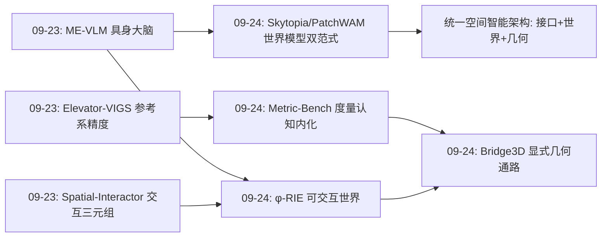
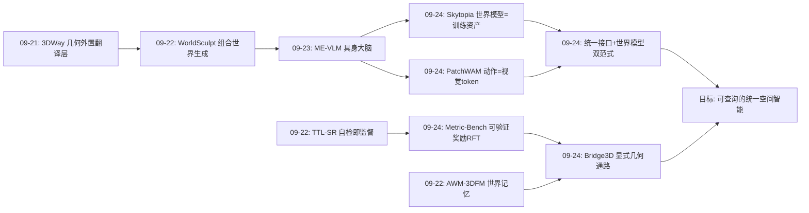
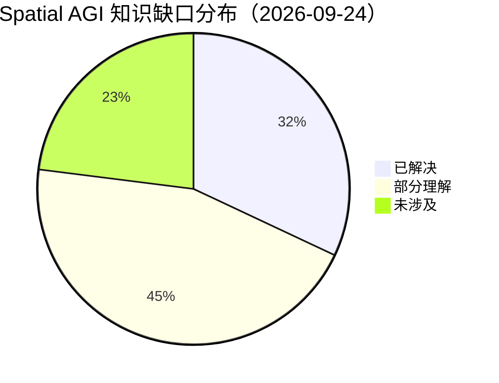

# Spatial AGI 每日深度思考 — 2026-09-24

**主题**: 接口、世界与几何注入 —— 空间智能的"架构统一日"

**论文**:
1. φ-RIE（2609.26795）— 从照片级重建到可交互环境（INSAIT / Luc Van Gool 组）
2. Skytopia（2609.26007）— 动作条件潜在世界模型的单目无人机导航（NTU / Autel）
3. PatchWAM（2609.25961）— Action-as-Patch 统一世界-动作建模
4. Metric-Bench（2609.25841）— VLM 的上下文度量空间推理基准 + MetricReasoner RFT（浙大 CAD&CG / 小米）
5. Bridge3D（2609.24525）— 让 VLA 在 3D 中"看见"与"行动"（HUST-VL）

---

## 📅 每日总结

**日期**: 2026-09-24
**论文数量**: 5篇
**主题**: 空间智能的架构统一——世界如何变成可交互的（φ-RIE）、世界模型该以什么形态存在（Skytopia 训练资产 vs PatchWAM 联合生成）、动作如何写入统一表示（PatchWAM）、几何如何注入语言模型（Metric-Bench 内化 RFT vs Bridge3D 外挂显式场）

**关键突破**:
- 🚀 **Real2Sim 的"耦合构造"范式确立**（φ-RIE）：同一物体身份同时驱动资产配准、源 Gaussian 移除、背景补全三个分支——消除"插入产生重影、擦除留下空洞"的经典失败；50 个 ScanNet++ 场景上 20mm 匹配 F1 从 0.336 提升到 0.383，背景-资产全 Gaussian 渲染、未编辑区域零改动，MuJoCo/RoboCasa 直接可跑
- 🚀 **"预测用于训练，不用于推理"范式**（Skytopia）：论证飞行中"动作解释观测变化"，用前向+逆向双目标把几何压进潜在表示后**丢弃预测器**——部署省 59.4% 推理成本，单策略覆盖 point-goal/image-goal/goal-free 三种导航（仿真 57.8%/66.0%/49.0%，真机零样本 55%/56.7%/41.7%）
- 🚀 **"接口优先于容量"**（PatchWAM）：无参数 Action-as-Patch 编解码把连续动作写成视觉 latent token，单个 4B DiT 联合 flow-matching 去噪未来帧+动作，数据受限时比双专家设计 +9.6 点，全数据 RoboTwin 96.12% / LIBERO-Plus 91.8%
- 🚀 **度量推理的两条注入路线同日对垒**：Metric-Bench 用可验证奖励 RFT 把"参照物尺度推断"内化进 VLM 权重（超闭源大模型 43.1%，通用能力不降反升 V* +15.9%）；Bridge3D 用外部 3D 语义场 + 3D RoPE + 空间交叉注意力把显式几何接进动作专家（超 π0 14 点），且线性探测定位出 diffusion 深层 #7-#11 的空间信息退化带

**架构演进**: 10层架构的统一化转折点：
- 第2层（表示）：φ-RIE 把场景表示对象化（背景场+可移动资产），PatchWAM 把动作纳入视觉 token 空间——表示的"统一接口时代"
- 第4层（世界模型）：确立两大范式分野——Skytopia 的"训练期几何监督器"与 PatchWAM 的"联合生成正则"
- 第5层（推理）：Metric-Bench 证明精确度量可以走"上下文参照+CoT+可验证奖励"的语言推理路径
- 第7层（学习）：RFT（Metric-Bench）与几何条件化（Bridge3D）分别是"改权重"与"改通路"的几何注入两极
- 第9层（行动）：从"输出动作"进化为"动作与预测共享生成过程"（PatchWAM）或"动作被度量空间约束"（Bridge3D）

### 📊 一句话总结

今天的五篇论文围绕一个核心命题展开：**空间智能的统一架构中，几何、动作与世界模型应该以什么接口进入系统**——φ-RIE 让世界变得可交互，Skytopia 与 PatchWAM 对世界模型的部署形态给出两种答案，Metric-Bench 与 Bridge3D 则演示了几何注入的"内化改权重"与"外挂接通路"两条路线。

### 🔗 延续性

**昨日→今日**: 昨日主题是"具身化"（大脑 ME-VLM、热/声感官、参考系素养、交互监督），留有三条线索：(1) 显式空间记忆与统一大脑的嫁接；(2) 多物理场表示融合；(3) 特权过程监督的推广。今日从"具身组件"推进到"架构统一"：昨日 ME-VLM 的具身大脑需要世界模型支撑——今日 Skytopia/PatchWAM 恰好回答"世界模型长什么样"；昨日 Spatial-Interactor 的交互三元组需要可交互环境——今日 φ-RIE 提供了从真实捕获批量制造交互环境的 pipeline；昨日 Elevator-VIGS 的参考系精度问题——今日 Metric-Bench 把"精确度量"变成 VLM 可训练能力。

**今日→明日**: 三条线索——(1) 统一接口的极限测试（Action-as-Patch 在高维灵巧手动作上的退化）；(2) 世界模型双范式的融合（预测既做训练监督又做联合正则，推理时按需启停）；(3) 几何注入两极的混合（用 Metric-Bench 式 RFT 内化基础度量，用 Bridge3D 式显式场兜底高精度操作）。

### 💡 本质思考：如何达成通用空间智能

#### 1. 核心能力的本质是什么？

今天五篇论文把 Spatial AGI 的能力清单从"有机体级"（昨日四能力）推进到"架构级"：

1. **世界的可干预性**（World Interveniability）：φ-RIE 证明空间智能的世界不能是被动渲染场——表示必须原生支持"拿起杯子后世界如何变化"。对象化（背景+资产）、补全（amodal 完整性）、状态一致（视觉随物理演化）是可干预性的三要素。这与 causal world model 的精神一致：不是预测视频，而是维护一个可被动作扰动的结构化状态。
2. **接口统一性**（Interface Uniformity）：PatchWAM 的核心命题——扩展智能主干的瓶颈是新信号的写入接口而非建模容量。动作、（推而广之）热、声、力，若都能无损映射为主干原生 token 格式，能力即可"继承而非新增"。这是 Spatial AGI 从"堆专家"走向"统一模型"的理论基础。
3. **几何的恰当注入层级**（Geometry Injection Hierarchy）：Bridge3D 的探测实验揭示几何信息在 diffusion 深层被动作语义挤出——空间信息需要在正确的层、以正确的形态进入。Metric-Bench 则证明对于"度量判断"这类认知任务，几何可以通过语言化的推理路径内化。注入层级：理解层可隐式、行动层需显式、认知层可语言化。
4. **部署形态的意识**（Deployment-form Awareness）：Skytopia 的"预测器只在训练期存在"提醒我们 Spatial AGI 系统必须区分"世界模型作为表征学习资产"与"世界模型作为运行时组件"——两者对算力、延迟、可解释性的要求完全不同。

#### 2. 当前方法与理想目标的差距在哪里？

- **可交互性限于刚体**：φ-RIE 只处理刚体平移旋转，铰接物体、形变、流体不在范围内；背景补全依赖局部平面假设。真实世界的交互远比"拿起放下"丰富。
- **统一接口的表达极限**：Action-as-Patch 依赖"动作维度 < token 宽度"且组平均解码可能损失信息；灵巧手 20+ 自由度、触觉阵列等高维信号能否走这条路未经验证。
- **隐式几何不可查询**：Skytopia 把深度/尺度压进 2B 骨干的隐式表示，无法回答"3 米外有什么"这类显式空间查询——离"通用空间智能"还差一层可解释的空间记忆（恰好是昨日 AWM-3DFM 的方向，嫁接尚未发生）。
- **度量推理依赖被喂的参照物**：Metric-Bench 的参照物度量是文本给定的；真正的空间智能应自己识别"标准插座离地 30cm"这类尺度锚点，从有参照到自寻参照尚未打通。
- **显式 3D 通路的系统成本**：Bridge3D 需要 RGB-D 传感器 + VGGT + Grounded-SAM + DINOv3 前处理链，部署复杂度高；且只在 4×4090 的实验规模验证。

#### 3. 从今天到理想状态，最可能的路径是什么？

1. **短期（融合现有范式）**：φ-RIE 式 Real2Sim 环境 + Skytopia 式世界模型预训练 + PatchWAM 式统一动作接口，构成"环境-表征-行动"完整数据飞轮；Metric-Bench 式 RFT 作为所有空间量的通用训练配方（尺寸→角度→面积→体积）。
2. **中期（表示融合）**：把多物理场（视觉/热/声——昨日 DTG、OmniEcho）与动作（今日 PatchWAM）统一到同一 token 接口；用 Bridge3D 的层级探测方法论找出每个模态在主干中的信息退化带，按需注入显式通路。
3. **长期（可查询的隐式几何）**：让隐式空间表示具备"被语言查询"的能力——隐式几何 + 显式空间记忆的混合架构，回答任意空间查询同时保持端到端训练效率。这是通往"能理解、能预测、能行动、能解释"的通用空间智能的最后一块拼图。

---

## 🔗 与昨日思考的联系

### 昨日重点

昨日确立空间智能体的"有机体解剖图"：ME-VLM 提供具身大脑（统一认知+智能体的宿主模型）、DTG 与 OmniEcho 补上热与声的感官、Elevator-VIGS 教会参考系素养、Spatial-Interactor 发现交互三元组的学习方式。核心结论：参考系素养、状态演化维护、多物理场覆盖、统一宿主是四大能力支柱。

### 今日进展

今日五篇从"组件"上升到"架构哲学"，恰好接住昨日留下的三个问题：

1. **世界模型长什么样？**（接昨日"大脑需要世界模型支撑"）：Skytopia 给出答案 A——世界模型是训练期几何监督器，部署时丢弃；PatchWAM 给出答案 B——世界模型与动作共享联合生成过程，永远在线但不解码像素。两者共同点：都拒绝"显式世界模型在控制回路中逐帧生成图像"的重型方案。
2. **交互三元组的学习环境从哪来？**（接昨日 Spatial-Interactor）：φ-RIE 提供工业化答案——真实捕获 → 可交互 3DGS 环境的批量转换，(O, a, O') 三元组可以在转换后的环境中以仿真精度无限生成。
3. **参考系的度量精度如何进入语言模型？**（接昨日 Elevator-VIGS 的 11% 楼层误差）：Metric-Bench 证明 VLM 可以通过参照物+可验证奖励学会精确度量——把 Elevator-VIGS 靠几何硬约束保证的度量一致性，部分转化为 VLM 的可训练认知能力。

### 演进路径



---

## 📚 论文概览

1. **φ-RIE**（INSAIT）：Gaussian-native 的 Real2Sim pipeline，以"耦合构造"（共享物体身份驱动资产配准+源移除+背景补全）把 3DGS 重建转为 MuJoCo 可交互环境，50 场景 F1@20mm 0.383，支持资产替换操作实验。
2. **Skytopia**（NTU）：94 场景 3DGS 航拍平台（3250 万帧）+ 动作条件潜在世界模型；前向+逆向双目标在训练期把几何压进 2B VLM 骨干，部署时丢弃预测器省 59.4% 推理成本，单策略三导航模式，真机零样本验证。
3. **PatchWAM**：Action-as-Patch 无参数编解码把每步动作变成一个视觉 latent token，FLUX.2 4B DiT 联合去噪未来帧与动作；数据受限 +9.6 点超双专家，RoboTwin 2.0 96.12%，主张"接口优先于容量"。
4. **Metric-Bench**（浙大/小米）：1340 题免内参度量推理基准（参照物已知尺寸→推断目标物体绝对度量，五类空间量），MetricReasoner 用 GRPO+三重可验证奖励（格式/指数精度/分箱接近）微调，超闭源大模型 43.1% 且通用能力提升。
5. **Bridge3D**（HUST-VL）：VLA 的分层 3D 增强——IF（VGGT 几何 token 残差融合进 VLM，解决"看"）+ EC（外部 3D 语义场 + 3D RoPE + 空间交叉注意力约束动作专家，解决"动"），层级线性探测定位 #7-#11 空间退化带做选择性注入；超 π0 14 点、真机超 Spatial Forcing 11.7 点。

---

## 💡 核心见解

### 见解1: 可干预性是空间表示的试金石

从 φ-RIE 获得
- ✅ 3DGS 照片级重建 ≠ 可交互环境：物体外观与背景纠缠、隐藏几何缺失、被遮挡背景未观测——"渲染得好"不保证"动得了"
- ✅ "耦合构造"用同一物体身份统一三个分支（配准/移除/补全），系统性消除不一致；构造性检查（碰撞有效、孤立 settling）比渲染损失更适合评估 3D 生成

**对Spatial AGI的启发**: 空间表示的评估标准应从"渲染质量"转向"干预质量"——拿起一个物体后，世界的变化是否物理自洽、视觉连续。这定义了 Spatial AGI 世界模型的下限要求。

### 见解2: 世界模型有两种存在形态，选择比设计更重要

从 Skytopia + PatchWAM 获得
- ✅ Skytopia：预测的价值在训练期兑现（几何进入表示），部署期丢弃预测器省 59.4% 算力
- ✅ PatchWAM：预测作为联合去噪的正则永久在线，但只在 latent 层面（不解码像素）
- ✅ 共同敌人：显式世界模型在控制回路逐帧生成图像——贵且动作不敏感

**对Spatial AGI的启发**: 世界模型架构设计的第一问不是"怎么建模"，而是"预测在系统的时间轴上出现在哪里"。Spatial AGI 的世界模型应按部署预算选形态：延迟敏感（空中）选训练资产型，精度敏感（操作）选联合正则型。

### 见解3: 接口统一优先于容量堆叠

从 PatchWAM 获得
- ✅ 无参数固定编解码把动作写入视觉 token 空间，即可复用主干全部输入/输出投影
- ✅ 数据受限时（1/20 窗口）固定接口反超双专家 +9.6 点——可训练接口在小数据下更易过拟合
- ✅ "能力不需要被添加，能被继承就不该添加"

**对Spatial AGI的启发**: 这为"一个主干理解+预测+行动"的 Spatial AGI 提供了接口设计方法论：新模态（力、触觉、热、声）接入时先问"能否无损映射为主干原生 token"，再考虑新增专家。与昨日 OmniEcho 的"嫁接双通路"相比，PatchWAM 是更激进的统一路线。

### 见解4: 几何注入需要"层级诊断"

从 Bridge3D 获得
- ✅ 线性探测发现 diffusion 动作专家 #7-#11 层空间信息急剧退化——深层以牺牲几何换取动作语义
- ✅ 只在退化带注入 EC 模块：既提升精度又保护语义一致性
- ✅ 感知侧隐式融合（IF）+ 行动侧显式条件化（EC）是"看"与"动"的差异化需求

**对Spatial AGI的启发**: "理解可隐式、行动需显式"是空间信息架构的组织原则；层级探测应成为所有 Spatial AGI 模型的标准诊断工具——先找到几何信息在哪里丢失，再决定在哪里补。

### 见解5: 精确度量可以从认知路径内化

从 Metric-Bench 获得
- ✅ 参照物 + 透视线索 + CoT 的语言化推理可以产生精确数值度量，免相机内参
- ✅ 可验证数值奖励（指数精度+分箱接近）的 GRPO 提升空间能力同时通用能力上涨——"空间专业化"不必牺牲泛化
- ✅ 现有更大闭源模型仍落后 43.1%：度量推理是 VLM 的普遍盲区

**对Spatial AGI的启发**: Spatial AGI 的训练配方库又添一件通用工具——任何可验证的空间量（角度、面积、体积、遮挡关系）都可以走"结构化 prompt + 可验证奖励 RFT"路线。这比像素级监督的副作用小得多。

### 见解6: Real2Sim 是空间智能的数据基础设施

从 φ-RIE + Skytopia 获得
- ✅ φ-RIE：真实捕获 → 可交互环境的批量转换，资产替换实验证明对策略训练有实际增益
- ✅ Skytopia：94 场景 3DGS + 刚体物理 → 3250 万帧航拍数据，真机零样本迁移成功
- ✅ 两者共同点：真实场景的保真性 + 仿真环境的可交互性/可扩展性

**对Spatial AGI的启发**: 空间智能的数据瓶颈（真机演示贵、仿真域差大）的正解是 Real2Sim 飞轮——真实给保真，仿真给规模。φ-RIE 类工具的成熟度直接决定 Spatial AGI 的进化速度。

### 见解7: 几何表示的"查询能力"是下一个战场

从 Bridge3D + Skytopia 对比获得
- ✅ Bridge3D 的显式 3D 场可被动作隐状态"查询"（空间交叉注意力），这是精度来源
- ✅ Skytopia 的隐式几何无法回答显式空间查询
- ✅ Metric-Bench 的模型靠语言推理"查询"度量，无需几何模块

**对Spatial AGI的启发**: 空间智能的完整能力 = 隐式几何（端到端效率）+ 可查询性（显式精度）。混合架构（隐式主干 + 显式记忆/场外挂）是必然形态——昨日的"大脑+外挂记忆"假说今日获得架构证据。

---

## 🗺️ 知识演进图



## 技术栈演进对比表

| 层次 | 昨日方案 | 今日方案 | 变化 |
|------|---------|---------|------|
| 感知（L1） | ME-VLM 视觉+本体 / DTG 热 / OmniEcho 声 | Bridge3D 多视角 RGB + 头部 RGB-D 点云；Skytopia 单目前向相机 | 点云/深度重新入场（操作需要度量） |
| 表示（L2） | DTG 共享高斯+多模态路由；Elevator-VIGS transport state | φ-RIE 背景场+配准资产（对象化）；PatchWAM 动作=视觉 token；Bridge3D 3D 语义点场 | 表示走向"统一接口+对象化" |
| 世界模型（L4） | Spatial-Interactor (O,a,O') 转变三元组 | Skytopia 训练期几何监督器；PatchWAM 联合 flow-matching 正则 | 世界模型部署形态问题被显式提出并给出两解 |
| 推理（L5） | Spatial-Interactor 局部转变+长程整合 | Metric-Bench 参照物 CoT 度量推理 | 从"关系判断"到"精确度量数值" |
| 大脑（L6） | ME-VLM 统一宿主（4B 端侧） | Skytopia 2B VLM 骨干；PatchWAM 4B DiT；Metric-Bench VLM+GRPO | 骨干规模趋同于 2-4B；训练目标从 SFT+RL 转向 RFT+条件化 |
| 学习（L7） | MOPD/OPD 在线策略蒸馏 | Metric-Bench GRPO 可验证奖励；Bridge3D 层级探测选择性注入 | "改权重"与"改通路"两极确立 |
| 行动（L9） | ME-VLM 具身专家输出动作 | PatchWAM 动作共享生成过程；Bridge3D 动作被度量场约束；Skytopia flow-matching 速度命令 | 动作生成从独立头走向"被预测/被几何约束" |
| 环境（新增视角） | （无） | φ-RIE 耦合构造 Real2Sim；Skytopia 3DGS+刚体物理平台 | "可交互环境"成为独立研究对象 |

## 🗺️ Spatial AGI 知识图谱

### 10层架构思维导图

```mermaid
mindmap
  root((Spatial AGI))
    第1层 感知
      Bridge3D: RGB-D点云+多视角
      Skytopia: 单目前向相机
      昨日遗产: 热/声多物理场
    第2层 表示
      φ-RIE: 背景场+可移动资产 对象化
      PatchWAM: 动作=视觉latent token
      Bridge3D: 未编码3D语义点场
      Metric-Bench: 参照物度量网络
    第3层 状态跟踪
      Elevator-VIGS: transport state 昨日
      φ-RIE: Sim(3)资产位姿 S_i(t)
    第4层 世界模型
      Skytopia: 训练期几何监督器
      PatchWAM: 联合去噪正则
      分野: 预测出现在时间轴哪里
    第5层 空间推理
      Metric-Bench: 参照物+透视 CoT
      Spatial-Interactor: 状态演化 昨日
      精确度量成为可训练能力
    第6层 大脑
      统一骨干 2B-4B
      PatchWAM: 接口统一论
      ME-VLM 具身宿主 昨日
    第7层 学习
      RFT: 可验证数值奖励 GRPO
      几何条件化: 层级探测选择注入
      Real2Sim 数据飞轮
    第8层 记忆
      隐式几何不可查询 开放问题
      显式记忆嫁接 待发生
    第9层 行动
      动作被预测约束 PatchWAM
      动作被度量场约束 Bridge3D
      无预测器部署 Skytopia
    第10层 评估
      φ-RIE: 分阶段评估协议
      Metric-Bench: 精确数值非选择题
      RoboTwin 2.0 clean+randomized
```

### 🎯 主线技术路径

#### 阶段1: 表示统一（2025-2026 现在进行时）
动作、（未来的）热、声、力逐步统一到视觉 token 接口（PatchWAM 打响第一枪）；场景表示对象化（φ-RIE 的背景+资产）。里程碑：单一 token 格式承载"看、听、动"。

#### 阶段2: 世界模型形态分化与选型（2026）
训练资产型（Skytopia，延迟敏感场景）与联合正则型（PatchWAM，精度敏感场景）并行成熟；层级探测等诊断工具标准化（Bridge3D）。里程碑：按部署预算自动选型世界模型形态。

#### 阶段3: Real2Sim 数据飞轮工业化（2026-2027）
φ-RIE 类工具从刚体扩展到铰接/形变/流体；可交互环境批量制造，交互三元组（昨日 Spatial-Interactor 的监督形式）在仿真中无限生成。里程碑：真实场景到可训练环境的转换成本低于真机采集。

#### 阶段4: 可查询的统一空间智能（2027+）
隐式几何主干 + 显式可查询记忆/场的混合架构（接昨日 AWM-3DFM 线索）；度量认知（Metric-Bench 路线）与度量行动（Bridge3D 路线）在同一模型中统一。里程碑：一个模型既能端到端行动，也能回答任意显式空间查询。

---

## 🔍 待探索议题

### 高优先级（本周）

1. **Action-as-Patch 的高维动作退化**
   - 问题: 动作维度接近 token 宽度（灵巧手 20+ DoF、触觉阵列）时，重复+零填充编码与组平均解码的信息损失如何？
   - 候选方案: 正交可学习填充、多 token 每步、频域编码
   - 缺口: 论文只在 7-DoF 双臂上验证

2. **世界模型双范式的混合形态**
   - 问题: 预测能否"训练必用、推理按需启停"？轻量预测器在部署时何时值得唤醒？
   - 候选方案: 置信度门控的预测器唤醒、蒸馏式预测器（少步）
   - 缺口: Skytopia 与 PatchWAM 无人做过交叉对比

3. **Metric-Bench 参照物的自发现**
   - 问题: 模型能否自己识别场景中的尺度锚点（插座、门、A4纸）而非被喂参照物度量？
   - 候选方案: 常见物体尺寸知识库注入 + RFT 奖励中不给参照物
   - 缺口: 基准设计仍依赖给定参照

### 中优先级（本月）

4. **φ-RIE 扩展到铰接物体**
   - 问题: 耦合构造的"共享身份"如何处理多连杆资产（门、抽屉、笔记本）？
   - 候选方案: 关节级配准 + 分支级移除掩码
   - 缺口: 候选生成器（TRELLIS/ReconViaGen）的铰接生成能力

5. **层级探测的跨架构泛化**
   - 问题: Bridge3D 的 #7-#11 退化带结论是否适用于 GR00T/OpenVLA/π0 等其他动作专家？
   - 候选方案: 对 3-5 个开源动作专家批量线性探测
   - 缺口: 论文只基于 RDT

6. **隐式几何的显式查询探针**
   - 问题: Skytopia 式隐式几何表示能否被线性探针读出深度图？（参考 Bridge3D 的探测方法论）
   - 候选方案: 对骨干各层做深度/法向预测探测，量化"几何住在哪"
   - 缺口: 论文未分析表示内容

7. **可验证奖励扩展到其他空间量**
   - 问题: 角度、面积、体积、遮挡判断的 RFT 是否同样"不伤通用能力"？
   - 候选方案: 复用 Metric-Bench 的三重奖励结构，构建对应的 ScanNet 派生基准
   - 缺口: 只有 size/position/depth/distance/bbox 五类

### 低优先级（本季度）

8. **多物理场动作的统一编码**
   - 问题: 触觉阵列、力矩序列如何走 Action-as-Patch 式接口？（接昨日 DTG/OmniEcho 的多物理场线索）
   - 候选方案: 物理场量→latent token 的固定映射设计
   - 缺口: 无高维物理信号的保持性编码研究

9. **Real2Sim 环境中的过程监督**
   - 问题: 在 φ-RIE 环境中做 Spatial-Interactor 式特权追踪，仿真精度能否消除"语言压缩状态"的误差？
   - 候选方案: 仿真状态直接生成特权过程标签（免语言化）
   - 缺口: 两个系统尚未连接

10. **统一空间模型的评估协议**
    - 问题: 如何评估一个同时"理解+预测+行动+查询"的模型？（今日五篇各自只评一角）
    - 候选方案: φ-RIE 环境 + Metric-Bench 题库 + RoboTwin 任务的联合套件
    - 缺口: 跨层能力的相关性数据不存在

---

## 📊 知识缺口分析



**已解决（32%）**:
- ✅ Real2Sim 可交互环境转换的工程化路径（φ-RIE 耦合构造）
- ✅ 世界模型两种部署形态的可行性与代价（Skytopia 59.4% 省算 / PatchWAM 联合正则）
- ✅ 连续动作写入视觉 token 空间的固定接口（Action-as-Patch）
- ✅ VLM 精确度量推理的基准与不伤通用性的训练配方（Metric-Bench RFT）
- ✅ VLA 显式几何注入的层级诊断与选择性增强（Bridge3D probing）

**部分理解（45%）**:
- ⚠️ 统一接口的适用边界（高维动作、新物理模态未验证）
- ⚠️ 世界模型双范式各自的最优适用域（无交叉对比）
- ⚠️ 隐式几何表示的内容与可查询性（无分析）
- ⚠️ Real2Sim 的物体类别覆盖（刚体 only）
- ⚠️ 度量推理的参照物依赖（自发现未解决）
- ⚠️ 几何注入层级的跨架构泛化（单架构验证）

**未涉及（23%）**:
- ❌ 铰接/形变/流体的可交互表示
- ❌ 隐式几何 + 显式记忆的混合架构实现
- ❌ 多物理场信号的统一 token 编码
- ❌ Real2Sim 环境中的过程监督闭环
- ❌ 跨层（理解/预测/行动/查询）统一评估协议
- ❌ 长时程（小时级）空间记忆与今日架构的整合

---

## 📌 今日金句

> "扩展生成主干的瓶颈在于新信号的写入接口，而非建模容量。" —— PatchWAM

> "策略需要的不是预测，而是产生预测所需的表示。" —— Skytopia

> "理解可以隐式，行动必须显式。" —— Bridge3D 的架构哲学

> "一个物体身份，既要定义可移动的资产，也要定义要移除并补全的场景。" —— φ-RIE 耦合构造

---

## 🔬 逐篇深潜：方法与空间的再审视

### 深潜1: Skytopia 的"逆向动力学防作弊"为什么有效？

前向预测的捷径是外推过去（时序相关性）；单独优化时动作 token 会被边缘化。逆向头强制"从预测的转移反推动作"，梯度穿过前向头回传到动作 token——如果动作 token 没有编码真实运动，预测的转移就无法被反解。这是一个**用可逆性约束表示内容**的设计：表示必须携带因果结构（动作→观测变化）而非仅统计结构（过去→未来）。这与变分推断中"重构路径必须通过瓶颈"同构。

### 深潜2: PatchWAM 的共享噪声水平意味着什么？

多数 WAM 给视频和动作不同 timestep/schedule（Diffusion Forcing 式）；PatchWAM 用同一 σ。这使两组 token 在去噪的每一刻处于"同一信息量水平"，互相注意时不存在信息不对称——动作可以从"同样清晰"的未来帧获取指导，反之亦然。这可能是固定接口能替代专用专家的隐藏条件：**联合生成要求模态间在每一步都"同步发育"**。

### 深潜3: φ-RIE 的对称截断距离是部分观测配准的正确损失

E(S)=d_τ(SP,Q)+d_τ(Q,SP)：单向 chamfer 会奖励"候选表面覆盖观测"而不管多余部分；双向惩罚悬空与未解释；截断 τ 防止未观测区域（必然距离大）产生无穷梯度。三重设计共同把"隐藏形状的正确性"从优化目标中剔除——只对可观测部分负责。这种**对不可知事物的诚实**是 Real2Sim 系统可靠性的关键。

### 深潜4: Bridge3D 的退化带是"几何-语义挤占效应"的证据

线性探测显示 #7-#11 隐状态还能线性读出末端坐标，之后误差骤增——diffusion 网络的深层把容量让给了动作分布建模。这与语言模型中"事实知识在中层、推理在深层"的层分工现象呼应。**空间信息不会自动存活到行动端，必须有运输机制**（3D RoPE + 交叉注意力）在它消失前接走。

### 深潜5: Metric-Bench 把"标定"变成了"上下文学习"

传统度量恢复靠相机内参或语义尺度先验；Metric-Bench 把参照物度量放进 prompt——相机标定问题被转化为 in-context reasoning 问题。奖励设计的巧思在 BP 分箱：0.25m 内给满奖励、0.25-0.5m 只给 0.05——制造陡峭的奖励悬崖，迫使模型进入"精确区间"而非在粗糙区间徘徊。

### 深潜6: 五篇论文的"接口"暗线

φ-RIE 的接口是"物体身份"（连接资产/移除/补全三支）；Skytopia 的接口是"动作 token"（连接表示学习与控制）；PatchWAM 的接口是"视觉 token 格式"（连接动作与主干）；Metric-Bench 的接口是"参照物度量"（连接 2D 观测与 3D 度量）；Bridge3D 的接口是"3D 语义点场"（连接理解与行动）。**Spatial AGI 的架构进步正在从"更强的模块"转向"更好的接口"**。

---

## 🧩 跨论文对话：三个假想实验

### 假想实验1: 让 PatchWAM 在 φ-RIE 环境里训练

φ-RIE 提供真实捕获的可交互环境（背景保真+物理正确），PatchWAM 的联合去噪可以在其中获得 (观测, 动作, 未来帧) 三元组——未来帧由仿真精确给出而非真机录制。预期解决 PatchWAM 真机数据贵的问题，同时 φ-RIE 的资产替换能力提供天然的数据增广（同一场景不同物体组合）。

### 假想实验2: 给 Skytopia 加 Metric-Bench 的 RFT

Skytopia 的隐式几何"不可查询"；若在骨干上用 Metric-Bench 式可验证奖励微调（给定图像+参照物→回答度量问题），可以强迫隐式几何表示变得语言可读——一步逼近"可查询的隐式几何"。风险：RFT 可能破坏动作 token 的几何编码（Bridge3D 已证明深层干预有代价），需要层级探测护航。

### 假想实验3: 用 Bridge3D 的探测诊断所有空间模型

对 ME-VLM（昨日大脑）、Skytopia、PatchWAM 全部做层级线性探测（末端坐标/深度/物体尺寸），绘制"空间信息在各自主干中的存亡图"。若发现普遍的深层退化带，则"空间信息运输机制"应成为 Spatial AGI 架构的标准组件——这将是比任何单点 SOTA 更基础的发现。

---

## 📐 方法论沉淀：今天学到的可复用配方

1. **耦合构造**（φ-RIE）：多个必须一致的子任务 → 用共享证据/身份绑定，而非各自独立后处理。适用于任何"编辑一致性"问题。
2. **逆向可解性约束**（Skytopia）：担心表示忽略某信号 X → 加一个"从表示反解 X"的辅助头。比加权损失更根本。
3. **固定接口优先**（PatchWAM）：接入新模态 → 先尝试无参数映射到主干原生格式；数据越少，固定接口优势越大。
4. **可验证奖励三件套**（Metric-Bench）：格式奖励（结构合规）+ 连续精度奖励（指数衰减）+ 分箱接近奖励（制造悬崖）。适用于一切可数值验证的目标。
5. **层级探测定位注入**（Bridge3D）：冻结主干 + 每层线性探针读出目标信息 → 找退化带 → 只在带内注入模块。
6. **分阶段评估协议**（φ-RIE）：把端到端系统拆成构造可用性/保真性/物理有效性/任务效用分别测量，避免指标混淆。

---

**文档创建时间**: 2026-09-24
**论文来源**: arXiv 2026-09-21 ~ 09-22 提交
**分析方法**: arXiv HTML 精读 + 跨论文综合分析
