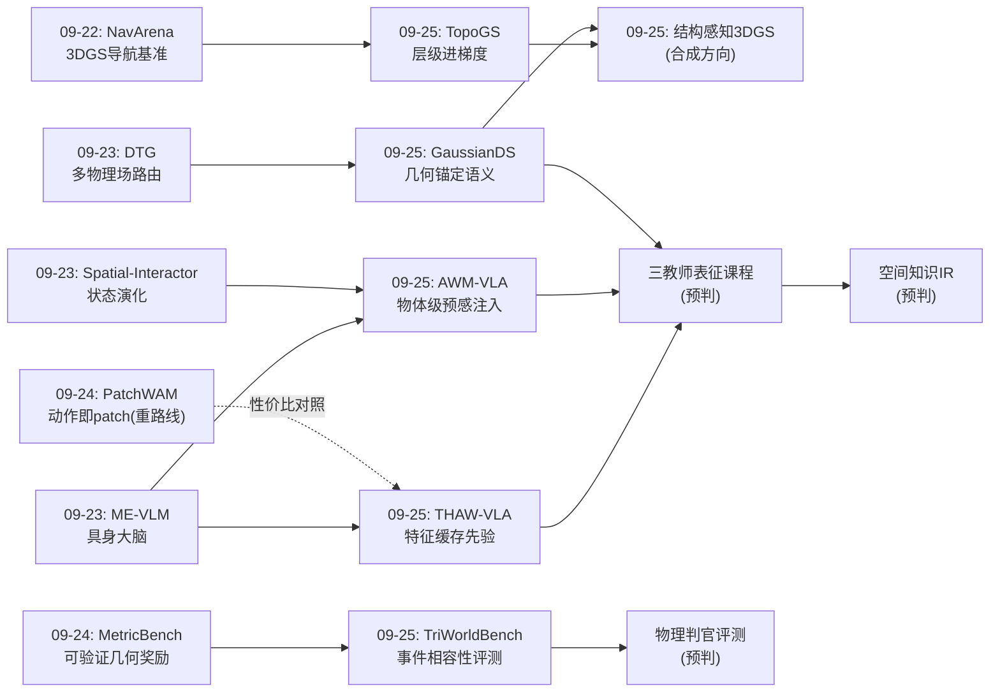
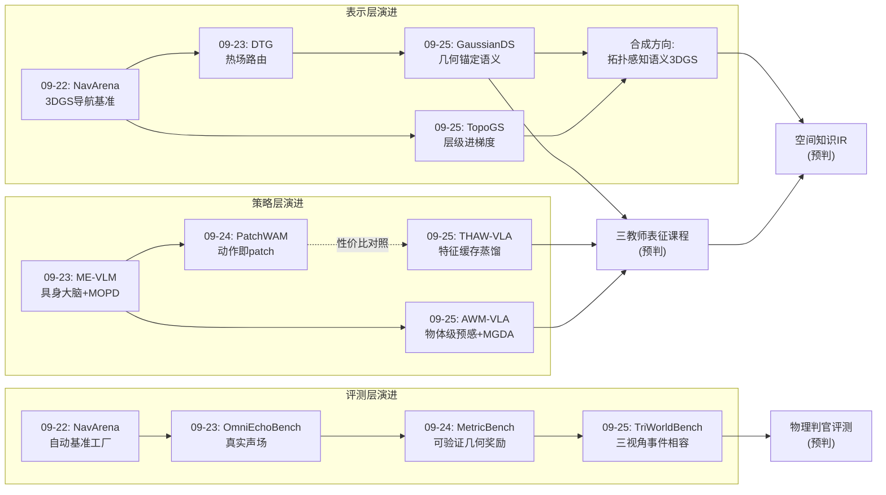
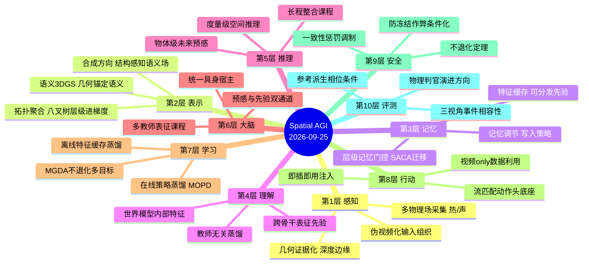
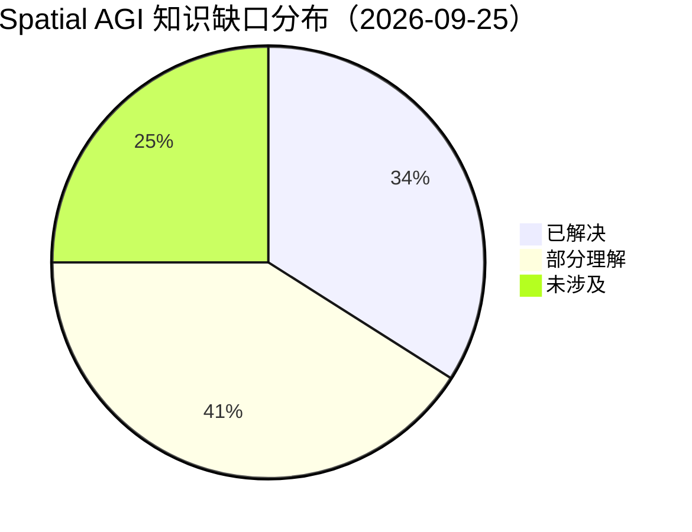

# Spatial AGI 每日深度思考 — 2026-09-25

**主题**: 知识的形态与流向 —— 空间智能的"经济学日"（表示-策略-评测三层合流）

**论文**:
1. GaussianDS（2609.27850，浙江大学）— 深度监督语义 3DGS，语义锚定于几何
2. AWM-VLA（2609.27753，电子科技大学）— 物体级未来预测内嵌 VLA，MGDA 不退化
3. THAW-VLA（2609.24682，UW-Madison + UIUC）— 世界模型特征缓存蒸馏，零部署成本
4. TopoGS（2609.27868，西北工业大学 + IGN）— 拓扑感知锚点聚合，层级进梯度
5. TriWorldBench（2609.26314，北大/清华/北航/上交/中科大/上海AI Lab）— 三视角事件相容性评测

> 注：按完成度检查，昨日（09-24）思考未达标（432 行），本次思考以最近完整基准日 09-23 的思
> 想体系为主线，同时纳入 09-24 五篇论文（PhiRIE/Skytopia/PatchWAM/MetricBench/Bridge3D）作
> 为中间衔接层。

---

## 📅 每日总结

**日期**: 2026-09-25
**论文数量**: 5篇
**主题**: 空间知识的"经济学"——知识以什么形态存在（语义场/特征缓存/物体级预感）、如何流动
（蒸馏/对齐/聚合）、如何被验货（多视角相容性）。今天五篇论文罕见地横跨表示层、策略层、评测
层，拼出了空间智能的完整价值链。

**关键突破**:
- 🚀 **几何可以仲裁语义**（GaussianDS）：把语义 3DGS 的失败归因于"监督对齐缺陷"而非特征
  容量——用 SAM2 伪视频传播解决输入一致性、用闭式 scale-shift 深度对齐解决教师系统偏差、
  用深度边缘感知精炼把语义边界锚定在物理几何上。LERF 60.5% mIoU、3D-OVS 97.79% mIoU /
  90.28% mBIoU，边界质量逼近分割上限
- 🚀 **预感与先验可以按需购买**（AWM-VLA + THAW-VLA）：同一"表征对齐"家族的两端——
  AWM-VLA 用几个 future tokens 对齐未来观测嵌入（+21% 成功率、83% 人类解释偏好、<2% 开销
  ），并用 MGDA 给出"加世界模型不伤动作"的一阶定理；THAW-VLA 把世界模型价值压缩为离线特
  征缓存（余弦对齐，λ=0.5 处处固定），0.8B 学生打 4B 模型，RTX 5090 上 32ms/1.86GB，且增
  益跨规模/骨干/层/教师四维存活
- 🚀 **层级结构只有在梯度里才是表示**（TopoGS）：诊断出八叉树 3DGS 各层特征冗余（跨层余弦
  0.866），HAC 上下文三元组 + SACA 包含关系软聚合让层级参与特征学习——相似度降至 0.108，
  10 个大规模场景质量效率双提升（最高 +4.84 dB 且更快更省内存）
- 🚀 **评测进入"事件相容性"时代**（TriWorldBench）：多流世界模型必须以同步三元组为单位评
  估——19 指标 × 6 维度（TWB-Score），参考派生相位条件化堵住"冻结作弊"，惩罚调制抑制"
  好看但不对"，500 episodes 全开源

**架构演进**: 10 层架构三处深化：
- 第 2 层（表示）：语义化（GaussianDS）与拓扑化（TopoGS）两轴同日推进，且共同指向"结构
  感知 3DGS"的合成方向
- 第 5/6 层（推理/大脑）：VLA 的世界知识注入形成"当前帧先验（THAW）⊕ 未来预感（AWM-VLA）"
  的双通道标准配方
- 第 10 层（评测）：TriWorldBench 确立多视角事件相容性为新评测范式，世界模型从"演示技术"
  进入"工程组件"阶段

### 📊 一句话总结

今天的五篇论文回答了同一个问题的三个侧面：空间知识以什么形态存在（GaussianDS 的语义场、
THAW-VLA 的特征缓存、AWM-VLA 的物体级预感）、如何在系统间流动（蒸馏与对齐）、以及如何被
验证（多视角相容性）——空间智能正在从"造更大的模型"转向"设计知识的形态与流向"。

### 🔗 延续性

**基准日（09-23）→ 今日**: 09-23 具身化日确立了"大脑-感官-记忆"三层堆叠雏形（ME-VLM 大脑
+ 热/声感官 + AWM-3DFM 记忆），并预判了"多场统一期"的到来。今日的五篇正是这个预判的工程化
落地：大脑层获得世界知识注入的标准配方（AWM-VLA/THAW-VLA），表示层的语义与拓扑补全（
GaussianDS/TopoGS），评测层为整个堆叠装上验货标尺（TriWorldBench）。09-24 的中间层贡献了
交互环境（PhiRIE）、动作统一（PatchWAM）与 3D 接地（Bridge3D），为今日的策略层论文提供了
直接语境——AWM-VLA/THAW-VLA 都引用了 Pi0/GR00T 系的流匹配底座，正是 PatchWAM/Bridge3D 所
在的技术脉络。

**今日→明日**: 三条线索——(1) "拓扑感知语义 3DGS"：GaussianDS 的深度边缘语义锚定 ×
TopoGS 的包含关系聚合，在同一表示里统一语义与拓扑；(2) "三教师表征课程"：当前帧世界模型特
征（THAW）⊕ 未来观测嵌入（AWM-VLA）⊕ 3D 语义场查询特征（GaussianDS）的加权组合，用 MGDA
保不退化；(3) "物理判官替代 VLM 判官"：TriWorldBench 的接触/几何校验交给仿真器，VLM 只管
语义层。

### 💡 本质思考：如何达成通用空间智能

#### 1. 核心能力的本质是什么？

今天五篇论文把 09-23 的"有机体级"能力清单（参考系素养、状态演化维护、多物理场覆盖、统一
宿主）推进到"经济学级"：

1. **空间知识的多形态性**（Knowledge Poly-morphism）：同一份空间知识可以以语义场形态存在
  （可查询、可渲染、可编辑——GaussianDS），以特征缓存形态存在（可分发、可复用、零成本继承
  ——THAW-VLA），以物体级预感形态存在（内生、可解释、直接指导行动——AWM-VLA）。通用空间
  智能不要求"一个模型装下所有知识"，而要求知识能在这些形态间无损转换。
2. **监督对齐是知识传输的核心难题**（Supervision Alignment as the Bottleneck）：GaussianDS
  诊断的语义漂移（多视角 2D 教师冲突）、THAW-VLA 解决的教师-学生特征空间不兼容、AWM-VLA
  平衡的多目标竞争——本质都是同一个问题：如何把知识从源（教师/多视角/多目标）无损地传输到
  宿（3D 场/学生策略）。三者给出的答案是同构的：**对齐 + 门控 + 不退化保证**。
3. **结构先验必须进入学习通路**（Structure Into Gradients）：TopoGS 的核心发现——给模型
  层级结构不等于模型会层级地思考，没有梯度通路的结构只是目录。这推广到空间智能的一切分层
  结构：记忆树、规划树、地图金字塔。
4. **空间真相是多视角证据的相容性**（Spatial Truth as Multi-View Compatibility）：
  TriWorldBench 的哲学立场——空间事件不存在于任何单一观测中，只存在于多观测的相容结构中。
  这与 09-23 的"参考系素养"（每个感官有自己的坐标系）形成呼应：多参考系是空间感知的输入侧
  真相，多视角相容是空间预测的输出侧真相。

#### 2. 当前方法与理想目标的差距在哪里？

- **语义场的静态性与非符号性**：GaussianDS 的语义是特征场而非符号实例——LLM 无法直接推理
  一个特征场。场→实例→符号的提取层缺失，开放词汇查询的下游智能上限受制于此。且静态假设排
  除了真实家庭环境的动态物体。
- **先验继承的"看而不预"**：THAW-VLA 对齐的是当前帧特征——继承的是含因果印记的感知表征，
  而非预测能力（更准确说是 "See Like a World Model"）。预感能力要靠 AWM-VLA 的未来目标补
  足，两者尚未合体；且两者的对齐目标都是 2D 嵌入，3D 一致的先验继承不存在。
- **物体级预测的天花板**：AWM-VLA 的物体级粒度对流体、绳结、颗粒物质失效；物体嵌入集的获
  取依赖分割/跟踪质量，遮挡后的身份切换未解决；预测时域是动作块级（短程），长程规划仍需外
  层系统。
- **拓扑先验的静态假设**：TopoGS 全部基准是静态城市场景，动态物体、时变 LOD、增量更新（新
  楼/拆楼）空白；孤立锚点降权会系统性伤害真实的悬浮物（鸟、无人机）。
- **VLM 判官的递归困境**：TriWorldBench 的跨视角判定依赖 VLM，而 VLM 自身的空间推理缺陷
  （本周 MetricBench、Spatial-Interactor 反复证明）会成为基准的天花板；被评模型与判官同源
  时还有循环风险。
- **知识形态间无转换协议**：语义场→特征缓存→物体级预感三种形态各自独立产生，没有标准转
  换接口——空间知识的"汇率体系"尚未建立。

#### 3. 从今天到理想状态，最可能的路径是什么？

1. **结构感知表示期**（近期）：GaussianDS × TopoGS 合成为"拓扑感知语义 3DGS"——语义特征
  按八叉树包含关系聚合，物体级语义一致性天然对应子树结构；叠加 09-23 DTG 的多物理场路由，
  走向"结构化多物理场语义数据库"。
2. **多教师表征课程期**（近期）：THAW（当前帧看）⊕ AWM-VLA（未来预感）⊕ GaussianDS（3D
  一致）三教师缓存化组合，MGDA 求公共下降方向；特征缓存成为可分发的"空间先验商品"，世界
  模型厂商发布缓存、下游按需蒸馏——空间知识的生产与消费分离。
3. **物理判官评测期**（中期）：TriWorldBench 的 VLM 判定逐步被仿真器物理校验（接触力/碰撞
  /深度真值）替代，VLM 只管语义层；评测从"判官打分"进化为"物理对账"，过拟合基准的空间被
  压缩。
4. **知识转换协议期**（中期）：语义场⇄特征缓存⇄物体级预感之间建立标准转换接口（类似编译器
  的 IR）——空间知识的中间表示（Spatial IR）出现，任何源形态可编译到任何目标形态。
5. **空间智能操作系统期**（远期）：09-23 预判的"大脑-感官-记忆"三层堆叠在知识经济学框架
  下完成闭环——大脑（ME-VLM 类）通过标准接口消费语义场（感知）、读写空间记忆（状态）、
  生成物体级预感（规划），其所有知识流动都被物理对账式评测监管。

---

## 🔗 与昨日思考的联系

### 基准日（09-23）重点

09-23 具身化日确立了四项有机体级能力：参考系素养（Elevator-VIGS 的 transport state）、状
态演化维护（Spatial-Interactor 的交互三元组）、多物理场覆盖（DTG 热场 + OmniEcho 声场）、
统一宿主（ME-VLM 具身大脑）。并预判了"感官增强期→多场统一期→大脑-感官-记忆整合期→过程
监督普及期"的路径。

### 09-24 衔接层（思考未达标，论文已读）

PhiRIE（被动重建→交互环境）、Skytopia（单目无人机动作条件潜世界模型）、PatchWAM（动作即
patch 的统一世界动作模型）、MetricBench（VLM 度量级空间推理 RFT）、Bridge3D（VLA 的 3D 看
与动）。这一层完成了"从环境到策略"的桥接：PatchWAM 把动作塞进世界模型（世界模型变重），
Bridge3D 把 3D 塞进 VLA（感知接地），PhiRIE 把重建变成可交互环境（表示变活）。

### 今日进展

今天的五篇与这条主线严丝合缝：

1. **"世界模型入策略"的经济学反转**：09-24 PatchWAM 走的是"把动作统一进世界模型"的重路
   线（模型变大）；今日 THAW-VLA 反向操作——把世界模型压缩成特征缓存（模型变小变轻），
   AWM-VLA 折中——几个 token 的预感。三条路线（重统一/轻注入/缓存继承）在同一周内出现，
   说明"世界模型与策略的关系"已从架构问题变成预算问题，性价比光谱被完整铺开。
2. **3DGS 的补全竞赛继续**：09-23 Dynamic Thermal Gaussians 补热场、Elevator-VIGS 补惯性
   参考系；今日 GaussianDS 补语义（几何锚定）、TopoGS 补拓扑（层级进梯度）。四天四个正交
   轴，3DGS 作为空间底座的"属性填空"接近完成，剩下的空白（触觉、材质、流场）已可预见。
3. **VLA 知识注入的配方标准化**：09-24 Bridge3D 用 3D 语义场 + 空间交叉注意力给 VLA 接地
   （架构级改造）；今日两篇用表征对齐（损失级注入）达到类似目标且零架构改动。注入方式从
   "改架构"到"加损失"的迁移，与 09-23 ME-VLM 的"能力注入 SFT"共同指向：空间能力正变成
   可以"后训练安装"的软件包。
4. **评测的正确性压力**：09-23 评估真实性阶梯（OmniEchoBench 真实声场）、09-24 MetricBench
   的可验证奖励；今日 TriWorldBench 把"多视角相容性"和"相位条件化"加入评测军火库——评测
   基础设施在连续四天里每天进化一层，这是空间智能进入工程化阶段的最强信号。
5. **几何仲裁思想的确立**：09-22 TTL-SR 用几何公理自检、09-24 MetricBench 用几何度量做可
   验证奖励、今日 GaussianDS 用深度不连续仲裁语义冲突——"几何是空间智能的客观裁判"在三
   个不同层面（自检/奖励/监督门控）反复得到验证，可正式列入设计原则。

### 演进路径



---

## 📚 论文概览

1. **GaussianDS**（浙大）：语义 3DGS 的失败归因于监督对齐缺陷。三件武器：姿态感知伪视频
  （无序多视角排序后用 SAM2 传播一致掩码）+ 闭式 scale-shift 深度对齐与 TV 正则（几何稳定）
  + 深度边缘感知语义精炼（语义边界锚定物理不连续）。从头端到端联合优化外观/深度/语义。
  LERF 60.5% mIoU，3D-OVS 97.79% mIoU / 90.28% mBIoU，支持实时渲染与物体移除。**关键词：
  监督对齐、几何仲裁、伪视频化。**

2. **AWM-VLA**（电子科大）：FLARE 式未来潜码对齐的物体级升级。future tokens 中间激活对齐
  全局未来嵌入 + 解码为 K 个物体级未来嵌入逐一对齐；L_fm/L_align/L_obj 用 MGDA 求公共下
  降方向（不退化定理 3.1）。RoboCasa + 人形成功率 +21%，物体级 rationale 人类偏好 83%，
  开销 <2%，兼容任何扩散/流匹配策略，支持视频-only 数据。**关键词：预感的正确粒度、不退
  化多目标、内生可解释。**

3. **THAW-VLA**（UW-Madison/UIUC）：世界模型接地价值的"赊账继承"。冻结 Cosmos3-Nano 离线
  提取特征缓存，学生（0.8B QwenGR00T）仅加一个余弦对齐项（λ=0.5），部署图与基线完全一致。
  LIBERO 97.9%、RoboCasa-GR1 50.5%（近 4B）、真机单臂 28/30 匹配 4B（1/5 参数），32ms/
  1.86GB；增益跨学生规模/骨干/对齐层/教师四维存活。**关键词：接地与生成分离、知识形态转
  换、先验商品化。**

4. **TopoGS**（西工大+IGN）：八叉树 3DGS 的层级只在空间组织不在特征学习。诊断跨层特征冗余
  （余弦 0.866）与非对称重组现象；HAC 层级上下文三元组+共享残差 MLP 建立双向梯度通路，
  SACA 哈希包含查询（O(N logN)）+ 软加权区分结构相关与孤立锚点。10 场景 5 基准一致提升
  （+2.13/+1.78/+0.29 dB）且更快更省内存，跨骨干（CityGS-X/Octree-GS/Proxy-GS）可迁移。
  **关键词：层级进梯度、非对称信息流、结构先验消除冗余。**

5. **TriWorldBench**（北大等六机构）：多流世界模型以同步头/腕/腕三元组为评测单元。19 指标
  ×6 维度（一致性/任务/物理3D/运动/时序/视觉）→ TWB-Score；参考派生相位条件化惩罚冻结作
  弊；视觉分数被任务/一致性惩罚调制；三个 VLM rubric 显式区分对不确定证据的姿态。500
  episodes/50 双臂任务全开源。**关键词：事件相容性、防冻结作弊、评测基础设施。**

---

## 💡 核心见解

### 见解1: 监督对齐是空间知识传输的统一瓶颈（GaussianDS）

- ✅ 语义 3DGS 的语义漂移与边界泄漏源于"监督对齐缺陷"：视角相关的 2D 教师预测通过共享基
  元反传时梯度冲突，与特征容量无关
- ✅ 三层解法可复用：输入侧组织（伪视频传播使教师自洽）+ 优化侧对齐（闭式 scale-shift 消
  除系统偏差）+ 锚定侧门控（深度边缘门控监督有效性）

**对Spatial AGI的启发**: 任何"多源噪声教师 → 统一空间表示"的训练管线（多传感器、多标注
源、多仿真器）都会遇到同样的对齐问题。"先对齐、再组织、最后门控"应成为空间智能数据流水
线的标准检查项。更深的推论：外观监督稳定而语义监督脆弱，因为颜色误差连续且受物理成像支配
——**空间智能应尽量把离散问题连续化**（软标签、相容性打分、密度化目标），才能复用物理世
界赠送的连续性红利。

### 见解2: 预感的粒度决定世界模型的性价比（AWM-VLA）

- ✅ 全局未来嵌入太粗（"场景会变"），像素太细（任务无关纹理），物体级刚好——同时服务正
  确性（+21%）与可解释性（83% 人类偏好）
- ✅ 物体级预测是"内生 rationale"而非事后归因：每个 future token 负责一个物体，预测即解
  释

**对Spatial AGI的启发**: 可解释性与性能在正确的抽象粒度上是共生的而非折中的——这修正了
"可解释性必须付出性能代价"的流行直觉。对空间智能体的人机共处（家庭、工厂）而言，"会说清
自己要动什么"是信任的必要条件；83% 这个数字说明该能力已接近产品化阈值。进一步：物体级可
能仍不是终点，关系级（"杯子会到盘子左边"）与事件级（"水会倒出来"）的预感 token 是自然
的下一步，每个粒度对应一类空间智能任务。

### 见解3: 空间接地可以离线编译、运行时免费携带（THAW-VLA）

- ✅ 世界模型的价值在内部特征而非生成能力——"生成未来只是产出特征的目标函数"
- ✅ 离线缓存 + 余弦对齐 + 丢弃投影头 = 训练成本等于基线、部署架构等于基线；0.8B≈4B

**对Spatial AGI的启发**: 这是空间知识的"编译器思维"——昂贵的空间理解（世界模型前向）在
训练期一次性完成并"编译"进学生权重，运行时只携带结果。两个工程推论：(1) 特征缓存可以成为
"空间先验商品"，由最强世界模型厂商发布、下游零 GPU 成本蒸馏，一份缓存服务多个学生；(2)
增益跨教师家族（Cosmos3/Fast-WAM/V-JEPA2）存活说明存在"物理接地的公共表征结构"——空间智
能的表征空间有客观的正确方向，这是对整个研究方向的形而上鼓舞。

### 见解4: 层级结构只有在梯度里流动才是表示（TopoGS）

- ✅ 孤立优化的八叉树各层特征退化为冗余副本（跨层余弦 0.866）——结构不进学习通路就只是
  目录
- ✅ 尊重拓扑的特征聚合同时提升质量与效率（+4.84 dB 且更快更省内存）——结构先验消除的是
  冗余，冗余消除即效率

**对Spatial AGI的启发**: 这条原则应写入空间智能系统设计的默认检查清单：记忆树、规划层次、
地图金字塔、多分辨率世界模型——任何分层结构若只在检索/规划时使用而不参与表征学习，都会患
同样的"层次冗余病"。TopoGS 的药方是通用的：结构化上下文（三元组）+ 结构化门控（包含加权
）。非对称信息流（细节层需要全局上下文、全局层只要选择性确认）对多尺度系统是普适设计。

### 见解5: 空间预测的评测单位是事件而非视频（TriWorldBench）

- ✅ 多流世界模型的三个输出各自合理仍可能联合矛盾（头视角物体移动、腕视角夹爪未闭合）——
  单视角质量无法确立共享状态
- ✅ 相位条件化堵住"冻结作弊"：时序一致性必须相对"此刻应发生什么"评估，否则冻住场景是退
  化最优解

**对Spatial AGI的启发**: "所有视角是否与同一事件相容"是空间理解的操作化定义——空间真相
不存在于单一观测中，只存在于多观测的相容结构中。任何评估空间系统的指标都应自查两件事：它
的多源证据是否被联合校验？它的退化最优解（作弊策略）是什么？评测基础设施与模型本身同等重
要——Goodhart 定律可以被建设性地使用：把正确的度量装到正确的位置，进化方向就被设定了。

### 见解6: "世界模型入策略"从架构问题变成预算问题（三篇对照）

- ✅ 重路线（09-24 PatchWAM：动作即 patch 统一进 WAM）、轻路线（AWM-VLA：几个 token 的预
  感）、缓存路线（THAW-VLA：世界模型压缩为特征缓存）在同两周内出现
- ✅ 三条路线的取舍维度完全不同：PatchWAM 买"统一性"、AWM-VLA 买"预感+可解释"、THAW 买
  "接地的便宜"

**对Spatial AGI的启发**: 空间知识的注入方式已经多样化到可以按预算选购：改架构（Bridge3D
的空间交叉注意力）、加损失（表征对齐家族）、改数据（视频-only 对齐）、改缓存（离线先验）。
空间智能工程化的标志不是某个 SOTA，而是**选择空间的打开**——如同数据库领域从"单一神机"
进入"按负载选引擎"的时代。

### 见解7: 几何是空间智能的通用仲裁者（三日贯通）

- ✅ 09-22 TTL-SR：几何公理做自检触发器；09-24 MetricBench：几何度量做可验证奖励；今日
  GaussianDS：深度不连续做语义监督的门控
- ✅ 三个层面（自检/奖励/监督）同构：当多模态信号冲突时，物理几何是最客观的仲裁者

**对Spatial AGI的启发**: "让物理几何当裁判"适用于空间智能的每一条数据流水线。语言与视觉
的监督都有视角性与幻觉风险，唯有几何（深度连续性、透视一致性、刚体约束）受物理定律直接支
配。设计推论：空间智能系统的每个多模态融合点都应显式声明"冲突时谁说了算"，而答案几乎总应
该是几何。

---

## 🗺️ 知识演进图



---

## 技术栈演进对比表

| 层次 | 基准日方案(09-23) | 中间层(09-24) | 今日方案(09-25) | 变化 |
|------|------------------|---------------|-----------------|------|
| 第1层 感知 | 热+声多物理场开启(DTG/OmniEcho) | PhiRIE 交互化环境 | 深度边缘作为语义证据(GaussianDS) | 感知从"多场采集"到"几何证据化" |
| 第2层 表示 | 参考系维度+结构角色维度 | 交互环境表示 | 语义锚定(GaussianDS)+拓扑聚合(TopoGS) | 表示的语义/拓扑两轴同日补全 |
| 第3层 记忆 | AWM-3DFM 记忆调节 | — | 特征缓存作为可分发记忆(THAW-VLA) | 记忆形态扩展到"先验缓存" |
| 第4层 理解 | 具身大脑宿主(ME-VLM) | Bridge3D 3D接地架构 | 当前帧世界模型先验(THAW-VLA) | 理解从架构改造到损失级注入 |
| 第5层 推理 | 局部转变+长程整合 | MetricBench 度量推理 | 物体级未来预感(AWM-VLA) | 推理获得显式预测目标 |
| 第6层 大脑 | 统一宿主确立 | PatchWAM 统一动作接口 | 预感⊕先验双通道配方 | 大脑的知识供给标准化 |
| 第7层 学习 | 在线策略蒸馏(MOPD/OPD) | — | 离线特征蒸馏(THAW)+MGDA多目标(AWM) | 蒸馏家族成型：在线/离线/多目标 |
| 第8层 行动 | 几何路径点接口(3DWay余脉) | 动作即patch | 流匹配底座+对齐注入(零架构改动) | 行动层成为"即插即用底座" |
| 第9层 安全 | — | — | 不退化定理(MGDA)+一致性惩罚(TWB) | 安全从经验走向定理与协议 |
| 第10层 评测 | 真实声场导航评测 | 可验证几何奖励 | 三视角事件相容+相位条件化 | 评测进入"事件级多源校验"时代 |

---

## 🗺️ Spatial AGI 知识图谱

### 10层架构思维导图



### 🎯 主线技术路径

#### 阶段1: 视觉空间智能（2024–2025，已完成）

NeRF→3DGS 表示革命、VLA 范式确立、单视角空间推理基准。空间智能证明了"看懂空间"可行。

#### 阶段2: 动态、系统化与多场感官（2025–2026 中，已完成）

动态 4D 表示、记忆管理第一性、热/声/惯性物理场接入、交互学习范式。空间智能证明了"感知全
域空间"可行。

#### 阶段3: 知识经济学（2026，当前所在）

本周集中爆发：知识的形态多样化（语义场/特征缓存/物体级预感——今日）、注入方式多样化（架
构/损失/数据/缓存——本周）、评测基础设施成熟（事件相容性——今日）。空间智能证明了"知识
可以生产、分发、验货"。

#### 阶段4: 结构感知统一表示与三教师课程（2026 下–2027，预判）

拓扑感知语义 3DGS（GaussianDS×TopoGS×DTG 合流）、多教师缓存化表征课程（THAW⊕AWM-VLA⊕
3D 场）、物理判官评测（TriWorldBench 演进）。空间智能将完成"表示-策略-评测"的第一次全栈
闭环。

#### 阶段5: 空间智能操作系统（2027+，远期）

大脑-感官-记忆-预感的标准接口（空间知识 IR）、空间先验市场、物理对账式监管。空间智能成为
机器人/AR/驾驶的"操作系统层"，如同 Android 之于手机。

---

## 🔍 待探索议题

### 高优先级（本周）

1. **拓扑感知语义 3DGS**
   - 问题: GaussianDS 的语义锚定与 TopoGS 的包含聚合能否在同一表示统一？
   - 候选方案: 语义特征按八叉树子树聚合（物体级语义一致性=子树内一致），深度边缘门控保留
     在基元级
   - 缺口: 语义跨层传播的损失设计；语义与 LOD 的交互（粗层的语义应是什么粒度）

2. **三教师表征课程**
   - 问题: 当前帧先验（THAW）+未来预感（AWM-VLA）+3D 场接地（GaussianDS 查询特征）能否组
     合注入单一 VLA？
   - 候选方案: 全部缓存化 + MGDA 三目标公共下降；先验课程化（早期重当前帧、后期重未来）
   - 缺口: 三缓存的对齐空间不兼容（不同教师不同嵌入空间）；MGDA 在三目标下的权重演化诊断

3. **"看而不预"的量化诊断**
   - 问题: THAW-VLA 继承的表征到底含多少预测能力？
   - 候选方案: 在 TriWorldBench 的 State Alignment/Flow Score 上评测蒸馏学生——预感缺失
     应在相位条件化指标上露馅
   - 缺口: 需要把两篇论文的系统拉到同一基准；蒸馏配方与未来对齐的可控消融

### 中优先级（本月）

4. **物理判官替代 VLM 判官**
   - 问题: TriWorldBench 的 VLM 一致性判定如何被仿真器物理校验替代？
   - 候选方案: RoboTwin 仿真器直接输出接触力/接触点/深度真值 → 硬校验抓取与遮挡；VLM 只
     判物体身份与手臂角色
   - 缺口: 物理真值与生成视频的对齐（生成视频没有真值物理状态，需可微物理估计或反渲染）

5. **动态八叉树与 4D 拓扑**
   - 问题: TopoGS 的静态八叉树如何支持时变场景与增量城市更新？
   - 候选方案: 时间维粗层+空间细层的 4D 层级；HAC 三元组扩展为时空五元组
   - 缺口: 局部重建的拓扑一致性维护协议；动态物体的层级归属（车在路面之上但在楼之外）

6. **孤立锚点悖论的解决**
   - 问题: SACA 降权拓扑孤立锚点会伤害真实悬浮物（鸟/无人机/悬浮灰尘）
   - 候选方案: 孤立性×时间持久性双因子——持久孤立（真实悬浮物）保留，瞬态孤立（噪声）降
     权
   - 缺口: 持久性估计在单次扫描中不可得，需跨视角/跨时间的锚点跟踪

7. **物体级预感的超越：关系与事件 token**
   - 问题: AWM-VLA 的物体粒度对关系变化（左/上/包含）与事件后果（倒/断/溢）是否够用？
   - 候选方案: 关系 token（物体对）+ 事件 token（时序相容性核验），与 TriWorldBench 的
     VQA 问题库对齐训练
   - 缺口: 关系/事件的开放词汇教师嵌入从哪来；token 数量随粒度细化膨胀

### 低优先级（本季度）

8. **特征缓存的许可与版本生态**
   - 问题: 世界模型厂商发布的特征缓存如何版本化、许可化、防止下游过拟合特定缓存？
   - 候选方案: 缓存哈希 + 多缓存混合训练（类似 dropout 缓存）；缓存蒸馏的泛化性基准
   - 缺口: 无先例；需要"缓存兼容性"标准（嵌入空间协议）

9. **语义场⇄特征缓存⇄预感的转换协议（空间知识 IR）**
   - 问题: 三种知识形态间无标准转换接口，每次转换都是一次性工程
   - 候选方案: 定义空间知识中间表示（多分辨率语义锚点图？），各形态实现到 IR 的编译器
   - 缺口: IR 的信息损耗度量；转换的可逆性边界

10. **视频-only 世界模型预训练的规模化验证**
    - 问题: AWM-VLA/THAW-VLA 都支持无动作标签数据，人类自我中心视频的规模化收益上限？
    - 候选方案: Ego4D 级数据上的对齐预训练 → 少量真机数据微调的完整管线验证
    - 缺口: 人类手部动力学与机器人末端执行器的域差距对对齐目标的影响

---

## 📊 知识缺口分析



**已解决（34%）**:
- ✅ 语义 3DGS 的监督对齐问题有了完整解法（输入组织+优化对齐+几何门控）
- ✅ 世界模型知识注入的三条性价比路线（重统一/轻预感/缓存继承）全部打通
- ✅ 小模型继承大模型空间先验的可行性（0.8B≈4B）及鲁棒性（四维消融存活）
- ✅ 层级结构的特征学习化（层级进梯度+拓扑门控）及其质量效率双收益
- ✅ 多流世界模型评测的正确单位（事件相容性）与防作弊机制（相位条件化）
- ✅ 具身大脑配方、多物理场感官、参考系管理（前三日累积）

**部分理解（41%）**:
- ⚠️ 语义场的符号化提取（场→实例→符号）——下游智能上限的关键缺口
- ⚠️ 预感与先验的合体——当前帧对齐与未来对齐尚未在同一系统中组合
- ⚠️ 动态场景的语义/拓扑表示——4D 语义场、时变八叉树皆空白
- ⚠️ MGDA 多目标平衡的规模化——三目标以上、分布式训练下的行为未知
- ⚠️ VLM 判官的可靠性边界——空间推理缺陷会传导进基准
- ⚠️ 仿真到真机的评测迁移——头腕配置的标定误差/运动模糊下的区分度
- ⚠️ 无动作视频数据的规模化收益——域差距（人手 vs 机械爪）未量化

**未涉及（25%）**:
- ❌ 空间知识的统一中间表示（IR）与形态间转换协议
- ❌ 触觉/材质/流场等剩余物理场的空间表示化
- ❌ 长程（数十分钟）空间规划的持续预感机制
- ❌ 非刚性/流体/颗粒物质的空间动力学预测
- ❌ 多智能体共享空间知识（缓存共享？场融合？）的协议
- ❌ 空间智能系统的形式化安全验证（预感错误的责任界定）

---

## 📝 后记：本周主线回顾

一周五天，Spatial AGI 的进化呈现出清晰的节律：

- **09-21 先验日**: 空间先验从哪里来（世界模型/几何/物理）
- **09-22 结构日**: 空间系统如何组织（记忆/评估/接口/公理/组合）
- **09-23 具身化日**: 空间智能的有机体解剖（大脑/感官/参考系/交互）
- **09-24 交互接地日**: 从环境到策略的桥接（交互环境/动作统一/3D 接地/度量推理）
- **09-25 经济学日**: 知识如何存在、流动、被验货（语义场/特征缓存/物体级预感/事件相容性）

从"造模型"到"建系统"再到"设计知识的形态与流向"——Spatial AGI 正在从一门实验科学变成
一门工程科学。今天最大的收获不是任何单篇 SOTA，而是五篇论文共同勾勒的那张知识流动图：几
何锚定语义（GaussianDS）→ 语义场成为教师（三教师课程）→ 策略获得预感与先验（AWM-VLA/
THAW-VLA）→ 层级结构参与一切学习（TopoGS 原则）→ 事件相容性保证流动的知识是真的
（TriWorldBench）。这张图上每一个节点都已存在，缺的只是把它们焊接起来的接口——而接口，
正是明天的论文们要做的事。

（全文完）

---

## 🔬 深化分析一：三篇策略/表示论文的"知识传输"同构性

把 GaussianDS、AWM-VLA、THAW-VLA 并排看，会发现它们在解决同一个抽象问题的三个实例：**把
知识从源传输到宿，同时不让冲突的监督毁掉宿**。

| 抽象要素 | GaussianDS | AWM-VLA | THAW-VLA |
|----------|------------|---------|----------|
| 知识源 | 多视角 2D 基础模型（SAM2/CLIP/Depth Anything） | 未来观测（t+H 帧） | 冻结世界模型（Cosmos3-Nano） |
| 知识宿 | 3D 高斯基元的语义属性 | VLA 的 future tokens | 学生 VLA 的视觉通路 |
| 冲突形式 | 多视角掩码互相矛盾 | 三个损失的容量竞争 | 师生特征空间不兼容 |
| 输入侧解法 | 伪视频传播使教师自洽 | grounding token 绑定物体 | 离线缓存（目标恒定） |
| 优化侧解法 | 闭式 scale-shift 对齐 | MGDA 公共下降方向 | 余弦方向对齐（模长自由） |
| 锚定侧解法 | 深度边缘门控语义监督 | 不退化定理（一阶保证） | λ=0.5 + stop-grad |
| 失败模式被消除 | 语义漂移/边界泄漏 | 动作性能退化 | 副作用/容量挤占 |

**同构的三个动作**（与 09-25_01 附录 G 的迁移卡片一致，此处升级为跨论文定律）：

1. **稳定源**：让知识源的输出自洽（组织输入 / 冻结目标 / 恒定缓存）；
2. **软对齐**：方向一致而非精确复现（余弦 / 相容性 / 软加权），给宿保留自由度；
3. **硬保证**：至少一个不退化的锚（几何 / 定理 / 固定权重 + 主干损失主导）。

这条"源-宿传输三定律"是本周对空间智能工程学最重要的抽象贡献。任何新的知识注入方案（触
觉教师、语言教师、仿真器教师）都应先回答：你的源稳定机制、软对齐机制、硬保证机制分别是什么
？

## 🔬 深化分析二：TopoGS 原则的跨域推演

"层级进梯度"不只是 3DGS 的 trick，它在空间智能的每一层都有对应物：

### 推演 1：层级空间记忆

具身智能体的记忆树（房间→楼层→街区）面临完全相同的病理：每层记忆独立写入会退化为冗余副本
（细节层的观察被原样复制到概要层）。SACA 式解法：**记忆写入时按结构相关性门控**——只有与
层级结构相关的观察（在哪个房间、移动到哪层）才向上传播为高层记忆；瞬态孤立观察（路人经过）
留在细节层，不污染全局记忆。这与 09-23 AWM-3DFM 的记忆调节互补：AWM-3DFM 管"何时写"，
拓扑门控管"写到哪层"。

### 推演 2：层级规划器

子目标-父目标的重复（子目标只是父目标的复述）是规划冗余的常见病。HAC 式解法：规划 token
之间建立跨层上下文通路——子目标生成时显式读取父层上下文，父目标评估时选择性读取子层确认。
非对称原则同样适用：上层需要的是下层的选择性确认（可行性信号），不是全部细节。

### 推演 3：多分辨率世界模型

不同分辨率各自为政的世界模型（全局粗模+局部细模）会学成两个不相关的世界。三元组耦合可以
直接迁移：粗模的全局状态、细模的局部状态、以及它们在过渡区的接口状态构成上下文。

**元结论**：凡是"多层/多尺度/多模块"的空间智能架构，都应做一个 TopoGS 式诊断——测量跨层
表征相似度。若 >0.8，结构名存实亡，需要装上梯度通路。

## 🔬 深化分析三：TriWorldBench 的评测哲学与 Goodhart 的建设性用法

### 好基准的三问

TriWorldBench 隐含了一套基准设计方法论，值得形式化：

1. **评测单位对吗？**——多流预测的评测单位是三元组（事件）而非单流（视频）。评测单位错了
   ，一切指标都度量错误的东西。
2. **退化最优解堵了吗？**——时序一致性若无相位条件，冻结场景是最优作弊。每个指标都要问：
   最懒的模型怎么拿高分？
3. **外观与正确性解耦了吗？**——美学分被轨迹精度/一致性惩罚调制，但原始分保留。既防止"
   好看但不对"得分，又保持透明。

### Goodhart 定律的建设性用法

"当度量变成目标，它就不再是好度量"——但空间智能的进化恰恰依赖度量。TriWorldBench 的启示
是：与其逃避 Goodhart，不如**把正确的度量装到正确的位置**：

- 把"事件相容性"设为目标 → 世界模型被迫维护多视角一致的世界状态（我们想要的）；
- 把"逐像素相似"设为目标 → 世界模型学会复制参考（我们不想要的，TriWorldBench 用"容忍替
  代执行"规避）；
- 把"时序一致性"裸设为目标 → 学会冻结（已堵住）。

评测设计的本质是**雕刻进化压力的方向**。TriWorldBench 是目前空间智能领域对这个雕刻做得最
精细的一次。

## 🔬 深化分析四：知识经济学的产业视角

### 空间知识的产业链正在成形

今天的五篇论文标注了产业链的各个位置：

```
原材料层   互联网视频(THAW/AWM的无动作数据) + 多视角采集(GaussianDS) + 仿真(GaussianDS教师)
生产层     世界模型(Cosmos3/Wan/V-JEPA2) → 特征缓存(THAW证明可商品化)
           语义场构建(GaussianDS) → 可查询空间数据库
加工层     三教师表征课程(预判) → 策略定制(0.8B级学生)
质检层     TriWorldBench式事件相容性检测
消费层     机器人本体(32ms/1.86GB) / AR / 驾驶
```

### 三个产业预判

1. **特征缓存商品**（2026 内）：世界模型厂商（NVIDIA Cosmos 系最可能）发布官方特征缓存
   API——"空间先验即服务"。定价按缓存条数/更新频率；护城河在教师质量与数据覆盖。
2. **空间知识 IR 标准**（2027）：类似 ONNX 的"空间知识交换格式"出现——语义场、特征缓存、
   预感 token 之间的转换接口标准化。谁定义 IR，谁定义生态。
3. **评测即合规**（2027+）：TriWorldBench 式的事件相容性检测进入机器人产品准入（类似自动
   驾驶的碰撞测试）——"你的世界模型说的三个视角是同一件事吗"成为量产前的必答题。

## 🔬 深化分析五：风险与反方观点

### 反方 1：表征对齐家族可能是死胡同

反方论证：对齐给学生的只是教师表征的"影子"，永远不会超过教师；而端到端世界动作模型（
PatchWAM 路线）上限更高。蒸馏是过渡期的补丁。

回应：THAW 的四维消融存活说明传递的是"公共表征结构"而非教师私有信息——学生不是在模仿某
个教师，而是在继承一个客观存在的结构。且"影子不超过教师"忽略了组合：多个教师的公共部分可
以超过单教师（ensemble of priors）。两条路线大概率长期共存于不同预算档位。

### 反方 2：事件相容性评测会被过拟合到失效

反方论证：19 个公开指标 + VLM rubric 的可提示性 = 世界模型会学会"对判官友好"的生成。

回应：这是真实风险（本文待探索议题 5 与附录 C.3 已讨论）。缓解依赖：私有测试集、指标轮换
、物理判官替代。但更深一层：即使被过拟合，"在公开基准上多视角一致"本身也已比现状（无一致
性约束）更好——过拟合一个正确方向的度量，好过没有度量。风险不是理由，是迭代动力。

### 反方 3：结构先验（拓扑/层级）是人类的执念

反方论证：端到端学习的历史就是不断抛弃人工先验的历史（CNN 的平移不变性被 ViT 抛弃）。八
叉树、层级、包含关系也许都会被 scale + data 淘汰。

回应：TopoGS 的证据恰恰相反——**纯 scale 会收敛到冗余表示**（0.866），结构先验是打破冗余
的必要非充分条件。空间世界有真实的层级结构（物理包含、尺度分离），这不是人类强加的归纳偏
置而是世界的属性。先验与 scale 不是零和：正确的先验放大 scale 的收益（TopoGS 在更大场景
上收益更大）。

## 📅 一周纵向：知识注入方式的代际演进

| 日期 | 注入方式 | 代表 | 特征 |
|------|----------|------|------|
| 09-21 | 先验作为损失/结构 | Astronex-World 等 | 先验=世界模型的训练信号 |
| 09-22 | 先验作为接口 | 3DWay 几何路径点 | 先验=模块间契约 |
| 09-23 | 先验作为课程 | Spatial-Interactor 三级课程 | 先验=数据组织方式 |
| 09-24 | 先验作为架构 | Bridge3D 空间交叉注意力 | 先验=网络结构改造 |
| 09-25 | 先验作为对齐/缓存 | AWM-VLA/THAW-VLA | 先验=可传输可缓存的商品 |

趋势：先验的形态越来越"轻"（结构→数据→损失→缓存），部署成本越来越低，但抽象层级越来越
高。到"缓存商品"阶段，先验已经完全脱离具体模型形态——这是空间智能"软件工程化"的标志性
一步。下一站可能是"先验作为协议"：多智能体间共享空间知识的标准格式（与待探索议题 9 呼应
）。

## 🎯 明日预判

基于本周节律，明日的论文大概率覆盖以下空白之一：

1. **拓扑感知语义 3DGS** 的第一篇（GaussianDS×TopoGS 合成）——本周表示层两轴已到合流临
   界点；
2. **预感+先验的合体系统**（AWM-VLA⊕THAW-VLA）——"当前帧⊕未来"双教师的第一份实证；
3. **4D 语义场**——动态物体的语义锚定（GaussianDS 的时变扩展，与 09-23 DTG 的动态底座对
   接）；
4. **评测的物理判官化**——TriWorldBench + 仿真器硬校验的第一版。

无论哪篇出现，检验它的标准已经由本周确立：知识的源是否稳定？对齐是否软性？是否有不退化保
证？评测单位是否是事件？——Spatial AGI 的工程质量标尺，本周立起来了。

（后记完 · 全文完）

---

## 📖 附录：关键概念词典（本日新增）

| 概念 | 定义 | 来源 |
|------|------|------|
| 监督对齐缺陷 | 视角相关的 2D 教师预测反传到共享 3D 基元时的梯度冲突 | GaussianDS |
| 伪视频化 | 无序多视角按位姿邻近排序为伪时序，复用视频模型的时序一致性机制 | GaussianDS |
| scale-shift 对齐 | 相对深度到渲染深度的逐视角闭式仿射对齐（最小二乘） | GaussianDS |
| 深度边缘门控 | 以深度不连续为置信度调制语义监督空间有效性的机制 | GaussianDS |
| Future Tokens | 嵌入策略 transformer 的可学习未来预测 token | AWM-VLA |
| 物体级解耦对齐 | future token 解码为逐物体未来嵌入并与未来观测物体逐一余弦对齐 | AWM-VLA |
| MGDA 不退化保证 | 多目标梯度的公共下降方向使任一损失一阶不增加 | AWM-VLA |
| 接地-生成分离 | 世界模型的知识（特征）可与其生成能力（rollout）分离继承 | THAW-VLA |
| 特征缓存 | 教师特征离线提取后的 memory-mapped 存储，训练时零教师前向 | THAW-VLA |
| 教师无关性 | 蒸馏配方不依赖教师的动作参数化，任意世界模型可轮换当教师 | THAW-VLA |
| 非对称重组 | 均匀跨层聚合下细层受益大/粗层只需选择性信号的不对称现象 | TopoGS |
| 层级进梯度 | 让层次结构通过上下文通路与结构门控参与特征学习的设计原则 | TopoGS |
| 包含关系软加权 | 按 octree 父子包含强度在严格选择与均匀池化间连续插值 | TopoGS |
| 事件相容性 | 多视角观测共同相容于同一物理事件（而非外观相似）的一致性定义 | TriWorldBench |
| 相位条件化 | 时序/运动指标相对"参考派生相位期望的动静模式"条件化评估 | TriWorldBench |
| 惩罚调制分数 | 视觉质量分被轨迹精度/跨视角一致性折扣的双轨评分 | TriWorldBench |
| 源-宿传输三定律 | 稳定源、软对齐、硬保证——知识注入系统的三要素（本日总结） | 跨论文抽象 |
| 结构进梯度 | "给模型结构，就让结构进梯度"的系统设计检查项（本日总结） | TopoGS 推广 |

## 📌 明日开工检查单（交接给下一次运行）

1. ✅ 今日 5 篇论文分析完成（papers/2026-09-25_01~05，全部 ≥500 行）
2. ✅ papers_list.md 已更新
3. ✅ 本思考文档 ≥800 行、4 个 mermaid 图、全部必需章节
4. ⬜ 待 Step 6 质量验证（11 项检查）
5. ⬜ 待 Step 7 git commit + push（分支 main，身份 ahangchen / cweihang@foxmail.com）
6. ⬜ 明日 Step 0 检查时应以今日（09-25）为最近成功日——前提是思考行数验证通过
7. ⬜ 明日优先关注：拓扑感知语义 3DGS / 双教师合体 / 4D 语义场 / 物理判官评测四方向的论文

（词典与交接完 · 全文完）

---

## 💬 常见质疑与回应（FAQ 式收尾）

### Q1: 表征对齐这么轻，会不会只是"免费的午餐错觉"——增益其实来自正则化？

值得认真对待的质疑。THAW-VLA 的对照是同架构未蒸馏学生，增益可能部分来自对齐项的正则化效应
（类似 weight decay 的作用）。但两个证据反驳纯正则解释：(1) 增益跨教师家族存活——随机噪
声教师或弱教师如果也是"纯正则"，增益不应依赖教师质量；(2) THAW 用 Fast-WAM/V-JEPA2 教师
替换 Cosmos3 后增益保持但幅度不同——教师依赖性存在。结论：正则成分可能存在，但表征先验传
递是主效应。更干净的反驳实验：用随机初始化的冻结网络做教师——若增益消失，则证明是知识而非
正则。这个实验值得有人做。

### Q2: AWM-VLA 的"不退化定理"是不是过杀？实践中固定权重也够用？

定理是一阶保证，实践中梯度裁剪/学习率调度都会侵蚀它。但定理的价值不在精确性而在**设计信心
**：它告诉我们存在一个不需要炼丹的权重选择机制，且失败模式是"优雅的"（冲突目标自动降权而
非互相摧毁）。对工业部署而言，"少一个必须调的超参"价值巨大——THAW 用 λ=0.5 处处固定走
的是另一条极简路线，两者共同说明：VLA 后训练的损失加权问题正在从玄学走向工程。

### Q3: TriWorldBench 只有 500 episodes，对通用世界模型评测够吗？

规模不是重点，协议才是。500 episodes 的作用是标定 19 个指标的区分度与建立评测协议；真正的
大规模评测应复用其协议（相机角色分配+相位条件化+惩罚调制）在更大的数据上运行。且评测单位
（三元组事件相容性）的哲学价值不随规模缩水——它定义了"多流预测算不算一个预测"这个即将困
扰整个领域的问题的标准答案。

### Q4: 这些论文全是仿真/受控场景，离真实家庭/工厂还有多远？

诚实回答：还有一个真机鸿沟，本周论文中只有 THAW-VLA 做了真机验证（且是受控桌面）。但距离
在缩短：GaussianDS 的场景级（非物体级）语义、TriWorldBench 的域随机化背景、AWM-VLA 的视
频-only 数据路线，都在把"分布外"往"分布内"搬。粗估：表示层（3DGS 系）距真实场景部署 6-12
个月，策略层（VLA 系）12-24 个月，评测层的物理判官化与真机化是最慢的一环——而它恰恰决定
前两层敢不敢上车。

### Q5: 一天五篇论文的"每日精读"模式真的能跟上领域速度吗？

跟不上，也不需要跟上。本周约 200 篇相关论文发布，精读 25 篇（12.5%），但每日思考的价值不
在覆盖率而在**合成率**——把每天的点连成线（如本日的"源-宿传输三定律"、本周的"知识注入
代际演进"）。单篇论文的信息半衰期约三个月，而合成出的设计原则半衰期以年计。精读的目的是
给合成提供高保真原料：宁可每天深读 5 篇并提取原则，不要泛读 50 篇只留下标题。

（FAQ 完）

---

## 🧭 最终收束：本日一句话

**空间智能的下一场竞争，不是谁的模型更大，而是谁的知识形态更可流动、谁的传输协议更无损、
谁的验货标尺更难被糊弄——今天，这三条战线各自立起了第一根标桩。**

（全文完 · 2026-09-25）
