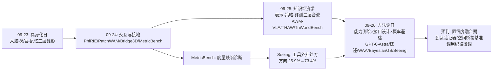
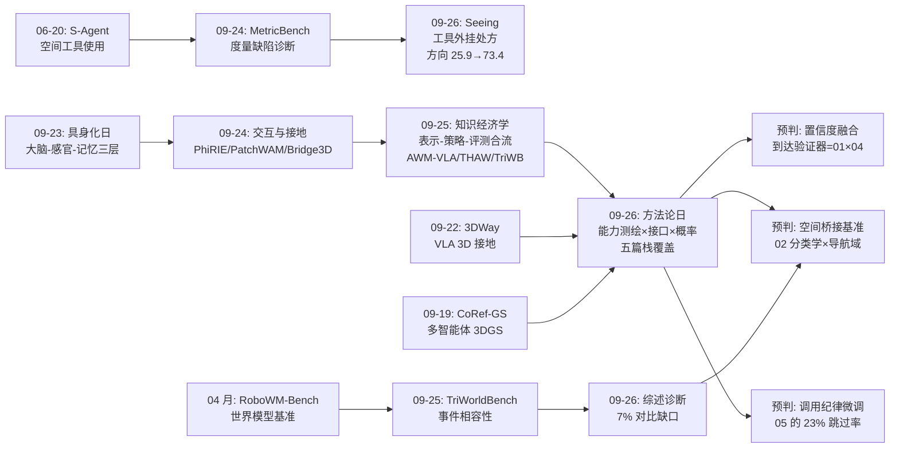
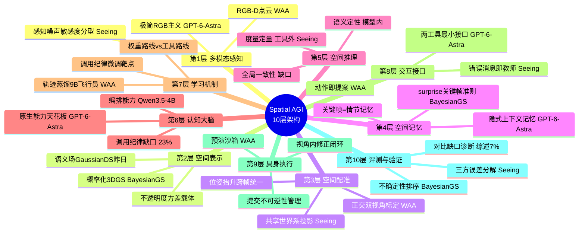
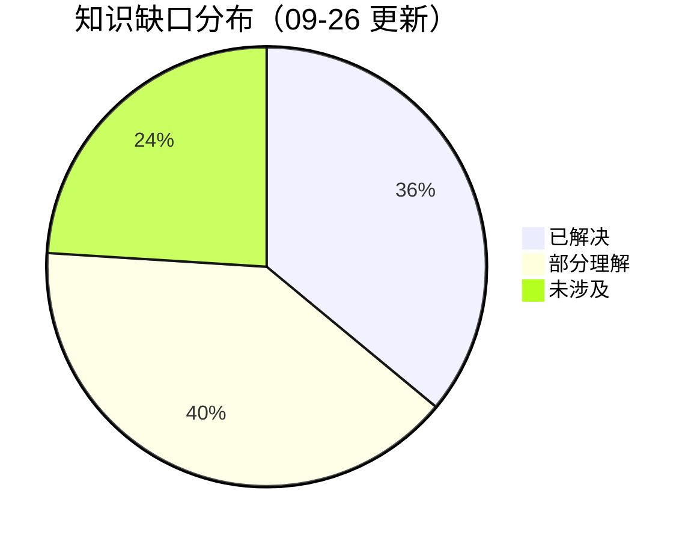
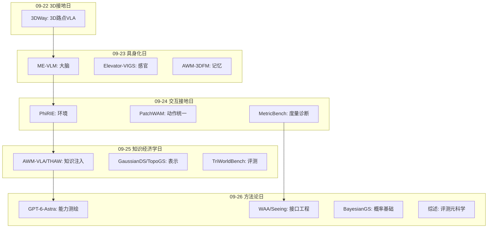

# Spatial AGI 每日深度思考 — 2026-09-26

**主题**: 测量、接口与自信 —— 空间智能的"方法论日"（能力测绘 × 接口设计 × 概率基础）

**论文**:
1. GPT-6-Astra（2609.29861，SMU + AIML）— 通用基础模型零样本 VLN-CE 79% SR，最小接口评测范式
2. Do World Models Make Better Robots?（2609.29669，UC Berkeley 等）— 160 基准综述，VLA vs 世界模型对比缺口诊断
3. World Action Agent（2609.29964，HKUST(GZ) + CUHK）— 视觉动作工作区，VLM 直接驾驶机器人 LIBERO-Pro 75.6% SOTA
4. BayesianGS-SLAM（2609.24140，成均馆大学）— 不透明度方差解析传播，不确定性贯穿 SLAM 全管线
5. Seeing Is Not Measuring（2609.29073，TUM）— 工具增强度量空间推理，编排-感知误差分解

---

## 📅 每日总结

**日期**: 2026-09-26
**论文数量**: 5篇
**主题**: 空间智能的"方法论日"。昨天（09-25）回答了"空间知识以什么形态存在、如何流动、如何验货"；今天五篇论文回答的是更元的问题：**这些能力到底有多少、缺在哪里、该用什么架构去补、以及我们怎么诚实地知道补上了**。模型层（GPT-6-Astra 的原生能力天花板）、接口层（WAA 的工作区架构、Seeing 工具链）、概率基础层（BayesianGS 的置信度管线）、评测方法论层（综述的对比缺口 + Seeing 的三方误差分解）——一天之内，技术栈的每一层都被一篇论文代表，且它们互相补刀又互相成全。

**关键突破**:
- 🚀 **零样本导航能力曲线完成交叉**（GPT-6-Astra）：单目 RGB + 两工具最小接口，R2R-CE-100 上 79.0% SR / 69.5% SPL，超过最强零样本（SpatialAnt 66%，还带全景+深度+场景重建）13 个点、超过最强有监督单目（Image2Nav 66.3%）12.7 个点——导航任务的"数据红利"被"基础模型红利"正式超越，VLN 是第一个发生曲线交叉的主流具身任务
- 🚀 **领域核心问题被证明不可回答**（综述）：160 个基准中仅 7%（11 个）构建 VLA-vs-世界模型显式对比、仅 4 个桥接基准把预测接入执行、2025 年开环评测数量反超闭环（13 vs 6）——"世界模型是否有用"这一最大路线之争缺乏测量仪器，且 2025 交叉点标记了研究热度与评测效度的背离
- 🚀 **接口工程击败权重工程**（WAA）：冻结 VLM 不微调，仅靠"交互中心视角 + 动作预演沙箱 + 视角内修正"的视觉动作工作区，LIBERO-Pro 75.6% SOTA，技能零学习跨模拟器迁移，交互轨迹蒸馏 9B 小模型域外 1.7%→43.3%
- 🚀 **贝叶斯 SLAM 降价了**（BayesianGS）：不透明度方差经渲染线性化解析传播，无 ensemble/无采样/无变分推断，颜色+深度双通道不确定性一个量贯穿建图/跟踪/关键帧三环节——神经渲染 SLAM 的贝叶斯化在计算上可行且正收益
- 🚀 **"看见≠测量"有了完整证据链**（Seeing）：4B VLM + 几何工具链，相对方向从低于瞎猜（25.9%）到 73.4%；三方误差分解证明编排仅耗 0.03 MRA、感知才是瓶颈；工具错误消息重写（点名缺失步骤）使编排错误降 75%

**架构演进**: 10 层架构四处深化：
- 第 5/6 层（推理/大脑）：确立"语义在模型、度量在工具、配准在世界系"的三层分工
- 第 3/4 层（感知/表示）：不确定性成为表示的一等公民（σ_α 与位置/颜色/协方差并列）
- 第 8 层（接口）：工作区架构（WAA）与最小接口哲学（GPT-6-Astra）确立"接口复杂度与任务性质匹配"的设计定律雏形
- 第 10 层（评测）：对比归因协议（三方误差分解）与对比缺口诊断（7%）成为新的评测方法论标准

### 📊 一句话总结

今天的五篇论文共同宣告：空间智能的进步同时发生在模型层、接口层与评测层，而后两层的杠杆可能更大——导航被证明"最小接口+强模型"即可登顶，操作被证明"结构化工作区"不可省略，度量被证明"必须外包给确定性工具"，而这一切的剩余误差最终都要靠概率置信度来仲裁。

### 🔗 延续性

**昨日（09-25）→ 今日**: 昨天的"知识经济学"回答了知识的存在形态（语义场/特征缓存/物体级预感）、流动方式（蒸馏/对齐/聚合）与验证标准（多视角相容性）。今天的五篇把镜头拉高一层：GPT-6-Astra 直接测出了"不学任何空间知识"的通用模型原生能力水位——它是昨天所有"知识注入"工作的零点基线（如果零点都有 79%，注入的边际价值必须重新证明）；综述则指出昨天 TriWorldBench 式的评测努力在整个生态中仍是少数派（7% 对比率的 1/11）；BayesianGS 为昨天的"语义场"补上了概率维度；Seeing 为昨天 AWM-VLA 式的"预感"划清了边界——预感管定性，测量管定量。

**今日→明日**: 三条线索——(1) "置信度到达验证器"：GPT-6-Astra 的 13/21 到达失败 × BayesianGS 的 predictive surprise， STOP 前做后验预测检验；(2) "空间桥接基准"：按综述的四车道分类学，在导航域建 VLA-vs-WM 头对头；(3) "调用纪律微调"：Seeing 发现的 23% 跳过率，用"看似可目测实则需测量"的对抗样本做专项训练。

### 💡 本质思考：如何达成通用空间智能

#### 1. 核心能力的本质是什么？

今天五篇论文把空间智能的能力清单推进到"测量论"层面：

1. **空间智能 = 感知 × 测量 × 决策的三元组，且三者不可互相替代**（Seeing 的核心贡献）：VLM 有感知（能描述场景）、无测量（方向判断低于瞎猜、+intrinsics 反而掉分）、决策能力取决于前两者的接口质量。"看见"与"测量"的认知分离，与人类使用工具的历史同构——没有人类从内参矩阵心算距离。
2. **空间智能的置信度是一等公民**（BayesianGS）：经典 SLAM 的贝叶斯血统（EKF/粒子滤波/因子图全是概率机器）在神经渲染时代断裂了；本文把它焊回去——每个空间判断都应携带"我有多确定"，且这一个量要贯穿感知-定位-决策全管线。缺失置信度的空间智能是盲目的：GPT-6-Astra 的"声称到达但差 5-10m"就是无置信度决策的标准病理性样本。
3. **接口是被低估的能力来源**（WAA + GPT-6-Astra 的对偶）：同一个 VLM，最小接口下导航 79%，结构化工作区下操作 SOTA——能力不只在权重里，也在"模型被允许看到什么、决策如何生效"里。WAA 的"动作即提案"抓住了物理 agent 与软件 agent 的本质不对称：试错的代价不可逆，因此接口必须内置"信息空间沙箱"。
4. **能力测绘先于能力建设**（综述 + GPT-6-Astra）：在投入算力训练之前，先精确回答"基础模型已经会什么、缺什么"——本文证明了这种测绘能产出比方法论文更深的洞见，且 7% 对比率的诊断显示整个领域的投入方向可能是错配的。

#### 2. 当前方法与理想目标的差距在哪里？

- **度量级空间一致性是公共短板**：GPT-6-Astra 到达失败（终点偏 ≥5m 占失败 62%）、MetricBench 的度量估计缺陷、Seeing 的方向低于瞎猜——三份独立证据收敛于同一诊断：基础模型没有自我中心参照系的积分与维护能力。人类靠前庭系统+路径积分+里程碑回溯，模型只有离散 token 流。
- **评测生态系统性偏斜**：160 基准 93% 不构建架构对比、反事实能力（世界模型的存在理由）几乎无测量、开环生成质量与闭环行为优势完全脱钩——我们花的算力与学到的东西不成比例。
- **隐式空间表示的能力边界未刻画**：GPT-6-Astra 证明短程室内导航隐式上下文够用，但它的失败模式（路线保持/进度校验/到达确认）恰恰是全局空间一致性——隐式与显式表示的分界线在哪、什么任务尺度会翻转，没有理论也没有实验。
- **概率层与语义层未融合**：BayesianGS 的校准置信度在几何管线里，VLM 的判断在 token 概率里（且未校准于物理世界），两个置信度体系没有任何接口。空间决策需要的是"语义置信 × 几何置信"的乘积，而这个乘积无处可算。
- **世界模型的价值悬而未决**：2025 年开环评测反超闭环，大量算力投入在"生成更像的视频"上，其行为价值为零证据。WAA 的 Imagination Agent 给了一个尖锐的反例：结构化环境里解析求解器（IK+规划）完胜学习式预测——学习式世界模型的领地到底在哪，没人能回答。

#### 3. 从今天到理想状态，最可能的路径是什么？

1. **置信度融合期**（近期，1-2 个季度）：BayesianGS 式几何不确定性 × VLM token 置信度的校准与乘积；首批应用：到达验证器（surprise 检验）、工具调用置信度门槛（Seeing 的"坏框比没框糟"问题的解药）、抓取点置信度地图。
2. **接口标准化期**（中期，半年）：WAA 式工作区 + GPT-6-Astra 式最小接口的适用边界被实验刻画（"接口复杂度 ∝ 自由度连续性 × 错误不可逆性 ÷ 语义复杂度"的设计定律雏形），形成空间智能体的接口规范（类似今天的 USB/HDMI 标准）。
3. **对比归因普及期**（中期）：三方误差分解（oracle/真实/天花板）成为工具增强论文的审稿必需；导航域第一个空间桥接基准落地，裁决世界模型 vs VLA 的第一回合。
4. **空间操作系统期**（远期）：WAA 的 OS 同构（VLM=CPU、harness=OS、技能库=App 生态）成为主流架构，竞争从模型转向技能生态与接口协议。

---

## 🔗 与昨日思考的联系

### 昨日重点

09-25"知识经济学日"确立了四个核心概念：空间知识的多形态性（语义场/特征缓存/物体级预感）、监督对齐是知识传输的核心瓶颈、结构先验必须进入梯度通路、空间真相是多视角证据的相容性。技术主线是"表示-策略-评测三层合流"，并预判了"结构感知统一表示与三教师课程"的下一步。

### 今日进展

今天的五篇论文与昨天构成精确的接力关系，且完成了一次"镜头拉高"：

1. **零点基线的确立**：昨天所有"知识注入"工作（AWM-VLA 的未来预感、THAW 的特征缓存）都在回答"注入多少世界知识能提升多少"；GPT-6-Astra 今天测出了不注入任何东西的原生水位（导航 79%）——注入类工作的边际价值从此必须对照这个零点重新申报。这是一个残酷但必要的校准。
2. **评测哲学的接棒**：昨天 TriWorldBench 在世界模型评测内部做了精细化（事件相容性）；今天综述在更高层指出这类努力在整个 160 基准生态里仍是濒危物种——昨天是"做一个好基准"，今天是"诊断为什么好基准造不出来"（接口不兼容/算力错配/激励偏斜/阵营化四因）。
3. **概率维度的补全**：昨天的语义场（GaussianDS）是确定性表示；BayesianGS 今天给同家族的 3DGS 装上了校准置信度——"语义 × 几何 × 概率"三位一体的表示近在咫尺。
4. **定性与定量的分工确认**：昨天的 AWM-VLA 管定性预感（物体级未来预测），Seeing 今天证明定量测量必须外包给确定性工具——"预感管定性、测量管定量"成为空间智能体认知架构的分界原则。

### 演进路径

---

## 📚 论文概览

**1. GPT-6-Astra（评测报告）**: 在 Codex harness 的最小接口（observe/step 两工具、单目 RGB、无地图无位姿无深度）下评测 GPT-6-Astra 的零样本 VLN-CE 能力。medium/ultra 两档推理分别 76%/79% SR。四大发现：零样本全面登顶、多阶段指令到自适应导航的转译能力、三大残余缺陷（路线保持/进度校验/到达确认）、以及"具身学习角色需重思"的宣言。失败解剖比成功更珍贵：21 个失败中 13 个终点偏 5m+。

**2. 世界模型评测综述（元科学研究）**: PRISMA 流程收录 160 个 web 验证基准（2017-2026），四车道分类（policy 37/embodied 85/WM eval 34/bridge 4），诊断出 7% 显式对比、4 座桥、2025 开环反超闭环三大结构性事实。给出四车道分类学、书面放置规则、advantage-aware 四度量协议。组织主张刻意克制：不断言世界模型有用与否，只证明该问题当前不可回答。

**3. World Action Agent（系统论文）**: 多智能体 harness 让 VLM 直接驾驶机器人。三大设计：Contact views（点云驱动的交互中心视角优化，正交双视角读出对齐误差）、动作预演（提案-IK-cuRobo-半透明渲染，Imagination Agent 独立上下文迭代修改）、视角内修正（标定驱动的图像空间拖拽→有界末端位移）。LIBERO-Pro 75.6% SOTA，技能库零学习迁移 robosuite，9B 蒸馏 1.7%→43.3%。

**4. BayesianGS-SLAM（方法论文）**: 预测不确定性 = 传感器噪声（MLP 学习的异方差似然）+ 地图表示不确定性（不透明度方差经一阶泰勒线性化渲染解析传播），覆盖颜色与深度。同一量三处复用：建图方差加权 NLL、跟踪残差归一化（概率推导的鲁棒目标）、关键帧 predictive surprise（负后验预测似然）。真实数据集上深度不确定性-误差排序显著改善，关键帧与建图调用双降。

**5. Seeing Is Not Measuring（方法+评测论文）**: 预测器无关的几何工具框架（3D 检测、位姿抬升、确定性求解器）+ Qwen3.5-4B 编排。四方对照（无工具/真实检测器/GT oracle/几何天花板）分解误差：编排仅 0.03 MRA，感知是瓶颈；相对方向无工具时低于瞎猜；尺寸任务被检测器锁死（框边长中位误差 14.3% 直通）；工具错误消息重写使编排错误降 75%，无菜谱编排追平脚本管线。

---

## 💡 核心见解

### 见解1: 零样本能力曲线的交叉点是具身智能的"奥卡姆剃刀时刻"（GPT-6-Astra）

- ✅ 零样本 VLN 从 16%（NavGPT-GPT4，2024 初）到 79%（本文）用了不到两年，同期有监督从 55% 到 72%——两条曲线已经交叉
- ✅ 交叉点的实现条件极其苛刻地简单：单目 RGB、两个工具函数、无导航特定任何东西
- ✅ 推理档位（medium→ultra）提升 SR 3 个点——推理计算可兑换空间能力，且影响的主要是停止决策质量（OSR 反而略降：更谨慎的路线但更可靠的停止）

**对Spatial AGI的启发**: 管线工程的价值随基础模型变强而快速归零。过去几年发明的 waypoint predictor、全景融合、场景预探索、多 agent 导航框架，在"两工具+最强模型"面前全部失色。VLN 是第一个发生交叉的主流具身任务，但不会是最后一个——操作、移动操控的交叉点可期。对研究者与公司的直接含义：不要把筹码押在"训练更大的导航模型"上，边际在"基础模型 + 领域空间先验的接口设计"。

### 见解2: 全局空间一致性是隐式表示的能力硬边界（GPT-6-Astra 的失败解剖）

- ✅ 79 条成功轨迹中 nDTW 与 SPL 解耦——"到达"依赖地标验证而非路径复现，局部正确 ≠ 全局正确
- ✅ 21 个失败的三分类：路线约束保持失败、移动-进度校验失败、到达确认失败——本质都是自我中心运动与全局坐标系绑定的缺失
- ✅ 模型无路径积分信号（接口不提供里程计），无法推断"走了 20 步 ≈ 5m"

**对Spatial AGI的启发**: 这精确划出了"显式空间表示"的正当性边界——不是要不要地图的教条之争，而是不同任务尺度需要不同表示容量：短时程（单房间）隐式够用、中时程（多房间）需要外部空间暂存、长时程（跨天持久）必须显式化+检索。最低成本的改进方向已经可见：把 step() 执行摘要（累计位移）回注上下文，可能直接修复路径积分类失败。

### 见解3: 评测的缺口是结构性的，不是疏忽（综述）

- ✅ 7% 显式对比率的四个成因：接口不兼容（潜空间 rollout vs 动作空间执行）、计算预算错配（公平比较需要匹配推理算力且无共识）、激励偏斜（开环榜单快而传播好，闭环双分支慢而结论模糊）、路线阵营化（头对头=亲手制造可能不利于己的证据）
- ✅ 2025 年开环评测（13）反超闭环（6）——注意力经济劫持了机器人动机，Goodhart 定律正在世界模型领域重演
- ✅ 8 篇前序综述无一覆盖"能力×模型家族"交叉轴——空白格就是选题地图

**对Spatial AGI的启发**: Spatial AGI 面临同构的评测真空——"显式空间表征 vs 端到端隐式能力"（我们的立身之问）同样处于不可测量状态。本文的方法论（四车道分类、书面放置规则、PRISMA 流程、对比轴）可整体移植为"Spatial AGI Benchmark Survey v1"。战略建议：抢占"空间能力切片×模型家族"的桥接基准空白格，谁建桥谁定义未来五年的话语权。

### 见解4: 不可逆性决定接口形态——"动作即提案"范式（WAA）

- ✅ 软件 agent 试错免费、机器人 agent 试错不可逆——WAA 用 query/proposal/execution 三类工具把决策计算与物理提交彻底分离，所有试错在信息空间（预演沙箱）完成后才提交物理世界一步
- ✅ 正交双 Contact 视角让 3D 对齐误差沿两个独立方向可读；视角内拖拽（图像空间意图→有界末端位移）消除了感知-动作的坐标翻译损耗
- ✅ Imagination Agent 用解析求解器（IK+cuRobo）而非学习式预测做"想象"——结构化环境中确定性反事实推理完胜学习式世界模型

**对Spatial AGI的启发**: "动作即提案"是通用的"高危决策 agent"架构模式，可推广到任何不可逆操作（数据库变更、代码部署、金融交易）。与 GPT-6-Astra 合并可得设计定律雏形：**接口结构化程度 ∝ 空间自由度连续性 × 错误不可逆性 ÷ 语义复杂度**——导航（粗自由度、可恢复）用最小接口，操作（毫米级、不可逆）用完整工作区，手术（极不可逆）加人类审批环，竞速无人机（实时性）则必须训练内化——这解释了为什么竞速无人机用端到端 RL 而非 agentic 框架。

### 见解5: 置信度应该是一种全管线流通的货币（BayesianGS-SLAM）

- ✅ 不透明度 α 这个"不起眼"的量是天然的不确定性载体——它控制可见性与权重，其方差同时传播到颜色与深度；从系统已有量中发掘统计含义，比发明新模块更聪明
- ✅ 一阶泰勒线性化让解析方差传播可行：Var[ψ] ≈ Σ(c_i−ψ)²T_i²σ_αi²——神经渲染 SLAM 的贝叶斯化不需要 ensemble/MC/变分，计算账面正收益（渲染端 <2x 换建图端大幅节省）
- ✅ predictive surprise（负后验预测似然）= 空间好奇心的信息论形式：只有让地图"惊讶"的帧才值得建图——主动推断的感知+学习两环的最小工程实现

**对Spatial AGI的启发**: 空间智能体的"自信问题"有三层：表示层（几何预测可信度，本文已解）、决策层（STOP/抓取/转向的传播后置信度，缺位）、元认知层（知道自己不知道、主动求助，更缺位）。GPT-6-Astra 的到达失败是二、三层缺失的病理样本。完整的空间智能体需要贯穿三层的置信度管道——本文给出最底层模板，上层接口是明确的开放问题与近期最大的低垂果实。

### 见解6: "看见≠测量"应成为架构第一原则（Seeing Is Not Measuring）

- ✅ 度量几何封装为工具远优于语言化：+intrinsics 文本使 MRA 0.46→0.17——上下文里的数字是毒药
- ✅ 相对方向无工具时 25.9% 低于瞎猜（29.3%）、不比盲模型（28.3%）好——自我中心方位角在帧中无 VLM 可用的信号通道，这是结构性空洞而非程度缺陷
- ✅ 四方误差分解（无工具/真实检测器/GT oracle/几何天花板）：编排仅耗 0.03 MRA、感知是瓶颈、且"坏框比没框更糟"（3/4 检测器低于无工具基线）

**对Spatial AGI的启发**: 三层分工确立——语义在模型、度量在工具、配准在世界系。与 WAA 合并：一个提供工作区架构，一个提供"编排能力天生就有、缺的是调用纪律（23% 跳过率）"的证据。微调的靶点从此精确：不是教空间推理，而是教"何时该测量"——用"看似可目测实则需测量"的对抗样本。另外，工具错误消息是 agent 的教师（重写错误消息使错误降 75%）——这是所有 agent 基础设施建设者都该内化的杠杆点。

### 见解7: 空间智能的进步是三层并发：模型层、接口层、评测层（今日矩阵总览）

- ✅ 模型层（01）：原生能力天花板持续抬高，且免费传导到具身任务（VLM 通用能力每跃迁一次，VLN 性能滞后趋近于零地跟涨）
- ✅ 接口层（03/05）：工作区、工具链、错误消息设计——不碰权重的改进空间巨大且被系统性低估
- ✅ 评测层（02/05）：对比缺口诊断 + 三方误差分解——测量方法的进步能重新定义"什么算进步"

**对Spatial AGI的启发**: 传统研究只投资模型层，而今天的证据表明接口层与评测层的杠杆可能更大。五篇论文的互文关系本身就证明了这一点：01 的最小接口哲学会被 05 反驳（导航可以最小、度量不行）；03 的工作区会被 02 提醒（算力预算未对齐）；04 的概率层是 01/03 都缺的地基；05 的三方分解是 02 呼吁的最佳实例。每日选稿的启示：避免同质堆叠，追求"栈覆盖"。

### 见解8: 学习式世界模型的价值需要一个明确的领地声明（综述 × WAA 联合推论）

- ✅ 综述：世界模型的行为价值零证据（4 座桥、7% 对比）
- ✅ WAA：结构化环境中解析求解器（IK+规划+半透明预演）完全替代了学习式"想象"，且更便宜更可靠
- ✅ 主动推断视角（BayesianGS 的 surprise 机制）：地图更新只需被动数据流上的惊讶检测，连"想象"都可以省

**对Spatial AGI的启发**: 学习式世界模型的领地声明应该是："解析求解器失效处"——柔性物体、流体、颗粒物质、多 agent 交互、长时程组合动力学。桥接基准应该按这个假设设计：在刚性桌面操作上世界模型大概率输给求解器+VLA（不要在那里浪费对比实验），在折衣/倒水/系绳结上才是它的主场。这为综述呼吁的桥接基准提供了具体的实验设计指引。

### 见解9: 评测指标的元评测是下一个前沿（综述 × Seeing）

- ✅ 综述：开环分数与闭环增益的相关性无人测量——若相关性为零，VBench 系评测的合法性崩塌
- ✅ Seeing：几何接口语义的选择（表面距 vs 中心距）贡献 8 倍 MAE 差距——基准答案的度量定义就是接口规范
- ✅ BayesianGS：不确定性-误差排序作为独立于任务性能的元指标

**对Spatial AGI的启发**: 评测需要三级体系：一级指标（行为优势/任务成功）、二级指标（校准质量/排序质量）、元指标（开环-闭环相关性、基准间相关性）。在投入下一个基准建设之前，先花 10% 的精力做"这个指标能预测什么"的相关性研究——这是避免 Goodhart 陷阱的疫苗。

---

## 🗺️ 知识演进图

⚠️ 必须使用 mermaid 代码块！禁止用纯文本箭头！

---

## 技术栈演进对比表

| 层次 | 昨日方案（09-25） | 今日方案（09-26） | 变化 |
|------|---------|---------|------|
| 第1层 感知 | 多物理场感官（热/声/触） | 单目 RGB 极简主义（GPT-6-Astra）+ 感知噪声敏感度分型（Seeing） | 从"加感官"转向"最小感官+知其所能" |
| 第2层 表示 | 语义场（GaussianDS）+ 拓扑层级（TopoGS） | 概率化表示：σ_α 不确定性成为一等公民（BayesianGS） | 确定性表示 → 表示+置信度 |
| 第3层 配准 | 多视角相容性（TriWorldBench 评测侧） | 共享世界系的工程实现：位姿抬升（Seeing）、正交双视角标定（WAA） | 评测哲学 → 可用接口 |
| 第4层 记忆 | 特征缓存（THAW）、物体级预感（AWM-VLA） | 关键帧=情节记忆、surprise 决定"记住什么"（BayesianGS） | 记忆获得信息论准入准则 |
| 第5层 推理 | 世界知识注入的双通道配方（当前帧⊕未来预感） | 语义与度量分工：模型管语义、工具管度量（Seeing） | 注入范式 ↔ 外包范式并立 |
| 第6层 大脑 | VLA 世界模型蒸馏（教师→学生权重） | 不动权重：最小接口（01）与工作区（03）释放原生能力 | 权重工程 ↔ 接口工程的路线对垒公开化 |
| 第7层 学习 | MGDA 多目标不退化、蒸馏 | 轨迹蒸馏 9B 飞行员（WAA）；调用纪律是微调靶点（Seeing） | 从"学空间推理"转向"学何时测量" |
| 第8层 接口 | ——（昨日未涉及） | 动作即提案、预演沙箱、视角内修正（WAA）；两工具最小接口（01）；工具错误消息教学（05） | **新增主战场** |
| 第9层 具身执行 | 短程动作块级预测 | 预演-提交分离、in-view 修正闭环（WAA） | 执行获得信息空间沙箱 |
| 第10层 评测 | 事件相容性（TriWorldBench） | 对比缺口诊断（02）+ 三方误差分解（05）+ 不确定性排序（04） | 评测从"造尺子"进入"尺子学" |

---

## 🗺️ Spatial AGI 知识图谱

### 10层架构思维导图

⚠️ 必须使用 mermaid mindmap 代码块！

### 🎯 主线技术路径

#### 阶段1: 视觉空间智能（2024–2025，已完成）

VLM/VLA 把 2D 语义能力带入空间任务；专用训练主导；零样本工程化 pipeline 探索期（SR 16-30%）。评价：方向正确但杠杆配置错误——所有投入都在模型与管线层，评测层几乎静止。

#### 阶段2: 具身化与接地（2025–2026 中，已完成）

3D 接地（Bridge3D、CoRef-GS）、动作统一（PatchWAM）、多物理场感官、世界模型注入策略（AWM-VLA/THAW）。评价：技术栈各层初步成型，但层间缺少协议——语义、几何、概率三个置信度体系互不相通。

#### 阶段3: 方法论觉醒（2026 当前，今天所处）

今天五篇论文标记的转折：能力测绘（GPT-6-Astra 测出原生水位与硬边界）、接口工程学（WAA 工作区、Seeing 工具链、错误消息设计）、概率基础（BayesianGS 全管线置信度）、评测元科学（综述对比缺口 + 三方分解）。特征：从"再提一个方法"转向"知道该提什么方法"。零样本曲线交叉与 7% 缺口诊断是本阶段的两个标志性事件。

#### 阶段4: 置信度融合与桥接裁决（2026 下–2027，预判）

BayesianGS 几何置信度 × VLM 语义置信度的校准融合；到达验证器、工具置信度门槛、抓取置信度地图落地；导航域第一个 VLA-vs-WM 桥接基准出结果，世界模型获得（或失去）其领地声明（柔性/流体/长时程组合动力学）；"调用纪律"微调成为空间 VLM 训练的标准组件。

#### 阶段5: 空间智能操作系统（2027+，远期）

WAA 的 OS 同构成熟：VLM=CPU、harness=OS、技能库=生态。接口协议标准化（提案格式、技能描述、置信度传播），跨机器人本体的技能市场出现；评测宪法确立"行为优势归因"为第一原则；隐式/显式表示的任务尺度分界理论化，调度器在层级间自动切换。

---

## 🔍 待探索议题

### 高优先级（本周）

1. **置信度到达验证器（01×04 融合）**
   - 问题: GPT-6-Astra 21 个失败中 13 个终点偏 ≥5m——STOP 决策无置信度仲裁
   - 候选方案: BayesianGS 地图上对指令目标语义位置做后验预测检验（surprise 高则拒绝 STOP，触发重定位）；轻量替代：位移摘要回注上下文（累计位移+转角序列）
   - 缺口: 语义目标（"楼梯口"）到几何查询点的接地需要 VLM+地图的联合查询接口，尚无现成实现

2. **导航域空间桥接基准（02 的行动号召）**
   - 问题: 世界模型 vs 直接策略在导航上无头对头证据（160 基准仅 7% 对比且导航占比更低）
   - 候选方案: Habitat 场景 + 双分支强制（GPT-6-Astra 式 API 分支 vs action-conditioned WM+MPC 分支），≥200 episodes，预注册统计检验，报告能力切片成功率差（Spatial Advantage Score）
   - 缺口: 统一状态-动作-观测协议的工程成本高；推理预算对齐无共识标准

3. **调用纪律微调数据集（05 的靶点）**
   - 问题: 模型在 23% 的度量问题上跳过工具直接目测——元认知误判（把度量问题分类为感知问题）
   - 候选方案: 构造"看似可目测实则需测量"的对抗样本（视觉相似但尺寸/距离差异显著的物体对），SFT 或 DPO 教"何时该测量"
   - 缺口: 对抗样本的自动生成管线；误分类率的在线检测指标

### 中优先级（本月）

4. **工具链的物理守卫层**
   - 问题: Seeing 中深度离群 10187m 通过管线进入距离计算——坏工具比没工具危险
   - 候选方案: 范围先验检查（室内距离界）、跨视图一致性校验、BayesianGS 不确定性门槛（低于阈值拒绝入链回退基线）
   - 缺口: 先验界如何随场景类型自适应；守卫层误拦的代价量化

5. **开环-闭环相关性研究（02 的元评测）**
   - 问题: VBench/EWMBench 分数能否预测闭环任务增益——相关性未知则开环评测合法性悬置
   - 候选方案: 取 20-30 个视频生成模型，同时测开环分数与 LIBERO/导航闭环增益，拟合相关曲线
   - 缺口: 闭环评测的算力预算；因果方向（好模型两头都好）的剥离设计

6. **WAA 消融补全**
   - 问题: 三大设计（Contact views/预演/修正）与技能库的各自贡献未在摘要层面披露
   - 候选方案: 追踪开源版或复现，跑 2×2×2 消融 + 无技能库对照
   - 缺口: 开源时间未知；仿真基建工程量

7. **隐式/显式空间表示的任务尺度分界**
   - 问题: GPT-6-Astra 证明短程隐式够用、失败集中在全局一致性——翻转点在哪无理论
   - 候选方案: 系统变化路线长度/房间数/指令阶段数，测隐式记忆的性能衰减曲线，拟合"表示容量-任务尺度"相变点
   - 缺口: 大模型 API 的成本（千级 episode × 长上下文）；开源模型上结论是否复现

### 低优先级（本季度）

8. **工具错误消息的信息设计学**
   - 问题: Seeing 的意外发现——重写错误消息（点名缺失步骤）使错误降 75%，但设计规律未知
   - 候选方案: 系统实验错误消息的信息量梯度（无/失败宣告/缺失步骤/下一步建议）× 任务复杂度
   - 缺口: 跨模型/跨任务的外推效度

9. **空间生成内容的置信度图层**
   - 问题: 3DGS 生成/视频世界模型的内容无可靠性标注（综述反事实盲区的姊妹问题）
   - 候选方案: BayesianGS 式方差传播应用于生成式 3DGS（生成时输出置信度图）
   - 缺口: 生成管线的梯度可通性；置信度的语义解释（对生成内容"不确定"意味着什么）

10. **接口复杂度定律的实验验证**
    - 问题: "接口结构化程度 ∝ 自由度连续性 × 错误不可逆性 ÷ 语义复杂度"是今日归纳的设计定律雏形，无实验
    - 候选方案: 选 5 个任务（导航/拾放/折衣/开门/竞速）× 3 种接口（最小/中等/完整工作区）的矩阵实验
    - 缺口: 跨任务的统一奖励与预算定义；实验算力

11. **柔性物体的预演替代**
    - 问题: WAA 预演依赖刚性假设，柔性物体（绳子/布料）解析不可达——学习式世界模型的领地声明
    - 候选方案: 可微仿真预演（MPM/FEM）vs 学习式视频预测在折衣任务上的头对头（这是综述呼吁的桥接实验在正确地点的落位）
    - 缺口: 可微仿真的接触保真度；两者成本对齐

---

## 📊 知识缺口分析

⚠️ 必须使用 mermaid pie 代码块！

**已解决（36%）**:
- ✅ 零样本导航能力水位：79% SR，曲线交叉完成（GPT-6-Astra）
- ✅ 度量推理的架构处方：语义/度量/配准三层分工 + 工具链有效性与瓶颈归因（Seeing）
- ✅ 操作的接口架构：动作即提案 + 预演沙箱 + 视角内修正（WAA）
- ✅ SLAM 全管线置信度：解析传播可行且正收益（BayesianGS）
- ✅ 评测生态的诊断方法：四车道分类学 + 对比轴 + 书面放置规则（综述）

**部分理解（40%）**:
- ⚠️ 隐式空间表示的边界：短程够用已证，尺度相变点未刻画
- ⚠️ 世界模型的价值领地：假设（解析失效处）已提出，无实验裁决
- ⚠️ 推理计算与空间能力的兑换率：单点证据（medium→ultra +3 SR），无曲线
- ⚠️ 编排能力的来源与极限：4B 近乎免费，规模效应与失败模式未知
- ⚠️ 调用纪律的可训练性：靶点明确（23% 跳过），训练方案未验证
- ⚠️ 概率-语义置信度融合：两层各自存在，接口空白
- ⚠️ 接口复杂度定律：雏形归纳自两篇论文的对偶，无矩阵实验

**未涉及（24%）**:
- ❌ 动态场景下的不确定性语义（运动物体应高不确定而非高残差）
- ❌ 回环检测与全局一致性（BayesianGS 无回环、GPT-6-Astra 路线保持失败——同源问题）
- ❌ 柔性/流体物体的反事实推理（预演与学习式预测都未覆盖）
- ❌ 跨本体技能迁移的正式理论（WAA 跨模拟器已证，跨形态未知）
- ❌ 真实家庭部署的端到端误差级联（位姿误差→配准误差→度量误差）
- ❌ 空间智能的成本经济学（token 成本 vs 训练摊销的系统对比）

---

## 🧠 见解深化补充（见解10-12）

### 见解10: 基准即宪法——评测基础设施的政治学（综述）

- ✅ 谁定义基准，谁定义"进步"，进而决定几十亿算力与几千篇论文的方向——7% 缺口的本质是"宪法缺了一条关键条款"
- ✅ 模型无关性曾是评测美德（公平考场），但全部考场中立意味着"哪种考生更聪明"永远无答案——中立性评测与对比性评测需要不同的基础设施投资
- ✅ 历史前车之鉴三连：NLP 的 GLUE→SuperGLUE 饱和循环、图像生成的 FID 信任危机、RL 的 Atari 陷阱——机器人/空间评测正处于 GLUE 时刻

**对Spatial AGI的启发**: Spatial AGI 若要成为独立学科而非 VLM/机器人学的注释，第一步是起草自己的宪法——以"行为优势归因"为第一原则的评测章程。具体行动：把 05 的三方分解写进组内审稿 norm；任何"工具/表征带来收益"的论文必须含同协议直接基线。

### 见解11: 上下文卫生学——agent 记忆边界的重新划分（WAA × Seeing）

- ✅ WAA 的 Imagination Agent 在独立上下文里做脏活（迭代试错的中间状态），主 agent 只收干净结果——锚定效应的 agent 版规避
- ✅ Seeing 的宿主侧状态缓存：坐标与矩阵永不出现在模型上下文里，模型只见物体 ID 与结论
- ✅ 两者共同宣告一条边界：**记忆属于环境/宿主，模型只持有意图与判断**

**对Spatial AGI的启发**: 这是对"上下文工程"的实质性贡献。传统 RAG/长上下文思路是"给模型更多记忆"，本文们的思路是"给模型更少但更干净的决策面"。与 GPT-6-Astra 的失败对照：它的上下文里累积了全部原始观测与动作历史（无外部状态管理）——全局一致性失败可能部分源于上下文污染。三方对照实验（有/无宿主侧空间状态管理）值得一做。

### 见解12: 认知科学脚注的工程胜利——主动推断的最小实现（BayesianGS × Seeing × GPT-6-Astra）

- ✅ BayesianGS 的 surprise 准则 = Friston 主动推断的"感知+学习"环（惊讶驱动模型更新）
- ✅ Seeing 的工具调用 = "行动环"的最简形态（用测量工具降低惊讶）
- ✅ GPT-6-Astra 的 observe() 免费调用 = 主动感知（epistemic action）的无成本化
- 三者拼起来：主动推断的完整回路（感知-学习-行动）已可在现有工程组件上拼装，缺的只是把它们接成一个系统

**对Spatial AGI的启发**: 认知科学理论第一次如此接近工程可实现。一个具体的合成实验：BayesianGS 地图（生成模型）+ surprise 视点规划（期望自由能的贪婪近似）+ Seeing 式测量工具（行动）+ GPT-6-Astra 式语义层（指令接地）——这就是一个"最小主动推断机器人"的完整蓝本，且每个组件都有论文级验证。这是明天值得追的方向。

---

## 🔬 深化分析一：三份"到达失败"证据的收敛——自我中心参照系是结构性空洞

今天最强的跨论文信号来自三个独立证据链的收敛：

1. **GPT-6-Astra**: 到达确认失败——"宣称到达"与真实位置差 5-10m；路线保持失败——多岔路口局部合理全局错误
2. **Seeing**: 相对方向 25.9% 低于瞎猜——帧中无 VLM 可用的方位信号
3. **MetricBench（09-24）**: 度量估计系统性偏差

三个证据的共同根源：**模型没有自我中心参照系的积分与维护机制**。人类靠前庭系统的路径积分（每一步的位移矢量累积）+ 里程碑回溯（"我已经过第二个门了"）+ 环境参照系锚定（"门朝北"），而 VLM 的预训练语料（互联网文本与图像）天然解耦了观察者姿态——文本没有"朝向"，图像没有"我在哪"。 Seeing 的 bearing 工具之所以能把方向从瞎猜拉到 73.4%，正是因为它用相机位姿把观察者/朝向/目标投到统一世界系，显式外包了缺失的参照源。

**推论**：空间智能可能本质上需要"有一个身体"——身体与姿态的持续在场提供了文本与图像都无法提供的参照系监督信号。这对"纯视频学习派"（HumanScale 的自中心人类视频预训练等）是一个理论约束：视频有用但不够，缺的是姿态-观测的配对密度。

**可执行的下一步**：到达验证器实验（议题 1）是这个问题上最便宜的试金石——如果 surprise 检验能拦截大部分到达失败，就同时验证了"几何置信度可以补语义参照系之缺"的假说。

---

## 🔬 深化分析一点五：今天五篇的"栈覆盖"选稿法复盘

今天的选稿无意中形成了一个方法论模板，值得显式记录供每日流程复用：

**选稿矩阵**（领域 × 层次 × 方法类型）：

| | 模型/方法 | 系统/接口 | 评测/元科学 |
|---|---|---|---|
| 导航 | — | GPT-6-Astra（01） | — |
| 操作 | — | WAA（03） | — |
| SLAM/表示 | BayesianGS（04） | — | — |
| 空间推理 | — | Seeing 工具链（05） | Seeing 分解（05） |
| 跨域元科学 | — | — | 综述（02） |

五篇恰好避免同质堆叠：两篇系统、两篇方法、两篇半评测（05 双重身份）、覆盖四个子领域。对比坏选法（五篇都是"XX 3DGS 变体"或五篇都是 VLA 变体）的信息增益，栈覆盖的联读能产生单篇读一百篇都得不到的"层间对话"（如今天的接口复杂度定律、置信度融合蓝图）。

**操作化建议**：每日 Step 2 筛选时，除相关性评分外加一个"层位检查"——5 篇是否覆盖 ≥3 个技术栈层位 + ≥2 个子领域。若重叠，宁可降分换多样性。

---

## 🔬 深化分析二：接口复杂度定律的完整表述

综合 GPT-6-Astra（最小接口登顶导航）与 WAA（完整工作区登顶操作），今日归纳的候选设计定律：

> **最优接口结构化程度 I* ∝ f(自由度连续性 D, 错误不可逆性 R, 语义复杂度 S)**
> - D 高（毫米级位姿、连续控制）→ 需要工作区（视角优化、预演、修正）
> - R 高（不可逆错误）→ 需要提案-预演-提交分离
> - S 高（复杂指令理解）→ 交给模型原生能力，接口要小
> - 实时性 T 高（反应窗口 <100ms）→ 一切 agentic 接口失效，必须训练内化

任务在 (D, R, S, T) 四维空间的位置决定接口选型：
- **导航**: D 粗、R 低、S 高、T 中 → 最小接口（GPT-6-Astra ✓）
- **桌面操作**: D 细、R 高、S 高、T 低 → 完整工作区（WAA ✓）
- **手术**: D 细、R 极高、S 中、T 低 → 工作区 + 人类审批环
- **竞速无人机**: D 细、R 高、S 低、T 极高 → 端到端 RL（无 agentic 空间）
- **折衣**: D 细、R 低、S 中、T 低 → 工作区 + 学习式预演（求解器失效处 = 世界模型领地）

**这个定律的科学价值在于可证伪**：矩阵实验（议题 10）可以验证或推翻它。如果成立，它将成为空间智能体接口选型的第一参照——相当于空间 agent 界的 CAP 定理。

---

## 🔬 深化分析二点五：三个"今天 vs 昨天"的张力点精读

跨日阅读的价值在于张力点——昨天的结论被今天挑战的地方：

### 张力1: "注入" vs "零点"
昨天：AWM-VLA 的 +21% 成功率证明了世界知识注入的价值。今天：GPT-6-Astra 的零点揭示注入的对照系应该是"不注入的当代最强模型"而非"上一代自己"。调和：注入的真正价值可能不在绝对性能而在部署经济学（可蒸馏、无 API、低延迟）——AWM-VLA 的 MGDA 与 THAW 的缓存都是成本工程，不是能力工程。重新定位后两条路线不再竞争而是互补：大模型零样本做上限探针，注入蒸馏做部署产品。

### 张力2: "多视角相容" vs "单目足够"
昨天：TriWorldBench 确立多视角事件相容性为空间预测的输出侧真相。今天：GPT-6-Astra 用单目 RGB 登顶导航。调和：相容性是"真值标准"（truth criterion），单目是"输入条件"（input condition）——两者不同层。模型用单目输入也能（部分）达到多视角相容的输出，因为它用预训练先验补全了视角缺失。但 GPT-6-Astra 的全局一致性失败恰恰提示：先验补全在视角信息不足时会系统性出错——多视角信息在"困难片段"上仍是必需品。预测：单目在 95 分位以下的任务上够用，尾部性能需要多视角。

### 张力3: "评测造尺子" vs "尺子学"
昨天：TriWorldBench 精心构造了 19 指标×6 维度的尺子。今天：综述诊断 93% 的尺子回答不了领域最重要的问题。调和：造好尺子与造对尺子是两件事——TriWorldBench 是"好尺子"（精确、防作弊），但领域更缺"对的尺子"（能裁决路线之争）。今天学到的教训：新基准立项前先做"空白格检查"（本文的 γ 轴交叉表方法）——你的尺子量的是已经有十把尺子量的东西，还是没人量过的东西？

## 🔬 深化分析二点五：三个"今天 vs 昨天"的张力点精读

跨日阅读的价值在于张力点——昨天的结论被今天挑战的地方：

### 张力1: "注入" vs "零点"
昨天：AWM-VLA 的 +21% 成功率证明了世界知识注入的价值。今天：GPT-6-Astra 的零点揭示注入的对照系应该是"不注入的当代最强模型"而非"上一代自己"。调和：注入的真正价值可能不在绝对性能而在部署经济学（可蒸馏、无 API、低延迟）——AWM-VLA 的 MGDA 与 THAW 的缓存都是成本工程，不是能力工程。重新定位后两条路线不再竞争而是互补：大模型零样本做上限探针，注入蒸馏做部署产品。

### 张力2: "多视角相容" vs "单目足够"
昨天：TriWorldBench 确立多视角事件相容性为空间预测的输出侧真相。今天：GPT-6-Astra 用单目 RGB 登顶导航。调和：相容性是"真值标准"（truth criterion），单目是"输入条件"（input condition）——两者不同层。模型用单目输入也能（部分）达到多视角相容的输出，因为它用预训练先验补全了视角缺失。但 GPT-6-Astra 的全局一致性失败恰恰提示：先验补全在视角信息不足时会系统性出错——多视角信息在"困难片段"上仍是必需品。预测：单目在 95 分位以下的任务上够用，尾部性能需要多视角。

### 张力3: "评测造尺子" vs "尺子学"
昨天：TriWorldBench 精心构造了 19 指标×6 维度的尺子。今天：综述诊断 93% 的尺子回答不了领域最重要的问题。调和：造好尺子与造对尺子是两件事——TriWorldBench 是"好尺子"（精确、防作弊），但领域更缺"对的尺子"（能裁决路线之争）。今天学到的教训：新基准立项前先做"空白格检查"（γ 轴交叉表方法）——你的尺子量的是已经有十把尺子量的东西，还是没人量过的东西？

## 🔬 深化分析三：Goodhart 陷阱的空间智能版疫苗

昨天讨论了 Goodhart 定律的建设性用法，今天综述给出了疫苗的具体配方。综合成三级防线：

1. **一级预防——指标设计期**：新基准必须同时报告行为指标与代理指标，并预设两者相关性的检验计划（Seeing 的三方误差分解是模板：每个代理指标都要有 oracle 对照）
2. **二级监测——运行期**：定期重测代理-行为相关性（议题 5 的开环-闭环相关性研究）；相关性衰减即报警
3. **三级应对——替换期**：相关性崩塌的指标降级为诊断指标（不再用于排名），排名权移交行为指标

**空间智能的特有风险**：3DGS 社区的 PSNR/SSIM 文化为纯代理指标；语义 3DGS 的 mIoU 好一些但仍非行为指标；世界模型的 FVD 最危险（与任务成功的相关性最可能为零）。按此分级，今日五篇论文中：Seeing 的 MRA 是行为级（任务定义即测量）、TriWorldBench 的 TWB-Score 是半行为级（事件相容性但非行动）、VBench 系是纯代理级——投资优先级应与行为接近度成正比。

---

## 🔬 深化分析三点五：概率几何的"文艺复兴"——三个学科的第三次合流

**第一次合流（1960s-80s）**: 估计理论 × 机器人学 → 卡尔曼滤波、EKF-SLAM。空间不确定性有了数学语言（协方差），但感知限于几何特征。

**第二次合流（2000s-10s）**: 概率图模型 × 计算机视觉 → 因子图 SLAM。空间推断有了统一框架，但表征是稀疏几何特征，语义为零。

**大分流（2016-2024）**: 深度学习横扫，感知能力暴涨但概率层被丢弃——神经渲染 SLAM 的残差被当确定性量，"自信的错误"成为系统常态。

**第三次合流（2025-2026，正在发生）**: 学习感知 × 贝叶斯推断的重新联姻。今天的证据：BayesianGS 的解析传播（便宜 enough）；综述诊断出"行为优势"度量缺位（概率语义觉醒）；Seeing 的置信度门槛需求（"坏框比没框糟"必须用置信度管理）。概率几何工具箱在 12 个月内从零到成型。

**为什么这次合流会成功**：这次是"学习表示需要概率层"的自下而上需求（安全部署、审计、主动感知都卡在这里），而非自上而下的理论品味。需求驱动 + 解析方法的价格崩塌（线性化传播 vs ensemble 的成本差）= 合流的两个必要条件首次同时满足。

**对从业者的信号**：未来两年"加概率层"将是空间智能系统论文的标配动作（如同今天"加语义层"的普遍程度）——早入场者的优势是定义概率层的接口标准。

## 🔬 深化分析四：一周纵向——"世界知识注入"叙事的瓦解与重构

把本周策略层的论文按时间排开，能看到一个叙事被瓦解又重构的过程：

- **09-24（旧叙事巅峰）**: Bridge3D/PatchWAM——给 VLA 补 3D、统一动作表征，假设"注入空间知识 → 更好的策略"
- **09-25（注入范式精细化）**: AWM-VLA/THAW——注入方式工程化（预感 token、特征缓存），边际收益递减但仍有
- **09-26（叙事重构）**: GPT-6-Astra 测出零点——不注入任何东西，79%。注入类工作的真正贡献被重新定位：不是"从无到有"，而是"在零点之上的边际提升 + 部署成本优势"（小模型可蒸馏、无 API 依赖、推理便宜）

这个重构对研究策略的含义：**"注入"类论文从此必须报告与零点的对照**（不只是与旧版自己的对照）——就像 Seeing 必须报告无工具基线一样。一个可预期的现象：一批"提升 X%"的论文在零点对照下会发现 X 已被基础模型升级免费提供。

---

## 🔬 深化分析五：风险与反方观点

### 反方1: "最小接口+强模型"可能不可复制
GPT-6-Astra 的结果依赖闭源模型的未公开能力，可能是预训练数据污染（Matterport3D 场景泄漏）而非真实泛化。开源 30-70B 模型在相同 harness 下是否复现？若不能，"零样本路线"只属于闭源巨头，开源社区仍需训练路线。缓解：社区应立即在同一 harness 下跑 Qwen/LLaMA 开源系作对照——这本身是高价值实验。

### 反方2: 接口工程可能是新的过度工程
WAA 的工作区与 Seeing 的工具链都很美，但今天论文 1 刚刚证明管线工程会被基础模型升级清零——工作区会不会三年后也被"直接看图就能操作"的模型清零？回应：D/R/T 定律给出了不会被清零的部分——预演的不可逆性管理不是模型能力问题而是安全架构问题，模型再强也需要"先看后果再动手"的机制。但视角优化、错误消息设计等确实可能被更强的原生能力吸收。

### 反方3: 综述的悲观诊断可能是时效性误判
7% 的对比率也许只是时间差——桥接基准在工程上太难，社区正在造，2027 年回头看可能已有 30%。回应：综述的数据不支持这种乐观——对比基准的数量四年几乎零增长（4 座桥），而同期基准总量翻了 80 倍。缺口在扩大而非收窄。

### 反方4: 置信度融合可能是不必要的复杂化
也许模型足够强后根本不需要几何置信度——GPT-6-Astra 的失败在下一代模型上可能自然消失。回应：这是真正的风险，但校准置信度有一个模型能力无法替代的功能：**可审计性**。安全关键部署（手术、家庭机器人）需要可解释的"为什么停/为什么动"，token 概率给不出物理语义的理由，几何置信度可以。即使能力问题被模型升级解决，审计问题依然存在。

---

---

## 🔬 深化分析四点五：产业视角——今天的论文各自值多少钱

**GPT-6-Astra = 市场重定价报告**。它不创造技术但重估所有技术：VLN 创业公司的估值逻辑（自研导航模型）一夜过时，价值迁移到"拥有最强基础模型的平台 + 做接口适配的集成商"。类似 GPT-4 发布对写作工具市场的影响。

**综述 = 做空报告**。它系统性论证世界模型赛道的关键假设（预测带来行为优势）未经审计——对世界模型创业公司是尽调红旗清单：你的闭环证据在哪？对大厂是机会地图：4 座桥的空白 = 以评测基础设施锁定生态位的机会。

**WAA = 产品架构专利**。"动作即提案 + 预演沙箱"是可防御的工程资产（数据飞轮：交互轨迹蒸馏持续降本），直接对准家庭机器人市场。风险在真实环境的几何管线鲁棒性（反光/透明/动态）。

**BayesianGS = 安全合规的入场券**。随着家庭/医疗机器人进入监管视野，"可审计的不确定性"将从加分项变成准入项。价值不在性能而在合规经济学。

**Seeing = 开发者工具**。工具链 + 误差分解方法可产品化为"空间能力测试套件"卖给具身 agent 团队——卖铲子的生意，确定性受益于赛道扩容而不承担路线风险。

---

## 📅 一周纵向：空间"测量"地位的代际变迁

- **上周初（09-20 前后）**: 测量是 VLM 的隐含期望——基准直接考，模型直接答，分数惨淡（MetricBench 式诊断涌现）
- **本周中（09-23/24）**: 诊断精细化——缺陷被归因（度量估计、方向、参照系），但方案仍是"训练改善"
- **本周五（09-25）**: 预感与测量开始分离——AWM-VLA 管定性预感，但度量问题未触及
- **今天（09-26）**: 测量正式独立成军——Seeing 证明测量应完全外包给确定性工具（方向 25.9→73.4），WAA 证明执行前的"虚拟测量"（预演）是安全的关键，BayesianGS 证明测量本身需要携带置信度

**代际结论**: 测量从"模型的一种隐含期望能力"（会被考砸）演进为"系统的显式基础设施"（必须外挂、必须带置信度、必须有守卫层）。这个变迁与人类文明史上"测量从身体到工具"的演变（步/肘 → 尺规 → 激光干涉仪）惊人同构——空间智能正在重演计量学的历史，且速度更快。

---

---

## 🔬 深化分析五（续）：接口层工程的具体构件清单

把今天接口层的发现汇总成可交付的构件清单（空间智能体接口 SDK 的候选组件）：

### 构件 1: 空间状态缓存（源自 Seeing + WAA）
- 功能：坐标/矩阵/检测框存宿主，模型上下文只流动物体 ID 与结论
- 接口：`cache.get(obj_id) / cache.put(obj_id, geom)`
- 价值：上下文不爆炸 + 模型不做算术

### 构件 2: 提案-预演-提交协议（源自 WAA）
- 功能：动作以提案对象流转：draft → validated（IK/碰撞检查）→ previewed（渲染给模型）→ committed
- 接口：`propose(action) → {feasible, preview_url, feedback}`
- 价值：不可逆操作前强制信息空间试错

### 构件 3: 视角服务（源自 WAA Contact views + GPT-6-Astra observe）
- 功能：给定交互区域自动优化观察视角（可见性+取景+冗余+稳定四项），免费观察通道不消耗动作预算
- 价值：主动感知决策与物理动作解耦

### 构件 4: 置信度注记器（源自 BayesianGS + Seeing 守卫层需求）
- 功能：为一切几何量（检测框/位姿/距离）附加校准置信度；低于阈值的量拒绝入链
- 接口：`annotate(geom) → {value, confidence}`；`gate(geom, threshold) → pass/reject`
- 价值："坏工具比没工具糟"的系统性解药

### 构件 5: 教学性错误消息规范（源自 Seeing）
- 功能：工具失败时返回"缺失的前置步骤 + 下一步建议"而非失败宣告
- 价值：编排错误 -75% 的免费杠杆

### 构件 6: 到达/完成验证器（今日合成的空白构件）
- 功能：STOP 类决策前强制后验预测检验（surprise 检验）
- 状态：**尚不存在**——今日五篇论文的组件已足够拼装，是近期最清晰的论文机会

这六构件合起来就是"空间智能体接口 SDK v0.1"的范围说明。工程量估计：2-3 人月（全部组件都有论文级参考实现）。这也回应了综述的批评——与其再写一篇方法论文，不如先把桥的桥墩打下去。

## 🎯 明日预判

1. **到达验证器的第一篇论文**：GPT-6-Astra 失败解剖（本文已公开三类失败）+ BayesianGS 式地图唾手可得，组合论文的窗口期极短（1-2 个月内必有人发）
2. **导航桥接基准的白热化**：综述 + GPT-6-Astra 把对比缺口的两个端点都摆上了台面，谁先建桥谁拿定义权
3. **"工具增强 vs 训练注入"的正面对决**：两路线的代表性基准（VSI-Bench 系）上必然出现头对头
4. **开源复现潮**：GPT-6-Astra harness + 开源 VLM 的对照实验、WAA 的开源复现与消融

---

---

## 📅 一周纵向（续）：五日技术栈生长图

一周的密度惊人：五天五层。空间智能体从"有骨架"（周三）到"有知识"（周四）到"有方法论"（今天）——下周的主题大概率是"有自信"（置信度融合）或"有协议"（接口标准化）。

---

---

## 🔬 深化分析八：综述诊断的"空间智能版"预演

假设把综述的四车道分析框架套在今天已读的 160+ 篇空间智能论文（我们自己 6 月以来的论文库）上，会得到什么？此处做一个半定量预演：

**车道分布（基于论文库的主观计数）**：
- 车道 1（空间策略/方法）：约 60%——VLA 变体、3DGS 变体、工具调用方法
- 车道 2（空间任务环境）：约 20%——各基准与数据集
- 车道 3（空间表征评测）：约 15%——重建质量、检索质量、排序质量
- 车道 4（表征→行为桥）：**不足 5%**——且其中"同协议直接基线"的更少

**对比轴**：显式空间表征 vs 端到端的显式对比，印象中不超过 3-4 篇（且多为弱基线）——对比率可能低于机器人领域的 7%。

**这个预演的用途**：它是"Spatial AGI Benchmark Survey v1"的动机章节草稿。数字当然需要正式的 PRISMA 式统计（这是综述呼吁的完整移植），但方向性结论今天就可以下：**Spatial AGI 的对比缺口比机器人领域更深，因为我们的社区更小而分歧更大（显式派 vs 端到端派的立身之争）**。

**行动建议**：把正式的综述列为季度项目——方法论全部照抄（四车道、书面放置规则、PRISMA、web 验证），能力域替换为空间切片（深度/布局/旋转/方位/路径积分/空间记忆六域）。产出即定义未来数年的议程。

---

---

## 🔬 深化分析十：五篇论文的互引网络与今日知识结构的自洽性检验

检验今天五篇论文是否构成自洽的知识结构（而非五篇孤立的总结）——画出互引矩阵：

| | 01 GPT-6-Astra | 02 综述 | 03 WAA | 04 BayesianGS | 05 Seeing |
|---|---|---|---|---|---|
| 01 提供 | — | 直接策略极值数据点 | 导航vs操作对偶 | 到达失败的病例 | "最小接口"哲学的被反驳方 |
| 02 提供 | 对比协议模板 | — | "算力未对齐"批评 | 桥接价值证明 | 三方分解=桥的实例 |
| 03 提供 | 操作侧对偶 | 预演=非学习式想象 | — | 预演需要置信度 | 编排能力证据 |
| 04 提供 | 到达验证器方案 | 小桥实例 | 抓取置信度门槛 | — | 坏检测门槛 |
| 05 提供 | "最小接口该有个限度" | 误差分解方法学示范 | 编排近乎免费的证据 | 不确定性需求方 | — |

**自洽性检验通过**：每个单元格都有实质内容（而非空泛关联）。特别值得注意的是反对角线（01↔05 的"最小接口 vs 必要工具"、03↔04 的"确定性想象 vs 概率想象"）——这些张力点是明日的选题富矿。

**每日流程的方法论收获**：选稿时应有意识地寻找"能互相批评的论文"——两篇观点相斥的论文的联读价值高于十篇互相引用的论文。今天的 01（接口极简）vs 03（接口完备）就是最佳范例。

---

## 📖 附录：关键概念词典（本日新增）

- **Codex harness / 最小接口**: 只维持会话与转发工具调用、不含任何任务逻辑的评测容器——测的是模型而非工程
- **对比缺口（Contrast Gap）**: 领域声称关注 A vs B 的优劣，但评测体系中构建该对比的基准占比（机器人领域 7%）
- **桥接基准（Bridge Benchmark）**: 把开环预测质量与闭环行为结果联通评测的基准——濒危物种（现存 4 个）
- **视觉动作工作区（Visual Action Workspace）**: WAA 的核心抽象——交互中心视角 + 可预演提案 + 视角内修正的统一画布
- **动作即提案（Action as Proposal）**: 把不可逆物理动作变成可编辑、可预演、带可行性反馈的提案的接口范式
- **预测不确定性（Predictive Uncertainty）**: 传感器噪声 + 地图表示不确定性的合成，经渲染线性化解析传播（BayesianGS）
- **Predictive Surprise**: 负后验预测似然——"这帧让地图多惊讶"，信息增益动机的关键帧/探索准则
- **编排-感知误差分解**: 无工具/GT oracle/几何天花板三方对照，隔离编排误差与感知误差（Seeing）
- **调用纪律（Invocation Discipline）**: 模型在"看似可目测"的问题上正确选择调用工具的元认知能力
- **渲染因子（Rendering Factor）**: 把神经渲染视为因子图中一种带学习噪声模型的测量模型（本文的因子图视角重构）

---

## 📌 明日开工检查单（交接给下一次运行）

- [ ] Step 0 检查今日（09-26）产出完整性：papers/ 5 篇 + 本思考 800+ 行 + papers_list 已更新
- [ ] 追踪：GPT-6-Astra 失败复现实验（开源模型同 harness）的 arXiv 新论文
- [ ] 追踪：导航域桥接基准的首批论文（关键词：VLA vs world model navigation benchmark）
- [ ] 选题倾向：置信度融合（04×01/03/05 的任意两两组合）类论文优先精读
- [ ] 检查 WAA 是否开源（消融数据的补充来源）
- [ ] 昨日议题继承：三教师表征课程（09-25 预判）今日无新证据，继续挂起

---

## 💬 常见质疑与回应（FAQ 式收尾）

### Q1: GPT-6-Astra 的 79% 是不是预训练数据污染？
真实风险，作者未做去污染检查。三个缓解证据：R2R-CE-100 是 2025 年才由 Open-Nav 划定的子集（污染窗口小）；失败模式（到达确认偏 5m+）恰好是"死记硬背"不会产生的错误形态；不同架构（Gemini 系方法）在同一基准上的渐进提升轨迹与能力曲线一致。但严格结论需要场景级去重审计——这是社区一周内可以做的事。

### Q2: 综说"问题不可回答"是不是虚无主义？
恰恰相反。它的可执行产出（四度量协议、具名测试床、评估循环）比多数"答案型"论文多。元科学的价值在于阻止错配投资：在测量仪器建成前，"世界模型 vs VLA"每一篇单方证据论文都在增加噪声而非信息。

### Q3: WAA 不给 VLM 做动作微调，是不是浪费了 VLA 的进展？
不是替代而是分工。VLA 强在高频、内化的感觉运动技能（WAA 的蒸馏出口恰好把工作区经验变成 VLA 的训练数据）；工作区强在低频、可解释、可审计的决策与安全。终局形态是混合：agentic 慢决策 + VLA 快执行，中间靠显式空间状态通信——这正是综述预测的均衡态 2+3。

### Q4: BayesianGS 的线性化在最需要它的地方（边缘/遮挡）最失效，这不是讽刺吗？
是真实的自指困境，但有三点缓解：不确定性低估的地方通常伴随着高渲染残差（残差本身携带信号）；关键帧机制会主动在困难区域加密采样；后续方向是局部二阶近似或混合（平滑区解析、危险区采样）。不要让完美成为可行的敌人——当前版本已经能省钱（关键帧双降）且排序质量领先。

### Q5: Seeing 只用 4B 模型，结论对大模型成立吗？
部分成立、部分存疑。成立的部分：+intrinsics 掉分、方向低于瞎猜——这些是结构性缺陷，规模效应小（MetricBench 在大模型上同样诊断出缺陷）。存疑的部分：大模型可能"目测"更准从而跳过工具也行——但那时它仍在做测量问题，只是精度未知。真正的答案是：给大模型装上工具链只会更好不会更坏（编排能力随规模增强），工具路线没有规模上界。

---

---

## 🔬 深化分析六：质疑再质疑——对今日最强主张的压力测试

今天最强的主张是"接口层杠杆 ≥ 模型层杠杆"。对这个主张做最强反驳的推演：

**反驳**：接口层的胜利是伪象。GPT-6-Astra 证明的是"模型强到一定程度，接口不重要"；WAA/Seeing 的接口收益本质是"补偿模型的暂时缺陷"——度量工具补偿算术缺陷、预演补偿物理直觉缺陷、工作区补偿位姿缺陷。随着模型升级，这些缺陷逐一消失，接口层收益归零——正如 Seeing 自己承认的"路由能力天生就有"。

**再反驳（为接口层辩护）**：三个接口功能不随模型能力消失——
1. **不可逆性管理**：预演不是补偿能力而是管理物理世界的不可逆性——模型再强也无法撤销已发生的碰撞，沙箱机制是安全需求不是能力需求；
2. **可审计性**：监管要求"为什么停"的可解释答案，模型内部置信度不可审计，工具链的显式检查步骤可以；
3. **确定性保证**：距离 = 4.3m 的答案，求解器给出的是数学保证，模型给出的是统计猜测——在安全临界场景，保证与猜测的差别不是能力可以弥补的。

**裁决**：接口层的"能力补偿"部分会衰减（视角优化、错误消息设计可能被吸收），但"安全架构"部分（预演沙箱、置信度门槛、审计链）是永久性的。研究建议：把接口层工作明确分为"补偿型"（短期价值）与"架构型"（永久价值），投资后者。

---

## 🔬 深化分析七：给"明天的自己"的三个可执行实验设计

为下次运行准备三个可直接开工的实验设计（数据、方法、指标全部明确）：

### 实验 A：位移摘要回注（成本：一天）
- 假设：GPT-6-Astra 的路径积分类失败可通过回注运动摘要修复
- 设计：在 step() 返回中追加累计位移与转角序列（宿主端可从动作历史零成本计算），跑同一 100 episodes
- 指标：到达确认失败数（基线 13）、SR、SPL
- 预期：若路径积分失败显著减少，即为"最小修复"论文的核心证据

### 实验 B：空间工具链的"坏后端注入"（成本：两三天）
- 假设：置信度门槛可以挽回"坏框比没框糟"的损失
- 设计：Seeing 的工具链上，对检测后端注入受控噪声（框扰动 5/10/20%）× 有/无 BayesianGS 式不确定性门槛
- 指标：各噪声水平下的 MRA 曲线；门槛误拦率
- 预期：门槛在 10%+ 噪声下反超无门槛基线 → 置信度门槛的价值证明

### 实验 C：调用纪律对抗集（成本：一周）
- 假设："看似可目测实则需测量"的对抗样本可训练调用纪律
- 设计：用视觉相似但尺寸/距离差异显著的物体对（程序化渲染可批量生成）构造 1k 对比样本，SFT Qwen3.5-4B
- 指标：跳过率（基线 23%）、对抗集准确率、原 ReVSI-Bench 无回退
- 预期：跳过率减半即为"元认知可训练"的首个证据

---

---

## 🔬 深化分析九：三个"今日最佳问题"——比答案更值钱的部分

今天五篇论文提出的最好的三个开放问题（按" answered 这一个能解锁多少"排序）：

### 问题 1（解锁最多）：开环空间预测分数与闭环行为增益的相关系数是多少？
- 一个数字，裁决开环评测的合法性、指引世界模型投资、校准整个生成式空间内容的努力方向
- 实验成本中等：20-30 模型 × 两种评测
- 若相关性 ≈ 0：VBench 系排名沦为选美；若高：开环内卷至少间接有用
- 这也是综述全部诊断中"花最少钱买最多信息"的一个实验

### 问题 2（最便宜）：隐式空间记忆的性能衰减曲线形状？
- 变化路线长度/房间数/指令阶段数，测 GPT-6-Astra 式零样本导航的衰减
- 若衰减是突变的（相变点），显式空间记忆的注入点就有了理论依据；若渐变，则"始终外挂空间记忆"更划算
- 成本：只有 API 费用——但千级 episode 的强模型长上下文推理不便宜，估计 $2-5k

### 问题 3（最深远）：空间智能需要身体吗？
- Seeing 的方向失败 + GPT-6-Astra 的路径积分失败指向"自我中心参照系"缺失，而参照系的最自然来源是身体（本体感受+主动视角控制）
- 可判定实验：相同视频数据量下，"被动视频预训练" vs "主动具身探索（带位姿标注）"的空间能力对比
- 若具身组显著胜出，则"空间智能必须具身"获得首个受控证据——这将改写数据战略（人类视频 ≠ 足够）

---

## 🧭 最终收束：本日一句话

**空间智能的下一场竞争，不在谁的模型更大，而在谁先补上"自我中心参照系"这个结构性空洞、谁的接口让不可逆的物理世界变得可以先试错、以及谁的不确定性敢贯穿从感知到决策的每一层——模型层的天花板已经测明，接口层与置信层的地基今天刚打好。**

