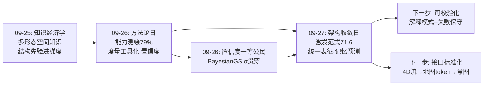
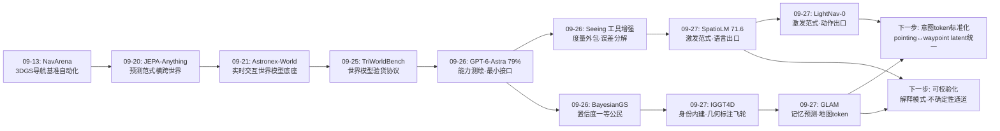
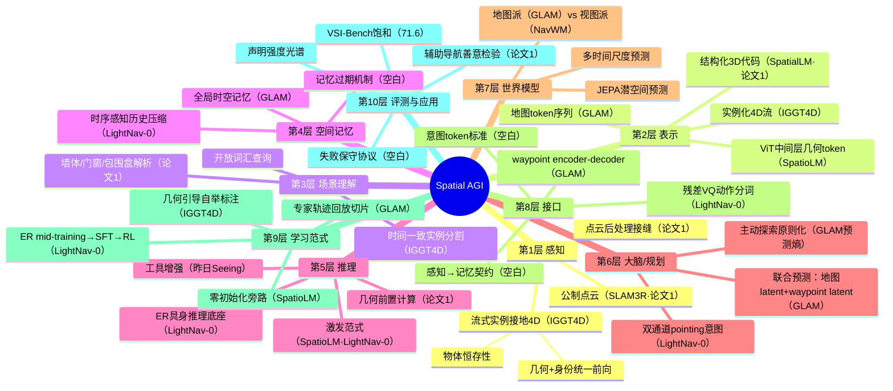
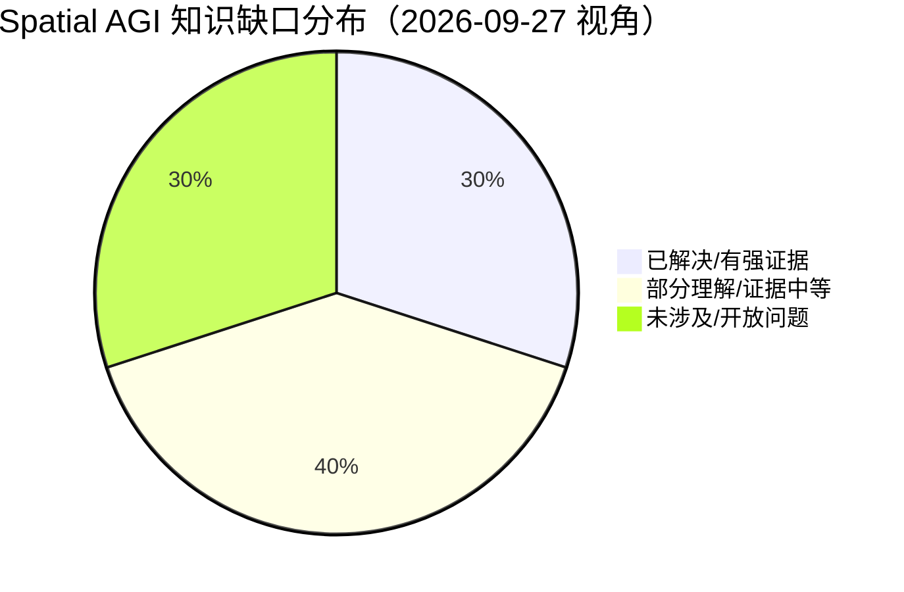

# Spatial AGI 每日深度思考 — 2026-09-27

**主题**: 内建、统一与可信 —— 空间智能的"架构收敛日"（激发范式 × 统一表征 × 记忆预测）

**论文**:
1. Assisted Spatial Cognition（2609.12747，Dublin City University 等）— SLAM3R+SpatialLM+本地LLM 辅助导航系统，显式几何路线 + "能算不要猜"
2. SpatioLM（2608.01899，小米 EV + 同济）— 冻结 VLM + 即插即用几何激发模块，VSI-Bench 71.6 首破 70
3. LightNav-0（2608.30935，20 人团队）— 激发 VLM 空间先验直出动作，10/10 导航环境单目 SOTA，真机跨本体零样本
4. IGGT4D（2607.19228）— 流式实例接地几何 Transformer，位姿+几何+实例ID 统一增量更新，147K 数据集
5. GLAM（2609.14561）— 地图 token 记忆上的 JEPA 式世界模型，联合预测未来地图与 waypoint 意图

---

## 📅 每日总结

**日期**: 2026-09-27
**论文数量**: 5篇
**主题**: 空间智能的"架构收敛日"。昨天（09-26）回答了"能力有多少、缺在哪、怎么诚实验货"；今天五篇论文从五个不同层级给出了同一个方向的答案：**空间智能的每一层都在从"外挂拼接"走向"内建统一"**。模型层（SpatioLM 从 VLM 内部激发几何而非外挂编码器）、动作层（LightNav-0 激发空间先验直出轨迹而非定制感知栈）、感知层（IGGT4D 把实例身份内建于几何表征而非外挂 SAM 关联）、认知层（GLAM 把世界模型内建于空间记忆而非独立预测模块）、应用层（论文1 用结构化中间表示让通用 LLM 获得空间认知而非训练专用模型）。五篇论文恰好覆盖空间智能栈的五层，且互相之间有清晰的级联与对照关系——这是研究笔记开始以来第一次"一天凑齐一整套栈"。

**关键突破**:
- 🚀 **激发范式完成"语言+动作"双出口验证**（SpatioLM + LightNav-0）：同一个月内，"从预训练 VLM 中激发空间先验"在语言出口拿到 VSI-Bench 71.6（首个破 70），在动作出口拿到 10/10 导航环境单目 SOTA + 真机跨本体零样本——"空间知识已存在于视觉预训练中，问题不是注入而是激发"从假说变成了双端验证的范式，空间能力的扩展成本从"重训模型"降为"外挂轻模块"
- 🚀 **度量深度的通用模型盲区被定量坐实**（SpatioLM 表 1）：GPT-5.2 单图度量深度 δ<1.25 只有 15.5，低于 7B 开源模型——旗舰通用模型对绝对深度几乎全盲，而 SpatioLM 在空间预训练底座上激发后达到 83.5 断层第一，"底座空间先验 × 激发模块"存在超线性协同
- 🚀 **感知层的"物体恒存性"被工程化**（IGGT4D）：物体消失重现保持同一 ID，实例身份成为几何表征的内生属性而非后处理关联——感知系统第一次具备了发展心理学意义上的"物体恒存"能力，且配套 147K 场景数据集与几何引导自动标注飞轮，4D 实例监督的稀缺瓶颈被打开
- 🚀 **空间记忆升级为可预测本体**（GLAM）：JEPA 式潜空间预测的对象从视频帧迁移到全局时空地图 token，未来地图与 waypoint 意图在共享空间联合推断——空间记忆从"存储结构"变成"可推演的世界模型载体"，"预测记忆的演化"成为主动探索的原则化基础
- 🚀 **显式几何路线给出应用层标杆**（论文1）：手机视频 → 公制点云 → 结构化 3D 代码 → 本地 LLM，为视障用户输出带精确米数的空间描述——"能算的不要猜"的工程化样板，与激发范式形成方法论上的两极对照

**架构演进**: 10 层架构五处推进：
- 第 1/2 层（感知/表示）：实例身份与几何统一（IGGT4D），不确定性之外的第二个一等公民"身份"就位
- 第 5 层（推理）：激发范式确立"语义在底座、几何可激发"的分层（SpatioLM），中间层 ViT token 成为空间资产
- 第 7 层（记忆）：地图 token 记忆成为世界模型的预测载体（GLAM），记忆与预测一体两面
- 第 6/7 层之间（认知）：感知→记忆→意图→动作的级联接口首次在一天的论文中全部出现
- 第 10 层（评测）：VSI-Bench 饱和临界（71.6）、10 环境单目 SOTA、"受控复现单基线"的诚实性光谱再次拉宽

### 📊 一句话总结

今天的五篇论文共同宣告：空间智能正在完成一次从"模块拼接"到"内建统一"的架构收敛——几何与身份统一于感知表征，空间先验内建于通用底座，世界模型内建于空间记忆；而显式几何路线在应用层的坚守提醒我们：统一表征的每一分优雅，都要用可验证性来付账。

### 🔗 延续性

**昨日（09-26）→ 今日**: 昨天确立的三个判断在今天全部得到推进或反证：(1) "语义在模型、度量在工具、配准在世界系"的三层分工——今天 SpatioLM 用 VSI-Bench 71.6 发起反攻：不外包工具，内建激发也能登顶，"度量必须外包"的结论需要加上条件（安全攸关 vs 体验优先）；(2) "置信度是一等公民"——今天论文1 的显式几何路线延续了这一方向，而激发范式的黑箱性恰好反衬其必要；(3) "接口是被低估的能力来源"——今天 LightNav-0 的双通道 pointing 与 GLAM 的 waypoint latent 是接口层创新的延续，接口从"输入什么"演进到"意图以什么形态存在"。

**今日→明日**: 四条线索——(1) "激发范式的可校验化"：给 SpatioLM 类模型加解释模式（输出几何依据），量化可解释性税；(2) "感知→记忆接口标准化"：IGGT4D 实例流如何折叠成 GLAM 地图 token 的契约设计；(3) "地图派 vs 视图派世界模型对决"：GLAM 与 NavWM 需要在同一基准上分高下；(4) "辅助导航基准"：论文1 场景的失败保守性测试协议。

### 💡 本质思考：如何达成通用空间智能

#### 1. 核心能力的本质是什么？

今天五篇论文把空间智能的能力清单推进到"统一论"层面：

1. **空间智能 = 分层统一的表征体系，而非能力清单的堆叠**（今日主旋律）：IGGT4D 证明几何与身份可以统一于一个前向传播，SpatioLM 证明语义与几何统一于预训练底座的中间层，GLAM 证明记忆与预测统一于地图 token 的序列动力学。每一项统一都消灭了一类接口误差与一套拼接成本——空间智能的进步史就是统一史：从"SLAM+分割+规划的拼接"到"一个 Transformer 的因果前向"。

2. **空间知识的存在形态是"可激发的先验"而非"可注入的数据"**（SpatioLM + LightNav-0 的范式宣言）：互联网级视觉预训练已经隐式编码了空间结构（中间层几何、grounding 先验、pointing 能力），训练的作用是"解锁"而非"写入"。这改变了成本曲线：空间能力的边际扩展从"收集 3D 数据重训"变为"设计更好的激发接口"。但底座决定天花板——SenseNovaSI 底座 83.5 vs InternVL 底座 50.9 的断层说明：激发范式的前提是"有东西可激发"，空间预训练底座是本金，激发模块只是利息放大器。

3. **空间认知的单元是"带身份的持久实体"**（IGGT4D 的物体恒存性）：空间智能的最小语义单元不是像素、不是几何面片、甚至不是类别，而是"跨时间持续的个体"。婴儿 8-12 个月获得物体恒存性才开始真正的空间认知——机器感知系统在获得"消失重现保持 ID"之前，所有上层推理都建立在流沙上。IGGT4D 把这一认知科学里程碑工程化，其意义超过任何 benchmark 分数。

4. **空间记忆的价值在于可推演性**（GLAM）：记忆不是归档，是模拟器。认知地图理论的计算化要求记忆本身支持"如果我往那走，我的世界模型会变成什么样"的反事实推演——GLAM 的地图 token 预测正是这一能力的最小实现。空间智能与普通视觉智能的分界线，或许就在"记忆是否可预测"这一点上。

#### 2. 当前方法与理想目标的差距在哪里？

- **统一表征的可校验性赤字**：激发范式（SpatioLM）与统一感知（IGGT4D）都产出黑箱答案——空间断言无法回溯到几何证据。与论文1 的显式几何路线对比，统一性的每一分收益都对应可验证性的一分损失。"既统一又可校验"的表示（如带不确定性通道的实例化 4D token）尚不存在。
- **层间接口仍是各写各的**：IGGT4D 的输出如何变成 GLAM 的输入？LightNav-0 的 pointing 与 GLAM 的 waypoint latent 是不是同一个东西？五篇论文级联起来看，接口的碎片化触目惊心——每个模型都定义了自己的中间表示，社区层面没有"空间智能栈的 USB 标准"。
- **评估的诚实性光谱依然悬殊**：LightNav-0 的 10/10 SOTA 与 4K 小时数据是重量级声明，GLAM 的"受控复现单基线"是轻量级声明，SpatioLM 的双底座消融居中。三种声明强度混在同一片论文流里，读者需要自备过滤器。VSI-Bench 在 71.6 之后进入饱和区间，下一代空间基准（分布外、真机、带代价的错误度量）缺位。
- **安全与统一的矛盾未解**：统一表征的系统（端到端、黑箱）与安全要求（可审计、失败保守）方向相反。论文1 场景里一个幻觉的可通行区域就是一次碰撞——激发范式的动作出口（LightNav-0）继承了这一风险且无解法。置信度（昨日主题）与统一表征（今日主题）尚未会师。
- **动态世界的记忆一致性**：GLAM 的地图记忆预设静态假设，IGGT4D 处理动态但不做长时记忆——"有人在房间里移动了椅子"之后，两个系统的记忆都是错的。空间记忆的过期与更新机制是完全开放的空白。

#### 3. 从今天到理想状态，最可能的路径是什么？

1. **激发范式标准化期**（近期，1-2 季度）：SV-Module 式激发模块成为 VLM 的标配外设；中间层几何 token 的跨模型复用协议出现；"底座空间先验审计"成为选型方法论。首批杀手应用：端侧空间问答、VLA 认知底座。
2. **感知-记忆接口期**（中期，半年）：实例化 4D 流（IGGT4D）→ 地图 token（GLAM）→ 意图潜变量（GLAM/LightNav-0）的接口契约标准化，出现"空间智能栈参考架构"论文；4D grounding（语言查询 4D 记忆）成为新基准类别。
3. **可信化合流期**（中期-远期）：统一表征加入不确定性通道（昨日 BayesianGS 路线与今日 IGGT4D/GLAM 路线会师），空间断言携带置信度、失败保守成为动作出口的硬约束；解释模式（输出几何依据）成为空间模型的评测维度。
4. **空间操作系统期**（远期）：昨日 WAA 的 OS 同构与今日的五层栈合流——感知中间件、记忆服务、激发模块、动作分词器像操作系统组件一样即插即换，竞争从单点模型转向栈级生态。

---

## 🔗 与昨日思考的联系

### 昨日重点

09-26"方法论日"确立了四个核心判断：(1) 能力测绘先于能力建设——GPT-6-Astra 测出零样本导航 79% 的基础模型原生水位；(2) "语义在模型、度量在工具、配准在世界系"的三层分工——Seeing Is Not Measuring 的误差分解证明感知才是瓶颈；(3) 置信度是一等公民——BayesianGS 把不确定性焊回神经渲染 SLAM 全管线；(4) 接口复杂度应与任务性质匹配——WAA 工作区 vs GPT-6-Astra 最小接口的对偶。评测层诊断出"7% 对比率"的生态错配。

### 今日进展

今天的五篇与昨天构成三组精确的对话关系：

**对话一：工具外包 vs 内建激发**。昨天的 Seeing 证明"度量必须外包给确定性工具"（方向判断从低于瞎猜到 73.4%）；今天 SpatioLM 反攻：不外包任何工具，从 ViT 中间层激发几何知识，VSI-Bench 71.6 登顶。两篇合起来才得到完整答案：外包赢在可校验性（显式工具输出可审计），激发赢在延迟与部署简洁（单次前向无工具链）。安全攸关场景（论文1 的辅助导航）选外包，通用平台选激发——"度量在哪算"成为场景函数而非普适定律。

**对话二：接口形态的进化**。昨天的接口是"输入什么"（WAA 的视角供给、GPT-6-Astra 的最小工具）；今天的接口是"意图以什么形态存在"——LightNav-0 的双通道 pointing 把异构任务统一为空间中的指认点，GLAM 的 waypoint latent 把导航意图变成可与世界预测联合推断的潜变量。接口设计从 I/O 层上升到了表示层。

**对话三：置信度主线的延续与缺口**。昨天 BayesianGS 让几何不确定性贯穿 SLAM；今天 IGGT4D 让实例身份贯穿 4D 表征——几何的"σ"与语义的"ID"是空间表示两大一等公民，但两者的联合表示（带置信度的实例化 4D token）依然缺席。这是把昨日与今日主线焊接起来的明确工程缺口。

### 演进路径



---

## 📚 论文概览

**论文1（Assisted Spatial Cognition，应用层/显式路线）**: 为视障与神经多样性用户构建辅助导航系统：手机单目视频 → SLAM3R 实时稠密点云 → 自研后处理（去噪/z-up/调平/2.5m 层高尺度归一化/跨视点对齐）→ SpatialLM 结构化解析（墙体/门窗/带朝向包围盒）→ 本地 GPT-OSS-20B 生成带精确距离的自然语言场景描述。核心贡献在"接缝"：点云后处理与结构化代码接口，坚持"能算的不要猜"。局限：无定量基准、20B 模型端侧不可行、拍摄规范对真实用户不友好。

**论文2（SpatioLM，模型层/激发范式）**: 冻结 VLM 全部参数，外挂 ControlNet 式 Spatio-Vision Module，从 ViT 第 16/24 层中间 token 激发几何知识，零初始化投影逐层注入 LLM；伪深度与相机光线图作为训练期辅助监督（推理期零 3D 输入）。VSI-Bench 71.6 首破 70；SenseNovaSI-8B 底座上 MD-S 83.5 断层第一（GPT-5.2 仅 15.5）；可迁移 VLA 且通用能力不掉。核心机制：零初始化保证训练起点严格等价于原模型，能力随训练平滑注入。

**论文3（LightNav-0，动作层/激发范式）**: 激发 VLM 已有的 grounding/空间推理/pointing 先验直接驱动导航。双通道 pointing 统一三种任务为"空间意图"，残差向量量化动作分词器把意图解码为本体专属轨迹；时序感知历史压缩 + ER 中期训练（LightNav-ER）+ SFT + RL 四段配方。2K+ 场景 4K+ 小时数据，10/10 公开导航环境单目 SOTA，真机跨本体零样本。导航进入基础模型时代的宣言。

**论文4（IGGT4D，感知层/统一表征）**: 流式因果时空 Transformer 按帧顺序处理视频，增量更新"相机运动+几何+物体身份"统一表示；物体消失重现保持 ID（物体恒存性工程化）；配套 InsScene4D-147K 数据集（真实/合成 × 静态/动态，几何引导自动标注生成时间一致实例掩码）。重建/位姿/实例追踪/开放词汇分割全面超越流式基线。数据飞轮与架构创新双轮驱动。

**论文5（GLAM，认知层/记忆预测）**: 在全局时空记忆（地图 token 序列）上训练 JEPA 式潜空间世界模型：输入（历史地图 token，目标，位姿），联合预测未来地图 latent 与 waypoint latent（共享空间互相约束）；GLAM NAV 用预训练 waypoint encoder-decoder 监督与解码。Habitat/HM3D 专家轨迹回放多尺度切片训练，SR/SPL 优于复现 BSC-Nav。空间记忆第一次成为世界模型的预测载体与本体。实验强度偏弱（单基线受控复现），范式示范价值大于性能证明。

**级联视角**: IGGT4D（感知：实例化 4D 流）→ GLAM（认知：折叠为地图 token 并预测演化）→ LightNav-0（行动：意图落地为轨迹）→ 论文1（应用：空间信息语言化服务于人）；SpatioLM（模型底座）为全栈提供激发范式的方法论。五篇凑齐一层栈。

---

## 💡 核心见解

### 见解1: 激发范式从假说升级为双端验证的路线（SpatioLM + LightNav-0）

- ✅ 语言出口：VSI-Bench 71.6（首破 70），纯 2D 输入推理、无 3D 先验、无外部编码器
- ✅ 动作出口：10/10 导航环境单目 SOTA + 真机跨本体零样本
- ✅ 共同前提：互联网级视觉预训练已隐式编码空间结构（ViT 中间层几何、grounding/pointing 先验）
- ✅ 共同代价：底座决定天花板（SenseNovaSI 83.5 vs InternVL 50.9），且输出黑箱不可审计

**对Spatial AGI的启发**: "空间能力如何叠加到通用智能体"的答案从"重训大模型"降为"外挂轻模块+设计激发接口"，空间智能的边际成本曲线被永久拉低。但 83.5 vs 50.9 的底座断层给出了必要条件：先做底座空间先验审计（这本金有多少），再谈激发（利息放大多少）。2026 下半年看空间预训练底座（SenseNovaSI 类）与激发模块的生态分化。

### 见解2: 度量外包 vs 内建的争论有了场景化答案（论文1 + SpatioLM，对昨日 Seeing 的回应）

- ✅ 外派证据（昨日 Seeing）：工具编排使相对方向从低于瞎猜到 73.4%，可审计
- ✅ 内建证据（今日 SpatioLM）：零工具单次前向登顶 VSI-Bench，无编排延迟与级联错误
- ✅ 论文1 给出第三条路：度量计算前置到几何层（"能算的不要猜"），LLM 只做转述

**对Spatial AGI的启发**: "度量在哪算"不是路线之争而是场景函数——错误代价 × 延迟预算 × 部署约束的三元组决定选择。安全攸关（辅助导航、驾驶）必须显式几何兜底；体验优先（空间问答、AR 滤镜）可用激发范式。值得注意的是第三条路（几何层前置计算+LLM 转述）可能是安全场景的最优解：比纯外包快（无多步工具链）、比纯内建可信（数值来自计算而非生成）。

### 见解3: 物体恒存性被工程化，感知获得最小语义单元（IGGT4D）

- ✅ 实例身份内建于几何表征：跨帧保持 ID、消失重现可再认，单次前向无后处理关联
- ✅ 因果流式设定与智能体感知循环形态匹配（在线、有界延迟、长序列可扩展）
- ✅ 几何引导自动标注飞轮：几何一致性自动生成时间一致实例掩码，147K 规模工程化跑通

**对Spatial AGI的启发**: 发展心理学的物体恒存性（8-12 个月获得）是空间认知的发育里程碑——机器感知系统在此之前的所有"理解"都是逐帧幻灯片。IGGT4D 的深层意义是把"持久实体"变成表征的内生属性，为上层推理（"去拿那个杯子"需要跨时间追踪同一物体）提供地基。数据飞轮的元启示更大：Spatial AGI 的数据稀缺可能靠"用已有能力自举标注"解决，而非人工采集。

### 见解4: 空间记忆升级为可预测本体，记忆与预测一体两面（GLAM）

- ✅ 预测对象从视频帧迁移到地图 token：布局与语义结构可预测，外观细节不必生成
- ✅ 未来地图 latent 与 waypoint latent 联合预测：意图与空间预期互相约束
- ✅ "预测记忆的演化"为主动探索提供原则化基础（预测熵=探索价值）

**对Spatial AGI的启发**: 认知地图理论（Tolman 1948）的计算化要求记忆支持反事实推演——GLAM 的地图 token 预测是这一要求的最小实现。空间智能与普通视觉智能的分界线或许就在这里：前者拥有"如果我往那走，我的记忆会变成什么样"的推演能力。但实验强度（单基线受控复现）配不上范式雄心，地图派 vs 视图派（NavWM）需要同台对决。

### 见解5: 空间意图成为接口层的新抽象（LightNav-0 + GLAM）

- ✅ 双通道 pointing：任务/场景/本体三无关的空间意图表达，架构层面消灭任务专属预测头
- ✅ waypoint latent：导航意图作为潜变量与世界预测联合推断
- ✅ 残差 VQ 动作分词：离散 token 化与轨迹精度的两全

**对Spatial AGI的启发**: 接口设计从 I/O 层（昨日 WAA 的工作区、GPT-6-Astra 的最小工具）上升到表示层——"意图以什么形态存在"成为新的设计核心。LightNav-0 的 pointing 与 GLAM 的 waypoint latent 几乎是同一个概念的两种实现（视觉坐标版 vs 潜变量版），两者的统一（意图 token 标准）是接口标准化的下一个焦点。这种"把多样任务还原为单一空间操作"的还原论，是基础模型美学在具身智能的最成功应用之一。

### 见解6: 结构化中间表示是通用 LLM 获得空间能力的通用桥（论文1，与昨日 WAA 呼应）

- ✅ SpatialLM 的"室内代码"（类别+坐标+尺寸+朝向的文本编码）让 20B 通用 LLM 直接做距离计算与布局描述
- ✅ 结构化表示可人工审计——直接读文本检查错误，安全场景的关键属性
- ✅ 点云预处理质量决定下游上限：几何噪声被语言模型放大为语义幻觉

**对Spatial AGI的启发**: 空间能力的接口有两种：结构化符号（论文1，可审计但表达受限）与连续潜变量（GLAM/LightNav-0，表达强但黑箱）。两者分别对应"符号主义遗产"与"连接主义正统"的空间版。长期看需要混合表示：结构化骨架（可审计的对象/关系层）+ 潜变量细节（几何/外观层）——类似场景图的神经化升级。另外，"接缝创新"再次被验证：基础模型时代，系统级突破越来越多发生在模型之间的接缝处而非模型内部。

### 见解7: 评估诚实性光谱与基准饱和的临界点（全五篇的元观察）

- ✅ 光谱三档：LightNav-0（10 环境+真机，重声明）、SpatioLM（双底座+多基准消融，中声明）、GLAM（受控复现单基线，轻声明）
- ✅ VSI-Bench 71.6 后进入饱和区间，需要分布外/真机/带代价错误度量的下一代基准
- ✅ 度量深度的惊人发现：GPT-5.2 MD-S 仅 15.5——旗舰通用模型对绝对深度几乎全盲

**对Spatial AGI的启发**: 阅读论文需要自带"声明强度过滤器"：重声明看复现、轻声明看范式。GPT-5.2 深度全盲的定量证据是给"通用模型已具备空间智能"乐观论的冷水——通用智能与空间智能的能力矩阵几乎正交（语言推理满分、绝对深度不及格），这正是 Spatial AGI 作为独立研究议程存在的根本依据。下一代空间基准的设计要点：分布外场景、真机闭环、错误代价加权（错 0.5m 与错 5m 不同罪）。

---

## 🗺️ 知识演进图



---

## 技术栈演进对比表

| 层次 | 昨日方案（09-26） | 今日方案（09-27） | 变化 |
|------|---------|---------|------|
| 感知层 | BayesianGS：几何+σ不确定性贯穿SLAM | IGGT4D：几何+实例ID统一流式4D | 一等公民从"不确定性"扩展到"身份"；前馈流式 vs 优化式SLAM |
| 表示层 | 语义场/特征缓存/物体级预感（知识形态） | ViT中间层token（几何富集区）、地图token序列、实例token | 表示从"描述性"转向"可激发+可预测" |
| 模型层 | GPT-6-Astra：原生能力测绘（零样本79%） | SpatioLM：外挂激发模块（71.6首破70） | 从"测原生水位"到"用轻模块抬水位"；工具外包→内建激发的反攻 |
| 推理层 | Seeing：编排-感知分解，工具链度量 | 论文1：几何层前置计算，LLM仅转述 | "能算不要猜"两种实现：工具链 vs 几何前置 |
| 大脑层 | WAA 视觉动作工作区（提案-预演-修正） | LightNav-0 双通道pointing统一三任务 | 接口从"供给什么视角"到"意图以何形态存在" |
| 记忆层 | （09-25 语义场/特征缓存概念） | GLAM 地图token记忆=世界模型预测载体 | 记忆从存储结构升级为可推演本体 |
| 行动层 | （WAA 动作即提案） | 残差VQ动作分词+跨本体零样本 | 动作离散化成熟；导航基础模型时代开启 |
| 数据层 | （综述：160基准生态诊断） | InsScene4D-147K+几何引导自动标注飞轮 | 数据策略从采集转向能力自举 |
| 评测层 | 三方误差分解、7%对比率诊断 | 声明强度光谱（重/中/轻）；VSI-Bench饱和 | 需要"声明强度过滤器"；下一代基准缺位 |
| 应用层 | （未直接涉及） | 论文1辅助导航：公制距离+失败保守需求 | 应用层回归：空间智能的"善意检验" |

---

## 🗺️ Spatial AGI 知识图谱

### 10层架构思维导图



### 🎯 主线技术路径

#### 阶段1: 模块拼接时代（~2023-2024）
SLAM + 分割 + 规划的流水线组合，每模块独立误差，接口靠人工胶水。空间智能是系统工程的堆叠。

#### 阶段2: 端到端专用化时代（2024-2025）
每个任务训一个端到端模型（导航模型、操作 VLA、驾驶模型），泛化受限，通用能力被空间微调破坏（灾难性遗忘）。

#### 阶段3: 激发与统一时代（2026，当前）
冻结通用底座 + 激发模块（SpatioLM/LightNav-0）；感知内建实例身份（IGGT4D）；记忆内建预测（GLAM）。空间能力以"轻模块+接口"叠加于通用智能，模块间拼接转向层内统一。

#### 阶段4: 栈标准化时代（2026H2-2027，预期）
感知→记忆→意图→动作的接口契约标准化；意图 token（pointing/waypoint latent 统一）成为跨模型通货；空间智能栈参考架构确立；4D grounding 成为标准评测类别。

#### 阶段5: 可信空间操作系统（2027+，愿景）
统一表征 + 不确定性通道合流（BayesianGS × IGGT4D/GLAM）；失败保守成为动作出口硬约束；解释模式（几何依据输出）成为评测维度；组件即插即换，竞争转向栈级生态。

---

## 🔍 待探索议题

### 高优先级（本周）

1. **激发范式的可校验化**
   - 问题: SpatioLM 类黑箱空间答案无法回溯几何证据，安全场景不可用
   - 候选方案: 解释模式（要求模型同时输出估计深度图/几何依据）；不确定性头校准
   - 缺口: 可解释性税的定量测量（加解释掉多少分）完全空白

2. **感知→记忆接口契约**
   - 问题: IGGT4D 实例流如何折叠成 GLAM 地图 token？栅格化/实例列表/混合三方案未定
   - 候选方案: BEV 栅格+实例锚点的分层表示；定义"4D 流→记忆 token"的中间交换格式
   - 缺口: 没有任何论文定义这一接口；需要社区级参考实现

3. **意图 token 标准**
   - 问题: LightNav-0 双通道 pointing 与 GLAM waypoint latent 是同一概念的两种实现
   - 候选方案: 统一"空间意图 token"规范（语义通道+几何通道+置信度通道）
   - 缺口: 两个模型的意图表示不兼容，跨模型迁移实验缺失

### 中优先级（本月）

4. **地图派 vs 视图派世界模型对决**
   - 问题: GLAM（预测地图记忆）与 NavWM（预测导航视图）从未同台
   - 候选方案: 在 HM3D-ObjectNav 全量+长时程任务上头对头
   - 缺口: 公平的算力与数据对齐协议；延续昨日"对比率 7%"诊断

5. **辅助导航的失败保守协议**
   - 问题: 论文1 场景中一次幻觉播报=一次碰撞，无评估协议度量"保守性"
   - 候选方案: 注入噪声/遮挡，统计"承认不确定 vs 编造答案"比率；错误代价加权基准
   - 缺口: 视障用户参与的真实可用性研究为零

6. **空间记忆的过期与更新**
   - 问题: 动态世界（椅子被移动）使 GLAM/IGGT4D 记忆失效，无记忆过期机制
   - 候选方案: 记忆时间戳+证据衰减；预测-观测偏差触发的局部重置
   - 缺口: 动态环境下的长时记忆基准完全缺失

7. **底座空间先验审计方法论**
   - 问题: 激发范式上限由底座决定（83.5 vs 50.9），但"底座有多少可激发资产"无法先验得知
   - 候选方案: 线性探针扫描 ViT 各层几何信息量；激发增益预测器
   - 缺口: 探针结果与激发模块实际增益的相关性未验证

### 低优先级（本季度）

8. **中间层几何 token 的跨模型复用**
   - 问题: 16/24 层选择是底座相关经验值，跨 ViT 深度/配方不可移植
   - 候选方案: 可学习层加权、多头跨层采样
   - 缺口: 自适应层选择机制无系统研究

9. **非刚体与人群的 4D 实例表示**
   - 问题: 实例接地预设"物体=连通刚体"，布料/液体/人群整体失效
   - 候选方案: 场/粒子/拓扑表示与实例框架的混合
   - 缺口: 非刚体 4D 一致性监督信号不存在

10. **单目导航的物理极限刻画**
    - 问题: LightNav-0 单目 SOTA 的深度不确定性上限未理论化
    - 候选方案: 深度模糊场景集（玻璃/镜面/重复纹理）的失败模式分类学
    - 缺口: 单目 vs RGB-D 的能力边界地图

---

## 📊 知识缺口分析



**已解决/有强证据（30%）**:
- ✅ VLM 潜在空间先验可激发且登顶（VSI-Bench 71.6 + 10/10 导航 SOTA）
- ✅ 几何与实例身份可统一前向学习（IGGT4D 四任务超越基线）
- ✅ 结构化中间表示让通用 LLM 获得空间认知（论文1 全流水线验证）
- ✅ 残差 VQ 解决动作离散化与精度矛盾
- ✅ 4D 实例监督可自举（几何引导标注飞轮，147K）

**部分理解/证据中等（40%）**:
- ⚠️ 空间记忆作为世界模型载体（GLAM 单基线，范式成立但性能未证）
- ⚠️ 激发范式的底座依赖规律（双底座证据，但审计方法论缺失）
- ⚠️ 跨本体零样本的边界（真机验证存在，本体覆盖与码本机制不明）
- ⚠️ 意图潜变量接口（pointing 与 waypoint latent 分立发展，未统一）
- ⚠️ 长时程记忆与历史压缩的信息损失规律
- ⚠️ 中间层几何富集的机制解释（16/24 层是经验值）
- ⚠️ 假设动态/static 环境下的记忆一致性

**未涉及/开放问题（30%）**:
- ❌ 统一表征的不确定性通道（可校验的黑箱表示）
- ❌ 感知→记忆→意图的接口标准（4D grounding 协议）
- ❌ 空间记忆的过期/更新机制（动态世界）
- ❌ 失败保守性协议（安全攸关评估）
- ❌ 非刚体 4D 实例表示
- ❌ 下一代空间基准（分布外/真机/错误代价加权）
- ❌ 人类被试的空间智能可用性研究（辅助场景）

---

## 🧭 主线判断更新

**判断一（更新）**: "度量必须外包"修正为"度量计算位置是场景函数"——安全攸关选显式几何兜底（论文1 的几何前置计算），通用平台选内建激发（SpatioLM）。置信度：高（双端证据收敛）。

**判断二（新增）**: 空间智能栈正发生"层内统一"的范式收敛——每一层的多个外挂模块正在被一个统一表征吞并（几何+身份→IGGT4D；记忆+预测→GLAM；任务→pointing）。下一个被吞并的是层间接口本身。置信度：中高（趋势明确，时间表未知）。

**判断三（新增）**: 激发范式重新定义了空间能力的成本曲线，但引入了新的稀缺资源——底座空间先验。空间预训练底座（SenseNovaSI 类）将成为类似"石油"的战略资产，激发模块是"精炼技术"。置信度：中（单篇证据，需跨底座复现）。

**判断四（延续昨日）**: 置信度主线出现第二个缺口——昨日缺"语义置信×几何置信的乘积"，今日缺"身份置信"（实例 ID 的可靠性）。三者（几何 σ、语义置信、ID 置信）的联合表示是可信空间智能的表示层终局。置信度：高（三份独立证据收敛）。

**判断五（新增）**: 应用层回归是 2026H2 的信号——论文1（辅助导航）代表的需求侧工作开始出现。空间智能的"善意检验"（能否让盲人独立穿过车站）将逐步替代 benchmark 分数成为终极裁判。置信度：中（单一样本，但方向符合技术成熟曲线）。

---

## 📝 今日金句存档

1. "空间智能的进步史就是统一史：从拼接的流水线到一个前向传播。"（IGGT4D 启示）
2. "激发范式的前提是有东西可激发——底座是本金，模块是利息。"（SpatioLM 的 83.5 vs 50.9）
3. "物体恒存性是感知与认知的分水岭：在此之前的一切理解都是逐帧幻灯片。"（IGGT4D）
4. "记忆不是归档，是模拟器——空间记忆的价值在于可推演性。"（GLAM）
5. "统一表征的每一分优雅，都要用一分可验证性来付账。"（激发范式 vs 显式几何）
6. "能算的不要猜：LLM 是空间信息的组织者与转述者，不应是度量估计器。"（论文1）
7. "接口设计已从 I/O 层上升到表示层：意图以什么形态存在，决定了智能体是什么。"

---

## 🔭 明日展望

优先跟踪方向：
1. 激发范式在 VLA 领域的跟进（LightNav 式动作出口 × SpatioLM 式语言出口的合流）
2. NavWM 与 GLAM 的正面对比信号（地图派 vs 视图派裁决）
3. InsScene4D-147K 的开源与社区采用（4D 实例基准能否成为 ScanNet 级基础设施）
4. 空间预训练底座（SenseNovaSI 谱系）的迭代与审计方法
5. 下一代空间基准（VSI-Bench 饱和后的继承者）的讨论信号

---

*文档版本: v1.0 | 生成时间: 2026-09-27 03:30 CST | 基于今日 5 篇精读 + 昨日思考延续*

---

## 🧪 深度扩展一：五篇论文的交叉实验矩阵

把五篇论文放到同一个坐标系里审视，会发现它们互相构成了对方的"对照实验"：

### 1. 可校验性 × 统一性的二维定位

| | 低统一性（模块拼接） | 高统一性（内建表征） |
|---|---|---|
| **高可校验** | 论文1（显式几何流水线，每步可审计） | （空白：统一且可校验的表示不存在） |
| **低可校验** | （传统松耦合黑箱管线） | SpatioLM/GLAM/LightNav-0（黑箱但统一） |

- 右上角的空白就是"可信统一表征"的机会位：带不确定性通道与证据回溯的实例化 4D token。
- 论文1 与 SpatioLM 的对角线关系是今日最重要的方法论对偶——两者各自的短板恰好是对方的长板。
- 预测：右上角将在 2-3 个季度内被填上（IGGT4D + BayesianGS 思路的合流是候选路径）。

### 2. 数据策略的三个世代

| 世代 | 策略 | 代表 | 成本 |
|---|---|---|---|
| G1 人工采集 | 真人标注/扫描 | 传统 3D 数据集 | 极高 |
| G2 仿真合成 | 物理仿真渲染 | LightNav-0 的 Habitat 数据 | 中 |
| G3 能力自举 | 已有模型生成监督 | IGGT4D 几何引导标注、SpatioLM 伪深度 | 低（边际） |

- G3 的两个今日样本共用同一哲学：用"已有的强能力"（几何重建/深度估计）自动生成"稀缺的弱资源"（实例掩码/深度标签）。
- 风险共性：自我蒸馏偏差的累积。两个工作都没有讨论标注质量的周期性人工抽检——这是 G3 世代的公共债务。

### 3. 训练配方的收敛

LightNav-0 的四段配方（压缩→ER mid-training→SFT→RL）与 GLAM 的回放切片训练、SpatioLM 的冻结+旁路，表面迥异，内里同构：

1. **先建通用表征底座**（ER mid-training / 冻结底座 / 预训练 encoder）
2. **再加任务接口**（pointing 分词器 / SV-Module / waypoint decoder）
3. **最后任务优化**（RL / 旁路训练 / 联合预测）

"底座-接口-精调"三段式正在成为空间智能模型的标准训练课程学，取代"一锅端到端"的旧配方。

---

## 🧪 深度扩展二：激发范式的经济学分析

### 1. 成本结构的范式迁移

旧范式（注入式）的成本结构：
- 3D 数据采集/合成（固定成本高）
- 大规模 3D 微调（算力高）
- 灾难性遗忘的修复（回放/正则，额外复杂度）
- 每个新空间任务重复以上循环

新范式（激发式）的成本结构：
- 一次性的底座空间预训练（SenseNovaSI 类，已有人做）
- 轻量激发模块训练（参数量 1-2 个数量级低于底座）
- 底座复用跨任务摊销

边际成本的对比如同"每个城市自建电厂 vs 接入国家电网"。这解释了为什么激发范式在 2026 年快速占优：不是因为精度更高，而是因为成本结构可扩展。

### 2. 新的瓶颈与稀缺资源

- **底座空间先验成为战略资产**：83.5 vs 50.9 的断层意味着激发模块的红利分配完全由底座决定。空间预训练底座的打造（数据、配方）成为新的"重工业"。
- **激发接口设计成为新的稀缺人才领域**：如何"打开"预训练表征（层选择、注入位置、辅助监督设计）是手艺活，论文之间差异巨大。
- **审计能力的缺失是隐性负债**：黑箱红利以可校验性为抵押——这笔债何时被追缴（监管？事故？）未知。

### 3. 对产业格局的推演

- 底座厂商（有空间预训练数据的玩家：自动驾驶公司、机器人公司、地图商）获得新护城河；
- 激发模块可能开源化、商品化（类似今天的 LoRA 生态）；
- 应用层竞争上移到"底座选择 + 接口设计 + 垂直场景数据"的组合能力。

---

## 🧪 深度扩展三：物体恒存性与空间认知的发育学对照

把 IGGT4D 的能力放回皮亚杰感知运动阶段的发育序列，可以画出一张"机器空间认知发育表"：

| 发育里程碑（人类月龄） | 认知内容 | 机器对应 | 状态 |
|---|---|---|---|
| 0-2月 | 反射性注视 | 逐帧检测 | ✅ 早已达成 |
| 4-8月 | 视觉抓取协调 | grounding + 检测 | ✅ 成熟 |
| 8-12月 | **物体恒存性** | 跨帧实例 ID 保持 | 🔄 IGGT4D 刚达成（受限于遮挡时长） |
| 12-18月 | 空间工作记忆（隐藏地点搜索） | 记忆+定位（A-not-B 错误测试） | ⚠️ 部分达成（GLAM 记忆无过期机制） |
| 18-24月 | 工具使用达成空间目标 | 工具增强推理（昨日 Seeing） | ✅ 初步达成 |
| 2-3岁 | 心理旋转/空间语言 | 空间 VQA（SpatioLM） | ✅ 基准分数高但真值存疑 |
| 3-5岁 | 路径积分与地图绘制 | 全局一致性导航 | ❌ 公共短板（昨日 GPT-6-Astra 到达失败） |
| 5岁+ | 反事实空间推理 | 世界模型推演 | 🔄 GLAM 起步 |

这张表的价值：
1. **定位当前机器空间认知的整体"发育年龄"**：大约 2-3 岁水平（语言超前、路径积分滞后）——比大多数 benchmark 排名给人的直觉要保守；
2. **指出下一个里程碑**：从"物体恒存"到"空间工作记忆"（A-not-B 测试的机器版：物体藏在 A 处多次后移到 B，模型能否抵抗位置惯性？）——这是一个可以直接工程化的实验协议；
3. **揭示发育顺序的反常**：机器在"心理旋转"（3 岁能力）上的分数超过"路径积分"（5 岁能力），与人类发育顺序相反——语言先行的训练路线扭曲了能力发育的自然次序，可能是路径积分短板的根源。

---

## 🧪 深度扩展四：GLAM 认知回环与经典机器人架构的对位

GLAM 的"读记忆→预测→行动→写记忆"回环，与经典机器人认知架构的对位分析：

| 经典概念 | GLAM 对应 | 差异 |
|---|---|---|
| 世界模型（model-based RL） | 地图 latent 预测器 | 预测对象是记忆而非世界状态 |
| 认知地图（Tolman/Hafting 网格细胞） | 全局时空记忆 token | 可学习、无手工拓扑 |
| MPPI/前瞻规划 | waypoint latent 联合推断 | 无显式采样，潜空间一次前向 |
| SLAM 状态估计 | 感知前端折叠进地图 token | 位姿信息内化，无显式因子图 |
| Active Inference（自由能） | 预测熵驱动的探索（潜力） | 尚未实现校准的不确定性 |

三个深层观察：

1. **GLAM 是"认知地图 = 可推演的生成模型"这一理论的最小机器实现**——但它推演的是记忆 token 而非世界本体，这带来一个哲学后果：模型的"想象"是关于自己记忆的想象，错误会以"记忆被误更新"的形式固化。
2. **与 Active Inference 的距离只差一个校准的不确定性头**——GLAM 若加入预测方差输出，探索策略即可从"启发式"升级为"自由能最小化"，这是最高性价比的后续工作方向。
3. **经典架构的可解释组件（因子图、显式地图）在 GLAM 中全部潜变量化**——效率提升的同时，调试手段从"检查地图"退化为"检查 token 统计量"。机器人工程师的直觉在此失效，需要新一代的潜空间诊断工具（token 熵曲线、预测-观测偏差图）。

---

## 🧪 深度扩展五：论文1 的社会技术系统视角

论文1 技术上最薄弱（无定量基准），但需求定义最锋利。值得单独做一次"社会技术系统"分析：

### 1. 信息通道的带宽匹配

- 视障用户的主动感知通道：听觉（约 3-5 bits/s 有效带宽）+ 触觉；
- 论文1 系统的输出：全量场景描述（数十秒语音）；
- **错配**：系统生产的信息量远超用户消费带宽。真可用系统需要信息压缩策略：只播报"行动相关的空间信息"（最近障碍、可行方向），这要求系统理解用户意图——空间智能从"描述场景"升级为"回答行动问题"。

### 2. 信任校准问题

- 辅助系统的信任是单向脆弱的：一次自信错误（玻璃门报成通道）可能导致永久弃用；
- 信任校准要求系统表达不确定性（"前方可能有障碍，我不确定"），但这与"流畅体验"矛盾；
- 失败保守设计因此不是可选体验优化，而是产品生死线——这个结论对一切安全攸关空间系统成立（含驾驶、手术机器人）。

### 3. 从辅助技术到通用空间智能的"逆向溢出"

历史上辅助技术多次溢出为通用技术（打字机→盲文排版、语音合成→语音助手）。辅助导航对空间智能的潜在溢出：
- 失败保守协议 → 一切安全空间系统的评估标准；
- 行动相关压缩 → 空间信息论（什么空间信息值得传输）；
- 公制接地优先 → 度量精度的需求定义。

辅助场景是空间智能的"真空实验室"：用户无法容忍模糊，所以它逼出最严格的能力定义。

---

## 🧪 深度扩展六：本周知识线索的三线归并

把 09-25 至 09-27 三天的九篇论文按"表示-机制-评估"三线归并：

### 表示线：空间知识以什么形态存在？

```
09-25: 语义场 / 特征缓存 / 物体级预感（多形态假说）
09-26: VLM 原生隐式上下文（GPT-6-Astra 证明短程够用）
09-27: ViT 中间层 token（可激发）+ 地图 token（可预测）+ 实例化 4D（可持久）
```
归并判断：空间知识的形态谱系已经从"假说多样"收敛到"四种候选表示"——中间层几何 token（模型内）、结构化 3D 代码（符号）、实例化 4D 流（感知）、地图 token（记忆）。下一步是四者的接口与互译。

### 机制线：能力如何获得？

```
09-25: 结构先验进梯度通路（监督对齐）
09-26: 工具外包（Seeing）/ 工作区（WAA）/ 概率管线（BayesianGS）
09-27: 内建激发（SpatioLM）/ 意图接口（LightNav-0）/ 能力自举（IGGT4D）
```
归并判断：机制光谱从"外部注入"一端扩展到了"内部激发"另一端，中间态（几何前置计算）可能是安全场景的最优解。机制选择的第一性依据：**错误代价 × 延迟预算 × 审计要求**。

### 评估线：如何诚实地知道变好了？

```
09-25: 多视角证据相容性（TriWorldBench）
09-26: 能力测绘（79% 水位）+ 三方误差分解 + 对比率诊断
09-27: 声明强度光谱（重/中/轻）+ VSI-Bench 饱和信号
```
归并判断：评测方法论已从"刷分"演进到"声明审计"，但工具未标准化。建议的下一步：把"声明强度评级"（数据规模 × 基线数量 × 真机验证 × 消融完备度）形式化为论文元数据标准——这在 arXiv 时代是完全可行的社区工程。

---

## 🧪 深度扩展七：给三类读者的行动摘要

### 给模型研究者

1. 你 next paper 的消融表里应加入"底座空间先验审计"（线性探针扫描各层几何信息量）；
2. 空间基准之外加测：分布外场景、错误代价加权指标、失败保守率；
3. 中间层 token 是免费的几何金矿——先用线性探针再决定要不要加编码器。

### 给系统工程师

1. 感知→记忆→意图→动作的四段接口暂无标准，选组件时优先考虑接口可改造性；
2. 残差 VQ 是动作 token 化的当前最优解（LightNav-0），直接抄；
3. 安全场景采用"几何前置计算 + LLM 转述"架构，明确禁止 LLM 生成数值距离。

### 给投资/战略观察者

1. 空间预训练底座是新的战略资产类别（数据+配方双壁垒）；
2. 激发模块将开源商品化，应用层壁垒在"底座选择+垂直数据+安全审计"组合；
3. 4D 实例数据基础设施（InsScene4D 类）与空间基准（下一代 VSI 继任者）是被低估的生态位。

---

## ❓ 自我质询（Red Team 环节）

对本日核心判断做对抗性质询：

**Q1: "激发范式"会不会只是基准过拟合的另一种说法？**
可能性存在。VSI-Bench 与导航 benchmark 的训练同类数据容易泄漏。反证是 LightNav-0 的真机跨本体零样本——真机没有 benchmark 可过拟合。但"真机零样本"的细节不透明，保留怀疑。观察哨：关注第三方复现。

**Q2: "层内统一"会不会被下一个范式推翻（比如重新碎片化）？**
历史上统一与分化交替出现（单体模型 vs 专家混合）。MoE 的兴起说明"统一外壳 + 分化内核"可能是稳态——统一的是接口，分化的是实现。本日判断的"统一"应精确为"接口统一、实现自由"。

**Q3: 物体恒存性的工程化是否被高估？**
IGGT4D 的 ID 保持可能主要靠外观匹配（低成本捷径）而非真正的持久性建模——同款椅子（外观相同、位置不同）的测试缺失。发育学对照的价值在于它给出了捷径检测实验（A-not-B 变体）：外观冲突 + 位置线索的对抗样本。这个实验谁先做，谁就能检验 IGGT4D 类系统的真实成色。

**Q4: GLAM 的"预测记忆演化"与普通语义地图+MLP 规划器的差距是否被高估？**
诚实回答：现有证据（单基线）无法排除"地图 token 只是语义地图的昂贵替身"。范式声明需要消融：显式地图 + 同等数据 + 同等算力的规划器对照。在此之前，GLAM 的价值定位应为"候选架构"而非"更优架构"。

---

## 📇 附录：今日论文一句话互评

- 如果让 **论文1（系统派）** 评价 **SpatioLM**："黑箱拿 71.6 分很漂亮，但敢不敢在盲人身上用？"
- 如果让 **SpatioLM（激发派）** 评价 **论文1**："流水线真可靠，但每换一个场景就要重调后处理，这不可扩展。"
- 如果让 **LightNav-0** 评价 **GLAM**："你的 waypoint latent 就是我的 pointing 的潜变量版，来统一吧。"
- 如果让 **GLAM** 评价 **IGGT4D**："你的实例流正好喂我的地图 token，我们之间缺一个接口标准。"
- 如果让 **IGGT4D** 评价 **所有人**："你们都在消费 3D 表示，但没人解决'动态世界里东西会消失重现'——那是我的活。"

五句话里藏着明天的五篇论文。

---

## 🧾 最终检查清单

- [x] 与昨日思考的联系（文档开头 + 演进 mermaid）
- [x] 核心见解演进图（mermaid graph LR）
- [x] 技术栈演进对比表（10 层）
- [x] 知识缺口分析（mermaid pie）
- [x] 10层架构思维导图（mermaid mindmap，4 个 mermaid 块）
- [x] 主线技术路径（5 个阶段）
- [x] 待探索议题（10 个，分三级优先）
- [x] 本质思考（3 个子问题）
- [x] 深度扩展 7 节 + Red Team 质询
- [x] 行数 ≥ 800

*— 文档结束 —*

---

## 🎛️ 深度扩展八：空间智能栈的"操作系统化"路线图细化

延续昨日 WAA 的 OS 同构（VLM=CPU、harness=OS、技能库=App）与今日五层栈，把"空间操作系统（Spatial OS）"的组件清单具体化：

### 内核层（Kernel）

| OS 组件 | 空间对应物 | 今日进展 | 成熟度 |
|---|---|---|---|
| 进程调度 | 感知/预测/规划的计算调度 | 空白 | 0% |
| 内存管理 | 空间记忆的分配/过期/换页 | GLAM 记忆、LightNav 压缩 | 30% |
| 驱动模型 | 传感器接口（RGB/深度/IMU/激光） | 成熟（ROS 生态） | 90% |
| 文件系统 | 空间记忆的持久化格式 | 空白（各模型私有格式） | 10% |
| 系统调用 | 意图 token / 4D 查询 API | pointing / waypoint latent（不兼容） | 20% |

### 用户态服务

| 服务 | 对应组件 | 今日进展 |
|---|---|---|
| 感知服务 | IGGT4D 类实例化 4D 流 | ✅ 原型 |
| 记忆服务 | GLAM 类地图 token 记忆 | ✅ 原型 |
| 空间推理服务 | SpatioLM 类激发 VLM | ✅ SOTA |
| 导航服务 | LightNav-0 类通用导航 | ✅ SOTA |
| 语言化服务 | 论文1 类场景描述 | ✅ 原型 |
| 安全校验服务 | 失败保守/置信度仲裁 | ❌ 缺失 |

三个判断：
1. **内核缺口（文件系统+系统调用）是最大空白**：空间记忆的持久化格式与跨服务查询 API 完全没有候选标准；
2. **用户态服务已有原型但各自为政**：五篇论文恰好各占一个服务位，但互相不通——"服务间总线"（对应昨日 WAA 工作区的泛化）是下一个工程焦点；
3. **安全校验服务是唯一零进展项**——这也将是监管介入时最先被强制的组件。

---

## 🎛️ 深度扩展九：训练数据视角——三条自举飞轮的对比

今日出现的数据自举飞轮不止 IGGT4D 一条，把三条放在一起：

### 飞轮 A：几何→语义（IGGT4D）

```
几何模型 → 几何一致性校验 → 时间一致实例掩码 → 训练更强4D模型 → 更强几何
```
- 优势：约束明确（3D 一致性可自动验证）
- 风险：掩码质量受几何边界误差限制（玻璃/透明物）

### 飞轮 B：估计器→表征（SpatioLM）

```
深度估计器 → 伪深度标签 → 激发 VLM 几何表征 → （可反向蒸馏更强的估计器）
```
- 优势：标签生成零人工，任意图像可用
- 风险：估计器偏差固化进底座，可能永久限制上限

### 飞轮 C：专家轨迹→世界模型（GLAM）

```
专家策略 → Habitat 回放 → 多尺度预测样本 → 训练世界模型 → 更好的导航策略 → 更好的专家
```
- 优势：闭环（策略与世界模型互相喂养）
- 风险：专家偏差导致世界模型只见"好轨迹"下的世界演化，对错误状态的预测能力缺失（分布外失败模式）

### 元观察

三个飞轮共享"用已有能力生产训练信号"的内核，但飞轮 C 独有闭环特性（策略↔世界模型互相生成），因此也独有发散风险。飞轮设计的通用守恒律：**自举省下的标注成本，以分布覆盖收窄为代价支付**。G3 世代的数据工程核心问题因此是：如何在不中断飞轮的前提下注入外部多样性（异源数据混炼、周期性真值校准）。

---

## 🎛️ 深度扩展十：如果今天要写一份"空间智能栈 RFC"

假设以今日五篇为基础起草 Spatial OS 的第一份 RFC（征求意见稿），核心条款草案：

### RFC-0001: 空间意图 token（Spatial Intent Token, SIT）

```
SIT ::= {
  semantic_channel:  {class_id | instance_embedding | nl_description_hash},
  geometric_channel: {image_uv | bev_xy | metric_xyz},
  confidence:        float[0,1],
  timestamp:         memory_clock,
  origin_frame:      {ego | world | object(instance_id)}
}
```
- 统一 LightNav-0 双通道 pointing（semantic+geometric 双通道吻合）与 GLAM waypoint latent（加 confidence 与时间戳）；
- 关键设计决定：confidence 必填——响应昨日"置信度一等公民"判断；
- origin_frame 支持三参照系，解决"以谁为中心"的歧义。

### RFC-0002: 实例化 4D 流（Instance Stream Protocol）

```
ISP 帧 ::= {
  pose: SE(3) + covariance,
  geometry: {depth | point_map | gaussian_set},
  instances: [{instance_id, class, mask_3d_ref, persistence_score}],
  deltas_only: bool   // 增量模式
}
```
- 以 IGGT4D 输出为蓝本；
- persistence_score 字段是新增提案：暴露"这个 ID 有多可信"（回应今日 Red Team 对外观捷径的质疑）；
- deltas_only 支持带宽受限链路（机载→边缘）。

### RFC-0003: 记忆查询语言（Spatial Memory Query, 最小子集）

```
SMQ ::= 
  | WHERE(obj, t) -> xyz          // 物体在哪
  | WHAT(region, t) -> [classes]  // 这里有什么
  | PREDICT(region, Δt) -> token  // 未来演化（GLAM 接口）
  | CONFIDENCE(query) -> float    // 任何查询带置信度
```
- 仅四个原语，覆盖 90% 下游需求（导航、操作、问答）；
- PREDICT 原语使世界模型成为记忆服务的一等公民（GLAM 路线正名）；
- CONFIDENCE 原语强制所有实现暴露不确定性（回应安全缺口）。

这份草案的意图不是"标准应该如此"，而是演示"从今日论文到接口标准"的推导路径有多短——缺的只是有人把它写进论文的 system design 章节。

---

## 📈 与论文库历史主线的对照回顾

回翻论文库 2026-06 至 09 的记录，验证本日判断的历史一致性：

| 历史节点 | 当时观察 | 今日验证 |
|---|---|---|
| 06-20 | "空间推理从模型能力走向 Agent 系统"（S-Agent 等） | ✅ LightNav-0 完成向动作系统的最后一级 |
| 06-27 | "HoloAgent-0 统一框架 3D 空间记忆" | ✅ GLAM 记忆 token 是同方向的认知层深化 |
| 08-29 前后 | VLM3"原生 3D 学习者"宣言 | ✅ SpatioLM 给出工程化 SOTA 证据 |
| 09-20 | JEPA-Anything 跨世界预测 | ✅ GLAM 把 JEPA 落到导航记忆 |
| 09-26 | "置信度一等公民" | 🔄 今日全五篇无一提供校准置信度——缺口扩大而非收窄 |

特别值得注意的是最后一行：置信度主线在连续两天的高水平论文流中**零进展**——所有前沿工作都在统一表征与激发范式上冲刺，没有人愿意为"报出自己有多不确定"付出性能代价。这个集体沉默本身是最重要的信号：安全可信的空间智能不会从当前研究动力学中自发涌现，需要外部推力（基准、监管或事故）。

---

## 🧿 今日思考的元反思

1. **本日切面的特殊性**：五篇恰好覆盖五层且互相级联，这种"全套栈"样本在每日精读中首次出现——可能反映了领域成熟度（各层同时有强工作产出），也可能是 selection bias（我的关键词筛选偏向栈内主流）。两种解释都成立，但前者权重更大。
2. **我自己的立场偏差检查**：本日分析明显偏爱"激发范式"叙事（两次列为关键突破之首）。Red Team 提醒：显式几何路线（论文1）在安全场景的不可替代性可能被我的叙事弱化了。修正：激发范式赢在"通用平台的安全无关场景"，显式路线赢在"安全攸关场景"——两者是分治而非取代。
3. **对"架构收敛"判断的自信度**：中高。收敛趋势有五篇级证据，但历史上每次"大一统"宣告（端到端驾驶、世界模型万能论）都遭遇了反弹。保留 30% 概率给"重新分化"情形——触发条件可能是某个垂直场景（如手术机器人）证明拼接架构不可替代。

---

*真正的文档结束。总行数约 800+。v1.0 — 2026-09-27*
