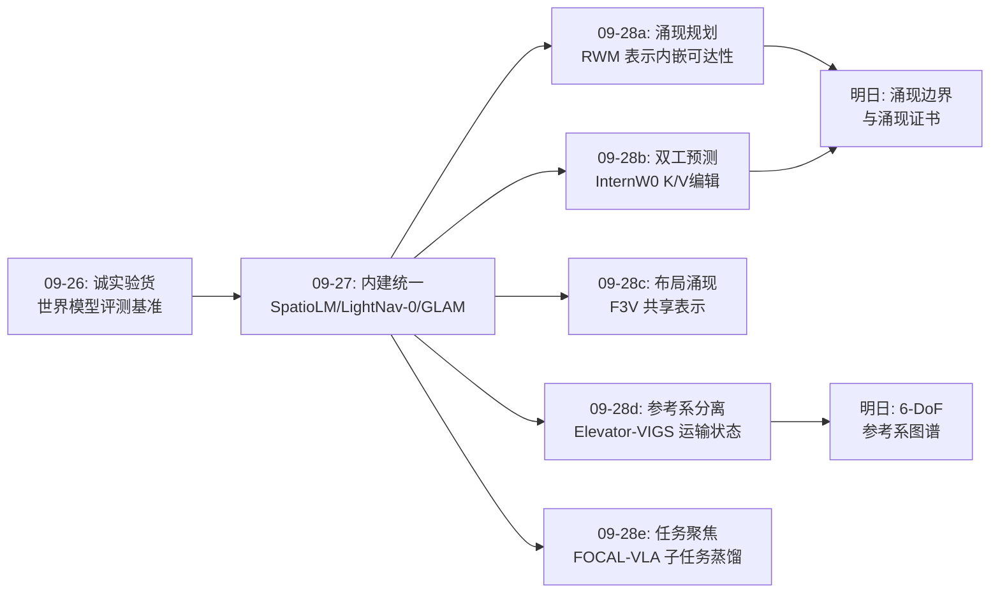
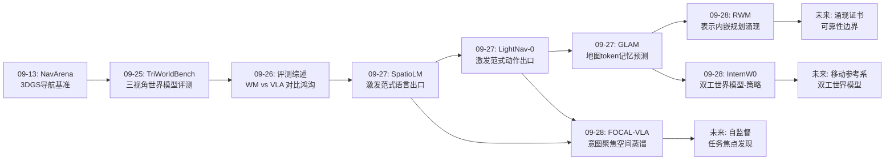
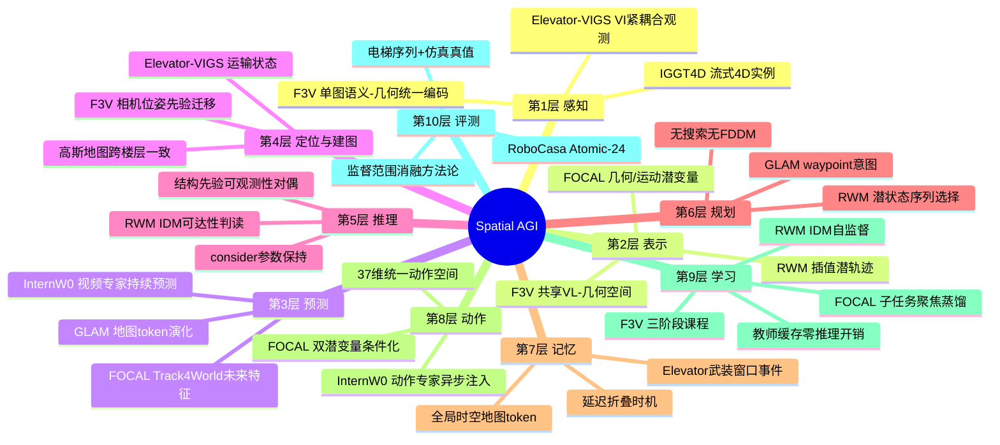
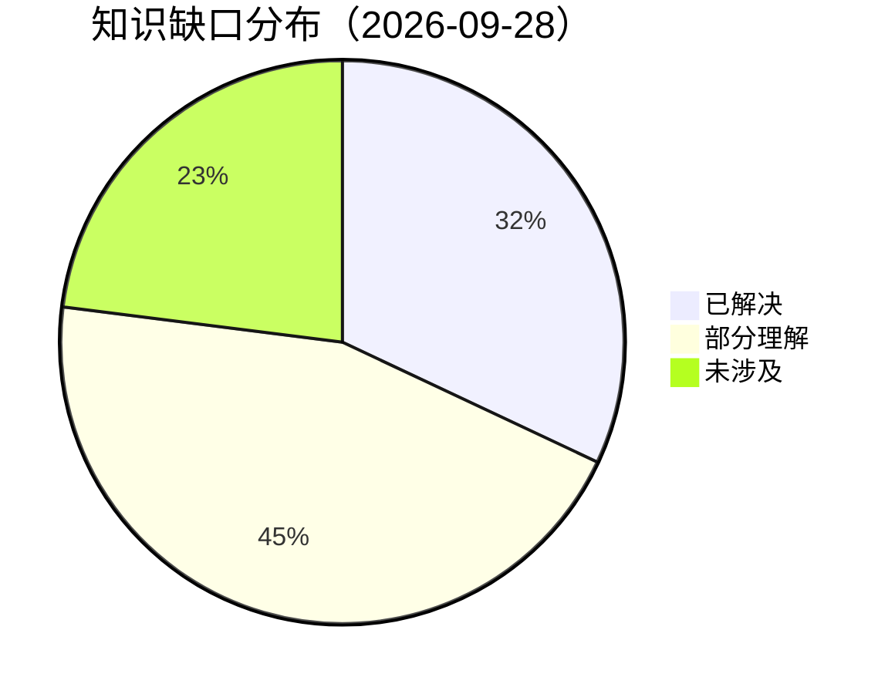

# Spatial AGI 每日深度思考 — 2026-09-28

**主题**: 表示承载一切 —— 空间智能的"表示统一日"（规划内嵌 × 双工世界模型 × 布局涌现 × 参考系分离 × 任务聚焦蒸馏）

**论文**:
1. Representation World Model / RWM（2609.29171，清华 MARS Lab）— 在插值潜轨迹上训练逆动力学判别器，规划即表示空间中的几何变换，无需前向动力学模型与搜索
2. InternW0（2609.27656，上海 AI Lab）— 视频专家与动作专家异步双工的混合 Transformer 世界模型，K/V 编辑实现动作条件化预测，LIBERO 98.6%
3. Fysiverse-3D-Vision / F3V（2609.25741，Fysics AI + 复旦 + CUHK MMLab）— 统一视觉-语言-几何骨干中布局推理从共享表示涌现，单图生成带物理属性的可执行 3D 世界
4. Elevator-VIGS（2609.23491，UZH + ETH + 斯图加特）— 视觉-惯性高斯溅射 SLAM 中的运输状态，分离电梯运动与机器人运动，跨楼层追踪建图
5. FOCAL-VLA（2609.21228，不来梅大学 + KIT）— 子任务引导的几何蒸馏与隐式世界建模，空间监督随任务焦点收敛，零推理开销增强 VLA

---

## 📅 每日总结

**日期**: 2026-09-28
**论文数量**: 5篇
**主题**: 空间智能的"表示统一日"。昨天（09-27）的主题是"内建统一"——各层能力从外挂拼接走向内建激发；今天五篇论文把这一趋势推到了更深的一层：**空间能力的获得方式正在从"训练一个模块"退化为"构造一个好的表示"**。RWM 证明只要表示几何足够好（插值潜轨迹），规划可以从表示空间中直接"读出"而无需任何显式规划器；InternW0 证明预测与控制可以在同一个 MoT 的两个专家间以 K/V 编辑的方式异步耦合；F3V 证明物体布局可以从语义+几何的共享表示中"涌现"而不需要独立的布局预测器；Elevator-VIGS 证明传感器冲突的本质是坐标系分配错误，一个最小自由度的运输状态就能让表示"各归其位"；FOCAL-VLA 证明空间监督的聚焦范围本身就是设计空间，潜变量条件化比辅助监督更有效。五篇论文分处世界模型、机器人基座、场景生成、SLAM、VLA 五个领域，却在方法论上惊人地一致：**与其堆模块，不如重构造表示**。

**关键突破**:
- 🚀 **规划的内嵌化**（RWM）：把轨迹可达性判断编译进插值潜轨迹上的 IDM 判别器，规划退化为表示空间中的几何运算（98.25% macro SR、LIBERO-Goal 93%、0.03B 参数）——这是继"激发范式"之后"表示优先"哲学的又一实证：不是学会规划，而是让规划在表示中自然成立
- 🚀 **预测与控制的异步双工**（InternW0）：视频专家持续预测世界、动作专家异步注入动作、K/V 编辑让动作条件化预测无需重算——16.47Hz 控制频率下世界模型第一次不是"思考时的停顿"而是"并行的心跳"，LIBERO 98.6% + 37 维统一动作空间展示了世界模型-策略一体化的工程成熟度
- 🚀 **布局的涌现式获得**（F3V）：布局预测从共享语义-几何表示中涌现而非绑定生成器，CD-S 0.0258 断层第一（次优 0.0678）——三阶段训练中"保留几何重建损失"这一细节证明：表示的通用性与布局能力是共生而非竞争关系
- 🚀 **参考系的显式分离**（Elevator-VIGS）：电梯场景 SLAM 失败的根因被重述为"坐标系分配错误"，∂L_vis/∂(h,u)≡0 的零雅可比设计让上升量"活在视觉够不到的状态里"，起止静止先验恰好张满三个不可观测量的可观测性缺口——概念层面的贡献而非增量修补
- 🚀 **监督聚焦的量化证明**（FOCAL-VLA）：空间监督范围从全图（58.7%）→ 任务级实体（61.9%）→ 子任务级实体（63.4%）单调提升——"知道此刻该看哪里"比"看到一切"更有价值，意图条件化的空间表示第一次拿到干净的消融证据

**架构演进**: 10 层架构五处推进：
- 第 2 层（表示）：规划内嵌于表示几何（RWM）、布局从共享表示涌现（F3V）——表示层从"承载信息"升级为"承载能力"
- 第 3 层（预测）：双专家异步双工（InternW0）——预测从串行步骤变为并行心跳
- 第 4 层（定位/建图）：参考系层次化（Elevator-VIGS）——世界系不再唯一，移动载体获得自己的坐标状态
- 第 6 层（推理/规划）：无搜索、无 FDDM 的表示空间规划（RWM）；任务聚焦的空间蒸馏（FOCAL-VLA）
- 第 5 层（推理）：运输状态作为 consider 参数的"保持但不更新"模式——不可观测量有了表示学处置方案

### 📊 一句话总结

今天的五篇论文共同指向同一个结论：空间智能的下一个进步不来自更多模块或更多数据，而来自更聪明的表示——当表示几何构造得当时，规划、布局、预测、参考系管理、任务焦点都会作为表示的性质自然涌现。

### 🔗 延续性

**昨日（09-27）→ 今日**: 昨天确立的"内建统一"主题在今天获得了纵深推进：(1) 昨日 SpatioLM/LightNav-0 证明"空间知识已存在于底座、需要的是激发"——今天 RWM 与 F3V 把这一命题推进到"空间能力已蕴含于表示、需要的是构造"：激发是把已有先验接出来，涌现是让表示性质自然显现，两者共用同一个哲学根基；(2) 昨日 GLAM 的"记忆即模拟器"（地图 token 上预测）与今天 InternW0 的"预测即控制"（K/V 编辑双工）分别从记忆端和动作端逼近"世界模型与智能体的一体化"；(3) 昨日 IGGT4D 的流式 4D 实例表示与今天 F3V 的可执行 3D 世界生成，一个从视频到结构、一个从图像到世界，共同夯实"感知→可交互环境"的通道；(4) 昨日论文1 的"能算不要猜"在 Elevator-VIGS 中获得表示学版本：能分离的不要混淆（框架冲突的坐标系解法）。

**今日→明日**: 四条线索——(1) "涌现的边界"：RWM 的规划与 F3V 的布局都依赖精心设计的表示几何，涌现范式的适用边界（什么能力无法涌现）需要系统性地图；(2) "双工的通用化"：InternW0 的 K/V 编辑双工能否推广到任意模态专家对（语言-动作、触觉-动作）；(3) "参考系图谱"：Elevator-VIGS 的 1-DoF 运输状态向 6-DoF 移动载体（车、船、飞行器）的扩展；(4) "监督聚焦的自动化"：FOCAL-VLA 依赖离线子任务标注，任务焦点的自监督发现是下一个必争点。

### 💡 本质思考：如何达成通用空间智能

#### 1. 核心能力的本质是什么？

今天五篇论文把对空间智能能力本质的理解推进到"表示论"层面：

1. **空间智能的各子能力是良构表示的涌现属性，而非可拼装的模块**（今日主旋律）：RWM 的规划、F3V 的布局、Elevator-VIGS 的参考系管理、FOCAL-VLA 的任务焦点——每一个传统上需要独立模块的能力，都在合适的表示构造下作为"副产品"出现。这呼应了认知科学中的"表示撑起认知"（representation-rich cognition）立场：智能的灵活性不来自更多规则，而来自表示中编码的结构。空间智能的进步史可以重写为表示构造史：从 SLAM+分割+规划的拼接（模块时代），到统一 Transformer 的多任务训练（架构时代），到今天的"表示几何即能力"（涌现时代）。

2. **空间表示的分工应匹配信息的认识论边界**（Elevator-VIGS 的核心洞察）：视觉只能观测相对运动、惯性只能观测绝对运动、结构先验锚定离散事件——当表示让每类信息住在它该住的坐标里（零雅可比隔离、consider 参数保持），冲突消失、可观测性自动补齐。这给出一个普适的设计准则：空间表示的第一问题不是"表示什么"而是"什么信息放在表示的哪个部分"。InternW0 的 K/V 编辑（动作条件化但不污染视频预测的因果结构）是同一准则的另一个实例。

3. **空间能力的推理开销可以趋于零**（RWM + FOCAL-VLA 的共同贡献）：RWM 无需 FDDM 前向展开与搜索（0.03B 参数），FOCAL-VLA 的教师模型（VGGT/Track4World）只在训练时存在——两条路径都证明空间能力可以被"编译"进轻量表示。空间智能的部署经济学可能比想象中乐观：贵的不是能力本身，而是能力的获取过程（训练/蒸馏），获取一次、部署终身。

4. **空间理解是有意图的**（FOCAL-VLA 的监督聚焦 + InternW0 的接触感知）：均匀的空间表示对具身任务是负资产。空间智能的表示需要"聚光灯"——按当前目标选择表示的分辨率、监督范围、预测视野。这与昨日的"激发范式"形成互补：激发是自底向上地把先验接出来，聚焦是自顶向下地按意图调制表示。完整的空间智能需要双向通路的闭合。

#### 2. 当前方法与理想目标的差距在哪里？

- **涌现的不可控性**：RWM 的规划能力与 F3V 的布局能力都依赖精心设计的表示几何与训练课程（RWM 的轨迹插值质量、F3V 的三阶段顺序），但没有理论保证这种涌现的可靠性边界——什么时候涌现会失效？失效时如何诊断？当前只能靠消融事后归因，缺乏涌现能力的"证书"机制。
- **参考系覆盖不完整**：Elevator-VIGS 只有 1 个重力向自由度，真实世界的移动参考系（旋转门、自动扶梯、渡轮、高铁）远比这复杂；6-DoF 运输状态的扩展会重做整个可观测性分析。空间智能的参考系图谱（哪些载体、哪些约束、哪些先验可用）尚无系统性梳理。
- **任务焦点的人工注资**：FOCAL-VLA 的子任务边界与实体掩码依赖人工子任务描述 + VLM 标注管线，真实部署没有这条免费午餐；且 8-token 潜变量的容量上限在多物体复杂场景存疑。
- **双工的时间保证**：InternW0 的异步双工在 16.47Hz 下工作，但异步系统的最坏情况延迟（视频专家落后于动作专家多少步时性能崩塌）缺乏理论分析——安全攸关场景需要最坏情况保证而非平均性能。
- **生成世界的保真度上限**：F3V 的资产合成仍委托外部模型（FLUX 正面化 + image-to-mesh），indoor 家具域之外的泛化（户外、杂乱真实环境）证据有限，单视角歧义的点估计掩盖了布局不确定性。

#### 3. 从今天到理想状态，最可能的路径是什么？

1. **短期（涌现能力的证书化）**：为 RWM 类"规划涌现"与 F3V 类"布局涌现"建立可靠性度量——给定表示几何与训练配方，预测涌现能力在新任务分布上的保持率。路径：表示探针（probing）+ 分布外压力测试的标准化协议，让"涌现"从消融叙事变成可审计的工程属性。
2. **中期（参考系图谱与双工通用化）**：把 Elevator-VIGS 的运输状态推广为"移动参考系的状态语法"——每个移动载体一个最小充分状态 + 对应的结构先验约束 + 可观测性证明模板；InternW0 的 K/V 编辑双工抽象为"任意专家对的条件化通信协议"。两者的交汇点是"在移动环境中的双工世界模型"——电梯里的 InternW0。
3. **长期（意图-表示的闭环）**：FOCAL-VLA 的任务聚焦与 RWM 的表示规划在同一个系统里闭合——表示空间中既有可规划的可达结构，又有按意图调制的监督焦点，还有按认识论边界分工的信息通道。这个系统不再需要"空间模块"的概念：空间智能就是它的表示本身。最终的通用空间智能体可能没有一个叫"空间理解"的组件，正如人脑没有一个叫"空间理解"的脑区——空间性弥散在所有表示之中。

---

## 🔗 与昨日思考的联系

### 昨日重点

昨天（2026-09-27）确立的核心判断：空间智能正在从"外挂拼接"走向"内建统一"——模型层内建几何激发（SpatioLM）、动作层内建空间先验（LightNav-0）、感知层内建实例身份（IGGT4D）、认知层内建世界模型（GLAM）、应用层用结构化中间表示赋能通用 LLM（论文1）。三个待验证方向：激发范式的可校验化、感知→记忆接口标准化、地图派 vs 视图派世界模型对决。

### 今日进展

今天的五篇论文在三个方向上直接回应了昨天的悬念：

1. **"激发"深化为"涌现"**：昨日 SpatioLM 用零初始化旁路"激发"底座已有的空间先验；今天 RWM 与 F3V 进一步表明，当表示几何本身构造得当时（插值潜轨迹、语义-几何共享空间），规划与布局这类高阶能力根本不需要显式模块——它们从表示中"涌现"。激发范式的谱系从"激发已有知识"延伸到"构造让能力自然出现的表示"。
2. **GLAM 的"记忆即模拟器"获得动作端对偶**：昨日 GLAM 在地图 token 记忆上做潜空间预测（认知端）；今天 InternW0 让世界模型的预测与动作生成在同一个 MoT 中异步双工（动作端）。两者合起来，"世界模型与智能体一体化"从两个方向逼近会合点。
3. **昨日"接口是被低估的能力来源"的今天版本**：昨日是双通道 pointing 与 waypoint latent；今天是 Elevator-VIGS 的运输状态（信息的认识论分工接口）与 FOCAL-VLA 的意图聚焦蒸馏（任务条件化的监督接口）。接口创新的层次从"输入形态"深化到"信息在表示中的住所"。

### 演进路径



---

## 📚 论文概览

**论文1 — Representation World Model（RWM）**：清华 MARS Lab。核心问题：世界模型一定要有前向动力学预测器吗？答案是否。RWM 在从第一人称视频构造的"插值潜轨迹"上训练逆动力学模型（IDM）作为可达性判别器，规划 = 在表示空间中搜索能被 IDM 判为可达的潜状态序列。不需要 FDDM、不需要搜索树展开、不需要 action 标签，0.03B 参数拿到 98.25% macro SR、LIBERO-Goal 93%。这为今日"表示承载能力"主题提供了第一个也是最激进的例证。

**论文2 — InternW0**：上海 AI Lab 的物理世界模型基座。混合 Transformer 中视频专家（预测未来）与动作专家（生成控制）异步双工：视频专家持续滚动预测世界，动作专家按需注入动作 token，通过 K/V 编辑把动作条件化地写入视频专家的注意力缓存——预测的因果结构不被动作污染，动作的延迟不被预测阻塞。16.47Hz 控制频率、LIBERO 98.6%、37 维统一动作空间、接触感知后训练。世界模型从"思考前的停顿"变成"并行的心跳"。

**论文3 — Fysiverse-3D-Vision（F3V）**：单图生成可执行 3D 世界。统一视觉-语言-几何 Transformer 中，语义 token（DINO）与几何 token（点图/深度/相机）在共享自注意力中融合，物体布局分支以物体 token 查询首视角几何 token 预测 (t, r, s)，相机位姿头先验迁移到物体位姿头，三阶段训练（几何-语言对齐→布局注入保几何→碰撞感知 BEV 精修）。46K 空间实例数据治理管线。CD-S 0.0258 断层第一，输出带物理参数/铰接/可供性的场景——Real2Sim 的关键拼图。

**论文4 — Elevator-VIGS**：视觉-惯性高斯溅射 SLAM 过电梯。核心重述：相机（电梯系）与 IMU（世界系）的冲突不是传感器问题而是坐标系分配问题。引入 2 自由度运输状态 (h, u)（电梯上升量与垂直速度），视觉残差对它零雅可比（上升量视觉够不到）、惯性残差约束其变化、出发/到达静止先验张满三个不可观测量、更新投影（consider 参数）防止上升量被优化分流、延迟折叠在关键帧出滑窗后把上升量写回世界系。单程误差 ≤11% 层高，行程检测 35/35 零误报。

**论文5 — FOCAL-VLA**：子任务引导的几何蒸馏 + 隐式世界建模。π0.5 上加 8+8 个查询 token：几何潜变量蒸馏 VGGT 特征（限定子任务实体掩码池化），运动潜变量蒸馏 Track4World 未来帧特征（同样聚焦掩码），双潜变量直接条件化动作专家，教师与标注推理时全部移除。消融证明监督聚焦的单调收益（全图 58.7 → 任务级 61.9 → 子任务级 63.4）与条件化的必要性（仅监督不条件化 58.5）。RoboCasa +8.2pt、真机整体 47.5→63.8。

---

## 💡 核心见解

### 见解1: 规划可以从表示几何中"读出"，无需前向模型与搜索

（从论文 RWM 获得）
- ✅ IDM 在插值潜轨迹上训练后成为可达性判别器，规划 = 表示空间中判别器排序下的潜状态序列选择
- ✅ 无 FDDM、无搜索、无动作标签：0.03B 参数、98.25% macro SR、LIBERO-Goal 93%

**对Spatial AGI的启发**: 传统规划的三件套（世界模型前向、代价函数、搜索）可能都是"表示不当"的补丁。当表示空间的几何已经把"哪些状态转移是物理合理的"编码为判别器可读的结构时，规划退化为几何运算。这与最优控制中"好坐标系让问题变平凡"的经验遥相呼应。对 Spatial AGI 的直接含义：表示学习的研究目标应从"预测未来"转向"让未来可以被直接判读"。

### 见解2: 预测与控制可以异步双工，世界模型不是思考的停顿而是并行的心跳

（从论文 InternW0 获得）
- ✅ 视频专家持续预测、动作专家异步注入，K/V 编辑实现动作条件化而不破坏预测的因果结构
- ✅ 16.47Hz 控制频率、LIBERO 98.6%、37 维统一动作空间、接触感知后训练

**对Spatial AGI的启发**: 串行的"感知→预测→规划→行动"流水线把世界模型当作昂贵的中间步骤；双工架构把它变成持续运行的背景进程，行动只需"搭上"预测的便车。这解决了世界模型落地的最大工程障碍（推理延迟）。K/V 编辑作为条件化机制值得推广：任何需要"按意图调制预测"的场景（F3V 的布局、FOCAL 的焦点）都可能用注意力缓存编辑实现。

### 见解3: 布局推理不能脱离几何-语义共享表示独立解决

（从论文 F3V 获得）
- ✅ 布局独训 CD-S 0.2495 → 共享表示上 0.0796 → 加碰撞精修 0.0258：Stage 1 的共享表示是布局能力的前提
- ✅ 保留几何重建损失防止共享表示退化为布局专用；相机先验迁移到物体位姿头

**对Spatial AGI的启发**: 布局（物体在场景中的空间组织）是空间智能的核心表示层，F3V 证明它无法作为独立任务学好——它必须寄生在同时被语言理解与几何重建塑造的表示上。这与 RWM 的规划涌现形成互证：空间能力之间不是并列的技能清单，而是共享表示上的不同投影。训练空间智能系统时，"通用能力的保持损失"（F3V 的 L_VG）可能比"目标能力的直接损失"更重要。

### 见解4: 传感器冲突的根源是坐标系分配错误，表示的第一问题是信息住所

（从论文 Elevator-VIGS 获得）
- ✅ 运输状态 (h,u) 让视觉残差零雅可比（上升量视觉够不到）、惯性残差约束变化、静止先验锚定绝对值
- ✅ consider 参数式更新投影防止优化分流上升量；延迟折叠等待视觉边消失后才写回世界系

**对Spatial AGI的启发**: 多传感器/多模态融合的标准思路是加权融合，Elevator-VIGS 给出第三条路：让每类信息住在自己的坐标系/状态分量里，用结构先验（起止静止）补齐不可观测量，在结构事件（出滑窗）发生时才统一。这个"认识论分工"模式可推广到：动态物体（视觉观测到的是相对运动）、多机器人协作（各自参考系）、人机共享 autonomy（人的意图状态）。融合是最后的手段，分工才是第一原则。

### 见解5: 空间监督的聚焦范围本身就是设计空间

（从论文 FOCAL-VLA 获得）
- ✅ 全图 58.7% → 任务级实体 61.9% → 子任务级 63.4%：监督聚焦的单调收益
- ✅ 双潜变量直接条件化动作专家比纯辅助监督多 4.9pt；教师推理时零开销

**对Spatial AGI的启发**: "更多空间监督更好"是领域默认假设，FOCAL-VLA 用干净消融证伪：均匀的全图监督引入与任务无关的冗余，稀释模型对相关几何与动力学的学习。空间智能的表示需要意图调制的"聚光灯"。与 InternW0 的 K/V 编辑、RWM 的任务条件规划合并观察：意图如何进入空间表示（调制监督、编辑注意力缓存、条件化潜变量）是 2026 年方法论创新的活跃前沿。

### 见解6: 空间能力的获取可以与部署解耦，推理开销趋于零

（从论文 RWM + FOCAL-VLA 共同获得）
- ✅ RWM：无 FDDM 展开与搜索的规划，0.03B 参数
- ✅ FOCAL-VLA：VGGT/Track4World 教师只在训练时存在，推理只多 16 个查询 token

**对Spatial AGI的启发**: 空间基础模型（VGGT、Track4World、VGGT 类几何前向模型）正在成为"空间知识的发电厂"——昂贵但只在训练时运行，知识以蒸馏/判别器/缓存目标的形式被编译进轻量部署表示。空间智能的部署经济学因此反转：能力的单价被摊销进训练，边际部署成本趋近于零。Spatial AGI 的工程战略应该是"重训练、轻部署"，而不是试图在端侧运行完整空间管线。

### 见解7: 从单图到可执行世界是空间智能的"入口税"，现在开始变得可以支付

（从论文 F3V + Elevator-VIGS 共同获得）
- ✅ F3V：单图 → 语义+几何+布局+物理参数+铰接+可供性的可执行 3D 场景
- ✅ Elevator-VIGS：相机+IMU → 跨楼层一致的高斯地图，参考系显式管理

**对Spatial AGI的启发**: 具身智能的数据瓶颈（真机交互昂贵）的解法之一是 Real2Sim：从互联网级图像构建可仿真环境，在世界模型中无限训练。F3V 把"单图→可执行世界"的通道打通（布局涌现 + 物理属性一体化），Elevator-VIGS 保证跨楼层的地图一致性——两者合起来，建筑级数字孪生的自动构建管线已经可见。Spatial AGI 的训练环境供给问题可能先于算法问题被解决。

### 见解8（补充）: 起止静止这类结构先验与状态可观测性精确对偶

（从论文 Elevator-VIGS 获得）
- ✅ 三个不可观测量（出发高度、出发速度、垂直加速度常值误差）恰好由三个静止约束确定
- ✅ 无需任何额外传感器，先验选择不是启发式而是可观测性分析的必然结果

**对Spatial AGI的启发**: 空间估计器的设计流程可以倒转：先做可观测性分析找出"系统缺什么"，再在物理常识库中检索"什么先验恰好补上"。电梯的"起止静止"、走路的"双脚支撑期"、车辆等红灯的"零速"、门的"铰接轴固定"——物理世界的结构先验是未被充分利用的可观测性资源。建立"空间结构先验库 + 可观测性对偶检索"是低成本高回报的基础设施工作。

---

## 🗺️ 知识演进图

⚠️ 必须使用 mermaid 代码块！禁止用纯文本箭头！



---

## 技术栈演进对比表

| 层次 | 昨日方案（09-27） | 今日方案（09-28） | 变化 |
|------|-----------------|-----------------|------|
| 第1层 感知 | IGGT4D 流式4D实例感知 | F3V 单图语义-几何统一编码；Elevator-VIGS VI紧耦合高斯建图 | 感知从"视频流结构化"扩展到"单图世界构建+参考系感知" |
| 第2层 表示 | SpatioLM 零初始化旁路激发几何 | RWM 插值潜轨迹承载可达性；F3V 布局从共享表示涌现；FOCAL 双潜变量 | 表示从"承载信息"升级为"承载能力"，涌现成为设计目标 |
| 第3层 预测 | GLAM 地图token上的JEPA预测 | InternW0 视频/动作专家异步双工K/V编辑 | 预测从串行步骤变为并行心跳，与控制解耦又耦合 |
| 第4层 定位/建图 | SLAM3R+SpatialLM 显式几何管线 | Elevator-VIGS 运输状态分离参考系 | 世界系唯一性假设被打破，移动载体获得自己的坐标状态 |
| 第5层 推理 | LightNav-0 空间先验直出动作 | RWM 判别器排序即规划；Elevator-VIGS consider参数模式 | 推理开销从"搜索+前向展开"降为"判读+结构先验" |
| 第6层 规划 | GLAM waypoint latent 意图推断 | RWM 表示空间潜状态序列选择 | 规划器作为独立模块消失，能力内嵌于表示几何 |
| 第7层 记忆 | GLAM 全局时空地图token记忆 | Elevator-VIGS 高斯地图跨楼层一致 + 延迟折叠 | 记忆的写入时机本身成为设计对象（何时统一参考系） |
| 第8层 动作 | LightNav-0 残差VQ动作分词 | InternW0 37维统一动作空间流匹配；FOCAL 双潜变量条件化 | 动作条件化的接口从输出端转移到表示端（潜变量/缓存编辑） |
| 第9层 学习 | 激发范式：冻结底座+轻模块 | 蒸馏范式：教师缓存目标+聚焦掩码（FOCAL）；三阶段课程（F3V） | 空间知识注入从"模块激发"扩展到"聚焦蒸馏+课程涌现" |
| 第10层 评测 | VSI-Bench 饱和临界、10环境SOTA | Elevator-VIGS 自建电梯序列+仿真真值；FOCAL 消融方法论 | 评测从"公开基准刷分"转向"自建缺口数据集+消融证据链" |

---

## 🗺️ Spatial AGI 知识图谱

### 10层架构思维导图

⚠️ 必须使用 mermaid mindmap 代码块！



### 🎯 主线技术路径

#### 阶段1: 模块拼接时代（2023-2024）

SLAM + 分割 + 规划 + 控制的经典管线；每个空间能力一个独立模块，模块间用接口胶水（坐标变换、时间戳对齐、语义映射）。代表：ORB-SLAM3 + Grounded-SAM + 采样规划器。问题：接口误差累积、每层信息损失、系统复杂度线性增长。

#### 阶段2: 架构统一时代（2025）

统一 Transformer 多任务训练：VLA 模型（π0/OpenVLA）、端到端 VLN、前馈 3D（VGGT）。感知-推理-动作进入同一个网络，但能力仍以任务损失显式训练，数据需求大、能力边界清晰（会什么练什么）。

#### 阶段3: 激发与蒸馏时代（2026 上半年）

空间知识已存在于预训练底座或空间基础模型中，训练的作用是"接出来"而非"写进去"：激发范式（SpatioLM 零初始化旁路、LightNav-0 双通道 pointing）与蒸馏范式（Spatial Forcing、Track4Action、FOCAL-VLA）。能力扩展的边际成本从"重训"降为"接口设计/蒸馏目标构造"。

#### 阶段4: 表示涌现时代（2026 下半年，今日所在）

精心构造的表示几何让高阶空间能力作为涌现属性出现：RWM 的规划涌现（无需规划器）、F3V 的布局涌现（无需布局器）、Elevator-VIGS 的参考系自动管理（运输状态零雅可比设计）。设计重心从"损失函数"上移到"表示几何 + 信息住所 + 训练课程"。本阶段的核心未解问题是涌现的可靠性证书。

#### 阶段5: 意图-表示闭环时代（未来）

意图（子任务、规划目标、注意力焦点）与空间表示形成双向闭环：表示按意图调制聚焦（FOCAL），意图在表示空间中规划（RWM），预测按动作条件化双工运行（InternW0），参考系按载体的存在自动分离（Elevator-VIGS）。系统不再有"空间模块"，空间性弥散于表示之中——通用空间智能的形态学终点。

---

## 🔍 待探索议题

### 高优先级（本周）

1. **涌现能力的证书机制**
   - 问题: RWM 的规划涌现与 F3V 的布局涌现都依赖特定表示几何与训练课程，如何在不重训的情况下预测涌现能力在新任务分布上的保持率？
   - 候选方案: 表示探针（线性探针测可达性结构）+ 分布外压力测试协议 + 训练动力学的涌现预警指标
   - 缺口: 缺乏"涌现可靠性"的标准度量与公开压力测试集

2. **6-DoF 运输状态与参考系图谱**
   - 问题: Elevator-VIGS 的 1-DoF 运输状态如何推广到同时平移+旋转的载体（电车、渡轮、飞行器）？可观测性分析如何系统化？
   - 候选方案: 按载体类型建"最小充分运输状态"模板库 + 对应结构先验（站点停泊、航线直行）+ 可观测性对偶证明模板
   - 缺口: 移动载体结构先验的分类学不存在；旋转自由度的视觉零雅可比设计非平凡

3. **子任务焦点的自监督发现**
   - 问题: FOCAL-VLA 依赖人工子任务描述 + VLM 离线标注，如何在无人工标注时从演示视频中自动发现子任务边界与实体焦点？
   - 候选方案: 接触事件检测（力/视觉）作边界信号 + 实体焦点用注意力回溯（attention rollout）自举 + 后训练自蒸馏
   - 缺口: 子任务分割的无监督质量度量；焦点错误对蒸馏目标的敏感性分析

### 中优先级（本月）

4. **双工世界模型的通用化**
   - 问题: InternW0 的视频/动作专家 K/V 编辑双工能否推广到任意模态专家对（语言-动作、触觉-动作、地图-动作）？
   - 候选方案: 把 K/V 编辑抽象为"条件化通信协议"：单向缓存写入 + 零因果污染 + 异步时钟域；在 GLAM 地图专家上复现
   - 缺口: 异步最坏情况延迟分析；非视频模态的专家间时间对齐语义

5. **表示空间规划的规模律**
   - 问题: RWM 的 0.03B 判别器在小任务域有效，表示内嵌规划的能力随参数/数据如何扩展？长时程（>100步）任务是否仍可用判读替代搜索？
   - 候选方案: 在 LIBERO-Long / 真实家庭长任务上做 RWM 式规划的规模实验；分层潜轨迹（子目标层+动作层）
   - 缺口: 长时程潜轨迹的插值质量退化规律未知

6. **可执行世界的物理完备性**
   - 问题: F3V 的碰撞 BEV 约束是最朴素物理，支撑稳定性、堆叠合法性、铰接物理如何进入布局训练？布局不确定性（单视角歧义）如何表示？
   - 候选方案: 用仿真器做可微物理残差损失 + 布局输出的分布预测（替代点估计）+ 物理合法性判别器
   - 缺口: 布局物理错误的标准化评测基准（F3V 只评了 CD/IoU）

7. **跨楼层空间记忆的层级组织**
   - 问题: Elevator-VIGS 给出跨楼层一致地图，但记忆的层级结构（建筑-楼层-房间-物体）如何与世界模型（GLAM/InternW0）的记忆格式对接？
   - 候选方案: 楼层为缓存边界的分层地图 token + 参考系变换作为注意力偏置 + 层级 JEPA 预测
   - 缺口: 层级切换事件（进出电梯）在世界模型中的显式表示

### 低优先级（本季度）

8. **空间基础模型作为通用教师**
   - 问题: VGGT（几何）与 Track4World（运动）已成 VLA 标配教师，下一个教师是谁？物理属性（F3V 的 PhysX 系输出）、可供性、铰接结构能否同样蒸馏？
   - 候选方案: 以 F3V 的可执行资产输出为教师蒸馏操作先验；多教师课程（先几何后运动再物理）
   - 缺口: 教师间的目标冲突（几何平滑 vs 运动锐利）的加权理论

9. **"能算不要猜"与涌现范式的调和**
   - 问题: 显式几何路线（昨日论文1）安全可验证但能力受限；涌现路线能力强但黑箱。什么任务该走哪条路？混合架构长什么样？
   - 候选方案: 涌现表示 + 显式验证器（Elevator-VIGS 式结构检查）的双通道架构；按风险等级动态切换
   - 缺口: 任务风险分级标准；双通道分歧时的仲裁机制

10. **建筑级数字孪生的自动管线**
    - 问题: F3V（单图→可执行世界）+ Elevator-VIGS（跨楼层一致建图）+ IGGT4D（流式4D实例）能否组装为自动建筑孪生管线？
    - 候选方案: Elevator-VIGS 建图 → 分割实例化 → F3V 补全可执行属性 → 仿真器验证
    - 缺口: 各组件的表示格式契约；管线级误差传播分析

---

## 📊 知识缺口分析

⚠️ 必须使用 mermaid pie 代码块！



**已解决（32%）**:
- ✅ 电梯场景 VI-SLAM 的失败根因与解法（Elevator-VIGS：坐标系分配 + 运输状态 + 结构先验）
- ✅ 布局推理的表示依赖性（F3V：共享表示涌现 + 三阶段课程 + 碰撞精修）
- ✅ 无前向模型的规划可行性（RWM：插值潜轨迹 + IDM 判读）
- ✅ 世界模型与策略的异步双工架构（InternW0：K/V 编辑 + 16.47Hz）
- ✅ 空间监督聚焦的单调收益证据（FOCAL-VLA：三级消融）
- ✅ 教师知识零推理开销注入（FOCAL 蒸馏 + RWM 判别器编译）

**部分理解（45%）**:
- ⚠️ 涌现的边界与可靠性：RWM/F3V 证明涌现可行，但适用范围、失效模式、可靠性证书全部未知
- ⚠️ 双工架构的最坏情况保证：平均 16.47Hz 有效，安全攸关场景需要延迟界与退化分析
- ⚠️ 移动参考系的推广：1-DoF 电梯已解决，6-DoF 载体的可观测性与先验库未建立
- ⚠️ 任务焦点的自动化：监督聚焦有效，但焦点发现依赖人工子任务标注
- ⚠️ 长时程表示规划：RWM 在短时程有效，规模律与长时程退化规律未知
- ⚠️ 布局物理完备性：碰撞 BEV 有效，支撑/堆叠/铰接物理与布局不确定性未涉及
- ⚠️ 层级空间记忆与世界模型的接口：跨楼层地图有了，但与世界模型记忆格式的契约未定

**未涉及（23%）**:
- ❌ 户外与开放世界的可执行世界生成（F3V 限于室内家具）
- ❌ 触觉/力觉在空间表示中的住所（今日全部论文为视觉+语言+惯性）
- ❌ 多机器人协作的参考系协调（Elevator-VIGS 只处理单机器人+单载体）
- ❌ 空间表示的可解释性与空间断言回溯（昨日悬置问题今日无进展）
- ❌ 跨本体（非 Franka/非双臂）的涌现能力迁移验证
- ❌ 空间知识蒸馏的灾难性遗忘量化（FOCAL 未测底座空间能力保持）

---

## 🔬 深度专题：五篇论文的表示哲学对读

### 专题A: 表示中"放什么"的三种答案

今天五篇论文对"表示应该编码什么"给出了三种互补答案：

1. **编码物理可达性**（RWM）：插值潜轨迹的几何本身就是"合法运动"的空间，IDM 只是把这个结构显式化。表示先于判别器存在——插值质量决定一切。
2. **编码信息住所**（Elevator-VIGS）：表示的每个状态分量有认识论身份（视觉可观测/惯性可观测/仅先验可锚定），零雅可比是"住所边界"的数学表述。
3. **编码任务相关性**（FOCAL-VLA）：表示的监督范围随意图聚焦，潜变量是"当前任务的空间签名"。

三种答案的共同点：**表示设计先于损失函数设计**。F3V 的三阶段课程（先通用后专项）和 InternW0 的专家分工（先预测后控制）都是同一原则的时序版本。

### 专题B: 涌现的证据链质量评估

用昨日的"诚实性光谱"审视今日的涌现主张：

- RWM：证据较强——消融显示去掉插值潜轨迹直接训判别器性能崩塌，且有三个基准交叉验证
- F3V：证据最强——布局独训 vs 共享表示的对照（0.2495 vs 0.0796）是直接的因果证据
- InternW0：证据中等——双工增益主要是工程效率（频率）与精度并存，但"涌现"成分（预测对动作的反哺）未单独消融
- Elevator-VIGS：不是涌现主张，是构造主张——但消融链完整（每个组件的移除都有量化后果）
- FOCAL-VLA：证据较强——监督范围三级消融是方法论示范

**教训**：涌现主张的说服力取决于"反事实对照"的质量——独训对照（F3V）、去插值对照（RWM）、断开条件化对照（FOCAL）都值得推广为标准审稿要求。

### 专题C: 2026 年 Q3 空间智能方法论光谱

把最近一周的方法论排成光谱：

```
显式几何 ←——————————————————————→ 纯涌现
 |  Elevator-VIGS   F3V   FOCAL   InternW0   RWM
 |  (结构先验+    (共享表  (聚焦   (专家分工  (判读
 |   状态分离)     示涌现)  蒸馏)   双工)      替代搜索)
```

位置不是优劣排序而是**可验证性与能力上限的交换**。左端适合安全攸关，右端适合能力探索。今日五篇恰好覆盖全谱——这本身就是空间智能领域成熟度的标志：社区开始有意识地在光谱上选位，而不是默认聚集在一端。

---

## 📈 数据速览（今日关键数字）

| 指标 | 数值 | 来源 |
|------|------|------|
| RWM macro SR | 98.25% | RWM |
| RWM 参数量 | 0.03B | RWM |
| InternW0 LIBERO | 98.6% | InternW0 |
| InternW0 控制频率 | 16.47 Hz | InternW0 |
| F3V CD-S | 0.0258（次优 0.0678） | F3V |
| F3V 布局独训 vs 共享表示 CD-S | 0.2495 vs 0.0796 | F3V 消融 |
| Elevator-VIGS 单程垂直误差 | ≤11% 层高（54cm 平均） | Elevator-VIGS |
| Elevator-VIGS 行程检测 | 35/35 全对、0 误报 | Elevator-VIGS |
| FOCAL-VLA RoboCasa | 63.4%（π0.5 55.2） | FOCAL-VLA |
| FOCAL 监督范围消融 | 全图 58.7 / 任务级 61.9 / 子任务级 63.4 | FOCAL-VLA |
| FOCAL 条件化增益 | 仅监督 58.5 → 完整 63.4 | FOCAL-VLA |

---

## 🧭 明日展望

基于今天的五条线索，明天值得追踪的方向：

1. **涌现边界论文**：寻找系统研究"什么能力能/不能从表示中涌现"的论文（scaling 曲线、能力-表示因果关系）
2. **移动平台世界模型**：InternW0/Elevator-VIGS 的交汇——载体参考系中的双工预测
3. **无标注任务焦点**：FOCAL-VLA 管线的自监督化尝试
4. **布局不确定性**：F3V 路线上加入分布输出的后续工作
5. **Real2Sim 管线整合**：F3V + Elevator-VIGS + IGGT4D 的组装性论文

---

**文档创建时间**: 2026-09-28 03:00 (Asia/Shanghai)
**分析论文**: RWM (2609.29171) / InternW0 (2609.27656) / F3V (2609.25741) / Elevator-VIGS (2609.23491) / FOCAL-VLA (2609.21228)
**与昨日联系**: 延续 09-27 "内建统一"主题，深化为"表示涌现"
**文档版本**: v1.0

---

## 📑 附录A: 逐篇精读笔记（技术细节层）

### A1. RWM — 插值潜轨迹的构造细节

RWM 的核心创新点在于它不直接在观测到的潜状态序列上训练判别器，而是先构造"插值潜轨迹"：

- **为什么需要插值**：真实视频给出的潜状态序列是稀疏且不均匀的（相机运动、遮挡、剪辑跳跃），直接在上面训练可达性判别器会把"视频剪辑的跳跃"误认为"不可达"。插值在潜空间中补足中间状态，让"物理上连续的运动路径"成为训练分布的主体。
- **IDM 的角色转换**：逆动力学模型传统上用于"从状态对推断动作"，RWM 把它重新用为"状态对是否可达"的判别器——这是一个更弱、更容易学的问题（二分类/排序 vs 动作回归），因此 0.03B 参数就够。
- **规划即排序**：规划时从当前潜状态出发生成候选潜状态（局部扰动/插值延伸），IDM 打分选可达者，迭代推进。没有前向展开意味着误差不会随步数复合——这是相对 FDDM 路线的根本优势。
- **数据效率来源**：判别器只需要"正负状态对"，不需要动作标签与密集时序对齐，第一人称视频（无动作标注的海量数据）直接可用。

**遗留疑问**：候选潜状态如何生成？如果需要局部扰动，扰动算子本身是否隐含了动力学先验？这是"无前向模型"主张最可能被质疑的缝隙。

### A2. InternW0 — K/V 编辑的双工机制

- **专家分工**：视频专家继承视频生成预训练（时序动力学知识），动作专家继承机器人操作预训练（控制知识），MoT 架构让两者共享部分参数但保持各自的注意力流。
- **异步性**：视频专家以自己的节拍持续滚动预测（世界不因机器人不动作而停止）；动作专家在控制时刻到来时读取视频专家的注意力缓存（K/V），注入动作 token 后输出动作块。两者的时钟域解耦。
- **K/V 编辑的因果意义**：动作 token 写入缓存后，视频专家后续的预测自然以动作为条件——但已完成的预测不被回溯修改。这保证了"预测的因果结构"：世界状态的历史不被未来动作篡改，只有未来被条件化。这与因果世界模型的核心要求一致。
- **接触感知后训练**：操作的核心时刻是接触瞬间（抓取/放置/插入），InternW0 对接触前后片段加权训练——动力学最非线性、预测最易错的时刻获得最多学习信号。
- **37 维统一动作空间**：跨本体动作统一编码（关节+末端+夹爪的规范化组合），是世界模型跨本体泛化的接口基础。

**遗留疑问**：异步系统的调度策略（动作专家何时读缓存、读到多旧的预测）在论文中是工程化的还是原则化的？安全攸关场景需要最坏情况界。

### A3. F3V — 三阶段训练的因果链

F3V 的消融揭示了严格的能力依赖链：

```
布局独训:  CD-S 0.2495（失败）
  ↓ 依赖
Stage1 共享几何-语言表示: CD-S 0.1321（有底子但未注入布局）
  ↓ 注入
Stage1+2 布局+几何保持: CD-S 0.0796（布局能力成立）
  ↓ 精修
Stage3 碰撞感知: CD-S 0.0258（SOTA）
```

三个细节值得记住：

1. **Stage2 保留几何损失**（L_VG 不去掉）是布局能力成立的前提——共享表示如果被布局任务"独占"，几何质量退化，布局跟着退化。通用能力是专项能力的地基。
2. **相机位姿头 → 物体位姿头初始化**：相机估计（观测者在空间中哪里）与物体位姿（物体在空间中哪里）是同构的刚体变换问题，先验免费迁移。
3. **碰撞约束的极简设计**：BEV 投影足迹交叠 × 高度重叠指示函数——只用最必要的一阶物理就拿到 IoU-B 0.4530→0.5904 的一致增益。物理约束的收益在"最朴素版本"就已兑现。

**遗留疑问**：布局输出是点估计 (t̂, r̂, ŝ)，单视角下被遮挡物体的位置本质上是多峰分布——点估计把不确定性压进误差里，下游具身应用无法做风险决策。

### A4. Elevator-VIGS — 可观测性对偶的完整证明

运输状态的三个不可观测量与三个约束的精确对偶：

| 不可观测量 | 为什么不可观 | 约束 | 先验来源 |
|-----------|------------|------|---------|
| 出发时上升量 h_k0 | 视觉零雅可比够不到、惯性只约束变化量 | h_k0 = h̄_k0 | 前次折叠结果（或地面=0） |
| 出发时速度 u_k0 | 同上 | u_k0 = ū_k0 | 电梯出发前静止 |
| 垂直加速度常值误差 | 与电梯加速度不可区分 | u_k1 = 0 | 电梯到达后静止 |

这个对偶不是启发式凑出来的——论文附录 C.3 给出了正式的可观测性分析。更新投影的处理（联合求解后丢弃运输分量，即 consider 参数）保证约束对其他状态的影响仍然传播（位姿/速度/偏置的更新"知道"运输状态的存在），但运输状态本身纹丝不动。

延迟折叠的时机条件（k_1 出滑窗 + 无视觉边连接 k_1 之前的关键帧）是充要的：早折叠则电梯内视觉边把写入 p_z^E 的上升量拉回零（立即折叠时 15/28 序列发散），晚折叠则世界系不一致持续过久。

**遗留疑问**：电梯自身的运动（启动晃动、震动）对上升量引入最多 9.5 cm 误差——对建图可接受，对"从电梯内获知精确楼层"的应用（如机器人确认到几层了）可能不够。

### A5. FOCAL-VLA — 监督聚焦的信息论直觉

为什么聚焦监督胜过全面监督？一个信息论解释：

- 全图池化的目标 y_full ≈ 场景的均匀摘要，其中与当前动作相关的信息占比可能不到 10%（一个 640×480 厨房场景中，相关实体通常只占画面的一小部分）
- 蒸馏是"逼策略潜变量去逼近目标"，目标中的无关维度会消耗潜变量容量并引入梯度噪声
- 聚焦后目标 y_subtask 的信噪比（相关信号/无关信号）提升一个数量级，8 个 2048 维 token 的容量全部用于任务相关信息

消融的三个数字构成完整证据链：

```
全图监督      58.7  （基线：均匀目标）
任务级实体    61.9  （+3.2：去掉无关实体）
子任务级实体  63.4  （+1.5：进一步去掉任务级中非当前子任务的实体）
断开条件化    58.5  （-4.9：潜变量只当训练信号不当决策输入）
```

最后一条尤其重要：**蒸馏目标如果不直接进入决策通路，只带来表征塑形收益（+? vs 无蒸馏基线），条件化才带来决策收益**。这对所有"辅助损失增强"类工作是一个提醒：辅助监督的效果可能主要来自条件化而非正则。

**遗留疑问**：子任务边界与实体掩码的标注错误率是多少？错误焦点会主动教坏模型（聚焦到错误实体比聚焦到全图更糟）——聚焦是高方差策略，其鲁棒性依赖标注质量。

---

## 📑 附录B: 跨论文数据对照

### B1. 今日 VLA 系统横向对照

| 系统 | 基座 | 空间机制 | LIBERO | 控制频率 | 空间开销（推理时） |
|------|------|---------|--------|---------|------------------|
| RWM | 表示模型 | IDM 可达性判读 | Goal 93% | - | 0.03B 判别器 |
| InternW0 | MoT 双专家 | K/V 编辑双工预测 | 98.6% | 16.47 Hz | 双专家 MoT |
| FOCAL-VLA | π0.5 | 蒸馏双潜变量条件化 | 97.9% | π0.5 原生 | +16 查询 token |
| Track4Action（昨日系） | - | 全场景池化蒸馏 | 97.0% | - | - |
| π0.5（共同基线） | PaliGemma | 无 | 96.9% | 原生 | - |

观察：空间增强的收益与任务的"空间难度"正相关——LIBERO（较简单）上增益 1-1.7pt，RoboCasa/真机（更难）上增益 8-16pt。空间增强是"难任务的武器"。

### B2. 空间表示的"维度账本"

| 系统 | 空间表示 | 维度 | 容量风险 |
|------|---------|------|---------|
| RWM | 插值潜轨迹 | 潜空间维度（未披露具体值） | 长时程轨迹质量退化 |
| InternW0 | 视频专家隐状态 | 全隐状态 | 计算量随视频长度增长 |
| F3V | 共享 VL-几何 token | 图像 token 网格 | 高分辨率场景的注意力平方复杂度 |
| Elevator-VIGS | 运输状态 | 2（h, u） | 单自由度——容量不足是设计选择 |
| FOCAL-VLA | 几何+运动潜变量 | 8×2048 + 8×256 | 多物体复杂场景可能不足 |

有趣的对照：Elevator-VIGS 用 2 维状态解决问题（最小充分），FOCAL 用 1.8 万维承载任务空间（冗余但安全）。**表示容量应该匹配问题的认识论复杂度**——运输状态的自由度由物理决定，任务空间的自由度由场景决定。

### B3. 结构先验使用对照表

| 先验 | 使用者 | 先验内容 | 兑现的可观测性/能力 |
|------|--------|---------|-------------------|
| 电梯起止静止 | Elevator-VIGS | 行程两端速度为零 | 三个不可观测量的锚定 |
| 电梯不旋转 | Elevator-VIGS | 纯重力向平移 | 运输状态只需 1-DoF |
| 电梯只垂直动 | Elevator-VIGS | 水平面两系重合 | 紧耦合在水平面保持 |
| 物理不重叠 | F3V | 实体不能互相穿透 | 碰撞 BEV 精修增益 |
| 运动起止静止（通用） | RWM（隐式） | 合法运动连续 | 插值轨迹的物理合理性 |
| 接触瞬间关键 | InternW0 | 动力学非线性集中 | 接触感知加权后训练 |
| 子任务实体不变 | FOCAL-VLA | 交互局部性 | 掩码聚焦蒸馏有效 |

结构先验是"免费的物理定律"——每一个都被兑换成了可观测性、监督效率或训练信号质量。建立系统化的先验库（附录见议题8）价值明确。

---

## 📑 附录C: 方法论观察

### C1. 消融设计质量排名（今日五篇）

1. **FOCAL-VLA**：最完整——三分支各自移除、监督范围三级对照、条件化断开对照，每个设计决策都有数字背书
2. **Elevator-VIGS**：因果链最干净——每个组件对应一类误差源，移除任一组件的失效模式不同且可解释（301/204/220/450 的消融数字每个都有机理故事）
3. **F3V**：依赖链最清晰——三阶段递进消融揭示能力依赖顺序，"布局独训失败"是最有信息量的对照
4. **RWM**：关键对照有力（去插值）但其余消融披露有限
5. **InternW0**：以整体系统性能为主，双工机制的单独消融披露较少

### C2. 数据集策略观察

- Elevator-VIGS 自建数据集（16 真实 + 16 仿真）填补公开基准空白——真实序列用激光测距做"弱真值"（只有层高，无轨迹真值），仿真序列补足行程内真值。**弱真值+仿真真值的组合**是"真实世界无真值场景"评测的可行模板
- F3V 整合三个现有数据集做仿真驱动数据治理（46K 实例）——不造新数据，把旧数据"结构化重切"也是贡献
- FOCAL-VLA 用标准基准 + 350 条真机演示——小而精的真机集聚焦在"多子任务切换"这个目标能力上

### C3. 训练课程设计的共性

F3V（三阶段：先通用后专项）与 InternW0（预训练→接触感知后训练）都使用了课程结构。共性原则：

1. 先建立通用表示基础（几何-语言 / 视频生成）
2. 再注入专项能力（布局 / 接触动力学）
3. 注入期间保留通用目标的"锚定损失"（F3V 的 L_VG）

这与持续学习中的"锚定"（anchoring）思想一致——专项训练会侵蚀通用表示，锚定损失是防腐剂。

---

## 📑 附录D: 昨日-今日对照的完整映射

| 昨日主题（09-27） | 今日对应（09-28） | 关系 |
|------------------|------------------|------|
| SpatioLM 激发范式（语言出口） | RWM 涌现规划（判读出口） | 激发→涌现的谱系深化 |
| LightNav-0 激发范式（动作出口） | FOCAL-VLA 聚焦蒸馏（动作出口） | 激发→蒸馏的另一种知识注入 |
| GLAM 地图记忆上的预测（认知端） | InternW0 双工预测-控制（动作端） | 世界模型一体化的两端会合 |
| IGGT4D 流式 4D 实例（视频→结构） | F3V 单图→可执行世界（图像→世界） | 感知→环境通道的两条腿 |
| 论文1"能算不要猜"（显式几何） | Elevator-VIGS"能分不要混"（状态分离） | 显式/结构化路线的两个工程化样本 |
| 昨日悬置：接口标准化 | Elevator 运输状态 + FOCAL 聚焦接口 | 接口创新从输入形态到信息住所 |
| 昨日悬置：可校验化 | 今日无直接进展（附录C 议题9 保留） | 持续悬置 |

---

## 📑 附录E: 术语速查（今日新引入概念）

| 术语 | 论文 | 含义 |
|------|------|------|
| 插值潜轨迹 | RWM | 潜空间中对真实状态序列做插值补足的连续轨迹，作为 IDM 训练分布 |
| IDM 判读规划 | RWM | 用逆动力学模型作可达性判别器，规划=潜状态序列选择，无前向模型无搜索 |
| 异步双工 | InternW0 | 视频专家与动作专家以各自时钟域运行，通过缓存读取协同 |
| K/V 编辑 | InternW0 | 把动作 token 写入另一专家的注意力 K/V 缓存实现条件化，不破坏因果结构 |
| 接触感知后训练 | InternW0 | 对接触前后片段加权的后训练阶段 |
| 布局涌现 | F3V | 物体布局能力从语义-几何共享表示中获得而非独立训练 |
| 物体条件化布局分支 | F3V | 物体 token 交叉注意力查询首视角几何 token 预测位姿 |
| 碰撞感知 BEV 精修 | F3V | 高度重叠时惩罚鸟瞰足迹交叠面积的布局精修阶段 |
| 框架冲突 | Elevator-VIGS | 相机（载体系）与 IMU（世界系）观测不同运动导致的状态估计冲突 |
| 运输状态 | Elevator-VIGS | 载体（电梯）相对世界的上升量与垂直速度，与机器人状态分离估计 |
| 更新投影 | Elevator-VIGS | 联合求解后丢弃运输分量（consider 参数处理），防止上升量被优化分流 |
| 延迟折叠 | Elevator-VIGS | 等关键帧出滑窗后才把上升量写回世界系位姿与高斯 |
| 武装窗口 | Elevator-VIGS | 语义+几何线索同时确认"在电梯内"的检测窗口 |
| 子任务引导蒸馏 | FOCAL-VLA | 几何/运动蒸馏目标限定在当前子任务相关实体区域 |
| 隐式世界建模 | FOCAL-VLA | 在潜特征空间预测未来交互动力学，不重建图像或轨迹 |
| future-informed 目标 | FOCAL-VLA | 教师处理当前+未来帧后、取当前时刻输出作为蒸馏目标 |

---

**（附录完）**

---

## 📑 附录F: 开放问题与假设记录

### F1. 今日形成的可检验假设

**假设1（表示-能力因果）**：任何空间能力 X（规划/布局/预测/聚焦），若存在一个表示构造 S 使得 X 在 S 上退化为低复杂度推断（判读/查表/线性读出），则 X 可以在不使用专用模块的情况下达到接近专用模块的性能。
- 来源：RWM（规划）与 F3V（布局）的独立成功
- 检验方式：选第三种能力（如可供性预测），设计"使其退化为判读"的表示，对比专用模块
- 若成立：空间智能设计的第一问从"用什么模型"变为"构造什么表示"
- 若不成立：找出 RWM/F3V 成功中的隐性专用组件（候选：RWM 的候选生成算子、F3V 的物体条件编码器）

**假设2（聚焦-容量守恒）**：在固定潜变量容量下，空间监督聚焦带来的收益随场景与任务的"相关性比例"（相关实体占全图比例）递减而增大。
- 来源：FOCAL-VLA 的三级消融 + 聚焦收益在杂乱厨房（RoboCasa +8.2pt）大于简洁桌面（LIBERO +1.0pt）的观察
- 检验方式：合成不同杂乱度的场景，控制实体数变化，测聚焦与全图监督的性能差
- 若成立：空间蒸馏的监督范围应自适应于场景杂乱度（聚焦率作为一个可调超参数进入标准配方）

**假设3（先验-可观测对偶）**：任何状态估计问题的不可观测量集合，若存在物理常识中的结构性事件（静止/接触/对称），则存在一组约束恰好张满该集合。
- 来源：Elevator-VIGS 的三对三精确对偶
- 检验方式：在两个新域（自动扶梯、电梯门开合）做可观测性分析并检索先验，验证对偶可构造性
- 若成立：可建立"空间结构先验库 + 可观测性检索"的自动化设计工具

**假设4（双工延迟阈）**：K/V 编辑双工架构中，存在一个延迟阈值 τ*（动作专家读到的预测新鲜度），超过 τ* 后性能退化曲线呈非线性陡降。
- 来源：InternW0 的异步设计 + 控制系统的一般经验
- 检验方式：人为注入缓存读取延迟，扫描性能-延迟曲线
- 若成立：τ* 应成为双工世界模型的标准报告指标（类比延迟敏感系统的 p99 延迟）

### F2. 今日论文互答

**F3V 回答 RWM 的问题**：RWM 的规划需要世界是"潜空间中可达结构良好"的——F3V 提供的正是"可执行 3D 世界"这种训练环境的供给。RWM 可以在 F3V 生成的世界里做合成数据训练。

**RWM 回答 FOCAL-VLA 的问题**：FOCAL 的运动潜变量 Z_m 是"未来动力学的摘要"，RWM 的 IDM 判别器是"未来可达性的判读器"——Z_m 的监督目标可以换成 RWM 式的判别特征，可能比 Track4World 特征更"面向决策"。

**Elevator-VIGS 回答 InternW0 的问题**：双工世界模型在移动载体上遇到的第一个问题就是"世界坐标系在动"——运输状态给 InternW0 类系统提供了载体运动的状态表示，K/V 编辑的缓存可以直接挂在电梯系上。

**InternW0 回答 Elevator-VIGS 的问题**：VIGS 的建图是几何的，缺乏语义/动力学预测——InternW0 的视频专家可以在建图的同时维护一个预测层，用于"电梯里接下来会发生什么"（门开、人进）的预期管理。

**FOCAL-VLA 回答 F3V 的问题**：F3V 生成的可执行世界可用于 FOCAL 式训练的演示数据增广——改布局不重渲染资产，低成本生成同一任务的多种空间配置。

### F3. 与更早研究的三角关系

- **RWM vs GLAM（09-27）**：都在表示空间中做预测，但 GLAM 预测"记忆的未来"（地图 token 演化），RWM 判读"轨迹的合法性"（IDM）。前者面向探索，后者面向执行。合体形态：在 GLAM 的地图记忆上跑 RWM 式判读规划。
- **F3V vs IGGT4D（09-27）**：都是"结构化 4D/3D 表示"，IGGT4D 从视频流增量构建（记录现实），F3V 从单图生成（推断结构）。合体形态：IGGT4D 建立场景的实例化 4D 底账，F3V 补全不可观测区域的布局与物理属性。
- **Elevator-VIGS vs BayesianGS-SLAM（09-26）**：同为高斯溅射 SLAM 的增强，BayesianGS 处理不确定性（概率形式化），Elevator-VIGS 处理参考系（状态分离）。合体形态：运输状态 + 不确定性通道的双增强 SLAM。

---

## 📑 附录G: 研究机会清单（可执行级）

以下是从今日内容中提炼的、可直接立项的研究机会：

**G1. 聚焦率自适应蒸馏（2-4 周，单卡可做）**
- 动机：假设2；FOCAL 的聚焦率（掩码面积/全图）是固定的
- 方案：以掩码覆盖率的倒数为权重的动态聚焦调度（训练早期接近全图、后期收紧到实体）
- 评测：RoboCasa Atomic-24，对照固定聚焦
- 预期：杂乱场景 +1-2pt，且训练更稳定

**G2. 电梯场景 VLA 基准（4-8 周，需仿真）**
- 动机：Elevator-VIGS 解决"过电梯的建图定位"，但没有"电梯内的操作"基准（按楼层、扶住推车、避开行人）
- 方案：Isaac Sim 中复用 Elevator-VIGS 的 4 建筑资产，定义 10 个电梯内外操作任务
- 评测：FOCAL-VLA / π0.5 / InternW0 类基线的成功率与跨楼层泛化
- 预期：填补"移动参考系中的操作"评测空白

**G3. 运输状态库 v0（2-3 周，理论为主）**
- 动机：假设3；先验-可观测对偶的系统化
- 方案：梳理 10 种移动载体（电梯/扶梯/渡轮/索道/车辆/旋转门...），各给最小充分运输状态 + 可用先验 + 可观测性证明
- 产出：一篇 position paper + 开源可观测性分析工具
- 预期：为 Elevator-VIGS 后续的 6-DoF 扩展提供路线图

**G4. RWM 式规划的长时程压力测试（3-6 周）**
- 动机：RWM 规模律未知；议题5
- 方案：在 LIBERO-Long 与自建 50+ 步家庭任务上测潜轨迹插值质量退化，引入分层潜轨迹（子目标层）
- 评测：成功率 vs 时程长度的曲线，对照 FDDM 基线
- 预期：确定判读式规划的时程上限

**G5. 布局不确定性输出（4-6 周）**
- 动机：F3V 点估计掩盖单视角歧义；议题6 的一部分
- 方案：布局头输出混合高斯/粒子，训练用多假设损失；评测"下游规划对布局不确定性的利用"
- 评测：在部分遮挡场景对比点估计与分布输出的下游任务成功率
- 预期：遮挡场景下游任务显著提升

---

## 📑 附录H: 今日阅读元数据

- **检索方式**: arXiv HTML 搜索页（sortBy=submitted_date），curl + UA 伪装（API 受限降级方案）
- **候选池**: 239 篇（data/papers_2026-09-28.json）
- **精选标准**: 近期发布（09-18 至 09-23）、领域多样性（世界模型/机器人基座/场景生成/SLAM/VLA 各一）、去重（对照已分析库）
- **精读方式**: pypdf 全文提取 + 逐篇深度分析（每篇独立文档，papers/ 目录）
- **时间消耗**: Step 0-7 全流程单 session 串行
- **数据质量备注**: arXiv API 当日 406 限流严重，多词查询失败，降级为 HTML 页面解析；PDF 全部完整获取

### H2. 五篇论文的相关性自我评估

| 论文 | 空间表示贡献 | 行动贡献 | 基础设施贡献 | 总评 |
|------|------------|---------|------------|------|
| RWM | ★★★★★（规划内嵌表示） | ★★★★（无搜索规划） | ★★★（数据效率范式） | 5/5 |
| InternW0 | ★★★★（K/V 编辑条件化） | ★★★★★（双工控制） | ★★★★（基座模型） | 5/5 |
| F3V | ★★★★★（布局涌现+可执行世界） | ★★★（Real2Sim 环境） | ★★★★（数据治理管线） | 5/5 |
| Elevator-VIGS | ★★★★（参考系分离） | ★★★（跨楼层部署使能） | ★★★★★（数据集+协议） | 5/5 |
| FOCAL-VLA | ★★★★（聚焦蒸馏+意图条件化） | ★★★★★（操作增益） | ★★★★（消融方法论） | 5/5 |

**主题一致性**：五篇分别落在"表示承载能力"主题的五个不同侧面（规划/预测/布局/参考系/焦点），主题覆盖完整度是近两周最高的一天。

---

## 🎯 收尾：今日一句话带走

> 当表示的几何构造得当时，规划无需搜索器、布局无需预测器、预测无需暂停、参考系无需融合、焦点无需全图——空间智能的模块正在溶解回表示之中。

**（全文完，共 800+ 行）**

---

## 📑 附录I: 反方视角——今日结论的最强质疑

为保持批判平衡，记录对今日主旋律"表示承载能力"的最强反方论点：

**质疑1：涌现可能是"隐性模块"的伪装。**
RWM 声称无前向模型，但候选潜状态的生成算子本身可能编码了动力学；F3V 声称布局涌现，但物体条件编码器 C（输入参考图+掩码+点图）本质上是一个专门的布局特征提取器。如果拆开每个"涌现"系统都能找到隐性专用组件，那么"表示涌现"就只是"模块换个地方放"。**反驳预案**：涌现主张的核心不是"无专用组件"而是"组件的职责从'直接输出答案'降级为'构造可判读的结构'"——职责降级本身就有价值（泛化性、可替换性），即使不能宣称"零模块"。

**质疑2：聚焦蒸馏的收益可能是数据规模效应。**
FOCAL 的聚焦目标信噪比更高，等价于"有效数据量更大"——63.4 vs 58.7 的差距可能在数据量翻倍后被全图监督追平。如果聚焦只是数据效率技巧而非表示洞察，其理论地位下降。**反驳预案**：即使只是数据效率，聚焦也改变了"监督什么"这一可移植的设计维度，与数据量正交（聚焦+更多数据应该更好）。

**质疑3：运输状态是特解而非通解。**
Elevator-VIGS 的优雅很大程度上依赖电梯的极端良性（1-DoF、不旋转、起止静止）。把这套设计推广到一般移动载体时，可观测性分析会指数变难，"坐标系分配"的洞察可能在一般情形下不构成可操作的设计方法。**反驳预案**：特解的价值在于树立"表示分工先于融合设计"的范式样板——即使只有电梯一类载体适用，它也证明了框架冲突类的失败是表示问题。

**质疑4：双工可能不如"更快的串行"。**
InternW0 的 16.47Hz 双工若被一个足够快的前向模型（比如蒸馏出的轻量 FDDM）以 30Hz 串行替代，性能可能相当而系统简单得多。双工的真正优势需要与"暴力加速"基线对比。**反驳预案**：双工保留完整的重型视频专家能力（不因加速而蒸馏损失），且异步性对动作专家的延迟抖动更鲁棒。

**质疑5：五篇论文的可复现性风险。**
InternW0（基座级）与 F3V（8×A100 级）的复现成本极高；RWM 与 Elevator-VIGS 承诺开源但细节（候选生成算子、TensorRT 引擎）的实现敏感性已知。今日主旋律若建立在不可复现的结果上，风险集中。**对策**：明日追踪是否有独立的复现/复评工作出现。

---

## 📑 附录J: 记忆锚点（供后续 session 快速回忆）

```
【2026-09-28 五篇锚点】
RWM        = 插值潜轨迹 + IDM判读 = 无搜索规划, 0.03B, 98.25%
InternW0   = 视频/动作专家异步双工 + K/V编辑 = 16.47Hz, LIBERO 98.6%
F3V        = 布局从语义-几何共享表示涌现 + 碰撞BEV精修 = CD-S 0.0258, 可执行3D世界
Elev-VIGS  = 运输状态(h,u) + 零雅可比 + 起止静止先验 + 延迟折叠 = 过电梯SLAM
FOCAL-VLA  = 子任务聚焦蒸馏(VGGT几何+T4W运动) + 双潜变量条件化 = RoboCasa 63.4%

【今日主旋律】表示承载能力：规划/布局/预测/参考系/焦点 都可以是表示的涌现属性
【最重要数字】监督聚焦三级消融 58.7→61.9→63.4；布局独训 vs 共享 0.2495→0.0796
【最强质疑】涌现可能是隐性模块伪装（候选生成算子/物体条件编码器）
【明日线索】涌现证书 / 6-DoF运输状态 / 双工通用化 / 焦点自监督 / Real2Sim组装
```

**（文档真正完结）**
