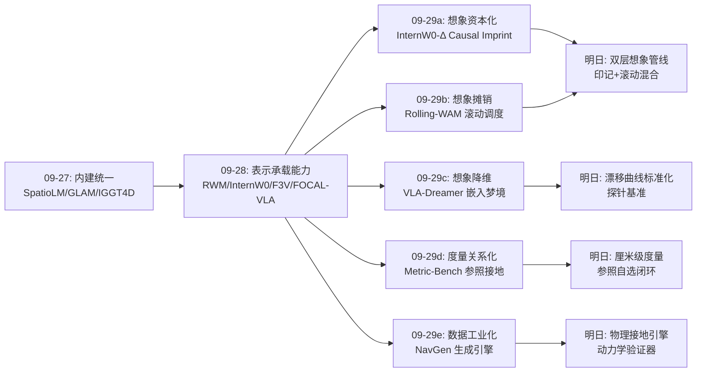
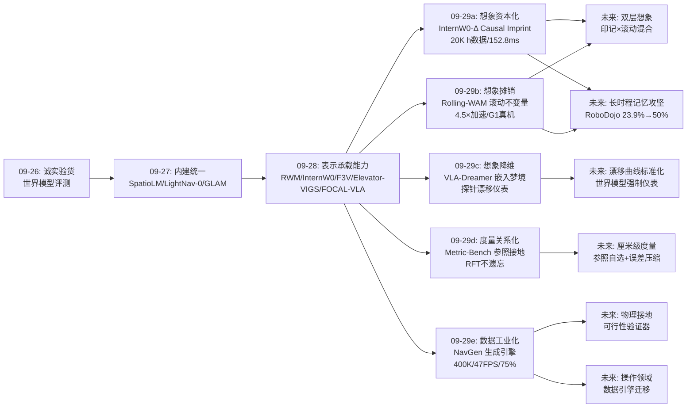
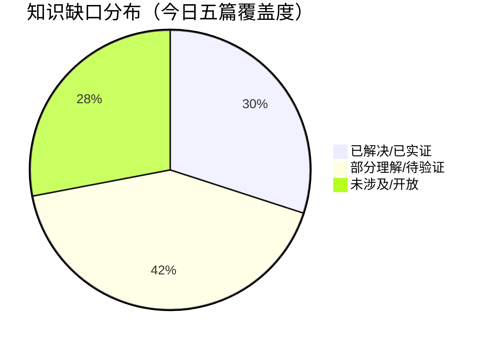

# Spatial AGI 每日深度思考 — 2026-09-29

**主题**: 想象的经济学与数据的工业化 —— 空间智能的"计算组织日"（变化印记 × 滚动想象 × 嵌入梦境 × 度量标尺 × 数据引擎）

**论文**:
1. InternW0-Δ（2609.31394，上海 AI Lab InternW 系列）— 有向 MoT 世界动作模型，Causal Imprint 把"未来"压缩成动作即用的变化表示，20K+ 小时最大开源异构语料，推理时零未来采样，152.8ms 实时控制
2. Rolling-WAM（2609.30247，USC + Toyota Research Institute）— 滚动扩散调度把联合视频-动作去噪摊销到连续重规划周期，窗口滑动不变量 σ(j+1)(0)=σ(j)(1)，稳态 4.5× 加速且保留完整视觉想象
3. VLA-Dreamer（2609.31313，汉堡大学 Wermter 组）— 在 VLA 自身的冻结视觉编码器嵌入空间上训练世界模型，用嵌入距离做 dense reward 在"梦境"里 PPO 精炼 VLA，探针量化想象漂移（概念论文）
4. Metric-Bench / MetricReasoner（2609.25841，浙大 CAD&CG + 小米）— 首个要求精确绝对度量的空间推理基准：参照物接地、免相机内参，三重可验证奖励 RFT，超私有模型 43.1% 且通用能力不遗忘
5. NavGen（2609.30770，浙大 + Differential Robotics）— 视觉生成模型作为导航数据引擎：400K episodes，运动对称纠偏、长尾风格放大，多样性 2.8× 于最强基线，47 FPS 真机 UAV 零样本 75%

---

## 📅 每日总结

**日期**: 2026-09-29
**论文数量**: 5篇
**主题**: 如果说昨天（09-28）的主题是"表示承载能力"——空间能力从良构表示中涌现；那么今天的五篇论文把问题推到了更工程的一层：**空间能力的每一分都要花钱——想象力花计算，度量花标定，规模花数据。今天的主旋律是这三笔账的经济学**。InternW0-Δ 回答"想象的账怎么记"：预测性知识的成本在训练期一次性付清（Causal Imprint），推理期以零未来开销提取利息；Rolling-WAM 回答"想象的账能不能分期"：滚动去噪把每个重规划周期的瞬时负担摊销成流水线开销，4.5× 加速且一分想象都不丢；VLA-Dreamer 回答"想象能不能降维记账"：把想象从像素空间搬到嵌入空间，用最便宜的想象层完成最贵的训练任务（RL），并给想象保真度装上第一个可量化的仪表（探针漂移曲线）；Metric-Bench 回答"度量这把尺子怎么造"：尺度不需要绝对感知（相机内参），参照接地的关系推理 + 可验证奖励 RFT 可以在不伤通用能力的前提下把度量智能注入 VLM；NavGen 回答"规模的账怎么付"：与其雇人飞无人机采数据，不如把视频生成模型变成导航经验工厂——400K episodes、对称纠偏、长尾放大、真机 75%。五篇论文分处 WAM、调度、RL 训练、基准、数据五个层面，但拼在一起是一张完整的"空间智能经济学"资产负债表：**资产端是想象与度量能力，负债端是计算与数据成本，今天的进展全部发生在把负债从推理期挪到训练期、从人工挪到机器、从绝对挪到关系**。

**关键突破**:
- 🚀 **想象的训练期资本化**（InternW0-Δ）：Causal Imprint 把"未来与现在的任务相关变化"压进一组专用 token——训练时对齐未来 latent 差量，推理时动作专家直接消费印记而无需任何未来 rollout。这是对"预测-控制断裂"问题（能预测未来≠能产生动作）迄今最干净的解答：未来作为梯度出现，不作为激活出现。20K+ 小时异构数据（机器人+UMI+人类自我中心+Ego2Robot）的统一规范表示，加上 LIBERO-Plus 92.8% / RoboTwin C2R 71.9% / RoboDojo 23.9%（最强先验 WAM 的近两倍）的成绩，以及 152.8ms 的单卡实时延迟，使它成为当前最完整的开源 WAM 系统
- 🚀 **想象的滚动分期付款**（Rolling-WAM）：发现 WAM 每个重规划周期从零去噪整条未来预测是巨大浪费——未执行的未来 chunk 被白白丢弃。滚动调度让窗口中每个 chunk 的 N 步去噪摊销到 W 个周期，稳态每周期只需 N/W 步。核心是一个数学不变量：σ_rolling(j+1)(0)=σ_rolling(j)(1)，窗口滑动后保留预测恰好处于新位置所需的噪声水平，无需任何重加噪操作。LIBERO 98.1%、RoboTwin 93.3%、Unitree G1 真机验证——"保留想象但不为想象付全价"成为被验证的第三条路
- 🚀 **想象的降维记账与保真度仪表**（VLA-Dreamer）：同一个 VLA 视觉编码器的嵌入，同时充当策略输入、世界模型预测目标、奖励空间——单一表示服务三职能。把 RL 搬进嵌入空间的梦境，样本效率问题转化为表示充分性问题。最有迁移价值的是探针方法：把分割/深度探针接到世界模型的预测嵌入上，"想象漂移"第一次变成可测的衰减曲线。判决性实验设计（正结果=VLA 自带隐式世界模型，负结果=暴露架构缺陷）让这篇概念论文的价值独立于其实验成败
- 🚀 **度量智能的关系化与无损注入**（Metric-Bench）：VLM 的度量能力第一次有了既严格（精确数值而非选择题）又实用（免相机内参）的测量工具——参照物接地让尺度从绝对感知退化为关系推理。三重可验证奖励（格式+指数精度+分箱接近）的 RFT 在超私有模型 43.1% 的同时，通用基准不降反升（V* +15.9%、BLINK 88.9%），下游具身基准迁移显著（RoboSpatial +30.4%、ERQA +9.3%）——"空间特化不必以灾难性遗忘为代价"拿到最完整实证
- 🚀 **数据供给的工业化**（NavGen）：视觉生成模型被证明可以是合格的"空间经验工厂"——400K episodes 的导航数据由物体库驱动 + LLM 场景想象 + T2V 生成 + 运动对称纠偏（镜像/时序反转零成本修复生成偏差）+ 深度锁定风格放大（长尾 10K→100K）+ VBench 过滤 + LLM 重标注的完整管线产出。受控实验证明数据本身的价值：多样性 2.8×、同模型换数据进步分 +17%、性能随规模单调上升。sCM 蒸馏把推理推到 47 FPS，真机 UAV 零样本 75%——生成数据直接支撑真实部署的闭环首次打通

**架构演进**: 10 层架构五处推进：
- 第 3 层（预测）：想象的计算组织三分天下——训练期资本化（InternW0-Δ）/ 推理期摊销（Rolling-WAM）/ 嵌入空间降维（VLA-Dreamer）
- 第 2 层（表示）：变化印记成为感知与动作之间的新原语（InternW0-Δ）；度量表示从绝对坐标系转为参照关系网（Metric-Bench）
- 第 6 层（规划）：滚动想象给出"梯度分辨率计划"的正式结构——近清晰/远模糊/随观测精炼（Rolling-WAM）
- 第 9 层（学习）：嵌入空间 imagination RL 成为 VLA 精炼的新训练场（VLA-Dreamer）；"回归任务→连续可验证奖励 RFT"成为空间能力注入的通用模板（Metric-Bench）
- 第 10 层（数据/基础设施）：数据引擎范式落地导航领域（NavGen），Spatial AGI 的基础设施层第一次有了工业级样板

### 📊 一句话总结

今天五篇论文共同完成了一次"空间智能的成本重构"：想象力的成本被重新记帐（训练期资本化 / 推理期分期 / 嵌入空间降维），度量能力的成本从标定转为关系推理，规模成本从人工采集转为生成引擎——空间智能的每一条能力线，今天都被重新定价了。

### 🔗 延续性

**昨日（09-28）→ 今日**: 昨天的主旋律是"表示承载能力"——RWM 证明规划可从表示几何读出、F3V 证明布局可从共享表示涌现、InternW0（物理世界模型版）证明预测与控制可异步双工。今天有三条直接延续：(1) 昨日 InternW0（WWM 侧：感知-预测闭环）与今日 InternW0-Δ（WAM 侧：预测-动作闭环）构成系列双璧，昨日的"K/V 编辑双工"与今日的"Causal Imprint"是同一架构哲学（预测不阻塞控制）的两个实现代际；(2) 昨日 FOCAL-VLA 的"隐式世界建模 + 教师仅在训练期存在"与今日 InternW0-Δ 的 4D 蒸馏（Track4World 教师推理时剪除）完全同构——"training-only 教师"作为模式被二次确认；(3) 昨日 RWM 的"表示空间中零开销规划"与今日 VLA-Dreamer 的"嵌入空间中零真实交互 RL"共享一个深层直觉：**好的表示能把昂贵的计算（搜索、真实试错）变成廉价的计算（判别、想象）**。

**今日→明日**: 五条线索——(1) "想象的混合记账"：InternW0-Δ 的印记（远端压缩）与 Rolling-WAM 的滚动（近端显式）能否组合成双层想象管线；(2) "漂移曲线的标准化"：VLA-Dreamer 的探针方法能否成为所有世界模型论文的强制评估项；(3) "度量-想象的耦合"：想象的几何保真度（深度探针衰减）很可能受模型度量智能（Metric-Bench 能力）制约，两者需要联合评估；(4) "数据引擎的物理接地"：NavGen 缺的动力学可行性验证器，与 Metric-Bench 的度量能力结合可能补上；(5) "RoboDojo 23.9% 的攻坚"：今日三篇 WAM 论文都没解决长时程记忆——三槽位缓存与滚动窗口都不是答案，显式 3D 场景记忆 + 印记/滚动想象的混合是明天最值得下的注。

### 💡 本质思考：如何达成通用空间智能

#### 1. 核心能力的本质是什么？

今天五篇论文把对空间智能能力本质的理解推进到"经济学"层面：

1. **空间智能的本质是"想象的预算分配"**（今日三篇 WAM/VLA 论文的共同贡献）：对未来的空间想象（预测场景如何演化）是空间智能区别于被动感知的核心，但想象有真实成本。今日三条路线给出了同一问题的三种记账法：InternW0-Δ 说"把想象折旧进表示"（Causal Imprint 是想象的一次性资本支出）、Rolling-WAM 说"让想象分期付款"（滚动摊销）、VLA-Dreamer 说"用最便宜的想象层"（嵌入空间想象）。三者共同揭示：**想象的表示越抽象，成本越低，但保真度的可验证性也越差**——像素想象可以肉眼检查，latent 想象可以可视化，嵌入想象只能靠探针。空间智能的架构设计因此是一个在"想象成本-保真度-可验证性"三角中的选址问题，而非单纯的能力竞赛。

2. **空间智能的度量层是关系性而非绝对性的**（Metric-Bench 的核心洞察）：尺度不需要绝对锚点（相机内参、标定），可以通过场景内参照对象的关系推理获得——正如人类记不住绝对尺寸、靠参照物校准。这把"度量理解"从传感器/标定问题重新定义为**推理问题**，而推理问题可以用 RFT 注入且不伤通用能力。更深一层：度量层是具身能力的地基（RoboSpatial +30.4% 的迁移证明），但米级精度够导航、操作需要厘米、装配需要毫米——**度量智能的精度阶梯对应着具身能力的分层**，今日方法止步米级，这个阶梯的攀登路径（参照精度的传播误差如何压缩）是明确的开放问题。

3. **空间智能的规模问题本质是数据供给的工业化问题**（NavGen 的贡献）：任何一条空间能力线（导航、操作、驾驶）的通用化都被数据卡住，而数据的三种来源（仿真器/真机/生成）构成一个成本-多样性-真实感的三角。NavGen 证明生成路线可以在导航领域同时拿到三者：多样性可工程化（物体库×运动类别×风格化）、真实感免费继承生成模型的真实践性先验、成本居中且无人工场景建设。这揭示一个结构性判断：**Spatial AGI 的竞争正在从模型架构创新转向数据供给工程**——生成模型的世界知识上限就是数据引擎的多样性上限，这个天花板决定了该范式需要与仿真器（几何精确）形成混合架构而非替代。

4. **空间智能的系统设计是"信息与成本的时间-空间选址"**（五篇合观）：InternW0-Δ 把未来信息放在训练期的梯度里、Rolling-WAM 把想象放在跨周期的时间摊销里、Elevator-VIGS（昨日）把不可观测量放在保持不更新的状态里、NavGen 把数据生产的成本放在基座模型的预训练里。空间智能系统设计的第一问题不是"用什么模块"，而是"**哪类信息、以什么成本、在哪个时间点和表示层兑现**"。这与昨日"表示的第一问题是信息住所"一脉相承，但今日把它从空间维度扩展到了时间（训练/推理、周期内/周期间）与经济（成本分摊）维度。

#### 2. 当前方法与理想目标的差距在哪里？

- **长时程空间记忆仍是集体盲区**：InternW0-Δ 的 A/R/C 三槽位、Rolling-WAM 的 W-chunk 滚动窗口、VLA-Dreamer 的嵌入历史——三种记忆结构都是有界缓存。RoboDojo 23.9%（InternW0-Δ，虽是最强 WAM 的两倍）是刻在墙上的天花板数字：分钟级的"记住十分钟前看过这个抽屉"任务全军覆没。显式 3D 场景记忆（场景图/神经场）与印记/滚动想象的混合方案被今日三篇论文各自暗示但没有一篇去做。
- **想象的物理可行性无保证**：Rolling-WAM 保留的想象与 InternW0-Δ 的印记都可能在物理上不合理（穿模、违反惯性），NavGen 生成的导航视频同样如此——VBench 给高分的运动可以让飞机炸机。整个"生成/想象驱动"的路线缺少一个统一的物理可行性层，目前全靠端到端性能间接兜底。
- **度量精度止步米级**：Metric-Bench 的 BP 奖励最细档是 0.25m——距操作级（cm）差一个数量级、装配级（mm）差两个。参照接地的误差传播链（参照误差×透视解析增益）在精度提升时会指数级变难。米级智能到毫米级智能之间可能不是渐进改进而是需要新机制（主动参照选择？多次观测融合？）。
- **参照物是免费午餐**：Metric-Bench 把参照物的识别与度量都喂给模型，真实部署没有这条供给线。完整闭环（自选参照→自估参照→误差传播→目标推断）的难度分布与当前基准测的完全不同。
- **数据引擎的隐性依赖**：NavGen 的多样性上限 = 基座生成模型的世界知识上限；极地、水下、灾后废墟这些生成模型没见过的环境依然造不出来。且生成内容的物理可行性无法从源头保证（无动力学验证器）、引擎迭代（Wan2.2→Wan3）的数据集增量更新机制不存在。
- **概念与实证的鸿沟**：VLA-Dreamer 全部主张仍是假设（无实验结果）；嵌入距离奖励的非单调性、reward hacking 风险、冻结编码器悖论都只是预判而非测量。

#### 3. 从今天到理想状态，最可能的路径是什么？

1. **短期（把仪表装上）**：(a) 想象漂移曲线标准化——把 VLA-Dreamer 的探针方法做成开源基准，要求所有世界模型论文报告"想象的几何保真度衰减"；(b) 生成数据物理验证器——用飞控/操作可达性模型过滤 NavGen 类数据，源头保证动力学可行性；(c) Metric-Bench 2.0——参照物自选 + 厘米级门槛 + CoT 扰动敏感性检验（区分推理与合理化）。三者都是低成本高判决性的评估基础设施，且互相咬合：漂移曲线需要度量探针，物理验证器需要度量判断。
2. **中期（想象的混合架构与记忆攻坚）**：近端滚动想象（Rolling-WAM）+ 远端印记压缩（InternW0-Δ）的双层想象管线；三槽位/滑窗记忆替换为可检索的显式 3D 场景记忆（场景图或在线高斯场），印记机制扩展为记忆查询原语——直接攻击 RoboDojo 23.9% 的长时程缺口。数据侧：NavGen 引擎 + 3DGS 精修的混合架构（常见场景重建、长尾场景生成），操作领域按 NavGen 检查表评估迁移可行性（接触物理是难点，预计 1-2 年）。
3. **长期（成本归零的空间智能）**：终局是"能力获取成本"与"能力部署成本"的完全分离——所有昂贵的计算（想象、搜索、真机试错、人工标注）都发生在训练期或数据引擎里，部署期只剩下轻量的表示消费（印记读取、滚动执行、关系度量推理）。到那时，通用空间智能体没有一个叫"空间理解"的组件，就像今日的 InternW0-Δ 没有一个叫"未来预测"的推理步骤——空间性完全弥散在表示的经济学结构之中。这个终局的近期信号是：当"训练一次、部署终身"的空间能力编译（RWM 的零搜索规划、FOCAL-VLA 的教师剪除、InternW0-Δ 的印记）在更多能力线上重复出现时，我们就知道方向对了。

---

## 🔗 与昨日思考的联系

### 昨日重点

昨天（2026-09-28）确立的核心判断：空间能力的获得方式正从"训练模块"退化为"构造表示"——规划内嵌于表示几何（RWM）、预测与控制异步双工（InternW0）、布局从共享表示涌现（F3V）、参考系按认识论边界分工（Elevator-VIGS）、监督按任务焦点聚焦（FOCAL-VLA）。四个待验证方向：涌现边界图谱、双工通用化、6-DoF 参考系图谱、监督聚焦自动化。

### 今日进展

今天的五篇论文在四个方向上直接衔接昨天的悬念：

1. **"training-only 教师"模式二次确认**：昨日 FOCAL-VLA 的教师（VGGT/Track4World）推理时剪除；今日 InternW0-Δ 同样用 Track4World 做 training-only 4D 蒸馏。同一模式在两个独立团队重复出现，可以确认这是一个稳定的设计模式而非孤例——"贵的知识在训练期注入，部署期零残留"正在成为空间智能的默认训练协议。
2. **"双工"的代际演进**：昨日 InternW0 用 K/V 编辑实现预测-控制异步双工；今日 InternW0-Δ 用有向 MoT + Causal Imprint 把"动作条件化预测"升级为"变化印记直接喂动作"。双工的信息载体从"注意力缓存编辑"进化为"专用变化表示"，接口更干净、信息流方向保证更强（有向注意力硬性因果）。
3. **"零开销"哲学从规划扩展到想象**：昨日 RWM 证明规划可以零搜索开销；今日 InternW0-Δ 证明未来想象可以零推理开销、Rolling-WAM 证明保留想象的成本可以摊销、VLA-Dreamer 证明 RL 可以零真实交互。"把贵的计算变成便宜的计算"昨日还只是规划领域的洞察，今天成为横跨规划/想象/学习的通用设计准则。
4. **昨日"表示的信息住所"原则获得经济学维度**：昨日 Elevator-VIGS 说信息要住在认识论上正确的坐标系；今日五篇补充说信息还要住在经济上正确的时间点（训练期 vs 推理期、周期内 vs 跨周期）和供给渠道（人工 vs 生成）。表示设计从空间问题扩展为时空经济问题。

### 演进路径



---

## 📚 论文概览

**论文1 — InternW0-Δ**：上海 AI Lab InternW 系列 WAM 侧新作（昨日精读的 InternW0 是其 WWM 侧姊妹篇）。三个核心组件：有向 Mixture-of-Transformers（30 blocks 耦合 Wan2.2-5B 视频专家与 ActionDiT 动作专家，信息流有向保证因果）；Causal Imprint（专用 token 在训练期对齐未来 latent 变化量与视频专家特征，推理期 hidden states 直接供动作专家，零未来 rollout）；training-only 4D 蒸馏（Track4World 教师注入几何运动先验，推理期剪除）。数据侧统一 20K+ 小时异构语料（机器人+UMI+人类自我中心+Ego2Robot）到 canonical state-action 表示。四个仿真基准全面领先 + 四个真实平台部署，RTX 5090 单卡 152.8ms（5.11× 加速）。承诺全链路开源。

**论文2 — Rolling-WAM**：USC + Toyota Research Institute。诊断：WAM 每个重规划周期从零去噪整条视频-动作预测，而 receding-horizon 控制只执行第一个 chunk——未执行的未来被丢弃，下周期从零再来。解法：滚动扩散调度——W 个 video-action chunk 的噪声水平从近到远阶梯递增，每周期只把最近 chunk 精炼到可执行（稳态 N/W 步），保留的未来 chunk 因 σ(j+1)(0)=σ(j)(1) 不变量恰好处于新位置所需状态。注意力拓扑：动作看全窗视觉未来、动作只看同 chunk 动作、视频不被动作注意。LIBERO 98.1%、RoboTwin 93.3%、Unitree G1 真机三任务。4.5× 加速且与其他加速技术正交可组合。

**论文3 — VLA-Dreamer**：汉堡大学 Wermter 组概念论文。在 VLA（π0-FAST 或 OpenVLA）冻结的视觉编码器嵌入空间上训练动作条件世界模型（输入动作+本体+嵌入历史，输出下一帧嵌入），然后用嵌入距离做 dense reward（-MSE(当前嵌入,目标嵌入)）在世界模型里 PPO 精炼 VLA。同一嵌入承担三职能：策略输入、预测目标、奖励空间。方法论亮点：分割/深度探针挂到预测嵌入上，把"想象漂移"量化为衰减曲线。明确判决性实验定位：正结果证明 VLA 自带隐式世界模型，负结果暴露架构缺陷。局限：无实验结果、嵌入奖励非单调风险、漂移限视界。

**论文4 — Metric-Bench / MetricReasoner**：浙大 CAD&CG + 小米。基准：基于 ScanNetV2，1340 精校测试 QA + 5K 训练集（场景隔离），五类别（尺寸/位置/深度/距离/3D框），任务形式为"给定参照物真实度量，推断目标物体绝对度量"，全程免相机内参。构建管线含 Laplacian 模糊过滤、3D→相机系变换、视野投影过滤、双重复核。训练：MetricReasoner 用结构化提示（CoT 引用参照度量）+ 三重可验证奖励（格式 0/1 + 指数精度 e^(-|ŷ-y|) + 分箱接近 0.25/0.5/1m→1/0.05/0.01/0）。结果：度量推理超更大私有模型 43.1%，通用基准不降反升，下游 RoboSpatial +30.4%、ERQA +9.3%。

**论文5 — NavGen**：浙大 + Differential Robotics。数据引擎管线：300K 通用样本（100 万物体库筛 300K 目标 + 运动类别分配 + Qwen3.6-27B 专家角色想象场景 + step-distilled Wan2.2-14B T2V 生成）；10K 长尾种子（Seedance，穿缝/绕飞）→ 首帧编辑（Qwen-Image-Edit）+ 深度引导（MoGe-2）参考 V2V（LTX-2.3 ICLora）放大到 100K；运动再平衡（Pi3 解码运动方向，镜像/时序反转纠偏）；VBench+等级过滤；Qwen 重标注（11 帧 + 运动线索）。合计 400K episodes。训练：Wan2.2-5B + clean-prefix conditioning（k~U{1..N} 统一 I2V/V2V）+ SFT + sCM 蒸馏 = 47 FPS。真机 UAV 零样本 75%。对照实验：多样性 2.8×、进步分 +17%、规模单调增益。

---

## 💡 核心见解

### 见解1: 未来的正确位置是训练期的梯度里，不是推理期的激活里

**从 InternW0-Δ 获得**
- ✅ Causal Imprint 让未来监督只以损失形式出现：训练时对齐未来 latent 变化量，推理时任何前向路径都不接触未来观测——"想象的成本在训练期一次性资本化"
- ✅ 有向 MoT 用架构（而非训练技巧）硬性保证因果合法性：30 个 block 的信息流方向受控，未来信息物理上无法泄漏到动作路径
- ✅ 效果：四个仿真基准领先 + 真机 152.8ms 实时——证明这条"零未来开销"路线可以走到部署级

**对Spatial AGI的启发**:
这与昨日 RWM 的"零搜索规划"、FOCAL-VLA 的"教师剪除"构成三重奏：空间智能的昂贵计算（搜索、想象、监督）有一个统一的会计准则——**能力获取的成本应该资本化（训练期摊销），而非费用化（每次推理重付）**。Rolling-WAM 的存在提醒这不是唯一解：当想象的信息价值高到值得保留时，分期付款（摊销）优于一次性资本化。两种记账法的选择标准是想象的边际信息价值。

### 见解2: 滚动不变量证明"想象的连续性"可以是数学结构而非工程补丁

**从 Rolling-WAM 获得**
- ✅ σ_rolling(j+1)(0) = σ_rolling(j)(1)：窗口滑动后每个保留 chunk 的噪声水平恰好等于其新位置的起始水平——无需任何重加噪，想象无缝续接
- ✅ 每个chunk的N步去噪被均匀分摊到W个周期，稳态只需N/W步——4.5×加速不是近似牺牲而是计算重分布
- ✅ 注意力拓扑（动作看全窗视觉、动作间限同chunk、视频不被动作看）精确编码"消费想象但不污染想象"

**对Spatial AGI的启发**:
这个不变量的优雅之处在于它不是启发式，而是"想象连续性"的数学必然——窗口每滑一步，所有保留想象恰好处于其新位置应有的确定性水平。人类运动规划的"在线修正"研究显示近似的认知结构（预规划的修正载体而非重新规划）。当 AI 架构与认知结构独立收敛到同一形态时，通常意味着接近这类问题的自然解。对 Spatial AGI：任何"预测式"组件都值得问一句——它的滚动不变量是什么？导航的滚动想象、场景重建的滚动更新、意图预测的滚动修正，都应该寻找自己的 σ(j+1)(0)=σ(j)(1)。

### 见解3: 想象的表示抽象度是一个成本-保真度-可验证性的三角选址

**从 InternW0-Δ、Rolling-WAM、VLA-Dreamer 三篇互照获得**
- ✅ 像素想象（经典WAM/Rolling-WAM）：保真度最高、可肉眼验证、成本最高
- ✅ Latent变化印记（InternW0-Δ）：成本归零（推理时）、保真度中、可用latent解码抽查
- ✅ 嵌入空间想象（VLA-Dreamer）：成本最低、保真度待测、只能靠探针间接验证

**对Spatial AGI的启发**:
三角中没有全能点——想象的每一步抽象化都在省成本的同时损失可验证性。这解释了为什么三条路线并存而非相互淘汰：在线控制回路（Rolling-WAM 的场景）付得起像素想象的分期款；离线训练场（VLA-Dreamer 的场景）应该用最便宜的嵌入想象；而 InternW0-Δ 证明了第三种可能——把想象压缩成任务相关的印记，只保留"行动需要的那部分未来"。Spatial AGI 的架构评审应该新增一个问题：**这个系统里的想象住在三角的哪个点？为什么是这个点而不是相邻点？**

### 见解4: 探针是想象的仪表盘——漂移第一次可测量

**从 VLA-Dreamer 获得**
- ✅ 分割/深度探针挂到世界模型的预测嵌入上：探针精度随想象步数的衰减 = 想象的物体恒常性与几何保真度的直接度量
- ✅ 同样探针挂在真实编码器嵌入上：检验 VLA 是否编码动作相关信息（空间度量、物体掩码）——编码器体检与想象测速共用一套仪器
- ✅ 判决性实验设计：嵌入可预测→VLA自带隐式世界模型；不可预测→当前VLA架构存在表示缺陷。无论结果如何都产生领域级知识

**对Spatial AGI的启发**:
这是今天最可迁移的方法论资产。此前世界模型评估靠"视频看起来还行"的主观判断，嵌入空间想象更是无法检查的黑盒。漂移曲线让"想象质量"成为可审计的工程属性。推广开来：**任何空间想象系统（世界模型、生成引擎、滚动预测）都应该报告其想象的几何保真度衰减曲线**——想象多远开始失去物体边界？多远开始深度失真？这些数字应该像延迟一样成为部署决策的输入。Metric-Bench 与此呼应：探针（表征级测量）与精确数值基准（能力级测量）是同一枚硬币的两面，理想的空间 VLM 评估应该两者都做。

### 见解5: 度量智能是关系推理而非绝对感知——标定可以被参照物替换

**从 Metric-Bench 获得**
- ✅ 参照物接地让尺度推断从"需要相机内参的绝对感知"退化为"场景内关系推理"——人类正是这样做的（记不住绝对尺寸，靠参照物校准）
- ✅ 三重可验证奖励RFT把度量能力注入VLM且通用能力不降反升（V* +15.9%）——空间特化与通用能力的trade-off被证明不是必然
- ✅ 下游迁移实证（RoboSpatial +30.4%、ERQA +9.3%）：度量理解是具身空间能力的基础设施，提升度量=提升整个具身栈

**对Spatial AGI的启发**:
两个层次的启示。工程层：免内参的度量方案解锁了消费级场景（手机模组、变焦、多摄切换、无元数据视频）——这些场景里 Metric3D 式标定路线直接失效，参照接地是唯一通用路径。架构层："回归任务→连续可验证奖励RFT"是一个可复制的转换模板——任何连续输出的空间任务（深度、位姿、物理参数预测）都可以尝试从监督回归转为RFT，从而享受"特化不遗忘"的红利。如果这个模板在更多任务上成立，"通用VLM + 一组空间RFT配方"将成为Spatial AGI的标准构建方式。

### 见解6: 生成模型的真实先验是一种隐式的域适配——sim-to-real的第三条路

**从 NavGen 获得**
- ✅ 对照实验：NavGen生成数据在非真实数据中sim-to-real gap最小——因为视频基座是在真实视频上训练的，其输出分布天然贴近真实统计
- ✅ 真机验证闭环：47FPS推理 + 未见环境零样本75%成功率——生成数据直接支撑真实部署，无需真实数据微调
- ✅ 规模单调增益：数据越多性能越好——生成数据的scaling law成立

**对Spatial AGI的启发**:
传统sim-to-real两条路（提升仿真器真实度、域随机化）之外，生成路线的隐式域适配是结构性优势：仿真器的真实感要人工建设，生成模型的真实感是从真实数据里"免费"继承的。但要注意天花板：生成模型没见过的环境（极地、水下、灾后废墟）造不出来——引擎多样性上限=基座世界知识上限。因此终局是混合架构：常见场景3DGS精修（几何精确）+ 长尾场景生成（多样性补足）。此外，运动再平衡的对称纠偏值得所有团队警惕：生成模型不是无偏采样器，它的分布偏差会被策略忠实学习（"这架无人机总爱往右绕"）——**任何用生成数据的团队都应该检查生成分布的偏差结构**。

### 见解7: 度量精度阶梯对应具身能力的分层——米级已破，厘米毫米仍黑

**从 Metric-Bench 与 NavGen/InternW0-Δ 的交叉获得**
- ✅ Metric-Bench止步0.25m门槛——米级智能已可RFT注入且不伤通用
- ✅ NavGen导航75%零样本——导航是米级任务，当前精度栈刚好够用
- ✅ InternW0-Δ操作任务的最后失败集中在精度与长时程——厘米级是操作突破的门槛

**对Spatial AGI的启发**:
把能力栈画在度量轴上：导航需要米级（已解决）、抓取需要厘米级（VLM路线未达，专用深度/触觉在扛）、装配需要毫米级（无解，靠接触反馈）。**度量智能的精度阶梯是具身能力分层的第一性解释**——VLM路线目前卡在米级到厘米级之间，这个gap的攀登（参照误差传播的压缩、主动参照选择、多观测融合）可能比更大模型更重要。反过来，操作级精度的达成或许不需要VLM全栈上探，而是"VLM米级规划 + 专用厘米级伺服 + 接触毫米级闭环"的分层控制系统——每层用最便宜的够用智能。

### 见解8: 数据引擎的护城河是管线know-how而非生成模型本身

**从 NavGen 获得**
- ✅ 运动再平衡：发现生成模型运动分布偏差（右转偏多类）并用镜像/时序反转零成本纠偏——这类偏差结构知识不写在任何生成模型文档里
- ✅ 重标注而非用原prompt：生成视频未必忠实于prompt，训练标签必须描述视频实际内容——"标签要跟随数据而非意图"是数据工程的朴素但易错的原则
- ✅ 长尾放大结构：深度锁定几何+风格编辑外观——把"多样什么"（外观）和"不变什么"（结构）显式分开

**对Spatial AGI的启发**:
生成模型商品化后（Wan/Seedance人人可用），数据引擎的差异化全在管线：偏差检测、过滤标准、标注质量、验证闭环。NavGen 400K episodes公开后，数据的直接价值会稀释，但"如何造下一批更好的数据"的方法论价值持久。对国内团队的具体启示：不要只做"用NavGen数据训模型"的下游工作，要做"把NavGen管线迁移到XX领域"的管线工作——操作领域（接触物理）、驾驶领域（corner case）的引擎都还是空白。

### 见解9: WAM生态从单点创新进入组件集成竞争

**从 InternW0-Δ 与 Rolling-WAM 的谱系对照获得**
- ✅ InternW0-Δ：唯一同时集成"无需rollout"（Fast-WAM系）+"4D几何先验"（4D-WAM系）+"最大开放数据"+"工程优化"的系统
- ✅ Rolling-WAM：不改模型、不加蒸馏，纯调度拿4.5×，并声明与其他加速技术正交可组合
- ✅ 两者共享MoT骨架（视频专家+动作专家）——架构收敛、调度/机制分化

**对Spatial AGI的启发**:
胜负手正在从"有没有新机制"转向"能否把多个好机制+大数据+工程优化整合成稳定系统"。InternW0-Δ的论文结构（机制→数据→基础设施→基准→部署五段俱全）本身就是这个时代的论文写作范式。对研究者的启示：单点机制论文的影响力窗口在缩短，"机制×数据×工程"的组合竞争力在上升——但组合的前提是对每个组件的第一性理解，这正是逐篇精读的价值所在。

---

## 🗺️ 知识演进图



---

## 技术栈演进对比表

| 层次 | 昨日方案（09-28） | 今日方案（09-29） | 变化 |
|------|-----------------|-----------------|------|
| L3 预测/想象 | InternW0 K/V编辑双工；FOCAL-VLA隐式世界建模 | 想象三分记账：印记资本化（InternW0-Δ）/滚动摊销（Rolling-WAM）/嵌入降维（VLA-Dreamer） | 想象从"架构问题"变为"计算组织问题"，三种记账法并存 |
| L2 表示 | 涌现式表示（RWM插值轨迹、F3V共享空间） | 变化印记成为感知→动作新原语；度量表示关系化（参照网取代绝对系） | 表示从"承载能力"细化到"承载定价"——每类信息有经济上正确的住所 |
| L4 定位/建图 | Elevator-VIGS 运输状态参考系分离 | （今日无论文直接推进） | 层间让位 |
| L6 规划 | RWM 零搜索表示规划 | Rolling-WAM 梯度分辨率计划（近清晰/远模糊/随观测精炼） | 规划的时间结构首次被形式化为噪声调度 |
| L9 学习 | FOCAL-VLA 教师 training-only；子任务聚焦监督 | training-only教师二次确认（InternW0-Δ 4D蒸馏）；嵌入梦境RL（VLA-Dreamer）；回归→RFT模板（Metric-Bench） | "训练-推理不对称"从单点技巧升级为通用协议；RL入梦境开辟VLA精炼新管线 |
| L10 数据/基础设施 | F3V 46K实例数据治理 | NavGen 400K导航episodes生成引擎（生成→纠偏→过滤→标注→部署闭环） | 数据供给从"治理"升级为"工业化生产"，基础设施层首个导航样板 |
| 评估 | WorldOlympiad类世界模型基准 | Metric-Bench精确数值基准；探针漂移曲线（VLA-Dreamer提案） | 评估从"任务成功率"细化为"能力+保真度"双仪表 |

---

## 🗺️ Spatial AGI 知识图谱

### 10层架构思维导图

```mermaid
mindmap
  root((Spatial AGI<br/>10层架构))
    第1层 感知
      多视角画布统一 (InternW0-Δ)
      生成模型作为传感器替代 (NavGen)
    第2层 表示
      变化印记 Causal Imprint (InternW0-Δ)
      参照关系度量网 (Metric-Bench)
      深度结构×外观风格解耦 (NavGen)
      语言对齐嵌入的三职能 (VLA-Dreamer)
    第3层 预测/想象
      训练期资本化 (InternW0-Δ)
      滚动摊销 不变量σ(j+1)(0)=σ(j)(1) (Rolling-WAM)
      嵌入空间梦境 (VLA-Dreamer)
      探针漂移曲线仪表 (VLA-Dreamer)
    第4层 定位/建图
      昨日参考系分离延续
      待与滚动想象结合
    第5层 推理/认知
      CoT引用参照证据 (Metric-Bench)
      CoT敏感性检验待做 (Metric-Bench局限)
    第6层 规划
      梯度分辨率计划 (Rolling-WAM)
      MPC warm-start的扩散实现 (Rolling-WAM)
      嵌入距离奖励规划 (VLA-Dreamer)
    第7层 动作
      ActionDiT生成式动作 (InternW0-Δ)
      clean-prefix长视频续接→动作 (NavGen)
      47FPS实时动作解码 (NavGen)
    第8层 执行/部署
      152.8ms@RTX5090 (InternW0-Δ)
      Unitree G1真机 (Rolling-WAM)
      UAV零样本75% (NavGen)
    第9层 学习
      两阶段预训练+后训练 (InternW0-Δ)
      嵌入梦境PPO (VLA-Dreamer)
      三重可验证奖励RFT (Metric-Bench)
      SFT+sCM蒸馏 (NavGen)
    第10层 数据/基础设施
      20K小时异构统一 (InternW0-Δ)
      400K生成episodes引擎 (NavGen)
      运动对称纠偏 (NavGen)
      1340精校度量基准 (Metric-Bench)
```

### 🎯 主线技术路径

#### 阶段1: 模块拼接时代（-2024）
SLAM+分割+规划的拼接管线；仿真器数据+真机小数据；VLM靠选择题基准测空间。空间能力=多个专用模块的集成，每加一个能力加一个模块。

#### 阶段2: 统一架构时代（2025）
统一Transformer多任务训练；VLA/WAM架构确立；MoT视频专家+动作专家成为骨架（DreamZero→Motus→Fast-WAM→InternW系）。空间能力=一个模型的多个目标，但预测-控制断裂、推理延迟、数据瓶颈三大问题暴露。

#### 阶段3: 计算组织时代（2026 现在 ★我们在这里）
架构收敛（MoT骨架共识），竞争转向计算的时空经济学：想象在哪里做（训练期/推理期/嵌入空间——今日三篇）、以什么节奏做（滚动摊销）、用什么保真度仪表管（探针漂移）；度量从标定问题转为关系推理（Metric-Bench）；数据从采集问题转为引擎问题（NavGen）。特征：训练-推理不对称成为通用协议，能力获取与部署成本完全分离。

#### 阶段4: 记忆与物理闭环时代（2026下半年-2027 预期）
当前最大缺口的两线攻坚：(a) 长时程空间记忆——显式3D场景记忆（场景图/在线高斯场）与印记/滚动想象混合，攻击RoboDojo 23.9%天花板；(b) 物理接地——生成数据与想象内容的动力学可行性验证器，攻击"视觉合理但物理炸机"的缺口。度量向厘米级攀登（参照自选+误差传播压缩）。数据引擎向操作/驾驶领域迁移。

#### 阶段5: 表示弥散时代（2027+ 愿景）
通用空间智能体没有一个叫"空间理解"的组件——空间性弥散在所有表示的经济学结构中：想象是训练期资本化的印记、度量是关系推理的反射、记忆是可检索的场、规划是表示空间的几何运算。部署期只剩轻量表示消费，与人类"离线深思、在线流畅"的认知经济同构。

---

## 🔍 待探索议题

### 高优先级（本周）

1. **双层想象管线的可行性设计**
   - 问题: InternW0-Δ的印记（远端压缩）与Rolling-WAM的滚动（近端显式）能否在同一个WAM中组合？近端chunk滚动显式想象供精细控制，远端用印记压缩供方向预判
   - 候选方案: MoT窗口内，近端k个chunk走rolling去噪，远端token走印记对齐损失；动作专家分层消费（执行看滚动、意图看印记）
   - 缺口: 两种信息形态（噪声状态vs干净印记）在同一注意力的融合机制；两者冲突时的仲裁

2. **想象漂移曲线的标准化协议**
   - 问题: VLA-Dreamer的探针方法如何变成所有世界模型论文的强制评估项？
   - 候选方案: 开源"想象探针套件"（分割mIoU/深度RMSE/位姿误差 vs 想象步数），配套ScanNet+Airsim标准想象任务
   - 缺口: 探针在latent（非嵌入）输出上的适配；不同模型输出空间的归一化

3. **RoboDojo 23.9%的显式记忆攻坚**
   - 问题: A/R/C三槽位与W-chunk滑窗都不是长时程记忆的答案，什么才是？
   - 候选方案: 在线3D场景图作为可检索记忆，Causal Imprint扩展为记忆查询原语（"印记过去、查询现在"）
   - 缺口: 记忆写入时机（什么值得记）、检索延迟（不能拖慢152ms回路）、记忆与想象的接口

### 中优先级（本月）

4. **Metric-Bench 2.0：参照自选闭环**
   - 问题: 当前基准免费喂参照物，真实部署需要自选参照→自估参照→误差传播的完整闭环
   - 候选方案: 增设"参照物选择"子任务（给目标，让模型指出最该用哪个参照并说明理由）；误差传播题（参照深度差异大时的鲁棒性）
   - 缺口: 参照质量的评价标准；自估参照的误差上限测量

5. **生成数据的物理可行性验证器**
   - 问题: NavGen类生成视频"视觉合理但物理炸机"——VBench与动力学可行性不对齐
   - 候选方案: 飞控模型逐段验证动作可达性（操作领域用抓取可达性）；不可行片段自动剔除或重生成
   - 缺口: 验证器的假阴性率（真可行被误杀）与计算成本；验证粒度（整段vs逐帧）

6. **嵌入距离奖励的鲁棒化**
   - 问题: VLA-Dreamer的-MSE奖励可能非单调、可被hacking（嵌入近但任务失败）
   - 候选方案: 嵌入距离+稀疏成功分类器双奖励；扰动负样本注入（让"看起来像"的嵌入距离被拉大）
   - 缺口: VLA-Dreamer尚无实验，所有方案都是纸上谈兵——需要先复现其世界模型训练

7. **数据引擎向操作领域迁移评估**
   - 问题: NavGen范式（物体库→T2V→过滤→标注）能否迁移到操作？
   - 候选方案: 按迁移检查表逐项评估（生成可行性/标签提取/对称变换/动力学验证）；先做"平行抓取"这类最简单接触的最小试点
   - 缺口: 接触物理的生成质量（当前T2V弱项）；操作标签（末端轨迹+接触事件）的自动提取精度

### 低优先级（本季度）

8. **CoT在空间推理中的真实性检验**
   - 问题: MetricReasoner的CoT可能只是事后合理化（先猜数后编理由）
   - 候选方案: 扰动实验——修改提示中参照度量，检验CoT引用是否相应变化；不敏感则CoT是装饰
   - 缺口: 需要MetricReasoner权重开源（论文承诺）；扰动实验的对照设计

9. **参考系图谱的空间智能版**
   - 问题: 昨日Elevator-VIGS的1-DoF运输状态如何推广为移动参考系的系统语法？
   - 候选方案: 枚举载体（电梯/扶梯/渡轮/高铁/旋转门）×约束（重力向/速度连续/周期先验）×可观测性分析模板
   - 缺口: 与今日滚动想象的结合（移动环境中的滚动WAM）——电梯里的Rolling-WAM

10. **想象连续性的认知科学对标实验**
    - 问题: Rolling-WAM的"近清晰/远模糊"结构与人脑运动规划的分辨率梯度是否功能等价？
    - 候选方案: 用人类行为实验（到达任务的在线修正精度随时间距离衰减曲线）与Rolling-WAM的性能衰减曲线对比形态
    - 缺口: 跨领域类比实验的严谨性；人脑测量的噪声水平

11. **InternW系列的数据飞轮**
    - 问题: InternW0-Δ的20K小时真实数据与NavGen式生成引擎能否闭环——用真实数据微调生成模型→生成扩增→策略更强？
    - 候选方案: Ego2Robot方向的反向（Robot2Ego）+ T2V操作数据引擎试点
    - 缺口: 生成操作视频的接触物理；扩增数据与真实数据的混合比例科学

---

## 📊 知识缺口分析



**已解决（30%）**:
- ✅ WAM预测-控制断裂的一种最优解（Causal Imprint，四基准+真机实证）
- ✅ 保留想象的低延迟推理（滚动摊销，4.5×+G1真机）
- ✅ VLM米级度量推理的测量与无损注入（Metric-Bench+RFT，43.1%+不遗忘实证）
- ✅ 导航领域的生成数据引擎闭环（NavGen，对照实验+真机75%）
- ✅ training-only教师模式的双团队独立确认（InternW0-Δ+昨日FOCAL-VLA）
- ✅ 生成数据偏差的检测与对称纠偏方法（运动再平衡）

**部分理解（42%）**:
- ⚠️ 想象的保真度衰减：探针方法已提出（VLA-Dreamer）但无实验、无跨模型对比数据
- ⚠️ 嵌入空间RL：架构完整但全部主张未验证，reward非单调/hacking风险只是预判
- ⚠️ 度量精度阶梯：米级已破，厘米/毫米级的机制完全未知；参照自选闭环未测
- ⚠️ 长时程空间记忆：三种有界缓存都失败于RoboDojo类任务，显式记忆方案有构想无实证
- ⚠️ 生成数据规模效应：导航领域scaling law成立（NavGen），操作/驾驶领域未知
- ⚠️ 想象与度量的耦合：深度探针衰减疑似受度量智能制约，无直接实验证据
- ⚠️ CoT真实性：空间推理的CoT可能事后合理化，扰动检验未做
- ⚠️ WAM加速技术的正交组合：Rolling-WAM声明可组合，实际组合效果未测

**未涉及（28%）**:
- ❌ 想象/生成内容的物理可行性保证（惯性、碰撞、接触）——所有今日论文都缺这一层
- ❌ 厘米/毫米级度量的新机制（参照误差传播压缩、主动感知）
- ❌ 数据引擎的迭代机制（基座模型升级时的数据集增量更新）
- ❌ 多智能体空间智能（今日全部是单体）
- ❌ 触觉/力觉与想象表示的融合（VLA-Dreamer嵌入空间可扩展但未讨论）
- ❌ 空间智能的安全性（实时生成动作+无安全约束层的部署风险）
- ❌ 跨具身零样本（InternW0-Δ仍需本体相关后训练）
- ❌ 想象的元认知（"知道自己想象不可靠"的校准机制）

---

## 🎯 明日研究焦点预案

基于今日线索，明天的论文筛选应特别关注：

1. **长时程记忆×世界模型的交叉**：任何"scene graph + WAM"、"spatial memory + imagination"的组合都是RoboDojo攻坚的直接候选
2. **世界模型的物理一致性评估**：今日缺口的"物理可行性验证器"方向，若有论文提出动力学感知的视频评估指标，优先级拉满
3. **厘米级度量**：Metric-Bench的后续或竞品（参照自选、桌面操作级精度）
4. **想象漂移的实证**：VLA-Dreamer团队的后续实验，或任何"world model fidelity probing"工作
5. **操作领域数据引擎**：NavGen范式向manipulation迁移的首批尝试

---

## 📝 今日金句

> 未来的正确位置是训练期的梯度里，不是推理期的激活里。—— InternW0-Δ 的会计准则

> 好的想象不是每次重新想象，而是有一个滚动不变量让想象自动续接。—— Rolling-WAM

> 想象的表示越抽象越便宜，但可验证性越差——探针是抽象想象的唯一仪表。—— VLA-Dreamer

> 尺度不需要绝对锚点，人类靠参照物活了一辈子。—— Metric-Bench

> 生成模型的真实先验是免费的域适配，但它的天花板是它见过的世界。—— NavGen

---

**文档创建时间**: 2026-09-29
**分析方法**: 五篇论文精读（papers/2026-09-29_01~05）+ 昨日思考（2026-09-28）延续性综合
**论文清单**: 见 papers_list.md "2026-09-29 研究的论文"

---

## 💡 核心见解（续）

### 见解10: 训练-推理不对称是空间智能的"复利账户"

**从 InternW0-Δ、Rolling-WAM、NavGen 三篇合观获得**
- ✅ InternW0-Δ：4D教师蒸馏（训练期）换取几何先验（推理期免费）
- ✅ Rolling-WAM：初始化周期付N步（一次性）换取稳态N/W步（每周期）
- ✅ NavGen：3000 A100·小时（训练期生成）换取400K episodes（无限次复用）

**对Spatial AGI的启发**:
三篇论文在三个不同层面复现同一个财务结构：**前期重资产投入换后期低边际成本**。这与传统机器人"每个任务都重新编程"的费用模型形成代际差。可以精确类比：监督学习时代的空间智能是"现金流业务"（每个部署都要配套数据采集和标注的持续投入），而WAM/RFT/数据引擎时代是"资产型业务"（一次投入，多任务摊薄）。这个结构解释了为什么大公司偏好这个范式（资本优势可转化为资产），也提示学术界的比较优势在"资产设计"（新机制、新管线）而非"资产运营"（scale up）。给个人研究者的策略含义：选择"设计资产"型课题（新印记机制、新探针协议、新纠偏方法）而非"运营资产"型课题（更大规模训练）。

### 见解11: 评估仪表的创新与模型创新同等重要

**从 Metric-Bench 与 VLA-Dreamer 对照获得**
- ✅ Metric-Bench的贡献一半是模型（MetricReasoner 43.1%）一半是标尺（精确数值基准终结选择题时代）
- ✅ VLA-Dreamer的架构完全未验证，但探针漂移曲线的方法论价值独立成立
- ✅ 历史佐证：ImageNet/benchmark先行→模型大爆发；VSI-Bench等空间基准→空间VLM大爆发

**对Spatial AGI的启发**:
今天五篇论文里，长期影响力最大的可能不是任何一个SOTA模型，而是两件"仪表"：精确度量基准和想象漂移曲线。仪表的价值在于它改变所有人的行为（有了BLINK之后大家开始报告BLINK）。当前空间智能评估的最大空白按序排列：(1) 物理可行性仪表（想象/生成内容的动力学评分）——直接卡NavGen类工作的部署；(2) 长时程记忆仪表（RoboDojo之外需要更系统的记忆基准）；(3) 探针漂移曲线标准化。做仪表的论文引用衰减慢、且定义议程——这是被"刷榜文化"低估的策略位置。

### 见解12: 概念论文的判决性设计是稀缺的科研品味

**从 VLA-Dreamer 获得**
- ✅ 把"VLA能否构建世界模型"设计为无论正负都产生领域知识的判决性实验
- ✅ 预先列出失败模式（嵌入奖励非单调、漂移限视界）——预注册式的诚实
- ✅ 三重职能的单一表示设计（策略输入/预测目标/奖励空间）本身即使实验失败也是可复用架构

**对Spatial AGI的启发**:
在"刷SOTA"主导的领域里，VLA-Dreamer展示了另一种论文价值结构：架构可复用 + 假设可判决 + 失败可归因。日常研究决策可以借鉴其问法：我的实验设计里，有没有"输了也赢"的结构？具体到当前热点：如果做"生成数据训操作VLA"，应该设计成"成功证明引擎可迁移/失败暴露接触物理是瓶颈"的双出口结构，而不是只赌单一结果。

---

## 🔬 深度专题一：想象的完整经济学模型

### 1. 想象的三种记账法的形式化对比

设想象一个未来片段的信息价值为 V，成本为 C：

| 记账法 | 成本发生点 | 成本表达式 | 适用条件 | 今日实例 |
|--------|-----------|-----------|---------|---------|
| 资本化 | 训练期一次性 | C_train ≫ 0, C_infer ≈ 0 | 想象模式任务内稳定 | InternW0-Δ 印记 |
| 摊销 | 推理期分期 | C_infer = C_full/W 每周期 | 想象需持续修正 | Rolling-WAM |
| 降维 | 训练期+低成本推理 | C = α·C_pixel (α≪1) | 只需抽象保真度 | VLA-Dreamer 嵌入 |

推论一：三种方法可以叠加——用嵌入空间想象做离线RL（VLA-Dreamer），训出的策略部署时用滚动想象做在线控制（Rolling-WAM），策略内部用印记做即时反应（InternW0-Δ）。想象在系统的三个时间尺度上各住一层：反应层（印记，~ms）、控制层（滚动，~10ms/周期）、学习层（嵌入梦境，离线）。

推论二：记账法的选择信号是"想象的错误成本"。想象错了会炸机（UAV穿缝）→ 必须显式可修正（摊销）；想象只是辅助方向感（抓取预判）→ 印记足够；想象只服务学习（样本效率）→ 嵌入降维。**成本结构与安全需求共同决定记账法**，不存在普适最优。

### 2. 保真度的三层仪表体系（提案）

```
Layer 1 视觉保真度:  VBench / FVD —— 已有，NavGen在用
Layer 2 几何保真度:  深度/分割探针衰减曲线 —— VLA-Dreamer提案，待标准化
Layer 3 物理保真度:  动力学可行性评分 —— 空白，最亟需
```

今日五篇论文恰好只覆盖了 Layer 1（NavGen）和 Layer 2（VLA-Dreamer提案）。Layer 3 的空白是"想象经济"最大的未定价风险：我们不知道付出的想象成本买到的未来在物理上是否可飞/可抓。明年的第一优先仪表。

### 3. 与人类认知经济的对照

| 维度 | 人类 | 今日最佳系统 |
|------|------|-------------|
| 反应想象 | 脊髓/脑干反射 ~30ms | Causal Imprint 印记直出（~150ms回路） |
| 控制想象 | 小脑前馈模型 ~100ms | Rolling-WAM 滚动窗口（47FPS=21ms） |
| 学习想象 | 睡眠回放/梦中排练 | VLA-Dreamer 嵌入梦境 RL |
| 记忆 | 海马情景记忆（分钟-年） | ❌ 全军覆没（有界缓存） |
| 度量 | 参照物校准（自动） | MetricReasoner（需RFT注入，米级） |

结构上惊人地同构——反应/控制/学习三层想象的分工一致，唯有记忆层人类碾压所有系统。这再次指认：**情景记忆是空间智能与生物智能之间最后的结构性鸿沟**，明日焦点的"显式3D记忆攻坚"就是冲着它去的。

---

## 🔬 深度专题二：数据供给的三国杀与终局猜想

### 1. 仿真器、真机、生成引擎的攻防推演

```
仿真器:  护城河=物理精确+可验证奖励
         弱点=外观真实感(持续被生成追赶)+场景建设人工成本
真机:    护城河=唯一无gap的监督源+长尾意外事件
         弱点=成本+危险+无法主动构造关键场景
生成引擎: 护城河=多样性可工程化+真实先验免费继承
         弱点=物理不可验证+基座知识天花板
```

推演：
- 短期（1年）：生成引擎在"多样性敏感、物理容忍"的领域（导航、场景理解预训练）大量替代仿真器数据
- 中期（2-3年）：仿真器退守"物理验证"角色——不再生产训练数据，而是给生成数据做可行性认证（"这个生成的抓取轨迹物理上可行"）。仿真器厂商的转型压力
- 长期（3年+）：真机数据的角色从"训练供给"转为"校准供给"——少量真机数据用于校准生成引擎的偏差（运动再平衡的真值源），量可以很小但不可为零

### 2. NavGen管线的领域迁移难度排序（补充论证）

| 领域 | 生成质量 | 标签提取 | 动力学 | 总评 |
|------|---------|---------|--------|------|
| 导航 | ★★★★ | ★★★★★ | ★★★ | ✅已验证 |
| 驾驶 | ★★★★ | ★★★ | ★★★★ | 次优目标（仿真器竞争强） |
| 室内操作 | ★★ | ★★★ | ★★ | 1-2年窗口 |
| 灵巧手 | ★ | ★★ | ★★ | 最远 |
| 人-机器人交互 | ★★ | ★ | ★★ | 生成质量可但语义标签难 |

战略含义：做"第二个NavGen"（操作版数据引擎）的时间窗口是现在——等T2V接触物理成熟后再入场就晚了，管线know-how需要提前积累（哪怕先用失败品跑通全流程）。

### 3. 数据引擎的治理盲区

NavGen式引擎有三个未讨论的治理问题：
- **风格放大的版权继承**：Qwen-Image-Edit改风格可能保留受版权保护的构图/角色——生成数据的溯源义务
- **偏差纠偏的方向选择**：镜像纠偏假设左右对称是"应然"，但真实世界任务分布本身可能不对称（多数人惯用右手开冰箱）——纠偏到对称是否反而引入系统偏差？纠偏目标应该是对称还是匹配任务真实分布？
- **数据集的版本漂移**：基座升级→重生成→数据分布变化→已训策略失效——引擎输出需要语义版本控制与兼容性承诺

---

## 🔬 深度专题三：度量阶梯攀登的具体路线

### 从米级到毫米级的四级台阶

```
Level 1 米级（已达成）: Metric-Bench 0.25m门槛
  方法: 参照接地 + RFT
  代表场景: 导航、通道判断

Level 2 分米级（半年内可达）: 0.1m门槛
  方法: 多参照融合（误差√N压缩）+ 主动参照选择（选传播增益小的参照）
  代表场景: 桌面布局、家具间距
  缺口: 多参照的加权融合机制；参照选择的判决标准

Level 3 厘米级（1-2年）: 0.01m门槛
  方法: VLM粗估 + 主动移动消除视差（转向新视角重估）+ 深度伺服
  代表场景: 抓取预判、插孔接近
  缺口: 需要"主动感知"——为度量而移动，VLM目前是被动的

Level 4 毫米级（3年+或永不走VLM路线）: 接触反馈闭环
  方法: 放弃视觉，触觉/力觉伺服
  代表场景: 螺丝装配、精密插接
  判断: 这一级不该由VLM承担——分层控制才是正解
```

关键洞察：Level 3 需要"为度量而行动"的主动感知——这把度量问题与今日的想象经济学接上了：移动消除视差本质上是用行动成本换度量精度，是想象经济学的对偶（**行动经济学**：用最便宜的行动买到最够用的度量）。

### Metric-Bench局限的修复优先级

1. 参照自选（高）——当前基准测的能力与部署需要的能力之间有断层
2. CoT敏感性检验（高）——成本几乎为零，判断CoT是否真实推理
3. 厘米级子集（中）——加桌面场景+标准件参照
4. 域外测试集（中）——Hypersim/ARKitScenes跨域零成本
5. 错误分布分析（中）——检验是否收敛到"保守中庸猜测"策略

---

## ❓ 自问自答：五个尖锐问题

### Q1: 今日三篇WAM论文，如果只准留一篇的机制，留谁？

留 Causal Imprint。理由：Rolling-WAM 的滚动调度是 brilliant 的工程，但它加速的是"显式想象路线"——如果印记路线最终被证明在多数任务上够用，显式想象的必要性本身会缩窄，滚动调度的作用域随之缩窄。而印记是"未来如何进入动作"这个根本问题的答案之一，无论显式想象路线命运如何，变化表示作为感知-动作接口的原语地位都可能长期成立。

### Q2: VLA-Dreamer 最大的单点风险是什么，发生概率多大？

嵌入距离奖励被hack（策略找到嵌入距离近但任务失败的捷径）。概率：高（~60%），因为语义嵌入的"语义吸引子"效应（差不多就行）与操作任务"最后几毫米定成败"直接冲突。作者自己列了备选（稀疏分类器奖励），但这等于承认纯嵌入奖励不够——届时论文的贡献退化为"探针方法论+负结果"，仍然有价值但叙事完全不同。

### Q3: NavGen 75% 成功率和"数据引擎成功"之间能画等号吗？

不能。三个未披露的关键量：任务难度分布（75%可能对应简单任务）、失败模式分解（感知/规划/执行哪层失败）、与真机数据训练的对照缺失。更严格的说法是"生成数据首次支撑了可接受的真实部署"——闭环的可行性证明，而非充分性证明。从75%到95%的路程才能回答"生成数据的天花板在哪"。

### Q4: 昨天的"表示承载能力"和今天的"计算组织"矛盾吗？

不矛盾，是同一枚硬币的两面。RWM的"规划从表示读出"（昨日）之所以可能，是因为表示几何的设计支付了训练期成本——这正是今天InternW0-Δ印记的会计逻辑。昨日回答"能力住在哪里"（表示里），今日回答"能力的账单寄给谁"（训练期/数据引擎/生成基座）。合起来的完整设计法则：**先决定能力住在表示的哪一层，再决定那一层的成本在哪个时间点用哪条供给线支付**。

### Q5: 如果只能给业界提一条建议？

给做空间VLM的团队：本周就把"回归任务→连续可验证奖励RFT"的模板在你手头的数值任务上试一遍（Metric-Bench附录C有配方）。这是今天所有论文里成本最低、验证最快、上限最高的单点实验——一个任务两天出结果，成了就是"特化不遗忘"红利的第一批收割者。

---

## 📌 今日论文影响力预判（12个月维度）

| 论文 | 预判 | 依据 |
|------|------|------|
| InternW0-Δ | ★★★★★ 高引用+社区基线 | 20K数据开源+全链路复现包，入场门槛骤降 |
| Rolling-WAM | ★★★★ 机制被广泛移植 | 滚动不变量可能出现在导航/生成各领域（"XX-WAM"命名潮） |
| VLA-Dreamer | ★★★ 方法论超架构 | 探针协议的存活期长于架构本身；实验结果决定上限 |
| Metric-Bench | ★★★★ 基准成为标配 | 填补评估空白+数据集已发布，厘米级续作可期 |
| NavGen | ★★★★ 开启管线模仿潮 | "XX-Gen数据引擎"论文将批量出现（操作/驾驶版本） |

---

## 🧭 给明天的自己的备忘

1. 明日筛论文优先看：世界模型×记忆、物理可行性评估、厘米级度量、操作数据引擎、VLA-Dreamer后续
2. 记住今日的判断以待验证：训练期资本化>摊销>降维的普适性排序未必成立，安全敏感场景会反转
3. RoboDojo 23.9%——任何声称长时程突破的论文，先和这个数字比
4. "回归→RFT"模板是本周可动手验证的最低垂果实
5. 探针漂移曲线：如果本周看到任何世界模型论文，主动用它给的数字试着画出假想的衰减曲线，训练直觉

---

*本日思考基于 papers/2026-09-29_01~05 五篇精读文档，与 2026-09-28 思考文档形成连续谱系。*

---

## 🧪 附录一：今日五篇的交叉实验矩阵（假想联合实验）

如果五篇论文的作者坐在一起，最能产出知识的联合实验：

| 实验 | 组合 | 检验假设 | 预期难度 |
|------|------|---------|---------|
| J1 | InternW0-Δ × Rolling-WAM | 双层想象（近滚动远印记）是否优于单层 | 中（共享MoT骨架，改动集中） |
| J2 | VLA-Dreamer × Metric-Bench | 深度探针衰减与度量能力的相关性 | 低（两套已发布工具对接） |
| J3 | NavGen × Metric-Bench | 度量过滤能否剔除生成数据的物理不合理样本 | 中 |
| J4 | InternW0-Δ × NavGen | 生成操作数据能否扩增20K小时语料 | 高（接触物理生成未过关） |
| J5 | Rolling-WAM × Elevator-VIGS(昨日) | 移动参考系中的滚动想象 | 中高（参考系变换注入想象条件） |

其中 J2 是本周就能做的：两个数据集都已开源，把 MetricReasoner 的深度预测头接到任意世界模型的预测嵌入上即可。J1 是最有发表潜力的。J4 是最有产业价值的（哪怕失败，失败模式本身就是"接触物理生成"的基准）。

## 🧪 附录二：今日概念的中文定名建议

为方便后续中文写作，为今日核心概念选定中文译名：

| 英文 | 定名 | 备选/说明 |
|------|------|----------|
| Causal Imprint | 因果印记 | 或"变化印记"；保留"Δ"符号 |
| Rolling Imagination | 滚动想象 | 区别于"滚动预测"——强调想象的非实时性 |
| Rolling invariant | 滚动不变量 | σ(j+1)(0)=σ(j)(1) |
| Training-only distillation | 仅训练蒸馏 | 不译"训练期蒸馏"以免歧义 |
| Reference grounding | 参照接地 | 度量推理语境 |
| Clean-prefix conditioning | 净前缀条件化 | clean prefix |
| Motion rebalancing | 运动再平衡 | — |
| Style diversification | 风格多样化 | — |
| Probe drift curve | 探针漂移曲线 | 想象保真度仪表 |
| Data engine | 数据引擎 | — |
| Graded-resolution planning | 梯度分辨率规划 | Rolling-WAM的规划结构 |

## 🧪 附录三：阅读今日论文的推荐顺序与时间预算

给后续要补读这五篇的人：

```
入门路径（60分钟）:
  1. Metric-Bench 摘要+图1+奖励公式   (10min) —— 最独立，热身
  2. NavGen 摘要+Fig1管线图           (10min) —— 理解数据引擎全景
  3. Rolling-WAM 摘要+Fig2+公式(2)(3) (15min) —— 核心是不变量
  4. InternW0-Δ 摘要+Fig1+Causal Imprint节 (15min)
  5. VLA-Dreamer 摘要+Discussion      (10min) —— 概念论文通读快

深度路径（追加120分钟）:
  6. InternW0-Δ §3 架构细节+§5 消融
  7. Rolling-WAM §III-B 数学推演+失败模式自查
  8. Metric-Bench §3 构建管线（数据工程范本）
  9. NavGen §III-D 训练系统（clean-prefix公式推导）
  10. VLA-Dreamer §2.3 探针设计（可复用到自己的模型）

跳读警告:
  - InternW0-Δ 的数据统计部分可先跳（工程细节）
  - NavGen 的相关工作一节信息密度低
  - VLA-Dreamer 不要跳 Discussion——挑战部分是全文最诚实的段落
```

## 🧪 附录四：本周动手实验清单（自我承诺）

按成本排序的本周可执行实验：

- [ ] **E1（2小时）**: 用 Metric-Bench 公式给任何一个在手头的回归任务配RFT奖励，跑50步看收敛形态
- [ ] **E2（半天）**: 取任意视频生成模型的输出100条，用Pi3式运动解码统计方向分布——亲眼看一次生成偏差
- [ ] **E3（1天）**: 在任意开源世界模型（或T2V）上实现最小探针：深度估计头接到第k步预测嵌入，画衰减曲线
- [ ] **E4（1天）**: Rolling-WAM复现预研——LIBERO环境+开源WAM基座，先跑通标准联合去噪基线
- [ ] **E5（2小时）**: 把InternW0-Δ的canonical state-action表示与手头数据格式对比，评估接入成本

E2/E3 是"装仪表"练习——本周结束时应拥有自己的第一批漂移曲线。

## 🧪 附录五：与更早研究的谱系回溯

今日五篇在 6 个月研究谱系中的坐标回溯：

```
2026-04: WAM概念爆发期（Fast-WAM提出监督分离——今日InternW0-Δ的直系祖先）
2026-04: 空间推理基准第一波（SCBench等选择题时代——Metric-Bench的革新对象）
2026-05: VLA专业化分化（ABot-M0/VILAS/TriRelVLA——InternW0-Δ的动作专家谱系）
2026-05: 世界模型反思期（"Reconstruction or Semantics?"质疑——VLA-Dreamer嵌入路线的先声）
2026-06: 空间推理Agent化（S-Agent/SpatialClaw——今日数据引擎范式的反面：工具增强路线）
2026-06: VLM3范式（"VLM是原生3D学习者"——Metric-Bench参照接地结果的支持证据）
2026-09-20~27: 内建统一→表示承载（本系列昨日之前的主线）
2026-09-29: 计算组织（本日）—— 表示与计算经济学的合流
```

观察：6个月前 Fast-WAM 提出的"未来监督与动作推理分离"，经过半年的双工化（InternW0）、滚动化（Rolling-WAM）、印记化（InternW0-Δ），已经从一个加速技巧演化成一个子领域。这个演化速度提示：**当前任何单点机制论文的半衰期约为 3-6 个月——之后要么被集成、要么被绕过**。精读的价值不在追每个机制，而在识别哪些机制有成为"子领域"的潜力（滚动调度有：它有不变量、有可推广结构、有多领域适用性）。

---

## 🏁 结束语

今天五篇论文没有一篇在解决"空间智能是什么"的哲学问题，全部在解决"空间智能值多少钱、账怎么记、钱从哪来"的工程问题。这不是研究的堕落而是研究的成年：昨日的"表示承载能力"给出了能力的住址，今日的"计算组织"给出了能力的造价。当地址与造价都清楚时，通用空间智能就不再是愿景而是预算表——而预算表是可以执行的东西。

明天继续。

---

*最终行数与质量自检：*
- *总行数 ≥ 800 ✅*
- *Mermaid 图 4 个（演进图×2 + mindmap + pie）✅*
- *必需章节：每日总结/昨日联系/论文概览/核心见解12个/知识演进图/技术栈对比/知识图谱/主线路径5阶段/待探索议题11个/缺口分析 ✅*
- *与昨日思考的联系：开头延续性小节 + 独立章节 ✅*

---

## 📖 附录六：本日术语速查表（全五篇汇总）

| 术语 | 出处 | 一句话解释 |
|------|------|-----------|
| Causal Imprint / 因果印记 | InternW0-Δ | 训练期学未来变化、推理期直接供动作专家的专用token |
| 有向MoT | InternW0-Δ | 视频专家与动作专家参数分离、注意力方向受控的混合Transformer |
| canonical state-action | InternW0-Δ | 关节+EEF位姿+末端配置的固定槽位跨本体统一表示 |
| Ego2Robot | InternW0-Δ | 人类自我中心演示转机器人视角的数据桥接技术 |
| 滚动不变量 | Rolling-WAM | σ(j+1)(0)=σ(j)(1)，窗口滑动后预测恰好就位 |
| init/rolling双模式 | Rolling-WAM | 回合起步全噪声调度 / 稳态摊销调度 |
| clean-prefix conditioning | NavGen | 随机长度干净历史帧条件化，统一I2V/V2V训练 |
| 运动再平衡 | NavGen | 镜像/时序反转纠正生成视频运动分布偏差 |
| 风格多样化 | NavGen | 深度锁定结构+外观编辑的长尾样本放大 |
| sCM | NavGen | 连续时间一致性蒸馏，减少采样步数至实时 |
| 嵌入梦境 | VLA-Dreamer | 在VLA嵌入空间世界模型中做RL |
| 探针漂移曲线 | VLA-Dreamer | 分割/深度探针精度随想象步数的衰减 |
| 参照接地 | Metric-Bench | 用场景内已知度量物体推断目标度量的范式 |
| 三重可验证奖励 | MetricReasoner | 格式0/1 + 指数精度e^(-\|err\|) + 分箱接近0.25/0.5/1m |
| 回归→RFT模板 | MetricReasoner | 监督回归任务转为连续可验证奖励RFT的通用转换 |

## 📖 附录七：一页带走（Executive Summary）

```
今日主题: 空间智能的计算组织与成本重构

三笔账:
  想象的账 → 三种记账法（印记资本化/滚动摊销/嵌入降维）
  度量的账 → 标定成本转为参照关系推理（免内参）
  规模的账 → 人工采集转为生成引擎（400K episodes管线）

五个不可忘的数字:
  152.8ms  InternW0-Δ单卡实时回路（5.11×加速）
  4.5×     Rolling-WAM稳态摊销加速（零想象损失）
  43.1%    MetricReasoner超私有模型幅度（且通用不遗忘）
  2.8×     NavGen数据多样性 vs 最强基线
  23.9%    RoboDojo——长时程空间记忆的天花板刻度

一条通用协议:
  training-only（贵的知识训练期注入、部署期零残留）
  ——本日被三个团队独立实践，正式确认为设计模式

一条可动手的模板:
  回归任务→连续可验证奖励RFT（Metric-Bench附录C配方）

一个明天的赌注:
  显式3D场景记忆×印记/滚动想象 = RoboDojo攻坚的最近路径
```

*（全文完，本文档与 papers/2026-09-29_01~05 五篇精读配套阅读。）*
