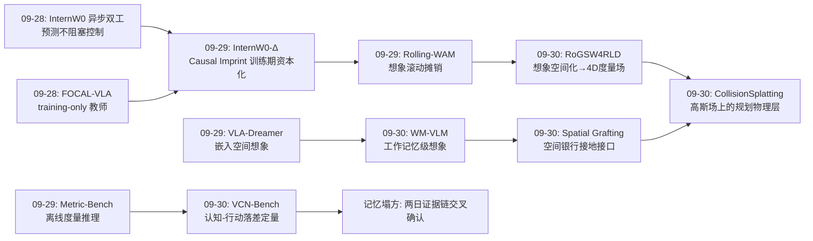
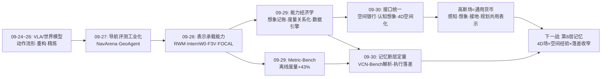
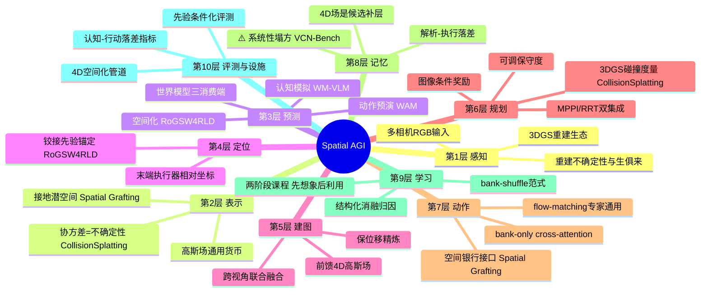
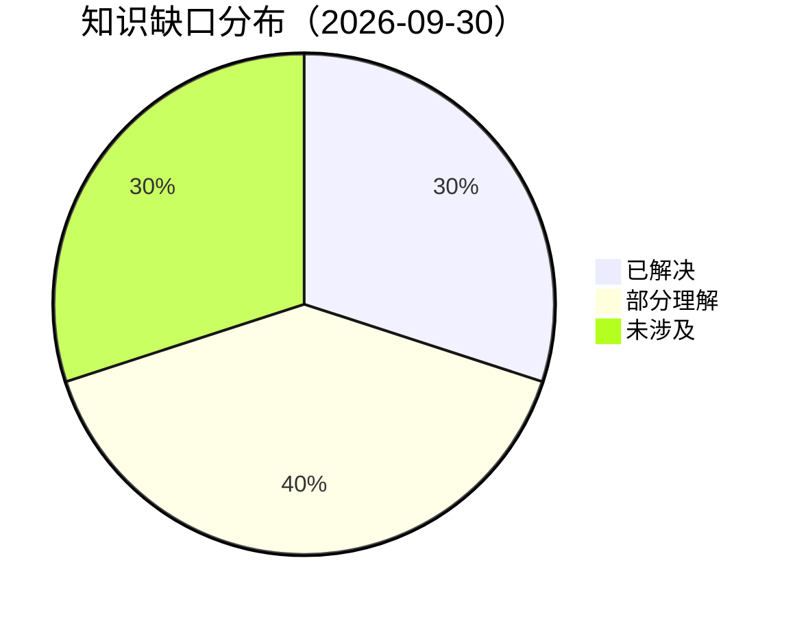

# Spatial AGI 每日深度思考 — 2026-09-30

**主题**: 高斯场作为空间智能的通用货币 —— 从"表示承载能力"到"接口统一一切"（空间接地接口 × 内部世界模型 × 想象空间化 × 记忆断层诊断 × 规划物理层）

**论文**:
1. Spatial Grafting（2609.35249，Toronto + 华为诺亚）— 冻结重建潜特征绑定度量+末端相对坐标，bank-only cross-attention 注入 flow-matching 动作专家末段，一套接口通吃 2 VLA + 2 WAM，RoboTwin 2.0 94.0/92.4 超 WAM4D，B1K 5/6 任务超 2025 冠军
2. WM-VLM（2609.34826）— VLM 内置轻量世界模型分支，两阶段训练"先想象中间视觉状态、再用状态推理"，2D/3D 心理旋转最高 +39.25 个百分点，依赖性消融证明视觉状态功能性
3. RoGSW4RLD（2609.35311）— 前馈两阶段把世界模型多相机 rollout 提升为统一可查询度量 4D 高斯场，机器人铰接先验注入，DROID 256 片段 PSNR +2.15dB、AbsRel −47%、位移误差 −61%
4. VCN-Bench（2609.34687）— 先验视频 + 导航的闭环空间推理基准，Matterport3D 100k 训练/1250 评测，发现巨大"目标解析-导航执行"落差：解析对了导航仍然失败
5. CollisionSplatting（2609.35619）— 标准 3DGS 上的概率启发、保守度可调的 GPU 碰撞度量，联合图像条件奖励实现几何+视觉统一规划，MPPI/RRT 双集成，吞吐大涨显存大降，真机验证

---

## 📅 每日总结

**日期**: 2026-09-30
**论文数量**: 5 篇
**主题**: 昨天的问题意识是"空间能力的经济学"——想象、度量、数据各自的账怎么记；今天五篇论文把问题推进到了更结构性的一层：**空间智能的各个模块正在围绕同一个表示（高斯场/接地几何）完成接口统一**。Spatial Grafting 回答"几何怎么进策略"：不做新 3D 架构，做一个可插拔的空间银行接口，任何 flow-matching 动作专家都能即插即用地获得接触级精度；WM-VLM 回答"世界模型怎么进认知"：不是外挂视频生成器，而是 VLM 内的轻量分支，让推理链可以交错地"想象中间视觉状态"；RoGSW4RLD 回答"想象的输出怎么被决策消费"：rollout 必须空间化成统一度量 4D 高斯场，规划器/碰撞检查器才有东西可查；VCN-Bench 回答"空间理解怎么变成空间行动"：答案是现在还变不成——解析对了导航照样失败，认知与行动之间隔着空间记忆与行动映射两道断层；CollisionSplatting 回答"高斯场能不能直接承载行动"：能，3DGS 原生碰撞度量 + 图像条件奖励 = 照片级场景上的实时安全规划。五篇分处策略接口、认知推理、想象空间化、评测诊断、规划物理层五个位置，但拼起来是一张正在收敛的系统图：**高斯场/接地几何正在成为空间智能感知、想象、记忆、决策、行动五方共享的通用货币（common currency）**。

**关键突破**:
- 🚀 **空间接口的标准化（Spatial Grafting）**：这是本系列追踪以来最重要的工程范式信号。它不是又一个 3D 条件策略，而是一个"接口"：冻结重建潜特征 + 度量坐标 + 末端执行器相对坐标 = 空间银行；bank-only cross-attention 只碰动作专家末段，bias-free 投影保证零银行零变化（收益可严格归因于几何内容）。一套构造在 4 宿主（π0.5、X-VLA、Fast-WAM、LingBot-VA）、4 仿真基准、3 真机平台全部有效，附加参数仅 4-5%。bank-shuffle 消融证明收益来自接地内容而非容量——"空间模块论文必须证明收益来自空间本身"由此成为新的评测伦理
- 🚀 **认知级世界模型（WM-VLM）**：世界模型的角色从"动作预演"扩展到"推理 substrate"。两阶段课程（先学想象、后学用想象）把"会模拟"与"会用模拟"解耦训练；程序化任务让中间视觉状态有真值；+39.25 个百分点的差距证明视觉模拟通道与语言推理是质的互补而非量的补偿。心理意象（mental imagery）这个认知科学经典构造第一次在 VLM 中被系统化复现
- 🚀 **想象的空间化中间件（RoGSW4RLD）**：补上了世界模型研究链缺失的一环。过去一年所有 WAM 论文都在卷"想象得更准"，这篇问的是"想象出来之后怎么用"——答案是把多相机 rollout 前馈提升为统一度量 4D 高斯场。机器人铰接先验带来 −61% 位移误差：身体是场景中最可预测的运动体，同时是"移动的标定物"，结构先验的价值远超预期。保位移精炼的设计哲学（时间位移是跨视角融合的证据骨架，精炼不许碰它）值得所有时空重建工作借鉴
- 🚀 **认知-行动断层的定量证据（VCN-Bench）**：用双层评测（诊断性目标识别 + 主评测导航）把失败精确归因，发现"目标解析对、导航执行错"的象限规模巨大。这是对整个空间 VLM 社区最直接的立论数据：MLLM 是"能说清空间却不认路"的——空间语言能力不等于空间行动能力。离线空间推理的高分（昨日 Metric-Bench 43.1%）与闭环执行的失败（今日 VCN-Bench）放在一起，构成空间智能评测的完整两面
- 🚀 **3DGS 的行动化宣言（CollisionSplatting）**：3DGS 从渲染资产升格为规划物理层。高斯协方差（重建模糊度）被解释为空间不确定性并转化为可调安全保守度——表示的天然统计量第一次承担语义功能。碰撞代价与图像条件奖励在同一场景表示上求值，"看起来如何"（视觉语义）与"撞不撞"（几何安全）首次在规划目标里正交统一

**架构演进**: 10 层架构五处推进：
- 第 2 层（表示）："接地的潜空间"（grounded latent）成为新原语——学习式特征 + 显式度量绑定（Spatial Grafting）；高斯协方差承担不确定性语义（CollisionSplatting）
- 第 3 层（预测）：世界模型获得第三个消费端——认知推理（WM-VLM），与动作预演（WAM）、想象空间化（RoGSW4RLD）构成完整三角
- 第 6 层（规划）：3DGS 原生碰撞度量 + 图像条件奖励 = 照片级场景上的实时规划（CollisionSplatting）；与 4D 场（RoGSW4RLD）的衔接是"前瞻碰撞检查"的直接路径
- 第 8 层（记忆）：VCN-Bench 定量证明当前 MLLM 无有效的跨时段空间记忆——第 8 层是全系统最薄弱层
- 第 9 层（学习）：两阶段课程"先想象后利用"（WM-VLM）扩展了空间能力的课程化训练模板

### 📊 一句话总结

今天五篇论文宣告了一个接口收敛时刻：感知建高斯场、想象空间化成高斯场、策略读高斯场、规划器在高斯场上安全行动、认知引擎在内部模拟几何变换——空间智能的模块化拼图第一次有了统一的插座标准，而评测（VCN-Bench）同时提醒我们：插座通了，第 8 层记忆还是断的。

### 🔗 延续性

**昨日→今日**: 昨天的主旋律是"空间能力的经济学"——想象的记账法（资本化/摊销/降维）、度量的关系化、数据的工业化。今天的五篇是昨日判断的直接兑现与延伸：(1) 昨日 InternW0-Δ/Rolling-WAM 卷"想象怎么便宜"，今日 RoGSW4RLD 接棒问"想象怎么被消费"——空间化成 4D 场是想象资产负债表上缺失的资产端科目；(2) 昨日 Metric-Bench 证明离线度量推理可注入，今日 VCN-Bench 立即追问"这些能力能执行吗"——答案是断层的，两者合起来构成空间智能评测的完整叙事；(3) 昨日"training-only 教师"模式（InternW0-Δ/FOCAL-VLA）在今日 Spatial Grafting 有新的变体："training-time 对齐目标 vs inference-time 显式输入"的正面对决中，本文用 4 宿主×4 基准的覆盖证明推理时接地更强；(4) 昨日"嵌入空间想象"（VLA-Dreamer）与今日"图像空间想象"（WM-VLM）是想象粒度谱系的两个端点——工作记忆级（图像）vs 学习级（嵌入），中间的控制级（WAM rollout）昨天已由 Rolling-WAM 占据

**今日→明日**: 五条线索——(1) "接口的组合"：Spatial Grafting 的空间银行与 RoGSW4RLD 的 4D 场能否直接对接（银行从 4D 场而非单帧重建取数）；(2) "4D 碰撞检查"：CollisionSplatting 度量的时间维扩展（轨迹×高斯位移的时空相交）是两篇论文的自然合体；(3) "记忆补层"：VCN-Bench 的 100k 训练集 + RoGSW4RLD 的 4D 场 = "给 MLLM 挂 4D 记忆看落差是否收窄"的理想实验设计；(4) "想象的三消费端统一"：WM-VLM（认知）、RoGSW4RLD（空间化）、WAM（动作）共享一个世界模型权重的架构何时出现；(5) "保守度的语义自动化"：CollisionSplatting 的人工保守度 × VLM 场景理解 = 语境自适应安全

### 💡 本质思考：如何达成通用空间智能

#### 1. 核心能力的本质是什么？

今天五篇论文把对空间智能能力本质的理解推进到"接口学"层面：

1. **空间智能的本质是"空间信息的标准化交付"**（Spatial Grafting 的最深启示）：过去所有 3D 条件策略论文都在回答"用什么架构消化几何"，这篇回答的是"几何应该以什么格式、什么位置、什么保证交付给决策器"。三个答案各自深刻：格式是"接地的潜空间"（学习式特征 + 每点度量/相对坐标，不物化点云不建地图）；位置是"决策链最末端"（动作专家末段，去噪每步重读——几何恰在动作从粗到精处提供约束）；保证是"零银行零变化"（收益可归因）。由此得到一个结构性判断：**空间智能系统设计的核心问题正在从"发明模块"转向"定义接口"**——只要接口标准化，底层模型（重建模型、世界模型、策略骨干）可以独立演进，这正是工程系统成熟的标志（类比：USB 之于外设、HTTP 之于应用）。

2. **空间智能的认知层需要一条独立的"模拟通道"**（WM-VLM 的贡献）：语言 token 擅长符号逻辑，但几何变换（旋转、折叠、镜像）是连续的模拟过程——39.25 个百分点的差距证明这不是调参能补的，是通道缺失。深层启示在于训练结构：**"先学模拟器、再学消费模拟"的两阶段课程暗示认知能力是分层装机的**——直接端到端训练"想象+推理"会让模型跳过想象走捷径。这与人类儿童发展先有心理旋转游戏后有心算几何的次序呼应。世界模型由此获得完整的三重身份：认知推理的模拟器（WM-VLM）、动作控制的前瞻器（WAM）、想象数据库的生成器（RoGSW4RLD）——三重身份是否共享权重，是 Spatial AGI 架构的下一个分叉点。

3. **空间智能的行动层要求表示同时是"几何的"与"视觉的"、"确定的"与"带不确定性的"**（CollisionSplatting + RoGSW4RLD 合观）：传统规划的表示（栅格/ESDF）几何精确但视觉贫乏，学习式方法的表示视觉丰富但几何不可信。3DGS 的独特性在于它天然是双面的：位置+协方差=几何与不确定性，外观=视觉语义。CollisionSplatting 证明这两面可以在同一个规划目标里正交组合；RoGSW4RLD 证明这个表示可以从真实记录扩展到想象内容。**行动层表示的选型标准由此明确：双面性（几何×视觉）+ 不确定性内生 + 可微 + GPU 批量可查**——目前只有高斯场家族同时满足。

4. **空间智能的评测必须以"认知-行动落差"为核心指标**（VCN-Bench 的方法论贡献）：端到端成功率（_navigation success_）告诉你系统能不能干，认知诊断（destination resolution）告诉你系统懂不懂，两者的差（gap）告诉你断层在哪层。这个三段式比任何单一指标都更接近"空间智能"的真实结构。把它推广：操作基准应拆"抓取点预测 vs 操作成功"、装配基准应拆"零件关系识别 vs 装配完成"——**落差（gap）而非绝对分数，才是空间智能进步的正确刻度**。

#### 2. 当前方法与理想目标的差距在哪里？

- **第 8 层（记忆）是系统性塌方**：VCN-Bench 的落差发现 + 昨日 RoboDojo 23.9% + InternW0-Δ 三槽位缓存——三条独立证据链指向同一结论：当前所有主流架构都没有可用的跨时段空间记忆。Spatial Grafting 的银行每帧重建（反应式）、RoGSW4RLD 的场单 rollout 范围（无累积）、WM-VLM 的想象无持久化——今天五篇论文的每个模块都活着"当下"，没有一个能说"我去年来过这里"。显式 4D/场景图记忆与这些模块的集成是全系统最紧迫的空白。
- **接口的抽象层次还不够高**：Spatial Grafting 只服务 flow-matching 动作专家；CollisionSplatting 只服务静态 3DGS；RoGSW4RLD 只服务带机器人运动学的 rollout。三个接口各自内部优雅，但彼此之间（如 4D 场→空间银行、世界模型→碰撞场）仍需定制胶水。真正的"空间 USB"需要这些接口互相识别。
- **想象的误差没有传导控制**：世界模型 rollout 的幻觉会被 RoGSW4RLD"忠实"地空间化，再被 CollisionSplatting"认真"地避开或穿过——误差串联无置信度传播。想象可信度 → 场可信度 → 规划保守度的端到端传导机制不存在。
- **认知模拟的物理深度为零**：WM-VLM 的心理旋转是运动学变换，不含重力、摩擦、接触——认知层的想象比动作层的想象（WAM 至少隐含物理）更"轻"。认知想象与物理想象的鸿沟未测量。
- **保守度与安全的语境敏感性靠人工**：CollisionSplatting 的保守度是标量旋钮，谁来转（VLM？RL？规则？）无答案；安全验证仍停留在"真机没撞"的经验层面。
- **评测的环境单一性**：VCN-Bench 只有 Matterport3D 静态室内；真实家庭的动态、杂乱、光照变化可能让落差更大——当前数字可能是乐观估计。

#### 3. 从今天到理想状态，最可能的路径是什么？

1. **短期（接口互认 + 仪表补齐）**：(a) 空间银行从 4D 场取数——把 Spatial Grafting 的输入从单帧重建换成 RoGSW4RLD 的持久场，一步同时补记忆与接地；(b) 4D 碰撞检查——CollisionSplatting 度量的时空扩展，让世界模型 rollout 的前瞻规划有物理层；(c) "记忆落差"实验——在 VCN-Bench 的 100k 训练集上，给 MLLM 挂 4D 场记忆微调，量化落差收窄幅度。三者都是两个今日模块的最小组合实验，成本可控、判决性强。
2. **中期（统一世界模型 + 想象置信度传导）**：(a) 三消费端统一——一个世界模型权重同时服务认知模拟（WM-VLM 用法）、空间化（RoGSW4RLD 用法）、动作预演（WAM 用法），消除三套想象的表示鸿沟；(b) 置信度管道——rollout 逐帧可信度 → 4D 场逐高斯可信度 → 规划保守度场，把"想象的错误成本"显式定价（接续昨日的想象经济学框架）；(c) 物理可行性层——昨日提出的 Layer 3 物理保真度仪表，与 4D 碰撞检查共用同一套几何机制，一个投资两处收益。
3. **长期（空间智能操作系统）**：终局形态是一台"空间 OS"：内核是统一的高斯/4D 场表示，系统调用是 render/collide/ground/query(t)/remember，策略、认知引擎、规划器都是跑在内核上的进程。今天的关键信号是 collide()（CollisionSplatting）、ground()（Spatial Grafting）、render()（3DGS 生态）三个调用已各自有了高效实现——当 query(t)（4D 查询）与 remember()（跨时段记忆）也出现标准实现时，Spatial AGI 就从论文集合变成了操作系统。届时"通用空间智能"不再是一个模型，而是一个接口生态——正如没有人再问"哪个 App 是互联网"，未来也不会有人问"哪个模块是空间智能"。

---

## 🔗 与昨日思考的联系

### 昨日重点

昨天（2026-09-29）确立的核心判断：空间能力每一条线都被重新定价——想象的记账三分法（训练期资本化/推理期摊销/嵌入空间降维）、度量的关系化（参照接地替代绝对标定）、数据的工业化（生成引擎替代人工采集）。四个待验证方向：想象的混合记账、漂移曲线标准化、度量-想象耦合、数据引擎物理接地。最尖锐的集体盲区诊断：长时程空间记忆（RoboDojo 23.9%）。

### 今日进展

1. **"想象经济学"的资产端补全**：昨日三大记账法都在讲想象的"成本端"怎么省，今日 RoGSW4RLD 回答想象的"变现端"怎么用——空间化成 4D 度量场是想象资产变成决策资产的兑换窗口。昨日框架中的"保真度三层仪表"（视觉/几何/物理）在今日获得直接对应物：几何保真度由 RoGSW4RLD 的 PSNR/AbsRel 度量（对重建而言），物理保真度的碰撞检查由 CollisionSplatting 提供机制。
2. **昨日集体盲区（长时程记忆）被定量坐实**：昨日从 RoboDojo 23.9% 推断"记忆是盲区"，今日 VCN-Bench 用完全独立的任务范式（先验视频导航）得到同一结论——解析对、执行错。两条独立证据链交叉验证，"第 8 层塌方"从假说升级为事实。
3. **"training-only vs inference-time"之争出现新证据**：昨日 FOCAL-VLA/InternW0-Δ 的 training-only 教师模式被二次确认；今日 Spatial Grafting 用空前广泛的评测覆盖证明推理时显式接地（inference-time grounding）的路线在操作域更强。两条路线可能分别适配不同时间尺度的能力（长期技能内化 vs 即时精确修正），而非简单替代。
4. **想象的粒度谱系补全**：昨日 VLA-Dreamer（嵌入空间、学习级）+ Rolling-WAM（视频空间、控制级）；今日 WM-VLM 补上工作记忆级（单步变换、认知级）、RoGSW4RLD 补上"想象的消费端"。想象经济学的完整产品线就此成型。

### 演进路径

---

## 📚 论文概览

1. **Spatial Grafting**（cs.RO）：预训练 VLA/WAM 缺度量几何 → 给冻结重建潜特征绑度量+末端相对坐标 → 空间银行经 bank-only cross-attention 注入动作专家末段 → 4 宿主 4 基准 3 真机全面提升，零银行零变化保证可归因
2. **WM-VLM**（cs.CV）：VLM 只会语言推理 → 加轻量世界模型分支，两阶段"先想象中间视觉状态、再用状态推理" → 心理旋转 +39.25 个百分点，程序化可验证中间状态 + 依赖性消融闭环证明
3. **RoGSW4RLD**（cs.CV/RO）：世界模型 rollout 是视频孤岛 → 前馈两阶段（铰接先验联合构建 + 保位移精炼）提升为统一度量 4D 高斯场 → 新视角/深度/机器人位移三指标大幅领先，合成 rollout 上增益保持
4. **VCN-Bench**（cs.AI）：离线空间推理基准止步答题、VLN 指令自包含 → 先验视频驱动的闭环导航基准 → 发现解析-执行巨大落差，双层评测协议可精确归因失败环节
5. **CollisionSplatting**（cs.RO）：几何规划器丢视觉、学习式视觉模型缺几何 → 3DGS 原生概率碰撞度量 + 可调保守度 + 图像条件奖励 → MPPI/RRT 双规划器，精度持平、吞吐/显存大幅优化，真机验证

---

## 💡 核心见解

### 见解1: 空间智能正在经历"接口时刻"

**从 Spatial Grafting 获得**
- ✅ 一套 graft 架构零重设计服务 2 VLA + 2 WAM——接口与宿主解耦被证明可行
- ✅ 4-5% 参数、零银行零变化命题——空间能力的加入可以是可分离、可归因的
- ✅ 注入位置（动作专家末段）比注入内容（哪种几何特征）更决定成败

**对Spatial AGI的启发**:
过去一年本系列追踪了几十篇"3D 条件策略"，每篇都在发明新架构；这篇证明"接口"才是正确的抽象层次。判断一个领域是否工程成熟，就看它是否出现了被广泛接受的中间件——空间智能的"USB 时刻"可能已经到来。后续所有空间模块论文都应回答：你的模块对什么宿主、什么动作范式可用？不可用时要改多少？给研究者的实际建议：做"空间接口"类工作（格式、注入位置、归因协议）的长期价值可能高于做又一个"空间骨干"。

### 见解2: 认知想象是被遗漏的第三种世界模型消费

**从 WM-VLM 获得**
- ✅ 世界模型既有研究集中于动作预演（WAM）与场景生成，认知推理用法是空白
- ✅ 两阶段课程证明"想象能力"与"想象消费能力"必须分开装
- ✅ 依赖性消融（破坏状态→性能骤降）是生成式推理的功能性证明标准

**对Spatial AGI的启发**:
空间智能不仅是"行动智能"也是"思考智能"——一个能想象"如果转 90°会怎样"但不能行动的纯认知系统仍有巨大价值（设计、教育、评测）。+39.25 个百分点的量级说明视觉模拟通道不是锦上添花。与昨日 VLA-Dreamer 合观，想象已有三个粒度（工作记忆/控制/学习）与三个消费端（认知/动作/空间化）——这个"想象矩阵"是分析任何新世界模型工作的完备坐标系。

### 见解3: 身体先验是空间表示的第一锚点

**从 RoGSW4RLD 获得**
- ✅ 机器人铰接几何注入后位移误差 −61%——结构先验的杠杆率惊人
- ✅ 身体是场景中最可预测的运动体，同时是"移动的标定物"
- ✅ 保位移精炼：时空对应是证据骨架，优化不许为降损失而篡改时间

**对Spatial AGI的启发**:
"在场景中的 AI"与"看视频的 AI"的表示学分水岭就是自我身体模型。任何具身智能体（机器人/人类/车辆）都自带高置信运动先验——把身体先验注入空间表示不是可选优化而是正确性基础。泛化预测：人体操作示教（人类身体先验）、多机器人协作（同伴身体互为先验）将复用同一机制。RoGSW4RLD 的"先建位移骨架再填细节"哲学也值得所有动态重建工作借鉴。

### 见解4: 认知-行动落差是空间智能的真实刻度

**从 VCN-Bench 获得**
- ✅ 目标解析对、导航仍失败的象限规模巨大——空间语言能力≠空间行动能力
- ✅ 双层评测（诊断+主评测）可以精确归因失败环节
- ✅ 与昨日 Metric-Bench 合观：离线推理可训练提升（+43.1%），但提升不自动传导到执行

**对Spatial AGI的启发**:
这个落差对整个社区是最清醒的提醒：刷空间推理基准的分数提升可能全部堆积在"能说不能做"的那一侧。评测方法论的迁移建议：所有具身基准都应报告 gap（认知正确率 − 端到端成功率），gap 的收窄才是架构进步的证据。给研究策略的含义：直接攻"解析→行动映射"（如空间记忆组件、动作接口）的工作比继续堆离线推理分数更有边际价值。

### 见解5: 高斯场正在成为空间智能的通用货币

**从今日五篇合观获得**
- ✅ Spatial Grafting 消费重建潜特征/深度（高斯生态的输入端）
- ✅ RoGSW4RLD 生产 4D 高斯场（想象的兑换）
- ✅ CollisionSplatting 在 3DGS 上执行规划（行动端）
- ✅ 三篇的表示中心完全重合：位置+协方差+外观的高斯集合

**对Spatial AGI的启发**:
单一表示被感知、想象、决策、行动四方同时消费——这是"文件系统时刻"的标志。表示统一后模块可组合性爆发：今天的任何两篇论文都可以做最小组合实验（如 4D 场→碰撞检查、4D 场→空间银行）。给研究者的判断依据：当你设计新的空间模块时，优先选择与高斯生态兼容的输入输出格式，你的工作将自动获得与整个生态组合的能力。

### 见解6: 不确定性从重建副产品升格为安全参数

**从 CollisionSplatting 获得**
- ✅ 高斯协方差（重建模糊度）被解释为空间不确定性
- ✅ 可调保守度把"安全边际"从隐式学习变为显式旋钮
- ✅ 碰撞代价与视觉奖励在同一表示上正交组合

**对Spatial AGI的启发**:
所有学习式空间表示都有不均匀的置信度（稀视角区域发糊），多数工作忽略或丢弃这个信息，本文把它转化为可操作的安全语义——这是"表示的统计量承担系统功能"的漂亮范例。推广方向：空间银行的深度有效性掩码（m 标志）、4D 场的逐高斯可信度，都应升级为下游消费的一等公民。更深的启示：空间智能的安全机制应该长在表示里，而不是外挂在规划器里。

### 见解7: 结构化消融是空间模块的"归因伦理"

**从 Spatial Grafting 与 WM-VLM 合观获得**
- ✅ bank-shuffle：打乱空间内容位置→性能崩，证明收益来自空间内容本身
- ✅ WM-VLM 依赖性消融：破坏生成的视觉状态→性能崩，证明想象是功能性的
- ✅ 两篇都用"破坏信息的空间/功能结构、保留统计分布"的对照设计

**对Spatial AGI的启发**:
空间智能论文的信任危机真实存在——"加了 3D 就涨点"可能是容量、数据或正则化效应。今日两篇展示了标准答案：对空间信息做"结构保持、语义破坏"的扰动（shuffle/mask/corrupt），性能崩才证明空间因果。建议把这个范式作为自检清单：任何声称空间能力的工作，都应能回答"shuffle 你的空间信息会发生什么"。答不上的工作，涨点来源存疑。

### 见解8: 评测的"先验条件化"是被低估的维度

**从 VCN-Bench 与 Spatial Grafting 对照获得**
- ✅ VCN-Bench 系统化改变先验条件（有/无先验视频）测记忆的边际价值
- ✅ Spatial Grafting 系统化改变几何条件（bank-off/shuffle/on）测几何的边际价值
- ✅ 两者共同模式：把"某个信息源的贡献"变成可单独报告的实验轴

**对Spatial AGI的启发**:
单条件评测（只有端到端分数）掩盖了系统能力的组成结构。完整的空间智能评测矩阵应包括：零先验/视频先验/地图先验 × 零几何/预测几何/实测几何 × 静态/动态。这个矩阵不仅用于评测也用于设计——它直接告诉你哪个信息源在最需要的条件下缺位。

### 见解9: 误差传导链是想象-决策系统的未定价风险

**从 RoGSW4RLD 与 CollisionSplatting 合观获得**
- ✅ rollout 幻觉 → 被"忠实"空间化 → 被"认真"规划——每一环都在放大上游错误
- ✅ 无任何一环报告置信度或拒绝处理低置信输入
- ✅ 对比：人脑想象不可靠时会降低行动自信（元认知校准）

**对Spatial AGI的启发**:
昨日"想象经济学"框架缺了一章：误差的会计学。想象错误成本不是均匀的——在"想象→空间化→规划"的串联结构里，上游 5% 的幻觉可能在下游变成 5% 的碰撞执行。需要设计置信度传导管道：rollout 逐帧可信度→场逐高斯可信度→碰撞代价加权→保守度自动上调。这把昨日"保真度三层仪表"从离线评估工具升级为在线安全机制。

### 见解10: 评测基准的"归因设计"时代到来

**从 VCN-Bench 与本系列基准工作纵向对比获得**
- ✅ 早期基准：单一端到端分数（VLN R2R 时代）
- ✅ 中期基准：多维度但平行（各类空间 VQA）
- ✅ VCN-Bench：诊断层与主评测层的因果分解设计
- ✅ Metric-Bench（昨日）：数值精度分箱的可验证奖励设计

**对Spatial AGI的启发**:
基准正在从"度量衡"进化为"诊断仪"。VCN-Bench 的价值一半在数据一半在归因协议——它让"下一步该修哪层"从争论变成查表。结合昨日见解11（仪表创新与模型创新同等重要），当前空间智能评测的空白按判决力排序：物理可行性仪表（最缺）、长时程记忆仪表（RoboDojo 不够系统）、想象置信度校准仪表。做仪表仍是学术界的优势生态位。

### 见解11: 接口的"最小侵入原则"是被低估的工程美德

**从 Spatial Grafting 与 CollisionSplatting 合观获得**
- ✅ Spatial Grafting：感知通路零修改，仅碰动作专家末段两个点
- ✅ CollisionSplatting：标准 3DGS 零预处理，度量模块化可拔插
- ✅ RoGSW4RLD：不学几何转移模型，直接消费已有世界模型输出

**对Spatial AGI的启发**:
三篇最强的论文共同选择了"不动存量、只加增量"的设计哲学。在快速演进的领域（基础模型半年一代），侵入式设计的维护成本指数级增长——每次底座升级都要重做集成。最小侵入 = 部署寿命长 = 真实落地概率高。给工程决策的启示：评估空间智能方案时，"它动了底座多少"应与"它涨了多少点"同权重。

### 见解12: "先装模拟器、再装消费者"的课程结构可能是空间能力的通用训练律

**从 WM-VLM 获得，昨日工作佐证**
- ✅ WM-VLM 阶段一（纯想象）→ 阶段二（想象+推理）能力解耦训练
- ✅ 佐证一：Metric-Bench RFT 先教格式与精度分解再联合优化
- ✅ 佐证二：NavGen 数据引擎先生成经验再训策略——数据侧的"先装模拟器"
- ✅ 反例：端到端"想象+推理"联合训练常导致模型绕过想象走捷径

**对Spatial AGI的启发**:
空间能力的课程化训练（能力分层装机）比端到端更可靠，这个模式在感知→认知、数据→策略、奖励→策略多个层面重复出现。其深层原因是空间任务中捷径学习的巨大空间：语言先验几乎总能部分绕过空间推理。给训练设计的实操建议：任何含"生成式中间产物"（想象、计划、解释）的训练，都应设置"先只训中间产物质量"的阶段，再放开联合。

---

## 🗺️ 知识演进图

---

## 技术栈演进对比表

| 层次 | 昨日方案（09-29） | 今日方案（09-30） | 变化 |
|------|------------------|------------------|------|
| 感知 | 重建/SLAM 资产（间接服务） | 高斯场被确认为四方共享表示 | 表示统一化 |
| 表示 | 变化印记、参照关系网 | 接地潜空间（特征×度量×相对坐标）、协方差=不确定性 | 接地成为原语 |
| 预测 | 想象三记账法（印记/滚动/嵌入） | 想象三消费端（认知/空间化/动作）+ 工作记忆级想象 | 从成本侧到变现侧 |
| 认知 | 离线度量推理（Metric-Bench） | 内部世界模型驱动的心理模拟（WM-VLM） | 认知层想象通道打开 |
| 规划 | （昨日未直接涉及） | 3DGS 原生碰撞度量+图像条件奖励、保守度可调 | 照片级实时规划 |
| 执行 | WAM 策略（LIBERO/RoboTwin） | 空间银行接口使全宿主获得接触级精度 | 接口标准化 |
| 记忆 | 三槽位/滑窗（有界缓存） | VCN-Bench 定量证明塌方 + 4D 场作为候选补层 | 缺口确认与补层路径 |
| 学习 | RFT、生成数据引擎 | 两阶段课程（先想象后利用）、结构化消融归因 | 训练律与评测伦理 |
| 评测 | 精确度量基准（数值分箱） | 认知-行动落差分解（诊断+主评测） | 基准→诊断仪 |
| 数据/设施 | NavGen 400K 引擎 | 4D 场前馈空间化基础设施 | 想象资产兑换管道 |

---

## 🗺️ Spatial AGI 知识图谱

### 10层架构思维导图

### 🎯 主线技术路径

#### 阶段1: 单点能力突破（已完成，2025-2026上半年）

- 各层独立可用：3DGS 重建、VLA 策略、世界模型 rollout、空间 VLM
- 特征：每篇论文发明自己的表示，模块间无互操作性
- 本系列 09-24~28 的论文大多处于此阶段

#### 阶段2: 接口标准化（当前，2026 Q3-Q4，今日五篇是宣言）

- 空间接地接口（Spatial Grafting）：几何→策略
- 想象空间化管道（RoGSW4RLD）：rollout→4D 场
- 规划物理层（CollisionSplatting）：场→轨迹
- 诊断协议（VCN-Bench）：能力→落差归因
- 特征：模块开始围绕统一表示（高斯场）互相识别

#### 阶段3: 记忆补层与闭环组装（下一步，2026 Q4-2027）

- 攻坚第 8 层：4D 场作为持久空间记忆 + 场景图语义索引
- 闭环贯通：感知→想象→空间化→查询/碰撞→接地执行 全链在线
- 置信度传导：rollout→场→规划的误差会计
- 验收标准：VCN-Bench 落差显著收窄、RoboDojo 类长时程任务突破

#### 阶段4: 空间智能操作系统（终局形态）

- 内核：统一 4D 场 + 系统调用（render/collide/ground/query/remember）
- 进程：策略、认知引擎、规划器、记忆系统作为可组合服务
- 能力获取与部署完全分离（接续昨日"成本归零"判断）
- 标志性信号：query(t) 与 remember() 出现标准实现并被多个团队复用

---

## 🔍 待探索议题

### 高优先级（本周）

1. **4D 场 → 空间银行的直接对接**
   - 问题: Spatial Grafting 的银行每帧从单帧重建取数，RoGSW4RLD 的场是持久 4D 表示——银行能否从场取数，一步同时获得接地与跨帧记忆？
   - 候选方案: 场的当前时刻切片作为银行源 + 场的历史查询 token 附加注入
   - 缺口: 两篇论文的坐标系/尺度约定不同（工作区归一化 vs 世界系），需要统一的尺度协议

2. **4D 碰撞检查（CollisionSplatting × RoGSW4RLD）**
   - 问题: 轨迹与 4D 高斯位移的时空相交如何高效计算？世界模型 rollout 的前瞻规划需要它
   - 候选方案: 轨迹采样点×时间戳与高斯位移轨迹的批量 GEMM 相交测试
   - 缺口: rollout 的高斯数量随时间增长，需要时空剪枝索引

3. **记忆落差收窄实验**
   - 问题: 给 MLLM 挂 4D 场记忆（RoGSW4RLD 技术）在 VCN-Bench 100k 训练集上微调，解析-导航落差收窄多少？
   - 候选方案: 三档对照（无记忆/视频上下文/4D 场记忆）
   - 缺口: 4D 场查询接口的 token 化方案（查询什么、怎么进上下文）

4. **想象置信度传导管道**
   - 问题: rollout 幻觉如何变成场的低可信度，进而自动上调规划保守度？
   - 候选方案: rollout 逐帧重建一致性分数 → 场逐高斯可信度 → 碰撞代价加权
   - 缺口: 逐帧可信度的无参考估计方法（想象内容没有真值）

### 中优先级（本月）

5. **保守度的语义自动化**
   - 问题: CollisionSplatting 的保守度旋钮能否由 VLM 按场景语义自动设定？
   - 候选方案: VLM 场景描述 → 保守度回归头；或 RL 在仿真学保守度策略
   - 缺口: 语义-安全的标注数据（什么场景该多保守）几乎不存在

6. **认知想象的物理升级**
   - 问题: WM-VLM 的心理模拟只有运动学，物理（重力/接触）想象的认知层训练是否可行？
   - 候选方案: 程序化物理任务（倒水、堆叠预测中间状态）沿用其两阶段课程
   - 缺口: 物理中间状态的真值构造比旋转难一个量级

7. **空间银行的动作范式泛化**
   - 问题: bank-only cross-attention 能否服务扩散/回归/离散 token 动作头？
   - 候选方案: 对 ACT/扩散策略/SMART 类动作头逐一做 graft 移植实验
   - 缺口: 非 flow-matching 头没有"每步重读"的天然注入点，需要新的等价机制

8. **落差指标的基准化推广**
   - 问题: 认知-行动落差能否成为所有具身基准的强制报告项？
   - 候选方案: 在 LIBERO/RoboTwin 上加"抓取点预测/子目标识别"诊断层
   - 缺口: 各任务认知中间产物的定义与真值构造需逐一设计

### 低优先级（本季度）

9. **多智能体空间经验共享**
   - 问题: 多机器人共享 4D 场记忆时，铰接先验如何处理同伴身体？
   - 候选方案: 同伴身体作为"移动标定物"互注入（复用 RoGSW4RLD 先验机制）
   - 缺口: 多智能体时空对齐与通信带宽约束下的场合并协议

10. **想象元认知**
    - 问题: 模型能否校准"知道自己想象不可靠"并主动降级为保守行动？
    - 候选方案: 想象置信度头 + 行动选择阈值联动的校准训练
    - 缺口: 想象错误的大规模自动标注（需要物理仿真裁判）

11. **空间 OS 系统调用草案**
    - 问题: render/collide/ground/query(t)/remember 的接口规范能否形成社区标准？
    - 候选方案: 以今日五篇为原型写一份接口 RFC
    - 缺口: 社区共识与首个多团队复用案例

---

## 📊 知识缺口分析

**已解决（30%）**:
- ✅ 几何→策略的接口标准化（Spatial Grafting，4宿主4基准3真机）
- ✅ 认知级想象通道的训练方法（WM-VLM 两阶段课程+39.25pt）
- ✅ 想象输出的空间化管道（RoGSW4RLD，三指标大幅领先）
- ✅ 认知-行动断层的定量证明与归因协议（VCN-Bench 双层评测）
- ✅ 高斯场上的实时安全规划（CollisionSplatting，精度持平+吞吐/显存大优）
- ✅ 空间模块的归因消融范式（bank-shuffle/依赖性消融）

**部分理解（40%）**:
- ⚠️ 空间记忆补层：4D 场是候选方案但与 MLLM 的查询接口未设计
- ⚠️ 接口互认：三接口（ground/collide/space-ify）各自优雅，互操作胶水未做
- ⚠️ 误差传导：rollout→场→规划的置信度管道有构想无实现
- ⚠️ 保守度自动化：语义自适应安全的训练数据与方法空白
- ⚠️ 认知想象物理深度：运动学→物理的中间状态真值构造未解
- ⚠️ 动作范式泛化：bank-only 注入仅限 flow-matching 头
- ⚠️ 动态场景：三篇的表示与度量全为静态假设
- ⚠️ 落差的可训练性：VCN-Bench 100k 训练集上微调能否收窄落差未测

**未涉及（30%）**:
- ❌ 跨时段持久记忆的完整方案（remember() 系统调用不存在）
- ❌ 想象元认知（校准"知道自己想象不可靠"）
- ❌ 多智能体空间经验共享与场合并
- ❌ 大规模（城市级）高斯场的碰撞查询与索引
- ❌ 触觉/力觉与接地潜空间的融合
- ❌ 空间接口的社区标准（RFC 级共识）
- ❌ 真实家庭动态环境下的落差重测（Matterport3D 静态乐观偏差）
- ❌ 安全形式化验证（碰撞概率度量的保证语义）

---

## 🎯 明日研究焦点预案

基于今日线索，明天的论文筛选应特别关注：

1. **空间记忆 × 世界模型交叉**：任何"persistent memory + WAM"、"scene graph + video policy"组合——直接攻两日交叉确认的第 8 层塌方
2. **4D 场的下游消费**：任何"4D Gaussian + planning/navigation/manipulation"工作——RoGSW4RLD 的同生态位竞争者或互补者
3. **VLA/WAM 的空间接地接口**：Spatial Grafting 的竞品（如几何 token 注入、深度位置编码的新变体）——检验"接口时刻"是否被社区接棒
4. **认知级想象的扩展**：物理模拟想象、空间谜题想象——WM-VLM 范式的后续
5. **生成式推理的功能性证明**：任何做"破坏中间产物"消融的视觉 CoT 工作——归因伦理的扩散信号

---

## 📝 今日金句

> 空间信息交付的正确单位不是模型，是接口——宿主只是插头标准的消费者。—— Spatial Grafting 的 USB 哲学

> 想象不是装饰性的图像生成，而是推理链上的功能节点——破坏它，答案就塌。—— WM-VLM 的依赖性消融

> 身体是场景里最可预测的运动体，也是移动的标定物——先验免费的午餐要吃足。—— RoGSW4RLD 的 −61% 启示

> 能说清空间在哪，和能走到那里，中间隔着一整个第 8 层。—— VCN-Bench 的落差判词

> 重建的模糊度不该被丢弃，它是免费的危机感——保守度旋钮就长在表示里。—— CollisionSplatting 的安全观

> 高斯场正在成为空间智能的通用货币：感知建它、想象生成它、策略读它、规划器在它上面安全行走。—— 今日五篇合观

---

**文档创建时间**: 2026-09-30
**分析方法**: 五篇论文精读（papers/2026-09-30_01~05）+ 昨日思考（2026-09-29）延续性综合
**论文清单**: 见 papers_list.md "2026-09-30 研究的论文"

---

## 🔬 深度专题一：高斯场作为空间智能通用货币的经济学

### 1. "货币化"的三阶段模型

一种空间表示要成为"通用货币"，需要依次通过三关：

| 阶段 | 关卡 | 2026-09-30 状态 | 证据 |
|------|------|----------------|------|
| 第一阶段 | 生产充足（大家都有） | ✅ 已过 | 3DGS 重建生态成熟：SLAM/动态/水下/城市全覆盖 |
| 第二阶段 | 流通顺畅（互相接受） | 🔄 进行中 | 今日三篇分别消费/生产/操作高斯场，但坐标系与尺度协议互不相同 |
| 第三阶段 | 计价统一（接口标准） | ❌ 未到 | 无 RFC 级接口规范，互操作靠定制胶水 |

- 判断：我们正处于第二阶段中段——"流通"已被证明（三方各自交易成功），"计价统一"是下一个里程碑
- 类比历史：USB 之前每个外设自带驱动（第一阶段定制品），USB 出现后流通（第二阶段），USB-C 统一接口（第三阶段）
- Spatial AGI 的"USB-C 时刻"信号：出现一篇论文/开源库，定义统一的场格式 + 查询 API，被 ≥3 个不同层模块原生采用

### 2. 货币的"汇率表"：今日五篇的表示换算

各模块的表示换算关系（今日论文隐含的汇率）：

| 换算路径 | 汇率（成本） | 今日证据 |
|----------|-------------|----------|
| RGB → 3DGS 场 | 重建管道一次成本 | 生态成熟 |
| 3DGS 场 + 深度 → 空间银行 | 每帧前向，4-5%参数 | Spatial Grafting |
| rollout 视频 → 4D 场 | 单次前馈 | RoGSW4RLD |
| 4D 场 → 碰撞代价 | GPU 批量，毫秒级 | CollisionSplatting（静态版已证，4D 待做） |
| 场 → 认知推理上下文 | ❌ 未定义 | VCN-Bench 证明此路不通（现状） |
| 场 → 持久记忆 | ❌ 未定义 | remember() 缺位 |

- 关键观察：汇率的"断层线"恰好在第 8 层（记忆）—— 场到记忆的换算不存在，
  这与 VCN-Bench 的落差发现互为表里：不是模型不想用空间经验，是没有兑换窗口
- 推论：补上"场→记忆"汇率是当前汇率表中边际价值最大的一格——
  它把已经流通的资产（4D 场）接进最缺资产的账户（跨时段记忆）

### 3. 货币化对研究策略的重定价

- 表示层研究（发明新几何表示）的边际价值下降：
  高斯场的网络效应已经开始自我强化——新表示必须证明"比高斯场多出什么不可替代的性质"
- 接口层研究的边际价值上升：
  汇率表中每个 ❌ 都是一篇高影响力论文的选址（场→记忆、场→认知上下文、置信度→保守度）
- 评估体系的机会：
  "高斯生态兼容性"可能成为空间模块论文的新评审维度——
  你的模块输入输出是什么格式？与现有场资产组合的成本是多少？

---

## 🔬 深度专题二：记忆塌方的攻坚路线图

### 1. 三日证据链的完整整理

| 日期 | 证据 | 范式 | 结论 |
|------|------|------|------|
| 09-28 | InternW0 物理版异步双工 | 有界 K/V 缓存 | 记忆窗口有限 |
| 09-29 | InternW0-Δ RoboDojo 23.9% | A/R/C 三槽位 | 分钟级任务崩溃 |
| 09-29 | Rolling-WAM W-chunk | 滚动窗口 | 窗口外遗忘 |
| 09-30 | VCN-Bench 解析-导航落差 | 先验视频导航 | 跨时段经验无法利用 |
| 09-30 | Spatial Grafting 银行每帧重建 | 反应式接地 | 无跨帧状态（设计使然） |

- 五条独立证据、四种不同范式、同一结论：**当前所有主流架构的空间记忆都是有界缓存**
- 特别注意 Spatial Grafting 的案例：它的无状态不是缺陷而是设计选择（可归因性优先）——
  这提示记忆问题的解决不一定要修改这些模块，而是在模块之外补一层

### 2. 分层攻坚方案（按侵入度排序）

方案 A：外挂记忆层（零侵入）
- 结构：4D 场（RoGSW4RLD）+ 场景图语义索引 + 查询 API → token 化注入 MLLM/策略上下文
- 优点：不动今日任何模块；可直接在 VCN-Bench 100k 上验证
- 缺点：查询依赖显式问题解析（"去哪个房间"→查询词），隐式需求难覆盖

方案 B：银行持久化（低侵入）
- 结构：Spatial Grafting 的银行从每帧重建改为"当前观测增量更新持久场"
- 优点：策略端零修改，记忆内生于空间表示
- 缺点：增量 4D 更新的漂移问题；失去零变化命题的纯净性

方案 C：记忆 token 化（中侵入）
- 结构：把历史场摘要压缩成记忆 token 混入动作专家/MLLM 上下文
- 优点：端到端可学习
- 缺点：信息瓶颈位置未知；可能重蹈"有界缓存"覆辙

方案 D：检索式空间记忆（高侵入）
- 结构：经验以（场片段+事件标签）存储，决策时按相似度检索
- 优点：容量无限
- 缺点：检索的查询构造困难；延迟引入控制回路

- 判断：先做 A（本周可实验、判决性最强），成功后向 B 演化；
  C/D 作为 B 失败时的备选

### 3. 验收标准与里程碑

- 里程碑 1（1 个月）：VCN-Bench 落差收窄 50%（方案 A 最小实现）
- 里程碑 2（3 个月）：RoboDojo 类任务（分钟级）从 23.9% → 40%+
- 里程碑 3（6 个月）：记忆与想象的联动——"去你昨天放包的桌子"需要
  记忆（昨天经验）+ 想象（当前走位预演）+ 接地（执行精度）三者协作，
  这是空间智能第一个真正的"三模块协作任务"

---

## 🔬 深度专题三："接口时刻"的研究策略含义

### 1. 论文类型的重新定价

接口时刻到来后，空间智能论文的价值结构变化：

| 论文类型 | 接口时刻前 | 接口时刻后 |
|----------|-----------|-----------|
| 新表示/新骨干 | 高价值（每篇自成体系） | 需证明对高斯生态的不可替代性 |
| 接口/中间件 | 低价值（无标准可接） | 高价值（定义插座） |
| 组合工作（A+B） | 被视为增量 | 成为常态且被鼓励（模块可组合性验证） |
| 评测/仪表 | 配角 | 与模型同价（昨日判断的强化） |

- 本系列的方法论闭环正在形成：09-28"表示承载能力"→ 09-29"能力经济学"→
  09-30"接口统一"。三天构成一个完整的分析框架：
  先看能力住哪个表示，再算获取成本，最后看模块怎么组装

### 2. 给个人研究者的选题矩阵

按"接口时刻"逻辑，当前最佳选题位于"汇率表断层 × 已有高能力模块"的交叉点：

1. 场→记忆（方案 A）：最高优先——汇率表最大空洞 + VCN-Bench 现成评测
2. 置信度传导：想象经济学框架的自然续篇 + 安全刚需
3. 4D 碰撞检查：两篇高影响力的直接合体，工程性强、判决性强
4. 保守度自动化：VLM×安全的交叉，数据是瓶颈但先发优势大
5. 归因消融工具包：把 bank-shuffle/依赖性消融做成开源库——仪表策略

### 3. 需要警惕的反面信号

- 接口碎片化风险：如果每家都定义自己的"空间接口"（各家银行格式不兼容），
  生态会退回定制品时代。观察指标：未来 3 个月新空间模块论文是否引用
  统一的输入格式约定
- 过早标准化风险：高斯场在动态、语义、物理属性上仍有短板，
  过早锁死接口可能重演"比 USB 更好的接口死于生态位"的历史
- 组合泡沫风险：可组合性带来"A+B+C"式论文泛滥，
  真正稀缺的仍是单点机制创新（今日五篇全是单点机制，组合是它们的红利而非起点）

---

## 🔬 深度专题四：与人类空间认知的对照清单

今日五篇论文与人类空间认知能力的逐项对照：

| 人类能力 | 神经基础 | 今日对应 | 差距评估 |
|----------|----------|----------|----------|
| 心理旋转 | 顶叶运动模拟 | WM-VLM（+39pt） | 接近，但仅运动学无物理 |
| 抓取的视觉-运动精度 | 顶叶-运动皮层通路 | Spatial Grafting | 任务级相当，泛化性未知 |
| 走到记忆中的地方 | 海马体-内嗅皮层网格细胞 | VCN-Bench 揭示：严重缺失 | 最大断层 |
| 对想象内容的信心校准 | 前额叶元认知 | ❌ 无对应 | 完全空白 |
| 身体图式（body schema） | 顶叶身体表征 | RoGSW4RLD 铰接先验 | 机制已现，仅限机器人 |
| 危险距离的直觉感 | 杏仁核+顶叶快速通路 | CollisionSplatting 保守度 | 有机制无语境自动化 |
| 多人共享空间记忆 | 语言+海马联合编码 | ❌ 无对应 | 未涉及 |

- 最大的对照发现：人类的跨时段空间记忆（情景记忆×网格细胞耦合）
  在机器侧完全没有对应物——这不是某个模块的差距，是一整个脑区的缺席
- 保守度的对照也发人深省：人类的"危机感"是自动的、语境化的（水边自然小心），
  机器的保守度是人工旋钮——元认知与语境安全是同一个缺失（前额叶功能）的两面

---

## 📖 术语表

- 接地潜空间（Grounded Latent Space）：学习式特征逐点绑定度量与相对坐标的混合表示
- 空间银行（Spatial Bank）：Spatial Grafting 中每视图的接地 token 集合
- bank-only cross-attention：只在动作专家末段、只读银行不写感知通路的注入机制
- 零变化命题：bias-free 投影下，空银行输入导致 graft 输出严格为零
- bank-shuffle：打乱银行 token 空间位置以检验收益来源的消融方法
- 依赖性消融：破坏推理链中间产物以检验其功能性的评测方法
- 保位移精炼：优化几何外观但冻结时间位移的两阶段设计
- 铰接先验：机器人运动学（FK/URDF）作为空间表示的约束与证据
- 认知-行动落差：认知诊断正确率与端到端执行成功率之差
- 目的地解析（Destination Resolution）：从指令与先验经验推断目标位置
- 保守度（Conservatism）：对不确定几何区域的惩罚强度参数
- 通用货币（Common Currency）：被多方模块共享消费的统一空间表示
- 汇率表：不同空间表示/模块之间转换的成本表
- 第 8 层塌方：空间智能架构中记忆层系统性缺失的诊断结论
- 三消费端：世界模型的认知推理、动作预演、空间化三种用途

---

## 🧭 给明日思考的三个问题

1. 如果"场→记忆"的兑换窗口下周就出现（某篇论文做了方案 A），
   那么记忆层补上后，下一个暴露的断层会是哪一层？
   （假说：第 4 层定位——跨时段坐标漂移会立刻成为新瓶颈）
2. Spatial Grafting 证明了接口的可行性，但接口的出现是否意味着
   "端到端空间智能"路线（一个模型直接从像素到动作）的失败？
   还是两者终将在不同部署场景各占一极？
3. 人类的危机感是长在感知里的（看到悬崖自动腿软），
   CollisionSplatting 的保守度是长在表示里的（协方差自动加价）——
   这种"安全内生于表示"的思路能否推广为空间智能的一般原则
   （不确定性、语义、物理属性都内生于表示而非外挂）？

---

**文档创建时间**: 2026-09-30
**分析方法**: 五篇论文精读（papers/2026-09-30_01~05）+ 昨日思考（2026-09-29）延续性综合
**论文清单**: 见 papers_list.md "2026-09-30 研究的论文"

---

## 🔬 深度专题五：五篇论文的"最小组合实验"设计手册

接口时刻的最大红利是组合实验变得便宜。以下五个组合实验按"两篇论文、最小胶水"原则设计，每个都可以是一周内出结果的判决性实验：

### 实验 1: 4D 场 → 碰撞检查（RoGSW4RLD × CollisionSplatting）

- 假设: 世界模型 rollout 空间化后的 4D 场可以做前瞻碰撞检查
- 设计:
  1. 用 Cosmos 3 生成动作条件 rollout（N 个候选动作）
  2. RoGSW4RLD 前馈空间化每个 rollout → 4D 场
  3. 对每个候选动作的机器人轨迹做时空碰撞查询
  4. 选择零碰撞且图像奖励最高的动作执行
- 对照: 无前瞻检查（直接执行世界模型推荐的第一个动作）
- 判决: 前瞻组碰撞率显著低于对照组 → 想象-空间化-检查闭环成立
- 成本: 两个开源系统 + 一个时间维相交查询实现
- 风险: rollout 生成延迟可能破坏在线性——先做离线版本证明价值

### 实验 2: 场记忆 → 落差收窄（RoGSW4RLD × VCN-Bench）

- 假设: 显式 4D 场记忆能补 MLLM 的经验利用断层
- 设计:
  1. VCN-Bench 训练集 episode：先验视频 → 4D 场（代替原始视频上下文）
  2. 场的语义+几何查询结果 token 化，与指令一起输入 MLLM
  3. 微调目的地解析与导航决策头
  4. 在 1,250 评测集上报告三档对照: 无记忆/视频上下文/场记忆
- 判决指标: 落差（解析正确率 − 导航成功率）在三档间的变化
- 判决性: 场记忆档落差显著收窄 → 第 8 层补层路径确认；
  无收窄 → 断层不在记忆而在行动映射，攻行动接口

### 实验 3: 空间银行 → 4D 场源（Spatial Grafting × RoGSW4RLD）

- 假设: 银行从持久场取数（而非每帧重建）能提升长时程操作
- 设计:
  1. 机器人工作区预扫描建初始 3DGS 场
  2. 银行构建改为: 冻结场 + 当前帧增量特征（而非纯单帧重建）
  3. 在含"视野外物体"的操作任务（需记住之前看到的目标）上对比
- 判决: 银行持久化版在"记忆型操作任务"上显著优于反应式版
- 附带收益: 若成功，零变化命题扩展为"持久零变化"，可归因性保住

### 实验 4: 置信度传导（RoGSW4RLD × CollisionSplatting × WM-VLM）

- 假设: 想象的不可靠性可以定量化并传导为规划的保守度
- 设计:
  1. rollout 逐帧重建一致性（相邻帧循环一致性/多rollout方差）→ 逐帧可信度
  2. 可信度加权 4D 场的高斯 → 逐高斯置信通道
  3. CollisionSplatting 保守度按局部置信自动调节
- 对照: 固定保守度 vs 置信度自适应保守度
- 判决: 自适应组在"幻觉诱导碰撞"测试集（故意用低质量 rollout）上碰撞率更低，
  且在高保真 rollout 上不损失效率

### 实验 5: 两阶段课程 × 空间 VQA（WM-VLM 范式迁移）

- 假设: "先想象后利用"课程可迁移到度量推理（接续昨日 Metric-Bench 线索）
- 设计:
  1. 阶段一: 训练 VLM 想象"参照物移动到目标位置"的中间状态
  2. 阶段二: 基于想象的中间状态做度量推断
  3. 评测: Metric-Bench 式数值精度 + 依赖性消融
- 判决: 若想象中间状态让度量精度提升且依赖性消融通过，
  则"认知想象"从旋转泛化到度量——WM-VLM 范式的第一次外推检验

### 组合实验的元结论

- 五个实验共享同一套组件（场生成、场消费、接地、消融协议），
  这本身就是"通用货币"论的实验证据
- 优先级排序: 实验 2 > 实验 1 > 实验 3 > 实验 4 > 实验 5
  （评测判决力 × 记忆缺口紧迫性 × 工程成本）
- 每个实验的失败都有信息价值（故障定位到具体断层），
  这延续昨日"判决性设计"的研究品味标准

---

## 📎 附录一: 今日论文的一句话人物卡

1. **Spatial Grafting** — 空间智能的 USB 委员会主席：
   不生产几何，只定义几何如何插进任何决策器
2. **WM-VLM** — 认知科学在 VLM 里的代理人：
   证明了模型可以"闭眼想图"，并给想象装上了功能性测谎仪
3. **RoGSW4RLD** — 想象与决策之间的兑换所：
   把世界模型的梦境按公允汇率（度量 4D 场）兑换成可查询资产
4. **VCN-Bench** — 泼冷水的诊断医生：
   用一组干净的双层实验证明"懂空间"和"会走路"是两种病
5. **CollisionSplatting** — 高斯场的安全监理：
   在照片级世界里画出带"危机感旋钮"的不可碰撞区

## 📎 附录二: 评测协议速查（今日两套）

### Spatial Grafting 的归因协议
- bank-off: 银行完全移除 → 应接近宿主基线（容量无贡献）
- bank-shuffle: 银行保留但空间打乱 → 应大幅下降（空间内容是收益源）
- bank-on: 正常接入 → 完整收益
- 三档差值即"几何信息的净贡献"，可跨论文比较

### VCN-Bench 的落差协议
- 诊断层: 目标识别正确率（实例级）
- 主评测: 导航成功率（阈值内到达）
- 落差 = 诊断 − 主评测
- 四象限归因: 识别×导航的 2×2 矩阵定位失败环节
- 先验条件化: 无先验/视频先验/地图先验三档报告记忆的边际价值

## 📎 附录三: 接口时刻的时间线预测（假说）

- 2026 Q4: 出现首个"场格式+查询API"开源标准草案（概率 60%）
- 2027 Q1: VCN-Bench 类落差指标成为具身基准标配报告项（概率 50%）
- 2027 上半年: 4D 碰撞检查论文出现（两篇今日论文的直接合体，概率 70%）
- 2027 年内: "场→记忆"方案在至少一个团队验证并发表（概率 65%）
- 2027 下半年: 三消费端统一世界模型的首个原型（概率 40%）
- 判据说明: 以上为基于今日证据链的推演，用于明日筛选论文时校准"这条线是否被社区接棒"——
  若某条线的预测论文出现，说明判断正确；若 3 个月无动静，说明该断层比想象更深

---

**文档创建时间**: 2026-09-30
**分析方法**: 五篇论文精读（papers/2026-09-30_01~05）+ 昨日思考（2026-09-29）延续性综合
**论文清单**: 见 papers_list.md "2026-09-30 研究的论文"
