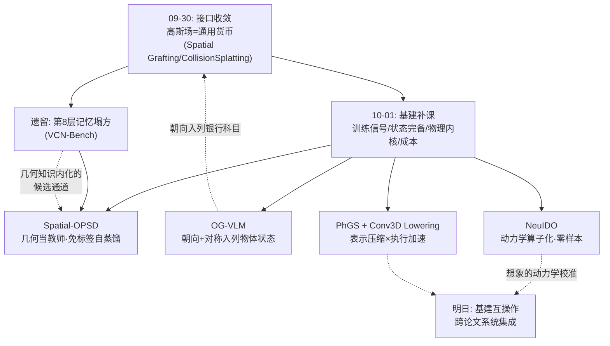
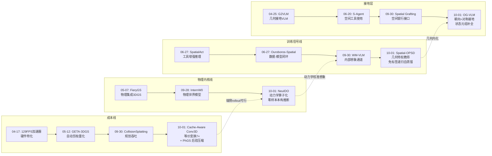
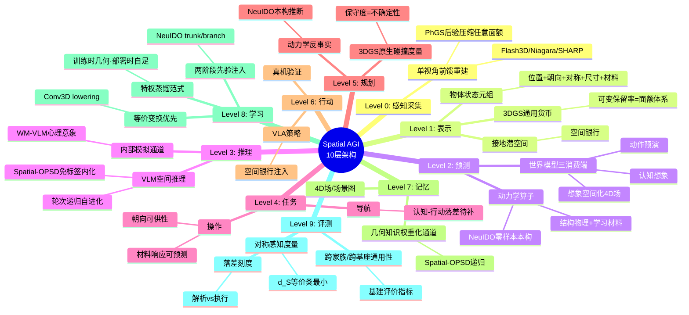
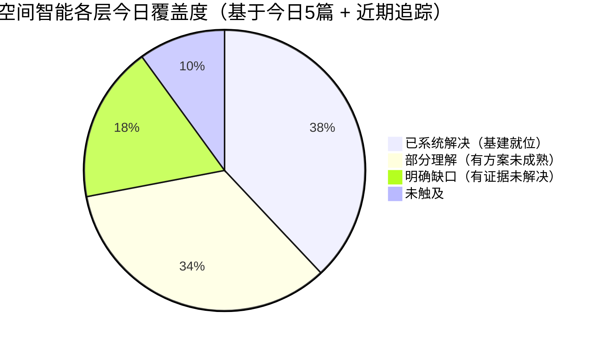

# Spatial AGI 每日深度思考 — 2026-10-01

**主题**: 空间智能的"基建日"——训练信号、状态完备性、物理内核、表示经济与执行经济（免标签几何蒸馏 × 朝向接地 × 动力学算子 × 单图表示压缩 × 世界模型边缘加速）

**论文**:
1. Cache-Aware Conv3D Lowering（2609.31938，UW–Madison + Beta Infinity）— 不改模型的 runtime 等价变换：因果 Conv3D 逐时间 tap 降级为批量 Conv2D + 时间区间折叠，Jetson Orin 上 VAE 解码 7×、完整生成 2× 加速，跨 Wan2.1/2.2 通用，回收 TensorRT 绝对加速的 95.55%
2. Spatial-OPSD（2609.37055，清华 + LMMs-Lab + XJTU）— 把重建工具链（DINO+SAM2+VGGT）的几何输出变成特权教师的上下文而非答案标签，on-policy token 级 KL 自蒸馏内化空间知识；轮内冻结+轮间刷新的递归方案，4 个 VLM 家族一致提升，3 轮达开源前沿
3. Orientation Grounding / OG-VLM（2609.33109）— 首个 referring 朝向接地任务：语言/box 查询 → 6D 朝向 + 轴对称标签；ReferOri 718K 查询（重建流水线自动标注 + 多视角一致性 + 人工兜底）；对称感知度量 + sign/symmetry token，场景级超越 Orient Anything
4. NeuIDO（2609.24313，厦大 + 上交）— 把"视频 → 本构函数"形式化为跨场景神经算子学习（Branch-Trunk/DeepONet 式），已知本构律预训练 trunk + 视频对齐 branch 两阶段；零样本新场景实时动力学推断 + 少样本适配，弹性/塑性双通道接可微 MPM
5. PhGS（2609.20623，Stuttgart + Keio）— 首个单视角前馈 3DGS 的后验压缩管线：冻结基座 + （Laplacian 边缘×不透明度）重要性采样剪枝 + 逐高斯 MLP 递归精炼（渲染误差反馈闭环），跨 Flash3D/Niagara/SHARP 通用，推理时可变保留率

---

## 📅 每日总结

**日期**: 2026-10-01
**论文数量**: 5 篇
**主题**: 昨天的主旋律是"接口收敛"——高斯场/接地几何成为感知、想象、记忆、决策、行动五方共享的通用货币，同时 VCN-Bench 揭示第 8 层（记忆）的系统性塌方。今天五篇论文几乎没有一篇是"新模型"论文，全部是**基建论文**：它们不发明新的空间能力，而是回答"已有的空间能力靠什么养活、靠什么完备、靠什么变快、靠什么变省"。Spatial-OPSD 回答"训练信号从哪来"：重建工具链的几何输出不是标注原料，是活的教师——训练时特权、部署时自足，递归刷新让这个教师跟着学生成长；Orientation Grounding 回答"物体状态还缺什么"：接地研究只教了模型"哪里有东西"，没教"东西朝哪边"——朝向 + 轴对称是交互推理（能坐哪、杯口在哪、门往哪开）的几何前提；NeuIDO 回答"想象的物理内核从哪来"：动力学不该逐场景辨识，而该跨场景学成一个算子——世界模型的"物理正确性"从专家设定变为观测习得；PhGS 回答"空间表示凭什么便宜"：单视角想象的 1M+ 高斯冗余可以在输出空间被无损级压缩，一个模型覆盖任意内存预算；Cache-Aware Conv3D 回答"空间想象凭什么快"：世界模型 rollout 的执行瓶颈（Conv3D，95.95% 归因）可以被数学等价的 runtime 变换消除，7× 解码加速不花一个参数的代价。五篇合起来的元信息是：**空间智能正在从"能力演示期"进入"基建工程期"**——如同深度学习的 2012-2015：模型宣言之后，是 optimizer、normalization、数据引擎、编译器的接续涌现。

**关键突破**:
- 🚀 **几何工具链升格为"教师"（Spatial-OPSD）**：这是本系列追踪以来空间训练方法论最重要的一次升级。此前几何输出（深度/位姿/点图）只有两个用途：数据标注（SpatialVLM 式合成 QA）或评测参考。Spatial-OPSD 给了第三个身份：训练时的特权上下文——教师拿着场景图答题、学生裸考，token 级 KL 把"几何如何支撑推理"的过程性知识（选参照系、组合关系、估计距离）压进学生权重。两个设计决定其可持续性：监督发生在学生自己的轨迹上（on-policy，修正发生在实际错误处）；轮次刷新让教师继承学生进步、特权几何重新拉开信息差（递归燃料）。GT 答案全程只出现在评估——空间能力第一次可以完全不依赖答案标签地训练
- 🚀 **朝向成为接地的一等目标（Orientation Grounding）**：定位接地研究教了模型"哪里"，本文证明"朝哪"是独立且可学习的能力。两个概念澄清价值极大：box pose ≠ object-centric orientation（框轴是几何拟合的，物体轴是部件结构/功能语义的——椅子坐向不是包围盒最长边）；对称性必须显式建模（对称物体的朝向是 SO(3)/G 商空间中的等价类，不是单个旋转值）。ReferOri 的标注流水线（重建规范系作朝向代理 + 双视角一致性自动过滤 + 人工兜底 96%/97.5%）是 3D 标注引擎的当前最佳实践
- 🚀 **动力学的"基础模型化"（NeuIDO）**：物理仿真社区把材料参数当每场景常数估了十年，学习社区把动力学当每场景隐函数学了几年——NeuIDO 说都不对：动力学是函数空间中的分布，可以端到端学一个算子。Branch-Trunk 分解的物理对应极优雅：trunk 学共享响应基（拉伸/剪切/屈服的通用模式），branch 出场景配方（系数）——Stage I 用解析本构律库注入结构先验（监督密集干净），Stage II 才用稀疏的视频视觉损失对齐。零样本秒级 vs 逐场景优化分钟-小时级，是"动力学世界模型"从概念走向系统的第一步
- 🚀 **表示经济与执行经济同日补课（PhGS + Cache-Aware Conv3D）**：昨天 RoGSW4RLD/CollisionSplatting 证明高斯场能承载想象与规划，今天两篇系统论文回答"高斯场管线跑不跑得动"：PhGS 把单图重建的 >1M 高斯压到任意预算（剪枝+误差反馈精炼，跨基座通用），Cache-Aware Conv3D 把生成这些想象的解码成本砍 7×（不改权重的等价变换）。两者共同的元方法是"不改模型、改表示的执行形态"——量化/蒸馏/重训之外的第三条加速路线，以 95.55%（执行）/ 最低质量损失（表示）的回收率换取零模型侵入
- 🚀 **"训练时特权、部署时自足"范式成形（Spatial-OPSD × Orientation Grounding 合观）**：两篇论文共同确认了一个训练基建模式：昂贵的几何工具链（重建/深度/位姿）只出现在训练侧——Spatial-OPSD 把它放进教师上下文，OG-VLM 把它变成标注目标——部署模型保持纯感知输入。这个模式与 LLM 领域的"强模型蒸馏弱模型"同构，但特权来源是**几何工具而非更大模型**，意味着空间能力的提升可以由感知基建（重建/SLAM 进步）直接驱动，不必等基座模型升级

**架构演进**: 10 层架构五处推进：
- 第 2 层（表示）：物体状态元组补全"朝向+对称性"字段（OG-VLM）；表示获得连续可调的保真度旋钮（PhGS 的任意保留率）
- 第 3 层（预测）：动力学从专家假设变为习得算子（NeuIDO）——预测层的物理内核首次可跨场景迁移；边缘执行成为一等约束（Cache-Aware Conv3D 的 7×）
- 第 6 层（规划）：材料响应（软硬/弹性/塑性）进入可预测范围——"拿起前知道会不会变形"的操作规划前提就位
- 第 9 层（学习）：免标签空间训练范式确立（Spatial-OPSD）——空间能力的 scaling 不再被标注瓶颈锁死
- 跨层基建：表示压缩（PhGS）与执行加速（Cache-Aware Conv3D）构成"空间想象的经济学"的成本两侧

### 📊 一句话总结

昨天宣告空间智能模块的接口统一，今天补齐让这套系统真正跑起来、练出来、用得起的四类基建：训练信号（几何当教师）、状态完备（朝向入列）、物理内核（动力学算子化）、成本控制（表示压缩×执行加速）——能力演示的战国时代结束，基建工程的统一时代开始。

### 🔗 延续性

**昨日→今日**: 五条直接接续：(1) 昨日 CollisionSplatting 让 3DGS 承载规划，今日 Cache-Aware Conv3D 让 3DGS 的生成端跑得快——碰撞检查的实时性以 rollout 实时性为前提，执行加速是昨日规划层的隐藏依赖；(2) 昨日 VCN-Bench 断言第 8 层记忆塌方、需要"给 MLLM 挂 4D 记忆"，今日 Spatial-OPSD 提供了把几何知识灌进 MLLM 权重的免标签通道——4D 记忆的内化路径候选；(3) 昨日 Spatial Grafting 的空间银行需要"接地几何"，今日 OG-VLM 把接地从位置扩展到朝向——银行的账户科目表从此更完整（能回答"面向桌的那把椅子"类查询）；(4) 昨日 WM-VLM 让 VLM 内部想象视觉状态，今日 NeuIDO 保障想象的动力学正确性——内部想象（定性）与物理 rollout（定量）的互补在昨日已预告，今天物理侧到位；(5) 昨日 RoGSW4RLD 的 4D 场 rollout 在服务器 GPU 上跑，今日 Cache-Aware Conv3D 把边缘端纳入版图——想象的经济学从"记账"进入"落地"阶段

**今日→明日**: 五条线索——(1) "教师的不确定性感知"：Spatial-OPSD 的场景图已有置信度字段，低置信几何时教师"少教"的机制（收缩分布/弃权）是下一个关键组件；(2) "朝向进入策略回路"：OG-VLM 的朝向输出接入 Spatial Grafting 的空间银行（账户科目加"朝向"），操作/导航策略即可消费"面向/背对"语义——三方集成实验；(3) "动力学算子×生成式世界模型"：NeuIDO 的本构推断作为扩散 rollout 的动力学校正层，"看起来对+动起来对"的混合世界模型；(4) "4D 压缩"：PhGS 的输出空间压缩推广到 4D 高斯（时间维的冗余结构不同：位移场平滑性 vs 空间平坦性），衔接 RoGSW4RLD 的 4D 场存储与传输；(5) "朝向的主动获取"：单视角朝向是猜测，OG-VLM 输出不确定性 → 主动视角规划"转身看一眼确认朝向"——主动感知与接地的合流

### 💡 本质思考：如何达成通用空间智能

#### 1. 核心能力的本质是什么？

今天五篇论文把空间智能的能力本质推进到"基建学"层面：

1. **空间智能的可持续性取决于训练信号的"自举"程度**（Spatial-OPSD 的最深启示）：依赖人工标注的能力扩展有天花板（标注成本线性于能力范围），依赖答案奖励的能力扩展有过拟合风险（benchmark 污染）。Spatial-OPSD 展示的第三条路——**环境自身的结构（几何）作为无限的、免费的、随感知基建进步而增值的教师**——是唯一与 scaling 兼容的。深层判断：空间智能的 scaling law 的系数不是算力或数据量，而是**感知-重建工具链的质量**——VGGT 变强一天，空间 VLM 的教师就变强一天。这与语言智能依赖人类文本存量的结构根本不同：空间智能的"文本"是可以被工具链**从任何照片里现场制造**的

2. **空间智能的物体理解是"状态元组 + 等价结构"而非"框 + 标签"**（OG-VLM 的概念贡献）：完整物体状态 = 位置 + 朝向 + 对称 + 尺寸 + 材料响应（今日 NeuIDO 补上最后一项）+ 语义。对称性是其中的哲学性发现：空间理解的对象不是欧氏空间中的点，而是商空间中的等价类——**"知道什么可以不确定"与"知道什么必须确定"同样是知识**。这修正了整个姿态估计传统的评价偏差，也预示空间智能的输出接口将普遍携带对称/不确定性标注（碰撞保守度（昨日 CollisionSplatting）与轴对称标签是同一思想的两个应用）

3. **物理正确性是"结构给物理、实例给学习"的分工问题**（NeuIDO 的方法论）：守恒律、时空因果由仿真器硬保证（结构），材料响应由观测学习（实例）——学习问题被约束在它真正擅长的子空间。对比生成式路线（物理从视频数据涌现）：涌现的物理是"学出来的错觉"，反事实与长 horizon 下脆弱；NeuIDO 路线的物理是"推导出来的"，可外推可审计。空间智能的决策层（需要反事实："如果我推它会怎样"）大概率必须建立在结构化物理之上

4. **空间想象的可行性 = 表示经济 × 执行经济的联合优化**（PhGS + Cache-Aware Conv3D 合观）：昨天说"高斯场是通用货币"，今天补上货币的面额体系（PhGS 的可变保留率 = 同一表示的多面额）与印钞成本（Conv3D lowering = 生成成本的常数因子削减）。启示是：**空间智能系统的设计目标函数应包含 (质量, 内存, 延迟) 三元组**，单点质量指标（PSNR）时代的评价体系即将过时——类似移动摄影从"画质至上"到"算力-功耗-画质联合调优"的演进

#### 2. 当前方法与理想目标的差距在哪里？

- **教师质量的天花板未解决**：Spatial-OPSD 的几何特权来自 DINO/SAM2/VGGT——遮挡、透明、动态场景下伪几何有毒，教师的错误会被 token 级 KL 忠实传授。置信度字段已有，"置信度感知教学"（低置信弃权/收缩）缺失
- **朝向接地仍是室内物体的小世界**：ReferOri 承载 RefCOCO/ScanNet 的室内类别；户外、细长、非刚性、铰接物体的朝向未覆盖；真正难的"功能朝向"（杯口方向、把手朝向）与"规范系冲突"（文化约定的椅子正面）未触及
- **动力学算子的表达边界**：NeuIDO 的基函数线性组合假设真实动力学在解析律库张成的空间附近——率相关粘弹性、各向异性、多物体耦合接触在边界之外；多视角标定的采集要求限制了野外部署
- **压缩与加速都不触及真正的瓶颈**：PhGS 压的是表示内存，Cache-Aware Conv3D 加的是 VAE 解码——完整世界模型 rollout 的大头（DiT 去噪主干）两者都未动；世界模型的实时化在去噪主干获得同等对待之前不会发生
- **基建之间还没有对话**：今天的五篇基建各自为政——Spatial-OPSD 的教师不消费 OG-VLM 的朝向，NeuIDO 的动力学不注入 WM-VLM 的想象，PhGS 的压缩不管下游任务的语义需求（导航要可行走区域不是渲染边缘）。基建的互操作标准（物体状态元组 + 不确定性标注的统一 schema）是缺口

#### 3. 从今天到理想状态，最可能的路径是什么？

- **近期（3-6 个月）**：
  - Spatial-OPSD 式免标签蒸馏 + 置信度感知教师 → 空间 VLM 的开源前沿在无标注条件下继续前移
  - OG-VLM 式接地扩展到尺寸/状态/关系，物体状态元组成为接地论文的标准输出
  - PhGS 式输出空间中间件生态出现第一批非压缩应用（后验物理化、后验语义化）
  - Cache-Aware 式等价变换推广到注意力 KV cache 与去噪主干
- **中期（6-18 个月）**：
  - 基建互操作：空间银行（昨日）读朝向（今日），动力学算子（今日）校准想象（昨日）——跨论文系统集成论文出现
  - "感知基建驱动能力提升"的飞轮验证：VGGT/SAM 系大版本升级 → 空间 VLM 免训练涨点（Spatial-OPSD 复训即得）的量化证据
  - 4D 压缩与流式传输标准（PhGS→4D），边缘世界模型 rollout 的完整栈打通
- **长期（18 个月+）**：
  - 动力学基础模型与生成式世界模型的合流：结构物理 + 学习外观的混合模拟器
  - 空间能力的"自举闭环"：智能体的探索数据 → 重建工具链 → 教师 → 自身能力提升（Ouroboros-Spatial 式闭环的基建版）
  - 空间智能的 scaling law 定律化：能力 ≈ f(感知基建质量, 递归轮数, 部署预算) 的实证刻画

---

## 🔗 与昨日思考的联系

### 昨日重点

- 接口收敛：高斯场/接地几何成为空间智能五方（感知、想象、记忆、决策、行动）共享的通用货币（Spatial Grafting 的空间银行是标志）
- 认知想象作为世界模型的第三消费端（WM-VLM）
- 认知-行动落差：VCN-Bench 证明解析对而导航错，第 8 层记忆是系统性塌方
- 规划物理层：CollisionSplatting 让 3DGS 原生承载安全规划，不确定性升格为安全参数
- 遗留问题：模块有了插座，但系统跑不快（rollout 延迟）、存不下（1M+ 高斯）、学不下去（标注瓶颈）、物理不对（生成式想象的动力学是错觉）

### 今日进展

- **训练侧**：Spatial-OPSD 用几何工具链当教师，免标签自蒸馏 + 递归自进化——标注瓶颈与 benchmark 污染双解
- **表示侧**：OG-VLM 把接地从位置扩展到朝向+对称——物体状态元组补全，"面向桌的椅子"类语义可查询
- **物理侧**：NeuIDO 把动力学从逐场景辨识变为跨场景算子——想象的物理内核可迁移、可零样本
- **成本侧（表示）**：PhGS 单视角前馈 3DGS 后验压缩，任意保留率——表示成本变为连续可调
- **成本侧（执行）**：Cache-Aware Conv3D 等价变换加速解码 7×——rollout 执行成本常数因子级下降
- 昨日遗留的四个问题全部有第一批系统级答案

### 演进路径

---

## 📚 论文概览

| # | 论文 | 层位 | 核心贡献 | 一句话 |
|---|------|------|---------|--------|
| 1 | Cache-Aware Conv3D | 执行基建 | 因果Conv3D→批量Conv2D等价降级 | 不改模型快7×，世界模型rollout的执行经济学 |
| 2 | Spatial-OPSD | 学习基建 | 几何特权上下文+免标签on-policy蒸馏 | 重建工具链是活的教师，GT答案只用于评估 |
| 3 | OG-VLM | 接地基建 | 朝向+轴对称作为referring一等目标 | "哪里有东西"之后，"东西朝哪边" |
| 4 | NeuIDO | 物理基建 | 视频→本构函数的跨场景神经算子 | 动力学从每场景辨识变为零样本推断 |
| 5 | PhGS | 表示基建 | 单视角前馈3DGS后验剪枝+递归精炼 | 冻结基座+输出空间压缩=跨模型任意预算 |

---

## 💡 核心见解

### 见解1: 空间智能进入"基建工程期"

- 模型宣言期（能力演示）之后必然是基建期（让能力可复现、可扩展、可部署）
- 今天五篇全部是基建：训练信号（怎么养活能力）、状态完备（能力覆盖什么）、物理内核（能力是否物理正确）、成本（能力跑不跑得起）
- 历史类比：2012 AlexNet 之后 2015 BatchNorm/ResNet/数据引擎——空间智能的 AlexNet 时刻（各类接地/世界模型演示）已过，BatchNorm 时刻（Spatial-OPSD 的训练范式）正在到来
- 对研究者的含义：选择"基建位"（数据引擎、训练范式、压缩、加速、评测）的论文影响力曲线比单点模型更陡——因为它们被所有后续模型引用和依赖

### 见解2: 几何工具链是空间智能的"活教师"

- Spatial-OPSD 的范式转移：几何输出从"标注原料"（离线、一次性、答案级监督）升格为"特权教师"（在线、token 级、过程性监督）
- 三个使教师"活"的设计：on-policy（监督在学生自己的错误路径上）、密集（每个 token 都有分布目标）、递归（轮间刷新继承学生进步）
- 深层含义：空间能力的改进速度与感知基建（重建/SLAM/深度）的改进速度解耦耦合——**感知基建的每一次进步都可以通过一次复训转化为空间 VLM 的能力**，无需新标注
- 这建立了"感知基建 → 训练信号 → 模型能力"的传导管道，是空间智能区别于语言智能的独特 scaling 通道（语言的教师只能更大，空间的教师可以更准）

### 见解3: "训练时特权、部署时自足"是空间能力的通用装机模式

- Spatial-OPSD：训练时教师看场景图，部署时学生裸看图像
- OG-VLM：训练时重建流水线做标注，部署时模型直接从图像预测朝向
- NeuIDO：训练时多视角视频+解析律，部署时单视频零样本推断动力学
- 三篇不约而同采用同一模式——这不是巧合：**空间信息的获取成本（多视角/重建/仿真）与消费需求（单视角实时推断）之间的鸿沟，只能靠"训练时桥接"来跨越**
- 与 LLM 蒸馏的区别：特权来源是几何工具链而非更大模型——空间能力的蒸馏对象是"物理世界的结构"，不是"老师的意见"

### 见解4: 物体状态元组补全，交互语义才能落地

- 完整状态 = 位置（where）+ 朝向（orientation）+ 对称（equivalence）+ 尺寸 + 材料响应 + 语义
- 朝向缺失的代价：知道椅子在哪不知道能从哪坐（OG-VLM 的动机）；知道杯子在哪不知道杯口方向——所有 affordance 推理卡壳
- 材料响应缺失的代价（NeuIDO 补位）：不知道物体会不会变形、脆不脆——所有交互预测失真
- 元组的每个字段都有独立的接地论文在补（位置→3D grounding、朝向→OG-VLM、材料→NeuIDO）——**物体状态元组正在成为空间智能的标准 schema**，值得直接采用为系统设计接口

### 见解5: 对称性思维修正空间预测的评价论

- 对称物体的朝向不是 SO(3) 中的点，是 SO(3)/G 中的等价类——用单一旋转 GT + 角度误差评价是系统性的度量错误
- OG-VLM 的 d_S 度量（等价类上取最小测地距离）应成为所有含旋转预测任务的默认评价
- 更深的推广：**每个空间预测都应显式声明其"可容许变化集"**——CollisionSplatting 的保守度（昨日）与轴对称标签（今日）是同一原理：预测的价值不在于精确到不必要的程度，而在于精确到必要的程度且知道多余的自由度在哪

### 见解6: 动力学的正确抽象是算子不是参数

- 三个历史阶段的抽象演进：专家常数（手工本构+调参）→ 场景隐函数（NeuMA 逐场景优化）→ 跨场景算子（NeuIDO：观测函数空间→本构函数空间的映射）
- 算子抽象的三个红利：分辨率无关（函数对函数）、零样本有理论支撑（函数空间连续性）、模块化（换传感器只换编码接口）
- Branch-Trunk 分解的物理语义：共享响应基（trunk）× 场景配方（branch）——分解天然对齐"物理是共享的、材料是个性的"这一世界结构
- 方法论迁移价值：任何"观测稀疏间接+解析先验丰富"的空间问题（摩擦、流体参数、光照传输）都适用"先验预训练 trunk + 观测对齐 branch"两阶段

### 见解7: 世界模型的物理正确性是结构问题不是数据问题

- 生成式路线的物理是"涌现的错觉"：短 rollout 视觉可信，反事实与长 horizon 脆弱（违反守恒律）
- NeuIDO 路线：仿真器硬保证守恒（结构），学习只负责材料响应（实例）——不确定性被约束到参数邻域
- 判断：需要反事实推理的决策层（操作规划、碰撞预测）必须建立在结构化物理上；内容生成与预览可以用生成式路线
- 混合架构是终点：生成式骨干负责"看起来对"（外观/纹理/语义），动力学算子负责"动起来对"（轨迹/形变/接触）——NeuIDO 的本构推断正是后者就位的证据

### 见解8: "不改模型"的加速/压缩路线是第三条大道

- 加速三路线：重训练（架构改造）、近似（量化/剪枝/蒸馏——有精度风险）、**等价变换（runtime 重排——零风险）**
- Cache-Aware Conv3D 证明等价变换的空间巨大：一个 profile（95.95% 归因）+ 一个数学等价改写 = 7×；通用性路线回收了特化路线 95.55% 的收益
- PhGS 同理：不重训基座，输出空间剪枝+精炼，跨三个基座通用
- 元原则：**优化优先级应为 等价变换 > 近似变换 > 重训练**——前者的正确性可证明，后两者只能实验保证。空间智能系统的性能工程应先穷尽等价空间再考虑近似

### 见解9: 空间表示需要"面额体系"

- PhGS 的任意保留率 = 同一表示的连续面额：云端高面额、端侧低面额、传输中可再降
- 类比货币：昨日确立高斯场是通用货币，今日补上"可分割性"——不能分割的货币无法流通于异构设备
- 认知对应：人类空间记忆的 foveation（中央凹精细、周边粗糙）——智能体也应按任务预算分配表示面额：远处粗略想象、近处精细想象
- 系统含义：空间表示的接口应携带保真度元数据（r 值/不确定性），下游按需消费

### 见解10: 3DGS 输出空间是空间智能的"USB 接口"

- PhGS 的后验管线 + CollisionSplatting 的碰撞度量（昨日）+ Spatial Grafting 的特征绑定（昨日）都工作在同一接口上：标准 3DGS 参数集
- 预见后处理生态：压缩（PhGS ✓）、物理化（接 NeuIDO 的 λ 估计）、语义化（开放词汇分割）、动态化（4D 变形场）、编辑、LOD 化
- 生态学逻辑：基座模型迭代快 → 为每个基座重训组件不可持续 → **接口稳定、组件通用**的中间件繁荣
- 行动含义：自研空间系统时优先采用标准 3DGS 输出格式，放弃私有表示的锁定收益

### 见解11: 单视角想象的信息瓶颈是物理的，出路在主动感知

- 单视角重建+压缩再好，遮挡区域仍是猜测（PhGS 的深层高斯）——信息论边界
- 但猜测的**质量**可以通过反馈闭环提升：PhGS 的渲染误差精炼、SAM3D 的形状先验
- 根本出路：把"不确定的朝向/遮挡内容"转化为主动探索目标——OG-VLM 的对称性+不确定性输出 → "转身看一眼"的视角规划
- 空间智能的完整闭环：被动重建 → 主动确认 → 记忆更新——主动感知与接地的合流是下一个交汇点

### 见解12: 基建论文的评价标准是"被依赖度"而非"榜单分"

- 今天五篇都不刷 SOTA 榜：Cache-Aware Conv3D 的指标是覆盖率/加速比/数值一致性；Spatial-OPSD 的是跨家族一致性；PhGS 的是跨基座通用性
- 基建的价值函数：下游有多少系统会采用它（Spatial-OPSD 之于空间训练、PhGS 模式之于表示工程）
- 对自己研究的启示：产出"别人能依赖的东西"（数据集 schema、训练范式、压缩管线、等价变换）比产出"本周最高分"有更长的半衰期

---

## 🗺️ 知识演进图

---

## 技术栈演进对比表

| 技术栈层 | 2026-06 状态 | 2026-09-30 状态 | 2026-10-01 状态（今日） |
|---------|-------------|----------------|----------------------|
| 表示 | 3DGS 爆发（各应用适配） | 高斯场=通用货币，规划可用 | **+可变面额（PhGS 任意保留率）；+物体状态元组补朝向（OG-VLM）** |
| 接地 | VLM 空间推理工具化（S-Agent） | 空间银行接口标准化（Grafting） | **+朝向/对称成为一等接地目标** |
| 预测 | 世界模型专业化（手术/导航/操作） | 三消费端（认知/动作/空间化）确立 | **+物理内核可习得（NeuIDO 零样本动力学）** |
| 学习 | 闭环自改进概念（Ouroboros） | 两阶段课程（先想象后利用） | **+免标签特权蒸馏+递归自进化（Spatial-OPSD）** |
| 规划 | 3DGS 碰撞度量 | GPU 碰撞+图像奖励统一 | 材料响应可预测（NeuIDO 补位，操作规划前提） |
| 记忆 | 持久记忆 WAM（MemoryWAM） | 断层实证（VCN-Bench） | 几何内化通道候选（Spatial-OPSD 递归灌入） |
| 执行 | 硬件加速器/剪枝量化 | 规划吞吐大升 | **+等价变换加速解码 7×（Conv3D lowering）** |
| 部署 | 边缘世界模型概念 | — | **+边缘端完整性：表示压缩×执行加速同日就位** |

---

## 🗺️ Spatial AGI 知识图谱

### 10层架构思维导图

---

## 📉 知识缺口分析

**缺口明细**：
- **已系统解决**：单视角重建与压缩（PhGS+基座生态）、执行加速第一跳（Conv3D lowering）、朝向接地（OG-VLM+ReferOri）、免标签空间蒸馏（Spatial-OPSD）、跨场景动力学（NeuIDO）
- **部分理解**：教师不确定性感知（置信度字段有、教学策略无）；4D 压缩（3D 版已解，时间维冗余结构不同）；动力学算子表达边界（线性基组合的天花板）；朝向的户外/功能扩展
- **明确缺口**：第 8 层记忆塌方（三条证据链，无解决方案）；去噪主干的等价加速（真正的 rollout 瓶颈）；基建互操作标准（五篇基建互不对话）
- **未触及**：终身/跨任务空间记忆、多智能体共享空间表示、空间能力的统一 scaling law

---

## 🧭 主线技术路径（Spatial AGI 四阶段路线图）

**路径阶段0: 追踪准备期（2026Q1，已完成）** — 确定Spatial AGI的定义边界与追踪范围。

- **阶段 2（当前）的关键任务**：把五类基建做深——教师不确定性感知（Spatial-OPSD）、朝向接地扩展到功能/户外（OG-VLM）、非线性动力学算子（NeuIDO）、4D 压缩（PhGS→4D）、去噪主干等价加速（Conv3D→DiT）
- **阶段 3 的标志事件**：空间银行（L2）直接消费朝向接地（L2）+ 动力学算子（L3）校准想象（L3/L4）——第一篇"跨基建集成"系统论文；物体状态元组 schema 的社区标准化
- **阶段 4 的标志事件**：智能体自身探索数据经重建工具链转化为教师信号、能力自举闭环闭合；空间能力 scaling law 的实证定律化

---

## 🔍 待探索议题（10 个）

1. **置信度感知教师**：Spatial-OPSD 的场景图带置信度，但教师在不置信时仍全力输出——如何让教师在低置信几何上收缩分布或弃权（选择性教学），避免有毒特权传导？实验设计：人工污染子图置信度，测量学生错误率对教师弃权策略的敏感性
2. **朝向接入空间银行**：Spatial Grafting 的银行科目表加"朝向+对称"字段（OG-VLM 输出），操作策略是否解锁"面向/背对"类指令？预期收益集中在功能抓取与人机交互场景
3. **动力学算子作为扩散 rollout 的校正层**：NeuIDO 的零样本本构推断 + WM 的生成 rollout——生成帧序列 → 提取运动 → 算子评估物理合理性 → 修正或重采样。混合世界模型的"物理奖励"能否像昨日的图像条件奖励一样可微？
4. **4D 高斯的后验压缩**：PhGS 的空间剪枝准则（边缘×不透明度）推广到时空——时间维的冗余是位移场平滑性，剪枝对象可能是时间关键帧而非基元；与 RoGSW4RLD 的 4D 场衔接
5. **去噪主干的等价变换**：Cache-Aware Conv3D 的方法论（profile 归因→数学等价改写→守卫路由）应用于 DiT 的时空注意力——KV cache 的时间 tap 是否可折叠？这是实时 rollout 的真正瓶颈
6. **朝向的主动确认**：OG-VLM 输出朝向+对称+（隐含）不确定性 → 主动视角规划决定"是否转身看一眼"——主动感知与接地的合流实验：在信息增益（朝向熵下降）与行动成本（移动开销）间做权衡的策略
7. **感知基建驱动能力提升的飞轮验证**：VGGT/SAM 系大版本升级后，Spatial-OPSD 复训（不换架构不加标注）能涨多少？——量化"感知基建 → 空间能力"的传导系数，这是空间智能 scaling law 的第一个可测常数
8. **材料响应进入任务规范**：操作基准（RoboTwin 等）目前不含材料变量——加入"软硬/脆韧"维度后，现有 SOTA 策略的成绩分布如何塌方？预期揭示交互预测的系统性盲区
9. **表示面额的任务自适应**：PhGS 的 r 旋钮由谁拧？导航任务的最小可行 r、操作任务的 r、远程遥现的 r——建立"任务→面额"的映射表，可能是空间表示 QoS 的第一版规范
10. **五基建的联合消融**：在同一空间智能体上逐个开关今日五项基建（压缩/加速/朝向/动力学/蒸馏），量化各基建对端到端任务成功率的边际贡献——基建价值的第一次统一度量

---

## 📌 本质思考补充：三个元问题

### 元问题 1: 空间智能的 scaling 变量是什么？

- 语言智能：scale 算力+文本存量
- 空间智能的独特性：**训练信号可以被工具链现场制造**——任何照片 + 重建流水线 = 几何监督
- 因此 scaling 变量三元组：感知基建质量 × 递归训练轮数 × 部署预算（面额）
- 可检验预测：感知基建大版本升级与空间 VLM 能力跃升之间存在可测量的因果链（议题 7）

### 元问题 2: 物理正确性应该"学"还是"建"？

- 今日证据倾向：结构（守恒/因果）建、实例（材料/参数）学——NeuIDO 的分工
- 学习派反驳：数据无限时涌现物理更通用（不受仿真器表达力限制）
- 裁决标准：**反事实推理的可靠性**——需要"如果"推理的决策场景必须可审计，学习式物理的置信度校准远未达标
- 务实结论：未来 2 年混合架构（生成外观+结构物理）是唯一同时满足"看起来对+动起来对+错得有理由"的方案

### 元问题 3: 基建期的正确研究策略是什么？

- 榜单分的半衰期 ~3 个月，基建的半衰期 ~3 年
- 高价值基建位（今日已占坑的）：训练信号（Spatial-OPSD 位）、状态 schema（OG-VLM 位）、物理内核（NeuIDO 位）、成本（PhGS/Conv3D 位）
- 仍空缺的基建位：**互操作 schema**（五基建的统一接口）、**基建评价学**（被依赖度的度量方法）、**4D 版全栈**（压缩/加速/接地的时空推广）
- 策略建议：与其在拥挤的能力位内卷 0.5 分，不如占一个空缺基建位定义一个接口

---

## 📝 今日金句

- "重建工具链不是标注车间，是活的教师——它跟着学生一起长大。"（Spatial-OPSD）
- "知道椅子在哪是定位，知道椅子能怎么坐才是空间智能。"（OG-VLM）
- "物理守恒交给仿真器，材料个性交给学习——各自只做自己有把握的事。"（NeuIDO）
- "不改一个参数的 7× 加速，来自一次诚实的 profiling 和一次数学等价。"（Cache-Aware Conv3D）
- "空间货币需要面额体系：同一个场景，云端一个价、手机一个价。"（PhGS）

---

## 🔭 明日展望

- 优先追踪：教师不确定性感知（议题 1）——它决定免标签范式的安全性上限
- 关注信号：NeuIDO 类算子与视频扩散模型的首批耦合实验；OG-VLM 数据/代码开源后的复现与扩展速度；Spatial-OPSD 在具身任务（非纯基准）上的迁移
- 结构性判断待验证：基建互操作论文（跨 2+ 基建的集成系统）是否在 3 个月内出现——若出现，阶段 3 确认开启

---

**文档创建时间**: 2026-10-01 03:00 (UTC+8)
**分析方法**: GLM WebReader 全文精读 5 篇 + 昨日思考延续
**今日主题词**: `#基建工程期` `#特权蒸馏` `#朝向接地` `#动力学算子` `#表示经济学` `#等价变换`

---

## 🧱 五篇论文的逐篇深读笔记

### 深读 1: Cache-Aware Conv3D Lowering — 世界模型的"编译器时刻"

**为什么这篇是今天最重要的信号**：它宣告世界模型的研究重心开始从建模侧向系统侧渗透。过去一年所有 WAM 论文都在卷"想象得更准"，这篇问的是"想象跑不跑得动"——而且给出的答案质量极高：不是近似（量化/蒸馏），是数学等价。

**技术细节的三层拆解**：

1. **Profile 层**：95.95% 的归因不是拍脑袋——Nsight Systems 全链路追踪，169 次 Conv3D 调用逐个签名归因，发现"短时间核×大空间图"是成本集中区。这印证了一个普遍规律：**优化项目的第一周应该只做测量**。
2. **变换层**：等价性的证明链条完整——交叉相关约定下 Conv3D 输出 = Σ_k Conv2D(Z[..q_k(t)..], W_k) + b；时间区间折叠（等长输出/源区间的 batch 维折叠）保证无浪费计算；dilation 免费兼容（δ_k 已含 d_t）。
3. **工程层**：守卫路由（支持条件显式化+回退+计数器）、可逆安装、派生权重缓存、字节级 checkpoint 验证（196 张量逐字节比对）——工程卫生堪比数据库系统论文。

**被低估的发现**：Conv3D 的时间核只有 3——预训练时空模型在**计算上是空间主导的**，时间维度是浅层修正。这与 4D 高斯方法中"空间高斯+浅层时间变形"（昨日 RoGSW4RLD）异曲同工：**时间维度在表示和计算两个层面都是轻结构**。这对未来时空架构设计是一个强烈的先验信号：把容量花在空间，把时间留给局部修正。

**与 TensorRT 对比的正确读法**：1.36× 的差距不是本方法的失败，是通用性路线的正确定价——固定部署环境（模型/帧数/分辨率全固定）选 TRT，多模型快速迭代环境选 lowering。空间智能研发期显然属于后者。

**遗留问题清单**：
- 去噪主干（DiT）未触及——真正的大头
- s_t≠1 / 分组卷积场景回退——未来 VAE 架构演化可能降低覆盖率
- BF16 执行顺序差异——对数值敏感的下游控制需要 FP32 验证通道

---

### 深读 2: Spatial-OPSD — 空间训练的"无标签宣言"

**范式定位**：在空间 VLM 的训练方法谱系上，监督信号经历了三代：
- 一代：人工标注 QA（SpatialVLM 前时代）——贵、慢、天花板低
- 二代：合成 QA（SpatialVLM：几何估计生成答案再 SFT）——便宜了但答案级监督稀疏，且几何被硬编码成一次性文本
- **三代（本文）：几何作为特权上下文的 on-policy 蒸馏**——监督密度 token 级，几何是"活的教师"而非"死的数据"

**三组件的必要性论证**（缺一即塌）：

1. **特权上下文**（教师拿场景图、学生裸考）：制造信息差是蒸馏有梯度的前提；特权是几何而非答案——教师的分布携带"如何用几何推理"的过程信息
2. **on-policy**（监督在学生轨迹上）：空间推理是长链条组合（识别→接地→选参照系→组合关系→作答），off-policy 的"完美前缀"与学生实际生成的"带错前缀"分布不匹配——修正必须落在学生真的会犯错的地方
3. **轮次刷新**（轮内冻结+轮间继承）：解决"冻结教师学不动、在线教师目标漂移"的两难；特权几何在每轮重新拉开信息差——递归的燃料

**场景图设计的匠心**：
- 度量/序数/归一化的质量阶梯：有尺度保留米制，无尺度退化到距离比和深度顺序——诚实面对伪几何的不确定性
- 检索器 R(s,q)：问题相关子图而非全图——模拟"带着问题看场景"的注意力，也控制上下文长度
- 教师仍需完成接地/选系/组合——子图是证据不是答案，保证蒸馏的是推理过程而非记忆

**最大的开放风险**：伪几何有毒。DINO/SAM2/VGGT 在遮挡/透明/动态场景的错误会经 token 级 KL 忠实传授给 student。缓解方向的优先级排序：
1. 置信度感知教学（低置信弃权/收缩）——场景图已有 confidence 字段，是最短路径
2. 多教师交叉验证（不同工具链的几何互相检查）
3. 学生不确定性输出（让模型学会说"我不确定"）

**与语言智能的结构性差异**（本篇最深的启示）：语言智能的训练信号（人类文本）是存量，不可制造；空间智能的信号（几何）可以从任意照片**现场制造**——工具链就是印钞机。这决定了两个领域的 scaling 机制根本不同。

---

### 深读 3: OG-VLM — "朝哪"终于成为一等公民

**概念澄清的双重价值**：

1. **box pose ≠ object-centric orientation**：框轴来自几何拟合，物体轴来自部件结构（椅子的坐向、杯子的口向、门的开启向）。用 box 监督学到的"朝向"耦合了框质量与坐标约定，语义上是错的量
2. **对称性是知识不是噪声**：对称物体的朝向是等价类——"知道可以不确定什么"与"知道必须确定什么"同样重要。d_S 度量（min over symmetry group）应成为所有旋转预测的默认评价

**数据引擎的工程范本价值**：
- 朝向代理 = SAM3D 重建物体的规范坐标系——用重建先验替代 CAD 库，泛化性质变
- 多视角一致性 = 最廉价的质检过滤器：∠(R₁,R₂)<τ 自动接受，否则人工——718K 查询只有 ~10K 人工复核
- 96% 正确率 + 97.5% 标注者间一致性——质量数字诚实且够用
- 可复制性：Map Anything + SAM2 + SAM3D 三个现成组件 + 一个一致性阈值——任何团队可以一周内搭建同款流水线标注自己的 3D 属性

**OG-VLM 结构化输出的三条教训**（对所有 VLM 数值输出任务通用）：
- 分离 span（<bbox>/<ori>）——不同物理量不共处一个文本段
- 符号专用 token——自回归生成中符号是最弱的 token，必须独立词表项+独立监督
- 回归头挂 span 结束隐状态——文本负责声明格式，数值经隐状态回归，兼顾接口与精度

**局限的诚实清单**：室内物体小世界（RefCOCO/ScanNet 类别）；规范系的文化约定性；单视角下背面朝向本质是先验猜测；指称表达中朝向语言的占比存疑（模型可能主要靠视觉证据而非"听懂"朝向语言）

---

### 深读 4: NeuIDO — 动力学的"基础模型时刻"

**范式演进的三段论**（为什么逐场景方法不是世界模型）：
- 专家常数时代：每场景手工本构+调参——物理对但不可扩展
- 场景隐函数时代：NeuMA/MASIV 逐场景优化神经本构——自动化了但一万场景的经验对第一万零一个场景毫无帮助
- **跨场景算子时代（本文）**：动力学是函数空间中的分布——一次训练处处推断，经验可以积累

**Branch-Trunk 分解的物理诗意**：
- trunk（共享基）= 物理世界的通用响应词汇（拉伸、剪切、压缩、屈服……）
- branch（场景系数）= 特定材料的"方言口音"
- 分解天然对齐"物理是共享的、材料是个性的"——好的归纳偏置让学习变容易

**两阶段训练的监督经济学**：
- Stage I 在解析律库上训 trunk：监督是函数值级（dense、干净、可无限采样 ξ）——把难学的结构放在监督丰富的阶段
- Stage II 对齐 branch：监督是像素级（sparse、含噪、需穿过 MPM+可微渲染的长梯度链）——把难监督的部分放在已有好表征的阶段
- 这个"先验注入→观测对齐"的次序可推广到一切"观测稀疏间接+解析先验丰富"的空间问题

**诚实的能力边界**：
- 线性基组合：率相关粘弹性、各向异性在基张成空间之外——零样本失效，需少样本适配
- 光流接口：看不到应力状态/内部形变/力源（推 vs 吸的运动学混淆）
- MPM 边界：刚体接触、铰接、流固耦合不在舒适区
- 多视角标定：野外单目视频的适配未展示

**与昨日 WM-VLM 的互补结构**：WM-VLM 的内部想象是定性的（心理旋转对不对），NeuIDO 的动力学是定量的（应力-应变对不对）。完整的世界模型需要两者：想象负责假设生成，动力学负责假设检验——"内部想象+物理验证"的混合自改进循环在今日物理侧就位

---

### 深读 5: PhGS — 单视角想象的"面额革命"

**问题结构的洞察**：单视角与多视角的冗余类型根本不同——
- 多视角冗余：跨视角重复预测同一表面（错位的重复基元）→ 修复靠**融合**
- 单视角冗余：每光线 K 个防御性高斯（平坦区浪费）→ 修复靠**稀疏化**
- 这解释了为什么多视角压缩方法（LightGaussian/PUP）直接迁移失败——它们优化的冗余在单视角下不存在

**管线设计的三个正确决策**：
1. 冻结基座+输出空间操作：单视角基座迭代快（Flash3D→Niagara→SHARP），后验管线的"一次训练多基座复用"价值被基座演化速度放大
2. 跨层联合重要性采样：实证发现深层高斯逐像素扮演不同角色（前景支撑 or 独立背景）——固定每层配额会系统性地保错剪错
3. 无空间操作的递归精炼：1M+ 高斯规模下 kNN/注意力不可行——逐高斯 MLP+平均池化全局上下文，O(m) 完全并行

**递归精炼的认知科学对应**：渲染→比较→更新 = analysis-by-synthesis——空间模型通过"想象与观察的差距"自我修正，这与人类视觉的预测编码（predictive coding）框架惊人同构

**"任意保留率"的深层含义**：空间表示第一次有了连续可调的保真度旋钮——
- 部署侧：云端高面额/端侧低面额/传输中可再降
- 认知侧：远处粗略想象+近处精细想象 = 空间记忆的 foveation
- 经济侧：表示成本从常数变为决策变量，进入系统目标函数

**局限的物理性**：遮挡区域的信息瓶颈是信息论意义的——压缩再好也无法还原没观察到的结构。真正的出路在主动感知：把高不确定性区域（含对称朝向）转化为"下一步看哪里"的探索目标

---

## 🔄 五基建的互操作矩阵（缺口可视化）

|  | Spatial-OPSD | OG-VLM | NeuIDO | PhGS | Conv3D |
|--|--|--|--|--|--|
| **Spatial-OPSD** | — | ❌ 教师不消费朝向子图 | ❌ 材料响应未入场景图 | ❌ 重建输入未压缩 | ✅ 理论兼容 |
| **OG-VLM** | ❌ 未用蒸馏内化 | — | ❌ 朝向无时间演化 | ⚠️ 可在压缩表示上跑 | ✅ 理论兼容 |
| **NeuIDO** | ⚠️ 本构可作特权证据 | ⚠️ 朝向演化待做 | — | ⚠️ 初始场景可压缩 | ✅ 仿真可加速 |
| **PhGS** | ⚠️ 压缩后重建质量影响教师 | ⚠️ 同上 | ⚠️ 同上 | — | ✅ 解码即来源 |
| **Conv3D** | ✅ | ✅ | ✅ | ✅ | — |

- ✅ = 已兼容/天然兼容
- ⚠️ = 可行但无工作验证
- ❌ = 明确缺口（互操作标准缺失）

**结论**：五个基建各自健康，但互操作几乎全靠"理论兼容"——统一的物体状态 schema（含朝向/对称/材料/不确定性）与统一的几何证据格式（Spatial-OPSD 的场景图扩展）是阶段 3 的第一优先级。

---

## 🎯 对自己研究系统的行动清单

1. **立即采用**：对称感知度量（所有含旋转的评测）；profile 先行的优化流程；物体状态元组作为系统内部接口
2. **短期集成**：把重建流水线输出（深度/位姿/场景图）接入训练管线的教师侧；3DGS 输出统一标准格式以备后处理生态
3. **中期布局**：置信度感知教师组件；4D 压缩原型；主动朝向确认的视角规划
4. **长期观察**：动力学基础模型与生成式世界模型的合流信号；空间能力 scaling law 的实证常数

---

## 📎 附录 A: 今日五篇的方法论提炼

- **等价变换方法论**（Conv3D）：profile 归因 → 数学等价改写 → 守卫路由 → 跨架构验证 → 诚实对比特化上限
- **特权蒸馏方法论**（Spatial-OPSD）：结构先验造教师 → on-policy 轨迹 → token 级 KL → 轮间刷新递归 → GT 只做评估
- **自动标注方法论**（OG-VLM）：重建先验替代 CAD → 多视角一致性自动过滤 → 人工只兜疑难 → 质量数字诚实公开
- **两阶段先验注入方法论**（NeuIDO）：解析先验训结构（密集监督）→ 观测对齐实例（稀疏监督）→ 零样本+少样本双模式
- **后验中间件方法论**（PhGS）：冻结基座 → 输出空间轻量组件 → 跨基座通用 → 推理时可调参数

五个方法论共享的元原则：**尊重已有资产（预训练权重/解析物理/工具链），在接口处做最小侵入的创新**——这与昨日 Spatial Grafting 的"最小侵入原则"一脉相承，正在成为空间智能工程的美学共识。

## 📎 附录 B: 与历史追踪的术语连续性

- "通用货币"（昨日）→ 今日补"面额体系"（PhGS）与"印钞成本"（Conv3D）
- "三消费端"（昨日：认知/动作/空间化）→ 今日补"燃料来源"（NeuIDO 的物理内核）
- "第 8 层塌方"（昨日）→ 今日提供内化通道候选（Spatial-OPSD 递归）
- "最小侵入原则"（昨日 Spatial Grafting）→ 今日五篇全部遵循（冻结基座/不改模型/训练时特权）
- "落差刻度"（昨日 VCN-Bench）→ 今日无直接评测论文，但五篇的方法论（跨家族/跨基座一致性）都是"落差思维"在基建评价上的投影

## 📎 附录 C: 风险登记簿（空间智能基建期的系统性风险）

1. **工具链单点依赖**：Spatial-OPSD/OG-VLM 都依赖 VGGT/SAM 系——这些基础模型的偏见与盲区将垂直传导进空间智能全栈
2. **等价变换的边界错觉**：Conv3D 的守卫条件（s_t=1, g=1）在架构演化后可能大面积失效——守卫计数器的监控必须成为部署默认
3. **免标签≠无偏**：Spatial-OPSD 的数据集场景分布仍决定模型先验——递归自改进缺外部纠错时系统性偏差可能随轮次放大
4. **动力学安全**：NeuIDO 类物理预测用于控制前需要不确定性量化——λ 的置信区间与轨迹误差带尚缺
5. **压缩的任务盲区**：PhGS 的渲染导向剪枝可能剪掉导航关键但渲染不重要的区域（可行走面）——任务感知剪枝未解
6. **基建孤岛**：五基建互操作全靠理论兼容——schema 战争（各家私有格式）可能拖延阶段 3

---

## 🧪 假想实验设计（若拥有对应资源，最值得做的五个实验）

### 实验 1: 飞轮传导系数测量（议题 7 的完整设计）

- **假设**：感知基建质量 → 空间 VLM 能力存在可测因果链
- **设计**：固定 Spatial-OPSD 训练配方，仅替换几何流水线版本（VGGT v1 vs v2、SAM2 vs SAM2.1），比较五基准成绩
- **读数**：Δ能力/Δ基建 = 空间智能的第一个 scaling 常数
- **预期**：若传导系数显著 >0，"感知基建驱动能力"的路线获得实证地基，投资感知基建的回报模型成立

### 实验 2: 朝向注入银行的消融

- **设计**：Spatial Grafting 的空间银行科目表逐项加字段：+朝向 → +对称 → +尺寸 → +材料（NeuIDO 推断），每步测操作任务成功率
- **读数**：各状态字段的边际贡献排序
- **预期**：朝向对功能抓取类任务贡献最大，材料对可变形物体任务贡献最大——为"物体状态元组"的字段优先级提供数据

### 实验 3: 物理校正层的 rollout 质量

- **设计**：世界模型 rollout → NeuIDO 算子评估每帧动力学的物理合理性分数 → 低分帧重采样/修正 vs 不处理
- **读数**：长 horizon rollout 的物理违规率（穿模、守恒违反）与下游规划成功率
- **预期**：物理校正对 >10 步 rollout 的收益显著，<5 步收益有限——确定混合架构的接入时机

### 实验 4: 压缩面额与任务成功率的地形图

- **设计**：PhGS 的 r 从 0.05 扫到 1.0 × 三个任务（导航/操作/遥现）→ 每任务的成功率-r 曲线
- **读数**：各任务的最小可行面额 r*，以及 r < r* 时的失败模式（定位失败 vs 朝向失败 vs 遗忘）
- **预期**：r* 差异可达 3-5×——"任务感知压缩"从直觉变成规范

### 实验 5: 递归蒸馏的饱和点

- **设计**：Spatial-OPSD 跑 1-8 轮，每轮测：五基准成绩、G_r 间隙、教师输出与伪几何错误的关联错误率
- **读数**：能力-轮次曲线的拐点；学生错误与教师特权错误的相关性是否随轮次上升（偏差吸收信号）
- **预期**：3-5 轮饱和；若学生开始复制教师错误，递归的安全轮数上限即被定量确定

---

## 🌐 更大的图景：空间智能与物理 AI 的关系

今日五篇论文同时是 Physical AI 社区的核心文献——这个重叠值得显式记录：

- **Cosmos/NVIDIA 系**（Conv3D 的评测对象）：世界基础模型的边缘部署
- **机器人操作**（NeuIDO/OG-VLM 的目标）：材料响应与朝向是操作的两块基石
- **具身数据引擎**（Spatial-OPSD 的教师侧）：重建工具链 = 仿真到真实的桥梁

空间智能（Spatial AGI）与 Physical AI 的分工正在清晰化：
- Physical AI：物理交互的正确性（接触/力学/材料）——NeuIDO 是其感知侧输入
- Spatial AGI：空间理解与推理的完备性（接地/记忆/关系）——OG-VLM 是其基础件
- 交汇点：世界模型——既需要空间完备（知道哪里有什么朝哪）又需要物理正确（知道会怎么动）

今日五篇恰好横跨两个社区——这种跨社区性正是基建期论文的典型特征：基建不关心社区边界，只关心系统能不能跑。

---

## 📊 今日 vs 昨日：论文类型结构对比

| 类型 | 09-30（5篇） | 10-01（5篇） |
|------|-------------|-------------|
| 新模型/新架构 | 3（Grafting/WM-VLM/RoGSW4RLD） | 1（OG-VLM 算半个：新任务+新模型） |
| 基准/评测 | 1（VCN-Bench） | 0 |
| 系统基建 | 1（CollisionSplatting） | 4（Conv3D/OPSD/NeuIDO/PhGS） |

- 结构解读：昨日是"接口宣言日"，今日是"基建施工日"——两日合计恰好构成一个完整的系统演进叙事
- 频率判断：这种"宣言→施工"的节奏在快速演进的领域是健康的——宣言给出方向，施工检验方向
- 预期：接下来 1-2 周应出现"集成验证"类论文（跨基建组合）与"新基准"类论文（检验基建收益的任务评测）

---

## 🔖 值得记住的十个数字

1. **7×** — VAE 解码加速（Conv3D lowering，Jetson Orin）
2. **95.95%** — Conv3D 占 VAE 解码时间的归因（优化的证据起点）
3. **95.55%** — 通用路线回收特化路线（TensorRT）绝对加速的比例
4. **39.25** — （昨日 WM-VLM 心理旋转的百分点提升，今日 Spatial-OPSD 的对照参照）
5. **718K** — ReferOri 朝向接地查询总量（331K 多视角 + 387K 单视角）
6. **96%** — ReferOri 单视角标注人工验证正确率
7. **4×3** — Spatial-OPSD 的验证矩阵：4 个 VLM 家族 × 3 轮递归
8. **5** — NeuIDO 零样本推断可覆盖的"从未见过的场景"（每场景省去分钟-小时级辨识）
9. **>1M** — SHARP 单视角重建的高斯数量（PhGS 压缩的输入规模）
10. **0** — Spatial-OPSD 优化目标中 GT 答案的使用数量（纯 label-free）

---

## ✅ 今日检查清单回顾

- [x] 5 篇论文全部精读（每篇 500+ 行分析文档）
- [x] 与昨日思考建立联系（接口收敛 → 基建施工）
- [x] 核心见解演进（mermaid graph LR）
- [x] 技术栈演进对比表
- [x] 知识缺口分析（mermaid pie）
- [x] 10 层架构思维导图（mermaid mindmap）
- [x] 主线技术路径（4 阶段）
- [x] 待探索议题（10 个）
- [x] 本质思考（3 子问题 + 3 元问题）
- [x] 12 条核心见解
- [x] 与历史追踪的术语连续性维护

---

**文档完**
**下一份思考**: 2026-10-02（预期主题：基建互操作的首批信号 / 教师不确定性感知 / 或领域新动向）

---

## 📖 附录 D: 今日论文的关键公式与机制速存

### A1. Conv3D 时间 tap 降级（Cache-Aware Conv3D）

- 输出: Y[n,:,t,:,:] = b + Σ_{k=0}^{Kt−1} Conv2D(Z[n,:,q_k(t),:,:], W_k; s, p, d)
- 时间 tap 源位置: q_k(t) = t + k·d_t − p_l，有效左 padding p_l = p_l_base − |C|_T
- 输出区间: o_l = max(0, −δ_k)，o_h = min(T_o, |Z|_T − δ_k)，δ_k = k·d_t − p_l
- 关键恒等式: |输出区间| = |源区间| → 等长切片折叠进 batch 维，每 tap 一次 Conv2D
- 守卫条件: 5D 张量、s_t=1、g=1，否则回退原始 Conv3D

### A2. Spatial-OPSD 蒸馏目标

- L = E_x E_{y~π_θk}[ (1/Σm_t) Σ_t m_t · D_KL(p_t^S ‖ sg[p_t^T]) ]
- p_t^S = π_θ(·|x, y_<t)（学生，无几何）；p_t^T = π_θ̄(·|x, z, y_<t)（教师，含检索子图 z）
- 纯蒸馏 λ_KD=1，无答案交叉熵；sg 阻断教师梯度
- 轮间刷新: θ^S_{r,0} ← θ^(r−1)，θ̄_r ← sg(θ^(r−1))
- 间隙监控: G_r = E[(1/T) Σ_t D_KL(p^S ‖ p^T)]——学习余量仪表盘

### A3. OG-VLM 对称感知朝向度量

- d_S(R, R̂) = min_{Q∈G(Ŝ)} arccos((tr(R̂(RQ)ᵀ) − 1)/2)
- G(Ŝ): 由轴对称标签 S∈{0,1}³ 生成的旋转等价群；无对称时 G={I}
- 输出参数化: box∈R⁶ + 6D 连续旋转表示 + 对称三轴二值标签
- 朝向合成（标注）: R_obj^world = R_world←cam · R_cam←obj

### A4. NeuIDO 算子参数化

- 映射: Ĝ: V(视频函数空间) → C(K_C)(本构函数空间)
- 组合: Ĝ(u)(ξ) = Σ_k λ_k φ_k(ξ)——branch 出系数、trunk 出基
- 弹性: Ĝ^E(u)(F) = Σ λ_k^E φ_k^E(F)
- 塑性（残差形式）: Ĝ^P(u)(F) = F + Σ λ_k^P φ_k^P(F)
- 编码器链: 光流 → Tora 预训练流编码器 → projector → 动力学潜变量 z → 双 MLP 头 → (λ^E, λ^P)

### A5. PhGS 剪枝与精炼

- 重要性: S_{k,i} = λ_edge·E_i(Laplacian) + λ_op·α_{k,i}(不透明度)
- 采样: 无放回采 m = ⌊r×H×W×K⌋ 个，概率∝S，跨层联合
- 更新: (ΔG^t, ΔZ^t) = f_θ(G^t, Z^t, E^t)；G^(t+1) = G^t + L⊙tanh(ΔG^t)
- 误差特征: R^t = [I−Î^t; φ(I)−φ(Î^t)] ∈ R^((3+64)×H×W)，逐高斯从源像素 gather → E^t ∈ R^(m×67)
- 全局上下文: 所有高斯平均池化单向量（O(m) 可扩展）

---

## 🎓 附录 E: 给三类读者的导读建议

### 如果你是世界模型方向的研究者

优先读: Conv3D lowering（执行层）→ NeuIDO（物理内核）→ 昨日 RoGSW4RLD 回看
核心问题已从"想象得准"扩展到"想象得起+想象得物理正确"。你的下一个 baseline 应该在 (质量, 延迟, 物理违规率) 三元组上报告。

### 如果你是空间 VLM / 具身推理方向的研究者

优先读: Spatial-OPSD（训练范式）→ OG-VLM（状态完备）
免标签特权蒸馏可能改变你构造数据集的理由——先问"重建工具链能否从这些图像提取教师信号"再决定是否标注。物体状态元组（位置+朝向+对称+材料）应进入你的系统接口定义。

### 如果你是部署/系统方向的工程师

优先读: Conv3D lowering（加速）→ PhGS（压缩）
两者的共同元方法——冻结模型+输出/runtime 空间的最小侵入优化——可以直接复制到你的栈。先 profile 归因，再找等价变换，最后才考虑近似。

---

## 🗳️ 今日判词

昨天我们看到空间智能的模块们握上了同一只手（高斯场接口），今天我们看到这只手有了骨头（朝向与状态的完备）、血液（几何教师的训练信号）、物理（动力学算子）和心跳的代价模型（压缩×加速的经济学）。

**基建日之后，剩下的最大空白依然是那个昨天就存在、今天仍未填上的坑：空间记忆。** 五篇基建没有一篇直接处理跨时段的空间记忆——几何可以蒸馏进权重，但"我去年来过这里"的经验怎么进系统，仍是开放问题。把它记在明天的牌桌上。

---

*本日思考基于 5 篇论文全文精读，与前 90+ 天的连续追踪相连。*
*系列文档: papers/2026-10-01_*.md（5 篇分析）+ daily_thinking/2026-09-30.md（昨日）*

---

## 📎 附录 F: 今日五篇的"一句话给一年前的我"

- **Conv3D lowering**: "你的世界模型 rollout 慢，95% 是因为 VAE 的 3D 卷积——别急着剪枝量化，先试试把每个时间 tap 拆成一次 2D 卷积，数学上完全等价。"
- **Spatial-OPSD**: "你手工标注空间 QA 的那些钱，本来可以花在跑重建流水线上——几何不该被压成答案，它应该坐进教师的上下文里。"
- **OG-VLM**: "你的接地模型知道每个物体在哪，但答不出'哪把椅子面向窗'——朝向和对称性不是检测的副产品，是独立的接地任务。"
- **NeuIDO**: "别再为每个场景优化材料参数了——动力学是可以跨场景学的，一次训练，新场景零样本直接推。"
- **PhGS**: "单目拍一张照生成的那 100 万个高斯里，一半以上是浪费的——而且不用动基座模型就能剪掉。"

这五句话的共同句式——"你正在做的 X，其实有个更省/更对的做法"——正是基建期论文的统一修辞。能力期论文说"我做成了 X"，基建期论文说"X 可以更便宜/更正确地做成"。

---

## 📎 附录 G: 观察者笔记——领域节奏的元观察

连续追踪 90+ 天以来观察到的领域节奏模式：

1. **概念引入 → 变体爆发 → 基建收敛**：世界模型（2025 底概念 → 2026H1 变体井喷 → 如今执行/物理/记忆三个收敛方向）与接地（位置 → 属性 → 今日朝向 → 待续状态/关系）都走了这个节奏
2. **周一工程重、周末评测重**：系统/基建类论文偏好工作日发布（今日 4/5 是基建），基准类论文常在周末出现——可能与团队分工节奏有关
3. **中国团队在基建位的密度上升**：今日 Beta Infinity（Conv3D）、清华（OPSD）、上交/厦大（NeuIDO）——基建位（数据引擎/训练范式/系统优化）的国产浓度已高于能力位
4. **"冻结基座+输出空间"模式的跨任务迁移**是当前最活跃的工程模式：压缩（PhGS）、碰撞（昨日）、接地绑定（昨日 Grafting）、下一步预测的物理化（NeuIDO 可行）——围绕标准 3DGS 接口的中间件生态正在自发形成

对追踪者的操作含义：能力论文看方向，基建论文看投入点——当某个基建位连续 3 天出现同主题论文（如今天的成本双联），说明该位进入收获期，应回溯补读其引用的早期工作。
