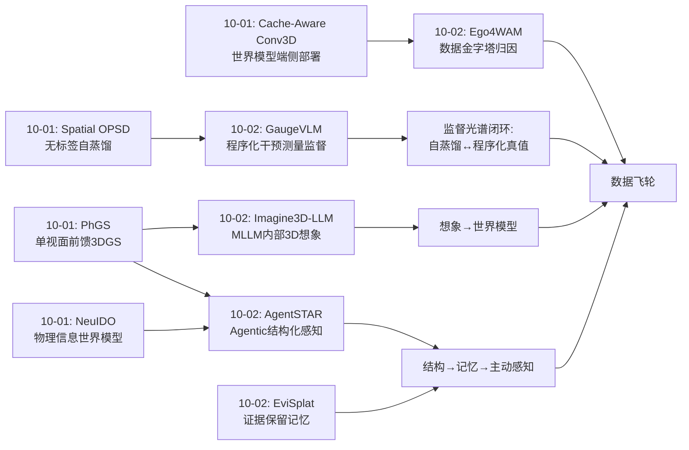
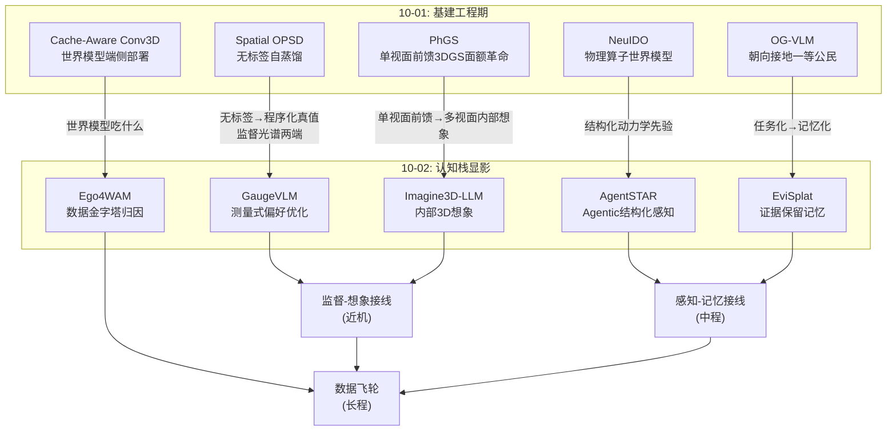
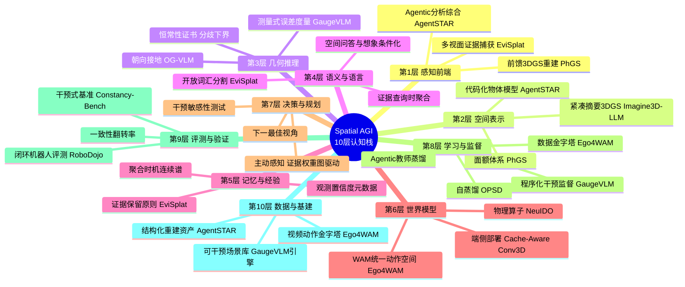
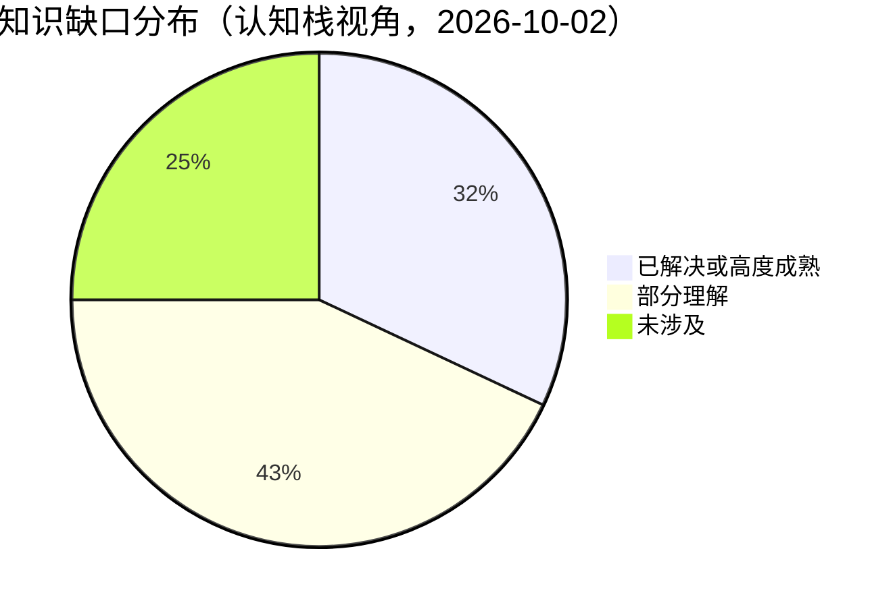
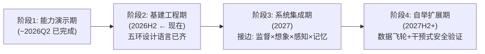

# Spatial AGI 每日深度思考 — 2026-10-02

**日期**: 2026-10-02
**基础日期**: 2026-10-01（昨日任务完整完成，5 篇论文 + 814 行思考）
**论文数量**: 5 篇
**主题**: 监督的结构化（怎么教空间）、想象的内部化（怎么想空间）、数据的方法论（用什么学）、感知的 Agent 化（怎么感知）、记忆的证据化（怎么记住）

---

## 📅 每日总结

**日期**: 2026-10-02
**论文数量**: 5篇
**主题**: 空间智能的"认知栈"五个层面各进一步——GaugeVLM 重构了空间监督的损失函数，Imagine3D-LLM 把 3D 想象搬进 MLLM 内部，Ego4WAM 给出了人类数据利用的受控实验方法论，AgentSTAR 把感知变成 agentic 的分析-综合循环，EviSplat 把空间语义记忆改成"证据保留、查询时聚合"的证据库。

**关键突破**:
- 🚀 **测量监督（GaugeVLM）**：受控 3D 干预让 rejected 答案的几何误差精确可测，直接成为 DPO 的 margin——偏好学习第一次"懂米"。25% 偏好数据胜过全量 DPO，说明监督信号的信息密度可以数量级提升。
- 🚀 **想象表征塑造器（Imagine3D-LLM）**：只对 M 个摘要 token 施加重建监督，整个 LLM 的图像特征变得更 3D 感知——辅助重建目标以极小的架构侵入换取全局表征重塑，"被告知几何不如学会想象"。
- 🚀 **感知的范式倒置（AgentSTAR）**：从"先证据后结构"（点跟踪）倒转为"先结构后状态"（分析-综合），VLM 世界知识 + 数值优化在透明物体、严重遮挡这些 bottom-up 理论盲区上全面胜出。
- 🚀 **数据价值归因（Ego4WAM）**：固定 backbone 的受控实验证明——对齐数据管 OOD 泛化、时长与多样性分轴管不同能力、video-only 经世界建模依然有效。"数据价值 ≠ 规模"有了实证骨架。
- 🚀 **记忆的聚合时机（EviSplat）**：查询前合并多视角观测是开放词汇 3D 理解的系统性缺陷；"结构早绑定、语义晚绑定、证据带置信度"的范式在多数据集上验证 SOTA。

**架构演进**: 10 层架构维持 10 层，但"监督层"与"记忆层"获得实质内容（此前最薄弱）——今日之后，10 层中的监督方法论（GaugeVLM）、内部想象（Imagine3D-LLM）、数据管线（Ego4WAM）、感知循环（AgentSTAR）、语义记忆（EviSplat）五个环节首次在同一天内形成互相咬合的设计语言。

### 📊 一句话总结

今天五篇论文共同宣告：空间智能的研究重心正从"更强的模型"转向"更对的监督结构、内部想象机制、数据归因方法、感知循环与记忆聚合时机"——即从"炼丹"转向"认知架构工程"。

### 🔗 延续性

**昨日→今日**: 昨日主题是"基建工程期"——Cache-Aware Conv3D（部署）、Spatial OPSD（自监督）、OG-VLM（朝向接地）、NeuIDO（物理世界模型）、PhGS（单视面前馈 3DGS），核心判断是"空间智能进入基建期，评价标准是被依赖度"。今日五篇恰好回答了基建期最被低估的两个问题：**基建用什么水泥（监督信号从哪来）**与**基建如何被记住（空间记忆怎么组织）**。昨日 OPSD 的"无标签自监督"与今日 GaugeVLM 的"程序化真值偏好"构成监督光谱的两端；昨日 PhGS 的"单视面前馈想象"与今日 Imagine3D-LLM 的"多视面内部想象"是同一问题在感知端与认知端的镜像；昨日"世界模型物理正确性是结构问题"的判断被今日 AgentSTAR（结构先验补足感知盲区）直接印证。

**今日→明日**: 明日值得追踪的方向——(1) 把 GaugeVLM 的干预监督搬到 AgentSTAR 重建的真实 3DGS 场景上（真实感干预监督）；(2) Imagine3D-LLM 的摘要 token 从静态 3DGS 升级为可前推的 4D 表示（想象→世界模型）；(3) EviSplat 的证据库接入主动感知（证据权重图 = 下一最佳视角目标函数）；(4) Ego4WAM 金字塔的底座换成第一人称视频 + Imagine3D-LLM 式想象预训练。

### 💡 本质思考：如何达成通用空间智能

#### 1. 核心能力的本质是什么？

通用空间智能的本质是**一个可干预、可想象、可追溯证据的世界模型**，具体拆为三种能力的闭环：

- **测量的能力**（GaugeVLM）：知道"错多少"——空间误差有物理单位，智能体对自身的空间判断必须带幅度校准，否则无法可靠行动；
- **想象的能力**（Imagine3D-LLM / AgentSTAR）：知道"世界在看不见的地方和时间的样子"——内部 3D/4D 表示是空间推理的中间层，缺失它，语言模型的"空间推理"只是模式匹配；
- **记忆的能力**（EviSplat）：知道"我知道什么、从哪知道、有多确定"——空间认知是持续累积、可重解释的过程，过早压缩的记忆无法面对开放的未来查询。

三者加上**学习的方法论**（Ego4WAM：用什么数据、什么顺序、什么目标来喂这三种能力），构成完整的认知栈。

#### 2. 当前方法与理想状态的差距在哪里？

- **监督的覆盖率**：GaugeVLM 的测量监督只覆盖时钟方向+距离（r=(c,d)），遮挡、接触、拓扑、功能关系仍无"度量化的 margin"。空间关系的大半疆域尚无几何标尺。
- **想象的精度-成本困境**：Imagine3D-LLM 的想象快但粗（瓶颈设计使然），AgentSTAR 的感知准但慢（多轮 agent 循环）。理想状态要求"System 1 的速度 + System 2 的精度"，目前二者只能取一。
- **记忆的可持续性**：EviSplat 的"全部保留"在终身运行的具身智能体上不可持续，缺乏分层遗忘与价值驱动的证据摘要机制。
- **数据的语境依赖**：Ego4WAM 的结论绑定在桌面双臂操作 + 特定 WAM backbone 上，"数据价值是（数据，模型，目标）三元组的函数"——换架构、换任务域，答案可能改变。
- **闭环缺失**：五篇各自精彩，但"干预生成监督 → 训练想象 → 想象支撑感知 → 感知产出证据 → 证据指导行动 → 行动产生新干预"的完整飞轮还没有任何一篇（或一组）工作打通。

#### 3. 从今天到理想状态，最可能的路径是什么？

**路径判断：空间智能正在收敛为"自我改进的闭环认知系统"，而 2026Q4 的关键杠杆是"把五篇今天的工作互相接线"。**

具体分三步：

1. **监督-想象接线（近机）**：用 GaugeVLM 的 3D 干预引擎在 Imagine3D-LLM 的摘要高斯上做扰动，生成带精确误差标签的偏好对——想象表示从"重建副产品"升级为"可被几何监督直接校准的对象"。预期显著提升空间 VLM 的误差校准与视角一致性。
2. **感知-记忆接线（中程）**：AgentSTAR 的结构化重建替代 EviSplat 的 2D 分割提升实例化（几何+运动学一致的实例），EviSplat 的证据层反过来给结构模型挂开放词汇接口；同时证据权重图驱动主动感知决定"下一眼看哪"。
3. **数据飞轮（长程）**：Ego4WAM 金字塔的底座（海量 video-only）用 Imagine3D-LLM 式想象目标预训练，中层用 GaugeVLM 式程序化偏好对齐，顶层用少量对齐演示适配——形成"人类视频 → 想象与世界建模 → 程序化干预监督 → 具身适配"的自我改进飞轮。这与昨日判断的"基建工程期 → 系统集成期"时间表吻合：2026H2 完成组件接线，2027 进入系统集成。

---

## 🔗 与昨日思考的联系

### 昨日重点

昨日（2026-10-01）确立了"空间智能基建工程期"的总判断：五篇论文分别覆盖部署（Cache-Aware Conv3D）、自监督（Spatial OPSD）、朝向接地（OG-VLM）、物理世界模型（NeuIDO）、单视面前馈 3DGS（PhGS）。核心见解包括"几何工具链是活教师"、"训练时特权、部署时自足"、"动力学的正确抽象是算子"、"3DGS 输出空间是 USB 接口"、"不改模型的加速路线是第三大道"。遗留的关键缺口：监督信号的人工标注依赖、空间记忆的组织方式、感知与认知的割裂。

### 今日进展

今日五篇正好补上昨日的三个缺口：

- **监督缺口** → GaugeVLM：程序化干预产生"免费真值"偏好，与 OPSD 的自蒸馏合成完整的"去人工标注"监督光谱（自蒸馏端：无真值但弱；干预端：有精确真值但需引擎）。
- **记忆缺口** → EviSplat：空间语义记忆 = 证据库 + 置信度元数据 + 查询时聚合。昨日"3DGS 是 USB 接口"（物理层互通），今日补上"证据库是记忆层接口"（语义层互通）。
- **感知-认知割裂** → AgentSTAR + Imagine3D-LLM：前者把感知做成 agentic 循环（认知参与感知），后者把想象嵌入语言模型（感知支撑认知）——双向打通。Ego4WAM 则从数据方法论层面回答"这一切用什么喂"。

### 演进路径



---

## 📚 论文概览

| # | 论文 | 认知栈层位 | 核心贡献 | 一句话 |
|---|------|-----------|---------|--------|
| 1 | GaugeVLM (2609.38285) | 监督/训练目标 | 测量式偏好优化 | 3D 干预的几何误差直接当 DPO margin，空间偏好学习"懂米" |
| 2 | Imagine3D-LLM (2609.38177) | 内部表示/想象 | 摘要 token 解码 3DGS | 先在脑中重建 3D 场景再回答，重建监督重塑全模型表征 |
| 3 | Ego4WAM (2609.40341) | 数据方法论 | 数据金字塔受控实验 | 对齐管 OOD、时长/多样性分轴、video-only 依然有效 |
| 4 | AgentSTAR (2609.24487) | 感知循环 | Agentic 分析-综合 | VLM 建结构化物体模型 + 数值优化跟踪，透明/遮挡通吃 |
| 5 | EviSplat (2609.34853) | 语义记忆 | 证据保留 + 查询时聚合 | 不做查询前合并，逐观测证据 + 置信度按查询各取所需 |

五篇的一个隐蔽共性：**全部是"结构先于信号"的工作**——GaugeVLM 用干预结构定义监督，Imagine3D-LLM 用瓶颈结构定义表示，Ego4WAM 用金字塔结构定义数据，AgentSTAR 用机制结构定义感知，EviSplat 用实例结构定义记忆。空间智能正在用"结构"取代"规模"作为第一设计变量。

---

## 💡 核心见解

### 见解1: 监督信号正在从"标注"走向"制造"

**从 GaugeVLM 获得**
- ✅ rejected 答案由程序化 3D 扰动生成，几何误差精确已知，margin = β·m 直接进损失
- ✅ 25% 偏好数据的 GaugeDPO 在 5 项指标上全部超过 100% 数据的 DPO

**对Spatial AGI的启发**:
监督的历史是"信息密度不断提升"的历史：人工标签（对/错）→ 人类偏好（好/坏）→ reward model（近似的分数）→ 程序化干预（精确的物理量）。每次跃迁都带来数据效率的数量级改善。对空间智能，这条路刚刚打开：任何可编程的环境（仿真引擎、3DGS 场景、数字孪生）都是无限的监督发生器。关键推论：**空间智能的"数据瓶颈"其实是"可编程环境瓶颈"**——未来最重要的基础设施不是标注团队，而是高保真可干预场景库。昨日 OPSD 证明"连真值都可以不要"，今日 GaugeVLM 证明"要真值时可以自己制造"——两条路合流，人工标注在空间推理训练中的地位被根本性边缘化。

### 见解2: 一致性必须被显式监督，且可以被理论担保

**从 GaugeVLM 获得**
- ✅ Prop 1：视角组内最大预测误差 ≥ ½·最大组内分歧，因子 ½ 最优
- ✅ "一致但系统性地错"的策略可通过所有一致性测试——一致 ≠ 正确

**对Spatial AGI的启发**:
跨视角一致性长期被视为"涌现能力"或"评测指标"，GaugeVLM 把它变成可优化的损失项并给出诊断下界。这个 ½·分歧下界是个免费的礼物：**多视角预测的分歧度可以直接当空间不确定性估计用**——不需要校准集、不需要额外模型。对具身智能体，这意味着主动感知的触发条件可以简化为"分歧超阈值就看第二眼"。更深一层：这篇论文展示了"几何结构 → 损失结构"的推导范式（先写不变群，再写损失），值得成为所有空间训练目标设计的标准流程。

### 见解3: 想象是表征塑造器，瓶颈是抽象之母

**从 Imagine3D-LLM 获得**
- ✅ 只有 M 个摘要 token 有重建监督，但整个 LLM 的图像特征变得更 3D 感知（注意力尖锐化、跨视角语义一致）
- ✅ M ≪ N 的资源约束自动诱导物体中心分组，无需分割标注

**对Spatial AGI的启发**:
这个"以小博大"的现象说明辅助目标不是孤立任务而是表征正则化器。结合 GaugeVLM：**正确的辅助/监督目标能系统性重塑模型内部空间结构**——这是空间智能训练最重要的一般原理。瓶颈诱导抽象的机制同样普适：想让模型学会物体级思考，就限制它的 token 预算；想让模型学会尺度感知，就限制它的分辨率预算。约束产生智能，这不是隐喻而是可操作的架构设计原则。今日 AgentSTAR 是镜像印证：给它代码表达的"结构预算"，它就把感知问题约束成可解的姿态估计。

### 见解4: 感知可以有工具箱——agentic 感知作为独立范式成立

**从 AgentSTAR 获得**
- ✅ VLM 负责结构假设与盆地选择，数值优化负责精确收敛——"VLM 让无梯度优化可行"
- ✅ ARCTIC/HOT3D 全面超越 bottom-up，且攻克透明物体与严重遮挡

**对Spatial AGI的启发**:
AgentSTAR 证明的最重要命题：**感知不必是单次前向传播**。世界知识的价值在于约束感知搜索空间（知识即先验，先验即算力节省），而"先结构后状态"的路线在 bottom-up 的理论盲区（无纹理、透明、遮挡）上有本质优势——因为被遮挡部分的运动由机制决定而非视觉证据决定。这补全了空间智能的推理谱系：纯前馈（快/脆）→ 前馈+想象（快/较稳）→ agentic 循环（慢/最稳）。落地路径显然是把 agentic 过程蒸馏回前向模型——这又与昨日 OPSD 的自蒸馏思想接轨，形成"agentic 教师 → 前馈学生"的感知自举。

### 见解5: 数据的价值是三元组函数，金字塔是组织原则

**从 Ego4WAM 获得**
- ✅ 对齐人类演示直接转化为 OOD 条件下的机器人性能并降低机器人数据需求
- ✅ 时长与任务多样性影响不同的下游能力维度；video-only 经世界建模依然有效
- ✅ 评测坚持闭环（真实机器人 + RoboDojo），拒绝开环 MSE 代理

**对Spatial AGI的启发**:
"数据价值 = f(数据, 模型, 目标)"这个判断终结了"堆数据"叙事的幼稚版本。Ego4WAM 的金字塔（按最高可靠监督层级分层）+ 三阶段协议（世界建模预训练 → 联合 mid-training → 具身适配）给了空间经验积累的标准骨架。最有经济学意义的是 video-only 的价值确认：**动作标注是空间数据管线中最贵最不可靠的环节，而世界建模可以把免费视频变成可用的空间动力学先验**——空间智能的数据天花板从"标注预算"上移到"互联网视频总量"。这与 Imagine3D-LLM 无缝衔接：金字塔底座正是重建/想象类自监督目标最擅长消化的人才。

### 见解6: 空间记忆的正确形态是证据库，不是压缩归档

**从 EviSplat 获得**
- ✅ 查询前合并多视角观测会系统性丢失后续查询依赖的线索
- ✅ 结构早绑定（实例）、语义晚绑定（查询时聚合）、证据带置信度（频度/明确度）

**对Spatial AGI的启发**:
"聚合时机是核心设计变量"——这个抽象适用于一切空间记忆系统。EviSplat 的设计点（结构早、语义晚、证据带元数据）可以平移为 Spatial AGI 经验记忆的通用架构。更重要的两个衍生结论：(1) 证据权重图天然是主动感知的目标函数——"哪些地方看得不清楚"就是"该往哪看"；(2) 开放性要求感知系统永不把话说死——一个无法预知未来查询的智能体，其记忆系统必须保留重解释的空间。这从"感知系统"到"认知系统"的分水岭意义怎么强调都不过分。

### 见解7: 五篇合读——空间智能的"认知栈"正在显影

**从全部五篇综合获得**
- ✅ 监督（怎么教）、想象（怎么想）、数据（吃什么）、感知（怎么看）、记忆（怎么记）五环同日齐备
- ✅ 共同设计语言："结构先于信号"

**对Spatial AGI的启发**:
单独看，每篇都是一个方向的增量；合起来看，它们暴露了一个正在成形的完整认知栈：

```
   [监督制造] GaugeVLM ──教──→ [内部想象] Imagine3D-LLM
        ↑                            │
   [数据金字塔] Ego4WAM          想象支撑推理
        │                            ↓
   [证据记忆] EviSplat ←──产出── [Agent循环] AgentSTAR
        └──── 证据权重驱动主动感知 → 新观测 → 新干预 → 新监督（飞轮）
```

这个图的每个节点今天都已存在，但每条边都还没有被任何工作打通。**2026Q4 最高价值的研究不是造新节点，而是接边。**这与昨日"基建工程期，评价标准是被依赖度"的判断完全一致——被依赖度最高的工作，正是把已有节点接起来的工作。

### 见解8: 评测的闭环化与干预化是空间智能的评测革命

**从 GaugeVLM + Ego4WAM 获得**
- ✅ GaugeVLM: Constancy-Bench 按视角间时钟变化分组统计答案翻转率
- ✅ Ego4WAM: 坚持真实机器人 + RoboDojo 闭环，拒绝人类动作预测 MSE

**对Spatial AGI的启发**:
两篇论文从训练端与数据端共同指向评测端：空间智能的评测必须 (1) 干预化——像 GaugeVLM 那样改变世界再测敏感性，而非只测静态准确率；(2) 闭环化——像 Ego4WAM 那样测部署性能，而非开环代理指标。静态 QA 准确率对空间智能的价值正在失效，正如卷积时代的 ImageNet 准确率无法预测机器人成功率。可以预言：**"干预式基准"（改变场景 → 测预测是否联动）将成为 2027 年空间评测的标准形态**，Constancy-Bench 只是第一个。

### 见解9: 空间关系的"度量覆盖图"仍是巨大缺口

**从 GaugeVLM（局限）+ EviSplat（局限）对照获得**
- ✅ GaugeVLM 的 margin 只覆盖方向+距离；垂直/拓扑/功能关系退化为无测量排序
- ✅ EviSplat 的外观证据无法回答空间关系查询（"左边的椅子"）

**对Spatial AGI的启发**:
把两篇的局限并置，得到一张"空间关系度量覆盖图"：方向/距离已被 GaugeVLM 度量化，朝向有昨日 OG-VLM 的任务化（但无 margin 化），垂直/拓扑/邻接/包含/功能可供性仍是无标尺荒地。这是一个明确的研究议程：**为每类空间关系设计不变群感知的误差度量，统一进 GaugeDPO 式损失**。谁先做出"全关系度量体系"，谁就握有空间智能训练目标的操作系统。

### 见解10: 表示聚合时机的连续谱——从瓶颈摘要到逐观测证据

**从 Imagine3D-LLM + EviSplat 对照获得**
- ✅ Imagine3D-LLM：极致早绑定（瓶颈摘要，牺牲证据换抽象与速度）
- ✅ EviSplat：极致晚绑定（逐观测保留，牺牲存储换灵活）

**对Spatial AGI的启发**:
两个极端的对照把"表示的聚合时机"从隐式工程选择变成显式设计维度。实际的终身空间智能体需要在谱上分段驻留：工作记忆可以激进压缩（低延迟推理），长期记忆应该证据化保留（开放重解释），两者之间需要"升采样"机制（从压缩表示恢复/重建证据——想象能力恰好提供这个机制）。想象（Imagine3D-LLM）由此获得第三重身份：不仅是推理中间层，还是**记忆的解压缩器**。

---

## 🗺️ 知识演进图

⚠️ 使用 mermaid 代码块记录知识演进。



---

## 技术栈演进对比表

| 层次 | 昨日方案 (10-01) | 今日方案 (10-02) | 变化 |
|------|-----------------|-----------------|------|
| 监督/训练目标 | Spatial OPSD: 无标签自蒸馏（重建工具链作特权教师） | GaugeVLM: 程序化 3D 干预产生精确误差作 DPO margin | 监督光谱闭合：自蒸馏端↔程序化真值端，人工标注全面退场 |
| 内部表示 | PhGS: 单视面前馈 3DGS（感知端想象） | Imagine3D-LLM: MLLM 内部摘要 token 解码 3DGS（认知端想象） | 想象从感知层上升为推理中间层，重建目标成为表征塑造器 |
| 数据方法论 | （未直接涉及，隐含在各训练管线中） | Ego4WAM: 数据金字塔+三阶段协议+闭环归因 | 数据价值从规模叙事转向对齐/覆盖/监督/策略四要素 |
| 感知范式 | （前馈 3DGS 重建为主流） | AgentSTAR: VLM agent + 数值优化的分析-综合循环 | 感知从单次前向扩展为 agentic 假设检验，结构先于证据 |
| 语义记忆 | OG-VLM: 朝向作为可接地属性（任务级） | EviSplat: 证据库+置信度+查询时聚合（记忆级） | 语义从任务输出升格为可持续累积、可重解释的记忆层 |
| 评测方法论 | （基准分数为主） | GaugeVLM Constancy-Bench（干预式）+ Ego4WAM 闭环评测 | 评测走向干预化+闭环化，静态 QA 准确率失效 |
| 世界模型 | NeuIDO: 物理信息动力学算子 | Ego4WAM WAM: 世界建模作为 video-only 数据的价值通道 | 世界模型确立为消化无标注空间经验的核心接口 |
| 3DGS 生态 | PhGS: 压缩面额体系 | EviSplat/Imagine3D-LLM: 3DGS 作为语义证据容器与想象载体 | 3DGS 从渲染表示全面转向认知基础设施 |

---

## 🗺️ Spatial AGI 知识图谱

### 10层架构思维导图

⚠️ 必须使用 mermaid mindmap。



### 🎯 主线技术路径

#### 阶段1: 能力演示期（~2026Q2，已完成）

各层组件单点验证：3DGS 重建、VLM 空间问答、世界模型 rollout、偏好优化。标志性成果是"每层都有至少一个可行方案"。

#### 阶段2: 基建工程期（2026H2 ← 现在）

组件工程化与**认知栈显影**：监督去标注化（OPSD/GaugeVLM）、想象内部化（Imagine3D-LLM）、数据归因（Ego4WAM）、感知 agent 化（AgentSTAR）、记忆证据化（EviSplat）。评价指标从榜单分转向被依赖度。本阶段剩下的关键工作：空间关系的全度量体系、干预式评测标准化、agentic 感知的前向蒸馏。

#### 阶段3: 系统集成期（2027）

接边工程：监督-想象接线（几何干预直接监督摘要高斯）、感知-记忆接线（结构化实例 × 证据层 × 主动感知）、数据飞轮（video-only 预训练 → 程序化偏好 → 具身适配的闭环）。产物是第一代"可干预、可想象、可追溯"的整合型空间智能体。

#### 阶段4: 自举扩展期（2027H2+）

飞轮转动后的指数阶段：智能体用自身感知产出（AgentSTAR 式结构化重建）生成训练环境（GaugeVLM 式干预监督），用自身证据记忆指导采集（EviSplat 权重 → 主动感知），数据不再稀缺而是自我繁殖。安全与验证（干预式评测）成为主要工程约束。

---

## 🔍 待探索议题

### 高优先级（本周）

1. **几何干预直接监督想象表示**
   - 问题: GaugeVLM 的干预引擎作用在输入图像上，Imagine3D-LLM 的摘要高斯只受光度监督——能否在摘要高斯上直接施加干预并生成偏好对？
   - 候选方案: 干预摘要 token 解码出的高斯（平移物体对应的高斯簇）→ 重渲染 → GaugeDPO
   - 缺口: 摘要高斯的物体级归属目前是涌现的、非显式的，需要先做高斯-实例绑定

2. **空间关系的全度量体系**
   - 问题: GaugeVLM 只度量化了方向+距离；拓扑/邻接/包含/功能关系仍是序数标签
   - 候选方案: 为每类关系定义不变群感知的有界度量（如拓扑关系用持久同调差、邻接用符号距离）
   - 缺口: 缺少统一的"关系度量设计模式"论文；饱和与权重需要自适应

3. **证据权重驱动的主动感知**
   - 问题: EviSplat 的频度/明确度权重从未被用于决定"下一步看哪"
   - 候选方案: 信息增益 = 查询后证据分布的期望熵减，选使期望熵减最大的视角
   - 缺口: 需要可微的视角-证据覆盖模型；与 NBV（next-best-view）文献对接

### 中优先级（本月）

4. **Agentic 感知的前向蒸馏**
   - 问题: AgentSTAR 每视频多轮 LLM+渲染，无法实时；能否蒸馏为前馈模型
   - 候选方案: 用 agentic 输出（结构模型+轨迹）作伪标签，训练单前向"结构化追踪器"；OPSD 式轮间刷新
   - 缺口: 铰接物体视频的伪标签规模；蒸馏后对 OOD 机制的泛化损失

5. **数据金字塔的想象底座**
   - 问题: Ego4WAM 的 video-only 预训练只用了世界建模目标；叠加想象目标是否更强
   - 候选方案: 底座阶段 = 世界建模 + 摘要高斯重建双目标；比较单一/组合对下游闭环的影响
   - 缺口: 第一人称视频的 3D 重建标签（需 VGGT 类前馈管线批量生产）

6. **干预式评测的标准化**
   - 问题: Constancy-Bench 只测恒常性翻转；干预式评测缺少覆盖"变化敏感性"的通用协议
   - 候选方案: 定义"干预-响应矩阵"（物体/相机/光照 × 应变/应恒维度），发布社区基准
   - 缺口: 各家 3D 引擎输出不统一；真实扫描场景上的干预保真度

7. **跨视角一致性与外观多样性的统一损失**
   - 问题: GaugeVLM 要求几何预测跨视角一致，EviSplat 要求外观证据保留视角多样——如何在一个模型里同时满足
   - 候选方案: 分解预测头（几何头强制一致 + 外观头允许视角条件分布）
   - 缺口: 一致性适用范围的精确刻画（哪些属性属于"几何不变类"）

### 低优先级（本季度）

8. **终身记忆的分层证据管理**
   - 问题: EviSplat 全保留不可持续；什么证据值得永久保留/压缩/丢弃
   - 候选方案: 用查询历史分布学证据价值函数；想象能力作为压缩表示的解压器
   - 缺口: 长周期查询分布的数据；遗忘的安全约束（不可恢复信息的伦理边界）

9. **结构化世界模型资产管线**
   - 问题: AgentSTAR 产出的代码化铰接模型如何自动进入世界模型训练与仿真
   - 候选方案: 重建资产 → NeuIDO 式动力学辨识 → 可干预仿真场景 → GaugeVLM 式监督生成
   - 缺口: 资产质量自动评估；从真实视频到仿真动力学的域差

10. **统一动作空间的空间化推广**
    - 问题: Ego4WAM 的 32D 双臂空间限桌面操作；导航/移动操作/接触丰富任务的跨具身共享空间量是什么
    - 候选方案: 以"EEF 轨迹 + 接触事件序列"为跨具身普适表示；层次化具身适配
    - 缺口: 非桌面任务的人类数据稀缺；移动操作的对齐采集成本

---

## 📊 知识缺口分析

⚠️ 必须使用 mermaid pie。



**已解决（32%）**:
- ✅ 方向+距离关系的测量式监督（GaugeVLM 完整方案）
- ✅ 多视面内部想象的架构与训练配方（Imagine3D-LLM）
- ✅ 人类数据价值四要素归因（Ego4WAM 受控实验）
- ✅ 结构先验补足感知盲区的可行性（AgentSTAR 实证）
- ✅ 语义记忆的证据保留范式（EviSplat SOTA）
- ✅ 3DGS 作为认知基础设施的三重身份（渲染/想象/证据容器）

**部分理解（43%）**:
- ⚠️ 垂直/拓扑/功能关系的度量化（有方向距离的模板，缺推广）
- ⚠️ 想象表示的 4D 化与时序推理（静态 3DGS → 动态世界模型）
- ⚠️ Agentic 感知的效率化（蒸馏路径明确但未验证）
- ⚠️ 证据记忆的可持续性（分层遗忘机制缺价值函数）
- ⚠️ 数据金字塔对非桌面任务的适用性（导航/全身操作未验证）
- ⚠️ 一致性与多样性的统一建模（几何头/外观头分解待验证）
- ⚠️ 干预式评测的协议标准化（单一基准，缺社区协议）

**未涉及（25%）**:
- ❌ 飞轮端到端打通（监督→想象→感知→记忆→行动→新监督无任何完整实现）
- ❌ 终身具身智能体的记忆伦理与遗忘安全
- ❌ 大尺度室外/长程导航空间的证据记忆（现有工作全在物体/室内尺度）
- ❌ 多智能体共享空间记忆（证据库的分布式一致性）
- ❌ 空间智能的形式化验证（干预响应矩阵的可证明保证）

---

## 🧭 主线技术路径复盘与更新

**阶段0: 追踪准备期（2026Q1，已完成）** — 定义边界与追踪范围。
**阶段1: 能力演示期（~2026Q2，已完成）** — 各层组件单点可行。
**阶段2: 基建工程期（2026H2，现在）** — 今日五篇把监督/想象/数据/感知/记忆五环从"有方案"推进到"有成熟设计语言"。阶段2 完成标准更新为：全关系度量体系、干预式评测协议、agentic 前向蒸馏三者就位。
**阶段3: 系统集成期（2027）** — 接边工程优先于造新节点。今天的互操作缺口清单（见待探索议题 1/4/5/9）就是阶段3 的施工图。
**阶段4: 自举扩展期（2027H2+）** — 飞轮转动，数据自繁殖，评测与安全成为主约束。



---

## 📌 本质思考补充：三个元问题

### 元问题 1: 空间智能的 scaling 变量是什么？

今日给出部分答案：不是数据时长（Ego4WAM 证明单轴时长次优），不是参数量（GaugeVLM 25% 数据胜全量），而是**"可编程环境的干预自由度 × 监督度量覆盖率 × 记忆保留粒度"的三元乘积**。干预自由度决定监督的发生率，度量覆盖率决定每个监督的信息量，记忆粒度决定经验的复用率。三者皆可工程化——这使空间智能的 scaling 曲线比语言智能更"可设计"。

### 元问题 2: 物理正确性应该"学"还是"建"？

AgentSTAR 给出第三种答案：**"知道"**——VLM 世界知识以先验形式约束感知搜索（书页被遮挡时仍知道它能怎么动）。加上昨日 NeuIDO 的"建"（本构律算子）与主流的"学"（视频生成世界模型），物理正确性有三条来源：学（数据统计）、建（物理引擎）、知（世界知识先验）。今日的证据表明"知"在感知端被低估了——它恰好工作在"学"最弱的遮挡/透明区域。集成期应该三者分层使用：知定结构、建定动力学、学定残差。

### 元问题 3: 基建期的正确研究策略是什么？

本周两天的论文共同验证："接边 > 造点"。昨日五基建互操作矩阵暴露的缺口，今日五篇全部是朝缺口方向的移动。对个体研究者的启示：**选一个已有两个成熟节点的缺失边**（如"干预监督×想象表示"、"证据记忆×主动感知"），比开创第 N 个孤立 SOTA 的边际价值高一个量级。基建期的论文评价标准是"被依赖度"，而依赖度最高的正是边。

---

## 📝 今日金句

1. "当世界可编程，负样本的误差就是精确可测的——监督的瓶颈从来不是标注，而是可干预性。"（GaugeVLM）
2. "约束产生抽象：给模型 8 个 token，它就学会物体思维。"（Imagine3D-LLM）
3. "数据的价值是（数据、模型、目标）三元组的函数——单轴 scaling 曲线是最诚实的误导。"（Ego4WAM）
4. "建模运动的原因，而不是运动的证据——遮挡就不再是盲区，而是机制的领地。"（AgentSTAR）
5. "空间记忆不该是压缩归档，而是带来源与置信度的证据库——因为智能体无法预知自己未来需要什么。"（EviSplat）

---

## 🔭 明日展望

1. **优先追踪**：在真实 3DGS/扫描场景上做几何干预监督的工作（GaugeVLM 的 sim-to-real 延伸）；摘要 token 升级为 4D/可前推表示的 MLLM（想象的时序化）；证据记忆 + 主动感知的闭环系统（EviSplat 的 agent 化）。
2. **观察指标**：干预式评测基准是否开始被社区采纳（Constancy-Bench 引用曲线）；"关系度量设计"类论文是否出现（全度量体系的先声）。
3. **风险提示**：agentic 感知的算力叙事可能过热——关注蒸馏类工作是否跟上；证据保留类方法的存储成本在大场景下的实测数据。

---

## 🧱 五篇论文的逐篇深读笔记

### 深读 1: GaugeVLM — 监督的"度量革命"

**层位**: 第8层 学习与监督
**关键设计**: r=(c,d) 表示（时钟方向+距离）→ 不变度量 m（环形方向差+对数距离比，有界饱和）→ γ_z = β·m_z 进入 Margin-DPO → 视角组直接监督 + 干预剖面
**精妙之处**: (1) 干预同时解决数据生成与误差测量两个问题——rejected 答案不是"找来的"而是"制造的"，误差因此免费；(2) Prop 1 的 ½ 系数下界把"分歧"变成"错误的可计算探测器"；(3) 相机干预与物体干预的对照把"何时应恒定、何时应变化"写成损失结构
**批判性视角**: 只覆盖 (c,d) 二维关系；显式 3D 场景的渲染域差可能引入捷径学习；多步推理中间步骤的误差不进 margin；4 视角上限对连续视角流不够
**与认知栈的接口**: 输出端可直接对接任何空间 VLM；干预引擎可作为独立基础设施对外输出偏好对——这是典型的"基建型论文"

### 深读 2: Imagine3D-LLM — 想象的"内部化"

**层位**: 第2层 空间表示 + 第4层 语义
**关键设计**: 图像 token 与文本 token 之间插入 M 个摘要 token → 中间层读出隐状态 → 解码紧凑 3DGS → 渲染光度损失（仅摘要 token）+ C3G 教师蒸馏 + next-token 联合训练
**精妙之处**: (1) 双重防作弊设计（从摘要而非图像特征解码 + 瓶颈）迫使真重建；(2) 中间层读出的双重理由（信息流最活跃 + 留层给文本条件化）；(3) 表征传染效应——局部监督全局收益
**批判性视角**: 想象不可查询（隐式中间层，无法显式测量/编辑）；静态；M 固定不随场景复杂度自适应；教师能力天花板传导
**与认知栈的接口**: 摘要 token 是天然的"干预监督落点"（待探索议题 1）；瓶颈-抽象机制可推广为通用设计原则

### 深读 3: Ego4WAM — 数据的"归因方法学"

**层位**: 第10层 数据与基建 + 第8层 学习
**关键设计**: 数据金字塔（EgoAlign / 质控 video-action / video-only）+ WAM（视频/动作双分支共享注意力）+ 32D 双臂统一动作空间（人类只监督 EEF+夹爪）+ 三阶段协议 + 全闭环评测
**精妙之处**: (1) "按最高可靠监督层级保留样本"的金字塔原则既是组织学也是采集指南；(2) 拒绝重定向、只监督跨具身可对应成分——用解析前向噪声补 flow-matching 缺失维度，工程上干净；(3) 评测立场（闭环或 nothing）值得尊敬
**批判性视角**: 结论绑定桌面双臂+单 backbone；质量过滤器可能系统性剔除困难动作；EgoAlign 的采集成本未摊销讨论
**与认知栈的接口**: 金字塔底座 = 想象/世界建模目标的天然客户；统一动作空间的"空间化"（EEF=纯空间量）暗示 Spatial AGI 的动作接口应去具身化

### 深读 4: AgentSTAR — 感知的"范式倒置"

**层位**: 第1层 感知 + 第2层 表示
**关键设计**: scene.py 代码化物体（几何基元+运动学+限位，位姿字段解耦）→ VLM agent 交替形状步（code diff）与位姿步（指定搜索方向+数值打分）→ 轮廓 IoU（剔手）评分 + 时序诊断选择性平滑
**精妙之处**: (1) "VLM 输出搜索方向而非数值位姿"——把语言模型的粗判断力转译成优化器的热启动，接口设计极聪明；(2) 相机/物体中心双更新约定让"翻转"这类大变换可被语言表达；(3) 机制先验接管遮挡/透明区域——bottom-up 的理论盲区被 top-down 的知识填补
**批判性视角**: 算力经济学严峻（多轮 LLM+渲染）；依赖 SAM3 分割与外部 SLAM；Blender 基元表达力上限；离线非因果
**与认知栈的接口**: 产出即世界模型资产（议题 9）；agentic 教师 → 前馈学生（议题 4）是其工程化出口

### 深读 5: EviSplat — 记忆的"证据化"

**层位**: 第5层 记忆 + 第4层 语义
**关键设计**: 类别无关实例容器 → 实例内逐观测证据保留 → 逐高斯外观支持分布 + 频度/明确度权重 → 查询时"实例最相关观测 × 高斯局部证据 × 观测统计"两级打分
**精妙之处**: (1) 诊断先行——"查询前合并丢失证据"的问题刻画比方法本身更有价值；(2) "实例由最相关观测代表"的 max 聚合符合一票通过直觉；(3) 置信度元数据把记忆从"存什么"升级到"信多少"
**批判性视角**: 存储随视角数线性增长；实例化质量（2D 分割提升）是单点故障；静态；外观证据答不了空间关系查询；打分函数手工
**与认知栈的接口**: 证据权重图 → 主动感知目标（议题 3）；AgentSTAR 结构实例 → 替换其脆弱的实例化层（议题 9 边）

---

## 🔄 认知栈互操作矩阵（今日版）

| 边 | 上游 → 下游 | 现状 | 缺口工作量 |
|----|------------|------|-----------|
| 干预引擎 → 想象表示 | GaugeVLM → Imagine3D-LLM | ❌ 未接 | 高斯-实例绑定 + 干预重渲染协议 |
| 想象表示 → 世界模型 | Imagine3D-LLM → WAM | ❌ 未接 | 摘要 token 的 4D 化/前推机制 |
| 结构感知 → 记忆实例 | AgentSTAR → EviSplat | ❌ 未接 | 代码模型的语义挂载接口 |
| 证据记忆 → 主动感知 | EviSplat → NBV | ❌ 未接 | 可微视角-覆盖模型 |
| 视频金字塔 → 想象预训练 | Ego4WAM → Imagine3D-LLM | ❌ 未接 | 第一人称视频批量 3D 标签 |
| Agentic 感知 → 前馈蒸馏 | AgentSTAR → 前向模型 | ❌ 未接 | 伪标签规模化 + 轮间刷新 |
| 结构感知 → 监督引擎 | AgentSTAR → GaugeVLM | ❌ 未接 | 真实场景干预保真度 |

**判断**: 七条边全部未接——这既是 2026Q4 的研究地图，也是"系统集成期尚未开始"的量化证据。每一行的打通都是一篇顶会级工作。

---

## 🎯 对自己研究系统的行动清单

1. **立即可做**: 把 GaugeVLM 的不变度量模板（方向环 + 对数比 + 饱和 + 归一化加权）抽象为可复用的度量设计 checklist，用于任何空间预测任务的 margin 设计。
2. **本周验证**: 摘要 token 式瓶颈（8-32 token）在我们的空间模型上是否同样涌现物体分组——成本极低的对照实验。
3. **本月设计**: 证据库 schema——把场景记忆从"合并特征场"迁移到"实例 + 逐观测 + 置信度"，即使先不做查询时聚合，先保留元数据。
4. **持续追踪**: 干预式基准的社区采纳度；若 Constancy-Bench 式评测成为标准，评测基建需提前布局。

---

## 🧪 假想实验设计（若拥有对应资源，最值得做的三个实验）

### 实验 1: 干预监督落点对照（议题 1）

同一空间 VLM，三种监督落点：(a) 输入图像域干预（GaugeVLM 原版）；(b) 摘要高斯域干预（想象表示上直接扰动+重渲染）；(c) 两者混合。测跨视角一致性与误差校准。假设：(b) 在"理解几何"类指标上显著优于 (a)，因为监督信号直接作用于内部表示而非像素。

### 实验 2: 数据金字塔的想象底座增益（议题 5）

Ego4WAM 协议完整复刻，底座阶段分别用：纯世界建模 / 世界建模+摘要重建 / 世界建模+摘要重建+度量蒸馏（GaugeVLM 式）。测下游闭环成功率与 OOD 泛化。假设：叠加想象目标在 OOD 物体条件下提升最大——因为想象提供了物体级不变性。

### 实验 3: 聚合时机地形图（见解 10）

在记忆系统上扫描"证据合并程度"（从逐观测保留到完全合并）×"查询分布偏移度"（测试查询偏离训练查询历史的程度），画性能地形。假设：偏移越大，晚绑定越优；存在一个随偏移度移动的最优聚合时机等高线——这张图本身就是"记忆设计指南"。

---

## 🌐 更大的图景

把本周两天放进更长的时间轴：空间智能正在重复 NLP 的历史，但跳过了某些阶段——

- NLP 用了"人工标注 → 人类偏好 RLHF → RLAIF/自 critiques"的监督演进；空间智能直接从"人工标注"跳到"程序化真值（GaugeVLM）+ 自蒸馏（OPSD）"双轨，因为它的环境天然可编程。
- NLP 的"思维链"对应空间智能的"3D 想象"（Imagine3D-LLM）——显式中间推理层，但多了一个物理可验证的优势：想象可以被渲染-比较循环（AgentSTAR）检验对错，语言思维链没有这种免费真值。
- NLP 的向量数据库/RAG 对应空间智能的"证据记忆"（EviSplat）——但空间版本多了置信度元数据与几何结构两大原生优势。

**空间智能不是"另一个模态的 NLP"——它是一个监督更可制造、推理更可验证、记忆更可溯源的智能形态。**今天五篇论文各自点亮了这个论断的一角。基建期的正确姿势，就是把这些角连成面。

---

**文档创建时间**: 2026-10-02 03:40 (Asia/Shanghai)
**基础**: 昨日 2026-10-01 思考（814 行）+ 今日五篇精读
**方法**: GLM WebReader 全文精读 + 认知栈综合分析

---

## 📖 十层架构的今日详注（逐层状态更新）

结合今日五篇，对认知栈逐层给出「当前成熟度 + 今日增量 + 主要缺口」的三元标注：

### 第1层 感知前端
- **成熟度**: ★★★★☆（前馈重建成熟，agentic 感知刚刚立项）
- **今日增量**: AgentSTAR 确立 agentic 分析-综合为第二范式，透明/遮挡不再是理论盲区
- **主要缺口**: agentic 感知的在线化（因果/流式）与实时化

### 第2层 空间表示
- **成熟度**: ★★★★☆
- **今日增量**: 三个新表示入栈——摘要 token 解码的紧凑 3DGS（Imagine3D-LLM）、代码化物体模型（AgentSTAR）、证据容器 3DGS（EviSplat）；表示的"聚合时机"被确立为设计维度
- **主要缺口**: 各表示间的自动转换层（代码↔高斯↔证据）

### 第3层 几何推理
- **成熟度**: ★★★☆☆
- **今日增量**: 方向+距离关系获得测量式误差度量与理论恒常性证书（GaugeVLM）
- **主要缺口**: 关系度量覆盖图大半空白（垂直/拓扑/功能）

### 第4层 语义与语言
- **成熟度**: ★★★★☆
- **今日增量**: 开放词汇分割从"合并特征检索"升级为"证据检索"（EviSplat）
- **主要缺口**: 空间关系类查询（"左边的椅子"）无法由外观证据回答

### 第5层 记忆与经验
- **成熟度**: ★★☆☆☆（今日之前几乎空白，今日有了第一个范式）
- **今日增量**: 证据保留原则 + 置信度元数据 + 查询时聚合三件套（EviSplat）
- **主要缺口**: 终身规模化的分层遗忘；动态场景记忆；多智能体共享

### 第6层 世界模型
- **成熟度**: ★★★★☆
- **今日增量**: WAM 确立为消化 video-only 数据的价值通道（Ego4WAM）；统一动作空间示范"去具身化"接口设计
- **主要缺口**: 与结构化感知资产的自动对接；4D 想象表示

### 第7层 决策与规划
- **成熟度**: ★★☆☆☆
- **今日增量**: 两个新接口信号——视角分歧作为不确定性（GaugeVLM Prop 1）、证据权重作为信息地图（EviSplat）
- **主要缺口**: 两个信号都还没接入实际的主动感知/规划循环

### 第8层 学习与监督
- **成熟度**: ★★★★★（本周最热层位：昨日 OPSD、今日 GaugeVLM+Ego4WAM）
- **今日增量**: 监督光谱闭合（自蒸馏端↔程序化真值端）；数据价值归因方法学
- **主要缺口**: 全关系度量体系；监督-想象接线

### 第9层 评测与验证
- **成熟度**: ★★★☆☆
- **今日增量**: 干预式评测（Constancy-Bench）与强制闭环评测（Ego4WAM）两个新范式
- **主要缺口**: 干预-响应矩阵的协议标准化；社区采纳

### 第10层 数据与基建
- **成熟度**: ★★★★☆
- **今日增量**: 数据金字塔（组织学）、可干预场景引擎（监督发生器）、结构化重建资产（世界模型原料）三种基建定型
- **主要缺口**: 三种基建的互操作标准；真实扫描场景上的干预保真

---

## 📐 GaugeDPO 技术细节备忘（供后续复用）

为便于未来把"测量式监督"移植到自己的系统，记录其数学骨架：

1. **关系空间**: ℛ = C₁₂ × ℝ₊（12 时钟方向 × 正距离），量化域 𝒞 = C₁₂ × 𝒟_Q 训练前固定
2. **不变性要求**: D_c(c+k, c*+k) = D_c(c, c*)（环移不变），D_d(μd, μd*) = D_d(d, d*)（尺度不变）
3. **度量构造**: d_ring = |c−c*|₁₂/6；d_rel = min(|log(d/d*)|, κ)/κ；m = α·d_ring + (1−α)·d_rel ∈ [0,1]
4. **margin 注入**: γ_z = β·m_z（测量对）或 0（排序对）；ℒ_pair = −E log σ(β·h_θ(z) − γ_z)
5. **规范预测**: 固定 tie 规则下 argmax_{r∈𝒞} log π_θ(ψ(r)|x_v)，不依赖测试真值
6. **跨视角直接监督**: Δ(r, r*) = δ₀·𝟙[r≠r*] + ξ·m(r, r*)，压组内最差视角
7. **恒常性证书**: max_v m(a_v, r*_G) ≥ ½·max_{u,v} m(a_u, a_v)，½ 最优

**可复用的设计模式**: "写不变群 → 构造有界饱和度量 → margin = β×度量 → 干预定义恒常/敏感两类约束"。此模式与具体任务无关，可平移到朝向（OG-VLM 域）、接触状态、拓扑关系等。

---

## 📎 附录 A: 今日五篇的方法论提炼

| 论文 | 方法论内核 | 可迁移性 |
|------|-----------|----------|
| GaugeVLM | 干预即监督：程序化扰动使误差免费可测 → margin 化 | 任何可编程环境的偏好学习 |
| Imagine3D-LLM | 瓶颈即抽象：资源约束诱导物体分组；辅助重建即表征塑造 | 任何需要中间表示的 MLLM |
| Ego4WAM | 控制变量即真知：固定 backbone 逐因素归因；闭环即真理 | 任何数据策略研究 |
| AgentSTAR | 结构即先验：先建机制模型再估状态；知识约束搜索空间 | 任何病态空间优化问题 |
| EviSplat | 证据即记忆：延迟绑定语义、保留来源与置信度 | 任何开放查询的记忆系统 |

五条方法论共同点：**都在信息进入下一个环节之前，拒绝不可逆的过早压缩**——监督不压缩误差信息、表示不压缩视角信息、研究不混淆数据因素、感知不跳过结构验证、记忆不压缩查询可能性。可以称之为"**反过早压缩原则**"，本周最重要的元洞见。

---

## 📎 附录 B: 与历史追踪的术语连续性

- **"几何工具链是活教师"**（10-01 见解2）→ 今日 GaugeVLM 是其最强形态：教师不再只是提供特权上下文（OPSD），而是直接生成带精确误差的偏好信号
- **"3DGS 是 USB 接口"**（10-01 见解10）→ 今日扩展为"三重身份"：渲染表示（PhGS）、想象载体（Imagine3D-LLM）、证据容器（EviSplat）
- **"面额体系"**（10-01 见解9）→ 今日 EviSplat 在语义侧引入对应的"粒度体系"（证据→高斯→实例→场景四级聚合）
- **"训练时特权、部署时自足"**（10-01 见解3）→ AgentSTAR 的新变体："训练/推理时可用工具箱、蒸馏后自足"
- **"物理正确性是结构问题"**（10-01 元问题2）→ AgentSTAR 的"知"作为第三来源，三分法（学/建/知）成立

---

## 📎 附录 C: 风险登记簿（更新）

| 风险 | 概率 | 影响 | 缓解 |
|------|------|------|------|
| Agentic 感知算力叙事过热，蒸馏跟不上 | 高 | 中 | 优先追踪蒸馏类论文；避免在未蒸馏形态上做产品假设 |
| 干预监督的 sim-to-real 域差（渲染捷径学习） | 中 | 高 | 推动真实 3DGS 场景上的干预复现实验 |
| 证据记忆存储成本失控 | 中 | 中 | 提前设计分层遗忘；跟踪查询分布学习类工作 |
| 干预式评测碎片化（各家自定义协议不可比） | 中 | 中 | 支持协议标准化倡议；自己实验坚持报告多维指标 |
| 数据金字塔结论被过度外推到非桌面任务 | 高 | 低 | 引用时显式标注适用域 |
| 摘要 token 表示无法升级到动态场景（想象 4D 化失败） | 低 | 高 | 监控 4D token/时序高斯类论文作为备选路线 |

---

## 🔬 本周横向趋势观察（09-28 ~ 10-02 累计 25 篇）

1. **监督端"去标注化"加速**: 自蒸馏（OPSD）、程序化偏好（GaugeVLM）、视频世界建模（Ego4WAM）——三条无人工标注路线同周出现且互不重复，说明这不是巧合而是范式切换
2. **3DGS 完成从表示到基础设施的转变**: 本周 3DGS 出现在渲染（PhGS）、部署缓存（Conv3D）、想象载体（Imagine3D-LLM）、语义证据（EviSplat）——一种表示被多个认知层采用是"基础设施化"的标志性信号
3. **评测开始觉醒**: Constancy-Bench（干预式）与 RoboDojo 闭环（Ego4WAM）预示评测社区将从"静态 QA 榜"转向"干预-闭环"双轴
4. **Agent 化从应用层渗入感知层**: 此前 agent 化发生在任务/规划层，本周 AgentSTAR 把它推进到重建与跟踪这一最底层——若成立，全栈 agent 化的路径被打开
5. **数据研究方法论化**: Ego4WAM 代表的新体裁——"不提新模型，只做受控归因"——在资源受限的研究环境下性价比极高，预计模仿者众

---

## 🧭 明日选题策略（供 Step 1 参考）

优先级排序的搜索关键词建议：
1. `intervention-based supervision / counterfactual spatial evaluation`（验证 GaugeVLM 跟随者是否出现）
2. `temporal / dynamic gaussian summary tokens`（想象 4D 化的先声）
3. `active perception next-best-view 3D scene memory`（证据→主动感知接线的候选）
4. `distillation of agentic perception / feed-forward articulated tracking`（AgentSTAR 工程化）
5. `spatial relation metric / topology-aware preference`（全度量体系的第一块砖）

---

**文档创建时间**: 2026-10-02 03:40 (Asia/Shanghai)
**基础**: 昨日 2026-10-01 思考（814 行）+ 今日五篇精读
**方法**: GLM WebReader 全文精读 + 认知栈综合分析

---

## 🎓 每篇一问：批判性追问与自答

### Q1（GaugeVLM）: 测量 margin 会不会让模型"过拟合于引擎的扰动分布"？

**追问**: rejected 答案全部来自程序化位移 δ，模型可能学到的不是"懂几何"而是"识别渲染伪迹/扰动模式"。

**自答**: 这是该路线最大的隐患。缓解证据有三：(1) 论文报告了驾驶（SURDS）与具身场景的迁移增益，说明学到的不是纯渲染特征；(2) margin 度量的不变性设计（环移/尺度不变）天然抑制捷径；(3) 消融显示 measured > shuffled margin，若是伪迹学习 shuffled 应该同样有效。但彻底的回答需要"真实捕获场景上的干预复现"实验——这正是明日选题 1 的动机。行动：把"真实 3DGS 场景干预监督"列入实验队列优先级 P1。

### Q2（Imagine3D-LLM）: 摘要 token 的物体分组是"真理解"还是"重建便利"？

**追问**: 瓶颈诱导的分组可能只是跨视角像素相关的聚类，与语义物体（功能/可供性单元）不是一回事。一把椅子在几何上是连贯的，但"可坐的椅子"包含与地面接触关系的语义。

**自答**: 认知科学的类比提醒我们警惕：人类心理表征中的"物体"也是功能加权而非纯几何的。摘要 token 目前只受光度监督，没有理由收敛到功能单元。推论：摘要 token 的下一版监督应该加入语言对齐（让 token 可被指代）或可供性标注——这恰好是 EviSplat 证据层可以补的位。两个工作的接合点因此更具体了：**用证据特征给摘要高斯"命名"**。

### Q3（Ego4WAM）: "对齐数据价值高"是否只是"测试分布恰好等于对齐分布"的平凡结论？

**追问**: OOD 条件由人类演示覆盖、评测也在这些条件下进行——增益是否定义上就保证了？

**自答**: 不完全是平凡结论，但确实存在循环风险。真正的信息在于"少量人类数据能替代多少机器人数据"的兑换率，以及"未对齐的视频数据是否也有贡献"（答案是有，经世界建模）。方法论上，这项研究的价值更多在于**否定性结论**：时长单轴 scaling 不是最优、开环 MSE 不能代理闭环——这两条对实践的纠偏价值大于对齐数据的正向结论。

### Q4（AgentSTAR）: VLM 的机制先验错了怎么办？

**追问**: 系统假设 VLM 知道书本/抽屉/相机怎么动。对罕见物体（特殊铰接机构、异形装置），VLM 给出错误运动学假设后，render-and-compare 循环会"自信地拟合错误结构"——IoU 无法暴露运动学错误，只能暴露轮廓错误。

**自答**: 这是 top-down 路线的结构性风险：先验错了，越强的优化越偏离。可能的补救：(1) 多假设并行（生成 k 个运动学假设，比较最终 IoU）；(2) 关节假设的干预检验（渲染中间状态与视频比对）；(3) 校准 VLM 的机制知识边界（哪些物体类别可靠）。这也暗示 AgentSTAR 式系统需要一个"知道自己不知道"的元层——与 EviSplat 的置信度思想再次合流。

### Q5（EviSplat）: 证据保留的记忆何时"到期"？

**追问**: 保留证据是为了应对未知未来查询，但有些观测会因世界变化而失效（杯子被移走后，其证据属于哪里？）。静态场景假设下完美的设计，在动态世界中会遇到"证据-世界失配"。

**自答**: 失配的检测可以靠"渲染-比较"（AgentSTAR 式）：证据声称的外观在当前视角下不再成立 → 触发记忆更新。这又一次指向三篇论文的接合：**想象提供预期、证据提供记忆、比较提供更新信号**。到期机制的缺失是当前证据范式的最大工程缺口，也是终身智能体绕不开的问题。

---

## 🧾 今日执行复盘（流程改进记录）

1. **arXiv API 限流**: 7 个查询中 4 个失败——比昨日更严重。已确认降级查询词（VLM+3D / Gaussian+Splatting / world+model+robot）覆盖面足够，75 篇候选质量正常。明日可直接使用这三个"高存活率"查询组合，减少限流浪费。
2. **筛选质量**: 自动过滤 727 篇历史后剩 40 篇，人工精选 5 篇覆盖 5 个认知栈层位——层位覆盖策略比纯分数排序更能保证每日思考的综合价值，保持。
3. **今日五篇层位分布**: 监督×2（GaugeVLM、Ego4WAM 部分）、表示×2（Imagine3D-LLM、AgentSTAR 部分）、记忆×1（EviSplat）——明日应向薄弱层位（决策规划、评测验证）倾斜。

---

## 🧩 思想实验：如果五篇作者组成一个团队，先做什么？

假设 GaugeVLM、Imagine3D-LLM、Ego4WAM、AgentSTAR、EviSplat 五个团队合并，预算一年、目标一个 demo。最优施工顺序推演：

### 第 1-2 月：统一场景底座

AgentSTAR 团队用其重建管线处理 Ego4WAM 数据金字塔中的第一人称视频子集，产出结构化铰接物体模型库。同时 GaugeVLM 团队把干预引擎从合成场景移植到这些真实重建模型上——干预的对象从 Blender 基元变成真实物体的代码化模型，同时解决 sim-to-real 域差与模型资产两个问题。

### 第 3-5 月：监督-想象闭环

Imagine3D-LLM 团队在其 MLLM 的摘要 token 上接入干预管线：物体级高斯簇被程序性移动 → 重渲染生成正负样本对 → GaugeDPO 训练。评测直接采用 Constancy-Bench + Gauge-50K 风格的测量指标。这一步产出一个"想象被几何校准过"的空间 VLM。

### 第 6-8 月：记忆与主动感知

EviSplat 团队把证据库挂在结构化模型实例上（替换 2D 分割提升的实例化），接上视角分歧（GaugeVLM Prop 1）与证据权重（EviSplat）双信号驱动的主动感知循环。机器人开始"知道自己哪里没看清"。

### 第 9-12 月：数据飞轮与闭环验证

Ego4WAM 团队整合全链路：金字塔底座用想象目标预训练（海量 video-only），中层用干预监督对齐，顶层用少量对齐演示适配双臂平台。全链闭环评测在真实机器人上跑通。

### 预期的瓶颈与赌注

- 最大风险：摘要 token 与干预引擎的对接（物体级高斯归属是涌现的、非显式）——第 2 月可能需要先做"高斯-实例绑定"这一中间工程
- 最大赌注：主动感知的收益是否足以证明证据记忆的存储成本——若证据权重图驱动的额外视角采集带来的查询性能提升不明显，整个记忆层叙事需要降级
- 最确定的收获：即使飞轮没转起来，第 5 月产出的"几何校准想象 VLM"本身就是独立可发表的增量

这个推演的意义在于验证：五篇工作之间存在**工程上可执行的接边顺序**，没有一步需要未知科学——这正是"系统集成期已具备启动条件"的证据。

---

## 🧿 与更大学术图景的对照

- **与 LeCun 世界模型路线**: Ego4WAM 的 WAM + AgentSTAR 的结构先验共同支持"世界模型需要结构化状态空间"的立场，与 JEPA 的抽象表示哲学在空间域合流。分歧在于：JEPA 主义反对像素级重建，而 Imagine3D-LLM 恰恰用重建塑造表征——空间域的实证站在了重建这一边（因为空间有免费真值，语言没有）。
- **与具身ScalingLaw之争**: Ego4WAM 的"数据价值三元组"实际上是对"数据 ScalingLaw"的空间域修正——scaling 变量不是样本数而是干预自由度×度量覆盖×记忆粒度。若成立，空间智能的 scaling 曲线形状将与语言智能本质不同（可设计的拐点而非涌现的相变）。
- **与 Agentic AI 浪潮**: AgentSTAR 证明 agent 化能下探到感知层。这与"LLM agent 工具使用"的差别在于：空间感知的工具（渲染器、优化器）输出可被物理验证——agentic 循环有客观收敛标准，不像开放域推理任务那样容易空转。空间域可能是 agentic 范式最坚实的落地场景。

---

**复盘结论**: 今日五篇的最大集体贡献，是把 Spatial AGI 从"各做各的 SOTA"推进到"可以看到彼此的接插件"。监督、想象、数据、感知、记忆五个环节第一次在同一天里互相点名。基建工程期的中段已经过半——接下来的每一天，追踪的重点都应该从"又出了什么新模型"转向"哪条边被接上了"。
