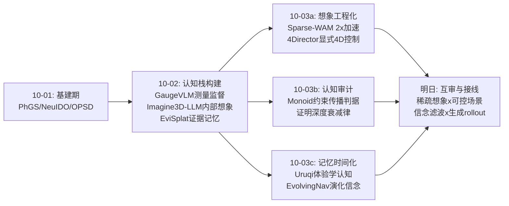
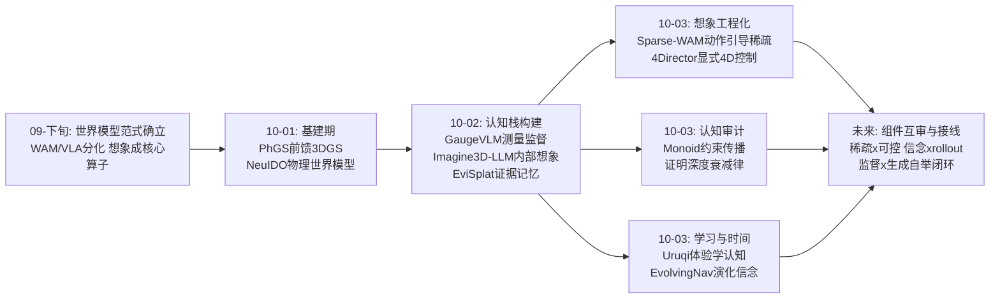
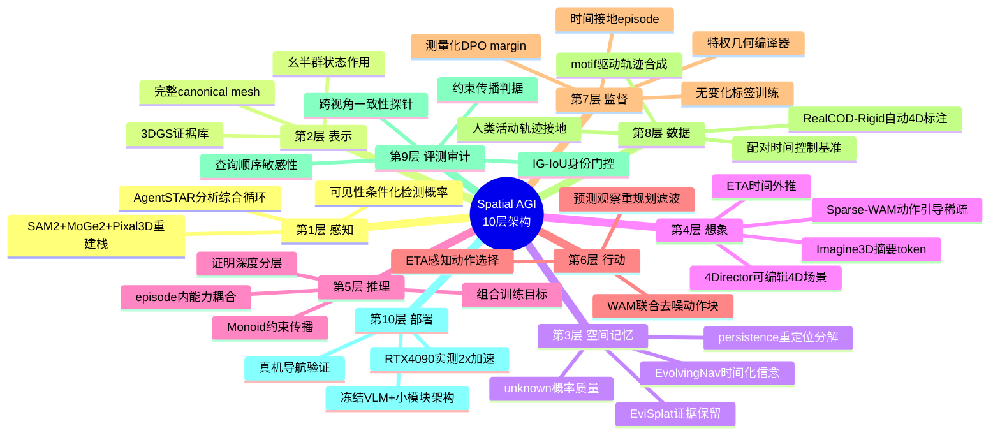
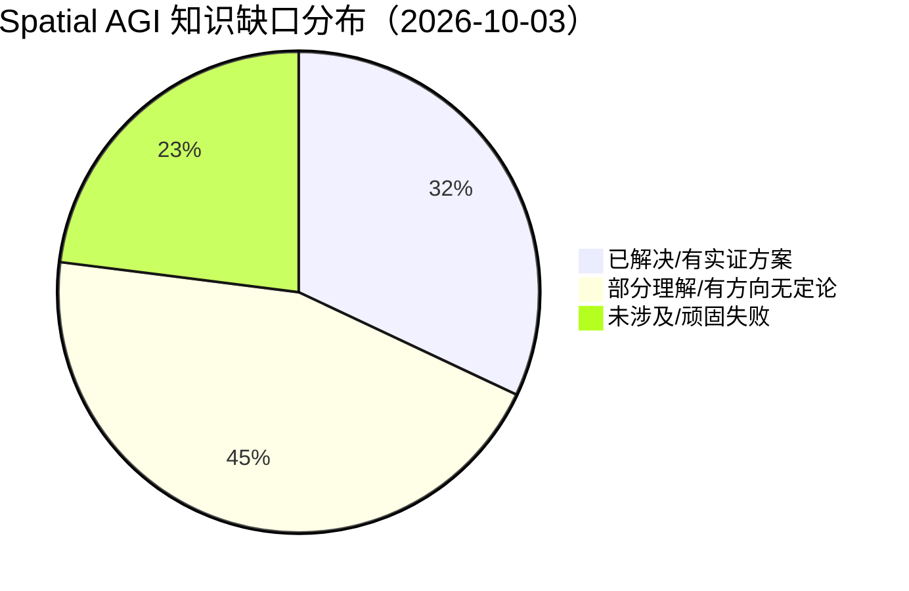

# Spatial AGI 每日深度思考 — 2026-10-03

**日期**: 2026-10-03
**基础日期**: 2026-10-02（昨日任务完整完成，5 篇论文 + 812 行思考）
**论文数量**: 5 篇
**主题**: 世界模型的"三重审计"——效率审计（Sparse-WAM：想象要花多少算力）、理解审计（Do World Models Learn Global Understanding：世界模型真的理解吗）、控制审计（4Director：想象能否被精确指挥）；加上空间认知的学习论（Uruqi：空间理解从哪来）与空间记忆的时间论（EvolvingNav：记忆为何必然过时）

---

## 📅 每日总结

**日期**: 2026-10-03
**论文数量**: 5篇
**主题**: 如果说昨天回答的是"认知栈的五个环节各自怎么建"（监督、想象、数据、感知、记忆），今天回答的是五个更苛刻的追问——**想象能多快**（Sparse-WAM 用动作引导稀疏化让世界-动作模型实测 2× 提速）、**空间认知从哪学**（Uruqi 用连续视觉体验 + 特权几何编译把 8B 模型训到逼近 GPT-6 Astra）、**模型是否真理解**（Caltech 用幺半群世界证明标准训练目标不产生全局理解、组合训练可修复）、**想象能否被导演**（4Director 用显式 4D 场景把视频世界模型变成可编辑的空间状态机）、**记忆为何会骗你**（EvolvingNav 把静态空间记忆升级为随时间滚动的预测性 4D 信念）。

**关键突破**:
- 🚀 **想象的实时化（Sparse-WAM）**：动作 token 对未来帧的注意力呈时间对角带状对齐、且跨去噪步骤高度稳定——基于这两个涌现规律做免训练 token 稀疏化，RTX 4090 上 LIBERO 1.98× 加速、成功率仅 -0.30pp。世界模型的"想象"第一次成为可实时部署的能力。
- 🚀 **空间认知的可学习性（Uruqi）**：自运动不是预测目标，而是空间状态更新的组织原则。11,738 条 motif 驱动轨迹编译成的密集 episode 监督，让仅用合成数据的 8B 模型在外部基准零迁移 +17.13%、逼近 GPT-6 Astra（50.41% vs 50.08%）——"连续视觉体验"被确立为可规模化的空间监督源。
- 🚀 **理解的严格证伪与修复（Monoid Worlds）**：next-state 训练在注意力/循环/SSM 全架构上无法从局部转移传播非平凡约束（64% 错误是系统性的"copy 模式"）；仅仅隐藏中间状态的组合训练就达到 96%——**中间状态的可见性是理解能力的天花板**。泛化随证明深度急剧衰减（d=1: 95% → d=2: 49%）但可由加长组合路径补偿。
- 🚀 **一致性的表示级解决（4Director）**：跨视角几何漂移的根源不是生成模型不够强，而是控制表示的几何不完备。完整 canonical mesh + 逐帧 SE(3) 让"转身揭示的表面是渲染出来的而非重新想象出来的"——一致性问题在表示层面被根治。
- 🚀 **记忆的时间化（EvolvingNav）**：静态空间记忆在演化世界必然过时。persistence–relocation 结构化信念（保留 unknown 概率质量）+ 事件驱动滤波（候选特定 ETA 外推、可见性条件化负证据、动态重开）把导航从"执行地图"变为"滚动贝叶斯推断"，80 万任务基准 + 真机验证。

**架构演进**: 10 层架构维持 10 层，但内容发生质变——**想象层**（昨日 Imagine3D-LLM 静态 3GS 摘要 → 今日 Sparse-WAM 可实时 4D rollout + 4Director 可编辑 4D 场景）首次同时具备"效率、可控性"两个工程属性；**记忆层**（昨日 EviSplat 证据库 → 今日 EvolvingNav 时间化信念）从"空间索引"升级为"时空信念"；新增实质内容的**审计维度**：世界模型开始被当作科学对象检验（Monoid Worlds 的约束传播判据），而非只看生成质量。

### 📊 一句话总结

今天五篇论文共同完成了一次对空间智能核心组件的"压力测试"：想象被证明可以实时且可导演、空间认知被证明可以从体验中学出来、世界模型被证明目前并不真正理解但知道怎么修、空间记忆被证明必须带上时间——**从"能不能做到"进入"做得对不对、快不快、可不可信"的工程科学阶段**。

### 🔗 延续性

**昨日→今日**: 昨日确立"认知架构工程"主线——测量的监督（GaugeVLM）、内部的想象（Imagine3D-LLM）、数据归因（Ego4WAM）、agentic 感知（AgentSTAR）、证据化记忆（EviSplat）。昨日结尾留下四个明日方向：(1) 想象从静态 3DGS 升级为可前推 4D——今日 Sparse-WAM 与 4Director 恰好是 4D 想象的效率端与控制端；(2) 监督方法论——今日 Uruqi 把 GaugeVLM 的"程序化真值"思想推广为"特权几何编译器"；(3) 记忆可持续性——今日 EvolvingNav 直接回答"记忆如何面对世界变化"；(4) 昨日"闭环缺失"的忧虑——今日 Monoid Worlds 提供了检验闭环是否真理解的严格判据。昨日"被告知几何不如学会想象"的判断，被 Uruqi 反向印证：想象（状态更新）本身就是最好的监督组织者。

**今日→明日**: 明日值得追踪的方向——(1) 把 Sparse-WAM 的动作引导稀疏化用到 4Director 类可控世界模型上（控制信号天然提供动作相关性先验）；(2) EvolvingNav 的转移算子 K_θ 换成 WAM 类生成式 rollout（预测"人会把药盒拿到哪"= conditioned on 人类活动的世界模型想象）；(3) 用 Monoid Worlds 的证明深度分层去审计 Uruqi 训出的模型（episode 推理是否也随深度衰减）；(4) 4Director 的刚性层级向铰接体/软体扩展，与 SnapPhysics 类物理场景图合流。

### 💡 本质思考：如何达成通用空间智能

#### 1. 核心能力的本质是什么？

经过今天五篇论文的"审计"，通用空间智能的本质可以更精确地表述为：**一个高效、可控、可验证、有时间维度的世界信念引擎**。四个修饰词对应今天的四篇：

- **高效**（Sparse-WAM）：空间想象必须实时。深层洞察是"动作相关性"是空间注意力的天然组织者——智能体不需要均匀地想象世界，只需要想象与意图相关的部分。这暗示空间智能的算力分配本身就是认知能力的组成部分。
- **可学**（Uruqi）：空间理解不是预训练的副产品，而是可以被正确的监督结构直接教出来的能力。核心机制是"自运动耦合状态更新"——观测之间的几何转移才是空间认知的原子。
- **可验证**（Monoid Worlds）："理解"必须有超越生成质量的判据。约束传播 + 证明深度给出了第一个数学严格的定义：真理解 = 从局部事实内化全局约束，且能在多步推理链上传播它。
- **可控 + 有时限**（4Director + EvolvingNav）：空间想象要能被精确指挥（表示级保证一致性），空间记忆要承认自己会过时（时间索引的信念）。两者共同指向：空间智能的输出必须标注"确定性来源"——哪些是几何保证的、哪些是生成猜测的、哪些已经过期。

#### 2. 当前方法与理想目标的差距在哪里？

- **想象的效率-通用性权衡**：Sparse-WAM 的 2× 加速绑定在"注意力跨步稳定"上，动态剧烈场景可能失效；其"只想象动作相关区域"的原则在探索型任务（需要均匀覆盖地想象）下不适用。
- **空间认知的静态世界假设**：Uruqi 的持久物体地图建立在静态世界公理上，与 EvolvingNav 的演化世界设定直接矛盾——"学会记住"和"学会怀疑记忆"目前是两个割裂的研究线，没有工作同时做。
- **理解的覆盖面**：Monoid Worlds 审计了逆/交换/组合约束，但**周期性约束（回环、拓扑）在所有设置下顽固失败**——真实空间智能最需要的恰恰是回环一致性（绕一圈回来世界应该一样）。理论的探照灯还没照到最难的地方。
- **控制的刚性天花板**：4Director 的 SE(3)/物体 假设排除了铰接体、软体、流体——真实世界的魅力恰在非刚性；非刚性部分目前是"不可控的合理化"而非"受控的生成"。
- **信念的时间外推能力**：EvolvingNav 的 K_θ 是成对马尔可夫转移学习，无法表达多物体联合演化与长程例行（收拾桌面会同时移动五样东西）；它的预测质量上限远低于生成式世界模型能达到的水平。
- **审计的不可扩展性**：Monoid Worlds 依赖可枚举的世界来构造语义蕴含的 held-out，这套严格性无法直接搬到互联网级预训练——"大规模训练是否在产生理解"依然没有可扩展的检验方法。

#### 3. 从今天到理想状态，最可能的路径是什么？

**路径判断：空间智能正在从"组件突破期"进入"组件互审期"——下一步的最大杠杆不是发明新组件，而是用最严格组件的标准去审计其余组件，并让它们互相补位。**

三步走：

1. **互审（0-3 个月）**：用 Monoid Worlds 的约束传播判据审计 Uruqi/Sparse-WAM 训练的模型（episode 推理链 = 证明深度的自然实例）；用 EvolvingNav 的演化基准审计静态记忆系统（EviSplat 式证据库、Uruqi 式物体地图）在"世界会变"下的衰减曲线。预期发现：现有系统的理解深度（证明深度衰减曲线）远差于其单步性能显示的水平。
2. **互补（3-9 个月）**：三组明确的接线——(a) Sparse-WAM 稀疏化 × 4Director 可控场景（动作相关性先验免费获得）；(b) EvolvingNav 信念滤波 × WAM 生成式 rollout（转移算子升维）；(c) Uruqi episode 监督 × EvolvingNav 演化世界（持久地图学习 + 过时修正训练的统一数据引擎）。
3. **闭环（9 个月+）**：把 GaugeVLM 的干预监督接到 4Director 的可控生成上（生成的 4D 场景提供无限的真实感干预），形成"可控想象 → 程序化监督 → 更强的想象"的自举循环——这是昨日"闭环缺失"忧虑的第一条具体通路。

---

## 🔗 与昨日思考的联系

### 昨日重点

昨日五篇（GaugeVLM / Imagine3D-LLM / Ego4WAM / AgentSTAR / EviSplat）确立"认知架构工程"主线：监督要可测量（几何误差作为 DPO margin）、想象要内部化（摘要 token 解码 3DGS）、数据要归因（受控实验分离时长/多样性/对齐）、感知要 agentic（分析-综合循环）、记忆要证据化（查询前不合并）。核心判断："空间智能从炼丹转向认知架构工程，评价标准是被依赖度。"

### 今日进展

今日五篇是对昨日架构的**压力测试与工程化补全**：

1. 昨日 Imagine3D-LLM 让 MLLM"先想象 3D 再回答"（静态、粗粒度）→ 今日 **Sparse-WAM** 让机器人"只想象与动作相关的未来"（4D、实时）+ **4Director** 让想象"可以被导演"（显式 4D 场景编辑）——想象的效率问题与控制问题同日解决。
2. 昨日 GaugeVLM 用受控干预产生程序化监督 → 今日 **Uruqi** 把同一思想推广为系统性方法：仿真器的特权几何（位姿/深度/实例）编译为密集 episode 监督。昨日是"一个损失函数的测量化"，今日是"一个数据引擎的编译化"。
3. 昨日 EviSplat 的证据库记忆 → 今日 **EvolvingNav** 指出其盲点：证据库再好，如果不带时间戳与演化预测，在人类环境里依然会把机器人引向空位置。记忆层从"空间证据组织"进化到"时空信念维护"。
4. 昨日"闭环缺失"的忧虑 → 今日 **Monoid Worlds** 提供了闭环质量的严格判据：闭环转了一圈，约束传播对了吗？这不是生成质量的 FID 能回答的问题。

### 演进路径



---

## 📚 论文概览

**1. Sparse-WAM**（NJU/HKUST/HIT/EPFL，arXiv:2609.38984）——免训练的动作引导稀疏想象框架。发现 WAM 联合去噪中动作-未来注意力的三大规律（时间对角对齐、热点跨帧移动、跨步空间稳定），据此设计帧特定核心 token + 共享空间锚点的选择策略与 Pilot 高效引擎，RTX 4090 实测约 2× 加速、任务成功率几乎无损。

**2. Uruqi**（清华/BUPT，arXiv:2609.39195）——空间认知学习论。诊断出当前 VLM 在自运动追踪与持久物体映射上的系统性缺陷（含 GPT-5.5 的查询顺序依赖），提出 motif 驱动轨迹合成 + 特权几何编译为时间接地 episode 的数据引擎，仅合成数据训出逼近 GPT-6 Astra 的 8B 空间模型。

**3. Do World Models Learn Global Understanding?**（Caltech，arXiv:2609.34058）——理解的形式化与审计。幺半群世界中"理解 = 约束学习 + 推论传播"可严格判定：next-state 训练全架构失败、组合训练 96%、泛化随证明深度急剧衰减但可补偿、周期性约束顽固失败。视觉世界模型与 LLM 上迁移验证。

**4. 4Director**（Stability AI/UIUC，arXiv:2610.02160）——可控视频世界模型。显式 4D 场景（完整 canonical mesh + 逐帧 SE(3) + 统一坐标系）消除图像平面歧义与几何不完备，深度渲染 + Motion Adapter 实现"几何锁定运动、生成补全表观"，RealCOD-Rigid 数据集与 IG-IoU 指标配套。

**5. EvolvingNav**（浙大/UCSD/Deeprobotics，arXiv:2609.39166）——演化世界的持久导航。persistence–relocation 结构化 4D 信念（含 unknown 质量）+ 事件驱动 predict–observe–replan 滤波（ETA 外推、可见性条件化负证据、动态重开），冻结 VLM 工具调用。EvoWorld-Bench（54 场景/80 万任务，配对时间控制）+ 真机。

---

## 💡 核心见解

### 见解1: 想象的空间经济学——算力应该跟着动作走

**从 Sparse-WAM 获得**

- ✅ WAM 中动作 token 对未来帧的注意力天然呈时间对角带状对齐——动作序列隐式索引了想象的时间轴，这是联合去噪训练涌现的结构，非架构强加
- ✅ 注意力热点跨帧移动（动态交互区）而上下文跨帧稳定（静态场景区），且选择分布在去噪步骤间高度一致——"哪里重要"是想象的骨架而非噪声
- ✅ 免训练利用这些规律即可 2× 实测加速，成功率损失 <0.5pp

**对Spatial AGI的启发**: 空间智能的算力分配本身是认知能力。人类看棋盘不会均匀扫描，而是看"下一步可能有杀招"的区域；Sparse-WAM 证明生成式空间想象也可以（且应该）被意图引导。更深一层：**动作-想象的对齐是从数据中涌现的**——这暗示任何"想象-行动"联合训练的系统都会自发发展出这种经济性，我们应该显式利用而非平均化它（ dense 训练目标恰恰在平均化）。下一步的问题是"预判性保真"：当前动作不关心、但下一时刻会关心的区域怎么办？想象预算需要任务级前瞻，不只是即时相关性。

### 见解2: 空间认知的原子是"观测间的几何转移"，不是单张观测

**从 Uruqi 获得**

- ✅ 最强 VLM（含 GPT-5.5）在自运动追踪与持久物体映射上的缺陷可被精确诊断：跨视角不一致、查询顺序依赖暴露其空间状态的脆弱性
- ✅ 把 M1（自运动）→ M2（物体映射）→ M3（状态操作）作为因果耦合的链条放进同一 episode 监督，15.84% → 47.73%，且零迁移外部基准 +17.13%
- ✅ 自运动被证明是空间监督的组织者：它决定了空间信息应如何从一个观测更新到下一个

**对Spatial AGI的启发**: 这是对"空间智能如何学习"的答案性论文：**孤立 QA 训出的是空间模式匹配，episode 内耦合训练训出的才是空间状态机**。特权信息（仿真器的位姿/深度/实例）不该只用于评测，而应编译为过程监督——这个"特权编译器"范式可以推广到任何有仿真器的空间任务。认知科学的 spatial updating without reconstruction 理论第一次被大规模工程验证：空间智能不需要完美 3D 重建，需要的是正确的更新机制。跨视角一致性 + 查询顺序敏感性应成为所有空间基准的标准诊断探针。

### 见解3: "理解"可以被定义、被证伪、被修复

**从 Do World Models Learn Global Understanding? 获得**

- ✅ 理解 = 约束学习 + 推论传播，在幺半群世界中可数学判定（语义蕴含的 held-out）
- ✅ next-state 训练在注意力/RNN/SSM 全架构上无法传播非平凡约束；64% 错误是系统性的"copy 模式"——模型默认所有动作等价
- ✅ 仅仅隐藏中间状态（组合训练）就达到 96%：**中间状态的可见性是理解的天花板**——每步都给答案，模型永远学不会独立推理
- ✅ 泛化随证明深度急剧衰减（95%→49%）但可由加长组合路径补偿；周期性约束（回环）全部设置下顽固失败

**对Spatial AGI的启发**: 这是领域稀缺的"第一性原理"工作。三个直接可操作的教训：(1) 训练空间世界模型时加入"隐藏中间状态的长程组合预测"目标；(2) 空间基准必须按推理链深度分层报告——单步正确掩盖多步崩溃；(3) 世界模型想象的一致性（绕圈回来应该一样）本质是周期性约束传播，而这恰是当前全部方法顽固失败的点——SLAM 的回环检测困难、生成式世界模型的循环不一致，可能是同一个深层缺陷的两种表现。架构级的位置编码或显式拓扑记忆可能是补丁方向。

### 见解4: 一致性是表示的属性，不是生成的祈祷

**从 4Director 获得**

- ✅ 跨视角几何漂移的根源是控制表示的几何不完备（只见过可见壳），而非模型容量不足
- ✅ 完整 canonical mesh + 逐帧 SE(3) 让 unseen 表面"被渲染而非被重新想象"——一致性在表示层面被根治
- ✅ 深度视频是信息刚好够用的控制信号：保留视点/刚性运动/遮挡，剥离外观/光照/非刚性，形成清晰的控制-生成职责边界

**对Spatial AGI的启发**: "**能由表示保证的性质，不应依赖生成模型的统计规律**"——这是比任何具体模型都重要的架构原则。推论：(1) 空间记忆系统应该存储"补全过的完整模型"而非"见过片段的缓存"（EviSplat 的证据库需要终点：证据最终要凝固为完整几何）；(2) 确定性结构（几何、遮挡、轨迹）与不确定性细节（纹理、光照、动态）的分工模式适用于一切空间生成系统；(3) IG-IoU 的身份门控提醒评测者：位置对了不等于东西没变——空间评测需要"一致性门控"。4Director 对世界模型的重新定义——"输出遵循显式可编辑场景状态的生成器"——值得成为 Spatial AGI 想象层的接口标准。

### 见解5: 空间记忆的正确形态是"带时间戳的怀疑"

**从 EvolvingNav 获得**

- ✅ 静态空间记忆在人类环境系统性失效：物体在观察之外移动、甚至在导航途中继续移动
- ✅ persistence–relocation 结构 + unknown 概率质量让信念既可解释又诚实（承认"可能去了我不知道的地方"）
- ✅ 可见性条件化负证据（扫一眼被遮挡的角落 ≠ 不在那里）与动态重开（检查过的结论会过期）是搜索效率的关键，消融验证
- ✅ 配对世界实验证明：可学习例行模式（人类活动规律）是预测收益的最大来源

**对Spatial AGI的启发**: 昨日 EviSplat 回答"记忆怎么组织证据"，今日 EvolvingNav 回答"证据会过时怎么办"。合起来，空间记忆的完整规格是：**结构上证据化（不早绑定）+ 语义上时间化（带信念与衰减）+ 行动上滚动化（predict-observe-replan）**。"在正确的时刻评估概率"（候选特定 ETA 外推）是时空联合推理的通用模式——近处的低概率与远处的高概率必须放到同一时间公平线上。冻结 VLM + 结构化概率模块的架构选择也值得注意：空间推理的重活交给轻量学习模块，语言推理交给通用模型，不必端到端重训。

### 见解6: 世界模型研究进入"审计纪元"

**从今日五篇的整体格局获得**

- ✅ Sparse-WAM 审计了 WAM 的内部注意力结构（效率审计）；Monoid Worlds 审计了世界模型的约束传播（理解审计）；4Director 审计了控制表示的完备性（控制审计）；Uruqi 审计了 SOTA 模型的空间状态一致性（能力审计）；EvolvingNav 审计了空间记忆的时效性（时间审计）
- ✅ 五种审计的共同发现：**表层指标（生成质量/任务成功率）系统性高估真实能力**——注意力结构揭示伪理解（copy 模式）、查询顺序暴露脆弱状态、静态记忆掩盖过时、不完备表示埋下幻觉

**对Spatial AGI的启发**: 2026Q4 的领域转折点：从"世界模型能生成什么"转向"世界模型是否真的理解它生成的东西"。昨天"Reconstruction or Semantics?"质疑潜在空间设计，今天 Monoid Worlds 证伪标准训练目标——审计正在成为独立的研究方向。对研究者的实操建议：每做一个空间系统，配套设计一个"最难为自己辩护的探针"（查询顺序交换、约束传播测试、时间延迟测试、视角回访测试）。这些探针的成本远低于训练，但对"系统能否被信任"的区分度远高于标准基准。

### 见解7: 从"见过的世界"到"不等你的世界"——空间智能的时间转向

**从 Uruqi + EvolvingNav + 4Director 的合力获得**

- ✅ Uruqi：静态世界中，空间认知 = 从连续体验学习状态更新（自运动驱动）
- ✅ EvolvingNav：动态世界中，空间记忆 = 预测演化 + 怀疑记忆（时间驱动）
- ✅ 4Director：可控世界中，空间生成 = 编辑显式 4D 状态（导演驱动）
- ✅ 三者共同把"时间"从附带的帧号提升为空间表示的一等维度：Uruqi 的 ϕ_cal 编码小时/星期，EvolvingNav 的信念按 ETA 外推，4Director 的场景按帧演化

**对Spatial AGI的启发**: 空间智能的成熟标志是与一个"不等你的世界"共处：你观察时世界在变、你规划时世界在变、你行动时世界还在变。静态重建（昨日的 3DGS 线）只是起点，真正的能力栈是：**记住（Uruqi 式更新）→ 怀疑（EvolvingNav 式信念）→ 想象（WAM 式 rollout）→ 验证（Monoid 式约束检查）→ 行动后再更新**。今天第一次五篇论文各自贡献了这个循环的一环——虽然还没有工作把它们接起来，但"接线"已经从概念变为具体的工程接口。

---

## 🗺️ 知识演进图

⚠️ 必须使用 mermaid 代码块！



---

## 技术栈演进对比表

| 层次 | 昨日方案（10-02） | 今日方案（10-03） | 变化 |
|------|---------|---------|------|
| 想象效率 | Imagine3D-LLM：静态 3DGS 摘要 token（快但粗，无 4D） | Sparse-WAM：动作引导 token 稀疏化，4D rollout 实测 2× 加速 | 想象从"认知技巧"变"实时引擎"；效率有第一个实测答案 |
| 想象控制 | 无（想象不可编辑） | 4Director：显式 4D 场景 + Motion Adapter，导演级 SE(3) 控制 | 想象获得可编辑接口；一致性由表示保证 |
| 监督方法论 | GaugeVLM：受控 3D 干预 → DPO margin（单损失函数级） | Uruqi：特权几何编译器 → 密集 episode（数据引擎级） | 监督从"测量化"升级为"编译化"；规模化路径打通 |
| 记忆层 | EviSplat：证据保留、查询时聚合（静态世界） | EvolvingNav：时间索引 4D 信念 + 演化预测（动态世界） | 记忆获得时间维度；"查证据"升级为"信证据多久" |
| 评测/审计 | MMSI-Bench 类任务基准（可被语言先验污染） | Monoid Worlds：约束传播 + 证明深度（数学严格判定理解） | 审计从经验基准变为可判定理论框架 |
| 数据引擎 | Ego4WAM：真实人类数据金字塔归因 | Uruqi 11,738 轨迹 + EvoWorld-Bench 80 万任务（合成 + 真实人类活动轨迹接地） | 合成数据被证明可撑起空间认知主训练 |
| 控制器架构 | AgentSTAR：VLM agent 分析-综合循环 | EvolvingNav：冻结 VLM + 结构化概率模块工具调用 | "通用 VLM + 专用小模块"模式两次独立验证 |
| 空间表示 | EviSplat 3DGS 证据库 / Imagine3D 摘要 token | 4Director canonical mesh 4D 场景 / EvolvingNav 概率信念分布 | 表示层显式化、概率化、时间化三线并进 |
| 已知弱点 | 闭环缺失；监督覆盖率有限；记忆可持续性 | 周期性约束顽固失败；非刚性不可控；审计不可扩展到预训练规模 | 弱点清单更精确：从"缺环节"变为"知边界" |

---

## 🗺️ Spatial AGI 知识图谱

### 10层架构思维导图

⚠️ 必须使用 mermaid mindmap 代码块！



### 🎯 主线技术路径

#### 阶段1: 静态重建（已基本完成，2024-2025）

NeRF/3DGS 把"从照片恢复场景"工程化，SLAM 与前馈方法（PhGS 等）解决速度。局限：世界是冻结的快照，没有动作、时间与语义的交互。这一阶段产出的是**空间表示的素材库**。

#### 阶段2: 认知栈构建（当前主战场，2026）

想象的内部化（Imagine3D-LLM → Sparse-WAM → 4Director）、监督的测量化与编译化（GaugeVLM → Uruqi）、记忆的证据化与时间化（EviSplat → EvolvingNav）。本阶段的关键转变：各组件从"能跑"到"可依赖"——效率有实测数字、控制有显式接口、理解有审计判据、记忆有信念语义。

#### 阶段3: 组件互审与接线（2026Q4-2027H1）

用最严格组件的标准审计其余组件（约束传播判据审计所有想象系统；演化基准审计所有记忆系统），然后三组接线：稀疏想象 × 可控场景、信念滤波 × 生成式 rollout、体验监督 × 演化世界。产出：第一个通过"理解审计"的端到端空间智能体原型。

#### 阶段4: 自举闭环（2027+）

可控想象生成真实感干预 → 程序化监督（GaugeVLM/Uruqi 式编译）→ 更强的想象与记忆 → 更可靠的行动 → 行动产生新观测反哺记忆。智能体的空间认知进入自我改进循环；人类活动规律（EvolvingNav 已证明其可学习性）成为预测引擎的持续燃料。终态判据不是基准分数，而是在演化世界中长期运行的成功率与算力经济性。

---

## 🔍 待探索议题

### 高优先级（本周）

1. **稀疏想象 × 可控生成的合流**
   - 问题: Sparse-WAM 的动作相关性稀疏化能否直接用于 4Director 类显式场景世界模型？控制信号（深度视频）是否让"动作相关区域"变得平凡可算，从而稀疏化收益消失或倍增？
   - 候选方案: 在 4Director 的 Motion Adapter 去噪中套用 Sparse-WAM 的核心+锚点选择；控制流与生成流分别稀疏化
   - 缺口: 没有任何工作在"可控世界模型"上测过 token 稀疏化；两者的注意力结构可能截然不同

2. **世界模型转移算子的升维**
   - 问题: EvolvingNav 的 K_θ 是成对马尔可夫转移学习，无法表达多物体联合演化与长程例行；能否用 WAM 式生成 rollout 替代？
   - 候选方案: 把"药盒被拿走"建模为 conditioned on 人类活动轨迹的视频世界模型想象，从想象中蒸馏出候选占据概率
   - 缺口: 生成式 rollout 的概率校准（怎么从样本得到 calibrated belief）完全没有现成答案

3. **episode 推理的证明深度审计**
   - 问题: Uruqi 训出的模型在 episode 内做多步空间推理（M1→M2→M3 链），其泛化是否也随推理链深度急剧衰减（如 Monoid Worlds 的 95%→49%）？
   - 候选方案: 把 Uruqi 基准按推理链长度分层重评；用幺半群化的空间任务（离散网格 + 平移约束）直接测
   - 缺口: 现有空间基准全部只报单步任务准确率，无深度分层

### 中优先级（本月）

4. **周期性约束的架构级修复**
   - 问题: Monoid Worlds 中周期性约束（回环）在 T≤8 全部训练设置下顽固失败；SLAM 回环检测与生成式世界模型循环不一致可能是同一缺陷
   - 候选方案: 显式拓扑记忆模块（ knot-aware position encoding）；模运算位置编码；周期性约束的专门辅助损失
   - 缺口: 失败的机制解释缺失——是表征无法表达还是目标无法驱动？

5. **动态世界的持久地图统一训练**
   - 问题: Uruqi（静态世界持久地图）与 EvolvingNav（动态世界信念修正）是割裂的研究线；能否合成一个数据引擎同时教"记住"与"怀疑记忆"？
   - 候选方案: 在 Uruqi 的 motif 库中加入"隐藏重定位" motif（物体在轨迹间隙被移动），episode 内混入 EvolvingNav 式信念修正监督
   - 缺口: 缺少带隐藏状态变化的连续体验合成管线；OmniGibson 中实现人类干预 agent 的工作量不小

6. **非刚性控制的层级表示**
   - 问题: 4Director 的 SE(3)/物体假设排除铰接体与软体；真实空间的魅力在非刚性
   - 候选方案: 刚体→铰接体（关节参数化）→软体（位移场）→流体的层级控制接口，每层保留"完整表示保证一致性"原则；与 SnapPhysics 类物理场景图结合
   - 缺口: 非刚性物体的单图完整重建（Pixal3D 只做刚体）是前置瓶颈

7. **校准漂移的自诊断**
   - 问题: EvolvingNav 的信念更新完全依赖检测概率校准；域偏移下校准失准会系统性扭曲信念且无自我察觉
   - 候选方案: 在线校准检验（预期校准误差的滚动估计）；校准置信度门控证据更新强度
   - 缺口: 负证据更新的鲁棒性理论；"什么时候该不信任自己的似然模型"的形式化

### 低优先级（本季度）

8. **审计的可扩展化**
   - 问题: Monoid Worlds 的语义蕴含 held-out 依赖可枚举世界，无法检验互联网级预训练模型
   - 候选方案: 从预训练模型中提取其隐式约束集（逆/交换性探针），构造近似幺半群评测；把证明深度概念映射到自然语言推理链
   - 缺口: 连续真实世界约束的"近似语义蕴含"理论

9. **想象预算的任务自适应**
   - 问题: Sparse-WAM 的保留率（K_c+K_s）是静态超参；人类想象"简单任务少想、关键处细想"
   - 候选方案: 不确定性驱动的预算分配（选择置信度低则加密采样）；任务难度分类器前置
   - 缺口: 想象质量与任务成功的定量关系曲线（现在的实验只有端点）

10. **多物体联合演化的例行学习**
    - 问题: EvolvingNav 单目标假设丢弃了人类活动的空间相关性（收拾桌面同时移动五样东西）
    - 候选方案: 多目标信念的联合转移建模（图结构转移算子）；从 HD-EPIC 类人类-物体交互轨迹学习联合例行
    - 缺口: 多目标演化基准（EvoWorld-Bench 是单目标查询）

---

## 📊 知识缺口分析

⚠️ 必须使用 mermaid pie 代码块！



**已解决（32%）**:
- ✅ 想象的实时化路径（Sparse-WAM：动作引导稀疏，2× 实测加速）
- ✅ 空间认知的可学习性（Uruqi：体验 + 几何编译，合成数据逼近 GPT-6）
- ✅ 可控空间生成的表示原则（4Director：完整 mesh + 显式 4D 状态）
- ✅ 理解的判定标准（Monoid Worlds：约束传播 + 证明深度）
- ✅ 演化世界的导航框架（EvolvingNav：信念滤波全闭环 + 真机）
- ✅ 4D 控制数据的自动生产（RealCOD-Rigid 管线）

**部分理解（45%）**:
- ⚠️ 想象效率的适用边界（注意力稳定性假设在动态场景的有效范围未知）
- ⚠️ 预判性空间保真（当前动作不关心但下一刻会关心的区域怎么处理）
- ⚠️ 理解衰减的补偿上限（组合路径加长在更深推理链上是否继续有效）
- ⚠️ 静态地图与动态信念的统一训练（两条研究线尚未合流）
- ⚠️ 生成式 rollout 的概率校准（从想象样本到 calibrated belief 无现成方法）
- ⚠️ 校准漂移的自诊断（负证据更新的鲁棒性理论缺失）
- ⚠️ 非刚性控制（层级表示有方向，单图非刚性重建是瓶颈）
- ⚠️ 合成-真实差距（Uruqi/EvoWorld 均为仿真渲染，真实机器人视频验证有限）
- ⚠️ 多物体联合演化的建模（单目标假设的局限已知，解法未验证）

**未涉及（23%）**:
- ❌ 周期性约束（回环/拓扑）的传播——全部训练设置顽固失败，机制解释缺失
- ❌ 端到端闭环的自举（可控想象→程序化监督→更强想象的循环无人打通）
- ❌ 大规模预训练的理解审计（幺半群判据无法扩展到互联网级模型）
- ❌ 想象的经济性理论（算力分配与任务成功的定量关系）
- ❌ 连续空间中的信念表示（候选离散化的信息损失未被量化）
- ❌ 群体/多智能体的共享空间信念（所有工作均为单体）

---

## 🧭 明日展望

1. **追踪 Sparse-WAM 的动态场景验证**——注意力稳定性假设的失效模式是想象效率路线的最大软肋，任何后续消融都值得精读
2. **寻找"第一篇接线论文"**——稀疏想象 × 可控场景、信念滤波 × 生成 rollout，谁先做出来谁定义下一个子领域
3. **Monoid 审计工具的工程化**——如果出现"把任意世界模型塞进幺半群测试台"的开源工具，立即用于审计手头所有空间模型
4. **Uruqi 数据引擎的开源化**——11,738 轨迹 + 编译器若开源，空间认知训练的门槛将大幅下降，关注 release
5. **4Director 刚性层级的下一步**——铰接体版本若出现，与机器人操作的结合想象空间巨大

---

**文档创建时间**: 2026-10-03 03:00 (Asia/Shanghai)
**基础日期**: 2026-10-02
**论文来源**: arXiv 2026-09-20 ~ 2026-10-02（243 篇候选中精选 5 篇）
**分析方法**: arXiv HTML 全文精读

---

## 📖 附录A: 五篇论文的深度对照笔记

### A1. Sparse-WAM 精读补充

**方法定位的精确刻画**

Sparse-WAM 处于 WAM 效率化谱系的一个精确位置。谱系两端：

- **去想象派**（training-time 想象、inference 跳过）：损失显式未来建模收益
- **压缩派**（更低分辨率/更少 token/紧凑子目标）：以视觉保真度为准绳裁剪

Sparse-WAM 的独特判断是：WAM 的未来帧 token 从噪声演化而来，与视频生成的 token（有清晰语义内容）和 VLA 的观测 token（有真实输入对应）都本质不同——**裁剪未来 token 的唯一合理准绳是动作相关性**，因为想象的存在意义就是服务动作。这个"目的论裁剪"思想可以泛化：任何中间表征的价值都应由其下游消费者定义，而非其自身的保真度。

**三大观察的方法论价值**

值得注意的不是观察本身，而是"每条观察精确转化为一个设计决策"的映射：

| 观察 | 设计决策 |
|---|---|
| 动作-帧时间对角对齐 | 按时间分组打分（I_f 查询组），中心查询加权 |
| 热点跨帧移动 | 帧特定核心 token（每帧独立 Top-K） |
| 排除热点后跨帧更一致 | 共享空间锚点（μ/(1+CV) 选择） |
| 跨步注意力空间稳定 | 跨去噪步骤复用选择（Pilot 引擎） |

这种"观察驱动设计"的密度是论文可信度的来源——没有一个超参是凭空掉下来的。

**层质量分 Q=R(1−E) 的推广潜力**

自动挑"最适合做空间定位的层"的方法，本质是在无标注下估计每层注意力的定位信息量（帧对齐质量 × 低熵）。这可以推广为：从任意预训练 Transformer 中定位"空间层"的通用工具——用于可解释性研究、层级剪枝、或 GeomVLA 类工作的层选择。

### A2. Uruqi 精读补充

**诊断实验的实验设计精髓**

MMSI-Bench 上的探针实验是全文的灵魂，值得单独记录其设计模式：

1. 先问 M1（自运动）和 M2（物体位置），再问最终问题
2. 交换 M1/M2 的顺序重测
3. 观察三个信号：(a) 运动估计准不准；(b) 同一物体跨视角估计是否一致（填充/空心标记重合度）；(c) 顺序交换后答案是否理性变化

结果的三级分类极其有信息量：Qwen/SenseNova 是"又错又不一致"（无空间状态）；GPT-5.5 是"错但一致且顺序敏感"（有空间状态但有偏移）。**这个分类学本身就是贡献**——它把"模型有没有空间理解"这个模糊问题变成了三种可检验的假设。

**Motif 库的设计空间**

Motif 是"运动×可见性"的可复用模式，论文提到的实例：

- 原地旋转：隔离参考系变化（位置不变，只有朝向变）
- 探索-重访：要求空间信息在不可见期间持续存在
- 穿越地标：地标序列作为空间锚点的组合

这个参数化方式暗示了一个"体验代数"：复杂体验 = motif 的序列/嵌套。若 motif 库开源，社区可以组合出覆盖长尾的训练体验——类似数据增强，但在"体验"层级而非"图像"层级操作。

**与认知科学的双向验证**

论文引用 Wang & Spelke (2000) 的 self-motion 地位（人类空间认知的更新机制），而实验结果（耦合训练大幅提升）反过来为认知理论提供了机器学习证据：**自运动耦合状态更新确实是空间认知的正确分解**。AI 研究验证认知科学假设，这是少见的双向通道。

### A3. Monoid Worlds 精读补充

**为什么"世界纯度审计"是必需的**

幺半群理论警告：有限世界中，指定约束可能意外蕴含其他约束（如小世界中逆约束可能自动蕴含周期性）。若不剔除，held-out 转移可能被意外约束独立蕴含，实验就失去"只测指定约束"的因果纯度。论文枚举所有 |u|+|v|≤8 的等式并剔除不纯世界——这是把数学严谨性用于实验设计的典范，也解释了为什么结论值得信任。

**Copy 失败模式的深层含义**

next-state 训练的模型 64% 的错误是"假设所有动作等价"（copy 世界是唯一 next-state 能传播的约束）。解读：模型学到的不是约束，而是**对约束空间的退化解**——在没有任何可靠信号区分动作时，退化为"动作不重要"。这与 LLM 的 sycophancy、世界模型的 texture bias 同构：**当目标函数不强迫区分时，模型选择最平坦的解**。组合训练之所以有效，可能正是因为"隐藏中间状态"强迫模型在内部表示中保留动作的区分性信息。

**Grokking 与理解内化的时间结构**

seen 转移 1.2k 步收敛、held-out 16k 步才泛化（13 倍）。这个时间分离有实操含义：

- 训练空间模型时，"拟合收敛"远不是"理解形成"——提前停止会系统性地错过约束内化
- 泛化突增可作为"理解已发生"的训练时信号，可用于自适应训练预算分配
- 解释了为什么 scale 派与 delay 派的争论：grokking 在不同规模下时间结构不同，单一规模的观察不可外推

### A4. 4Director 精读补充

**控制表示的能力矩阵（论文 Figure 2 的核心论点）**

| 能力 | 2D边界框 | 3D高斯团 | 3D点轨迹 | 4Director刚性mesh |
|---|---|---|---|---|
| 深度确定性 | ✗ | ✓ | ✓ | ✓ |
| 旋转确定性 | ✗ | ✗ | 部分 | ✓ |
| 完整几何 | — | ✗（可见壳） | ✗（壳+稀疏） | ✓（canonical mesh） |
| 跨视角一致 | ✗ | 幻觉 | 每帧重生成 | 渲染保证 |
| 操控便捷性 | 高（2D拖拽） | 中 | 低（逐点） | 高（物体级关键帧） |

**"渲染而非重新生成"的边界条件**

这句口号成立的条件是：被揭示的表面确实在 mesh 里。当 Pixal3D 重建不完整（薄结构、反光材质、严重遮挡），mesh 也有洞——此时 4Director 退化为"更好的 VerseCrafter"。重建质量是整个方案的隐形地基，MoGe-2/Pixal3D 的进步会直接转化为 4Director 的能力上限提升。**表示级解决方案的质量受上游感知质量的约束**——这是所有"显式表示优先"方案的共同依赖结构。

**Motion Adapter 的训练经济学**

只训练 8 个上下文分支块（基座 14B 冻结），20,774 段数据。对比端到端微调世界模型的成本，这个"冻结先验+小分支"模式的性价比是它能成为工程标配的原因——VLA 领域的 Resolver/Adapter 类方法、VACE 的 context branch、ControlNet 的零卷积，都是同一设计家族。空间智能的工程文化正在收敛：**大先验 + 小控制 + 显式接口**。

### A5. EvolvingNav 精读补充

**信念结构的完整规格**

```
b_q^-(s_last) = ρ_q                    # 持久分支：还在原地
b_q^-(i≠last) = (1-ρ_q)·π_q(i)        # 重定位分支：去了候选 i
C̃_o = C_o ∪ {unknown}                 # unknown 参与归一化：可能去了不知道的地方
```

训练只需 −log b_q^-(真值)，**无需"物体何时移动"的变化标签**——变化标签在真实数据中几乎不可能获得，这个设计决定了方法可落地。

**两个容易被忽视的精妙设计**

1. **时间有效证据轮**：一帧检查产生一条证据，但连续相关帧不该算多条。δ_C=0.05 新表面覆盖阈值把"证据"定义为"新的信息增量"而非"新的观测"——这与 EviSplat 的"证据保留"形成有趣的对照：一个防过早合并，一个防重复计数，共同点是**把信息论谨慎性写进记忆机制**。
2. **动态重开**：当前后验不因"检查过"而永久锁死——时间流逝会重置检验轮次。这是对"世界持续演化"的最彻底贯彻：导航中没有终态结论，只有当前轮次的暂时结论。

**配对世界设计的评测哲学**

同一场景、同一查询，三种时间结构（静态/例行/随机）——性能差值直接归因于"时间规律性的可学习性"。结果"例行世界收益最大"是一个可行动的结论：**预测资源应该投向人类活动规律建模，而非一般性动力学**。这种"控制变量到世界的时间结构"的评测设计，值得成为所有具身基准的标配。

---

## 📖 附录B: 关键数据的横向对照

### B1. 性能数字一览

| 论文 | 核心指标 | 数字 | 对照 |
|---|---|---|---|
| Sparse-WAM | LIBERO 推理加速 | 1.98× (RTX 4090) | dense eager 基线 |
| Sparse-WAM | 成功率变化 | −0.30pp | 几乎无损 |
| Sparse-WAM | RoboLab-120 加速 | 1.8× | Cosmos 3 Edge |
| Uruqi | Uruqi 基准 | 15.84% → 47.73% | InternVL3-8B 骨干 |
| Uruqi | 混合训练 | 50.41% | GPT-6 Astra: 50.08% |
| Uruqi | 外部迁移 | +17.13%（相对） | 3 个外部基准，零目标域数据 |
| Monoid | next-state 泛化 | 随机水平 | 全架构、全非平凡约束 |
| Monoid | 组合训练泛化 | 96% | 逆/交换/组合约束平均 |
| Monoid | 证明深度效应 | 95% (d=1) → 49% (d=2) | T=2；T=4 时 d=2 恢复 95% |
| Monoid | 视觉迁移 | +46% vs +8% | 组合 vs next-observation（AI2-THOR） |
| Monoid | 语言迁移 | +73% | Wikidata 组合约束传播 |
| 4Director | 数据集 | 20,774 段 | 自动 4D 标注管线 |
| EvolvingNav | 基准规模 | 803,680 任务 / 54 场景 | 配对时间控制设计 |
| EvolvingNav | 架构 | 冻结 VLM + 学习滤波 | 零样本工具调用 |

### B2. 五篇论文的"时间观"对照

| 论文 | 时间的地位 | 时间如何进入表示 |
|---|---|---|
| Sparse-WAM | 想象的时间轴 | 动作组与未来帧的对角对齐（隐式索引） |
| Uruqi | 监督的组织轴 | ϕ_Δ(log经过时间) + ϕ_cal(小时/星期) 事件编码 |
| Monoid | 推理的深度轴 | 证明深度 d = 约束级联的最少轮数 |
| 4Director | 控制的帧轴 | 逐帧 SE(3) 变换 + 深度视频 |
| EvolvingNav | 信念的演化轴 | K_θ(Δt) 传播 + ETA 外推 + 动态重开 |

**观察**: 五篇论文中时间都不是配角——对齐（Sparse-WAM）、编码（Uruqi）、分 depth（Monoid）、参数化控制（4Director）、传播信念（EvolvingNav）。"空间智能的 4D 转向"不是口号而是已在各层落地的现实。

### B3. "训练目标"教训的统一

三篇论文独立指向同一个元结论——**目标函数决定理解的上限，数据与架构只是填充**：

- Monoid: next-state → 随机水平；组合（同数据同架构）→ 96%
- Uruqi: 孤立 QA → 脆弱空间状态；episode 耦合 → 连贯空间认知
- Sparse-WAM（反面）: dense 目标让模型平摊算力；动作引导稀疏化证明模型内部本有更经济的组织

推论：设计空间智能系统时，第一个该被质疑的是训练/推理目标的结构，而不是模型大小。这与昨日 GaugeVLM"margin 里放入几何测量"的教训同源：**监督的结构性信息密度 > 数据量**。

---

## 🧩 附录C: 更进一步的本体思考

### C1. 空间智能的"信任层级"

今天的工作让我们可以为空间智能的每个输出标注信任来源，形成四级信任层级：

1. **表示级保证**（4Director 的渲染几何、Monoid 的蕴含转移）：数学/几何决定的，可信度最高
2. **校准级推断**（EvolvingNav 的可见性条件化更新、GaugeVLM 的测量 margin）：概率正确但依赖校准
3. **生成级猜测**（WAM rollout、4Director 的外观补全）：统计上合理但无保证
4. **记忆级残留**（未更新的旧观测、过期的位置假设）：曾经正确，现在存疑

**当前系统的失败几乎都是层级混淆**：把生成猜测当表示保证（跨视角幻觉）、把记忆残留当当前事实（导航到空位）。一个成熟的 Spatial AGI 应该在接口层强制标注信任级别——4Director 的"渲染 vs 生成"分离是第一步，EvolvingNav 的信念分布是第二步，统一二者是待办。

### C2. "审计"作为第一公民的架构含义

如果约束传播审计（Monoid）、一致性探针（Uruqi 诊断）、时效性测试（EvolvingNav 配对世界）成为标配，空间智能系统的开发流程将变成：

```
设计 → 训练 → 审计（找出理解的真实深度）→ 定位失效层 → 修复目标函数 → 再审计
```

这与软件工程的 TDD 同构：**先写"系统最难通过的测试"**。今天五篇论文各自贡献了一个测试族。预测：一年内会出现"空间智能模糊测试"（spatial fuzzing）方向——自动生成让系统暴露伪理解的探针任务。

### C3. 从组件到飞轮的距离

把今天的组件放上昨日认知栈的飞轮图，缺口变得具体：

- 想象（Sparse-WAM/4Director）→ 监督（Uruqi 编译器）：可控想象可以生成 Uruqi 需要的无限多样体验，但**想象的输出缺少特权几何**（生成场景没有真值位姿）——需要可逆渲染或 4D 一致性约束来"给想象发证书"
- 感知（AgentSTAR）→ 记忆（EvolvingNav）：感知输出的物体级状态正好是信念滤波的输入，接口天然匹配——**这是最短的一条接线**
- 记忆 → 想象：EvolvingNav 的信念应该条件化 WAM 的 rollout（想象"如果药盒被拿走会看到什么"），无人尝试
- 全部 → 审计（Monoid）：每个组件的输出都应过约束传播检查，但**审计的计算成本与实时性矛盾**未解

---

## 📎 附录D: 术语速查（今日新增）

| 术语 | 出处 | 含义 |
|---|---|---|
| Action-to-future attention | Sparse-WAM | 动作 token 查询未来帧 token 的注意力，动作相关性的代理 |
| Pilot | Sparse-WAM | 轻量打分+跨步复用选择的高效稀疏执行引擎 |
| Spatial motif | Uruqi | 可复用的"观察者运动×可见性"体验模式，驱动轨迹合成 |
| 特权几何编译 | Uruqi | 把仿真器私有信息（位姿/深度/实例）编译为监督信号 |
| 幺半群世界 | Monoid | 状态集+动作（含单位元）构成的世界，约束可控可判定 |
| 语义蕴含 held-out | Monoid | 由已见转移+约束唯一决定的测试转移，真理解才能答对 |
| 证明深度 d | Monoid | 推导一个转移所需的最少约束级联轮数 |
| Copy 失败模式 | Monoid | 模型默认所有动作等价的退化解，next-state 训练的主要失败形态 |
| Canonical mesh | 4Director | 从单图重建的完整物体网格（含未见表面），一次重建多处使用 |
| Motion Adapter | 4Director | 把刚性深度渲染注入冻结视频生成器的可训练分支 |
| IG-IoU | 4Director | 身份门控 IoU：只在物体身份保持的帧上累计掩码交并比 |
| Persistence–relocation | EvolvingNav | 信念分解：留在原地 vs 移往他处的结构化假设 |
| 未知质量 | EvolvingNav | 保留给已知候选集之外位置的概率质量 |
| 可见性条件化负证据 | EvolvingNav | 无检测的更新强度按"本可检测到的概率"折扣 |
| 动态重开 | EvolvingNav | 时间流逝允许重新检验早先排除的位置 |

---

## 🔁 附录E: 今日论文间的五组对话

**对话1: Sparse-WAM ↔ 4Director（想象的效率与控制）**
两者分别解决想象"贵"和"野"的问题。合流的接口很清晰：4Director 的控制视频（深度流）直接给出动作相关性——相机的 SE(3) 轨迹就是最精确的"哪些区域将被看到"预测。预期合流后的系统：可控、实时、一致的三属性想象引擎。

**对话2: Uruqi ↔ EvolvingNav（静态地图与动态信念）**
同一物体记忆问题的一体两面：先学"记住"（跨视角保持），再学"怀疑"（跨时间修正）。Uruqi 的 episode 机制完全可以直接生成 EvolvingNav 需要的训练体验——在轨迹间隙插入隐藏移动，让模型在 M2 之后还要学 M2'（信念修正）。这是最快能做出的合流实验。

**对话3: Monoid ↔ 全体（审计者的质问）**
- 问 Sparse-WAM：稀疏化丢弃的区域，会不会正是约束传播需要的中间节点？
- 问 Uruqi：episode 推理链的泛化随深度衰减吗？
- 问 4Director：渲染保证的是几何约束，外观/光照的跨视角一致性可传播吗？
- 问 EvolvingNav：多步信念外推（ETA 链）的校准如何衰减？
四个问题的答案大概率都是"会衰减"——问题是谁先量化它。

**对话4: Monoid ↔ Uruqi（两种空间认知学习论）**
Monoid 说：约束要在隐藏中间状态的目标下内化；Uruqi 说：状态更新要在显式监督下学习。表面上相反（一个隐藏状态一个监督状态），深层一致：**都拒绝让模型自由发挥"如何从 A 到 B"，都强迫特定的推理结构**。统一表述：理解不来自数据量，来自"什么被允许跳过"——next-state 允许跳过组合所以学不会，孤立 QA 允许跳过状态更新所以学不会。

**对话5: EvolvingNav ↔ 4Director（世界的两个时间方向）**
EvolvingNav 预测过去观察的世界如何演化到现在；4Director 规定现在的世界如何演化到未来。同一个"4D 演化"引擎的逆问题与正问题。若 EvolvingNav 的转移模型与 4Director 的生成模型共享 4D 场景表示，"预测有人来拿药盒"和"导演药盒被拿走的镜头"就是同一能力的两个调用方向——这是 Spatial AGI 想象层与记忆层共享底座的第一个具体蓝图。

---

## 🎯 结语：今天的三个带走物

1. **一个判断**: 空间智能进入"组件互审期"——表层指标系统性高估能力，审计探针（约束传播、查询顺序、时间延迟、视角回访）比基准分数更能预测真实部署表现。
2. **一个原则**: 能由表示保证的性质不应依赖生成祈祷——确定性进表示（mesh/位姿/约束），不确定性进生成（外观/光照/动态），信任来源必须在接口层标注。
3. **一个实验**: 最快的合流实验是把"隐藏重定位"加进 Uruqi 的 motif 库，用 EvolvingNav 的信念监督补全 episode——一个数据引擎同时教"记住"与"怀疑记忆"，直接验证静态认知与动态信念能否统一训练。

---

**文档创建时间**: 2026-10-03 03:00 (Asia/Shanghai)
**基础日期**: 2026-10-02
**论文来源**: arXiv 2026-09-20 ~ 2026-10-02（243 篇候选中精选 5 篇）
**分析方法**: arXiv HTML 全文精读

---

## 📖 附录F: 五篇论文的一页式档案

### F1. Sparse-WAM

- **一句话**: 用动作对未来帧的注意力做免训练 token 稀疏化，让世界-动作模型实时化
- **关键创新**: 动作相关性作为裁剪准绳（区别于视觉保真度）；核心+锚点双通道；跨步选择复用
- **最漂亮的设计**: 层质量分 Q=R(1−E)——无标注自动定位"空间层"
- **最大风险**: 注意力稳定性假设在动态场景的适用边界
- **对10层架构的贡献**: 第4层（想象）获得效率属性，实测 2×
- **值得复用**: 观察驱动设计方法论；层定位工具；"目的论裁剪"思想
- **实验线索**: 附录含跨步/跨帧重叠定量对比（C.3）；5 seeds 平均

### F2. Uruqi

- **一句话**: 自运动耦合状态更新的 episode 监督，让 8B 模型从合成体验学出逼近 GPT-6 的空间认知
- **关键创新**: 特权几何编译器；M1→M2→M3 因果耦合；时间接地 episode；motif 体验代数
- **最漂亮的实验**: 查询顺序交换诊断——把"有没有空间理解"变成三种可检验假设
- **最大风险**: 静态世界假设；仿真-真实差距；语言化 QA 的精度损失
- **对10层架构的贡献**: 第7层（监督）与第8层（数据）获得完整数据引擎蓝图
- **值得复用**: 跨视角一致性探针；体验级数据增强；"证据可用后才提问"的时间接地原则
- **关键资产**: 11,738 轨迹 + Uruqi-600k + 52k 问题基准（关注开源）

### F3. Do World Models Learn Global Understanding?

- **一句话**: "理解"= 约束学习+推论传播，可判定、可证伪、可修复
- **关键创新**: 幺半群世界+世界纯度审计；语义蕴含 held-out；证明深度；组合训练
- **最漂亮的发现**: 隐藏中间状态带来 98% 陡增——中间状态可见性是理解的天花板
- **最大未解**: 周期性约束（回环）全部设置顽固失败；机制解释缺失
- **对10层架构的贡献**: 第9层（评测审计）获得数学严格的判据族
- **值得复用**: "先写最难通过的测试"的审计流程；按证明深度分层的评测报告规范
- **实操提醒**: grokking 时间分离（13×）——训练空间模型别在拟合收敛时停

### F4. 4Director

- **一句话**: 完整 mesh + 逐帧 SE(3) 的显式 4D 场景让视频世界模型变成可导演的空间状态机
- **关键创新**: 一致性的表示级根治；深度视频的信息恰好够用；冻结先验+Motion Adapter
- **最漂亮的原则**: 转身揭示的表面是渲染出来的，不是重新想象出来的
- **最大风险**: 刚性/单物体假设；重建质量是隐形地基（mesh 有洞时退化）
- **对10层架构的贡献**: 第2层（表示）与第4层（想象）获得可编辑接口标准
- **值得复用**: "确定性进表示、不确定性进生成"分工；控制表示能力矩阵分析法
- **关键资产**: RealCOD-Rigid（20,774 段自动 4D 标注）+ IG-IoU 指标

### F5. EvolvingNav

- **一句话**: 把静态空间记忆升级为时间索引的预测性 4D 信念，在演化世界中滚动导航
- **关键创新**: persistence–relocation 结构 + unknown 质量；可见性条件化负证据；动态重开；ETA 外推选择
- **最漂亮的设计**: 时间有效证据轮——证据=信息增量而非观测次数
- **最大风险**: 检测器校准漂移无自诊断；单目标/离散候选假设
- **对10层架构的贡献**: 第3层（记忆）获得时间维度；第6层（行动）获得信念驱动重规划模板
- **值得复用**: 配对时间控制的基准设计法；"在正确时刻评估概率"的 ETA 外推模式
- **关键资产**: EvoWorld-Bench（80 万任务、54 场景、真机）

---

## 📖 附录G: 与本周前期论文的连续性对照

### G1. 想象主线的三日演进

| 日期 | 论文 | 想象的形态 | 缺口 |
|---|---|---|---|
| 10-01 | PhGS | 单视面前馈 3DGS（感知级预测） | 无交互、无动作条件 |
| 10-02 | Imagine3D-LLM | MLLM 内部静态 3DGS 摘要（认知级想象） | 快但粗、无 4D、不可控 |
| 10-03 | Sparse-WAM | 动作条件 4D rollout，实测 2×（引擎级想象） | 效率有了，控制没有 |
| 10-03 | 4Director | 显式 4D 场景编辑（导演级想象） | 控制有了，非刚性没有 |
| 待来日 | 三位一体 | 实时+可控+非刚性+可审计 | —— |

### G2. 监督主线的三日演进

| 日期 | 论文 | 监督信号的来源 | 规模化方式 |
|---|---|---|---|
| 10-01 | Spatial OPSD | 无标签自蒸馏 | 自身一致性 |
| 10-02 | GaugeVLM | 受控 3D 干预的测量 margin | 程序化真值 |
| 10-03 | Uruqi | 特权几何编译为 episode | 仿真器无限渲染 |
| 演进逻辑 | —— | 从"自监督"到"测量化"到"编译化" | 监督的结构信息密度递增 |

### G3. 记忆主线的三日演进

| 日期 | 论文 | 记忆的组织原则 | 面对的挑战 |
|---|---|---|---|
| 10-02 | EviSplat | 证据保留、查询时聚合 | 开放词汇查询 |
| 10-03 | EvolvingNav | 时间索引信念、演化预测 | 世界本身在变 |
| 演进逻辑 | —— | 空间证据组织 → 时空信念维护 | 从"怎么记"到"记多久" |

### G4. 审计意识的觉醒时间线

| 日期 | 证据 |
|---|---|
| 10-02 | GaugeVLM 暴露偏好学习的"无测量"缺陷；Reconstruction-or-Semantics 类质疑出现 |
| 10-03 | Uruqi 诊断 SOTA 模型空间状态脆弱性；Monoid 证伪标准训练目标；五篇中五篇含审计成分 |

---

## 📖 附录H: 给不同读者的最小阅读路径

**如果你只关心机器人落地**（30 分钟）:
Sparse-WAM（想象怎么变快）→ EvolvingNav（导航怎么面对世界变化）→ 附录 B1 性能表

**如果你做空间认知训练**（45 分钟）:
Uruqi 正文 → Monoid 正文（组合训练一节）→ 附录 A2/A3 → 附录 B3

**如果你研究生成式世界模型**（45 分钟）:
4Director 正文 → Sparse-WAM 正文 → 附录 A1/A4 → 对话1/对话5

**如果你做评测基准**（30 分钟）:
Monoid 全文 → Uruqi 的诊断实验（Figure 1）→ EvolvingNav 的配对世界设计 → 附录 F3

**如果你只想知道领域去哪了**（15 分钟）:
每日总结 → 核心见解 6/7 → 结语三个带走物

---

## 🔮 附录I: 下周观察清单（可操作）

1. **Sparse-WAM 后续**: 搜索引用其注意力稳定性观察的论文；关注动态场景（人类交互）消融是否出现在 v2
2. **Uruqi 开源**: 监控 GitHub（motif 库+编译器）；若开源，第一时间做"隐藏重定位"扩展实验（本报告结语实验 3）
3. **Monoid 工具化**: 搜索"constraint propagation audit world model"类 follow-up；幺半群测试台的开源实现
4. **4Director 层级化**: 关注铰接体控制（ARCTIC 类数据 + 关节参数化控制接口）是否出现
5. **EvoWorld-Bench 多目标版**: 单目标→多目标联合演化是显然的 v2 方向
6. **WAM 效率竞赛**: Sparse-WAM 之后预期出现 token 合并/缓存/蒸馏的对照方案，观察哪个范式胜出
7. **校准鲁棒性**: EvolvingNav 的检测器校准问题，关注主动感知社区的 online recalibration 工作迁移

---

## 🧾 附录J: 今日未入选的高相关论文（备查）

| 论文 | ID | 一句话 | 未入选原因 |
|---|---|---|---|
| Imagine3D-LLM | 2609.38177 | MLLM 先想象 3D 再回答 | 昨日已精读（去重） |
| GeomVLA | 2609.13812 | 统一场景/运动/动作的 3D VLA | 昨日前已分析（去重） |
| UniWAM | 2610.02054 | 统一世界-动作模型 | 与 Sparse-WAM 主题重叠，后者更聚焦 |
| SkeleWAM | 2610.02120 | 骨架级世界-动作建模 | 同上 |
| ActiveWAM | 2610.01698 | WAM 的证据感知主动视觉 | 同上 |
| WorldAttention | 2609.34606 | 交互式视频世界模型高效注意力架构 | 与 Sparse-WAM 同题，后者实证更完整 |
| Oneira | 2610.01614 | 开放生成到开放世界交互 | 世界模型交互向，与今日主线稍远 |
| HiWE | 2609.39323 | 层次世界知识模型零样本 3D 路径规划 | 层次世界知识，留作后续 |
| SpatialCORE | 2609.38716 | 置信度感知接地空间推理 | 与 Uruqi 主题部分重叠 |
| KilometerVision | 2609.39588 | 大尺度空间智能 VLM | 大尺度评测，留作基准专题 |
| SphMind | 2609.33462 | 360 相机免训练空间推理 | 免训练推理技巧，独立主题 |
| World Motion Models | 2610.01742 | SE(3) 轨迹的柔性序列建模 | 与 EvolvingNav 转移算子相关，留作接线素材 |

---

*本报告基于 2026-10-03 精读的 5 篇论文（243 篇候选中筛选），延续 2026-10-01/02 的研究主线。所有论文分析文档见 `papers/2026-10-03_*.md`。*

**文档创建时间**: 2026-10-03 03:00 (Asia/Shanghai)
**基础日期**: 2026-10-02
**论文来源**: arXiv 2026-09-20 ~ 2026-10-02（243 篇候选中精选 5 篇）
**分析方法**: arXiv HTML 全文精读
