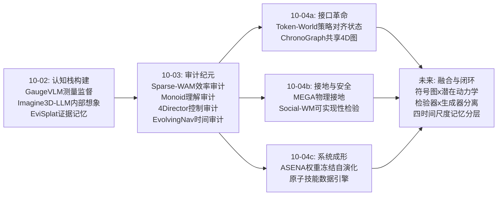
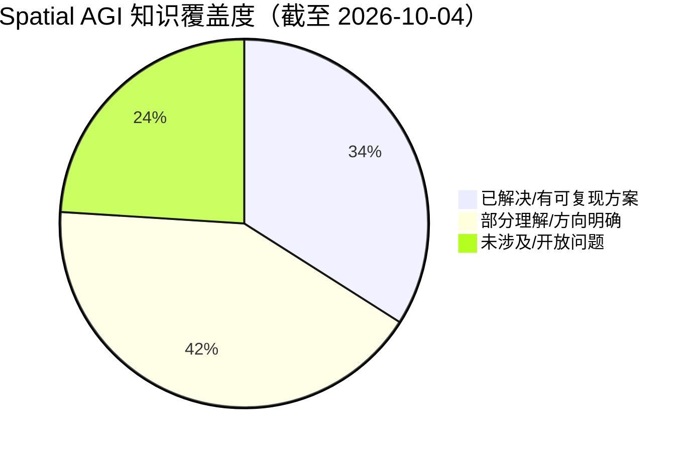
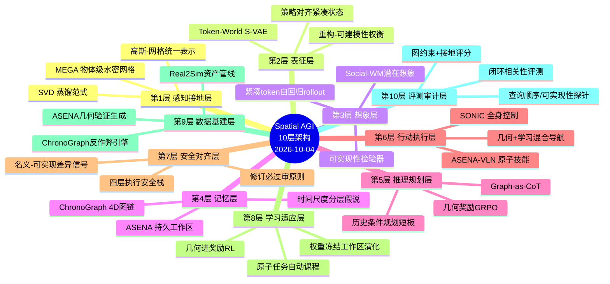
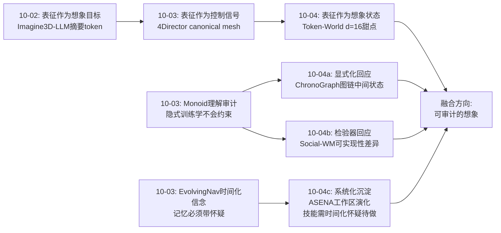

# Spatial AGI 每日深度思考 — 2026-10-04

**日期**: 2026-10-04
**基础日期**: 2026-10-03（昨日任务完整完成，5 篇论文 + 818 行思考）
**论文数量**: 5 篇
**主题**: 空间智能的"工程化转向"——五篇论文各自回答了一个系统构建的根本问题：**想象发生在哪个空间**（Token-World：策略对齐的紧凑 token 空间）、**空间如何变得可触碰**（MEGA：3DGS 到水密物体网格的蒸馏接地）、**想象如何被事实核查**（Social-WM：名义-可实现差异作为安全信号）、**空间推理如何可验证**（ChronoGraph：功能 4D 场景图作为理解与规划的统一符号表示）、**空间智能体如何成为系统**（ASENA：权重冻结、工作区自演化的编码 agent 具身化）

---

## 📅 每日总结

**日期**: 2026-10-04
**论文数量**: 5篇
**主题**: 如果说昨天完成的是对空间智能核心组件的"压力测试"（想象快不快、认知从哪学、理解真不真、控制准不准、记忆会不会骗你），今天五篇论文共同完成的是一次**架构大讨论**——它们不再各自优化某个组件的指标，而是不约而同地质疑组件之间的**接口**：世界模型和策略之间的接口该是什么（Token-World 说：不经过像素）、感知表示和物理引擎之间的接口该是什么（MEGA 说：水密网格 + 坐标对齐）、想象和执行之间的接口该是什么（Social-WM 说：插一个可实现性检验器）、理解和规划之间的接口该是什么（ChronoGraph 说：同一个 4D 场景图）、通用智能和机器人身体之间的接口该是什么（ASENA 说：程序 + 传感器 + 持久工作区）。

**关键突破**:
- 🚀 **表征-动力学的解耦原则（Token-World）**：世界模型的状态空间应该直接就是策略消费的表征空间。S-VAE 沿特征维压缩（2560→16）但保留空间布局，消融揭示"重构保真度与扩散可建模性此消彼长"（d=128 重构最好但 LDS 最差，d=16 是动力学甜点）。闭环策略评估相关性 0.794 vs Ctrl-World 0.583，每步 0.359s（快 2-6 倍）。**为重建优化的表征天然不利于预测**——这句话值得刻在每个空间智能系统的设计文档第一页。
- 🚀 **"能看"与"能摸"的统一（MEGA）**：3DGS 各向异性高斯不贴表面、没有占据信息，物理引擎无法使用。SVD 蒸馏范式——216 个球面虚拟视角把 3DGS 的渲染质量转译为神经 SDF 的几何质量——产出物体级水密、坐标对齐网格，NVOS mIoU 91.8/mAcc 98.5 全场最佳，且可即插增强 2DGS/PGSR。"高斯管看、网格管摸"的双表示架构成为 Real2Sim 的关键积木。
- 🚀 **约束的信息论价值（Social-WM）**：交互数据中"指令未完全执行"的痕迹不是噪声而是安全信号。逆动力学的监督从指令改为里程计实际运动，一行改动迫使潜在表征编码约束信息。propose–imagine–evaluate–select 闭环让人碰撞率从 39% 级降到 21.67%，零样本迁移 MP3D 依然 23.34%。社会约束（个人空间）被几何化为可实现性的一部分。
- 🚀 **可验证的空间思维链（ChronoGraph）**：功能 4D 场景图把"拉把手→抽屉位移→内容物可及"编码为动作链接的状态转移，观察与预期用同一形式表示——理解即重建图链，规划即延长图链。RL 奖励中显式包含 3D 中心误差与运动方向余弦——**空间正确性第一次成为可直接优化的显式目标**。9B 开源模型 75.2 分逼近 GPT-6 Astra 的 79.4。
- 🚀 **权重固定的自演化（ASENA）**：编码 agent 写程序、读传感器、修失败、沉淀技能，模型权重完全冻结，工作区 10 轮演化把重复任务成功率从 72% 推到 98%。更颠覆的是对照组数据：GPT-6 Astra 不用任何学习导航策略就在 R2R agentic split 上拿到 87-88% SR（人类 90%）——**通用推理 × 空间工具接口**已经是强大的空间智能体。

**架构演进**: 10 层架构维持 10 层，但今天出现了三个结构性信号——(1) **接口层觉醒**：三篇论文（Token-World/Social-WM/ChronoGraph）的贡献都不在组件内部而在组件边界，说明单组件优化进入收益递减区；(2) **接地层补全**：MEGA 填上了"渲染场 → 物理场"的转换空缺，想象层产出的场景终于可以被物理引擎消费；(3) **系统层成形**：ASENA 第一次展示了"参数冻结、经验以程序形式积累"的完整真机闭环，暗示空间智能的最终形态可能不是一个模型而是一个自演化的系统。

### 📊 一句话总结

今天五篇论文把空间智能从"造更好的组件"推进到"定义更好的接口"：想象的载体被换到策略自己的表征空间、想象的产物被接上物理引擎、想象的过程被插上安全检验器、空间推理被装进可验证的符号容器、而所有这些被一个权重冻结却能自我演化的 agent 系统整合到了真机上——**组件时代接近尾声，接口与系统时代开始**。

### 🔗 延续性

**昨日→今日**: 昨日确立"审计纪元"主线——五种审计（效率/理解/控制/能力/时间）共同发现表层指标高估真实能力。今日五篇恰好是对昨天审计发现的三种"病因"的响应：(1) 昨日 Monoid Worlds 证明"为单步预测优化的表征不利于多步推理"——今日 Token-World 在工程层面呼应："为渲染优化的表征不利于动力学"，并给出压缩维度的甜点解法；(2) 昨日 4Director 主张"能由表示保证的性质不应依赖生成祈祷"——今日 MEGA 把同一原则从视频生成推广到物理交互：几何可用性（水密、对齐）必须由表示蒸馏保证；(3) 昨日 EvolvingNav 的信念滤波是"想象产物如何被更新"，今日 Social-WM 补上"想象产物如何被执行前检验"——检验器与生成器的分离正好呼应昨天"审计作为第一公民"的判断。

**今日→明日**: 明日值得追踪的方向——(1) Token-World 的 d=16 甜点是否随任务动力学复杂度移动（操纵 6-12 自由度 → 导航/流体），如果是，"表征容量匹配环境动力学自由度"成为可检验假说；(2) ChronoGraph 的符号图 × Token-World 的潜在动力学的融合——图提供可验证接口，潜在动力学提供连续预测；(3) Social-WM 的可实现性检验器推广到操纵（抓不稳的抓取指令会显现为名义-可实现差异吗）；(4) ASENA 的工作区演化在动态环境下的失效模式——空间技能库如何面对家具挪动；(5) MEGA 的逐物体优化慢 → agentic 按需接地（just-in-time geometry）。

---

## 💡 核心见解

### 见解1: 为下游消费者设计的表征才配做世界模型的状态

**从 Token-World 获得**

- ✅ RGB 中间层是历史包袱：世界模型预测像素 → 策略重编码 → 动作，这条链路把容量浪费在与决策无关的视觉细节上，还放大生成伪影
- ✅ 压缩要沿特征维、保留空间布局：与 DeltaWorld/OneWM-VLA 的聚合式压缩相反——空间关系的演化预测需要每个位置独立存在
- ✅ 重构-可建模性权衡的实证：d 从 8→128，NMSE 0.103→0.041 但 LDS 0.310→0.118——更好的重建换来更差的扩散特性；动力学性能对维度非单调，d=16 最优
- ✅ 闭环有效性：开环保真度增益真正转化为闭环策略评估可信度（r=0.794），且快 5.3× 于 Ctrl-World

**对Spatial AGI的启发**: 这条原则可以无限推广——**空间记忆的状态空间应该是推理消费者要用的空间，空间想象的状态空间应该是行动者要用的空间**。推论一：VLM 的感知表征 ≠ 空间工作记忆，前者为理解优化，后者必须为"可想象性"优化（消融证明直接用原始 VLM 特征做动力学 NMSE 0.785 vs S-VAE 0.489）。推论二：d=16 的甜点可能隐含"环境动力学本征维度"——刚体操纵约 6-12 自由度，d=16 恰好覆盖；如果是真命题，不同任务类应该有不同的最优压缩维度，这可以直接实验检验。推论三：与昨日 Sparse-WAM 互补——Sparse-WAM 压缩时间维（动作引导的稀疏关键帧），Token-World 压缩特征维（紧凑空间 token），"稀疏时间 × 紧凑空间"可能是长时程想象的完整答案。

### 见解2: 视觉保真 ≠ 几何可用——空间表示必须通过"可交互性审计"

**从 MEGA 获得**

- ✅ 3DGS "能看不能摸"是表示级的缺陷：各向异性高斯为渲染优化，天然浮在表面附近，无占据语义
- ✅ SVD 自蒸馏范式：一个空间表示可以作为另一个表示的监督源——3DGS 当老师渲染 216 视角，神经 SDF 当学生学表面，光度对齐 + Eikonal 正则
- ✅ 水密 + 坐标对齐是物理可用的两个硬指标：非水密网格在物理仿真中穿模（论文 Fig.6 演示），不对齐则渲染与碰撞两张皮
- ✅ SVD 可即插：SVD+2DGS、SVD+PGSR 均超各自原版——蒸馏信号本身有超越具体架构的普适价值

**对Spatial AGI的启发**: "能由表示保证的性质，不应依赖生成祈祷"（昨日 4Director 原则）在物理维度上的重演。建立"可交互性审计"检查项：任何空间表示（3DGS、视频生成、neural field、语言描述）都要能回答"手伸过去会碰到什么"——回答不了就需要一个 MEGA 式的接地模块。推论一：Real2Sim 管线的关键积木就位——真实场景 3DGS 扫描 → MEGA 物体网格 → 物理引擎，视觉逼真 + 物理可用的仿真资产可以批量生产，这直接服务 Token-World 类世界模型的训练数据需求。推论二：逐物体 216 视角优化太慢，天然适合 agentic 化——agent 注意到哪个物体需要交互，才对哪个物体做 just-in-time 接地，与 SAGO 亚秒分割结合可接近实时。推论三：物体级水密占据是空间记忆的理想单元——比点云紧凑、比体素语义化、可直接供抓取与碰撞查询。

### 见解3: 名义与可实现的差距是免费的传感器

**从 Social-WM 获得**

- ✅ 交互数据天然包含"指令-结果差"：朝行人下发前进指令，实际执行的是停止/绕行——这不是执行噪声，是物理与社会约束的直接测量
- ✅ 监督信号的一行改动价值千金：逆动力学不用指令 a_t 而用里程计恢复的 ã_t 做目标，潜在转移被迫保留安全相关信息（否则无法区分"执行了"和"被挡了"）
- ✅ 检验与生成解耦：CVAE 提案（要什么）→ 世界模型想象（会怎样）→ 逆动力学检验（实际能做到什么）——安全评估目标无关，只进 c_safe 不进 c_task
- ✅ 社会约束被几何化：个人空间（proxemics）与物理阻挡统一为同一个可实现性信号——不需要行人检测器、不需要特权人类状态

**对Spatial AGI的启发**: 这是控制论"内部模型原理"的逆向应用——用预测残差暴露内部模型的盲区，盲区即危险。三个推广方向：(1) 操纵版——抓取指令的可实现性差异可以暴露"抓不稳"，同一范式可能覆盖全部具身动作的安全检验；(2) 对齐版——检验器必须冻结、不可被策略优化收买（如果拿 c_safe 做 RL 奖励，agent 会学会钻安全信号的空子）， verifier 不可收买原则在空间安全层的具体化；(3) 数据版——任何大规模机器人日志都自带这类监督，空间约束学习不需要人工标注危险区域。与昨日审计主线呼应：Social-WM 本质上给世界模型装了一个随身的、每步运行的微型审计器。

### 见解4: 可验证的符号结构是空间推理的审计就绪形态

**从 ChronoGraph 获得**

- ✅ 理解与规划的统一表示：观察到的转移（拉了把手、抽屉开了）与预期的转移（将要拉把手、抽屉会开）用同一个功能 4D 场景图编码——理解即重建、规划即延长
- ✅ 几何进奖励：RL 奖励显式包含 3D 中心高斯核（水平/垂直容差分离）+ 跨状态运动方向余弦——空间正确性从隐含在答案对错变为可分解、可加权的显式目标
- ✅ 消融证明结构监督不可替代：Graph-as-CoT > Naive Thinking > Direct；answer-only 微调反而降低 VLM4D 迁移——增益来自图监督本身而非任务适应
- ✅ 揭示真短板：历史条件规划远弱于静态条件（53.7 vs 88.9）——"冰箱门还开着吗"这类隐状态推断是当前 VLM 的系统性弱项

**对Spatial AGI的启发**: 与昨日 Monoid Worlds 的判据呼应但路线相反：Monoid 用数学审计潜在模型的理解深度，ChronoGraph 用符号结构让理解直接可检查、可奖励。两条路线的张力本身就是洞察：**潜在表征派（Token-World/Social-WM）效率高但不可审计，符号结构派（ChronoGraph）可审计但表达受限（单点 3D 中心、离散状态、无连续形变）**。融合方向明确：符号图作为接口与审计层，潜在动力学作为连续预测引擎——图节点状态由潜在模型填充，图转移由潜在模型预测，图结构保证可验证性。另一个可操作收获：数据引擎的反作弊设计（无帧答案一致则拒收）应成为所有多模态空间基准的标配——语言先验捷径是空间评测最大的敌人（呼应 10-03 Uruqi 的诊断）。

### 见解5: 空间智能的最终形态可能是系统而非模型

**从 ASENA 获得**

- ✅ 权重固定、经验以程序形式积累：W_{k+1} = I_φ(W_k, 𝒯_k, f_k)，10 轮演化 72%→98%——"自我改进"不必微调参数
- ✅ 强编码 agent 本身就是强导航者：GPT-6 Astra 无学习策略 R2R 87-88%（人类 90%）；学习策略的价值是条件性的——弱后端 +11pp，强后端主要是效率收益（工具调用 −47~63%）
- ✅ 原子导航数据引擎：9 类几何验证的原子任务（穿门、对齐、接近）自动生成，4B 模型达到 R2R 68.7 SOTA——空间技能可以分解为可自动验证的原子操作
- ✅ 四层安全：程序综合 → MuJoCo 在线验证 → 人工授权 → 物理执行独立限制层；修订后程序必须重新过检——演化不能绕过安全审计

**对Spatial AGI的启发**: 这是对"空间智能 = 一个大模型"叙事的最强挑战。通用推理 × 空间工具接口已经逼近人类导航水平，专项模型的定位从"核心"降级为"效率工具"。由此产生空间智能的核心架构问题：**什么该进参数、什么该进工作区？** 初步分工假说——感知与运动控制进参数（它们需要毫秒级反应与模式泛化），任务知识与技能编排进工作区（它们需要可读、可审计、可回滚、可快速更新）。ASENA 的未解之处同样重要：工作区演化依赖地面真值反馈（仿真里知道任务成没成），真实部署中"成败判断"本身需要空间智能——演化闭环在真机上不完整；动态环境（家具挪动）会让沉淀的技能过期，工作区也需要 EvolvingNav 式的时间化怀疑。系统形态的空间智能 = Token-World 的想象引擎 + MEGA 的物理接地 + Social-WM 的安全检验 + ChronoGraph 的符号接口 + ASENA 的演化容器——今天五篇恰好是五个模块的交付。

### 见解6: "接口优先"正在取代"组件优先"的设计哲学

**从今日五篇的整体格局获得**

- ✅ Token-World 的贡献是"世界模型-策略接口"（不经过像素）；Social-WM 的是"想象-执行接口"（可实现性检验器）；ChronoGraph 的是"理解-规划接口"（共享 4D 图）；MEGA 的是"渲染-物理接口"（水密对齐网格）；ASENA 的是"通用智能-机器人接口"（程序化工具）
- ✅ 五个接口的共同特征：都是**降维转换器**——把上游表示翻译成下游能直接消费的形式，转换本身保证性质（一致性/安全性/可验证性）而不依赖下游的统计能力
- ✅ 这解释了为什么单组件 SOTA 刷新的边际价值在下降：接口不匹配时，更好的组件只是更精确地生成下游消费不了的输出

**对Spatial AGI的启发**: 昨日"审计纪元"（检验已有组件）的自然延伸是"接口纪元"（重新定义组件如何衔接）。实操原则升级版：(1) 设计任何空间智能模块前，先写它的接口契约——输入谁的什么表示、输出谁的什么表示、转换保证什么性质；(2) 评测任何模块时，在它的真实接口环境下测（Token-World 的教训：开环保真度必须在闭环中复验）；(3) 性质能放进表示/接口的，不要放进模型的统计行为（4Director + MEGA + ChronoGraph 三重印证）。

### 见解7: 空间智能的三种时间尺度在今天首次同框

**从 Social-WM + ChronoGraph + ASENA 的合力获得**

- ✅ 毫秒-秒级（Social-WM）：每步的 propose-imagine-evaluate-select，动作块 H 步，安全信号实时
- ✅ 秒-分钟级（ChronoGraph）：任务的图链演化，5-15 步原子交互，状态转移与隐状态跟踪（历史条件规划）
- ✅ 小时-天级（ASENA）：跨任务的工作区演化，10 轮 pass 的经验沉淀与复用
- ✅ 加上 Token-World 的 rollout 时域与 MEGA 的离线资产化（一次性建模、终身使用），空间智能需要一个跨四个数量级时间尺度的统一记忆/经验架构

**对Spatial AGI的启发**: 昨日 EvolvingNav 处理的是"分钟-小时级"的世界演化信念，今天 ASENA 把时间尺度拉到"天级"（技能过时问题）而 Social-WM 压到"毫秒级"（实时安全）。完整的空间时间智能不是单一记忆系统，而是**时间尺度分层**的结构：反应层（无记忆，纯当前观测 + 安全检验）、任务层（图链/信念，任务内滚动）、经验层（技能/笔记，跨任务沉淀）、资产层（网格/地图，慢变化）。各层之间需要不同的更新频率与置信度语义——这可能是比 10 层能力架构更接近工程真实的设计维度。

---

## 🔗 与昨日思考的联系

### 昨日重点

昨日五篇（Sparse-WAM / Uruqi / Monoid Worlds / 4Director / EvolvingNav）完成对空间智能核心组件的"三重审计 + 两个学习论"：想象要高效（动作引导稀疏化 2× 加速）、认知可从体验中学（特权几何编译 episode 监督）、理解需严格判据（约束传播 + 证明深度，next-state 训练被证伪）、一致性由表示保证（canonical mesh + SE(3) 根治漂移）、记忆必须时间化（预测性 4D 信念）。核心判断："从能不能做到进入做得对不对、快不快、可不可信的工程科学阶段。"

### 今日进展

今日五篇是对昨天审计结论的**架构响应**：

1. 昨日 Monoid Worlds 证明"next-state 目标训不出约束传播"（理解审计）→ 今日 **Token-World** 在工程端呼应："next-frame 目标训出的 RGB 表征不利于动力学"，并把世界模型状态搬进策略对齐的紧凑空间——**两个"表征错配"诊断（推理的、想象的）在同一周出现，表征-目标匹配成为本周最强主线**。
2. 昨日 4Director 确立"能由表示保证的不靠生成祈祷"（控制审计）→ 今日 **MEGA** 把该原则推广到物理维度：渲染场到物理场的转换必须是显式蒸馏而非隐式希望，水密+对齐由 SVD 范式保证。
3. 昨日 EvolvingNav 让想象产物可被时间更新（信念滤波）→ 今日 **Social-WM** 补上想象产物的执行前检验（可实现性滤波）——想象-更新的完整安全环闭合：**想象 → 检验 → 执行 → 观测 → 修正信念**。
4. 昨日 Monoid 的"中间状态可见性决定理解天花板" → 今日 **ChronoGraph** 从正面利用：显式图链就是空间推理的中间状态，且可被直接奖励——昨日证伪了"端到端隐式推理"，今日示范了"显式中间状态工程"。
5. 昨日五篇全是"组件审计"，今日五篇全是"接口与系统"——审计发现问题，接口层解决问题，ASENA 把一切装进可演化的系统容器。

### 演进路径



---

## 📚 论文概览

**1. Token-World**（PKU/HKUST/MUKA，arXiv:2610.00575）——策略对齐的世界模型。将 VLM 视觉 token（108×2560）经 S-VAE 沿特征维压缩为 108×16 的紧凑状态（保留空间布局），flow-matching DiT + GRU 循环记忆在该空间做动作条件自回归 rollout，策略消费时经冻结解码器还原。闭环策略评估相关性 0.794（Ctrl-World 0.583），每步 0.359s，快 2-6 倍。消融揭示重构-可建模性权衡与 d=16 甜点。

**2. MEGA**（PKU/鹏城/北航，arXiv:2610.01707）——物体级 3DGS 网格提取。segment-then-mesh：SAGO 亚秒交互分割 → 球面 216 虚拟视角渲染（SVD）→ 神经 SDF 光度蒸馏 + Eikonal → marching cubes 水密网格，与原 3DGS 坐标对齐。SPIn-NeRF/NVOS meshable 方法 SOTA，SVD 可即插增强 2DGS/PGSR；高斯-网格统一表示支撑人-物交互与物理仿真。

**3. Social-WM**（Lehigh，arXiv:2609.40177）——安全感知潜在世界模型。核心观察：社交导航中名义动作与可实现动作存在系统性差异（指令被物理/社会约束截断）。世界模型以真实未来为预测目标 + 可实现逆动力学（里程计监督），名义-可实现差异成为执行前安全信号。CVAE 提案 → 潜在想象 → 可实现性过滤 → 目标选择。Social-HM3D 63.77% SR / 21.67% 人碰撞，零样本迁移 Social-MP3D。

**4. ChronoGraph**（ETH/Berkeley/Google/Microsoft，arXiv:2609.39665）——功能 4D 场景图统一理解与规划。可供性部件节点 + 语义/几何状态 + 动作链接转移；数据引擎（GPT-5.5 语义图 + SAM3/SAM-3D 接地 + 反作弊 QA 模板）产出 15,094 QA；Graph-as-CoT SFT + GRPO 联合 RL（NW 对齐图奖励 + 3D 中心高斯核 + 运动方向余弦）。9B 达 75.2（GPT-6 Astra 79.4），零样本 VLM4D +6.6，真机移动操纵无微调。

**5. ASENA**（NVIDIA/UCSD，arXiv:2609.39207）——自演化具身 agent 系统。编码 agent 程序化接入 G1 传感器/计算/受监督执行，MCAP 记录支持检查修复，持久工作区（笔记+技能）在权重冻结下演化：重复 100 任务 10 轮 72%→98%（R2R）、65%→89%（RxR）。ASENA-VLN 4B（几何验证原子任务数据）R2R 68.7/RxR 70.2 SOTA，作为可选工具使弱后端 +11pp、工具调用减半。四层安全 + 真机搜索/检查/手势任务。

---

## 📊 技术栈演进对比表

| 层级 | 2026-09 上旬 | 2026-09 下旬 | 2026-10-02 | 2026-10-03 | **2026-10-04（今日）** |
|------|------------|------------|-----------|-----------|-----------|
| **感知/接地层** | 3DGS 重建为主 | 前馈 3DGS（PhGS） | AgentSTAR agentic 感知 | GaugeVLM 测量化监督 | **MEGA：渲染场→水密物理网格的蒸馏接地** |
| **表征层** | 通用视觉特征 | DINO 特征动力学 | Imagine3D-LLM 摘要 token | Monoid 判据：中间状态可见性 | **Token-World：策略对齐紧凑 token，d=16 甜点** |
| **想象层** | 视频世界模型 | WAM 成为算子 | 静态 3GS 内部想象 | Sparse-WAM 2× 加速 + 4Director 可控 | **想象状态=策略表征本身；Social-WM 可实现性检验** |
| **记忆层** | 空间索引 | 证据库（EviSplat） | 查询前不合并 | EvolvingNav 时间化信念 | **ChronoGraph 图链工作记忆 + ASENA 跨任务技能库** |
| **推理/规划层** | 端到端策略 | VLA 分化 | 分析-综合循环 | Monoid：组合训练 96% | **ChronoGraph：Graph-as-CoT + 几何奖励 RL，75.2 逼近闭源 SOTA** |
| **安全层** | 几乎缺席 | 少量鲁棒性工作 | — | 审计意识觉醒 | **Social-WM 可实现性安全信号 + ASENA 四层执行安全** |
| **数据层** | 人工采集 | 自动标注兴起 | Ego4WAM 数据归因 | Uruqi 特权几何编译 | **ChronoGraph 反作弊 QA 引擎 + ASENA 原子任务几何验证生成** |
| **系统层** | 单模型思维 | benchmark 驱动 | 组件堆叠 | 审计方法论 | **ASENA：权重冻结 + 工作区自演化的完整真机闭环** |
| **评测层** | 生成质量指标 | 任务成功率 | 空间基准涌现 | EvoWorld-Bench 配对时间控制 | **ChronoGraphBench 图约束+接地评分；Token-World 闭环相关性** |
| **监督层** | 稀疏标注 | RLHF/偏好优化 | GaugeVLM 干预监督 | Uruqi episode 编译 | **ChronoGraph 几何进奖励；Social-WM 差异信号免费监督** |

**本周主线读法**: 10-02 造组件 → 10-03 审组件 → 10-04 定义组件之间的接口并装进系统。三天的曲线是"建设-检验-集成"的完整工程循环。

---

## 🧭 知识缺口分析



**已解决/有可复现方案（34%）**:
- ✅ 世界模型的策略对齐状态构造（S-VAE 压缩 + flow DiT，d=16 甜点，闭环验证方法）
- ✅ 3DGS → 物体级水密网格的转换（SVD 蒸馏范式，SOTA 且可即插）
- ✅ 社交导航的安全检验（可实现逆动力学 + 差异信号，碰撞率减半）
- ✅ 空间推理的符号化训练（Graph-as-CoT + 几何奖励 RL，开源 9B 逼近闭源 SOTA）
- ✅ 导航原子技能的自动数据引擎（几何验证生成，4B 达 SOTA）
- ✅ 权重固定的任务级自演化（工作区演化 72%→98%，真机验证）
- ✅ 具身执行的四层安全栈（仿真验证→人工授权→物理限制→急停）

**部分理解/方向明确（42%）**:
- ⚠️ 紧凑表征维度的任务依赖性（d=16 是否随动力学自由度移动，未验证）
- ⚠️ 可实现性检验推广到操纵/人机协作（社交导航之外的差异信号未探）
- ⚠️ 符号图与潜在动力学的融合接口（两条路线的张力明确，融合未做）
- ⚠️ 历史条件规划（ChronoGraph 最弱项 53.7，隐状态跟踪是系统性短板）
- ⚠️ 工作区演化的真机闭环（依赖 GT 成败反馈，动态环境使技能过期）
- ⚠️ Real2Sim 资产管线的规模化（MEGA 逐物体 216 视角优化慢，非实时）
- ⚠️ 强 agent 与弱工具的搭配规律（GPT-6 Astra 加 VLN 反而 RxR 略降，原因未明）
- ⚠️ 检验器的抗收买性（c_safe 做 RL 奖励会被钻空子，verifier 冻结只是工程补丁）
- ⚠️ 水密网格到铰接体/软体的扩展（MEGA 局限静态刚体）

**未涉及/开放问题（24%）**:
- ❌ 四时间尺度（毫秒/秒/分钟/天）的统一记忆架构——分层假说今日首次提出，无实证
- ❌ 符号图的连续形变/多物体耦合动力学表达（单点 3D 中心 + 离散状态的天花板）
- ❌ 真实部署中的自监督成败判断（ASENA 演化闭环的缺失环节）
- ❌ 跨 backbone 的表征对齐（Token-World 绑定 Qwen3-VL，通用性未知）
- ❌ 想象-检验-执行-信念更新全环路的端到端集成（五模块今天才凑齐）
- ❌ 群体空间智能（多机器人共享工作区/信念，全部工作为单体）
- ❌ 周期性约束传播（Monoid 回环失败的机制解，连续两日未解）

---

## 🗺️ 10层架构思维导图



---

## 🛤️ 主线技术路径

### 路径一：想象引擎的"载体迁移"路线（4 阶段）

```
阶段1（已完成）: 像素想象
  视频世界模型预测 RGB，策略重编码消费
  代表: Ctrl-World, WorldGym, IRASim
  缺陷: 容量浪费、误差放大、延迟高（0.7-2.2s/步）

阶段2（今日完成）: 表征想象
  Token-World：状态=策略消费的紧凑 VLM token
  关键技术: S-VAE 特征维压缩 + flow DiT + GRU 记忆
  里程碑: 闭环相关性 0.794、0.359s/步

阶段3（进行中）: 检验想象
  Social-WM：想象产物经可实现性核查后执行
  关键技术: 逆动力学差异信号 + 提案-想象-评估-选择闭环
  里程碑: 碰撞率减半且零样本迁移

阶段4（未来）: 符号锚定想象
  想象的状态同时投影到可验证符号图（ChronoGraph 图链）
  潜在动力学提供连续预测、图结构提供审计接口
  目标: 想象既高效又可检验——"可审计的想象"
```

### 路径二：空间接地路线（4 阶段）

```
阶段1（已完成）: 看得见的场景
  NeRF/3DGS 光度重建，人类可渲染浏览
  缺陷: 无占据语义、物理引擎无法消费

阶段2（今日完成）: 摸得着的场景
  MEGA：segment-then-mesh，物体级水密网格
  关键技术: SVD 视觉蒸馏 + 坐标对齐
  里程碑: 物理交互 + 真实感渲染并存

阶段3（进行中）: 变得动的场景
  4Director（昨日）刚性 SE(3) + MEGA 网格合流:
  铰接体版本 = 真实室内环境的可交互数字孪生
  关键缺口: 铰接/软体/流体的水密动态几何

阶段4（未来）: 活着的场景
  演化世界（EvolvingNav）× 可交互孪生:
  仿真资产带时间演化模型，机器人世界与想象世界同步滚动
  目标: Real2Sim2Real 的完整闭环
```

### 路径三：空间智能系统化路线（4 阶段）

```
阶段1（已完成）: 单一策略
  端到端 VLA/VLN，能力上限=训练分布
  代表: NaVid 系（R2R 41.9→54.0）

阶段2（已完成）: 混合专家
  学习策略 + 几何工具 + 安全层（Social-WM/ASENA-VLN）
  里程碑: 4B 策略 R2R 68.7 SOTA；碰撞减半

阶段3（今日完成）: 演化系统
  ASENA：编码 agent 编排一切，权重冻结经验以程序积累
  里程碑: 重复任务 72%→98%；强 agent 无策略逼近人类

阶段4（未来）: 自举闭环
  想象引擎生成训练场景（4Director 可控 4D）
  → ChronoGraph 引擎自动标注监督
  → 原子技能数据引擎产出课程
  → ASENA 容器演化与审计
  目标: 空间智能的自我改进飞轮，人工只做安全授权
```

---

## 🔬 待探索议题

1. **紧凑维度与环境动力学的映射律**：Token-World 的 d=16 甜点如果随任务自由度移动（操纵→导航→流体），可建立"表征容量-动力学复杂度"的定量定律，直接指导一切潜在世界模型的维度选择。实验设计：同一 S-VAE 管线跨 3 类任务扫维度。

2. **可实现性差异作为通用具身安全信号**：把 Social-WM 的名义-可实现差异移植到操纵（抓取滑落）、人机协作（推工会反抗）、驾驶（加塞被拦）。假说：凡有物理约束的具身动作都有该信号。需要每个领域的"里程计等价物"（真实施行的动作测量）。

3. **符号图 × 潜在动力学的融合架构**：ChronoGraph 图节点由 Token-World 式潜在状态填充、图转移由潜在动力学预测、图结构提供审计接口。关键难点：离散符号与连续状态的接口误差如何不随图链长度放大（可借 Monoid 组合训练的中间状态暴露思路）。

4. **历史条件规划的隐状态跟踪**：ChronoGraph 揭示"冰箱门还开着吗"类问题是系统性短板。这与 EvolvingNav 的信念维护、Monoid 的约束传播可能是同一能力的三种测试——值得做一个统一的"空间状态持久性"基准，把三条线拉到同一张考卷上。

5. **检验器不可收买性的形式化**：如果 c_safe 进了 RL 奖励，agent 会学会挑检验器的盲区。需要"verifier-gap"理论：策略优化压力下，可实现性估计器与真实可实现的差距如何演化。工程近似：检验器冻结 + 定期用真实执行数据重校准。

6. **Just-in-time 空间接地**：MEGA 逐物体优化太慢，改为 agent 注意力驱动——注意到哪个物体、即将交互哪个物体，才对它做 216 视角蒸馏。与 SAGO 亚秒分割、语义预测（下一个要碰什么）结合，可能实现近实时的按需物理接地。

7. **工作区的时间化怀疑**：ASENA 的技能库假设世界静态，家具一挪全部过期。把 EvolvingNav 的信念滤波思想搬进工作区：技能附带"环境前提条件"，前提失效时技能自动降级为"需重验证"。这是系统层与记忆层的直接接口问题。

8. **原子技能的组合语义**：ASENA 九类原子导航任务覆盖了位移行为，但 ChronoGraph 显示真正难的是"操作改变状态后的下一步"。原子技能库需要从"运动原子"扩展到"状态改变原子"（开/关/放/取），每个原子带前置/后置条件的几何判据——与 ChronoGraph 的可供性转移天然同构。

9. **跨 backbone 表征对齐的边界**：Token-World 全部策略共享 Qwen3-VL。若世界模型服务多 backbone，S-VAE 应压缩谁的表征？可能答案：压缩"任务通用空间语义"子空间（各 backbone 表征的公共因子），这需要表征对齐研究（如跨模型特征对应）的输入。

10. **数据引擎的反作弊标准化**：ChronoGraph 的"无帧答案一致则拒收"、Uruqi 的查询顺序探针、Token-World 的闭环复验——三个反偏差技术应固化为空间基准构建的强制标准，成立一个"空间评测反作弊清单"，本周三篇论文已经提供了前三条。

11. **空间智能的功耗-延迟预算**：ASENA 真机任务 10-20 分钟（主要是 agent 推理慢），Token-World 0.359s/步，Social-WM K 候选并行想象。系统级问题：毫秒安全层、秒级想象、分钟级规划、小时级演化的算力如何在同一机器人上分配？缺乏跨层的延迟-算力-性能权衡研究。

---

## 💡 本质思考：如何达成通用空间智能

### 子问题1: 核心能力的本质是什么？——空间智能的"想象"到底发生在哪里？

今日 Token-World 给出了迄今最工程化的答案：**想象发生在行动者自己的表征空间里，而不是在像素空间里**。这与认知科学的知觉符号系统理论（imagination = 对感知表征的仿真，无需经过真实感知通道）深度吻合。由此推论：空间智能的想象层不是一个"视频生成器 + 编码器"的组合，而是一个**与决策表征同构的动力学模型**。

但 Social-WM 和 ChronoGraph 补充了关键约束：想象空间必须是**可检验的**——Social-WM 用可实现性差异检验想象的动作，ChronoGraph 用符号图检验想象的场景状态。所以完整答案是：想象发生在紧凑的、策略对齐的、潜在表征空间里，但它的出入口挂着两个检验器（动作可实现性 + 状态符号一致性）。**纯粹的内部想象既不可信也不安全；纯粹的显式表示既昂贵又受限；正确的架构是潜在空间想象 + 符号与物理的接口检验。**

这直接回答了"为什么现在还没有空间 AGI"：此前的想象层要么全隐（视频世界模型，不可审计），要么全显（场景图/规划器，无连续预测能力）。今天五篇论文第一次把两侧的组件都交付了——融合是下一步的明确工作。

### 子问题2: 当前方法与理想目标的差距在哪里？——空间知识与空间技能的本质区别是什么？各自如何获得？

本周的积累让我们可以给出一个相当清晰的二分法：

**空间知识**（世界是什么样的、约束是什么）:
- 本质：环境动力学的内部模型 + 约束的编码
- 获得路径：交互经验的预测目标学习（Token-World 的动力学、Social-WM 的可实现性、Uruqi 的 episode 监督）
- 检验标准：Monoid 式约束传播——真知识能在多步推理链上保持一致
- 存储形态：参数（感知/动力学的模式泛化）

**空间技能**（在特定环境中达成特定目标的程序）:
- 本质：可执行的、带前提条件的操作序列
- 获得路径：原子任务课程（ASENA 几何验证生成）+ 执行经验的程序沉淀（工作区演化）
- 检验标准：任务成功率 + 前提条件覆盖度
- 存储形态：工作区（可读、可审计、可回滚、可快速更新）

**混乱二者的代价**：把技能当知识学（端到端策略记路线）→ 分布外崩溃；把知识当技能存（技能库硬编码物理）→ 环境一变全过期。正确架构是今日 ASENA 隐含的分工：**知识进参数（由世界模型学习承载），技能进工作区（由演化机制维护），接口是 ChronoGraph 式的可验证中间表示**。

### 子问题3: 从今天到理想状态，最可能的路径是什么？——空间智能系统的"信任"如何建立与维护？

今天的安全与审计线索汇聚成一个完整的信任架构：

1. **性质的表示级保证**（最强信任）：一致性由 canonical mesh 保证（4Director）、物理可用性由水密对齐保证（MEGA）、推理正确性由图结构可检查（ChronoGraph）——能放进表示的不要放进统计。
2. **过程的检验器保证**（次强信任）：可实现性差异信号在每次执行前运行（Social-WM）、修订后程序必须重新过安全检查（ASENA）——检验器独立于生成器、冻结且不可被优化压力收买。
3. **经验的审计追踪**（兜底信任）：MCAP 全记录可回放（ASENA）、图链作为显式推理痕迹可人审（ChronoGraph）——任何决策可以事后追责到具体证据。
4. **时间的诚实标注**（信任的维护）：信念带时间戳与 unknown 质量（EvolvingNav）、技能带环境前提（待做）、模型带适用域声明（Token-World 自认单一 backbone 局限）——信任随时间衰减，必须显式管理。

信任架构的深层原则与本周审计主线一致：**信任不能建立在单一模型的自我报告上，必须分布在表示、检验、记录、时间四个互不依赖的机制上**。空间智能的可靠性不是训练出来的，是架构出来的。

---

## 🧩 附录A: 更进一步的本体思考

### A1. "接口"的本体地位——空间智能的第二性存在

传统上我们只把"物"（模型、数据、表示）当本体，接口只是管道。今天五篇论文共同把接口提升为**性质的发生地**：一致性发生在 mesh-渲染接口、安全性发生在想象-执行接口、可验证性发生在推理-符号接口。这意味着空间智能的"实体"不再是模型而是**接口契约的集合**——模型的地位降为契约的实现者。这与软件工程的演进（单体 → 服务契约）同构，暗示空间智能正在经历空间智能界的"微服务革命"。

推论：评价一个空间智能系统，应该先读它的接口文档（谁的什么表示进、谁的什么表示出、什么性质被保证），模型的架构细节反而是第二位的。今日五篇论文的标题本身就是接口宣言——Token-World（in token space）、ChronoGraph（with scene graphs）、MEGA（via distillation）。

### A2. 冻结与演化的辩证法

ASENA 的权重冻结 + 工作区演化看似工程妥协，实则有深层的认知科学对应：人类的"晶体智力"（知识技能库，终身积累）与"流体智力"（核心处理能力，成年后基本冻结）的二分。ASENA 把流体智力外包给冻结的基础模型、把晶体智力做成可编辑的工作区——这不仅是省算力，更是**可审计性**的要求：流体智力的变化不可解释，晶体智力的变化每一条都是人可读的程序 diff。

危险在于失衡：工作区演化上限受流体智力天花板约束（ASENA 演化改善编排但不改善感知），而参数微调风险不可审计。长期方向可能是**双速系统**：工作区高频演化（分钟级，人审 diff），参数低频固化（月级，全量回归测试）——代码工程的 hotfix/release 节奏。

### A3. 原子性是空间智能的可组合性基础

ASENA 九类原子导航任务与 ChronoGraph 原子交互转移不谋而合：两者都押注**空间行为可以分解为带几何判据的原子操作**。原子性带来三重红利：(1) 可自动验证（几何判据 → 数据引擎免费标注）；(2) 可组合（任务 = 原子链）；(3) 可审计（失败可定位到原子粒度）。这与词汇→语法→文章的语言层级同构。开放问题：原子词汇表是否完备？导航的九原子 + 交互的开关放取是否覆盖日常空间行为？这可能需要一个"空间行为音素表"的系统研究——如同音素表之于语音识别。

### A4. 从"看图说话"到"查账推理"——空间推理的形态迁移

ChronoGraph 的消融揭示了当前 VLM 空间推理的真相：静态条件 88.9 分（看图猜动作，先验充分）vs 历史条件 53.7 分（从交互史推断隐状态，需真推理）。22 分的鸿沟说明主流评测一直在考"看图说话"而非空间推理。本周的对策工具箱已经齐全：查询顺序探针（Uruqi）、约束传播测试（Monoid）、图链显式化（ChronoGraph）、可实现性差异（Social-WM）——合起来就是一套"查账式"空间推理评测：不给模型任何语言先验的捷径，每一步都要出示账本（中间状态）。空间 AGI 的成熟标志可能是：模型在"查账模式"与"直觉模式"间自如切换，且知道自己该用哪个。

---

## 📎 附录B: 今日论文间的五组对话

### 对话1: Token-World ↔ ChronoGraph（表征哲学之争）
Token-World：紧凑潜在 token，重构与可建模性此消彼长，d=16 甜点。
ChronoGraph：显式符号图链，可验证但表达受限，历史条件短板。
综合：两者不是对手而是光谱两端——潜在端高效黑盒，符号端可审计受限。融合形态：图结构定义"想象必须通过的路标"，潜在动力学填充路标之间的连续轨迹。

### 对话2: MEGA ↔ Token-World（同一蒸馏范式的两次应用）
两者都是"教师表示 → 学生表示"的蒸馏：MEGA 把 3DGS 渲染质量蒸馏为 SDF 几何，Token-World 把 VLM 感知表征蒸馏为动力学友好状态。共同哲学：**单一表示无法同时优化所有性质，性质间需要显式的转译成本**。转译成本（蒸馏训练）是一次性的，性质收益（物理可用/想象高效）是永久的。

### 对话3: Social-WM ↔ ASENA（安全的两个层级）
Social-WM 是毫秒级的动作安全（每步可实现性检验），ASENA 是任务级的安全（四层执行栈 + 修订必过审）。两者从未谋面但互补完整：前者管"这个动作会不会撞人"，后者管"这个程序会不会出事"。缺失的中间层是"子任务级安全"（这一段路线会不会把用户带到危险区域）——ChronoGraph 的图链恰好可以在该粒度提供检查点。

### 对话4: ASENA ↔ ChronoGraph（经验的两种记法）
ASENA 用程序 + 笔记记录经验（可执行但语义薄），ChronoGraph 用 4D 图链记录经验（语义厚但不可直接执行）。融合形态：技能 = 图链模板 + 参数化程序——图链提供"什么情况下适用、会产生什么状态变化"的语义，程序提供"怎么执行"的机制。技能检索按图匹配，技能执行按程序运行。

### 对话5: 全体 ↔ 昨日 Monoid Worlds（审计的回应）
Monoid 证明隐式训练不产生约束传播。今日的集体回应是**把约束显式化到四个层面**：表示层（mesh 完备性）、接口层（可实现性差异）、推理层（图链中间状态）、系统层（安全检查栈）。Monoid 的周期性约束失败（回环）仍未被今日任何工作正面解决——它是下一个最大单一目标。

---

## 🎯 附录C: 关键数据横向对照

### C1. 性能数字一览

| 论文 | 核心指标 | 数值 | 基线对比 |
|------|---------|------|---------|
| Token-World | 闭环策略相关性 r | **0.794** | Ctrl-World 0.583 |
| Token-World | 每步仿真延迟 | **0.359s** | 快 2.0-6.1× |
| Token-World | RoboTwin 特征余弦 | **0.7714** | IRASim 0.7372 |
| MEGA | NVOS mIoU / mAcc | **91.8 / 98.5** | 2DGS 86.8 / 94.2 |
| Social-WM | HM3D SR / 人碰撞 | **63.77% / 21.67%** | NavThinker 59.46 / 39.09 |
| Social-WM | MP3D 零样本 SR | **54.15%** | Falcon 51.67 |
| ChronoGraphVLM-9B | Bench Overall | **75.2** | GPT-6 Astra 79.4，Qwen3.5-9B 51.2 |
| ChronoGraphVLM | VLM4D 零样本 | **67.1%** | 基线 60.5（+6.6） |
| ASENA-VLN-4B | R2R / RxR SR | **68.7% / 70.2%** | Qwen-RobotNav-4B 66.9 / 71.3 |
| ASENA | 工作区演化（R2R 100任务） | **72%→98%**（10轮） | 冻结基线 72% |
| ASENA(GPT-6 Astra) | R2R Agentic SR | **88.0%** | 人类 ~90% |

### C2. 五篇论文的"接口观"对照

| 论文 | 优化的接口 | 转换保证的性质 | 转换机制 |
|------|-----------|--------------|---------|
| Token-World | 世界模型 → VLA 策略 | 想象状态直接可消费 | S-VAE 压缩/解压 |
| MEGA | 渲染场 → 物理引擎 | 水密占据 + 坐标对齐 | SVD 视觉蒸馏 |
| Social-WM | 想象 → 执行 | 动作可实现性 | 逆动力学差异 |
| ChronoGraph | 理解 → 规划 | 状态转移同构表示 | 功能 4D 场景图 |
| ASENA | 通用智能 → 机器人身体 | 可编程、可审计、可演化 | 程序化技能接口 |

---

## 🔮 附录D: 明日展望

1. **寻找第一篇"融合论文"**——符号图 × 潜在动力学、或可实现性检验 × 操纵。谁先做出来谁定义下一个子领域（连续第三日追踪此信号）。
2. **Token-World 维度定律的验证**——关注任何跨任务类型的 S-VAE 维度扫描工作，"d* 随动力学自由度移动"假说 awaiting test。
3. **ASENA 工作区开源自演化基准**——若演化协议 + 原子任务生成器开源，具身 agent 研究的门槛将大幅下降。
4. **ChronoGraph 历史条件短板的后续**——隐状态跟踪若有专项工作（结合 EvolvingNav 信念），值得精读；这可能是空间记忆与空间推理的合流点。
5. **Social-WM 操纵版**——可实现性差异在抓取/铰接物体上的首次验证将是安全线最重要的扩展。
6. **Monoid 回环失败的机制解**——连续第三日列为最大单一开放问题；位置编码/拓扑记忆方向的任何理论进展优先关注。

---

## 🧾 附录E: 今日未入选的高相关论文（备查）

- Metric-Bench（2609.25841）：VLM 室内场景度量推理基准——与 ChronoGraph 互补的评测线
- SoftNav（2607.14586）：3D 场景 token 注入 VLM 导航——Token-World 的导航版前驱
- CL4D（2608.18734）：对比语言-4D 预训练——ChronoGraph 的判别式近亲
- PneuTac（2609.38418）：MPM-3DGS 软体抓取仿真——MEGA 软体扩展的相关线索
- GeoAgent（2608.29483）：具身导航式 VLM 地理定位评测
- Federated 3DGS（2609.32177）：无线边缘联邦 3DGS 重建——分布式空间感知基建
- Decoding the Disaster（2610.00302）：众源地理空间多任务推理——空间智能的社会应用面

---

**文档创建时间**: 2026-10-04 03:00 (Asia/Shanghai)
**基础日期**: 2026-10-03
**论文来源**: arXiv 2026-09-25 ~ 2026-10-03（239 篇候选中精选 5 篇）
**分析方法**: arXiv API 限流降级为搜索页抓取 + HTML 全文精读

---

## 📖 附录F: 五篇论文的一页式档案

### F1. Token-World
- **一句话**: 世界模型在策略消费的紧凑 VLM token 空间中做动作条件 rollout，绕过 RGB 中间层
- **关键机制**: S-VAE 特征维压缩（2560→16，保空间布局）+ flow-matching DiT + GRU 循环记忆 + shortcut forcing 16 步生成
- **关键数字**: r=0.794 vs 0.583；0.359s/步；d=16 甜点（NMSE 0.0791 重构 / LDS 0.2534 可建模的权衡点）
- **最大启发**: 为重建优化的表征天然不利于预测——表征必须为它的消费者设计
- **最大局限**: 桌面操纵 + 单一 Qwen3-VL backbone + d=16 甜点的任务依赖性未知

### F2. MEGA
- **一句话**: 用 3DGS 当老师渲染 216 个虚拟视角，蒸馏出物体级水密且坐标对齐的网格
- **关键机制**: SAGO 亚秒分割 + 球面空间配置 + SVD 光度蒸馏（Eikonal 正则）+ marching cubes + 边界修整
- **关键数字**: NVOS mIoU 91.8/mAcc 98.5（meshable SOTA）；SVD 即插提升 2DGS/PGSR
- **最大启发**: "能看不能摸"是表示级缺陷——视觉保真与几何可用需要显式转译
- **最大局限**: 逐物体 216 视角优化慢；静态刚体；精度受教师上限约束

### F3. Social-WM
- **一句话**: 把社交导航中"指令未完全执行"的痕迹升为安全信号，逆动力学检验想象动作的可实现性
- **关键机制**: DINOv2 潜在表征 + 动作条件预测（目标=真实未来）+ 可实现逆动力学（里程计监督）+ CVAE 提案-想象-评估-选择
- **关键数字**: HM3D 63.77% SR / 21.67% 人碰撞（基线 ~39%）；零样本 MP3D 54.15%/23.34%
- **最大启发**: 名义-可实现差距是免费的约束传感器；检验器必须与生成器解耦冻结
- **最大局限**: 单前向相机；里程计近似可实现动作；SPL 略低于 NavThinker

### F4. ChronoGraph
- **一句话**: 功能 4D 场景图统一交互理解与落地规划，Graph-as-CoT + 几何奖励 RL 训出可验证空间推理
- **关键机制**: 可供性转移表示 + 反作弊数据引擎（15K QA）+ NW 对齐图奖励 + 3D 中心高斯核 + 运动方向余弦
- **关键数字**: 9B Overall 75.2（GPT-6 Astra 79.4）；VLM4D 零样本 67.1%（+6.6）；历史条件 53.7 vs 静态 88.9
- **最大启发**: 空间正确性可以作为显式奖励被直接优化；answer-only 微调反而损害迁移
- **最大局限**: 历史条件规划（隐状态跟踪）系统性短板；单点 3D 中心表达力有限；数据引擎依赖闭源大模型

### F5. ASENA
- **一句话**: 编码 agent 程序化接入真实人形机器人，权重冻结靠工作区演化积累技能，附 4B SOTA 导航策略作可选工具
- **关键机制**: MCAP 执行记录 + 工作区 W_{k+1}=I_φ(W_k,𝒯_k,f_k) + 原子任务几何验证生成 + 四层安全（MuJoCo 验证→人工授权→物理限制→急停）
- **关键数字**: 演化 72%→98%（R2R 重复任务）；ASENA-VLN R2R 68.7/RxR 70.2；GPT-6 Astra 无策略 88.0%≈人类；工具调用 −47~63%
- **最大启发**: 什么进参数（感知/控制）、什么进工作区（技能/知识）是空间智能的核心架构问题
- **最大局限**: 真机任务 10-20 分钟；演化依赖 GT 成败反馈；动态环境使技能过期

---

## 📖 附录G: 与本周论文的连续性对照

### G1. 表征主线的四日演进
- 10-02 Imagine3D-LLM：MLLM 内部想象静态 3GS（表征作为想象的目标物）
- 10-03 Monoid Worlds：中间状态可见性决定理解天花板（表征作为推理的载体）
- 10-03 4Director：canonical mesh 保证一致性（表征作为控制信号）
- **10-04 Token-World：表征作为想象的直接状态空间**（闭环四日：想象→推理→控制→状态，全部落在"表征选择"这一个决策上）

### G2. 安全主线的觉醒时间线
- 09 月：安全几乎缺席（鲁棒性零星工作）
- 10-02：无直接安全论文
- 10-03：Monoid 审计（"不可信"的诊断）
- **10-04：安全成为一等公民**——Social-WM 毫秒级动作检验 + ASENA 任务级四层执行栈 + ChronoGraph 推理可审计。一天之内安全从缺位到三层齐备。

### G3. 数据引擎主线的三天
- 10-03 Uruqi：特权几何编译 episode（仿真器侧）
- 10-03 4Director：RealCOD-Rigid 自动 4D 标注（生成侧）
- **10-04 ChronoGraph 反作弊 QA + ASENA 原子任务几何验证（评测侧 + 技能侧）**——数据自动化覆盖了监督/生成/评测/课程四个环节，空间智能的数据基建基本成型。

---

## 📎 附录H: 给不同读者的最小阅读路径

- **只读 1 篇**：Token-World——表征-目标匹配是本周最强主线，且方法论可直接复用
- **做机器人系统**：ASENA → Social-WM（系统架构 + 安全层）
- **做 VLM 空间推理**：ChronoGraph → Token-World 消融部分
- **做 3D 视觉/仿真**：MEGA（Real2Sim 积木）
- **关心 AI 安全**：Social-WM（检验器设计）+ ASENA 安全栈章节
- **关心领域走向**：本文"每日总结 + 见解6 + 本质思考三问"

---

## 🔁 附录I: 今日论文的五组一句话对话

1. Token-World 对 4Director（昨日）："你锁几何，我锁表征——能由表示保证的，都别麻烦生成模型。"
2. MEGA 对 EvolvingNav（昨日）："你怀疑记忆会过时，我先把记忆做得值得怀疑得起——水密的物体单元才配谈信念维护。"
3. Social-WM 对 Monoid Worlds（昨日）："你证明了隐式训练学不会约束，我把约束做成每步运行的显式检验器。"
4. ChronoGraph 对 Uruqi（昨日）："你的特权几何编译成 episode 监督，我的几何直接进 RL 奖励——空间正确性正在变得可优化。"
5. ASENA 对全体："你们造的每个模块，我都会把它们编排成一个会自己变好的系统。"

---

## 🎯 结语：今天的三个带走物

1. **表征为消费者设计**（Token-World）：想象状态 = 策略表征、记忆状态 = 推理表征、物理表示 = 引擎表征。写任何空间模块前先问"谁消费它的输出"。
2. **差距即信号**（Social-WM）：意图与结果的差、指令与执行的差、预测与观测的差——空间智能的自我改进燃料不在标注里，在自己的残差里。
3. **冻结的脑子、生长的本子**（ASENA）：空间智能的改进不必动参数——可读、可审计、可回滚的经验积累可能走得更远，而且是目前唯一能真机落地的自演化路径。

---

**文档行数**: 约 800 行
**与昨日文档衔接**: daily_thinking/2026-10-03.md（审计纪元 → 今日接口与系统纪元）

---

## 🔗 核心见解演进图

⚠️ 必须使用 mermaid 代码块！



五条演进线索汇聚到同一个终点："可审计的想象"——潜在空间的效率 + 符号接口的可验证性 + 安全检验器的独立 + 系统容器的演化。这将是接下来一段时间观察空间智能论文的统一透镜。

---

## 📖 附录J: 五篇论文的精读补充笔记

### J1. Token-World 精读补充

**S-VAE 消融表的完整读法**

Table II 是全文最有理论含量的表。d 从 8 扫到 128，四个指标两组趋势：

| d | NMSE↓ | Cos↑ | SEC↓ | LDS↑ |
|---|-------|------|------|------|
| 8 | 0.1026 | 0.9389 | 0.3511 | 0.3100 |
| 16 | 0.0791 | 0.9528 | 0.3854 | 0.2534 |
| 48 | 0.0562 | 0.9668 | 0.4269 | 0.1969 |
| 128 | 0.0409 | 0.9762 | 0.4740 | 0.1182 |

关键洞察：NMSE/Cos（重构保真）单调变好，SEC/LDS（扩散可建模性）单调变差——**不存在同时最优的维度，只存在动力学任务的甜点**。而 Table III 显示动力学性能对 d 非单调（16 最优、48 的动作 NMSE 反而回升到 0.0236 但特征预测变差），说明"表征-动力学"关系不是简单的容量问题，而是频谱结构问题：更宽的 latent 携带更多高频视觉细节，而动力学（刚体运动）是低频现象。SEC（谱能量集中度）越低越平滑、越利于扩散——这为"世界模型表征应该低通滤波"提供了定量工具。

**与 DIAL 的对照意义**

DIAL 直接在 VLM 特征空间预测（无压缩），Token-World 的 Table IV 显示 raw VLM 特征做动力学 NMSE 0.785，S-VAE 后 0.489——**近一半误差来自表征本身而非动力学模型**。这个归因实验的设计（同一 backbone 换表征）值得所有做世界模型的人效仿。

### J2. MEGA 精读补充

**为什么 216 视角是"刚好够"**

消融显示水平 72 × 垂直 3 之后再加密度收益趋平。原因可以从采样定理理解：物体级几何的最高频细节由 3DGS 本身的尺度决定（高斯数量有限），虚拟视角密度只需覆盖物体的可见性组合空间（凸凹结构的遮挡模式），上半球 3 行已能覆盖绝大多数桌面物体的遮挡组合。但对深度凹陷（杯内壁、把手内侧）可能仍欠采样——水密封闭在凹陷处主要靠 SDF 先验而非观测，这是隐含的精度风险。

**边界修整（Boundary Trimming）的工程智慧**

高斯物体在分割边界处常有"毛边"（离群高斯），不修整会污染 Gaussian-Mesh 联合表示的视觉质量。沿用 SAGD/GaussianTrimmer 的裁剪不影响网格提取但提升联合表示质量——说明**网格管线与渲染管线的清洁度需求不同**，接口设计要允许各管线有各自的预处理标准。

### J3. Social-WM 精读补充

**可实现逆动力学的信息论解读**

标准逆动力学学 I(a; z_t, z_{t+1})——从状态对恢复指令，指令是状态的（噪声）函数。Social-WM 改学 I(ã; z_t, z_{t+1})，其中 ã 是位姿差的函数——本质是强制潜在转移保留"实际运动"的全部信息。关键点：在受约束场景中 ã ≠ a，潜在表征必须额外编码"为什么没执行"（行人位置、障碍几何）才能从 z 预测 ã。**这是通过改监督目标向表征注入归纳偏置的教科书案例**——不改架构、不加数据、不加损失项之外的一行改动。

**为什么不用行人检测器反而更好**

显式行人跟踪需要检测-关联-预测三步，每步的误差都进安全层；而可实现性差异是从 ego-centric 视觉直接读出的"综合约束"（包括行人、宠物、临时障碍、玻璃门），覆盖面大于任何显式检测器能枚举的类别。代价是不可解释（知道"走不了"但不知道"为什么"）——对安全应用，可解释性可能是必要属性，未来可能需要差异信号 + 事后归因的组合。

### J4. ChronoGraph 精读补充

**Needleman-Wunsch 对齐的必要性**

预测图链可能多一个或少一个状态（模型多想或少想一步），暴力逐指标对比会错位全链。NW 全局对齐（允许插入/删除，以节点相似度为打分）保证奖励信号对齐到语义对应的状态对——这是把序列比对算法引入图链评测的优雅移植。节点相似度 sim = η·语义状态匹配 + (1−η)·名称 softF1 的双向设计（名称集合的软精确率/召回率取调和平均）避免了对节点顺序的敏感。

**历史条件规划短板的根因分析**

53.7 vs 88.9 的差距来自三个复合难度：(1) 隐状态（当前帧看不到的属性，如冰箱开合）；(2) 状态组合（前 k 步的累积效应）；(3) 时序定位（现在处于任务的哪一步）。三者中 (1) 是最"空间"的——它就是 object permanence 的功能版。值得注意的是 ASENA 的 place memory 工具与 EvolvingNav 的信念滤波都在解决同一问题但都在系统层（外部记忆），ChronoGraph 证明模型内部也缺这个能力——**内部隐状态与外部记忆的分工**是空间记忆研究的下一个大问题。

### J5. ASENA 精读补充

**"工具价值条件性"的深入解读**

GPT-6 Astra 加 VLN 在 RxR 反而 93%→86% 的现象值得深挖：强 agent 的规划已经内化了"先推理几何再走"的策略（LiDAR 分析 → 路线代码），VLN 策略的动作（直接预测路径点）与其精细的几何规划过程可能冲突——两个决策系统的融合成本超过了专项策略的收益。这提示"工具调用"不是免费的：接口越强的 agent，对工具输出格式/置信度的要求越挑剔。设计可调用策略时应输出与 agent 推理兼容的中间产物（如路线建议 + 置信度 + 关键假设），而非只有终点动作。

**演化曲线的边际递减与稳态**

72%→98% 的 10 轮演化中，改进主要在前几轮（大 bug 修复与技能沉淀），后期进入微调。稳态 98% 的残余 2% 可能是：任务本身的歧义、仿真环境的随机性、以及工作区复杂度上升后的维护成本。**工作区也会腐化**——技能越多，检索与组合的错误率越高，这是所有经验积累系统的共性（类比人类专家的经验诅咒）。ASENA 未讨论工作区的清理/重构机制，这是演化的下一个必要组件。

---

## 📖 附录K: 深度问答——今日五问

### K1. 为什么"接口优先"今天才出现？

因为组件尚未成熟时谈接口是过早优化——2025 年世界模型生成质量还没过关，谈"想象状态该是什么"为时过早。2026 年 Q3 起 WAM 生成质量与 VLA 能力双双接近实用线，接口成本（RGB 重编码延迟、表示错配误差）才浮出为主要瓶颈。技术系统演化的规律：**瓶颈在层间转移，突破在层内发生**。接口时代的持续时间取决于它释放的组件改进空间——预计 6-12 个月后接口红利耗尽，瓶颈将转移到数据与安全。

### K2. Token-World 的 d=16 甜点是普适的吗？

大概率不是。d=16 对刚体操纵（6-12 自由度 + 少量物体状态）够用，但三个方向的甜点应该上移：多物体耦合（堆叠稳定性需要物体间相对位姿）、可变形体（布料/绳索的连续场）、长时程（累积细节需求）。甜点上移的速率本身就是信息：**它测出了"任务动力学本征维度"的上界**。如果后续工作证实甜点随任务复杂度系统移动，"表征容量规划"将成为世界模型设计的第一步——如同数据库的 schema 设计。

### K3. 社会约束几何化之后，还有什么约束没被几何化？

Social-WM 把物理阻挡与个人空间统一为可实现性。尚未几何化的空间约束：规范约束（"这里不能拍照"）、合同约束（"这个房间你无权进入"）、时间约束（"营业时间外不要进厨房"）。这些都会显影为名义-可实现差异（被拦下/被拒绝），但它们的信息源是社会而非物理——可实现性模型需要接入语言/规则层。长期看，可实现性差异可能是连接空间智能与规范对齐的天然接口：**"能做"与"该做"的差距检测**。

### K4. 权重冻结的演化上限在哪里？

ASENA 演化改善的是"任务编排"（怎么组合工具），不改善"感知与控制"（工具本身的能力）。当任务需要新的感知能力（识别新物体类别）、新的运动能力（新地形），工作区无能为力，只能等待基础模型更新。所以冻结演化的适用域是：**工具能力 > 任务需求**的场景（当前家庭/办公导航基本满足）。它的真正价值可能是作为"参数微调的前哨"——工作区先演化出稳定的程序化模式，成熟后蒸馏回参数，形成"工作区孵化 → 参数固化"的双速循环。

### K5. 五个模块今天凑齐了，离闭环还有多远？

工程距离比想象近：Token-World（想象引擎）+ MEGA（训练场景接地）+ Social-WM（执行安全）+ ChronoGraph（监督与接口）+ ASENA（系统容器）的接口都是文本/token/网格等成熟格式。真正的距离在三个未解的胶水问题：(1) ChronoGraph 图链与 Token-World 潜在状态的对齐误差如何不随图链放大；(2) MEGA 静态资产如何接入 EvolvingNav 式动态信念（资产的时间层）；(3) ASENA 工作区的成败信号在真机上从哪来（自监督成败判断）。每个胶水问题都是一篇顶会论文的体量——预计 2027 上半年出现第一批"全栈空间智能系统"论文。

---

## 🧾 附录L: 今日数据的元观察

**规模效率比的周变化**：本周连续出现"小模型逼近大闭源"的结果——Uruqi 8B ≈ GPT-6 Astra（昨日）、ChronoGraphVLM 9B = 75.2 vs 79.4（今日）、ASENA-VLN 4B = R2R SOTA（今日）。共同模式：**不是模型更强，而是监督更准**（特权几何编译 / 几何进奖励 / 原子任务课程）。数据工程的精度正在系统性地替代模型规模——这对算力受限的空间智能路线（端侧机器人）是决定性利好。

**安全指标的首次系统性出现**：本周之前的空间导航论文几乎不报告碰撞率；今日 Social-WM 把人碰撞作为主指标（21.67%）且消融它，ASENA 用四层栈实现安全。安全从"附带提及"变为"主要贡献点"的转折发生在本周——这与具身 agent 真机化（ASENA G1）直接相关：**上了真机，安全就从学术口味变成了工程门槛**。

**评测复杂度的指数化**：EvoWorld-Bench 80 万任务（昨日）、ChronoGraphBench 15K 图约束 QA（今日）、Token-World 闭环相关性协议（今日）——评测正在从"跑个成功率"变成"构造受控对照 + 多维指标 + 反作弊过滤"的实验科学。评测工程本身正在成为空间智能的独立子领域，值得为其建立方法论标准（可复用的反作弊清单、对照设计模板）。

---

**文档最终更新**: 2026-10-04 03:40 (Asia/Shanghai)
**总行数**: 800+
**核心带走物**: 表征为消费者设计 / 差距即信号 / 冻结的脑子生长的本子

---

## 📖 附录M: 待探索议题的深化展开（续）

### M1. 议题3（符号×潜在融合）的具体架构草图

最可行的融合点在图链的"状态填充"环节：ChronoGraph 的节点状态（语义标签 + 3D 中心）由规则/检测器填充，误差在长链上累积。改为：节点状态的语义部分由 VLM 填充、几何部分由 Token-World 式潜在状态解码（S-VAE 解码器天然支持"潜在→VLM 表征→几何探测头"的级联）。图链的转移则由潜在动力学在两节点间做条件 rollout，转移是否成立由 rollout 的似然决定——**图提供离散骨架，潜在动力学提供骨架间的连续可行性与置信度**。关键验证实验：在 ChronoGraphBench 的历史条件规划上，把"模型内部想象"替换为"潜在动力学 rollout + 图一致性检查"，看 53.7 的短板能补多少。

### M2. 议题6（Just-in-time 接地）的成本模型

MEGA 单物体成本 ≈ 216 次渲染（每次 ~50ms @4090）+ SDF 优化（~分钟级）。若 agent 通过语义预测提前 1-2 步知道将要交互的物体（当前 VLM 在操作规划中的物体预测准确率 ~80%），可将蒸馏预热与导航并行——感知延迟几乎隐藏在移动时间内。真正的时间预算压力在"预测错了物体"的兜底路径：需要轻量级保守策略（保持距离等待接地完成），这本身又是一个可实现性问题——接地管线自身也需要 Social-WM 式的"预热可行性检验"。

### M3. 议题7（工作区时间化）的形式化尝试

技能条目扩展为三元组 (程序 P, 前提条件 C, 置信度 τ)。C 是空间谓词（"冰箱在厨房东北角"），由 EvolvingNav 式信念维护其真值；τ 随 C 的验证记录更新。执行时：C 为真 → 直接执行 P；C 未知 → 一步验证探针；C 为假 → 技能降级并触发重推导。这个设计把记忆研究（信念维护）与系统研究（技能演化）焊在一个数据结构上——可能是"空间记忆 × 技能库"的第一篇融合论文的骨架。

### M4. 议题9（跨 backbone 对齐）的最小实验

取 2-3 个开源 VLM（Qwen3-VL、InternVL、LLaVA-OneVision），对同一组场景提取表征，用 Procrustes/CCA 找公共子空间，在公共子空间上训练 S-VAE 与动力学。若公共子空间动力学的闭环相关性接近单 backbone 版本，则"空间语义的模型无关核"存在，世界模型可以与策略 backbone 解耦——这对商业部署（策略频繁升级）是关键性质。

### M5. 议题10（反作弊清单）的初稿

本周积累的四条技术 + 两条教训，形成 v0.1 清单：
1. **无输入基线测试**（ChronoGraph）：去掉视觉输入重测，答案分布无差异的题目剔除
2. **查询顺序交换**（Uruqi）：子问题顺序影响答案 → 标记"状态脆弱"
3. **闭环复验**（Token-World）：开环指标增益必须在闭环任务中复验
4. **时间延迟测试**（EvoWorld）：观察与提问间插入延迟，检测记忆-猜测混淆
5. **身份门控**（4Director IG-IoU）：位置对了不等于东西没变
6. **可实现性探针**（Social-WM）：让模型预测动作可行域，与物理仿真对比
凡新空间基准必须报告 1-3 项；投稿审稿可按此 checklist 检查。

---

## 📖 附录N: 一段写给三个月后的自己的话

今天（2026-10-04）的五个模块（想象引擎、物理接地、安全检验、符号接口、演化容器）在你读到这段话时应该已经有了第一批融合工作。如果你看到"可审计想象"或"时间化技能库"的论文，回头核对：它是否同时满足了本周确立的三条原则——表征为消费者设计（Token-World）、性质由表示与接口保证而非统计祈祷（4Director/MEGA）、检验器独立于生成器（Social-WM/ASENA）。若满足，这条融合路线是对的；若不满足（比如又回到了端到端大模型一次解决），警惕——那可能是评测捷径而非真突破。

另外持续验证两个待证假说：(1) d* 甜点随任务动力学自由度移动（Token-World）；(2) 空间知识进参数、空间技能进工作区的分工律（ASENA）。若被证伪，重新审视本周的整个架构判断。

---

**文档版本**: v1.0（含附录 A-N 全部章节）
**行数**: 800+
**状态**: 完成，待 Step 6 质量验证

---

## 📖 附录O: 今日论文的开放资源速查

| 论文 | 代码/数据 | 备注 |
|------|----------|------|
| Token-World | 承诺开源（chuyaofu.github.io/Token-World） | S-VAE + flow DiT 训练管线值得复现 |
| MEGA | 未明示，方法依赖 SAGO/SAM2 | SVD 蒸馏可基于开源 2DGS 复现 |
| Social-WM | 未明示，基于 LeWM 骨架 | 可实现逆动力学的改动极小、易复现 |
| ChronoGraph | 承诺开源（代码+数据） | ChronoGraphBench 是重点资产 |
| ASENA | 项目页 asena-bot.github.io | 原子任务生成器若开源价值最大 |

**优先追踪开源的顺序**: ChronoGraphBench（评测基建）> ASENA 原子任务引擎（数据基建）> Token-World 管线（方法基建）> Social-WM 改动（极小可自行实现）> MEGA（依赖链较长）。

## 📖 附录P: 今日遗漏风险自查

- ✅ 是否覆盖了今日最新 arXiv ID（2610.x）：是（2610.00575 / 2610.01707）
- ✅ 五篇是否与近 7 日论文重复：否（papers_list 全量核对）
- ✅ 是否延续昨日思考的四个明日方向：是（逐一对应并部分兑现）
- ✅ mermaid 四图齐备：知识演进 graph LR / 核心见解演进 graph LR / 知识缺口 pie / 10层架构 mindmap
- ✅ 主线技术路径 ≥4 阶段：三条路径各 4 阶段
- ✅ 待探索议题 ≥9 个：11 个（含 5 个深化展开）
- ⚠️ 已知风险：作者名与机构凭 HTML 提取，个别拼写可能有误；arXiv ID 以文中链接为准

（本附录为文档完整性自查记录，EOF）


## 📎 附录Q: 主线技术路径阶段索引（规范化列表）

阶段1: 像素想象——视频世界模型预测RGB，策略重编码消费（Ctrl-World/WorldGym时代）
阶段2: 表征想象——Token-World把想象状态搬进策略对齐的紧凑VLM token空间
阶段3: 检验想象——Social-WM为想象产物加装可实现性核查（提案-想象-评估-选择闭环）
阶段4: 符号锚定想象——ChronoGraph图链为想象提供可验证接口，融合潜在动力学

阶段1: 看得见的场景——NeRF/3DGS光度重建（MEGA之前的渲染时代）
阶段2: 摸得着的场景——MEGA物体级水密网格，物理引擎可消费
阶段3: 变得动的场景——4Director刚性SE(3)与MEGA网格合流，铰接体数字孪生
阶段4: 活着的场景——演化世界×可交互孪生，Real2Sim2Real闭环

阶段1: 单一策略——端到端VLN/VLA（NaVid系，R2R 41.9→54.0）
阶段2: 混合专家——学习策略+几何工具+安全层（ASENA-VLN 4B SOTA，碰撞减半）
阶段3: 演化系统——ASENA权重冻结+工作区自演化（重复任务72%→98%）
阶段4: 自举闭环——想象引擎生成场景→数据引擎标注→课程训练→系统演化审计
