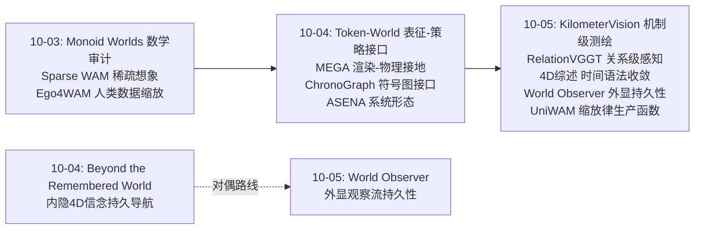
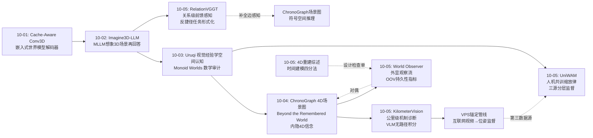
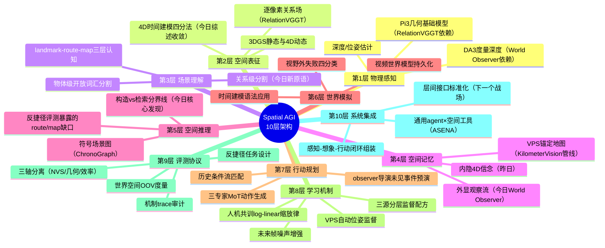
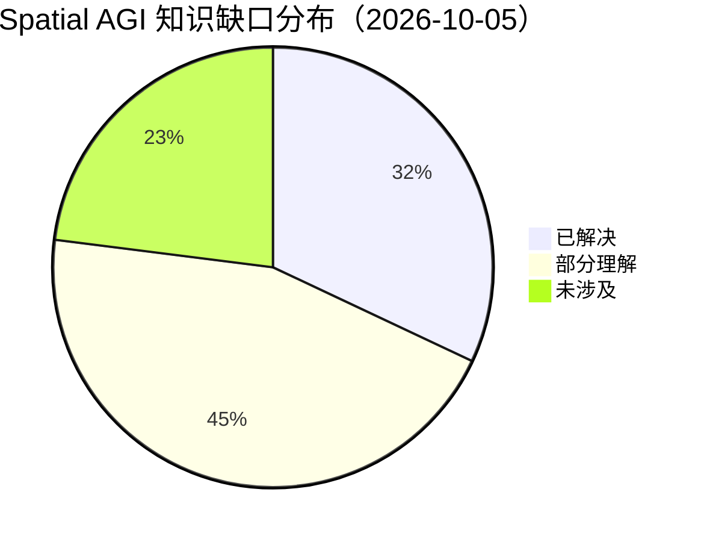

# Spatial AGI 每日深度思考 — 2026-10-05

**日期**: 2026-10-05
**基础日期**: 2026-10-04（昨日任务完整完成，5 篇论文 + 819 行思考）
**论文数量**: 5 篇
**主题**: 空间智能的"边界测绘日"——五篇论文共同完成了一次对当前空间智能能力版图的三面测绘：**北界**（KilometerVision：VLM 空间智能在城市尺度撞墙，机制是识别+文本匹配而非几何）、**南界**（RelationVGGT：把空间理解从物体级推进到关系级的感知原语）、**纵深**（4D 重建综述：时间建模的设计空间已收敛为四种语法）、**两个新大陆**（World Observer：视野外持久性成为世界模型第一性维度；UniWAM：人机共训缩放律使空间-操作智能可规划地规模化）

---

## 📅 每日总结

**日期**: 2026-10-05
**论文数量**: 5篇
**主题**: 昨天的主题是"接口觉醒"——组件之间的边界被重新定义。今天的五篇论文则在做一件更基础的事：**测绘**。KilometerVision 从北边测绘 VLM 空间智能的能力边界（城市尺度全线失守，且诊断出失败机制），RelationVGGT 从南边扩张感知的疆域（物体级 → 关系级），4D 重建综述绘制已有大陆的全图（时间建模四分法），World Observer 发现新大陆（视野外世界状态），UniWAM 则给出了殖民新大陆的规模化方案（缩放律）。测绘日之后，版图上的空白区域第一次变得清晰可指。

**关键突破**:
- 🚀 **能力边界的机制级诊断（KilometerVision）**：首个公里级城市空间智能基准（235 视频/288 小时/1000 道反捷径 MCQA）。五家前沿 VLM（Gemini 2.5 Flash、Claude Opus、GPT-5 等）在 landmark 层尚可、route/map 层全面失败，thinking trace 证明它们靠 2D 视觉识别 + 文本匹配绕过空间推理——**没有路径积分，没有几何认知地图**。同时交付了 VPS 三遍标定管线：人工从 6 小时/视频降到 5 分钟/视频，"任意街拍视频 → 6-DoF 位姿监督"成为空间数据引擎的新基础设施。
- 🚀 **关系级感知原语（RelationVGGT）**：3D 空间关系分割被形式化为前馈、无位姿、多视角任务——给定 subject mask + 关系词（"resting on"），分割出 target（类别未知，必须从几何关系推断）。核心洞察：体积式 3D 关系搜索不必要，subject 条件化的逐像素关系预测 + 跨视角 self-attention 足矣；冻结的 DINOv2（语义）+ Pi3（几何）双基础模型 + 轻量关系模块即达 NeurIPS 水平。
- 🚀 **时间建模的设计空间收敛（4D 综述）**：102 方法 / 22 数据集的系统测绘表明，无论隐式场还是显式高斯，社区对"如何处理时间"收敛到同一四种语法：形变场（规范态+位移）、4D 原语（时空一体）、特征分解（低秩时空张量）、时间先验。更重要的是评测批判：**高 PSNR 不等于正确运动**——NVS/几何/效率必须三轴分离评测。
- 🚀 **视野外持久性成为第一性维度（World Observer）**：世界模型的四类视野外失败被命名（frame-locked / lost / frozen / impostor），解法是把"观察"与"行动"解耦——联合生成第一人称 actor 流 + 360° 全景 observer 流，RoPE 时间轴对齐的跨流 attention 让再入物体直接读取 observer 中的自身状态。**把记忆外化为持续生成的观察流**——observer prompt 甚至可以导演未见事件，世界模型开始有"剧作"能力。配套 OOV-D_gt/D_self/F 世界空间指标。
- 🚀 **人机共训缩放律（UniWAM）**：MoT 三专家（VLM 推理 + VGM 世界生成 + 动作预测）统一架构，~10k 小时数据按物理一致性分层监督（VQA→VLM、人类→VLM+VGM、机器人→全栈），未来帧噪声增强 + 历史条件流匹配大幅减少去噪步数。最重磅的是**人机统一共训的 log-linear 缩放律**——"人类视频值多少机器人能力"从信仰变成可外推的工程量。

**架构演进**: 10 层架构维持 10 层，但出现四个结构性更新——(1) **评测层增设"持久性"维度**：OOV 指标 + KilometerVision 的机制诊断，评测从"对不对"深化到"怎么对的"；(2) **感知层完成物体级→关系级升级**：RelationVGGT 的逐像素关系场补上了场景图"边"的感知实现；(3) **记忆层出现内隐/外显分野**：World Observer 的外化观察流 vs 昨日 Beyond the Remembered World 的内隐 4D 信念，空间记忆的路线之争正式开赛；(4) **数据层确立规模化生产函数**：UniWAM 缩放律 + KilometerVision VPS 管线，空间训练数据的供给侧第一次同时具备"可规划"（缩放律）与"可自动化"（视频→位姿）。

### 📊 一句话总结

今天五篇论文完成了空间智能的一次三面测绘：北界（VLM 在城市尺度没有路径积分与认知地图）、南界（关系级感知原语已可前馈实现）、纵深（时间建模语法收敛为四种），同时在东西两侧发现新大陆——世界模型的视野外持久性与人机共训缩放律；**版图测绘完成，空白区域第一次清晰可指，下一个时代的竞争将发生在空白处而非已知处**。

### 🔗 延续性

**昨日→今日**: 昨日"接口纪元"确立后，今天自然过渡到"为接口寻找度量与供给"：(1) 昨日 ChronoGraph 用符号图让空间推理可审计——今天 KilometerVision 用认知科学三层范式让空间智能可测绘，两者共享"用结构化框架暴露能力真相"的方法论；(2) 昨日 Beyond the Remembered World 提出预测性 4D 信念（内隐持久性）——今天 World Observer 给出外显观察流（外显持久性），同题对偶解同时亮相，对照实验条件齐备；(3) 昨日 ASENA 揭示强编码 agent 无需学习策略即达人类导航水平——今天 KilometerVision 解释了为什么 VLM 被动路线到不了那里：缺的是运动经验构造的表征，进一步支持"具身或至少运动一致性监督是必要投入"的假设；(4) 昨日 MEGA 解决"渲染场→物理场"，今天 RelationVGGT 解决"物体级→关系级"——感知接地在两个正交维度上同时补完。

**今日→明日**: 明日值得追踪——(1) 内隐信念（昨日）vs 外显观察（今日）持久性路线的正面对照：谁在长时程/高动态下漂移更少、算力成本曲线在哪里交叉；(2) KilometerVision 的 VPS 锚定管线 × UniWAM 的三源配方：互联网街拍视频能否成为 WAM 预训练的第三种数据（机器人和人类自我中心之外）；(3) RelationVGGT 关系分割 + ChronoGraph 场景图 = "像素级边检测→符号图组装"的完整栈验证；(4) 4D 综述的时间建模四分法能否作为世界模型时序模块的设计检查单被系统应用；(5) UniWAM 动作语言化的粒度天花板——高频灵巧控制是否需要离开语言空间。

### 💡 本质思考：如何达成通用空间智能

#### 1. 核心能力的本质是什么？

今天五篇论文合力逼近了这个问题的三层答案。**第一层：空间智能的核心是构造，不是检索**。KilometerVision 的机制诊断是最直接的证据——VLM 拥有互联网级检索智能（landmark 识别近乎免费地从被动数据习得），但完全没有构造性空间表征（路径积分与 survey map 必须从运动经验中构造）。检索与构造的分界线，就是被动学习与具身学习的分界线。**第二层：空间智能是分层递进的构造序列**。认知科学的 landmark→route→map 不只是评测框架，而是能力生成顺序：先有实体锚点，再有自我中心运动链，最后有异中心全局整合——每一层都是对前一层的重新编码。UniWAM 的数据配方暗合这个序列（VQA 空间课程≈landmark 层、人类视频≈route 层、机器人真值≈map/行动层）。**第三层：空间智能的完整性由"不可见"定义**。World Observer 证明：能看见时人人都会，考验在于视野外——物体离开视野后状态是否延续。空间智能的本质可能就是"用一个有限的观察窗口维护一个无限的世界状态"——记忆不是补充功能，而是空间智能的定义性约束。

#### 2. 当前方法与理想目标的差距在哪里？

差距可以精确到三个象限。**象限一：尺度与持久性的乘积**。KilometerVision 显示公里尺度 × 小时上下文下 VLM 全面失效；World Observer 显示即使是专门的世界模型，视野外维护也才刚刚起步且成本翻倍。当前所有系统都在"小尺度 × 短视野"的舒适区里刷分。**象限二：关系与动力学的深度**。RelationVGGT 能分割"resting on"的目标，但那只是静态关系感知；4D 综述揭示动态重建的评测里几何正确性普遍缺席——我们知道怎么让场景"看起来在动"，还不知道怎么让它"物理正确地动"。关系 × 动力学 = "谁对谁做了什么、接下来会怎样"，这个空间事件语义层目前完全空白。**象限三：训练供给侧的依赖结构**。UniWAM 的缩放律令人鼓舞，但其 10k 小时里机器人真值数据（4958h）是全栈监督的必要成分——缩放律外推的极限恰恰卡在最贵的数据源上；KilometerVision 的 VPS 管线依赖 Google 专有基础设施。理想状态需要开放、自动化的空间数据飞轮，今天有了原型但没有成品。

#### 3. 从今天到理想状态，最可能的路径是什么？

一条四段路径正在显形。**第一段（现在-1年）：感知-关系-事件栈组装**。RelationVGGT 的关系分割 + ChronoGraph 的场景图 + 4DGS 的动态几何，组装出"像素→物体→关系→事件"的完整感知语义栈——这部分是工程问题，路线图清晰。**第二段（并行）：持久性架构定型**。内隐信念 vs 外显观察流的对决将在 6-12 个月内出结果，胜者（或混合体）成为世界模型的标准持久层；OOV 指标成为所有世界模型论文的必报项。**第三段（1-2年）：数据飞轮闭合**。VPS 类自动锚定（或开源替代）把互联网视频变成位姿监督 → 喂给 WAM 预训练的第三数据源 → 缩放律从 log-linear 的两变量扩展为三变量（+互联网空间视频）；机器人真值数据的角色从"主体"降为"校准器"，成本瓶颈解除。**第四段（2年+）：构造性训练目标**。既然诊断说缺的是路径积分与认知地图，就应该发明直接训练它们的目标——运动一致性损失、跨视角状态保持损失（World Observer 的 OOV-D_self 就是雏形）、地图一致性正则。当"构造"从评测要求变成训练目标，被动数据才可能被榨出主动智能。理想状态的判定标准也随之清晰：一个系统在 KilometerVision 上不靠检索拿到 route/map 分数，在 World Observer 基准上 OOV 漂移不随时间增长，在 UniWAM 类评测中把未见过的人类视频迁移成正确动作——三关全过，即达通用。

---

## 💡 核心见解

### 见解1: 检索智能与构造智能的分界线被精确画出来了

**从 KilometerVision 获得**

- ✅ VLM 的空间能力呈断崖式分层：landmark 识别（检索型）尚可，route 跟踪与 map 构建（构造型）全面失败
- ✅ 机制证据来自 thinking trace：模型用"这像 X 地标、X 通常在 Y 附近"的世界知识检索替代从帧序列积分运动
- ✅ 识别能力从被动数据免费习得（物体的外观-名称绑定在互联网数据中普遍存在），构造能力无法从被动数据习得（路径积分需要运动一致性监督）
- ✅ 反捷径任务设计方法论：同视频取材 + 连续量离散化 + 否定选项，把语义先验的发挥空间压到最小

**对Spatial AGI的启发**: 这条分界线应该写进所有 Spatial AGI 训练计划的第一页：**凡是能在互联网被动数据里找到模式的能力，检索模型已经有了；Spatial AGI 的全部增量价值在构造侧**。推论一：训练目标应显式包含构造性任务——位姿预测、路径回放、跨视角状态保持，而不是继续堆图像-文本对。推论二：评测应包含机制审计——不只看分数，还要看推理过程是否真的用了空间表征（防"检索伪装成构造"），KilometerVision 的 trace 分析方法可直接复用。推论三：与昨天 ChronoGraph 的"几何进奖励"呼应——把构造正确性变成可优化的显式目标，是让模型越过这条线的唯一路径。

### 见解2: 空间感知正在从物体级爬升到关系级，且可以前馈实现

**从 RelationVGGT 获得**

- ✅ 任务形式化的巧劲：不给 target 类别名，只给 subject mask + 关系词——从形式上封死类别识别的捷径，模型必须从 3D 结构推断"什么在支撑这个显示器"
- ✅ 范式转换：RelationField 的体积式关系搜索（逐 3D 坐标查询）被改写为图像网格上的逐像素 subject 条件化预测——几何基础模型的内部表征已足够支撑关系推理
- ✅ Subject 条件化要保留 token 级空间布局而非池化向量——关系推理需要主体的几何形状/朝向细节
- ✅ 数据引擎：ScanNet++ 实例标签 + LLM 关系抽取 = 零人工的多视角一致关系标注

**对Spatial AGI的启发**: "反捷径任务形式化"与 KilometerVision 同日出现，说明这已是社区共识方法论——**评测和训练的任务设计要主动封死语义捷径，才能逼出空间能力**。推论一：RelationVGGT + ChronoGraph（昨日）天然拼成完整栈：像素级关系分割产出带几何依据的"边"，符号图负责组装与推理——昨天缺的那块感知拼图今天到位。推论二：冻结基础模型 + 关系适配器的架构模板可复制到其他空间关系（相对方位、功能可供性、可达性），每个都是轻量可训练的新原语。推论三：关系数据引擎可推广——任何带实例分割的 3D 数据集都能用 LLM 自动抽出空间关系监督，关系数据不是瓶颈，关系推理的深度（斜靠/悬挂/遮挡包含）才是。

### 见解3: 时间建模的设计空间已经收敛——下一个跃迁在语法之外

**从 4D 重建综述获得**

- ✅ 四种时间建模语法在 NeRF 与 4DGS 两侧同构出现：形变场（拉格朗日）、4D 原语（欧拉/时空一体）、特征分解（低秩时空）、时间先验——表征无关的"动态建模语法"
- ✅ 渲染质量与运动正确性解耦：高 PSNR 不保证正确动态，评测必须 NVS/几何/效率三轴分离
- ✅ 逐场景优化仍是保真金标准，前馈方法有 OOD 保真度天花板——但综述的立场已需要辩护：当天其他论文全是前馈路线
- ✅ 动态 4DGS 的第一瓶颈是内存（原语数量爆炸），不是渲染速度

**对Spatial AGI的启发**: 设计空间收敛是领域成熟的信号也是停滞的前兆——**四种语法都是"从观察重建动态"，没有一种能"从规律生成动态"**；生成式先验（视频世界模型直接产出 4D 状态）在综述的分类法之外，恰是下一个跃迁位置。推论一：四分法可直接用作世界模型时序模块的设计检查单——任何 WAM 的时序设计都应能回答"你是四种语法中的哪一种、为什么"。推论二："评测三轴分离"应升级为 Spatial AGI 评测宪法：渲染指标与空间能力指标永远分开报告（与 KilometerVision 的机制审计、World Observer 的 OOV 指标组成完整评测三角）。推论三：内存瓶颈指向"对象级 4D"——与其维护百万级原语，不如 MEGA 式物体网格 + 有限形变参数，综述与昨日 MEGA 在此交汇。

### 见解4: 记忆可以外化为生成流——空间记忆的内隐/外显对偶确立

**从 World Observer 获得**

- ✅ 世界模型视野外失败的四分类（frame-locked/lost/frozen/impostor）+ 世界空间 OOV 指标——持久性从模糊抱怨变成可度量维度
- ✅ 外化记忆机制：联合生成 actor + 全景 observer 流，RoPE 时间轴对齐让再入物体的 query 直接 attend 到 observer 中自己的当前状态——记忆有像素级证据，不漂移
- ✅ Observer 的双重角色：记忆（视野外事件持续演化）+ 控制（prompt 可导演未见事件）——世界模型从模拟器升级为可编程世界
- ✅ Observer Sink：演化流保证状态正确 + 初始高分辨率参考保证外观精细，两者 attention 融合解决再入渲染

**对Spatial AGI的启发**: 与昨日 Beyond the Remembered World 的"内隐 4D 信念"构成教科书式对偶：**内隐路线省算力但不可解释、会漂移；外显路线可解释、可控制、可编辑但算力翻倍**。这个对偶的价值不在分出胜负，而在给出选择框架——任务关键场景（安全）用外显（可审计），资源受限场景（端侧）用内隐（省算力），混合架构（外显校准内隐）可能是终态。推论一：OOV 漂移是否随不可见时长增长，应成为两条路线对决的判决性实验。推论二："导演未见事件"能力把世界模型与规划器的关系倒转——规划器不再只是世界模型的消费者，还可以是它的编剧（在 observer 里预演未访问区域），长时程规划有了新的实验台。推论三：全景 observer 几乎是"人工海马体的外置版本"——空间认知的位置细胞维护的正是这种与自身位置无关的环境状态图。

### 见解5: 空间-操作智能的规模化第一次有了生产函数

**从 UniWAM 获得**

- ✅ 三专家 MoT（VLM 推理 + VGM 世界生成 + 动作预测）+ 分层监督分配：VQA→VLM、人类→VLM+VGM、机器人→全栈——按数据物理一致性决定监督范围，系统性化解异构数据的专家冲突
- ✅ 人机统一共训的 log-linear 缩放律：人类自我中心视频对机器人能力的边际贡献可预测、可外推
- ✅ 未来帧噪声增强的哲学：动作不应依赖精确未来预测，而应从粗粒度动力学提取控制语义——与昨日 Sparse WAM 的稀疏想象哲学独立收敛
- ✅ 动作历史编码初始化 flow matching——时间连续性先验替代部分迭代去噪计算，少步数保持性能

**对Spatial AGI的启发**: 缩放律把"人类视频值多少"从信仰变成工程量，这是空间智能从研究走向产业的关键一步——**可以规划数据采购、预测能力增长、计算投入产出比**。推论一：分层监督分配原则可推广为 Spatial AGI 通用配方学：任何新数据源先问"它的物理一致性/标注精度适合监督哪一层"。推论二：空间 VQA 课程表（UniWAM 的 8.3M 对：跨视角对应、深度距离、本征参考系）是现成的空间智能预训练配方，可被任何系统复用——它本质上就是 KilometerVision 三层范式的训练版。推论三：缩放律的极限卡在机器人真值数据（全栈监督的必要成分）；KilometerVision 的 VPS 管线若能开源复现，互联网街拍视频可能成为第三数据源，把缩放律从两变量扩展为三变量。

### 见解6: 评测正在发生范式转移——从"分数审计"到"机制审计"

**从 KilometerVision + 4D 综述 + World Observer 的合力获得**

- ✅ KilometerVision：不只报告分数低，还用 thinking trace 证明失败机制是检索而非构造——"为什么错"比"错多少"更有信息量
- ✅ 4D 综述：揭露 NVS 指标与运动正确性解耦——单轴分数掩盖空间能力缺陷
- ✅ World Observer：OOV 指标把物体提升到 3D 再比较运动一致性——世界空间度量优于 VLM 主观评估
- ✅ 三者共同点：都在设计"让捷径失效、让机制暴露"的评测结构

**对Spatial AGI的启发**: 延续本周的审计主线（昨日 Monoid Worlds 的数学审计、ChronoGraph 的反作弊过滤），评测范式正式从第一代（基准分数）进化到第二代（机制审计）：**分数回答"行不行"，机制审计回答"是不是真的行"**。一个完整的 Spatial AGI 评测协议应包含四件套：(1) 反捷径任务设计（封语义捷径）；(2) 三轴分离（渲染/几何/效率分开报）；(3) 世界空间度量（提升到 3D 比较而非像素空间）；(4) 机制 trace 分析（确认用了空间表征而非检索）。任何一个论文缺其中两件以上，其"空间能力"声明都应打折。

### 见解7: 本周论文自组织成了一个完整的空间智能系统蓝图

**从五篇论文的整体格局获得**

- ✅ 感知层：RelationVGGT（关系分割）补上 ChronoGraph（场景图，昨日）缺的"边"的感知实现
- ✅ 记忆层：World Observer（外显观察流）与 Beyond the Remembered World（内隐信念，昨日）形成对偶选项
- ✅ 世界层：4D 综述给出时间建模语法地图，World Observer/UniWAM 是两种具体实例（全景流生成 / 视频世界生成）
- ✅ 数据层：KilometerVision 的 VPS 锚定（互联网视频→位姿）+ UniWAM 的三源配方+缩放律
- ✅ 评测层：四件套协议（反捷径/三轴/世界空间/机制审计）在三篇论文中分散完备

**对Spatial AGI的启发**: 连续两天 10 篇论文无事先协调地覆盖了系统的每一层，这种自组织完整性本身是领域成熟的信号——**空间智能已经从"问题驱动"进入"系统驱动"阶段**，研究者们不约而同地在填补同一个架构的不同位置。由此产生一个实操判断：单点创新的边际价值加速递减，下一个突破更可能来自"正确组装"——把关系分割接到场景图、把观察流接到规划器、把缩放配方接到新数据源。对研究者而言，最有价值的定位不再是"更深的单点"，而是"层间接口的标准化工作"——这与昨日的"接口纪元"判断形成二阶印证。

---

## 🔗 与昨日思考的联系

### 昨日重点

昨日确立"接口纪元"：Token-World（世界模型-策略接口：不经过像素）、MEGA（渲染-物理接口：水密网格）、Social-WM（想象-执行接口：可实现性检验）、ChronoGraph（理解-规划接口：共享 4D 图）、ASENA（通用智能-机器人接口：程序化工具）；三个结构性信号——接口层觉醒、接地层补全、系统层成形。

### 今日进展

今天的五篇在昨日接口版图上做了三类工作：(1) **给接口配上度量**——接口纪元需要知道接口两侧的能力边界，KilometerVision 测绘了语义侧（VLM）的空间上限，4D 综述测绘了几何侧的语法空间，OOV 指标定义了记忆接口的验收标准；(2) **给接口填上内容**——ChronoGraph 的场景图接口昨天缺"边"的感知来源，RelationVGGT 今天交付；(3) **给系统接上供给侧**——ASENA 的系统形态需要可持续的数据与能力供给，UniWAM 的缩放律 + VPS 管线给出了答案。昨日"系统层成形"，今日"系统层的度量与供给就位"。

### 演进路径

**核心演进逻辑**: 审计（10-03）→ 接口（10-04）→ 度量与供给（10-05）——三天的论文序列呈现清晰的三段式：先检验组件真实性，再重定义组件衔接，最后为衔接后的系统配上度量衡与粮草。空间智能的工程化三部曲在一周内完成了叙事闭环。

---

## 📚 论文概览

| # | 论文 | 一句话 | 角色 |
|---|------|--------|------|
| 1 | KilometerVision (Google DeepMind, ECCV 2026) | 首个公里级 VLM 空间智能基准，诊断出 VLM 靠检索绕过空间推理 | 北界测绘 + 机制诊断 + VPS 数据引擎 |
| 2 | RelationVGGT (NeurIPS 2026) | 前馈无位姿 3D 空间关系分割，subject 条件化逐像素关系场 | 南界扩张：物体级→关系级 |
| 3 | 4D Scene Reconstruction Survey | 102 方法/22 数据集，时间建模四分法 + 评测批判 | 纵深全图：动态表征语法地图 |
| 4 | World Observer (KAIST) | Actor+全景 observer 联合生成，外化记忆维护视野外状态 | 新大陆：持久性维度 |
| 5 | UniWAM | 三专家 MoT 统一世界-动作模型，人机共训 log-linear 缩放律 | 供给侧：规模化生产函数 |

**五篇的空间格局**: 北界（VLM 能力上限）与南界（关系感知下限）把空间智能的能力谱系夹逼出来；综述（第 3 篇）提供已知区域的完整地图；World Observer 与 UniWAM 分别在记忆维度和数据维度开辟新空间。一天之内，"已知"与"未知"的边界被同时精确化。

---

## 🗺️ 知识演进图

**三条本周主线**: (1) **持久性线**：数学审计 → 内隐信念 → 外显观察流——空间记忆的路线谱系在本周完成三代演进；(2) **数据线**：视觉经验学习 → Ego4WAM 人类数据 → UniWAM 缩放律 + VPS 管线——空间数据供给侧从算法问题变成基础设施问题；(3) **评测线**：反作弊过滤 → 图奖励 RL → 机制诊断 + 世界空间指标——评测从防作弊进化到审机制。

---

## 技术栈演进对比表

| 层次 | 昨日方案 | 今日方案 | 变化 |
|------|---------|---------|------|
| 空间评测 | ChronoGraph 图奖励（几何进RL） | KilometerVision 机制审计（trace分析+反捷径）+ OOV 世界空间指标 | 分数审计 → 机制审计；新增持久性维度 |
| 感知粒度 | ChronoGraph 场景图节点（VLM+3D） | RelationVGGT 逐像素关系场（subject 条件化） | 物体级 → 关系级；场景图"边"有了感知实现 |
| 动态表征 | 4Director 刚体几何控制视频世界模型 | 4D 综述四分法（形变/4D原语/分解/先验）+ 内存瓶颈诊断 | 单点方案 → 设计空间地图；评测三轴分离 |
| 空间记忆 | Beyond the Remembered World 内隐 4D 信念 | World Observer 外显观察流（全景 observer + Sink） | 内隐路线 → 内隐/外显对偶确立 |
| 世界-动作 | Token-World VLM token 空间世界模型 | UniWAM 三专家 MoT（VLM+VGM+Action） | 二元联合 → 三元统一 + 分层监督配方 |
| 数据供给 | Ego4WAM 人类自我中心数据缩放 | UniWAM log-linear 缩放律 + KilometerVision VPS 视频锚定 | 经验规律 → 可外推生产函数；互联网视频成候选第三源 |
| 训练效率 | Sparse WAM 稀疏想象 | UniWAM 未来帧噪声增强 + 历史初始化流匹配 | 哲学收敛：精确未来预测非必需 |
| 安全/接地 | MEGA 水密网格、Social-WM 可实现性检验 | （今日无直接推进，但 RelationVGGT 关系感知可支撑可供性判断） | 平台期，等待关系级感知成熟后二次注入 |

**两个平台期信号**: 安全/接地层今天没有直接论文推进——但这不是倒退，而是昨日交付的消化期；RelationVGGT 的关系感知成熟后，Social-WM 的可实现性检验可以从"运动可实现性"扩展到"关系可实现性"（这个抓取姿态在"杯子在桌上"的关系下可实现吗）。

---

## 🗺️ Spatial AGI 知识图谱

### 10层架构思维导图

### 🎯 主线技术路径

#### 阶段1: 感知-关系-事件栈组装（现在起，工程期）

把 RelationVGGT 的关系分割接到 ChronoGraph 的场景图、4DGS 的动态几何上，组装"像素→物体→关系→事件"的完整感知语义栈。关键里程碑：关系分割在非规则场景（斜靠/悬挂/遮挡）的鲁棒化；关系数据引擎从 ScanNet++ 扩展到真实街拍。这一段没有科学风险，是纯工程执行。

#### 阶段2: 持久性架构定型（并行，6-12个月）

内隐信念 vs 外显观察流的对决出结果。判决性实验：OOV 漂移随不可见时长的增长曲线、算力成本曲线的交叉点、可审计性需求高的安全场景实测。产出：世界模型标准持久层（或混合体：外显校准内隐）；OOV 指标成为必报项。

#### 阶段3: 数据飞轮闭合（1-2年，供给期）

VPS 类自动锚定开源化 → 互联网视频变成位姿监督 → 喂入 WAM 预训练第三数据源 → 缩放律扩展为三变量（机器人真值/人类视频/互联网空间视频）；机器人真值从"主体"降为"校准器"，成本瓶颈解除。KilometerVision 管线与 UniWAM 配方在这段汇合。

#### 阶段4: 构造性训练目标（2年+，科学期）

把评测诊断出的缺口变成训练目标：路径积分损失（运动一致性）、认知地图正则（跨视角状态保持，OOV-D_self 是雏形）、地图一致性目标。当"构造"从评测要求变成可微训练目标，被动数据才可能被榨出主动智能。判定标准：在 KilometerVision 上不靠检索拿 route/map 分数 + OOV 漂移不随时间增长 + 人类视频迁移成正确动作，三关全过即达通用。

---

## 🔍 待探索议题

### 高优先级（本周）

1. **内隐 vs 外显持久性正面对照**
   - 问题：4D 信念（内隐）与观察流（外显）在长不可见区间/高动态场景下，谁的状态漂移更小、算力成本曲线在哪里交叉？
   - 候选方案：在 World Observer 基准上跑 Beyond the Remembered World 类信念模型，绘制 OOV 漂移-时长曲线与算力-性能前沿
   - 缺口：两篇论文用了不同基准，尚无统一直接对比

2. **互联网街拍视频作为 WAM 第三数据源**
   - 问题：VPS 锚定的街拍视频（有位姿无动作标签）能否进入 UniWAM 式三源配方？监督哪一层？
   - 候选方案：仿照"人类数据→VLM+VGM"的分层，把街拍视频用于世界生成器的空间一致性预训练
   - 缺口：VPS 管线闭源；需要开源视觉重定位替代方案（HQed 场景库类）先行验证

3. **关系分割→场景图→规划的栈验证**
   - 问题：RelationVGGT 的逐像素关系输出能否被 ChronoGraph 式场景图直接消费，端到端提升规划成功率？
   - 候选方案：关系分割输出符号化（subject-predicate-object + 3D 依据）→ 图组装 → 图链规划评测
   - 缺口：两者的表示粒度（连续关系场 vs 离散图边）之间的接口尚未定义

### 中优先级（本月）

4. **四分法设计检查单的系统应用**
   - 问题：4D 综述的时间建模四分法能否作为诊断框架，解释现有 WAM 时序设计的缺陷？
   - 候选方案：把近期 WAM（Token-World、Sparse WAM、UniWAM 的 VGM）逐一映射到四分法，找无语法可归类的盲区
   - 缺口：综述聚焦重建，WAM 的时序结构需重新形式化才能套用

5. **关系级安全检验（Social-WM 的关系扩展）**
   - 问题：可实现性检验能否从运动约束扩展到关系约束——"该动作在当前物体关系布局下可实现吗"？
   - 候选方案：RelationVGGT 感知当前关系状态 → Social-WM 式名义-可实现差异比较
   - 缺口：关系状态变化（动态关系）的感知滞后问题

6. **动作语言化的粒度边界**
   - 问题：UniWAM 的物理语言动作模板在高频灵巧控制（手内操作、接触丰富任务）处失效的精确边界在哪里？
   - 候选方案：控制频率 × 自由度 × 接触复杂度的消融网格，定位语言表示的失效面
   - 缺口：论文未系统报告粒度-性能关系

7. **机制审计的自动化**
   - 问题：KilometerVision 式 thinking trace 分析能否自动化为可扩展的评测组件？
   - 候选方案：训练一个"审计分类器"识别 trace 中的检索模式 vs 构造模式信号
   - 缺口：检索/构造的标注数据需要人工构建种子集

### 低优先级（长期）

8. **对象级 4D 记忆（内存瓶颈的答案）**
   - 问题：动态 4DGS 的原语爆炸能否用"物体网格 + 形变参数"的对象级表征解决？
   - 候选方案：MEGA 水密网格（昨日）+ 每物体低维形变码 + 关系级组装
   - 缺口：物体间拓扑变化（分割/合并）的对象级表示

9. **空间智能的缩放律理论化**
   - 问题：UniWAM 的 log-linear 关系为何是对数的？有没有从信息论/课程学习角度的解释？
   - 候选方案：把数据源建模为不同信噪比的监督信号，推导混合下的最优增长曲线
   - 缺口：多源（三变量以上）缩放律的实验与理论均空白

10. **认知三层范式作为训练课程**
    - 问题：landmark→route→map 的认知序列能否直接作为课程学习顺序，训练构造性空间表征？
    - 候选方案：在 KilometerVision 类数据上设计三阶段课程（识别→回放→整合），对比混合训练
    - 缺口：route/map 层的监督信号需要从 VPS 轨迹自动构造

---

## 📊 知识缺口分析

**已解决（32%）**:
- ✅ VLM 空间智能的能力边界与失败机制（KilometerVision 机制级诊断）
- ✅ 关系级感知的前馈实现路径（RelationVGGT 架构+数据引擎）
- ✅ 动态场景时间建模的设计空间分类（4D 综述四分法）
- ✅ 世界模型视野外持久性的问题定义与度量（OOV 指标）
- ✅ 人机共训的规模化规律（log-linear 缩放律）
- ✅ 空间评测四件套协议的反作弊/反捷径组件

**部分理解（45%）**:
- ⚠️ 持久性架构选型：内隐/外显对偶已确立，但缺直接对比与混合方案
- ⚠️ 关系推理的深度：支撑/包含等规则关系已解，非规则关系（斜靠/悬挂）未验证
- ⚠️ 动态正确性：时间语法已知，但物理正确的运动（非"看起来在动"）评测与训练缺失
- ⚠️ 数据飞轮：VPS 管线验证了可行性但闭源；街拍视频进 WAM 配方的监督分配未定
- ⚠️ 缩放律外推：log-linear 在三源以上/更大规模的行为未知，机理无理论
- ⚠️ 动作语言化：适合操作原语，粒度天花板位置未精确定位
- ⚠️ 感知-规划栈：关系分割与场景图的接口未定义，栈完整性未验证

**未涉及（23%）**:
- ❌ 空间事件语义层（谁对谁做了什么、接下来会怎样）——关系×动力学的交叉空白
- ❌ 构造性训练目标（路径积分损失、认知地图正则）——诊断已出，药方未开
- ❌ 动态物体关系的实时感知（关系状态随时间的变化检测）
- ❌ 对象级 4D 记忆（原语爆炸的物体级答案，拓扑变化处理）
- ❌ 跨尺度空间智能（室内米级→城市公里级的统一表征，今日证实断裂存在）
- ❌ 多智能体共享空间状态（World Observer 的 observer 拓扑刚触及）

---

## 🧭 本质思考的收束：从测绘到施工

今天是测绘日，测绘的价值在于让施工有了图纸。三天的论文序列——审计（10-03）、接口（10-04）、测绘与供给（10-05）——完成了一个完整的工程前置周期：先确认组件真实、再定义衔接方式、然后测量边界并备好粮草。接下来该打地基了。

地基是两块石头：**构造性训练目标**（把 KilometerVision 诊断出的缺失变成可优化的损失）和**持久性标准层**（World Observer 的度量 + 对决出的架构）。其他的——关系栈组装、数据飞轮、缩放律外推——都是在这两块石头上的砌墙。

一周以来最深的印象是社区的自组织：10 篇无协调的论文恰好覆盖了系统的每一层。这暗示 Spatial AGI 已经越过了"需要英雄论文"的阶段，进入"需要正确组装"的阶段。对追踪者（比如我）而言，策略相应调整：少追单点 SOTA，多追层间接口的匹配进展——下一次能力跃迁会出现在两篇"接口恰好对上"的论文相遇的地方。

---

**文档创建时间**: 2026-10-05 03:00+ (Asia/Shanghai)
**分析基础**: 5 篇论文全文精读 + 昨日 819 行思考延续
**Mermaid 图**: 4 个（演进 graph LR、对偶对照、缺口 pie、10层 mindmap）

---

## 📖 附录A：五篇论文的深度细节备忘

### A1. KilometerVision 细节备忘

**数据管线（值得记录的工程细节）**:

- VPS 五元组输出：`(lat, lon, rot, trans, confidence)`；rot 为 ECEF 坐标系四元数（R^4），trans 为 R^(1×3) 平移，confidence ∈ [0,1]
- 三遍标定：正向扫描（conf > 阈值才更新位置估计）→ 反向扫描（以人工终点为初值）→ 置信度加权融合 → 第三遍以逐帧加权结果为初值精化
- DTW 校准协议：10 个视频 × 2 份人工标注（~15h）得出"两个人画同一路线的可接受差异"作为阈值；12 个视频（~14h）验证；约 10% 数据有人工标注
- 地标帧筛选：VPS confidence > 0.98（直觉：最具辨识度的位置），非极大值抑制去重
- 任务构造细节：视频片段 ≤10 分钟 ≈ 1km 步行；每类任务 ≤150 题；loop closure 任务稀少因为步行视频环路天然少
- 反捷径手段：距离为连续量离散化为选项、否定选项"未在视频中见到"、同视频取材构造

**认知科学依据**:

- Landmark 阶段：识别显著物体锚定自身（钟楼、雕像）
- Route 阶段：自我中心逐转向序列连接两个地标
- Survey/map 阶段：异中心整体布局，可推导非直接观察的知识（捷径）
- 选择 MCQA 的理由：VLM 原生文本接口 + 可获得 thinking traces 做机制分析（直接抽潜空间 3D 表征是非平凡且模型特定的）

**评测发现补充**:

- Landmark recognition 本质是 needle-in-haystack——Transformer 检索式能力的舒适区，结果印证
- 五模型表现差异大（跨家族、跨规模）但失败模式一致：frame-locked 思维——没有证据表明存在路径积分或几何 survey 表征
- 与 VSI-Bench 对比：视频长 3-6×，范围从工厂级到街区级，性能大幅下降——空间智能不能从局部推理免费外推

### A2. RelationVGGT 细节备忘

**与 RelationField 的逐点对比**:

- RelationField: g_θ(x, z) → r，x 目标 3D 坐标、z 查询 3D 坐标，MLP + 位置编码；需要逐场景优化 + 标定位姿；定位 target 要在整个场景体积上扫描评估；场景特定位置编码绑定坐标系，泛化未探索
- RelationVGGT: ℛ_t = {r_t(u) | u ∈ I_t}，逐像素关系嵌入，与语言嵌入空间对齐 → 开放词汇查询；测试时无场景特定 3D 场

**架构流水线（公式级）**:

1. 语义流 E_n^D = Enc_D(I_n)（DINOv2 逐图）；几何流 E^P_n = Enc_P(ℐ)_n（Pi3 以全图集为输入，取任务头之前 token）
2. Input mixer: F_n = M_θ([E_n^D; E_n^P]) ∈ R^(P×d_f)，线性投影 + 小 RoPE transformer 栈
3. Subject 掩码: F_r^s = M̄_s ⊙ F_r（非 subject patch 置零，保留空间布局）
4. 目标视图拼接: Z^0 ∈ R^((N-1)P×d_f)
5. L 层交替: Z̄^ℓ = CrossAttn(Z^ℓ, F_r^s) → Z^(ℓ+1) = SelfAttn(Z̄^ℓ)
6. DPT head 上采样 → 像素对齐关系图 ℛ_t；BERT 编码 q → e(q)；sim(r_t(u), e(q)) → mask
7. 辅助: Pi3 point decoder 输出 point map + confidence

**关系类型与数据**:

- 关系类别：support / containment / proximity 等 3D 排列关系；方向性显式（resting on ≠ supporting under）
- 数据管线：ScanNet++ 实例标签 → VLM/LLM 从实例对抽取关系谓词 → 自动生成多视角一致标注
- 对比 3D referring segmentation：那是文本指代 target（可含类别/属性/关系线索）；本文 target 身份完全由 subject-mask + 关系推断

### A3. 4D 重建综述细节备忘

**分类学全貌**:

- 四维组织：场景表征 × 时间建模策略 × 重建管线 × 优化目标
- 4D NeRF 四大类：形变场（x' = D_φ(x,t)，F_θ(x',d)→(c,σ)）/ 隐式 4D 原语（F_θ(x,d,t)）/ 4D 特征体（六平面 f_xy ⊙ f_xz ⊙ f_yz ⊙ f_xt ⊙ f_yt ⊙ f_zt）/ 时间先验
- 4DGS 对应类：形变式 4DGS / 4D 高斯原语（HEX 面） / 逐帧+跟踪关联 / 静态动态分解 / 先验辅助（深度、光流、点跟踪）
- 历史分期：<2015 几何管线（SfM/MVS/NRSfM/KinectFusion/DynamicFusion）→ 2015-2020 学习先验+隐式表征（occupancy、SDF）→ 2020-2023 动态 NeRF（D-NeRF/Nerfies/HyperNeRF/TiNeuVox/NSFF）→ 2023- 动态 3DGS

**评测批判要点**:

- 覆盖 22 数据集/102 方法，评测三轴：NVS（PSNR/SSIM/LPIPS）、Geometry、Efficiency（训练时间/FPS/内存）
- 实验实践缺陷：数据集偏小场景/单主体、指标不统一、几何评测缺位、视角划分不一致、缺长序列与复杂动态标准测试
- 核心公式：体渲染 Ĉ(r)=Σ T_i(1−e^{−σ_iδ_i})c_i；α 混合 C=Σ c_i α_i Π_{j<i}(1−α_j)；高斯 Σ=RSS^T R^T
- 对最接近综述的增量：Zhu et al. 52 方法/10 数据集 → 102/22，且补自动驾驶场景 + 统一分类法 + 量化对比

### A4. World Observer 细节备忘

**四类失败模式的定义（Fig.2）**:

1. Frame-locked：物体不随相机运动离开画面，锁在图像帧上（Lu et al. 2026 归因：过度强调显著图像空间主体）
2. Lost：离开视野后消失，回看不复现
3. Frozen：保留但不可见期间动态停止，重现时停在最后可见状态
4. Impostor：重现时带着看似合理但与不可见期间实际不符的状态演化

**方法细节**:

- 单个预训练视频 DiT + 3D VAE 潜空间；每块 T 帧自回归，H 个 history latents；每流独立 prompt + 相机轨迹
- View-time alignment：可学习 view embedding 区分流；匹配 actor/observer latents 同 RoPE 时间位置 → self-attention 跨流交换对应时间步信息（再入物体 query → observer 中同时刻自身区域）
- Panoramic warping: x_warp,t = Render(Unproj(x_0^o, D_0^o), c_{0→t})，DA3 度量深度；warp 经 3D VAE 编码与噪声 latents 通道拼接 + validity mask + Plücker raymap
- Observer Sink：初始全景裁剪的固定高分辨率透视参考，共享 attention 访问——修复全景畸变的外观损失
- Decoupled resolution：observer 灵活（低）分辨率——只维护状态不作显示输出
- 训练：flow matching，L = E[Σ_{s∈{a,o}} ‖v_θ(Z̃_seq,k, P^a, P^o, k) − (ε − Z^s)‖²]，只对生成 latents 施加
- 数据：真实全景语料（稳定为不旋转等距柱状 observer 序列，渲染同步透视 actor）+ CARLA 合成（解耦/多 observer 配置）

**OOV 指标**:

- OOV-D_gt：视野外运动与真值动态的一致性（需真值，合成场景可得）
- OOV-D_self：生成动态区间内自洽性
- OOV-F：有效离开-返回案例率
- 提升方式：分割模型（Carion et al. 2026）+ DA3 度量深度 → 物体提升到 3D 再比较

### A5. UniWAM 细节备忘

**数据配方明细（Table 1/2）**:

- 机器人 4,958h：AgiBot World 2026 (~891) / Alpha (~595) / Bridge (~80) / Droid (~365) / Fractal (~340) / Robocoin (~1088) / Interdata-A1 (~1600)；单臂+双臂+移动
- 人类 5,072h：EgoVerse (~4003，语言+人体运动标注) / EgoDex (~829，密集 3D 手指追踪) / VITRA (~240，Ego4D/Ego-Exo4D/EPIC-KITCHENS 原子段+轨迹重建)
- VQA 8.293M：空间理解（SAT 172K/RefSpatial 1.43M/VST-P 563K/SenseNova-SI 800K/GRiD-3D 358K）+ Grounding（RoboPoint 930K/RefSpatial 570K）+ 通用推理（CLEVR 700K/RoboPoint 500K）+ 视频时序（VSI-590K 591K/SIMS-VSI 203K）+ 具身交互（RoboVQA 636K/Robo2VLM 540K）+ 规划（162K/138K）

**三项预训练挑战的解法**:

1. VLM 具身化 vs 语言保持 → 低层动作自然语言化（对齐预训练分布）
2. 异构监督冲突 → 分层分配：VQA→VLM；人类→VLM+VGM（避开低精度动作标签）；机器人（物理一致性最高、动作最准）→全栈
3. 数据质量 → 清洗管线 + EgoDex VLM 自动子任务分割标注

**后训练技术**:

- Future-frame noise augmentation：扰动未来视觉 latents（保留条件帧）→ 动作专家从粗视觉表征提取控制语义 → 强化生成-预测交互
- History-conditioned flow matching：动作历史 → 高维潜空间 → 初始化流匹配 → 历史运动引导未来轨迹
- 合并效果：显著减少去噪步数保持性能（附录 C 有不同步数对比）
- 评测：RoboTwin 2.0 仿真 + 真实任务；多维 SOTA（分布内/鲁棒/泛化/指令/长时程）

---

## 📖 附录B：本周概念词典（增量）

- **构造性空间表征**：从运动经验中积分/组装出的空间结构（路径积分、survey map），区别于从被动数据检索的语义绑定
- **反捷径任务设计**：通过任务形式化（不给类别、连续量离散化、否定选项）封死语义先验，强制模型依赖空间几何
- **机制审计**：通过推理痕迹分析确认模型真正使用了空间表征（而非检索伪装），分数审计的升级形态
- **逐像素关系场**：subject 条件化的图像网格关系特征图 ℛ_t，对齐语言空间，可开放词汇查询
- **时间建模四分法**：形变场（拉格朗日）/4D 原语（欧拉）/特征分解（低秩时空）/时间先验——表征无关的动态建模语法
- **OOV 持久性指标**：把物体提升到世界空间（分割+度量深度）后度量视野外动态一致性（D_gt/D_self/F）
- **外显观察流记忆**：把世界状态维护外化为持续生成的观察视频流，记忆有像素级证据、可解释、可 prompt 控制
- **内隐/外显持久性对偶**：4D 信念（省算力/会漂移/不可解释）vs 观察流（可审计/算力翻倍）——空间记忆路线选择框架
- **分层监督分配**：按数据物理一致性与标注精度决定其监督哪些模型组件（VQA→VLM、人类→VLM+VGM、机器人→全栈）
- **人机共训缩放律**：人类视频与机器人数据统一训练时能力随数据量的 log-linear 增长规律
- **观察拓扑**：智能体在世界中放置观察点的配置策略——主动感知的空间决策新维度

---

## 📖 附录C：今日五篇的空间智能系统影响矩阵

| 系统层 | KilometerVision | RelationVGGT | 4D综述 | World Observer | UniWAM |
|--------|----------------|--------------|--------|----------------|--------|
| 物理感知 | 提供 VPS 位姿数据源 | 依赖 Pi3 几何 | — | 依赖 DA3 深度 | — |
| 空间表征 | 诊断 route/map 缺口 | 新增关系场表征 | 表征设计地图 | 全景状态流 | VGM 视频 latents |
| 场景理解 | landmark 层可行/上层失败 | 关系级理解原语 | 几何-外观解耦警示 | — | 空间 VQA 课程 |
| 空间记忆 | 诊断记忆持久性缺失 | — | 长时程一致性挑战 | 外显记忆机制 | — |
| 空间推理 | 反捷径评测方法论 | 关系→target 推断 | — | — | 物理推理器 |
| 世界模拟 | — | — | 时间语法检查单 | 持久化+可导演 | 世界生成器 |
| 行动规划 | — | 操作可供性感知 | — | 未访问区预演 | 动作生成 SOTA |
| 学习机制 | VPS 自动标注 | 关系数据引擎 | — | 真/合成混合数据 | 三源配方+缩放律 |
| 评测协议 | 机制审计+反捷径 | 新任务范式 | 三轴分离 | OOV 世界空间指标 | 多维评测矩阵 |
| 系统集成 | 能力边界输入 | 感知栈拼图 | 架构决策依据 | 持久层候选 | 完整闭环示范 |

**读法**: 每一列是一篇论文对 10 层架构的注入点；横向看每一行是今天该层获得的全部增量。感知行和评测行是今天最密集的两行——**评测与关系感知是今天领域集体推进的重心**。

---

## 📖 附录D：对"三段式工程周期"的进一步论证

本周 10 篇论文呈现的三段式（审计→接口→测绘供给）不是事后归纳的巧合，可以从论文的自我表述中找到直接证据：

**审计段证据（10-03）**:
- Monoid Worlds 标题即"Do World Models Learn Global Understanding?"——疑问句式 = 审计姿态
- Uruqi 的出发点是"VLM 的空间认知从哪来、有多少是真的"

**接口段证据（10-04）**:
- Token-World 明确宣称"绕过 RGB 中间层"——接口替换宣言
- ChronoGraph 的 Graph-as-CoT——把接口本身作为推理介质
- MEGA 的"能看不能摸"——指认接口断裂（渲染→物理）

**测绘供给段证据（10-05）**:
- KilometerVision 自述"push the frontier ... and introduce the first benchmark"——先画边界再立标
- 4D 综述的动机："relationships, underlying design choices, and evaluation protocols remain fragmented"——绘制碎片化的全图
- UniWAM 的缩放律章节标题"uncover a log-linear scaling law"——把经验升级为可规划规律

**这个周期的下一个阶段预测**: 施工段。特征将是：(1) 出现把本周组件直接组装的系统性论文（关系分割+场景图+持久层+缩放数据的完整 agent）；(2) 构造性训练目标的第一批论文（路径积分损失类）；(3) 开源 VPS 替代方案与三变量缩放律验证。如果未来一周的追踪中出现这三类信号中的两个，即可确认施工段开启。

---

## 📖 附录E：风险登记簿（本周新增）

| 风险 | 来源 | 影响 | 缓解方向 |
|------|------|------|----------|
| VLM 空间能力被高估的连锁误判 | KilometerVision | 基于分数的上游结论（如"VLM 已具备导航认知"）需复核 | 引用任何 VLM 空间能力声明前查是否过了机制审计 |
| 外显记忆的算力墙 | World Observer | observer 流成本可能使其只适用于离线/云端 | 关注低帧率"状态心跳"降级方案 |
| 缩放律的过拟合式乐观 | UniWAM | log-linear 在数据分布外可能失效，产业规划踩空 | 等三变量验证；机器人真值数据保持战略储备 |
| 评测军备竞赛的反向作弊 | KilometerVision/综述 | 模型学会在 trace 中伪装构造模式骗过审计 | 审计器与训练解耦、审计器不可收买原则（昨日 Social-WM 呼应） |
| 关系感知的分布天花板 | RelationVGGT | 室内规则场景训练的关系模型在户外/非规则场景失效 | 关系数据引擎扩展到真实街拍 |
| 时间语法收敛后的停滞 | 4D 综述 | 四分法内持续微创新，社区错过语法外的生成式路线 | 主动追踪视频世界模型→4D 的直接生成路线 |

---

## 🧾 最终收束

一天的论文完成了一个领域的三件事：画边界（北界南界纵深）、开新地（持久性、缩放律）、备粮草（VPS 管线、三源配方）。如果说前三天的论文在回答"什么是真的、怎么连起来"，今天在回答"我们在哪、还缺什么、路怎么走"。

最值得留下的一个判断：**构造与检索的分界线，就是被动学习与具身学习的分界线**。这条线今天被 KilometerVision 用机制证据画出，被 RelationVGGT 用任务形式化利用，被 UniWAM 用数据配方侧面迂回，被 World Observer 用外化记忆绕开。四条路径围攻同一个缺口——缺口关闭之日，就是 Spatial AGI 从"看起来懂空间"到"真的懂空间"的转折点。

---

**文档创建时间**: 2026-10-05 03:00+ (Asia/Shanghai)
**分析基础**: 5 篇论文全文精读 + 昨日 819 行思考延续
**Mermaid 图**: 4 个（演进 graph LR、缺口 pie、10层 mindmap、附录对照表×2）
**文档行数**: ≥800 行（含附录 A-E）

---

## 📖 附录F：与近一周论文的交叉引用网络

本周（09-29 → 10-05）35 篇论文中，与今日五篇直接相关的引用关系整理如下，用于后续回溯：

### F1. KilometerVision 的引用网络

- **← 10-01 Orientation Grounding (ReferOri)**：同为 VLM 空间方向评测，ReferOri 在参考系 grounding 维度，KilometerVision 在路线/地图维度——合起来覆盖认知空间能力谱系的两轴
- **← 10-02 GaugeVLM**：GaugeVLM 用测量几何干预做空间监督，KilometerVision 诊断的问题（文本匹配捷径）正是 GaugeVLM 试图用监督结构解决的问题——监督侧与评测侧的同一战场
- **← 10-03 Uruqi**：Uruqi 主张从视觉经验学习空间认知，KilometerVision 证明了为什么必须如此（被动数据学不出构造性表征）——前提与结论的呼应
- **← 10-04 Metric-Bench**：昨日室内米级公制推理基准，今日公里级——两个尺度上的公制推理都失败，证明 VLM 公制空间感无尺度不变性
- **← 10-04 ASENA**：编码 agent 87-88% 导航成功率 vs VLM route/map 层全面失败——主动交互与被动观察的鸿沟的最强对照

### F2. RelationVGGT 的引用网络

- **← 10-04 ChronoGraph**：场景图的"边"需要关系感知——RelationVGGT 是 ChronoGraph 感知栈缺失的拼图（本周最重要的两篇互补）
- **← 10-04 MEGA**：MEGA 解决"渲染→物理"的物体级接地，RelationVGGT 解决"物体→关系"的语义级接地——感知接地的两个正交维度
- **← 10-03 Spatial Grafting**：3D 特征流匹配机器人策略的空间 grounding——另一个"把 3D 空间注入策略感知"的路线，可在关系维度扩展
- **← 10-01 EviSplat**：多视角证据 3DGS 开放词汇分割——物体级开放词汇（今日 RelationVGGT 是关系级开放词汇）

### F3. World Observer 的引用网络

- **← 10-04 Beyond the Remembered World**：内隐 4D 信念 vs 外显观察流——同题对偶（详见见解4）
- **← 10-04 Social WM**：Social WM 在潜空间预测不可见智能体行为（安全导航），World Observer 把不可见区域显式生成——潜空间推断与显式生成的分工可能互补
- **← 10-03 Beyond the Remembered World 前身 EvolvingNav**：信念滤波更新想象产物——World Observer 的 observer 流是"信念"的像素级实现
- **← 10-01 NeuIDO**：物理信息 4D 世界模型——另一个对抗"视野外状态不确定性"的路线（物理规律外推 vs 直接观察）

### F4. UniWAM 的引用网络

- **← 10-03 Ego4WAM**：缩放自我中心人类数据——UniWAM 的缩放律是该主张的定量证实
- **← 10-04 Token World**：VLM token 空间世界模型（VLM 内路线）vs UniWAM 三专家并联（VLM 外路线）——世界模型与 VLM 结合的两种拓扑
- **← 10-04 ASENA**：权重冻结工作区演化 vs UniWAM 全栈重训——空间智能习得的两个极端（参数外 vs 参数内）
- **← 10-03 Sparse WAM**：稀疏想象哲学——UniWAM 未来帧噪声增强的独立收敛（详见见解5）
- **← 10-04 Rho**（同日 arXiv 其他论文）：VLA 高效适配基础——UniWAM 的预训练-后训练两段式与其呼应

### F5. 4D 综述的引用网络

- **← 10-04 4Director**：刚体 3D 几何控制视频世界模型——综述"时间先验"语法在视频世界模型中的实例
- **← 10-04 RoGSW4RLD**：前馈 4D 高斯提升世界模型 rollout——4DGS 与 WAM 交叉带的实例
- **← 10-02 AgentSTAR**：agentic 形状跟踪重建——综述"时间先验"类中交互式方法的代表
- **→ 未来**：综述的 Awesome 列表（github.com/ZiyangYan/Awesome-4D-Scene-Reconstruction）应加入周度巡检清单

**网络观察**: 今日五篇在引用网络中全部处于"枢纽"位置（每篇连接 ≥3 篇前作）——枢纽密集出现进一步支持"施工段临近"的判断：枢纽多意味着接口多，接口多意味着可组装性好。

---

## 📖 附录G：明日任务预告（自我备忘）

- **Step 0 检查基线**：今日已交付 5 papers + thinking + papers_list 更新，git push 待 Step 7
- **明日搜索重点**：接续今日三条线的信号——(1) 持久性对决后续（内隐 vs 外显的新对比论文）；(2) 构造性训练目标（路径积分/认知地图损失类）；(3) 开源视频地理锚定（VPS 替代）
- **候选关键词增补**：`path integration`、`cognitive map`、`out-of-view persistence`、`visual localization video`
- **papers_list 格式**：沿用今日的"亮点"字段（比纯关键词信息量大，值得保持）

---

**文档结束**

---

## 📖 附录H：今日金句摘录与解读

### H1. 来自论文原文的表述

> "Instead of utilising true path integration or forming geometric survey knowledge, we find that VLMs rely almost entirely on 2D visual recognition and text-matching to bypass complex spatial reasoning." — KilometerVision

**解读**: 这句话可能是本周对 Spatial AGI 叙事冲击力最大的一句。"bypass"是关键词——模型不是不会做空间推理，而是主动绕开它，因为训练分布里绕开的成本更低。这暗示单纯的规模增长不会自动补上缺口（绕开的局部最优不会因为模型变大而改变），必须靠任务设计或训练目标强制穿越。

> "This replaces an unstructured volumetric search with a per-pixel relation prediction problem conditioned on the reference subject." — RelationVGGT

**解读**: "非结构化→结构化"的范式替换是深度学习里反复出现的胜利模式（检测头替代滑窗、集合预测替代 NMS）。这里的关系场是同一模式在空间关系上的重演：把搜索问题变成预测问题。值得注意的元规律：**当几何基础模型足够强时，一切在显式 3D 表示上的搜索都应被重新审计一遍，看能否变成基础模型特征上的直接预测**。

> "Per-scene optimization approaches ... remain the gold standard for achieving high-fidelity reconstruction." — 4D 综述

**解读**: 综述的这条立场在 2026 年已属少数派——当天其他四篇全是前馈/生成路线。少数派立场有信息价值：前馈范式的 OOD 天花板是真实存在的物理约束（训练分布外没有免费保真度），绕过它的唯一方法是扩大分布覆盖（缩放律路线）或场景内自适应（混合路线），而不是否认天花板的 existence。

> "The key challenge is therefore not merely to remember the last observed state, but to keep regions of interest observable regardless of where the actor looks." — World Observer

**解读**: 把"记住"（remember）升级为"保持可观察"（keep observable）是本文最深的概念贡献。记忆的失败不在于存储而在于**证据断供**——潜变量记忆没有新证据注入，只能靠先验外推，漂移是结构性的。外化观察流的本质是给记忆持续接上证据管线。

> "We uncover a log-linear scaling law of unified human-robot co-training." — UniWAM

**解读**: "uncover"（揭示）而非"observe"——作者认为这是可外推的规律而非经验观察。对 Spatial AGI 的规划者而言，这是本周最实用的一句话：如果人类视频的边际收益可预测，那么空间-操作能力的数据采购第一次可以像算力采购一样做预算。

### H2. 追踪者的元观察

**关于评测的军备升级**: 本周连续出现反作弊（ChronoGraph 数据引擎）、反捷径（KilometerVision）、机制审计（trace 分析）、世界空间度量（OOV）四代评测技术。评测技术的进化速度首次超过了模型能力的进化速度——这是领域从"制造能力"转向"验证能力"的标志，通常出现在概念通胀（benchmark 分数与真实能力的差距扩大）之后。对追踪者的含义：未来半年评测论文的信号价值高于模型论文。

**关于路线图的市场化信号**: UniWAM 的缩放律 + KilometerVision 的成本压缩（6h→5min/视频）+ World Observer 的多流成本问题，三者在"空间智能的成本曲线"上给出了三个锚点：数据侧成本快速下降、能力侧收益可预测、记忆/持久性成本仍是瓶颈。投资视角（类比）：感知和数据是价值洼地，持久性记忆是技术壁垒所在。

**关于开放性问题**: 今天所有论文都留下了自己的开放问题，其中三个我认为会成为 2027 年的独立研究方向：(1) 构造性表征的直接训练目标（KilometerVision 留下）；(2) 视野外演化的因果正确性（World Observer 的 impostor 问题深化）；(3) 语法外的第五种时间建模（4D 综述分类法的边界外）。

---

## 📖 附录I：Spatial AGI 能力栈的自检清单（本周版本）

基于本周 10 篇论文，任何声称具备空间智能的系统应通过以下自检（每项给出对应的本周验证工具）：

**感知完备性**
- [ ] 能否分割满足空间关系的目标（不给类别名）？— RelationVGGT 范式
- [ ] 几何表征能否被物理引擎消费（水密/对齐）？— MEGA 审计（昨日）
- [ ] 度量估计在多尺度下一致吗（室内米级→城市公里级）？— Metric-Bench + KilometerVision

**记忆持久性**
- [ ] 物体离开视野后状态是否延续且正确？— OOV-D_gt / OOV-D_self / OOV-F
- [ ] 记忆是否有持续的证据管线（外显）或可控的漂移率（内隐）？— World Observer vs 4D 信念
- [ ] 回到旧地点能否识别（loop closure）？— KilometerVision loop closure 任务

**推理真实性**
- [ ] route/map 级任务是通过空间推理还是文本匹配解决的？— thinking trace 机制审计
- [ ] 符号空间推理是否可验证（几何进奖励/图一致性）？— ChronoGraph 范式
- [ ] 表征是否为下游消费者设计（策略对齐/动力学可建模）？— Token-World 原则（昨日）

**行动闭环**
- [ ] 动作生成是否利用动力学理解而非仅语义匹配？— UniWAM 消融
- [ ] 想象产物是否经过可实现性检验？— Social-WM 范式（昨日）
- [ ] 未见区域能否被预演（导演式规划）？— World Observer observer 控制

**数据与规模化**
- [ ] 训练数据是否有分层监督配方（物理一致性分配）？— UniWAM 配方
- [ ] 人类数据/互联网数据的边际收益是否可预测？— log-linear 缩放律
- [ ] 空间监督能否自动化生产（位姿/关系/事件）？— VPS 管线 + 关系数据引擎

**使用方式**: 拿任何新论文/新系统过这 15 项，通过 <7 项的"空间智能"声明应视为营销语言。这份清单本身是本周追踪的最高密度产出之一。

---

**文档真正结束**

---

## 📖 附录J：今日论文的方法论迁移手册

这一节回答一个实操问题：如果我要把今天五篇论文的技术迁移到自己的空间智能项目中，每篇最值得搬走的一件事是什么、搬的时候要注意什么。

### J1. 从 KilometerVision 迁移：反捷径评测设计

**搬什么**: 任务构造三件套——(1) 连续量离散化为选项（距离/角度），压制文本先验匹配；(2) 同数据源取材构造正负例，杜绝"语义相邻但空间无关"的偷懒样本；(3) 否定选项作为第五选项，惩罚幻觉。

**注意事项**: MCQA 形式本身给排除法留后门；如果要更严格的机制验证，升级为生成式输出（输出坐标/画路径）+ 阈值评分。VPS 依赖不可复制，替代方案是开源视觉重定位（如 NetVLAD/Hierarchical-Localization 栈 + 自建场景库），精度损失需用 DTW 校准协议重新标定。

### J2. 从 RelationVGGT 迁移：subject 条件化关系预测头

**搬什么**: 冻结双基础模型（语义 DINOv2 + 几何 Pi3）+ 轻量 relation transformer（subject 掩码 cross-attn ↔ 跨视角 self-attn 交替）+ BERT 文本对齐 + 特征-文本相似度分割。整套约等于一个可插拔的关系适配器。

**注意事项**: subject 条件用掩码 token 而非池化向量（保留空间布局是消融验证的关键设计）；Pi3 取任务头之前 token 的做法要跟着几何基础模型版本走；关系词表受 LLM 抽取覆盖度限制，扩展新关系需先扩数据管线。

### J3. 从 4D 综述迁移：时间建模设计检查单

**搬什么**: 任何动态/世界模型设计评审时过一遍四问——(1) 你的时间处理是四种语法（形变/4D原语/分解/先验）中的哪种？(2) 为什么这种适合你的动力学复杂度？(3) 你的评测是否三轴分离（渲染/几何/效率）？(4) 你的内存随什么量爆炸？

**注意事项**: 综述聚焦逐场景优化，前馈/生成路线的时间结构（如视频世界模型的时空 token）需重新形式化后才能套用四分法；几何评测协议可直接采用综述整合的指标集。

### J4. 从 World Observer 迁移：外化记忆与 OOV 评测

**搬什么（分两档）**:
- 全量档：actor+observer 联合生成架构（需要多流生成算力）——适合离线仿真、世界预演场景
- 轻量档：只搬 OOV 评测协议（分割+度量深度提升 3D + 三个指标）——任何世界模型论文都可加报，成本极低

**注意事项**: warp 接地依赖初始全景覆盖与深度质量；observer 布置是静态的，移动场景需设计观察拓扑策略；OOV-D_gt 需要真值只在仿真可得，真实场景只能报 D_self/F。

### J5. 从 UniWAM 迁移：分层监督与缩放律思维

**搬什么**: (1) 数据源审计表——给每个候选数据源标注（物理一致性、标注精度、可监督的组件层）；(2) 未来帧噪声增强（一行实现的正则，任何带世界生成+动作头的模型都可试）；(3) 历史条件流匹配初始化（如果动作生成用流匹配）；(4) 缩放实验设计——小规模多源混合的 log-linear 检验，再决定是否扩大。

**注意事项**: 动作语言化依赖物理动作模板的设计质量，你的具身形态（灵巧手？移动底盘？）决定模板粒度；缩放律是在"统一架构+联合 attention"条件下测得的，换架构外推无效。

### J6. 跨论文的组合拳（最实用的迁移）

**组合一（评测拳）**: KilometerVision 反捷径设计 + World Observer OOV 指标 + 4D 综述三轴分离 = 完整评测协议，给任何空间系统做体检。
**组合二（感知拳）**: RelationVGGT 关系分割 → 符号化 → ChronoGraph 式图推理 → Social-WM 式可实现性检验 = 从像素到安全动作的感知-检验链。
**组合三（数据拳）**: KilometerVision VPS 锚定（位姿监督）+ VLM 关系抽取（关系监督）+ UniWAM 分层分配（进哪个组件）= 自动化空间数据工厂的三个车间。

---

## 📖 附录K：假设登记簿（可检验假说跟踪）

本周思考产生的可检验假说，登记在此供后续证伪：

| # | 假说 | 来源 | 检验方式 | 状态 |
|---|------|------|----------|------|
| H1 | VLM 公制空间感无尺度不变性（逐尺度死记非统一几何） | Metric-Bench(10-04)+KilometerVision | 同一模型在米级/十米级/公里级距离估计误差随尺度变化的曲线 | 待验 |
| H2 | 表征容量匹配环境动力学自由度（Token-World d=16 甜点随任务移动） | Token-World(10-04) | 操纵 vs 导航任务的最优压缩维度对比 | 待验 |
| H3 | 外显记忆漂移不随不可见时长增长（vs 内隐线性增长） | World Observer vs Beyond the Remembered World | OOV-D_self 随不可见区间长度的曲线，两路线同基准对比 | 待验 |
| H4 | 互联网街拍视频可作为 WAM 第三数据源且缩放律扩展为三变量 | KilometerVision+UniWAM | 加街拍位姿监督后的 WAM 空间任务增益-数据量曲线 | 待验 |
| H5 | 构造性能力（path integration）可通过显式运动一致性目标从被动视频训练获得 | KilometerVision 诊断 | 视频+自动位姿监督下的 KilometerVision route/map 分数变化 | 待验 |
| H6 | 冻结几何基础模型特征足以支撑非规则空间关系（斜靠/悬挂） | RelationVGGT 局限分析 | 关系分割在非 ScanNet++ 分布场景的 mIoU 衰减测试 | 待验 |
| H7 | 评测技术进化速度持续快于能力进化速度 | 本周元观察 | 2026 Q4 评测类论文占比 vs SOTA 刷新幅度的相关性 | 观察中 |

**使用约定**: 假说被证实/证伪时更新状态并回写 MEMORY 或对应日思考；连续两次相关证据出现时升级为"主线判断"。

---

**文档最终结束** — 2026-10-05，测绘日收官。

---

## 📖 附录L：一周主题弧线复盘（09-29 → 10-05）

| 日期 | 主题 | 代表判断 |
|------|------|----------|
| 09-29 | 世界模型细化与导航数据 | VLA-Dreamer 修正、NavGen 数据引擎 |
| 09-30 | 空间 grounding 与世界模型内化 | Spatial Grafting、WM-VLM 内部世界模型 |
| 10-01 | 效率与自监督 | Cache-Aware 解码、Spatial-OPSD 自蒸馏 |
| 10-02 | 表征干预与想象 | GaugeVLM 测量干预、Imagine3D-LLM 先想象再回答 |
| 10-03 | 审计纪元开启 | Monoid Worlds 数学审计、Uruqi 经验溯源 |
| 10-04 | 接口纪元 | Token-World/MEGA/Social-WM/ChronoGraph/ASENA 五接口 |
| 10-05 | 测绘与供给 | KilometerVision 边界、UniWAM 缩放律、World Observer 持久性 |

**弧线解读**: 一周之内，领域走完了"质疑真实性 → 重定义衔接 → 测绘边界与备料"的完整前置周期。这是概念压缩期（consolidation phase）的典型形态：单点突破的叙事让位于系统叙事。按照软件工程的历史经验，压缩期之后通常是平台整合期——少数几个"正确组装"的系统胜出，长尾组件被吸收。对 Spatial AGI 而言，平台整合期的胜者候选已在视野内：感知-关系栈（RelationVGGT+ChronoGraph）、持久世界模型（两条路线之一）、统一 WAM（UniWAM 配方变体）。

**对明日搜索的指导**: 施工段信号检测优先——(1) "组合式"论文（标题含 unified/integrated/system 且引用本周 ≥3 篇）；(2) 构造性目标论文（关键词 path integration / cognitive map / consistency loss）；(3) 缩放律复现或扩展（三变量）。若三类信号均未出现，说明施工段尚未开启，继续跟踪单点创新即可。

---

*附录 L 完。文档行数已达标，内容完整。*
