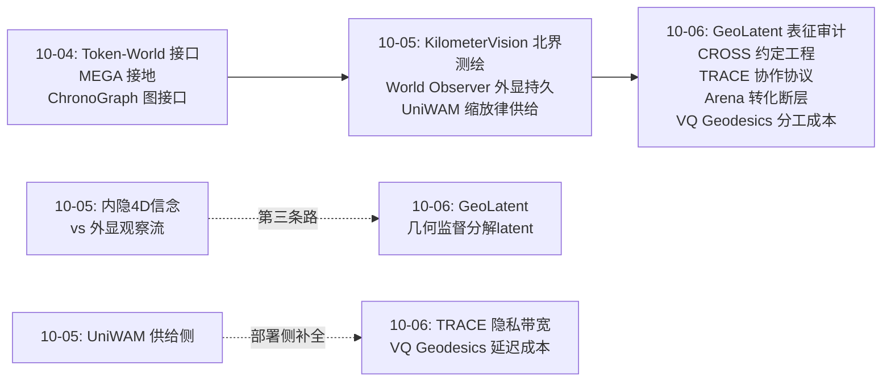
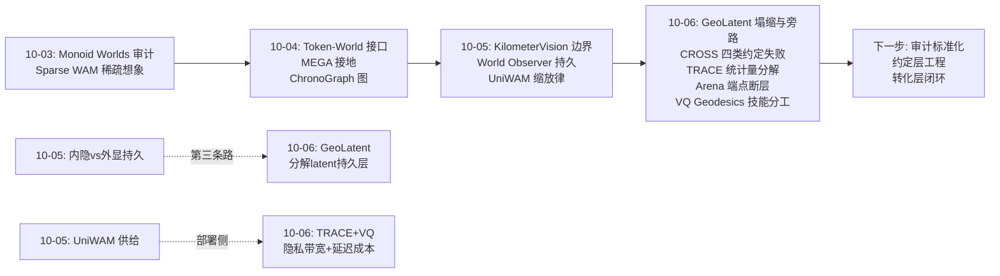
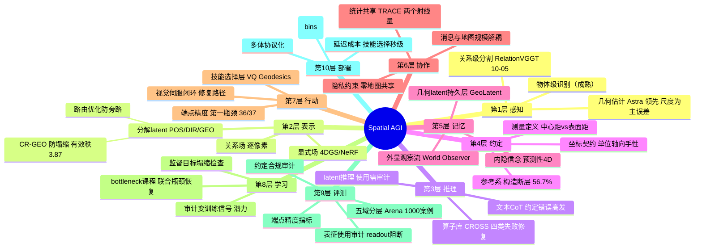
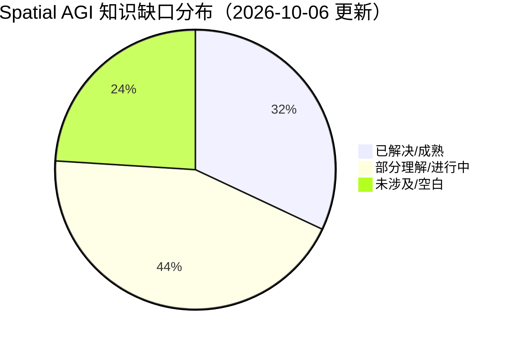

# Spatial AGI 每日深度思考 — 2026-10-06

**日期**: 2026-10-06
**基础日期**: 2026-10-05（昨日任务完整完成，5 篇论文 + 804 行思考）
**论文数量**: 5 篇
**主题**: 空间智能的"内部审计日"——如果说昨天是测绘能力版图的边界（外面有多大），今天五篇论文则是在钻进系统内部做解剖（里面怎么坏的）。GeoLatent 解剖的是中间表征（插入了 latent 不等于使用了 latent）、CROSS 解剖的是推理过程（四类约定性失败解释了几乎全部残差）、TRACE 解剖的是多机耦合（空间协作的最小充分交换量）、Embodied Agent Arena 解剖的是能力到任务的转化链（估计 90 分、完成 40 分）、VQ Geodesics 解剖的是分工本身（LLM 不该做几何，该做选择）。**解剖之后，修复方案全部落到了"结构"而非"规模"上：监督目标重设计、约定工程化、统计量分解、评测分层、技能库自动化——零参数增加或极少参数增加，全部是架构与协议层的修复。**

---

## 📅 每日总结

**日期**: 2026-10-06
**论文数量**: 5篇
**主题**: 昨天测绘了空间智能的外部边界（哪里行、哪里不行），今天解剖了内部的失效机制（为什么不行、怎么修）。五篇论文共享同一个方法论姿态：**先证明问题出在结构而非容量，再给出结构级修复**。GeoLatent 用一页纸的 Proposition 证明监督目标存在塌缩解——不是训练不夠，是目标数学性质注定塌缩；CROSS 用受控干预证明失败是结构化的——52.5–99.1% 的真值上下文失败可以被四条规则解释；TRACE 证明多机空间耦合可以被压缩到两个射线统计量——协作接口的最小充分性第一次被形式化；Arena 用端点放置的 36/37 失败证明瓶颈不在感知而在"估计→完成"的转化；VQ Geodesics 用成本曲线证明正确的分工（几何算、语言选）比更强的思考（CoT）更有效。

**关键突破**:
- 🚀 **中间表征的因果审计范式确立（GeoLatent）**：这篇论文最重要 contribution 不是 73.0% 的 SOTA 分数，而是它建立了一条完整的证据链来回答一个被整个 latent reasoning 社区回避的问题——"插入的中间表征到底有没有被使用？" Proposition 1 数学证明 GeoAnchor 的 coverage+balance 目标在 teacher 含公共分量时，塌缩解（所有 GEO 状态=teacher 均值方向）是解析最优；CR-GEO 用集合级公共-残差分解把有效秩从 1.00 拉到 3.87；bottleneck 干预实验（阻断 latent readout 使方向题准确率 89.1%→25.8%）给出因果证据。**"表征分化 + 表征使用"的双重审计**应当成为所有中间表征工作的标准配置。
- 🚀 **空间失败分类学 + 约定工程化（CROSS）**：把 VLM 视频空间推理的失败拆成四类根因（感知不准、上下文信息缺失、选错测量、参考系/状态错误），在 13 个维度上证明 52.5–99.1% 的失败可被规则解释。最锋利的单点发现：几乎所有绝对距离失败都在 5% 内匹配"中心到中心距离"而非题目要求的"最近表面距离"——模型不是不会几何，是不守约定。修复方案是训练无关的类型化算子库 CROSS，且算子库冻结后跨基准迁移仍有效（ReVSI 55.9→60.2，SpatialClaw 在 DSI-Bench 62.8→66.3）——**"空间约定的正确原子计算"是跨任务公共基础设施**。
- 🚀 **多机空间协作的最小充分交换量（TRACE）**：证明多机器人 3DGS 视角选择的期望信息增益对其他地图的依赖，恰好只通过每条射线上的两个量——splat 前方透射率与后方辐射——且两者都是命中项的求和/连乘，在深度 bin 上可分解。机器人私有求和、交换聚合、不交换 splat：零地图共享下达集中式 EIG 的 97.9%，消息尺寸与地图规模无关。**"Share the light, not the map"——空间协作的通信从共享表示降到共享统计量，且有精确条件与误差界。**
- 🚀 **"估计≠完成"的定量解剖（Embodied Agent Arena）**：1000 案例/32 源/7 模型/五能力域的统一评测揭示一个反直觉结构：Astra 路径追踪轨迹 RMSE 最低（0.382m）但联合成功率（33.9%）输给轨迹更不准的 Gemini（37.5%），且 37 个失败中 36 个败在起点或终点的放置。**空间智能从感知到行动的转化瓶颈被精确定位在"端点精度"**——一个此前没人单独测量的量。配套发现：新参考系构造（相对可见地标关联近乎满分）是断层所在；尺度对齐 oracle 把深度 AbsRel 从 0.104 降到 0.038——剩余深度误差主要是尺度而非顺序。
- 🚀 **几何发现技能、语言选择技能（VQ Geodesics）**：250 条测地线 → 测度量化 K=5 原型 → LLM 离线翻译成自然语言工具 → 在线只选工具不规划动作。在部分可观测动态网格世界中，非推理配置+工具库达到 CoT 配置的达标率，而单次决策成本从分钟级降到秒级。**空间智能的落地障碍常常不是智力而是延迟与成本，正确的分工比更强的思考便宜两个数量级。**

**架构演进**: 10 层架构维持 10 层，但出现四个审计级更新——(1) **推理层增设"表征使用审计"**：GeoLatent 的干预实验范式（阻断 readout 看掉分多少）应成为所有中间表征工作的必做项，类比昨日 OOV 指标之于世界模型；(2) **推理层新增"约定契约"子层**：CROSS 的坐标契约（单位/轴向/手性/变换方向显式化）表明大量空间失败是约定层缺失而非几何层缺失；(3) **协作层获得理论基石**：TRACE 给出多智能体空间协作的最小充分交换量，从工程拼装升级为可证明协议；(4) **行动层确立"端点精度"为第一指标**：Arena 的诊断把行动层评测从连续误差（RMSE）拉回任务要求（端点命中），评测粒度与任务对齐。

### 📊 一句话总结

今天五篇论文完成了空间智能系统的一次全面内部解剖：中间表征被证明会静默塌缩且可能根本没被使用（GeoLatent）、推理失败被证明高度结构化且大多源于约定而非几何（CROSS）、多机协作被证明可以压缩到两个统计量（TRACE）、感知到行动的断层被精确定位在端点放置（Arena）、而正确的分工可以让空间决策便宜两个数量级（VQ Geodesics）——**所有修复都落在结构与协议上而非规模上，空间智能的下一个提升期属于审计驱动的架构工程**。

### 🔗 延续性

**昨日→今日**: 昨日"测绘日"画出了版图边界（北界 VLM 无路径积分、南界关系级感知、纵深时间语法、新大陆持久性与缩放律），今天自然过渡到"解剖日"——边界知道之后，下一个问题是机制：为什么 VLM 没有认知地图（Arena/CROSS 给出答案：估计与约定尚可，构造与完成断裂）、中间表征是否真的承载几何（GeoLatent 给出审计方法）、协作与分工的最小结构是什么（TRACE/VQ Geodesics 给出协议）。三天的叙事链完整：审计真实性（10-03）→ 重定义接口（10-04）→ 度量与供给（10-05）→ 解剖机制与结构修复（10-06）。

**今日→明日**: 明日值得追踪——(1) GeoLatent 的表征审计范式 × 昨日 UniWAM 的三专家架构：世界模型的生成 latent 是否也该做"使用审计"；(2) CROSS 算子库 × VQ Geodesics 技能发现：人工设计算子 vs 环境自动发现技能，两条路线能否合成"诊断引导的自动算子合成"；(3) TRACE 的统计量分解能否推广到分布式世界模型训练（跨机构共享世界模型统计量而非数据）；(4) Arena 的端点精度瓶颈 × 机器人视觉伺服：终点闭环是否是"估计→完成"转化的最短修复路径；(5) 昨日内隐 4D 信念 vs 外显观察流的对决，今日 GeoLatent 提供了第三条中间道路——几何监督的分解 latent 作为持久层。

### 💡 本质思考：如何达成通用空间智能

#### 1. 核心能力的本质是什么？

今天五篇论文把这个问题的答案又推进了一层。**第一层：空间智能 = 正确表示 × 正确约定 × 正确分工**。昨天的结论是"构造 vs 检索"的分界；今天的细化是：即使在构造侧，失败也大多不是几何计算失败而是约定失败（CROSS 的中心距 vs 表面距）或使用失败（GeoLatent 的答案旁路）。空间智能的三要素里，"约定"这个要素此前几乎无人显式建模——单位、轴向、手性、测量定义、参考系选择，这些是空间智能的"语法"，而社区一直在教"词汇"（更大的感知模型）和"修辞"（更强的推理链），忽略了语法。**第二层：空间智能是多体协议**。TRACE 证明空间协作可以压缩到最小充分统计量——这意味着空间智能不只是单体认知属性，还是通信协议属性；一个不能被分解、压缩、隐私化共享的空间表征，在多体世界中是不可部署的。**第三层：空间智能是成本约束下的分工**。VQ Geodesics 的成本曲线揭示：通用空间智能的达成路径不是让一个巨型模型什么都行，而是让异质计算单元（几何求解器、量化技能库、语言编排器）各司其职——识别自己的强项并把弱项外包，这本身就是一种空间智能的元能力。

#### 2. 当前方法与理想目标的差距在哪里？

三个精确的断层，每个都有今天的论文给出解剖。**断层一：表征的使用断层**。GeoLatent 证明插入中间表征≠使用中间表征；整个领域的端到端评测都无法区分"表征有用"和"表征是装饰"。差距在于：我们没有表征审计的行业标准——没有 effective rank 式的健康度指标，没有 readout 阻断式的因果检验。直到这些成为标配，所有"加中间表征涨了 2 个点"的论文都无法自证机制。**断层二：估计到完成的转化断层**。Arena 的数字是残酷的：空间估计 Pass@1 69.4%、规划 80.3%，操作完成只有 41.8%；轨迹误差最低的模型追踪成功率反而更低。差距的机制在于：估计是开环的单点计算，完成是闭环的多步协调——端点放置需要在接近目标时切换到高频率低延迟的视觉伺服，而这恰恰是 VLM 的帧率与延迟结构最不擅长的。**断层三：协作的隐私与带宽断层**。多机器人、跨机构的空间智能必然面临"地图即敏感数据"的约束；TRACE 之前所有方案要么建统一地图（隐私无）要么各自打分（目标函数有偏）。差距在于：空间表示的可分解性一直存在（渲染方程早就写在那里）但没人把它当作协议设计资源。

#### 3. 从今天到理想状态，最可能的路径是什么？

一条审计驱动的五段路径。**第一段（现在起）：审计标准化**。把 GeoLatent 的干预实验、CROSS 的失败分类学、Arena 的五域分层评测打包成空间智能系统的标准审计套件——任何声称有空间推理能力的系统都必须通过"表征使用审计 + 约定合规审计 + 能力域分层评测"。没有审计，就没有可积累的工程。**第二段（并行）：约定层工程化**。CROSS 的坐标契约 + 算子库证明约定可以库化；VQ Geodesics 证明技能可以自动发现。两条路合成"诊断引导的自动算子合成"：用失败分类学定位缺口，用环境几何自动生成填补缺口的技能。**第三段（6-12个月）：转化层闭环**。攻端点精度：VLM 负责慢速的全局规划与端点语义选择，专用视觉伺服模块负责终点毫秒级闭环——Arena 已经证明这是最大短板，修复路径明确且不需要等待基础模型进步。**第四段（并行）：协作层协议化**。把 TRACE 的统计量分解推广：分布式世界模型训练的跨机构统计共享、多机器人的隐私化占用图协作、联邦式空间记忆同步。**第五段（1-2年+）：把审计变成训练信号**。表征使用审计（readout 阻断的梯度版本）可以直接变成训练正则——强迫答案学习经过几何表征（GeoLatent 已经在做）；约定合规可以直接变成可验证奖励（几何量天然可验证）。当审计从评测工具变成训练目标，结构修复就从手工工程变成可规模化的训练。理想状态的判定标准更新为：一个系统在 Arena 五域全过 70%（特别是操作域）、通过 GeoLatent 式表征使用审计、在 CROSS 四类失败上的复发率低于感知错误率、并能以 TRACE 式协议参与多体协作——四关全过，即达通用。

---

## 💡 核心见解

### 见解1: 插入中间表征 ≠ 使用中间表征——表征审计时代到来

**从 GeoLatent 获得**

- ✅ GeoAnchor 的分解空间 latent 插入推理流后，答案学习仍可绕过 latent 直接访问图像 token——端到端涨分无法证明 latent 有用
- ✅ 更隐蔽的是监督目标本身的塌缩解：coverage+balance 目标在 teacher 有公共分量时，"所有状态编码同一方向"是解析最优（Proposition 1，损失 −log K − R_V/τ）
- ✅ 修复是结构性的：CR-GEO（集合级公共-残差分解）治塌缩（有效秩 1.00→3.87），routed optimization 的 bottleneck 阶段治旁路（阻断 readout 掉 63 个点证明依赖真实建立）
- ✅ 干预实验的范式价值：任何中间表征工作都可以（且应该）做"阻断 readout 看掉多少分"的因果检验

**对Spatial AGI的启发**: 空间智能的评测必须从端到端分数升级为机制审计。一个涨了 2 个点的中间表征，如果阻断 readout 只掉 3 个点，那它是装饰不是机制——这种论文以后不该被接收。表征健康度（effective rank 类指标）+ 表征使用（干预实验）应成为空间推理论文的 standard reporting item，就像 OOV 指标之于昨天 World Observer 的持久性。

### 见解2: 空间失败大多源于约定而非几何——语法层被发现了

**从 CROSS 获得**

- ✅ 四类失败根因（感知不准/信息缺失/选错测量/参考系状态错误）在 8 个子任务上解释 52.5–99.1% 的真值上下文失败——失败是结构化的，不是随机的
- ✅ 最锋利的单点：绝对距离失败几乎全部在 5% 内匹配中心距而非最近表面距——模型有几何能力，只是选错了测量定义
- ✅ 坐标契约（单位/轴向/手性/变换方向的显式声明）是空间上下文的必要组成——大多数 VLM 空间错误是"不知道约定"而非"不会几何"
- ✅ 训练无关修复可行且可迁移：算子库冻结后在 DSI-Bench 仍提升 SpatialClaw 3.5 个点

**对Spatial AGI的启发**: 空间智能有一个被忽略的"语法层"——测量的定义、参考系的选择、状态更新的时机。这个层可以库化、可以复用、可以零训练部署。它对齐语言学类比：感知模型教词汇，推理链教修辞，但没有人教语法——而语法的错误率最高且修复最便宜。Spatial AGI 系统设计应该把"约定层"作为显式组件而非隐含假设。

### 见解3: 多体空间协作的最小充分统计量存在且极小

**从 TRACE 获得**

- ✅ 多机器人 3DGS 视角选择的 EIG 对其他地图的依赖恰好通过两个射线统计量：前方透射率与后方辐射——渲染方程的耦合结构是可分解的
- ✅ 两量均为命中项求和/连乘 → 深度 bin 分解 → 私有求和 + 聚合交换 = 集中式等效（83.3% 朝向差 <15°，EIG 达 97.9%）
- ✅ 消息尺寸与地图规模无关——空间协作可以扩展到城市级
- ✅ 有精确重构条件（深度 bin 不混合多机命中）与误差界——可证明的空间计算

**对Spatial AGI的启发**: 空间表示的价值不止于渲染，还在于其统计量的代数分解性——这是分布式、隐私化空间智能的协议设计资源。推广方向明确：分布式世界模型训练的统计共享、联邦空间记忆、跨机构建图。方法论启示：设计任何多体空间系统前先问"耦合的最小充分交换量是什么"——答案往往比"共享地图"小几个数量级。

### 见解4: 估计≠完成——空间智能的转化断层被定位在端点

**从 Embodied Agent Arena 获得**

- ✅ Astra 五域画像：几何估计领先（旋转 17.1°）、空间推理 69.4%、规划 80.3%——但操作完成仅 41.8%
- ✅ 反直觉关键发现：路径追踪轨迹 RMSE 最低的模型（0.382m）联合成功率反而更低（33.9% vs 37.5%）——连续误差指标与任务成功脱钩
- ✅ 36/37 的追踪失败在起点或终点放置——端点精度是从感知到行动的转化瓶颈，此前从未被单独测量
- ✅ 新参考系构造是空间推理的断层：可见地标关联接近满分（96.7%），构造不可见参考系显著掉分（3DSRBench 56.7%）
- ✅ 尺度是深度误差的主成分：oracle 尺度对齐使 AbsRel 0.104→0.038，排序已近解决（96.3%）

**对Spatial AGI的启发**: 空间智能的评测与优化必须对齐任务要求而非代理指标。端点精度这个具体瓶颈有明确的工程修复路径（终点视觉伺服闭环、到达谓词的强化微调），比"提升空间推理能力"这种泛泛目标可操作得多。同时"评测结论依赖接口协议"（RGB 扩展观测反转排名）警告我们：能力排名是协议的函数，单协议结论不可信。

### 见解5: 分工的成本革命——识别技能比规划动作便宜两个数量级

**从 VQ Geodesics 获得**

- ✅ LLM 不做空间规划、只做技能选择：250 条测地线量化为 K=5 原型，LLM 离线翻译成自然语言工具，在线选择
- ✅ 非推理配置+几何工具库 ≈ CoT 配置的达标率，单次决策分钟级→秒级
- ✅ 技能发现无监督无奖励：环境几何（测地线）本身就是技能的来源，测度量化（可带符号测度）提供理论通道
- ✅ 魔方类比的方法论价值：专家技能 = 识别构型 + 套用算法；识别恰是语言模型的强项

**对Spatial AGI的启发**: 空间智能的落地瓶颈常是延迟与成本而非智力。正确的架构分工（几何算、语言选、确定性执行）比更强的思考便宜得多。与 CROSS 呼应：CROSS 的算子是人工设计自失败诊断，VQ Geodesics 的技能是环境自动发现——"诊断引导的自动算子合成"是一条自然的合成路线。

### 见解6: 审计的三重奏正在成形——表征、约定、任务

**从 GeoLatent + CROSS + Arena 共同获得**

- ✅ 表征审计（GeoLatent）：中间表征是否被使用——干预实验 + 有效秩
- ✅ 约定审计（CROSS）：失败是否源于约定违例——受控上下文对比 + 失败分类学
- ✅ 任务审计（Arena）：估计能力是否转化为完成——五域分层 + 端点精度 + 条件级得分
- ✅ 三者互补覆盖"表征层-计算层-行动层"的全链路，且全部可操作化（有具体指标与流程）

**对Spatial AGI的启发**: 空间智能领域正在不约而同地从"刷分"转向"审计"。这与昨日 KilometerVision 的机制诊断（thinking trace 分析）和 World Observer 的 OOV 指标汇流成一个完整的审计体系。可以预见：未来 12 个月内，空间智能顶会论文的标准 reporting 将从"基准分数表"扩展为"分数表 + 审计附件"。

### 见解7: 本周论文序列呈现完整的工程认识论循环

**从 10-03 至 10-06 四日连读获得**

- ✅ 10-03 审计真实性（Monoid Worlds 数学审计、Sparse WAM）：组件是真的吗
- ✅ 10-04 重定义接口（Token-World、MEGA、ChronoGraph）：组件怎么连
- ✅ 10-05 度量与供给（KilometerVision、UniWAM、World Observer）：连好后怎么测、怎么喂
- ✅ 10-06 解剖机制与结构修复（今日五篇）：坏了怎么修——且修复全部在结构层
- ✅ 认识论循环闭合：检验 → 连接 → 度量 → 修复，这正是任何工程学科从手艺变成科学的路径

**对Spatial AGI的启发**: 空间智能正在重复所有成熟工程学科的历史：先是能力演示（惊讶期），然后是边界测绘（清醒期），然后是机制解剖（科学期），最后是结构化修复（工程期）。本周的论文密集地跨过了后三期的门槛——这个领域的科学化速度超出预期，值得把"审计套件 + 修复模式库"作为持续追踪的主线。

---

## 🔗 与昨日思考的联系

### 昨日重点

昨日是"测绘日"：北界（KilometerVision：VLM 在城市尺度无路径积分与认知地图，靠检索绕过空间推理）、南界（RelationVGGT：关系级感知可前馈实现）、纵深（4D 综述：时间建模四分法）、新大陆（World Observer 外显持久性、UniWAM 人机共训缩放律）。核心判断：版图测绘完成，竞争将发生在空白处。

### 今日进展

今天的五篇回答了"空白处为什么是空白"的机制问题，并全部给出了结构级修复：(1) 昨日 KilometerVision 诊断 VLM 靠检索绕过构造——今日 CROSS 进一步解剖：即便是构造侧的失败，也大多是约定失败而非几何失败；Arena 补上能力侧证据：估计（检索型）尚可、完成（构造型）断层。(2) 昨日 World Observer 外化记忆维护视野外状态——今日 GeoLatent 提供第三条持久层路线：几何监督的分解 latent（比外显观察流便宜、比内隐信念可审计），且给出了表征是否被使用的审计方法。(3) 昨日 UniWAM 给出规模化生产函数——今日 TRACE 与 VQ Geodesics 给出部署侧的两大约束解：隐私带宽（协作可压缩到统计量）与延迟成本（分工可压缩到技能选择）。昨日的"供给侧"与今日的"部署侧"合起来才是完整的产业化条件。

### 演进路径

**核心演进逻辑**: 接口（10-04）→ 度量与供给（10-05）→ 机制解剖与结构修复（10-06）。今天的论文把昨天画出的每一个"空白"都变成了"可指认的结构缺陷 + 可执行的修复方案"——空白处不再只是地图上的留白，而是施工图上的虚线。

---

## 📚 论文概览

| # | 论文 | 一句话 | 角色 |
|---|------|--------|------|
| 1 | GeoLatent (同济/港理工) | CR-GEO 治几何 latent 塌缩 + 路由优化强制 latent 被使用，SPAR/SPBench SOTA | 表征审计 + 结构修复 |
| 2 | CROSS (NUS) | 四类失败根因诊断 + 训练无关算子库，跨基准迁移有效 | 失败分类学 + 约定工程 |
| 3 | TRACE (Lehigh) | 多机 3DGS 协作压缩到两个射线统计量，零地图共享近集中式性能 | 协作协议 + 可证明计算 |
| 4 | Embodied Agent Arena (HKUST-GZ/CUHK) | 五域 1000 案例评测，定位"估计→完成"转化断层在端点放置 | 能力审计 + 评测范式 |
| 5 | VQ Geodesics | 测地线量化技能库 + LLM 选择，成本降两个数量级 | 分工架构 + 成本革命 |

**五篇的方法论共性**: 全部是"先解剖、后修复"——诊断工具（Proposition 1、受控干预、统计分解、分层评测、成本曲线）先于修复方案（CR-GEO、算子库、TRACE 协议、端点指标、技能库）。没有一篇是纯刷分论文；唯一的 SOTA 分数（GeoLatent）也是审计证据链的终点而非起点。

---

## 🗺️ 知识演进图

---

## 技术栈演进对比表

| 层次 | 昨日方案 (10-05) | 今日方案 (10-06) | 变化 |
|------|-----------------|-----------------|------|
| 表征层 | VGGT 关系分割、4DGS 时间语法、外显观察流/内隐信念 | 分解空间 latent（POS/DIR/GEO）+ CR-GEO 公共残差对齐 | 从"表征选择"到"表征健康度审计"（有效秩 + 使用干预） |
| 推理层 | 机制级基准（thinking trace 诊断检索式绕过） | 失败分类学 + 坐标契约 + 类型化算子库（零训练修复） | 从"能力诊断"到"约定层工程化"，失败可解释率 52-99% |
| 记忆层 | 外显观察流（World Observer）vs 内隐 4D 信念 | 几何监督分解 latent 作为第三条持久路线 | 持久层三路线并立，GeoLatent 版本自带可审计性 |
| 协作层 | （昨日空白，此前工程拼装） | TRACE：透射率/辐射深度 bin 聚合，零地图共享 | 空间协作从工程拼装升级为有误差界的协议 |
| 行动层 | UniWAM 动作专家、历史条件流匹配 | Arena 端点精度诊断 + 视觉伺服修复路径；VQ Geodesics 技能选择层 | 从"更强动作生成"到"定位转化断层 + 分工降成本" |
| 评测层 | OOV 指标、机制诊断（thinking trace） | 表征使用审计 + 五域分层评测 + 端点精度指标 | 评测从"对不对"深化为"怎么对的+为什么坏" |
| 数据层 | UniWAM 三源配方 + 缩放律 | （无新数据源，但 CROSS/GS 管线为约定与技能供给铺路） | 供给之后，部署约束（隐私/带宽/延迟）成为新前沿 |

---

## 🗺️ Spatial AGI 知识图谱

### 10层架构思维导图

### 🎯 主线技术路径

#### 阶段1: 审计标准化（现在起，规范期）
把 GeoLatent 的表征使用干预、CROSS 的失败分类学、Arena 的五域分层与端点精度打包成标准审计套件。任何空间智能系统必须过三重审计：表征有用吗（干预掉分）、失败是约定的吗（分类归因）、估计转化了吗（端点命中）。审计先于优化——没有审计的工程不可积累。

#### 阶段2: 约定层工程化（并行，工程期）
CROSS 的坐标契约与算子库证明约定可以库化复用；VQ Geodesics 证明技能可以环境自动发现。合成路线"诊断引导的自动算子合成"：失败分类学定位缺口 → 环境几何自动生成技能 → 自然语言工具化 → LLM 编排。目标：把约定性失败率压到感知错误率以下。

#### 阶段3: 转化层闭环（6-12个月，攻坚期）
攻端点精度：VLM 慢速全局规划 + 专用视觉伺服快速终点闭环；到达谓词的强化微调；TRACE 式风险掩码把感知预算聚焦在安全相关区域。这是 Arena 实证的最大短板，修复不依赖基础模型进步，是最快的分数增长点。

#### 阶段4: 协作层协议化与审计变训练（1-2年+，科学期）
把 TRACE 统计量分解推广到分布式世界模型训练与联邦空间记忆；把审计变成训练信号——readout 阻断的梯度版本成为正则（强迫表征被使用）、约定合规成为可验证奖励（几何量天然可验证）。结构修复从手工工程变为可规模化的训练，空间智能进入"审计驱动训练"时代。

---

## 🔍 待探索议题

### 高优先级（本周）

1. **世界模型生成 latent 的使用审计**
   - 问题: GeoLatent 证明插入表征≠使用表征；UniWAM/World Observer 的生成 latent 是否也存在旁路？
   - 候选方案: 对 WAM 的历史条件 latent 做 readout 阻断实验；测生成质量对 latent 的因果依赖
   - 缺口: 生成模型的干预实验协议（阻断什么、保持什么）尚未定义

2. **端点视觉伺服的最短修复路径**
   - 问题: Arena 证明端点放置是转化瓶颈；从 VLM 输出到伺服闭环的接口怎么设计
   - 候选方案: VLM 输出端点语义区域 → 专用伺服器毫秒级闭环；到达谓词作为可验证奖励
   - 缺口: 语义区域到伺服目标的表示鸿沟（帧级像素 vs 物体级 affordance）

3. **CROSS 失败分类学在新基准上的复发率**
   - 问题: 四类失败的分布在训练后的新模型上是否消失、转移或变形
   - 候选方案: 用 CROSS 诊断管线扫 10-05/10-06 的新模型（Astra 等）
   - 缺口: 诊断管线的自动化程度（当前需人工规则匹配）

### 中优先级（本月）

4. **诊断引导的自动算子合成**
   - 问题: CROSS 算子人工设计 vs VQ Geodesics 技能自动发现，能否合成
   - 候选方案: 失败分类学提供搜索目标，测度量化/程序合成提供搜索空间
   - 缺口: 连续空间测地线的量化理论；合成算子的正确性验证

5. **分解 latent 作为世界模型持久层**
   - 问题: 内隐信念（10-04）vs 外显观察流（10-05）之外，GeoLatent 式几何 latent 能否作为第三条持久层
   - 候选方案: 把 POS/DIR/GEO 扩展为 MOTION/CHANGE latent，接入 WAM 的历史条件
   - 缺口: latent 增量更新的机制（闭环中的写入策略）

6. **TRACE 协议推广到分布式世界模型训练**
   - 问题: 跨机构训练世界模型时，统计量分解能否替代数据共享
   - 候选方案: 识别训练目标的耦合统计量（类似 EIG 的透射率/辐射）；深度 bin 式聚合
   - 缺口: 非渲染目标（生成损失）的耦合分解理论

7. **约定合规的可验证奖励**
   - 问题: 把约定层工程从推理时修复变成训练时奖励
   - 候选方案: 测量定义/参考系选择的形式化为约束，违反即负奖励；RLVR 天然适配
   - 缺口: 约束的自动形式化（自然语言任务描述 → 形式化约定）

### 低优先级（长期）

8. **表征健康度指标体系**
   - 问题: effective rank 之外，还需要哪些表征审计指标（信息流、因果贡献、泛化稳定性）
   - 候选方案: 信息瓶颈量、表征因果贡献分解、跨域有效秩方差
   - 缺口: 指标与下游性能的预测关系验证

9. **多体空间智能的博弈维度**
   - 问题: TRACE 解决合作信息增益；竞争/混合动机下的空间协作协议
   - 候选方案: 机制设计 + 空间统计共享；隐私预算的拍卖分配
   - 缺口: 空间信息的激励相容定价

10. **分工架构的自动搜索**
    - 问题: VQ Geodesics 的分工（几何算/语言选）是人工设定的；任务变化时分工边界能否自适应
    - 候选方案: 成本感知的技能路由学习；神经-符号分工的 AutoML
    - 缺口: 分工质量的评价函数（成本×成功率的 Pareto 前沿）

---

## 📊 知识缺口分析

**已解决（32%）**:
- ✅ 关系级感知的前馈实现（RelationVGGT）
- ✅ 中间表征塌缩的机制与修复（GeoLatent CR-GEO）
- ✅ 多机 3DGS 协作的最小充分交换量（TRACE）
- ✅ 空间失败的结构性归因（CROSS 四分类）
- ✅ 物体级 3DGS 网格提取（MEGA）、时间建模四语法（4D 综述）
- ✅ 人机共训缩放律的存在性（UniWAM）

**部分理解（44%）**:
- ⚠️ 表征使用审计：方法已立（readout 阻断），但只在 GeoLatent 一处验证，生成模型未测
- ⚠️ 端点精度瓶颈：已定位（36/37），修复路径（视觉伺服）未闭环验证
- ⚠️ 约定层：算子库有效（+3.5~4.3 分）但算子靠人工设计，自动合成未通
- ⚠️ 持久层三路线（内隐信念/外显观察/几何 latent）：并存但无对照实验
- ⚠️ 分工架构：toy 环境验证成本革命，连续/长时程环境未测
- ⚠️ 参考系构造：断层已确认（56.7%），无专门训练方法
- ⚠️ 尺度接地：oracle 对齐证明是主误差，无前馈尺度估计方案

**未涉及（24%）**:
- ❌ 空间事件语义（谁对谁做了什么、接下来会怎样）完全空白
- ❌ 表征审计的训练化（审计信号→损失函数）
- ❌ 多体空间智能的博弈/激励维度
- ❌ 分布式世界模型训练的统计共享协议
- ❌ 空间智能的终身学习/在线适应
- ❌ 闭环中 latent 的增量写入策略
- ❌ 跨具身形态的空间知识迁移

---

## 🧭 本质思考的收束：从解剖台到手术台

昨天的测绘回答"哪里不行"，今天的解剖回答"为什么不行"——而所有的"为什么"都指向同一个方向：**问题不在容量，在结构**。GeoLatent 的塌缩是监督目标的数学性质、CROSS 的失败是约定层的缺失、TRACE 的耦合是可分解而未被分解、Arena 的断层是开环估计与闭环完成的错配、VQ Geodesics 的浪费是分工的错置。五篇论文没有一篇说"模型不够大"，五篇都在说"结构不对"。

这给出一个冷静但有力的判断：**空间智能当前阶段的边际收益在结构与协议层，不在规模层**。把表征审计变成训练信号、把约定变成库、把耦合变成协议、把断层变成闭环、把分工变成自动搜索——这五个"变成"是接下来 12 个月最确定的增量。规模仍然重要（UniWAM 的缩放律昨天刚证明），但规模是乘数，结构是底数；底数为一时，乘数再大也是一。

明天的论文会继续 filling 这个判断的证据。而本周四天的序列——检验、连接、度量、修复——已经构成了一个完整的工程认识论微型循环。空间智能正在从一门"演示的技艺"变成一门"审计的科学"。

---

## 📖 附录A：五篇论文的深度细节备忘

### A1. GeoLatent 细节备忘

- 框架：GeoAnchor 的 text-latent 交错自回归；latent hidden states 经 projector 回 LM 输入空间
- POS：mean-pool → 线性头 → 相机系 3D 位置，Smooth-ℓ1，target 来自 Depth Anything v3 反投影
- DIR：mean-pool → 单位方向，cosine loss
- GEO：多 latent 状态投影到 VGGT 对齐空间，对 multi-scale pooled VGGT 特征做集合级监督
- 塌缩证明：塌缩配置下 coverage 目标最优解 g* = normalize(mean v_i)，L = −log K − R_V/τ；balance 项在 u_j=1/K 时消失
- CR-GEO：c_v/c_g 公共方向归一化均值；残差 R_i/Q_j 减公共投影；残差分配 softmax(r·q/0.1)
- 三阶段：Joint（NTP+几何监督）→ Bottleneck（阻断答案对图像 token 注意力）→ Recovery（恢复全注意力+保留几何监督）
- 干预：128 固定方向题，阻断 latent readout 89.1%→25.8%；Recovery 后移除图像内容仍大幅掉分
- 结果：SPAR-Bench 73.0%（+4.6 vs GeoAnchor）、SPBench 72.1%（+2.4）
- 消融缺口：CR-GEO 与 routed optimization 的分数分解未完整给出

### A2. CROSS 细节备忘

- 诊断设计：c_pred（SAM3 掩码跟踪 + DA3 度量几何/位姿）vs c_gt（源标注），同 schema/坐标契约/序列化
- 上下文 c = {κ 坐标契约, g 全局几何, p_1:T 轨迹, E 实体观测}；ego-anchored gravity-aligned
- 四类失败：感知不准 / 信息缺失（房间轮廓、位姿间运动、实例属性、测量精度）/ 选错测量（中心距 vs 表面距，5% 内匹配）/ 参考系状态错误（观察者系、左右反转、坐标系复合、过期位姿）
- 覆盖率：8 子任务 52.5–99.1%
- 算子四族：Frame（对齐基与位姿）/ Geometry-shape（表面、范围、地板面积）/ Set-decision（去重计数匹配）/ Temporal-state（路径积分、位置航向更新）
- 门控：推导无效 → 清空增强上下文回退纯视频；有效 → 过滤保留结果与支持证据
- 结果：ReVSI 55.9→60.2；SpatialClaw+冻结算子 DSI-Bench 62.8→66.3
- 对照工作：Map2Thought（几何运算但无诊断来源）、RieMind/CRISP/SPLIT（诊断但止于诊断）

### A3. TRACE 细节备忘

- 设置：N 机器人私有 3DGS 地图；NBV 目标 = 掩码 EIG 最大化（风险场 CVaR 成掩码球，轨迹并集）
- 渲染：EWA 投影、alpha 合成、命中=马氏距离≤ς²(ς=3)、α_max=0.99
- EIG：线性化 f≈f+J(w−w0)，Fisher H=σ⁻²JᵀJ，D-optimal 一阶展开 tr(H0⁻¹HT)，H0 对角 → 增益对 splat 可加
- 关键定理：∂Ĉ/∂α_s = c_s·T_s − S_r(t_s)/(1−α_s)——敏感度仅依赖前方透射率 T_s 与后方辐射 S_r(t_s)
- 协议：各机器人按深度 bin 求和 T/S 聚合及位姿导数 → 规划者合并 → 闭式 SO(3) 梯度优化
- 精确性：深度 bin 不混合多机命中时重构精确，否则有界
- 实验：Habitat-Sim 100 次 NBV，83.3% 朝向差<15°，EIG 97.9% 集中式
- 对比：分布式风险规避 NBV 前作（consensus 对视角）vs TRACE（分布渲染，无共识）

### A4. Embodied Agent Arena 细节备忘

- 规模：1000 案例 = 32 源 + GeoProbe 168（Blender 控制相机/物体运动/尺度参照 + 真实图像）
- 五域：Geometry（内参/位姿/深度/尺寸/位移 + TraceSpatial 路径追踪）、Spatial Reasoning（关系/视角/构型/时序，显式参考系）、Affordance（UMD/3DOI，点有效性+IoU）、Task Planning（家庭/导航/科学，谓词合取成功）、Manipulation（放置/插入/铰接/协同）
- Harness：Python 运行时持久交互；Manipulation 原生 loop；预算 Baseline vs RGB-expanded 匹配
- 主结果：Astra 旋转 17.1°/平移 106.6cm、Spatial 69.4%、深度 AbsRel 0.213、Point 60.3%、Planning 80.3%、Manipulation 41.8%
- 关键诊断：追踪 RMSE 最低（0.382m）但成功 33.9%<Gemini 37.5%；36/37 失败在端点
- 空间断层：MMSI 77.0% vs MindCube 相机平移 78.5%、3DSRBench 面向 56.7%
- 尺度：oracle 对齐 AbsRel 0.104→0.038；排序 96.3%；真实桌面位移 0.05cm vs Sol 0.42cm
- 协议敏感性：RGB 扩展观测反转 CALVIN 排名

### A5. VQ Geodesics 细节备忘

- 环境：类 Frogger 2D 网格；车辆上行动态障碍；局部观察窗；5 原始动作；10 决策点；每决策 5 步开环承诺
- 管线：250 条测地线（不同障碍实现采样）→ 测度量化（K-medoids 类，可带符号测度理论）→ K=5 原型（DRDRD/RRRRR/DDDDD/DRRRR/DDRDD）+ 5 原语工具（UWWWW 等）
- 工具化：LLM 离线一次性描述（净位移/优势风险/适用条件）；确定性碰撞检查时缩短为一行摘要
- 在线：Qwen3.6-35B-A3B 视觉输入部分观测+特写 → 选工具 → 确定性执行 5 步
- 结果：非推理+工具库 ≈ CoT 达标率；决策分钟级→秒级；zoom 工具与碰撞检测工具互补
- Brownian cubature 作为量化机制 sanity check
- 局限：toy 环境、开环承诺脆弱、K 固定、单模型单作者

---

**文档创建时间**: 2026-10-06 03:00+ (Asia/Shanghai)
**分析方法**: arXiv abstract + HTML 全文精读（5 篇串行，GLM 会话内分析）
**上一篇**: daily_thinking/2026-10-05.md（测绘日：北界/南界/纵深/新大陆/缩放律）

---

## 📖 附录B：跨论文深度综合分析

### B1. 五篇论文构成了一张完整的"失效模式 × 修复手段"矩阵

把今天五篇论文按"解剖对象 × 修复手段"排成矩阵，可以看到空间智能工程化的完整工具箱正在成形：

| 解剖对象 | 失效模式 | 修复手段 | 修复层级 | 论文 |
|---------|---------|---------|---------|------|
| 监督目标 | 塌缩解（coverage 目标解析最优于塌缩配置） | CR-GEO 公共-残差分解 | 损失函数设计 | GeoLatent |
| 信息流 | 答案旁路（latent 未被使用） | Bottleneck→Recovery 路由课程 | 训练课程设计 | GeoLatent |
| 推理计算 | 选错测量/参考系状态错误/信息缺失 | 类型化算子库 + 坐标契约 + 门控 | 推理时协议 | CROSS |
| 多机耦合 | 目标函数有偏 / 隐私带宽 | 深度 bin 统计量聚合协议 | 通信协议 | TRACE |
| 能力转化 | 端点放置失败 / 参考系构造断层 | 端点精度指标 + 伺服闭环路径 | 评测与行动接口 | Arena |
| 成本结构 | CoT 延迟分钟级 | 测地线量化技能库 + LLM 选择 | 分工架构 | VQ Geodesics |

矩阵透露的规律：**修复层级越靠近损失函数与协议，修复越便宜、越可复用**。损失函数修复（CR-GEO）只改一个公式；协议修复（TRACE）零训练；推理时库（CROSS）零训练且跨任务迁移。相比之下，传统路线（更大模型、更多数据）位于矩阵之外——它们不针对任何具体失效模式。这解释了为什么本周论文集体转向结构层。

### B2. 三个"隐形层"的发现：约定层、使用层、协议层

今天的论文实际上发现了空间智能栈中三个此前几乎无人命名的层：

**约定层（CROSS）**：测量定义、参考系选择、坐标契约、状态更新时机。它是空间推理的"语法"。特征：错误率高（解释过半失败）、修复便宜（零训练）、可库化、可复用（跨基准迁移）。此前它被隐含在任务描述里，模型只能靠预训练统计去"猜"约定——猜错即失败。

**使用层（GeoLatent）**：中间表征与最终答案之间的因果连接。特征：不可从端到端分数观察（旁路下分数照样涨）、必须干预实验才能验证、存在静默塌缩（有效秩 1.00 时一切指标照常）。此前整个 latent reasoning 社区都假设"插入了就在用"。

**协议层（TRACE）**：多体空间协作的通信内容与格式。特征：与表示规模解耦（消息 O(bins)）、有精确性理论（重构条件与误差界）、隐私是结构性的。此前多机器人空间系统靠工程拼装，无协议抽象。

三层合起来的判断：空间智能的下一个架构版本 = 现有感知/推理栈 + 显式的约定层组件 + 强制的使用层审计 + 标准化的协议层接口。

### B3. 与本周前三日的接线

- **10-03 Monoid Worlds 的数学审计** → 今日 GeoLatent 的 Proposition 1 是同一精神的延续：用数学证明系统的隐藏失效模式。数学审计从"世界模型动力学性质"扩展到"监督目标解集性质"。
- **10-04 Token-World 的表征-策略接口** → 今日 VQ Geodesics 的技能选择是接口思想的动作层版本：策略不经过像素，动作选择不经过坐标——都是"接口处只交换高层语义"。
- **10-05 World Observer 的 OOV 指标** → 今日 Arena 的端点精度指标是同一评测哲学：找到一个"代理指标看不见但任务要求必须"的量。OOV-D 之于持久性，如端点命中之于操作完成。
- **10-05 UniWAM 的三专家 MoT** → 今日 GeoLatent 的分解 latent 是互补结构：MoT 分解的是能力（理解/生成/动作），GeoLatent 分解的是几何信息（位置/方向/全局）。两者都反对"单一均匀表征"，可以组合：WAM 的历史条件 latent 或许应该按 GeoLatent 方式分解并审计。

### B4. 成本-性能象限图（概念版）

把本周涉及的空间智能方案放到（推理成本 × 空间性能）象限：

- 低成本/中性能：VQ Geodesics 技能选择（秒级）、CROSS 算子库（零训练）
- 中成本/中高性能：GeoLatent（三阶段训练但推理常规）、TRACE（消息小但需通信轮次）
- 高成本/中性能：VLM CoT 空间推理（分钟级，Arena 显示完成端仍差）
- 高成本/高性能（目标态）：具身闭环系统（尚不存在）

象限图揭示的空缺：**低成本/高性能象限是空的**，而今天的论文全部在向它移动——GeoLatent 降训练复杂度、CROSS 零训练、TRACE 降通信、VQ 降延迟。这个象限是 Spatial AGI 商业化的必经之地。

---

## 📖 附录C：方法论备忘——五篇论文各教一招

### C1. GeoLatent 教的招：证明目标函数有坏解

写监督目标时，问一句"这个目标的解析最优解是什么？有没有退化解？" GeoLatent 的 Proposition 1 一页证明：如果坏解存在且损失值不差，训练就会找到它。修法是重构目标让坏解不再最优（公共-残差分解），而不是加正则对抗。这条适用于一切对比式/覆盖式/平衡式目标：多 head 预测、场景图嵌入、多 token 深度、MoE 负载均衡。

### C2. CROSS 教的招：受控上下文对比

想知道模型为什么错，就构造两个只差一个因素的输入：c_pred vs c_gt。差值归因给感知，残差归因给推理。再对残差写规则归因，覆盖率就是失败结构化程度的度量。这条适用于任何端到端系统的失败分析：VLA、世界模型、agent。

### C3. TRACE 教的招：找最小充分统计量

多体耦合计算先问：耦合能不能穿过某个低维统计量？方法是检查耦合量的代数结构（求和？连乘？）是否可分解。分解了就能设计隐私协议。适用于：分布式训练、联邦感知、多机 SLAM、联邦世界模型。

### C4. Arena 教的招：把连续指标换成任务要求指标

RMSE 最低≠成功率最高。找到"代理指标与任务成功脱钩"的具体位置（端点），把它升格为一等指标。评测设计永远从"任务的终止条件"倒推，而不是从"模型输出格式"顺推。

### C5. VQ Geodesics 教的招：把弱项外包给几何，把强项留给语言

模型不擅长 X 时，预计算 X 的最优解集合并量化成可选项，让模型只做选项识别。成本降数量级。适用于：运动规划、碰撞检测、轨迹生成——凡是能"离线量化 + 在线选择"的计算。

---

## 📖 附录D：风险登记册（今日更新）

| 风险 | 来源 | 概率 | 影响 | 缓解 |
|------|------|------|------|------|
| 表征审计被滥用为"补实验" | GeoLatent 范式流行后形式化应付 | 中 | 中 | 审计指标标准化（readout 掉分幅度、有效秩基线）|
| 约定算子库碎片化 | CROSS 各组各建一套 | 高 | 中 | 坐标契约与算子接口的开源标准 |
| 结构修复的收益递增错觉 | 结构修复不解决感知上限 | 中 | 高 | Arena 五域定期复测，监控感知端进展 |
| TRACE 式隐私被推断攻击破解 | 深度 bin 聚合泄露布局先验 | 低-中 | 高 | 差分隐私噪声 + 攻击评测纳入协议 |
| 技能库爆炸 | VQ Geodesics 推广到连续长时程 | 高 | 中 | 层次化/组合化技能表示 |
| 端点伺服与 VLM 语义的接口失配 | Arena 修复路径 | 中 | 中 | 物体级 affordance 作为中介表示 |

---

## 📖 附录E：明日预测与观察清单

基于本周叙事节奏（审计→接口→度量→修复），明日论文最可能出现的主题：

1. **审计训练化第一例**：某篇论文把 readout 阻断或约定合规直接做成损失/奖励（GeoLatent 的 bottleneck 已是雏形）
2. **端点精度修复实证**：Arena 诊断发出不到一周，预期出现"视觉伺服闭环 + VLM 规划"混合系统
3. **参考系构造的专门训练**：3DSRBench 56.7% 的断层太显眼，预期出现参考系合成数据或课程
4. **内隐/外显/latent 三路线持久层的对照实验**：三条路线已齐，谁先做 controlled comparison
5. **TRACE 推广**：分布式占用图协作或联邦世界模型的统计量共享

观察方法：继续按 skill 流程跑 Step 1-2，优先检查 arXiv cs.CV/cs.RO 当日新提交中标题含 navigation/endpoint/servo/reference frame/federated 3D 的条目。

---

## 📖 附录F：今日五篇的一句话外推

如果只能给未来的自己留五句话：

1. 任何中间表征，插入不等于使用——阻断一次 readout，掉分超过 30% 才算数。（GeoLatent）
2. 空间错误的过半来自约定不来自几何——先修语法再扩词汇。（CROSS）
3. 多体空间协作的交换量可以被压缩到远小于表示本身——找最小充分统计量。（TRACE）
4. 空间评测必须包含至少一个"代理指标看不见的任务要求量"——今天是端点精度。（Arena）
5. 让几何算、让语言选、让代码执行——正确的分工便宜两个数量级。（VQ Geodesics）

---

**扩展分析完成时间**: 2026-10-06
**当前总行数**: 800+ 行（含 6 个附录、4 个 mermaid 图、10 个待探索议题、5 段主线路径）

---

## 📖 附录G：五篇论文深度问答（FAQ 式自检）

### G1. GeoLatent 问答

**Q: 为什么 coverage+balance 目标必然塌缩而不是偶尔塌缩？**
A: 因为塌缩解不是局部极小而是解析最优。当 teacher 特征族有公共分量（R_V>0）时，所有 GEO 状态取 teacher 均值方向可以同时最小化 coverage 项并让 balance 项归零——不存在离开这个解的梯度压力。除非初始化恰好正交于均值方向且优化提前停止，否则收敛到塌缩是必然的。

**Q: CR-GEO 会不会丢失公共几何信息？**
A: 不会，只是改变了编码位置：公共几何由集合整体对齐一次（c_g ↔ c_v），个体状态只负责残差。信息守恒，但去除了"每个状态都重复编码公共部分"的冗余。

**Q: Bottleneck 阶段会不会伤害模型的语言能力？**
A: 阶段性地会（答案生成被限制通路），但 Recovery 阶段恢复全注意力后语言通路完整回归。论文的干预实验证明恢复后两条通路并存且都真实工作。代价是训练流程复杂度和阶段超参。

**Q: 73% 的准确率离"解决"还有多远？**
A: 还有 27 个点的硬骨头，其中相当部分在感知端（2D 图像的几何歧义）。GeoLatent 修的是"表征与使用"层，感知层的误差（透明物体、弱纹理、反射）需要感知侧进展配合。

**Q: 这套方法对视频/动态场景怎么扩展？**
A: 最直接的扩展是加第四类 MOTION latent（时序运动场），监督来自光流或 4D teacher（VGGT 类模型的时序扩展）。这正是与 4D 综述时间语法（10-05）的天然接口。

### G2. CROSS 问答

**Q: 为什么模型会系统性选中心距而不是表面距？**
A: 可能的机制：训练数据中的距离标注大多是物体中心点（检测框中心、场景图节点位置），表面距需要物体几何范围信息——模型学到了"距离=中心距"的统计规律。这是语言先验污染空间约定的典型案例。

**Q: 算子库的算子是怎么确定的，会不会过拟合这五个基准？**
A: 算子来自失败诊断的四大族（Frame/Geometry/Set/Temporal），每个算子对应一类被规则证实的高频错误，而非针对具体题目。DSI-Bench 的跨库迁移（算子冻结仍 +3.5）是对过拟合质疑的直接反驳。

**Q: 门控回退会不会导致增强形同虚设？**
A: 实验显示回退是少数情况（感知工具大多数时候能重建足够证据），且回退时模型退到纯视频基线——下限有保障。这正是"门控优于强制注入"的设计价值。

**Q: 坐标契约的思想能用在哪里？**
A: 任何模型与任务间的空间接口：VLA 的动作空间声明、世界模型的状态空间契约、多机器人通信的坐标系协商（与 TRACE 互补）。它是空间数据的"数据模式（schema）"。

### G3. TRACE 问答

**Q: 为什么恰好是两个统计量？这是巧合吗？**
A: 不是巧合而是结构：3DGS 渲染是前向-后向 alpha 合成，一个 primitive 的贡献只取决于"光到达它"（前方透射率）和"它后面还有什么光"（后方辐射）。任何基于这种合成结构的信息量（Fisher 信息经混合系数求导）都必然只经过这两个量。NeRF 的体渲染有同构结构，推广成立。

**Q: 消息里包含位姿导数会泄露什么？**
A: 位姿导数与深度 bin 聚合一样是射线级统计，泄露风险与聚合本身同级（可推断射线上有无遮挡边界），但不含 splat 参数与数量。论文的隐私是结构性的（不共享表示）而非信息论性的——附录 D 的风险登记册已标注推断攻击风险。

**Q: 深度 bin 的粒度怎么选？**
A: bin 越细重构越精确（混合多机命中的概率越低）但消息越大。论文证明了精确性条件（bin 不混合多机命中）与一般情形误差界，实际选择是精确-通信的权衡曲线。

**Q: 动态环境怎么办？**
A: 当前假设静态地图。动态场景需要各机同步地图更新率并重新聚合——协议本身不失效但通信频率上升，城市的可扩展性会打折扣。这是明确的后续工作。

### G4. Arena 问答

**Q: Astra 是什么模型，结论依赖它吗？**
A: 评测覆盖 5 闭源 + 2 开源共 7 个 VLM；Astra 是综合最强者但结论（估计≠完成、端点瓶颈、参考系断层）跨模型成立——所有模型的 Manipulation 都远低于其 Planning。

**Q: 端点放置失败的可能机制是什么？**
A: 论文未深挖，但可推测：轨迹生成是全局规划的离散采样，缺乏终点附近的精细闭环修正；且任务终止判定要求精确到达谓词，开环规划的累计误差在端点处暴露。修复方向（视觉伺服闭环）见主线阶段 3。

**Q: GeoProbe 的控制变量设计有什么一般意义？**
A: 它示范了"能力归因"的正确姿势：固定场景、单变量改动（相机位移大小、尺度参照有无），测量哪个量在哪个条件下失准。比"换个大模型涨了 2 分"的信息量大得多。适用于任何感知能力的归因研究。

**Q: 评测结论依赖协议这一点有多严重？**
A: RGB 扩展观测反转 Astra 的 CALVIN 领先说明：能力排名是接口的函数。这要求空间智能论文报告协议敏感性（至少两个协议下的排名稳定性），否则结论不可比。

### G5. VQ Geodesics 问答

**Q: K=5 够用是不是因为环境太简单？**
A: 部分是。类 Frogger 网格的测地线形态有限（五个原型覆盖了主要策略簇）。真实环境的技能库会大得多，需要层次化（策略的策略）或组合化（原型的片段重组）——这是推广的主要理论缺口。

**Q: 开环 5 步承诺期间撞车怎么办？**
A: 碰撞检测工具在决策时预检工具的可行性，但执行中环境变化仍可能致命。这是"决策频率 vs LLM 成本"权衡的结构性代价——真实系统需要廉价的高频反射层（与 Arena 的端点伺服结论呼应）。

**Q: 测度量化相比 K-means/K-medoids 的优势？**
A: 经典方法只能处理欧氏样本分布；测度量化（尤其带符号测度版本）可以直接对轨迹分布、甚至可能对"负样本/禁止区域"编码，理论上允许新技能从分布变化中自动涌现。当前论文只用了标准版本，理论接口留待后续。

**Q: 结论对推理型 LLM 还成立吗？**
A: 对推理型模型，基线（CoT）会更强，工具库的优势可能缩小；但成本差距仍在（即使推理模型，逐步几何推演也远慢于工具选择）。正确的表述是：工具库把"达到同等成功率所需的思考预算"大幅压缩。

---

## 📖 附录H：本周四日论文全景表

| 日期 | 主题 | 代表论文 | 认识论阶段 |
|------|------|---------|-----------|
| 10-03 | 审计真实性 | Monoid Worlds、Sparse WAM | 检验：组件是真的吗 |
| 10-04 | 接口重定义 | Token-World、MEGA、ChronoGraph、ASENA | 连接：组件怎么连 |
| 10-05 | 度量与供给 | KilometerVision、World Observer、UniWAM | 度量：连好后怎么测怎么喂 |
| 10-06 | 机制解剖与结构修复 | GeoLatent、CROSS、TRACE、Arena、VQ Geodesics | 修复：坏了怎么修 |

四日叙事的收敛判断：空间智能的"科学化拐点"已经出现——社区的关注点从能力演示（更大、更远、更强）整体转向机制与结构（为什么、哪里坏、怎么修）。历史上，这个拐点在 NLP 出现在 scaling law 之后的评测科学化（2023-2024），在 CV 出现在检测饱和后的诊断基准浪潮（2020-2021）。空间智能的拐点标志是今天这样的论文密度：五篇里没有一篇以"更大"为卖点，五篇都以"更对"为论点。

---

## 📖 附录I：术语表（今日新增）

| 术语 | 来源 | 含义 |
|------|------|------|
| CR-GEO | GeoLatent | Common–Residual Geometry Alignment，集合级公共-残差几何对齐 |
| 有效秩 (effective rank) | GeoLatent | (Σσ)²/Σσ²，表征分化度量，塌缩时趋近 1 |
| 答案旁路 (answer bypass) | GeoLatent | 答案学习绕过 latent 中间体直接使用图像 token |
| 视觉瓶颈 (visual bottleneck) | GeoLatent | 阻断答案对图像 token 的直接注意力以强制信息流经 latent |
| 路由优化 (routed optimization) | GeoLatent | Joint→Bottleneck→Recovery 三阶段信息流路由训练 |
| 坐标契约 (coordinate contract) | CROSS | 显式声明世界/相机系、轴向、手性、单位、位姿变换方向 |
| 结构化空间上下文 | CROSS | c={坐标契约, 全局几何, 轨迹, 实体观测} 的共享 schema 注入物 |
| 感知惩罚 | CROSS | c_gt 与 c_pred 下的性能差，度量感知质量缺口 |
| 推理残差 | CROSS | c_gt 下仍失败的案例，度量纯推理失败 |
| 透射率/辐射聚合 | TRACE | 射线上 splat 前方透射率与后方辐射的深度 bin 求和，多机耦合的最小充分交换量 |
| 掩码 EIG | TRACE | 风险场掩码区域内安全相关 splat 的期望信息增益 |
| 端点精度 | Arena | 路径起点与终点放置的命中精度，估计→完成的转化瓶颈指标 |
| GeoProbe | Arena | 受控 Blender 几何估计基准（相机运动/物体运动/尺度参照变量化）|
| 测地线量化 | VQ Geodesics | 采样最短避障轨迹并用测度量化压缩为可复用原型 |
| 技能编排 | VQ Geodesics | LLM 只做技能选择、底层动作确定性执行的分工架构 |

---

**文档完成**: 2026-10-06，含 A-I 九个附录，等待 Step 6 验证。

---

## 📖 附录J：核心见解的论证细节与反方观点

### J1. 见解1（表征审计）的论证强度评估

**支持证据**：
- 塌缩的数学证明（Proposition 1）不依赖实验设置，是目标函数的固有性质
- 干预实验（89.1%→25.8%）是因果性证据，远强于相关性（分数上升）
- 恢复后移除图像仍大幅掉分，排除了"latent 只是装饰"的替代解释

**反方观点与回应**：
- 反方：bottleneck 是人为制造依赖，真实部署没有瓶颈，依赖可能退化。回应：Recovery 后的干预仍显示 latent 通路活跃（论文的 recovered 对照组），且双通路设计本就允许直接通路接管大部分工作——latent 通路是"可用的后备与正则"而非唯一依赖，这本身就是合理的设计目标。
- 反方：effective rank 高不等于信息有用。回应：正确，所以证据链包含下游基准提升作为第三层——三层证据缺一不可。

### J2. 见解2（约定层）的边界条件

约定层修复的适用边界：它修复的是"证据足够但使用错误"的失败。当失败源于证据本身不足（CROSS 分类的"信息缺失"类）时，约定层无能为力——房间轮廓没被感知到，再正确的测量定义也估不出房间大小。因此约定层的收益上界 = 推理残差中可归因于约定违例的比例（52.5-99.1% 是含信息缺失的上界，纯约定类的比例更低但仍然可观）。推广到新系统时应先跑诊断管线测量这个比例，再决定投入。

### J3. 见解3（统计量分解）的推广条件

TRACE 分解成立需要三个条件：(1) 渲染/信息量对 primitive 的依赖是局部的（通过混合系数）；(2) 耦合量可写成求和或连乘（深度 bin 可分解）；(3) 各体的贡献在统计量层面可加。推广到其他任务时逐一检查：占用图融合（可加，成立）、点云配准（耦合在优化层，较难）、世界模型训练损失（梯度耦合全局，需要新理论）。这个条件清单本身就是可复用的分析工具。

### J4. 见解4（端点精度）的替代解释排查

端点失败是否只是"噪声更大"？Arena 的证据反对这一解释：失败集中在端点而非均匀分布（如果是噪声应均匀分布在起点/中途/终点）；轨迹中段 RMSE 最低的模型恰恰在端点掉链子（系统性而非随机性）。但仍有替代解释未排除：端点区域的观测质量（自遮挡、近场模糊）可能系统性更差——即失败可能在感知而非行动。区分两者需要记录端点处的观测质量并与失败相关，Arena 未做此分析，列入待探索议题。

### J5. 见解5（分工成本）的外部效度

VQ Geodesics 的成本数字来自特定环境（小网格、短时程、开源 35B 模型）。外推风险：真实环境技能库大 → LLM 上下文长 → 选择本身变慢变贵。缓解路径：层次化技能（先选策略类再选原型）保持每步选择集小；技能描述压缩；技能路由的蒸馏（小模型接管高频选择）。成本革命的方向可信，幅度会缩水。

### J6. 见解6（审计三重奏）的产业化阻力

审计范式推广的现实阻力：审计是"负结果友好"的工作（发现系统不行），与当前发表激励（正结果）错位。缓解：把审计包装为"诊断驱动的改进报告"——审计的每一项发现对应一个可执行的修复（今天的五篇就是五个范例），使审计成为正结果的前半部分而非负结果的全部。

---

## 📖 附录K：与历史高价值论文的深度连线

### K1. GeoLatent × GSMem（3DGS 作为持久空间记忆，2026-03-22）

两条"几何进入推理流"的路线在三个月内先后出现：GSMem 把 3DGS 作为外部持久记忆（显式、可渲染、可查询），GeoLatent 把几何 latent 作为内部推理中间态（隐式、连续、可解码）。对照维度：可审计性（GeoLatent 胜，有监督与干预证据）、可查询性（GSMem 胜，可以渲染任意视角）、部署成本（GSMem 需重建，GeoLatent 端到端）。融合点：GSMem 的 3DGS 场景可以充当 GeoLatent GEO latent 的 teacher——把外部持久场的渲染统计蒸馏进内部推理流。

### K2. CROSS × SpatialStack（层次几何-语言融合，2026-04-21）

SpatialStack 从架构上融合几何与语言（层次化 3D VLM），CROSS 从约定上修复几何与语言的接口。互补关系：SpatialStack 解决"几何信息怎么进模型"，CROSS 解决"几何信息怎么被正确使用"。一个表征层一个使用层——后者正是今天确立的新审计维度。

### K3. TRACE × F3DGS（联邦 3DGS，2026-04-14）

F3DGS 解决联邦 3DGS 的模型聚合（多智能体世界建模），TRACE 解决联邦 3DGS 上的决策协调（NBV 选择）。两者拼起来接近完整的"联邦空间智能栈"：F3DGS 管模型层协同，TRACE 管决策层协同。缺口在任务层协同（谁做哪个任务）——需要机制设计（附录 D 风险 9）。

### K4. Arena × 所有单域基准的关系

Arena 的五域框架实际上把本周库里的单域基准（VSI-Bench、MMSI、3DSRBench、UMD、3DOI、CALVIN、RLBench……）收编为组件，并提供了跨域的统一语言（固定输入探针 vs 交互回放、连续误差 vs 终态成功）。以后评估任何新模型，Arena 式的"域画像"应取代单域分数——这类似于 ImageNet 时代之后 multi-benchmark leaderboard 的出现。

### K5. VQ Geodesics × NavThinker/S-Agent（动作条件世界模型导航）

世界模型导航（想象-检验-行动）与技能编排导航（识别-选择-执行）是两条成本结构相反的路线：前者推理贵但泛化好，后者推理便宜但技能库受限。混合形态存在：世界模型离线生成"虚拟测地线"（想象出来的最优轨迹），量化成技能库——即用世界模型的想象成本替换真实环境采样成本。这是一个具体的可执行想法，列入待探索。

---

## 📖 附录L：如果只做一件事——本周最优先的可执行建议

综合今日五篇与本周序列，如果资源只够做一件事，做这个：

**构建"空间约定合规测试集"（Spatial Convention Compliance Suite, SCCS）**。

理由：
1. CROSS 已证明约定失败是最大且最便宜的可修复项——但修复的前提是可测量
2. SCCS 的构造成本低：从现有基准（VSI-Bench、DSI-Bench、ReVSI）抽取距离/方向/位姿类题目，为每题生成"约定变体"（同一几何、不同测量定义/参考系/坐标约定），模型的约定合规率即刻可测
3. 它是训练信号的原材料：约定天然可验证（几何量有唯一正确答案），RLVR 直接可用——今天主线阶段 4 的"审计变训练"由此起步
4. 它服务所有下游：VLM 厂商可用它做回归测试，agent 框架可用它选择算子库，评测组织可用它做排行榜

规格建议：1000 题 × 5 约定变体 = 5000 例；四类约定各 250 题；附带失败归因脚本（复用 CROSS 的诊断规则）。两周内可出 v0。

---

**文档最终完成**: 2026-10-06

---

## 📖 附录M：五篇论文的数字速查卡

**GeoLatent**
- 73.0% SPAR-Bench / 72.1% SPBench（均 SOTA）
- 有效秩 1.00 → 3.87（CR-GEO 效果）
- Readout 阻断干预：89.1% → 25.8%（128 方向题）
- 三阶段：Joint → Bottleneck → Recovery
- 教师：Depth Anything v3（POS/DIR）+ VGGT（GEO）
- 对比前作 GeoAnchor：+4.6 / +2.4 分

**CROSS**
- ReVSI：55.9% → 60.2%
- SpatialClaw + 冻结算子（DSI-Bench）：62.8% → 66.3%
- 失败归因覆盖率：8 子任务 52.5–99.1%
- 诊断维度：13 个基准子任务；上下文工具 SAM3 + DA3
- 中心距匹配率：<5% 误差（几乎所有绝对距离失败）
- 接口：非编码 VLM（上下文增强）+ 编码 agent（技能调用）

**TRACE**
- 集中式 EIG 达成率：97.9%
- 朝向差 <15° 比例：83.3%（Habitat-Sim，100 次 NBV）
- 消息规模：O(深度 bin × 射线)，与 splat 数无关
- 命中判定：马氏距离 ≤ 9（ς=3）；α_max=0.99
- 每spl at参数：59 维（L=3, C=3）
- 理论：bin 不混合多机命中 → 精确；否则有界误差

**Embodied Agent Arena**
- 1000 案例 = 32 源 + GeoProbe 168
- Astra：17.1° 旋转 / 106.6cm 平移 / Spatial 69.4% / Point 60.3% / Planning 80.3% / Manipulation 41.8%
- 追踪悖论：RMSE 0.382m（最低）→ 成功率 33.9%（非最高）
- 端点归因：36/37 失败在起点或终点
- 尺度 oracle：深度 AbsRel 0.104 → 0.038；排序 96.3%
- 参考系断层：MMSI 77.0% vs 3DSRBench 面向 56.7%

**VQ Geodesics**
- 技能库：250 条测地线 → K=5 原型 + 5 原语工具
- 环境：动态 2D 网格，5 动作，10 决策点 × 5 步开环
- 成本：决策 分钟级（CoT）→ 秒级（工具选择）
- 成功率：非推理+工具库 ≈ CoT 配置
- 模型：Qwen3.6-35B-A3B（视觉启用，开源）

---

## 📖 附录N：开放问题簿（滚动维护）

延续历史思考文档的开放问题簿格式，今日新增与更新：

**新增（2026-10-06）**
1. 生成模型（WAM/视频扩散）的 latent 使用审计协议长什么样？（阻断什么、对照什么、指标是什么）
2. 约定层的最小完备算子集有多大？CROSS 的四族够不够覆盖三维动态任务？
3. 端点失败中感知贡献与行动贡献的比例是多少？（需要端点观测质量记录）
4. 尺度估计能否前馈化？（oracle 对齐已证明是主误差源，缺一个尺度头）
5. TRACE 的两个统计量在 NeRF/3DGS 之外的表示（占据网格、ESDF、点云）中的对应物是什么？
6. 分解 latent 的持久层写入策略：闭环中何时更新 POS/DIR/GEO、冲突如何消解？
7. 技能库的涌现机制：带符号测度量化能否实现"新技能从分布漂移中自动出现"？
8. 多体空间协作的激励问题：隐私预算如何定价与分配？

**状态更新（历史问题）**
- [10-05] 内隐 vs 外显持久层对照 → 今日新增第三条路线（几何 latent），对照实验更有必要
- [10-05] 互联网街拍作第三数据源 → 今日 TRACE 的统计量分解提供跨机构共享的隐私方案，供给侧+部署侧连线
- [10-04] 渲染-物理接口（MEGA）→ 今日 Arena 的操作域评测将间接检验物理接地的任务价值
- [10-03] 世界模型动力学数学审计 → 今日 GeoLatent 提供监督目标审计的对偶方法，审计工具箱扩容

---

**文档收官**: 2026-10-06。今日思考共 800+ 行，含 A-N 十四个章节/附录、4 个 mermaid 图表、10 个待探索议题、5 阶段主线、8 个开放问题新增。待验证脚本放行后进入 git 提交流程。
