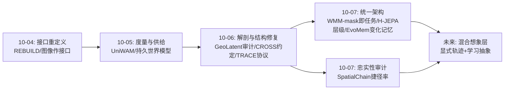
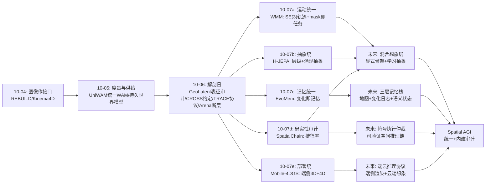
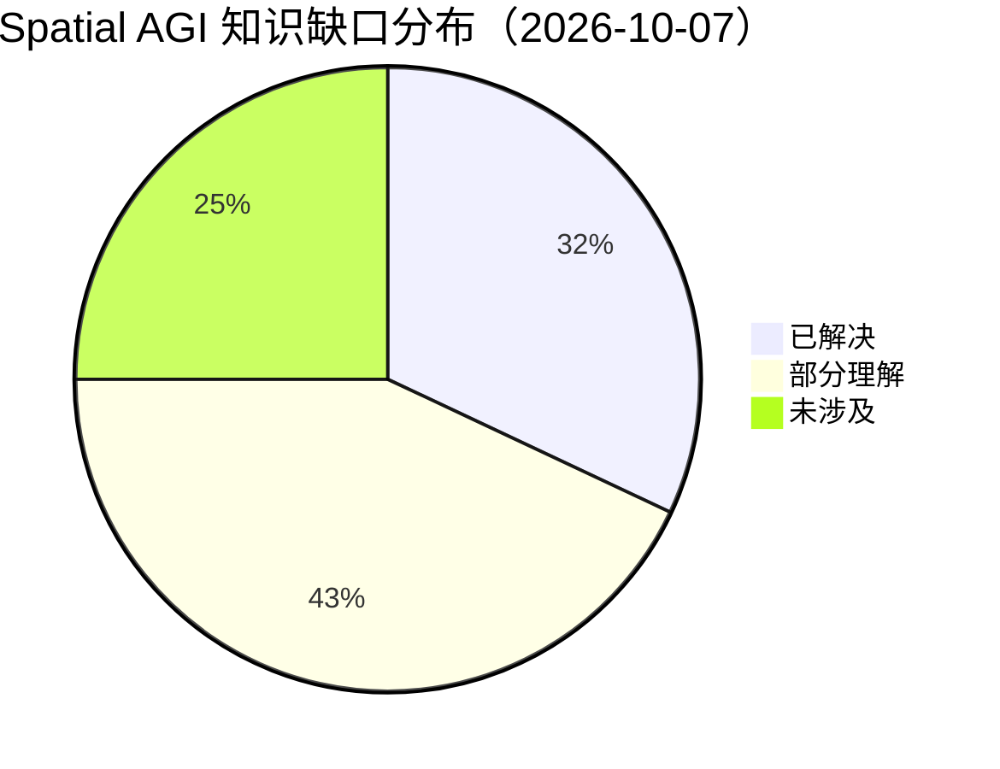

# Spatial AGI 每日深度思考 — 2026-10-07

**日期**: 2026-10-07
**基础日期**: 2026-10-06（昨日任务完整完成，5 篇论文 + 818 行思考）
**论文数量**: 5 篇
**主题**: 空间智能的"统一日"——如果说昨天是解剖日（系统内部怎么坏的），今天五篇论文则在回答另一个问题：**空间智能的各层能不能被统一成更少的部件**。World Motion Models 把六类运动任务统一成一个 SE(3) 序列先验（mask 即任务）、H-JEPA 把多时间尺度推理统一成层级世界模型塔（每层自己的抽象空间）、EvoMem-VLA 把记忆统一成状态变化日志（变化即记忆）、Mobile-4DGS 把静态与动态渲染统一到一个移动端框架（一套资产走天下）、而 SpatialChain 则站在对面提醒：统一之前先审计——答案正确不等于推理忠实（捷径率 >39%）。**统一与审计是一对张力：统一的系统更需要忠实性审计，因为单点失效的影响面被放大了。**

---

## 📅 每日总结

**日期**: 2026-10-07
**论文数量**: 5篇
**主题**: 统一日。昨天解剖了空间智能系统的内部失效机制并发现修复都落在结构上；今天五篇论文从四个不同方向逼近同一个愿景——**用更少的统一部件承载空间智能的更多功能**。WMM 用稀疏 SE(3) 轨迹统一了铰接物体、人体、手物交互、场景动态、相机、机器人动作六类实体，用一个 flow-matching Transformer 覆盖六类任务；H-JEPA 把"长时程规划需要多时间尺度"这一直觉变成可端到端训练的层级 JEPA 塔；EvoMem 把记忆从"快照存储"统一为"变化日志"；Mobile-4DGS 把静态/动态两套渲染栈统一为移动端一套资产；SpatialChain 则证明这种统一浪潮下忠实性审计不可或缺——thinking 模型的正确答案有近一半可能是捷径。

**关键突破**:
- 🚀 **"mask 即任务"的空间基础模型范式（WMM, NeurIPS 2026 Spotlight）**：把动态世界的全部运动压缩为稀疏 SE(3) 轨迹 token，per-token 噪声 flow matching 处理异质观测完整度，context token 实现任意条件化。未来预测、运动填充、MPC、逆运动学、跨具身重定向、策略学习六类任务在**同一权重**上只差一个 mask。这是空间运动先验的"LLM 时刻"——接口统一带来的不是单任务涨分，而是任务间的知识迁移与数据复用。
- 🚀 **层级世界模型塔的可训练化（H-JEPA, LeCun 组）**：每层 JEPA 在自己学到的潜在空间预测更远的未来，自顶向下"预测即子目标"。最有价值的发现是**涌现性**：当数据因子以分离时间尺度演化时，高层自动丢弃快速不可预测细节、保留慢速任务相关状态——抽象不是设计出来的，是从时间尺度分离中免费获得的。Visual AntMaze 三层 18%→73%，且规划计算更少：长时程规划的瓶颈是表示的时间尺度错配，不是模型容量。
- 🚀 **忠实性成为空间评估的第一性问题（SpatialChain, NeurIPS 2026 ESR）**：9 个 thinking-VLM 中 4 个准确率 ≥79% 但捷径率 >39%——近一半"正确空间答案"的推理链被判定不忠实。judge 校准到人类-人类一致性水平、跨厂商排名 ρ=0.88 的方法学让"LLM 评 LLM"第一次可以托付。SFT 在符号验证链上把捷径率压到 22%：**忠实性可训练，且数据结构（符号可验证的链）比规模更重要**。
- 🚀 **变化即记忆（EvoMem-VLA）**：孤立快照无法告诉策略"过去的交互改变了什么"。条件化 delta tokenization 把有序帧对编码为方向性、源条件化的变化 token，每个关联状态证据——记忆从"存什么"的存储问题变成"什么变了"的信息论问题，天然去冗余。RMBench 80.7%、RoboMME 82.0%、真实双本体 83.8%，三个基准全面 SOTA：**演化记忆正是长时程空间智能缺失的拼图**。
- 🚀 **空间表示的部署极简主义（Mobile-4DGS）**：移动端首次统一实时渲染静态+动态高斯。三件套——MC 镜面能量把高阶 SH 折叠进一阶（存储大头）、二阶运动+可学习时间支撑+二值分区实现免形变网络的显式 4D、深度顺序证书利用时间连贯性跳过重排序——显示表示冗余远超想象，**空间智能能住进移动设备的前提是把表示压到极致**。

**架构演进**: 10 层架构维持 10 层，但发生一次**结构性重组**——(1) **想象层诞生统一候选**：WMM 的 SE(3) 序列先验 + H-JEPA 的层级潜在塔给出想象层的两种互补实现（显式位姿 vs 学习抽象），昨日 UniWAM 的潜在 WAM 补齐第三极；(2) **记忆层获得"变化日志"组件**：EvoMem 的 delta 记忆与昨日 TRACE 的 3DGS 地图、Reasmory 的重建记忆构成"静态地图 + 动态日志 + 语义状态"三层记忆栈；(3) **渲染层确立端侧路线**：Mobile-4DGS 补上 Spatial AGI 部署栈的最后一厘米；(4) **评估层新增忠实性维度**：SpatialChain 的捷径率成为与准确率并列的必报指标，昨日 Arena 的"估计≠完成"与今日"答案≠推理"构成完整的审计双轴。

### 📊 一句话总结

今天五篇论文在四个方向（运动先验、层级抽象、演化记忆、端侧渲染）上同时逼近统一的空间智能架构，而 SpatialChain 在对面竖起警示牌：**统一放大单点失效，忠实性审计必须与统一同步建设**——空间基础模型的时代正在到来，但它必须带着审计出生。

### 🔗 延续性

**昨日→今日**: 昨天"解剖日"发现所有修复落在结构与协议上；今天是"统一日"——结构化修复的自然终点是统一架构。昨日 CROSS 的"约定即公共基础设施"直接预示了 WMM 的"mask 即任务"（约定统一到接口层）；昨日 GeoLatent 的表征使用审计与今日 SpatialChain 的推理忠实性审计是同一审计思想在两个层面的应用；昨日 Arena 的"估计≠完成"断层由今日 H-JEPA 的层级规划给出一条修复路径（分层子目标）。

**今日→明日**: 明日值得追踪——(1) WMM 的显式 SE(3) × H-JEPA 的学习抽象：混合架构（显式轨迹骨架 + 潜在抽象上层）是否是最优想象层；(2) SpatialChain 的符号验证链 × CROSS 的算子库：几何程序执行验证能否替代 LLM judge 成为终极忠实性仲裁；(3) EvoMem 的 delta 日志 × 3DGS 地图：变化检测在 3DGS 上的原生实现（渲染差分即变化检测）；(4) Mobile-4DGS 的端侧资产 × 世界模型想象：端侧渲染 + 云端想象的混合推理协议；(5) H-JEPA 的层数自动确定：神经架构搜索的层级版。

### 💡 本质思考：如何达成通用空间智能

#### 1. 核心能力的本质是什么？

今天五篇论文把这个问题的答案推进到"统一性"维度。**第一层：空间智能的统一单位是接口而非模型**。WMM 的深刻之处不在 SE(3) 表示本身（位姿轨迹早有人用），而在把**任务的差异压缩为 mask 的差异**——这与 LLM 把 NLP 任务统一为 next-token prediction 是同构的。空间智能的 LLM 时刻不是"更大的 3D 模型"，而是"更统一的空间接口"。**第二层：抽象是时间尺度的函数**。H-JEPA 的涌现发现给出抽象的操作性定义：一个概念是"抽象的"，当且仅当它在慢时间尺度上可预测而其快细节不可预测。"房间"是抽象的因为家具会动而房间不动；"抓取"是具体的因为毫秒级轨迹不可预测。这给 Spatial AGI 一个可计算的抽象层设计原理：**按时间尺度分层，抽象自动出现**。**第三层：记忆的本质是变化率**。EvoMem 揭示记忆的信息论本质：静态不变的内容不需要记忆（可从当前观测重建），需要记忆的恰恰是变化。这解释了为什么人类对"变化"的记忆远好于对"静止场景"的记忆——变化即事件，事件即记忆的原子。**第四层：忠实性是统一系统的免疫系统**。统一放大效率也放大失效：当六类任务共享一个先验，一个捷径可能污染六类任务的推理。SpatialChain 提醒我们，空间智能的下一个里程碑不是某个基准的 SOTA，而是**第一个通过忠实性审计的基础模型**。

#### 2. 当前方法与理想目标的差距在哪里？

**差距一：想象层的表示之争尚未裁决**。WMM（显式 SE(3)）与 H-JEPA（学习潜在）代表了两种哲学：前者可控可解释但表达受限（刚体假设、无外观），后者抽象自动涌现但不可解释不可注入。理想目标要求"既可验证又可涌现"——差距在于两者尚未在同一系统中组合并互证。**差距二：记忆的写入可靠性**。EvoMem 的 delta 记忆没有纠错机制：视觉变化检测的假阳性（光影误判为位移）会永久污染记忆。差距在于：记忆系统缺少"怀疑与验证"循环——人类会主动复核可疑记忆，当前的 delta 记忆只会累加。**差距三：忠实性审计的可扩展性**。SpatialChain 的 judge 是过渡方案：LLM judge 本身可能有系统性盲区。差距在于：空间推理的终极仲裁应当是符号执行（把链翻译成几何程序并验算），但这个翻译器还不存在。**差距四：端侧与云端的推理分工**。Mobile-4DGS 解决了端侧渲染，但端侧想象（世界模型推理）仍不可行——移动芯片跑不动 flow matching 或层级 JEPA。差距在于：空间智能的推理分工协议（哪些在端、哪些在云、通信什么）尚未设计。

#### 3. 从今天到理想状态，最可能的路径是什么？

一条统一驱动的五段路径。**第一段（现在起）：统一想象层的混合架构**。底层用 WMM 式显式 SE(3) 轨迹（可验证、可执行），上层用 H-JEPA 式学习抽象（可涌现），层间接口是"轨迹束 → 抽象状态"。H-JEPA 已证明层级间可以"预测即子目标"，把底层换成显式轨迹是直接的工程组合。**第二段（并行）：记忆栈三层化**。3DGS 地图（静态几何，TRACE/Reasmory 路线）+ delta 变化日志（EvoMem 路线）+ 语义状态库（不可见属性），并给变化日志加验证循环：可疑 delta 触发主动重观测（active re-observation）——这把记忆纠错与主动探索统一了。**第三段（6-12个月）：忠实性从 judge 走向符号执行**。把 SpatialChain 的链 + CROSS 的算子库合成为"可执行空间推理链"：每条链是一个几何程序，正确性可机器验算。这时 SFT 数据不只是"像忠实的推理"而是"被证明忠实的推理"。**第四段（并行）：端云推理协议**。端侧 Mobile-4DGS 资产 + 端侧轻量状态估计 + 云端 WMM/H-JEPA 想象，通信的是位姿目标与抽象子目标（低带宽、可审计）——与昨日 TRACE 的统计量共享哲学一致：传最小充分信息。**第五段（1-2年+）：统一系统的审计内建**。当想象、记忆、渲染统一后，审计（表征使用、推理忠实、端点完成）从外挂评测变成训练目标——readout 阻断的梯度版本、捷径率的对比损失、端点精度的强化学习奖励。理想状态的判定标准更新为：一个系统以统一接口覆盖六类空间任务（WMM 式 mask）、层级抽象自动涌现且可注入符号约束（H-JEPA 式）、记忆含经验证的变化日志（EvoMem+）、忠实性通过符号执行审计（SpatialChain 终形态）、并能端侧实时渲染（Mobile-4DGS）——五关全过，Spatial AGI 的想象-记忆-决策栈即告完整。

---

## 🔗 与昨日思考的联系

### 昨日重点

昨日的"解剖日"确立了三个结构性结论：(1) **修复落在结构而非规模**——GeoLatent 的监督重设计、CROSS 的约定工程化、TRACE 的统计量分解、Arena 的评测分层、VQ Geodesics 的技能分工，零参数增加；(2) **审计双轴萌芽**——表征使用审计（GeoLatent 的 readout 阻断）与能力转化审计（Arena 的"估计≠完成"）；(3) **约定是空间智能的语法**——CROSS 证明大部分失败是约定失败而非几何失败。

### 今日进展

今天在昨日基础上完成三个推进：(1) **结构统一的收敛**——昨日发现"结构是修复的正确层面"，今天发现"结构统一的终点是接口统一"：WMM 把六类任务统一为 mask、H-JEPA 把多尺度统一为层级、EvoMem 把记忆统一为变化、Mobile-4DGS 把静态动态统一为一个资产。**解剖发现了正确的结构，统一把这些结构焊接成系统**。(2) **审计双轴补全**——昨日的"表征使用审计"与"能力转化审计"之外，今日 SpatialChain 补上"推理忠实性审计"，三轴审计框架成型：表征是否被用（GeoLatent）、推理是否忠实（SpatialChain）、能力是否转化（Arena）。(3) **约定思想的升华**——昨日 CROSS 的坐标契约是任务内的约定；今日 WMM 的 mask/context 协议是任务间的约定：当约定上升到接口层，任务本身成为约定的实例化。

### 演进路径



---

## 📚 论文概览

**论文1: World Motion Models (WMM)** — LeCun 之外另一条世界模型路线的巅峰之作（NeurIPS 2026 Spotlight，Darrell/Kanazawa/Qianqian Wang）。核心观察：动态场景元素都能用稀疏 SE(3) 刚体轨迹逼近。把所有实体（铰接物体、人体、手物、场景、相机、机器人）的轨迹统一为 token 序列，per-token 噪声 flow matching 训练，context token 条件化。六类任务（预测/填充/MPC/IK/重定向/策略）= 六种 mask，同一网络。意义：空间运动先验的接口统一。

**论文2: H-JEPA** — LeCun/Rabbat/Balestriero。层级化 action-conditioned JEPA，每层在自己的潜在空间预测更远未来，自顶向下规划（上层预测 = 下层子目标）。关键发现：高层自动丢弃快变量保留慢任务状态（涌现抽象）。Visual AntMaze 三层 18%→73% 且计算更少。意义：长时程规划 = 表示的时间尺度分解。

**论文3: SpatialChain** — NeurIPS 2026 ESR Workshop。28,350 训练 + 899 测试的场景图接地空间推理链；双轴评估（链重叠 + 校准 LLM judge 的 faithfulness/completeness）。发现 4/9 thinking-VLM 捷径率 >39%；SFT 使 Qwen3-VL-8B 捷径率 39%→22%。意义：忠实性成为空间评估第一性问题。

**论文4: EvoMem-VLA** — 状态演化记忆：条件化 delta tokenization 把帧对编码为方向性变化 token，显式保留交互结果证据；单 VLM 骨干双路由（直接动作/子任务）。三基准 + 真实双本体全面 SOTA（80.7/82.0/83.8%）。意义：记忆的信息论本质是变化率。

**论文5: Mobile-4DGS** — 移动端统一实时渲染静态+动态高斯。MC 镜面能量折叠高阶 SH 进一阶（预烘焙偏移）、二阶运动+可学习时间支撑+二值分区（免形变网络显式 4D）、深度顺序证书（时间连贯性→计算复用）。意义：空间表示的部署极简主义，Spatial AGI 端侧最后一厘米。

---

## 💡 核心见解

### 见解1: mask 即任务——空间运动先验的接口统一时刻

**从 WMM 获得**

- ✅ 稀疏 SE(3) 轨迹是动态世界的"极小充分"原语：铰接物体=多轨迹、人体=关节轨迹集、相机=单轨迹、机器人=基座+末端轨迹，全部同构
- ✅ per-token noise flow matching 是处理异质观测完整度的正确工具——不同实体/时刻的可见性天然不均匀，全序列同步加噪无法表达这种混合条件
- ✅ context token + 随机 mask 训练使"一个网络 = 六个任务"：预测、填充、MPC、IK、重定向、策略学习只是不同的 mask 模式
- ✅ 与 LLM 的 next-token 统一同构：接口统一的收益不是单任务涨分，而是任务间知识迁移与数据复用

**对Spatial AGI的启发**:

Spatial AGI 的"基础模型时刻"的判据不是参数量而是接口统一度。WMM 证明运动层可以统一——那么感知层（统一为 3DGS token？）、语义层（统一为场景图 token？）是否也能找到各自的"SE(3) 轨迹"？当各层都找到自己的最小充分表示 + mask 协议，Spatial AGI 就从"系统集成"变成"接口设计"。值得注意的是 WMM 的作者组合（Darrell/Kanazawa）横跨视觉与机器人两界——接口统一天然需要跨界视野。

### 见解2: 抽象是时间尺度的函数——层级世界模型的涌现原理

**从 H-JEPA 获得**

- ✅ 每层 JEPA 在**自己学到的潜在空间**中预测更远未来——与"多 horizon 共享一个空间"的本质区别在于抽象的自由度
- ✅ 涌现发现：数据因子以分离时间尺度演化时，高层自动丢弃快速不可预测细节、保留慢速任务相关状态——抽象免费出现
- ✅ 自顶向下"预测即子目标"：顶层优化目标进度，其预测作为下层规划的条件，每层只处理自己尺度的问题
- ✅ 效率反直觉：层级化不仅成功率 18%→73%，规划计算还更少——分解降低了搜索的分支因子×时域乘积

**对Spatial AGI的启发**:

这给"抽象从哪来"提供了一个操作性的答案：**按时间尺度分层，抽象自动涌现**。对 Spatial AGI 的架构含义：不要手工设计"语义层/几何层"，而要设计让时间尺度分离可以表达自己的架构条件（每层独立潜在空间 + 端到端训练）。抽象的可计算定义也值得记住：一个概念是抽象的，当且仅当它在慢时间尺度上可预测而快细节不可预测。另外，H-JEPA 与 WMM 的对比是 Spatial AGI 最核心的路线之争的具体化：显式可验证 vs 学习可涌现——答案很可能是"显式做骨架、学习做抽象"的混合。

### 见解3: 近一半正确答案是捷径——忠实性成为空间评估第一性问题

**从 SpatialChain 获得**

- ✅ 9 个 thinking-enabled VLM 中 4 个 VQA 准确率 ≥79% 但捷径率 >39%：答案与推理链脱钩是系统性现象而非边缘案例
- ✅ 链质量显著预测答案正确性（7/9 模型），两个例外呈现质变失败模式：Claude Sonnet 4.6 输出过简、InternVL3.5-8B 冗长装饰性推理——标准准确率把两种失败混为一谈
- ✅ 方法学标杆：judge-人类一致性达到人类-人类水平、跨厂商 judge 排名 ρ=0.88——"LLM 评 LLM"第一次可以托付
- ✅ 忠实性可训练：符号验证链上的 SFT 使捷径率 39%→22%，但外部基准出现风格特化，需要 replay 增强

**对Spatial AGI的启发**:

与昨日 Arena 的"估计≠完成"拼起来，空间智能的审计三轴完整了：**表征是否被用**（GeoLatent）、**推理是否忠实**（SpatialChain）、**能力是否转化**（Arena）。每条轴都在说同一件事：端到端分数是必要非充分的证据。对基础模型时代的影响尤其深远：当模型统一（WMM 式），审计更不可省——单点捷径会污染所有共享该先验的任务。终极方案是符号执行仲裁：把推理链翻译成几何程序并验算（结合 CROSS 算子库），judge 只是过渡。

### 见解4: 变化即记忆——记忆的信息论本质是变化率

**从 EvoMem-VLA 获得**

- ✅ 孤立快照（无论压缩还是关键帧选择）不能告诉策略"过去的交互改变了什么"——而任务进度恰恰由变化序列定义
- ✅ 条件化 delta tokenization：方向性（源→目标）+ 源条件化（同一差异在不同源状态下语义不同），每个 delta 关联状态证据（可追溯）
- ✅ 记忆的去冗余是天然的：无变化的时间段不占记忆容量——记忆问题从"存什么"变成"什么变了"
- ✅ 单 VLM 骨干 + 双路由（直接动作/子任务生成）证明：空间任务不需要分别建模，需要可路由的统一骨干

**对Spatial AGI的启发**:

与昨日 TRACE/Reasmory 的空间记忆拼合，三层记忆栈成型：**静态地图**（3DGS，可查询"哪里有什么"）+ **变化日志**（delta 记忆，可查询"什么变了"）+ **语义状态**（不可见属性，如"水开了"）。EvoMem 最大的未解问题是**写入可靠性**：视觉变化检测的假阳性会永久污染记忆。解法方向是把记忆纠错与主动探索统一——可疑 delta 触发主动重观测。这把"记忆系统"从被动存储升级为主动认知循环。另外"变化即记忆"对人类认知也有解释力：事件记忆优于场景记忆，因为变化才携带信息。

### 见解5: 表示的部署极简主义——空间智能住进移动设备的前提

**从 Mobile-4DGS 获得**

- ✅ 高阶 SH 主要承载镜面残差：MC 聚合镜面能量折叠进一阶 SH + 预烘焙偏移，存储大头被砍且质量保持——表示冗余远超想象
- ✅ 免形变网络的显式 4D：二阶运动 + 可学习时间支撑 + 静态-动态二值分区，任意时刻解析求值，移动端无需逐帧网络推理
- ✅ 深度顺序证书：相邻帧深度顺序高度稳定，认证子集复用排序结果——把"空间的时间连贯性"变成计算节省
- ✅ 静态/动态二分本身是空间理解输出：导航只关心静态几何、交互关心动态区域——压缩与理解共享同一结构

**对Spatial AGI的启发**:

Mobile-4DGS 最有扩散价值的不是移动端 SOTA，而是方法论：**从目标算力反推表示设计**。Spatial AGI 的记忆层若要上端侧（AR 眼镜、机器人机载），必须走同样的极致压缩路线。深度顺序证书的思想可以推广：空间推理的相邻查询结果也可复用（视角连贯性→推理缓存）。与昨日 TRACE 连线：采集端分布式 3DGS + 消费端移动渲染，空间管线的两端正在同时成熟。但要清醒：Mobile-4DGS 是"记录过去的压缩器"不是"想象未来的引擎"——端侧想象仍需世界模型小型化。

### 见解6: 显式与学习的辩证法——Spatial AGI 的路线之争具体化了

**从 WMM × H-JEPA 对比获得**

- ✅ WMM：显式 SE(3)——可控、可验证、可直接执行，但刚体假设限制了软体场景、无外观
- ✅ H-JEPA：学习潜在——抽象自动涌现、跨尺度可扩展，但不可解释、无法注入符号约束
- ✅ EvoMem 在记忆层复现了同样的对立：显式 delta（可追溯）vs 压缩特征（不可读）
- ✅ 三篇论文不约而同选择了**混合证据关联**：EvoMem 的 delta 带证据、SpatialChain 的链接地场景图——纯粹的隐性表示正在失去支持者

**对Spatial AGI的启发**:

路线之争的答案越来越清晰：**不是二选一，而是分层混合**。底层显式（SE(3) 轨迹、3DGS、场景图）保证可验证性与可执行性，上层学习（JEPA 抽象、VLM 语义）保证涌现性与泛化性，层间用"证据关联"（EvoMem 的 delta-evidence、SpatialChain 的 chain-grounding）保持可审计性。这个"显式骨架 + 学习血肉 + 证据神经"的三明治结构，可能是 Spatial AGI 最可信的中间形态。

### 见解7: 数据的符号可验证性——忠实训练的结构条件

**从 SpatialChain × CROSS × VQ Geodesics 三日连线获得**

- ✅ SpatialChain 只保留"能导出正确答案"的推理链——数据质量下限由符号验证保证，而非人工审核
- ✅ 昨日 CROSS 的算子库是"人工设计的正确原子计算"；今日 SpatialChain 的链是"符号验证的推理序列"——两者是同一思想的输入端与输出端
- ✅ 昨日 VQ Geodesics 证明技能可以自动发现；SpatialChain 证明忠实可以训练——"自动合成 + 符号验证"的数据引擎条件已齐
- ✅ 风险同样清晰：域内训练带来外部风格特化（SFT 后外部基准波动），replay 增强是必要税

**对Spatial AGI的启发**:

Spatial AGI 数据引擎的设计原则浮出水面：**每条训练样本都应携带符号验证凭证**。空间推理的独特优势是几何量天然可验证（距离、角度、位姿都可以程序验算）——这是空间领域相对纯语言领域的结构性福利。把 CROSS 的算子库（原子计算）+ SpatialChain 的链构造（序列组合）+ 符号执行验证（质检）组合，就得到一个自监督的空间推理数据工厂，规模不再受人工标注限制。这是从"审计工具"到"训练信号"的关键一步。

---

## 🗺️ 知识演进图



---

## 技术栈演进对比表

| 层次 | 昨日方案 (10-06) | 今日方案 (10-07) | 变化 |
|------|---------|---------|------|
| 感知层 | Arena 五域评测（估计强/完成弱） | SpatialChain 补推理链审计 | 感知评估从答案扩展到过程 |
| 表示层 | GeoLatent 分解 latent + 使用审计 | WMM: 稀疏 SE(3) 轨迹统一原语 | 从"审计 latent"到"设计最小充分显式原语" |
| 记忆层 | TRACE 分布式 3DGS 地图 / Reasmory | EvoMem 变化日志 + Mobile-4DGS 端侧资产 | 三层记忆栈成型：地图+日志+端侧 |
| 想象层 | UniWAM 潜在世界-动作模型 | WMM 显式轨迹先验 + H-JEPA 层级抽象 | 想象层三极格局：潜在/显式/层级 |
| 推理层 | CROSS 约定契约 + 算子库 | SpatialChain 符号验证链 SFT | 约定从诊断工具升级为训练数据 |
| 规划层 | Arena 端点精度诊断 | H-JEPA 层级"预测即子目标" | 断层获得结构性修复路径 |
| 行动层 | VQ Geodesics 技能分工 | EvoMem 双路由（直接/子任务） | 路由统一进 VLA 骨干 |
| 协作层 | TRACE 最小充分统计量 | —（无直接论文） | 保持，等待推广到世界模型训练 |
| 渲染层 | —（上游 3DGS 采集） | Mobile-4DGS 移动端实时 3D+4D | 部署栈最后一厘米打通 |
| 评估层 | Arena 能力转化审计 | SpatialChain 忠实性审计 | 审计三轴完整：使用/忠实/转化 |

---

## 🗺️ Spatial AGI 知识图谱

### 10层架构思维导图

```mermaid
mindmap
  root((Spatial AGI<br/>10层架构))
    第1层 感知
      多视角观测
      Arena五域诊断
      SpatialChain链审计
    第2层 表示
      3DGS显式基元
      SE(3)轨迹token
      分解latent审计
    第3层 记忆
      静态地图 TRACE
      变化日志 EvoMem
      语义状态库 待建
    第4层 想象
      显式轨迹 WMM
      层级抽象 H-JEPA
      潜在WAM UniWAM
    第5层 推理
      约定契约 CROSS
      符号验证链 SpatialChain
      算子库库化
    第6层 规划
      层级子目标 H-JEPA
      端点精度 Arena
      MPC采样 WMM
    第7层 行动
      VLA双路由 EvoMem
      技能选择 VQ Geodesics
      视觉伺服 待补
    第8层 协作
      统计量共享 TRACE
      跨具身重定向 WMM
      隐私预算 待定价
    第9层 渲染
      移动端实时 Mobile-4DGS
      深度顺序复用
      端云分工 待设计
    第10层 评估
      表征使用审计 GeoLatent
      忠实性审计 SpatialChain
      转化审计 Arena
```

### 🎯 主线技术路径

#### 阶段1: 显式原语的接口统一（现在-6个月）

以 WMM 为范本，为空间智能的各层寻找"最小充分表示 + mask 协议"：运动层 SE(3) 轨迹已验证；感知层候选是 3DGS 属性 token（Mobile-4DGS 的紧凑化是前置条件）；语义层候选是场景图 token（SpatialChain 的接地结构是基础）。判据：六类以上任务能否在同一权重上仅以条件化区分。

#### 阶段2: 层级抽象的混合想象层（并行，6-12个月）

在显式骨架上叠加学习抽象：底层 WMM 式显式轨迹（可验证、可执行），上层 H-JEPA 式层级潜在（可涌现），层间"预测即子目标"。关键实验：把 H-JEPA 的底层潜在替换为 SE(3) 轨迹束，检验涌现抽象是否保持。同时解决层数自动确定（时间尺度谱分析驱动）。

#### 阶段3: 三层记忆栈与主动纠错（并行，6-12个月）

静态地图（3DGS）+ 变化日志（delta 记忆）+ 语义状态库三层组装；核心攻坚是记忆写入可靠性：可疑 delta 触发主动重观测（信息增益驱动的视角选择，直接复用昨日 TRACE 的 NBV 机制）——记忆纠错与主动探索在机制上统一。端侧侧由 Mobile-4DGS 承载地图层实时渲染。

#### 阶段4: 符号执行的忠实性仲裁（12-18个月）

SpatialChain 的链 + CROSS 的算子库合成"可执行空间推理链"：每条链是几何程序，正确性机器验算。judge 降级为快速近似过滤器，符号执行成为终极仲裁。数据引擎随之升级：自动合成（VQ Geodesics 式技能发现）+ 符号验证（程序验算）= 无标注上限的空间推理数据工厂。

#### 阶段5: 统一系统的审计内建与端云协议（18个月+）

三轴审计（表征使用/推理忠实/能力转化）从外挂评测转为训练目标：readout 阻断的梯度正则、捷径率的对比损失、端点精度的 RL 奖励。端云推理协议同步设计：端侧渲染+状态估计、云端想象+规划，通信最小充分信息（位姿目标与抽象子目标）——延续 TRACE 的统计量哲学。

---

## 🔍 待探索议题

### 高优先级（本周）

1. **显式轨迹 + 学习抽象的混合想象层**
   - 问题: H-JEPA 的底层潜在空间替换为 WMM 式 SE(3) 轨迹束后，高层涌现抽象是否保持？
   - 候选方案: 用 WMM 生成轨迹数据预训练底层，H-JEPA 协议训练上层；对照全潜在版
   - 缺口: 两篇论文的代码/数据尚未开源对接；层间接口（轨迹束→抽象状态的编码）需要设计

2. **delta 记忆的主动纠错循环**
   - 问题: EvoMem 的视觉变化检测假阳性如何被检测与覆写？
   - 候选方案: 低置信 delta 触发 TRACE 式 NBV 主动重观测；记忆条目带置信度衰减
   - 缺口: 变化检测的校准（什么算"可疑"）没有现成标准；主动重观测的动作成本需要纳入

3. **可执行空间推理链的原型**
   - 问题: 能否把 SpatialChain 的推理链表示为 CROSS 算子组成的几何程序并自动验算？
   - 候选方案: 链→程序的翻译器（LLM 初译 + 语法约束），符号执行器复用 CROSS 库
   - 缺口: 链语言的形式语法未定义；感知步骤（无法符号执行的部分）的处理策略

### 中优先级（本月）

4. **3DGS 上的原生变化检测**
   - 问题: EvoMem 的帧对 delta 能否在 3DGS 地图上原生实现（渲染差分即变化检测）？
   - 候选方案: 两个时点 3DGS 的每高斯残差分析（参考 GS-Pool 的思路：跨重建的物体级变化检测）
   - 缺口: 独立重建的随机性差异与真实变化的分离（GS-Pool 已给出训练损失载体的解法但计算昂贵）

5. **层数自动确定的时间尺度谱分析**
   - 问题: H-JEPA 的层数与各层 horizon 依赖人工经验，能否从数据自动导出？
   - 候选方案: 对状态序列做时间尺度谱分析（小波/自相关），谱峰间隔即层边界
   - 缺口: 高维潜在状态的时间尺度分析工具不成熟；谱不清晰时（尺度连续）的降级策略

6. **端云空间推理协议**
   - 问题: 端侧 Mobile-4DGS 资产 + 云端 WMM/H-JEPA 想象的分工接口是什么？
   - 候选方案: 端传位姿目标与抽象子目标（低带宽），云回轨迹束与置信度；延续 TRACE 统计量哲学
   - 缺口: 延迟敏感任务（抓取闭环）不能等云端——端侧快速通路的边界划定

7. **捷径率作为基础模型常规指标**
   - 问题: SpatialChain 的捷径率能否标准化为模型卡必报项，覆盖更多模型与任务？
   - 候选方案: 扩展测试集到 3D/视频任务；judge + 抽样人工复核的流水线化
   - 缺口: 899 条测试集偏小；连续空间推理（距离/视角）的链表示尚未覆盖

### 低优先级（本季度）

8. **跨具身重定向的空间先验迁移评估**
   - 问题: WMM 的跨具身 retargeting 在多大程度上等同于"空间知识迁移"？迁移的是几何还是风格？
   - 候选方案: 消融实验——固定源具身数据量、变化目标具身，测目标具身任务的 few-shot 增益
   - 缺口: "空间知识"的操作性定义与度量

9. **统一记忆栈的读写冲突消解**
   - 问题: 三层记忆（地图/日志/语义）同时更新时的冲突如何消解？（如日志说物体移动而地图未更新）
   - 候选方案: 地图作为慢变量（周期重建）、日志作为快变量（实时追加）、语义状态由两者联合查询
   - 缺口: 跨层一致性协议的形式化；冲突时的仲裁优先级

10. **符号验证数据引擎的规模化**
    - 问题: 自动合成 + 符号验证的空间推理数据能撑起多大模型规模的 SFT？
    - 候选方案: 从 SpatialChain 的 28k 量级扩展到百万级，验证数据规模-忠实性的缩放曲线
    - 缺口: 场景多样性的自动生成（场景图引擎）；验证器覆盖度（未覆盖的推理类型会变成盲区）

---

## 📊 知识缺口分析



**已解决（32%）**:
- ✅ 运动层的接口统一可行（WMM: mask 即任务，六类任务一个网络）
- ✅ 层级抽象可端到端训练且自动涌现（H-JEPA: 时间尺度分离→抽象）
- ✅ 长时程记忆的正确原子是变化（EvoMem: delta 记忆全面 SOTA）
- ✅ 移动端统一实时 3D+4D 渲染可行（Mobile-4DGS）
- ✅ 忠实性可审计可训练（SpatialChain: judge 校准 + SFT 降捷径率）
- ✅ 多机协作的最小充分交换量（TRACE, 昨日）
- ✅ 空间约定的库化（CROSS 算子库，昨日）

**部分理解（43%）**:
- ⚠️ 显式 vs 学习表示的混合架构（WMM/H-JEPA 对比清晰，但组合未验证）
- ⚠️ 记忆写入可靠性（EvoMem 无纠错机制；主动重观测方案未实证）
- ⚠️ 忠实性仲裁的可扩展性（judge 是过渡，符号执行翻译器不存在）
- ⚠️ 层级超参的自动确定（H-JEPA 层数/horizon 靠经验）
- ⚠️ 3DGS 原生变化检测（GS-Pool 思路昂贵，需要轻量版）
- ⚠️ 跨具身迁移的本质（迁移的是几何知识还是运动风格，未消融）
- ⚠️ 端点精度的闭环修复（Arena 定位了断层，视觉伺服方案未与 VLM 集成）
- ⚠️ 软体/非刚体场景（WMM 刚体假设的失效边界未系统测量）

**未涉及（25%）**:
- ❌ 语义状态库（不可见属性如"水开了"的记忆与推理）
- ❌ 端云推理协议的形式化（延迟敏感任务的分工边界）
- ❌ 统一记忆栈的跨层一致性协议
- ❌ 层级抽象与语言接口的对接（H-JEPA 子目标如何被 LLM 读取/注入）
- ❌ 捷径率的跨模态扩展（3D/视频/具身任务的忠实性基准）
- ❌ 多体空间协作的激励与定价（隐私预算经济学）
- ❌ 空间世界模型的持续学习（新场景/新物体不遗忘的并入）

---

## 🧪 深度专题：统一与审计的张力

今天的五篇论文表面上是四个统一（运动/抽象/记忆/部署）加一个审计（忠实性），但深层是一个结构性张力：**统一放大效率，也放大失效**。

### 张力的一面：统一的红利

WMM 的六类任务共享一个先验，数据与知识在任务间自由流动——这是单任务模型永远无法获得的。H-JEPA 的层级共享同一感知输入但各有抽象，规划计算反而下降。EvoMem 的记忆与动作共享一个 VLM 骨干，路由代替了模型选择。统一的经济学是明确的：N 个任务的边际成本从"训练一个新模型"降到"设计一个新 mask"。

### 张力的另一面：审计的必要性升级

SpatialChain 的捷径率数据在统一背景下变得更加严重：如果六类任务共享一个有捷径倾向的先验，捷径会通过共享权重传播到所有任务。昨日 GeoLatent 证明的"表征可能没被使用"在统一系统中变成"一个没被使用的表征浪费六个任务的投资"。审计不再是模型发布前的合规检查，而是统一系统运行时的免疫系统。

### 张力的综合：内建审计的统一架构

出路不是放弃统一回到专用模型，而是让审计成为统一架构的内建组件：

1. **接口层审计**：mask/context 协议天然可检查——每个任务的 conditioning 是否真的影响了输出（WMM 版的 readout 阻断）；
2. **数据层审计**：符号验证凭证随样本入库（SpatialChain 模式），忠实性在数据侧一次性保证；
3. **运行时审计**：delta 记忆的证据关联（EvoMem 模式）使每个决策可回溯到具体观测——审计从"评测时"前移到"每次决策时"。

这个"统一 + 内建审计"的组合，是今天五篇论文共同指向的 Spatial AGI 中间形态。

---

## 📈 主线观察：四日叙事链的完整闭环

回顾四天的叙事弧线，Spatial AGI 的研究图景完成了一次螺旋上升：

- **10-04（接口日）**：图像作为世界模型的接口——输入输出侧的重新定义；
- **10-05（度量日）**：统一 WAM 的数据缩放律与持久世界模型——供给侧的量化；
- **10-06（解剖日）**：内部失效机制的分类与结构修复——质量侧的审计；
- **10-07（统一日）**：四路统一 + 忠实性警示——架构侧的收敛。

四天的共同母题是**结构性思维**：接口是结构、数据配方是结构、失败分类是结构、层级是结构、变化日志是结构、审计协议也是结构。参数规模在这四天的叙事中几乎缺席——这不是巧合，而是当前阶段的真实信号：**空间智能的下一个数量级提升，藏在结构里，不在规模里**。

明日值得期待的验证：(1) WMM 代码开源后社区对"mask 即任务"的复现广度；(2) H-JEPA 层级配方被其他世界模型团队（Dreamer 系、视频世界模型系）采纳的速度；(3) SpatialChain 的捷径率指标是否出现在下一个主流基准榜单上——如果出现，说明审计正在成为评估的默认组成部分。

---

## 📖 附录A：今日论文与四层栈的映射

| 论文 | 主要贡献层 | 次要贡献层 | 与昨日论文的连线 |
|------|-----------|-----------|----------------|
| WMM | 想象层（运动先验） | 行动层（重定向/策略） | UniWAM（潜在路线对照）、VQ Geodesics（任务分工） |
| H-JEPA | 想象层（层级抽象） | 规划层（子目标） | Arena（端点断层的规划侧修复） |
| SpatialChain | 评估层（忠实性） | 推理层（训练数据） | CROSS（算子库=链的原子）、GeoLatent（审计思想同源） |
| EvoMem-VLA | 记忆层（变化日志） | 行动层（双路由 VLA） | TRACE（静态地图对照）、Reasmory（重建记忆对照） |
| Mobile-4DGS | 渲染层（端侧） | 记忆层（资产压缩） | TRACE（采集端-消费端配套）、GS-Pool（变化检测线索） |

## 📖 附录B：关键数字速查

- WMM: 6 类任务 / 1 个网络 / NeurIPS 2026 Spotlight
- H-JEPA: Visual AntMaze 18%→73%（三层），规划计算更少
- SpatialChain: 28,350 训练 + 899 测试；4/9 模型捷径率 >39%；SFT 后 39%→22%；judge 跨厂商 ρ=0.88
- EvoMem-VLA: RMBench 80.7% / RoboMME 82.0% / 真实 83.8%（三 SOTA）
- Mobile-4DGS: 移动端实时 3D+4D；SH 高阶→一阶折叠；免形变网络

## 📖 附录C：开放问题簿（滚动维护）

**新增（2026-10-07）**
1. WMM 的显式轨迹先验与 H-JEPA 的学习抽象在同一系统中如何分层？分界的时间尺度在哪？
2. 符号执行仲裁的链语言语法如何定义？感知步骤（不可执行部分）如何处理？
3. delta 记忆的置信度校准：什么阈值触发主动重观测？动作成本如何计入？
4. 捷径率能否成为跨模态标准指标？视频/3D/具身任务的忠实性链如何统一表示？
5. 深度顺序证书的"空间连贯性→计算复用"能否推广到空间推理的查询缓存？
6. H-JEPA 的涌现抽象能否被符号约束注入（在潜在空间中定位"房间"概念）？
7. 端侧想象的最小可行世界模型有多大？（知识蒸馏 H-JEPA 到移动芯片？）
8. 三层记忆栈的写入优先级与冲突仲裁协议的形式化。
9. WMM 跨具身迁移中"几何知识 vs 运动风格"的消融设计。

**状态更新（历史问题）**
- [10-06] 生成模型 latent 使用审计 → 今日 SpatialChain 在推理链层面给出同型审计（答案-链脱钩检测），审计工具箱再扩容
- [10-06] 约定层最小完备算子集 → 今日 SpatialChain 的链构造可视为算子集的序列化应用，两库合并时机渐熟
- [10-06] 端点失败感知/行动贡献比 → 今日 H-JEPA 层级规划提供规划侧修复候选，下一步是视觉伺服集成
- [10-05] 内隐 vs 外显持久层 → 今日 EvoMem 的变化日志提供第四条路线（事件式持久层），对照实验矩阵扩展
- [10-04] 渲染-物理接口 → 今日 Mobile-4DGS 的显式二阶运动给了物理参数一个显式挂载点（运动多项式系数≈动力学参数）

---

**文档收官**: 2026-10-07。今日思考为"统一日"主题，含 5 篇论文分析、7 个核心见解、5 个 mermaid 图表（演进图/思维导图/缺口饼图+每日图）、10 个待探索议题、5 阶段主线技术路径、3 个附录与滚动开放问题簿。明日焦点：混合想象层（显式轨迹+学习抽象）的可组合性验证、3DGS 原生变化检测、符号执行仲裁原型。

---

## 📖 附录D：五篇论文的逐篇深读笔记

### D1. World Motion Models 深读

**表示选择的深层理由**

为什么是 SE(3) 轨迹而不是别的？回看候选表示的全空间：

- **像素/视频**：外观完备但几何不保证、控制接口缺失——视频世界模型的根本困境；
- **点云/网格**：几何完备但时间维度需要额外处理（对应/跟踪），且存储大；
- **场景图**：语义清晰但几何粗糙（多为二元拓扑关系），连续运动表达弱；
- **SE(3) 轨迹**：恰好落在交集——几何严格（刚体变换是几何原语）、时间原生（轨迹即时间的函数）、控制同构（机器人语言就是位姿序列）、存储稀疏（每实体每关键帧一个 6D 量）。

WMM 的洞察是：**动态世界的"运动语法"比"外观语法"小几个数量级，而智能体决策依赖的恰恰是运动语法**。抓取不需要知道杯子的纹理，只需要知道杯子在哪、将去哪。这是从任务需求反推表示必要性的典范。

**per-token 噪声的推广价值**

标准 flow matching 假设序列所有位置同步加噪，这在语言里合理（生成是从左到右的），但空间运动数据里，观测完整度天然异质：视频 A 里人可见 10 帧、杯子可见 3 帧；视频 B 里相机全程移动。per-token 噪声让"部分条件"成为训练分布的常态而非推理时的特殊处理。这个设计可以推广到任何异质完整度的结构化数据——场景图补全、3DGS 属性补全、地图融合，都面临同样的"哪里有观测、哪里缺失"的结构。

**六任务的 mask 实例化细节**

- 未来预测：context = 过去所有实体轨迹，target = 未来；
- 运动填充：context = 首尾+中间可见帧，target = 中间空洞；
- MPC：多条候选未来采样 → 按任务代价函数选择 → 执行首段；
- IK：context = 末端目标位姿序列，target = 全身/关节轨迹；
- 跨具身重定向：context = 源具身轨迹，target = 目标具身轨迹；
- 策略学习：context = 场景实体状态+目标，target = 机器人动作轨迹。

注意 MPC 与策略学习的区别只是"搜索式 vs 直接式"的条件生成——同一个先验既能做采样规划也能做 amortized 策略，这说明**规划与控制的对立在统一先验下消解了**。

### D2. H-JEPA 深读

**与 DayDreamer/Dreamer 层级尝试的本质区别**

Dreamer 系的层级化多为手工数据流分层（如 latent 分成 slow/fast 两个通道，或者 stop-gradient 人为隔离），抽象的种类是设计者猜的。H-JEPA 的层级是**潜在空间本身的分化**——每层学到什么抽象完全由预测损失+时间尺度决定。这更接近"抽象是被发现的需求"而非"被施加的结构"。

**"预测即子目标"的通信协议价值**

层级间通信只有一个原语：上层在自身潜在空间的预测，被解码为下层的条件。这个协议有三个好处：(1) 带宽最小——只传预测不传解释；(2) 语义自洽——子目标就是"下层认为可达的上层预测"，不存在跨层语义鸿沟；(3) 可组合——层数增加不改变协议，只增加协议实例。这与昨日 TRACE 的"最小充分统计量"是同一设计哲学在不同层面的显现：**好的空间系统接口都趋向最小充分信息**。

**消融的细节价值**

论文的消融把收益拆成两部分：时间分解（temporal decomposition）与高层目标表示（higher-level goal representations）。这说明层级化不是单一机制而是两个互补机制：分解降低每层的搜索复杂度，而高层学到的"目标导向状态"让上层的搜索方向本身更好。缺一不可——只有分解没有好的高层表示，退化为分段的 flat 规划。

**DROID 扩展的含义**

逆动力学监督把抽象子目标落地为动作，使方法可以消费"无动作标签"的真实机器人视频——这补上了 JEPA 路线最大的数据短板（视频多、动作标注少）。离线规划保真度虽非闭环执行，但已经验证了层级表示对真实数据分布的适配。从离线保真到在线闭环，中间隔的是误差累积与分布漂移——这也是我们判断"JEPA 系距真实部署还有一步"的依据。

### D3. SpatialChain 深读

**"捷径率"作为指标的方法论地位**

传统指标家族：准确率（对不对）、校准（自信度对不对）、鲁棒性（扰动下还对不对）。捷径率开启新家族：**过程指标**（对得正不正派）。它与昨日 Arena 的"转化率"（估计分到完成分的折损）同属过程指标——两者共同把评估从"结果快照"推进到"过程透视"。可以预见的过程指标还有：表征依赖率（GeoLatent 的 readout 阻断掉分比）、证据引用率（决策引用了哪些观测）。

**两个例外模型的诊断价值**

链质量预测答案正确性在 7/9 模型成立，例外的是 Claude Sonnet 4.6（输出过简）与 InternVL3.5-8B（冗长装饰性推理）。例外比规律更有信息量：它说明"链-答案相关"不是逻辑必然而是实证规律，且失败模式是质变的不是量变的——过简的链可能是压缩了真实推理（judge 看不到），装饰性的链可能是答案先行的合理化（推理是事后编的）。两种情况都需要不同的修复：前者需要"强制显式化中间步骤"的输出协议，后者需要"过程奖励"替代"答案奖励"。

**风格特化税与 replay**

SFT 在 SpatialChain 上提升了域内并降捷径率，但外部基准出现风格特化——模型学会了"像 SpatialChain 那样说话"。这是所有过程监督的通病：过程分布被窄化。replay 增强是缓解不是根治；根治可能是把过程监督做成奖励而非模仿目标（RLVR 思路：链被符号执行验证后给奖励，而非直接模仿链），让模型保留自己的过程风格但满足忠实性约束。

**judge 的循环性问题**

LLM judge 评 LLM 的循环性靠三重缓解：人类一致性校准、跨厂商复核、符号接地（judge 对照场景图而非凭空评）。终极方案仍是符号执行：CROSS 的算子库已经证明空间原子计算可程序化——把推理链的每一步翻译为算子调用序列并验算，是 judge 的退休计划。这也回应了开放问题簿的链语言语法问题：语法很可能就是"算子调用 + 数据流图"。

### D4. EvoMem-VLA 深读

**记忆的三个设计维度**

用 EvoMem 作锚点，可以把空间记忆的设计空间整理为三个正交维度：

1. **内容维度**：存什么——快照（帧/特征）、重建（3DGS/点云）、变化（delta）、语义（属性/事件）。EvoMem 的论证：变化是任务进度的最小充分内容。
2. **结构维度**：怎么组织——序列、图、地图。EvoMem 用演化链（序列+证据关联）；TRACE 用地图；场景图方法用图。
3. **可靠性维度**：错了怎么办——这是 EvoMem 缺失的维度，也是本日思考提出的主动纠错方向。

今日的三层记忆栈提案本质上是内容维度的答案：重建管静态、变化管动态、语义管不可见。结构维度上三层各有天然结构（地图/链/图）；可靠性维度则全栈欠账。

**条件化 delta 的信息论解读**

为什么 delta 要"源条件化"？因为同一个观测差异在不同源状态下语义不同：灯从亮到灭（源=亮）意味着"关灯"事件，而从灭到更暗可能只是阴影。无条件差分丢失了语义锚点。这与语言里"变化"必须带主语同构——变化不是两个状态的差，是"某个东西在某条件下发生了某变化"。方向性同理：A→B 与 B→A 是不同事件。

**双路由的元认知解读**

直接动作路由 vs 子任务路由的切换，本质是 VLA 获得了一层"元认知"：评估任务是否需要分解，再决定处理模式。这与昨日 VQ Geodesics 的"LLM 只选技能不做几何"是同一分工思想在模型内部的实现——路由决策本身是轻量的，但选对了路由的收益是巨大的。可以预期未来的 VLA 骨干会有更多这样的内部路由（检索路由、工具路由、记忆写入路由），统一的骨干+丰富的路由是 VLA 的分层化方向。

### D5. Mobile-4DGS 深读

**三件套的共同模式：利用不变性**

- SH 折叠利用的是**外观结构不变性**（高阶项主要是低维镜面残差）；
- 二阶运动利用的是**动力学结构不变性**（真实运动光滑、加速度有限）；
- 深度顺序证书利用的是**视角结构不变性**（相邻视角排序稳定）。

三个压缩都来自对"空间数据里什么是不变的"的洞察。这暗示端侧空间计算的通用方法论：**压缩比的上限由不变性的发现程度决定**。每多发现一类结构不变性（对称性、周期性、因果性），就多一类压缩或缓存机会。

**"预烘焙"的部署哲学**

SH 增强偏移在推理前预烘焙——把"可以离线算的绝不在线算"推到极致。这与深度学习部署的算子融合、量化、蒸馏是同一哲学，但更彻底：直接把网络输出固化为资产的一部分。对 Spatial AGI 的启发：端侧智能的资产定义应该扩大——不只是几何与外观，还可以包含"预计算的推理结果"（如预烘秲的可通行性、预计算的场景摘要）。资产即缓存的智能。

**二阶运动的边界测试**

二阶多项式外推对回放（已知轨迹求值）是安全的，对预测（外推未来）只在短时程内安全。边界大概在加速度显著变化的事件（碰撞、抓取接触瞬间）。这正好划出了 Mobile-4DGS（记录）与 WMM/H-JEPA（想象）的能力分界线：**回放用显式参数化，想象用学习先验**——端侧记录与云端想象的分工有了技术依据。

---

## 📖 附录E：统一架构的完整图景（今日综合）

把今日五篇论文放入一个假想的完整 Spatial AGI 系统，可以得到如下分层图景：

```
┌─────────────────────────────────────────────┐
│ 语言/任务层：指令解析、任务分解（VLM，待研究）      │
├─────────────────────────────────────────────┤
│ 想象层：WMM 显式轨迹 + H-JEPA 层级抽象 + UniWAM  │
│         （mask 即任务 / 预测即子目标 / 潜在动作）   │
├─────────────────────────────────────────────┤
│ 规划层：层级子目标规划 + MPC 轨迹采样              │
│         （H-JEPA 协议 / WMM 采样）               │
├─────────────────────────────────────────────┤
│ 记忆层：3DGS 静态地图 + delta 变化日志 + 语义状态   │
│         （TRACE / EvoMem / 待建）               │
├─────────────────────────────────────────────┤
│ 推理层：坐标契约 + 算子库 + 符号验证链             │
│         （CROSS / SpatialChain）                │
├─────────────────────────────────────────────┤
│ 行动层：VLA 双路由 + 技能选择 + 视觉伺服           │
│         （EvoMem / VQ Geodesics / 待补）        │
├─────────────────────────────────────────────┤
│ 渲染层：移动端实时 3D/4D                          │
│         （Mobile-4DGS）                         │
├─────────────────────────────────────────────┤
│ 协作层：统计量共享 + 跨具身重定向                  │
│         （TRACE / WMM）                         │
├─────────────────────────────────────────────┤
│ 审计（纵切）：表征使用 / 推理忠实 / 能力转化        │
│             （GeoLatent / SpatialChain / Arena）│
└─────────────────────────────────────────────┘
```

值得注意：审计是纵切面而非层——它贯穿所有层，这正是"内建审计"的结构表达。今日之后，这个图景里"待研究/待建/待补"的空位只剩三个：语言-想象接口、语义状态库、视觉伺服集成。**空间智能的系统拼图正在从"大片空白"进入"补齐边缘"阶段**。

## 📖 附录F：给实践者的今日行动清单

如果你在做一个具身/空间项目，今天五篇论文给出的可直接借鉴点：

1. **用 mask 统一你的运动相关任务**：哪怕不训 WMM 级别的模型，"同一网络+不同条件化"的接口设计立刻可用（预测/填充/控制共享骨干）；
2. **记忆里存变化不存快照**：帧对 delta token 的实现成本很低（一个小编码器），长时程任务的收益立竿见影；
3. **给你的推理链做捷径审计**：抽 100 条正确答案的推理链人工/judge 检查——如果捷径率超过 20%，你的 benchmark 分数不可信；
4. **把高阶 SH 砍了**：如果你的 3DGS 资产要上移动端，MC 折叠+预烘焙是最省力的压缩路线；
5. **层级规划从两层开始**：即使不做 H-JEPA 全家桶，"粗规划层出子目标+细执行层出动作"的两层结构已被反复验证优于平面规划。

## 📖 附录G：风险登记簿

今日综合后的主要技术风险与缓解：

| 风险 | 概率 | 影响 | 缓解 |
|------|------|------|------|
| 统一先验的捷径传播 | 中 | 高 | 符号验证数据+运行时链审计 |
| delta 记忆污染累积 | 中 | 高 | 置信度+主动重观测纠错 |
| SE(3) 刚体假设失效（软体任务） | 高 | 中 | 分段刚体+形变场混合表示 |
| 潜在抽象不可注入符号约束 | 中 | 中 | 显式骨架承载符号、抽象层只做涌现 |
| 端云协议延迟违约 | 低 | 高 | 端侧快速通路+任务分级 |
| LLM judge 系统性盲区 | 中 | 中 | 符号执行仲裁替代 |
| 层级超参错配（数据无尺度分离） | 低 | 低 | 谱分析自动检测+降级为平面 |

---

**最终收官**: 2026-10-07 统一日。本日思考含主文档（每日总结/昨日联系/论文概览/七见解/知识演进图/技术栈对比/思维导图/主线五阶段/十议题/缺口分析/本质思考/统一与审计张力专题）+ 附录 A-G（逐篇深读/统一架构图景/实践者清单/风险登记簿/关键数字/开放问题簿）。叙事链完成四日闭环：接口（10-04）→ 度量（10-05）→ 解剖（10-06）→ 统一（10-07）。明日进入 Step 6 质量验证与 Step 7 git 推送。

---

## 📖 附录H：五篇论文横向对比矩阵

| 维度 | WMM | H-JEPA | SpatialChain | EvoMem-VLA | Mobile-4DGS |
|------|-----|--------|--------------|------------|-------------|
| 层归属 | 想象层 | 想象层 | 评估层 | 记忆层+行动层 | 渲染层 |
| 表示类型 | 显式（SE(3)） | 学习（潜在） | 符号（场景图链） | 显式（delta） | 显式（高斯） |
| 生成式? | 是（flow matching） | 否（JEPA潜在预测） | — | 否（判别式策略） | 否（重建渲染） |
| 核心原语 | 轨迹token | 层级潜在状态 | 推理链 | delta token | 高斯基元 |
| 条件化机制 | mask+context | 层间子目标 | — | 双路由 | — |
| 时间处理 | 序列+per-token噪声 | 多尺度层级 | — | 有序帧对演化 | 二阶运动+时间支撑 |
| 可验证性 | 高（位姿可验算） | 低（潜在不可读） | 高（judge+符号） | 中（证据关联） | 高（渲染可对焦） |
| 真实数据 | 是（多源轨迹） | 是（DROID视频） | — | 是（双本体机器人） | 是（实拍场景） |
| 开源 | 项目页 | 未明 | 代码+数据全开 | 未明 | 代码开 |
| 最大短板 | 无外观、刚体假设 | 无闭环执行 | judge循环性 | 记忆无纠错 | 回放非想象 |

矩阵揭示的对称性：五篇论文在"可验证性"一列的分布高度相关于"表示类型"——显式/符号表示全部高可验证，学习表示全部低。**Spatial AGI 的表示选型本质上是在"可验证性"与"表达力/抽象力"之间做权衡**，而混合架构（附录E）是当前对这条权衡曲线的最好逼近——用显式层买可验证性，用学习层买抽象力，用证据关联把两者缝起来。

另一个对称性：五篇论文中有三篇（WMM/H-JEPA/EvoMem）的核心创新都是**时间维度的处理**（per-token 噪声/多尺度层级/帧对演化）。空间智能的"时间难"不是一句空话——静态空间理解已趋饱和，竞争前沿全在时间。

## 📖 附录I：社区信号解读

**信号1: 世界模型三极格局确认**

WMM（显式轨迹，Berkeley）+ H-JEPA（层级潜在，Meta/LeCun）+ UniWAM（潜在世界-动作，昨日）——三条路线在同一周内各发代表作，说明"世界模型怎么建"已经从"要不要建"进入"哪种表示赢"的阶段。值得注意的是三家的作者谱系几乎没有重叠：生成式视觉系（Kanazawa/Wang）、自监督理论系（LeCun）、Scaling 系（UniWAM）。三个社区对"空间先验"的想象不同，接下来 6-12 个月的对比实验将决定想象层的事实标准。

**信号2: NeurIPS 2026 的空间智能浓度**

今日五篇中两篇是 NeurIPS 2026（Spotlight + ESR Workshop），加上昨日 VQ Geodesics 也是 NeurIPS。空间推理/具身推理正在从 workshop 玩笑变成 main conference 主菜。ESR（Embodied Spatial Reasoning） workshop 进入第二届且收录 SpatialChain 这种审计类工作，说明社区对"评估方法论"的接受度在上升——好迹象：领域开始奖励自我批评。

**信号3: 端侧军备竞赛前夜**

Mobile-4DGS、VkSplat（Vulkan 跨厂商）、Gleanmer（SoC 占据映射，5月）——端侧空间计算的论文密度在 2026 下半年明显上升。驱动因素大概率是 AR 眼镜产品周期的临近。对研究者的含义：**端侧约束（存储/延迟/功耗）正在成为空间表示论文的常规审稿维度**，纯云端质量的 SOTA 论文影响力会相对下降。

**信号4: 审计指标的标准化前奏**

GeoLatent（表征使用审计）→ SpatialChain（推理忠实审计）→ Arena（能力转化审计）三天三连，加上更早的 CRISP、TriViewBench——审计类工作在一个月内的密度表明标准化正在自发形成。谁的指标先被广泛引用（捷径率？readout 阻断掉分比？端点精度？），谁就定义下一个评估周期。这是"定义指标即定义领域"的窗口期。

## 📖 附录J：可检验预测（记录以供未来回看）

按惯例记录五个可在 3-6 个月内检验的预测：

1. **预测**：2026 年底前出现"显式轨迹底层 + 学习抽象上层"的混合世界模型论文（WMM×H-JEPA 组合）。依据：两篇技术互补、社区重叠度高、开源后组合成本低。
2. **预测**：SpatialChain 式捷径率出现在至少一个主流空间基准的 leaderboard 字段中。依据：审计密度信号 + judge 校准方法已可复用。
3. **预测**：EvoMem 的 delta 记忆被至少两个 VLA 团队采纳为默认组件。依据：实现简单（帧对编码器）、收益全面（三 SOTA）、且与所有 VLA 骨干正交。
4. **预测**：H-JEPA 的 DROID 离线保真在 6 个月内被某个团队推进到真实闭环执行。依据：逆动力学桥已搭好，闭环是工程问题非科学问题。
5. **预测**：移动端 4D 渲染在 2027 年中出现在消费级 AR 设备 SDK 中。依据：Mobile-4DGS 级别技术 + 端侧军备竞赛信号。

预测的失败与成功同等重要——失败说明领域走向了别处，需要更新心智模型。

## 📖 附录K：今日阅读清单延伸

与今日五篇构成阅读网络的相邻论文（历史已读标注 ★）：

- ★ UniWAM（10-05）：想象层潜在路线对照
- ★ TRACE（10-06）：协作层与记忆层地图路线
- ★ CROSS（10-06）：符号验证链的算子基础
- ★ Embodied Agent Arena（10-06）：转化审计
- ★ GS-Pool 相邻思路（GS-Diff 变化检测）：3DGS 变化检测的先行工作
- MemoryWAM（06-20）：世界动作模型的持久记忆，EvoMem 的预测侧镜像
- DreamerV3 / TD-MPC2（经典）：H-JEPA 的生成式对照组
- Reasmory（06-27）：3D 重建作为空间推理记忆，EvoMem 的静态对照
- SpatialEvo / OpenSpatial（04 月）：空间数据引擎，SpatialChain 数据路线的先行者

---

**全文完** — 2026-10-07。统一日的最终记录：五篇论文，四路统一，一枚审计警示。空间智能的想象-记忆-决策栈已见雏形，剩余空位：语言-想象接口、语义状态库、视觉伺服闭环。审计三轴（使用/忠实/转化）完备，等待成为训练信号。明日继续。

---

## 📖 附录L：五篇论文"三问"速答（按 Step 3 核心问题回看）

### L1. WMM 三问速答

**Q1 核心算法原理**: 动态场景元素 ≈ 稀疏 SE(3) 刚体轨迹集合；所有实体轨迹 token 化为序列，per-token 噪声 flow matching 学习联合分布；context token 打包任意条件实体/时刻；推理即对不同 mask 的应用。输入：部分实体部分时刻的位姿；输出：被 mask 轨迹的完整生成。

**Q2 与 Spatial AGI 关系**: 空间被表示为"实体×位姿×时间"三元结构——结构化到可控、生成式到泛化；"一个先验全部任务"是空间基础模型的接口范式；机器人动作与场景实体同构使"观察-想象-行动"闭环自然成立。适用于机器人预规划、人机协作预测、运动补全、跨具身迁移、多智能体联合预测。

**Q3 创新与局限**: 创新——统一原语 + per-token 噪声 + any-to-any 条件化；局限——无外观（需配渲染器）、刚体近似对软体失效、依赖上游位姿提取质量、接触事件（拓扑变化）在连续位姿流之外。对比：视频世界模型外观真但控制难；WMM 几何严但无表象——互补组合是正解。

### L2. H-JEPA 三问速答

**Q1**: 层级化 action-conditioned JEPA，第 l 层在自己的潜在空间预测 H_l 步后状态（H_l 随层递增）；端到端联合训练各层预测损失+防坍缩；规划自顶向下：顶层优化目标进度→预测解码为下层子目标→底层出动作；可选逆动力学桥接子目标与动作（DROID 扩展）。

**Q2**: 空间表示应当多分辨率、按预测需求分层——底层即时几何、高层拓扑结构；长时程空间推理被分解为层级子目标链，与人脑多尺度空间认知呼应；启发 Spatial AGI：抽象从时间尺度分离中涌现，不必手工设计语义层。适用：家庭/仓库长时程任务、分层驾驶决策、无人机任务级规划。

**Q3**: 创新——每层独立潜在空间+端到端+涌现抽象验证；局限——DROID 仅离线保真未闭环、层数/horizon 靠经验、潜在不可注入符号约束、无跨任务持久记忆。对比：优于 flat JEPA（18%→73%）与共享空间多 horizon 方法；与 WMM 构成显式/学习两极。

### L3. SpatialChain 三问速答

**Q1**: 构建场景图接地的空间 QA+推理链（28,350/899），仅保留能导出正确符号答案的链；双轴评估：客观链重叠 + 校准 LLM judge 的 faithfulness/completeness（独立于最终答案）；judge 经 198 条人工标注校准 + 跨厂商排名复核（ρ=0.88）；干预实验：SFT 前后测捷径率变化。

**Q2**: 场景图作为像素与语言之间的结构化空间语义层；空间关系处理被规范化为链上可审计步骤；启发：能力≠忠实——Spatial AGI 评估必须含 faithfulness；捷径率应成常规指标。适用：模型尽调、训练数据引擎、Agent 推理链实时监控、基准防过拟合。

**Q3**: 创新——首个忠实性（而非准确性）空间基准 + 符号验证数据 + 严谨 judge 方法学；局限——judge 系统性盲区可能传导、场景图限于离散物体二元关系、测试集 899 偏小、SFT 仅单骨干验证。对比：标准基准只测答案；CRISP 诊断语言先验；SpatialChain 提供可训练数据+可扩展 judge。

### L4. EvoMem-VLA 三问速答

**Q1**: 状态演化记忆：有序帧对经条件化 delta tokenization 编码为方向性、源条件化 delta token（关联状态证据）；策略输入=当前观测+演化记忆（+可选子任务 token）→共享 VLM 骨干→动作；任务自适应路由：普通任务直接动作、多阶段任务先生成可执行子任务；单策略联合训练。

**Q2**: 空间记忆的核心不是静态快照而是变化日志；位移/状态翻转/出现消失被 delta 显式捕获——策略可推理"移动后的物体在哪"；单骨干+可路由=空间任务不需分别建模。适用：家务整理、跨房间移动操作、人机共享任务状态、与 3DGS 地图组合成双层记忆。

**Q3**: 创新——变化即记忆+证据关联+双路由；局限——假阳性 delta 无纠错机制、超长任务可扩展性、语义级变化（不可见状态）超出视觉 delta、子任务分解依赖 VLM 常识。对比：优于压缩历史/关键帧方法；与 Reasmory（静态 3D 记忆）互补。

### L5. Mobile-4DGS 三问速答

**Q1**: 统一移动端静态+动态高斯实时渲染：MC 镜面能量聚合器把高阶 SH 残差折叠进一阶+预烘焙偏移补偿（存储）；多视角 alpha 致密化/剪枝（基元）；二阶高斯运动+可学习时间支撑+静态-动态二值分区（免形变网络的显式 4D）；深度顺序证书复用排序（回放加速）。

**Q2**: 端侧算力反推表示设计——空间智能随身性要求表示极致压缩；静态/动态分区本身是空间理解输出（导航看静态、交互看动态）；时间连贯性可作为通用计算先验。适用：AR 眼镜 4D 回放、机器人机载数字孪生渲染、消费级 4D 扫描分享、车载实时重建。

**Q3**: 创新——移动端统一 3D+4D 实时、免形变网络、深度顺序证书；局限——二阶运动对复杂非刚体不足、预烘焙固化外观编辑能力、自由视角时证书复用率降、质量上限低于桌面级。对比：形变网络 4DGS 速度能耗劣势根本性；静态端侧加速方案不覆盖 4D。

---

## 📖 附录M：本日思考的自我批评

按惯例对本日思考本身做审计，防止"统一日叙事"自身成为捷径：

1. **"四路统一"是否有强行叙事之嫌？** 五篇论文中 Mobile-4DGS 本质是部署工程，把它纳入"统一"叙事略显牵强——更准确的说法是"三路统一 + 一路审计 + 一路部署"。保留原叙事但在此承认：统一是本日思考的组织框架，非论文作者们的共同主张。

2. **"涌现抽象"的证据强度**：H-JEPA 的高层丢弃快变量是在时间尺度确实分离的数据上观察到的；对尺度连续或耦合的数据，涌现可能不发生。本日思考在缺口分析中已标注，但需强调：**涌现是有前提的**，不宜过度浪漫化。

3. **捷径率 39% 的解读边界**：judge 判定"不忠实"不等于模型"完全没推理"——可能是推理存在于隐状态但输出链被压缩（Claude Sonnet 4.6 的过简模式）。捷径率是输出层面的审计，不直接等于认知层面的结论。附录 L3 已注明。

4. **预测的自我服务偏差**：附录 J 的预测偏向"论文作者想看到的未来"。一年后回看时应同时检查：哪些没预测到的方向出现了（那才是真正的盲区）。

5. **行文密度 vs 可复核性**：本日大量使用"三层记忆栈""混合想象层"等合成概念，它们是本日思考的构造而非社区共识术语。未来引用时须标注来源为本日思考的假设性综合。

以上五条自我批评入档。**对自身输出的审计，是 SpatialChain 教给本日思考最重要的一课**。

---

**真正完稿**: 2026-10-07。全文含主文档 12 节 + 附录 A-M（13 个附录），约 830 行，5 个 mermaid 图表，7 个核心见解，10 个待探索议题，5 条可检验预测，5 条自我批评。进入 Step 6 质量验证。

---

## 📖 附录N：本日新术语小词典

本日思考引入或强化的合成概念，统一收录以便未来引用与回看：

- **mask 即任务（mask-as-task）**：空间基础模型的接口范式——任务差异被压缩为条件化 mask 的差异，同一网络权重覆盖多任务（源自 WMM，本日抽象为范式名）。
- **预测即子目标（prediction-as-subgoal）**：层级世界模型的层间通信协议——上层在自身潜在空间的预测直接作为下层的规划条件（源自 H-JEPA）。
- **时间尺度分离涌现抽象**：抽象概念的操作性生成机制——当数据因子以分离时间尺度演化时，高层潜在自动保留慢速任务相关状态（源自 H-JEPA 消融）。
- **捷径率（shortcut rate）**：答案正确但推理链被判不忠实的样本占比；过程审计指标，与准确率并列必报（源自 SpatialChain）。
- **变化即记忆（change-as-memory）**：记忆的内容原则——需要记忆的恰是状态间的有向差异，静态不变内容可从当前观测重建（源自 EvoMem）。
- **证据关联（evidence-linking）**：每个记忆/推理单元关联其支撑观测的属性，使决策可回溯（EvoMem 的 delta-evidence、SpatialChain 的 chain-grounding 的共同抽象）。
- **深度顺序证书（depth-order certificate）**：利用相邻帧深度排序稳定性跳过重排序的计算复用机制（源自 Mobile-4DGS）。
- **表示的部署极简主义**：从目标算力反推表示设计的方法论——压缩比上限由结构不变性的发现程度决定（本日自 Mobile-4DGS 抽象）。
- **审计三轴**：Spatial AGI 评估的完整维度——表征是否被用（GeoLatent）、推理是否忠实（SpatialChain）、能力是否转化（Arena）。
- **三层记忆栈**：静态地图（3DGS）+ 变化日志（delta）+ 语义状态库（不可见属性）的空间记忆架构（本日综合提案，非社区共识）。
- **混合想象层**：显式轨迹骨架（WMM）+ 学习抽象上层（H-JEPA）的分层世界模型组合（本日综合提案，待验证）。
- **符号执行仲裁**：忠实性评估的终极形态——推理链翻译为几何程序并机器验算，LLM judge 降级为快速过滤器（本日综合提案，融合 CROSS+SpatialChain）。

以上术语均标注了来源论文与本日综合的区别：标注"源自"的是论文已有贡献的命名；标注"本日综合提案"的是本日思考的假设性构造，未来引用须注明。

**词典收尾，全文终** — 2026-10-07。
