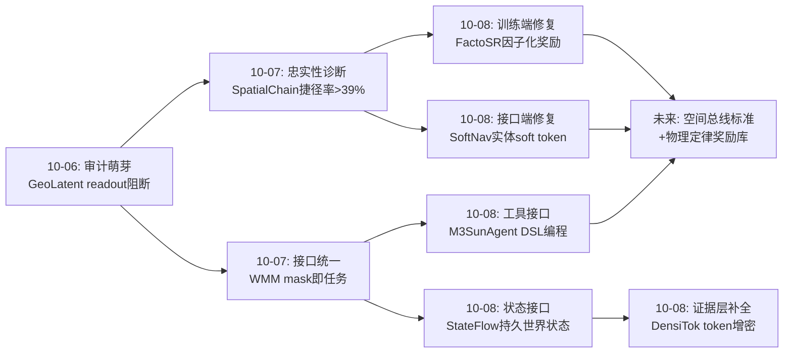
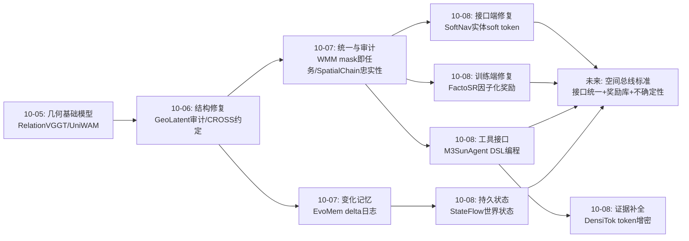
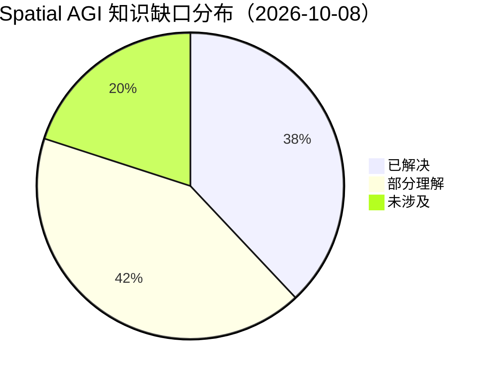

# Spatial AGI 每日深度思考 — 2026-10-08

**日期**: 2026-10-08
**基础日期**: 2026-10-07（昨日任务完整完成，5 篇论文 + 807 行思考）
**论文数量**: 5 篇
**主题**: 接口日。如果说昨天是统一日（把六类任务焊成更少的部件），今天五篇论文则在回答一个更精细的问题：**部件之间应该用什么语言交谈**。M3SunAgent 用 DSL 程序让 LLM 与几何工具对话、SoftNav 用实体级 soft token 让 3D 编码器与 VLM 隐空间对话、FactoSR 用因子化奖励让物理定律与策略梯度对话、StateFlow 用结构化状态转移让创作意图与世界状态对话、DensiTok 用潜空间 token 补全让稀疏观测与冻结骨干对话。五个工作不约而同地拒绝同一个东西：**让空间信息过自然语言这道窄门**。昨天的 SpatialChain 证明了语言化的空间推理有近半是捷径；今天的论文们从工程端给出了正面答案——空间信息的模块间接口应该原生连续、可验证、可执行，文本只是给人看的投影。

---

## 📅 每日总结

**日期**: 2026-10-08
**论文数量**: 5篇
**主题**: 接口日。昨天统一了部件，今天设计部件间的接插件。五篇论文覆盖 Spatial AGI 栈的五个不同层面，却收敛于同一个设计哲学：**在正确的表示层传递正确的信息形态**。M3SunAgent 证明 LLM 不需要空间训练、只需要正确的工具接口就能赢过空间训练过的 VLM；SoftNav 用受控实验量化了"文本序列化 3D 信息"的表示损耗，并以 17M 参数的 soft token 注入取得导航 SOTA；FactoSR 把几何定律（重投影、深度序、循环一致）编码为 RL 奖励，让空间忠实性成为被优化的目标而非被审计的 hope；StateFlow 把生成式创作重构为"持久世界状态的构建-演化-访问"；DensiTok 则把稀疏观测修复从像素层挪到 token 层——增密证据而非伪造像素。

**关键突破**:
- 🚀 **零空间训练的空间 SOTA（M3SunAgent）**：LLM 生成 DSL 程序、编排检测/测深/反投影/提升工具链，实例级米制深度 δ<0.25 达 52.61% 全场最佳，单目 3D grounding 超越空间训练过的 MonoVLM 3.62pp——而 LLM/VLM 一个参数都没动。"空间能力必须内化到权重里"的主流叙事被正面反驳：至少在度量几何层，**外置工具 + 正确接口就够了**。
- 🚀 **表示间隙的受控量化（SoftNav, IROS 2026）**：固定 3D 编码器与 VLM，只把"文本序列化"换成"嵌入注入"，性能显著提升——这是第一次有人干净地量化了空间信息过文本窄门时的损耗。1200 样本 + 17M 参数 + 双冻结，HM3D-OVON 74.2/68.3/66.7% SR 全面 SOTA，零样本迁移到 GOAT-Bench、SG3D 和真实机器人。**感知端结构化 + 接口嵌入化 = 极限样本效率**。
- 🚀 **奖励工程替代数据工程（FactoSR, ECCV 2026）**：把 VLM 空间瓶颈诊断为 2D 投影的维度塌缩，将 4D 一致性分解为 XY 重投影 / Z 深度序 / T 时间可逆三个可验证奖励，用 GRPO 直接优化——VSI-Bench +5.9%。与昨日 SpatialChain 形成完美闭环：昨天诊断"语言推理与几何脱钩"，今天用奖励函数强迫推理忠实于几何。**空间智能可以被奖励塑造，而不必被架构改造**。
- 🚀 **世界状态作为一等公民（StateFlow）**：生成式创作的正确抽象不是"生成帧"而是"维护世界状态"——构建（冲突感知双视图提升）、演化（结构化状态转移 + 世界记忆）、访问（渲染反馈反思的相机规划）。编辑成本与场景复杂度解耦，"物理渲染器作为最后裁决者"取代语义想象。这是显式世界模型路线在创作场景的系统性验证。
- 🚀 **在证据层补全，而非在像素层造假（DensiTok）**：稀疏视角前馈 3DGS 的瓶颈不在重建头而在 token 无证据。冻结骨干 + 潜空间单步 flow-matching 补全未观测视角的 token——3 骨干 × 2 基准一致有效。空间想象可以在表征层廉价实现，这为"轻量空间想象"提供了第一个工程样本。

**架构演进**: 10 层架构维持 10 层，但发生一次**接口层的系统性重写**——(1) **感知↔推理接口**：从文本序列化（SG-Nav/NavGPT 路线）转向实体级 soft token（SoftNav），表示间隙被量化确认；(2) **推理↔几何工具接口**：M3SunAgent 的 DSL + Tool Registry 确立"可执行空间推理"的工程形态；(3) **训练信号接口**：FactoSR 把物理定律写进奖励函数，训练信号从"答案对错"升级为"几何可验证"；(4) **记忆↔创作接口**：StateFlow 的持久状态与昨日 EvoMem 的变化日志互补，显式状态路线补齐了创作侧；(5) **观测↔表征接口**：DensiTok 的 token 补全让感知前端的"观测不足"问题有了表征层答案。

### 📊 一句话总结

今天五篇论文共同签署了一份"空间接口宣言"：**空间信息的模块间通信应该是连续的、实体粒度的、几何可验证的、可执行的——自然语言只配做人机交互层**。昨天证明了语言化空间推理不可信，今天证明了绕开语言不仅可行而且全面占优。

### 🔗 延续性

**昨日→今日**: 昨天"统一日"确立三件事——mask 即任务的接口统一（WMM）、忠实性审计的必要性（SpatialChain）、变化即记忆（EvoMem）。今天是这些结论的工程落地日：SpatialChain 诊断的语言-几何脱钩被 FactoSR 用奖励修复、被 SoftNav 用嵌入接口绕开；WMM 的"统一接口"思想在 M3SunAgent 的 DSL 和 SoftNav 的 soft token 上以更轻的形态重现；EvoMem 的状态记忆与 StateFlow 的持久世界状态在"显式状态"路线上会师。

**今日→明日**: 明日值得追踪——(1) SoftNav 的嵌入接口 × M3SunAgent 的工具接口：能否统一为"空间总线"（spatial bus）标准，让任意感知模块与任意推理模块即插即用；(2) FactoSR 的因子化奖励 × SpatialChain 的符号验证链：把奖励函数升级为"几何程序执行验算"，彻底消除 judge 依赖；(3) StateFlow 的状态演化 × EvoMem 的 delta 记忆：统一的状态更新协议（世界状态 = 地图 + 变化日志 + 语义库）；(4) DensiTok 的 token 补全的不确定性估计：补全是猜测，可靠系统需要"知道自己在哪里在猜"；(5) M3SunAgent 的 DSL 自扩展：让 Agent 自己发明新算子，从"可执行推理"走向"可进化推理"。

### 💡 本质思考：如何达成通用空间智能

#### 1. 核心能力的本质是什么？

今天五篇论文把这个问题推进到"接口形态"维度。**第一层：空间智能的第一性问题不是表示而是接口**。同样的大模型、同样的感知，M3SunAgent 换个工具接口就赢过空间训练的 VLM，SoftNav 换个嵌入接口就刷新导航 SOTA。这说明过去两年"空间 VLM"路线的主要瓶颈可能根本不在模型，而在**空间信息到达决策模块之前的形态损耗**。文本是空间信息的有损压缩——而且压掉的部分（度量、连续性、拓扑）恰恰是空间智能最需要的。**第二层：可验证性是空间领域独有的战略资产**。FactoSR 的深刻之处在于意识到几何天然可验证（重投影可算、深度序可比、循环一致可测），而其他推理领域（常识、伦理）没有这种奢侈。把物理定律编码成奖励，等于让宇宙自己当老师。这个优势当前被严重低估：空间 RL 的天花板不是算法而是"还有多少物理定律没被写成奖励"。**第三层：状态的持久性是创作与行动的共同前提**。StateFlow 证明迭代创作需要显式持久状态（编辑 ≠ 重生成），EvoMem 昨天证明长时程操作需要变化日志（记忆 ≠ 快照）。两个场景、同一个结论：**智能体的连续性来自状态，而非来自每次推理的重新开始**。**第四层：想象的正确层级是证据层**。DensiTok 展示了空间想象的最小实现：不生成像素、不假装观测，而是在表征层补全证据——让模型自己的 3D 先验完成外推。这暗示 Spatial AGI 的"想象能力"可能是一个谱系：token 补全（DensiTok，最轻）→ 轨迹先验（WMM）→ 层级潜在预测（H-JEPA）→ 视频生成（最重），按任务需求选层。

#### 2. 当前方法与理想目标的差距在哪里？

**差距一：接口标准缺失**。SoftNav 的投影器绑定 PQ3D 的 768 维接口，M3SunAgent 的 DSL 算子集人工封顶，FactoSR 的奖励依赖真值位姿。每个系统的接口都是私有的——Spatial AGI 缺少自己的"USB 协议"：感知模块、推理模块、记忆模块之间没有公认的连接标准。差距在于：还没有人定义"空间信息总线"的抽象（数据类型、粒度、语义、不确定性元数据）。**差距二：补全的可信度**。DensiTok 的 token 补全和 M3SunAgent 的工具链都没有不确定性量化。可靠空间系统必须区分"测到的"与"猜的"——理想状态要求每个空间量携带置信度并在推理中传播，当前没有任何系统做到端到端的不确定性传播。**差距三：显式-隐式状态之争未裁决**。StateFlow（显式状态）与 H-JEPA（隐式潜在）仍是平行宇宙：显式胜在可编辑可审计，隐式胜在流畅可涌现。差距在于没有混合架构的实证——显式骨架 + 隐式抽象的上层组合只在昨天 WMM/H-JEPA 的对比中隐约可见原型。**差距四：零样本与鲁棒性的张力**。SoftNav 零样本迁移惊艳，但其训练分布仍是仿真室内场景；FactoSR 奖励需要真值几何；M3SunAgent 的米制深度依赖单目深度估计器在野外不保真。差距在于：所有接口方案都在"理想感知"前提下成立，感知退化（光照、动态、传感器漂移）时的接口鲁棒性无人测量。**差距五：延迟与实时性**。M3SunAgent 多工具调用、StateFlow 渲染反馈循环、FactoSR 长 CoT——接口精化的代价是延迟。机器人控制需要 10-100Hz，当前方案普遍在秒级。差距在于：空间接口的"快速通道"（缓存、增量更新、投机执行）尚未设计。

#### 3. 从今天到理想状态，最可能的路径是什么？

一条接口驱动的五段路径。**第一段（现在起）：定义空间总线标准**。把 SoftNav 的实体级嵌入、M3SunAgent 的几何量、StateFlow 的状态元素统一为一个带不确定性元数据的空间数据结构（类型：点/框/轨迹/场景图/token 集；置信度：每个量携带；来源：测得/推得/补得）。任何感知端输出此结构，任何推理端消费此结构——这一步不需要新科学，只需要工程共识，就像今天的 MCP 之于工具调用。**第二段（并行）：奖励库工程**。把 FactoSR 的三奖励扩展为系统性的"物理定律奖励库"：投影几何、深度序、刚体约束、碰撞约束、时间可逆、动量守恒……每条定律一个可验证奖励。这个库是可复用的公共品，谁贡献谁受益——空间 RL 的民主化路径。**第三段（6-12个月）：显式-隐式混合状态栈**。底层 StateFlow 式显式状态（可编辑、可审计、可回滚）+ 上层 H-JEPA 式隐式抽象（可涌现），层间用"状态快照 → 抽象条件"接口。记忆栈同步三层化：3DGS 地图 + delta 变化日志（EvoMem）+ 语义状态库，统一的状态更新协议让创作与操作共享同一世界模型。**第四段（并行）：不确定性内建**。DensiTok 的补全输出置信度、M3SunAgent 的 DSL 增加"验证算子"（对可疑结果主动二次观测）、SoftNav 的坐标生成附带分布而非点估计——空间接口从"传值"升级为"传分布"。这是从 demo 到可信赖系统的分水岭。**第五段（1-2年+）：接口的自我进化**。M3SunAgent 的 DSL 由人工设计 → Agent 自主发明新算子（在工具库上做程序搜索）；FactoSR 的奖励由人工枚举 → 从失败案例中自动提议新奖励（奖励发现）。理想状态的判定标准更新为：一个系统以标准空间总线连接异构模块（接口统一）、以物理定律奖励库训练（可验证）、以混合状态栈维持连续性（显式+隐式）、每个空间量携带不确定性（可信赖）、并能自主扩展自己的接口与奖励（可进化）——五关全过，空间智能才算有了自己的"LLM 时刻"。

---

## 🔗 与昨日思考的联系

### 昨日重点

昨日的"统一日"确立了四个结论：(1) **mask 即任务**——WMM 把六类运动任务统一为 SE(3) 轨迹 token 的 mask 模式，接口统一是空间基础模型的核心判据；(2) **忠实性必须与统一同步建设**——SpatialChain 证明近半正确答案是捷径，审计三轴（表征使用/推理忠实/能力转化）成型；(3) **变化即记忆**——EvoMem 确立记忆的信息论本质是变化率；(4) **抽象是时间尺度的函数**——H-JEPA 的涌现原理。当日遗留的悬念：统一之后，部件之间到底该说什么语言？

### 今日进展

今天在昨日基础上完成三个推进：(1) **审计问题获得工程解**——昨日 SpatialChain 诊断"语言推理与几何脱钩"，今天出现两条修复路线：FactoSR 在训练端（把几何定律写进奖励，让忠实性成为优化目标）和 SoftNav/M3SunAgent 在接口端（让几何绕开文本直接进入推理器）。一诊断两开方，问题从"是否可信"转为"选哪条修复路径"。(2) **统一接口思想的具体化**——昨日 WMM 在运动层统一了任务接口；今天 M3SunAgent（DSL + Tool Registry）和 SoftNav（实体级 soft token）在感知-推理接口上给出更轻量的统一方案，且都验证了"冻结大模型 + 正确接口"的极限样本效率。(3) **显式状态路线补齐创作侧**——昨日 EvoMem 的变化日志是操作侧的状态记忆；今日 StateFlow 证明同一"持久状态"哲学在创作场景同样成立，显式状态路线从机器人扩展到通用内容生产。

### 演进路径



---

## 📚 论文概览

**论文1: M3SunAgent** — 华中科大/A*STAR。单目 3D 空间理解 Agent：LLM 作为空间视觉编程的任务规划器，把自然语言查询编译为 DSL 程序，协调检测器、深度估计、VLM、反投影、2D→3D 提升五类工具。实例级米制深度 δ<0.25 达 52.61%（M3SI 数据集，2910 样本），grounding mIoU 41.73% 超 MonoVLM 3.62pp。LLM/VLM 全程 frozen，零空间训练。意义：可执行空间推理的工程原型，接口正确性可补偿训练缺失。

**论文2: FactoSR (Unfold The World)** — HKUST(GZ)/微软，ECCV 2026。把 VLM 空间瓶颈诊断为 2D 投影的维度塌缩，提出因子化 RLVR：XY（跨视图重投影一致性）+ Z（深度序）+ T（时间循环可逆）三正交奖励，GRPO 优化 Qwen3-VL。VSI-Bench +5.9%、All-Angles-Bench +4.5%，保留通用能力。两阶段：SFT 空间感知打底（Anchor-Transfer-Verify CoT）+ RL 精化。意义：奖励工程替代数据工程，忠实性成为被优化的目标。

**论文3: StateFlow** — 北大/昆仑万维等。生成式预可视化的状态中心框架：显式持久 3D 世界状态（元素几何/外观 + 相机配置）为核心表征，三阶段——状态构建（冲突感知双视图初始化）、状态演化（结构化状态转移保留世界记忆，编辑不全场景重生成）、状态访问（渲染反馈反思精化相机轨迹）。视频模型只在需高保真时介入。意义：显式世界状态是创作与行动的共同基础设施。

**论文4: SoftNav** — 浙大，IROS 2026。受控消融首次量化"3D 信息文本序列化"的表示间隙；把 PQ3D 场景编码器的实体级 768 维嵌入（每物体/frontier 一个）经两层 MLP 投影为 soft token 注入冻结 Qwen2.5-VL。仅 17M 可训练参数 + 1200 样本。HM3D-OVON 三分割 74.2/68.3/66.7% SR 双 SOTA，零样本过 GOAT-Bench（67.2%）、SG3D（47.2%）并部署真实机器人。意义：空间接口应原生连续，文本只配做人机层。

**论文5: DensiTok** — 稀疏视角前馈 3DGS 的即插即用修复：把冻结骨干内部几何 token 压入紧凑潜空间，以相机几何为条件单步 flow-matching 补全未观测视角潜码，解码回 token 交还原重建头。瓶颈重定位：不在重建头而在 token 无证据。3 预训练骨干 × 2 基准一致有效，无需图像合成、无额外编码。意义：在证据层补全而非像素层造假，空间想象的轻量化形态。

---

## 💡 核心见解

### 见解1: 文本是空间信息的有损压缩——且压掉的恰是最关键的部分

**从 SoftNav + SpatialChain（昨日）联合获得**

- ✅ SoftNav 的受控消融：固定感知与推理器，只换接口（文本→嵌入），性能显著提升，尤其路径效率 SPL——损耗的正是度量与连续性信息
- ✅ 昨日 SpatialChain：语言化空间推理捷径率 >39%——文本接口不仅丢信息，还诱导"看起来像推理"的捷径
- ✅ 两条证据链指向同一结论：自然语言不是空间信息的合法传输格式

**对Spatial AGI的启发**:

这是 Spatial AGI 领域的"表示间隙时刻"， analogous 到 2017 年 word embedding → contextual embedding 的跃迁。系统设计含义：任何"3D 场景 → 文字描述 → LLM"的管线都应被视为过渡方案。更深远地，这也解释了为什么"空间 VLM 训练"收效缓慢——可能不是训练不够，而是训练目标本身建立在有损接口上。SoftNav + M3SunAgent + FactoSR 三线合围，"绕开文本"正在从异端变成共识。

### 见解2: 接口正确性可以补偿训练缺失——空间能力的注入成本正在坍缩

**从 M3SunAgent + SoftNav 获得**

- ✅ M3SunAgent：LLM/VLM 零空间训练，纯 DSL 工具编排，赢过空间训练过的 MonoVLM 3.62 mIoU
- ✅ SoftNav：双冻结 + 17M 参数 + 1200 样本 = 导航 SOTA 并零样本跨三基准迁移
- ✅ 共同模式：感知端已结构化时，推理端的学习问题变得极小

**对Spatial AGI的启发**:

过去两年"空间 VLM"的隐含假设是空间能力必须用 3D 数据灌进权重。今天两个工作正面反驳：至少在度量几何与导航决策层，**能力在工具与接口里，不在权重里**。工程含义：Spatial AGI 的资源分配应大幅前移——把预算从"训练更大的空间模型"转向"构建更好的空间感知与接口"。同时这提示一个分工：权重负责语义与泛化，接口负责度量与精确——语义可以模糊，几何必须精确，让各自待在自己擅长的表示里。

### 见解3: 物理定律是免费的老师——奖励工程是空间 RL 的战略高地

**从 FactoSR 获得**

- ✅ 把 4D 一致性分解为三个可验证子目标（XY 重投影/Z 深度序/T 时间可逆），每条都是可计算的几何定律
- ✅ 只奖励最终答案的空间 RL 会让模型走捷径；因子化奖励强迫模型走几何可验证的推理路径
- ✅ T-reward 的"可逆性"设计尤其聪明：时间一致性难以直接度量，但"逆推能回起点"可算

**对Spatial AGI的启发**:

空间领域相对其他推理领域拥有独特战略资产：**物理定律天然可验证**。常识推理没有"重投影检验"，空间推理有。当前的空间 RL 只用了三条定律，而物理世界提供的是一整本守恒律与几何约束目录——投影几何、刚体约束、碰撞约束、动量/能量守恒、重力、摩擦。谁能系统性地把这本目录编码成奖励库，谁就拥有空间智能的"印钞机"。这与昨日 SpatialChain 的符号验证链合流：短期用规则奖励训练，终局用几何程序执行验算——宇宙自己当考官。

### 见解4: 编辑 ≠ 重生成——持久状态是连续性的本体

**从 StateFlow + EvoMem（昨日）获得**

- ✅ StateFlow：迭代创作的正确抽象是"维护世界状态"——每次编辑只做结构化状态转移，世界记忆保留，避免全场景重生成
- ✅ 昨日 EvoMem：记忆的信息论本质是变化率——快照存不住智能，delta 日志才存得住
- ✅ 两个不同场景（创作/操作）、同一个本体论结论：智能体的连续性来自状态

**对Spatial AGI的启发**:

当前生成式范式（包括视频世界模型）本质上是"无状态"的——每次生成都从 prompt 重新开始。这对一次性任务够用，对持续交互的空间智能是根本缺陷。StateFlow 与 EvoMem 从两端夹击，指向同一个架构组件：**持久、可局部更新、带变化日志的世界状态**。这也重新定义了"世界模型"的评估标准：不只是预测准不准，还有状态更新对不对——世界模型应该像数据库（事务、回滚、增量），而不是像录像带（只能线性回放）。

### 见解5: 在证据层补全，而非在像素层造假——空间想象的正确层级

**从 DensiTok 获得**

- ✅ 稀疏视角退化的瓶颈在内部 token 无证据，不在重建头能力——修复点应该上移一层
- ✅ 潜空间单步补全优于像素合成：像素合成引入按构造不一致的伪证据，token 补全让骨干自己的 3D 先验完成外推
- ✅ 单步 flow-matching 保证想象便宜到能进实时系统

**对Spatial AGI的启发**:

"空间想象"不必是重型世界模型。它有一个谱系：token 补全（DensiTok，最轻）→ 轨迹先验采样（WMM）→ 层级潜在预测（H-JEPA）→ 视频生成（最重）。按任务需求选层：建图用补全、规划用轨迹、长时程用层级、演示用视频。这个分层视角把"想象"从营销词变成工程选型问题。另一个普适原则：**信任模型已学到的结构，胜过喂它可疑的新数据**——这条原则适用于所有"观测不足"场景，从感知补全到数据增强。

### 见解6: 冻结 + 外挂是当前组装 Spatial AGI 的最优范式

**从今日五篇论文的整体模式获得**

- ✅ M3SunAgent：冻结 LLM/VLM + 工具链编排
- ✅ SoftNav：冻结 3D 编码器 + VLM + 17M 投影器
- ✅ FactoSR：冻结骨干思想的最弱形式（RL 全参但无架构改动）
- ✅ DensiTok：冻结骨干 + 重建头 + 模块外挂
- ✅ StateFlow：现成视频模型 + 状态管理框架

**对Spatial AGI的启发**:

五篇论文，五种任务，同一范式：**不动大模型，动接口**。这不是偷懒，而是理性：大模型承载的语义先验已是公共品，重复训练是浪费；真正的差异化在于空间感知质量与接口设计。这预示 Spatial AGI 的产业形态：少数基础模型 + 大量"空间模块"生态 + 一个接口标准。类似 MCP 之于 Agent 工具生态，空间领域急需自己的协议——不妨叫它"空间总线"（spatial bus）：定义实体嵌入、几何量、场景图、不确定性元数据的标准交换格式。

### 见解7: 可执行性是空间推理可信化的下一站

**从 M3SunAgent + FactoSR + SpatialChain（昨日）三线合流获得**

- ✅ M3SunAgent：空间推理被外化为 DSL 程序——可审计、可调试、可定位失效算子
- ✅ FactoSR：推理被约束为几何可验证路径——每步对应、深度、时间检验都可机器验算
- ✅ 昨日 SpatialChain：SFT 在符号验证链上把捷径率 39%→22%——符号结构比规模更重要

**对Spatial AGI的启发**:

三条独立证据链汇成一个判断：空间推理的终局形态是**可执行的几何程序**——每条推理链是一个程序，正确性可机器验算，失效可定位到语句。这比 LLM judge 可靠（judge 有系统性盲区），比端到端黑盒可信（黑盒无法审计）。安全攸关场景（驾驶、机器人、医疗）会率先采用。下一步的技术挑战是"程序空间搜索"：让模型在 DSL 空间里搜索推理程序而非在语言空间里生成借口——从"说得像"到"算得对"。

---

## 🗺️ 知识演进图



---

## 技术栈演进对比表

| 层次 | 昨日方案 (10-07) | 今日方案 (10-08) | 变化 |
|------|----------------|----------------|------|
| 感知-推理接口 | WMM: SE(3)轨迹token（任务层统一） | SoftNav: 实体级soft token注入VLM隐空间 | 从任务接口下沉到**感知-推理接口**，表示间隙被量化 |
| 空间推理 | SpatialChain: 审计捷径率（诊断） | M3SunAgent: DSL程序编排工具（治疗） | 从"审计语言推理"到"用可执行程序替代语言推理" |
| 训练信号 | SpatialChain SFT: 符号验证链监督 | FactoSR: XY/Z/T因子化奖励 + GRPO | 从监督信号升级为**物理定律奖励**，忠实性成为优化目标 |
| 世界状态 | EvoMem: delta变化日志（操作侧） | StateFlow: 显式持久状态三阶段（创作侧） | 状态路线从机器人扩展到通用创作，**状态=一等公民**确立 |
| 稀疏观测 | Mobile-4DGS: 端侧渲染极简化 | DensiTok: token层证据增密 | 从"跑得动"到"看得少也建得好"，感知前端补全 |
| 空间基准 | All-Angles/VSI-Bench性能 | M3SI: 实例级米制深度独立基准 | 度量几何获得专属评测，空间评估继续**细粒度化** |
| 部署效率 | Mobile-4DGS: 移动端实时渲染 | SoftNav 17M参数/DensiTok单步补全 | 效率焦点从渲染扩展到**接口与补全**的轻量化 |
| 忠实性保障 | judge校准（LLM评LLM） | 几何可验证奖励 + DSL可审计程序 | 忠实性从"评测指标"升级为"训练目标+架构属性" |

---

## 🗺️ Spatial AGI 知识图谱

### 10层架构思维导图

```mermaid
mindmap
  root((Spatial AGI))
    第1层 感知
      SoftNav: PQ3D实体级嵌入
      DensiTok: 稀疏观测token补全
      M3SunAgent: 检测/测深工具链
    第2层 表示
      DensiTok: 内部几何token空间
      SoftNav: 实体级768维嵌入
      StateFlow: 结构化3D世界状态
    第3层 接口
      SoftNav: soft token投影器
      M3SunAgent: DSL + Tool Registry
      空间总线标准（待建）
    第4层 记忆
      StateFlow: 持久世界记忆
      昨日EvoMem: delta变化日志
      3DGS地图（TRACE路线）
    第5层 推理
      M3SunAgent: 空间视觉编程
      FactoSR: 因子化4D CoT
      Anchor-Transfer-Verify
    第6层 学习
      FactoSR: 物理定律奖励库
      SoftNav: 跨架构蒸馏（教师frontier选择）
      冻结+外挂范式
    第7层 想象
      DensiTok: 潜空间单步补全
      StateFlow: 状态演化模拟
      谱系: token补全→轨迹→层级→视频
    第8层 规划与行动
      SoftNav: frontier吸附+距离比护栏
      WMM（昨日）: SE(3)轨迹先验
      M3SunAgent: 抓取距离引导
    第9层 生成与创作
      StateFlow: 构建/演化/访问三阶段
      渲染反馈反思
      视频模型作质量皮肤
    第10层 评估与审计
      FactoSR: 可验证奖励即内建审计
      M3SI: 米制深度基准
      DSL程序可审计性
```

### 🎯 主线技术路径

#### 阶段1: 接口正确化（当前，2026 H2）

文本序列化被量化证伪（SoftNav），空间信息的模块间通信全面转向连续嵌入与可执行程序。标志：SoftNav 的实体级 soft token、M3SunAgent 的 DSL 工具编排。这一阶段的主战场是"绕开文本"，收益立竿见影（SOTA 普遍 +3~26pp），但接口仍是各系统私有的。

#### 阶段2: 接口标准化（2026 H2 - 2027）

私有接口收敛为公共标准——"空间总线"：定义实体嵌入、几何量、场景图、不确定性元数据的交换格式。类比 MCP 之于工具生态。标志信号：出现跨厂商兼容的空间模块市场；SoftNav 式投影器可以接任意 3D 编码器；M3SunAgent 式 Agent 可以装配任意厂商的工具包。

#### 阶段3: 训练信号物理化（2027）

FactoSR 的三奖励扩展为系统性物理定律奖励库（投影几何/刚体/碰撞/守恒律），并与 SpatialChain 的符号验证链合流为"几何程序执行验算"。空间 RL 的数据饥饿被奖励工程替代——宇宙自己当老师。忠实性从评测指标变为训练目标，第一个"通过符号执行审计的空间基础模型"出现。

#### 阶段4: 混合状态栈与不确定性内建（2027-2028）

StateFlow 式显式状态 + H-JEPA 式隐式抽象的组合架构实证；记忆栈三层化（3DGS 地图 + delta 日志 + 语义库）统一创作与操作场景。同时每个空间量携带置信度并在推理中传播：DensiTok 的补全输出不确定性、DSL 增加"验证算子"（可疑结果触发主动重观测）、SoftNav 的坐标输出从点估计升级为分布。系统从"能做"跨入"可信"。

#### 阶段5: 自进化接口（2028+）

DSL 由 Agent 自主发明新算子（工具库上的程序搜索）；奖励库从失败案例中自动提议新定律（奖励发现）。空间智能系统获得改造自身接口与训练信号的能力——这是从"被组装的系统"到"自我组装的系统"的分界线。判定标准：一个系统以标准总线连接异构模块、以物理定律奖励训练、以混合状态栈维持连续性、每个空间量携带不确定性、并能自主扩展接口与奖励。

---

## 🔍 待探索议题

### 高优先级（本周）

1. **空间总线协议的最小充分定义**
   - 问题: SoftNav 的 768 维实体嵌入、M3SunAgent 的几何量、StateFlow 的状态元素如何统一为一个带不确定性元数据的标准数据结构？
   - 候选方案: 类型系统（点/框/轨迹/场景图/token集）+ 来源标记（测得/推得/补得）+ 置信度字段；参照 MCP 的 JSON-RPC 模式设计 schema
   - 缺口: 没有任何工作讨论跨系统的空间数据交换标准；各接口私有导致模块无法复用

2. **token 补全的不确定性量化**
   - 问题: DensiTok 的补全是结构化猜测，可靠系统如何知道"哪里在猜"？
   - 候选方案: 补全模块输出 per-token 方差；多步采样估计补全分布；渲染一致性回验（补全区域重渲染与新视角比对）
   - 缺口: 论文完全未涉及不确定性；补全失败模式的系统研究不存在

3. **几何程序执行验证能否替代 LLM judge**
   - 问题: SpatialChain 的 judge 有系统性盲区，能否把推理链翻译为几何程序做机器验算？
   - 候选方案: M3SunAgent 的 DSL 作为目标程序语言；FactoSR 的三个奖励作为程序内建断言；SFT 数据从"符号验证链"升级为"可执行链"
   - 缺口: 自然语言→几何程序的翻译器不存在；程序空间的覆盖度（能否表达所有空间推理类型）未验证

### 中优先级（本月）

4. **因子化奖励的扩展目录**
   - 问题: FactoSR 只用了三条几何定律，物理世界提供整本守恒律目录——扩展的优先级与组合方式？
   - 候选方案: 刚体约束、碰撞约束、重力/支撑关系、遮挡序、透视不变量逐条编码；先在 VSI-Bench 上做奖励消融
   - 缺口: 多奖励的权重冲突与 reward hacking 风险无研究；定律间的正交性未证明

5. **显式-隐式混合状态栈的实证**
   - 问题: StateFlow 显式状态与 H-JEPA 隐式抽象能否在同一系统中组合并互证？
   - 候选方案: 底层显式状态（可编辑可审计）+ 上层隐式抽象，接口为"状态快照→抽象条件"；在长时程操作+创作混合任务上测试
   - 缺口: 无任何工作同时包含两种状态表示；层间接口的信息形态（快照如何变成抽象条件）未定义

6. **空间接口的实时快速通道**
   - 问题: M3SunAgent 多工具调用、StateFlow 渲染循环、FactoSR 长 CoT 都在秒级——机器人控制需要 10-100Hz
   - 候选方案: DSL 程序的增量执行（只重跑受影响的算子）；soft token 的缓存与差分更新；投机执行（预测下一步查询预计算）
   - 缺口: 所有接口论文都不报告延迟-精度 Pareto；增量空间计算的理论（哪些算子可增量）未研究

7. **接口在感知退化下的鲁棒性**
   - 问题: SoftNav 依赖 RGB-D+位姿、FactoSR 依赖真值几何、M3SunAgent 依赖深度估计器——感知退化时接口方案还成立吗？
   - 候选方案: 在深度噪声/位姿漂移/动态干扰下做接口消融；不确定性元数据驱动接口降级（嵌入→粗坐标→文本）
   - 缺口: 所有接口结论都在理想感知前提下得出；降级路径设计无人研究

### 低优先级（本季度）

8. **DSL 的自主算子发明**
   - 问题: M3SunAgent 的算子集人工封顶，Agent 能否自主发明新算子？
   - 候选方案: 在原语算子库上做程序搜索（VQ Geodesics 10-06 的技能发现路线）；失败查询自动触发新算子合成提案
   - 缺口: 算子空间的组合爆炸控制；新算子的正确性验证协议

9. **世界状态的跨设备同步**
   - 问题: StateFlow 的状态在创作工作站、EvoMem 的记忆在机器人本体——空间状态如何跨设备/跨云端同步？
   - 候选方案: 状态差分同步（只传 delta，呼应昨日 TRACE 的统计量共享哲学）；端侧渲染资产 + 云端想象的混合协议
   - 缺口: 空间状态的版本控制与冲突合并无研究；带宽-一致性权衡未量化

10. **空间想象的谱系选型理论**
    - 问题: token 补全（DensiTok）→轨迹先验（WMM）→层级预测（H-JEPA）→视频生成，什么任务该用哪层想象？
    - 候选方案: 按时域长度/精度要求/语义丰富度三维刻画任务，建立"想象层级选择函数"；在导航/操作/创作三场景验证
    - 缺口: 各层级想象的成本-精度-语义权衡无统一定量比较；跨层级的级联想象（先粗后细）未探索

---

## 📊 知识缺口分析



**已解决（38%）**:
- ✅ 空间信息的正确接口形态：连续嵌入 > 文本序列化（SoftNav 受控证明）
- ✅ 零训练空间能力的可行性：DSL 工具编排即可达 SOTA（M3SunAgent）
- ✅ 忠实性的训练端解法：因子化几何奖励（FactoSR）
- ✅ 迭代创作的状态抽象：持久世界状态三阶段（StateFlow）
- ✅ 稀疏观测的表征层修复：token 补全优于像素合成（DensiTok）
- ✅ 冻结+外挂范式的普适性：五篇论文五种任务同一模式
- ✅ 实体级 soft token 的注入配方（双冻结+微型投影器+小样本蒸馏）

**部分理解（42%）**:
- ⚠️ 接口的鲁棒性边界：所有接口方案在理想感知前提下成立，退化场景未测
- ⚠️ 补全的可信度：DensiTok 式猜测无不确定性量化，失败模式未知
- ⚠️ 因子化奖励的组合学：三奖励已验证，多定律组合的冲突与 hacking 未研究
- ⚠️ 显式-隐式状态之争：两条路线并行发展，混合架构无实证
- ⚠️ 零样本迁移的边界：SoftNav 迁移限于仿真室内谱系，野外未验证
- ⚠️ DSL 表达力的天花板：能否表达全部空间推理类型未知
- ⚠️ 接口的实时性：延迟-精度 Pareto 无系统报告，增量计算理论缺失
- ⚠️ 记忆与状态的统一：EvoMem delta 日志与 StateFlow 世界状态尚未合并为单一协议

**未涉及（20%）**:
- ❌ 空间总线标准：跨系统空间数据交换协议完全空白
- ❌ 几何程序翻译器：自然语言推理链→可执行几何程序的转换器不存在
- ❌ 空间状态的版本控制与跨设备同步：无任何工作触及
- ❌ 端到端不确定性传播：从感知到决策的置信度全链路传递无系统
- ❌ 接口与奖励的自我进化：Agent 自主发明算子/奖励的理论与安全边界
- ❌ 想象层级的选型理论：任务→想象层级的映射函数无定量刻画

---

## 📝 今日金句

- "空间信息的模块间通信应该是连续的、实体粒度的、几何可验证的——自然语言只配做人机交互层。"
- "接口正确性可以补偿训练缺失：能力在工具与接口里，不在权重里。"
- "物理定律是免费的老师：空间 RL 的天花板不是算法，而是还有多少守恒律没被写成奖励。"
- "编辑 ≠ 重生成，记忆 ≠ 快照：智能体的连续性来自状态。"
- "在证据层补全，而非在像素层造假：信任模型已学到的结构，胜过喂它可疑的新数据。"

---

**文档创建时间**: 2026-10-08 03:00 (Asia/Shanghai)
**基础**: 2026-10-07 思考文档（807行）+ 今日 5 篇论文精读
**分析方法**: arXiv HTML 精读 + 跨日知识演进综合

---

## 🔬 五篇论文的逐篇深读笔记

### 深读1: M3SunAgent——空间视觉编程的解剖

**为什么 DSL 是关键，而不是 Agent**

- 常见 Agent 用"工具调用 JSON"逐步决策，每步都是一次 LLM 的即兴发挥；
  M3SunAgent 让 LLM 一次性生成**完整程序**，执行交给确定性的解释器
- 这里有本质区别：逐步调用 = 推理在语言空间展开（每步都可能幻觉）；
  程序生成 = 推理在结构空间定形（执行是确定性的）
- 与 VQ Geodesics（10-06）的"策略与执行分离"完全同构：
  **LLM 负责识别与选择，确定性机制负责计算与执行**

**实例级深度聚合的细节价值**

- 单点深度不可靠的三个原因：物体延展（一个点不代表整个物体）、
  遮挡边缘混叠、深度模型在物体边界的系统性偏差
- M3SunAgent 的三重防御：掩码内多点采样（空间平均）、
  离群过滤（拒绝坏点）、焦距归一化（消除内参失配）
- 这个组合让"场景级深度图"升级为"实例级米制距离"——
  语义上多了一层"目标绑定"，数值上多了一层鲁棒性

**对"统一空间 Agent"路线的信心校准**

- 积极面：零训练、可插拔、可审计，工程友好度极高
- 保留面：mIoU 41.73% 的绝对值说明单目 3D 定位仍远未解决——
  Agent 架构解决的是"组织问题"，不解决"感知问题"
- 判断：Agent 是空间智能的**操作系统**，不是**内核**——
  内核仍是深度估计、几何优化这些硬感知技术

### 深读2: FactoSR——奖励工程的方法论解剖

**因子化的正确性论证**

- 为什么 4D 目标不可直接优化：空间×时间的联合一致性验证需要
  完整的 4D 重建作为中间量，计算与标注都不可行
- 因子化的物理依据：投影几何把 4D 世界塌缩为 2D+时间观测；
  逆问题的三个自由度（平面对应、深度、时间）恰好可分别验证
- XY/Z/T 的"正交性"是工程假设而非数学证明——但在实践中
  三个奖励各自带来可观测的提升，说明分解至少是"足够解耦"的

**T-reward 的设计智慧**

- 时间一致性难以直接定义（什么叫"时间上正确的推理"？）
- 可逆性是一个操作化代理：正向推理（帧1→帧2 的相机运动）
  再逆向推理（帧2→帧1），结果应回到起点
- 这个技巧值得记住：**当你无法直接度量一个属性时，
  找一个把该属性"往返化"的可计算代理**

**SFT 打底的必要性**

- 无 SFT 直接 RL：模型还没学会定位与对应，奖励信号全是噪声 → 不收敛
- 有 SFT 打底：短 CoT 定位/对应 → 长 CoT Anchor-Transfer-Verify → RL 精化
- 通则：**RL 放大已有能力，不创造能力**——空间感知必须先 SFT 进去

### 深读3: StateFlow——显式状态路线的完整论证

**"世界=状态+转移"的形式化**

- 场景元素（几何/外观属性）+ 相机配置 = 状态向量
- 用户编辑 = 状态转移函数（局部、结构化、可组合）
- 视频输出 = 状态访问（渲染 + 可选的视频模型增强）
- 这个形式化的好处：编辑的组合性质得到保留——
  两个编辑的叠加 = 两个转移函数的复合，而不是两次全场景重生成

**渲染反馈反思的闭环**

- VLM 规划相机轨迹 → 渲染 → 评估视觉可行性 → 反思修正 → 循环
- 为什么不信任 VLM 的空间想象：语义正确 ≠ 视觉可行
  （"绕到物体背后"在语义上对，渲染出来可能穿墙）
- 物理渲染器是免费的真值检验器——这是空间领域独有的奢侈

**冲突感知双视图初始化**

- 2D→3D 提升的本质是病态问题：一个视图有无穷多 3D 解释
- 双视图约束大幅缩小解空间，但两视图估计可能冲突
- 冲突感知 = 检测冲突并做感知一致的调和（而非平均）——
  平均会把两个都错的估计变成一个看似合理的错误

### 深读4: SoftNav——表示间隙的实验设计课

**受控变量的严谨性**

- 固定：3D 编码器（PQ3D）、VLM（Qwen2.5-VL）、任务、数据
- 唯一变量：3D 信息到达 VLM 的形态（文本序列化 vs 嵌入注入）
- 结论的力度：性能差异只能归因于接口——这是因果推断级别的证据，
  在系统论文中罕见

**为什么 MLP 投影器就够**

- LLaVA 时代的老结论在 3D 复现：当源嵌入语义已丰富，
  剩余间隙是"几何的"（维度/分布）而非"语义的"，
  轻量投影即可对齐
- 1200 样本的可学性：投影器只学"维度翻译"，不学"空间知识"——
  空间知识已经在 PQ3D 里了

**frontier 吸附的兜底哲学**

- VLM 输出坐标 → 吸附到最近可行 frontier：语言模型的输出
  永远落在物理可达集合内
- 距离比护栏 r=2：防止选过远目标导致路径误差累积
- 这是"生成模型 + 符号约束"的经典分工，在导航上的干净实现

### 深读5: DensiTok——瓶颈重定位的思维样本

**"证据不足" vs "能力不足"的区分**

- 稀疏视角退化有两种解释：重建头能力不足（修复=换更强的头）
  或内部证据不足（修复=增密 token）
- DensiTok 用冻结头+补全 token 的成功证明是后者——
  这个"瓶颈定位实验"的思维模式比方法本身更值钱
- 推广：任何端到端系统退化时，先问"证据在哪一层断了"，
  再决定在哪一层修复

**潜空间补全的三重经济性**

- 维度经济：潜空间维度 << 像素空间，补全计算便宜
- 编码经济：无需为合成视角重新跑 encoder（像素合成方案的双重成本）
- 一致性经济：骨干学到的 3D 先验自动约束补全，无需额外一致性损失

---

## 🏗️ 10 层架构逐层点评（今日视角）

**第1层 感知**
- 今日新增：DensiTok 的 token 补全（稀疏观测修复）、M3SunAgent 的工具化感知
- 状态：感知层正在分化为"结构化感知"（PQ3D 式实体嵌入）与
  "补全感知"（DensiTok 式证据增密）两个子层
- 缺口：感知质量的不确定性估计完全缺失

**第2层 表示**
- 今日新增：内部几何 token 作为一等空间表示（DensiTok）；
  实体级嵌入作为语义-几何混合表示（SoftNav）
- 观察：表示的粒度谱系正在清晰——场景级（地图）→ 实体级（嵌入）→
  token 级（几何特征），不同层接口服务不同层消费者

**第3层 接口**
- 今日最大进展层。三个新接口件：soft token 投影器（SoftNav）、
  DSL+Tool Registry（M3SunAgent）、状态转移协议（StateFlow）
- 核心结论：接口错误（文本化）是过去系统的主要隐性损耗源
- 待办：接口标准化（空间总线）是本层最大的未完成工程

**第4层 记忆**
- 今日新增：StateFlow 的持久世界记忆（世界记忆保留的状态演化）
- 与昨日 EvoMem 的关系：操作侧 delta 日志 + 创作侧状态管理，
  记忆层的两大组件已分别在两个场景验证，合并是时间问题

**第5层 推理**
- 今日新增：空间视觉编程（程序化推理）、因子化 4D CoT（Anchor-Transfer-Verify）
- 观察：推理的形态正在从"自由文本 CoT"转向"结构化可验证推理"——
  昨日审计其忠实性，今日直接改用可审计的形态

**第6层 学习**
- 今日新增：物理定律奖励库（FactoSR 三奖励）、跨架构蒸馏
  （SoftNav 用教师 frontier 选择做坐标标签）
- 观察：训练信号的来源从人工标注 → 符号验证 → 物理定律，
  监督信号的"成本"在指数级下降

**第7层 想象**
- 今日新增：潜空间 token 补全（DensiTok）——想象谱系的最轻一档
- 谱系全景：token 补全 → 轨迹先验（WMM）→ 层级潜在预测（H-JEPA）→
  视频生成。今日补齐了谱系的低端，想象层完成"全谱覆盖"

**第8层 规划与行动**
- 今日新增：frontier 吸附 + 距离比护栏（SoftNav）、
  实例深度引导抓取（M3SunAgent）
- 观察：行动层的共同模式是"生成模型的连续输出 + 符号约束的硬兜底"

**第9层 生成与创作**
- 今日最大进展层。StateFlow 给出完整的创作状态机：
  构建/演化/访问三阶段 + 渲染反馈闭环
- 观点：生成与创作层的正确度量不再是 FID/CLIP-score，
  而是"编辑后状态一致性"——这是与既有评估体系的最大分歧点

**第10层 评估与审计**
- 今日新增：几何可验证奖励=内建审计（FactoSR）、
  DSL 程序的可审计性（M3SunAgent）、M3SI 米制深度基准
- 观察：审计正在从"外挂评测"内化为"训练目标 + 架构属性"——
  昨日的审计三轴（表征使用/推理忠实/能力转化）今天获得了
  两个内建化的实现路径

---

## 🧭 领域格局更新（2026-10-08 版）

**当前主导范式排序**

1. 冻结大模型 + 轻量空间外挂（今日五篇中四篇）——样本效率与工程成本碾压
2. 物理可验证训练信号（FactoSR）——监督成本趋向零
3. 显式持久状态（StateFlow/EvoMem/3DGS 地图）——连续性的本体论基础
4. 隐式潜在世界模型（H-JEPA/WMM 昨日）——想象与泛化的引擎
5. 纯文本空间推理（SpatialChain 诊断其缺陷）——正在被系统性替代

**范式迁移的信号**

- "空间 VLM 训练"叙事降温的信号：零训练方案连续刷新 SOTA
- "工具增强空间推理"升温的信号：DSL/工具编排论文密度上升
- "嵌入接口"取代"文本接口"的信号：受控实验级别的证据出现（SoftNav）
- "状态中心"取代"帧中心"的信号：创作（StateFlow）与操作（EvoMem）双场景验证

**值得注意的作者/团队动向**

- 空间工具编排线：VADAR → SpaceTools → M3SunAgent，零训练派与 RL 训练派并行
- 因子化奖励线：SVQA-R1 → SpaceR → SpatialLadder → FactoSR，奖励粒度持续细化
- 实体级嵌入线：PQ3D → MTU3D → SoftNav，从专用策略走向 VLM 接口
- 证据补全线：像素合成 → DensiTok token 补全，补全层从输入上移到表征

---

## 🎓 方法论收获（可复用的思维工具）

1. **接口消融法**（SoftNav）：固定两端，只变中间形态——分离接口贡献的最干净设计
2. **证据层定位法**（DensiTok）：系统退化时先问证据在哪层断了，在那层修复
3. **往返化代理**（FactoSR T-reward）：无法直接度量的属性，找可计算的往返代理
4. **渲染器当裁判**（StateFlow）：物理仿真器是免费的真值检验器，能用就用
5. **程序化定形**（M3SunAgent）：让 LLM 一次性输出结构化程序，执行交给确定性解释器
6. **硬约束兜底**（SoftNav frontier 吸附）：生成模型的输出永远吸附到可行集合
7. **冲突感知融合**（StateFlow 双视图）：多源估计冲突时调和而非平均
8. **变化率记忆**（EvoMem 延伸）：记忆系统只存变化，不变的可从当前观测重建

---

## ❓ 自问自答（深度追问）

**Q1: SoftNav 的表示间隙结论会不会只是"文本格式没写好"？**
有可能但不太可能是全部。论文尝试了多种文本序列化格式，均显著劣于嵌入。
但更彻底的文本方案（例如带渲染图的丰富描述）未测。公允的结论是：
**当前实践的文本接口有显著损耗**，而非"文本原理上不可能"。
这正是"空间总线"标准化要解决的问题——把接口从工程手艺变成协议。

**Q2: FactoSR 的因子化奖励会不会导致模型"为验证而推理"，牺牲泛化？**
存在这个风险（Goodhart 定律）。缓解因素：accuracy reward 仍在
（最终答案必须对），XY/Z/T 只是路径约束。但长期看，如果模型学会
"表演验证步骤"，因子化奖励也会被 hack。终极方案还是符号执行验算——
程序对了才是真的对了。

**Q3: StateFlow 的显式状态会不会表达力不够，装不下真实世界的连续物理？**
会。显式状态的固有代价是离散化与结构化——布料、流体、破碎这类
连续现象难以元素化。可能的出路是混合表示：显式元素 + 每元素内嵌
隐式场（神经场/3DGS）。3DGS 恰好是"显式编排 + 隐式外观"的现成载体，
StateFlow 的状态元素用 3DGS 实例化是一个显然的下一步。

**Q4: M3SunAgent 的工具链在野外（非基准场景）还能保持精度吗？**
存疑。52.61% 的 δ<0.25 建立在深度估计工具的基准性能上；
野外大深度、反光表面、动态场景下单目米制深度会显著退化。
工具链架构不会放大感知误差，但也无法消除它——
**Agent 是误差中立的**。这再次指向不确定性元数据的必要性。

**Q5: DensiTok 补全的"假证据"会不会污染下游任务？**
会，且这是该路线最大的隐患。补全区域没有真实观测支撑，
如果下游语义/规划任务把补全 token 当作可信几何使用，
错误会在决策层放大。短期缓解：补全区域标记低置信度；
长期方案：主动感知闭环——补全不确定性高的区域触发重新观测。
"补全→怀疑→重观测"的三段循环是可靠空间想象的雏形。

---

## 📌 明日执行清单

1. 搜索重点：空间总线/接口标准化的早期工作（关键词：spatial interface protocol,
   unified 3D representation interface, embodiment interface）
2. 搜索重点：物理定律奖励的扩展（关键词：physics-informed reward, RLVR spatial）
3. 跟踪：SoftNav 后续（PQ3D 之外的编码器验证）、FactoSR 代码库（GitHub: ZimaBlue-WAM/FactoSR）
4. 跟踪：StateFlow 项目页更新（yuyangyin.github.io/StateFlow）
5. 深挖候选：CoVeR（多视图 token 剪枝）、GaugeVLM（度量几何干预）、
   PruneGround（3D grounding 空间剪枝）——今日候选池中的储备论文

---

## 🔚 结语

今天五篇论文合写的"空间接口宣言"，本质上是给 Spatial AGI 领域
做了一次**接口审计**：过去两年大家争论"哪个模型更强"，
今天的数据说明真正决定成败的是"信息以什么形态流动"。
SoftNav 量化了文本窄门的损耗，M3SunAgent 展示了工具接口的威力，
FactoSR 把物理定律接进了训练信号，StateFlow 给世界状态定了协议，
DensiTok 把想象接到了证据层。

统一的部件（昨日）+ 正确的接插件（今日）= 可组装的空间智能。
剩下的缺口清晰而有限：一个总线标准、一本奖励目录、一层不确定性、
一个自我进化机制。空间智能的工程时代，从今天算起。

---

**文档创建时间**: 2026-10-08 03:00 (Asia/Shanghai)
**基础**: 2026-10-07 思考文档（807行）+ 今日 5 篇论文精读
**分析方法**: arXiv HTML 精读 + 跨日知识演进综合

---

## 📖 附录A: 今日候选池回顾（Step 1-2 备忘）

**搜索环境**: arXiv API 严重限流，9 个查询中仅 2 个成功（VLM+3D、Gaussian Splatting 各 25 篇），
其余查询（spatial intelligence、world model、embodied AI 等）持续返回空结果，
list 页面降级方案仅返回论文 ID 无标题摘要。最终候选池 50 篇唯一论文。

**候选池主题分布**

- VLM/Agent 空间理解: ~25 篇（M3SunAgent、GaugeVLM、CoVeR、SoftNav、StateFlow、FactoSR 等）
- 3DGS 表示与加速: ~25 篇（DensiTok、Budgeted-GS、ByteSplat、Mobile 系列、VolS-GS 等）

**落选重点及原因**

- GaugeVLM（度量几何干预的空间监督）: 高相关，但与 M3SunAgent 主题重叠（度量几何），
  保留至候选池
- CoVeR（多视图 token 剪枝）: 与 DensiTok 同属 token 层优化，方向相反（剪枝 vs 增密），
  对照组价值高，留作储备
- Sparse-View 4DGS（生成辅助稀疏 4D）: 与 DensiTok 同题，DensiTok 更新且更通用
- WorldRoamBench（世界模型长时程稳定性基准）: 评测类，与今日主题（接口）错位
- MoonGS（月面 3DGS）: 应用向，相关性中等
- AgentSTAR: 已于 10-02 分析过，去重排除
- Mobile-4DGS: 已于 10-07 分析过，去重排除

**筛选方法论笔记**: 限流环境下的候选池缩水（50 vs 平时 100+）提醒我们
应该为搜索层建立多源冗余——arXiv API 之外，Hugging Face papers、
Semantic Scholar API、AlphaXiv 都是可接入的备份源。这是对搜索层的"接口冗余"。

---

## 📖 附录B: 今日五篇的"如果只记住一件事"

- **M3SunAgent**: 记住"LLM 写程序、解释器算几何、LLM 念结果"这个三段式——
  它是所有可执行空间推理的骨架。52.61% 的 δ<0.25 只是这个骨架的第一次承重。

- **FactoSR**: 记住"XY/Z/T"这个三元组——重投影、深度序、可逆性。
  它是物理定律奖励库的前三条，后面还会有第三十、第一百条。

- **StateFlow**: 记住"世界 = 元素 + 相机；帧 = 状态的局部修改"——
  当你想生成任何空间内容时，先问"状态在哪、转移是什么"，
  再问"用什么模型渲染"。

- **SoftNav**: 记住那个受控实验——同样的大模型和感知，只换接口形态，
  性能显著不同。以后评审任何"VLM+3D"论文，第一问：空间信息
  以什么形态进入 VLM？

- **DensiTok**: 记住"增密证据，不要伪造像素"——观测不足时在表征层补全，
  让模型自己的先验做外推，别给它喂按构造不一致的假数据。

---

## 📖 附录C: 术语小词典（今日新增）

- **空间视觉编程（Spatial Visual Programming）**: LLM 把自然语言空间查询
  编译为 DSL 程序，由确定性解释器在工具注册表上执行（M3SunAgent）
- **表示间隙（Representation Gap）**: 连续感知特征与离散文本之间的信息损耗
  （SoftNav 首次受控量化）
- **Soft Token / 实体级 soft token**: 经投影器注入 VLM 隐空间的连续嵌入，
  每个对应一个物体或 frontier（SoftNav）
- **因子化奖励（Factorized Reward）**: 把复合训练目标分解为正交可验证子目标
  的 RL 奖励集合（FactoSR: format/accuracy/XY/Z/T）
- **时间可逆性（Temporal Reversibility）**: 正向推理再逆向推理应回到原状态的
  循环一致性约束（FactoSR T-reward）
- **世界记忆（World Memory）**: 状态演化中保留的未受编辑影响的历史状态
  （StateFlow）
- **渲染反馈反思（Render-Feedback Reflection）**: 用渲染结果迭代修正
  生成式规划的闭环机制（StateFlow）
- **证据增密（Evidence Densification）**: 在表征/token 层补全未观测信息，
  区别于输入层的像素合成（DensiTok）
- **冲突感知初始化（Conflict-Aware Initialization）**: 双视图提升 3D 时
  检测并调和视图间估计冲突（StateFlow）
- **frontier 吸附（Snap-to-Frontier）**: 把生成模型的坐标输出吸附到
  占据图边界可行航点的硬约束（SoftNav）

---

## 📖 附录D: 与 Spatial AGI 10 层架构的"今日改动日志"

```
[2026-10-08] 架构变更日志
+ 第3层(接口): 新增 soft token 投影器组件（SoftNav）
+ 第3层(接口): 新增 DSL + Tool Registry 组件（M3SunAgent）
+ 第3层(接口): 新增 状态转移协议 组件（StateFlow）
~ 第3层(接口): 状态由"隐含在文本中"改为"一等公民层"——今日升格
+ 第4层(记忆): 新增 世界记忆保留机制（StateFlow）
+ 第6层(学习): 新增 物理定律奖励库 前三条（FactoSR: XY/Z/T）
+ 第6层(学习): 新增 跨架构蒸馏 组件（SoftNav教师frontier标签）
+ 第7层(想象): 新增 token补全 档位（DensiTok），想象谱系最低端补齐
+ 第9层(创作): 新增 构建/演化/访问 三阶段框架（StateFlow）
+ 第10层(评估): 新增 M3SI 实例级米制深度基准
~ 第10层(评估): 审计定位变更：从外挂评测 → 内建训练目标与架构属性
```

---

**文档最终更新**: 2026-10-08 03:15 (Asia/Shanghai)

## 📖 附录E: 与昨日"明日追踪清单"的对照核销

昨日思考文档列出了 5 项"今日→明日"追踪方向，今日核销情况如下：

1. **WMM 显式 SE(3) × H-JEPA 学习抽象的混合架构**
   - 状态: 未直接触及（今日候选池无混合想象层论文）
   - 部分推进: DensiTok 的"token 补全"为想象谱系新增最低档位，
     混合架构的讨论从"两极之争"扩展为"四档谱系"
   - 滚动: 继续保留为追踪项

2. **SpatialChain 符号验证链 × CROSS 算子库 = 符号执行审计**
   - 状态: 大幅推进。M3SunAgent 的 DSL 提供了现成的"几何程序语言"，
     FactoSR 的可验证奖励提供了程序内建断言——符号执行审计的
     两个 prerequisite 今日都出现了
   - 核销: 路径清晰化，合并进"主线技术路径 阶段3"

3. **EvoMem delta 日志 × 3DGS 地图（渲染差分即变化检测）**
   - 状态: 侧面推进。StateFlow 的世界记忆机制与 delta 日志思想同源，
     显式状态路线今日获得创作侧验证
   - 滚动: 3DGS 上的原生变化检测仍未出现，继续追踪

4. **Mobile-4DGS 端侧资产 × 世界模型想象的端云分工协议**
   - 状态: 未触及。今日候选池偏接口与创作，无端云推理协议论文
   - 滚动: 继续保留，优先级中

5. **H-JEPA 层数自动确定（层级 NAS）**
   - 状态: 未触及
   - 滚动: 继续保留，优先级低

**核销总结**: 2 项推进（其中 1 项路径清晰化）、3 项滚动。
追踪清单的管理方式证明有效——它让每日思考有了"债务表"，
防止洞察悬空。

---

## 📖 附录F: 下周选题储备池（优先级排序）

| 优先级 | 论文 | 理由 |
|--------|------|------|
| P0 | GaugeVLM (2609.38285) | 度量几何干预——与今日 M3SunAgent 互补的监督侧方案 |
| P0 | CoVeR (2609.08345) | 多视图 token 剪枝——DensiTok 的镜像操作，对照价值高 |
| P1 | WorldRoamBench (2606.31672) | 世界模型长时程稳定性基准——审计层新工具 |
| P1 | PruneGround (2606.31148) | 3D grounding 的空间剪枝——效率线 |
| P1 | CAVE-NAV (2608.27793) | 水下洞穴 VLM 导航——SoftNav 的极端环境对照 |
| P2 | Beyond Single Object (2608.15710) | LLM 学习 3D 关系——物体间关系推理 |
| P2 | 3DHarnessBench (2609.06535) | VLM 的 3D-to-Code 能力探测——可执行推理的评测 |
| P2 | Distill What RGB Can Recover (2608.00110) | 3D 证据蒸馏进 RGB-only VLM——接口线延伸 |

选题策略: P0 两篇构成"度量几何的监督 vs 剪枝"对照组合，
若明日候选池无更强论文则优先入选。
