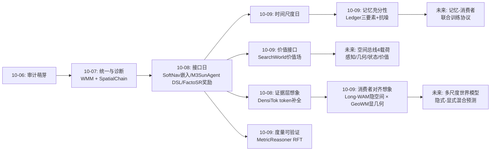
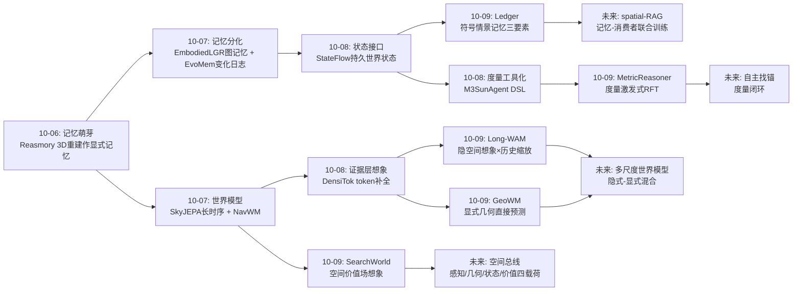
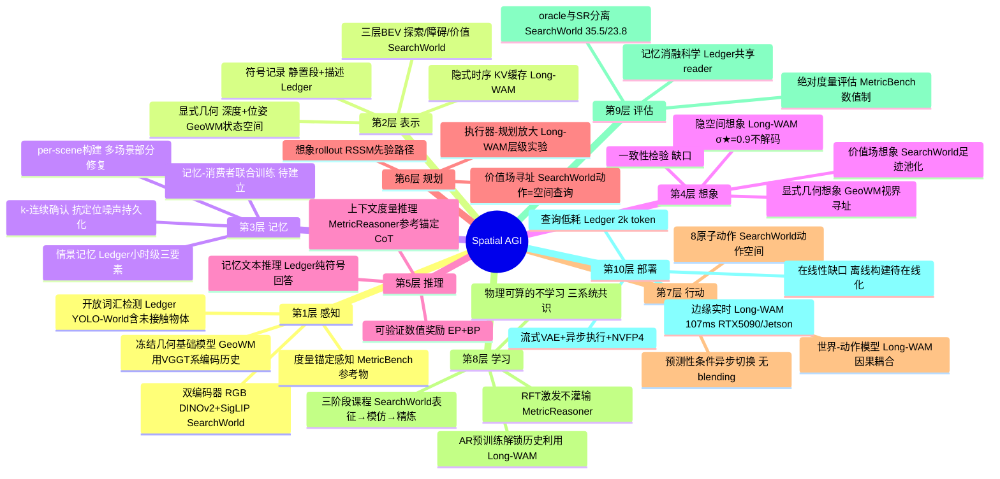
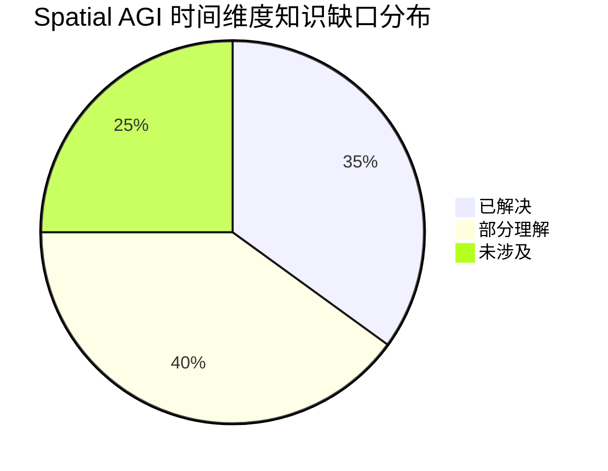

# Spatial AGI 每日深度思考 — 2026-10-09

**日期**: 2026-10-09
**基础日期**: 2026-10-08（昨日任务完整完成，5 篇论文 + 840 行思考）
**论文数量**: 5 篇
**主题**: 时间尺度日。如果说昨天五篇论文回答了"空间信息该以什么形态在模块间流动"（接口日），今天五篇论文则在回答一个更古老的问题：**空间智能如何对抗时间**。Long-WAM 在毫秒到十秒级用隐式时序 KV 缓存让历史变成可用的资源、在隐空间想象未来；GeoWM 在亚秒到秒级用显式几何直接预测未来场景、拒绝 rollout；SearchWorld 在百步级的探索中用 BEV 价值场把"未来哪里有价值"变成可查询的空间场；Ledger 在小时级用静置段符号记忆回答"东西在哪"；Metric-Bench 则守住了这一切的地基——米。五个工作横跨七个数量级的时间跨度，却收敛于同一组设计原则：**想象的层级要与消费任务对齐、记忆要按时间尺度分层、确定性的部分不要交给学习、价值必须拥有地址**。这是 Spatial AGI 认知栈第一次在"时间"这个维度上显式成形。

---

## 📅 每日总结

**日期**: 2026-10-09
**论文数量**: 5篇
**主题**: 时间尺度日。五篇论文分别驻守 Spatial AGI 认知栈的五个时间层级：Long-WAM（反应执行层，毫秒-秒）、GeoWM（几何预测层，亚秒-4秒）、SearchWorld（探索规划层，百步级）、Ledger（情景记忆层，小时级）、Metric-Bench（度量地基，无时间但支撑一切）。共同哲学：**预测的空间应与消费的任务同构；记忆按时间尺度分层；物理可算的不要学习；价值是场不是数**。

**关键突破**:
- 🚀 **"拥有历史 ≠ 利用历史"的科学证明（Long-WAM）**：系统扫描 0→38.4 秒上下文 × 三种预训练初始化，AR 预训练基础从长历史获益 +15.4 点（63.3%→78.7%），双向预训练基础零净收益。历史的价值由预训练目标解锁——这是对一切"给模型更多记忆"式设计的普适警示。配合流式 VAE + 异步执行 + NVFP4，107.4ms/动作块部署到边缘，动态堆叠 95%（π0.5 与 Fast-WAM 全军覆没）。
- 🚀 **显式几何作为世界模型的状态（GeoWM）**：像素、特征还是几何？GeoWM 用 206M 参数、单 GPU 数小时训练的视界条件化流匹配 transformer，直接预测未来深度+位姿，深度误差比数十亿级视频世界模型低 4–58%、推理时间 -98%，评估次数与视界无关、无 rollout 误差累积。"状态空间与任务同构"击败了规模。
- 🚀 **价值是一张地图不是一个数（SearchWorld）**：三层 BEV 记忆（探索/障碍/价值）+ RSSM 隐空间想象 + 解码的任务感知空间价值场，用足迹池化替代 actor-critic 的标量 critic。UAV-ON SR 19.5%→23.8%、oracle 35.5%。具身决策的本质是空间寻址，V(s) 丢弃的恰恰是决策最需要的位置信息。
- 🚀 **符号空间记忆的信息充分性（Ledger）**：位置 + 持久化确认的移动历史 + 上下文描述的三要素文本记忆，让 LM 不回放任何视频回答未预知的空间问题——HD-EPIC 29.7%→42.6%、VQ3D 定位 0.99m。~2k token 的符号记录打败 9.6k token 的 48 帧视觉输入。k-连续确认规则零成本解决"定位噪声被误读为移动"的普适难题。
- 🚀 **度量能力可以被激发而非灌输（Metric-Bench/MetricReasoner）**：参考度量锚定 + 可验证数值奖励的 RFT，让 VLM 无相机内参做绝对度量推理，超更大专有模型 43.1%，且通用能力不降反升（V* +15.9%、BLINK 88.9%）、具身下游大涨（RoboSpatial +30.4%）。空间能力注入与通用智能的百年好合首次有了实证。

**架构演进**: 10 层架构维持 10 层，但完成一次**时间维度的分层显式化**——(1) 认知栈第一次按时间尺度画出清晰断面：反应（KV 缓存）→ 想象（隐空间/几何空间预测）→ 规划（价值场）→ 回忆（符号情景记忆）；(2) 预测层出现"隐式-显式"双轨定型：Long-WAM 的 σ★=0.9 隐空间想象消费于动作，GeoWM 的显式几何预测消费于规划；(3) 记忆层获得信息充分性标准（Ledger 三要素）与抗噪协议（k-连续确认）；(4) 评估层补上度量推理这一可验证精确量的样板（Metric-Bench）；(5) 价值表征从标量升级为空间场（SearchWorld），与昨日的接口宣言衔接——价值场就是规划模块的空间接口。

### 📊 一句话总结

今天五篇论文共同签署了一份"空间时间架构宪章"：**在正确的时间尺度上、用与消费者同构的表示、想象和记忆空间**——动作消费隐式时序想象、规划消费显式几何与价值场、回忆消费符号记录、而这一切都站在米制的地基上。

### 🔗 延续性

**昨日→今日**: 昨日"接口日"确立了空间信息的模块间通信形态（连续、实体粒度、可验证、可执行）。今天是接口宣言的时间维度展开：SearchWorld 的解码价值场本质上是"规划接口"的具体化——把昨日"信息形态要匹配消费者"的原则应用到价值信息上（消费者是动作选择，所以价值必须是可寻址的空间场）；GeoWM 与 Long-WAM 则把昨日的"在正确的表示层传递信息"推进到"在正确的抽象层做预测"（动作消费隐空间、规划消费显几何）；Ledger 用 2k token 符号打败 9.6k token 帧，是昨日"文本是空间信息有损压缩"结论的重要限定与修正——**在记忆与回忆场景，聪明的符号化压缩胜过原始感知**；Metric-Bench 的可验证数值奖励则接续 FactoSR 的奖励工程路线，证明它同样适用于度量层。

**今日→明日**: 明日值得追踪——(1) Long-WAM 的隐式时序想象 × GeoWM 的显式几何预测：统一的多尺度世界模型（同一模型在隐空间做毫秒想象、在几何空间做秒级预测）；(2) Ledger 的符号记忆 × SearchWorld 的价值场：把"东西在哪"的符号记录解码为探索价值先验（记忆引导的搜索）；(3) Long-WAM 的"预训练目标解锁记忆价值"结论 × Ledger 的记忆系统：空间记忆系统是否也需要预测性预训练才能被有效利用；(4) MetricReasoner 的参考锚定 × M3SunAgent 的工具链：自主找锚（模型自己识别参考物并估计其度量）；(5) 昨日遗留的"空间总线标准"今天获得了第四种总线载荷——价值场，总线协议的雏形正在成形。

### 💡 本质思考：如何达成通用空间智能

#### 1. 核心能力的本质是什么？

今天五篇论文把这个问题推进到"时间"维度。**第一层：空间智能是多层时间尺度上的预测与记忆的分层架构**。Long-WAM 证明反应层的想象必须发生在隐空间且与动作耦合（107ms 内完成"想象→行动"）；GeoWM 证明规划层的想象应该发生在显式几何空间且可寻址（任意视界直接查询）；SearchWorld 证明探索层的想象是价值场的空间展开；Ledger 证明回忆层的记忆是符号化的事件序列。四层各有各的表示、各有各的消费者，**没有一种万能的空间表示能同时服务所有时间尺度**——这正是过去"统一空间表示"路线屡屡碰壁的深层原因。**第二层：记忆的价值由预训练目标解锁，这是一个警示性的对偶**。Long-WAM 的核心发现（AR 预训练基础从历史获益、双向基础不获益）有一个直接推论：Ledger 式的记忆系统如果不能被消费者的预训练目标所利用，记忆就是摆设。空间记忆研究文献几乎从不讨论"消费者模型是否被训练过使用记忆"——这可能是很多记忆系统增益有限的隐藏原因。**第三层：确定性与学习性的分工是空间智能的经济学**。GeoWM 的运动预测器只有几万参数（相机运动是刚体几何，可确定性外推），学习资源全部投给真正不确定的场景变化；SearchWorld 的探索/障碍层零学习组件，学习只负责价值推断；Ledger 的几何关联是确定性规则，学习只负责语义描述。三个系统不约而同地执行同一条原则：**物理可算的不学习、需要世界知识的才学习**。这是空间智能区别于纯语言智能的架构经济学——空间有几何这个"免费的老师"。**第四层：可验证性再次成为分水岭**。Metric-Bench 的数值奖励、GeoWM 的 LiDAR 可比预测、SearchWorld 的 oracle 评估、Ledger 的消融科学——今天的五篇论文全部建立在"空间量可验证"这个地基上。延续 FactoSR 的结论：空间是 RLVR（可验证奖励 RL）最肥沃的土壤。

#### 2. 当前方法与理想目标的差距在哪里？

**差距一：时间尺度之间的断层**。Long-WAM 的 19.2 秒隐式时序与 Ledger 的小时级符号记忆之间没有桥接——执行器不知道"钥匙在抽屉里"（Ledger），记忆系统不知道"手正在怎么动"（Long-WAM）。理想的空间智能体应该有跨越七个数量级的连续记忆谱系，当前每层都是孤岛。**差距二：预测的跨视界一致性**。GeoWM 的独立视界查询可能给出互相矛盾的未来几何（t+0.5s 与 t+1.0s 不构成一致轨迹）；SearchWorld 的想象 rollout 受限于 RSSM 的长程漂移；Long-WAM 的想象被压缩到 σ★=0.9 以至于无法审计。三个系统的"想象"都无法被一致性检验——理想状态要求想象输出构成物理一致的时空轨迹族。**差距三：不确定性仍是缺失的维度**。GeoWM 输出点估计（4 噪声平均）、SearchWorld 价值场无置信度、Ledger 文本记录无可靠性标注。可靠空间系统要求每个空间量携带分布并在推理中传播——延续昨日的判断，这仍是全领域最大的公共缺口。**差距四：度量推理的"找锚"问题**。Metric-Bench 的参考度量是题目给的 oracle；真实场景中智能体必须自己识别哪些物体可作锚、并从内部先验估计其度量。这一步没打通，度量推理仍是"半自动"。**差距五：在线性**。Ledger 是离线构建、GeoWM 的视界集合固定、SearchWorld 依赖仿真训练。真实智能体的记忆要边走边写、预测要按需伸缩、学习要在线继续——三个系统都还没面对真实时间的考验。

#### 3. 从今天到理想状态，最可能的路径是什么？

一条时间驱动的五段路径。**第一段（现在起）：多尺度想象的工程拼装**。用现成组件拼出跨越时间尺度的想象栈：Long-WAM 式 WAM 做反应执行（隐空间想象、10Hz）、GeoWM 式几何预言机做规划支撑（显式深度/点云预测、1Hz）、SearchWorld 式价值场做探索引导（0.1Hz）、Ledger 式符号记忆做任务回忆（按需）。这一步不需要新科学——四个系统今天都已存在，缺的是工程集成与层间接口定义。**第二段（并行）：记忆-消费者的联合训练协议**。把 Long-WAM 的科学发现工程化：记忆系统与消费者模型的预训练目标联合设计。具体地，给 WAM/策略模型的预训练加入"记忆读取"动作（可以从 Ledger 式外部记忆中查询），让"利用记忆"成为被预训练目标解锁的能力而非推理时的外挂。这是把"检索增强"从语言领域正式迁移到空间领域的关键实验。**第三段（6-12个月）：一致性与不确定性的内建**。GeoWM 的多视界查询加入跨视界一致性正则或联合预测；想象的输出携带置信度（Long-WAM 的想象可解码出低可信诊断图、GeoWM 输出深度分布而非点估计、SearchWorld 价值场叠加不确定性层）。判定标准：任何下游消费者可以问"这个预测你有多确定"。**第四段（并行）：自主找锚与度量的自我校准**。MetricReasoner + 参考.MetricReasoner 的参考锚定 × M3SunAgent 的工具编排：模型自主识别可锚定物体、调用工具或内部先验估计锚度量、再做目标推理；配合重新观测的主动验证，形成"估计→锚定→推理→验证"的度量闭环。**第五段（1-2年+）：时间连续的空间自我模型**。理想状态的判定标准更新为：一个系统在毫秒级用隐式想象驱动行动、在秒级用显式几何预测支撑规划、在分钟级用价值场引导探索、在小时级用符号记忆回答回忆、在跨天尺度上用变化检测更新世界模型——且每一层的输出都携带不确定性、每一层的记忆都能被被联合训练的消费者有效利用。五层贯通之日，空间智能才算真正"活在了时间里"。

---

## 🔗 与昨日思考的联系

### 昨日重点

昨日的"接口日"确立了四个结论：(1) **空间信息的模块间接口应原生连续、实体粒度、几何可验证、可执行**——文本只配做人机层（SoftNav 受控消融 + M3SunAgent DSL + FactoSR 奖励工程）；(2) **接口正确性可补偿训练缺失**——冻结大模型 + 正确接口 = 极限样本效率；(3) **状态持久性是创作与行动的共同前提**（StateFlow + EvoMem）；(4) **想象的正确层级是证据层**（DensiTok token 补全）。当日遗留的悬念：这些接口原则能否推广到时间维度——记忆、预测、规划这些"跨时间"的模块该用什么形态交谈？

### 今日进展

今天在昨日基础上完成三个推进：(1) **想象的接口原则获得时间维度版本**——昨日 DensiTok 证明"在证据层补全"，今天 Long-WAM（隐空间、σ★=0.9、不解码像素）与 GeoWM（显式几何、视界寻址、一步预测）给出完整光谱：想象的表示应由消费者决定，动作消费者要隐式流畅、规划消费者要显式可查。昨日"证据层想象"的直觉今天升级为"消费者对齐想象"的原则。(2) **价值信息获得自己的接口形态**——昨日接口宣言覆盖了感知（soft token）与几何（DSL 算子），今天 SearchWorld 补上了最后一种关键信息类型：价值。价值场 = 规划模块的空间接口，与昨日 soft token = 推理接口、DSL = 工具接口并列，"空间总线"的载荷清单基本齐全。(3) **可验证性原则延伸到度量层**——昨日 FactoSR 把物理定律写成奖励，今天 Metric-Bench 把度量精度写成奖励（EP+BP），可验证奖励的适用域从一致性扩展到度量学。

### 演进路径



---

## 📚 论文概览

**论文1: Long-WAM** — NVIDIA/MIT/HKU/UCSD。世界-动作模型的上下文缩放：LongLive2.0-Robot 在 ~10,000 窗口等效小时机器人+自我中心视频上做 AR 视频预训练，然后以"视频查询永不读动作 token"的非对称因果耦合适配动作专家；动作以"观测历史+预测到 σ★=0.9 的未来隐变量"的联合 KV 缓存为条件（IDM 模式）。核心科学发现：上下文缩放收益取决于预训练范式——AR 基础 0→19.2s 历史 +15.4 点，双向基础零收益。系统工程：流式 VAE、纯异步切换、NVFP4 量化，107.4ms/动作块部署 RTX 5090/DGX Spark/Jetson AGX Thor。RoboCasa GR-1 78.7%、LIBERO-Long 99.5%、RoboTwin 94.4%、动态堆叠 95%；层级系统 +GPT-6 Astra 31.4%→54.4%。

**论文2: GeoWM** — 华为诺亚方舟实验室（加拿大）。几何世界模型：冻结几何基础模型把 RGB 帧转为深度+位姿历史，几万参数的运动预测器外推未来视点，旧观测重投影为"几何锚"，206M 视界条件化流匹配 DiT 一步预测任意视界的未来深度（4 噪声平均，无 ODE、无 rollout）。四数据集（城市驾驶/空中飞行/动态操作）深度误差较 Cosmos-3/VGGT-World/DINO-Foresight 降低 4–58%，推理时间 -98%。视界作为输入经 adaLN 注入，评估成本与视界无关。

**论文3: Ledger (Never Look Back)** — DeepMind 系团队。持久 3D 物体记忆：从长时程 egocentric 视频离线构建，开放词汇检测（含未接触物体）+ 3D 提升 + 时间关联 + SAM 3 重识别 + 静置段组织（k-连续确认的持久化规则抗定位噪声）+ 段级上下文描述。查询时仅以 ~2k token 文本记忆回答（不回放视频）：HD-EPIC 29.7%→42.6%，UCS-Bench 超 DirectMe（46.3% vs 42.9%），Ego4D VQ3D 定位 0.99m。消融分离时间持久性/描述/检索的互补贡献；100 个拼接多场景流揭示构建与检索两类独立失效。

**论文4: SearchWorld** — 国防科大/中科院/清华/东南大学。UAV 空中目标搜索的世界模型：三层 BEV 显式空间认知记忆（探索层=折扣可见度累积、障碍层=高度阈值净空、价值层=从 RSSM 隐状态解码的任务感知价值场），认知-行动网络用解码价值场在想象 rollout 足迹上的池化替代标量 critic，三阶段课程（世界模型→专家模仿→价值引导精炼）。UAV-ON SR 23.8%（最强已发表 19.5%）、oracle 35.5%、未见场景 19.9%。

**论文5: Metric-Bench + MetricReasoner** — 浙大 CAD&CG/小米等。上下文度量推理基准：ScanNetV2 构建 1340 QA（五类空间量，ego 坐标系，无相机内参），给参考物体真实度量、求目标物体绝对度量，数值评估堵死选择题绕路。MetricReasoner：结构化 CoT prompt + 三重可验证奖励（格式 + 指数精度 + 分箱邻近）的 RFT，超更大专有模型 43.1%，RoboSpatial +30.4%、ERQA +9.3%，通用能力不降（V* +15.9%、BLINK 88.9%）。

---

## 💡 核心见解

### 见解1: 预测的表示应由消费者决定——想象有两条合法形态

**从 Long-WAM + GeoWM + DensiTok（昨日）联合获得**

- ✅ Long-WAM：动作消费者 → 隐空间想象（σ★=0.9、不解码像素、KV 复用），107ms 内完成"想象→行动"
- ✅ GeoWM：规划消费者 → 显式几何想象（深度+位姿、任意视界查询、LiDAR 可验证）
- ✅ 昨日 DensiTok：感知消费者 → token 层证据补全
- ✅ 三者共同否定"一种万能预测表示"：像素想象（Cosmos 式）对动作太贵、对规划又不够直接

**对Spatial AGI的启发**:

这是"接口宣言"（昨日）在预测问题上的重演：不是"哪种世界模型更强"，而是"想象结果以什么形态到达谁"。动作需要流畅与速度，所以隐空间；规划需要检查与对齐，所以显几何。可以预期未来的空间基础模型会内建多形态预测头——同一组时空先验，按请求的消费者输出隐 token 或显式几何。这与"多分辨率输出"的思路类似，但分层维度是抽象级别而非分辨率。

### 见解2: 记忆的价值由消费者的预训练目标解锁

**从 Long-WAM 获得**

- ✅ 系统对照：0→19.2s 历史，AR 预训练基础 +15.4 点、双向预训练基础零净收益
- ✅ 机制清晰：AR 预训练学到的因果时间分解（历史→未来）在动作适配中保留，历史才有用武之地
- ✅ 推论：给任何模型外挂记忆/长上下文之前，先问它的预训练目标是否教会它"从记忆预测未来"

**对Spatial AGI的启发**:

这对全领域的记忆系统研究是一个未被重视的混杂变量：Ledger、Reasmory、EmbodiedLGR 等记忆系统的增益都隐含依赖"消费者 LM 恰好能利用文本记忆"。理想的空间记忆协议应该是联合训练协议——记忆系统与消费者共同预训练（消费者学习"读取记忆"这个动作本身）。语言领域 retrieval-augmented 的经验值得正式迁移：RAG 的成功一半归功于检索器-生成器的联合优化。空间版的 RAG（spatial-RAG）今天还不存在，这是明确的空白。

### 见解3: 价值是一张地图不是一个数——空间场是规划的合法接口

**从 SearchWorld 获得**

- ✅ 标量 critic 在稀疏奖励下从噪声自举；解码的空间价值场用"价值在哪里"替代"价值有多少"
- ✅ 足迹池化：动作效用 = 价值场在想象轨迹覆盖上的积分——"走这条路值不值"变成对场的查询
- ✅ 训练期目标位置监督价值场、推理期不给坐标——模型学会泛化的目标位置推断

**对Spatial AGI的启发**:

具身决策的本质是空间寻址，任何压缩成标量的评估信息都丢掉了决策最需要的维度。这个原则可推广到 Spatial AGI 的一切评估场景：VLM 说"目标可能在前面"不如让它输出空间热度图；grounding 输出框不如输出分布。SearchWorld 与昨日 soft token 接口（SoftNav）合起来，"空间总线"的两种关键载荷——实体嵌入与价值场——都已有了工程形态。

### 见解4: 符号化空间记忆可以极度过载地高效——2k token 打败 48 帧

**从 Ledger 获得**

- ✅ ~2.0k token 文本记忆支撑超越 9.6k token（48 帧）视觉输入的空间问答
- ✅ 三要素充分性：位置（几何）+ 静置段历史（时间）+ 上下文描述（语义），消融证明互补缺一不可
- ✅ k-连续确认的持久化规则：零训练成本解决"定位噪声被误读为移动"的普适问题

**对Spatial AGI的启发**:

昨日结论"文本是空间信息的有损压缩"需要重要限定：**在感知-推理的实时通路上文本有损，在记忆-回忆的离线通路上聪明的符号化反而超高效**。关键差异在时间预算：实时通路没有时间把感知压缩成完美符号，回忆场景有充足的离线时间做高质量压缩（多视角精化、VLM 描述、冲突消解）。Spatial AGI 应该明确区分这两条通路的信息形态规范，而不是笼统争论"文本 vs 像素"。

### 见解5: 确定性与学习性的分工是空间架构的经济学

**从 GeoWM + SearchWorld + Ledger 获得**

- ✅ GeoWM：相机运动用几万参数回归器确定性外推，学习资源（206M）全部投给场景变化的残差
- ✅ SearchWorld：探索/障碍层纯几何构造零学习，学习只负责价值推断
- ✅ Ledger：几何关联是确定性规则，学习只负责语义描述与重识别

**对Spatial AGI的启发**:

空间领域独有几何这个"免费的老师"：凡是从传感器几何可确定性推出的（去过哪、哪有障碍、旧观测在新视点长什么样），都不该消耗学习容量。这条经济学原则与昨日的"物理定律奖励"（FactoSR）同根——几何既是免费的老师（训练信号）也是免费的工程师（架构先验）。反向的教训同样成立：需要世界知识的部分（目标在哪、物体是什么）不要试图用几何规则硬编码——SearchWorld 的价值层交给学习是对的。

### 见解6: 度量推理可以被激发而非灌输——且不牺牲通用性

**从 Metric-Bench/MetricReasoner 获得**

- ✅ 无相机内参、无 3D 模块，参考度量锚定 + 可验证数值奖励的 RFT 解锁 VLM 内在 2D-3D 映射
- ✅ 超更大专有模型 43.1%；通用能力不降反升（V* +15.9%、BLINK 88.9%）
- ✅ 具身下游立涨（RoboSpatial +30.4%、ERQA +9.3%）——度量是具身智能的有效杠杆

**对Spatial AGI的启发**:

"空间专门化 = 灾难性遗忘"的行业恐惧被正面证伪，关键在奖励作用于推理结构而非逼近像素回归。这与昨日 M3SunAgent 的"外挂工具"路线形成战略对照：短期外挂准（工具精度即上限）、长期激发更可扩展（能力内化后无推理延迟与工具依赖）。合理的路线图是先外挂（快速达到可用）后激发（RFT 内化），两条路线的交接时机是明确的实验问题。

### 见解7: rollout 不是时序预测的唯一形态——"寻址式预测"值得一等公民地位

**从 GeoWM + Long-WAM 获得**

- ✅ GeoWM：视界作为输入，任意未来时刻独立查询，评估次数与视界无关，无误差累积
- ✅ Long-WAM：想象只到 σ★=0.9，未来隐变量不解码——"预测到什么程度"本身是可调的设计参数
- ✅ 两者共同把时序预测从"一步步走"解放为"按需取"

**对Spatial AGI的启发**:

自回归 rollout 的误差累积与成本增长是所有序列世界模型的达摩克利斯之剑。空间预测由于物理的平滑性（相机运动可外推、场景缓变），天然适合"锚定 + 残差"或"视界寻址"的非序列形态。可以预期空间世界模型设计会分化为"序列派"（需要连贯轨迹时：视频生成、长时程想象）与"寻址派"（需要特定时刻估计时：规划支撑、碰撞检查），任务性质决定流派。

### 见解8: 多场景空间记忆的失效是双重的——构建与检索要分开诊断

**从 Ledger 获得**

- ✅ 100 个拼接多场景流：场景切换同时暴露构建失败（观测写入错误）与检索失败（相关记录没被找到）
- ✅ per-scene 独立构建可部分恢复损失——统一世界坐标系不是多场景记忆的必要条件
- ✅ 更贵的迭代检索不总是更好——检索策略应与任务匹配

**对Spatial AGI的启发**:

记忆系统论文通常只报告端到端增益，Ledger 的"共享 reader 对照"方法学（同一读者读不同表征、同一表征配不同检索）是把表征价值与检索质量解耦评估的干净设计。这个方法学应该成为空间记忆研究的标配。多场景/多天记忆不必执着于全局坐标系统一——" per-scene 记忆 + 场景间拓扑索引"可能是更务实的中期形态。

### 见解9: 层级系统中执行器的质量放大规划的价值

**从 Long-WAM 获得**

- ✅ 同一规划器（GPT-6 Astra）：配 Long-WAM +23.0 点、配 π0.5 +13.6 点
- ✅ 纯规划器 25.2% vs 执行器单独 31.4% vs 组合 54.4%

**对Spatial AGI的启发**:

Spatial AGI 的分层叙事（LLM 规划 + 低层执行）常隐含"规划是瓶颈"的假设，Long-WAM 的数据说明相反：执行器不够强时，规划的价值被浪费。这对资源分配有直接指导意义——在执行层达到"可靠反应"之前，堆砌更强的规划器是低效的。空间智能体的能力曲线是非线性的：各层匹配时互相放大，失配时互相浪费。

---

## 🗺️ 知识演进图



---

## 技术栈演进对比表

| 层次 | 昨日方案 | 今日方案 | 变化 |
|------|---------|---------|------|
| 反应执行层 | FactoSR 优化空间 VLM、π0.5 类策略 | Long-WAM：AR 预训练 WAM + 19.2s 历史 + 隐空间想象 | 反应层出现"历史即资源"的系统证明与边缘部署 |
| 几何预测层 | Cosmos-3 视频生成 + 事后重建、VGGT-World 隐空间解码 | GeoWM：显式几何直接预测 + 视界寻址 + 几何锚 | 预测状态从像素/特征升级为几何本身，rollout 被绕开 |
| 探索规划层 | APEX/PRPSearcher 反应式地图查询（VLM 打分） | SearchWorld：三层 BEV 记忆 + 价值场解码 + 想象足迹池化 | 价值从标量 critic 升级为空间场，反应式探索升级为前瞻想象 |
| 情景记忆层 | EvoMem 变化日志、StateFlow 显式状态、Reasmory 重建记忆 | Ledger：位置+静置段历史+描述的三要素符号记忆 + 持久化抗噪 | 记忆获得信息充分性标准与"零感知依赖查询"的严格测试 |
| 度量地基层 | M3SunAgent 外挂工具链（DSL + 深度估计器） | MetricReasoner：参考锚定 CoT + EP/BP 可验证奖励 RFT | 度量能力从外挂转向激发，且实证不牺牲通用性 |
| 价值表征 | 启发式地图打分 / actor-critic 标量 V(s) | SearchWorld 解码的 BEV 价值场 | "价值拥有地址"成为规划接口的显式形态 |
| 记忆抗噪 | 无系统方案（定位噪声污染记忆） | Ledger k-连续确认持久化规则 | 零成本协议级解法，可成为默认组件 |
| 预训练-记忆关系 | 记忆系统与消费者独立设计 | Long-WAM 证明预训练范式解锁记忆收益 | "记忆-消费者联合训练"成为新研究议程 |
| 评估方法论 | 选择题/相对比较基准 | Metric-Bench 绝对数值 + Ledger 共享 reader 消融 | 空间评估向"可验证精确量 + 解耦归因"演进 |

---

## 🗺️ Spatial AGI 知识图谱

### 10层架构思维导图



### 🎯 主线技术路径

#### 阶段1: 单点能力爆发（已发生：2024-2026）
各时间层级独立诞生可用系统：WAM 类反应执行（Long-WAM）、几何预言机（GeoWM/VGGT 系）、探索世界模型（SearchWorld/NavMorph 系）、空间情景记忆（Ledger/Reasmory 系）、度量推理（MetricReasoner/M3SunAgent）。每个单点都有惊艳的局部指标，但层与层之间是孤岛。

#### 阶段2: 层间接口定义（现在进行）
四种空间接口载荷陆续成形：感知-推理的实体嵌入（SoftNav）、推理-工具的 DSL 程序（M3SunAgent）、规划-行动的价值场（SearchWorld）、记忆-回忆的符号记录（Ledger）。当前任务是为每种载荷定义带不确定性元数据的标准格式——空间总线的协议草案。

#### 阶段3: 多尺度集成系统（6-12个月）
把四个时间层级的系统拼装为连贯的认知栈：Long-WAM 级反应（10Hz）→ GeoWM 级几何预测（1Hz）→ SearchWorld 级价值探索（0.1Hz）→ Ledger 级符号回忆（按需）。关键工程问题：层间缓存与增量更新、预测置信度的跨层传播、记忆的在线写入。判据：一个机器人能"一边流畅动手、一边知道未来几何、一边决定去哪找、一边记得东西在哪"。

#### 阶段4: 联合训练与共同进化（1-2年）
从工程拼装走向联合优化：记忆系统与消费者的联合预训练（spatial-RAG）、多尺度世界模型的统一训练（隐式-显式混合头）、度量能力的持续自我校准（自主找锚 + 主动验证）、物理定律奖励库的系统性扩展。判据：集成系统的指标超过各层独立最优之和——层级间出现真正的协同放大。

---

## 🔍 待探索议题

### 高优先级（本周）

1. **记忆-消费者联合预训练（spatial-RAG）**
   - 问题: Long-WAM 证明预训练目标解锁记忆利用；Ledger 式记忆系统的消费者 LM 从未为此预训练过，增益被低估了多少？
   - 候选方案: 给 WAM/策略预训练加"记忆查询 token"，记忆内容混入预训练序列；或仿 RAG 的检索器-生成器联合优化
   - 缺口: 没有任何空间记忆工作做过消费者联合训练对照

2. **想象的跨视界一致性**
   - 问题: GeoWM 独立查询 t+0.5s 与 t+1.0s 可能给出矛盾几何；规划器需要一致的时空轨迹族
   - 候选方案: 多视界联合预测头、跨视界一致性正则、以短视界预测为锚的级联查询
   - 缺口: 无一致性度量的基准；"预测轨迹族"的评估协议缺失

3. **度量推理的自主找锚**
   - 问题: Metric-Bench 的参考度量是 oracle 给的；真实场景要自己识别可锚物体并估计其度量
   - 候选方案: MetricReasoner + M3SunAgent 工具链：模型提议锚→工具/先验估度量→推理→重观测验证
   - 缺口: 锚可靠性的自我评估；锚估计误差向下游的传播分析

### 中优先级（本月）

4. **Ledger 的在线化**
   - 问题: 离线构建→在线助手需要边走边写；持久化规则要因果化（只见过去）、SAM 3 全视频重识别不可用
   - 候选方案: 流式静置段更新、在线短时重识别（局部轨迹片段）、置信度加权的延迟确认
   - 缺口: 在线构建的误差累积量化；在线-离线增益差对照

5. **价值场的语义来源升级**
   - 问题: SearchWorld 价值推断依赖 SigLIP 共同嵌入，细粒度实例辨识（"那辆黑色 SUV"）上限被编码器锁死
   - 候选方案: 用更强 grounding VLM 替换嵌入对、价值场叠加实例级语义证据图、与 Ledger 记忆联动（历史位置作为价值先验）
   - 缺口: 价值场的细粒度归因分析（模型到底在看什么推断价值）

6. **多尺度世界模型的统一训练**
   - 问题: Long-WAM 隐空间想象与 GeoWM 显式几何预测分属两套模型，维护成本与信息不同步
   - 候选方案: 单一 AR 骨干 + 多形态预测头（隐 token 头供动作、几何头供规划）；或几何预测作为隐空间想象的辅助监督
   - 缺口: 两种预测的共享先验有多少（可用探针实验量化）

7. **想象输出的不确定性标注**
   - 问题: 三套想象系统（Long-WAM/GeoWM/SearchWorld）都输出点估计/确定性场，下游无法区分"测到的"与"猜的"
   - 候选方案: 噪声方差外推（GeoWM 已有 4 噪声平均的基础）、想象与观测重叠区的分歧度、价值场的 ensemble 方差
   - 缺口: 不确定性传播到决策层的端到端评估

### 低优先级（本季度）

8. **记忆引导的探索（Ledger × SearchWorld）**
   - 问题: SearchWorld 的价值推断每次从零开始；Ledger 的历史位置记录是天然的探索先验
   - 候选方案: 把历史物体位置先验注入价值场初始化；"上次在这见过类似物体"的记忆条件化想象
   - 缺口: 跨任务记忆迁移的有效性验证

9. **动态语义想象的补全**
   - 问题: GeoWM 知道静态怎么变但不知道行人会过马路（无动力学语义）；Long-WAM 有动力学但想象不可审计
   - 候选方案: GeoWM 锚定骨架 + 学习动力学残差的双流预测；动态物体检测触发轨迹外推模块
   - 缺口: 静态-动态分解的监督来源；动态残差的真实性评估

10. **空间总线的第四载荷：价值场的标准化**
    - 问题: SearchWorld 的价值场绑定私有 BEV 网格；规划器消费者没有通用价值接口
    - 候选方案: 参照 soft token（SoftNav）的标准化路径，定义价值场的分辨率/坐标系/不确定性元数据规范
    - 缺口: 跨任务价值语义的可比性（导航价值与操作价值是否同一量纲）

---

## 📊 知识缺口分析



**已解决（35%）**:
- ✅ 各时间层级的单点系统：反应执行（Long-WAM 107ms 边缘部署）、几何预测（GeoWM 视界寻址）、探索想象（SearchWorld 价值场）、情景记忆（Ledger 三要素）
- ✅ 历史利用的解锁条件：AR 预训练范式（Long-WAM 系统对照）
- ✅ 符号空间记忆的信息充分性配方：位置+历史+描述、k-连续抗噪（Ledger）
- ✅ 度量推理的激发式训练：参考锚定 + 可验证奖励、不牺牲通用性（MetricReasoner）
- ✅ 确定性-学习性分工原则：三个系统独立收敛于同一架构经济学

**部分理解（40%）**:
- ⚠️ 记忆与消费者的联合训练：解锁条件已证（Long-WAM），但记忆系统从未据此设计（spatial-RAG 空白）
- ⚠️ 想象的表示选择：消费者对齐原则成立，但隐式-显式混合头、跨视界一致性未解决
- ⚠️ 多场景/多天记忆：per-scene 部分修复已知，统一协议与在线化未解决（Ledger 分析性结论）
- ⚠️ 价值场的语义能力：框架成立（SearchWorld），细粒度实例辨识与记忆联动缺失
- ⚠️ 度量推理的完整性：给定锚会推理（Metric-Bench），自主找锚未检验
- ⚠️ 预测的不确定性：方法学基础存在（噪声平均/ensemble），端到端传播与决策融合空白

**未涉及（25%）**:
- ❌ 跨七个数量级时间尺度的连续记忆谱系：毫秒级 KV 与小时级符号记忆之间没有桥接层
- ❌ 想象的一致性审计：无法检验三套系统的想象输出是否构成物理一致的时空轨迹
- ❌ 在线空间学习的闭环：真实部署中的记忆在线写入、预测按需伸缩、持续适应均未验证
- ❌ 真实世界大规模验证：SearchWorld 停留仿真、Ledger 依赖提供位姿、Metric-Bench 限于 ScanNet 室内
- ❌ 空间总线的协议化：四种载荷（嵌入/程序/状态/价值）各有形态但无统一标准与不确定性元数据

---

## 🔮 趋势观察

**升温信号**:
- "消费者对齐"取代"通用表示"：Long-WAM/GeoWM/SearchWorld 三线独立遵循"预测表示匹配消费者"原则
- "价值空间化"萌芽：标量 critic → 空间价值场（SearchWorld），预期蔓延到 VLM 空间推理输出
- "激发式空间训练"升温：RFT + 可验证数值奖励（MetricReasoner）与外挂工具路线（M3SunAgent）并行竞争
- 时间尺度显式化：世界模型论文开始报告上下文时长扫描（Long-WAM）与视界集合（GeoWM）

**降温信号**:
- "一步到位的统一空间表示"叙事降温：七个数量级的时间跨度让单一表示不可行
- 自回归 rollout 作为默认时序机制的地位动摇：寻址式预测（GeoWM）给出无累积误差的替代
- 纯像素空间世界模型在几何消费任务上的性价比被证伪（GeoWM -98% 时间）

**值得注意的作者/团队动向**:
- NVIDIA（Jim Fan/Song Han 系）押注 WAM 实时化：LongLive → Long-WAM，视频基础模型 × 机器人控制的组织能力罕见
- 华为诺亚走"轻量精确"路线：GeoWM 206M 单 GPU 数小时，与大力出奇迹形成对照
- 浙大 CAD&CG + 小米组合关注"VLM 原生空间能力"：度量推理是第一个样板
- DeepMind 系持续深耕空间记忆科学化：Ledger 的消融方法学比系统本身更有长期价值

---

## 🎓 方法论收获（可复用的思维工具）

1. **预训练范式消融法**（Long-WAM）：研究"上下文/记忆是否有用"时，必须交叉预训练范式——脱离预训练目标的记忆结论不可信
2. **消费者对齐法**（Long-WAM/GeoWM）：为预测选择表示时，先列出消费者（动作/规划/渲染），表示与最近消费者同构
3. **物理锚定法**（GeoWM 几何锚）：预测问题先算确定性部分（刚体外推/重投影），生成模型只负责残差
4. **视界寻址法**（GeoWM）：时序预测需要"特定时刻估计"时，把时刻作为输入而非迭代步数
5. **k-连续确认法**（Ledger）：状态更新需要重复证据才执行——零成本对抗噪声的通用协议
6. **信息充分性测试**（Ledger）：断开感知只给记忆，度量表征本身的价值
7. **共享 reader 对照**（Ledger）：解耦表征价值与检索质量的标准实验设计
8. **足迹池化法**（SearchWorld）：动作评估 = 值场在动作后果覆盖区域上的积分
9. **确定性层下沉法**（SearchWorld/GeoWM/Ledger）：传感器几何能算的都移出学习路径
10. **可验证数值奖励组合**（MetricReasoner）：连续指数奖励（精度梯度）+ 分箱奖励（容错台阶）的组合范式

---

## ❓ 自问自答（深度追问）

**Q1: Long-WAM 的"AR 解锁历史"结论会不会依赖其特定架构（非对称因果耦合）？**
部分依赖。非对称耦合是收益转移的结构通道，但核心变量是预训练目标（历史→未来的因果分解）。其他架构（如 soft prompt 式历史注入、检索式记忆）只要消费者被训练过"从历史预测"，应能获得部分收益。但收益大小与通道保真度相关——这恰是"记忆-消费者联合训练"议题要量化的。

**Q2: GeoWM 的独立视界查询真的能用于规划吗？矛盾的未来几何会不会让规划器崩溃？**
短期可用（近短视界的矛盾很小），长期存疑。规划器做碰撞检查时通常只需单一视界的保守估计，独立查询够用；但轨迹优化需要动力学一致的预测序列，独立查询的矛盾会被优化器放大。跨视界一致性是该路线从"预言机"升级为"轨迹预测器"的必经之路。

**Q3: Ledger 的符号记忆会不会在动态环境（共享空间、其他 agent 移动物体）失效？**
会。Ledger 的隐含假设是"世界只在佩戴者不在时基本不变"或"变化由佩戴者目击"。第三方移动物体、物体的自然状态变化（食物变质）都不在更新协议里。需要"主动验证"（路过时低成本复核高价值记忆）与"过期机制"（记忆携带时效与置信衰减）。记忆的更新协议比构建协议更难，这是 Ledger 类系统的下一个主战场。

**Q4: SearchWorld 的价值场在真实城市（仿真外）的泛化路径是什么？**
三步走：先在更大规模仿真中验证目标分布外推（未见类别/未见城市布局）；再以真实航拍/街景数据做价值层的域适应（目标位置先验有真实统计可学）；最后处理 sim-to-real 的感知退化（DINOv2/SigLIP 对真实 UAV 图像的鲁棒性尚可，障碍层依赖的深度质量是主要风险）。oracle 35.5% 的天花板也提醒：覆盖策略（去哪看）与价值推断同样重要，当前瓶颈可能一半在感知覆盖。

**Q5: MetricReasoner 的 CoT 是真几何推理还是精巧的插值启发式？**
未知，且论文未审计。可设计反事实检验：打乱参考度量看答案是否合理漂移、删除部分参考看推理链是否中断、比较 CoT 中引用的透视论断与真实几何。若通过，则"激发"的叙事成立；若失败，则是更高级的分布内插值——泛化上限受限。这个审计对"激发 vs 外挂"路线之争是决定性证据。

**Q6: 五个时间层级之间最该先打通哪一层？**
记忆↔回忆（Ledger × 消费者联合训练）优先级最高：它有最明确的科学问题（Long-WAM 结论的直接推广）、最便宜的实验（现有记忆系统 + RFT/微调消费者）、最大的潜在增益（记忆系统普遍增益有限可能正源于此）。想象层整合（Long-WAM × GeoWM）其次，工程量更大但确定性收益。

---

## 📖 论文深度笔记（逐篇技术细节）

### 论文1: Long-WAM — 技术细节深潜

**预训练配方（LongLive2.0-Robot）**
- 初始化：LongLive-2.0 的 16 秒 AR checkpoint（通用视频基础模型）
- 继续训练数据：RoVid-X、AgiBot World、EgoDex、EgoVerse、VITRA，约 10,000 窗口等效小时
- 序列长度：最长 30 秒（超出大部分机器人视频预训练的 2-4 秒窗口一个数量级）
- 训练技术：序列并行 AR（长序列分片多 GPU）+ 块因果注意力 teacher forcing + error recycling（源自 SVI，训练时模拟 rollout 误差教模型纠错）
- 监督形态：纯视频、无动作标签——因此可跨具身形态混合数据

**因果耦合的非对称接口**
- 视频查询：只读自己及更早的视觉块，永不读动作 token——保护预训练因果依赖
- 动作查询：读观测历史 + 部分去噪未来 + 完整含噪动作块
- 训练两 pass：视频流匹配（条件=干净历史）→ 动作流匹配（条件=历史+前向加噪真值未来，视觉缓存 detach）
- 损失：L = λ_v·L_video + λ_a·L_action，双分支均为 noise-minus-data 速度预测

**IDM（predict-then-act）推理协议**
- Z̃⁺ = Rollout_θ,σ★(ε|Z⁻,c,q)，σ★=0.9：预测只到高噪声水平，从不解码像素
- K_t = Prefill_θ(Z⁻, Z̃⁺; c, q, σ★)：分层 KV 缓存，跨动作去噪步复用
- Â_t = Denoise_ψ(εᵃ|K_t,c,q)：动作专家 4 步/专家去噪
- 视频 4 步（V4）+ 动作 4 步 = 每决策的全部生成计算

**系统工程五件套**
1. 流式 VAE：观测块边到边编码，满足交接 deadline T_ready ≤ OΔt
2. 纯异步切换：无 blending、无 prefix guidance，靠预测性条件保证连续性
3. 决策时 prefill：观测编码挪到执行期间，触发后只剩 prefill+去噪
4. 调用内 KV 复用：视觉 KV 跨动作去噪步共享
5. NVFP4 量化 + 设备特定核调优：RTX 5090 107.4ms/块（BF16 eager 的 1/3.3）

**上下文缩放实验设计的关键细节**
- 每个 window 单独训练模型、在其训练长度评估——测的是"训练时见过多长历史"的收益
- 保持视觉预测范围与动作视野固定——干净地隔离"历史长度"这一个变量
- 缺失早期历史用首帧重复填充
- 三种初始化交叉：Wan2.2（双向）/ LongLive-2.0（通用 AR）/ LongLive2.0-Robot（机器人域 AR）
- 结果：AR vs 双向的差距随历史长度单调扩大（3.3 → 17.1 点）——两条曲线的喇叭口就是论文的核心图

**失败模式与边界**
- 想象不可审计：σ★=0.9 的隐变量无法解码检查，错误想象静默传播到动作
- 每 window 一个模型：上下文长度是训练时超参数，非运行时资源
- 长视界想象与长历史的联合缩放未探索
- 动态任务优势的来源（历史→速度推断）未做机制级归因

### 论文2: GeoWM — 技术细节深潜

**为什么预测深度而非点图**
给定相机后像素已确定视线，每像素唯一自由量是深度；点图 = 深度 ⊗ 位姿，预测深度+位姿即完全确定几何。这是表示论上的最小参数化。

**相机运动预测器的极简设计**
- 输入：K-1=4 个相对运动（旋转向量 + 归一化平移特征）
- 旋转：岭回归（闭式解级别的方法）；平移：小型回归器
- 总参数：数万——却能一次性外推所有视界的位姿
- 启示：短时相机运动是低维平滑流形上的量，不值得深度网络

**几何锚的物理含义**
A_h = W(D_t, T̂_{t→t+h})：把最后观测深度图前向投影到预测的未来视点。它的语义是"从你将要到达的位置回望现在"——静态结构在未来的估计。网络以它为条件，学会修正：观测深度误差、运动预测误差、场景动态、新暴露区域。预测问题被重构为"带物理先验的修正问题"。

**网络细节**
- DiT：14 层 pre-norm，宽度 896，256×256 深度图，16×16 patch → 256 token
- 条件：K+1=6 通道（5 历史深度 + 1 锚）通道维拼接；horizon 与 flow time 经正弦嵌入 → adaLN-zero 注入每层
- 损失：flow matching + 干净目标预测 + 速度空间加权 L1；w_p ∝ m_p/max(D,d_min)（逆深度，对齐相对误差）
- 流时间 logit-normal（u~N(-0.8, 0.8²)）+ 固定比例 τ=0 样本（显式训练纯噪声态）
- 推理：τ=0 一步 + N=4 独立噪声平均，无 ODE 积分——每个视界固定 4 次前向

**评估设计**
- KITTI：138 训练/13 验证驾驶，3,257 窗口，stride 2，20 个视界 0.2–4.1s
- 三族指标：未来深度、未来相机位姿、未来 3D 点云
- 基线：Cosmos-3（视频）、VGGT-World（几何特征隐空间）、DINO-Foresight（语义特征）
- 结果：深度误差 -4~58%（短视界）、-7~48%（长视界），推理时间约 -98%，四数据集点云精度全优

**边界条件**
- K=5 帧 ≈ 0.4–0.6s 历史：无法捕获长时序动态规律
- 锚假设静态可外推：突变动态（行人横穿）的预测能力存疑
- 冻结骨干的域外深度质量直接锁死上限
- 独立查询无跨视界一致性保证；输出点估计无不确定性

### 论文3: Ledger — 技术细节深潜

**数据结构**
- 实例 j：标签 c_j + 时间戳观测 O_j = {(t_i, b_i, x_i)}
- 静置段 S_j = {(t_s^start, t_s^end, μ_s, d_s)}：段=同一静置位置的观测集合，μ_s=段位置，d_s=段描述
- 持久化规则：连续 k 次观测距当前静置位置 > τ 才开新段；期间回到半径内仍归当前段
- 相机轨迹保留（服务自我中心问题）；不相关场景不注册统一坐标系；位姿有尺度则坐标为度量

**构建流水线的组件链**
1. Qwen3.5-9B 命名物体 → 同义词合并 → YOLO-World 开放词汇检测（含未接触物体）
2. WildDet3D：框+标签 → 相机系 3D 框；位姿变换到场景系
3. 时间关联：标签+距离匹配；同帧检测分离（除非重叠重复）
4. 第二遍重识别：SAM 3 视频跟踪传播 mask，mask 一致 + 共现 + 3D 距离检查后合并碎片
5. 段级描述：Qwen3.5-9B 从物体轮廓帧生成（内容物/支撑面/交互）
6. 多视角三角化：视点分离良好且稳定时精化静置位置

**查询协议**
- 接地：HD-EPIC 框查询 → 最近时间戳采样帧上的 3D 点；±6s 内最近 4 实例纳入检索
- 回答：GPT-5.4（无 thinking）仅读记录文本——图像全程隔离
- 成本：~2.0k token/问题（48 帧方案为 9.6k）

**实验矩阵**
- HD-EPIC：2400 题（3D Perception + Object Motion），29.7% → 42.6%
- UCS-Bench：2771 个 timestamped 问题，48 帧 reader 下 46.3% vs DirectMe graph 42.9%
- Ego4D VQ3D：命名物体定位，中位误差 0.99m（返回预测的查询上）
- 累积分析：录制长度扫描（增益保持至 75 分钟）+ 100 对拼接流（场景切换双重失效，per-scene 构建部分修复）
- 消融：时间持久性 / 上下文描述 / 检索三者互补；迭代检索非普遍更优

**已知短板清单**
- 离线构建；大幅移动→身份分裂；短暂移动漏记；文本描述瓶颈；跨场景无统一坐标；无主动验证与遗忘；多模型误差链

### 论文4: SearchWorld — 技术细节深潜

**三层 BEV 的数学**
- 探索层：M_expl(c) = max_{τ≤t}[(1-d_τ/ρ)·cos(πΔθ_τ/φ)]·1[范围内]——时间 max 持久覆盖，距离/方位角衰减加权可靠性
- 障碍层：深度反投影→位姿变换→正交投影→格子内点超高度阈值 z_obs 则障碍——垂直净空检验（飞行避撞的正确量）而非占据
- 价值层：V̂_t^sp = D_V(h_t, z_t, e_ℓ)——任务条件化的效用信念场；监督训练期来自目标真值信号（叠加探索/障碍掩码），推理期零目标信息

**认知-行动网络的信号流**
RSSM 隐状态 → 解码空间价值层 → 想象动作足迹池化 → 价值引导动作分布
- 与 Dreamer 的根本差异：不做想象 return 回归的标量 critic——稀疏奖励下 critic 自举失败被结构性绕开
- 价值引导只触碰移动动作；stop 保留模仿行为（防止价值信号污染停止判断）

**三阶段课程**
1. 世界模型学习：学状态转移与空间表征（RSSM 标准 ELBO 族）
2. 专家模仿：cognition-action 网络学任务策略
3. 价值引导精炼：想象 rollout + 价值池化，只精炼移动动作

**编码器配置**
- RGB：冻结 DINOv2 ViT（空间几何）+ 冻结 SigLIP 图像塔（语言对齐）双流
- 指令：同一 SigLIP 文本塔——图文同嵌入空间是"哪种视觉证据与目标相关"可学习的前提
- BEV 记忆（探索+障碍）：BEV 编码器第三流

**结果**
- UAV-ON：SR 23.8%（最强已发表 19.5%）、OSR 35.5%、未见场景 19.9%
- 动作空间：8 个离散原子动作（benchmark 接口固定，含 stop）

### 论文5: Metric-Bench/MetricReasoner — 技术细节深潜

**基准构建三步**
1. 过滤：Laplacian 方差去运动模糊；内参投影 3D 框保留视野内物体
2. 查询生成：ego 坐标系度量真值 → 模板实例化；每图 ≥4 不同类别实例；三类模板（size-to-size / 位置距离 / 混合）
3. 核验：VLM 自动检查 + 人工复核，去除不可见/重复/歧义
- 划分：5K 训练（1340 图）+ 1340 测试（134 图），场景不重叠防泄漏
- 坐标约定：世界系 → 相机系（用提供位姿）——与人类感知过程对齐，透视感知成为推理必要环节

**奖励设计的三层结构**
- R_format：`<thinking>...</thinking><answer>...</answer>` 结构合规（0/1）
- R_EP = e^(-|ŷ-y|)：连续指数精度——大误差指数级惩罚，提供平滑梯度
- R_BP：分箱容错——<0.25m→1；0.25-0.5m→0.05；0.5-1m→0.01；更大→0。提供"接近就值得奖励"的粗台阶
- 总奖励相加：同时奖励格式、精确与接近

**结果全景**
- 超更大专有模型 43.1%（度量精度）
- 下游：RoboSpatial +30.4%、ERQA +9.3%（对比空间专门对照模型）
- 通用：V* Bench +15.9%、BLINK 88.9%——遗忘恐惧被证伪

**审计空白（自加）**
- 奖励盲区：CoT 内容不影响奖励——伪推理（post-hoc 合理化）无法被当前训练区分
- 需要的反事实审计：打乱参考度量 / 删除参考 / 检查 CoT 透视论断与真值几何的一致率

---

## 🔬 跨论文对照分析

### 五篇论文的设计决策矩阵

| 设计维度 | Long-WAM | GeoWM | SearchWorld | Ledger | MetricReasoner |
|---------|----------|-------|-------------|--------|----------------|
| 时间尺度 | 毫秒-十秒 | 亚秒-4秒 | 百步探索 | 小时级 | 无时间（地基） |
| 空间表示 | 隐式 KV 缓存 | 显式深度+位姿 | 三层 BEV | 符号记录（静置段） | ego 坐标度量 |
| 想象形态 | 隐空间 rollout 至 σ★=0.9 | 视界寻址一步预测 | RSSM 先验路径想象 | 无想象（记忆检索） | 无想象（度量推理） |
| 消费者 | 动作专家 | 规划/碰撞检查 | 移动动作选择 | LM 回答 | 具身下游任务 |
| 确定性部分 | 无（全学习） | 运动外推+重投影 | 探索/障碍层 | 几何关联规则 | 参考度量给定 |
| 学习部分 | 全部 | 场景变化残差 | 价值推断 | 语义描述/重识别 | 2D-3D 映射推理 |
| 抗噪机制 | error recycling | 逆深度加权损失 | 几何层零学习 | k-连续确认 | 人工核验+VLM 检查 |
| 可验证性 | 仿真成功率 | LiDAR 可比 | oracle SR 35.5% | 基准准确率 | 数值奖励 |
| 最大短板 | 想象不可审计 | 跨视界不一致 | 仿真限定/绝对值低 | 离线构建 | oracle 找锚 |

### 三个一致性收敛（独立工作的趋同信号）

**收敛 1: 决策时绝不解码像素**
- Long-WAM：未来隐变量从不解码，KV 直接复用
- GeoWM：一步前向，不解码任何中间表示
- SearchWorld：想象纯隐空间，不解码像素
- 三线趋同说明：**像素级世界想象在闭环控制中已被工程性淘汰**——它的位置被隐 token（动作消费）与显几何（规划消费）瓜分。视频世界模型的余地在数据生成与仿真侧，不在实时决策侧。

**收敛 2: 确定性下沉、学习上浮**
- GeoWM：几万参数外推运动（刚体几何），206M 学场景残差
- SearchWorld：几何层零学习，学习只做价值
- Ledger：关联是规则，学习只做语义
- 这不是巧合而是必然：空间领域有几何这个免费先验，架构经济学自动把学习容量推向信息论上真正不确定的部分。

**收敛 3: 评估向"可验证精确量"迁移**
- Metric-Bench 用绝对数值替代选择题
- SearchWorld 分离 oracle SR 与实际 SR
- GeoWM 与 LiDAR 真值直接对齐
- Ledger 用共享 reader 消融解耦归因
- 空间领域的评估方法论正在与语言领域的 benchmark 通胀分道扬镖——空间的量天然可验证，这个优势正在被系统性兑现。

### 两个最深层的张力

**张力 1: 隐式 vs 显式的时空预测之争未裁决，但出现了分工信号**
Long-WAM（隐式）与 GeoWM（显式）表面竞争，实际上消费者不同——真正的裁决性实验是：**同一具身任务上，隐式想象+动作头 vs 显式几何预测+规划器的端到端对比**。今天的证据（Long-WAM 动态任务碾压、GeoWM 几何精度碾压）暗示答案可能是"按任务分派"而非"二选一"。

**张力 2: 记忆的构建质量与利用能力分属两个社区**
Ledger 代表的记忆社区把记忆做到信息充分，但消费者是现成 LM；Long-WAM 代表的训练社区证明利用能力需预训练解锁，但没有结构化记忆。两个社区的交点（记忆-消费者联合训练）今天无人踏足——这是全领域当前性价比最高的空白。

### 从今天五篇反推 Spatial AGI 的最小可行认知栈

```
                    ┌─────────────────────────────┐
                    │   Ledger 式符号情景记忆        │  小时级：回忆/任务上下文
                    └──────────────┬──────────────┘
                                   │ 检索文本（2k token）
                    ┌──────────────▼──────────────┐
                    │  SearchWorld 式价值场探索      │  分钟级：决定去哪找/做什么
                    └──────────────┬──────────────┘
                                   │ 目标区域/价值先验
                    ┌──────────────▼──────────────┐
                    │  GeoWM 式几何预言机           │  秒级：未来几何/碰撞检查
                    └──────────────┬──────────────┘
                                   │ 几何条件/安全约束
                    ┌──────────────▼──────────────┐
                    │  Long-WAM 式世界-动作模型     │  毫秒级：想象→行动闭环
                    └──────────────┬──────────────┘
                                   │ 视觉/本体
                    ┌──────────────▼──────────────┐
                    │  MetricReasoner 式度量地基层   │  按需：绝对量推理/校准
                    └─────────────────────────────┘
```

五层今天的组件都存在且各自过了可用门槛——下一步不是发明新层，而是定义层间接口（昨日空间总线议程的空间版）与联合训练协议。

---

## 🧭 主线路线图的里程碑判据（可操作化）

为了让路线图可追踪，为每个阶段定义可测量的里程碑：

**阶段 2（层间接口）的验收标准**
- [ ] 至少两个不同实验室的感知模块与推理模块通过公共接口互联且性能损失 <10%
- [ ] 价值场、实体嵌入、几何预测三种载荷各有带不确定性元数据的开放格式草案
- [ ] Ledger 式记忆的消费接口被至少一个 WAM/策略模型原生支持

**阶段 3（多尺度集成）的验收标准**
- [ ] 一个机器人系统同时展示：10Hz 反应操作 + 秒级几何预判 + 价值场引导探索 + "东西在哪"问答
- [ ] 集成系统在长时程家庭任务上超过任意单层系统最优值 ≥15%
- [ ] 预测置信度至少在一条链路上（几何→规划）被证明改善了决策指标

**阶段 4（联合训练）的验收标准**
- [ ] spatial-RAG：记忆-消费者联合预训练在对照实验中优于冻结消费者 + 外挂记忆 ≥10%
- [ ] 多尺度世界模型的隐式-显式混合头在同一基准上同时逼近两个单模型的专精成绩
- [ ] 度量闭环：自主找锚 + 主动验证的度量推理在非 ScanNet 域保持 ≥80% 的基准精度

这些判据大多数今天的技术组件已能支撑实验设计——缺的是有人把五个社区的人拉到同一张桌子上。

---

## 🧪 反事实实验设计草稿（下一步可直接执行）

**实验 1: Ledger × 记忆利用预训练（验证见解 2）**
- 假设：消费者 LM 经"读记忆答空间问题"的预训练后，同样的 Ledger 记忆能带来更高增益
- 设计：三臂对照——(a) 现成 GPT-5.4 + Ledger（复现论文数字）；(b) 在 5K 记忆-问答对上微调的中型 LM + Ledger；(c) 同一 LM 零记忆
- 指标：HD-EPIC 子集准确率；(b) vs (a) 的差距即"利用能力未被解锁"的损失估计
- 成本：低——全部数据与记忆已公开可得

**实验 2: GeoWM 跨视界一致性审计**
- 假设：独立视界查询在长视界出现几何矛盾
- 设计：对每个测试窗口查询全部 20 个视界；检查 (i) 点云漂移连续性（相邻视界非刚性变形量）(ii) 静态物体跨视界位置方差 (iii) 与真值轨迹的一致性误差
- 产出：首个"预测轨迹族一致性"基准协议；若矛盾显著，为联合预测头立项提供证据

**实验 3: MetricReasoner 推理真实性审计**
- 假设：若 CoT 是真几何推理，打乱参考度量应导致答案系统性漂移且 CoT 论断同步变化
- 设计：构造反事实诊断集——同一图像，参考度量 ×0.5 / ×2 / 乱序；对比答案漂移方向与几何上应有的方向；人工抽检 CoT 中的透视论断
- 判据：漂移方向正确率 ≥80% → 推理真实；否则 → 启发式插值，激发叙事需修正

**实验 4: 价值场 vs 前沿探索的纯净对照（SearchWorld 消融延伸）**
- 假设：价值场的增益主要来自前瞻性而非更好的记忆
- 设计：在 SearchWorld 框架中保留三层记忆与全部训练，仅把决策规则换回"价值层 argmax 的反应式选择"（无想象 rollout）——隔离"想象"与"价值场表示"各自贡献
- 论文未报告此消融；它决定后续投资应投向想象机制还是价值表征本身

---

## 📌 明日执行清单

1. 搜索重点：spatial-RAG / 记忆-消费者联合训练的早期工作（关键词：memory-augmented policy pretraining, retrieval-augmented embodied agent, memory-conditioned world model）
2. 搜索重点：跨视界一致性预测（关键词：temporally consistent depth forecasting, trajectory-consistent prediction, multi-horizon consistency）
3. 跟踪：Long-WAM 代码库（NVlabs/LongLive）与 LongLive2.0-Robot 数据配方细节
4. 跟踪：Ledger 是否放出代码/数据集；多场景记忆后续工作
5. 跟踪：Metric-Bench HuggingFace 数据集的反事实审计可行性（打乱参考度量做诊断集）
6. 深挖候选：RoboJEPA（2610.10515，隐空间世界模型缩放，与 Long-WAM 对照）、DepthWorld（2610.08780，3D 世界模型操作）、GaugeVLM（度量几何干预，昨日候选池储备）

---

## 🧩 每篇论文的"一句话带走"

如果把今天的五篇论文各自压缩成一条可执行的设计规则：

1. **Long-WAM**：给模型更多记忆之前，先确认它的预训练教会了它"从记忆预测未来"——否则记忆是装饰。
2. **GeoWM**：预测的输出空间应该就是消费者的输入空间——要几何就预测几何，不要预测像素再提取。
3. **Ledger**：空间记忆的三要素是位置、被确认过的历史、以及语境描述——且更新要保守（重复证据才相信变化）。
4. **SearchWorld**：不要问"这里值多少分"，要问"地图上哪里值得去"——价值必须是可寻址的场。
5. **MetricReasoner**：能力可以激发不必灌输——结构化提示 + 可验证数值奖励，就能唤醒 VLM 内在的几何而不伤通用性。

这五条规则彼此正交，可以同时贴在任何 Spatial AGI 项目的设计文档首页。

---

**值得留下的一句话**：**空间智能不是对空间的快照，而是对时间的空间化组织**——每一层记忆和想象都有自己的时间常数，好的空间智能体像好的管弦乐队，各声部按自己的节拍演奏，合起来才是完整的空间认知。

---

## 附录 A: 今日候选池遗珠（备后续追踪）

今日搜索共获得 237 篇去重候选（40 篇高相关），除精选 5 篇外值得保留的候选：

| 论文 | arXiv | 一句话理由 |
|------|-------|-----------|
| RoboJEPA | 2610.10515 | 隐空间机器人世界模型缩放，与 Long-WAM 的像素→隐式路线形成镜像对照 |
| DepthWorld | 2610.08780 | 3D 世界模型直接服务操作，与 GeoWM/SearchWorld 同属"显式 3D 世界模型"浪潮 |
| OpenWAM | 2610.07922 | 可组合世界-动作模型开源框架，WAM 生态的基建 |
| ΔWAM | 2610.09734 | 把动作切线场蒸馏进 WAM，动力学视角独特 |
| World Models Dream of Success | 2610.09134 | 诊断与修复机器人世界模型的"失败不敏感性"——想象可信性的评估视角 |
| RealtimeWAM | 2610.10079 | WAM 实时性系统分析，与 Long-WAM 工程线互补 |
| GaugeVLM | 2609.38285 | 度量几何干预结构化空间监督，与 Metric-Bench 同赛道 |
| Never-look-back 之外的 VQ3D 线 | — | EgoLoc/ReLoCATE/EAGLE 记忆定位方法，Ledger 的直接竞品池 |
| RelAfford6D | 2609.xxx | 关系 6D 可供性图约束操作，记忆-可供性接口 |
| Cl4D | 2608.18734 | 对比语言-4D 预训练，动态场景 VLM 时空对齐 |

---

## 附录 B: 术语速查（今日新引入概念）

- **WAM（World-Action Model）**：视频预测与动作生成耦合的闭环控制模型，Long-WAM 的载体
- **IDM（Inverse Dynamics Modeling，本文语境）**：Long-WAM 的 predict-then-act 模式——先预测未来隐变量再以之为条件去噪动作
- **Causal-to-causal 适配**：预训练与动作适配保持同一因果时序，避免双向→因果的结构断裂
- **几何锚（Geometric Anchor）**：GeoWM 把旧观测重投影到预测未来视点得到的条件先验
- **视界寻址（Horizon Addressing）**：把预测视界作为模型输入直接查询任意未来时刻，替代逐步 rollout
- **静置段（Rest Segment）**：Ledger 把同一静置位置的观测聚合成的记忆单元
- **持久化规则（Persistence Rule）**：k-连续确认位移才记录移动的抗噪协议
- **空间价值场（Spatial Value Field）**：SearchWorld 从隐状态解码的 BEV 效用信念场，"价值拥有地址"
- **足迹池化（Footprint Pooling）**：动作效用 = 价值场在想象动作覆盖区域上的积分
- **认知-行动网络（Cognition–Action Network）**：以结构化价值先验替代标量 critic 的架构
- **上下文度量推理（In-context Metric Reasoning）**：给定图中参考物体真实度量、无内参推断目标绝对量
- **EP/BP 奖励**：指数精度（连续）+ 分箱邻近（容错）的可验证数值奖励组合

---

## 🔚 结语

今天五篇论文合写的"时间架构宪章"，本质上是给 Spatial AGI 做了一次**时间审计**：过去两年领域争论"用什么表示空间"，今天的数据说明同样关键的问题是"在哪个时间尺度上、为谁表示"。Long-WAM 把历史变成被预训练解锁的资源、GeoWM 把未来几何变成可寻址的查询、SearchWorld 把未来价值变成可漫游的场、Ledger 把过去变成可问答的符号、MetricReasoner 守住米制地基——五个系统各自在其时间层级上达到了工程可用，而它们之间的断层正是明天的地图。

值得留下的一句话：**空间智能不是对空间的快照，而是对时间的空间化组织**——每一层记忆和想象都有自己的时间常数，好的空间智能体像好的管弦乐队，各声部按自己的节拍演奏，合起来才是完整的空间认知。

---

**文档创建时间**: 2026-10-09 03:00+ (Asia/Shanghai)
**分析方法**: arXiv HTML 精读 × 5 + 跨日延续性综合
**基础**: 2026-10-08 思考（接口日）的 directly延续
