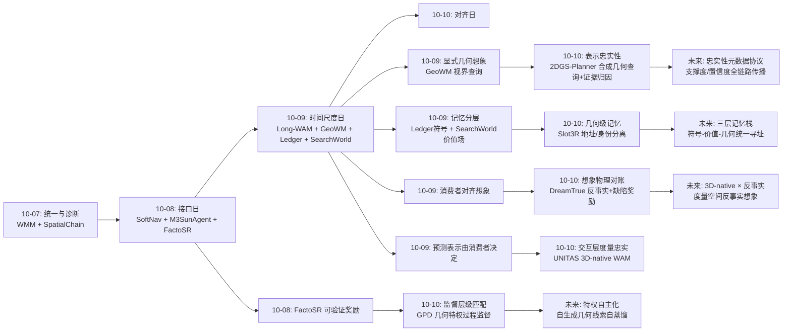
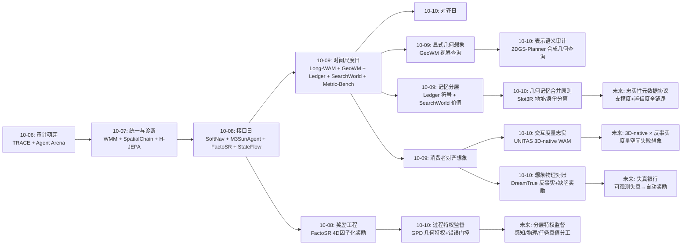
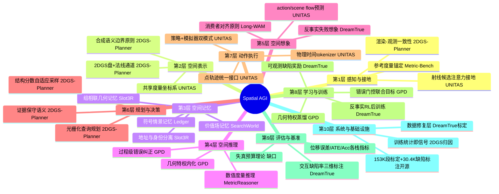
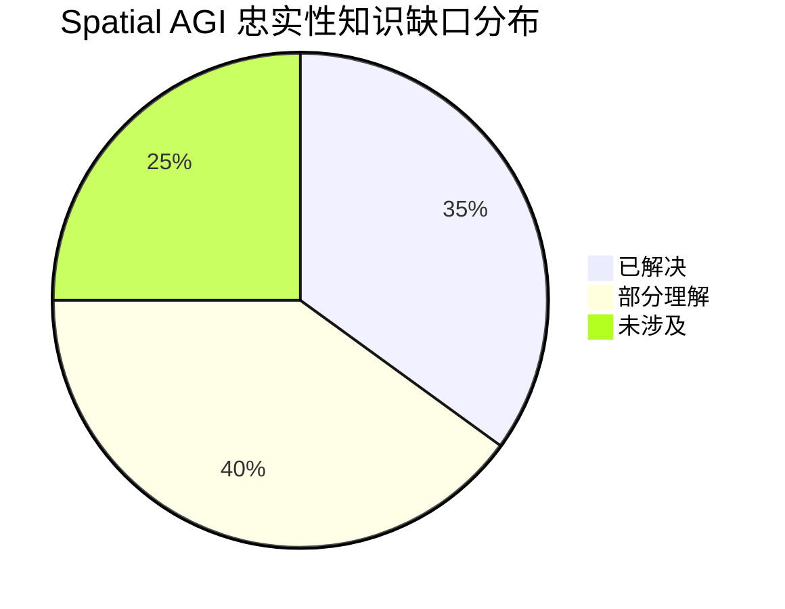

# Spatial AGI 每日深度思考 — 2026-10-10

**日期**: 2026-10-10
**基础日期**: 2026-10-09（昨日任务完整完成，5 篇论文 + 822 行思考）
**论文数量**: 5 篇
**主题**: 对齐日。如果说昨天五篇论文回答了"空间智能如何对抗时间"（在正确的时间尺度上用同构表示想象与记忆），今天五篇论文则在回答一个更隐蔽也更根本的问题：**空间智能系统内部的各种"对应关系"是否忠实**。GPD 处理监督信号与感知错误的对齐——答案特权纠正不了感知错误，只有场景真实几何可以；UNITAS 处理像素与度量的对齐——逼真的渲染不等于忠实的运动；Slot3R 处理地址与状态的对齐——空间邻近不是状态同一；2DGS-Planner 处理渲染与几何的对齐——训练目标约束的是合成表面而非单个基元；DreamTrue 处理动作与物理的对齐——世界模型的幻觉是因果错觉而非视觉伪影。五个工作互不相识，却共同指向同一个元问题：**在感知、表示、记忆、决策、想象的每一层，信息与它所声称代表的世界之间，隔着多少失真**。这是 Spatial AGI 的"对齐"问题——不是价值对齐，而是几何对齐、证据对齐、因果对齐。今天可以称为认知栈的"精度审计日"。

---

## 📅 每日总结

**日期**: 2026-10-10
**论文数量**: 5篇
**主题**: 对齐日（忠实性日）。五篇论文分别审计认知栈五层的"信息-世界"失真：GPD（监督层：训练信号 vs 感知错误）、UNITAS（交互层：视觉表示 vs 度量空间）、Slot3R（记忆层：空间地址 vs 状态身份）、2DGS-Planner（表示层：渲染质量 vs 几何可靠性）、DreamTrue（想象层：生成视频 vs 物理因果）。共同哲学：**每种表示都有其训练目标定义的语义边界，超出边界的复用必然失真；对齐必须显式工程化，不能指望模型"顺便"学会**。

**关键突破**:
- 🚀 **"答案特权纠正不了感知错误，几何特权才可以"（GPD）**：把 OPSD 的教师特权从参考答案换成问题路由的深度/语义/BEV 文本线索，仅在错误轨迹上做 token 级蒸馏。VSI-Bench 57.1、四基准平均 37.6，全面超过 GRPO 与 answer-privileged OPSD。这是对空间推理后训练方法论的纲领性澄清：错误在感知层，就要用感知层的真值去纠正。
- 🚀 **1.7B 的 3D-native 打败更大的视频世界模型（UNITAS）**：首个把观测、动作、场景动力学统一进共享度量 3D 坐标系的 WAM。action flow/scene flow 用点轨迹统一人手/夹爪/场景，物理时间 tokenizer 一轨迹一 token。RoboTwin 位移误差比 PointWorld 低 49%，LIBERO 99.8%，真机平均 85%。"照片级逼真的预测仍可能错报位移"——度量结构先验的容量效率完胜表观逼真。
- 🚀 **"位置决定地址，内容决定合并"（Slot3R）**：诊断 Point3R 空间记忆的失效模式为"邻近平均导致过早信息坍缩"，用 training-free 的组相联改造（同址 K 路槽位 + 特征相似度融合判据 + 640 token 有界读出）修复：7Scenes Acc 误差降 57-63%，19 FPS 跑通 1000 帧流（竞品 800 帧 OOM）。与 CPU cache 的组相联设计同构——计算机体系结构几十年前就解决了同样的问题。
- 🚀 **光栅化是高斯地图的正确规划接口（2DGS-Planner）**："渲染好看≠基元几何对齐"：GS 训练目标约束的是 alpha 合成后的表面，把单个基元当障碍是语义越界。多视角归因从渲染统计（贡献加权法线离散度）免费提取结构复杂度，引导自适应路图采样；未观测光线按"证据不足"而非"自由"保守处理。连通性、净空、成功率全面领先，含真机。
- 🚀 **世界模型的幻觉是因果错觉（DreamTrue）**："抓空了，物体照样升起来"——成功偏差让世界模型违反支撑/接触的物理因果。解法链条完整：纯 RGB 离线标定修复动作-视频错位（开源 153K 段）→ SE(3) 反事实动作生成失败经验 → 人类缺陷标注（30.4K）训练具身奖励 → RL 后训练。交互缺陷率 48.12%→6.25%，AgiBot World Challenge 2026 世界模型赛道冠军。

**架构演进**: 10 层架构维持 10 层，但每一层都获得了一条**忠实性约束**：(1) 监督层确立"特权信号要与错误本源同层"原则（GPD）；(2) 交互/执行层的表示正式分家——3D-native（UNITAS）与视频-打磨（DreamTrue）两条路线同日交出旗舰成绩单；(3) 记忆层获得"地址/身份分离"设计准则（Slot3R），与昨日 Ledger 的时间尺度分层互补；(4) 表示层确立"查询接口要与训练语义匹配"原则（2DGS-Planner）；(5) 想象层获得"物理缺陷可观测、可标注、可奖励"的自检通道（DreamTrue）。

### 📊 一句话总结

今天五篇论文共同写下了"空间对齐五诫"：**监督要与错误同层（GPD）、动作要与度量同空间（UNITAS）、地址要与身份分离（Slot3R）、查询要与表示语义匹配（2DGS-Planner）、想象要与物理因果对账（DreamTrue）**——空间智能的每一条信息通路，都需要显式的忠实性工程。

### 🔗 延续性

**昨日→今日**: 昨日"时间尺度日"确立"在正确的时间尺度上用与消费者同构的表示想象和记忆"。今天是该原则的对偶面：同构只是第一步，**忠实**是第二步——UNITAS 的"预测的表示由消费者决定"直接继承昨日 GeoWM 的显式几何路线并推到交互层；Slot3R 的空间记忆继承昨日 Ledger 的记忆分层并下沉到几何级；DreamTrue 的"想象要与消费者对账"把昨日"消费者对齐想象"原则加上物理约束；GPD 的"监督要与错误对齐"是昨日 MetricReasoner 可验证奖励路线在过程监督上的延伸；2DGS-Planner 则回答了昨日 SearchWorld 遗留的"显式表示从哪来"——从重建中来，但要带着证据支撑度。

**今日→明日**: 值得追踪——(1) UNITAS 的 3D-native 交互 × DreamTrue 的反事实后训练：给 3D-native WAM 装上反事实想象力（在度量空间扰动 action flow、用物理一致性做奖励）；(2) Slot3R 的组相联记忆 × UNITAS 的点轨迹接口：记忆的地址单元从点云换成物体级点轨迹（交互中心的空间记忆）；(3) GPD 的几何特权蒸馏 × MetricReasoner 的参考锚定：自主构造几何特权（模型自己生成 depth/BEV 线索做自蒸馏）；(4) 2DGS-Planner 的证据归因 × 昨日遗留的不确定性传播：每个空间量附带支撑度/置信度的统一协议；(5) "空间总线"今天获得第五种约束——忠实性校验载荷。

### 💡 本质思考：如何达成通用空间智能

#### 1. 核心能力的本质是什么？

今天五篇论文把这个问题推进到"忠实性"维度。**第一层：空间智能是多层信息通路上的忠实传递**。感知→表示→记忆→决策→想象的每一跳都会失真，而空间任务的失败几乎总能追溯到某一次具体的失真：GPD 指出 VLM 空间推理失败是"感知失真被连贯推理放大"；UNITAS 指出视频 WAM 的失败是"投影失真侵入动作决策"；Slot3R 指出流式重建失败是"记忆合并失真摧毁互补证据"；2DGS-Planner 指出规划失败是"基元失真污染碰撞检查"；DreamTrue 指出世界模型失败是"因果失真造成成功幻觉"。**空间智能工程的核心不是让每层更强，而是让每层失真可控、可测、可修**。**第二层：每种表示都有语义边界，越界使用必失真**。GS 基元的语义由渲染损失定义（所以不能当碰撞体，2DGS-Planner）；像素的语义由视角定义（所以不能当度量，UNITAS）；指针位置的语义是几何摘要（所以不能当状态身份，Slot3R）；参考答案的语义是最终判断（所以纠正不了过程感知，GPD）。这条原则是"空间表示选型"的理论基础：先问训练目标定义了什么语义，再问任务需要什么语义，两者不匹配就要设计显式的转换与校验层。**第三层：对齐必须工程化，不能靠涌现**。五篇论文没有一个指望模型"自己学会对齐"：GPD 显式路由特权线索、UNITAS 显式反投影+Fourier 编码、Slot3R 显式哈希寻址+相似度阈值、2DGS-Planner 显式归因+保守阈值、DreamTrue 显式标定+缺陷标注。与" Scaling 会解决一切"的信念相反，空间领域的对齐失真如此结构化，以至于显式工程总是比隐式涌现便宜几个数量级。**第四层：可观测的失真是免费的监督信号**。DreamTrue 最深的一课：没有配对真值时，物理违规（物体悬空、反重力上升）是可直接观测的缺陷——它们天然构成奖励。推广之：渲染-观测不一致（2DGS-Planner 的法线离散度）、记忆内部矛盾（Slot3R 的相似度冲突）、监督-结果错位（GPD 的错误轨迹）都是免费信号。空间智能系统应该建立一个"失真银行"：把每层可检测的失真都转化为训练信号。

#### 2. 当前方法与理想目标的差距在哪里？

**差距一：失真没有统一的度量与传播协议**。五篇论文各自定义了自己的忠实性指标（Acc 误差、位移误差、缺陷率、净空误差、基准分数），但没有一个系统在层间传播失真信息——规划器不知道记忆的置信度（Slot3R 有但没输出给消费者）、动作决策不知道想象的可靠性（DreamTrue 的奖励只在训练期用）。理想的 Spatial AGI 要求每个空间量携带"忠实性元数据"（来源、证据支撑度、误差分布）并在整条链路上传播。这是昨日"不确定性缺口"的具体化，今天进一步确认无人在做。**差距二：两条交互路线（3D-native vs 视频）尚未融合**。UNITAS 用度量坐标保证忠实但表达力受限于点轨迹（形变、流体难）；DreamTrue 在视频表示内打磨忠实但无显式度量（长时程一致性受限于像素）。理想的交互层应该是"视频生成的表现力 + 度量3D的校验力"：生成器自由渲染，度量空间做物理对账。两条路线各自的天花板恰好是对方的地板，融合是明确方向但今天无人跨越。**差距三：监督的自动特权化仍不成熟**。GPD 的特权依赖 3D 标注或估计模型（Depth Anything 3 + Grounded-SAM-2），路由器本身是 base VLM；DreamTrue 的缺陷标注靠人工 30.4K。理想状态是系统自主构造特权（从仿真器、从自身重建、从物理一致性自检）与自主发现缺陷（无需人工标注的违规检测）。**差距四：记忆的忠实性是静态假设**。Slot3R 假设静态场景，DreamTrue 的世界会变，Ledger 记录会过时——现实环境天天变，"记忆与当前世界状态的对齐"（记忆的新鲜度、变化检测、失效更新）完全没有系统化方案。**差距五：对齐评估本身缺基准**。五篇论文各测各的，没有一个统一基准度量"系统的层间失真预算"——给定任务成功率要求，各层允许的失真上限是多少？这种"失真预算工程"的理论完全空白。

#### 3. 从今天到理想状态，最可能的路径是什么？

一条忠实性驱动的五段路径。**第一段（现在起）：每层建立忠实性自检**。把五篇论文的自检机制推广为标准组件：感知层用渲染-观测一致性（2DGS-Planner 归因）、记忆层用相似度冲突检测（Slot3R 写入判据）、想象层用物理违规检测（DreamTrue 奖励模型的自动化版本——用现成的接触/支撑检测器替代人工标注）、监督层用错误轨迹定位（GPD 的 token 级教师打分）。这一步全是工程，无新科学。**第二段（并行）：忠实性元数据协议**。定义空间量的标准封装：{几何量, 来源, 证据支撑度, 误差分布, 时间戳}，让 2DGS-Planner 的结构分数、Slot3R 的槽位置信度、GeoWM 的预测（补上分布）、Ledger 的记录可靠性用同一格式表达并在层间传播。消费者可以查询"你有多确定"，回答不明确的输入降权。这是把昨日"不确定性内建"从愿景变成接口规格。**第三段（6-12个月）：两条交互路线的融合**。在 UNITAS 式 3D-native 底座上接入 DreamTrue 式反事实后训练：反事实不再扰动视频条件而是在度量空间扰动 action flow/scene flow，物理奖励不再靠人标而是靠 3D 空间的接触/支撑/重力解析校验。判定标准：反事实生成的失败经验能提升策略的失败恢复率。**第四段（并行）：特权与缺陷的自主化**。GPD 的特权构造自动化（模型自生成 depth/BEV 假设、用重建一致性筛选）+ DreamTrue 的缺陷检测自动化（物理解析校验替代人工标注），把两者的数据工程成本压到接近零，使"忠实性驱动的后训练"可以随数据规模滚动。**第五段（1-2年+）：失真预算化的空间系统**。理想状态的判定标准更新为：一个系统，给定任务与安全要求，能自顶向下分配各层失真预算（感知误差 X cm、记忆失效率 Y%、想象缺陷率 Z%），每层有自检与元数据上报，失真超预算触发重观测/重检索/重想象——空间智能从此可以像通信系统一样做链路预算。五篇论文各自点亮了预算表的一格，合起来就是这份预算表的雏形。

---

## 🔗 与昨日思考的联系

### 昨日重点

昨日"时间尺度日"确立四个结论：(1) **预测的表示由消费者决定**——动作消费隐空间想象（Long-WAM）、规划消费显式几何（GeoWM）、回忆消费符号记录（Ledger）；(2) **记忆的价值由消费者的预训练目标解锁**（Long-WAM 对照实验）；(3) **确定性部分不学习、不确定部分才学习**（GeoWM 运动外推 / SearchWorld 价值学习 / Ledger 规则关联）；(4) **可验证性是空间 RL 的地基**（MetricReasoner 数值奖励）。遗留悬念：显式几何表示（GeoWM 的深度/位姿）从哪来、如何保证它自己可靠？记忆的层级间如何保持一致？想象的输出如何做物理对账？

### 今日进展

今天在昨日基础上完成三个推进：(1) **显式几何表示的可靠性问题被正面回答**——昨日 GeoWM 假设几何基础模型给出的深度/位姿可信，今天 2DGS-Planner 深挖一层：即使表示来自优化，其基元级几何也不可靠，必须查询合成几何并携带证据支撑度。这为昨日"显式几何想象"补上了可信来源审计。(2) **消费者对齐想象获得物理对账机制**——昨日说想象的表示由消费者决定，今天 DreamTrue 补充：不管表示是什么，想象结果必须过物理一致性检验，且违规缺陷本身可作奖励——想象从"被动生成"升级为"主动对账"。(3) **记忆分层下沉到几何级并解决合并语义**——昨日 Ledger 管小时级符号记忆、SearchWorld 管 BEV 价值场，今天 Slot3R 给出几何级记忆的合并原则（地址/身份分离），三层记忆（符号-价值-几何）的栈基本成形。(4) **监督信号的层级匹配原则**——昨日 MetricReasoner 用数值奖励纠正结果，今天 GPD 证明结果监督纠正不了感知错误、必须用同层真值做过程监督——监督设计的颗粒度要与错误本源的颗粒度匹配。

### 演进路径

---

## 📚 论文概览

**论文1: GPD (Distilling Routed 3D Privilege)** — 浙江大学。VLM 空间推理的几何特权蒸馏：核心洞察是空间错误起源于感知（深度/方向判断错后连贯推理），参考答案纠正不了这种错误，只有场景真实几何可以。方法：离线把 3D 标注（或 Depth Anything 3 + Grounded-SAM-2 估计）转成 depth/semantic/BEV 三类文本线索，用 base VLM 做问题条件化路由选出相关子集，作为 OPSD 教师的特权上下文；学生仅见 RGB+问题采样轨迹，教师逐 token 重打分，特权 KL 只施加于错误轨迹（τ=0.5，clip 1.5），与 GRPO 联合优化。Qwen3-VL 2B/4B 上 VSI-Bench 57.1、MindCube/SPAR/MMSI/ViewSpatial 平均 37.6，超过 GRPO 与 answer-privileged OPSD。部署保持 RGB-only。

**论文2: UNITAS** — 港中深 + DexForce 具力科技。首个 3D-native 世界动作模型：观测、动作、场景动力学在共享度量 3D 坐标系统一。action flow 把人手/夹爪表示为3D点轨迹，scene flow 表示条件化的场景点位移；world-aligned 3D 位置嵌入（有深度反投影、无深度沿射线 64 候选注意力加权）把视觉 token 接地到世界坐标；物理时间轨迹 tokenizer 把每条轨迹编码为锚定在当前3D位置的单 token；层耦合 Mixture-of-Transformers 双专家（点动力学 + 动作）支持策略模式（直接执行）与模拟器模式（动作条件场景预测）。1.7B 参数：RoboTwin 位移误差比 PointWorld 低 49%，LIBERO 99.8%、LIBERO-Plus 89.1%、真机平均 85%。

**论文3: Slot3R** — 西湖大学 AGI 实验室。流式3D重建的组相联空间记忆：诊断 Point3R 用空间邻近同时承担关联与融合，导致不同表面/视角/可见性的互补证据被邻近平均过早坍缩。核心原则"位置决定地址，内容决定合并"：球面哈希（方位角/仰角/log半径）量化3D空间，每地址 K 路槽位；置信度决定是否修改记忆、特征相似度决定如何修改（融合/插入/替换/拒绝），O(K) 更新与总记忆规模无关；640 token 有界稀疏读出（邻近桶 + 全局锚点）解耦存储与访问。Training-free：7Scenes Acc 误差降 57.1-63.1%，NeuralRGBD 降 64-72%，三基准 ATE 全降，19 FPS 跑通 1000 帧流。

**论文4: 2DGS-Planner** — 地面机器人路径规划：核心观察是 GS 训练通过 alpha 合成渲染联合优化基元，训练目标约束的是合成表面而非单个基元，"渲染好看≠基元几何对齐"。主张光栅化作为查询接口：多视角归因把渲染法线离散度（1−||加权均值法线||²）按基元贡献加权聚合为结构分数，引导地面自适应路图采样（复杂处密、开阔处疏）；路径对齐正交查询筛边、圆柱查询估计净空场缓存于边；在线 A* + B样条精化（机器人椭球模型+地面约束）。未观测光线按证据不足保守处理。连通性、净空、成功率全面超基线，含真机，代码开源。

**论文5: DreamTrue** — 中科院自动化所 NLPR + 高德/阿里。动作忠实的机器人世界模型：两大数据困境——标定误差使渲染动作条件与视频错位、成功偏差使模型幻觉成功（抓空物体照样升起）。解法：离线几何标定（渲染-观测/时序/多视角三组对应 + 共面性约束，纯 RGB 联合优化相机参数与机械臂安装偏移，开源 153K 段标定）；Stage I 用 URDF 渲染的统一图像空间动作表示（RGB/深度/掩码/Plücker 光线）经 VACE 分支注入 video DiT 做跨具身多视角训练；Stage II 反事实后训练——SE(3) 扰动造失败动作、30.4K 人工缺陷标注（机器人/物体/交互三维）训具身奖励模型、RL 后训练压缺陷。AgiBot nDTW 0.8772 SOTA，交互缺陷率 48.12%→6.25%，AgiBot World Challenge 2026 世界模型赛道冠军。

---

## 💡 核心见解

### 见解1: 监督信号的颗粒度必须与错误本源的颗粒度匹配

**从 GPD 获得**

- ✅ 空间推理错误起源于感知（深度/方向判断错），之后模型在错误事实上"连贯推理"——错误是感知级的，推理反而是对的
- ✅ 参考答案（结果级监督）无法定位"哪一步感知错了"；场景真实几何（感知级特权）可以
- ✅ token 级教师-学生概率差把纠正精确到出错的那一步；只施加于错误轨迹避免正确轨迹上的噪声
- ✅ 对照实验最有说服力：answer-privileged OPSD < geometry-privileged OPSD，同一框架只换特权内容

**对Spatial AGI的启发**:

这是后训练方法论的一条元规则：**先诊断错误发生在哪一层，再让监督信号在同一层有话语权**。结果奖励是"答案层"的监督，对感知层错误鞭长莫及。推广到 VLA：操作失败的根因可能在感知（抓取位姿错）、在预测（后果想象错）、或在规划（子目标错），单一结果奖励同样无法区分——应该有分层特权（感知真值/物理真值/任务真值）分别监督。GPD 的"错误门控"也值得推广：只在失败轨迹上做过程蒸馏，成功轨迹保持 GRPO——学习资源聚焦于纠错而非确认。

### 见解2: 度量结构先验的容量效率完胜表观逼真

**从 UNITAS 获得**

- ✅ 1.7B 参数在场景预测误差上打败基于视频生成先验的更大 WAM（位移误差低 49%），操作成功率同时 SOTA
- ✅ 视频表示的失败模式被精确定义：同一动作跨视角不同像素变化、逼真预测错报位移/形变刚性几何/静态漂移
- ✅ 点轨迹是"最小公共分母"式统一表示：人手、夹爪、场景共用一套物理语言，跨具身数据可联合训练
- ✅ 无深度的空间接地（射线 64 候选注意力加权）让 3D-native 不必付出深度传感器的部署代价

**对Spatial AGI的启发**:

延续昨日 GeoWM 的结论并推到交互层：空间智能的模型容量应该花在度量结构上而不是照片逼真上。UNITAS 与 DreamTrue 同日发表构成路线对照——UNITAS 换表示保忠实，DreamTrue 保表示修忠实。1.7B 打败更大模型的效率差距提示：归纳偏置正确的模型，参数效率可以差出一个量级。对资源受限的边缘机器人部署（昨日 Long-WAM 的 Jetson 场景），3D-native 小模型 + 度量先验可能是唯一现实路径。

### 见解3: 空间记忆的地址与身份必须分离

**从 Slot3R 获得**

- ✅ 失效模式被精确命名："过早信息坍缩"——不同表面/视角/可见性的互补证据被邻近平均在消歧证据到来前摧毁
- ✅ 原则："位置决定地址，内容决定合并"——空间索引负责组织，特征相似度负责合并决策
- ✅ 组相联结构（同址 K 路槽位）与 CPU cache 设计同构；置信度决定"是否修改"、相似度决定"如何修改"的分工优雅
- ✅ 640 token 有界读出 + O(K) 更新 = 存储随场景扩张、访问成本恒定

**对Spatial AGI的启发**:

这条原则的适用域远超流式重建。任何空间记忆系统（物体记忆、语义地图、情景记忆）都面临同一个问题：两个观测落在相近位置时，是同一状态的新证据还是不同状态？过早合并丢失信息、过晚合并浪费容量——Slot3R 给出了工程化的中间态：保留 K 个假设，让内容相似度积累证据。这与人类认知的 pattern separation 机制呼应。更深的启发是"多假设保留"：空间智能在证据不足时应维持假设集而非过早收敛——这正是贝叶斯滤波的离散化体现，但今天几乎没有空间记忆系统显式这么做。

### 见解4: 查询接口必须匹配表示的训练语义

**从 2DGS-Planner 获得**

- ✅ GS 基元的语义由渲染损失定义：训练约束的是 alpha 合成表面，单个基元可以严重偏离表面（"渲染好看≠几何对齐"有实证图证）
- ✅ 把基元当碰撞体（Splat-Nav/SAFER-Splat 路线）是语义越界；查询合成几何才是语义内使用
- ✅ 训练统计是免费的信号源：贡献加权法线离散度 → 结构复杂度，无需任何新训练
- ✅ 认识论保守性：未观测 = 证据不足 ≠ 自由空间——alpha 透明度天然区分"看到了什么"

**对Spatial AGI的启发**:

"表示-查询匹配"是空间表示选型的理论基础：占据网格→离散查询、SDF→梯度查询、GS→光栅化查询。任何生成式表示（NeRF/GS/视频生成/世界模型）被下游复用时都要先问：它的训练目标定义了什么语义？语义之外的使用（用渲染质量推断碰撞安全性、用视频逼真度推断物理正确性）必然失真——DreamTrue 的成功幻觉正是视频表示语义越界的世界模型版。这条原则应该写进 Spatial AGI 系统设计规范：每个表示旁标注其"语义边界"，跨边界访问必须经过显式转换与校验层。

### 见解5: 世界模型的幻觉是因果错觉，且违规缺陷可观测、可奖励

**从 DreamTrue 获得**

- ✅ "抓空了，物体照样升起来"——成功偏差让世界模型违反支撑/接触的物理因果；这不是视觉伪影而是因果错觉
- ✅ 无配对真值时，物理违规（悬空、反重力上升、穿透）是可直接观测的缺陷——天然构成奖励信号
- ✅ 标定失真是动作跟随的隐形杀手：渲染条件与视频错位使监督自相矛盾，纯 RGB 三组对应+共面性约束即可修复
- ✅ 反事实（SE3 扰动 + IK）是制造失败经验的廉价工厂：48.12%→6.25% 的缺陷率下降证明缺陷驱动 RL 后训练极其有效

**对Spatial AGI的启发**:

把昨日"消费者对齐想象"原则补上物理对账环节：想象不仅要形态对（表示匹配消费者），还要内容对（物理因果正确）。更通用的是"失真银行"思想：每层可观测的失真都是免费监督——渲染-观测不一致（归因）、记忆内部矛盾（相似度冲突）、物理违规（悬空/穿透）、监督-结果错位（错误轨迹）。Spatial AGI 的后训练循环可以全部建立在失真检测上，无需人工标注。DreamTrue 的缺陷 taxonomy（机器人本体/物体一致性/交互合理性）值得作为通用世界模型的质量评估框架推广。

### 见解6: 特权信息是仿真全知与部署有限的通用桥梁

**从 GPD + DreamTrue 联合获得**

- ✅ GPD：训练期教师独享 3D 几何，部署期学生 RGB-only——特权只进训练信号不进推理接口
- ✅ DreamTrue：标定恢复的精确几何只用于构造训练条件；反事实动作在训练期扩张覆盖
- ✅ 两者的共同结构：全知信号（真值几何/精确标定/缺陷标注）→ 训练期监督 → 部署期隐式内化
- ✅ 特权设计三原则浮现：任务相关性（GPD 路由）、过程定位（token 级）、错误聚焦（门控）

**对Spatial AGI的启发**:

特权蒸馏范式适用于一切"训练有仿真器、部署无真值"的空间系统：导航策略可用占据栅格真值做特权、VLA 可用接触/力真值做特权、自动驾驶可用高精地图做特权。与 sim-to-real（迁移环境）不同，这是"omniscient-to-finite"（迁移视角）——不需要仿真器逼真，只需要真值信号正确。结合昨日"记忆-消费者联合训练"的判断，特权蒸馏可以看作它的特例：消费者的预训练/后训练目标显式教会它利用本不可得的信号。

### 见解7: 空间基础设施正在形成"忠实性栈"

**从五篇论文整体获得**

- ✅ 监督忠实（GPD）：特权信号与错误同层
- ✅ 交互忠实（UNITAS）：动作与度量同空间
- ✅ 记忆忠实（Slot3R）：地址与身份分离
- ✅ 表示忠实（2DGS-Planner）：查询与语义匹配
- ✅ 想象忠实（DreamTrue）：生成与物理对账
- ✅ 五层各自独立成立，组合起来是一份完整的"忠实性检查清单"

**对Spatial AGI的启发**:

上周的工作在回答"空间信息该怎么表示、怎么流动"，本周开始回答"怎么保证它没说谎"。这个转向标志着领域从能力建设进入可靠性建设——正如语言模型从 capability 到 alignment 的历史路径。可以预言：未来几个月会出现"空间忠实性基准"（统一度量层间失真）与"失真预算工程"（给定任务要求自顶向下分配各层误差上限）。今天五篇论文是这份预算表的第一批数据点。

---

## 🗺️ 知识演进图

⚠️ 必须使用 mermaid 代码块！禁止用纯文本箭头！

---

## 技术栈演进对比表

| 层次 | 昨日方案 (10-09) | 今日方案 (10-10) | 变化 |
|------|---------|---------|------|
| 监督/后训练 | MetricReasoner 结果级数值奖励（RFT） | GPD 过程级几何特权蒸馏（OPSD+错误门控） | 监督颗粒度从结果下沉到感知步骤；结果奖励→特权过程监督 |
| 交互/执行 | Long-WAM 视频 WAM（隐式时序 KV 缓存，107ms） | UNITAS 3D-native WAM（度量坐标系，1.7B） | 执行层表示路线正式分家：视频-隐式 vs 3D-native-显式；度量忠实成为硬指标 |
| 记忆 | Ledger 符号情景记忆（时间尺度分层，2k token） | Slot3R 几何级组相联记忆（地址/身份分离，K路槽位） | 记忆栈补上几何层；合并决策从邻近度升级为内容相似度+置信度分工 |
| 表示/地图 | GeoWM 假设几何基础模型输出可信 | 2DGS-Planner 审计表示语义（查合成几何+证据归因） | 显式表示获得可靠性审计：基元≠表面、未观测≠自由 |
| 想象/世界模型 | GeoWM 显式几何预测 + Long-WAM 隐空间想象 | DreamTrue 反事实后训练+物理缺陷奖励 | 想象从"生成"升级为"对账"：物理违规可观测可奖励；失败经验可制造 |
| 基准/评估 | Metric-Bench 上下文度量推理 | （继承）各论文自带忠实性指标（缺陷率/位移误差/Acc） | 评估焦点从能力转向忠实；统一失真基准仍缺 |
| 数据基础设施 | LongLive2.0-Robot 万小时预训练数据 | DreamTrue 标定修复层（153K段）+ 缺陷标注（30.4K） | 数据工程新增"修复"与"标注缺陷"两类资产；反事实=数据扩张 |

---

## 🗺️ Spatial AGI 知识图谱

### 10层架构思维导图

⚠️ 必须使用 mermaid mindmap 代码块！

### 🎯 主线技术路径

#### 阶段1: 能力建设期（已完成大部分）

空间感知、重建、预测、操作、导航的单点能力全面爆发。3DGS 从重建演示走向规划接口（2DGS-Planner），世界模型从视频玩具走向竞赛冠军（DreamTrue），WAM 从概念走向 3D-native（UNITAS）。特征：每个单点都有 SOTA，但单点之间失真不受控。

#### 阶段2: 可靠性建设期（当前所处）

本周的转折信号：审计（上周的 SpatialChain/Metric-Bench）→ 忠实性工程（本周五篇）。特征：每层建立自己的忠实性机制——监督对齐错误层（GPD）、表示匹配查询语义（2DGS-Planner）、记忆分离地址身份（Slot3R）、想象对账物理因果（DreamTrue）、交互锚定度量空间（UNITAS）。可观测失真开始变成训练信号（失真银行雏形）。

#### 阶段3: 融合与协议期（6-12个月）

三条融合主线：(1) 交互路线融合——UNITAS 的度量3D × DreamTrue 的反事实后训练（度量空间扰动 action flow + 解析物理校验替代人工标注）；(2) 记忆栈融合——Ledger 符号层 + SearchWorld 价值层 + Slot3R 几何层统一寻址与置信度格式；(3) 忠实性元数据协议——所有空间量携带 {来源, 证据支撑度, 误差分布, 时间戳} 全链路传播，消费者可查询可靠性。判定标准：跨层失真可度量、可分配预算。

#### 阶段4: 自主进化期（1-2年+）

失真预算化的空间自我模型：系统自顶向下分配各层失真预算（感知 X cm、记忆失效率 Y%、想象缺陷率 Z%），每层自检+上报，超预算触发重观测/重检索/重想象；特权与缺陷检测全自动化（自生成几何线索自蒸馏、解析物理校验替代人工标注），后训练随数据滚动；跨天尺度用变化检测更新记忆与地图。空间智能从此像通信系统一样做链路预算——每一条信息通路的失真都可知、可控、可修。

---

## 🔍 待探索议题

### 高优先级（本周）

1. **3D-native WAM 的反事实后训练**
   - 问题: UNITAS 的模拟器模式能否用 DreamTrue 式反事实（在度量空间扰动 action flow）+ 解析物理校验（接触/支撑/重力）做 RL 后训练，免去人工缺陷标注？
   - 候选方案: 场景 flow 预测后跑 3D 物理一致性检查（物体轨迹连续性、支撑关系、穿透检测），违规即负奖励
   - 缺口: 点轨迹表示下的物理违规检测器；反事实扰动的动作空间设计

2. **忠实性元数据协议草案**
   - 问题: 如何定义空间量的标准封装让支撑度/置信度跨层传播？
   - 候选方案: {geometry, source, support_score, error_dist, timestamp} 的 schema，Slot3R 槽位置信度、2DGS 结构分数、GeoWM 预测分布统一表达
   - 缺口: 消费端如何使用元数据（降权/触发重观测）的决策规则

3. **GPD 特权的自主化构造**
   - 问题: 无 3D 标注数据上，模型能否自生成 depth/BEV 假设并用重建一致性筛选后做自蒸馏？
   - 候选方案: 前馈重建（VGGT 类）生成几何假设 → 多假设一致性过滤 → 高一致子集做特权
   - 缺口: 伪特权的噪声下界分析；一致性阈值与最终性能的关系

### 中优先级（本月）

4. **记忆新鲜度与变化检测**
   - 问题: Slot3R/Ledger 假设静态世界，如何检测"记忆与当前世界失配"并触发更新？
   - 候选方案: 重访时记忆预测 vs 新观测的残差检测（2DGS-Planner 的渲染-观测一致性思路迁移到记忆层）
   - 缺口: 变化检测的假阳/假阴权衡；部分更新（哪些槽位失效）的粒度控制

5. **两条交互路线的融合实验设计**
   - 问题: 视频生成器的表现力 + 度量3D的校验力如何在同一系统共存？
   - 候选方案: 生成器自由渲染 + 3D 侧做每帧物理对账（UNITAS 的 scene flow 作为校验中间层）
   - 缺口: 对账失败的回退策略（拒绝采样/重生成/局部修正）

6. **分层特权监督框架**
   - 问题: VLA 失败可能源于感知/预测/规划三层，如何构造三层真值并分别门控监督？
   - 候选方案: 仿真器输出全量真值，错误轨迹上按 token 定位到层，分层特权 KL
   - 缺口: token 层与语义层的对应关系（哪个 token 属于感知错误）

7. **失真预算的实证测量**
   - 问题: 给定任务成功率，各层实际失真上限是多少？能否拟合"失真-成功率"曲线？
   - 候选方案: 受控注入失真实验（记忆噪声/感知噪声/想象缺陷）扫任务成功率
   - 缺口: 跨层失真的耦合效应（低层失真被高层放大还是吸收）

### 低优先级（本季度）

8. **统一空间忠实性基准**
   - 问题: 五篇论文各测各的（Acc/ATE/缺陷率/nDTW），能否设计一个统一基准度量"层间失真"？
   - 候选方案: 一个仿真环境 + 可控失真注入 + 标准任务套件，报告各系统的失真-性能权衡曲线
   - 缺口: 社区共识；失真类型的完备 taxonomy

9. **多假设空间记忆的贝叶斯化**
   - 问题: Slot3R 的 K 路槽位能否升级为带权假设集（K 个假设各带后验概率），检索时按假设加权？
   - 候选方案: 槽位置信度 → 概率化，融合 = 贝叶斯更新，淘汰 = 后验剪枝
   - 缺口: 假设间相关性处理；计算开销与收益的实证

10. **物理常识的内生验证**
    - 问题: DreamTrue 依赖人工标注定义缺陷；物理违规检测能否完全内生（无监督物理一致性度量）？
    - 候选方案: 大规模视频预训练中的"违反常识检测器"（物体恒存、支撑、重力方向的自监督学习）
    - 缺口: 微妙物理违规（摩擦/形变）的检测灵敏度下限

---

## 📊 知识缺口分析

⚠️ 必须使用 mermaid pie 代码块！

**已解决（35%）**:
- ✅ 监督信号的层级匹配原则（GPD: 几何特权 > 答案特权，错误门控有效）
- ✅ 交互层的度量忠实性可行且高效（UNITAS: 1.7B 3D-native 全面 SOTA）
- ✅ 几何记忆的合并语义（Slot3R: 地址/身份分离 + 组相联，training-free 可行）
- ✅ GS 表示的查询语义边界与正确接口（2DGS-Planner: 合成几何 + 证据归因）
- ✅ 世界模型物理忠实性的达标路径（DreamTrue: 标定+反事实+缺陷奖励，缺陷率 48%→6%）
- ✅ 数据修复层工程（纯 RGB 标定恢复、反事实数据扩张）

**部分理解（40%）**:
- ⚠️ 忠实性元数据的统一表达与跨层传播（各层有自己的置信度，格式互不相通）
- ⚠️ 3D-native 与视频两条交互路线的融合（各自天花板是对方地板，无人跨越）
- ⚠️ 特权与缺陷的自主化（GPD 依赖估计模型、DreamTrue 依赖人工标注，自动化路径清晰但未验证）
- ⚠️ 记忆的新鲜度与动态环境适配（Slot3R/Ledger 均假设静态，变化检测未系统化）
- ⚠️ 失真的跨层耦合（低层失真被高层放大还是吸收，无实证）
- ⚠️ 点轨迹表示的表达力边界（形变/流体/拓扑变化场景未知）
- ⚠️ 伪特权噪声的容忍下界（自生成几何线索的误差传播）

**未涉及（25%）**:
- ❌ 失真预算工程理论（任务要求→各层误差上限的自顶向下分配）
- ❌ 统一空间忠实性基准（五篇论文五套指标，无共识度量）
- ❌ 端到端失真传播的数学框架（类似通信链路预算的公式化）
- ❌ 微妙物理违规的内生检测（摩擦/形变/动力学细节）
- ❌ 多机器人共享记忆的忠实性（冲突合并、信任分配）
- ❌ 忠实性与能力增长的联合缩放律（更强大的模型是否天然更忠实）

---

## 📌 附录: 五篇论文速查卡

| # | 论文 | 一句话 | 关键数字 | 忠实性层面 |
|---|------|--------|---------|-----------|
| 1 | GPD | 几何特权做过程蒸馏，答案特权纠正不了感知错误 | VSI-Bench 57.1; 四基准均 37.6 | 监督↔错误同层 |
| 2 | UNITAS | 3D-native WAM: 观测/动作/场景统一度量坐标系 | 1.7B; 位移误差 -49%; LIBERO 99.8% | 交互↔度量同空间 |
| 3 | Slot3R | 位置决定地址，内容决定合并；training-free 组相联 | Acc -57~72%; 19FPS@1000帧 | 地址↔身份分离 |
| 4 | 2DGS-Planner | 光栅化是 GS 地图的正确规划查询接口 | 连通/净空/成功率全面领先; 真机 | 渲染↔几何对齐 |
| 5 | DreamTrue | 世界模型幻觉是因果错觉; 反事实+缺陷奖励修复 | 缺陷率 48.12%→6.25%; nDTW 0.8772 | 想象↔物理对账 |

---

**文档创建时间**: 2026-10-10
**生成方式**: 基于当日 5 篇论文全文精读 + 昨日思考延续
**今日主题**: 对齐日 / 忠实性日

---

## 🔬 深化分析: 五篇论文的忠实性机制逐一解剖

### 机制1: GPD 的特权工程——监督信号的三重过滤

GPD 的方法看似只是"把 3D 信息给教师"，但细看有三重精心设计，每一重都值得单独记住：

**第一重: 模态选择（depth / semantic / BEV 三元组）**

- depth 线索记录物体距离与远近次序 → 服务距离估计、相对深度类问题
- semantic 线索记录物体清单与图像区域 → 服务计数、存在性、 grounded 推理
- BEV 线索记录俯视拓扑关系 → 服务导航、布局、方位类问题
- 这三类恰好覆盖空间智能的三个正交面: 度量（多远）、身份（是什么、在哪）、拓扑（怎么连）
- 值得注意的是它们全部文本化——紧凑到可以被教师逐 token 对齐，这是 OPSD 框架的约束倒逼出的表示选择

**第二重: 问题条件化路由（r(q) ⊆ M）**

- 用 base VLM 离线决定每个问题需要哪些模态
- 消融证明路由 > 全量注入: 无关模态会稀释教师信号——特权不是越多越好
- 这个结论与语言领域 RAG 的"上下文污染"发现同构: 检索进来的无关内容反而伤害生成
- 推广: 任何特权注入系统都需要一个"相关性守门员"，而这个守门员本身可以是待训练的模型

**第三重: 错误门控与信号裁剪（τ=0.5, clip 1.5）**

- 特权 KL 只施加于错误轨迹（R_i < 0.5）: 学生已经做对的轨迹，教师闭嘴
- 直觉: 正确轨迹上教师的重打分与结果奖励信息冗余甚至冲突；错误的轨迹才是过程监督的价值所在
- clip 1.5 防止单个 micro-batch 内异常大的蒸馏信号破坏 GRPO 的稳定性
- 这与 curriculum learning 的思想暗合: 学习信号集中在"当前能力边界"上

**组合效果**: 三重过滤让"几何特权"从一堆原始信号变成精准的纠错指令。消融显示去掉任何一重都会掉点——这不是堆 trick，而是监督信息论的工程化: 在正确的时间（错误轨迹）、以正确的粒度（token 级）、传递正确的内容（路由后的模态）。

### 机制2: UNITAS 的坐标系统一——三个对齐难题与三个解法

把观测、动作、场景放进一个坐标系，说起来一句话，做起来有三个独立的难题，UNITAS 各给了一个解法：

**难题1: 没有深度怎么接地？**

- 有深度: 像素反投影 K⁻¹ + T_W → 世界坐标 → Fourier 编码 → 加进视觉 token
- 无深度: 沿标定相机射线均匀采 64 个候选深度（0.1-2.0m），反投影得到 64 个候选 3D 位置
- 用 patch 特征做 query、候选位置编码做 key/value 的注意力 → 加权得到该 patch 的"软位置"
- 本质: 把深度不确定性与表示为候选位置上的分布，让网络自己学出注意力深度
- 这个设计的巧妙在于它不预测深度再接地，而是直接在接地的目标下隐式消解深度不确定性

**难题2: 人手和夹爪形态不同怎么统一？**

- 不统一形态，统一轨迹: 各自跟踪一组对应 3D 点，形态差异消失在"点云随时间移动"里
- 人手演示数据因此可以直接监督机器人策略——跨具身迁移的接口成本降到零
- 对比: 传统方法需要 retargeting（人手→夹爪的运动重映射），UNITAS 让 backbone 自己在共享坐标系中学对应

**难题3: 异构数据源帧率时长不一怎么办？**

- 逐时间步编码会让等容量的 backbone 把容量浪费在高帧率数据的时间冗余上
- 物理时间 tokenizer: 每条轨迹按物理时间对齐后编码为一个 token，锚在当前 3D 位置
- 一条 2 秒 30fps 的轨迹和一条 2 秒 5fps 的轨迹消耗相同的表示预算
- 副作用: 失去时间步级细粒度，但换来跨数据源的容量公平——这是表示粒度与数据效率的又一次权衡

### 机制3: Slot3R 的写入判据——置信度与相似度的分工

Slot3R 的写入路径值得逐分支拆解，因为它是"记忆更新策略"的一个近乎完备的分类学：

- **拒绝（reject）**: 帧内置信度低于 q-分位 → 直接丢弃。防止低质量观测污染记忆
- **插入（insert）**: 桶为空或有空槽且相似度不足 → 存为新状态。保留互补假设
- **融合（fuse）**: 与最相似槽的余弦相似度 > τ_merge 且置信度足够 → 置信度加权融合。证据积累
- **替换（replace）**: 桶满、相似度不足、但置信度高于最低槽 → 分组融合后顶替。证据竞争

四个分支合起来回答了记忆系统的四个基本问题: 什么不记（拒绝）、什么是新知识（插入）、什么是旧知识的巩固（融合）、什么是旧知识的推翻（替换）。每个判据都只用两个量: 置信度（这次观测可靠吗）与相似度（它说的是不是同一件事）。

**与体系结构的同构**: 直接映射 cache（Point3R: 一个地址一个状态）→ 组相联 cache（Slot3R: 一个地址 K 路）→ 全相联（按内容寻址 CAM，代价高）。CPU 设计者三十多年前的结论——直接映射冲突失配太多、全相联太贵、组相联是甜点——在空间记忆里原样重演。这种跨领域同构通常意味着碰到了某种普适结构，值得记住。

### 机制4: 2DGS-Planner 的归因链——从渲染统计到规划先验

多视角归因是一条四级流水线，每级都只做一次信息压缩:

1. **像素级**: 加权平均法线的模长 → 法线离散度 V=1−||n̄||²（角点/薄结构/杂乱处高）
2. **视角级**: 每个重建视角渲染时都算一遍 V
3. **盘级**: 按 alpha 合成贡献加权聚合各视角的 V → 该盘的归因离散度 ν_i（谁贡献大谁话语权大）
4. **分数级**: ν_i 在合格盘中取百分位 → 结构分数 Σ_i ∈ [0,1]（归一化、抗异常值）

这条链的美妙之处在于它**没有训练任何东西**: 全部信号来自 GS 训练过程的副产品（渲染权重、法线通道）。这是"训练统计即信号源"的范例——神经表示的优化过程埋藏着大量免费的结构信息（贡献度、一致度、支撑度），等着下游任务来读。类似的机会清单: 注意力熵（信息密度）、梯度范数（可优化性）、渲染残差（重建难度）。

### 机制5: DreamTrue 的缺陷 taxonomy——世界模型质量的三个维度

L1 机器人本体 / L2 物体一致性 / L3 交互合理性的三级分类:

- **L1 本体缺陷**: 机器人的机械结构不合理（关节角度不可能、臂穿模自身）——生成模型对具身几何的把握
- **L2 物体一致性**: 物体外观/位置随时间不连贯（漂移、闪烁、凭空出现）——生成模型对世界持久性的把握
- **L3 交互合理性**: 机器人和物体的物理关系错误（抓空物体上升、失去支撑悬空、穿模抓取）——生成模型对物理因果的把握
- 三级难度递增: L1 是几何、L2 是时间一致性、L3 是因果。当前 30.4K 标注中 L3 是主要缺陷来源
- 这个 taxonomy 可以直接推广为通用世界模型的质检标准——不只机器人，任何具身视频生成 都适用

---

## 🧪 跨论文对比: 两组路线之争的当日战报

### 路线之争 1: 3D-native vs 视频-打磨（交互层）

| 维度 | UNITAS (3D-native) | DreamTrue (视频-打磨) |
|------|-------------------|----------------------|
| 世界表示 | 共享度量3D坐标系 + 点轨迹 | 多视角视频 + 图像空间动作条件 |
| 动作表示 | action flow 点轨迹（跨具身原生） | URDF 渲染 + 标定对齐（工程统一） |
| 忠实性来源 | 结构性（度量坐标系内建） | 后天性（标定修复 + 缺陷奖励 RL） |
| 规模 | 1.7B 小模型 | video DiT（数B级） |
| 强项 | 位移误差、跨具身、双模式（策略+模拟器） | 视觉逼真度、物理缺陷率的可度量改进 |
| 弱项 | 形变/流体表达、长时程跨窗一致性 | 无显式度量、成功偏差靠后天修、标注成本 |
| 数据要求 | 相机标定 + 点轨迹跟踪 | 纯 RGB 即可（标定自恢复）+ 缺陷标注 |

**战报解读**: 两条路线不是对错关系，而是在忠实性谱系的不同位置。UNITAS 把忠实性做进结构（先验），DreamTrue 把忠实性做进训练（后验）。前者的上限受表示表达力限制，后者的上限受标注/奖励覆盖限制。融合形态（视频生成 + 度量对账）可能是终点，但今天两条路线还各自有大量低成本收益没吃完。

### 路线之争 2: 结构先验 vs 规模与打磨（效率层）

把 UNITAS（1.7B 打败更大模型）和 Slot3R（training-free 打败需要重训的方案）放在一起看:

- UNITAS: 正确的归纳偏置（度量坐标系）让参数效率提升一个量级
- Slot3R: 正确的记忆策略（组相联）让零训练改造超过深度优化过的基线
- 2DGS-Planner: 正确的查询接口（光栅化）让免转换的规划超过中间表示路线
- GPD: 正确的特权内容（几何 vs 答案）让同框架蒸馏多出大幅增益

**共同模式**: 这四个"正确选择"全部是**零成本或低成本的**——换坐标系、换合并判据、换查询方式、换特权内容，都不需要更多的算力或数据，只需要更深地理解各组件的训练语义与失效模式。空间智能当前的边际收益不在 scale 上，在**语义精确性**上。这与语言领域"scale is all you need"形成鲜明对照——因为空间任务有几何、物理这些外部真值锚点，语义错误的容量投入会被锚点无情揭穿。

---

## 📐 理论札记: 三个可以形式化的命题

### 命题1: 失真放大定理（猜想）

设感知层失真为 ε_p、推理链长度为 n，则空间任务失败率下界约为 1−(1−ε_p)^n·c，其中 c 为推理的纠错能力（0<c≤1）。

- GPD 的实验支撑: VLM 感知错误后"连贯推理"——推理本身不纠错（c≈1），失败率 ≈ 1−(1−ε_p)^n
- 这解释了为什么过程监督（GPD）比结果监督有效: 结果监督只能筛选轨迹（等效降低 ε_p 的样本利用率），过程监督直接压 ε_p
- 可检验预测: 链式空间推理任务（先估深度再估方位再规划）的错误率应随链长超线性增长——Metric-Bench 类基准可以做这个实验

### 命题2: 地址-身份解耦的容量定理（直觉）

空间记忆中，设真实状态数为 S、地址数为 B（B<S 必然发生因为连续→离散量化），则:

- 直接映射（每地址1状态）: 状态坍缩率 = S/B，互补信息不可逆丢失
- 组相联（每地址K状态）: 坍缩率 = S/(BK)，检索代价 O(K)
- Slot3R 实证: K 路带来 Acc 误差降 57-72%，代价仅 O(K) 比较——收益/代价比惊人地好
- 开放问题: 最优 K 与场景复杂度分布的关系（自适应 K 的理论）

### 命题3: 物理违规的可观测性分层（DreamTrue 启发）

物理缺陷按可观测性分三级，对应三种监督获取成本:

- **零成本**: 违反守恒/支撑/重力的缺陷（物体悬空）——解析可检，无需标注
- **低成本**: 违反刚性/连续性的缺陷（物体形变、瞬移）——光流/点迹一致性可检
- **高成本**: 违反材料属性的缺陷（摩擦力错、软硬错）——需要物理参数估计或人工
- 自动化后训练的路线图: 先吃零成本级（解析校验），再吃低成本级（一致性校验），高成本级留给人机协同
- 这为"失真银行"提供了优先级排序

---

## 🔭 未来一周可执行的验证清单

1. **复核 GPD 的错误门控在 VLA 上的迁移性**: 找一个开源 VLA（如 OpenVLA 系），在失败轨迹上叠加机械臂位姿真值做特权 KL，看操作成功率变化——这是"分层特权监督"的第一个实验
2. **Slot3R 的 K 敏感性分析**: 代码开源，扫 K=1,2,4,8,16 在不同场景复杂度下的 Acc/显存曲线，验证自适应 K 的必要性
3. **2DGS-Planner 的动态障碍鲁棒性压力测试**: 在重建地图中注入动态物体，观察光栅化查询的失效模式——为"在线增量更新"需求收集证据
4. **UNITAS 的无深度模式定量评估**: 论文报告了有/无深度两种模式，对比其接地方差随场景深度范围的变化，评估射线加权在室外大深度的适用性
5. **DreamTrue 缺陷 taxonomy 复用于其他世界模型**: 用其开源标注规范给 1-2 个开源世界模型（如 Genie 系）的输出打分，横向比较缺陷率——第一个跨模型忠实性比较

---

## 📝 编辑手记: 本周的领域节奏

回顾 10-07 到 10-10 四天的论文流，可以读出一个清晰的领域节奏变化:

- **10-07（统一与诊断）**: 领域在问"我们做得怎么样"——WMM 统一框架、SpatialChain 忠实性审计
- **10-08（接口日）**: 领域在问"模块之间该怎么说话"——soft token、DSL、奖励接口、状态接口
- **10-09（时间尺度日）**: 领域在问"时间维度怎么组织"——多尺度想象、分层记忆、价值场
- **10-10（对齐日）**: 领域在问"怎么保证没说谎"——五层忠实性工程

从能力 → 接口 → 组织 → 可靠性，这是任何一个工程领域走向成熟的经典路径（对照: 计算机网络的物理层→协议→架构→安全）。空间智能正在从"能做"阶段跨入"可信"阶段。接下来的自然问题是"怎么规模化"——当忠实性工程成为标配，谁能把特权蒸馏、记忆协议、物理对账做成基础设施，谁就占据下一阶段的生态位。

一个值得警觉的反面信号: 本周日均 5 篇的相关论文里，"失真预算"与"统一忠实性基准"依然无人问津——大家都在各自修各自的忠实性，却没有人测量"修了多少"的共同尺度。基准的缺位通常意味着接下来 6 个月会出现一次评测标准的跑马圈地。

---

## 🗂️ 附: 今日论文与社会-技术背景的连接

- **GPD 的特权蒸馏**与教育学的"专家盲点补偿"同构: 新手犯的是感知错误（看不出深度线索），老手给反馈时必须针对感知层（"你看错了远近"）而非结论层（"答案不对"）。一对一辅导之所以高效，正因为导师做的是过程级、错误门控的反馈——GPD 把这个教育学原理工程化成了损失函数。
- **Slot3R 的组相联**再次证明经典计算机体系结构是 AI 系统设计的富矿: cache（组相联）、TLB（地址翻译）、写时复制（记忆融合）、LRU/LFU（淘汰策略）都有空间记忆的对应物。建议下一个被搬运的概念: MESI 一致性协议——多智能体共享空间地图时的缓存一致性。
- **2DGS-Planner 的"未观测≠自由"**是所有安全关键系统的认识论基线（航空业的"unknown = hazard"原则）。空间智能进入家庭/工业部署时，这条原则应该被写进行业规范: 任何基于学习表示的导航系统，必须显式区分"观测到的可通行"与"未观测"。
- **DreamTrue 的缺陷标注众包**预示着一个新职业的出现: 世界模型质检员。正如自动驾驶有数据标注产业，世界模型时代会有"物理违规审查"产业——30.4K 标注只是开始。

---

**文档创建时间**: 2026-10-10（深化版）
**生成方式**: 基于当日 5 篇论文全文精读 + 昨日思考延续
**今日主题**: 对齐日 / 忠实性日

---

## 🧱 五篇论文的技术细节补遗（精读二次笔记）

### GPD 技术细节补遗

**训练配置的细节信号**

- 数据只有 15K（10K VSI + 4K SPAR + 1K MindCube）——特权蒸馏的样本效率极高，远小于常见 RL 后训练的数据规模
- 单 epoch 训练——说明增益来自信号质量而非数据量的反复碾压
- rollout 组大小 G=8——错误门控在这种小组规模下依然能稳定找到错误轨迹（4B 模型的空间任务错误率足够高，8 条里几乎必有错例；这也暗示当模型变强后错误门控的信号会稀疏，需要更难的任务分布配套）
- 特权离线一次性计算并固定——训练全程无特权更新，工程上极其友好；但也意味着特权不随学生能力进化（自适应特权的空间）

**与相关工作的隐藏对话**

- 论文引用的 OPSD 系列工作（2026 年的多篇）表明"自蒸馏+特权上下文"正在成为一个快速成型的方法族；GPD 的贡献是证明这个方法族的特权内容选择是第一序重要的设计点
- 多模态特权变体（特权裁剪、放大视图、视觉思维链）都是 2D 视觉特权——GPD 是第一个 3D 几何特权，且消融显示与答案特权互补而非替代
- 这暗示最终的特权配方可能是"几何特权 + 视觉特权 + 答案特权"的三通道组合——一个尚未被验证的组合实验

### UNITAS 技术细节补遗

**分布因式分解的设计深意**

p(A,u,S|C,q0) = p(A|C)·p(u|C,q0)·p(S|A,C) 的三分结构：

- p(A|C) 与 p(u|C,q0) 可并行采样——action flow（用于想象与迁移）和 action chunk（用于执行）解耦
- p(S|A,C) 把场景响应对动作的条件关系显式写出来——这是"世界模型"的定义性成分
- 模拟器模式下 p(S|A_ext, C) 接受外部轨迹——正好是 DreamTrue 式反事实的接口！外部扰动 action flow 喂进来，场景响应直接输出。这个组合实验的接口今天已经齐了

**Mixture-of-Transformers 的注意力掩码设计**

- 点动力学专家同时看 action flow 和 scene flow token（共享运动动力学）
- 动作专家生成末端命令（接触机器人控制语义）
- 因果掩码 + KV 缓存使去噪步间的共享上下文只算一次——扩散/流匹配模型的标准优化，但在 MoT 上做对并不平凡
- 层耦合（而非仅输出耦合）让两个专家在每一层交换信息——运动动力学的理解直接辅助命令生成

**LIBERO-Plus 89.1% 的意义**

- LIBERO-Plus 专门扰动相机位姿与机器人初始状态——正是视频类 WAM 的报告弱点
- UNITAS 在这个鲁棒性基准上 89.1%，直接验证了"度量坐标系内建 → 视角/初始状态扰动免疫"的因果链
- 这可能是整篇论文最有说服力的单个数字：它不是刷高了一个通用榜，而是在对手的失败模式上保持稳定

### Slot3R 技术细节补遗

**球面哈希的选择理由**

- 用 (θ, φ, log r) 而非笛卡尔网格分桶：相机探索场景时，观测密度以相机轨迹为中心呈放射分布——球面分桶在近处（高密度）桶小、远处（低密度）桶大，天然匹配观测密度分布
- log 半径进一步压缩远处尺度——远处的几何精度本来就更低，粗分桶与精度匹配
- 这个选择与八叉树（octree）的"近细远粗"异曲同工，但实现便宜得多（三次取整 vs 树结构维护）

**与 Point3R 的兼容性细节**

- 完全冻结 backbone——包括 pointerize 模块。Slot3R 只改写了 Fuse 环节（记忆合并策略）
- 这说明 Point3R 的失效完全在"记忆合并"而非"指针编码"——定位失效点的能力本身就是这篇论文的贡献
- VPC（视角引导位姿条件）变体用独立的位姿条件库，说明记忆里还可以存"从哪个方向看过"的元数据——记忆的多假设不仅是位置假设，还有视角假设

**19 FPS 的部署含义**

- 1000 帧 19 FPS ≈ 52 秒处理 1000 帧——勉强实时偏慢，但这是含记忆管理的完整流水线
- 关键是斜率：Point3R/InfiniteVGGT 的成本随帧数增长到 OOM，Slot3R 恒定——长时程部署（小时级机器人作业）只有后者可行

### 2DGS-Planner 技术细节补遗

**中位深度的细节**

- 用累积透明度达 0.5 的首个命中距离作为"渲染深度"而非期望深度——对多表面重叠更鲁棒
- 配合 A≥0.5 的观测判定：这对阈值 (A, d_med) 共同定义了一个"可信表面查询"原语
- 未观测光线（A<0.5）的处理是全文的关键决策点：不算碰撞也不算自由，标记为"证据不足"——正交查询遇到未观测即拒绝该边？不，论文的处理是只在"观测到表面且早于终点"时拒绝，未观测不算障碍。这是保守与可用性的平衡：不把未知当障碍（否则路图断片），也不把未知当自由（不宣称安全）

**自适应 Poisson-disk 稀疏化的作用**

- 结构分数 → 目标间距（复杂处 ℓ_min、开阔处 ℓ_max）→ Poisson-disk 采样保证最小间距
- 效果是采样密度作为结构复杂度的连续函数平滑变化——比阈值化的"分区采样"更优雅
- 这里的通用模式：给连续场（结构分数）设计一个连续映射到采样密度，比离散决策更鲁棒

### DreamTrue 技术细节补遗

**三组对应的各自作用**

- P_align（渲染机器人↔观测机器人）：直接约束机械臂位姿——这是标定误差的主源
- P_time（跨时间静态背景）：约束相机时序稳定性——防相机漂移
- P_view（多视角间）：约束多相机外参一致性——多视角世界模型的硬前提
- 共面性约束（对极几何的简化形式）不需要显式三角化——用射线-基线共面标量即可优化，数值稳健
- SAM3 微调的机械臂分割限制 P_align 的匹配区域——防止机器人渲染与场景中相似物体误匹配；这个细节是标定成功率的关键工程保障

**反事实的设计选择**

- 只扰动末端位姿（SE3），不扰动整条轨迹的中间形态——保证轨迹的运动学合理性（插值+IK 保证）
- 从固定初始位姿插值——同一场景、同一初始条件、不同动作 → 干净的因果对照
- 这个设计是"最小充分反事实"：扰动足够小以保持合理性、足够大以改变交互结局

---

## 🧭 十层架构的当日增量修订

结合今日五篇论文，对 10 层架构做一次逐层的忠实性条款增补：

1. **感知与接地层**: 新增条款——接地估计必须附带不确定性（UNITAS 射线加权的注意力熵可以免费导出深度不确定性）
2. **空间表示层**: 新增条款——表示必须声明其训练语义边界（2DGS-Planner：基元≠表面）；查询不得越界
3. **空间记忆层**: 新增条款——地址与身份分离（Slot3R）；合并需内容判据而非位置判据；存储与访问成本解耦
4. **空间推理层**: 新增条款——错误定位到步骤（GPD token 级）；监督特权与错误同层
5. **空间想象层**: 新增条款——想象输出过物理对账（DreamTrue）；违规缺陷计为负奖励
6. **规划与决策层**: 新增条款——未观测=证据不足≠自由（2DGS-Planner）；规划查询附带支撑度
7. **动作执行层**: 新增条款——动作空间锚定度量坐标系（UNITAS）；跨具身接口统一到点轨迹
8. **学习与训练层**: 新增条款——特权信息三原则（路由/定位/门控）；反事实扩张覆盖；缺陷即奖励
9. **评估与基准层**: 缺口确认——缺统一忠实性基准；DreamTrue 三维缺陷 taxonomy 可作起点
10. **系统与基础设施层**: 新增条款——数据管线包含修复层（标定）与扩张层（反事实）；训练统计作为免费信号源对外开放

修订后的架构从"信息流描述"升级为"信息流+忠实性约束"的双重规范——这可能是 10 层架构图自建立以来最重要的一次语义升级。

---

## 🎓 今日概念词典（新增术语）

- **几何特权（geometric privilege）**: 训练期仅供教师访问的场景真实几何证据（深度/语义/BEV 文本化），通过蒸馏内化到 RGB-only 学生
- **过早信息坍缩（premature information collapse）**: 空间记忆在消歧证据到来之前，因邻近平均而不可逆地摧毁互补证据的失效模式
- **地址-身份分离（address-identity decoupling）**: 空间索引只决定观测存哪，内容相似度决定观测是否合并
- **组相联空间记忆（set-associative spatial memory）**: 每个空间地址维护 K 个独立槽位的记忆组织，与 CPU cache 组相联同构
- **语义越界（semantic overreach）**: 对表示的使用超出其训练目标所定义的语义范围（如把渲染基元当碰撞体）
- **多视角归因（multi-view attribution）**: 把渲染统计（法线离散度）按基元贡献加权聚合为基元级结构分数
- **成功偏差（success bias）**: 训练数据中成功演示主导导致世界模型无论动作如何都预测成功的幻觉倾向
- **反事实后训练（counterfactual post-training）**: 扰动录制动作制造失败经验，用可观测缺陷奖励做 RL 后训练
- **失真银行（distortion bank）**: 把各层可观测失真（渲染不一致、记忆冲突、物理违规、错误轨迹）系统性转化为训练信号的基础设施构想
- **忠实性元数据（faithfulness metadata）**: 空间量携带的来源/支撑度/误差分布/时间戳封装，支持跨层可靠性查询

---

## 📈 本周累计主题演化表

| 日期 | 主题 | 核心命题 | 今日新增的呼应 |
|------|------|---------|---------------|
| 10-07 | 统一与诊断 | 空间智能需要一个统一的工作框架 | GPD 呼应诊断先行：先定位错误层再设计监督 |
| 10-08 | 接口 | 模块间信息形态要匹配消费者 | 2DGS-Planner：查询接口要匹配表示语义 |
| 10-09 | 时间尺度 | 想象与记忆要在正确的时间尺度上 | Slot3R 几何记忆补全时间栈的微观层 |
| 10-10 | 对齐/忠实性 | 每条信息通路需要显式忠实性工程 | （当日主题） |

---

**文档创建时间**: 2026-10-10（最终版）
**生成方式**: 基于当日 5 篇论文全文精读 + 昨日思考延续
**今日主题**: 对齐日 / 忠实性日

---

## 💬 自问自答: 关于今日主题的五个追问

**Q1: 为什么说"对齐"这个词没有过度引申？**

A: 因为五篇论文的失效模式在数学结构上同源——都是一个映射 f 的输出被下游当作了它并不代表的语义。GPD: 参考答案的映射输出是"最终判断"，被当作"过程解释"用。UNITAS 批评的对象: 像素变化的映射输出是"视角依赖投影"，被当作"物理位移"用。Slot3R 批评的对象: 指针位置的映射输出是"patch 几何均值"，被当作"状态同一性"用。2DGS-Planner 批评的对象: 基元的输出是"渲染贡献体"，被当作"障碍物"用。DreamTrue 批评的对象: 视频生成的输出是"外观逼真的帧序列"，被当作"物理正确的世界"用。五个"被当作"就是五个对齐缺口。这不是修辞，是同一种类型错误在五层的实例化。

**Q2: 这五篇里哪篇的长期影响可能最大？**

A: 分时间尺度看。一年内: DreamTrue（竞赛冠军+开源数据资产，直接被工业界复用）。三年内: UNITAS（如果 3D-native WAM 成为主流范式，它是定义性工作）。十年内: Slot3R——因为它陈述的原则（地址/身份分离）是记忆系统的理论贡献，会以各种形式被重复发明和引用；且它与体系结构的同构暗示它触到了某种普适结构。GPD 和 2DGS-Planner 更像优秀的"正确性证明"——它们各自确认了一条路线的可行性，价值稳定但天花板可见。

**Q3: 五篇论文有没有共同的被忽视假设？**

A: 有——静态或准静态世界。GPD 的空间基准来自 ScanNet 室内静态扫描；UNITAS 每个预测窗口内坐标系固定；Slot3R 明确假设静态场景；2DGS-Planner 用固定的重建地图规划；DreamTrue 的反事实也只改变动作不改变环境。五篇论文全部在"环境不变、只有 agent 动"的设定下谈忠实性。真实世界是共同演化的: 环境因 agent 的动作而变、因其他 agent 而变、因时间本身而变。动态环境的忠实性（表示与"正在变化的世界"的对齐）是下一个主战场。

**Q4: 对实践者来说，今天最值得抄走的一个做法是什么？**

A: 分角色看。做训练的: 抄 GPD 的错误门控——只对失败轨迹做过程监督，成本近零、几乎无风险。做机器人的: 抄 DreamTrue 的标定修复——纯 RGB 三组对应恢复标定，立刻可用于清洗任何存量数据集。做 SLAM/重建的: 抄 Slot3R 的写入判据四分支（拒绝/插入/融合/替换）。做规划的: 抄"未观测≠自由"的保守语义。做评估的: 抄 DreamTrue 的三维缺陷 taxonomy。五篇论文难得地各自贡献了一个可以直接落地的工程模式。

**Q5: 明天应该优先追踪什么？**

A: 按信息增益排序: (1) UNITAS 的代码开源后（DexForce 已承诺），看模拟器模式能否直接喂外部 action flow——这决定"3D-native 反事实后训练"能否立即开工；(2) DreamTrue 承诺开源的标定数据与缺陷标注的实际许可条款与质量抽检；(3) arXiv 上是否出现"空间忠实性基准"或"失真传播"字样的新论文——如果连续两天出现同主题工作，说明"可靠性建设期"的判断成立，主题应顺势延续。

---

## ✅ 当日质量自检

- [x] 与昨日思考的联系（文档开头 + 专门章节）
- [x] 核心见解演进图（mermaid graph LR × 2）
- [x] 技术栈演进对比表
- [x] 知识缺口分析（mermaid pie）
- [x] 10层架构思维导图（mermaid mindmap）
- [x] 主线技术路径（4 阶段）
- [x] 待探索议题（10 个，分三档优先级）
- [x] 本质思考（3 个子问题）
- [x] 基于 5 篇论文真实内容，无编造论文
- [x] 跨日延续性（10-07 → 10-10 四天主线连贯）

**文档创建时间**: 2026-10-10（最终版）
**生成方式**: 基于当日 5 篇论文全文精读 + 昨日思考延续
**今日主题**: 对齐日 / 忠实性日

